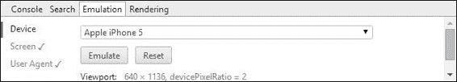

# 第八章。使用 Less 的媒体查询

现在我们已经看到如何使用 Less 来管理我们内容的显示，那么确保它适合页面呢？啊，是的——这不是媒体查询发挥作用的地方吗……？

在智能手机出现之前，大多数网站都会以固定宽度构建——足够小，可以适应笔记本电脑或 PC，这样大多数最终用户都会有一个一致的经验。

然而，现在越来越多的人使用移动设备，设计可以在每个设备上无缝查看的内容的需求增加了。那些需要具备外科医生技能才能查看内容、操作移动设备的时代已经过去了——人们越来越习惯于在移动设备上查看内容。

我们如何解决这个问题？简单——欢迎来到媒体查询的世界！响应式网页设计的一个基本组成部分，我们可以使用媒体查询来构建一个可以在多个平台上无缝查看的网站。

我想你可能在想——Less 如何在这里帮助？没问题。在本章中，我们将看到 Less 如何使创建媒体查询变得轻而易举；我们将涵盖以下主题：

+   媒体查询的工作原理

+   CSS 有什么问题？

+   设置客户端标准

+   使用 Less 构建媒体查询

准备好享受创建媒体查询的乐趣了吗？让我们开始吧！

# 介绍媒体查询

如果你曾经花时间为网站创建内容，尤其是为移动平台显示的内容，那么你可能已经遇到过媒体查询。

对于那些刚开始接触这个概念的人来说，媒体查询是一种在视口调整到更小尺寸时定制屏幕上显示内容的方法。从历史上看，网站总是以静态尺寸构建——随着越来越多的人使用智能手机和平板电脑查看内容，这意味着查看它们变得更加困难，因为滚动页面可能是一个令人疲惫的过程！

幸运的是，随着媒体查询的出现，这个问题变得不那么严重了——它们帮助我们确定在特定设备上查看内容时应该显示或不应显示的内容。在本章中，我们将简要地看看它们是什么，它们是如何工作的，并更多地关注如何使用 Less 来创建它们。

几乎所有现代浏览器都提供对媒体查询的原生支持——唯一的例外是 IE 版本 8 或以下，其中它不支持原生：


媒体查询始终以`@media`开头，并包含两部分：


第一部分，`only screen`，确定规则应该应用的媒体类型——在这种情况下，只有在我们查看屏幕上的内容时才会显示该规则；打印时查看的内容可以很容易地不同。

第二部分，或媒体特性，`(min-width: 530px) and (max-width: 949px)`，意味着规则将只应用于最小为`530px`和最大为`949px`的屏幕尺寸。这将排除任何智能手机，并将适用于更大的平板电脑、笔记本电脑或 PC。

### 注意

实际上，有数十种媒体查询的组合来满足各种需求——为了找到一些好的例子，请访问[`cssmediaqueries.com/overview.html`](http://cssmediaqueries.com/overview.html)，在那里你可以看到一个详尽的列表，以及是否在你通常使用的浏览器中受支持。

媒体查询非常适合动态调整你的网站以在多个浏览器中工作——实际上，它们是响应式网页设计的一个基本组成部分。虽然浏览器支持媒体查询，但有一些限制我们需要考虑；让我们现在看看这些限制。

# CSS 的限制

如果我们花时间与媒体查询一起工作，有一些限制我们需要考虑；这些限制同样适用于我们使用 Less 或纯 CSS 编写时：

+   并非每个浏览器都均匀支持媒体特性；为了看到差异，请使用不同的浏览器访问[`cssmediaqueries.com/overview.html`](http://cssmediaqueries.com/overview.html)。

+   当前的观点是必须提供一系列断点；这可能导致大量重复，并且需要不断与众多不同的屏幕尺寸保持同步！

+   `@media` 关键字在 IE8 或更低版本中不受支持；你需要使用 JavaScript 或 jQuery 来实现相同的结果，或者使用像 **Modernizr** 这样的库来提供一个优雅的回退选项。

+   编写媒体查询将使你的设计绑定到特定的显示尺寸；这增加了重复的风险，因为你可能希望相同的元素在多个 **断点** 中出现，但必须编写单独的规则来覆盖每个断点。

### 注意

断点是设计在调整大小超过特定尺寸时将断裂的点。

传统的思维是，我们必须在样式表中为不同的断点提供不同的样式规则。虽然这是有效的，但讽刺的是，这正是我们不应该遵循的！原因在于，你可能需要添加大量的断点规则，只是为了管理一个网站。

通过谨慎的计划和基于设计的断点思维，我们通常可以减少规则的数量。正如你将在本章末尾的示例中看到的那样，只有一个断点被给出，但它可以在一系列尺寸中工作，而无需更多的断点。这个过程的关键是从小开始，然后增加显示的大小。一旦它破坏了你的设计（这就是你的第一个断点），就添加一个查询来修复它，然后，继续这样做，直到你达到最大尺寸。

好的，我们已经看到了媒体查询是什么；让我们改变方向，看看在与客户合作时需要考虑什么，然后再着手编写代码中的查询。

# 设置客户标准

与媒体查询一起工作的最难的部分不在于代码的设计，而在于与客户就应支持哪些设备达成一致！

一些客户可能希望在他们的网站上获得一致的经验，无论使用什么设备或平台来查看内容。当互联网仍然在正常尺寸的屏幕上查看时，这可能有效。现在情况已经不再是这样了；越来越多的人正在移动或其他类似设备上查看内容。移动设备的使用如此之多，以至于其数量正在迅速增加，很快就会超过仍然使用台式电脑查看内容的人。

“期望是所有心痛的根源”（出自匿名来源，但常被误引为莎士比亚所说），这句话特别恰当——它在决定每个断点应该包含什么内容以及不应该包含什么内容时是关键；如果不这样做，你更有可能在与客户的交流中遇到麻烦！

在构建客户网站的过程中创建媒体查询时，有一些关键点需要记住，这些将成为与客户交谈的基础：

+   在开始时，向客户清楚地解释响应式设计的概念——使内容适应特定的屏幕尺寸。让他们明白，网站在移动设备上不显示所有内容是完全可接受的实践。

+   如果希望在所有设备上都有相同的体验，那么这自然会增加大量的代码并需要额外的资源——这是绝对必要的吗？与客户合作创建可以在同一网站上工作但不是每个设备都会显示的内容，这要好得多。

+   向客户明确说明在每个断点应该包含什么内容以及不应该包含什么内容——他们可能希望显示诸如条款和条件等内容，但如果内容过长，可能会让移动用户对查看网站感到厌烦。

+   如果客户难以理解响应式设计的整体概念，那么让他们在移动设备上查看他们的网站——他们应该看到它看起来很糟糕。移动设备更适合内容而不是交互或搜索——媒体查询可以在屏幕上隐藏这些元素。

+   一种更激进的方案是限制在移动设备上可以执行的操作——这对于航空公司网站来说效果完美，因为它们可能只想让客户预订机票或检查他们的预订。这需要前期做更多工作来默认隐藏更多元素，但为了制作一个干净、快速且在移动设备上运行良好的网站，这些努力是值得的。

+   从技术角度来看，确定在特定断点上哪些元素可以缩放、移动、省略或甚至折叠在屏幕上至关重要。还应考虑在移动环境中使用时其他元素，例如使用的交互形式、字体大小调整和图像裁剪。

需要与客户达成一致的一个关键问题是——网站应该适用于多种设备，还是仅在屏幕大小调整且元素在特定点断裂时才工作？有一种新兴的观点认为，我们无法支持所有设备，我们只需尝试调整屏幕大小，然后在调整过程中修复在特定点断裂的任何元素。当然，我们可以使用 Chrome 或 Opera 中可用的仿真功能——即使这样做，我们仍然无法为所有设备提供支持！

好的，让我们继续，并将注意力转向创建媒体查询；在我们编写代码之前，我们将快速回顾一下创建查询时可用选项。

# 探索媒体查询

当创建媒体查询时，我们已经看到了它们分为两部分——第一部分由一个媒体类型组成，它定义了媒体查询应该应用的环境（即屏幕或打印）。需要注意的是，这些都不是 Less 特有的——它们都是我们可以使用 Less 创建媒体查询的有效 CSS 媒体类型。

## 定义媒体类型

虽然我们可能只需要在创建 Less 代码时使用打印或屏幕，但还有其他选项可用；以下是一个完整的元素列表，这些元素可能或可能不被所有浏览器支持：

| 特性 | 适用于 |
| --- | --- |
| `all` | 大多数设备；这是默认值，除非有其他指定 |
| `braille` | 在盲文触觉设备中使用 |
| `embossed` | 分页式盲文打印机 |
| `handheld` | 手持设备，屏幕尺寸小且带宽有限 |
| `print` | 在打印预览模式下查看的内容 |
| `projection` | 使用投影仪等设备时的投影演示 |
| `screen` | 彩色计算机屏幕 |
| `speech` | 与语音合成器一起使用 |
| `tty` | 使用固定间距字符网格的媒体，例如终端或电传打字机 |
| `tv` | 与电视设备一起使用，具有低分辨率、彩色、有限的滚动和声音 |

# 探索媒体特性

一旦设置了媒体类型，我们还需要设置应该测试的媒体特性；如果媒体查询可以匹配媒体显示的设备类型和正在测试的特性，它将返回 true。

媒体特性分为三个类别——视觉和触觉媒体、位图媒体和电视。让我们看看视觉和触觉媒体可用的完整选项列表：

| 特性 | 值 | Min/max 前缀 | 描述 |
| --- | --- | --- | --- |
| `width` | `Length` | Yes | 这给出了显示区域的宽度 |
| `height` | `Length` | Yes | 这给出了显示区域的高度 |
| `device-width` | `Length` | Yes | 这给出了设备区域的宽度 |
| `device-height` | `Length` | Yes | 这给出了设备区域的高度 |
| `color` | `整数` | 是 | 这是每个颜色组件的位数（如果不是彩色，则值为 `0`） |
| `color-index` | `整数` | 是 | 这是输出设备颜色查找表中的条目数 |
| `monochrome` | `整数` | 是 | 这是单色帧缓冲区每像素的位数（如果不是单色，则值为 `0`） |
| `grid` | `0 或 1` | 否 | 如果设置为 `1`，则设备基于网格，例如电传终端或只有一种固定字体的电话显示屏（所有其他设备为 `0`） |

第二个类别是位图媒体类型；以下是完整的列表：

| 特性 | 值 | 最小/最大前缀 | 描述 |
| --- | --- | --- | --- |
| `orientation` | `纵向` 或 `横向` | 否 | 这给出了设备的方向 |
| `aspect-ratio` | `比例 (w/h)` | 是 | 这给出了宽度和高度的比例，以两个整数表示，并用斜杠分隔（例如，`16/` `9`） |
| `device-aspect-ratio` | `比例 (w/h)` | 是 | 这是设备宽度与设备高度的比例 |
| `resolution` | `分辨率` | 是 | 这给出了输出设备的像素密度，以整数后跟 `dpi`（每英寸点数）或 `dpc m`（每厘米点数）表示 |

第三和最后一个类别只有一个媒体类型——这是 `scan`，用于电视设备：

| 特性 | 值 | 最小/最大前缀 | 描述 |
| --- | --- | --- | --- |
| `scan` | `渐进式` 或 `交错式` | 否 | 电视设备使用的扫描过程 |

在大多数情况下，在创建媒体查询时指定单个媒体类型和特性就足够了——会有一些情况我们需要在一个查询中检查多个特性或类型。

幸运的是，Less 可以通过使用逻辑运算符轻松处理这个问题——让我们花一点时间回顾一下创建媒体查询时可用选项：

## 使用逻辑运算符

当我们开始构建更复杂的查询时，会有一些情况需要在一个媒体查询中对多个标准进行检查。Less 可以轻松处理这个问题。在我们查看如何将所学知识付诸实践之前，让我们花一点时间回顾一下可用的运算符：

| 运算符 | 用于 |
| --- | --- |

| `and` | 将多个媒体特性组合在一起，或将媒体特性与其他媒体类型组合。例如：

```js
@media tv and (min-width: 700px) and (orientation: landscape) { ... }
```

|

| `comma` | 如果逗号分隔的查询列表中的任何一个返回 `true`，则应用一组样式：

```js
@media (min-width: 700px), handheld and (orientation: landscape) { ... }
```

|

| `not` | 如果媒体查询原本会返回 `false`，则返回 `true`，例如，`@media not all and (monochrome) { ... }` 会返回 `@media not (all and (monochrome)) { ... }` |
| --- | --- |
| `only` | 阻止不支持媒体查询的浏览器应用样式（假设尚未实现回退支持） |

好的，我们已经涵盖了媒体查询的理论；让我们把注意力转向构建一些查询！

# 设计媒体查询

到目前为止，我们已经了解了媒体查询是什么，可用的选项，以及帮助我们确定需要支持哪些设备的客户。在这个过程中，我们需要确定如何将这些需求转化为实际的代码。

为了帮助做到这一点，让我们通过一个简单的示例来操作。在这个例子中，我们需要创建一个简单的文本块，将编辑器列表显示在文本的左侧。当然，这有点牵强，但它完美地展示了我们如何在不同的设备上变化内容。

## 创建一个简单示例

要了解媒体查询是如何工作的，最好的方式是通过一个简单的演示。在这个例子中，我们有一组简单的需求，关于在每个尺寸下应该显示什么：

+   我们需要为四种不同大小的内容提供支持

+   小版本必须以纯文本电子邮件链接的形式显示给作者，没有任何装饰

+   对于中等尺寸的屏幕，我们将在链接前添加一个图标

+   在大屏幕上，我们将在电子邮件链接后添加电子邮件地址

+   在超大屏幕上，我们将结合中等和大型断点，因此将显示图标和电子邮件地址

在所有情况下，我们都会有一个简单的容器，其中将包含一些占位文本和编辑器列表。我们创建的媒体查询将控制编辑器列表的显示外观，这取决于用于显示内容的浏览器窗口大小。

让我们从下载并解压书籍附带的代码下载中的`simple.html`副本开始。这包含我们将用于创建页面的标记。

接下来，将以下代码添加到一个新文档中。我们将逐节进行讲解，从为媒体查询创建的变量开始：

```js
@small: ~"(max-width: 699px) and (min-width: 520px)";
@medium: ~"(max-width: 1000px) and (min-width: 700px)";
@large: ~"(min-width: 1001px)";
@xlarge: ~"(min-width: 1151px)";
```

接下来是一些基本的样式，用于定义边距、字体大小和样式：

```js
* { margin: 0; padding: 0; }
body { font: 14px Georgia, serif; }
h3 { margin: 0 0 8px 0; }
p { margin: 0 25px }
```

我们需要为演示中的每个区域设置大小，所以请添加以下样式：

```js
#fluid-wrap { width: 70%; margin: 60px auto; padding: 20px; background: #eee; overflow: hidden; }
#main-content { width: 65%; float: right; } 

#sidebar {
  width: 35%; float: left;
  ul { list-style: none; }
  ul li a { color: #900; text-decoration: none; padding: 3px 0; display: block; }
}
```

现在基本样式已经设置好了，我们可以添加我们的媒体查询——从为小屏幕服务的查询开始，我们只需显示一个电子邮件标志：

```js
@media @small {
  #sidebar ul li a { padding-left: 21px; background: url(../img/email.png) left center no-repeat; }
}
```

中等查询接下来；在这里，我们在电子邮件地址前添加单词`Email`：

```js
@media @medium { 
  #sidebar ul li a:before { content: "Email: "; font-style: italic; color: #666; }
}
```

在大媒体查询中，我们改为首先显示名称，然后是电子邮件（后者从`data-email`属性中提取）：

```js
@media @large {
  #sidebar ul li a:after { content: " (" attr(data-email) ")"; font-size: 11px; font-style: italic; color: #666; }
}
```

我们以超大查询结束，在这里我们使用大媒体查询中显示的电子邮件地址格式，但向其中添加一个电子邮件标志：

```js
@media @xlarge {
  #sidebar ul li a { padding-left: 21px; background: url(../img/email.png) left center no-repeat; }
}
```

将文件保存为`simple.less`。现在我们的文件已经准备好了，让我们在浏览器中预览结果。为此，我建议您在 Firefox 中使用**响应式设计视图**（通过按*Ctrl* + *Shift* + *M*激活）。一旦激活，调整视图大小为 416 x 735；在这里我们可以看到只有名称被显示为电子邮件链接：


将大小增加到 544 x 735 会添加一个电子邮件标志，同时仍然保持之前相同的名称/电子邮件格式：


如果我们进一步增加到 716 x 735，电子邮件标志将变为单词**Email**，如下面的截图所示：


让我们进一步将大小增加到 735 x 1029；格式再次改变，变为名称/电子邮件链接，后面跟着括号中的电子邮件地址：


在我们的最终更改中，将大小增加到 735 x 1182。在这里，我们可以看到之前使用的样式，但增加了电子邮件标志：


这些截图完美地说明了您如何调整屏幕大小，同时仍然为每个您决定支持的设备保持合适的布局；让我们花点时间考虑代码是如何工作的。

对于开发者来说，通常接受的实践是“从移动开始”，或者创建最小的视图使其完美，然后增加屏幕大小并调整内容，直到达到最大尺寸。这对于新网站来说效果很好，但如果要将移动视图添加到现有网站，则可能需要反转这个原则。

在我们的例子中，我们首先为全尺寸屏幕生成了内容。从 Less 的角度来看，这里没有什么新东西——我们使用了`#sidebar`div 的嵌套，但除此之外，这部分代码的其余部分都是标准的 CSS。

奇迹发生在两个部分——立即在文件顶部，我们设置了一系列 Less 变量，这些变量封装了我们查询中使用的媒体定义字符串。在这里，我们创建了四个定义，从`@small`（适用于`520px`到`699px`之间的设备），一直到`@xlarge`（宽度为`1151px`或更多）。

然后，我们将每个变量用于每个查询中适当的位置，例如，`@small`查询设置如下所示：

```js
@media @small {
  #sidebar ul li a { padding-left: 21px; background: url(../img/email.png) left center no-repeat; }
}
```

在前面的代码中，我们有标准的 CSS 样式规则来在名称/电子邮件链接之前显示电子邮件标志。其他每个查询都遵循完全相同的原则；它们在通过 Less 运行时将编译为有效的 CSS 规则。

现在我们已经看到了如何使用 Less 构建媒体查询，值得花点时间来探索如何最好地查看我们的演示。虽然可以争辩说简单地调整浏览器窗口大小可能就足够了，但我们还可以更进一步，利用一系列工具来帮助这个过程。

# 使用工具调整屏幕大小

在上一节中，我们查看了一个创建媒体查询的简单示例，用于在调整编辑器列表大小时显示或隐藏元素。我们使用了 Firefox 的**响应式设计视图**选项来调整屏幕大小；这是我们用来干净地调整屏幕以供移动查看的一个选项；它是处理媒体查询的一个关键工具。

您可以使用特殊工具来完成此目的，但大多数现代浏览器已经内置了用于此目的的完全足够的工具。让我们依次看看几个。

对于 Firefox 用户，按下 *Ctrl* + *Shift* + *M* 来激活**响应式设计视图**，如下面的截图所示：


然而，如果你的首选是谷歌 Chrome，那么同样的功能也是可用的——它是开发者工具集的一部分，可以通过按下 *Ctrl* + *Shift* + *I* 来激活：


如果你是一名 Opera 用户，那么有一个专门的 Opera 移动模拟器，可在[`www.opera.com/developer/mobile-emulator`](http://www.opera.com/developer/mobile-emulator)找到，支持 Windows、Mac 和 Linux 平台：


如果你需要使用 IE 以响应式格式显示你的网站，那么很遗憾，你的选择相当有限——至少是 IE10。IE 有一个**调整大小**选项（如下面的截图所示），但它调整的是整个窗口，而不是在正常大小的窗口内显示视图：


这不是完美的选择，但最佳实践是在更符合标准的浏览器（如谷歌 Chrome 或 Firefox）中进行开发。然后我们可以对 IE 进行任何调整，以便稍后进行。

### 小贴士

值得注意的是，如果使用 IE11，则可以设置为以类似于谷歌 Chrome 的方式工作。我们可以设置模拟模式以在大型/完整大小的浏览器窗口中显示一个小窗口。

如果你不想使用内置的浏览器工具，那么还有其他工具可供选择。两个值得注意的工具是 Brad Frost 的 ish，可在[`bradfrostweb.com/demo/ish/`](http://bradfrostweb.com/demo/ish/)找到，以及 Malte Wassermann 的 Viewport Resizer，可在[`lab.maltewassermann.com/viewport-resizer/`](http://lab.maltewassermann.com/viewport-resizer/)找到。

让我们现在改变焦点，将注意力转向构建更深入的东西，我们可以使用 Less 在更真实的例子中。

## 构建响应式页面

向任何网站添加媒体查询都是可能的；关键是决定你想要支持哪些断点以及在每个断点应该显示哪些元素。这可以少到只有一个断点，也可以很多。这完全取决于元素在调整大小时会发生什么，以及你是否需要修改代码以在特定断点改善它们的显示效果。

现在我们已经看到了基本媒体查询的实际应用，我们将创建一个更复杂的东西，形式为一个基本的欢迎页面，这样的页面在作品集中也不会显得突兀。我们将从基本的完整页面开始，其外观可能类似于以下截图：


这是一个非常简单的页面，仿佛它是作品集网站的一部分。这是一个完美的机会来探索我们如何使用一些简单的媒体查询来调整页面以适应移动平台。

## 构建基本页面

让我们从提取本书附带的代码下载中的 `responsive.html` 文件副本开始。这个文件包含一个简单的演示页面，设置为看起来可以成为个人作品集网站的前页。将此文件保存到你的项目文件夹中。

我们还需要 `reset.less` 文件的副本，它也在相同的代码下载中；请将其提取到项目文件夹中。这提供了一些基本的样式重置，以模拟在创建用于在网站上显示的页面时可能发生的情况。

### 注意

为了本演示的目的，我将假设你正在使用 Sublime Text，它预先配置为在保存内容时将 Less 文件编译成有效的 CSS。

接下来，打开你选择的文本编辑器并添加以下代码；我们将逐节详细讲解。我们首先设置一些基本样式，以定义页面内的每个区域：

```js
#wrapper { width: 96%; max-width: 45rem; margin: auto; padding: 2%; } 
#main { width: 60%; margin-right: 5%; float: left; }
aside { width: 35%; float: right; }
a { text-decoration: none; text-transform: uppercase; }
a, img { border: medium none; color: #000000; font-weight: bold;
    outline: medium none;}
```

接下来，我们需要为我们的页眉定义一些样式。这是我们将在调整页面到较小屏幕时被替换的元素之一：

```js
header {
  font-family: 'Droid Sans', sans-serif;	
  h1 { height: 70px; float: left; display: block; font-weight: 700; font-size: 2.0rem;}
  nav { 
  float: right; margin-top: 40px; height: 22px; border-radius: 4px; 
  li { display: inline; margin-left: 15px; }
  ul { font-weight: 400; font-size: 1.1rem; }
  a { 
    padding: 5px 5px 5px 5px; 
    &:hover { background-color: #27a7bd; color: #ffffff; border-radius: 4px; }
  }
  }
}
```

剩下的两个基本样式涵盖了屏幕调整大小时出现的**跳转到主要内容**链接以及屏幕上的主图像：

```js
#skipTo {
display: none;
  li { background: #197a8a; }
  a { color: #ffffff; font-size: 0.8rem; }
}

#banner {
  float: left; margin-bottom: 15px; width: 100%;
  img { width: 100%; }
}
```

将文件保存为 `responsive.less`。如果我们浏览器的结果，我们将看到类似于本例开头所示截图的内容。

然而，如果我们使用像 Firefox 中的响应式设计视图这样的工具调整浏览器窗口大小，它将开始破坏设计——工具栏丢失标签，页眉有一个很大的间隙，图像的右侧已经被裁剪，如下面的截图所示：


我们可以通过添加一个媒体查询来解决这个问题，以管理屏幕调整大小时发生的情况。让我们看看这个在实际操作中是如何工作的。

## 添加响应式查询

我们已经为我们的作品集页面设置了基本样式，并且可以清楚地看到，当页面调整大小时，元素开始断裂。让我们通过添加媒体查询来修复这个问题，重新定义屏幕调整大小时发生的情况。

首先，在 `responsive.less` 文件的头部添加以下内容：

```js
@mobile: ~"screen and (max-width: 30rem)";
```

接下来，我们需要添加在移动平台上使用时将激活的替换样式。在 `responsive.less` 中的 Less 样式下方，请添加以下代码，从控制页面顶部出现**跳转到主要内容**按钮的样式开始：

```js
@media @mobile {
  #skipTo { 
  display: block; 
  a { 
    display: block; padding: 10px; text-align: center; height: 20px; 
  &:hover { background-color: #27a7bd; border-radius: 0px; height: 20px; }
    }
  }
```

接下来是调整主内容区域、侧边栏和页眉所需的样式：

```js
  #main, aside { float: left; clear: left; margin: 0 0 10px; width: 100%; }
 #banner { margin-top: 150px; }
  header h1 { margin-top: 20px; }
```

最后，我们需要修改用于重新定义导航选项的样式，当页面调整大小时，这些选项现在会显示为按钮堆叠列表：

```js
  header nav{
  float: left; clear: left;margin: 0 0 10px; width: 100%;
  li { margin: 0; background: #efefef; display: block; margin-bottom: 3px; height: 40px; }
  a { 
    display: block; padding: 10px; text-align: center;
  &:hover { background-color: #27a7bd; border-radius: 0px; padding: 10px; height: 20px; }
    }
  }
}
```

将文件重新保存为 `responsive.less`。如果你使用 Sublime Text 作为编辑器，它将将其转换为编译后的 CSS 文件。现在让我们在浏览器中预览结果：


在全尺寸时，不会有任何变化（这是预期的），但当页面大小调整时，我们已经在页面上看到了改进。标题已经被重新定位，以减少其下方的间隙，工具栏已经被重置以显示为按钮，图片已经被调整大小以更好地适应页面，内容已经被重新定位为垂直格式。我们还可以看到添加了一个按钮，允许我们跳转到页面上的主要内容。

极好，我们的页面现在在移动设备上的外观和功能正如我们所期望的那样！如果我们增加或减小浏览器窗口的大小，我们可以看到内容根据我们在`responsive.less`中创建的媒体查询重新流动以适应可用空间。

那么，是什么魔法让这一切都工作得如此顺利？从我们使用的代码来看，如果你认为这部分的全部代码都是关键，你可能会被原谅。这是一个完全有效的陈述。毕竟，所有这些样式都是必需的，以确保在移动环境中使用时内容被正确放置。

然而，实际上我们只使用了两个关键语句：`@mobile: ~"screen and (max-width: 30rem)"`；和`@media @mobile {…}`。

（好吧，我稍微作弊了一下，但只多了一个字符！）

第一个语句是一个 Less 变量，我们将其设置为我们的媒体类型和我们将要测试的功能。第二个语句调用该变量作为测试。介于两者之间的所有内容都是标准的 CSS 样式，并且在使用于在移动设备上显示内容时被用来重新设计页面布局。

在这个例子中，我们使用了一张大图片，其宽度被设置为`width: 100%`。虽然当页面大小减小或增加时，它将完美地调整大小，但这仍然意味着我们可能在小型设备上加载了一个大图片——这不是一个好主意！我们可以通过要求浏览器根据应用的媒体查询加载不同版本的图片来改进这一点。让我们看看 Less 如何帮助减轻管理此过程的一些负担。

## 添加响应式图片

如果你拥有一台移动设备，比如平板电脑或智能手机，请举手？如果你有，那么你可能会看到当页面没有针对移动使用进行缩放时，页面加载需要多长时间。

在我们刚刚工作的例子中，我们将`#banner img`的宽度设置为 100%；在大多数情况下，这将完美地工作；这也意味着我们正在加载一张大照片，这在移动设备上并不理想！相反，我们可以简单修改我们的媒体规则，在屏幕尺寸减小时加载一个较小的图片。

### 注意

对于这个演示，我将摘要图片的一个副本调整到较小的 461px x 346px 版本，并保存为`abstract_small.jpg`。这个尺寸足够小，当屏幕适当地调整到更小的尺寸时，我们可以看到变化的效果。

让我们从下载并提取本书代码下载中的`responsive.html`和`responsive.less`的副本开始，然后分别保存为`responsive_img.html`和`responsive_img.less`。

打开`responsive_img.html`，然后修改如所示行：

```js
<link href="css/reset.less" type="text/less" rel="stylesheet">
<link rel="stylesheet/less" href="css/responsive_img.less">

```

接下来，按照指示将高亮行添加到媒体查询中：

```js
  #banner { 
  margin-top: 150px; 
 img { content:url("../img/abstract_small.jpg"); }
  }
```

保存两个文件。如果我们然后在浏览器中预览结果，您应该看不到任何可见的变化（这是我们预期的）。然而，如果我们打开浏览器中的开发者工具并缩小屏幕尺寸，我们会看到图像的 URL 有所变化：


这种方法的优点是我们可以节省几 KB，这使得在移动设备上查看网站更快，因为浏览器需要下载的内容更少。然而，我们可以通过用高分辨率版本替换图像来走完全极端，但前提是设备支持它！感兴趣吗？让我们看看这是如何工作的，使用可从[`imulus.github.io/retinajs/`](http://imulus.github.io/retinajs/)获取的`retina.js` Less 混合器。

## 集成图像视网膜支持

在上一个示例中，我们看到了如何轻松调整我们的 Less 代码，以便在屏幕尺寸调整以模拟移动设备时加载较小的图像。

然而，你们中的许多人将拥有具有视网膜支持或能够显示高分辨率图像的设备（如 iPad 或 iPhone），这些图像在其他情况下在普通 PC 上显示效果不佳。我们可以利用 Less 来利用这一点。实际上，已经创建了一个 Less 混合器，我们可以从[`raw.githubusercontent.com/imulus/retinajs/master/src/retina.less`](https://raw.githubusercontent.com/imulus/retinajs/master/src/retina.less)获取它。将此保存为项目文件夹中的`retina.less`。

接下来，我们需要保存我们一直在使用的`abstract.jpg`文件的副本，作为`abstract@2x.jpg`——这将成为我们的高分辨率版本。将原始的`abstract.jpg`文件复制一份，并使用 JPG 压缩器（如来自[`www.jpeg-optimizer.com`](http://www.jpeg-optimizer.com)的在线服务）进行压缩。将压缩版本保存为`abstract.jpg`。

现在我们已经准备好了图像，打开`responsive.html`并修改如所示行：

```js
<link href="css/reset.less" type="text/less" rel="stylesheet">
<link href="css/responsive_hd.less" rel="stylesheet/less">
<script src="img/less.min.js"></script>
```

将此保存为`responsive_hd.html`。接下来，打开`responsive.less`并在文件开头添加此行：

```js
@import "retina.less";
```

然后，在文件末尾添加以下行：

```js
#banner img { .at2x('/images/abstract.png', 200px, 100px); }
```

### 注意

在生产环境中，这更有可能是在媒体查询中——为了演示目的，将其添加到末尾就足够了。

将此保存为`responsive_hd.less`。然后我们可以在浏览器中预览结果。为了获得最佳效果，我建议以下操作：

+   使用本地 Web 服务器或在线 Web 空间预览结果——一个值得尝试的本地 Web 服务器是 WAMP ([`www.wampserver.de`](http://www.wampserver.de) for Windows) 或 MAMP ([`www.mamp.info`](http://www.mamp.info) for MAC)。

+   如果可能，如果你无法通过视网膜屏设备在线查看结果，尝试在 Google Chrome 中查看结果。Google Chrome 具有模拟不同设备的能力；如果我们启用此功能并将其设置为显示 iPhone 5，例如：

    我们可以清楚地看到已经进行了更改：

    

虽然网页布局不应该有实质性的变化，但使用这个技巧意味着当设备支持时可以使用更高分辨率的图像，或者在不支持视网膜屏的设备上替换为标准分辨率图像。

要测试设备是否支持这里使用的**device-pixel-ratio**测试，请浏览到[`www.quirksmode.org/css/mediaqueries/devicepixelratio.html`](http://www.quirksmode.org/css/mediaqueries/devicepixelratio.html)。例如，当使用 iPad 进行测试时，我们可以确认`webkit-device-pixel-ratio`是支持的：


让我们继续这个主题，通过查看使用 Less 处理媒体查询时可用哪些外部库来继续使用外部库。

# 使用预构建的库

到目前为止，我们已经介绍了使用 Less 创建媒体查询的基础——这时你可能正在想，“当然，我们可以使用预构建的库来帮助我们，对吧……？”

嗯，在这种情况下，很遗憾我们没有可用的预构建库；我们必须手动构建每个查询！这并不是坏事，因为如果不小心，媒体查询可能会被视为一种折衷方案，这可能导致代码膨胀。要为所有断点提供支持将非常困难，甚至几乎是不可能的。每个项目都需要支持特定的断点集，而这些断点对于每个网站来说可能并不相同。

此外，媒体查询在所有现代浏览器中都是原生支持的；唯一的例外是 IE，其中版本 8 或以下不支持。为了解决这个问题，有三个选项：

+   我们可以使用 Mike Morici 创建的回退库 media-query-to-type，我们可以从[`github.com/himedlooff/media-query-to-type`](https://github.com/himedlooff/media-query-to-type)下载它。这个库将媒体查询转换为媒体类型，这些类型支持回退到 IE6。

+   或者，我们可以使用 Modernizr（来自[`www.modernizr.com`](http://www.modernizr.com)）来检测媒体查询的使用情况。

+   另一个可以使用的库是 Respond.js，由 Scott Jehl 创建，可在[`github.com/scottjehl/Respond`](https://github.com/scottjehl/Respond)获取。这是一个有效的即插即用库，可以将大多数媒体查询转换为 IE8 或以下版本可以理解的格式。

尽管本章是关于使用 Less 创建媒体查询的，但考虑应该支持哪些浏览器以及你愿意走多远以使媒体查询在旧浏览器（如 IE6 到 8）中工作仍然很重要。

### 注意

为了保持清晰，我们可以使用条件技巧，仅在检测到 IE9 或以下版本已被使用时才加载 media-query-to-type 或 Respond.js 库：

```js
#<!--[if lt IE 9]>….<![endif]-->
```

虽然在某些方面我们可能觉得有义务在所有情况下（包括旧 IE）提供相同的环境，但这并不一定是一项值得做的练习；对少量浏览器提供良好的支持比大量浏览器的平均支持要好！

# 摘要

媒体查询迅速成为响应式网页设计的既定事实。在本章中，我们看到了如何使用 Less 使代码中的管理过程更加容易。

我们通过一个简要介绍开始了对媒体查询的旅程，随后回顾了一些我们必须解决的限制以及在与客户合作时需要考虑的注意事项。

接下来，我们对在 Less 中使用时可以使用的媒体类型和功能进行了简要探索；我们查看了一些逻辑运算符，这些运算符也可以用来创建测试多个类型或功能的查询。然后，我们介绍了如何创建一个简单的媒体查询，快速浏览了如何在浏览器中最佳地显示响应式视图，在继续讨论一个演示作品集中单页的更实际示例之前。我们看到了如何首先创建我们的基本页面，然后添加必要的代码将其转换为响应式页面。

然后，我们简要地探讨了如何通过首先使其更具响应性，然后在支持并启用视网膜的情况下切换到显示高分辨率图像来改进页面上的图像。然后，我们通过查看在处理 Less 时可以使用的预构建库来结束本章。

在下一章中，我们将转向一些 Less 的更实际用途，探讨在 CMS（如 WordPress）中使用 Less。
