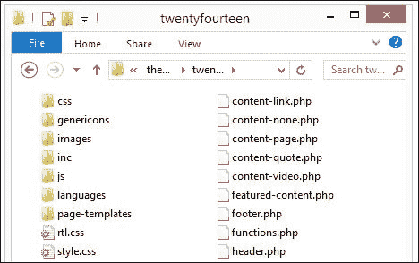
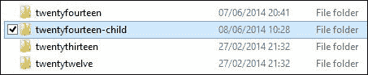
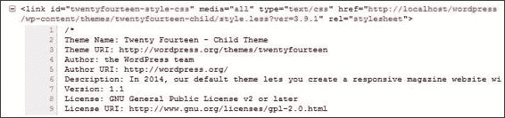
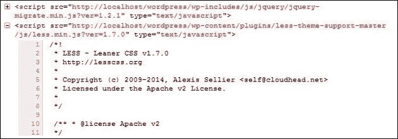
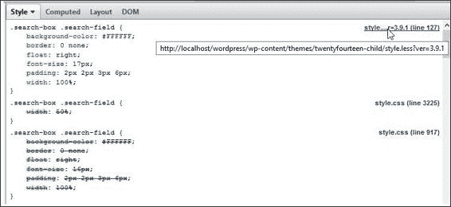
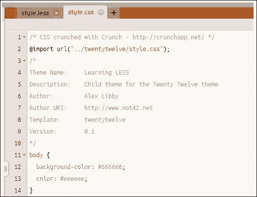
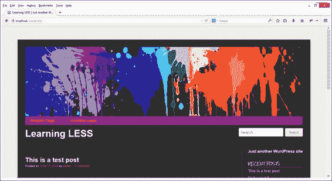
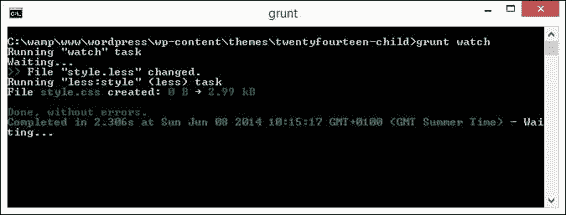
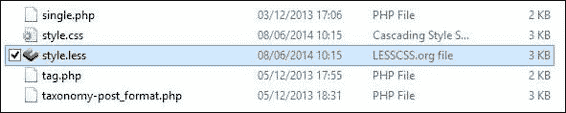

# 第九章。在 CMS 中使用 Less

在 CMS 中工作……啊，选择，选择……！

问题：以下哪些有共同之处——Facebook、Beyoncé、Sony、达拉斯小牛 NBA 篮球队和《时代》？

解决了这个问题吗？嗯，这是我们学习 Less 旅程中下一章的主题。他们都有使用 WordPress 创建的博客或网站！WordPress 创建于 2003 年，已成为世界上知名的内容管理系统平台之一，用于数十种场景，从简单的博客到完整的电子商务系统。

在接下来的几页中，我们将学习如何将我们最喜欢的 CSS 预处理器集成到 WordPress 中，以及我们可以使用的技巧来帮助简化样式表的创建。最好的部分——大多数都是我们在本书中已经介绍过的技巧；我们只是将它们应用到我们使用的地方。

在本章中，我们将涵盖以下主题：

+   WP 主题结构的概述

+   将 Less 集成到页面中

+   将代码转换为使用 Less 的一些示例

+   使用 Less 为 WP 预构建的主题

+   可用于与 WordPress 一起使用 Less 的插件

+   使用 Grunt 帮助在 WP 中开发 Less

好奇吗？让我们开始吧...！

### 注意

本章将假设您对 WordPress 主题设计有一定程度的熟悉；如果您是 WordPress 的新手，您可能想浏览一下 Packt Publishing 出版的关于 WordPress 主题设计的几本书。

# 介绍 WP 主题结构

如果您花过时间与 CMS 系统一起工作，那么您可能已经遇到了使用主题来定制您的网站和根据需要添加或删除功能的概念。

WordPress 也不例外；它使用一套主题来定制其外观；在本章中，我们将遵循这一原则，看看我们如何使用 Less 来帮助简化这个过程。在我们开始编写代码之前，花一点时间来检查 WordPress 主题的结构是值得的。

首先，我们需要下载 WordPress 源文件，这些文件可在[`wordpress.org/latest.zip`](http://wordpress.org/latest.zip)找到；在撰写本文时，最新版本是 3.9.1。当我们打开 WordPress 存档时，导航到**wp-content** | **themes** | **twentyfourteen**。我们会看到类似以下的内容：



所有这些文件都是操作随本版 WordPress 提供的 Twenty Fourteen 主题所必需的；我们将以此主题为基础，在本章的练习中使用。

我们最感兴趣的是`style.css`文件——这是任何主题的主要样式表。此文件包含在 WordPress 主题选择区域显示的主题信息，我们可以看到诸如主题名称、作者、支持 URL 等详细信息。我们还将使用`functions.php`文件来添加对 Less 的支持，但这将是一个一次性过程，在我们真正开始定制主题之前发生。

# 准备我们的环境

现在我们已经下载了 WordPress，我们需要确保有一个可用的环境来使用 Less。

每个人的环境可能都不同，但要最大限度地利用接下来的练习，您至少需要确保以下内容：

+   一个可以定制的 WordPress 工作副本——理想情况下，这将是在使用类似 WAMP（适用于 Windows，可在 [`www.wampserver.com`](http://www.wampserver.com) 获取）或 MAMP（适用于 Mac，可在 [`www.mamp.info`](http://www.mamp.info) 获取）的 Web 服务器本地托管。或者，您可能有一些在线 Web 空间可供使用——这同样有效，尽管您可能会发现本章末尾的自动化练习难以完成。

+   为了本书的目的，我将假设 WampServer 已安装；如果您的服务器不同，请相应地进行更改。

+   安装 Node.js 和 Grunt 的副本；我们已经在 第二章 *构建 Less 开发工具包* 中介绍了如何安装它们。

+   选择您喜欢的文本编辑器——有数百种可供选择；我个人的偏好是 Sublime Text 2，我将假设您已经安装了它。

如果您尚未安装 WordPress，您可以在 [`codex.wordpress.org/Installing_WordPress`](http://codex.wordpress.org/Installing_WordPress) 找到完整的安装说明。

好的，假设我们已经安装了所需的软件组件，让我们继续并查看如何为使用 Less 准备我们的主题。

# 创建基本子主题

等一下，准备我们的主题？

是的，您读得正确——准备我们的主题。虽然 WordPress 默认附带三个主题可供使用，但直接修改源文件并不是一个好习惯。

修改源文件意味着如果为该主题发布更新，则您的主题将会损坏（是的，WordPress 确实会对其主题发布更新）。我们可以通过创建一个子主题来解决这个问题，该子主题位于同一主题文件夹中，但设置为继承其父主题的基本文件。

这意味着我们可以保留父主题的原始系统文件，但使用在子主题中创建的新样式来覆盖现有样式。我们将在本章后面开始编写新的 Less 代码时充分利用这一原则。

现在，让我们快速浏览创建我们的新子主题：

1.  导航到 **wp-content** | **themes**；在这里，您将看到一个名为 `twentyfourteen` 的文件夹：

1.  创建此文件夹的副本，并将其重命名为 `twentyfourteen-child`。在主题文件夹列表中识别此类主题时，在主题名称末尾附加 `child` 是一个好习惯。

1.  在 `twentyfourteen-child` 文件夹内，打开 `style.css` 的副本，然后删除关闭 `*/` 下的所有内容，并按照以下所示进行替换：

    ```js
    This theme, like WordPress, is licensed under the GPL.
    Use it to make something cool, have fun, and share what you've learned with others.
    */

    @import url("../twentyfourteen/style.css");

    /* =Theme customization starts here
    -------------------------------------------------------------- */

    ```

这就是我们需要做的全部。如果我们浏览到 WordPress 安装中的 **中央管理** 区域，我们将在 **外观** | **主题** 区域看到子主题。剩下的只是以通常的方式激活它。

### 注意

注意，从现在开始，假设所有更改都将直接在子主题中进行，除非另有说明。

# 在 WordPress 中添加 Less 支持

在 WordPress 安装并运行后，是时候将我们的注意力转向添加 Less 支持。

在 WordPress 的旧版本中，通常直接将其添加到 `header.php` 文件中。虽然它工作得很好，但这意味着我们无法在 HTML 内容和表现性标记之间保持清晰的分离。幸运的是，在更近的版本中，WordPress 团队转向使用存储在 `functions.php` 文件中的函数来添加样式表。让我们看看现在如何实现这一点：

1.  打开您选择的文本编辑器，然后浏览到 `twentyfourteen` 主题文件夹，并查找 `functions.php`。在文件底部添加以下代码：

    ```js
    /*
     * Adds support for the Less preprocessor to your theme.
     *
     * @since Twenty Fourteen 1.0
     * @param string $current_user Determines the currently logged in user
     */
    if ( ! function_exists( 'less_enqueue_scripts' ) ) {
        function less_enqueue_scripts() {

            $current_user = wp_get_current_user();

            if ( $current_user->ID == '1' ) {
              wp_enqueue_script( 'lesscss', get_stylesheet_directory_uri() . '/js/less.min.js' );
            }
        }
        add_action( 'wp_enqueue_scripts', 'less_enqueue_scripts' );
    }
    ```

1.  保存更改。如果我们刷新屏幕并在浏览器中预览结果，我们不会看到任何视觉上的变化。然而，如果我们使用 Firebug 等 DOM 检查器预览编译的源代码，我们可以清楚地看到 Less 的添加：

到目前为止，我们已经有一个版本的工作良好的 WordPress，它支持 Less——我们可以继续创建一个名为 `style.less` 的 Less 文件，并将其作为 `style.css` 的替代品放入，对吧…？

## 向特定用户显示更少的样式表

别急。我们告诉了 WordPress 如何调用 Less，但还没有告诉它如何检索正确的 Less 样式集！为了做到这一点，我们需要在 `functions.php` 文件中添加另一个函数；这个函数不仅将包含一个基于 Less 的替换样式表，而且只向管理员显示，并为常规使用显示编译版本。请耐心等待，一切很快就会变得清晰：

1.  打开我们在上一项练习中工作过的 `functions.php` 文件副本。这次，在文件底部添加以下内容：

    ```js
    if ( ! function_exists( 'less_filter_stylesheet_uri' ) ) {
      function less_filter_stylesheet_uri( $stylesheet_uri, $stylesheet_dir_uri ) {
        $current_user = wp_get_current_user();

        if ( $current_user->ID == '1' ) {
          $style_src = $stylesheet_dir_uri . '/style.less';
        } else {
          $style_src = $stylesheet_dir_uri . '/style.min.css';
          return $style_src;
        }
        add_filter( 'stylesheet_uri', 'less_filter_stylesheet_uri', 10, 2 );
    }
    ```

1.  保存文件副本，然后刷新当前显示 WordPress 的浏览器窗口。如果我们像之前一样打开我们的 DOM 检查器，我们现在可以看到正在使用的替换样式表：

如果我们退出 WordPress 并以其他用户身份登录，将显示样式表的编译 CSS 版本。

# 使用插件添加 Less 支持

手动添加代码工作得很好，但过了一段时间就会变得乏味。我们当然可以使用插件使事情变得更简单，对吧？

绝对可以，我们可以使用插件添加对 Less 的支持；有几种方法可以实现这一点，但我的最爱必须是 Justin Kopepasah 创建的插件，可在 WordPress 插件目录[`wordpress.org/plugins/less-theme-support/`](https://wordpress.org/plugins/less-theme-support/)下载。让我们看看如何使用它；安装它真的很简单：

1.  首先导航到[`wordpress.org/plugins/less-theme-support/`](https://wordpress.org/plugins/less-theme-support/)，然后点击**下载版本 1.0.2**。当被提示时，将其保存到 WordPress 安装的`plugins`文件夹中。

1.  在 WordPress 的 admin 中浏览到**插件**区域，然后点击**上传**并选择**less-theme-support.1.0.2.zip**。

1.  点击**立即安装**，然后当被提示时，点击**激活插件**。

到目前为止，插件现在是激活的，我们需要告诉我们的 WordPress 主题如何使用它：

1.  如果我们还没有在之前的练习中这样做，将主题根目录下的`style.css`文件重命名为`style.less`。

1.  启动您最喜欢的文本编辑器并打开位于我们`theme`文件夹根目录的`functions.php`文件的副本。

1.  查找`twentyfourteen_setup()`函数（在第 58 行或附近）并在函数末尾添加以下内容，如图所示：

    ```js
        add_filter( 'use_default_gallery_style', '__return_false' );

        // Add support for Less preprocessor
        add_theme_support( 'less', array('enable' => true ) );
    }
    endif; // twentyfourteen_setup
    ```

保存文件。如果我们回到我们的 WordPress 网站并刷新屏幕，我们应该看不到任何视觉上的变化。真正的变化会在我们查看 DOM 检查器中的代码时显示：



值得注意的是，Less 主题支持附带了一些配置选项，我们可以使用它们来更改其工作方式。如果我们从开发网站切换到生产环境，这非常完美。可以设置的值是布尔值，默认为 false：

+   `Enable`：这启用了 Less 并在前端排队`less.min.js`

+   `Develop`：这启用了 Less 的开发环境并在前端排队`less-develop.js`

+   `Watch`：这启用了 Less 的监视模式并排队`less-watch.js`

+   `Minify`：这启用了在前端对所有其他访客使用压缩样式表（`style.min.css`）（最好使用`lessc -x style.less > style.min.css`生成）

如果使用得当，它们可以非常灵活；例如，我们可能希望配置我们的主题在开发时动态使用 Less，但在生产时不使用：

```js
add_theme_support('less', array(
  'enable'  => true,
  'develop' => true,
  'watch'  => true
));
```

如果我们切换到生产使用，那么我们可能会使用`minify`选项：

```js
add_theme_support( 'less', array(
   'minify' => true
));
```

正如我们所见，这是一个易于配置的插件。如果你在多个网站上使用 Less，通常使用插件来安装 Less 会更好，这样我们就不必深入研究源文件并对其进行编辑。这个练习的关键部分是使用 WordPress 的`add_theme_support`关键字，它允许主题或插件在我们的主题内注册对某些功能的支持。

### 注意

如果你想要了解更多关于 `add_theme_support` 的信息，值得浏览 WordPress Codex 页面 [`codex.wordpress.org/Function_Reference/add_theme_support`](http://codex.wordpress.org/Function_Reference/add_theme_support)。

这允许我们告诉主题使用 Less。我们总是可以手动这样做（正如我们所看到的），但在可能的情况下，使用插件会更好，除非情况要求需要另一种方法。

# 在 WordPress 中使用 Less 主题

现在我们已经设置了 Less 的支持，让我们继续看看在主题中使用 Less 样式可用的选项，无论是在我们自己的创作中，还是作为可在网上销售或下载的预构建主题的一部分。

## 将主题转换为使用 Less

现在我们有了 Less 样式表的基线，我们可以开始添加我们转换的样式。等等，我听到你问，“如果我们正在转换一个像 `TwentyFourteen` 这样的主题，我们应该从哪里开始？”

这是一个非常好的问题。在这个主题当前样式表的 4200 多行中，很容易感到困惑！然而，如果我们遵循两个简单的原则，所有的问题都将开始变得清晰：

+   Less 允许我们将样式表分解成多个文件，这些文件由 Less 编译成一个。利用这一点；这将非常有帮助，因为较小的文件更容易转换！

+   不要试图一次性转换所有内容；一点一点地做。Less 是 CSS 的超集，这意味着它实际上包含了所有的 CSS；Less 会愉快地将未更改的 CSS 样式编译为 `.less` 文件。

在这些原则的指导下，让我们开始转换我们的主题：

1.  首先打开 `TwentyFourteen` 父主题中的 `style.css` 文件副本，并查找第四部分，它从第 831 行或第 926 行开始。

1.  将此部分复制到子主题中的 `style.less` 文件；在此行下方粘贴：

    ```js
    /* =Theme customization starts here
    -------------------------------------------------------------- */

    ```

1.  我们将从将搜索框的正常绿色颜色转换为变量开始，然后使用它来计算悬停时使用的浅绿色颜色。在 `style.less` 中的 `@import` 语句下方立即添加以下内容，如图所示：

    ```js
    @import url("../twentyfourteen/style.css");

    /* Define colors */
    @search-box-color: #24890d;
    @search-box-hover-color: @search-box-color + #333;

    ```

1.  我们接下来要做的更改将是 `.site-title` 样式。我们将将其转换为 Less 的嵌套格式，因此请删除这两个样式：

    ```js
    .site-title { float: left; font-size: 18px; font-weight: 700;
      line-height: 48px; margin: 0; }

    .site-title a, .site-title a:hover { color: #fff; }
    ```

    用以下内容替换之前的两个样式：

    ```js
    .site-title {
      float: left;
      font-size: 18px;
      font-weight: 700;
      line-height: 48px;
      margin: 0;
      a {
        color: #fff;
        &:hover { color: #fff; }
      }
    }
    ```

1.  我们还有机会整合一个 mixin。这次，它将是一个用于 `.search-box-wrapper` 类中使用的 `box-sizing` 样式的替代品。在 `style.less` 文件中查找此类，并按所示修改：

    ```js
    .search-box-wrapper {
      .box-sizing(border-box);
      position: absolute;
      top: 48px;
      right: 0;
      width: 100%;
      z-index: 2;
    }
    ```

1.  在一个单独的文件中，添加以下代码并将其保存为 `mixins.less` 在 `less` 文件夹中：

    ```js
    .box-sizing(@sizing: border-box) {
      -ms-box-sizing: @sizing;
      -moz-box-sizing: @sizing;
      -webkit-box-sizing: @sizing;
      box-sizing: @sizing;
    }
    ```

1.  我们需要将此导入我们的 Less 文件中，所以请继续添加以下行，如指示：

    ```js
    @import url("../twentyfourteen/style.css");
    @import "less/mixins.less";
    ```

1.  最后一步是将子主题中的 `style.css` 文件重命名为 `style.less`；尽管这还不是完全转换，但 Less 仍然会将其编译为有效的 CSS。

在这个阶段，我们现在可以保存我们的工作，然后刷新浏览器窗口，它将显示我们的 WordPress 网站。如果一切顺利，你将看不到任何视觉上的差异。你唯一会看到的不同之处在于通过 DOM 检查器查看编译后的代码，例如 Firebug：

中间那些敏锐的人可能已经注意到了——为什么我们要重复代码，你可能会问？重复代码有一个很好的理由，至少暂时是这样——虽然我们通常不想这样做，但这里的讽刺之处在于我们可以利用这种意外的重复来产生良好的效果，以帮助确认我们的新样式是否正确。

我们从原始父主题的 CSS 文件中复制了`第四部分`并将其复制到我们的子主题中。默认情况下，子主题中的样式会附加到父主题的样式表中。在这种情况下，我们的主题已经附加了重复的样式，正如我们所期望的那样。现在的问题是：我们需要将重复的样式重新工作成 Less 等价物（就像这里所做的那样）。然后我们可以与原始主题进行对比，原始主题由第 917 行的`style.css`指示，以查看我们的 Less 版本是否正确。

如果它是正确的，我们就可以从原始主题中删除它，或者我们可以删除`@import`语句；这打破了与父主题的依赖关系，并将子主题转变为一个独立的主题。

现在我们已经涵盖了转换主题的基础知识，让我们花点时间考虑一些有用的提示，这将帮助我们创建自己的主题。

## 创建我们自己的主题

到目前为止，我们已经花费时间将 WordPress 主题中现有的 CSS 样式转换为使用 Less。虽然这样做效果不错，但完成它需要时间，因为 WordPress 核心主题，例如`TwentyTwelve`或`TwentyFourteen`，有数千行代码！

更合理的方法是创建自己的主题。与其从头开始编写，不如将其创建为子主题，这样就可以覆盖父主题中现有的样式。

### 小贴士

尽管我们在这里使用了一个例子，但详细说明的原则可以用于任何需要创建新主题的实例。

“为什么使用子主题？”你可能会问？这样做有几个很好的理由：

+   你对父主题所做的任何更改，如果 WordPress 团队发布更新，很可能会被破坏。

+   这可以节省你重新定义大量样式的麻烦；你可以集中精力进行关键更改。准备好后，你可以将父主题的样式合并到自己的主题中，并将子主题转换为可以独立使用的主题。

现在我们来看看如何使用 Less 创建一个主题。为了充分利用这个练习，我们需要确保以下几点已经到位：

+   你的 WordPress 安装中安装并激活了`TwentyTwelve`。`TwentyTwelve`的 CSS 样式表比当前的`TwentyFourteen`版本简单；这将使理解过程更容易，并可能鼓励你开始使用较新的主题！

+   `TwentyTwelve`主题的副本已被保存并重新配置为子主题；如果您不确定如何操作，请参阅本章的**创建基本子主题**部分。

+   Crunch!的副本已安装并配置好，可在您的系统上使用。

+   Firefox 的副本已安装。这个主题是使用 Firefox 开发的，以便在本练习中保持简单。

我们将从创建整个编译过程关键的基本样式表开始：

1.  首先，将子主题文件夹中现有的`style.css`文件重命名。我们将在练习结束时用编译版本替换它。

1.  从附带下载中提取并保存`learningless`文件夹中的**less**文件夹的副本到子主题文件夹的根目录。

1.  打开您的文本编辑器，然后将其添加到其中，将其保存为子主题文件夹根目录下的`style.less`：

    ```js
    /*
    Theme Name:     Learning Less
    Description:    Child theme for the Twenty Twelve theme 
    Author:         Alex Libby
    Author URI:     http://www.not42.net
    Template:       twentytwelve
    Version:        0.1
    */

    // Import parent theme styles
    @import url("../../twentytwelve/style.css");
    @import "variables.less";
    @import "mixins.less";
    @import "misc.less";
    @import "navigation.less";
    @import "header.less";
    @import "posts.less";
    @import "pages.less";
    @import "sidebar.less";
    @import "widgets.less";
    @import "footer.less";
    ```

1.  接下来，我们需要编译`style.less`以生成我们的 WordPress 样式表。目前，我们将使用 Crunch!来编译文件，所以请继续在 Crunch!安装中打开`style.less`。

1.  点击**Crunch File**，然后在提示时，输入`style.css`作为保存编译结果的文件名。它看起来类似于以下截图：

1.  将编译好的`style.css`文件复制到子主题文件夹的根目录。

1.  启动您的 Firefox 副本并浏览到您的 WordPress 安装。如果一切顺利，您应该会看到类似于以下截图的内容：

好的，它不会赢得任何风格奖项！然而，它有助于说明一些关键点；让我们休息一下，更详细地看看这些。

### 注意

在`learningless`文件夹中有`style.less`和`style.css`文件的完成版本；导航到 less 文件夹，然后将`style-finished.css`重命名为 style 并复制到子文件夹的根目录。如果您在 less 代码上遇到困难，那么`style-finished.less`包含了这个主题的代码的完成副本。

整个过程的精髓是`style.less`文件。注意我们如何在其中创建了许多`@import`语句？这是使用 Less 为 WordPress 开发主题时的一个重要部分；Less 允许我们将可能很长的样式表拆分成更小、更易于管理的文件。

到目前为止，你可能想知道，“我如何知道将代码拆分成多少个文件？”这是一个好问题，简短的答案是：没有唯一的正确答案！让我来解释。

这一切都取决于您的样式表有多大。一个好的提示是考虑您的样式表中有哪些元素，并相应地分组。然后，您可以使用一个或多个 Less 文件；Less 会愉快地将它们编译成一个单一的样式表。在我们的例子中，我们有多个合适的组，如帖子、侧边栏、导航等；我们已将主样式表设置为为每个这些组导入单个 Less 文件。

在所有的 Less 文件中，我们已经充分利用了 Less 的嵌套功能；这是在用 Less 构建 WordPress 主题时需要掌握的关键技能之一。嵌套在开发 WordPress 主题时是非常有用的；我们可以将所有相关的样式组合在一起，这使得阅读和管理变得更加容易。

接下来；有人注意到两个关键文件的存在，即 `mixins.less` 和 `variables.less`？这些是作为开发 WordPress 主题的一部分创建的 Less 文件的完美示例。

我们可以将所有变量存储在一个文件中，并在需要时引用它们。一个完美的例子是首先为我们的每种颜色创建变量：

```js
// Colors
@white: #fff;
@vivid-orange: #f95812;
@desaturated-cyan: #335c64;
@gray: #666;
…
```

然后，我们可以在二级变量中引用颜色。如果需要更改，那么只需要更新这个文件：

```js
// Posts
@entry-title-color: @white;
@entry-title-link: @vivid-orange;
@entry-title-link-hover: @desaturated-cyan;
@border-color: @gray;
```

如果我们打开 `posts.less` 的一个副本，我们可以看到正在使用的变量，如下面的代码所示：

```js
.entry-header {
  .entry-title {
 .links(@entry-title-link, @entry-title-link-hover);
  }
}

.entry-header, .entry-meta {
 .links(@entry-title-link, @entry-title-link-hover);
}

.entry-header .entry-title {

.links(@entry-title-color, @entry-title-link-hover);
}
```

同样，我们可以将所有我们的混入（mixins）存储在一个文件中，即 `mixins.less`；如果这些混入有任何更改，只需要更新一个文件，而不是多个！

## 进一步构建

到目前为止，你可能正在想，“太好了，我有一个可以使用的主题…” 对吗？嗯，是的，但也不完全是这样。（你肯定没料到这个…）

如果你阅读了我们新主题中的每个 Less 文件，请举手。很好。现在，如果你们真的仔细阅读了这些文件，请举手…啊！没有多少人…

这是有充分理由的——代码工作得非常完美；作为一个起点，它将满足需求。然而，有些地方可以改进；毕竟，它从未打算成为毕加索的作品！我想我应该给你留下这个小挑战：你能找到可以改进的地方吗？*一个提示…变量似乎不够多…你接受挑战吗？*

好吧，这里有一个更复杂的挑战：记得我提到我们会使用 Crunch! 来编译我们的代码吗？嗯，我们可以做得更好。我们在本书的其他地方使用了 Grunt，所以这里又有一个用途：我们可以用它来自动化我们的编译。

关键在于只编译 `style.less` 文件。虽然你可以尝试编译其他文件，但它们无疑会抛出错误，因为大多数文件都不会看到作为依赖的变量文件。

下一步是配置 `gruntfile.js`，这将告诉 Grunt 只编译这个文件。然后我们可以在后台运行 Grunt watch 以允许它自动编译。我们将在本章的后面更详细地介绍整个过程。

### 小贴士

如果遇到困难，可以在谷歌上查找，因为那里有多个示例；[`jonathanmh.com/make-grunt-watch-for-lesscss-changes/`](http://jonathanmh.com/make-grunt-watch-for-lesscss-changes/) 包含了 Jonathan Hethey 的一篇有用的示例博客文章。它包含了一些额外的步骤，但应该足以让你了解如何使用 Grunt 和 watch 来编译 Less 主题文件。

足够的开发了；是时候改变方向，休息一下了。让我们深入了解如何使用预构建的 Less 主题与 WordPress 一起使用。

## 使用预构建的 Less 主题

如果你还没有准备好从头开始构建主题，那么你可以始终使用预构建的主题。网上有数十种可供选择，要么免费，要么价格低廉。在 Google 上查找一些示例，然后尝试它们并决定它们是否符合你的要求是值得的。以下是一些帮助你开始的示例：

+   **Less**：这是一个来自 Jared Erickson 的简约主题，可在[`jarederickson.com/less-a-free-super-minimal-wordpress-theme/`](http://jarederickson.com/less-a-free-super-minimal-wordpress-theme/)找到。

+   **入门者**：这个由 Roots 开发的主题支持 Less，可在 http://roots.io/starter-theme/找到。

+   **白板**：这是一个使用 Less 4 Framework 的主题，可从[`whiteboardframework.com/whiteboard-documentation/`](http://whiteboardframework.com/whiteboard-documentation/)下载。

+   **备用**：这是一个付费主题，可在 Theme Forest 上找到，地址为[`themeforest.net/item/spare-ultimate-multipurpose-less-theme/7520253`](http://themeforest.net/item/spare-ultimate-multipurpose-less-theme/7520253)。

有很多主题可供使用，花些时间在 Google 上查看可用的选项并尝试它们是值得的。希望你能找到接近或符合你要求的东西。如果有幸，你可能能够通过阅读这本书获得的一些技能稍作调整！

# 自动化 WordPress 开发

如果你花时间开发主题，你无疑会知道这是一个手动过程，需要时间。主题通常需要仔细调整和重新测试；重新编译 Less 文件时尤其令人厌烦！

幸运的是，在开发 WordPress 主题时，有一些解决方案可以缓解一些单调乏味的体验；最受欢迎的选项是使用我们在第二章中首次遇到的包，即*构建 Less 开发工具包*。现在是时候重新审视使用 Grunt 了！

### 注意

对于经验更丰富的人来说，在网上寻找`lessphp`是值得的，这是 Less 到 PHP 的移植。有代码可以直接在 WordPress 中编译，这与我们将在这项练习中涵盖的方式非常相似。

## 在 WordPress 开发中使用 Grunt

记得在第二章中，我们第一次遇到 Grunt 吗？

好吧，我们将再次遇到它，因为它是帮助编译 Less 文件作为 WordPress 开发一部分的完美工具。在这里使用它是完全合理的，因为毕竟我们是在编译样式表！让我们看看如何设置 Grunt 以自动编译 WordPress 样式表。

### 注意

为了进行这个练习，我将假设你正在使用第二章中“监视 Less 文件的变化”部分安装的 Grunt。如果你还没有安装它，现在是回到那章并完成它的好时机。

我们将使用随 WordPress 3.8.x 及以上版本一起提供的标准`TwentyFourteen`主题；这个过程对其他主题也同样适用。

1.  首先，打开你喜欢的文本编辑器，然后添加以下内容，并将其保存为`package.json`，位于`TwentyFourteen`主题的根目录中：

    ```js
    {
      "name": "WordPress_Meets_Grunt",
      "version": "0.0.0",
      "author": "Alex Libby",
      "dependencies": {
        "grunt-cli": "latest",
        "grunt-contrib-concat": "latest",
        "grunt-contrib-uglify": "latest",
        "grunt-contrib-less": "latest",
        "grunt-contrib-watch": "latest"
      }
    }
    ```

1.  接下来，我们需要创建一个 Grunt watch 文件，当 Grunt 的 watch 功能确定有变化时，它将执行一系列操作。将以下框架添加到一个新文件中，并将其保存为`gruntfile.js`，位于你的主题文件夹的根目录中：

    ```js
    module.exports = function(grunt) {
          grunt.registerTask('watch', [ 'watch' ]);
         grunt.initConfig({ });

          grunt.loadNpmTasks('grunt-contrib-concat');
         grunt.loadNpmTasks('grunt-contrib-uglify');
         grunt.loadNpmTasks('grunt-contrib-less');
         grunt.loadNpmTasks('grunt-contrib-watch');
       };
    ```

1.  基本的 Grunt 文件包含了我们将要使用的 Node 插件的引用——我们现在需要为每个插件添加配置选项。让我们首先为`grunt-contrib-concat`添加配置选项，以便将任何 JavaScript 文件合并成一个，如下所示：

    ```js
        grunt.initConfig({
         concat: {
           js: {
             options: {
               separator: ';'
             },
             src: [
               'javascript/*.js'
             ],
             dest: 'public/js/main.min.js'
           },
         },
    ```

1.  接下来是`UglifyJS`的选项。在上一步骤的 concat 块下方立即添加以下代码：

    ```js
        uglify: {
          options: {
            mangle: false
          },
          js: {
            files: {
              'public/js/main.min.js': ['public/js/main.min.js']
            }
          }
        },
    ```

1.  我们接下来需要添加的插件是最有趣的一个——Less。在上一部分的`}`关闭后立即添加以下代码：

    ```js
        less: {
          style: {
            files: {
              "style.css": "style.less"
            }
          }
        },
    ```

1.  最后，但同样重要的是，是`watch`。这部分监视代码的任何变化并调用相关命令：

    ```js
        watch: {
          js: {
            files: ['javascript/*.js'],
            tasks: ['concat:js', 'uglify:js'],
            options: {
              livereload: true,
            }
          },
          css: {
            files: ['style.less'],
            tasks: ['less:style'],
            options: {
              livereload: true,
            }
          }
        }
    ```

1.  保存文件，然后在命令提示符中切换到你的主题位置。

1.  我们现在需要配置 Grunt。尽管我们已经从第二章中安装了基本的应用程序，但我们仍然需要告诉它在 Less 文件发生变化时应该做什么。在命令提示符中运行以下命令：

    ```js
    npm install

    ```

1.  最后一步是激活`watch`功能。一旦 Grunt 完成了上一步骤的变化，请在提示符中运行以下命令：

    ```js
    grunt watch

    ```

1.  记得我们在这个章节早期创建的子主题吗？回到你的子主题文件夹，然后打开`style.less`，并在样式表中更改一个字符。

1.  按照常规方式保存你的工作。如果一切顺利，Grunt watch 将会检测到变化并重新编译样式表文件：

我们可以通过检查我们的`theme`文件夹来确认这一点，其中`style.less`和`style.css`文件的日期和时间戳相同：



呼吸一下！这有一大堆代码；让我们花点时间回顾一下在这个练习中我们取得了什么成果。

如果你花过时间使用 Grunt 作为任务管理器，那么使用`package.json`和`gruntfile`文件对你来说应该是熟悉的；如果没有，你去了哪里？Grunt 正迅速成为自动化诸如编译 Less 文件等无趣任务的既定标准；了解 Grunt 是非常值得的！

在我们的练习中，我们已配置 Grunt 使用多个 Node 包，如 Less、watch、UglifyJS 和 concat。简而言之，Grunt 和 JSON 包文件告诉 Grunt 如何压缩和连接 JavaScript 或 Less 文件（如配置中设置的那样）；watch 设置为在源文件有任何更改时立即运行任务。

只要 Grunt watch 启动并正确重新编译了我们的文件，我们就可以自由地继续进行更多更改。我们可以使用 Less 文件动态编译我们的样式表，就像我们在*在 WordPress 中添加 Less 支持*部分中看到的那样，或者我们可以简单地使用编译后的文件作为主题中的正常样式表。

### 小贴士

在 GitHub 上有一个`gruntfile.js`文件的完整版本，地址为[`gist.github.com/alibby251/579e3c0308e3cd732b39`](https://gist.github.com/alibby251/579e3c0308e3cd732b39)。

# 摘要

呼呼！我们在本章中涵盖了很多内容！让我们花点时间考虑一下我们学到了什么。

我们使用 Less 与 WordPress 的探索之旅以快速回顾每个 WordPress 主题的结构开始，我们检查了在 TwentyFourteen 核心主题中你会看到的基本文件，并涵盖了本章每个练习所需的基本知识。

我们开始我们的开发工作，首先查看创建子主题及其原因；然后我们学习了如何在主题中添加对 Less 的支持到你的函数文件中。

我们快速地偏离了一下，看看我们如何为特定用户定制导入；如果你作为本地管理员开发，而其他人使用编译后的 CSS 样式表文件，这将非常有用。

然后，我们继续前进，探讨了如何使用插件导入 Less；我们看到了在大多数情况下，这会被优先考虑，但在一个插件众多的网站上，可能更明智的做法是简单地使用`functions.php`文件导入它。

我们随后详细探讨了将现有样式表转换为使用 Less 等价物的技巧。由于某些样式表的大小实在太大，我们强调了保持这个过程迭代的重要性。然后，我们简要地看了看如何使用 Less 创建自己的主题；我们看到了如果你还没有准备好开发自己的主题，你可以在 Less 中使用任何预构建的主题！

最后，我们通过详细探讨如何使用 Node.js 和 Grunt 自动化整个编译过程来结束我们对 Less 和 WordPress 的旅程。虽然这最初可能看起来令人畏惧，但它将极大地回报你的努力，节省编译 Less 文件的时间！

就在这个时候，我们告别了 WordPress 的使用。在我们接下来的章节中，我们将介绍另一个使用 Less 的知名产品：Twitter Bootstrap。现在，我想问问，谁还没有听说过 Twitter 呢？
