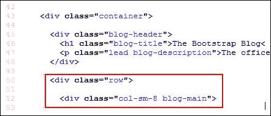
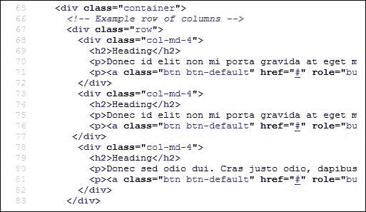
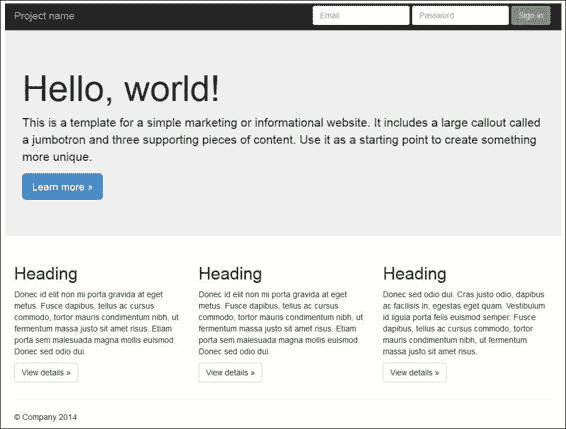
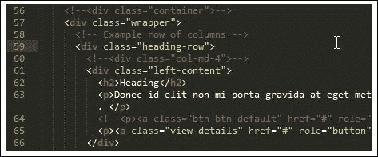

# 第十一章。使用 Less 抽象 CSS 框架

回到 2011 年底，流行的社交网站 Twitter 发布了 Bootstrap——这个框架留下了如此深刻的印象，它很快成为了 GitHub 上最受欢迎的项目！

任何花时间开发过的人至少都听说过 Bootstrap，即使他们还没有机会使用它。在前一章中，我们简要地介绍了 Bootstrap，并说明了它是如何使用 Less 将规则编译成有效的 CSS，以及你可以如何实验性地使用可用的许多混入来创建自己的样式。

问题在于，作为一个框架，Bootstrap 并非没有自己的缺陷——它鼓励我们用几十个类来超载 HTML！这与过去十年中发展起来的趋势相悖，即内容应该与表现分离。在本章中，我们将看到为什么这是不好的做法，以及我们如何通过巧妙地使用 Bootstrap 的混入来解决这一问题。

在本章中，我们将涵盖以下主题：

+   发现使用框架的问题

+   保持你的 HTML 清洁

+   简化复杂样式

想要了解更多？让我们开始吧…！

# 发现使用框架的问题

回想一下前一章，我们介绍了 Bootstrap，并说明了 Less 是如何用来创建编译成干净、语义化 HTML 的样式的…Bootstrap 看起来不错，易于使用，并为我们的网站提供了一个美好、一致的主题，对吧？

错误——它有一个特别棘手的问题：Bootstrap 直接在 HTML 中嵌入 CSS 类。我们可以争论这并没有什么问题，除了使用的样式名称并不总是语义化的！

提供语义代码的整个概念已经多年来一直处于开发者的思维前沿。一些框架，如 Scaffold（用于 PHP）或 Compass（用于 Ruby），早在 2009 年就认识到了这个问题，然而 Bootstrap 仍然强迫我们在 HTML 代码中使用非语义的 CSS 样式。为了了解这一切的含义，让我们深入探讨，看看一个示例，并了解我们如何使用 Less 来纠正这个问题。

# 诊断问题

为了更直观地看到问题，我们需要查看一个启用 Bootstrap 的网站的源代码；具有讽刺意味的是，主要的 Bootstrap 网站有几个示例，清楚地显示了这个问题！

首先，导航到[`getbootstrap.com/examples/blog/`](http://getbootstrap.com/examples/blog/)，这是 Bootstrap 博客主题的演示网站。在页面上任何地方右键单击以选择浏览器中看到的源代码。如果你滚动到第 42 行或附近，你会看到以下内容：



在截图上，第 50 行和第 52 行已被突出显示，这是非语义代码的完美示例；添加的这三种样式都属于 Bootstrap。你可能会问：“为什么我们不能使用它们，它们显然是 Bootstrap 的一部分？”

### 注意

如果你想了解分离标记的好处，那么不妨看看杰弗里·泽尔达曼（Jeffery Zeldman）所著的《使用 Web 标准》（Designing with Web Standards）这本书（从第 3 版开始，伊森·马科特也参与了编写）。

答案很简单——HTML 标记应该描述内容的含义，而不是其他任何内容。我们在这个代码片段中遇到的问题有两个：

+   这使得更新任何代码样式变得困难——如果需要更改样式，那么必须在网站上的每个出现位置进行更改。对于一个小型网站来说，这最多是繁琐的，但如果网站很大，那就成了噩梦！

+   将 Bootstrap 的样式名称硬编码到你的 HTML 代码中意味着你现在依赖于 Bootstrap。如果 Twitter 更改了 Bootstrap 的类（这已经发生了），那么你刚刚给自己带来了一大堆不必要的麻烦。

### 注意

总是关注代码中使用的版本是一个好主意，而不仅仅是使用最新版本。遵循后一种做法会让你容易遇到麻烦！

幸运的是，我们困境的答案就藏在 Bootstrap 本身及其一系列混入（mixins）中。我们可以在代码中不直接使用 Bootstrap 的类名，而是通过创建更多语义化的名称，并将 Bootstrap 类应用到这些名称上，从而在代码中抽象出一个层。为了了解这将如何工作，让我们通过几个简单的示例来探讨，以 Bootstrap 的 Jumbotron 主题演示作为我们更改的基础。

## 保持 HTML 代码整洁

如果我们查看 Bootstrap 的 Jumbotron 示例的源代码，我们可以清楚地看到一些非语义示例，类似于在 Blog 示例中使用的那些；我们将以此为基础，探讨我们可以用来修复问题的解决方案。

有三个对我们来说有趣的示例；第一个在 67 行：

```js
<div class="row">
```

下一个示例紧接着在 68 行：

```js
<div class="col-md-4">
```

我们将要查看的第三个也是最后一个示例，出现在 71、76 和 81 行：

```js
<p><a class="btn btn-default" href="#" role="button">View details &raquo;</a></p>
```

不言而喻，还有更多的示例存在；你可以看到我们的三个选定的示例分别在哪里被使用：



所有这三个示例都使用了过于具体的名称，这些名称描述的是它们的功能，而不是它们应用到的内容。我们可以轻松地将使用的样式名称更改为更具语义性的名称，使用一种可以在代码的其他地方轻松重用的技术。

让我们看看这项技术是如何工作的；它基于直接引用作为 Bootstrap 库一部分包含的 Less 混入。

# 修复代码

在我们开始编辑任何代码之前，我们首先需要下载这本书附带代码的副本。在这里，我们将找到一个（未经过滤的）Jumbotron 主题副本，我们可以用它来完成这个练习：



为了这个练习的目的，我将假设你已经提取了本章所附带的代码副本，并将其存储在一个名为`jumbotron`的文件夹中，以便进行编辑。我们还需要一份 Bootstrap 库的副本，我们可以从主网站[`getbootstrap.com/getting-started/#download`](http://getbootstrap.com/getting-started/#download)下载，然后点击**源代码**选项下的**下载源代码**。

假设我们已经一切准备就绪，让我们开始吧：

1.  打开我们从 Bootstrap 网站下载的 zip 存档文件，然后提取`less`文件夹，并将其复制到我们的`jumbotron`文件夹中。

1.  在一个单独的文件中，添加以下代码，将其保存为`semantic.less`，位于`jumbotron`文件夹内的`css`子文件夹中：

    ```js
    @import "../less/variables.less";
    @import "../less/mixins.less";
    @import "../less/buttons.less";
    @import "../less/grid.less";

    .wrapper {
      .container;
    }

    .left-content {
      .make-md-column(4);
    }

    .middle-content {
      .make-md-column(4);
    }

    .right-content {
      .make-md-column(4);
    }

    .heading-row {
      .make-row();
      .clearfix;
    }
    ```

1.  现在，我们需要更改我们的 HTML，所以打开`jumbotron.html`并添加以下高亮行：

    ```js
        <!-- Custom styles for this template -->
        <link href="css/jumbotron.css" rel="stylesheet">
     <link href="css/semantic.css" rel="stylesheet">
      </head>
    ```

1.  接下来，我们将重命名三个列中的每一个；向下移动并查找第一个`<div class="col-md-4">`标签，它位于第 60 行左右。这可以删除并按照以下代码进行替换；你还需要在代码的下方重复两次：

    ```js
        <div class="container">
          <!-- Example row of columns -->
          <div class="row">
     <div class="left-content">
              <h2>Heading</h2>
              <p>Donec id elit non mi porta gravida at eget metus. Fusce dapibus, tellus ac cursus commodo, tortor mauris condimentum nibh, ut fermentum massa justo sit amet risus. Etiam porta sem malesuada magna mollis euismod. Donec sed odio dui. </p>
              <p><a class="btn btn-default" href="#" role="button">View details &raquo;</a></p>
            </div>
    ```

1.  我们的第三个更改涉及到标题行容器；`row`并不足够具有语义性，因此我们将对其进行更改：

    ```js
    <!--<div class="container">-->
        <div class="wrapper">
          <!-- Example row of columns -->
     <div class="heading-row">
            <div class="left-content">
              <h2>Heading</h2>
              <p>Donec id elit non mi porta gravida at eget metus. Fusce dapibus, tellus ac cursus commodo, tortor mauris condimentum nibh, ut fermentum massa justo sit amet risus. Etiam porta sem malesuada magna mollis euismod. Donec sed odio dui. </p>
              <p><a class="view-details" href="#" role="button">View details &raquo;</a></p>
            </div>
    ```

1.  我们最后的更改涉及到用于包裹三个列的`<div>`标签。容器并不特别具有语义性，因此我们将将其更改为使用`wrapper`作为替代。请先删除容器`DIV`行，然后按照以下所示进行替换：

    ```js
     <div class="wrapper">
          <!-- Example row of columns -->
          <div class="heading-row">
            <div class="left-content">
              <h2>Heading</h2>
    ```

如果我们在浏览器中预览结果，我们不应该期望在视觉上看到任何变化，但可以放心地知道我们已经开始在代码中使用更具语义的类名。

这里有一个非常合理的观点——问为什么我们在这里使用`wrapper`而不是`container`是一个完全合理的问题。我们同样可以使用任何一个，这都没有问题。不过，我的偏好是使用`wrapper`，纯粹是因为它包含了所有的代码（或多或少！）。

## 探索我们的解决方案

因此，现在我们已经在我们的示例中有了语义代码，这意味着什么以及它是如何工作的？这基于两个关键元素：一个是替换，另一个是了解我们可以使用的可用的 Bootstrap 混入（mixins）。

在这个例子中，我们利用了构成 Bootstrap 中创建列和行的基础的 Less 混入组。我们首先导入四个 Less 文件，这些文件包含我们需要使用的混入，然后创建四个新的样式（形式为`left-content`、`middle-content`、`right-content`和`heading-row`），并将`make-md-column`、`make-row`或`clearfix`混入适当地分配。为了确保我们的 HTML 反映了这些更改，我们随后用新的、更具语义的样式名称替换了原始样式。

# 简化复杂样式

我们可以在我们的代码中进一步抽象和简化正在使用的表示类；例如，我们将编辑代码以替换代码中两种按钮类型所使用的 CSS 样式名称：

1.  让我们先再次打开 `jumbotron.html` 文件。在这里，我们需要删除以 `<p><a class="btn btn-default"` 开头的行，并按指示进行替换：

    ```js
    <!--<div class="container">-->
        <div class="wrapper">
          <!-- Example row of columns -->
          <div class="row">
            <div class="left-content">
              <h2>Heading</h2>
              <p>Donec id elit non mi porta gravida at eget metus. Fusce dapibus, tellus ac cursus commodo, tortor mauris condimentum nibh, ut fermentum massa justo sit amet risus. Etiam porta sem malesuada magna mollis euismod. Donec sed odio dui. </p>
     <p><a class="view-details" href="#" role="button">View details &raquo;</a></p>
            </div>
    ```

1.  我们还需要更改分配给 **了解更多** 按钮的当前类，所以请按照所示进行修改：

    ```js
    Use it as a starting point to create something more unique.</p>
     <p><a class="learn-more" role="button">Learn more &raquo;</a></p>
          </div>
    ```

1.  现在我们已经分配了新的样式名称，让我们重新工作 `semantic.less` 中列出的 Less 样式规则，以反映我们 HTML 中的更改，通过将相关的混合分配给我们的样式类：

    ```js
    .learn-more {
      .btn;
      .btn-primary;
      .btn-lg;
    }

    .view-details {
      .btn;
      .btn-default;
    }
    ```

保存文件。如果一切顺利，我们的代码将看起来像这个截图提取：



如果我们在浏览器中预览我们的工作结果，我们不应该期望在视觉上看到任何差异，但要知道我们的代码现在更加语义化。这并不意味着我们只能做这些更改；在这个例子中，肯定还有更多的空间去做；这是我将留给我的读者们去解决的问题，但我会给你一个提示：查看导航…

同时，让我们花点时间来探索我们在这里所取得的成果——我们使用了本章前面在 *探索我们的解决方案* 部分中概述的相同解决方案。

在这种情况下，我们利用了构成 Bootstrap 中按钮支持的 Less 混合组。我们所做的就是在我们 Less 代码中创建了一个新的样式规则，称为 `.learn-more`，然后分别将其分配给之前使用的三个 Less 混合：`.btn`、`.btn-primary` 和 `.btn-lg`。

### 注意

需要注意的是，由于 Bootstrap 对 CSS 类的期望，这个过程不适用于分组按钮；查看 [`stackoverflow.com/questions/24113419/`](http://stackoverflow.com/questions/24113419/) 和 [`stackoverflow.com/a/24240819`](http://stackoverflow.com/a/24240819)，了解一些关于为什么这不适合分组按钮以及如何绕过它的有用讨论。

关键是要将它们按正确的顺序排列，以便我们保持与之前相同的外观。只要我们这样做，页面的外观就不应该有任何变化。然后，我们用 `.view-details` 按钮重复了同样的过程，但这次，我们给它分配了 `.btn` 和 `.btn-default` 样式。

### 注意

`jumbotron.html` 的完整版本以及所做的更改。您可以在代码下载中找到它，名为 `jumbotron_updated.html`。

# 摘要

在这个网络开发的现代时代，设计师们经常使用框架来帮助快速搭建网站。Bootstrap 通常被认为是当今使用最广泛的框架之一。

我们通过检查像 Bootstrap 这样的框架的关键缺陷开始了这一章，即表示 CSS 必须直接包含在 HTML 中。

我们更详细地审视了在行内使用 Bootstrap 的 CSS 样式的问题，并讨论了如何使用一种方法来规避这些问题。然后我们继续应用同样的技术来简化我们的 HTML，这样我们仍然可以使用 Bootstrap 的样式框架，同时去除对其的任何依赖，这可能会影响我们未来开发网站的方式。

在下一章中，我们将转变方向，探讨一个我们可以真正利用 Less 的强大功能的话题，即处理网站或在线应用程序中的颜色。
