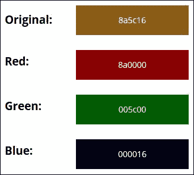
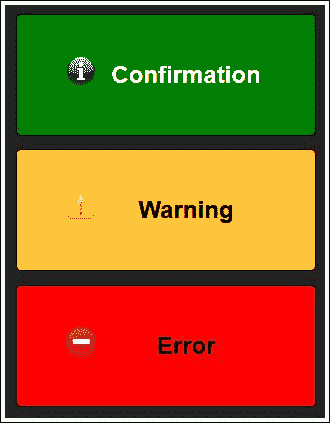
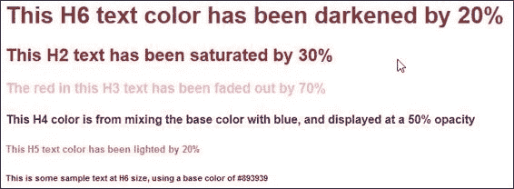
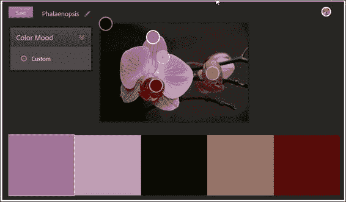
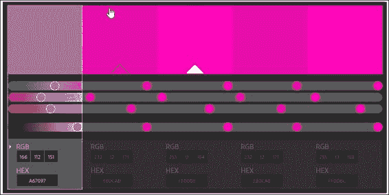
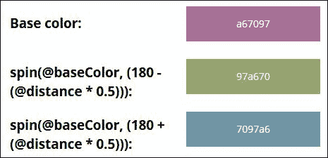

# 第十二章：使用 Less 进行颜色处理

想象一下这样的场景——你是一名设计师，正在为一家百货公司制作最新的促销广告。你花了几个小时创作你的杰作，提交给上级审批…结果发现销售总监讨厌你选择的颜色。他认为这不起作用（“对比度不够…”），所以又回到了画板。只有你知道他非常挑剔他的颜色选择，你知道这并不总是有效…

听起来熟悉吗？如果我们能选择我们的主色调，并且让代码（是的，代码）自动为你选择一个颜色，这个颜色不仅技术上可行，而且符合你选择的主色调，会怎么样呢？听起来不可能吗？在 Less 中就不是这样——欢迎来到颜色处理的领域！在本章中，我们将涵盖以下主题：

+   在 Less 中引入颜色管理

+   颜色空间和格式

+   颜色函数

+   生成调色板

+   混合模式示例以及与 Photoshop 的对比

+   使用 W3C 和 WCAG 标准进行颜色管理

感到好奇了吗？让我们开始吧…

# 在 Less 中引入颜色管理

*打印机配置文件…色度计…sRGB…嗯？你可能是一名开发者，心想，“我对颜色管理一无所知；这一切究竟是什么意思？”*

好吧，让我们先从背景说起：想象一下，你在一艘船上拍了一张红旗的照片（是的，我知道，请继续听我讲），在屏幕上看起来是橙色调，但打印出来却变成了紫色。现在，我敢打赌你真的很困惑……让我来解释一下。

这一切都是关于颜色管理的。简单来说，它是确保你的打印机、相机和电脑都能准确显示相同颜色的艺术。这听起来非常合理，对吧？毕竟，所有设备都应该显示相同的颜色，无论是什么设备…

错了。颜色管理的关键是每个设备都以不同的方式重现颜色。从某种意义上说，它们都在说不同的语言，并且没有我们自己的眼睛那么复杂；这就是我们需要色度计来平衡一切的地方…！

现在明白了吗？然而，Less 与这个有什么联系呢？嗯，Less 中正是同样的原理——我们需要确保颜色得到正确的平衡；把蓝色和紫色放在一起是不好的，因为它们太相似了。幸运的是，Less 有一系列功能可以帮助我们做到这一点。我们可以选择一个主色调，比如紫色，然后使用`darken()`或`lighten()`等函数来选择与主色调相配的颜色。然后 Less 会将这个函数编译成有效的 CSS；例如，如果我们选择`#6600FF`（一种紫色调），我们可以让 Less 将其亮度提高 10%以产生`#801AFF`。这个值将在 Less 编译你的代码时在屏幕上显示。

我们将深入研究 Less 支持的各个函数，但让我们暂时将注意力转向一点理论，以帮助我们更好地理解颜色格式和空间的重要性。

# 检查颜色空间和格式

当我们想到颜色时，我们大多数人可能会想到红色、绿色或蓝色，但我们是否曾想过颜色空间？如果答案是“没有”，那么再想想；你刚刚提到了我们可以使用的几种颜色空间之一。

颜色空间是唯一指定颜色的方法。最著名的是**红色、绿色和蓝色**（**RGB**）。然而，还有其他可供选择，例如**色调、饱和度和亮度**（**HSL**），它的近亲包括支持 alpha（HSLa）或**HSV**（**色调、饱和度和值**）。Less 对它们的支持较少；我们很快会详细探讨这些，但首先，让我们看看如何使用基本的数学运算符来创建新的颜色。

## 使用算术运算符

你有多少次花几个小时为客户调整调色板，结果却发现他们想改变全部？简单地改变一种颜色是不可能的，你需要改变它们全部…

我们可以使用 Less 来帮助我们。它包含了一系列我们可以用来自动化颜色创建和操作的函数。我们可以从颜色中选择红色、蓝色或绿色的色调，或者使用 HSL 从颜色中获取色调、亮度和饱和度级别。然而，我们还可以做一些你可能不会看到，但完全有道理的事情：使用简单的数学运算符，如`+`或`–`来创建我们的颜色。

尝试这个简单的实验。如果你已经安装了 Crunch!，那么在其中的一个新文件中添加以下内容，并保存：

```js
@basecolor: #333;
.container {
  color: @basecolor *2;
  background-color: @basecolor - #111;
}
```

编译后，我们得到两种颜色，它们都来自一种基本颜色：

```js
.container { color: #666666; background-color: #222222; }
```

这行编译后的代码给我们……一种非常深的灰色，以及……另一种深灰色。并不是我心中所想的颜色，但嘿，它很好地展示了原理；我们可以很容易地从一种单一的基本颜色中创建多种颜色。关键是要确保我们得到正确的数字平衡，即在基本颜色与我们使用运算符计算的颜色之间。让我们看看我们是否可以改进这一点，并开始探索创建更多吸引人的颜色的函数世界。

# 使用颜色函数

Less 中可用的函数可以用来提供一些有趣的颜色。花时间熟悉可用的选项是值得的，尤其是因为使用不同的方法可以产生相同的颜色！

函数可以分为四组——它们涵盖了颜色定义、通道、操作和混合。让我们依次查看每一组函数，从定义颜色格式开始。

## 定义颜色格式

在我们能够改变颜色之前，我们自然需要定义它们。我们可以简单地提供一个 HEX 代码，但这并不总是足够的；Less 允许我们做更多。Less 提供了一些方法，使用不同的格式来获取颜色，这些是你最可能最常使用的三种：

| 函数 | 从 | 示例值 |
| --- | --- | --- |
| `rgb` | 十进制红色、绿色和蓝色（RGB）值 | `rgb(90, 129, 32)` |
| `hsl` | 色调、饱和度和亮度（HSL）值 | `hsl(90, 100%, 50%)` |
| `hsv` | 色调、饱和度和值（HSV）值 | `hsv(90, 100%, 50%)` |

### 小贴士

更多信息，请参阅附录中的完整函数列表，*Less 中的颜色函数*。我创建了一个 CodePen 来展示这些效果。这是在[`codepen.io/alibby251/pen/horqx`](http://codepen.io/alibby251/pen/horqx)可用的。

这些方法意味着我们并不局限于始终只使用 HEX 代码——毕竟，你能说出`#8a5c16`是深橙色吗？我怀疑不能！定义颜色的更好方法是使用`RGB`（或者如果我们想定义透明度，则使用`RGBA`）；然后我们可以提取单个基本颜色，如我们下一个演示所示。

### 从 HEX 到 RGBA 转换颜色

这是一个非常简单的练习，我们将取一个颜色，提取其组成的基本颜色，并在屏幕上显示它们。然后我们可以使用这些颜色来产生新的颜色。我们将从设置我们演示的标记开始：

1.  首先下载这本书附带代码的副本。从中，提取`hextorgb.html`的副本并将其保存到我们的项目文件夹中。这将成为我们演示的基础。

1.  我们现在需要添加我们的样式，所以在一个新文件中添加以下内容，从定义我们页面的基本样式开始：

    ```js
    body { margin-left: 10px; padding: 0; }
    h3 { margin-top: 10px; margin-bottom: -5px; font-family: "Open Sans","Helvetica Neue",Helvetica,Arial,sans-serif; width: 100px; position: absolute; float: left; }
    ```

1.  接下来是 Less 样式。我们首先需要从基本颜色中提取红色、蓝色和绿色样式：

    ```js
    @r: red(#8a5c16);
    @g: green(#8a5c16);
    @b: blue(#8a5c16);
    ```

1.  一旦我们有了基本颜色，我们将它们设置为 mixin，这将定义我们框的背景颜色：

    ```js
    .original() { background-color: rgba(@r,@g,@b, 1); }
    .red() { background-color: rgba(@r,0,0, 1); }
    .green() { background-color: rgba(0,@g,0, 1); }
    .blue() { background-color: rgba(0,0,@b, 1); }
    ```

    ### 小贴士

    如果你需要支持 IE8，那么`RGBA()`将不起作用。相反，使用类似以下的内容：

    ```js
    background:rgb(R,G,B);
    filter:alpha(opacity=XX);
    ```

    在这里，`R`、`G`和`B`分别对应红色、绿色和蓝色值；`XX`是表示所需透明度级别的数字。

1.  框单独显示不会非常美观，所以让我们添加一些字体样式：

    ```js
    .font-style() { 
      font-family: "Open Sans","Helvetica Neue",Helvetica,Arial,sans-serif; width: 160px; font-size: 12px; text-align: center; padding: 15px; font-size: 14px; line-height: 1.42857; margin-top: 5px; 
    color: #ffffff; }
    ```

1.  最后但同样重要的是，我们需要调整每个框的位置，并设置背景颜色：

    ```js
    .box { margin-left: 120px; .font-style; }
    .original-box { .original; }
    .red-box { .red; } 
    .green-box { .green; }
    .blue-box { .blue; }
    ```

1.  将 Less 代码保存为`hextorgb.less`。如果我们预览我们的工作结果，我们应该在屏幕上看到四个显示的框；第一个是我们选择的颜色，后面跟着它的每个组成的基本颜色：

在这一点上，您可能会问这里发生了什么。这是一个好问题。尽管它看起来有很多 Less 代码，但实际上，它都归结为使用三个函数，即`red()`、`green()`和`blue()`。我们首先提取主颜色，然后使用各种混入中的`rgba()`函数来创建`background-colors`并将它们分配给屏幕上显示的三个框。

现在让我们继续前进，将重点转向查看 Less 中的另一个颜色函数组，即处理颜色通道。

## 使用 Less 通道化颜色

现在我们已经建立了一个适合工作的颜色空间，我们可能会遇到需要提取和可能修改现有颜色的一部分的需求。幸运的是，Less 包含一系列可以帮助这方面的函数；让我们看看您最可能使用的三个函数；完整的列表可以在书的附录附录“Less 中的颜色函数”中找到：

| 函数 | 提取 | 示例值 |
| --- | --- | --- |
| `hue` | HSL 颜色空间中颜色对象的色调通道。返回介于 0 到 360 之间的整数值。 | `hue(hsl(90, 100%, 50%))` |
| `saturation` | HSL 颜色空间中颜色对象的饱和度通道。返回介于 0 到 100%之间的百分比值。 | `saturation(hsl(90, 100%, 50%))` |
| `lightness` | HSL 颜色空间中颜色对象的亮度通道。返回介于 0 到 100%之间的百分比值。 | `lightness(hsl(90, 100%, 50%))` |

### 小贴士

更多信息，值得阅读 Less 官方网站上的文档[`lesscss.org/functions/#color-channel`](http://lesscss.org/functions/#color-channel)。

虽然理解这些函数的工作原理是关键，但我们只有在使用它们时才能真正感受到它们的强大。让我们通过构建一个至少使用这些函数之一来工作的演示来纠正这一点，形式是一些简单的警告框。

### 创建警告框

Sebastian Ekström，一位瑞典开发者，提供了一个如何使用 Less 中的亮度和暗度函数的完美示例。我在这里对其进行了一些小的修改，以使用 HSL 颜色代替标准的十六进制代码。您可以在[`codepen.io/sebastianekstrom/pen/uHAtL`](http://codepen.io/sebastianekstrom/pen/uHAtL)查看这个示例的原始版本。

让我们开始吧。我们首先需要下载一些图标；为了这个演示的目的，我将假设您已经使用了以下这些：

+   确认对话框([`www.iconarchive.com/show/oxygen-icons-by-oxygen-icons.org/Status-dialog-information-icon.html`](http://www.iconarchive.com/show/oxygen-icons-by-oxygen-icons.org/Status-dialog-information-icon.html))

+   错误对话框([`www.iconarchive.com/show/nuoveXT-2-icons-by-saki/Status-dialog-error-icon.html`](http://www.iconarchive.com/show/nuoveXT-2-icons-by-saki/Status-dialog-error-icon.html))

+   警告对话框（[`www.iconarchive.com/show/oxygen-icons-by-oxygen-icons.org/Status-dialog-warning-icon.html`](http://www.iconarchive.com/show/oxygen-icons-by-oxygen-icons.org/Status-dialog-warning-icon.html)）

如果你想要使用替代图标，那么相应地调整代码。

1.  从代码下载的副本中，提取`alerts.html`的副本。这将成为我们演示的基础。

1.  接下来，让我们创建我们的 Less 样式。在一个新文件中，添加以下颜色样式，从主要文本颜色开始：

    ```js
    @text-color: hsl(0,0%,53.3%);
    @button_confirm: #008000;
    @button_warning: #ffc53a;
    @button_error: #ff0000;
    body { background: hsl(0,0%,13.3%); }
    ```

1.  接下来，添加以下两个混合函数；这些确定要使用的背景颜色：

    ```js
    .text-color(@text-color) when (lightness(@text-color) > 40%) {
        color: #000000;
    }
    .text-color(@text-color) when (lightness(@text-color) < 40%) {
        color: #ffffff;
    }
    ```

    ### 小贴士

    注意到`when`语句的使用吗？将只使用一个文本颜色；这将由`@text-color`的亮度值是否高于或低于`40%`来决定。如果是高于，则使用纯黑色；如果是低于，则使用白色代替。

1.  我们接下来的两个混合函数控制字体格式化和基本按钮设计：

    ```js
    .h3-text() { background-repeat: no-repeat; font-size: 1.5rem;   padding-left: 40px; }
    .button(@button_type) { text-decoration: none; padding: 1em 3em;
    width: 20%; margin: 1% auto; display: block; text-align: center; font-family: sans-serif; border-radius: 5px; line-height: 40px; border: 1px solid #000000; background: @button_type; }
    ```

1.  我们现在可以将我们的样式结合起来。我们首先调用创建确认对话框的混合函数，然后依次调用警告和错误对话框的混合函数：

    ```js
    #confirm { .button(@button_confirm); .text-color(@button_confirm);
      h3 { background-image: url(confirmation.png); .h3-text; }
    }
    #warning { .button(@button_warning); .text-color(@button_warning);
      h3 { background-image: url(warning.png); .h3-text; }
    }
    #error { .button(@button_error); .text-color(@button_error);
      h3 { background-image: url(error.png); .h3-text; }
    }
    ```

将文件保存为`css`子文件夹中的`alerts.less`。如果一切顺利，我们将看到三个对话框，背景为全黑的背景：



好的，所以我们现在可以设置我们的颜色空间并提取我们选择的基色。然而，我们将如何使用这些颜色？仅仅提取颜色可能不足以满足需求；我们很可能需要做更多的事情。Less 没有问题。我们可以对我们的选择颜色进行操作，以产生我们想要的任何颜色！

## 颜色运算

到目前为止，你可能正在问自己，“为什么我们需要在颜色上使用运算符？”当然，那是你用数字做的事情，对吧…？

并非必然。使用简单的算术运算符，正如我们在*使用算术运算符*部分之前所看到的，将完美地工作，但如果我们需要更改颜色，并最终选择使用我们提供的固定计算看起来很糟糕的颜色呢？显然，我们需要一个更好的方法…！

幸运的是，Less 中存在许多我们可以使用的函数，并且假设我们有合适的颜色作为起点，我们可以使用这些函数中的任何一个来产生不同的色调，或者改变色调、饱和度或亮度级别等。让我们花点时间考虑你可能会最常使用的三个：

| 函数 | 函数用途 | 示例值 |
| --- | --- | --- |
| `lighten` | 通过绝对量增加 HSL 颜色空间中颜色的亮度。 | `lighten(#a52a2a, 20%);` |
| `darken` | 通过绝对量减少 HSL 颜色空间中颜色的亮度。 | `darken(#a52a2a, 20%);` |
| `fade` | 设置颜色的绝对透明度。这可以应用于无论颜色是否已经有不透明度值的所有颜色。 | `fade(#a52a2a, 20%);` |

### 小贴士

更多信息，请参阅本书末尾的完整函数列表，附录，*Less 中的颜色函数*。我还创建了一个 CodePen，展示了这些效果，可在[`codepen.io/alibby251/pen/KGltj`](http://codepen.io/alibby251/pen/KGltj)找到。

这在任何网站上都很合理，但在使用颜色并更新它们会是一场噩梦的大型网站上更是如此。相反，我们可以选择我们的主颜色，将其分配给一个变量，并使用函数生成剩余的颜色。让我们看看这如何在实践中快速简单地工作，通过一个基于我们使用的`H`属性的文本颜色变化的快速示例。

### 使文本颜色变深或变浅

我们的两个真实世界演示中的第一个非常简单。假设我们在网站上有很多文本样式，它们使用相同颜色的不同色调。

我们可以轻松地在 CSS 中设置颜色，但这会错过 Less 的一个主要关键部分；为什么我们要明确设置它们，当我们可以让 Less 为我们做这件事时？为了了解这意味着什么，让我们快速搭建一个演示，创建一些不同的样式，用于标准的`H1`到`H6`标记，如下所示：



让我们开始：

1.  对于这个演示，我们需要下载这本书附带代码的副本。从中，提取`altercolor.html`的副本并将其保存到我们的项目文件夹中。这将成为我们演示的基础。

1.  在一个单独的文件中，继续添加以下样式，从我们的基本字体 mixin 开始，以样式化文本：

    ```js
    .font-family() { font-family: Helvetica, arial, times new roman;
    font-weight: bold; }
    ```

1.  接下来是设置我们的基本颜色的变量：

    ```js
    @base_color: #893939;
    ```

1.  我们都需要添加创建字体样式的至关重要的 mixin 调用：

    ```js
    h1 { color: @base_color; .font-family; }
    h2 { color: saturate(@base_color, 30%); .font-family; }
    h3 { color: fadeout(red, 70%); .font-family; }
    h4 { color: mix(blue, @base_color, 50%); .font-family; }
    h5 { color: lighten(@base_color, 20%); .font-family; }
    h6 { color: darken(@base_color, 20%); .font-family; }
    ```

将文件保存为`css`子文件夹中的`altercolor.less`。如果我们预览我们的工作，我们应该期望看到六个语句，样式如本练习开始所示。

简单而优雅，不是吗？通过一点工作和一种颜色，我们使用 Less 自动设置了所有样式。我们的演示正在动态创建样式，但我们可以轻松地将 Less 语句预编译成有效的 CSS 代码，并使用它。我们只需要在设计页面时使用正确的`H`属性即可！

让我们继续前进，看看 Less 的一些更多功能，我们可以使用——混合组。这些函数的工作方式与图形软件包（如 Photoshop 或 GIMP）中可用的选项类似。让我们更详细地探索这些。

# 颜色混合

到目前为止，我们已经看到我们可以定义一个颜色空间，从中提取其组成元素（如色调或绿色的级别）并可以通过淡入或旋转原始颜色来转换颜色。还有另一种使用 Less 改变颜色的方法——混合。

原则上与之前相同，我们需要两种颜色，但效果却大不相同。让我们快速看一下你可能会最常使用的三个功能：

| 功能 | 功能用途 | 示例值 |
| --- | --- | --- |
| `multiply` | 此功能将两种颜色相乘。 | `multiply(#9ec1ef, #091d37);` |
| `screen` | 这与`multiply`相反。结果是颜色更亮。 | `screen (#9ec1ef, #091d37);` |
| `overlay` | 条件性地使亮通道更亮，暗通道更暗。 | `overlay (#9ec1ef, #091d37);` |

### 提示

对于更多信息，请参阅书末附录中给出的完整函数列表附录，“Less 中的颜色函数”。我还创建了一个 CodePen，展示了这些效果的实际应用，可在[`codepen.io/alibby251/pen/IKqEk`](http://codepen.io/alibby251/pen/IKqEk)查看。

现在我们已经看到了 Less 中可用的各种颜色混合模式，让我们继续看看这些模式与在 Photoshop 中执行类似操作相比如何。

## 与 Photoshop 比较 Less

在 CSS 中使用混合模式可能会提出一个非常重要的问题——Less 与 Photoshop 等应用程序相比如何？

好消息是，对于那些已经熟悉 Photoshop 中混合模式的人来说，Less 中存在相同的值，尽管范围不如 Photoshop 广泛。我们可以使用诸如 lighten、darken、hardlight 等值来产生与在 Photoshop 中创建图像相似的效果。

### 提示

两个如何使用混合模式的良好例子可以在[`css-tricks.com/basics-css-blend-modes/`](http://css-tricks.com/basics-css-blend-modes/)找到；也可以看看[`www.dummies.com/how-to/content/photoshop-ccs-blending-modes.html`](http://www.dummies.com/how-to/content/photoshop-ccs-blending-modes.html)，以了解这些模式如何在最新版本的 Photoshop（撰写本文时为 CC 版）中与其他混合模式相匹配。

缺点是混合模式的支持仍然非常新；例如，`background-blend-mode`（撰写本文时）的支持仅限于现代浏览器的最新版本，IE 除外。

除了这个限制之外，花时间熟悉如何在 Less/CSS 中复制 Photoshop 中的相同效果绝对是值得的。正如我们已经看到的，我们可以使用一系列混合值。作为一个 CSS 可能性的测试者，你可以看看 Bennett Feely 使用`background-blend-mode`产生的出色渐变，你可以在[`bennettfeely.com/gradients/`](http://bennettfeely.com/gradients/)看到这些渐变。

要真正了解如何在 Less 中使用混合模式，强烈建议你至少了解以下这三个：`screen`、`multiply`和`overlay`。其他的功能将陆续介绍。让我们花点时间更详细地介绍这三个模式：

+   `屏幕`：它忽略了黑色，使图像看起来更亮，浅色调看起来被冲淡。

+   `乘法`：这是直接相反的，深色调得到加强，而浅色会透过任何清晰或明亮的东西。

+   `叠加`：这是屏幕和乘法的平衡；它忽略了中间调，使混合结果同时变亮和变暗，以增加对比度。

在这一点上，让我们改变方向，继续前进。我们可以轻松地使用混合模式来帮助产生新的颜色，或者有趣的效果（尤其是与图像一起！）；除非我们已经想清楚我们的网站调色板将是什么样子，否则这不会真正有效。

在这一点上，我们可以真正充分利用 Less，来计算适合我们调色的板的价值。在我们这样做之前，让我们从创建成功调色的板的基础知识开始，以帮助设定场景。

# 介绍调色板

我们在设计网站时都会使用颜色。颜色对于我们的设计至关重要，是成败的关键。创建一个统一且有趣的网站依赖于正确选择构成我们调色的板上的颜色。从历史上看，我们经常使用白色或彩色背景；随着我们品味的演变，选择构成我们调色的板上的正确颜色也变得同样重要。

任何成功调色板的关键，甚至在深入到制作它之前，是真正理解颜色是如何工作的。色彩理论是一个复杂的主题，我们可以通过理解不同色调和色相如何相互作用以及这种相互作用对网站访问者的影响来掌握它。

为了帮助我们通过选择正确颜色来创建调色的板的雷区，我们可以使用一些技巧：

+   尝试根据你选择的颜色选择合适的调色板类型。有几种调色板类型可供选择，但特别值得注意的是类似色、互补色和三色。

+   相反，基于当前趋势选择颜色。例如，这可能是一些柔和的粉彩色，它们在制作舒缓的平面设计中变得流行。

+   另一个选择是使用鲜艳的颜色，这些颜色通常饱和度很高，可以使元素真正突出。颜色范围通常有限，有很多白色或灰色空间，以帮助平衡在这个调色板中使用的鲜明颜色。

+   我们甚至可以尝试单色设计，这通常基于黑色或灰色的色调，具体元素用红色或蓝色突出显示。单色调色板有助于传达情感或心理信息，而我们可以使用强调色来突出设计中的重要元素。

    ### 注意

    选择颜色时，一个很好的工具是 Adobe 的 Kuler，可在[`kuler.adobe.com/create/color-wheel/`](https://kuler.adobe.com/create/color-wheel/)找到。它显示了一些你可以使用的其他调色板，例如三色或复合；一旦你熟悉了创建调色板，尝试这些是有价值的。

现在让我们花点时间更详细地看看这些调色板类型。

## 分析调色板示例

消费者如何经常被网站上的颜色所引导，这一点令人惊讶；例如，一项研究发现，60-80%的顾客购买决策仅受颜色的影响！让我们花点时间考虑几个例子，以展示选择正确颜色的重要性。

Trüf，一家位于洛杉矶的网页设计公司，使用单色设计，用红色突出其网站的关键元素——你可以看到他们的设计在[`www.trufcreative.com`](http://www.trufcreative.com)。

类似的使用颜色，但针对不同的网站，Etch 在其大胆的背景中使用了各种色调，用粉色元素使设计真正脱颖而出。他们的网站是[`www.etchapps.com`](http://www.etchapps.com)。

为了感受选择颜色的重要性，请查看 Column Five Media 网站上的信息图表，网址为[`www.columnfivemedia.com/work-items/infographic-true-colors-what-your-brand-colors-say-about-your-business`](http://www.columnfivemedia.com/work-items/infographic-true-colors-what-your-brand-colors-say-about-your-business)；那里有一些非常揭示的事实！

值得注意的是，在实际情况下必须考虑可访问性；这通常由提供给视觉障碍访客的产品或服务的吸引力所决定；Geri Coady 已经制作了一份有用的指南形式的电子书，可在[`www.fivesimplesteps.com/products/colour-accessibility`](http://www.fivesimplesteps.com/products/colour-accessibility)上购买。

让我们继续前进，把注意力转向我们一直期待的事情——选择一些颜色。

## 选择我们的颜色

到目前为止，我们已经了解了选择颜色的重要性以及这将对我们的网站访客产生的影响；选错颜色将会是灾难性的！相比之下，一旦我们知道我们想要使用哪些颜色，创建我们的调色板就真的很容易了。

第一阶段是选择我们的主色。Column Five Media 的信息图表建议，世界上前 100 个顶级品牌中只有 5%使用超过两种颜色；这里的关键是使用适合你项目的颜色数量。一个很好的经验法则是选择至少 2-3 种颜色来搭配，同时使用中性浅色或深色作为背景。然后我们可以使用 Less 从你的主色选择中产生所需的任何色调。

## 使用照片作为我们的来源

你有多经常想知道你将从哪里获得设计灵感？我敢打赌答案经常是，而且我敢打赌照片将在这个来源列表中占有一席之地！

照片是灵感的完美来源。我们可以从中选择一个主色，然后手动选择合适的颜色。但这可能会有些运气成分；并不是每个配色方案都会奏效，但使用这种方法的关键是实验，直到找到能够为你的设计提供良好和谐的色彩。

我们可以采取更实际的方法。Adobe 发布了 Kuler，一个出色的应用程序（和网站），帮助我们根据所使用的色板类型选择合适的颜色。

我们可以选择一个颜色，然后让 Kuler 为我们选择合适的颜色，或者我们可以上传我们选择的照片，并从中选择合适的颜色。在下面的屏幕截图中，我们可以看到从照片中选择颜色的结果，例如我在第一本书《jQuery Tools UI Library》中使用的那张照片，由 Packt Publishing 出版。



相比之下，如果我们从最左边的紫色（`#a67097`）开始，并在 Kuler 的色彩轮上使用它，我们会得到一个完全不同的结果，使用的是类似色板：



这实际上取决于你的项目在颜色方面的需求；为了帮助这一点并了解对访客的影响，阅读 Rachel Shillcock 在 Tuts+上的一篇文章是值得的，文章地址为[`webdesign.tutsplus.com/articles/understanding-the-qualities-and-characteristics-of-color--webdesign-13292`](http://webdesign.tutsplus.com/articles/understanding-the-qualities-and-characteristics-of-color--webdesign-13292)。

### 小贴士

为了获得良好的灵感来源，可以看看 Kuler 上其他人创建的色板；它们位于[`kuler.adobe.com/explore/newest/`](https://kuler.adobe.com/explore/newest/)。

使用工具，如 Kuler，选择颜色可以是一次有趣的体验。它打开了一个充满可能性的世界，尽管一个人的和谐感可能与其他人不同！选择，选择……

为了帮助减少创建色板时的猜测，我们可以轻松地利用 Less 的强大功能，根据我们选择的颜色创建一个合适的色板。让我们看看这在实践中是如何工作的。

## 使用 Less 创建颜色色板

现在我们已经选择了我们的配色方案，我们可以开始创建我们的色板。实际上有数百种工具可供选择，但我们希望 Less 为我们做所有繁重的工作。

现在，我有一个坦白要讲：虽然我们可以让 Less 为我们做艰苦的工作，但我们仍然需要计算出生成我们颜色的公式。或者，我们不需要？

幸运的是，有一位热心的朋友，Jimmy King（Meltmedia 的开发者），已经为这个目的制作了一个非常简单但非常出色的工具。如果我们访问[`jimmyking.me/colors.less`](http://jimmyking.me/colors.less)，不仅可以将颜色选择器设置为我们选择的颜色，还可以预览适合不同类型色板的颜色。更重要的是，我们甚至可以得到生成颜色的 Less 代码！

让我们用一个快速演示来实施这个想法，演示使用之前练习中的`#a67097`颜色创建一个基于三色的色板：

1.  从本书附带的代码中下载并解压`colorpalette.html`副本；我们将以此作为我们的标记的基础。

1.  在一个单独的文件中，添加以下 Less 语句，从创建定义我们颜色的变量开始：

    ```js
    @baseColor: rgba(166,112,151,1);
    @distance: 120; 
    @triad1: @baseColor; 
    @triad2: spin(@baseColor, (180 - (@distance * 0.5))); 
    @triad3: spin(@baseColor, (180 + (@distance * 0.5)));
    ```

    ### 注意

    我们在这个步骤中使用了 spin 函数；spin 用于在 HSV 颜色轮中旋转颜色的色调角度。你可以在[`lesscss.org/functions/#color-operations-spin`](http://lesscss.org/functions/#color-operations-spin)了解更多关于这个操作的信息。

1.  接下来，添加以下混入（mixins）。请注意，我们可以将这些与代码中显示的彩色样式规则结合起来；我为了清晰起见将它们分开：

    ```js
    .triad1() { background-color: @triad1; }
    .triad2() { background-color: @triad2; }
    .triad3() { background-color: @triad3; }
    ```

1.  我们还需要一些基本的字体样式；这不是必需的，但它有助于使其看起来更好！请继续添加以下混入：

    ```js
    .font-style() { font-family: "Open Sans","Helvetica Neue", Helvetica, Arial, sans-serif; width: 160px; font-size: 12px; text-align: center; padding: 15px; font-size: 14px; line-height: 1.42857; margin-top: 5px; color: #ffffff; }
    ```

    我们几乎完成了。接下来是最重要的混入（mixins）；这些创建框并使用适当的背景颜色来样式化它们：

    ```js
    .box { margin-left: 250px; .font-style; }
    .firstcolor { .triad1; }
    .secondcolor { .triad2; }
    .thirdcolor { .triad3; }
    ```

1.  我们需要让这个演示看起来更专业一些，所以请继续添加以下样式：

    ```js
    body { margin-left: 10px; padding: 0; }
    h3 { margin-top: 10px; margin-bottom: -5px; font-family: "Open Sans", "Helvetica Neue", Helvetica, Arial, sans-serif; width: 300px; position: absolute; float: left; }
    ```

1.  将文件保存为`colorpalette.less`。如果我们在一个浏览器中预览结果，我们将看到类似于以下截图的内容：

到目前为止，你可能正在想，“这里发生了什么？”好吧，如果我们回到吉米的工具，你们中那些眼尖的人应该能注意到，我使用了公式来生成一个三色色板。我们所做的一切只是将这些公式打包成一个小的演示，在这个演示中，我们根据每个公式的结果设置三个框的背景颜色。

吉米为多种不同的色板类型产生了公式，所以我们不必重新发明轮子，我们只需选择我们的主色，然后在我们决定使用哪个色板后，自动生成代码的副本！不过，关键点是，关于颜色是否有效，绝对没有讨论的余地；这些颜色是数学上选择的，以产生和谐的色板。

### 小贴士

在制作色板时，尽量决定并坚持一个合适的命名约定。没有固定的格式规则，但一致性和重用是当务之急！

因此，我们已经看到制作色板是多么容易，吉米的工具使获取创建每种颜色所需的所有重要计算变得轻而易举。这让我有了一个想法…如果我们放弃 Photoshop 并在浏览器中设计会怎样？

## 放弃旧习惯

什么？？不可能吧，我听到你说！我们不可能做到这一点…

或者我们可以…？好吧，虽然听起来可能令人惊讶，但这完全可能；更重要的是，Less 可以帮助使这个过程变得无痛。让我来解释。

从历史上看，设计师和开发者一直依赖使用 Photoshop 来创建网站的草图。"这没什么问题"，你可能会说。然而，这会加倍工作量；客户无法使用设计来查看其外观和功能，而且无法即时做出更改。此外，Photoshop 价格昂贵。我们只需要高端的 PC 或 Mac 才能充分利用它；对于成本敏感的小型网站开发者来说，他们真的能证明这种成本是合理的吗？

相比之下，直接在浏览器中设计使过程更加动态；我们可以快速轻松地做出更改，尤其是如果使用了 Less 的话！我们甚至可以仅通过几次点击就生成几个样式表，这些样式表可以完全改变网站的外观；在 Photoshop 中创建设计意味着为每个后续设计从头开始重新创建基本视图。尽管我们愿意这样做，但每次设计都可能会有一些细微的差异，尽管每个案例都遵循了相同的过程！

然而，我们不应该忘记，设计的真正关键不是专注于颜色，而是内容。如果我们在这方面做得正确，那么颜色就会自然而然地就位。

### 注意

为了帮助大家感受在浏览器中设计的心态，Creative Bloq 发布了对网页开发者 Sean Fioritto 的采访，采访内容可在[`www.creativebloq.com/css3/why-web-developers-should-sketch-css-not-photoshop-51411711`](http://www.creativebloq.com/css3/why-web-developers-should-sketch-css-not-photoshop-51411711)找到。这是一篇很有趣的阅读材料！

然而，如果我们真的负担不起停止使用 Photoshop，那么我们至少可以使我们的开发工作流程更智能。CSS Hat 开发了一个插件，可以将任何设计转换为等效的 Less 代码，并将它们导出为 Less 文件。它可在[`www.csshat.com`](http://www.csshat.com)找到，并且有适用于 Windows 和 Mac 的版本，两个版本的许可证价格均为 35 美元。

### 注意

要看到它的实际应用，Kezz Bacey 编写了一个两部分的教程，展示了如何轻松地使用这个插件来生成更少的 Less 代码；教程的第一部分可在[`webdesign.tutsplus.com/tutorials/how-to-improve-your-photoshop-workflow-with-csshat-and-pnghat--cms-20786`](http://webdesign.tutsplus.com/tutorials/how-to-improve-your-photoshop-workflow-with-csshat-and-pnghat--cms-20786)找到，第二部分在[`webdesign.tutsplus.com/tutorials/how-to-code-a-photoshop-layout-with-csshat-lesshat-and-pnghat--cms-20997`](http://webdesign.tutsplus.com/tutorials/how-to-code-a-photoshop-layout-with-csshat-lesshat-and-pnghat--cms-20997)。

我们几乎完成了在 Less 中使用颜色的迷你之旅。在我们完成并进入下一章查看动画之前，我们需要看看每个设计师在设计时都应该考虑的一些法律要求。当然，这是 WCAG 标准；让我们更详细地看看这些。

## 与 W3C 和 WCAG 标准合作

在本章中，我们一直在进行探索之旅，了解 Less 中的各种不同功能如何帮助简化创建新颜色所需的工作。在创建颜色方面，我们还有一项重要内容尚未涉及，设计师必须注意：确保符合 WCAG 可访问性指南。

## 克服网站访问障碍

在这个现代时代，人们希望所有网站都对每个人可访问；但事实并非总是如此。访问可能因多种原因而被阻止，在颜色的方面，它们是：

+   对于无法区分特定颜色且因此无法访问依赖于这些颜色来传达意义的信息的访客（例如，红绿色盲）

+   需要使用无法显示使用颜色的信息的设备的访客

+   对于那些难以看到前景和背景颜色非常接近的网站的访客，他们可能存在颜色缺陷

那么，我们如何解决这些问题并确保我们创建的网站是可访问的？

## 介绍 WCAG

WCAG 编制了一份广泛的指南列表，以帮助设计师确保合规性，这些指南可以在[`www.w3.org/TR/WCAG/`](http://www.w3.org/TR/WCAG/)查看。虽然设计师可以选择在 A、双 A 或三 A 级别中选择合规性，但这些指南需要遵循。

WCAG 建议可能难以阅读，但仍然有两个关键因素需要考虑，总结如下：

+   不应仅使用颜色来传达任何信息；一个标有**OK**的绿色按钮比一个简单的绿色圆圈更可取

+   文字（以及文字的图像）应至少具有 4.5:1 的对比度比率，除非使用大号文字，或者文字是装饰性图像或品牌标志的一部分

为了确保信息不太可能违反 WCAG 合规性，我们可以使用以下几条指南：

+   避免使用彩色文字或强烈的背景颜色

+   建议使用黑色文字在白色背景上（避免使用下划线文字，因为您的客户可能会认为文字是超链接，而实际上并不是）

+   使用标准字体（例如，Arial，Times New Roman）

+   不应使用大写字母作为整个页面标题或文本块的字体

此外，我们可以使用一些工具来帮助我们决定是否达到了正确的对比度水平。两个这样的例子可以在[`www.dasplankton.de/ContrastA/`](http://www.dasplankton.de/ContrastA/)和[`webaim.org/resources/contrastchecker/`](http://webaim.org/resources/contrastchecker/)找到。

### 注意

在线有大量资源可供进一步阅读，包括针对特定公司或政府机构的案例研究和指南。以下是一些例子：

+   [`www.w3.org/WAI/WCAG20/quickref/`](http://www.w3.org/WAI/WCAG20/quickref/)

+   [`www.w3.org/TR/2008/REC-WCAG20-20081211/`](http://www.w3.org/TR/2008/REC-WCAG20-20081211/)

+   [`www.w3.org/TR/compositing-1/`](http://www.w3.org/TR/compositing-1/)

值得注意的是，Less 库已被修改以帮助合规。尽管它还没有完全合规，但一个有助于合规的更改示例是[`github.com/less/less.js/pull/1704`](https://github.com/less/less.js/pull/1704)上发出的拉取请求；这涉及到对 Less 中颜色函数（如乘法或叠加）所做的更改。

## 使网站可用

好吧，鉴于我们刚刚讨论了如何使网站合规，这个问题可能看起来有些奇怪，对吧？

嗯，是的，也不是。在为这本书进行研究时，我遇到了一个关于确保遵守 WCAG 指南以及为什么遵守它们实际上可能对您的网站有害的精彩讨论。

简而言之，原始问题的回答者讨论了尽管它们并不完美，但背后团队所做的好工作。他谈论了需要谨慎应用指南，并且只有最适合网站的那些指南应该被使用。他提到，许多残疾人通常会找到绕过那些本应隐藏在视线之外的信息的方法，从某些方面来说，他们是帮助测试网站可用性的完美人选！

### 注意

你可以在[`stackoverflow.com/questions/21415785/wcag-vs-real-users-opinions`](http://stackoverflow.com/questions/21415785/wcag-vs-real-users-opinions)上阅读完整的讨论。

# 摘要

在 Less 中的色彩管理可以看作是一种矛盾；虽然工具相对简单易用，但它们可以用来制作复杂的设计，这些设计的复杂程度仅限于你的想象力。在本章中，我们介绍了一些你可以用来提取、混合和混合颜色的工具。让我们花点时间回顾一下本章所学的内容。

我们首先用一点理论来设定场景并介绍色彩管理；我们还了解了一些关于色彩空间和格式的知识。我们使用 Less 的探索之旅从查看使用简单的算术运算符，如乘法或除法开始；紧接着是介绍 Less 中可用的各种颜色函数以及这些函数与使用 Photoshop 相比如何。

接下来是关于调色板的介绍和一些示例分析，以说明仔细选择颜色的重要性。这包括使用照片作为潜在的颜色来源，然后我们使用 Less 创建了一个颜色调色板。

接下来，我们讨论了一些可能被视为有争议的话题，那就是放弃旧习惯，转而使用类似 Less 的工具直接在浏览器中开发。虽然有些人可能会认为这并不合理，但我们讨论了为什么这种做法可能会带来好处的一些原因；对于那些无法面对这种转变的人来说，我们介绍了一种简单的方法，可以从 Photoshop 自动创建 Less 样式。为了结束本章，我们探讨了开发者必须遵守关于颜色使用的 WCAG 指南，为什么这些指南被制定，以及我们在应用它们到我们的网站上需要小心谨慎的原因。

哇！我们确实覆盖了很多内容！接下来，让我们进入下一章，本章将探讨我们如何使用 Less 来简化项目中的动画开发。
