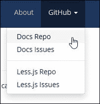
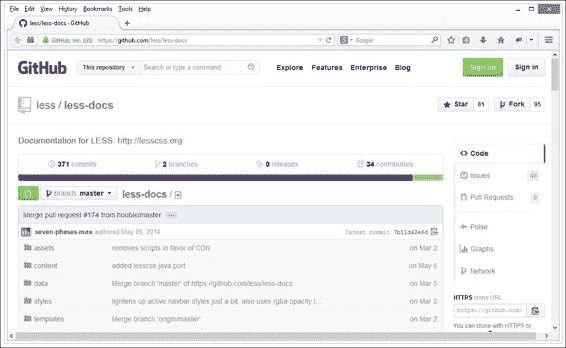
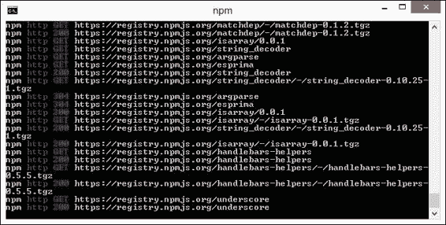

# 第十四章。扩展和为 Less 做贡献

在这本书的整个过程中，我们涵盖了一系列主题，从入门 Less 到在 CMS 系统中使用它或创建颜色。

到这个时候，我们可以说，世界就是你的牡蛎。希望这本书已经足够激发你的兴趣，去开发下一个杀手级网络应用。然而，我怀疑有些人会说，“如果我想修改 Less 本身怎么办？”

这是一个合理的问题。毕竟，许多开源应用（Less 也不例外）的宗旨是，如果你在项目中得到了帮助，就尝试为项目做出贡献。幸运的是，有几种方式你可以做出贡献，从报告问题和错误到提交 Less 未来版本的补丁和功能请求。

在本章中，我们将快速浏览一些你需要知道的信息，以便能够为项目做出贡献。在本章中，我们将涵盖以下主题：

+   如何找到 Less 仓库

+   如何报告错误

+   如何贡献代码

+   测试

+   文档

想了解更多？让我们开始吧...！

# 定位 Less 仓库

到目前为止，我们已经花了不少时间学习 Less 及其工作原理。总有一天，我们可能会发现我们的代码存在问题，需要帮助。

对于大多数开源应用或项目，原始源代码将以某种形式提供；Less 也不例外。库和文档的源文件存储在 GitHub 的两个不同仓库中；它们可以从 Less 主网站的右上角访问：



我们可以通过这些链接访问 GitHub 仓库，或者直接通过 URL：

+   对于主要文档仓库，请访问 [`github.com/less/less-docs`](https://github.com/less/less-docs)。

+   要记录任何关于 Less 文档的问题，请访问 [`github.com/less/less-docs/issues`](https://github.com/less/less-docs/issues)；你还可以查看任何现有的问题列表。

+   你可以在 [`github.com/less/less.js`](https://github.com/less/less.js) 找到感兴趣的 主要仓库。这是 Less 的源代码仓库，任何更改或更新都将作为每个版本的一部分合并到核心中。

+   如果你需要记录任何问题，请访问 [`github.com/less/less.js/issues`](https://github.com/less/less.js/issues)；有一个活跃的社区将能够提供建议和帮助解决问题。

现在我们已经看到了我们可以去哪里寻求更多帮助，让我们将注意力转向可能是最重要的一步：记录我们的求助请求。

# 在 Less 中查找和报告问题

一旦你开始使用 Less，无疑会有需要一些帮助的情况。Less 团队建议最佳的帮助请求记录位置是在流行的 Stack Overflow 网站上，它是[`www.stackoverflow.com`](http://www.stackoverflow.com)。然而，如果你遇到的问题与网站上文档相关，那么应该在 GitHub 的 Less 文档区域记录，网址为[`github.com/less/less-docs`](https://github.com/less/less-docs)。

任何请求帮助的请求都不应该在 GitHub 的 Less 区域记录；这些应该保留用于记录和修复代码中的错误。Less 核心团队发布了一套指南，以帮助提出问题，确保它们有最佳的成功解决机会：

+   **搜索现有问题**：团队收到了很多重复的问题，所以首先检查是否有人已经报告了相同的问题，以及是否已经发布了修复方案。

+   **创建一个隔离和可重现的测试用例**：这有助于确保问题在 Less 库中；查看[`css-tricks.com/reduced-test-cases/`](http://css-tricks.com/reduced-test-cases/)以获取如何创建此类测试用例的一些提示。

+   **使用最新版本进行测试**：令人惊讶的是，很多问题都是通过更新到 Less 的最新版本解决的。

+   **包含一个实时示例**：你可以使用[`www.less2css.org`](http://www.less2css.org)来帮助创建和分享你的隔离测试用例。

+   **分享信息**：尽可能多地分享有关你问题性质的信息。以下是一些有用的信息片段，将有助于：

    +   提及操作系统和版本

    +   描述你是如何使用 Less 的

    +   如果你将其用于浏览器，请包括浏览器和版本以及你使用的 Less.js 版本

    +   包括你是否使用命令行（`lessc`）或外部工具

    +   尝试包括重现错误的步骤

如果你对你报告的错误有解决方案或建议，请包括它，或者发起一个 pull request——不要假设维护者知道如何修复它，仅仅因为你知道！

如果你发现问题不仅仅是关于如何做某事的问题，而且库本身确实存在错误，那么你可能需要提交一个错误报告。让我们看看如何在 GitHub 中实现这一点。

# 报告库中的错误

不，这并不是一个找借口去消灭你找到的每一个昆虫（请原谅这个双关语），而是一个机会，如果你在 Less 中遇到问题或错误，可以寻求帮助。

Less 团队欢迎任何关于错误的报告，一旦修复，可以帮助改进代码；以下指南值得注意：

+   **使用 GitHub 问题搜索功能**：检查该问题是否已经被其他人报告；重复努力是不值得的，但你可能想加入现有的问题日志，以帮助优先处理该问题。

+   **检查问题是否已修复**：尝试使用最新的主分支或开发分支下载来重现它，这些通常可以在存储库中找到。

+   **隔离问题**：创建一个简化测试用例和一个实时示例；Chris Coyier 在 [`css-tricks.com/reduced-test-cases/`](http://css-tricks.com/reduced-test-cases/) 上有一篇有用的文章，介绍了如何生成这样的测试用例。

一份好报告的关键是提供足够的信息供他人工作，但不要过度。找到正确的平衡并不容易。这需要随着时间的积累而积累经验。然而，你可以通过提供关键细节来帮助他人，例如：

+   你的环境是什么？问题是仅限于一个浏览器，还是会在不同的浏览器中显现？

+   重现问题的步骤是什么，它们是否一致？

+   你期望看到什么样的结果？

所有这些细节（以及更多）将帮助人们修复你发现的任何错误；为了帮助呈现正确的信息，你可以遵循以下有用的格式：

### 注意

**简短且描述性的示例错误报告标题**

请提供问题的总结以及它发生的浏览器/操作系统环境。如果合适，包括重现错误的步骤。

+   这是第一步。

+   这是第二步。

+   进一步的步骤等等。

`<url>` 是一个指向简化测试用例的链接，展示了问题。

任何其他与报告问题相关的信息。这可能包括你已识别为导致错误的代码行以及潜在解决方案（以及你对它们的评价）。

如果你想要帮助修复一些错误，那么你需要遵循一个过程。让我们改变方向，看看你如何可以帮助贡献到这个库。

# 为 Less 源代码做出贡献

一旦你更习惯于使用 Less，你可能会想要为项目做出一些贡献。毕竟，项目所有者花费了无数小时开发这个库，所以任何帮助都是受欢迎的。

你可以帮助贡献到项目的两种方式是提交功能请求和创建拉取请求。在我们查看它们之前，有一些小工作值得完成，那就是安装 Node.js 和 Grunt。

## 准备工作

如果你花时间在为 Less 开发代码提交，那么安装两个工具是至关重要的；这些是 Less 整个开发过程的关键：

+   **Node.js**：可以从 [`www.nodejs.org`](http://www.nodejs.org) 为你的平台下载。在撰写本文时，最新版本是 0.10.28。

+   **Grunt**：可以从 [`www.gruntjs.com`](http://www.gruntjs.com) 获取；在撰写本文时，版本为 0.4.5。

接下来，我们需要安装 Grunt。在命令提示符中输入以下内容并按 *Enter*：

```js
npm install -g grunt-cli

```

现在我们已经设置了基本环境，让我们依次查看每种贡献方法，首先是功能请求。

## 提交功能请求

功能请求总是受欢迎的。建议您花点时间了解您的想法是否与项目的愿景相符。

提供一个足够有力的新功能案例取决于您能提供的详细程度。请记住，由于项目是开源的，您可能发现先对现有项目进行分叉，然后再添加您的新功能更可取。

值得检查是否有人已经提出了建议。团队总是欢迎新想法，但除非有充分的理由，否则不会添加功能。可能更可取的是在第三方构建系统（如 assemble-less）中实现新功能，而不是在核心库内部实现。

## 创建拉取请求

如果您提交的功能请求已经引起关注，并且可能被提交到源代码中，团队总是鼓励在可能的情况下提交拉取请求。

团队要求，如果您创建拉取请求，它应保持范围，避免包含不相关的提交。我总是试图遵循每次提交一个更改的原则，这使得在以后需要时更容易移除。如果您的拉取请求旨在实施重大更改，例如移植到新语言，那么首先询问开发者是值得的；否则，这可能意味着您可能会花费大量时间开发开发者可能不想合并到主库的新功能。

如果您的拉取请求解决了现有问题，但使用了不同的（或更好的）解决方案，那么它应该作为一个新问题提出，而不是作为现有拉取请求的替代。提交的任何拉取请求都应附带一组测试。我们将在本章后面更详细地介绍这一点。

无论开发拉取请求的原因是什么，您都应该遵循一些简单的标准，以确保提交的代码的一致性：

+   总是使用空格，而不是制表符

+   以分号结束行

+   大致遵循 jsHint 标准

提交的任何补丁都将由 Less 团队根据 Apache 许可证进行许可。

### 注意

为了帮助您通过 Git 提交时遵循一致的过程，值得看看 Nicolas Gallagher 提出的流程，该流程可在 [`github.com/necolas/issue-guidelines/blob/master/CONTRIBUTING.md`](https://github.com/necolas/issue-guidelines/blob/master/CONTRIBUTING.md) 找到。

### 使用 Git 与 GUI

值得注意的是，使用 Git 需要一定的技能水平。通常使用基于 GUI 的客户端比使用命令行更容易；在 [`git-scm.com/downloads/guis`](http://git-scm.com/downloads/guis) 可以找到一些流行的客户端列表。我个人的最爱是 GitHub for Windows，可在 [`windows.github.com`](http://windows.github.com) 获取。

### 注意

如果你想了解更多关于 Git 的知识，那么查看由 *Packt Publishing* 出版的 *Git: Version Control for Everyone*，作者是 *Ravishankar Somasundaram*，或者访问网站 [`git-scm.com/book`](http://git-scm.com/book)。

## 测试您的提交

提交任何功能更改的关键部分是确保你的代码已经通过了 linting 过程，以分析任何潜在的错误。有几种方法可以做到这一点，但首选的是使用 Grunt；已经产生了包来帮助这个过程。

一个很好的例子是 Jacob Gable 编写的 Less Lint Grunt 插件，可在 [`github.com/jgable/grunt-lesslint`](https://github.com/jgable/grunt-lesslint) 获取。对于更深入的选择，您可以查看 Axisto Media 的 Tom Loudon 的文章，在 [`coderwall.com/p/g1kqzg`](https://coderwall.com/p/g1kqzg)，该文章详细介绍了使用 Grunt 添加预 Git 提交 linting 的过程。

一旦你的代码通过了 linting，那么它需要经过测试。为此，我们需要做以下操作（假设你已经按照本章前面“准备就绪”部分中的说明安装了 Node 和 Grunt）：

1.  克隆 Less 仓库。这可以通过命令行完成，也可以使用 GitHub for Windows 这样的 GUI。

1.  打开命令提示符，然后更改文件夹到您存储 Less 仓库本地副本的位置。

1.  在命令提示符下，输入 `npm install` 以安装 Less 的 npm 依赖项。

1.  完成后，在提示符下输入以下命令：

    ```js
    grunt browsertest-server

    ```

现在，您可以访问 `http://localhost:8088/tmp/browser/` 来查看测试运行器页面。您还应该在提示符下能够输入 `lessc <文件名>.less`；这将由 Less 编译并在屏幕上渲染；这将允许您将其与本地编译的 CSS 版本进行比较，以查看是否产生相同的结果。

# 为 Less 文档做出贡献

到目前为止，我们已经看到了如何为 Less 库做出贡献，无论是报告问题或错误，还是通过贡献新功能的建议和代码。如果你的问题出在文档上怎么办？

Less 团队维护源文档在 GitHub 上；在这里，您可以找到在 [`www.lesscss.org`](http://www.lesscss.org) 发布的所有文档的源代码，如果您发现任何问题，可以选择提出问题，或者提交拉取请求以帮助维护文档。所有文档内容都可以在 `./content` 目录中找到：



### 注意

要了解 Less 的工作方式，查看 Less 示意图是值得的，该示意图可在[`www.gliffy.com/go/publish/4784259`](http://www.gliffy.com/go/publish/4784259)找到。

## 在本地安装文档

要开始更新文档，我们需要在自己的电脑上建立一个本地副本。这需要安装 Assemble ([`assemble.io/`](http://assemble.io/))，按照以下步骤操作：

1.  浏览到 Less 文档的 GitHub 区域，该区域位于[`github.com/less/less-docs`](https://github.com/less/less-docs)，然后点击**下载 ZIP**以获取 Less 文档的最新版本。

1.  在您的电脑上创建一个文件夹。为了本练习的目的，我们将假设它被命名为`lessdocs`；将存档文件的内容提取到这个文件夹中。

1.  打开命令提示符，并将当前位置更改为`lessdocs`文件夹。

1.  在提示符下，输入`npm install`以安装 Assemble，然后等待其完成过程：

1.  完成后，输入此命令以构建文档：

    ```js
    node data/utils/pkg && grunt

    ```

当这完成时，您将能够离线查看文档，并使用它向 GitHub 提交拉取请求，供 Less 团队考虑。

# 遵循编码指南

现在我们已经在本地上安装了文档的副本，我们准备开始贡献！然而，在我们这样做之前，有一些值得注意的指南，这将有助于使文档保持一致、可读和可维护。让我们更详细地简要查看这些标准，从 Markdown 标准开始：

+   使用`#`作为标题，而不是下划线。下划线不是语义化的，不够灵活，并且在代码高亮显示器中并不总是被正确突出显示。

+   总是在`#`和标题之间添加一个空格。

+   将内联代码用单个反引号包裹，或将代码块用三个反引号（代码分隔符）包裹。

+   在代码块中，总是在第一个代码分隔符之后使用正确的语言。尽管 GitHub 不会高亮显示 Less，但使用正确的语言时，我们的文档更有可能出现在 GitHub 和 Google 的搜索结果中。例如，使用```js` ```less ```js` for Less and ```` ```jscss ````用于 CSS。

对于 Less 代码的标准化维护也存在类似的指南；它们在`CONTRIBUTING.md`页面中完整重现，该页面列在[`github.com/less/less-docs`](https://github.com/less/less-docs)的主索引中；值得注意的主要点包括适当的间距、多行格式化的使用以及正确使用引号。

### 注意

值得一看的是报告问题、错误和功能请求的指南，这些指南基于 Nicolas Gallagher 创建的通用集合，适用于任何 GitHub 项目；您可以在[`github.com/necolas/issue-guidelines/blob/master/CONTRIBUTING.md`](https://github.com/necolas/issue-guidelines/blob/master/CONTRIBUTING.md)查看原始集合。

如果您遵循这些指南，将有助于保持与 Less 相关的文档的一致性和可管理性。

# 摘要

在学习 Less 的过程中，我们涵盖了大量内容，最后查看您可以通过报告问题和错误，或提交代码以帮助修复或改进库中现有功能的形式回馈项目。

我们本章从查看如何访问 Less 的两个源代码库开始，还涵盖了您可以在 GitHub 问题日志中记录源代码和文档中的问题和错误。

我们转向查看提交功能或拉取请求时应遵循的指南，并快速查看提交的任何代码应如何与 Less 测试进行测试，并进行 lint 检查以确保代码质量得到保持，并修复任何错误。

我们随后探讨了您如何通过报告问题或改进建议来为文档做出贡献。我们讨论了在查看确保 Less 项目文档质量得到保持所需遵循的标准之前，需要下载和安装文档的本地副本。

到此，我们已到达本书的结尾。我真诚地希望您像我一样享受学习如何使用 Less 的旅程，并且它对您的未来项目有所帮助。

# 附录 A. Less 中的颜色函数

Less 库包含了一些我们可以用来在网站上操作颜色的颜色函数——本附录列出了每个函数的详细信息，包括定义颜色格式、通道颜色、执行颜色操作和混合颜色这四个组。

# 定义颜色格式

以下是一系列处理 Less 中颜色格式的颜色函数：

| 函数 | 函数的作用 | 示例值 |
| --- | --- | --- |
| `rgb` | 从十进制红色、绿色和蓝色（RGB）值创建一个不透明颜色对象 | `rgb(90, 129, 32)` |
| `rgba` | 从十进制红色、绿色、蓝色、alpha（RGBA）值创建一个透明颜色对象 | `rgba(90, 129, 32, 0.5)` |
| `argb` | 创建一个`#AARRGGBB`格式（不是`#RRGGBBAA!`）的颜色十六进制表示 | `argb(rgba(90, 23, 148, 0.5));` |
| `hsl` | 从色调、饱和度和亮度（HSL）值创建一个不透明颜色对象 | `hsl(90, 100%, 50%)` |
| `hsla` | 从色调、饱和度、亮度和 alpha（HSLA）值创建一个透明颜色对象 | `hsl(90, 100%, 50%, 0.5)` |
| `hsv` | 从色调、饱和度和值（HSV）值创建一个不透明颜色对象 | `hsv(90, 100%, 50%)` |

### 小贴士

有关更多信息，请阅读 Less 主站上的文档[`lesscss.org/functions/#color-definition`](http://lesscss.org/functions/#color-definition)。我还创建了一个 CodePen，展示了这些效果的实际应用——可在[`codepen.io/alibby251/pen/horqx`](http://codepen.io/alibby251/pen/horqx)找到。

# 使用 Less 颜色通道

以下是可以让我们在 Less 中进行颜色通道操作的函数列表：

| 函数 | 函数的用途 | 示例值 |
| --- | --- | --- |
| `色调` | 从 HSL 颜色空间中提取颜色对象的色调通道 | `色调(hsl(90, 100%, 50%))` |
| `饱和度` | 从 HSL 颜色空间中提取颜色对象的饱和度通道 | `饱和度(hsl(90, 100%, 50%))` |
| `lightness` | 从 HSL 颜色空间中提取颜色对象的亮度通道 | `lightness(hsl(90, 100%, 50%))` |
| `hsvhue` | 从 HSV 颜色空间中提取颜色对象的色调通道 | `hsvhue(hsv(90, 100%, 50%))` |
| `hsvsaturation` | 从 HSV 颜色空间中提取颜色对象的饱和度通道 | `hsvsaturation(hsv(90, 100%, 50%))` |
| `hsvvalue` | 从 HSV 颜色空间中提取颜色对象的值通道 | `hsvvalue(hsv(90, 100%, 50%))` |
| `红色` | 提取颜色对象的红色通道 | `红色(rgb(10, 20, 30))` |
| `绿色` | 提取颜色对象的绿色通道 | `绿色(rgb(10, 20, 30))` |
| `蓝色` | 提取颜色对象的蓝色通道 | `蓝色(rgb(10, 20, 30))` |
| `alpha` | 提取颜色对象的 alpha 通道 | `alpha(rgba(10, 20, 30, 0.5))` |
| `亮度` | 计算颜色对象的亮度（感知亮度） | `亮度(rgb(100, 200, 30))` |
| `luminance` | 计算未进行伽玛校正的亮度值 | `luminance(rgb(100, 200, 30))` |

### 小贴士

有关更多信息，请阅读 Less 主站上的文档[`lesscss.org/functions/#color-channel`](http://lesscss.org/functions/#color-channel)。

# 对颜色进行操作

以下是可以应用于 Less 代码的操作函数列表：

| 函数 | 函数的用途 | 示例值 |
| --- | --- | --- |
| `saturate` | 通过绝对量增加 HSL 颜色空间中颜色的饱和度。 | `saturate(hsl(0, 59.4%, 40.6%), 20%);` |
| `desaturate` | 通过绝对量减少 HSL 颜色空间中颜色的饱和度。 | `desaturate(hsl(0, 59.4%, 40.6%), 20%);` |
| `lighten` | 通过绝对量增加 HSL 颜色空间中颜色的亮度。 | `lighten(hsl(0, 59.4%, 40.6%), 20%);` |
| `darken` | 通过绝对量减少 HSL 颜色空间中颜色的亮度。 | `darken(hsl(0, 59.4%, 40.6%), 20%);` |
| `fadein` | 减少颜色的不透明度（或增加不透明度），使其更不透明。 | `fadein(hsl(0, 59.4%, 40.6%), 20%);` |
| `fadeout` | 增加颜色的不透明度（或减少不透明度），使其更不透明。 | `fadeout(hsl(0, 59.4%, 40.6%), 20%);` |
| `fade` | 设置颜色的绝对透明度。无论颜色是否已经具有不透明度值，都可以应用于颜色。 | `fade(hsl(0, 59.4%, 40.6%), 20%);` |

### 提示

更多信息，请参阅 Less 主站上的文档[`lesscss.org/functions/#color-operations`](http://lesscss.org/functions/#color-operations)。我还创建了一个 CodePen，展示了这些效果的实际应用——可在[`codepen.io/alibby251/pen/KGltj`](http://codepen.io/alibby251/pen/KGltj)找到。

# 颜色混合

我们最后的一组函数用于处理 Less 中的颜色混合：

| 函数 | 函数的作用 | 示例值 |
| --- | --- | --- |
| `multiply` | 乘以两种颜色。 | `multiply(#9ec1ef, #091d37);` |
| `screen` | 与`multiply`相反。结果是颜色更亮。 | `screen (#9ec1ef, #091d37);` |
| `overlay` | 结合了`multiply`和`screen`的效果。条件性地使亮通道更亮，暗通道更暗。 | `overlay (#9ec1ef, #091d37);` |
| `softlight` | 与`overlay`类似，但避免了纯黑色变为纯黑色，纯白色变为纯白色。 | `softlight (#9ec1ef, #091d37);` |
| `hardlight` | 与`overlay`相同，但颜色角色相反。 | `hardlight (#9ec1ef, #091d37);` |
| `difference` | 在通道基础上从第一个颜色中减去第二个颜色。 | `difference (#9ec1ef, #091d37);` |
| `exclusion` | 与`difference`类似，但对比度较低。 | `exclusion (#9ec1ef, #091d37);` |
| `average` | 在每个通道（RGB）的基础上计算两种颜色的平均值。 | `average (#9ec1ef, #091d37);` |
| `negation` | 与`difference`相反。 | `negation (#9ec1ef, #091d37);` |

### 提示

更多信息，请参阅 Less 主站上的文档[`lesscss.org/functions/#color-blending`](http://lesscss.org/functions/#color-blending)。我还创建了一个 CodePen，展示了这些效果的实际应用——可在[`codepen.io/alibby251/pen/IKqEk`](http://codepen.io/alibby251/pen/IKqEk)找到。
