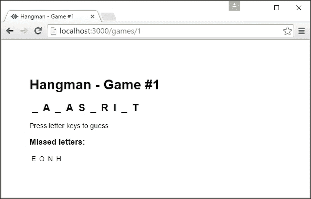
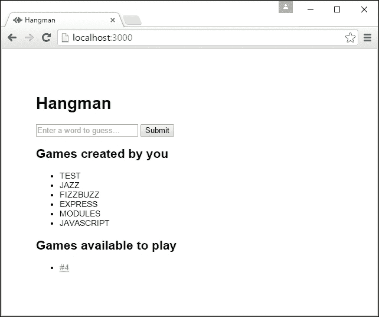

创建动态网站

既然我们已经为我们的应用程序建立了一个基本结构，我们就可以开始添加更多功能，并构建一个能够响应用户输入的动态网站。

在本章中，我们将涵盖以下主题：

+   为我们的应用程序添加一个新模块以存储和删除数据

+   提供 JSON API 以处理用户提交的数据

+   使用 Ajax 实现客户端和服务器之间的通信

+   使用部分模板构建更复杂的 HTML 视图

# 第五章：处理用户提交的数据

我们将实现经典的猜字游戏——Hangman（见[`en.wikipedia.org/wiki/Hangman_(game)`](https://en.wikipedia.org/wiki/Hangman_(game)))。用户将能够发布新词进行猜测，以及猜测他人发布的词。我们将首先查看创建新游戏。

首先，我们将为管理我们的游戏添加一个新的模块。目前，我们只需将游戏存储在内存中。如果我们将来想要将游戏存储在某种持久存储中，这就是我们将要更改的模块。尽管如此，接口（即添加到`module.exports`中的函数）可以保持不变。

我们在`services/games.js`下添加以下代码：

```js
'use strict';

const games = [];
let nextId = 1;

class Game {
    constructor(id, setBy, word) {
        this.id = id;
        this.setBy = setBy;
        this.word = word.toUpperCase();
    }
}

module.exports.create = (userId, word) => {
    const newGame = new Game(nextId++, userId, word); 
    games.push(newGame);
    return newGame;
}

module.exports.get =
  (id) => games.find(game => game.id === parseInt(id, 10));
```

现在，让我们从上到下查看我们的应用程序。在我们的索引视图（`views/index.hjs`）中，我们将添加一个简单的 HTML 表单来创建新游戏。

```js
  <body>
    <h1>{{ title }}</h1>
 <form action="/games" method="POST">
 <input type="text" name="word"
 placeholder="Enter a word to guess..." />
 <input type="submit" />
 </form>
  <body>
```

当提交此表单时，它将向`/games`发出 POST 请求。目前，这将返回一个 404 错误，因为我们没有在该路由上挂载任何内容（如果您喜欢，可以在浏览器中尝试）。我们可以添加一个新的游戏路由来处理此请求。我们在`routes/games.js`下添加以下代码：

```js
'use strict';

const express = require('express');
const router = express.Router();
const service = require('../services/games');

router.post('/', function(req, res, next) {
    const word = req.body.word;
    if (word && /^[A-Za-z]{3,}$/.test(word)) {
        service.create(req.user.id, word);
        res.redirect('/');
    } else {
        res.status(400).send('Word must be at least three characters long and contain only letters');
    }
});

module.exports = router;
```

在我们的新路由中间件中有很多事情在进行：

+   `router.post`创建一个处理 HTTP POST 请求的处理程序。

+   `req.body`包含表单值，归功于`app.js`中的`bodyParser`中间件。

+   `req.user.id`包含当前用户，归功于我们的`users`中间件。

+   `res.redirect()`发出重定向以重新加载页面。在成功的 POST 请求后始终发出重定向是很重要的。这避免了表单的重复提交。

+   `res.status()`为响应设置一个替代的 HTTP 状态码，在这种情况下是一个 400，表示验证失败。

我们的路由在请求体中查找名为`word`的字段。然后检查该字段是否已定义且不为空（在 JavaScript 中，未定义和空字符串都是*falsey*，因此在条件测试中表现为 false）。它还检查该字段是否与指定我们有效性规则的正则表达式匹配。

最后，该路由利用我们的服务模块实际创建新游戏。将应用逻辑委托给其他模块是路由中间件的常见做法。其主要责任是定义应用程序的 HTTP 接口。其他模块负责实现实际的应用逻辑。这样，我们的路由和中间件与 MVC 框架中的控制器相当。

我们还需要在 `/games` 路径上挂载这个路由。以下代码来自 `app.js`：

```js
var routes = require('./routes/index');
var games = require('./routes/games');
...
app.use('/', routes);
app.use('/games', games);

```

# 通过 Ajax 进行通信

创建了一个游戏后，我们需要一种玩它的方法。既然猜词游戏的核心在于单词是保密的，我们不想将整个单词发送给客户端。相反，我们只想让客户端知道单词的长度，并提供一种方式让他们验证自己的猜测。

要做到这一点，我们首先需要扩展我们的游戏服务模块：

```js
class Game {
    constructor(id, setBy, word) {
        this.id = id;
        this.setBy = setBy;
        this.word = word.toUpperCase();
    }

 positionsOf(character) {
 let positions = [];
 for (let i in this.word) {
 if (this.word[i] === character.toUpperCase()) {
 positions.push(i);
 }
 }
 return positions;
 }
}
```

现在，我们可以在我们的游戏路由中添加两个新的路由：

```js
const checkGameExists = function(id, res, callback) {
    const game = service.get(id);
    if (game) {
        callback(game);
    } else {
        res.status(404).send('Non-existent game ID');
    }
}

router.get('/:id', function(req, res, next) {
    checkGameExists(
        req.params.id,
        res,
        game => res.render('game', {
            length: game.word.length,
            id: game.id
        }));
});

router.post('/:id/guesses', function(req, res, next) {
    checkGameExists(
        req.params.id,
        res,
        game => {
            res.send({
                positions: game.positionsOf(req.body.letter)
            });
        }
    );
});
```

这两个路由都使用了一个共享函数来检索游戏，如果游戏不存在则返回 404 状态码。GET 处理器渲染一个视图，就像我们的索引路由一样。POST 处理器调用 `res.send()`，传入一个 JavaScript 对象。Express 会自动将其转换为客户端的 JSON 响应。这使得在 express 中构建基于 JSON 的 API 非常容易。

现在，我们将创建一个视图和客户端脚本，用于与这个 API 进行通信。我们在 `views/game.hjs` 下添加以下代码：

```js
<!DOCTYPE html>
<html>
  <head>
    <title>Hangman - Game #{{id}}</title>
    <link rel="stylesheet" href="/stylesheets/style.css" />
    <script src="img/jquery.min.js"></script>
    <script src="img/game.js"></script>
    <base href="/games/{{ id }}/">
  </head>
  <body>
    <h1>Hangman - Game #{{id}}</h1>
    <h2 id="word" data-length="{{ length }}"></h2>
    <p>Press letter keys to guess</p>
    <h3>Missed letters:</h3>
    <p id="missedLetters"></p>
  </body>
</html>
```

我们在 `public/scripts/game.js` 下添加以下代码：

```js
$(function() {
    'use strict';

    var word = $('#word');
    var length = word.data('length');

    // Create placeholders for each letter
    for (var i = 0; i < length; ++i) {
        word.append('<span>_</span>');
    }

    var guessedLetters = [];
    var guessLetter = function(letter) {
        $.post('guesses', { letter: letter })
            .done(function(data) {
                if (data.positions.length) {
                    data.positions.forEach(function(position) {
                        word.find('span').eq(position).text(letter);
                    });
                } else {
                    $('#missedLetters')
                        .append('<span>' + letter + '</span>');
                }
            });
    }

    $(document).keydown(function(event) {
        // Letter keys have key codes in the range 65-90
        if (event.which >= 65 && event.which <= 90) {
            var letter = String.fromCharCode(event.which);
            if (guessedLetters.indexOf(letter) === -1) {
                guessedLetters.push(letter);
                guessLetter(letter);
            }
        }
    });
});
```

注意，在客户端脚本中，我们退回到 ECMAScript 5 标准（例如，使用 `var` 而不是 `let`，以及没有箭头函数）。这确保了最大的兼容性。尽管如此，所有主流浏览器的最新版本都会支持我们迄今为止使用的 ES2015 语法元素。

还要注意，客户端没有可用的 Node.js 模块。我们退回到将代码包裹在函数中来隔离作用域。我们将在后面的章节中探讨使客户端代码更模块化的方法。

我们的客户端脚本使用 jQuery。我们不会深入讨论客户端框架，但这里快速解释一下这里使用的功能。jQuery 库提供了一个跨所有浏览器的一致 API 用于 DOM 操作，以及一些用于客户端功能的有用工具。

主要的 jQuery API 通过 `$` 对象提供，它是一个函数。我们的脚本首先调用 `$` 并传递一个回调，jQuery 将在页面加载完成后执行这个回调。我们的其他 `$` 调用传递一个字符串或一个 DOM 元素。字符串被解释为选择元素的 CSS 选择器。在两种情况下，`$` 都返回一组 DOM 元素的包装，并带有一些有用的方法，例如：

+   `data` 方法允许我们读取元素的 `data-` 属性

+   `append` 方法允许我们添加新的子元素

+   `keydown` 等方法允许我们为事件绑定处理函数

`$` 对象本身还定义了一些实用方法。这些更像是静态方法，与特定的 DOM 元素无关。`post()` 方法就是这样的一个例子。

我们的脚本使用 jQuery 的`post()`方法发出 Ajax POST 请求。这返回一个具有`done()`方法的对象，我们可以向其中传递一个回调，当请求完成时执行。在这里，我们可以利用我们的 API 返回的 JSON 数据。在这种情况下，我们填充任何与我们的猜测字母匹配的位置。

如果我们现在运行应用程序，我们将有一个（非常）最小的工作游戏。首先，访问`http://localhost:3000/`并提交一个有效的单词来创建一个新游戏。然后访问`http://localhost:3000/games/1`来玩游戏。它应该看起来像以下内容：



# 实现其他数据操作

到目前为止，我们已经看到了如何创建或检索单个游戏，或者为游戏提交单个猜测。应用程序通常还需要列出数据或删除条目。这里的原理与我们之前看到的是一样的。但是，为了实现这些操作，我们需要一些新的语法。

## 在视图中列出数据

让我们首先允许用户查看他们创建或他人创建的游戏列表。我们选择的视图引擎 Hogan 基于 Mustache，它有一个非常简单的语法来显示列表。我们可以在`index.hjs`视图中添加这两个列表，如下所示：

```js
    <h2>Games created by you</h2>
    <ul id="createdGames">
      {{#createdGames}}
        <li>{{word}}</li>
      {{/createdGames}}
    </ul>
    <h2>Games available to play</h2>
    <ul id="availableGames">
      {{#availableGames}}
        <li><a href="/games/{{id}}">#{{id}}</a></li>
      {{/availableGames}}
    </ul>
```

为了填充这些列表，我们需要在我们的`games.js`服务模块中添加几个新方法：

```js
module.exports.createdBy =
  (userId) => games.filter(game => game.setBy === userId);

module.exports.availableTo =
  (userId) => games.filter(game => game.setBy !== userId);
```

最后，我们需要从我们的路由中公开这些内容到我们的首页：

```js
var express = require('express');
var router = express.Router();
var games = require('../services/games');

router.get('/', function(req, res, next) {
  res.render('index', {
    title: 'Hangman',
    userId: req.user.id,
 createdGames: games.createdBy(req.user.id),
 availableGames: games.availableTo(req.user.id)
  });
});

module.exports = router;
```

现在，我们的首页显示了当前用户创建的游戏，并为其他用户创建的游戏提供了方便的链接。您可以通过再次使用两个独立的浏览器会话来访问`http://localhost:3000`来实验这个功能。结果应该类似于以下内容：



## 从客户端发出删除请求

为了允许用户删除他们创建的游戏，我们首先需要在我们的 Game 类中添加一个方法：

```js
class Game {
    constructor(id, setBy, word) {
        this.id = id;
        this.setBy = setBy;
        this.word = word.toUpperCase();
    }

    positionsOf(character) {
        let positions = [];
        for (let i in this.word) {
            if (this.word[i] === character.toUpperCase()) {
                positions.push(i);
            }
        }
        return positions;
    }

 remove() {
 games.splice(games.indexOf(this), 1);
 }
}
```

接下来，我们可以在我们的游戏路由中创建一个新的`delete`请求处理程序：

```js
router.delete('/:id', function(req, res, next) {
    checkGameExists(
        req.params.id,
        res,
        game => {
            if (game.setBy === req.user.id) {
                game.remove();
                res.send();
            } else {
                res.status(403).send(
                    'You don't have permission to delete this game'
                );
            }
        }
    );
});
```

最后，我们可以从客户端使用这个功能。以下代码来自`views/index.hjs`：

```js
  <head>
    <title>{{ title }}</title>
    <link rel="stylesheet" href="/stylesheets/style.css" />
 <script src="img/jquery.min.js"></script>
 <script src="img/index.js"></script>
  </head>

  ...

      {{#createdGames}}
 <li class="game">
 {{word}}
 <a class="delete" href="/games/{{id}}">(delete)</a>
 </li>
      {{/createdGames}}
```

我们在`public/scripts/index.js`下添加以下代码：

```js
$(function() {
    'use strict';

    $('#createdGames').on('click', '.delete', function() {
        var $this = $(this);
        $.ajax($this.attr('href'), {
            method: 'delete'
        }).done(function() {
            $this.closest('.game').remove();
        });
        event.preventDefault();
    });
});
```

注意，与 GET 和 POST 不同，jQuery 没有为`delete`请求提供便利函数。因此，我们退回到较低级别的`.ajax()`函数，并明确指定 HTTP 方法。

如果您在浏览器中访问应用程序并再次创建一个新游戏，您现在应该看到一个删除游戏的链接。

## 使用部分拆分 Express 视图

删除游戏不会使页面刷新，但创建新游戏会。我们可以通过通过 Ajax 调用创建游戏来修复这个问题，这与我们删除游戏的方式一致。为了使这生效，处理调用的客户端脚本需要知道在创建新游戏时应该添加到页面的 HTML。

我们可以在客户端 JavaScript 中重复视图的 HTML 结构。然而，让服务器返回正确的 HTML 片段，并重用与最初在页面上渲染列表时相同的模板会更好。

我们可以通过将游戏列表中的 HTML 结构拆分为部分视图来实现这一点。这是一个 HTML 片段的视图模板，而不是完整的页面。我们在`views/createdGame.hjs`下添加以下代码：

```js
<li class="game">
  {{word}}
  <a class="delete" href="/games/{{id}}">(delete)</a>
</li>
```

使用我们正在使用的视图引擎（Hogan），在渲染视图时我们需要让视图知道可用的部分（其他视图引擎允许自动解析部分）。以下代码来自`routes/index.js`：

```js
  res.render('index', {
    title: 'Hangman',
    userId: req.user.id,
    createdGames: games.createdBy(req.user.id),
    availableGames: games.availableTo(req.user.id),
 partials: { createdGame: 'createdGame' }
  });
```

我们可以在主视图中使用部分，我们还将为我们的 HTML 元素添加 ID，我们将在稍后从客户端 JavaScript 中引用它们。以下代码来自`views/index.hjs`：

```js
 <form action="/games" method="POST" id="createGame">
 <input type="text" name="word" id="word"
             placeholder="Enter a word to guess..." />
      <input type="submit" />    </form>
    <h2>Games created by you</h2>  
    <ul id="createdGames">
      {{#createdGames}}
 {{> createdGame}}
      {{/createdGames}}
    </ul>
```

现在，我们可以更新我们的游戏路由，在创建新游戏时只向客户端返回这个片段。以下代码来自`routes/games.js`：

```js
router.post('/', function(req, res, next) {
    let word = req.body.word;
    if (word && /^[A-Za-z]{3,}$/.test(word)) {
        const game = service.create(req.user.id, word); 
 res.redirect(`/games/${game.id}/created`);
    } else {
        ...
    }
});
...
router.get('/:id/created', function(req, res, next) {
 checkGameExists(
 req.params.id,
 res,
 game => res.render('createdGame', game));
});
```

最后，我们可以在客户端脚本中使用它。以下代码来自`public/scripts/index.js`：

```js
$(function() {
  'use strict';    
 $('#createGame').submit(function(event) {
 $.post($(this).attr('action'), { word: $('#word').val() },
 function(result) {
 $('#createdGames').append(result);
 });
 event.preventDefault();
 });
  ...
});
```

# 摘要

在本章中，我们通过创建新的中间件和服务模块开始构建自己的应用程序。我们从表单中读取用户提交的数据并对其进行了处理。我们在服务器端实现了 JSON API，并使用 Ajax 从客户端与其通信。我们使用了部分视图来渲染常见组件。

到目前为止，我们已经了解了如何编写 JavaScript 代码并在 Node.js 中实现各种功能。这对于原型设计来说很好，但对于可维护的项目来说还不够。编写自动化测试来测试我们的代码也同样重要，这是下一章的主题。
