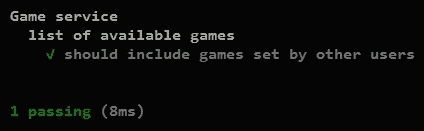
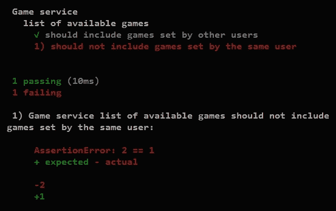

# 第六章。测试 Node.js 应用程序

到目前为止，我们只是通过手动执行来测试我们的代码。随着应用程序的增大，这不是一个可持续的方法。理想情况下，我们应该定期测试我们应用程序的所有功能以检查回归。如果我们继续仅使用手动测试，这将迅速变得耗时且难以承受。维护一系列自动化测试要有效得多。这些测试还带来了许多其他好处，例如，作为我们代码的其他开发者的文档。

在本章中，我们将涵盖以下主题：

+   为我们的应用程序编写自动单元测试

+   介绍新的库来帮助我们编写更详细的测试

+   了解如何在 JavaScript 中创建和使用测试替身

+   使用 HTTP 客户端测试来锻炼我们的应用程序的 Web 界面

+   使用浏览器自动化添加全栈集成测试

+   在扩展我们的代码库时，为编写进一步的测试建立结构

# 在 Node.js 中编写一个简单的测试

Node.js 内置了一个名为 `assert` 的模块，可用于测试。我们可以使用它为我们在 第五章 中编写的游戏服务编写一个简单的测试，即 *Building Dynamic Websites*。我们在 `gameServiceTest.js` 下添加以下代码：

```js
'use strict';

let assert = require('assert');
let service = require('./services/games.js')

// Given
service.create('firstUserId', 'testing');

// When
let games = service.availableTo('secondUserId');

// Then            
assert.equal(games.length, 1);            
let game = games[0];
assert.equal(game.setBy, 'firstUserId');
assert.equal(game.word, 'TESTING');
```

注意，`assert.equal` 函数将实际值作为第一个参数，将预期值作为第二个参数。这与 JUnit 的内置 `Assert.Equals` 和 NUnit 的经典样式 `Assert.AreEqual` 方向相反。正确地处理这些参数很重要，这样当断言失败时，它们会在错误消息中正确显示。

### 小贴士

**Given, When, Then**

在前面的测试中的 *Given*、*When* 和 *Then* 注释并不特定于 JavaScript 或我们将要使用的任何测试框架，但它们通常是一个很好的工具，用于构建测试以保持其专注和可读性。

我们现在可以使用以下命令验证我们的代码：

```js
> node gameServiceTest.js
> echo %errorlevel%

```

退出代码为 `0` 表示我们的测试成功完成，没有任何错误。尽管我们还没有遵循测试驱动开发（先编写一个失败的测试，然后再添加任何新代码），但仍然很重要，要看到每个测试失败以确认它在测试某些内容。尝试修改 `services/games.js` 中的 `availableTo` 函数以返回一个空数组，然后再次运行测试。

不仅我们现在得到了一个非零的退出代码，我们还得到了一个包含我们的断言失败错误的消息。尽管如此，我们的测试输出仍然并不特别吸引人。此外，我们测试脚本中的结构缺失将使得随着测试的增加而难以导航。我们可以通过使用 JavaScript 可用的测试库之一来解决这两个问题。

# 为测试构建代码库的结构

随着我们为应用程序编写更多的测试，我们将从测试的结构化中受益。通常，每个生产模块至少有一个测试文件。同时运行所有测试并查看整体结果也将很有用。

我们将开始在 `test` 目录下添加测试。从本书的这一部分开始，我们也将把所有应用程序代码放在一个 `src` 目录下。这将使导航我们的代码库和保持生产代码与测试代码分离变得更加容易。

如果你在这一部分跟随本书，你应该将 `app.js` 和所有文件夹（除了 `bin` 文件夹）移动到一个新的 `src` 目录下，并在 `bin/www` 中更新启动脚本如下：

```js
var app = require('../src/app');
var debug = require('debug')('hangman:server');
var http = require('http');
```

# 使用 Mocha 编写 BDD 风格的测试

从 C# 或 Java，你可能最熟悉 NUnit、JUnit 等使用的 xUnit 风格的测试。这种风格将测试结构化为类，并将方法名称转换为测试名称。这可能有点限制性，在 JavaScript 测试中并不常见。JavaScript 测试框架利用语言更不结构化和更动态的特性，以提供更大的灵活性。

在 JavaScript 中编写测试有几种不同的风格。最常见的是所谓的**行为驱动开发**（**BDD**）风格，其中我们用普通的英语描述我们应用程序的行为。这是最受欢迎的 JavaScript 测试框架的默认风格。在其他编程平台的框架中也很常见，尤其是 Ruby 的 RSpec。

我们将使用一个流行的测试框架，名为 Mocha。首先，让我们将其添加到我们的应用程序中：

```js
> npm install mocha --save-dev

```

注意，`--save-dev` 将 Mocha 添加到我们的 `package.json` 文件中作为**开发依赖项**。这表示它不需要在我们的生产代码中，并且 `npm` 不需要在生产环境中安装它。我们还将更新此文件，让 `npm` 使用 Mocha 运行我们的测试，如下添加测试脚本：

```js
  "scripts": {
    "start": "node ./bin/www",
 "test": "node node_modules/mocha/bin/mocha test/**/*.js"
  },
```

这告诉 `npm` 当我们从命令行运行 `npm test` 时，使用 Mocha 执行 `/test/` 目录下的脚本作为测试。

### 注意

**Mocha 和 Jasmine**

可用于 JavaScript 的测试框架有很多。最著名的是 Jasmine 和 Mocha。它们具有相似的功能，并且都支持相同的测试编写语法。它们都有很好的文档，两者之间的切换也很容易。

Jasmine 最初旨在测试浏览器中的客户端 JavaScript。Mocha 最初更多地关注测试服务器端 Node.js 代码。

现在，这两个框架都适合任何环境。Jasmine 还包含更多的“电池”，这可以使开始使用它更快。Mocha 将更多功能委托给其他库，使用户能够有更多选择，关于他们更喜欢如何编写测试。

现在我们只需要添加一些测试！Mocha 提供了名为`describe`和`it`的全局函数来结构化我们的测试。这些函数各自接受两个参数：一个描述我们应用程序行为的字符串和一个定义该行为的回调函数。以下代码片段展示了使用 Mocha 重写的我们之前的测试。我们在`test/services/games.js`下添加以下代码：

```js
'use strict';

const assert = require('assert');
const service = require('../../src/services/games.js');

describe('Game service', () => {
    const firstUserId = 'user-id-1';
    const secondUserId = 'user-id-2';

    describe('list of available games', () => { 
        it('should include games set by other users', () => {
            // Given
            service.create(firstUserId, 'testing');

            // When
            const games = service.availableTo(secondUserId);

            // Then
            assert.equal(games.length, 1);
            const game = games[0];
            assert.equal(game.setBy, firstUserId);
            assert.equal(game.word, 'TESTING');
        });
    });
});
```

现在尝试使用`npm test`运行之前的测试。你应该会看到如下输出（确切的外观取决于你使用的控制台）：



注意我们如何得到一个更详细的测试输出。同时注意我们在测试中使用嵌套的 describe 回调来构建应用程序的描述。随着我们添加更多的测试，这个优势变得更加明显。尝试在第一个测试之后添加以下测试：

```js
    it('should not include games set by the same user', () => {
        // Given
        service.create(firstUserId, 'first');
        service.create(secondUserId, 'second');

        // When
        const games = service.availableTo(secondUserId);

        // Then
        assert.equal(games.length, 1);
        const game = games[0];
        assert.notEqual(game.setBy, secondUserId);
    });
```

再次使用`npm test`运行测试。这次，我们从 Mocha 那里得到了一个测试失败：



## 测试之间的状态重置

我们的第二个测试失败了，因为它从服务中检索了两个游戏。但这并不是因为我们的生产代码未能正确过滤游戏。实际上，有两个是由第一个用户创建的游戏。其中一个在之前的测试中被保留了下来。

对于测试来说，它们之间独立且相互隔离是很重要的。为此，我们需要在测试之间清理任何状态。在这种情况下，我们想要删除我们创建的所有游戏。游戏服务没有提供清除所有游戏的方法。我们只能在检索到它们之后逐个删除游戏。这里有几个可供我们选择的方法：

+   我们可以在每个测试期间跟踪我们创建的所有游戏，并在结束时删除它们。这似乎是最明显的解决方案，但它有点脆弱。可能会错过一个游戏，这可能导致后续的测试失败变得令人困惑。

+   我们可以将游戏服务模块重写为导出一个创建新服务函数，并为每个测试实例化一个新的服务。一般来说，尝试在每个测试下创建新的对象以隔离测试是一个好主意。然而，这只有在对象不存储任何外部状态时才有用。我们可能会在以后更改游戏服务的实现，以便将数据存储在外部持久数据存储中。

+   我们可以在游戏服务中添加一个清除方法来清除所有数据。为了支持测试而创建这样的方法并没有错。然而，如果可能的话，最好通过应用程序现有的 API 与之交互。

游戏服务确实提供了一种检索所有当前游戏的方法。我们只需要传入一个与任何游戏设置者不匹配的用户 ID。然后我们可以遍历并删除所有游戏。我们希望在每次测试之前做这件事，可以使用 Mocha 的`beforeEach`钩子：

```js
describe('Game service', () => {
    const firstUserId = 'user-id-1';
    const secondUserId = 'user-id-2';

 beforeEach(() => {
 let gamesCreated = service.availableTo("not-a-user");
 gamesCreated.forEach(game => game.remove());
 });

    describe('list of available games', () => {    
```

如果我们重新运行我们的测试，它们现在都正确通过。Mocha 还有一个`afterEach`钩子，我们可以用它来代替。这会起作用，但测试通过先清理来保护自己比依赖其他测试来清理自己更安全。

# 使用 Chai 进行断言

使我们的测试更具描述性的另一种方法是编写我们的断言。尽管内置的 Node.js 断言模块到目前为止很有用，但它有点有限。它只包含少量简单方法来进行基本断言。

你可能对 Fluent Assertions 或.NET 的 NUnit 约束模型，或者 Java 的 AssertJ 有所了解。与这些相比，Node.js 断言模块可能看起来相当原始。

有几个断言框架可用于 JavaScript。我们将使用 Chai ([`chaijs.com`](http://chaijs.com))，它支持编写断言的三个不同风格。`assert`风格遵循传统的 xUnit 断言，如 JUnit 或 NUnit 的经典模型。`should`和`expect`风格提供了自然语言界面来构建更具描述性的断言。

这些任何风格都是编写测试断言的有效选择。重要的是为你的代码库选择一种风格并始终如一地使用它。我们将在这本书中使用 Chai 的`expect`语法。这是 JavaScript 测试中更常见的风格之一。Jasmine 测试框架内置了遵循类似风格的断言。

让我们首先通过在命令行运行以下命令来安装 Chai：

```js
> npm install chai --save-dev

```

然后更新我们的测试以使用它：

```js
const expect = require('chai').expect;
const service = require('../../src/services/games.js');

...

    it('should include games created by other users', () => {
        // Given
        service.create(firstUserId, 'testing');

        // When
        const games = service.availableTo(secondUserId);

        // Then
 expect(games.length).to.equal(1);
        const game = games[0];
 expect(game.setBy).to.equal(firstUserId);
 expect(game.word).to.equal('TESTING');
    });

    it('should not include games created by the same user', () => {
        // Given
        service.create(firstUserId, 'first');
        service.create(secondUserId, 'second');

        // When
        const games = service.availableTo(secondUserId);

        // Then
 expect(games.length).to.equal(1);
        let game = games[0];
 expect(game.setBy).not.to.equal(secondUserId);
    });
```

由于我们目前只进行简单的断言，所以这个变化并不特别引人注目。但自然语言界面将允许我们以描述性的方式指定更详细的断言。

# 创建测试替身

我们可以为游戏服务编写更多的测试，但现在让我们看看不同的模块。我们如何测试我们的`users`中间件呢？以下代码来自`middleware/users.js`：

```js
module.exports = function(req, res, next) {
    let userId = req.cookies.userId;
    if (!userId) {
        userId = uuid.v4();
        res.cookie('userId', userId);
    }
    req.user = {
        id: userId
    };
    next();
};
```

为了测试这个类，我们需要为与我们的代码交互的`req`、`res`和`next`参数传递参数。我们没有真实的请求、响应或中间件管道可用，因此我们需要创建一些替代值。这样的替代值通常被称为**测试替身**。我们的代码从请求中读取一个属性，并在响应上调用 cookie 方法。我们可以在`test/middleware/users.js`下的新测试脚本中创建这些测试替身，如下所示：

```js
'use strict';

const middleware = require('../../middleware/users.js');
const expect = require('chai').expect;

describe('Users middleware', () => {    
    const defaultUserId = 'user-id-1';
    let request, response;

    beforeEach(() => {
        request = { cookies: {} };
        response = { cookie: () => {} };
    });

    it('if the user already signed in, reads their ID from a cookie and exposes the user on the request', () => {
        // Given
        request.cookies.userId = defaultUserId;

        // When
        middleware(request, response, () => {});

        // Then
        expect(request.user).to.exist;
        expect(request.user.id).to.equal(defaultUserId);
    }); 
});
```

在这里，我们仅仅创建一个普通的 JavaScript 对象来表示请求。这允许我们验证生产代码是否正确地从请求属性中读取和写入。我们只传递响应对象的最小可能输入和 `next` 函数，以允许代码执行。这在 JavaScript 中非常容易做到，部分原因是因为它不是静态类型。在 C# 或 Java 中创建这样的测试替身可能会更加费力，因为编译器会坚持测试替身与相应的参数类型匹配。

我们还需要测试我们的中间件是否调用了链中的下一个中间件，因为这是一个重要的行为。这比仅仅创建一个具有简单属性的对象要复杂一些。我们仍然可以通过定义一个新的函数来创建一个合适的测试替身，该函数记录何时被调用（这种类型的测试替身被称为 **间谍**）：

```js
    it('calls the next middleware in the chain', () => {
        // Given
        let calledNext = false;
        const next = () => calledNext = true;

        // When
        middleware(request, response, next);

        // Then
        expect(calledNext).to.be.true;
    });
```

这工作得非常好，但如果我们要测试更复杂的调用，例如，如果我们想检查多个调用或对传入的参数进行进一步的断言，将会变得比较繁琐。我们可以通过使用一个框架来为我们创建测试替身来简化这个过程。

## 使用 Sinon.JS 创建测试替身

Sinon.JS 是一个用于创建各种测试替身的框架。让我们首先通过在命令行运行以下命令将其安装到我们的应用程序中：

```js
> npm install sinon --save-dev

```

现在，让我们简化之前的测试，并使用 Sinon.JS 创建的测试替身编写一个更复杂的测试：

```js
const expect = require('chai').expect;
const sinon = require('sinon');

...

    it('calls the next middleware in the chain', () => {
          // Given
 const next = sinon.spy();

        // When
        middleware(request, {}, next);

        // Then
        expect(next.called).to.be.true;
    });

 it('if the user is not already signed in, ' +
 'creates a new user id and stores it in a cookie', () => {
 // Given
 request.cookies.userId = undefined;
 response = { cookie: sinon.spy() };

 // When
 middleware(request, response, () => {});

 // Then
 expect(request.user).to.exist;
 const newUserId = request.user.id;
 expect(newUserId).to.exist;
 expect(response.cookie.calledWith(
 'userId', newUserId)).to.be.true;
    });
```

Sinon.JS 间谍会跟踪所有对其发出的调用的详细信息，并提供一个方便的 API 来检查这些信息。这使得我们能够保持测试代码简单易读。除了 `called` 和 `calledWith` 用户属性之外，还有许多其他属性。请查看 Sinon.JS 文档 [`sinonjs.org/docs/#spies-api`](http://sinonjs.org/docs/#spies-api)，以了解我们可以验证间谍所发出的调用的其他方式。

### 注意

**间谍、存根和模拟**

如果你阅读更多 Sinon.JS 的文档，你会看到它非常明确地说明了间谍、存根和模拟之间的区别。这与 Java 和 .NET 中大多数流行的测试替身框架形成对比，这些框架倾向于用相同的名称（通常是模拟或伪造）来调用所有的测试替身。然而，在现实中，大多数测试替身实例通常只充当间谍（用于验证副作用）或存根（用于提供数据或抛出异常以测试错误处理）。真正的模拟会验证特定的调用序列，并返回特定的数据给被测试的代码。尽管 Java 和 .NET 中的一些早期模拟框架只支持这种类型的测试替身（现在有时称为 *严格模拟*），但这不再是常见的做法。这是因为它非常紧密地将测试和生产代码耦合在一起，使得重构变得更加困难。在一个单独的测试中，拥有多个模拟（而不是仅仅一个存根或间谍）的情况尤其罕见。

# 测试 Express 应用程序

虽然使用 Sinon.JS 可以使我们的测试更整洁，但它们仍然依赖于 Express 中间件 API 的细节以及我们如何使用它。这可能适合我们的中间件模块，因为我们想确保它满足特定的契约（特别是调用`next`和设置`request.user`）。但对于大多数中间件来说，尤其是我们的路由，这种方法可能会使我们的测试过于紧密地耦合到我们的实现。

通过向它发送 HTTP 请求并检查响应来测试每个路由的实际行为，而不是检查与请求和响应对象的特定低级交互，会更好。这使我们能够更灵活地更改我们的实现和重构我们的代码，而无需更改测试。因此，我们的测试可以支持这个过程（通过捕获回归），而不是阻碍它（需要更新以匹配我们的实现）。

在其他平台上，测试整个应用程序可能是一个相当重量级的流程。例如，在 Java 中使用 Jetty 或在.NET 中使用 Katana，可以在进程中启动服务器。较新的应用程序框架，如 Spring Boot 或 NancyFx，也使这个过程更容易。尽管如此，这些测试仍然可能是相对缓慢和资源密集型的。

在 Node.js 中，启动应用程序服务器既简单又轻量级。我们只是使用之前看到的相同的`http.createServer`调用，并传递一个应用程序。为了单独测试我们的路由，我们将启动一个新的应用程序，其中只包含这个路由。让我们看看我们如何使用它来测试游戏路由的删除端点。我们在`test/routes/games.js`下添加以下代码：

```js
'use strict';

const http = require('http');
const express = require('express');
const bodyParser = require('body-parser');
const expect = require('chai').expect;
const gamesService = require('../../src/services/games.js');

const TEST_PORT = 5000, userId = 'test-user-id';

describe('/games', () => {
  let server;
  const makeRequest = (method, path, callback) => {
    http.request({
      method: method,
      port: TEST_PORT,
      path: path
    }, callback).end();
  };

  before(done => {
    const app = express();
    app.use(bodyParser.json());
    app.use((req, res, next) => {
      req.user = { id: userId }; next();
    });

    const games = require('../../src/routes/games.js');
    app.use('/games', games);

    server = http.createServer(app).listen(TEST_PORT, done);
  });

  afterEach(() => {
    const gamesCreated = gamesService.availableTo("non-user");
    gamesCreated.forEach(game => game.remove());
  });

  after(done => {
    server.close(done);
  });

  describe('/:id DELETE', () => {
    it('should allow users to delete their own games', done => {
      const game = gamesService.create(userId, 'test');

      makeRequest('DELETE', '/games/' + game.id, response => {
        expect(response.statusCode).to.equal(200);
        expect(gamesService.createdBy(userId)).to.be.empty;
        done();
      });
    });
  });
});
```

这可能看起来像是相当多的代码，但请记住，我们在这里启动的是一个完整的应用程序。此外，大部分的代码将会在多个测试中重复使用。让我们看看它具体做了什么。

`before`回调创建我们的服务器，正如我们在第二章 *“Node.js 入门”*中看到的，监听一个特殊端口供我们的测试使用。它还设置了一些存根中间件来模拟请求中的当前用户。`afterEach`回调清除创建的任何游戏（正如我们在游戏服务测试中之前看到的）。请注意，由于我们运行在同一个进程中，我们可以轻易地与我们的应用程序使用的相同数据层进行交互。最后，`after`函数请求服务器停止监听连接。

测试本身非常简单：我们只是创建一个当前用户（如我们之前的服务测试中所述）的游戏设置，然后发出一个删除它的请求。这使用了我们自己的`makeRequest`函数，该函数简单地调用 Node 的`http.request`。然后我们可以检查响应对象以查找适当的状态码，并检查服务以查看期望的效果。

### 小贴士

**在 Mocha 中编写异步测试**

注意到我们的测试以及上面讨论的所有对 Mocha 的钩子函数的回调（除了 afterEach）都接受一个 `done` 参数。这是因为所有这些测试都执行了一些异步操作。Mocha 使得编写异步测试或钩子变得非常简单：你只需让你的回调函数接受一个参数（按照惯例称为 `done`），并在处理完成后调用它。如果在超时时间内（默认为 2 秒，但可以更改）没有调用，那么 Mocha 会判定测试失败。

让我们再次使用 `npm test` 命令运行我们的测试。注意，尽管我们正在启动整个服务器端应用程序，但所有测试仍然完成得非常快（在我的机器上为数十毫秒）。你可能还会注意到输出有些混乱，这是由于服务器日志输出造成的。我们可以通过以下方式轻松地抑制这种输出：更新 app.js 如下：

```js
//app.use(favicon(path.join(__dirname, 'public', 'favicon.ico')));
if (app.get('env') === 'development') {
 app.use(logger('dev'));
}
app.use(bodyParser.json());
```

Express 应用程序的 `'env'` 属性来自 `NODE_ENV` 环境变量（如果不存在，则默认为开发环境）。这对于区分生产环境和开发环境非常有用。由于它默认为 `development`，因此我们还需要将其设置为其他值，以便在我们的测试中抑制此日志记录。我们可以通过以下方式更新我们的测试脚本 `package.json`：

```js
  "scripts": {
    "start": "node ./bin/www",
 "test": "set NODE_ENV=test && node node_modules/mocha/bin/mocha test/**/*.js"
  },
```

## 使用 SuperAgent 简化测试

虽然我们的测试速度快，设置服务器也很直接，但我们确实有很多用于向服务器发送请求和处理响应的代码。如果我们需要制作更多种类的请求，或者对响应状态码或头信息以外的内容感兴趣，这将会变得更加复杂。

我们可以通过使用提供更简单服务器通信 API 的库来简化我们的测试。SuperAgent ([`visionmedia.github.io/superagent/`](https://visionmedia.github.io/superagent/)) 是一个 JavaScript 库，它提供了一种流畅、易读的语法来制作 HTTP 请求。这可以用于浏览器中的 Ajax 请求，或者像我们在这里所做的那样在 Node.js 应用程序中进行请求。

我们将使用一个名为 SuperTest 的轻量级包装器通过 SuperAgent 来利用它，这使得测试基于 Node.js 的 HTTP 应用程序变得更加方便。

首先，我们使用 `npm` 将 SuperTest 添加到我们的应用程序中，通过在命令行运行以下命令：

```js
> npm install supertest --save-dev

```

现在，我们可以将我们的测试重写如下：

```js
'use strict';

const express = require('express');
const bodyParser = require('body-parser');
const request = require('supertest');
const expect = require('chai').expect;
const gamesService = require('../../src/services/games.js');

const userId = 'test-user-id';

describe('/games', () => {
 let agent, app;

  before(() => {
    app = express();
    app.use(bodyParser.json());
    app.use((req, res, next) => {
      req.user = { id: userId }; next();
    });

    const games = require('../../src/routes/games.js');
    app.use('/games', games);
  });

 beforeEach(() => {
 agent = request.agent(app);
 });

  describe('/:id DELETE', () => {
    it('should allow users to delete their own games', done => {
 const game = gamesService.create(userId, 'test');

 agent
 .delete('/games/' + game.id)
 .expect(200)
 .expect(() =>
 expect(gamesService.createdBy(userId)).to.be.empty)
 .end(done);
    });
  });
});
```

SuperTest 和 SuperAgent 负责启动我们的应用程序服务器，并提供一个更简单的 API 来制作请求。注意使用了一个请求 **代理**，它代表一个单独的浏览器会话。

SuperAgent 提供了多个函数（`get`、`post`、`delete` 等）用于发起 HTTP 请求。这些可以通过对 `expect` 函数的调用进行链式调用（不要与 Chai 的 `expect` 混淆）来验证响应的属性，例如状态码。我们还可以传递一个回调来对响应进行特定检查，或验证副作用（就像我们在前面的例子中所做的那样）。

注意，始终调用 `end` 函数以确保抛出任何期望错误并使测试失败是很重要的。当请求完成时，我们可以传递 Mocha 的 `done` 回调来结束测试。

现在我们已经简化了测试代码，我们可以轻松地为我们的路由添加更多测试。例如，让我们添加一些测试来覆盖删除端点的负面情况：

```js
    it('should not allow users to delete games that they did not set', done => {
      const game = gamesService.create('another-user-id', 'test');
      agent
        .delete('/games/' + game.id)
        .expect(403)
        .expect(() => expect(gamesService.get(game.id).ok))
        .end(done);
    });

    it('should return a 404 for requests to delete a game that no longer exists', done => {
      const game = gamesService.create(userId, 'test');
      agent
        .delete(`/games/${game.id}`)
        .expect(200)
        .end(function(err) {
          if (err) {
            done(err);
          } else {
            agent
              .delete('/games/' + game.id)
              .expect(404, done);
          }
        });
    });
```

# 使用 PhantomJS 进行全栈测试

我们现在已经为应用程序核心的逻辑编写了单元测试，并为服务器端路由编写了集成测试。我们还没有任何自动化测试覆盖我们的视图和客户端脚本，正如我们在前几章中的手动测试所做的那样。

我们可以使用 Mocha 为客户端脚本编写单元测试。然而，我们当前的所有客户端脚本都与服务器交互，因此不是单元测试的理想候选者。我们的手动测试实际上是整个应用程序的全栈测试，包括服务器和客户端之间的交互。

为了在自动化测试中实现这一点，我们需要使用某种形式的浏览器自动化。**PhantomJS** 是一个具有 JavaScript API 的无头浏览器，它允许我们直接自动化它。我们可以使用这个 API 为我们的游戏页面编写一个简单的测试。

首先，我们将在命令行中运行以下命令，在我们的项目中安装 PhantomJS：

```js
> npm install phantomjs-prebuilt --save-dev

```

### 注意

PhantomJS 不是一个 Node.js 模块。它是一个独立的、无头浏览器。npm 模块只是安装它的方便方式，并使其成为项目的依赖项。PhantomJS 不能从 Node.js 中调用，除非作为单独的子进程执行。

现在，我们可以在 `integration-test/game.js` 下实现以下测试：

```js
(function() {
    'use strict';

    var expect = require('chai').expect;
    var page = require('webpage').create();
    var rootUrl = 'http://localhost:3000';

    withGame('Example', function() {
        expect(getText('#word')).to.equal('_______');

        page.evaluate(function() {
            $(document).ajaxComplete(window.callPhantom);
        });

        page.sendEvent('keydown', page.event.key.E);
        page.onCallback = verify(function() {
            expect(getText('#word')).to.equal('E_____E');
            expect(getText('#missedLetters')).to.be.empty;

            page.sendEvent('keydown', page.event.key.T);
            page.onCallback = verify(function() {
                expect(getText('#word')).to.equal('E_____E');
                expect(getText('#missedLetters')).to.equal('T');

                console.log('Test completed successfully!');
                phantom.exit();
            });
        });
    });

    function withGame(word, callback) {
        ...
    }

    function getText(selector) {
        return page.evaluate(function(s) {
            return $(s).text();
        }, selector);
    }

    function verify(expectations) {
        return function() { 
            try {
                expectations();
            } catch(e) {
                console.log('Test failed!');
                handleError(e.message);
            }
        }
    }

    function handleError(message) {
        console.log(message);
        phantom.exit(1);
    }

    phantom.onError = page.onError = handleError;
}());
```

确保应用程序正在运行（使用 `npm start`），然后在命令行中运行以下命令来执行测试：

```js
> node node_modules/phantomjs-prebuilt/bin/phantomjs integration-test/game.js

```

让我们看一下代码，了解它是如何工作的。注意，我们在这里是在浏览器环境中运行，而不是 Node.js，因此回退到 ECMAScript 5 语法（例如，使用 `var` 而不是 `let`，以及没有箭头函数）。

被省略的 `withGame` 方法（你可以在书的配套代码中找到）使用 PhantomJS 加载索引视图并提交一个新的游戏，然后清除 PhantomJS 的 Cookie 并以新用户身份打开游戏，在调用传递给 `withGame` 的回调之前。

在我们的测试中，我们创建了一个猜单词 *example* 的游戏，然后在页面中调用 JavaScript 来对其内容进行断言。`getText` 函数使用 PhantomJS 的 `page.evaluate` 函数在页面上下文中运行一些 JavaScript，并返回一个值。请注意，传递给 `page.evaluate` 的回调函数没有访问我们脚本更广泛的执行上下文。然而，我们可以为 `page.evaluate` 调用指定额外的参数，这就是我们如何传递 jQuery 选择器的方式。

然后，我们再次使用 `page.evaluate` 来设置一个回调，每次 Ajax 请求完成时都会调用。在这里，我们使用 `window.callPhantom`，它在页面上下文中执行，并触发 `page.onCallback`，它在我们的测试上下文中执行。

最后，我们使用 `page.sendEvent` 来在浏览器中触发一个键盘事件。请注意，这不同于在浏览器中使用纯 JavaScript 触发 DOM 事件，而是直接向 PhantomJS 发送指令来模拟 `keypress` 事件，就像它来自用户一样。

如果我们将所有这些放在一起，我们得到以下结果：

+   我们使用 `page.sendEvent` 来模拟按下一个键盘键

+   这导致我们的生产代码发送一个 Ajax 请求

+   当这个请求完成时，在浏览器上下文中调用 `window.callPhantom`

+   这导致 PhantomJS 调用我们的 `page.onCallback` 函数

+   然后，我们在 `page.evaluate` 中使用 jQuery（通过 `getText`）来从页面检索值

文件剩余的内容（`verify` 和 `handleError`）确保 PhantomJS 将所有错误写入控制台，并在失败的情况下设置适当的退出代码。

# 摘要

在本章中，我们学习了如何在 Node.js 中编写单元测试，使用 Mocha 和 Chai 编写更详细的测试，使用 Sinon.JS 创建测试双胞胎，使用 SuperAgent 和 SuperTest 编写应用级别的测试，并在 PhantomJS 中实现全栈测试。

虽然我们现在已经在应用的每一层都有测试，但我们还没有涵盖所有的代码。找到我们应该编写更多测试的任何差距将是有用的。我们还需要调用几个不同的命令来运行所有的单元和集成测试。在下一章中，我们将看到如何将这些和其他过程自动化，作为持续集成构建的一部分。
