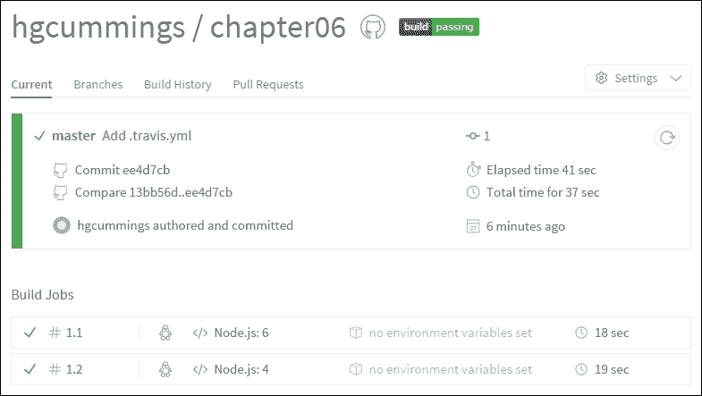

# 第七章. 设置自动化构建

在上一章中，我们通过开始编写自动化测试，从演示应用程序到可维护的代码库迈出了重要的一步。现实世界软件项目的另一个重要组成部分是构建自动化。

自动化构建允许整个团队以一致的方式在项目上工作。执行常见任务的标准方式使得新开发者更容易开始。它还避免了开发者因各种原因得到不同结果而引起的烦恼问题。

在本章中，我们将涵盖以下主题：

+   配置集成服务器以自动构建和运行我们的测试

+   设置自动化任务运行器以简化测试的执行

+   自动化更多任务以帮助维护编码标准和测试覆盖率

# 设置集成服务器

构建和测试自动化允许通过**集成服务器**验证代码更改，这是一个独立于个人开发者机器的自动化服务器。这有助于通过早期捕获错误或回归来保持项目稳定。集成服务器可以自动提醒引入问题的开发者。然后，他们有机会在问题对整个团队或项目造成影响之前修复问题。

在每次提交时自动构建代码库和运行测试被称为**持续集成**（**CI**）。有许多 CI/构建服务器可用。这些可以是自托管的，也可以作为第三方服务提供。你可能之前使用过的例子包括 Jenkins（以前称为 Hudson）、Atlassian Bamboo、JetBrains TeamCity 和微软的 Team Foundation Server。

我们将使用 Travis CI ([`travis-ci.org/`](https://travis-ci.org/))，这是一个托管服务，用于运行自动化构建。对于公共源代码仓库，它是免费的。为了使用 Travis CI 的免费服务，我们需要将我们的应用程序代码托管在公共 GitHub 仓库中。

## 设置公共 GitHub 仓库

如果你已经根据本书的内容熟悉了示例应用程序代码，并且已经熟悉 GitHub，你可以将你的代码推送到你自己的新 GitHub 仓库。否则，你可以从示例章节仓库中 fork 一个。

如果你想要跟随本章的变化，请使用[`github.com/NodeJsForDevelopers/chapter06/`](https://github.com/NodeJsForDevelopers/chapter06/)。这包含了第六章末尾的示例代码，我们将在此基础上构建。你可以使用 GitHub 上的**Fork**按钮创建这个仓库的自己的 fork。当你访问之前提到的 URL 时，它应该出现在屏幕的右上角：


这将在你的 GitHub 账户下创建一个新的仓库，以示例代码作为起点。

### 注意

这就是本章开始所需的所有内容。然而，如果你不熟悉 Git 和/或 GitHub 并想了解更多信息，你可以在[`help.github.com/`](https://help.github.com/)找到更多信息。

## 在 Travis CI 上构建项目

现在，我们将设置在 Travis CI 上为我们应用程序构建。如果你在上一节中创建了您自己的公共仓库，你可以亲自尝试。访问[`travis-ci.org`](https://travis-ci.org)并使用 GitHub 登录。你应该会看到一个列出你的仓库的个人资料页面。启用你刚刚创建的仓库。

我们必须创建一个简单的`config`文件来告诉 Travis CI 在什么环境下构建我们的应用程序。按照以下方式在项目的根目录中创建一个文件（注意文件名中的前导点`.travis.yml`）：

```js
language: node_js
node_js:
 - 6
 - 4
```

这指示 TravisCI 使用当前稳定和长期支持版本的 Node.js（截至写作时）来构建我们的项目。如果你熟悉 Git，你可以在本地仓库的克隆版本中做出这个更改，提交并推送到 master。如果你是 Git 的新手，最简单创建此文件的方法是导航到你的仓库在[`github.com`](https://github.com)上，并点击**新建文件**按钮。这将打开一个基于网页的编辑器，你可以从中创建和提交文件。

一旦你将此文件添加到你的仓库中，再次访问[`travis-ci.org`](https://travis-ci.org)。现在你应该会看到你仓库的通过构建：



TravisCI 为我们指定的每个 Node.js 版本构建了我们的项目两次。如果你点击任何一个构建，你可以看到命令行输出。注意 TravisCI 自动使用标准的`npm test`命令运行了我们的测试。

# 使用 Gulp 自动化构建过程

很好，TravisCI 自动运行了我们的测试。但这不是我们想要自动化的唯一任务。当然，由于 JavaScript 是一种解释型语言，我们在构建过程中没有编译步骤。我们还想执行其他任务，例如检查我们的代码风格、运行集成测试和收集代码覆盖率。我们可以使用构建工具来自动化这些任务，并允许我们以一致的方式运行它们。你之前可能在使用.NET 时使用过 MSBuild，或者使用过 Java 工具，如 Maven 或 Gradle。

对于 Node.js，有几种不同的构建工具可用。最受欢迎的两个是 Grunt 和 Gulp。它们都有庞大的社区和广泛的功能插件，用于执行不同的操作。Grunt 的模型是每个操作读取文件并将其写回文件系统。Gulp 使用 Node.js 流将处理从一项操作传递到下一项操作。

Grunt 的模型稍微简单一些，可能更容易上手，特别是如果你有适度的构建需求。Gulp 的模型对于某些类型的任务来说可能更快，并且可以减少你需要编写的构建配置代码的数量。两者都是优秀的、受良好支持的构建工具。我们将使用 Gulp，但本章中我们做的所有事情也可以用 Grunt 实现。

## 使用 Gulp 运行测试

我们首先需要安装 Gulp，既要在全局范围内（将其添加到我们的路径中）也要在项目中安装。然后我们添加 Gulp 插件来控制 Mocha 和环境变量：

```js
> npm install -g gulp-cli
> npm install gulp@~3.x --save-dev
> npm install gulp-mocha --save-dev
> npm install gulp-env --save-dev

```

现在我们为 Gulp 添加一个配置文件到我们的项目中。按照惯例，Gulp 会寻找一个名为 `gulpfile.js` 的文件：

```js
'use strict';

const gulp = require('gulp');
const mocha = require('gulp-mocha');
const env = require('gulp-env');

gulp.task('test', function() {
  env({ vars: { NODE_ENV: 'test' } });
  return gulp.src('test/**/*.js')
    .pipe(mocha());
});

gulp.task('default', ['test']);
```

这创建了一个测试任务，并创建了一个空的默认任务来运行它。`'default'` 任务名称是特殊的，当我们在命令行中运行 `gulp` 时将会调用它。我们现在可以从 `package.json` 中删除我们的测试脚本，并更新我们的 `.travis.yml` 文件以运行 Gulp：

```js
language: node_js
before_script:
 - npm install -g gulp
script: gulp
node_js:
 - 6
 - 4 
```

这还没有给我们带来太多好处。我们现在只是有一个稍微简短的命令来执行我们的测试。然而，随着我们添加更多自动化任务，使用构建工具将变得更加有价值。让我们看看我们可能希望将哪些其他过程纳入我们的构建中。

# 使用 ESLint 检查代码风格

虽然我们不需要编译器，但我们仍然可以从计算机对我们代码的静态分析中受益。代码检查工具在许多语言中很常见，用于发现可能导致微妙错误或混乱代码的常见编程错误。你可能熟悉 .NET 的 CodeRush、StyleCop 以及其他工具，或者 Java 的 CheckStyle、Findbugs、Sonar 以及其他工具。

我们将使用一个名为 ESLint 的 JavaScript/ECMAScript 代码检查工具。让我们首先全局安装它：

```js
> npm install -g eslint

```

现在创建一个配置文件来告诉 ESLint 使用哪些规则，作为 `.eslintrc.json`：

```js
{
    "extends": "eslint:recommended",
    "env": {
        "node": true,
        "es6": true,
        "mocha": true,
        "browser": true,
        "jquery": true
	},
    "rules": {
        "semi": [2, "always"],
        "quotes": [2, "single"]
    }
}
```

在这里，我们告诉 ESLint 在我们的脚本中使用的环境中使用其标准推荐规则。我们还告诉它检查语句末尾的分号，并优先使用单引号。你可以按照以下方式运行 ESLint：

```js
> eslint **/*.js

```

ESLint 输出它找到的所有错误，包括以下内容：

+   app.js 中的一个未使用的 `favicon` 本地变量

+   在各种中间件函数中未使用的 `next` 参数

+   在我们的 PhantomJS 集成测试中使用 `console.log`

+   在我们的 PhantomJS 集成测试中使用 `phantom` 变量

这些问题中最简单的一个是：我们可以直接删除变量声明（这是由第二章的 express 应用程序模板为我们创建的，第二章，*Node.js 入门*）。我们也可以对中间件函数上的 `next` 参数做同样处理。然而，我更喜欢中间件函数有一个标准且易于识别的签名。而不是删除这个参数，我们可以告诉 ESLint 忽略这个特定的参数，如下所示：

```js
    "rules": {
        "semi": [2, "always"],
        "quotes": [2, "single"],
 "no-unused-vars": [2, {"argsIgnorePattern": "next"}]
    }
```

最后两个项目符号都与我们的 PhantomJS 集成测试相关。这是一个相当特殊的文件，所以我们将特别更改 ESLint 对此文件的行为，使用注释指令。我们可以在有问题的文件 `integration-test/game.js` 的最顶部添加以下指令：

```js
/*eslint-env phantomjs */
/*eslint-disable no-console */
```

这些指令中的第一个告诉 ESLint，此脚本文件将在 PhantomJS 环境中运行，其中 `phantom` 变量将为我们提供，因此 ESLint 不需要警告我们引用它。第二个指令禁用了 ESLint 对使用 console logging 的规则。

如果你再次运行 ESLint，你应该会发现之前列出的错误已经消失。任何剩余的错误应该是较小的问题，例如缺少分号或不一致的引号使用。这些问题应该很快就能手动修复，但实际上，ESLint 可以为我们做这件事，正如我们将在下一节中看到的。

## 在 ESLint 中自动修复问题

ESLint 能够自动纠正它发现的一些问题。如果 ESLint 目前没有报告任何错误，尝试从项目的一个源文件中移除一个分号。运行 ESLint，你应该会看到一个关于这个的错误。

现在按照以下方式运行 ESLint 并使用 `--fix` 选项：

```js
> eslint **/*.js --fix

```

ESLint 为我们替换了分号。并不是 ESLint 的所有规则都可以以这种方式修复，但许多规则可以。这取决于规则错误是否总是有一个单一且明确的修复。包括哪些规则可以修复的完整列表可以在 ESLint 网站上找到，网址为 [`eslint.org/docs/rules/`](http://eslint.org/docs/rules/)。

现在你应该能够运行 ESLint 而没有任何错误或警告。ESLint 现在准备好捕捉我们编写的新代码中的错误。

## 从 Gulp 运行 ESLint

为我们的 Phantom 集成测试指定特殊排除项有些杂乱。不幸的是，我们还全局启用了 Node.js、Mocha、浏览器和 jQuery 环境。Mocha 环境只需要在我们的测试代码中使用。浏览器和 jQuery 环境只需要在我们的客户端代码中使用，而 Node.js 环境则不需要。

如果我们分别在不同的文件集上运行 ESLint，这将更容易管理。如果我们手动这样做，这会开始变得繁琐且容易出错。但这是一个构建工具的绝佳用例。我们可以使用 Gulp 为不同的文件集设置单独的 ESLint 配置文件。首先，安装 Gulp ESLint 插件：

```js
> npm install gulp-eslint --save-dev

```

现在我们可以创建 Gulp 任务来检查每一组源代码。默认情况下，`gulp-eslint` 插件使用我们 `.eslintrc.json` 文件中的规则。因此，我们可以将其缩减为只与所有源代码相关的规则：

```js
{
    "extends": "eslint:recommended",
    "rules": {
        "no-unused-vars": [2, { "args": "after-used" }],
        "quotes": [2, "single"],
        "semi": [2, "always"]
    }
}
```

然后，我们可以在各自的 Gulp 任务中指定每一组源代码的相关规则或环境。这也允许我们从集成测试脚本的顶部移除特殊的指令注释：

```js
const eslint = require('gulp-eslint');

gulp.task('lint-server', function() {
    return gulp.src(['src/**/*.js', '!src/public/**/*.js'])
        .pipe(eslint({
            envs: [ 'es6', 'node' ],
            rules: {
                'no-unused-vars': [2, {'argsIgnorePattern': 'next'}]
            }
        }))
        .pipe(eslint.format())
        .pipe(eslint.failAfterError());
});

gulp.task('lint-client', function() {
    return gulp.src('src/public/**/*.js')
        .pipe(eslint({ envs: [ 'browser', 'jquery' ] }))
        .pipe(eslint.format())
        .pipe(eslint.failAfterError());
});

gulp.task('lint-test', function() {
    return gulp.src('test/**/*.js')
        .pipe(eslint({ envs: [ 'es6', 'node', 'mocha' ] }))
        .pipe(eslint.format())
        .pipe(eslint.failAfterError());
});

gulp.task('lint-integration-test', function() {
    return gulp.src('integration-test/**/*.js')
        .pipe(eslint({
            envs: [ 'browser', 'phantomjs', 'jquery' ],
            rules: { 'no-console': 0 }
        }))
        .pipe(eslint.format())
        .pipe(eslint.failAfterError());
});
```

最后，我们将任务之间的依赖关系连接起来：

```js
gulp.task('test', ['lint-test'], function() {
  env({ vars: { NODE_ENV: 'test' } });
  return gulp.src('test/**/*.js')
    .pipe(mocha());
});

gulp.task('lint', [
 'lint-server', 'lint-client', 'lint-test', 'lint-integration-test'
]);
gulp.task('default', ['lint', 'test']);
```

在这里，我们让 `test` 任务依赖于 `lint-test`，并创建一个新的整体 `lint` 任务来运行所有其他任务作为默认构建的一部分。尝试运行 Gulp 并观察输出。注意，它并行启动所有 lint 任务，但在运行测试之前等待 `lint-test` 完成。默认情况下，如果可能，Gulp 将并发运行任务。如果一个任务在结束时返回一个流（从 `gulp.src` 获得的对象），Gulp 能够使用这个流来检测任务何时完成。Gulp 将在开始任何依赖于它的任务之前等待任务完成。

为了了解 ESLint 失败如何影响 Gulp，让我们添加另一个 ESLint 规则，以确保使用 JavaScript 的严格模式，如第三章“JavaScript 入门”中所述。以下代码来自 `.eslintrc.json`：

```js
{
    "extends": "eslint:recommended",
    "rules": {
        "no-unused-vars": [2, { "args": "after-used" }],
        "quotes": [2, "single"],
        "semi": [2, "always"],
 "strict": [2, "safe"]
    }
}
```

ESLint 足够聪明，能够根据每组文件指定的环境来确定如何应用严格模式：对于客户端脚本在函数顶部，对于将成为 Node.js 模块的文件全局应用。它还会发现我们无必要多次指定严格模式，无论是全局还是嵌套函数中。

当你执行 Gulp 时，注意 ESLint 任务中的失败会阻止依赖的测试任务运行。如果你修复了严格模式错误，那么 Gulp 将再次成功运行。

# 收集代码覆盖率统计信息

尽管我们对我们的应用程序有一些测试，但它们当然还没有全面。能够看到我们的代码哪些部分被测试覆盖将很有用。为此，我们将使用 Istanbul，一个 JavaScript 代码覆盖率工具。首先，安装 `gulp-instanbul` 插件：

```js
> npm install gulp-istanbul --save-dev

```

现在，我们需要添加一个 Gulp 任务来为我们的生产代码进行覆盖率测试：

```js
const istanbul = require('gulp-istanbul');

...

gulp.task('instrument', function() {
    return gulp.src('src/**/*.js')
        .pipe(istanbul())
        .pipe(istanbul.hookRequire())
});
```

最后，我们需要更新我们的测试任务以输出覆盖率报告，并在低于阈值时失败构建：

```js
gulp.task('test', ['lint-test', 'instrument'], function() {
    gulp.src('test/**/*.js')
        .pipe(mocha())
 .pipe(istanbul.writeReports())
 .pipe(istanbul.enforceThresholds({
 thresholds: { global:90 }
 }));
});
```

现在，当我们运行 Gulp 时，会出现三个新的结果：

+   在命令行上出现覆盖率摘要

+   一组覆盖率报告出现在 `coverage` 文件夹下

+   构建失败是因为我们的覆盖率低于阈值

命令行上的构建摘要非常有用。在 `coverage/lcov-report/index.html`（项目目录中）出现的 HTML 报告中还有更多详细信息。

尽管我们需要提高测试覆盖率，但我们不想让构建失败。目前，我们将覆盖率目标设置在当前水平以下，以防止进一步下降。我们可以通过传递给 `istanbul.enforceThresholds` 的选项来实现这一点：

```js
gulp.task('test', ['lint-test', 'instrument'], function() {
    return gulp.src('test/**/*.js')
        .pipe(mocha())
        .pipe(istanbul.writeReports())
        .pipe(istanbul.enforceThresholds({
 thresholds: {
 global: {
 statements: 70,
 branches: 50
 }
 }
        }));
});
```

# 从 Gulp 运行集成测试

Gulp 任务只是普通的 JavaScript 函数，因此可以包含我们喜欢的任何功能。让我们看看一个更复杂的使用案例。我们将创建一个任务，启动我们的服务器，运行集成测试，然后关闭服务器。为此，我们需要 Gulp Shell 插件：

```js
> npm install gulp-shell --save-dev

```

首先，我们更新我们的集成测试脚本，以便我们可以传递测试服务器的端口号。这使用了 PhantomJS 的 `'system'` 模块，如下所示（在 `integration-test/game.js` 中）：

```js
var rootUrl = 'http://localhost:' +
                  require('system').env.TEST_PORT || 3000;
```

现在，我们可以定义一个 Gulp 任务来运行服务器和集成测试：

```js
const shell = require('gulp-shell');

...

gulp.task('integration-test',
          ['lint-integration-test', 'test'], (done) => {
  const TEST_PORT = 5000;
  let server = require('http')
    .createServer(require('./src/app.js'))
    .listen(TEST_PORT, function() {
      gulp.src('integration-test/**/*.js')
        .pipe(shell('node node_modules/phantomjs-prebuilt/bin/phantomjs <%=file.path%>', {
            env: { 'TEST_PORT': TEST_PORT }
        }))
        .on('error', () => server.close(done))
        .on('end', () => server.close(done))
    });
});
```

这将启动应用程序，然后利用 `gulp-shell` 插件来执行我们的集成测试脚本。最后，我们确保在完成后关闭服务器，通过传递 Gulp 的异步回调。就像返回一个流一样，使用这个回调允许 Gulp 知道任务何时完成。

我们使这个任务依赖于 `test` 任务，这样它们就不会相互干扰。我们不将这部分作为我们的默认任务，因为它是一个更重的操作。但我们确实希望它在我们的构建服务器上运行，所以我们将它添加到 `.travis.yml` 中，与默认任务一起：

```js
language: node_js
before_script:
  - npm install -g gulp
script: gulp default integration-test
node_js:
 - 5
 - 4
```

现在，如果我们向远程主分支推送，TravisCI 将对我们的代码执行静态分析，执行所有单元和集成测试，并检查单元测试覆盖率。

# 摘要

在本章中，我们使用 Travis CI 设置了一个集成构建，使用 ESLint 添加了代码的静态分析，使用 Gulp 自动化了我们的测试和其他任务，并开始使用 Istanbul 工具测量测试覆盖率。

现在我们已经建立了稳定开发的基础设施，我们可以开始扩展我们的项目。在下一章中，我们将向应用程序引入持久化数据存储。
