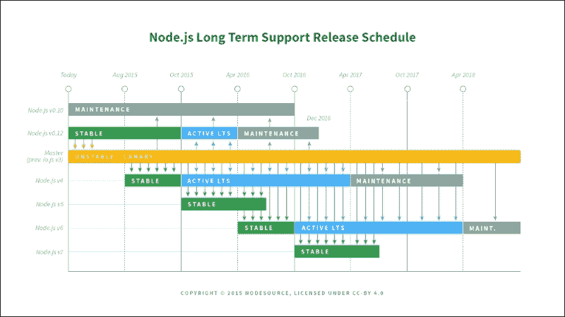

# 第十四章 Node.js 与其超越

到目前为止，这本书已经向您展示了如何在各种用例中与 JavaScript 和 Node.js 一起工作。在本章中，我们将探讨 JavaScript 生态系统如何持续发展。我们还将看到.NET 和 JavaScript 生态系统如何相互影响，以及如何在单个项目中集成它们。

虽然到目前为止的章节旨在引导您进入 Node.js 和 JavaScript 的道路，但本章旨在绘制剩余的领域。前几章已经对单个主题进行了深入的逐步覆盖。本章将涵盖更广泛的主题范围，并提供进一步阅读的资源链接。

在本章中，我们将：

+   理解 Node.js 和 JavaScript 如何持续发展

+   介绍一些新的和即将推出的 JavaScript 语言特性

+   查看 Node.js 和 Web 的替代编程语言

+   考虑适用于.NET 编程的 Node.js 原则

+   了解如何将 Node.js 与.NET 集成

# 理解 Node.js 版本控制

如第一章中所述，*为什么选择 Node.js？*，2015 年 Node.js v4 的发布显示了该平台正在走向成熟。如果您在 2015 年底之前使用过 Node.js，您会看到如 v0.8.0 或 v0.12.0 之类的版本号。那么为什么会有 v4.0.0 的跳跃呢？

## Node.js 简史

Node.js 是一个有企业赞助的开源项目，赞助商为 Joyent。这意味着一个公司对 Node.js 的发展方向有很大的影响力，但任何人都可以创建自己的源代码分支。这正是 2014 年底发生的事情。一组 Node.js 的主要贡献者将项目拆分，创建了一个新的分支，名为**io.js**。io.js 的一些关键特性包括：

+   更为开放的治理模式

+   更为规律的发布周期，与底层 V8 引擎保持更紧密的同步，以利用性能改进和新的 JavaScript 语言特性

+   转向语义版本控制（见[`semver.org/`](http://semver.org/)），导致主版本号增加更快

在 2015 年期间，Node.js 项目重塑自身以承担上述特性并与 io.js 保持一致。2015 年 9 月，Node.js v4 的发布将两个项目重新整合到一个新的治理模式之下。Node.js v4 取代（并合并）了 Node.js v0.12 和 io.js v3.3。您可以在[`nodejs.org/en/about/governance/`](https://nodejs.org/en/about/governance/)了解更多关于新治理模式的信息。

## 介绍 Node.js 长期支持（LTS）计划

Node.js 的发布时间表现在遵循一个常规的日程。每 6 个月就会有一个新的稳定版本发布。每个稳定分支都会收到修复以及成熟的新特性。稳定版本的寿命交替如下（如下表所示）：

+   奇数分支存活 9 个月

+   偶数分支在 6 个月后进入 **长期支持**（**LTS**）阶段，只接收错误修复，没有新特性

+   长期支持持续 30 个月，最后 12 个月为维护模式（仅修复关键错误）



你可以在 [`github.com/nodejs/LTS`](https://github.com/nodejs/LTS) 找到更多关于 LTS 模型的详细信息。

LTS 模型使你能够对 Node.js 作为应用程序平台有信心。本书中的代码针对 Node.js v6，这是出版时的当前稳定版本。这个版本将一直处于 LTS 状态，直到 2019 年 4 月，大约三年后。

# 理解 ECMAScript 版本

ECMAScript 是 JavaScript 语言的正式标准。语言的前三个版本发生在 1997 年至 1999 年之间。在 2009 年 12 月的 ECMAScript 5 之前有一个 10 年的间隔。ES5 引入了很少的新特性，并专注于清理语言。它引入了严格模式，并解决了早期版本中的各种不一致性、缺陷或陷阱。

2015 年对语言和版本方法都进行了重大改变。ECMAScript 2015（以前称为 ECMAScript 6）引入了许多重要的新语言特性。这些包括类、`let`/`const` 关键字和块作用域、箭头函数和原生的承诺。在本章的剩余部分，我们将探讨 ES2015 中的一些其他重要新特性。

从 ES6 到 ES2015 的名称变更表明了一个新的年度版本模型。从 2015 年开始，每年都会有新的 ECMAScript 标准版本。尚未准备好的计划特性将等待下一年。因此，ECMAScript 2016 是一个小版本，只包含几个新特性。

注意，ECMAScript 是一个标准，新特性被实现需要时间。实际上，一些 ES2015 的特性在流行浏览器的 JavaScript 引擎中仍然缺失。不过，主要的浏览器供应商都是 ECMAScript 标准流程的一部分。因此，浏览器，尤其是 Chrome 的 V8 引擎（Node.js 所使用），通常不会落后于最新的标准太远。

# 探索 ECMAScript 2015

我们已经在本书中使用了 ES2015 的许多新特性，例如箭头函数、模板字符串和承诺。我们已经在 第三章 *JavaScript 入门* 中看到了 ES2015 的类语法。

ES2015 是语言的一个重大更新，包括许多新特性和语法改进。本节将涵盖一些我们在本书中尚未见到的其他有用改进。要全面了解 ES2015 中的所有新特性，请参阅优秀的《探索 ES6》，可在 [`exploringjs.com/es6/`](http://exploringjs.com/es6/) 获取。

## 理解 ES2015 模块

如前几章所述，ES2015 引入了一种新的模块规范。回想一下第四章，*介绍 Node.js 模块*，每个模块系统都提供以下功能：

+   声明具有名称和自身作用域的模块的方式

+   定义模块提供功能的方式

+   将模块导入到另一个脚本中的方式

模块的作用域限定在其包含的文件中，就像 CommonJS 一样。模块通过一个新的`export`关键字提供功能。在表达式前加上`export`相当于将其作为`module.exports`变量的属性。特殊的`default export`相当于将`module.exports`的值赋给它。模块使用`import`关键字导入，而不是特殊的`require`函数。还有一个额外的限制：导入必须位于脚本顶部，在所有条件块或其他逻辑之前。

这些可能看起来像是微小的语法变化，但它们有着重要的含义。因为定义和导入模块不涉及赋值和方法调用，模块之间的依赖结构是静态的。这允许 JavaScript 引擎优化模块的加载（这在浏览器中尤为重要）。这也意味着可以解决模块之间的循环依赖。

你可以在[`jsmodules.io/`](http://jsmodules.io/)了解更多关于新的 ES2015 模块语法的详细信息。

## 使用 ES2015 的语法改进

在本节中，我们将探讨一些 ES2015 中的一些新语法特性，这些特性我们在书中还没有使用过。这些特性在最新的 JavaScript 引擎中都是可用的，包括 Node.js v6。

### for... of 循环

假设我们定义了一个如下所示的数组：

```js
let myArray = [1, 2, 3];
```

让我们再假设另一个库已经为所有数组添加了一个辅助函数。可能类似于我们在第十三章中提到的`flatMap`函数，第十三章：创建 JavaScript 包。

```js
Array.prototype.flatMap = function(callback) {
    return Array.prototype.concat.apply([], this.map(callback));
};
```

如果你想要遍历数组的所有成员，你可能倾向于使用 JavaScript 的`for... in`结构，如下所示：

```js
for (let i in myArray) {
    console.log(myArray[i]);
}
```

然而，这并不太有效，因为它包括了数组原型的属性，并打印出了`flatMap`函数以及数组中的元素。这是`for... in`循环的一个常见问题，无论是与对象还是数组一起使用时。避免这种情况的标准方法是跳过原型属性，如下所示：

```js
for (let i in myArray) {
    if (myArray.hasOwnProperty(i)) {
        console.log(myArray[i]);
    }
}
```

这将只打印出数组的元素，正如我们所期望的。类似的循环也可以用来打印对象的属性，而不会意外地尝试打印出原型上的函数（这些函数可能是由第三方库添加的）。

注意，`for... in` 在技术上并不保证迭代对象键的顺序。这意味着它并不是与数组一起使用的最佳选择，因为我们期望特定的顺序。这就是为什么标准的方法是使用普通的 `for` 循环来遍历数组，如下所示：

```js
for (let i = 0; i < myArray.length; ++i) {
    console.log(myArray[i]);
}
```

ES2015 通过引入新的 `for... of` 循环来解决这些问题，其语法如下：

```js
for (let value of myArray) {
    console.log(value);
}
```

语法与 `for... in` 循环非常相似。然而，你不需要过滤原型成员，因为这些成员被排除在外。它可以与任何可迭代对象（如数组）一起使用，并遵循可迭代对象的自然顺序。简而言之，`for... of` 循环就像 `for... in` 循环，但没有任何令人不快的惊喜。

### 扩展运算符和剩余参数

**扩展运算符** 允许你将数组视为一系列值。例如，要调用一个函数：

```js
let myArray = [1, 2, 3];
let myFunc = (foo, bar, baz) => (foo + bar) * baz;
console.log(myFunc(...values)); // Prints 9
```

你还可以在数组字面量中使用扩展运算符，例如：

```js
let subClauses = ['2a', '2b', '2c'];
let clauses = ['1', '2', ...subClauses, '3'];
    // Equivalent to ['1', '2', '2a', '2b', '2c', '3']
```

**剩余参数** 语法具有相反的作用，将一系列值转换为一个数组。这与 C# 中的 `params` 关键字或 Java 中的 `varargs` 类似。例如：

```js
function foldLeft(combine, initial, ...values) {
    let result = initial;
    for (let value of values) {
       result = combine(result, value);
    }
    return result;
}
console.log(foldLeft((x, y) => x+y, 0, 1, 2, 3, 4)); // Prints 10
```

### 解构赋值

**解构**允许你使用结构化语法一起分配多个变量。例如，你可以使用数组字面量语法来解构数组：

```js
let foo, bar;
[foo, bar] = [1, 2]; // Equivalent to foo = 1, bar = 2
```

你还可以将解构与扩展运算符结合使用：

```js
[foo, bar, ...rest] = [1, 2, 3, 4, 5];
    // Equivalent to foo = 1, bar = 2, rest = [3, 4, 5]
```

最后，你可以使用对象字面量语法进行解构：

```js
{ foo, bar } = { foo: 1, bar: 2 }; // Equivalent to foo=1, bar=2
```

解构对于处理复杂的返回值特别有用。想象一下，如果上述示例中等于号右侧的任何表达式实际上是函数调用。

解构对于在单个语句中执行多个赋值也很有用。例如：

```js
[foo, bar] = [bar, foo]; // Swap foo and bar in place
[previous, current] = [current, previous + current];
    // Calculation step for a Fibonacci sequence
```

## 介绍生成器

ES2016 引入了 **生成器函数** 和 `yield` 关键字。你可能已经熟悉 C# 中的 `yield` 关键字。返回 `IEnumerable`/`IEnumerator` 的方法可以包含 `yield` 关键字，一次返回一个元素，直到请求下一个值时才暂停方法的执行。你可以在 JavaScript 中的生成器函数中做同样的事情。以下是一个 JavaScript 实现的示例，它来自 C# 的 `yield` 的 MSDN 文档中的一个示例。它打印出 2 的前八个幂（注意函数关键字后面的星号，表示这是一个生成器函数）：

```js
'use strict';
function* powers(number, exponent) {
    let result = 1;
    for (let i = 0; i < exponent; ++i) {
        result = result * number;
        yield result;
    }
}
for (let i of powers(2, 8)) {
    console.log(i);
}
```

注意，`for... of` 循环与生成器一起工作。上面的循环等同于以下代码：

```js
let generator = powers(2, 8);
let current = generator.next();
while (!current.done) {
    console.log(current.value);
    current = generator.next();
}
```

你可以看到生成器与 C# 中的 `IEnumerator` 接口非常相似。注意，尽管如此，它们的功能要强大一些。我们还可以将一个值传递到生成器的 `next` 方法中，以便在生成器函数继续执行时使用。以下是一个示例来说明这一点：

```js
'use strict';
function* generator() {
    let received = yield 1;
    console.log(received);
    return 3;    
}
let instance = generator();
let first = instance.next();
console.log(first);
let last = instance.next(2);
console.log(last);
```

运行前面的示例会产生以下输出：

```js
> { value: 1, done: false }
> 2
> { value: 3, done: true }

```

这种双向通信使得生成器在 JavaScript 中远不止是 `IEnumerator`。它们是一种强大的控制流机制，尤其是在与承诺结合使用时。参见[`www.promisejs.org/generators/`](https://www.promisejs.org/generators/)，了解如何使用生成器和承诺（用 `yield` 代替 C# 的 `await` 关键字）实现类似 C# 的 `async`/`await` 功能。还值得注意的是，`async` 函数计划在 ECMAScript 的未来版本（可能是 ES2017）中实现，并且将以类似的方式工作。在此期间，您可以使用 bluebird 库提供的 `Promise.coroutine` 方法实现类似的编程模型，该方法基于生成器。有关详细信息，请参见[`bluebirdjs.com/docs/api/promise.coroutine.html`](http://bluebirdjs.com/docs/api/promise.coroutine.html)。

# 介绍 ECMAScript 2016

如本章前面所述，ECMAScript 2016 是一个小版本，只包含几个新功能。这些是一个用于数组的 `includes` 方法以及指数运算符 `**`。

您可以使用 `myArray.includes(value)` 代替 `myArray.indexOf(value) !== -1`。请注意，这些表达式并不完全等价。您可以使用 `includes` 在数组中检查值 `NaN`，这是您无法使用 `indexOf` 做到的。

指数运算符允许您将 `Math.pow(coefficient, exponent)` 重写为 `coefficient ** exponent`。

您还可以将其与赋值结合使用，例如 `myVariable **= 2`。

# 超越 JavaScript

如果您想针对浏览器或 Node.js，JavaScript 是这些环境中唯一原生支持的编程语言。这与基于虚拟机的环境（如 .NET 运行时和 JVM）不同，这些环境支持多种语言。

.NET 运行时支持 C#、F#、VB.NET 等语言。JVM 支持 Java、Scala、Clojure 等语言。这些语言通过将代码编译成环境虚拟机的汇编语言来工作。在 .NET 中这是公共中间语言（CIL），在 JVM 的情况下是 Java 字节码。

尽管如此，程序员并不都编写 CIL 或 Java 字节码，这也有原因。这些都是低级机器语言，比 C#、Java 等语言要少有人性化。一般来说，高级语言可以支持更高的生产力，以及安全性（例如，通过类型系统和内存管理）。

.NET 程序员并不总是使用 C#，JVM 程序员也不总是使用 Java，这也有原因。不同的语言可以更好地满足不同的用例。这也可以仅仅是个人对特定语言语法的喜好问题。

JavaScript 被称为“Web 的汇编语言”([`www.hanselman.com/blog/JavaScriptIsAssemblyLanguageForTheWebSematicMarkupIsDeadCleanVsMachinecodedHTML.aspx`](http://www.hanselman.com/blog/JavaScriptIsAssemblyLanguageForTheWebSematicMarkupIsDeadCleanVsMachinecodedHTML.aspx))。虽然 JavaScript 不是低级或机器语言，但它是其平台上的通用语言。像 CIL 和 Java 字节码一样，它可以作为其他语言的编译目标。而且，像.NET 和 JVM 一样，开发者对同一平台上的多种语言有需求。

## 探索编译到 JavaScript 的语言

有几种语言通过编译成 JavaScript 来支持 Web 和 Node.js 开发。在本节中，我们将探讨其中一些较为突出的语言。

### TypeScript

TypeScript 语言由 Microsoft 开发和支持。其关键目标是包括有助于大规模应用程序开发的特性。TypeScript 可以编译成 ES2016、ES5，甚至 ES3。因此，它在任何现代 JavaScript 环境中都能工作。

TypeScript 基于 JavaScript 语法紧密构建。它是 JavaScript 的超集，因此您可以编写普通的 JavaScript，随着学习的深入，逐渐更多地使用 TypeScript 特性。TypeScript 还试图尽可能匹配即将推出的 JavaScript 特性的语法。这允许开发者更早地开始使用新的 JavaScript 特性。

TypeScript 最重要的特性有助于大规模应用程序的开发。TypeScript 已经有一段时间支持类和模块，以帮助结构化代码。正如其名所示，TypeScript 还增加了类型注解和类型推断。它还增加了定义和指定类型的新方法，包括枚举、泛型类型和接口。这使得语言更安全，因为编译器可以捕获更多的错误。它还允许 IDE 提供诸如代码补全（即 Intellisense）和更好的源代码导航等特性。

最后，TypeScript 使得为用纯 JavaScript 编写的库指定类型定义成为可能。许多第三方库的类型定义可以在[`github.com/DefinitelyTyped/DefinitelyTyped`](https://github.com/DefinitelyTyped/DefinitelyTyped)找到。这些提供了在处理库代码时的类型检查和代码补全。

这里是一个来自上一章的`flatMap`函数示例，使用了类型注解：

```js
function flatMap<T, R>(
    source:T[],
    callback:(T)=>R[]): R[] {
    return Array.prototype.concat.apply([],
        source.map(callback));
}
let result = flatMap([1, 2, 3], (i:number) => [i, i + 0.5]);
console.log(result); // Prints [1, 1.5, 2, 2.5, 3, 3.5]
```

泛型的语法可能来自 C#。类型注解跟随表达式或参数，由冒号分隔。我们也可以在调用函数时指定泛型类型，但在这个例子中它可以被推断。请注意，我们的方法有两个泛型类型，因为我们的回调可以映射到不同元素类型的数组。TypeScript 编译器将推断`result`的类型为`number[]`。请注意，这种推断实际上需要几个步骤：

+   我们指定`callback`参数`i`的类型为`number`

+   因此，表达式 `i` 和 `i + 0.5` 也都具有 `number` 类型

+   因此，我们的 `callback` 的结果类型是 `number[]`

+   因此，类型参数 `R` 的参数必须是 `number`

如果我们没有指定 `i` 的类型，那么编译器只会推断 `result` 的类型为 `any[]`，即一个数组，但元素类型未指定。

你可以在 [`www.typescriptlang.org/`](http://www.typescriptlang.org/) 上了解更多关于 TypeScript 的信息。

### 小贴士

如果你比 .NET 更熟悉 Java，尤其是如果你特别熟悉 Eclipse IDE，那么你也可能对 N4JS ([`numberfour.github.io/n4js/`](http://numberfour.github.io/n4js/)) 感兴趣。这种语言的目标与 TypeScript 类似，但受到 Java 的启发，并且有一个基于 Eclipse 的 IDE。

### CoffeeScript

CoffeeScript 是最早成功的编译到 JavaScript 的语言之一。CoffeeScript 简化了 JavaScript 的语法，并添加了编写更简洁和更具表现力的代码的功能。

CoffeeScript 是一个很好的例子，说明了品味可能会影响语言选择。开发者可能会发现 CoffeeScript 更易读和/或更容易编写。Ruby 或 Python 程序员可能会特别适应 CoffeeScript。他们会发现其语法和许多语言特性都很熟悉。

许多来自 CoffeeScript 的特性后来出现在了 ES2015 中，例如箭头函数、解构和展开操作符。与 TypeScript 不同，CoffeeScript 并不试图匹配 JavaScript 的语法，无论是当前还是即将推出的特性。然而，它确实提供了与 JavaScript 代码的无缝互操作性。

理解是 CoffeeScript 最具表现力的特性之一，并且没有出现在 ES2015 中。你可能对 Python 中的理解很熟悉。它们也与 C# 中的 LINQ 有点相似，因为它们允许你在不使用循环的情况下对列表进行操作。以下示例首先以 JavaScript 打印偶数的平方，然后以 CoffeeScript 的一行代码打印。作为 `squares.js`：

```js
var i, n;
for (n = i = 1; i <= 10; n = ++i) {
    if (n % 2 === 0) {
        console.log(n * n);
    }
}
```

作为 `squares.coffee`：

```js
console.log n*n for n in [1..10] when n%2 is 0
```

### 以及更多...

TypeScript 和 CoffeeScript 是专门设计用来针对 JavaScript 的。存在许多其他项目允许更通用的语言编译成 JavaScript。请注意，并非所有这样的项目都成熟或维护良好。那些自己的项目团队支持并维护编译到 JavaScript 的语言往往是一个更安全的选择。Dart ([`www.dartlang.org/`](https://www.dartlang.org/)) 和 Clojure ([`clojure.org/`](http://clojure.org/)) 都提供了对编译到 JavaScript 的第一级支持。

## 介绍真正的网络汇编语言

如上所述，虽然 JavaScript 可以成为网络和 Node.js 的通用编译目标，但它并不是一种真正的汇编语言。它是一种高级的可读语言，而不是优化的机器语言。尽管如此，有一些项目旨在将这种语言引入网络环境。这意味着定义一种由所有浏览器实现的汇编语言，包括 Chrome 的 V8 引擎和 Node.js。

### 理解 asm.js

对这种语言的第一次尝试是 asm.js ([`asmjs.org/`](http://asmjs.org/))，由 Mozilla 开发。这是一个严格的 JavaScript 子集，这意味着它可以在任何浏览器上运行。但支持 asm.js 的浏览器可以预先编译它，并对其执行进行大量优化。要求较高的应用程序，如 3D 游戏，可以重新编译为针对 asm.js，并在浏览器中无缝运行。完全支持 asm.js 的第一个环境是 Mozilla 自己的 Firefox 浏览器。它也将被 Microsoft 的新 Edge 浏览器支持。Chrome（和 Node.js）使用的 V8 引擎目前还没有预先编译 asm.js，但 V8 确实进行了一些优化，使得 asm.js 的运行速度比作为纯 JavaScript 解释要快得多。

### 理解 WebAssembly

WebAssembly ([`webassembly.github.io/`](https://webassembly.github.io/)) 是一种针对网络的真实汇编语言的新标准。与 asm.js 不同，它不是 JavaScript 的子集，并且不会在今天的浏览器上运行。它定义了一种新的汇编语言，更类似于 CIL 或 Java 字节码。它由 W3C 标准机构开发，并得到了主要浏览器供应商的反馈。Mozilla Firefox、Google Chrome 和 Microsoft Edge 的预览版本中都有 WebAssembly 的早期实现。

作为应用程序开发者，你不需要能够编写 WebAssembly，就像你不需要能够编写 CIL 或 Java 字节码一样。这些都是作为编译目标的低级语言。在未来，WebAssembly 可能会取代 JavaScript 成为网络（和 Node.js）的通用编译目标。包括 JavaScript 本身在内的其他语言都可能编译到 WebAssembly。

这意味着 JavaScript 将不再是网络和 Node.js 的唯一原生语言。但 JavaScript 几乎肯定将继续成为这些环境的默认开发语言，就像 C# 和 Java 分别是其各自环境的默认语言一样。了解 Node.js 的执行模型在任何语言中都将仍然相关，JavaScript 也将是这个执行模型最自然的选择。了解 JavaScript 对于使用基于它的许多成熟库也将非常重要。

WebAssembly 将为 JavaScript 带来其他好处。JavaScript 与其他语言的互操作性将变得更加容易。将会有更多选项用于实现性能关键代码。新的 JavaScript 版本将能够更快地推出（因为单个 JavaScript 到 WebAssembly 编译器可以针对所有浏览器引擎）。

# JavaScript 和 ASP.NET

在服务器端，我们不需要等待 WebAssembly 成熟就可以与 Node.js 和.NET 一起工作。这两个平台上的编程已经有一些趋同，并且它们之间也支持互操作性。

## 探索.NET Core

.NET 的下一个版本，称为.NET Core，对该平台进行了重大更改。如果你花了一些时间与 Node.js 一起工作，其中一些更改可能看起来很熟悉。这并非巧合。微软正在将 Node.js 和其他地方行之有效的好想法整合到他们的生态系统中。

### 定义.NET Core 中的项目结构

.NET Core 将编程平台与 IDE 分离。微软仍然推荐使用 Visual Studio，但已经使使用其他编辑器变得更加容易。例如，OmniSharp 项目([`www.omnisharp.net/`](http://www.omnisharp.net/))支持在其他编辑器中进行开发，并提供诸如 Visual Studio 之外的 Intellisense 等特性。

这些变化的一个方面是简化了`.csproj`文件的使用。在.NET 的早期版本中，这些大型 XML 文件是每个 C#项目的规范描述。它们包括编译选项、目标平台、构建步骤和依赖等重要内容。它们主要是由 Visual Studio 生成的，手动编辑困难，并且在源控制中合并时往往特别棘手。为了满足 Visual Studio，它们还需要列出项目中的每个单个源文件。

.NET Core 解决了许多这些缺点。新的工具使得从命令行编辑`.csproj`文件变得更加容易。项目源代码只是其父文件夹下的文件（不在`.csproj`或其他元数据文件中列出）。依赖项在更轻量级的基于 JSON 的文件中单独声明。

许多这些改进都受到了像 Node.js 这样的编程平台的影响。事实上，.NET Core 的早期候选版本完全去除了`.csproj`文件的需求，并引入了`project.json`文件（就像在 Node.js 中一样）来定义项目。尽管.NET Core 最终仍然使用`.csproj`文件（以保持与 MSBuild 的兼容性），但它旨在保留对开发者来说最重要的更轻量级方法的一些方面。

### 管理.NET Core 中的依赖项

NuGet 包管理器已经作为.NET 生态系统的一部分存在了几年。在.NET Core 中，NuGet 变得更加重要。框架和运行时本身都是以 NuGet 包的形式分发的。依赖项指定为 NuGet 包名称（和版本）而不是 DLL 路径。NuGet 包也可以成为你自己的项目的有用部署单元。

就像 Node.js 一样，你可以将你依赖项之一的源代码检出到一个本地文件夹中，并在那里引用它。这允许你修改开源库，并将它们作为你程序的一部分进行调试。

### 在 ASP.NET Core 中构建 Web 应用程序

ASP.NET Core 将 ASP.NET MVC 和 WebAPI 合并成一个单一框架。它还将 OWIN 提升为实施 Web 应用程序的标准抽象。

OWIN 简单地定义了在主机和应用程序之间传递请求和响应对象的标准。尽管 OWIN 已经存在一段时间并且有自己的历史，但这与 Node.js 中的 `http.createServer` 方法类似。您可以在 [`docs.asp.net/en/latest/fundamentals/owin.html`](https://docs.asp.net/en/latest/fundamentals/owin.html) 上了解更多关于 OWIN 的信息。

与此相关，ASP.NET 还使用中间件作为 Web 应用程序的标准构建块。尽管 .NET 中的中间件有自己的历史，但抽象与 Express 中的中间件非常相似。应用程序设置一个中间件管道，每个中间件都可以访问请求、响应和链中的下一个处理器。内置中间件可用于诸如身份验证、会话和路由等跨切面关注点。您可以在 [`docs.asp.net/en/latest/fundamentals/middleware.html`](https://docs.asp.net/en/latest/fundamentals/middleware.html) 上了解更多关于中间件的信息。

## 与 JavaScript 的集成

Visual Studio 已经为客户端 JavaScript 开发提供了多年的良好支持。在最新的 ASP.NET 和 Visual Studio 版本中，微软对其进行了改进和更新：例如，通过包括与任务运行器（如 Gulp 和 Grunt）的更好集成。您可以在 [`docs.asp.net/en/latest/client-side/index.html`](https://docs.asp.net/en/latest/client-side/index.html) 上了解更多关于客户端 JavaScript 的信息。

### .NET 与服务器端 JavaScript 的集成

Edge.js 项目 ([`github.com/tjanczuk/edge`](https://github.com/tjanczuk/edge)) 允许 Node.js 和 .NET 在同一进程中运行。它还定义了在两者之间进行方法调用的非常简单的方式。这比在进程外调用（例如，通过本地机器上的进程的 HTTP 调用）进行调用要快得多。

Edge.js 允许您取 .NET 和 Node.js 的最佳之处。也许您想使用 Node.js 在现有的 .NET 业务逻辑之上放置一个 Web 界面。或者也许您正在使用 Node.js 快速开发应用程序的大部分，但有一个特别占用 CPU 的操作，在 .NET 中优化会更简单。

从 Node.js 调用 .NET（或反之亦然）非常简单。例如，如果我们有以下 .NET 类：

```js
using System;
using System.Threading.Tasks;
namespace DeepThought
{
  public class UltimateQuestion
  {
    public Task<Object> GetAnswer(object input) {
      var result = new
      {
        description =
          "Answer to The Ultimate Question of " + input,
        value = 42
      };
      return Task.FromResult<object>(result);
    }
  }
}
```

我们可以在 JavaScript 中如下使用它（在运行 `npm install edge` 之后）：

```js
'use strict';
const edge = require('edge');
let getAnswer = edge.func({
    assemblyFile: 'bin\\Debug\\DeepThought.dll',
    typeName: 'DeepThought.UltimateQuestion',
    methodName: 'GetAnswer'
});
getAnswer('Life, the Universe, and Everything', (error, result) => {
    console.log(result);
});
```

编译我们的 C# 代码并运行我们的 JavaScript 文件会产生以下输出：

```js
> node index.js
> { description: 'Answer to The Ultimate Question of Life, the Universe, and Everything', value: 42 }

```

您可以在 [`www.hanselman.com/blog/ItsJustASoftwareIssueEdgejsBringsNodeAndNETTogetherOnThreePlatforms.aspx`](http://www.hanselman.com/blog/ItsJustASoftwareIssueEdgejsBringsNodeAndNETTogetherOnThreePlatforms.aspx) 上找到关于 Edge.js 的良好介绍。

最后，回顾一下，OWIN 标准和 ASP.NET 中间件与 JavaScript 中的相应概念相当相似。Edge.js 使得将 .NET OWIN 应用程序作为中间件包含在 Node.js Express 应用程序中变得容易。有关详细信息，请参阅 `connect-owin` 项目，网址为 [`github.com/bbaia/connect-owin`](https://github.com/bbaia/connect-owin)。

# 摘要

在本章中，我们看到了 Node.js 和 JavaScript 的新发布周期如何为平台带来稳定性。我们介绍了一些 JavaScript 的新功能和即将推出的功能。我们探讨了 JavaScript 环境中的当前和未来替代语言。我们还看到了 .NET 和 Node.js 之间的共同点以及如何使用这些技术一起工作。

我希望这本书能帮助你开始使用 Node.js，并激发你进一步学习的兴趣。本章中的资源将帮助你继续你的 JavaScript 和 Node.js 之旅。
