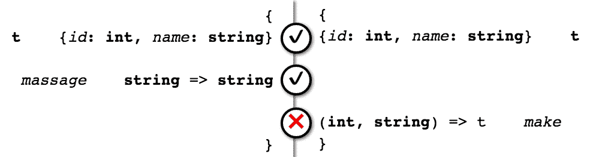

# 将类型和值打包在一起

ReasonML 对将程序划分为小型、模块化组件的软件工程实践提供了出色的支持，这些组件可以相互替换。

在本章中，我们将涵盖以下内容：

+   模块及其如何用于打包类型和值

+   文件模块和语法模块之间的区别

+   模块签名（文件和语法）

+   使用签名实现信息隐藏

+   使用签名实现类型抽象

+   实现零成本抽象

**模块** 是一组类型和值，可以在单个名称下访问。当你想要将一些类型和操作关联起来以使它们更容易查找和使用时，这可以非常有用。它们在其他语言中类似于 **命名空间**，但更强大，因为它们可以以各种方式组合。

让我们看看如何创建一些模块。

# 文件模块

事实上，我们已经有了一些模块！Reason 将 `.re` 源文件视为模块，因此我们的 `src/Ch01/Ch01_Demo.re` 和 `src/Ch02/Ch02_Demo.re` 文件分别自动作为模块可用，名称分别为 `Ch01_Demo` 和 `Ch02_Demo`。在 Reason 世界中，这些被称为 **实现文件**。我们将非正式地称它们为 **文件模块**。

Reason 仅根据文件名命名文件模块，忽略它们的目录嵌套。这使得每个模块都可以自动从其他模块中访问，无论它们在项目中的物理位置如何。这就是为什么我们小心翼翼地为模块命名时加上章节前缀；否则，来自不同章节但具有相同名称的文件会混淆编译器。

让我们利用 Reason 的自动模块解析功能，通过创建一个新的（文件）模块来引用现有模块中的内容：

```js
/* src/Ch03/Ch03_Greet.re */
let *greet*(*person*: *Ch02_Demo*.person) = /* (1), (2), (3) */
  "Hello, " ++ /* (4), (5) */
  *person.name* ++
  " with ID " ++
  *string_of_int*(*person.id*) ++ /* (6) */
  "!";
```

在这里，我们定义了一个知道如何用姓名和 ID 欢迎人们的函数。在这个例子中发生了一些事情（用编号注释标记）：

1.  我们通过在函数参数后附加冒号并跟类型来为 `person` 函数参数分配一个类型。你可以读作 "*person has type c h 0 2 demo dot person*"。我们可以在 Reason 中为任何函数参数分配类型；不过，由于类型推断，它们几乎总是可选的。在这种情况下，我们想要明确，因为存在一个微妙的问题：`Ch02_Demo` 模块中实际上有两种不同的记录类型（`person` 和 `company`），它们都有 `name` 和 `id` 字段，我们需要区分它们。

1.  函数定义有一个由单个表达式组成的主体；这也可以是一个由括号分隔的复合表达式（我们将在后面看到示例）。

1.  我们可以有一个 `person` 值和一个 `person` 类型——它们不会冲突，因为 Reason 将它们分别存储在静态和动态环境中。

1.  Reason 对空白字符不敏感；你可以以任何你想要的方式布局你的代码，只要用分号分隔绑定即可。对于大多数代码库，你实际上会使用 Reason 格式化工具 `refmt`，它会自动处理所有格式化。

1.  Reason 中的 `++` 操作符将两个字符串（以及没有其他内容！）连接在一起。

1.  `person.id` 是一个 `int`，所以我们不能将其与其周围的字符串连接在一起——除非我们使用内置的 `string_of_int` 函数将其转换为字符串。Reason 具有严格的强类型，不会在类型之间隐式转换（甚至不在 `int` 和 `float` 变量之间）。

为了了解 Reason 为我们做了什么，让我们看看输出 JavaScript 的相关部分：

```js
// src/Ch03/Ch03_Greet.bs.js
function *greet*(*person*) {
  return "Hello, "
    + *person*[1]
    + " with ID "
    + *String*(*person*[0])
    + "!";
}
```

我对 JavaScript 输出进行了一些清理和重新排列，但没有改变其含义。

如同往常，我们看到类型被完全删除，输出只关注值。然而，基于类型，Reason 编译器知道在数组索引 1 处访问人的姓名，在索引 0 处访问 ID。它也知道通过使用 JavaScript 字符串构造函数将 `person[0]` 转换为字符串。

在 JavaScript 世界中，我们会说这样的转换是不必要的。但在静态类型 Reason 世界中，编译器会跟踪所有值的类型，并确保它们只根据其类型的规则进行交互。因此，我们确保一个数字不会意外地添加到一系列字符串中。

在更大规模上，请注意，Reason 文件是模块的事实在 JavaScript 输出代码中并不直接可见——除了 Reason 文件是直接编译的，与 JavaScript 模块有一对一的关系。

# 语法模块

让我们看看在 Reason 中创建模块的另一种方式：**语法模块**。这些是使用 Reason 的模块语法定义的模块。以下是一个示例：

```js
/* src/Ch03/Ch03_Domain.re */
module *Person* = {
  type t = {*id*: int, *name*: string};
  let *make*(*id*, *name*) = {*id*, *name*};
};

module *Company* = {
  type t = {*id*: int, *name*: string, *employees*: list(*Person*.t)};
};
```

在这里，我们定义一个 `Domain` 文件模块来包含两个嵌套模块：`Person` 和 `Company`。这些嵌套模块实际上包含与我们之前在 `src/Ch02/Ch02_Demo.re` 中定义的类似类型，但这次两种类型都命名为 `t`。

让我们稍微偏离一下主题，谈谈类型名称 `t`。这是 Reason 生态系统中的标准命名约定，表示模块中的主类型。通常，你会指代一个模块及其主类型，例如，`Person.t` 或 `Company.t`，这样就可以清楚地知道你指的是哪种类型。

语法模块具有以下形式：`module Name = {...bindings...};` 并且所有绑定都对外部消费者以模块名称的方式可用，例如，`Name.binding1`，等等。

之前，我们说模块将类型和值打包在一起。但在前面的例子中，你可以看到 `Ch03_Domain` 文件模块本身包含两个模块，`Person` 和 `Company`。我之前过于简化了。模块可以递归地包含其他模块！这是一种很好的代码组织和命名空间策略。

让我们看看（相关部分的）JavaScript 输出，以了解这个域模块的运行时效果：

```js
// src/Ch03/Ch03_Domain.bs.js
function *make*(*id*, *name*) { return [*id*, *name*]; }

var *Person* = [*make*];
var *Company* = [];
*exports.Person*  = *Person*;
*exports.Company* = *Company*;
```

`Person`和`Company`模块被表示为 JavaScript 数组，它们的`t`类型被完全删除，使得数组几乎为空。数组中只包含文件级别模块 JavaScript 输出会包含的内容：值。实际上，这正是 Reason 在编译成字节码或原生二进制形式时表示模块的方式。

然而，这并不是你可能会期望的*嵌套模块*在惯用 JavaScript 中的样子。实际上，BuckleScript 编译器并不总是生成完全惯用的 JavaScript 输出。其中一些情况可以修复（实际上，一些已经修复了）；其他则是编译器为了有效地将 Reason 代码转换为 JavaScript 而需要做出的妥协。

# 使用语法模块

如您所见，模块非常便宜。它们几乎没有任何运行时效果。让我们看看将我们的类型组织到它们自己的嵌套模块中的回报。我们将再次尝试问候一个人：

```js
/* src/Ch03/Ch03_GreetAgain.re */
let *greetAgain*(*person*) = /* (1) */
  "Hello again, " ++
  *person.Ch03_Domain.Person.name* ++ /* (2) */
  " with ID " ++
  *string_of_int*(*person.id*) ++
  "!";
```

与`src/Ch03/Ch03_Greet.re`有什么不同？

1.  我们不需要显式注释`person`的类型

1.  我们需要告诉 Reason `name`字段来自哪个模块，因为为了防止具有相同字段名称的记录类型之间发生名称冲突，Reason 不会自动打开模块以查找类型细节

你可能会问，这真的有回报吗？我们只是将一种注释（显式类型签名）换成了另一种（字段名模块前缀）。虽然这是真的，但在实现代码中，尽可能少地使用类型注释并让编译器尽可能多地推断是惯例。

类型注释确实还有另一个用途，那就是记录类型。在 Reason 中，我们有一个明确的地方可以放置类型注释，以记录我们的模块类型并服务于其他一些有用的目的。

# 模块签名

**模块签名**，也称为**接口**，是一个放置类型注释的明确位置。但它们实际上有几个用途：

+   导出模块的公共 API

+   记录模块公共 API 的类型

+   提供放置模块文档的位置

+   隐藏模块的非公共元素

+   隐藏类型的实现细节

考虑到前面提到的要点，你会在什么情况下不希望为你的模块使用签名？这并不是一成不变的，但我的经验法则是，当我的 API 是实验性的并且仍在演变（在语义版本控制术语中，小于版本 1.0.0）时，或者当模块纯粹是应用程序模块，并不打算作为库发布给其他人使用时（尽管这两者之间的界限有些模糊）不要使用签名。

签名有两种形式——**接口文件**和**语法签名**，*对应于实现*。接口文件是包含签名而没有其他内容的 Reason 源文件。语法签名是使用 Reason 对签名的语法支持定义的签名。

我们将通过使用接口文件主要探索先前提到的点，但也会根据需要展示语法签名的示例。

# 导出和记录公共 API

让我们看看导出和记录模块公共 API 的一个例子。这是一个接口文件：

```js
/** src/Ch03/Ch03_GreetAgain.rei (1), (2)
    Contains a way to greet a person. */

/** Greet someone with a name and ID, again. (3) */
let *greetAgain*: *Ch03_Domain.Person*.t => string; /* (4) */
```

在这里有几个有趣的事情正在进行：

1.  接口文件必须具有 `.rei`（Reason 接口）文件扩展名，文件名与实现文件名相对应。

1.  我们使用一种新的注释类型，称为**文档注释**（**doc comment**），来编写将随 API 一起公开导出的文档。文档注释以 `/**` 开始，以 `*/` 结束。Reason 生态系统中有工具可以理解文档注释并为读者格式化它们。请注意，我们通常不在实现文件（`.re`）中使用文档注释，因为这通常没有意义将特定于实现的文档暴露给用户。

1.  模块中的任何项目都可以使用文档注释进行记录。

1.  我们使用值声明来告诉 Reason 从模块中导出一个具有给定类型的值。在这种情况下，值的类型是函数类型——这个类型读作 "*ch 0 3 domain person t arrow string*"，意味着 *以第三章域 person 类型作为输入并返回一个字符串作为输出*。我们将在未来的章节中更详细地介绍函数。

那么，这个接口文件编译成什么？实际上：什么也没有。接口文件完全是编译时构造；它们在运行时根本不存在。事实上，它们就像类型一样被擦除，因为它们是类型。*模块接口是类型*。你作为接口编写的 `.rei` 文件实际上指定了其对应的 `.re` 实现文件的类型。

# 语法模块签名

**模块签名**也被称为**模块类型**。*就像其他类型一样，模块类型指定了你可以对它们的类型值做什么，不能做什么；换句话说，它们指定了模块的表面区域。

这里是一个语法模块类型及其用法的例子：

```js
/* src/Ch03/Ch03_ModuleType.re */
module type PersonType = {
  type t = {*id*: int, *name*: string};
  let *make*: (int, string) => t; /* (1) */
};

module *Person*: PersonType = { /* (2) */
  type t = {*id*: int, *name*: string};

  let *massage*(*name*) = *String.trim*(*String.capitalize*(*name*)); /* (3) */
  let *make*(*id*, *name*) = {*id*, *name*: *massage*(*name*)}; /* (4) */
};
```

语法模块类型具有 `module type Type = {...declarations...};` 形式，并精确指定符合该类型的模块将导出什么。在先前的例子中，需要注意的一些关键点：

1.  我们使用 `let funName: (param1Type, ..., paramNType) => returnType;` 语法声明一个函数的类型（`make`）。

1.  我们通过在模块类型后附加一个冒号来声明模块符合模块类型。

1.  我们定义一个 `massage` 函数来正确地大小写和修剪输入名称，但这个函数在模块类型中没有声明，所以它从未被导出（也就是说，使用此模块的用户将无法访问 `massage`）。

1.  我们通过使用 `name: expression` 语法给记录字段一个特定的表达式作为其值。我们将在后面的章节中更全面地介绍记录类型语法。

让我们来看看（相关部分的）JavaScript 输出：

```js
// src/Ch03/Ch03_ModuleType.bs.js
var *$$String* = *require*("bs-platform/lib/js/string.js"); // (1)
function *make*(*id*, *name*) {
  return [*id*, *$$String*.*trim*(*$$String*.*capitalize*(*name*))]; // (2)
}
var *Person* = [*make*];
*exports*.*Person* = *Person*;
```

1.  Reason 的 `String` 模块名称在输出中略有损坏（带有 `$$` 前缀）以避免与现有的 JavaScript `String` 构造函数发生名称冲突。

1.  返回的人员数组值没有调用 `massage` 函数。实际上，BuckleScript 甚至没有发出 `massage` 函数，因为它已经确定可以内联。

# 模块错误

模块具有类型的事实自然导致它们也可以抛出类型错误。让我们看看与模块相关的几个可能的类型错误。

# 签名不匹配

当我们尝试将模块签名分配给没有正确实现该接口的模块时会发生什么？查看以下内容：

```js
(Output from bsb -w)
  We've found a bug for you!
  /Users/yawar/src/learning-tydd-reason/src/Ch03/Ch03_ModuleType.re 8:29-11:1

   6 │ };
   7 │ 
   8 │ module Person: PersonType = {
   9 │   type t = {id: int, name: string};
  10 │   let massage(name) = String.trim(String.capitalize(name));
  11 │ };

  Signature mismatch:
  Modules do not match:
    { type t = { id: int, name: string, }; let massage: (string) => string; }
  is not included in
    PersonType
  The value `make' is required but not provided
  File "/Users/yawar/src/learning-tydd-reason/src/Ch03/Ch03_ModuleType.re", line 5, characters 3-31:
    Expected declaration
```

这条信息意味着我们忘记在我们的实现中包含 `make` 函数。信息有点奇怪，但如果你知道 Reason 如何检查模块类型，它就有意义了：

+   它通过检查实际模块的结构来推断它认为应该是的模块类型

+   它将推断的类型与注解的模块类型 `PersonType` 进行比较

+   它不关心实际模块中出现的但未在 `PersonType` 中声明的项（它只是将这些项隐藏在外部世界之外）

+   它确实显示了在 `PersonType` 中声明但实际模块中缺失的项的错误

简而言之，你不能过度承诺而不足够交付。了解这一点后，你可以解释错误信息：推断的模块类型在最上面，注解的模块类型在下面，如下面的截图所示：



模块类型不匹配错误图

在 Reason 中，模块是*结构化类型化的*：它们的类型由它们的结构组成，也就是说，通过以与模块本身类似的语法形式组合其包含的绑定类型。这就是我们能够编写 `module type Foo = {...declarations...};` 的原因 – `{...declarations...}` 结构类型本身就是一个一等类型；我们只是将其绑定到一个名称上。这一具体结果就是你可以直接定义一个模块并用类型注解它，例如，`module Foo: {...declarations...} = {...bindings...};`。在后面的章节中，我们将进一步探讨结构化类型。

一个重要的事情是要理解，你不能通过以与它们的签名不同的顺序实现类型和值来得到签名不匹配。你仍然在使用它们之前声明或定义它们，但编译器会理解一个模块符合签名，即使它们的声明和定义在顺序上不完全匹配。为了看到这个的小例子，请查看即将到来的*类型抽象*部分中的代码示例。`getter` 函数的顺序在接口和实现之间略有不同。

这种顺序灵活性在尝试以易于理解的方式安排模块签名时可能是一个好处，也就是说，首先展示最重要的项目。有时，你可能不需要这种级别的灵活性，但如果你发现你需要，你总是可以利用它。

# 找不到值

当我们尝试在一个模块中使用不存在的东西时会发生什么？查看以下内容：

```js
(Output from bsb -w)
  We've found a bug for you!
  /Users/yawar/src/learning-tydd-reason/src/Ch03/Ch03_ModuleType.re 10:23-40

   8 │   type t = {id: int, name: string};
   9 │ 
  10 │   let massage(name) = Ch03_Greet.process(name);
  11 │   let make(id, name) = {id, name: massage(name)};
  12 │ };

  The value process can't be found in Ch03_Greet
```

Reason 在编译时检查模块的类型（`Ch03_Greet`）是否导出了命名的值（`process`），如果没有，则构建失败。无法使用不存在的值。

# 类型抽象

在 Reason 中，你可以隐藏类型的实现并精确地展示你选择的内容。这种*类型抽象*是保持代码库中*不变量*（应该遵守的规则）的最佳技术之一。类型抽象还允许模块彼此解耦，只处理它们从导出接口中获取的信息。

例如，看看 `Ch03_ModuleType.Person` 模块。它导出 `t` 类型来表示有关人员的信息，以及一个 `make` 函数来正确创建 `t` 类型的值。`make` 函数确保我们正确地修剪并大写我们给出的名称。我们希望强制执行规则，即名称应该有正确的格式化，并且不应该有周围的空白字符。

问题是我们可以这样做：

```js
let *bob* = {*Ch03_ModuleType.Person.id*: 1, *name*: " bob    "};
```

因为 `Ch03.ModuleType.Person.t` 的定义是导出的，我们可以绕过 `make` 函数并直接创建 `t` 值，打破我们想要应用于名称的规则。

我们可以通过将 `t` 定义为一个抽象类型来解决此问题（注意，我们必须定义接口和实现文件，如下所示）：

```js
/** src/Ch03/Ch03_AbstractPerson.rei */

type id = int;
type name = string;
type t; /* (1) */

let *make*: (id, name) => t;
let *id*: t => id;
let *name*: t => name;

/* src/Ch03/Ch03_AbstractPerson.re */
type id = int; /* (2) */
type name = string;
type t = {*id*, *name*}; /* (3) */

let *id*(*t*) = *t.id*;
let *name*(*t*) = *t.name*;
let *massage*(*name*) = *String.trim*(*String.capitalize*(*name*));
let *make*(*id*, *name*) = {*id*, *name*: *massage*(*name*)};
```

1.  现在，`Ch03_AbstractPerson.t` 在内部是一个记录类型，就像其他类型一样，但它被导出为一个纯抽象类型，没有实现细节*除了*我们在接口中提供的操作。这些操作使我们能够正确创建 `t` 值并从 `t` 值中提取人员的 ID 和姓名。

1.  我们在这里引入了两种新的类型：`id`和`name`，使用`type typeName = otherType;`语法。将新的类型名称直接绑定到现有的类型名称称为*类型别名*（有时也称为*类型缩写*）。类型别名对类型检查没有影响，但它们是记录我们的意图和有时缩短较长的类型名称的有用方式。

1.  由于我们别名为`id`和`name`，我们可以使用 Reason 提供的快捷方式，当记录类型定义中的字段和类型名称相同时，称为**打趣**。

由于我们希望导出类型别名以及原始类型和操作，我们需要在接口和实现中都重复相同的别名绑定。这种重复允许 Reason 双重检查其推断是否符合我们的意图。

# 零分配类型抽象

有时我们需要对已存在的类型强制执行规则。例如，在`Ch03_AbstractPerson`中，我们有一个`name`类型，它只是一个`string`，以及一个`massage`函数，该函数接受一个字符串并应用一些规则将其转换为“良好行为”的名称。我们以相当随意的的方式将这个类型和函数放在另一个模块中，因为我们当时专注于“人”的概念及其操作，而不是那么关注“名称”及其操作。

然而，我们并不想为名称创建一个新的类型，该类型将在已分配的名称字符串之上分配值。我们希望在保持命名规则（大小写和修剪）的同时，还要节省内存使用。

让我们将`name`类型别名及其*智能构造函数*（一个应用我们想要强制执行的规则的`make`函数）提取到一个专用模块中（再次注意，我们必须定义模块的接口和实现文件，以便模块完整）：

```js
/* src/Ch03/Ch03_Person.rei */

module *Name*: { /* (1) */
  type t;
  let *make*: string => t;
  let *toString*: t => string;
};

type id = int; /* (2) */
type t = {*id*, *name*: *Name*.t}; /* (3) */

let *make*: (id, *Name*.t) => t; /* (4) */
let *id*: t => id;
let *name*: t => *Name*.t;

/* src/Ch03/Ch03_Person.re */
module *Name* = {
  type t = string; /* (5) */
  let *make*(*string*) = *String*.(*capitalize*(*trim*(*string*))); /* (6) */
  let *toString*(*t*) = *t*; /* (7) */
};

type id = int;
type t = {*id*, *name*: *Name*.t};

let *make*(*id*, *name*) = {*id*, *name*};
let *id*(*t*) = *t.id*;
let *name*(*t*) = *t.name*;
```

这里的新特性：

1.  我们声明一个嵌套的`Name`模块，并指定其模块类型。我们告诉 Reason：*Ch03_Person 包含一个名为 Name 的模块，该模块导出这些项目*。请注意，`Name`模块的`t`类型是抽象的。

1.  我们没有将`id`类型声明为抽象的，因为我们不需要强制执行任何关于其创建的规则（我们可能在将来会这么做）。

1.  由于我们已经将名称类型和创建逻辑移动到`Name`中，我们不再需要将`Ch03_Person.t`类型声明为抽象的。因为任何人都无法创建错误的`Ch03_Person.t`值，因为他们必须仍然通过`Name.make`来获取名称。

1.  现在我们让`Ch03_Person`模块函数使用`Name.t`类型。

1.  `Name.t`类型被实现为一个`string`。它不会在运行时分配任何内容。

1.  `make` 智能构造函数将自动强制执行我们的命名规则。此外，我们在这里使用 `ModuleName.(expression)` 语法临时“打开” `String` 模块，使其包含的所有值在当前表达式的作用域内可见。在小的作用域内临时打开模块可以非常方便地节省一些打字——但打开较大的作用域可能会因为潜在的名字冲突而变得有风险。

1.  因为 `Name.t` 已经是 `string` 类型，所以在 `toString` 中将其转换回 `string` 只需返回输入值。

这种结构达到了良好的平衡：

+   它暴露了 `person` 记录类型定义，以便用户可以轻松地检查和使用它们的值

+   它控制了 `person` 数据的关键部分：姓名

# 防止类型混淆

之前，我提到我们不需要使 `id` 类型抽象，因为我们目前没有为其制定任何规则。但有一个很好的理由使简单类型抽象：防止表示不同逻辑概念的相同物理类型（从实现的角度来看）之间的混淆。

例如，假设你有一个以下函数和用法：

```js
let *payBill*(*personId*, *businessId*) = ...;
*payBill*(*acmeCo.id*, *bob.id*);
```

在 `Ch02_Demo` 中，我们为 `person` 和 `company` 的 ID 类型都指定了 `int`。如果我们不小心按错误的顺序传递函数参数，并且我们的系统试图从公司向个人支付账单，这可能会产生反效果。

我们可以使用与前面类似的技术来防止这种混淆：使个人 ID 和公司 ID 类型在逻辑上区分开来，同时在内部物理上仅用 `int` 表示。以下是一个示例：

```js
/* src/Ch03/Ch03_Id.re */
module type Id = { /* (1) */
  type t;
  let *make*: int => t;
  let *toInt*: t => int;
};

module *IntId* = { /* (2) */
  type t = int;
  let *make*(*int*) = *int*;
  let *toInt*(*t*) = *t*;
};

module *PersonId*: Id = *IntId*; /* (3) */
module *CompanyId*: Id = *IntId*;

let *bobId* = *PersonId.make*(1); /* (4) */
let *acmeCoId* = *CompanyId.make*(1);
/*
let result = bobId == acmeCoId; /* (5) */
*/
```

在前面的代码中，有一些非常有趣的事情正在发生：

1.  我们定义了一个 `Id` 模块签名，它声明了一个抽象的 `t` 类型，以及 `t` 值的构造函数和提取函数

1.  我们定义了一个没有明确签名的 `IntId` 模块，它暴露了一个等于 `int` 的 `t` 类型，以及与 `Id` 签名中相同的构造函数和提取函数

1.  我们定义了两个模块别名 `PersonId` 和 `CompanyId`，将它们指定为 `IntId`，并赋予它们显式的 `Id` 签名

1.  我们定义了 `PersonId.t` 和 `CompanyId.t` 值

1.  如果我们尝试比较这些值，我们会得到一个类型错误：

```js
(Output from bsb -w)
  We've found a bug for you!
  /Users/yawar/src/learning-tydd-reason/src/Ch03/Ch03_Id.re 19:23-30

  17 │ let bobId = PersonId.make(1);
  18 │ let acmeCoId = CompanyId.make(1);
  19 │ let result = bobId == acmeCoId;

  This has type:
    CompanyId.t
  But somewhere wanted:
    PersonId.t
```

因此，Reason 能够区分这两种类型，尽管它们在物理上是相同的类型，由相同的模块（`IntId`）支持，只是因为它们被显式地注解为模块类型（`Id`），这阻止了 Reason “看到”底层类型。由于签名和抽象的 `t` 类型，Reason 不能证明 `CompanyId.t` 和 `PersonId.t` 是相同的，因此尝试比较它们会导致类型错误。

注意，即使有明确的签名，创建这些模块在分配上也是非常便宜的：

```js
// src/Ch03/Ch03_Id.bs.js
function *make*(*$$int*) { return *$$int*; }
function *toInt*(*t*) { return *t*; }

var *IntId* = [*make*, *toInt*];
var *PersonId* = *IntId*;
var *CompanyId* = *IntId*;

var *bobId* = 1;
var *acmeCoId* = 1;
```

原因是重用了相同的 `IntId` 模块，并在编译时纯粹区分它们的类型。因此，我们可以优雅地分离我们的关注点：

+   `Id` 签名只是说明存在一个可以转换为 `int` 并从 `int` 转换回的 `t` 类型

+   `IntId`实现了一个与`Id`签名兼容但未显式注解的模块；从而表明基于整数的 ID 模块是`Id`签名的一种可能的实现方式。

+   `PersonId`和`CompanyId`模块利用`Id`和`IntId`的组合，通过告诉编译器它不能假设 ID 类型相同（尽管我们知道它们是相同的）来实现类型安全。

如你所见，在 Reason 中，我们有一个细粒度的强大功能，利用编译器实现非常轻量级的代码。我们将在未来的章节中看到更多类似的技术。

# 摘要

在本章中，我们介绍了如何将类型和值与模块一起打包，如何使用签名精确指定我们希望从模块中公开的表面区域，以及如何通过模块和签名的组合来严格控制我们的数据类型——甚至可以控制模块中数据的内存分配。在 Reason 中，你会注意到这种模式很多——你设计类型以确保某些规则得到执行，在很多情况下，它们将不会产生运行时成本。

所以，请保持关注——在下一章中，我们将介绍我们在类型驱动开发中每天都会使用的一些最重要的类型：将值组合在一起以便于访问的产品类型。
