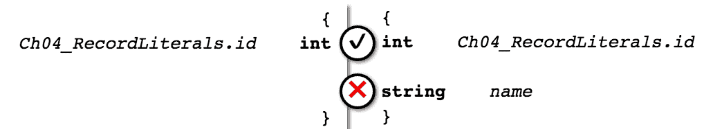
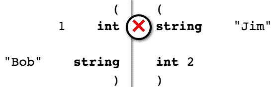
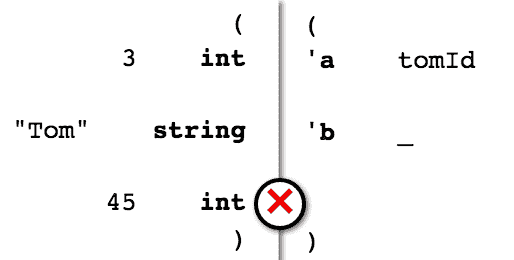

# 在类型中组合值

在上一章中，我们看到了一种将类型和值组合在一起的方法，以便它们可以在单个命名空间下访问，我们还看到了这些命名空间（模块）本身也有类型。然而，模块在运行时传递值时并不方便。我们需要一种轻量级的方法来从更简单的类型构建更结构化的类型，以模拟现实世界问题。

在本章中，我们将介绍这些结构化类型，特别是：

+   记录类型

+   元组类型

+   对象类型

+   JavaScript 对象类型

总的来说，这些类型被称为**乘积类型**，因为乘积类型可以包含的可能值的数量是其每个组成部分类型可以包含的可能值的数量的乘积。这是类型理论中的一个有趣的结果，它给我们一个暗示，即类型遵循某些代数定律。我将在本书稍后提供更多阅读材料，在我们对类型知识有更多了解之后。

# 记录类型

我们在书中几个地方使用了记录类型，主要是用来构建一个具有 ID 和名称的`person`类型。让我们更仔细地检查这个简单的记录类型，并分析创建它时究竟发生了什么：

```js
type person = {*id*: int, *name*: string};
```

整个类型定义创建了一个新的*名义*类型`person`，它有两个命名字段：`id`和`name`，具有特定的`int`和`string`类型。名义类型是类型检查器仅通过名称与其他类型区分的类型。

这与结构类型相对，结构类型在类型检查器中被认为是其构成类型的等价。例如，我们在上一章中看到模块是结构类型。我们将在本章和下一章中看到更多示例。

无论如何，名义类型不能互换使用，即使它们有完全相同的定义。例如：

```js
(Output from bsb -w)
  We've found a bug for you!
  /Users/yawar/src/learning-tydd-reason/src/Ch03/Ch03_Greet.re 10:20-22

   8 │ type person = {id: int, name: string};
   9 │ let bob = {id: 1, name: "Bob"};
  10 │ let result = greet(bob);

  This has type:
    person
  But somewhere wanted:
    LearningTyddReason.Ch02_Demo.person (defined as
      LearningTyddReason.Ch02_Demo.person)
```

在前面的错误信息中，请注意我们在`Ch03_Greet`中定义了一个新的记录类型`person`，创建了这个类型的值，并尝试用这个值调用`greet`函数。但是`greet`函数只接受`Ch02_Demo.person`类型的值，并在我们的具有相同结构但名称不同的`person`值上出错（在这个目的上，模块路径被认为是名称的一部分）：


具有相同定义的名义类型之间的类型不匹配

# 记录字面量

我们可以使用记录字面量语法创建记录值：

```js
/* src/Ch04/Ch04_RecordLiterals.re */
type person = {*id*: int, *name*: string};

let *bob* = {*name*: "Bob", *id*: 1}; /* (1) */

let *jim* = { /* (2) */
  let *id* = 2;
  let *name* = "Jim";
  {*id*, *name*} /* (3) */
};

let *tomId* = 3;
let *tom* = {*id*: *tomId*, *name*: "Tom"}; /* (4) */
```

这些是记录字面量的典型变体：

1.  记录类型的标准记录字面量语法为具有`field1`到`fieldN`字段的记录：`{field1: expression1, ..., fieldN: expressionN}`。注意记录的一个最显著特点：*字段顺序不重要*。在这里，我们定义了一个记录字面量，其字段名称的顺序与记录类型定义相反。

1.  我们可以使用括号来开始一个封闭的作用域，这样内部声明的名称（`id`，`name`）将不会对外部可见，并且封闭作用域中的最后一个表达式（`{id, name}`）将是作用域的结果值。请注意，作用域分隔括号与记录分隔括号是分开的。

1.  当作用域中存在与字段名称相同的名称时，我们可以使用*记录字段重命名*语法来编写记录字面量。现代 JavaScript 也获得了这个重命名功能。

1.  如果作用域中没有与字段名称相同的名称，我们可以使用标准记录字面量语法来使用任何表达式。

# 访问字段和处理错误

记录字段访问语法在其他语言中看起来很相似：`recordValue.fieldName`。

为了正确推断记录字面量的类型，Reason 依赖于将字段名称与它所知道的记录类型匹配。您可能会看到的一个常见错误是当 Reason 找不到合适的记录类型时；例如，如果我们从`Ch04_RecordLiterals`中删除`person`类型：

```js
(Output from bsb -w)
  We've found a bug for you!
  /Users/yawar/src/learning-tydd-reason/src/Ch04/Ch04_RecordLiterals.re 2:12-13

  1 │ /* src/Ch04/Ch04_RecordLiterals.re */
  2 │ let bob = {name: "Bob", id: 1}; /* (1) */
  3 │ 
  4 │ let jim = { /* (2) */

  The record field name can't be found.

  If it's defined in another module or file, bring it into scope by:
  - Annotating it with said module name: let baby = {MyModule.age: 3}
  - Or specifying its type: let baby: MyModule.person = {age: 3}
```

这通常发生在记录类型定义在另一个模块中时。我们之前提到，Reason 不会自动搜索其他模块以查找记录类型，因为不同的模块可能包含具有相同字段名称的记录类型；这会不清楚您指的是哪一个。相反，Reason 选择让您明确指定模块，例如：

```js
let *bob* = {*Ch02_Demo.id*: 1, *name*: "Bob"};
```

现在，Reason 可以告诉我们：

+   您所提到的`id`字段位于`Ch02_Demo`中

+   记录字面量只有`id`和`name`字段

+   因此，这个记录可能只能是`Ch02_Demo.person`类型（它不能是`Ch02_Demo.company`，因为该记录类型也有`employees`字段）

# 更改记录值

记录默认是不可变的：一旦创建，就无法更改。这还意味着所有的 Reason 值默认都是不可重新分配的（这意味着像`let x = 1; x = 2;`这样的代码会导致编译错误）。这种刚性有很好的理由：如果您知道值不会改变，那么单独考虑程序中的每个部分并将它们放在一起时，您会更容易地确信这些部分的行为将是一致的。这是*函数式编程*的核心原则之一，Reason 的静态类型技术就是建立在这一点上的。

但完全不可更改的值并不很有用。通常，您需要在运行时更改值来模拟您感兴趣的行为。因此，Reason 提供了两种更改记录值的方法：不可变更新和可变字段。

# 不可变更新

这是我们将最常使用的方法。使用*不可变更新*，我们实际上使用旧值创建新的记录值。Reason 为此提供了一种特殊的语法，当记录类型有两个或更多字段时，它非常有用。但无论字段有多少，我们都可以仅使用正常的记录字面量语法来构建记录值。以下是一些示例：

```js
/* src/Ch04/Ch04_RecordUpdates.re */
let *bob* = *Ch04_RecordLiterals.bob*;
let *bobLongForm1* = {...*bob*, *name*: "Robert"}; /* (1) */
let *bobLongForm2* = {*Ch04_RecordLiterals.id*: *bob.id*, *name*: "Robert"}; /* (2) */
```

在这里，我们将鲍勃的名字更新为其完整形式。请注意以下几点：

1.  当我们使用不可变更新语法（在 Reason 中也称为*记录展开*语法）时，Reason 会创建一个新的记录值，它与旧值（`bob`）完全相同，除了我们覆盖的字段。尽管记录类型定义在另一个模块中，但我们不需要为任何字段使用模块前缀，因为不可变更新强制 Reason 查找字段是什么，因此当我们更新它时，它知道`name`字段。

1.  当我们使用正常的记录字面量语法时，我们需要定义所有记录字段。如果我们忘记了一个，我们将会得到一种相当有趣的类型错误：

```js
(Output from bsb -w)
  We've found a bug for you!
  /Users/yawar/src/learning-tydd-reason/src/Ch04/Ch04_RecordUpdates.re 4:20-51

  2 │ let bob = Ch04_RecordLiterals.bob;
  3 │ let bobLongForm1 = {...bob, name: "Robert"};
  4 │ let bobLongForm2 = {Ch04_RecordLiterals.id: bob.id};

  Some record fields are undefined: name
```

由于 Reason 不允许 null 或 undefined 值，省略记录字段会导致类型错误：



缺少记录字段类型错误

使用不可变更新，我们可以重用相同的名称，并且不必担心为各种转换值想出新名称，这要归功于阴影：

```js
let *bob* = *Ch04_RecordLiterals.bob*;
let *bob* = {...*bob*, *name*: "Robert"};
let *bob* = {...*bob*, *id*: *bob.id* + 1}
```

我们经常使用阴影对某个值执行一系列更新，以传达我们正在构建或转换同一个值以用于最终目的的意图。

# 可变记录字段

这些用得比较少，因为它们给程序引入了不安全因素，并迫使开发者更加谨慎地编写代码。你在一个点上绑定了一个特定的值，而在另一个点上它可以是不同的值，如果代码库的其他部分基于原始值以某种方式行为，并且它们再次检查并发现新值，那么它们将会遇到一个大的惊喜。

尽管如此，如果需要从某些记录中获得一些额外的性能，并且将突变包含在单个函数的作用域内，它们可能非常有用。以下是一个示例：

```js
/* src/Ch04/Ch04_MutableFields.re */
type summaryStats = {
  mutable *sum*: float, /* (1) */
  *count*: int,
  mutable *mean*: float
};

let *summarise*(*array*) = {
  let *result* = {*sum*: 0., *count*: *Array.length*(*array*), *mean*: 0.}; /* (2) */

  for (*i* in 0 to *result.count* - 1) { /* (3) */
    *result.sum* = *result.sum* +. *Array.unsafe_get*(*array*, *i*); /* (4), (5) */
  };

  *result.mean* = *result.sum* /. *float_of_int*(*result.count*); /* (6), (7) */
  *result*
};
```

这里发生了很多事情：

1.  我们使用`mutable`关键字在字段名称之前使记录字段可变。在这种情况下，我们只使三个字段中的两个可变，因为对于给定的数组，计数永远不会改变。

1.  我们使用常规的文本语法创建一个新记录类型；对于浮点字面量，我们可以使用`0.`作为`0.0`的简写，并且`Array.length`函数返回 Reason 数组的长度。

1.  我们使用`for`循环遍历我们想要统计的输入数组。Reason 完全支持命令式编程语法，如`for`和`while`循环；如果你想要以任何给定风格编程，你很可能能在 Reason 中做到。

1.  我们通过迭代地修改`sum`字段来累加数组。修改（可变的）记录字段使用简单的`recordVal.field = value`语法。

1.  我们使用`Array.unsafe_get`获取给定数组索引处的元素，它获取元素前会跳过边界检查。在这个例子中，我们不需要边界检查，因为我们已经在循环开始时确保不会超出数组的末尾。但如果我们犯了错误，比如`for (i in 0 to result.count) { ... }`，我们会得到一个运行时错误。所以对不安全函数要非常小心。数组元素访问有一个安全的、带边界检查的语法：`array[i]`。

1.  在我们遍历整个数组完成后，我们将`mean`字段变异为最终的均值。

1.  我们不能将浮点数`sum`除以整数`count`，因此我们需要将整数`count`转换为浮点数。请注意，我们不会反过来操作，即不将浮点数`sum`转换为整数，因为这会导致有损转换！

注意我们如何始终将变异操作限制在单个函数的范围内。尽管如此，仅仅将包含两个可变字段的`summaryStats`值返回给调用者，这种变异安全性多少受到了影响。在未来的变异示例中，我们将展示更安全的用法模式。

我们在浮点数算术中使用略微不同的运算符：在 Reason 中，整数和浮点数算术是完全分开的，它们不混合。浮点数算术运算符与整数算术运算符相同，只是在它们后面附加了一个"`.`"。Reason 的哲学非常强调*显式优于隐式*。

重复一遍，对于大多数目的，不可变记录确实非常有效。在某些有限的情况下，可变记录字段很有用，并且当我们使用它们时，我们需要采取额外的预防措施以防止意外的变异。

# 记录模式

在第二章，*使用类型和值编程*中，我们看到了值绑定的通用语法：

```js
let *PATTERN* = *VALUE*;
```

这种语法也适用于记录，因为记录字面量也充当模式。在记录模式的情况下，我们称之为*解构模式匹配*，因为我们通过匹配记录值的结构并将字段拉出来来绑定名称。以下是一些示例：

```js
/* src/Ch04/Ch04_RecordPatterns.re */
open *Ch04_RecordLiterals*; /* (1) */

let {*id*: *bobId*, *name*: *bobName*} = *bob*; /* (2) */
let {*id*, *name*: *jimName*} = *jim*; /* (3) */
let {*id*: *tomId*, *name*: _} = *tom*; /* (4) */
let {*name*, _} = *tom*; /* (5) */
let {*name*: *tomName*} = *tom*; /* (6) */
```

这些是记录模式的可能变体：

1.  我们全局打开了记录字面量模块，以便方便地访问那里定义的类型和值，而无需每次都进行限定。我在上一章中没有展示这一点，因为我故意想淡化全局打开的使用，因为它们通常风险更高。但在这种受控情况下，它们是可以接受的。

1.  记录模式看起来就像记录字面量一样，除了那些原本会是字段值的现在也是名称（`bobId`，`bobName`）并且这些名称被绑定到记录中的实际值。

1.  如果我们想绑定与字段名相同的名称，可以使用快捷方式：只需在右侧省略冒号和字段值。我们甚至可以混合两种风格。

1.  我们只能将记录的一些字段绑定到值上，并且通过将它们绑定到下划线符号来显式地不绑定其他字段，这意味着忽略。

1.  我们可以将一些字段绑定到名称上，并使用下划线符号无保留地忽略其余部分。

1.  我们可以通过完全省略它们来绑定一些字段并忽略其余部分。Reason 将使用它看到的字段名称来推断模式的类型，但如果定义了具有相同字段的多个记录类型，它可能会感到困惑。

正如你所见，记录模式语法非常复杂和详细，这是随着时间的推移，作为 Reason 的基础语言 OCaml 在积极工业应用中发展起来的。要习惯所有这些模式需要一点时间；从简单开始，并在需要时使用更简洁的模式。

关于记录模式，还有最后一件事要提：它们也是不可反驳的模式，就像简单的值绑定一样，例如 `let x = 1;`。不可反驳意味着一旦模式被编译，在运行时它无法失败地与右侧的值匹配。根据这个标准，记录模式通过绑定它们只是将它们的字段绑定到名称上，而简单的名称绑定也是不可反驳的。但我们在下一章中会看到可反驳模式的例子，所以请留意它们。

# 元组类型

*元组* 是轻量级的结构化类型。更准确地说，它们是由其他类型组成的类型，以特定的顺序在括号内连接，用逗号分隔，并且没有字段名。元组值语法非常简单——开括号，逗号分隔的值列表，闭括号。事实上，值语法与元组本身的类型非常相似。

*元组* 的发音因人而异，但我通常把它读作与 *couple* 发音相似。

为什么我们要使用元组，而不是具有字段名的记录类型呢？有时，我们不想为了将一些值组合在一起而启动一个新的类型，并为其定义。元组是一种低仪式的方式来做到这一点。但是，在代码库的更大部分中使用它们的危险是，它们不像记录类型那样具有自描述性。以下是一个例子：

```js
/* src/Ch04/Ch04_Tuples.re */

/* ID, name */
let *bob* = (1, "Bob");

/* Name, ID */
let *jim* = ("Jim", 2);

/*let bobEqualsJim = bob == jim;*/
```

我在这里只用了两个值来构成元组，但 Reason 支持任何大小的元组。

注意最后一行，它被注释掉了。如果我们取消注释那行代码，我们会得到以下错误：

```js
(Output from bsb -w)
  We've found a bug for you!
  /Users/yawar/src/learning-tydd-reason/src/Ch04/Ch04_Tuples.re 4:27-29

  2 │ let bob = (1, "Bob");
  3 │ let jim = ("Jim", 2);
  4 │ let bobEqualsJim = bob == jim;

  This has type:
    (string, int)
  But somewhere wanted:
    (int, string)

  The incompatible parts:
    string
    vs
    int
```

我移除了描述性注释，以便将所有代码放入错误信息中。

类型错误告诉我们两个元组的类型，我们看到它们纯粹是通过其组件类型的顺序不同：



元组类型不匹配错误

在前面的错误中，我们还可以看到 Reason 一旦发现元组类型结构中的错误，就不会费心检查整个类型。十有八九，当我们调查这个错误信息时，我们会立即看到问题——值被交换了，类型也是如此——并且一次性修复它。另一种情况是，我们在修复第一个错误之后会遇到另一个类型错误，并修复它。我喜欢将类型驱动开发视为真正的*类型错误驱动开发*，因为遇到类型错误是一个非常好的场景，因为它意味着又多了一个潜在的错误，生产代码永远不会看到。

# 访问元组值

我们可以通过两种主要方式访问元组内的值：解构模式匹配和访问器函数。

# 解构模式匹配

我们可以使用解构将名称绑定到元组中的值，类似于记录：

```js
let (*bobId*, *bobName*) = *bob*;
let (*jimName*, *_*) = *jim*;
```

对于 *N*-元组，一般模式是 `(field1, field2, ..., field*N*)`。像往常一样，特殊 `_` 模式允许我们忽略我们不关心的字段。然而，与记录不同，我们不能完全省略它们——我们必须列出所有字段，并用逗号分隔。因为元组是根据其结构进行类型化的，省略元组字段会改变我们将要匹配的类型，这将是一个类型错误：

```js
(Output from bsb -w)
  We've found a bug for you!
  /Users/yawar/src/learning-tydd-reason/src/Ch04/Ch04_Tuples.re 12:18-20

  10 │ 
  11 │ let tom = (3, "Tom", 45); /* ID, name, age */
  12 │ let (tomId, _) = tom;

  This has type:
    (int, string, int)
  But somewhere wanted:
    ('a, 'b)
```



元组解构类型错误

我们在这里看到了两种有趣的数据类型：`'a` 和 `'b`（通常发音为 *alpha* 和 *beta*）。我们将在未来的章节中深入探讨它们的意义，但就目前而言，我们可以将它们视为 Reason 表示*我还没有弄清楚这些类型*的方式。无论如何，请注意，它们不会触发实际的类型错误——因为 Reason 不了解它们是什么，它不能假设它们是类型不匹配。真正导致错误的是元组中缺失的第三个元素。实际上，我们正在尝试将一个 3 元组与一个 2 元组匹配，这触发了类型错误。

# 访问器函数

Reason 提供了两个便利函数，`fst` 和 `snd`，用于从元组中获取第一个和第二个位置值。以下是一个示例：

```js
let *bobId* = *fst*(*bob*);
let *jimId* = *snd*(*jim*);
```

这些函数在我们试图管理大量元组并需要告诉其他函数如何操作它们时非常有用。我们将在即将到来的关于函数的章节中看到一个这种受控行为的示例。

# 对象类型

*对象*是 OCaml 对**面向对象编程**（**OOP**）的全面支持的一部分。它们结合了记录和元组的一些最佳特性：它们是结构化的，因此我们可以以临时方式创建它们（无需定义它们的类型），并且我们可以提供字段名称（在面向对象术语中，方法）作为描述性名称。以下是一个示例：

```js
/* src/Ch04/Ch04_Objects.re */
let *bob* = {as _; pub *id* = 1; pub *name* = "Bob"}; /* (1), (2) */

let *greet*(*person*) =
  "Hello, " ++
  *person#name* ++
  " with ID " ++
  *string_of_int*(*person#id*); /* (3) */

let *jim* = {
  pub *id* = 2;
  pub *name* = "Jim";
  pub *sayHi* = "Hi, my name is " ++ *this#name* /* (4) */
};

*Js.log*(*greet*(*jim*)); /* (5) */
/*Js.log(greet({as _; pub name = "Tom"}));*/
```

这些展示了 Reason 对象的一些基本用法：

1.  对象由括号界定，并且可以在括号内使用 `this` 关键字来引用自身。然而，如果我们不使用 `this`，Reason 将会警告我们关于未使用值。因此，我们可以在对象的开始处使用 `as _` 来选择性地忽略此警告，以抑制此警告。

1.  我们可以通过指定它们的公共方法（即字段）来以 adhoc 的方式创建对象，使用 `pub` 关键字。Reason 将从其公共方法推断对象的类型。

1.  我们可以使用 `#` 符号来访问对象字段（即调用它们的公共方法）。此外，在这种情况下，我们需要将 int ID 转换为字符串，以便将其与其他字符串连接起来。

1.  我们可以通过使用 `this` 来调用当前对象的公共方法。

1.  如果我们在 NodeJS 中加载输出 JavaScript 模块 `src/Ch04/Ch04_Objects.bs.js`，Jim 的问候语将被打印出来。

如果你查看 JavaScript 输出，你会发现它相当复杂。Reason 对象确实相当重，因为它们可以包含很多封装在其中的功能。通常，我们不需要这种级别的功能，因为我们有其他方式来建模数据和行为。我们将在后续章节中介绍更多抽象技术，这些技术可以减少对 Reason 对象的需求。

# 继承和子类型

你可能想知道 Reason 对象是否支持继承。实际上，它们完全支持使用运行时派发的继承。我们不会深入探讨继承，因为面向对象编程风格不是本书的重点；你可以在 Reason 和 OCaml 文档中找到大量关于面向对象编程的资源（它们具有等效的功能，只是语法不同）。

我们需要强调的一点是，Reason 对象可以通过一种特定的方式使用称为 **行多态** 的类型技术进行扩展。这是一个高级主题，我们将在未来的章节中介绍不同类型的 *多态*（提供不同类型的共同行为）。然而，基本思想是，支持所有 `t` 对象方法超集的 `u` 对象被认为具有 `U` 类型，它是 `t` 对象的 `T` 类型的子类型。因此，`u` 对象可以安全地 **向上转换** 为 `T` 类型（即我们可以安全地说 `u` 具有该 `T` 类型），因为这不会导致数据丢失。换句话说，对象通过其方法实现支持 *继承*。

让我们来看一个具体的例子：前一个示例代码中的 `greet` 函数。我们使用 `jim` 对象来调用它。该函数在其输入对象上调用两个方法：`id` 和 `name`。Reason 实际上推断输入对象类型为 `{.. id: int, name: string}`。我们称这种类型为开放对象类型。*开放性* 由开括号后的两个点标记。这意味着我们可以使用此类型的子类型来调用 `greet`。

实际上，我们在标记为`(5)`的行中就是这样做的：我们用`jim`调用`greet`，`jim`是一个具有`id`、`name`和`sayHi`方法的对象。换句话说，它是一个`greet`期望的类型子类型。`greet`接受它，因为它的输入参数类型允许子类型。如果您将调用改为使用`bob`，它也会成功，因为`bob`也符合具有`id`和`name`方法的预期类型。

然而，如果您取消注释最后一行，您将得到以下类型错误：

```js
(Output from bsb -w)
  We've found a bug for you!
  /Users/yawar/src/learning-tydd-reason/src/Ch04/Ch04_Objects.re 17:14-37

  15 │ 
  16 │ Js.log(greet(jim)); /* (5) */
  17 │ Js.log(greet({as _; pub name = "Tom"}));

  This has type:
    {. name : string }
  But somewhere wanted:
    {.. id : int, name : string }
  The first object type has no method id
```

这个错误表明我们传递的输入没有满足`greet`函数的最小要求。确实，直观地我们可以看到输入只有一个`name`方法，而`greet`函数需要`id`和`name`方法。

如果您这么想，Reason 对象在行为上非常类似于 JavaScript、Python 或 Ruby 对象，因为我们可以将它们视为值和方法包。唯一的区别是 Reason 在编译时而不是在运行时为我们检查方法。

# JavaScript 对象类型

在 Reason 中解释 JavaScript 对象的第一件事是，它们实际上不是 JavaScript 对象，它们是 Reason 语法结构，将编译成 JavaScript 对象。我们使用后一个术语作为前一个术语的快捷方式。

通过意识到 Reason 对象与 JavaScript 对象非常相似，我们可以理解 Reason 对 JavaScript 对象的支持是如何工作的。这种支持是内置的，但仅当使用 BuckleScript 针对 JavaScript 时。在这个项目中，我们就是这样做的，以下是一个例子：

```js
/* src/Ch04/Ch04_JsObjects.re */
let *bob* = {"id": 1, "name": "Bob"}; /* (1) */

let *greet*(*person*) =
  "Hello, " ++
  *person##name* ++
  " with ID " ++
  *string_of_int*(*person##id*); /* (2) */

let *jim* = {"id": 2, "name": "Jim", "age": 29}; /* (3) */

*Js.log*(*greet*(*jim*));
```

这个例子展示了典型的 JavaScript 对象用法：

1.  注意 JavaScript 对象字面量与实际 JavaScript 的相似性。它是明确这样设计的——用括号括起来，字段名用双引号，值在冒号后面。

1.  JavaScript 对象字段访问看起来几乎与 Reason 对象方法调用完全相同，只是将`#`替换为`##`。

1.  可以给 JavaScript 对象实际的方法，使其引用`this` JavaScript 值，但这是一个非常高级的话题，所以我们在这里使用`age`字段。

注意到结尾处，就像 Reason 对象示例一样，我们传递了一个对象（`jim`），它暴露了`greet`函数所需字段的超集。这就是为什么我们在 Reason 中使用这种特殊语法来模拟 JavaScript 对象：它们在支持通过行多态进行子类型化的意义上类似于 Reason 对象。有了这种子类型化，我们可以轻松地模拟许多 JavaScript 惯用法，而这用简单的记录类型是做不到的。前面使用`greet`函数的例子就是其中之一，实际上在 JavaScript 世界中，经常看到在只使用它们属性的一些子集的函数之间传递对象。

如果你查看 JavaScript 输出，请注意它相对非常简单——它实际上只是简单的 JavaScript 对象操作。多亏了 BuckleScript 使用基本 OCaml 对象来模拟 JavaScript 对象的能力，以及 Reason 优雅的对象语法，我们得到了两者的最佳结合。

我们不会在本书中常规关注 JavaScript 对象类型，但在现实世界的 Reason 使用中，了解它们是如何工作的非常有益。

# 摘要

在本章中，我们全面探讨了 Reason 提供的一些最重要的类型：产品类型，例如记录、元组、对象和 JavaScript 对象。通过了解它们是什么以及何时何地使用它们，我们现在可以模拟我们大部分数据处理需求。

在下一章中，我们将介绍求和类型，这是产品类型的另一面，它允许我们直接在我们的数据中模拟替代方案。
