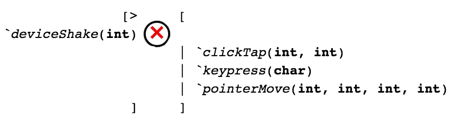

# 将替代值放入类型中

在上一章中，我们看到了如何构建捕获多种类型值的值，以及构建这些类型的不同方式。这使得我们可以说，只有当我们有它们组成类型的 *所有* 值时，我们才有复合（乘积）类型的值。有时，我们需要的值必须是几种类型中 *仅一种* 类型。

在本章中，我们将介绍这些 *仅一种* 类型，即：

+   变体类型

+   多态变体类型

+   广义代数数据类型

这些类型统称为 *求和类型*，因为求和类型可以包含的可能值的数量是它每个组成部分类型可能值的数量的 *总和*。我们将在本章中看到这一点是如何成立的！

# 变体类型

变体类型是 Reason 的简单、惯用的求和类型。你可以把它们想象成类似于其他语言的枚举（一组声明为形成类型的有限值），但更强大，因为每个 *变体情况*（可能的替代值）都可以选择性地携带一个负载。以下是一个例子：

```js
/* src/Ch05/Ch05_Variants.re */
type education = *School* | *College* | *Postgrad* | *Other*; /* (1) */

type poNumber = string;
type paymentMethod = *Cash* | *PurchaseOrder*(poNumber); /* (2) */

let *bobEducation* = *College*; /* (3) */
let *bobPaymentMethod* = *Cash*;
let *jimEducation* = *Other*;
let *jimPaymentMethod* = *PurchaseOrder*("PO-1234"); /* (4) */
```

此模块定义了一些类型，用于存储某人的教育水平和现金或采购订单的支付方式：

1.  变体类型定义以 `type typeName =` 开头，就像任何其他类型的定义一样，并在等号右侧有一个或多个 *变体构造函数*（也称为 *数据构造函数*）。这些构造函数具有完全相同的类型，可以用作字面值。

1.  变体构造函数必须以大写字母开头，并且可以携带任意数量的负载，正如括号内定义的那样。这可以是一个类型列表，用逗号分隔，这些类型将组成负载。在这里，我们定义了 `poNumber` 类型，而不是直接使用 `string`，以便使代码更具自描述性。

1.  我们可以直接使用变体情况作为字面值。现在，`bobEducation` 的类型是 `education`。

1.  对于携带负载的变体构造函数，我们可以将它们作为逗号分隔的列表传递，括号内的语法反映了它们的定义。

第一个变体类型 `education` 是一个简单的类型，我们可以在很多语言中找到它。它只是定义了一个人教育允许的值集。当然，在所有场景中这可能并不现实，但有时我们只需要类型足够现实，以模拟我们的问题。

下一个变体类型 `paymentMethod` 是真正有趣的一个。它表示有效的支付方式是现金或带有 PO 号的采购订单。注意，对于现金我们不需要任何额外信息，但对于采购订单，我们需要其号码；不可能用相应的号码来描述 PO。

让我们稍微思考一下。在其他语言中表示支付方式，你可能做如下操作：

```js
// JavaScript
const *bobPaymentMethod* = {*type*: 'PaymentMethod.Cash'};
const *jimPaymentMethod* = 
{
  *type*: 'PaymentMethod.PurchaseOrder',
  *poNumber*: 'PO-1234'
};
```

注意到问题了吗？没有任何东西阻止我们创建具有`type: 'PaymentMethod.Cash'`和`poNumber`属性的对象，或者更糟糕的是，`type: 'PaymentMethod.PurchaseOrder'`但没有`poNumber`属性的`type: 'PaymentMethod.PurchaseOrder'`。我们无法保证采购订单总是有一个相关的 ID。变体类型给我们提供了这个静态保证。

# 模式匹配

我们可以轻松地构造变体值——只需输入变体构造函数并给出它们所需的数据。但当我们处理它们的值时，变体才真正发光。

例如，假设你想编写一个函数，该函数返回任何给定支付的感谢信息。信息的一部分将取决于支付方式：

```js
/* src/Ch05/Ch05_PatternMatching.re */
type paymentMethod = *Ch05_Variants*.paymentMethod = /* (1) */
| *Cash*
| *PurchaseOrder*(*Ch05_Variants*.poNumber);

let *paymentMethodThanks*(*paymentMethod*) = switch (*paymentMethod*) { /* (2) */
| *Cash* => "Thank you for your cash payment"
| *PurchaseOrder*(*poNumber*) =>
  "Thank you for your purchase order # " ++ *poNumber*
};
```

我们将在这里引入一些新的语法：

1.  我们使用**类型方程**来告诉编译器，在这个模块中定义的这个变体类型与在`Ch05_Variants`中定义的其他变体类型相同，并且关键的是它的构造函数也是完全相同的。

1.  我们使用 Reason 的`switch`表达式**模式匹配**给定的支付方式，该表达式可以**解构**可以与模式匹配的数据。

我们可以在两个模块中简单地重新定义变体类型；但在 Reason 中，变体类型是命名（即，即使相同的变体类型定义在不同的模块中，也会被视为不同的类型），除非我们使用类型方程。在这个简单的例子中，编译器将两个类型等同起来并不是关键，但有时在一个 Reason 代码库中，你可能希望为了方便访问而**引入**另一个模块中的变体构造函数。否则，你可能需要打开另一个模块（风险较大）或者在构造函数前加上模块名（冗长），例如，`Ch05_Variants.Cash`。

# `switch`表达式的力量

在上一节中，我们看到了如何使用`switch`表达式。但那只是触及了`switch`能做的事情的表面。`switch`表达式可以匹配任意模式，并评估与**第一个**匹配模式对应的分支。

这里是`switch`表达式的稍微正式一点的语法：

```js
switch (*expr*) {
| *pat1* => *res1*
| *pat2* => *res2*
...
| *patN* => *resN*
}
```

整个语法形式评估为单个值。每个以竖线字符（`|`）开始的表达式子部分被称为**分支**。

评估表达式的步骤如下：

1.  评估`expr`。

1.  将`expr`的值与`pat1`匹配；如果匹配，将整个表达式评估为`res1`并忽略所有其他分支。

1.  否则，继续将值依次与每个模式匹配，并评估为与匹配模式对应的结果。

1.  如果没有模式匹配，则抛出一个运行时错误（称为异常），`Match_failure`。

表达式的每一分支都必须具有相同的返回类型，才能编译成功。请注意，分支的顺序可能重要也可能不重要，这取决于我们正在匹配哪种模式。如果我们正在匹配一个变体类型的精确情况，顺序并不重要，因为变体情况自然没有任何*顺序*的概念。也就是说，即使我们在`paymentMethod`类型定义中将`Cash`定义在`PurchaseOrder`之前，这并不意味着`Cash`在本质上*小于*`PurchaseOrder`。这里没有优先级。

然而，模式不必是变体情况。它们可以是任何有效的名称和字面值的组合。在这种情况下，一个名称是任何有效的 Reason 标识符，例如`age`或`_123`。字面值包括变体情况，但也包括基本类型如`char`、`string`、`int`、`float`等的值；以及元组和记录值。如果一个模式与输入表达式匹配，它包含的任何名称都会被*绑定*到表达式的相关部分，并在`=>`右侧的结果表达式的范围内可用。

通过名称绑定、字面值和顺序，模式可以变得相当复杂；让我们看看几个例子：

```js
/* src/Ch05/Ch05_PatternMatchOrder.re */
type person = *Ch04_RecordLiterals*.person = {*id*: int, *name*: string};

let *classifyId*(*id*) = switch (*id*) {
| 1 | 2 | 3 | 4 | 5 => "Low" /* (1) */
| 6 | 7 | 8 | 9 | 10 => "Medium"
| _ => "High"
};

let *greet1*(*person*) = switch (*person.id*, *person.name*) { /* (2) */
| (_, "Dave") => "I'm sorry, Dave, I can't let you do that."
| (1, _) => "Hello, boss."
| (*id*, *name*) => "Hi, " ++ *name* ++ " with ID " ++ *string_of_int*(*id*) ++ "!"
};

let *greet2*(*person*) = switch (*person*) {
| {*name*: "Dave"} => "I'm sorry, Dave, I can't let you do that." /* (3) */
| {*id*: 1} => "Hello, boss."
| {*id*, *name*} => "Hi, " ++ *name* ++ " with ID " ++ *string_of_int*(*id*) ++ "!"
};
```

这里有几个有趣的地方：

1.  我们正在根据一个`int` ID 进行条件分支，在一行上列出多个替代模式，用竖线分隔。实际上，模式是递归定义的；这意味着模式可以包含更多的模式！换句话说，我们可以用竖线将几个单独的模式，如`1`、`2`等，组合起来，以表示这些模式中的任何一个都应该匹配。这被称为**或模式**。请注意，模式的顺序意味着在运行时，输入 ID 将首先与数字 1 到 5 进行比较，然后才会与其他模式进行比较。在这个模式匹配中，下划线符号（`_`）表示*任何东西，我不关心，也不绑定值*。

1.  给定一个`person`值，我们根据其名称和 ID 进行条件分支。实际上，我们是在对一个单一的表达式进行条件分支；表达式`(person.id, person.name)`是一个即时创建的元组，我们立即对其进行匹配。这里真正有趣的是模式的顺序。我们表达的是逻辑，即我们总是为 Dave 显示特殊消息，如果不是 Dave，如果是 ID 为 1 的人，我们将其问候为老板，只有当不是 Dave 或老板时，我们才按名称和 ID 问候这个人。

1.  在`greet2`中，我们直接使用记录字面模式对`person`进行条件分支，并表达与之前相同的有序逻辑，只是这次我们不需要构建一个临时元组，因为我们知道我们可以直接对记录进行模式匹配。这并不一定有性能上的好处，但你可能会觉得代码稍微整洁一些——这是主观的。

模式匹配可以处理相当复杂的数据结构，因为模式具有特殊的组合属性。然而，有了这种强大的力量，也带来了两个警告：首先，我们需要理解我们列出 switch 表达式分支的顺序，以免得到意外结果；其次，我们需要避免使用可反驳模式可能引起的潜在运行时错误。

# 可反驳模式

重要的是要理解，`switch` 表达式是 Reason 中三种模式匹配中的一种：

+   Switch 表达式

+   令绑定（见第二章，*使用类型和值编程*）

+   函数参数（我们将在未来的章节中介绍函数）

在所有三种模式匹配形式中，如果我们错误地使用可反驳模式，我们就会面临运行时错误的风险。*可反驳模式* 是可以类型检查，但可能在运行时*可能*失败的模式。这里有一些简单的例子：

```js
let 3 = 3;
let *getPoNumber*(*paymentMethod*) = 
{
  let *PurchaseOrder*(*poNumber*) = *paymentMethod*;
  *poNumber*
};
```

对 `let 3 = 3` 感到惊讶吗？记住，等号左边的可以是任何模式——甚至是一个单一的文本值！此外，`PurchaseOrder(poNumber) = ...` 是一个变体情况的解构，而不是函数定义。区别在于第一个字母的大小写，`P`。记住，Reason 模块和数据构造函数以大写字母开头，而类型和值以小写字母开头。

如果你尝试第一个绑定，你会看到以下警告：

```js
(Output from bsb -w)
  Warning number 8
  /Users/yawar/src/learning-tydd-reason/src/Ch05/Ch05_PatternMatchOrder.re 22:5

  20 │ };
  21 │ 
  22 │ let 3 = 3;

  You forgot to handle a possible value here, for example: 
0
```

问题其实并不明显：被绑定的值实际上是 3，它永远不会是 0，所以我们怎么能忘记处理它呢？要意识到的是，编译器只看类型——它看到我们使用了类型为 `int` 的可反驳模式，并警告我们关于它知道我们没有处理过的最简单的 `int`：`0`。

如果你尝试第二个：

```js
(Output from bsb -w)
  Warning number 8
  /Users/yawar/src/learning-tydd-reason/src/Ch05/Ch05_VariantPatternMatching.re 13:7-29

  11 │ 
  12 │ let getPoNumber(paymentMethod) = {
  13 │   let PurchaseOrder(poNumber) = paymentMethod;
  14 │   poNumber
  15 │ };

  You forgot to handle a possible value here, for example: 
Cash
```

这次，很明显：在运行时，`getPoNumber` 函数可能会被带有 `Cash` 值的参数调用（因为那通过了类型检查！）但它不知道如何处理它。它除了抛出运行时错误外，别无他法。编译器就像以前一样，通过查看 `paymentMethod` 类型并寻找它知道我们没有处理过的类型值来解决这个问题。

这种检查我们是否处理了给定类型的所有可能模式的功能被称为**完备性检查**，并且是 Reason 类型系统中最强大和最有用的功能之一。它也存在于一些从与 Reason 相同的 ML（元语言）遗产中衍生出来的语言，或者从中汲取了灵感。无论什么语言，如果你有完备性检查可用，尽量尽可能多地使用它，因为它是一个很好的安全网。

# 当子句和一般分支

不仅开关表达式可以在它们的输入上进行模式匹配，而且它们还可以在每个模式的末尾添加一个称为 `when` **子句** 的一般测试条件。这让你可以在每个分支中检查完全通用的条件以匹配该分支。请注意，使用 `when` 子句确实会放弃详尽性检查，所以在伸手去拿它之前，考虑一下你是否可以不这么做。有时候，你真的不能。例如：

```js
/* src/Ch05/Ch05_Branching.re */
type education = *Ch05_Variants*.education = /* (1) */
| *School*
| *College*
| *Postgrad*
| *Other*;

type paymentMethod = *Ch05_Variants*.paymentMethod =
| *Cash*
| *PurchaseOrder*(*Ch05_Variants*.poNumber);

/** Returns purchase order IDs that start with 'ACME', otherwise
    nothing. */
let *getAcmeOrder*(*paymentMethod*) = switch (*paymentMethod*) {
| *PurchaseOrder*(*poNumber*)
  /* (2),                                      (3) */
  when *String.sub*(*poNumber*, 0, 4) == "ACME" => *Some*(*poNumber*)
| _ => *None* /* (4) */
};

let *decidePaymentMethod*(*orderTotal*, *orderId*) =
 if (*orderTotal* <= 50.0) *Cash* /* (5) */
 else *PurchaseOrder*("PO-" ++ *orderId*);
```

这个代码示例展示了使用 `when` 子句的场景：

1.  我们重新定义了我们需要的类型并将它们等价起来以实现互操作性。严格来说，在这种情况下，我们不需要这么做。但在大多数现实世界的代码中，你确实需要这么做。

1.  我们在 `PurchaseOrder(poNumber)` 基本模式中添加了一个 `when` 子句来检查 PO 号码是否以单词 ACME 开头。这是我们不能通过模式匹配来完成的事情，因为我们不能匹配字符串的部分。

1.  我们还将分支评估为 `Some(poNumber)`。`Some` 是一个内置的数据构造函数，它表达了*这里有一个值（与没有值相对)*的概念。它实际上接受*任何*类型，而不仅仅是 `string`，我们将在下一章中看到它是如何工作的。

1.  当 PO 号码不以单词 ACME 开头时，其结果为 `None`，这与 `Some(whatever)` 的类型相同，但它表达了*这里没有值*的概念。`Some(whatever)` 和 `None` 的类型是一种变体类型 `option(whateverType)`，它对于安全地传递可能逻辑上不存在的值非常有用。在这种情况下，它对我们函数 `getAcmeOrder` 很有用，因为，在运行时给定任何支付方式，它可能实际上不包含 ACME 购买订单，因此我们需要一种方式来说明*这不是一个 ACME PO*，而 `None` 就提供了这种可能性。

1.  Reason 还有一个传统的 `if`-`else` 语法，它也是一个表达式，并返回一个值。`if` 和 `else` 分支都必须返回相同类型的值；如果我们省略了 `else` 分支，它将被假定为返回类型为 `unit` 的 `()`。在 Reason 中，`()`——发音为 *unit*——大致意味着与 C、C++ 等语言中的 `void` 相同的意思，只不过它是一个实际可赋值的值，有时可能会派上用场。在 `if` 表达式的情况下，具体来说，这意味着我们应该包含一个 `else` 子句，或者确保 `if` 子句返回类型为 `unit`。通常，这发生在执行操作但不返回有用值的函数中，例如，`Js.log("Hello")`。

到目前为止，在这本书中，我们看到了一些看起来像 `typeName(typeParam)` 的类型，但我们还没有深入研究它们是什么或它们是如何工作的。在下一章中，我们将学习参数化类型以及它们如何帮助我们编写安全、可重用的代码。

# 严格的安全检查

值得稍微偏离一下，谈谈编译器的详尽性检查警告。正如你将记得的，它看起来如下：

```js
(Output from bsb -w)
  Warning number 8
  /Users/yawar/src/learning-tydd-reason/src/Ch05/Ch05_Branching.re 25:5

  23 │   else PurchaseOrder("PO-" ++ orderId);
  24 │ 
  25 │ let 3 = 3;

  You forgot to handle a possible value here, for example: 
0
```

编译警告的问题在于它不会导致编译失败。我们最终可能会在生产环境中运行经过类型检查但实际不安全的代码，因为它忘记处理一些边缘情况。如果编译器在发现任何非穷举模式时能够停止编译，那就真的理想了，这样我们就可以排除将它们部署到生产环境中。

幸运的是，我们可以告诉编译器将警告提升为错误。在我们的情况下，因为我们使用的是 BuckleScript 项目，我们可以稍微编辑一下`bsconfig.json`文件：

```js
// bsconfig.json
{
  // ... rest of the file ...
  "warnings": 
  {
    "error": "+8"
  }
}
```

编辑完文件后，我们可以重新启动`bsb -w`以使新设置生效。`"warnings"`属性包含一个对象，可能包含几个属性，其中之一是具有对应字符串值的`"error"`属性，该字符串值列出了我们想要提升为错误的警告编号，使用`"+NUM"`语法。我们可以从编译器警告消息中获取确切的编号（见前面的片段）。

现在，这个相同的警告将导致编译失败：

```js
(Output from bsb -w)
  Warning number 8
  /Users/yawar/src/learning-tydd-reason/src/Ch05/Ch05_Branching.re 25:5

  23 │   else PurchaseOrder("PO-" ++ orderId);
  24 │ 
  25 │ let 3 = 3;

  You forgot to handle a possible value here, for example: 
0

  We've found a bug for you!
  /Users/yawar/src/learning-tydd-reason/src/Ch05/Ch05_Branching.re

  Some fatal warnings were triggered (1 occurrences)
```

现在编译器在遇到*致命警告*时会停止编译，我们可以享受更安全的模式匹配。

# 多态变体类型

虽然 Reason 的变体类型在概念上很简单，但它们的大部分功能来自于能够与模式匹配和穷举检查一起使用。Reason 还提供了一个更强大但更复杂的求和类型，称为**多态变体**。正如其名所示，这些变体比常规变体更灵活。以下是一些我们可以使用多态变体做，但不能使用常规变体的事情：

+   在定义类型之前创建值，让编译器推断类型

+   将多组变体情况组合在一起

+   定义处理至少一组变体情况作为输入的函数

+   定义输出最多一组变体情况的函数

在某种意义上，我们可以将多态变体视为与常规变体相关，就像对象与记录相关一样。实际上，它们是结构化类型，就像对象和模块一样，因为编译器通过检查它们的结构来推断值的类型。

# 创建和类型化值

让我们看看几个例子，以了解多态变体是如何工作的：

```js
/* src/Ch05/Ch05_PolymorphicVariantBasics.re */
let *colour* = *`Red*; /* (1) */
let *angle* = *`degrees*(45.0); /* (2) */

type event = [ /* (3) */
| *`clickTap*(int, int) /* x, y */
| *`keypress*(char)
| *`pointerMove*(int, int, int, int) /* x1, y1, x2, y2 */
];

type mobileEvent = [
| event /* (4) */
| *`deviceShake*(int) /* how many times */
| *`accel*(float) /* m/s² */
];

let *pressA*: mobileEvent = *`keypress*('a'); /* (5) */
/* let *shakeThrice*: event = *`deviceShake*(3); /* (6) */ */
```

这里有很多新的语法，但希望它们看起来与常规变体语法有些相似：

1.  我们可以定义一个专用的多态变体值，并让编译器确定其类型。在这种情况下，编辑器支持应该显示给我们一个类型`[> `Red]`。这意味着至少包含我看到的` `Red ``数据构造函数的多态变体类型，可能还有更多。类型周围的括号（`[...]`）在语法上将其与常规变体区分开来，并暗示我们应该将其视为类似有界集的东西。

1.  多态变体构造函数可以包含有效载荷，就像常规变体构造函数一样。此外，与常规构造函数不同，多态构造函数可以以小写字母开头。尽管如此，这仍然是不明确的，因为多态变体构造函数必须始终以反引号字符作为前缀。

1.  我们可以使用显示的语法显式定义多态变体类型。请注意，编译器不会自动推断使用定义的构造函数作为后续值的定义类型。我将在第五点中对此进行更多解释。

1.  多态变体类型可以组合其他多态变体类型，并成为一个更广泛的案例集。这让我们可以模拟那些可以被认为是集合（类型）一部分的案例，但也可以单独考虑，例如设备输入事件。

1.  我们必须显式地用多态变体类型注释一个值，以告诉编译器它必须是*正好*这个类型。没有这个注释，在模块内部编译器将根据数据构造函数的结构推断类型，即在这种情况下是`[> `keypress(char)]`。请注意，在模块签名中声明多态变体值的精确类型将有效，但仅从其他模块的角度来看，而不是在模块内部。通常，这已经足够了！

1.  如果该类型没有首先声明构造函数，我们无法声明一个多态变体构造函数具有某种类型。以下是错误可能的样子：

```js
(Output from bsb -w)
  We've found a bug for you!
  /Users/yawar/src/learning-tydd-reason/src/Ch05/Ch05_PolymorphicVariantBasics.re 18:26-40

  16 │ 
  17 │ let pressA: mobileEvent = `keypress('a'); /* (5) */
  18 │ let shakeThrice: event = `deviceShake(3); /* (6) */

  This has type:
    [> `deviceShake(int) ]
  But somewhere wanted:
    event
  The second variant type does not allow tag(s) `deviceShake
```

我们可以这样可视化错误：



多态变体类型不匹配

# 向函数中输入值

现在我们已经可以创建多态变体值，让我们用它们做一些有用的事情。我们如何处理在运行时得到的值？结果证明，我们可以像处理正常变体一样处理它：模式匹配：

```js
/* src/Ch05/Ch05_PolymorphicVariantInputs.re */
let *eventToString*(*event*) = switch (*event*) {
| *`clickTap*(*x*, *y*) => {j|`clickTap($*x*, $*y*)|j} /* (1), (2) */
| *`keypress*(*char*) => {j|`keypress($*char*)|j}
| *`pointerMove*(*x1*, *y1*, *x2*, *y2*) => {j|`pointerMove($*x1*, $*y1*, $*x2*, $*y2*)|j}
| *`deviceShake*(*times*) => {j|`deviceShake($*times*)|j}
| *`accel*(*mssq*) => {j|`accel($*mssq*)|j}
};

/* (3) */
let *pressAString* = *eventToString*(*Ch05_PolymorphicVariantBasics.pressA*);

/* (4) */
let *`degrees*(*angleVal*) = *Ch05_PolymorphicVariantBasics.angle*;
```

1.  我们可以对输入的多态变体数据构造函数进行模式匹配，就像我们对常规构造函数进行匹配一样：通过将构造函数作为模式写出来，并绑定我们想要使用的任何包含的数据。

1.  我们在这里使用 BuckleScript 特定的字符串插值语法以提高便利性：`{j| ... $name ... |j}`。`name`必须在作用域内，并且它只能是一个名称，不能是像`1 + 2`这样的任意表达式。`{j|`和`|j`作为字符串分隔符，也可以用于多行和 Unicode 字符串字面量。

1.  我们可以用符合其推断输入类型的任何值来调用该函数，`pressA`就是这样做的，因为我们确保了它的类型和我们的新函数具有相同的多态变体情况。

1.  我们可以像往常一样直接使用`let`绑定进行模式匹配，但请注意，这里没有完全性警告。编译器现在不知道可能存在其他情况，因此它不会警告我们。因此，最好避免对多态变体值进行`let`绑定模式匹配。

# 理解多态变体推断

如果你已经在你的编辑器中启用了类型提示，它应该告诉你 `eventToString` 的类型如下：

```js
[<
| *`accel*('a)
| *`clickTap*('b, 'c)
| *`deviceShake*('d)
| *`keypress*('e)
| *`pointerMove*('f, 'g, 'h, 'i)
] =>
string
```

编译器在打印变体情况时按字母顺序排列它们，但就像常规变体一样，情况没有任何内在的顺序。

这个函数类型分为两个主要部分：箭头左边的输入，和箭头右边的输出。输入是一个多态变体类型，它可以包含列出的任何情况或更少的情况，并且这些情况可以在给定位置有负载。注意，所有负载的类型看起来像 `'x'`，即以撇号字符开头。正如我们之前提到的，这个字符意味着这个类型将在以后填充。具体来说，它被称为类型参数。

关于这个推断函数类型最重要的理解是，输入的多态变体被赋予一个上界（`<`），这意味着这个函数可以处理具有这些情况的变体多态变体类型，以及具有这些情况的子集的多态变体类型，但它肯定不能处理 *更多* 的情况。

现在，让我们探讨为什么所有负载类型都将稍后填充的原因。我们已经知道它们只是 int 和 float。为什么编译器不能推断出来？

结果表明，当我们使用 BuckleScript 的特殊字符串插值语法糖中的负载时，编译器从未被告知它们的确切类型。字符串插值只是让我们可以在 JavaScript 字符串中放入任何东西，而不需要像我们通常做的那样对编译器具体化，例如，使用字符串连接如 `"Hello" ++ " world"`。这对于生成输出非常方便，但可能导致陷阱，因为编译器无法推断类型；因此，了解这一点是好的。

总体而言，请注意我们实现的重要安全属性，这与对象的类型安全非常相似：我们可以在一定程度上安全地使用 adhoc 变体构造函数，并借助编译器的帮助。

# 从函数中输出值

如果我们想反方向操作呢？也就是说，从函数中输出多态变体值：

```js
/* src/Ch05/Ch05_PolymorphicVariantOutputs.re */
let *stringToColour*(*string*) = switch (*string*) {
| "red" => *`red*
| "green" => *`green*
| "blue" => *`blue*
| _ => *`unknown* /* we need to handle the edge case */
};
```

这次，发生了两件有趣的事情：

+   编译器对输入进行穷举检查，输入是一个字符串，因此我们需要处理 *所有* 可能的字符串输入（最后一个是一个通配符）

+   编译器交换多态变体类型的界限，使得函数的类型（为）：

```js
string => [> *`blue* | *`green* | *`red* | *`unknown*]
```

这次，编译器为多态变体返回类型推断出一个 *下界*，因为它似乎函数返回这些情况，并且它可能还会返回更多，但它肯定永远不会返回 *更少* 的情况。

多态变体类型是 Reason 的一个深奥而强大的部分，我们将在接下来的章节中更深入地探讨它们。

# 泛化代数数据类型

**泛化代数数据类型**（**GADTs**）是语言中另一个深奥而强大的领域。与多态变体类型一样，它们的大部分真正力量是在使用类型参数时展现出来的。但我们可以理解它们的表面语法以及它们与常规变体类型的关系，至少目前是这样。

GADTs，正如其名称所暗示的，是代数数据类型的一种泛化形式。这个名称有一点误导性，因为它们实际上是常规变体类型泛化形式的一种。代数数据类型是一个总称，包括产品类型和求和类型。在语法上，GADTs 看起来如下：

```js
/* src/Ch05/Ch05_GADTs.re */
type poNumber = string;

type paymentMethod =
| *Cash*: paymentMethod
| *PurchaseOrder*(poNumber): paymentMethod; /* (1) */

let *paymentCash* = *Cash*; /* (2) */

let *paymentMessage*(*paymentMethod*) = switch (*paymentMethod*) {
| *Cash* => "Paid in cash" /* (3) */
| *PurchaseOrder*(*poNumber*) => {j|Paid with PO#$*poNumber*|j}
};
```

1.  GADT 定义语法看起来与常规变体定义语法非常相似，不同之处在于数据构造函数在末尾明确声明了它们的类型。对于单态类型（即没有类型参数的类型），这看起来不太有用。在下一章中，我们将看到为什么它如此强大。

1.  值构造看起来与常规变体相同。

1.  模式匹配看起来与常规变体相同。

# 使用类型进行正确性设计

现在我们已经看到了产品类型和求和类型在实际中的应用，让我们退一步思考它们如何协同工作。直观上，产品类型让我们可以将值组合在一起，而求和类型让我们可以从一个受限的值集中选择一个。结合起来，它们可以表达广泛的数据建模场景。让我们看看几个例子。

# 产品和求和类型一起

首先，一个简单的例子来热身。假设我们被要求为一个客户关系管理软件跟踪以下人员的属性：

+   身份证号：一个字符串

+   姓名：一个字符串

+   教育水平：学校、学院、研究生或其他之一

一个有效的人员记录必须具有所有这些属性。注意我们如何使用特定的措辞“之一”和“所有”。这些给我们提供了关于如何建模数据的线索：“之一”意味着求和类型，“所有”意味着产品类型！在我们将数据结构分解为其组成部分时，以这些术语来考虑需求是非常有用的。

此后的主要选择是具体使用哪种产品类型和求和类型的实现。通常，我们会选择最简单的可能实现：记录和变体。因此，在这种情况下：

```js
/* src/Ch05/Ch05_CrmPerson.re */
type education = *Ch05_Variants*.education =
| *School*
| *College*
| *Postgrad*
| *Other*;

type t = {*id*: int, *name*: string, education}; /* (1) */

/* (2) */
let *bob* = {*id*: 1, *name*: "Bob", *education*: *College*};
let *jim* = {*id*: 2, *name*: "Jim", *education*: *Other*};
```

1.  人员记录类型 `Ch05_CrmPerson.t` 是由三种其他类型组成的记录类型：一个 `int`、一个 `string` 和一个 `education`。`education` 类型是一个变体类型，接受四种合法教育值中的任何一个。

1.  有效的 `t` 值是通过将所有必需的组件值组合在一起构建的，包括 `education` 值。

注意值是如何通过遵守类型所规定的业务逻辑来构建的：对于一个人员记录，我们需要一个 ID、一个姓名和一个教育背景；对于一个教育值，我们只需要允许的值之一。

# 递归类型

现在，让我们看看一个更有趣的例子。假设我们需要模拟的不是一个人，而是一个*人记录列表*。假设我们还需要能够逐个遍历这个列表，并对每个记录的数据执行一些操作。这种情况下，一个自然的数据结构是*单链表*。正如你可能知道的，单链表是一系列节点，每个节点都指向列表中的下一个节点，或者在没有下一个节点的情况下指向*空值*（即列表的最后一个节点）。

在 Reason 中，模拟这个列表的自然方式是使用递归变体类型。*递归类型*是包含其自身类型值的类型。这个巧妙的方法之所以有效，是因为 Reason 内部将值的存储与其类型分开，因此它们不会最终占用无限存储。以下是我们的人记录列表场景的一个示例实现：

```js
/* src/Ch05/Ch05_PersonList.re */
type t = *Node*(*Ch05_CrmPerson*.t, t) | *Empty*; /* (1) */

let *people* = *Ch05_CrmPerson*.(*Node*(*bob*, *Node*(*jim*, *Empty*))); /* (2) */

let rec *greet*(*t*) = switch (*t*) { /* (3) */
| *Node*(*person*, *list*) => { /* (4) */
    *print_endline*("Hello, " ++ *person.name* ++ "!");
    *greet*(*list*)
  }
| *Empty* => () /* (5) */
};
```

使用递归类型可以揭示一些新颖且有趣的语法：

1.  递归类型的类型定义看起来与我们之前看到的没有不同，只不过它包含对其自身类型的引用。在 Reason 中，我们不需要做任何特别的事情，因为所有类型定义默认都是递归的。事实上，如果我们想使类型定义*非递归*（在某些情况下我们确实这样做），我们需要使用一个额外的关键字：`type nonrec t = ...`。

1.  我们可以像定义普通类型一样定义递归类型的值，只不过它可以包含其自身类型的其他值。我们局部打开`Ch05_CrmPerson`模块以获取对那里定义的人的值的访问权限。

1.  要遍历递归类型的所有值，我们通常需要一个*递归函数*（即调用自己的函数）。与类型不同，函数默认不是递归的，因为传统上递归函数在运行时性能方面稍微昂贵一些。因此，当我们需要递归时，我们使用`let rec ...`语法来指定它。

1.  我们可以像处理非递归值一样解构递归值，只需确保我们将它的递归部分`list`传递给递归的`greet`调用。

1.  为了处理`Ch05_PersonList.t`（`Empty`）的非递归部分，我们只需*不做任何事情*，因此我们返回 unit，即*空值*。

我们的递归`greet`函数有一个有趣的属性：它是尾递归的。*尾递归*是递归函数具有的属性，如果它在尾位置调用自己，即如果它在任何评估分支的最后一个（尾）操作中调用自己。例如，`greet`在其第一个分支中作为最后一个操作调用自己，处理`Node`变体情况。

我们关注这个尾递归属性，因为 BuckleScript 编译器具有将尾递归转换为输出 JavaScript 中的简单、高效循环的特殊能力。如果你检查输出，你会看到循环看起来几乎像是手写的。

# 摘要

在本章中，我们介绍了被称为求和类型（sum types）的总称：变体和模式匹配、多态变体以及 GADTs。这些是 Reason 中一些基本的类型技术，当正确组合使用时，它们能够实现强大的数据建模技术。

然而，越来越明显的是，还有很多类型的力量有待探索。在下一章中，我们将全面介绍到目前为止我们只是瞥见过的类型参数（泛型），以及使用不同类型的技巧。
