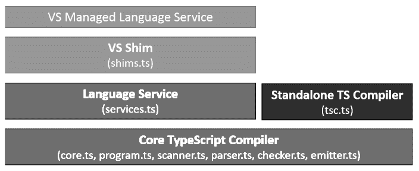
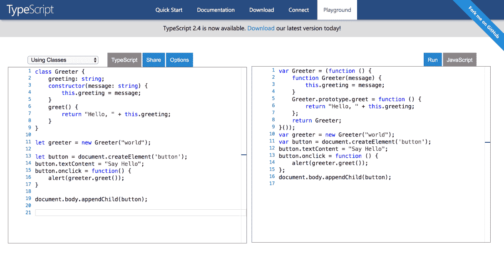
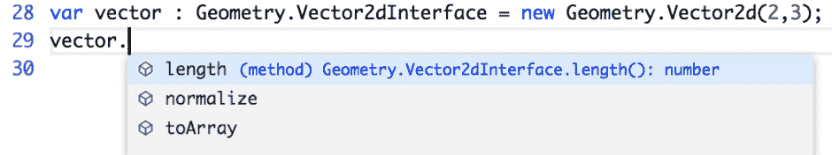

# 第一章：介绍 TypeScript

本书旨在为您提供 TypeScript 的功能、其限制和其生态系统的广泛概述。您将了解 TypeScript 语言、开发工具、设计模式和推荐实践。

本章将为您概述 TypeScript 的历史，并介绍其一些基础知识。

在本章中，您将了解以下概念：

+   TypeScript 架构

+   类型注释

+   变量和原始数据类型

+   运算符

+   流程控制语句

+   函数

+   类

+   接口

+   命名空间

# TypeScript 架构

在本节中，我们将关注 TypeScript 的内部架构和其原始设计目标。

# 设计目标

以下列表描述了主要的设计目标和架构决策，这些决策塑造了 TypeScript 编程语言今天的外观：

+   **静态识别可能产生错误的 JavaScript 构造**：微软的工程师决定，识别和防止潜在运行时问题的最佳方式是创建一个强类型编程语言，并在编译时进行静态类型检查。工程师还设计了一个语言服务层，为开发者提供更好的工具。

+   **与现有 JavaScript 代码高度兼容**：TypeScript 是 JavaScript 的超集；这意味着任何有效的 JavaScript 程序也是有效的 TypeScript 程序（有一些小的例外）。

+   **为较大的代码块提供结构化机制**：TypeScript 添加了基于类的面向对象、接口、命名空间和模块等功能。这些特性将帮助我们以更好的方式结构化代码。我们还将通过遵循最佳面向对象原则和推荐实践来减少开发团队内部潜在集成问题，并使代码更容易维护和扩展。

+   **不对输出程序产生运行时开销**：在考虑 TypeScript 时，区分设计时间和执行时间是常见的。我们使用术语 *设计时间* 或 *编译时间* 来指代我们在设计应用程序时编写的 TypeScript 代码，而使用术语 *执行时间* 或 *运行时* 来指代编译某些 TypeScript 代码后执行的 JavaScript 代码。

TypeScript 为 JavaScript 添加了一些功能，但这些功能仅在设计时可用。例如，我们可以在 TypeScript 中声明接口，但由于 JavaScript 不支持接口，TypeScript 编译器在运行时（在输出 JavaScript 代码中）不会声明或尝试模拟此功能。

微软工程师为 TypeScript 编译器提供了一些机制，例如**代码转换**（将 TypeScript 特性转换为纯 JavaScript 实现）和**类型擦除**（移除静态类型注释），以生成干净的 JavaScript 代码。类型擦除不仅移除了类型注释，还移除了 TypeScript 独有的所有语言特性，如接口。

此外，生成的代码与网络浏览器高度兼容，因为它默认针对 ECMAScript 3 规范，但也支持 ECMAScript 5 和 ECMAScript 6。一般来说，我们可以在编译到任何可用的编译目标时使用 TypeScript 功能，但有时某些功能可能需要 ECMAScript 5 或更高版本作为编译目标。

+   **与当前和未来的 ECMAScript 提案保持一致**：TypeScript 不仅与现有的 JavaScript 代码兼容；它还与一些未来的 JavaScript 版本兼容。乍一看，我们可能会认为一些 TypeScript 功能使其与 JavaScript 相差甚远，但实际情况是，TypeScript 中可用的所有功能（除了类型系统功能）都遵循 ECMAScript 提案，这意味着许多 TypeScript 文件最终将成为原生 JavaScript 功能。

+   **成为跨平台开发工具**：微软在 Apache 许可下发布了 TypeScript，它可以在所有主要操作系统上安装和执行。

# TypeScript 组件

TypeScript 语言有三个主要的内部层。每一层又依次分为子层或组件。在下面的图中，我们可以看到这三个层（三种不同灰度的层次）以及它们各自的内部组件（方框）：



在前面的图中，缩写**VS**指的是微软的 Visual Studio，它是所有微软产品（包括 TypeScript）的官方**集成开发环境**（**IDE**）系列。我们将在第九章*自动化您的开发工作流程*中了解更多关于这个和其他 IDE 的信息。第九章。

每一个主要层都有不同的用途：

+   **语言**：包含 TypeScript 语言元素。

+   **编译器**负责解析、类型检查和将您的 TypeScript 代码转换为 JavaScript 代码。

+   **语言服务**：生成信息，帮助编辑器和其他工具提供更好的辅助功能，例如 IntelliSense 或自动化重构。

+   **IDE 集成（VS Shim）**：IDE 和文本编辑器的开发者必须进行一些集成工作，以利用 TypeScript 功能。TypeScript 被设计用来促进开发帮助提高 JavaScript 开发者生产力的工具。由于这些努力，将 TypeScript 与 IDE 集成并不复杂。这一点的证明是，目前最流行的 IDE 都包括良好的 TypeScript 支持。

在其他书籍和在线资源中，您可能会找到将术语*transpiler*而不是*compiler*的引用。**transpiler**是一种编译器，它将编程语言的源代码作为输入，并将源代码输出为具有相似抽象级别的另一种编程语言的源代码。

我们将在第十五章 Chapter 15 中学习更多关于 TypeScript 语言服务和 TypeScript 编译器的内容，*使用 TypeScript 编译器和语言服务*。

# TypeScript 语言特性

现在你已经了解了 TypeScript 的用途，是时候动手编写一些代码了。

在你开始学习如何使用一些基本的 TypeScript 构建块之前，你需要设置你的开发环境。开始编写一些 TypeScript 代码最简单、最快的方式是使用在线编辑器，它可以在 TypeScript 官方网站上找到，网址为 [`www.typescriptlang.org/play/index.html`](https://www.typescriptlang.org/play/index.html):



上一张截图显示了 TypeScript 操场的样子。如果你访问操场，你将能够使用屏幕左侧的文本编辑器编写 TypeScript 代码。然后代码将被自动编译成 JavaScript。输出代码将被插入到屏幕右侧的文本编辑器中。如果你的 TypeScript 代码无效，右侧的 JavaScript 代码将不会更新。

或者，如果你更喜欢能够离线工作，你可以下载并安装 TypeScript 编译器。如果你使用的是 Visual Studio 2015 之前的版本，你需要从 [`marketplace.visualstudio.com/`](https://marketplace.visualstudio.com/) 下载官方 TypeScript 扩展。如果你使用的是 2015 版本之后的 Visual Studio 版本（或 Visual Studio Code），你不需要安装扩展，因为这些版本默认包含 TypeScript 支持。

许多流行的编辑器，如 Sublime ([`github.com/Microsoft/TypeScript-Sublime-Plugin`](https://github.com/Microsoft/TypeScript-Sublime-Plugin)) 或 Atom ([`atom.io/packages/atom-typescript`](https://atom.io/packages/atom-typescript))，都提供了 TypeScript 插件。

你也可以通过将其作为 `npm` 模块下载来从命令行界面使用 TypeScript。如果你不熟悉 npm，不要担心。现在，你只需要知道它代表 **node package manager**，是 Node.js 的默认包管理器。Node.js 是一个开源的、跨平台的 JavaScript 运行时环境，用于在服务器端执行 JavaScript 代码。要能够使用 npm，你需要在你的开发环境中安装 Node.js。你可以在官方网站 [`nodejs.org/`](https://nodejs.org/) 上找到 Node.js 的安装文件。

一旦你在你的开发环境中安装了 Node.js，你将能够在控制台或终端中运行以下命令：

```js
npm install -g typescript
```

基于 Unix 的操作系统在安装全局（`-g`）npm 包时可能需要使用 `sudo` 命令。`sudo` 命令将提示用户输入凭证，并使用管理员权限安装包：

`sudo npm install -g typescript`

创建一个名为 `test.ts` 的新文件，并将以下代码添加到其中：

```js
let myNumberVariable: number = 1; 
console.log(myNumberVariable); 
```

将文件保存到您选择的目录中，并打开命令行界面。导航到保存文件的目录，并执行以下命令：

```js
tsc test.ts
```

如果一切顺利，您将在 `test.ts` 文件所在的同一目录中找到一个名为 `test.js` 的文件。现在您已经知道如何将 TypeScript 代码编译成 JavaScript 代码。

您可以使用 Node.js 执行输出 JavaScript 代码：

```js
node test.js
```

现在我们已经了解了如何编译和执行 TypeScript 源代码，我们可以开始学习一些 TypeScript 的特性。

您将在 第九章*自动化您的开发工作流程*中了解更多关于编辑器、编译器选项和其他 TypeScript 工具的信息。

# 类型

如我们所知，TypeScript 是 JavaScript 的一个类型超集。TypeScript 通过添加静态类型系统和可选的静态类型注解到 JavaScript 中，将其转换为一个强类型编程语言。

TypeScript 的类型分析完全在编译时进行，不会给程序执行增加运行时开销。

# 类型推断和可选的静态类型注解

TypeScript 语言服务在自动检测变量的类型方面做得很好。然而，在某些情况下，它无法自动检测类型。

当类型推断系统无法识别变量的类型时，它使用一个称为 *any* 类型的类型。any 类型代表所有现有的类型，因此它过于灵活，无法检测大多数错误，这不是问题，因为 TypeScript 允许我们使用所谓的 **可选的静态类型注解**显式声明变量的类型。

可选的静态类型注解被用作对程序实体（如函数、变量和属性）的约束，以便编译器和开发工具在软件开发期间提供更好的验证和辅助（如 IntelliSense）。

强类型允许程序员在代码中表达他们的意图，既是对自己，也是对开发团队中的其他人。

对于一个变量，类型注解位于变量名称之后的冒号之前：

```js
let counter; // unknown (any) type 
let counter = 0; // number (inferred) 
let counter: number; // number 
let counter: number = 0; // number 
```

我们使用了 `let` 关键字而不是 `var` 关键字。`let` 关键字是 TypeScript 提供的一个较新的 JavaScript 构造。我们稍后会讨论细节，但使用 `let` 可以解决 JavaScript 中的一些常见问题，因此，在可能的情况下，您应该使用 `let` 而不是 `var`。

如您所见，我们在变量名之后声明变量的类型；这种类型表示法风格基于类型理论，有助于加强类型是可选的观点。

当没有类型注解可用时，TypeScript 会通过检查分配的值来尝试猜测变量的类型。例如，在第二行，在前面代码片段中，我们可以看到变量 counter 被识别为数值变量，因为它的值是数值。有一个称为 **类型推断** 的过程可以自动检测并分配一个类型给变量。当类型推断系统无法检测其类型时，将使用 `any` 类型作为变量的类型。

请注意，配套源代码可能与章节中展示的代码略有不同。配套源代码使用命名空间来隔离每个演示与其他所有演示，有时还会在变量名后附加数字以防止命名冲突。例如，前面的代码包含在配套源代码中如下所示：

```js
namespace type_inference_demo { 
    let counter1; // unknown (any) type 
    let counter2 = 0; // number (inferred) 
    let counter3: number; // number 
    let counter4: number = 0; // number 
} 
```

您将在 第二章，*与类型一起工作* 中了解更多关于 TypeScript 类型系统的信息。

# 变量、基本类型和运算符

基本类型包括布尔值、数字、字符串、数组、元组、对象、空对象、`null`、`undefined`、`{}`、`void` 和枚举。让我们了解这些基本类型中的每一个：

| **数据类型** | **描述** |
| --- | --- |

| 布尔值 | 与字符串和数字数据类型可以有几乎无限数量的不同值不同，布尔数据类型只能有两个。它们是文字：`true` 和 `false`。布尔值是一个真值；它指定条件是真是假：

```js
let isDone:   boolean = false;   
```

|

| 数字 | 与 JavaScript 一样，TypeScript 中的所有数字都是浮点值。这些浮点数具有 `number` 类型：

```js
let height:   number = 6;   
```

|

| 字符串 | 在 TypeScript 中，我们使用 `string` 数据类型来表示文本。您可以通过将字符串文字用单引号或双引号括起来来在脚本中包含字符串文字。双引号可以包含在单引号包围的字符串中，单引号可以包含在双引号包围的字符串中：

```js
let name: string   = "bob";   
name = 'Smith';   
```

|

| 数组 | 我们使用 `array` 数据类型来表示值的集合。`array` 类型可以使用两种不同的语法风格来编写。我们可以使用数组中元素的类型，后跟方括号 `[]` 来注释该元素类型的集合：

```js
let list: number[]   = [1, 2, 3];   
```

第二种语法风格使用名为 `Array<T>` 的泛型数组类型：

```js
let list: Array<number>   = [1, 2, 3];   
```

|

| 元组 | 元组类型可用于表示具有已知不同类型的固定数量元素的数组。例如，我们可以将一个值表示为一个字符串和数字的配对：

```js
let x: [string,   number];   
x = ["hello",   10]; // OK   
x = ["world",   20]; // OK   
x = [10, "hello"];   // Error   
x = [20, "world"];   // Error   
```

|

| 枚举 | 我们使用枚举为值集添加更多意义。枚举可以是数字或基于文本的。默认情况下，数字枚举将值 0 分配给枚举中的第一个成员，并为枚举中的每个成员增加 1：

```js
enum Color {Red,   Green, Blue};   
let c: Color =   Color.Green;   
```

|

| Any | TypeScript 中的所有类型都是单个顶级类型 `**any** **type**` 的子类型。`any` 关键字引用了这个类型。`any` 类型消除了大多数 TypeScript 类型检查，并代表所有可能的类型：

```js
let notSure: any   = 4; // OK   
notSure = "maybe   a string instead"; // OK   
notSure =   false; // OK   
```

`any` 类型在将现有的 JavaScript 代码迁移到 TypeScript 或当我们对某个类型的某些细节有所了解但不知道所有细节时非常有用。例如，当我们知道一个类型是数组，但我们不知道数组中元素的类型时：

```js
let list: any[] =   [1, true, "free"];   
list[1] = 100;   
```

|

| 对象（小写） | `object` 类型代表任何非原始类型。以下类型在 JavaScript 中被认为是原始类型：布尔值、数字、字符串、符号、null 和 undefined。 |
| --- | --- |
| 对象（大写） | 在 JavaScript 中，所有对象都是 `Object` 类的派生。`Object`（大写）描述了所有 JavaScript 对象共有的功能。这包括 `toString()` 和 `hasOwnProperty()` 方法等。 |

| 空对象类型 `{}` | 这描述了一个没有任何自身成员的对象。当你尝试访问此类对象的任意属性时，TypeScript 会发出编译时错误：

```js
const obj =   {};    
obj.prop = "value";   // Error   
```

|

| Null 和 undefined | 在 TypeScript 中，undefined 和 null 都是类型。默认情况下，null 和 undefined 是所有其他类型的子类型。这意味着你可以将 null 和 undefined 赋值给类似数字的东西。然而，当使用 `--strictNullChecks` 标志时，null 和 undefined 只能赋值给 void 和它们各自的类型。 |
| --- | --- |

| Never 类型 | `never` 类型在以下两个地方使用：

+   作为永远不会返回的函数的返回类型

+   作为永远不会为真的类型守卫下的变量类型

```js

function   impossibleTypeGuard(value: any) {   
    if (   
        typeof   value === "string" &&   
        typeof   value === "number"   
    ) {   
        value; //   Type never   
    }    
}   
```

|

| Void | 在某些方面，`any` 的对立面是 `void`，即没有任何类型的缺失。你将看到这是不返回值的函数的返回类型：

```js
function   warnUser(): void {   
    console.log("This   is my warning message");   
}   
```

|

在 TypeScript 和 JavaScript 中，undefined 是全局作用域中的一个属性，它被分配给已声明但尚未初始化的变量。值 `null` 是一个字面量（不是全局对象的属性），它可以被分配给变量，作为没有值的表示：

```js
let testVar; // variable is declared but not initialized 
consoe.log(testVar); // shows undefined  
console.log(typeof testVar); // shows undefined 

let testVar = null; // variable is declared, and null is assigned as its value 
cosole.log(testVar); // shows null  
console.log(typeof testVar); // shows object 
```

# 变量作用域（var, let 和 const）

当我们在 TypeScript 中声明一个变量时，我们可以使用 `var`、`let` 或 `const` 关键字：

```js
var myNumber: number = 1; 
let isValid: boolean = true; 
const apiKey: string = "0E5CE8BD-6341-4CC2-904D-C4A94ACD276E"; 
```

使用 `var` 声明的变量作用域是最近的函数块（或全局，如果不在函数块中）。

使用 `let` 声明的变量作用域是最近的封闭块（或全局，如果不在任何块中），这可以小于函数块。

`const` 关键字创建了一个可以是全局的或局部于其声明块的常量。这意味着常量是块作用域的。

你将在 第六章 中了解更多关于作用域的内容，*理解运行时*。

# | 算术运算符

TypeScript 支持以下算术运算符。我们必须假设变量 `A` 包含 `10`，变量 `B` 包含 `20`，以理解以下示例：

| **运算符** | **描述** | **示例** |
| --- | --- | --- |
| `-` | 从第一个操作数中减去第二个操作数。 | *A - B* 将给出 `-10` |
| `+` | 将两个操作数相加。 | *A + B* 将给出 `30` |
| `*` | 乘以两个操作数。 | *A * B* 将给出 `200` |
| `**` | 将第一个操作数乘以自身，次数由第二个操作数指示。 | *A ** B* 将给出 *1e+20* |
| `%` | 这是取模运算符，是整数除法后的余数。 | *B % A* 将给出 `0` |
| `/` | 将分子除以分母。 | *B / A* 将给出 `2` |
| `--` | 将整数值减一。 | *A--* 将给出 `9` |
| `++` | 将整数值加一。 | *A++* 将给出 `11` |

# | 比较运算符

TypeScript 支持以下比较运算符。为了理解示例，你必须假设变量 `A` 的值为 `10`，变量 `B` 的值为 `20`：

| **运算符** | **描述** | **示例** |
| --- | --- | --- |
| `==` | 检查两个操作数的值是否相等。此运算符使用类型强制转换。如果相等，则条件变为 `true`。 | *(A == B)* 是 `false`。A == "10" 是 `true`。 |
| `===` | 检查两个操作数的值和类型是否相等。此运算符不使用类型强制转换。如果相等，则条件变为 `true`。 | A === B 是 `false`。A === "10" 是 `false`。 |
| `!=` | 检查两个操作数的值是否相等。如果不相等，则条件变为 `true`。此运算符使用类型强制转换。 | (A != B) 是 `true`。A != "10" 是 `false`。 |
| `!==` | 检查两个操作数的值是否相等。如果不相等，则条件变为 `true`。此运算符不使用类型强制转换。 | A !== B 是 `true`。A !== "10" 是 `true`。 |
| `>` | 检查左操作数的值是否大于右操作数的值。如果是，则条件变为 `true`。 | (A > B) 是 `false`。 |
| `<` | 检查左操作数的值是否小于右操作数的值。如果是，则条件变为 `true`。 | (A < B) 是 `true`。 |
| `>=` | 检查左操作数的值是否大于或等于右操作数的值。如果是，则条件变为 `true`。 | (A >= B) 是 `false`。 |
| `<=` | 检查左操作数的值是否小于或等于右操作数的值。如果是，则条件变为 `true`。 | (A <= B) 是 `true`。 |

# | 逻辑运算符

TypeScript 支持以下逻辑运算符。为了理解示例，你必须假设变量 `A` 包含 `10`，变量 `B` 包含 `20`：

| **运算符** | **描述** | **示例** |
| --- | --- | --- |
| `&&` | 被称为逻辑“与”操作符。如果两个操作数都不为零，则条件变为“真”。 | (A && B) 是 true. |
| `&#124;&#124;` | 被称为逻辑“或”操作符。如果两个操作数中的任何一个不为零，则条件变为“真”。 | (A &#124;&#124; B) 是 true. |
| `!` | 被称为逻辑“非”操作符。它用于反转其操作数的逻辑状态。如果条件为“真”，则逻辑“非”操作符将使其变为“假”。 | !(A && B) 是 false. |

# 位运算符

TypeScript 支持以下位运算符。要理解这些示例，你必须假设变量 `A` 的值为 `2`，变量 `B` 的值为 `3`：

| **运算符** | **描述** | **示例** |
| --- | --- | --- |
| `&` | 被称为位运算符的“与”操作符，它对其整数参数的每个位执行布尔“与”操作。 | (A & B) 是 2 |
| `&#124;` | 被称为位运算符的“或”操作符，它对其整数参数的每个位执行布尔“或”操作。 | (A &#124; B) 是 3. |
| `^` | 被称为位运算符的“异或”操作符，它对其整数参数的每个位执行布尔独占“或”操作。独占“或”意味着操作数一为真或操作数二为真，但不能同时为真。 | (A ^ B) 是 1. |
| `~` | 被称为位运算符的“非”操作符，它是一个一元操作符，通过反转操作数中的所有位来操作。 | (~B) 是 -4 |
| `<<` | 被称为位运算符左移操作符。它将其第一个操作数的所有位向左移动由第二个操作数指定的位数。新位用零填充。将值左移一位相当于乘以二，左移两位相当于乘以四，依此类推。 | (A << 1) 是 4 |
| `>>` | 被称为带符号的位运算符右移操作符。它将其第一个操作数的所有位向右移动由第二个操作数指定的位数。 | (A >> 1) 是 1 |
| `>>>` | 被称为带零的位运算符右移操作符。这个操作符与 `>>` 操作符类似，但左移出的位总是零。 | (A >>> 1) 是 1 |

在 C++、Java 或 C# 等语言中使用位运算符的主要原因是它们非常快。然而，位运算符通常被认为在 TypeScript 和 JavaScript 中并不那么高效。JavaScript 中的位运算符效率较低，因为必须将浮点表示（JavaScript 存储所有数字的方式）转换为 32 位整数以执行位操作，然后再转换回来。

# 赋值运算符

TypeScript 支持以下赋值运算符：

| **运算符** | **描述** | **示例** |
| --- | --- | --- |
| `=` | 将右侧操作数的值赋给左侧操作数。 | C = A + B 将 A + B 的值赋给 C |
| `+=` | 将右操作数加到左操作数上，并将结果赋值给左操作数。 | C += A 等价于 C = C + A |
| `-=` | 从左侧操作数减去右侧操作数，并将结果赋值给左侧操作数。 | C -= A 等价于 C = C - A |
| `*=` | 将右侧操作数乘以左侧操作数，并将结果赋值给左侧操作数。 | C *= A 等价于 C = C * A |
| `/=` | 将左侧操作数除以右侧操作数，并将结果赋值给左侧操作数。 | C /= A 等价于 C = C / A |
| `%=` | 使用两个操作数计算模数，并将结果赋值给左侧操作数。 | C %= A 等价于 C = C % A |

# 扩展运算符

扩展运算符可以用来从另一个数组或对象初始化数组和对象：

```js
let originalArr1 = [ 1, 2, 3]; 
let originalArr2 = [ 4, 5, 6]; 
let copyArr = [...originalArr1]; 
let mergedArr = [...originalArr1, ...originalArr2]; 
let newObjArr = [...originalArr1, 7, 8]; 
```

以下代码片段展示了扩展运算符在数组上的使用，而以下代码片段展示了其在对象字面量上的使用：

```js
let originalObj1 = {a: 1, b: 2, c: 3}; 
let originalObj2 = {d: 4, e: 5, f: 6}; 
let copyObj = {...originalObj1}; 
let mergedObj = {...originalObj1, ...originalObj2}; 
let newObjObj = {... originalObj1, g: 7, h: 8}; 
```

扩展运算符还可以用来将表达式扩展为多个参数（在函数调用中），但我们现在将跳过这个用例。

我们将在第三章 Chapter 3，*与函数一起工作* 和第四章 Chapter 4，*使用 TypeScript 进行面向对象编程* 中了解更多关于扩展运算符的内容。

# 流程控制语句

本节描述了 TypeScript 编程语言支持的决策语句、循环语句和分支语句。

# 单重选择结构（if）

以下代码片段声明了一个名为 `isValid` 的布尔类型变量。然后，一个 `if` 语句将检查 `isValid` 的值是否等于 `true`。如果该语句为 `true`，则将在屏幕上显示消息 `Is valid!`：

```js
let isValid: boolean = true; 

if (isValid) { 
  console.log("is valid!"); 
} 
```

# 双重选择结构（if...else）

以下代码片段声明了一个名为 `isValid` 的布尔类型变量。然后，一个 `if` 语句将检查 `isValid` 的值是否等于 `true`。如果该语句为 `true`，则将在屏幕上显示消息 `Is valid!`。另一方面，如果该语句为 `false`，则将在屏幕上显示消息 `Is NOT valid!`：

```js
let isValid: boolean = true; 

if (isValid) { 
  console.log("Is valid!"); 
} else { 
  console.log("Is NOT valid!"); 
} 
```

# 行内三元运算符 (?)

行内三元运算符只是声明双重选择结构的一种替代方式：

```js
let isValid: boolean = true; 
let message = isValid ? "Is valid!" : "Is NOT valid!"; 
console.log(message); 
```

以下代码片段声明了一个名为 `isValid` 的布尔类型变量。然后，它检查操作符 `?` 左侧的变量或表达式是否等于 `true`。

如果该语句为 `true`，则将在字符左侧执行表达式，并将消息 `Is valid!` 赋值给消息变量。

另一方面，如果该语句为 `false`，则操作符右侧的表达式将被执行，并将消息 `Is NOT valid!` 赋值给消息变量。

最后，消息变量的值将在屏幕上显示。

# 多重选择结构（switch）

`switch`语句评估一个表达式，将表达式的值与一个 case 子句匹配，并执行与该 case 关联的语句。switch 语句和枚举通常一起使用，以提高代码的可读性。

在以下示例中，我们声明了一个函数，该函数接受一个名为`AlertLevel`的枚举。

你将在第二章，“与类型一起工作”中了解更多关于枚举的内容。

在函数内部，我们将生成一个字符串数组来存储电子邮件地址，并执行一个`switch`结构。枚举的每个选项都是`switch`结构中的一个 case：

```js
enum AlertLevel{ 
 info, 
  warning, 
  error   
} 

function getAlertSubscribers(level: AlertLevel){ 
  let emails = new Array<string>(); 
  switch(level){ 
  case AlertLevel.info: 
     emails.push("cst@domain.com"); 
     break; 
  case AlertLevel.warning: 
     emails.push("development@domain.com"); 
     emails.push("sysadmin@domain.com"); 
     break; 
  case AlertLevel.error: 
    emails.push("development@domain.com"); 
    emails.push("sysadmin@domain.com"); 
    emails.push("management@domain.com"); 
    break; 
  default: 
    throw new Error("Invalid argument!"); 
  } 
  return emails; 
} 

getAlertSubscribers(AlertLevel.info); // ["cst@domain.com"] 
getAlertSubscribers(AlertLevel.warning); // 
 ["development@domain.com", "sysadmin@domain.com"]
```

`level`变量的值会在`switch`中的所有 case 中进行测试。如果变量与其中一个 case 匹配，则执行与该 case 关联的语句。一旦执行了`case`语句，变量将再次与下一个 case 进行测试。

一旦执行与匹配的 case 关联的语句完成，将评估下一个 case。如果存在`break`关键字，程序将不会继续执行后面的`case`语句。

如果没有找到匹配的 case 子句，程序将查找可选的`default`子句，如果找到，则将控制权转移到该子句并执行相关的语句。

如果没有找到`default`子句，程序将继续执行 switch 结束后的语句。按照惯例，`default`子句是最后一个子句，但不必总是如此。

# 表达式在循环的顶部（while）进行测试

`while`表达式用于在满足一定要求的情况下重复操作。例如，以下代码片段声明了一个名为`i`的数字变量。如果满足要求（`i`的值小于`5`），则执行操作（将`i`的值增加一并在浏览器控制台显示其值）。一旦操作完成，将再次检查是否满足要求：

```js
let i: number = 0; 
while (i < 5) { 
  i += 1; 
  console.log(i); 
} 
```

在`while`表达式中，只有当满足要求时才会执行操作。

# 表达式在循环的底部（do...while）进行测试

`do...while`表达式可用于重复指令，直到不满足某个要求。例如，以下代码片段声明了一个名为`i`的数字变量，并在满足要求（`i`的值小于`five`）的情况下重复操作（将`i`的值增加`one`并在浏览器控制台显示其值）：

```js
let i: number = 0; 
do { 
  i += 1; 
  console.log(i); 
} while (i < 5); 
```

与`while`循环不同，`do...while`表达式至少会执行一次，无论测试的表达式如何，因为操作会在检查是否满足某些要求之前进行。

# 遍历每个对象的属性（for...in）

`for...in`语句本身并不是一种*坏做法*；然而，它可能会被误用，例如，用于迭代数组或类似数组的对象。`for...in`语句的目的是枚举对象属性：

```js
let obj: any = { a: 1, b: 2, c: 3 }; 

for (let key in obj) { 
    if (obj.hasOwnProperty(key)) { 
        console.log(key + " = " + obj[key]); 
    } 
} 

// Output: 
// "a = 1" 
// "b = 2" 
// "c = 3" 
```

以下代码片段将向上遍历原型链，同时枚举继承的属性。`for...in`语句迭代整个原型链，同时枚举继承的属性。当你只想枚举对象自身的属性而不是继承的属性时，你可以使用`hasOwnProperty`方法。

# 使用`for...of`循环迭代可迭代对象中的值

在 JavaScript 中，一些内置类型是具有默认迭代行为的内置可迭代类型。要成为可迭代对象，一个对象必须实现`@@iterator`方法，这意味着对象（或其原型链中的某个对象）必须有一个具有`@@iterator`键的属性，该属性通过`Symbol.iterator`常量可用。

`for...of`语句创建一个循环，迭代可迭代对象（包括数组、映射、集合、字符串、arguments 对象等）：

```js
let iterable = [10, 20, 30]; 

for (let value of iterable) { 
  value += 1; 
  console.log(value); 
} 
```

你可以在第四章*，使用 TypeScript 进行面向对象编程*中了解更多关于可迭代对象的内容。

# 计数控制的重复（for）

`for`语句创建一个包含三个可选表达式（用括号括起来，由分号分隔）的循环，后面跟着在循环中执行的语句或语句集：

```js
for (let i: number = 0; i < 9; i++) { 
   console.log(i); 
} 
```

前面的代码片段包含一个`for`语句。它首先声明变量`i`并将其初始化为`0`。它检查`i`是否小于`9`，执行接下来的两个语句，并在每次循环迭代后递增`i`。

# 函数

正如 JavaScript 一样，TypeScript 函数可以创建为命名函数或匿名函数，这允许我们根据应用选择最合适的方法，无论是构建 API 中的函数列表还是传递给另一个函数的单次函数：

```js
// named function 
function greet(name?: string): string { 
  if(name){ 
    return "Hi! " + name; 
  } else { 
    return "Hi!"; 
  } 
} 

// anonymous function 
let greet = function(name?: string): string { 
  if (name) { 
    return "Hi! " + name; 
  } else { 
    return "Hi!"; 
  } 
} 
```

正如我们可以在前面的代码片段中看到的那样，在 TypeScript 中，我们可以为每个参数以及函数本身添加类型，然后添加返回类型。TypeScript 可以通过查看`return`语句来推断返回类型，因此我们也可以在许多情况下省略这一点。

对于使用返回类型后的`=>`运算符且不使用`function`关键字的函数，存在一种替代语法：

```js
let greet = (name: string): string => { 
    if(name){ 
      return "Hi! " + name; 
    } 
    else 
    { 
      return "Hi"; 
    } 
}; 
```

现在我们已经了解了这种替代语法，我们可以回到之前的例子，其中我们将匿名函数赋值给`greet`变量。现在我们可以为`greet`变量添加类型注解，以匹配匿名函数签名：

```js
let greet: (name: string) => string = function(name: string): 
 string { 
    if (name) { 
      return "Hi! " + name; 
    } else { 
      return "Hi!"; 
    } 
}; 
```

请记住，箭头函数（`=>`）语法会改变在类中工作时`this`关键字的运作方式。我们将在接下来的章节中了解更多关于这一点。

现在，你已经知道了如何添加类型注解来强制一个变量成为一个具有特定签名的函数。这种注解的使用在调用回调（作为另一个函数的参数使用的函数）时非常常见：

```js
function add( 
    a: number, b: number, callback: (result: number) => void 
) { 
    callback(a + b); 
} 
```

在前面的示例中，我们声明了一个名为 `add` 的函数，它接受两个数字和一个 `callback` 作为函数。类型注解将强制回调返回 `void` 并接受一个数字作为其唯一参数。

我们将在第三章 函数的使用*,* 中关注函数。

# 类

ECMAScript 6，JavaScript 的下一个版本，为 JavaScript 添加了基于类的面向对象特性，由于 TypeScript 包含了 ES6 中所有可用的特性，因此开发者现在可以使用基于类的面向对象特性，并将它们编译成可以在所有主要浏览器和平台上运行的 JavaScript，而无需等待 JavaScript 的下一个版本。

让我们看看一个简单的 TypeScript 类定义示例：

```js
class Character { 
  public fullname: string; 
  public constructor(firstname: string, lastname: string) { 
    this.fullname = `${firstname} ${lastname}`; 
  } 
  public greet(name?: string) { 
    if (name) { 
      return `Hi! ${name}! my name is ${this.fullname}`; 
    } else { 
      return `Hi! my name is ${this.fullname}`; 
    } 
  } 
} 

let spark = new Character("Jacob","Keyes"); 
let msg = spark.greet();              
console.log(msg); // "Hi! my name is Jacob Keyes" 

let msg1 = spark.greet("Dr. Halsey");  
console.log(msg1); // "Hi! Dr. Halsey! my name is Jacob Keyes" 
```

在前面的示例中，我们声明了一个新的类，`Character`。这个类有三个成员：一个名为 `fullname` 的属性、一个 `constructor` 和一个方法 `greet`。当我们使用 TypeScript 声明一个类时，所有方法和属性默认都是公共的。我们使用了 `public` 关键字来更加明确；明确类成员的可访问性是推荐的，但不是必需的。

你会注意到，当我们从类内部引用其成员时，我们会使用 `this` 操作符作为前缀。`this` 操作符表示这是一个成员访问。在最后一行，我们使用 `new` 操作符构造了一个 `Character` 类的实例。这调用我们之前定义的构造函数，创建了一个具有 `Character` 形状的新对象，并运行构造函数来初始化它。

TypeScript 类被编译成 JavaScript 函数，以实现与 ECMAScript 3 和 ECMAScript 5 的兼容性。

我们将在第四章 面向对象编程与 TypeScript*,* 中学习更多关于类和其他面向对象编程概念。

# 接口

在 TypeScript 中，我们可以使用接口来确保一个类遵循特定的规范：

```js
interface LoggerInterface{ 
    log(arg: any): void; 
} 

class Logger implements LoggerInterface { 
    log (arg: any){ 
        if (typeof console.log === "function") { 
            console.log(arg); 
        } else { 
            console.log(arg); 
        } 
    } 
} 
```

在前面的示例中，我们定义了一个接口 `LoggerInterface` 和一个实现它的类 `Logger`。TypeScript 还允许你使用接口来声明对象的类型。这可以帮助我们预防许多潜在的问题，尤其是在处理对象字面量时：

```js
interface UserInterface { 
    name: string; 
    password: string; 
} 

// Error property password is missing 
let user: UserInterface = { 
    name: "" 
}; 
```

我们将在第四章 面向对象编程与 TypeScript*,* 中学习更多关于接口和其他面向对象编程概念。

# 命名空间

命名空间，也称为**内部模块**，用于封装具有某种关系的特性和对象。命名空间将帮助你组织代码。要在 TypeScript 中声明一个命名空间，你将使用 `namespace` 和 `export` 关键字：

在 TypeScript 的旧版本中，定义内部模块的关键字是 `module` 而不是 `namespace`。

```js
namespace geometry { 
    interface VectorInterface { 
        /* ... */ 
    } 
    export interface Vector2DInterface { 
        /* ... */ 
    } 
    export interface Vector3DInterface { 
        /* ... */ 
    } 
    export class Vector2D 
        implements VectorInterface, Vector2dInterface { 
        /* ... */ 
    } 
    export class Vector3D 
        implements VectorInterface, Vector3DInterface { 
        /* ... */ 
    } 
} 

let vector2DInstance: geometry.Vector2DInterface = new  
geometry.Vector2D(); 
let vector3DInstance: geometry.Vector3DInterface = new  
geometry.Vector3d(); 
```

在前面的代码片段中，我们声明了一个包含类 `vector2D` 和 `vector3D` 以及接口 `VectorInterface`、`Vector2DInterface` 和 `Vector3DInterface` 的命名空间。请注意，第一个接口缺少关键字 `export`。因此，接口 `VectorInterface` 将无法从模块的作用域外部访问。

命名空间是组织代码的好方法；然而，在 TypeScript 应用程序中，**它们并不是组织代码的推荐方式**。我们现在不会深入探讨这个话题的更多细节，但我们将学习更多关于内部和外部模块的知识，我们将在第四章*，使用 TypeScript 进行面向对象编程*中讨论何时使用它们以及如何使用它们。

# 将一切整合起来

现在我们已经学会了如何单独使用基本的 TypeScript 构建块，让我们来看一个最终的例子，我们将为这些元素中的每一个使用模块、类、函数和类型注解：

```js
namespace geometry_demo { 

    export interface Vector2DInterface { 
        toArray(callback: (x: number[]) => void): void; 
        length(): number; 
        normalize(): void; 
    } 

    export class Vector2D implements Vector2DInterface { 
        private _x: number; 
        private _y: number; 
        constructor(x: number, y: number) { 
            this._x = x; 
            this._y = y; 
        } 
        public toArray(callback: (x: number[]) => void): void { 
            callback([this._x, this._y]); 
        } 
        public length(): number { 
            return Math.sqrt( 
                this._x * this._x + this._y * this._y 
            ); 
        } 
        public normalize() { 
            let len = 1 / this.length(); 
            this._x *= len; 
            this._y *= len; 
        } 
    } 

} 
```

上述例子只是用 JavaScript 编写的基本 3D 引擎的一个小部分。在 3D 引擎中，有很多涉及矩阵和向量的数学计算。正如你所见，我们定义了一个包含一些实体的模块 `Geometry`；为了使示例简单，我们只添加了类 `Vector2D`。这个类在 2D 空间中存储两个坐标（`x` 和 `y`）并执行一些坐标上的操作。向量中最常用的操作之一是归一化，这是我们的 `Vector2D` 类中的方法之一。

3D 引擎是复杂的软件解决方案，作为开发者，你更有可能使用第三方 3D 引擎而不是自己创建。因此，了解 TypeScript 不仅可以帮助你开发大型应用程序，还可以与复杂的库交互是很重要的。

在下面的代码片段中，我们将使用之前声明的模块来创建一个 `Vector2D` 实例：

```js
let vector: geometry_demo.Vector2DInterface = new geometry_demo.Vector2D(2,3); 
vector.normalize(); 
vector.toArray(function(vectorAsArray: number[]){ 
  console.log(`x: ${vectorAsArray[0]}, y: ${vectorAsArray[1]}`); 
}); 
```

类型检查和智能感知功能将帮助我们创建一个 `Vector2D` 实例，归一化其值，并将其转换为数组，最后轻松地在屏幕上显示其值：



# 概述

在本章中，你了解了 TypeScript 的用途。你还了解了一些微软的 TypeScript 工程师做出的设计决策。

在本章的结尾，你学习了 TypeScript 应用程序的基本构建块，并且我们第一次开始编写 TypeScript 代码。

我们现在已经了解了类型注解、变量、原始数据类型、运算符、流程控制语句、函数、接口、类和命名空间的基础知识。

在下一章中，我们将学习更多关于 TypeScript 类型系统的内容。
