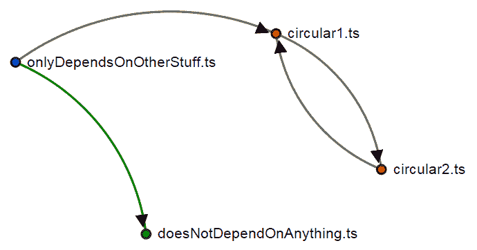

# 处理依赖

在上一章中，我们学习了如何使用类和接口，还了解了 SOLID 原则和其他面向对象编程的最佳实践。在本章中，我们将学习如何处理依赖关系。本章的第一部分将专注于模块的使用。第二部分将专注于面向对象编程中依赖关系的管理。

我们将涵盖以下主题：

+   第三方依赖

+   内部模块

+   外部模块

+   异步模块定义 (AMD)

+   CommonJS 模块

+   ES6 模块

+   Browserify 和通用模块定义 (UMD)

+   循环依赖

+   依赖注入

# 第三方依赖

第三方依赖通常是第三方组织或独立软件工程师创建的开源库。第三方依赖是外部模块，可以使用其名称而不是相对或绝对路径来导入。

# 包管理工具

包管理工具用于依赖管理，这样我们就不必手动下载和管理我们的应用程序依赖项。

# 包管理工具的兴衰

在过去几年中，TypeScript 生态系统经历了许多包管理器的兴衰。这在 TypeScript 的早期阶段造成了一些混乱，但幸运的是，今天我们有一个更加稳定的生态系统。

在 TypeScript 历史中一些值得注意的包管理器包括 tsd、typings、npm、bower、yarn 和 turbo。一些包管理器，如 tsd、typings 和 bower，现在不再推荐使用，而其他如 yarn 或 turbo 则相对较新，并且不如 npm 广泛采用。撰写本文时推荐的包管理器是 npm。

# npm

**Node 包管理器**（**npm**）最初是作为 Node.js 的默认包管理工具开发的，但如今它被许多其他工具使用。

npm 使用一个名为 `package.json` 的配置文件来存储我们项目中安装的所有依赖项的引用。最初，npm 通常仅用于安装后端依赖项，但如今它用于安装任何依赖项。这包括以下内容：

+   后端依赖

+   前端依赖

+   开发工具

+   TypeScript 类型定义

在安装任何包之前，我们应该在我们的项目中添加一个 `package.json` 文件。我们可以通过执行以下命令来完成此操作：

```js
npm init
```

请注意，我们必须安装 Node.js 才能使用 `npm` 命令。

`npm init` 命令将要求我们提供有关项目的一些基本信息，包括其名称、版本、描述、入口点、测试命令、Git 仓库、关键词、作者和许可证。

如果您对之前提到的某些 `package.json` 字段的目的不确定，请参阅官方 npm 文档：[`docs.npmjs.com/files/package.json`](https://docs.npmjs.com/files/package.json)。

`npm`命令将显示即将生成的`package.json`文件的预览，并要求我们进行最终确认。

如果你希望跳过问题并使用默认设置生成文件，你可以使用带有`--yes`标志的`npm init`命令：

```js
npm init --yes  
```

在创建项目的`package.json`文件后，我们将使用`npm install`命令安装我们的第一个依赖项。

`npm install`命令将一个或多个依赖项的名称作为参数，这些依赖项由单个空格分隔，并指定安装范围。

范围可以是以下几种：

+   全局依赖项

+   开发时依赖项（例如，测试框架、编译器等）

+   运行时依赖项（例如，Web 框架、数据库 ORM 等）

我们将使用`tslint` npm 包来检查我们的 TypeScript 代码的风格，所以让我们将其作为开发依赖项安装（使用`--save-dev`参数）：

```js
npm install tslint --save-dev 
```

要安装全局依赖项，我们将使用`-g`参数：

```js
npm install webpack-dev-server -g   
```

我们可能需要在我们的开发环境中具有管理员权限来安装全局范围的包。

还要注意，当使用全局范围的包安装包时，npm 不会向我们的`package.json`添加任何条目，但手动将正确的依赖项添加到`package.json`中的`devDependencies`部分是很重要的，以确保持续集成构建服务器能够正确解析我们项目的所有依赖项。

要安装运行时依赖项，请使用`--save`参数：

```js
npm install react --save  
```

请注意，`react`是一个可以用来创建用户界面的模块。

一旦我们在`package.json`文件中安装了一些依赖项，内容应该看起来像以下这样：

```js
{ 
  "name": "repository-name", 
  "version": "1.0.0", 
  "description": "example", 
  "main": "index.html", 
  "scripts": { 
    "test": "echo "Error: no test specified" && exit 1" 
  }, 
  "repository": { 
    "type": "git", 
    "url": "https://github.com/username/repository-name.git" 
  }, 
  "keywords": [ 
    "typescript", 
    "demo", 
    "example" 
  ], 
  "author": "Name Surname", 
  "contributors": [], 
  "license": "MIT", 
  "bugs": { 
    "url": "https://github.com/username/repository-name/issues" 
  }, 
  "homepage": "https://github.com/username/repository-name", 
  "engines": {}, 
  "dependencies": { 
    "react": "16.2.0" 
  }, 
  "devDependencies": { 
    "tslint": "5.9.1" 
  } 
} 
```

`package.json`文件中的一些字段必须手动配置。要了解更多关于可用的`package.json`配置字段的信息，请访问[`docs.npmjs.com/files/package.json`](https://docs.npmjs.com/files/package.json)。

本书所使用的 npm 包版本可能自出版以来已经更新。请参阅[`npmjs.com`](https://npmjs.com)上的包文档，以了解潜在的不兼容性和了解新功能。

如果你正在使用 npm 的现代版本之一，安装模块还会生成一个名为`package-lock.json`的文件。此文件描述了生成的确切依赖项树，以便后续安装可以生成相同的树，无论中间的依赖项更新如何。

所有的 npm 包都将保存在`node_modules`目录中。建议不要将`node_modules`目录放入源代码控制（例如，Git 仓库）中。

下次我们设置开发环境时，我们需要再次下载所有依赖项，但要做到这一点，我们只需要执行`npm install`命令，无需任何附加参数：

```js
npm install  
```

包管理器（npm）将随后搜索 `package.json` 文件并安装其中列出的所有依赖项。

我们可以使用 [`www.npmjs.com`](https://www.npmjs.com) 上的 npm 搜索引擎来查找可能对我们应用程序有用的潜在模块。

我们可以使用 `npm outdated` 命令检查我们项目的依赖项是否过时。

我们已经学习了如何使用 npm 来管理项目的依赖项。然而，npm 不仅仅是一个包管理器，因为它还允许我们创建命令来执行一些自定义自动化任务，例如发布我们应用程序的版本或运行一些自动化测试。我们将在第九章 自动化您的开发工作流程中了解更多关于此功能的内容。

# 类型定义

TypeScript 对现有 JavaScript 库的支持是通过声明库的公共接口或 API 来实现的。第三方模块公共接口的声明被称为 **类型定义**。

当我们安装一个 npm 模块时，我们可能会遇到几种不同的场景。

# 具有对 TypeScript 本地支持的模块

一些第三方依赖项具有内置对 TypeScript 的支持。例如，具有 TypeScript 本地支持的模块示例是 InversifyJS 模块。在这种情况下，仅安装 npm 模块就足够了，因为该模块包括所需的类型定义：

```js
npm install inversify --save 
```

# 具有对 TypeScript 外部支持的模块

一些第三方依赖项没有内置对 TypeScript 的支持，但类型定义可以在单独的 npm 模块中找到。一个具有对 TypeScript 外部支持的模块示例是 `react` 模块。在这种情况下，仅安装 npm 模块是不够的，因为它不包括所需的类型定义。我们可以通过安装包含缺失类型定义的 npm 模块来解决这个问题：

```js
npm install react --save 
npm install @types/react --save-dev 
```

TypeScript 团队开发了一个自动化流程，该流程在 npm 公共注册表下以一个独特的组织名称发布所有可用的开源类型定义。该组织名为 `@types`，类型定义使用它们所定义的模块名称。

# 没有对 TypeScript 提供支持的模块

一些第三方依赖项没有内置对 TypeScript 的支持，并且类型定义不在单独的 npm 中提供。在这种情况下，仅安装 npm 模块是不够的，因为它不包括所需的类型定义。我们可以通过创建我们的类型定义来解决这个问题。

不幸的是，创建我们的类型定义的过程不是可以系统描述的，需要一些经验，但我们将尝试解释围绕它的主要复杂性。

让我们假设我们需要为 `react-side-effect` npm 模块编写自定义类型定义，尽管实际上并不需要，因为类型定义已经可用，但我们将用它作为示例。

我们需要做的第一件事是安装缺少类型定义的包：

```js
npm install react-side-effect --save 
```

然后，我们需要打开 `react-side-effect` 模块内部的 `package.json` 文件。每个 npm 模块都包含一个 `package.json` 文件，因此它应该位于以下路径：

```js
/node_modules/react-side-effect/package.json 
```

如果我们检查 `package.json` 文件，我们应该能够找到 `main` 字段。`main` 字段描述了 npm 模块的入口点。`react-side-effect` npm 模块的 `package.json` 中的 `main` 字段如下所示：

```js
"main": "lib/index.js" 
```

我们需要打开那个文件，找出模块导出了哪些元素以及它们是如何导出的。这是复杂的一部分：我们需要在源代码中导航并识别导出的元素和导出类型。`lib/index.js` 文件只导出了一个名为 `withSideEffect` 的函数：

```js
module.exports = function withSideEffect // ... 
```

在这一点上，我们可以创建一个名为 `external.d.ts` 的文件，并添加以下类型定义：

```js
declare module "react-side-effect" { 
    declare const withSideEffect: any; 
    export = withSideEffect; 
} 
```

请注意，我们使用了以下方式：

`export = withSideEffect;`

我们使用这种类型的模块导出，因为这是我们可以在库的源代码中看到的导出类型。[查看详情](https://github.com/gaearon/react-side-effect/blob/eb25efece753108b083f9c2c1be8e650712810d0/src/index.js#L5)

有时我们会看到类似以下的模块导出：

`export default withSideEffect;`

或者像以下这样的：

`export { withSideEffect };`

我们需要确保我们的类型定义文件使用与库中相同的导出类型。我们将在本章的后面部分了解更多关于不同类型导出的内容。

前面的代码片段声明了一个名为 react-side-effect 的模块。该模块导出一个名为 `withSideEffect` 的实体，其类型为 `any`。前面的类型定义应该足够让我们能够导入该模块：

```js
import * as withSideEffect from "react-side-effect"; 
```

但如果我们这样做，我们会得到一个错误：

```js
Module '"react-side-effect"' resolves to a non-module entity and cannot be imported using this construct. 
```

不幸的是，修复这个问题的唯一方法是通过添加一个额外的命名空间，正如在[`github.com/Microsoft/TypeScript/issues/5073`](https://github.com/Microsoft/TypeScript/issues/5073)中描述的那样：

```js
declare module "react-side-effect" { 
    declare const withSideEffect: any; 
    namespace withSideEffect {}; 
    export = withSideEffect; 
} 
```

在这一点上，我们可以导入模块而不会出错，但 `withSideEffect` 的类型是 `any`。我们可以通过检查源代码并花一些时间来尝试确定函数的签名来解决此问题。如果我们这样做，我们最终会得到以下类似的内容：

```js
declare module "react-side-effect" { 

    import React = __React; 

    function withSideEffect( 
        reducePropsToState: (propsList: any[]) => any, 
        handleStateChangeOnClient: (state: any) => any, 
        mapStateOnServer?: (state: any) => any 
    ): ClassDecorator; 

    class ElementClass extends React.Component<any, any> {} 

    interface ClassDecorator { 
        <T extends (typeof ElementClass)>(component:T): T; 
    } 

    namespace withSideEffect {}; 

    export = withSideEffect; 
} 
```

请注意，强烈建议您在[`github.com/DefinitelyTyped/DefinitelyTyped`](https://github.com/DefinitelyTyped/DefinitelyTyped)上与 TypeScript 社区分享您的类型定义。

# ECMAScript 规范类型定义（lib.d.ts）

TypeScript 编译器会自动包含我们针对的 ECMAScript 版本的类型定义。例如，如果我们针对 ES5，我们将无法访问 Promise API，因为它属于 ES6 规范的一部分：

```js
const p = Promise.resolve(1); // Error 
```

然而，TypeScript 允许我们导入一个提案的类型定义，而不是整个 ECMAScript 规范。例如，我们可以针对 ES5 并通过向我们的 `tsconfig.json` 文件中添加以下内容来使用 Promise API：

```js
"lib": ["es5", "dom", "es2015.promise"] 
```

前面的设置是在指示 TypeScript 编译器，我们希望它导入整个 ECMAScript 5 规范、**文档对象模型**（**DOM**）和 Promise API 的类型定义。

# 外部 TypeScript 辅助函数（tslib）

如我们所知，TypeScript 允许我们使用即将到来的 ECMAScript 规范的一些特性。TypeScript 使用一系列辅助函数在运行时实现这些特性中的某些功能。以下是由 TypeScript 生成的某些辅助函数：

+   `__extends` 用于继承

+   `__assign` 用于对象展开属性

+   `__rest` 用于对象剩余属性

+   `__decorate`、`__param` 和 `__metadata` 用于装饰器

+   `__awaiter` 和 `__generator` 用于 `async`/`await`

如果需要这些辅助函数之一，TypeScript 将在编译时生成它。然而，这可能会成为一个问题，因为辅助函数会在所有需要它的文件中生成，这可能导致大量代码重复。

我们可以使用以下编译设置来解决这个问题：

+   使用 `noEmitHelpers` 标志可以防止 TypeScript 生成辅助函数

+   使用 `importHelpers` 标志将生成从 `tslib` npm 模块导入辅助函数所需的代码，而不是生成辅助函数。

`tslib` 模块包含了所有必需的 TypeScript 辅助函数的声明。我们可以使用 npm 安装 `tslib` 模块，如下所示：

```js
npm install tslib --save 
```

这样，辅助函数只声明一次（由 `tslib` 模块声明）。

# 内部模块（模块和命名空间）

我们可以使用 `module` 和 `namespace` 关键字来定义内部模块。TypeScript 最初允许我们使用 `module` 关键字来声明内部模块，但后来为了 `namespace` 关键字而弃用了它。

内部模块（`namespaces`）可以用来封装应用程序的某些元素，并为我们的代码提供更好的组织。然而，**我们应该尽量避免使用它们，并优先考虑外部模块而不是命名空间**。外部模块应该是我们的首选选项，因为某些工具需要它们来优化我们应用程序的某些方面。外部模块将在本章的后面部分详细讨论。

我们可以使用命名空间来分组接口、类和对象，它们在某种程度上是相关的。例如，我们可以在名为 `Models` 的内部模块中包装我们所有的应用程序模型：

```js
namespace Models { 
  export class UserModel { 
    // ... 
  } 
} 
```

默认情况下，`namespace` 包含的所有实体都是私有的。我们可以使用 `export` 关键字来声明我们希望公开的 `namespace` 的哪些部分。

# 嵌套内部模块

我们可以这样嵌套一个 `namespace`：

```js
namespace App { 
    export namespace Models { 
        export class UserModel { 
            // ... 
        } 
        export class TalkModel { 
            // ... 
        } 
    } 
} 
```

在前面的例子中，我们声明了一个名为`App`的命名空间，并在其中声明了一个名为`Models`的公共命名空间，它包含两个公共类：`UserModel`和`TalkModel`。

然后，我们可以通过指定完整的命名空间名称来访问命名空间实体：

```js
const user = new App.Models.UserModel(); 
const talk = new App.Models.TalkModel(); 
```

# 跨文件内部模块

TypeScript 允许我们在多个文件中声明内部模块。如果一个内部模块变得太大，它可以被分成多个文件以提高其可维护性。如果我们以先前的例子为例，我们可以在一个新文件中通过引用它来向名为`App`的内部模块添加更多内容。

让我们创建一个新的文件，命名为`validation.ts`，并将以下代码添加到其中：

```js
namespace App { 
    export namespace Validation { 
        export class UserValidator { 
            // ... 
        } 

        export class TalkValidator { 
            // ... 
        } 
    } 
} 
```

然后，我们可以通过指定完整的命名空间名称来访问两个文件中声明的命名空间实体：

```js
const userModel = new App.Models.UserModel(); 
const talkModel = new App.Models.TalkModel(); 
const userValidator = new App.Validation.UserValidator(); 
const talkValidator = new App.Validation.TalkValidator(); 
```

尽管命名空间`Models`和`Validation`在不同的文件中声明，我们仍然可以通过`App`命名空间来访问它们。

命名空间名称可以包含点号。例如，我们可以在`validation`和`models`内部模块名称中使用点号，而不是在`app`模块内部嵌套内部模块（验证和模型）：

```js
namespace App.Validation { 
  // ... 
} 
namespace App.Models { 
  // ... 
} 
```

# 内部模块别名

在内部模块中可以使用`import`关键字为另一个模块提供一个别名，如下所示：

```js
import TalkValidator = app.validation.TalkValidator; 
const talkValidator2 = new TalkValidator(); 
```

# 编译内部模块

一旦我们完成了内部模块的声明，我们就可以决定是否要将每个模块编译成 JavaScript，或者我们是否更倾向于将所有文件连接成一个单一的文件。

我们可以使用`--out`标志将所有输入文件编译成一个单一的 JavaScript 输出文件：

```js
tsc --out output.js input.ts 
```

编译器将自动根据文件中存在的引用标签对输出文件进行排序。然后，我们可以使用 HTML `<script>`标签导入我们的文件或文件。

# 外部模块

TypeScript 也有外部模块的概念。在 ECMAScript 6（ES6）之前的 JavaScript 版本中，没有对外部模块的原生支持。开发者被迫开发自定义模块加载器，开源社区在多年中尝试提出改进的解决方案。因此，今天有几种类型的模块加载器，每种至少支持一种模块定义语法。

通常，当我们提到一个模块时，如果没有明确指出是内部模块还是外部模块，我们可以假设他们指的是外部模块。

# 模块加载器和模块定义语法

使用模块（而不是命名空间或内部模块）与使用命名空间或内部模块的主要区别是，在声明了所有模块之后，我们不会使用 HTML `<script>`标签来导入它们。使用`<script>`标签是不推荐的，因为当网络浏览器遇到并加载`<script>`标签的内容时，它们会“暂停”（或“冻结”）页面的同时下载和渲染。

我们将在第十三章应用性能中了解更多关于网络性能的内容。

外部模块避免使用 `<script>` 加载我们的应用程序模块，而是使用模块加载器。**模块加载器**是一种工具，它允许我们更好地控制模块加载过程。这使我们能够执行异步加载文件或合并多个模块到一个高度优化的单个文件等任务。

由于 JavaScript 中外部模块缺乏原生支持，多年来不同的开源项目提出了多种模块定义语法：

| **模块定义语法** | **注意事项** |
| --- | --- |
| AMD | 由 RequireJS 模块加载器引入 |
| CommonJS | 由 Node.js 引入 |
| UMD | 支持 AMD 和 UMD |
| SystemJS | 由 Angular 2 引入，支持多种语法 |
| ES6 模块 | 由 ECMAScript 6 规范引入 |

我们还可能遇到各种各样的模块加载器：

| **模块加载器** | **模块定义语法** | **注意事项** |
| --- | --- | --- |
| RequireJS | AMD | RequireJS 是 JavaScript 应用程序的第一个主流模块加载器 |
| Browserify | CommonJS | CommonJS 模块最初由 Node.js 的原始模块系统引入，但如今 Node.js 原生支持 ES6 模块 |
| SystemJS | 支持多种模块定义语法 | 支持多种模块定义语法 |
| 本地 | ES6 | 现代 JavaScript 引擎可以原生支持 ES6 模块 |

# 设计时和运行时的外部模块

TypeScript 增加了一层选择，因为它允许我们在设计时选择我们想要使用的模块定义语法，以及我们想要在运行时使用的语法。在如此多的选项中，很容易感到不知所措和困惑。

幸运的是，在 TypeScript 中，设计时只有两种模块定义语法可用，其中一种被认为是过时的：

+   传统的外部模块语法（已过时）

+   ES6 模块语法（推荐）

在运行时，也可以使用其他模块定义语法，例如 AMD 或 UMD 语法，但 TypeScript 编译器不会尝试将它们编译成选定的模块定义输出。

TypeScript 允许我们选择在运行时使用哪种类型的模块定义语法：

+   ES6

+   CommonJS

+   AMD

+   SystemJS

+   UMD

我们可以通过在编译时使用 `--module` 标志来表示我们的偏好，如下所示：

```js
    tsc --module commonjs main.ts // use CommonJS 
    tsc --module amd main.ts      // use AMD 
    tsc --module umd main.ts      // use UMD
    tsc --module system main.ts   // use SytemJS

```

重要的是要理解，设计时和运行时使用的模块定义语法可能不同。

自 TypeScript 1.5 版本发布以来，建议使用 ECMAScript 6 模块定义语法，因为它基于 ECMAScript 规范，这被认为是一个标准。此外，如果我们计划在现代 JavaScript 引擎中运行我们的 TypeScript 应用程序，我们将在设计时和运行时都能使用 ECMAScript 6 模块定义语法。

我们现在将查看每种可用的模块定义语法。

# ES6 模块（运行时和设计时）

TypeScript 1.5 引入了对 ES6 模块语法的支持。以下代码片段使用 ES6 模块语法定义了一个外部模块：

```js
class UserModel { 
  // ... 
} 
export { UserModel }; 
```

我们不需要使用 `namespace` 关键字来声明 ES6 模块，但我们必须使用 `export` 关键字。我们可以在模块底部或实体声明时使用 `export` 关键字：

```js
export class TalkModel { 
  // ... 
} 
```

我们还可以使用别名导出实体：

```js
class UserModel { 
  // ... 
} 
export { UserModel as User }; // UserModel exported as User 
```

导出声明导出名称的所有含义：

```js
interface UserModel { 
  // ... 
} 

class UserModel { 
  // ... 
} 
export { UserModel }; // Exports both interface and function 
```

要从另一个模块导入模块，我们必须使用 `import` 关键字，如下所示：

```js
import { UserModel } from "./models"; 
```

`import` 关键字为每个导入的组件创建一个变量。在前面的代码片段中，声明了一个名为 `UserModel` 的新变量，其值包含对导入模块（`model.ts` 文件）中声明的 `UserModel` 类的引用。

我们可以使用 `export` 关键字导出多个实体，如下所示：

```js
class UserValidator { 
  // ... 
} 

class TalkValidator { 
  // ... 
} 

export { UserValidator, TalkValidator }; 
```

此外，我们还可以使用 `import` 关键字从单个模块导入多个实体，如下所示：

```js
import { UserValidator, TalkValidator } from "./validation.ts" 
```

最后，我们还可以使用 `default` 关键字来声明在没有明确导入实体时将被导入的默认实体：

```js
export default UserValidator; 
```

然后，我们可以如下导入默认导出：

```js
import UserValidator from "./validation.ts" 
```

ES6 模块在现代 JavaScript 引擎上原生支持，但如果你的目标是那些不支持 ES6 模块的 JavaScript 引擎，你需要使用像 webpack 这样的工具来启用与先前 JavaScript 引擎的向后兼容性。

# 旧版外部模块（仅设计时使用）

在 TypeScript 1.5 之前，外部模块使用特定的设计时语法声明。然而，一旦编译成 JavaScript，模块会被转换成 AMD、CommonJS、UMD 或 SystemJS 模块。

我们应该**尽量避免使用旧版外部模块语法，而使用新的 ES6 语法**。然而，我们将快速浏览外部模块语法，因为有时在旧应用程序和文档中仍然可能会遇到它。

要使用旧版外部模块语法导出模块，我们需要使用 `export` 关键字。我们可以直接将 `export` 关键字应用于类或接口，如下所示：

```js
export class User { 
 // ... 
} 
```

我们还可以通过将其值赋给 `export` 来单独使用 `export` 关键字，我们希望导出该值：

```js
class User { 
 // ... 
} 
export = User;  
```

外部模块可以被编译成任何可用的模块定义语法（AMD、CommonJS、SystemJS 或 UMD）。

旧版外部模块的 `import` 语句如下所示：

```js
import User = require("./user_class"); 
```

# AMD 模块（仅运行时使用）

如果我们将 ES6 模块部分中定义的外部模块编译成 AMD 模块（使用标志 `--compile amd`），我们将生成以下 AMD 模块：

```js
define(["require", "exports"], function (require, exports) { 
    var UserModel = (function () { 
        function UserModel() { 
        } 
        return UserModel; 
    })(); 
    return UserModel; 
}); 
```

`define`函数将其第一个参数作为一个数组。这个数组包含模块依赖项的名称列表。第二个参数是一个回调函数，一旦所有模块依赖项都已加载，它就会被调用。回调函数将每个模块依赖项作为其参数，并包含我们 TypeScript 组件的所有逻辑。注意回调函数的返回类型与使用`export`关键字声明的公共组件相匹配。

TypeScript 会因为`define`函数未声明而抛出编译错误。我们可以通过安装 RequireJS 类型定义来解决此问题：

```js
npm install --save @types/requirejs 
```

然后，可以使用 RequireJS 模块加载器按如下方式加载 AMD 模块：

```js
require(["./models"], function(models) { 
    const user = new models.UserModel(); 
});
```

如我们所观察到的，AMD 模块使用两个不同的函数来定义模块（`define`）和消费模块（`require`）。通常，应用程序的入口点使用`require`函数来加载所有必需的依赖项。

在本书中，我们将不会进一步讨论 AMD 和 RequireJS，但如果你想要了解更多，你可以通过访问[`requirejs.org/docs/start.html`](http://requirejs.org/docs/start.html)来学习。

# CommonJS 模块（仅运行时）

如果我们将 ES6 模块部分中定义的外部模块编译成 CommonJS 模块（使用标志`--compile commonjs`），我们将获得以下 CommonJS 模块：

```js
var UserModel = (function () { 
    function UserModel() { 
      //... 
    } 
    return UserModel; 
})(); 
module.exports = UserModel; 
```

正如我们可以在前面的代码片段中看到的那样，CommonJS 模块定义语法几乎与遗留的外部模块语法相同。主要区别在于使用`module`对象及其`exports`属性而不是`exports`关键字。

前面的 CommonJS 模块可以通过 Node.js 应用程序使用`import`关键字和`require`函数原生加载：

```js
import UserModel = require('./UserModel'); 
const user = new UserModel(); 
```

然而，如果我们尝试在浏览器中使用`require`函数，将会抛出异常，因为`require`函数未定义。我们可以通过使用 Browserify 轻松解决这个问题。Browserify 是一个模块加载器，它允许我们在浏览器中使用 CommonJS 模块。

如果你需要更多关于 Browserify 的信息，请访问官方文档[`github.com/substack/node-browserify#usage`](https://github.com/substack/node-browserify#usage)。

# UMD 模块（仅运行时）

如果我们想要发布一个 JavaScript 库或框架，我们需要将我们的 TypeScript 应用程序编译成 CommonJS 和 AMD 模块，并且以开发者不使用模块加载器也能使用的方式编译。

网络开发社区已经开发了一个代码片段来帮助我们实现 UMD 支持：

```js
(function (root, factory) { 
  if (typeof exports === 'object') { 
    // CommonJS 
    module.exports = factory(require('b')); 
  } else if (typeof define === 'function' && define.amd) { 
    // AMD 
    define(['b'], function (b) { 
      return (root.returnExportsGlobal = factory(b)); 
    }); 
  } else { 
    // Global Variables 
    root.returnExportsGlobal = factory(root.b); 
  } 
}(this, function (b) { 
  // Your actual module 
  return {}; 
})); 
```

前面的代码片段很棒，但我们希望避免手动将其添加到应用程序的每个模块中。幸运的是，有一些选项可以轻松实现 UMD 支持。

第一种选择是使用标志 `--compile umd` 为我们应用程序中的每个模块生成一个 UMD 模块。第二种选择是创建一个包含应用程序中所有模块的单个 UMD 模块，使用模块加载器（如 Browserify）。

有关 Browserify 的更多信息，请参阅官方项目网站 [`browserify.org/`](http://browserify.org/)。有关生成单个优化文件的 `Browserify-standalone` 选项的更多信息，请参阅。

# SystemJS 模块（仅运行时）

虽然 UMD 提供了一种在 AMD 和 CommonJS 中都工作的单个模块的输出方式，但 SystemJS 将允许你更接近其原生语义地使用 ES6 模块，而无需使用兼容 ES6 的浏览器引擎。

SystemJS 是由 Angular 2.0 引入的，它是一个流行的 Web 应用程序开发框架。

有关 SystemJS 的更多信息，请参阅官方项目网站 [`github.com/systemjs/systemjs`](https://github.com/systemjs/systemjs)。

在线有免费的常见模块错误列表，可在 [`www.typescriptlang.org/Handbook#modules-pitfalls-of-modules`](http://www.typescriptlang.org/Handbook#modules-pitfalls-of-modules) 查找。

# 模块总结

我们可以使用以下比较表总结所有前面的细节：

| **Module syntax** | **设计时支持** | **模块加载器运行时支持** | **原生运行时支持** | **优化工具支持** | **推荐** |
| --- | --- | --- | --- | --- | --- |
| **Legacy internal modules** | Yes | No | Yes (via closures) | No | No |
| **Namespaces** | Yes | No | Yes (via closures) | No | No |
| **ES6** | **Yes** | **Yes** | **Yes** | **Yes** | **Yes** |
| **Legacy external modules** | Yes | Yes | No | Yes | No |
| **AMD** | No | Yes | No | Yes | No |
| **CommonJS** | No | Yes | No | Yes | No |
| **UMD** | No | Yes | No | Yes | No |
| **SystemJS** | No | Yes | No | Yes | No |

正如我们所见，**未来推荐的做法是使用 ES6 模块**。如果你针对的是不支持 ES6 模块的 JavaScript 引擎，你需要使用像 webpack 这样的工具来实现与先前 JavaScript 引擎的向后兼容性。

我们将在第九章 *自动化您的开发工作流程* 中学习更多关于 Webpack 的知识。

# 在面向对象编程中管理依赖

我们已经学习了如何处理应用程序依赖和第三方依赖。现在，我们将学习依赖倒置，并扩展前一章中关于依赖倒置原则的知识。

# 依赖注入与依赖倒置

许多文章将 *依赖注入* 和 *依赖倒置* 两个术语混为一谈，好像它们的含义相同，但实际上它们是两个非常不同的概念。

以下示例声明了一个名为 `Ninja` 的类和一个名为 `Katana` 的类。`Ninja` 类依赖于 `Katana` 类：

```js
class Katana { 
    public tryHit(fromDistance: number) { 
        return fromDistance <= 2; 
    } 
} 

class Ninja { 
    public constructor( 
        private _katana: Katana 
    ) {} 
    public fight(fromDistance: number) { 
        return this._katana.tryHit(fromDistance); 
    } 
} 
```

在声明上述类之后，我们可以将`刀剑`类的实例注入到`忍者`类中：

```js
const ninja = new Ninja(new Katana()); 
ninja.fight(2); // true 
ninja.fight(5); // false 
```

上述代码片段实现了依赖注入设计模式，因为我们正在将依赖项（`刀剑`）注入到`忍者`类中。然而，我们没有实现依赖倒置原则，因为`忍者`类直接依赖于`刀剑`类。

`忍者`类和`刀剑`类之间的关系可以用以下图表表示：

***忍者 → 刀剑***

以下代码片段声明了一个名为 `Weapon` 的接口，然后由 `刀剑` 类实现。这次，`忍者` 类依赖于 `Weapon` 接口而不是 `刀剑` 类：

```js
interface Weapon { 
    try Hit(fromDistance: number): boolean; 
} 

class Katana implements Weapon { 
    public tryHit(fromDistance: number) { 
        return fromDistance <= 2; 
    } 
} 

class Ninja { 
    public constructor( 
        private _weapon: Weapon 
    ) {} 
    public fight(fromDistance: number) { 
        return this._weapon.tryHit(fromDistance); 
    } 
} 
```

在声明上述类之后，我们可以将`刀剑`类的实例注入到`忍者`类中：

```js
const ninja = new Ninja(new Katana()); 
ninja.fight(2); // true 
ninja.fight(5); // false 
```

上述代码片段实现了依赖注入设计模式，因为我们正在将依赖项（`刀剑`）注入到`忍者`类中。它还实现了依赖倒置原则，因为`忍者`类不直接依赖于`刀剑`类。

这次，类之间的关系可以用以下方式表示：

***忍者 → 武器 ← 刀剑***

如我们所见，表示`忍者`和`刀剑`类之间关系的箭头已经被反转。这解释了依赖倒置原则名称的由来。

依赖倒置原则很重要，因为它通过减少我们应用程序中实体之间的耦合程度，使我们的代码更容易维护。例如，如果我们重命名`刀剑`类，我们就不需要更改`忍者`类。这意味着`刀剑`和`忍者`类之间是完全独立的。

# 控制反转容器

控制反转（**inversion of control**，**IoC**）容器是一种充当**智能工厂**的工具。IoC 容器可以用来创建类的实例。如果类有一些依赖项，IoC 容器将能够使用依赖注入来满足这些需求。我们说工厂是**智能**的，因为它可以根据执行上下文中的匹配条件创建依赖项，并且还可以控制它所创建的实例的生命周期。

当我们使用 IoC 容器时，我们正在**失去**对类实例创建的控制，依赖注入和 IoC 容器将接管这些方面的应用控制。这一事实应该解释了术语**控制反转**的含义。

# InversifyJS 基础

InversifyJS 是一个用于 TypeScript 应用程序的 IoC 容器。InversifyJS 可以用来实现依赖倒置原则。

要使用 InversifyJS，我们需要使用 npm 安装它，如下所示：

```js
npm install inversify reflect-metadata --save 
```

然后，我们可以导入由 `inversify` 和 `reflect-metadata` 声明的一些实体，如下所示：

```js
import { Container, inject, injectable } from "inversify"; 
import "reflect-metadata"; 
```

以下代码片段使用 `inject` 装饰器在 `忍者` 类上添加了一个注解：

```js
interface Weapon { 
    tryHit(fromDistance: number): boolean; 
} 

@injectable() 
class Katana implements Weapon { 
    public tryHit(fromDistance: number) { 
        return fromDistance <= 2; 
    } 
} 

@injectable() 
class Ninja { 
    public constructor( 
        @inject("Weapon") private _weapon: Weapon 
    ) {} 
    public fight(fromDistance: number) { 
        return this._weapon.tryHit(fromDistance); 
    } 
} 
```

要使用 InversifyJS 创建`Ninja`类的实例，我们需要创建`Container`类的实例并声明所谓的**类型绑定**。类型绑定是类型与其实现之间的链接。以下代码片段声明了两个类型绑定。第一个类型绑定将类型`Weapon`与实现`Katana`关联起来。第二个类型绑定将类型`Ninja`与其自身关联：

```js
const container = new Container(); 
container.bind<Weapon>("Weapon").to(Katana); 
container.bind<Ninja>("Ninja").to(Ninja);
```

然后，我们可以使用容器创建`Ninja`类的实例。容器使用注解来识别`Ninja`类依赖于`Weapon`类型。然后容器创建`Katana`类的实例，并将其注入到`Ninja`类中，因为它知道`Katana`类是`Weapon`接口的有效实现：

```js
const ninja = container.get<Ninja>("Ninja"); 
ninja.fight(2); // true 
ninja.fight(5); // false 
```

InversifyJS 还允许我们控制依赖项的生命周期。例如，我们可以配置`Katana`类型绑定，使所有实例都成为单个共享实例（单例）：

```js
container.bind<Weapon>("Weapon").to(Katana).inSingletonScope(); 
```

我们还可以配置复杂的运行时约束，这将决定依赖项如何解析。例如，我们可能有两种不同的`Weapon`实现，它们在不同的环境下被注入：

```js
container.bind<Weapon>("Weapon").to(Katana) 
         .whenInjectedInto(Samurai); 

container.bind<Weapon>("Weapon").to(Shuriken) 
         .whenInjectedInto(Ninja); 
```

# 循环依赖

当我们与多个组件和依赖项一起工作时，可能会遇到循环依赖的问题。有时可能会达到一个点，其中一个组件（A）依赖于第二个组件（B），而这个第二个组件（B）又依赖于第一个组件（A）。在以下图中，每个节点是一个组件，我们可以观察到节点**circular1.ts**和**circular2.ts**（用红色表示）存在循环依赖。没有依赖的节点以绿色显示，有依赖但没有问题的节点以蓝色显示：



循环依赖不一定只涉及两个组件。我们可能会遇到这样的情况：一个组件依赖于另一个组件，而这个被依赖的组件又依赖于其他组件，依赖树中的一些组件最终会指向树中的某个父组件。如果 InversifyJS 检测到循环依赖，它将抛出一个运行时异常。

# 摘要

在本章中，我们学习了管理第三方依赖项的基础知识。我们还学习了内部模块和外部模块之间的区别，以及每个类别中的主要模块类型。

我们还学习了如何在面向对象编程中处理依赖项。最后，我们学习了如何实现依赖注入以及如何与 IoC 容器一起工作。

在下一章中，我们将学习 TypeScript/JavaScript 的运行时。
