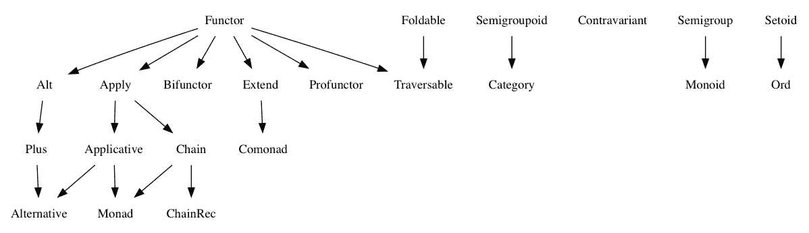

# 使用 TypeScript 进行函数式编程

自 1995 年问世以来，JavaScript 就是一种多范式编程语言。它允许我们利用面向对象编程风格的优势，同时也允许我们利用函数式编程（**FP**）风格的优势。同样，TypeScript 也是如此。然而，TypeScript 比 JavaScript 更适合 FP（函数式编程），因为，正如我们将在本章中学习的，静态类型系统和类型推断在 FP（函数式编程）语言（如 ML 编程语言家族）中非常重要。

在过去 3 或 4 年中，JavaScript 和 TypeScript 生态系统对 FP（函数式编程）的兴趣显著增加。我相信这种兴趣增加的原因是 React 的成功。React 是由 Facebook 开发的一个用于构建用户界面的库，它深受一些核心 FP（函数式编程）概念的影响。

我们将在本书的末尾更多地了解 React，但就目前而言，我们将专注于学习如何仅使用 TypeScript 以及一些小的 FP（函数式编程）库（如 `Immutable.js` 和 `Ramda`）来使用一些基本的 FP（函数式编程）技术。

在本章中，你将学习以下内容：

+   纯函数

+   副作用

+   不可变性

+   函数阶数

+   高阶函数

+   函数组合

+   函数部分应用

+   柯里化和无点风格

+   管道和序列

+   类别论

# FP 概念

当我们将函数式编程作为首选编程范式时，FP（函数式编程）的名字来源于我们构建应用程序的方式。

在面向对象编程等编程范式中，我们用来创建应用程序的主要构建块是对象（对象使用类声明）。然而，在 FP（函数式编程）中，我们使用函数作为应用程序中的主要构建块。

每种新的编程范式都会引入一系列与之相关的概念和思想。其中一些概念是通用的，在学习不同的编程范式时也很有兴趣。在面向对象编程中，我们有诸如继承、封装和多态等概念。在 FP（函数式编程）中，我们有高阶函数、函数部分应用、不可变性和引用透明性等概念。我们将尝试在本章中了解一些这些概念。

迈克尔·费思，SOLID 简称的作者以及许多其他著名的软件工程原则的作者，曾写道：

"面向对象编程通过封装移动部分使代码易于理解。函数式编程通过最小化移动部分使代码易于理解。"

前面的引用提到了<q>移动部件</q>；我们应该将这些移动部件理解为状态变化（也称为状态突变）。在面向对象编程中，我们使用封装来防止对象意识到其他对象的状态变化。在 FP 中，我们试图避免处理可变状态，而不是封装它。FP 减少了应用程序中状态变化发生的地方的数量，并试图将这些地方移动到应用程序的边界内，以尝试保持应用程序的核心无状态。

可变状态是坏的，因为它使我们的代码的行为更难以预测。以以下函数为例：

```js
function isIndexPage() { 
   return window.location.pathname === "/"; 
 }
```

前面的代码片段声明了一个名为`isIndexPage`的函数。这个函数可以用来检查当前页面是否是 Web 应用程序中的根页面，基于当前路径。

路径是不断变化的数据，因此我们可以将其视为状态的一部分。如果我们尝试预测调用`isIndexPage`的结果，我们需要知道当前状态。问题是，我们可能会错误地假设状态自上次已知状态以来没有改变。我们可以通过将函数转换为纯函数来解决这个问题，正如我们将在下一节中学习的那样。

# 纯函数

FP 引入了一些概念和原则，这将帮助我们提高代码的可预测性。让我们看看这些核心概念之一：**纯函数**。

当一个函数仅使用传递给它的参数计算返回值时，可以认为它是纯函数。此外，纯函数避免修改其参数或任何其他外部变量。因此，纯函数在给定相同的参数时，无论何时调用，总是返回相同的值。

在上一节中声明的`isIndexPage`函数不是一个纯函数，因为它访问了`pathname`变量，并且它没有被作为参数传递给函数。我们可以通过以下方式重写前面的函数，将其转换为纯函数：

```js
function isIndexPage(pathname: string) { 
   return pathname === "/"; 
 }
```

尽管这是一个基本的例子，我们很容易就能感知到新版本要容易预测得多。纯函数帮助我们使代码更容易理解、维护和测试。

假设我们想要为`isIndexPage`函数的不纯版本编写单元测试。在尝试测试时，我们会遇到一些问题，因为该函数使用了`window.location`对象。我们可以使用模拟框架来克服这个问题，但这会为我们的单元测试增加很多复杂性，仅仅因为我们没有使用纯函数。

另一方面，测试`isIndexPage`函数的纯版本将会简单直接：

```js
function shouldReturnTrueWhenPathIsIndex(){ 
    let expected = true; 
    let result = isIndexPage("/"); 
    if (expected !== result) { 
        throw new Error(`Expected ${expected} to equals ${result}`); 
    } 
} 

function shouldReturnFalseWhenPathIsNotIndex() { 
    let expected = false; 
    let result = isIndexPage("/someotherpage"); 
    if (expected !== result) { 
        throw new Error(`Expected ${expected} to equals ${result}`); 
    } 
} 
```

现在我们已经了解了 FP 如何通过避免状态突变来帮助我们编写更好的代码，我们可以学习关于副作用和引用透明度。

# 副作用

在上一节中，我们了解到一个纯函数只返回一个值，这个值可以通过传递给它的参数来计算得出。纯函数还避免了修改其参数或任何未作为参数传递给函数的外部变量。在函数式编程（FP）术语中，通常说一个纯函数是一个没有副作用（side effects）的函数。这意味着当我们调用一个纯函数时，我们可以预期该函数不会通过状态修改来干扰我们应用程序中的任何其他组件。

一些编程语言，如 Haskell，可以通过其类型系统确保应用程序没有副作用。TypeScript 与 JavaScript 的互操作性非常好，但与像 Haskell 这样更隔离的语言相比，其缺点是类型系统无法保证我们的应用程序没有副作用。

如果你喜欢你的 JavaScript 应用程序没有副作用的想法，你可以尝试开源项目，如 [`github.com/bodil/eslint-config-cleanjs`](https://github.com/bodil/eslint-config-cleanjs)。该项目是一个 ESLint 配置，旨在限制你使用尽可能接近理想化纯函数式语言的 JavaScript 子集。不幸的是，在撰写本文时，没有可用的类似工具专门为 TypeScript 设计。

# 引用透明性

引用透明性是另一个与纯函数和副作用密切相关的概念。一个函数在无副作用时是纯的。当一个表达式可以被其对应值替换而不改变应用程序的行为时，我们说它是引用透明的。

纯函数是一个引用透明（referentially transparent）的表达式。一个非引用透明的表达式被称为引用不透明（referentially opaque）。

# 不可变性

不可变性指的是在给变量赋值后无法更改其值的能力。纯函数式语言包括常见数据结构的不可变实现。例如，当我们向数组添加一个元素时，我们正在修改原始数组。然而，如果我们使用不可变数组，并尝试向其中添加新元素，原始数组将不会被修改，我们将新项目添加到其副本中。

在 JavaScript 和 TypeScript 中，我们可以使用 `Immutable.js` 库来享受不可变的数据结构。

# 函数作为一等公民

在函数式编程（FP）文献中，经常提到函数作为 <q>一等公民</q> 的概念。当我们说一个函数是 <q>"一等公民"</q> 时，意味着它可以做任何变量能做的事情。这意味着函数可以作为参数传递给其他函数，或者由其他函数返回。函数也可以被分配给变量。JavaScript 和 TypeScript 都将函数视为 <q>"一等公民"</q>。

# Lambda 表达式

Lambda 表达式只是可以用来声明匿名函数（无名称的函数）的表达式。在 ES6 规范之前，将函数作为值赋给变量的唯一方法是使用函数表达式：

```js
const log = function(arg: any) { console.log(arg); }; 
```

ES6 规范引入了箭头函数语法：

```js
const log = (arg: any) => console.log(arg); 
```

请参阅第三章，*与函数一起工作*，和第六章，*理解运行时*，以了解更多关于箭头函数和函数表达式的信息。

# 函数的元数

函数的元数是指函数接受的参数数量。单一函数是只接受一个参数的函数：

```js
function isNull<T>(a: T|null) { 
    return (a === null); 
} 
```

单一函数在函数式编程（FP）中非常重要，因为它们促进了函数组合模式的运用。

我们将在本章后面更深入地了解函数组合模式。

**二元函数**是接受两个参数的函数：

```js
function add(a: number, b: number) { 
    return a + b; 
} 
```

接受两个或更多参数的函数也很重要，因为一些最常用的函数式编程模式和技巧（例如，部分应用和柯里化）被设计成将接受多个参数的函数转换为单一参数函数。

我们将在本章后面更深入地了解部分应用和柯里化。

同样也存在接受三个（**三元函数**）或更多参数的函数。然而，在函数式编程中，接受可变数量参数的函数（称为**可变参数函数**）尤其有趣：

```js
function addMany(...numbers: number[]) { 
    numbers.reduce((p, c) => p + c, 0); 
} 
```

# 高阶函数

高阶函数至少执行以下操作之一：

+   接受一个或多个函数作为参数

+   返回一个函数作为其结果

高阶函数是我们可以使用来以函数式编程风格编写 JavaScript 的最强大的工具之一。让我们看看一些例子。

以下代码片段声明了一个名为 `addDelay` 的函数。该函数创建了一个新的函数，该函数在控制台打印消息之前等待给定数量的微秒。该函数被认为是一个高阶函数，因为它将其参数之一作为一个函数：

```js
function addDelay(msg: string, ms: number) { 
    return () => { 
        setTimeout(() => { 
            console.log(msg); 
        }, ms); 
    }; 
} 

const delayedSayHello = addDelay("Hello world!", 500); 
delayedSayHello(); // Prints "Hello world!" (after 500 ms) 
```

以下代码片段声明了一个名为 `addDelay` 的函数。该函数将延迟微秒数添加到作为参数传递的另一个函数的执行中。该函数被认为是一个高阶函数，因为它返回一个函数：

```js
function addDelay(func: () => void, ms: number) {
    setTimeout(() => { 
        func(); 
    }, ms); 
} 

function sayHello() { 
    console.log("Hello world!"); 
} 

addDelay(sayHello, 500); // Prints "Hello world!" (after 500 ms) 
```

以下代码片段声明了一个名为 `addDelay` 的函数。该函数创建了一个新的函数，该函数将延迟微秒数添加到作为参数传递的另一个函数的执行中。该函数被认为是一个高阶函数，因为它接受一个函数作为参数并返回一个函数：

```js
function addDelay(func: () => void, ms: number) {
    return () => { 
        setTimeout(() => { 
            func(); 
        }, ms); 
    }; 
} 

function sayHello() { 
    console.log("Hello world!"); 
} 

const delayedSayHello = addDelay(sayHello, 500); 
delayedSayHello(); // Prints "Hello world!" (after 500 ms) 
```

高阶函数是抽象常见问题解决方案的有效技术。前面的例子演示了我们可以如何使用高阶函数（`addDelay`）向另一个函数（`sayHello`）添加延迟。这允许我们抽象延迟功能，并保持`sayHello`函数或其他函数对延迟功能的实现细节无感知。

# 函数式编程（FP）的好处

使用 FP 风格编写 TypeScript 代码有许多好处，其中我们可以强调以下几点：

+   **可测试的代码**：如果我们尝试编写纯函数，我们将能够非常容易地编写单元测试。

+   **代码易于推理**：对于缺乏 FP 经验的开发者来说，FP 可能很难理解。然而，当应用程序正确地使用 FP 范式实现时，结果是非常小的函数（通常是单行函数）和非常声明性的 API，这些 API 可以轻松地进行推理。

+   **并发**：我们的大多数函数都是无状态的，我们的实体也大多是状态无关的。我们将状态推离应用程序的核心，这使得我们的应用程序更有可能支持许多并发操作，并且更具可扩展性。

+   **缓存**：当我们可以预测给定函数的输出时，缓存结果的策略会变得简单得多。

# TypeScript 是一种 FP 语言吗？

这个问题的答案是肯定的，但只是部分如此。TypeScript 是一种多范式编程语言，因此它包括了来自面向对象编程语言和 FP 语言的许多影响。

然而，如果我们将 TypeScript 视为一种 FP 语言，我们可以观察到它并不是一种纯粹的 FP 语言，因为例如，TypeScript 编译器并不强制我们的代码无副作用。

不是一个纯粹的 FP 语言不应被解读为负面的事情。TypeScript 为我们提供了一套广泛的功能，并允许我们利用面向对象编程语言和 FP 语言世界中的最佳功能。

# FP 技术

现在我们已经了解了最常见的 FP 概念，是时候学习最常见的 FP 技术和模式了。

# 组合

**功能组合**是一种技术或模式，它允许我们将多个函数组合起来创建一个更复杂的函数。

以下代码片段声明了一个用于修剪字符串的函数和一个用于将文本转换为上档文本的函数：

```js
const trim = (s: string) => s.trim();
const capitalize = (s: string) => s.toUpperCase(); 
```

我们可以创建一个函数，通过组合执行前面的操作：

```js
    const trimAndCapitalize = (s: string) => capitalize(trim(s));
```

变量`trimAndCapitalize`是一个函数，它使用`s`作为其参数调用`trim`函数，并将返回值传递给`capitalize`函数。我们可以如下调用`trimAndCapitalize`函数：

```js
trimAndCapitalize("   hello world   "); // "HELLO WORLD" 
```

两个函数 `f(x)` 和 `g(x)` 的组合定义为 `f(g(x))`，这正是我们在 `trimAndCapitalize` 函数中所做的。然而，这种行为可以通过高阶函数来抽象化：

```js
    const compose = <T>(f: (x: T) => T, g: (x: T) => T) => (x: T) => f(g(x));
```

然后，我们可以使用上述函数来组合两个给定的函数：

```js
    const trimAndCapitalize = compose(trim, capitalize);
```

我们可以这样调用 `trimAndCapitalize` 函数：

```js
trimAndCapitalize("   hello world   "); // "HELLO WORLD" 
```

有一个重要的事情需要注意，那就是 `g` 函数的结果被传递为 `f` 函数的参数。这意味着 `f` 只能接受一个参数（它必须是一元函数），并且其类型必须与 `g` 函数的返回类型相匹配。`compose` 函数的一个更正确的定义可能如下所示：

```js
const compose = <T1, T2, T3>(
    f: (x: T2) => T3, 
    g: (x: T1) => T2 
) => (x: T1) => f(g(x)); 
```

我们还可以组合 `composed` 函数：

```js
const composed1 = compose(func1, func2); 
const composed2 = compose(func1, func2); 
const composed3 = compose(composed1, composed2); 
```

或者，我们可以在一次调用中声明一个高阶函数来组合三个函数：

```js
const compose3 = <T1, T2, T3, T4>( 
    f: (x: T3) => T4, 
    g: (x: T2) => T3, 
    h: (x: T1) => T2 
) => (x: T1) => f(g(h(x))); 
```

我们还可以创建一个辅助函数，允许我们组合无限数量的函数：

```js
const compose = (...functions: Array<(arg: any) => any>) =>
    (arg: any) => 
        functions.reduce((prev, curr) => { 
            return curr(prev); 
        }, arg); 
```

函数组合是一种极其强大的技术，但在某些场景中可能难以实施，例如，当我们的函数不是一元函数时。然而，还有一些其他技术可以帮助在这些场景中。

请注意，整个示例都包含在配套源代码中。

# 部分应用

**部分应用** 是一种函数式编程技术，允许我们在不同的时间点传递函数所需的参数。

这种技术在第一眼看起来可能像是一个奇怪的想法，因为大多数软件工程师都习惯了在单一独特的时间点应用（也称为调用）一个函数（完整应用）的想法，而不是在多个时间点应用一个函数（部分应用）。

以下代码片段实现了一个不支持部分应用的功能，并在一个单一的时间点调用它（提供所有所需的参数）：

```js
function add(a: number, b: number) { 
    return a + b; 
} 

const result = add(5, 5); // All arguments are provided at the same time 
console.log(result); // 10 
```

以下代码片段实现了上述函数作为一个高阶函数，以便我们可以在不同的时间点提供所需的参数：

```js
function add(a: number) {
    return (b: number) => { 
        return a + b; 
    }; 
} 

const add5 = add(5); // The 1st argument is provided 
const result = add5(5); // The 2nd argument is provided later 
console.log(result); // 10 
```

如前述代码片段所示，第一个和第二个参数是在不同的时间点提供的。然而，这不能被视为函数部分应用的例子，因为这两个函数是一元函数，我们一次提供了一个参数。

我们还可以编写一个允许其完全应用和部分应用的功能：

```js
function add(a: number, b?: number) {
    if (b !== undefined) { 
        return a + b; 
    } else { 
        return (b2: number) => { 
            return a + b2; 
        }; 
    } 
} 

const result1 = add(5, 5); // All arguments are  
console.log(result1); // 10 

const add5 = add(5) as (b: number) => number; // The 1st passed 
const result2 = add5(5); // The 2nd argument is passed later 
console.log(result2); // 10 
```

上述示例可以被视为部分应用的例子，因为我们既可以应用带有所有参数的函数（完整应用），也可以应用其中的一些参数（部分应用）。

现在我们已经了解了函数部分应用的工作原理，让我们来关注一下它为什么是有用的。在先前的 *组合* 部分，我们学习了如何将名为 `trim` 和 `capitalize` 的两个函数组合成一个名为 `trimAndCapitalize` 的第三个函数：

```js
const trim = (s: string) => s.trim();
const capitalize = (s: string) => s.toUpperCase(); 
const trimAndCapitalize = compose(trim, capitalize);
```

函数组合与一元函数配合得很好，但与二元或三元函数配合得不是很好。我们将声明以下函数来演示这一点：

```js
const replace = (s: string, f: string, r: string) => s.split(f).join(r); 
```

上述函数可以用来替换给定字符串中的子串。不幸的是，该函数不能与组合操作轻松地一起使用，因为它不是一个一元函数：

```js
const trimCapitalizeAndReplace = compose(trimAndCapitalize, replace); // Error 
```

然而，我们可以以允许我们部分应用函数的方式实现该函数：

```js
const replace = (f: string, r: string) =>
(s: string) => 
s.split(f).join(r);  
```

然后，我们可以无问题地使用组合函数。

```js
const trimCapitalizeAndReplace = compose( 
    trimAndCapitalize, 
    replace("/", "-") 
); 
trimCapitalizeAndReplace(" 13/feb/1989 "); <// "13-FEB-1989" 
```

多亏了我们对函数部分应用的知识，我们可以轻松地使用组合，而无需担心函数的 arity。然而，启用部分应用需要大量的手动样板代码。在下一节中，我们将学习一种称为 currying 的 FP 技术如何帮助我们解决这个问题。

请注意，整个示例包含在配套源代码中。

# Currying

**Currying** 是一种 FP 技术，它允许我们在编写函数时无需担心部分应用。Currying 是将接受多个参数的函数转换成一系列一元函数的过程：

```js
function curry2<T1, T2, T3>(fn: (a: T1, b: T2) => T3) {
    return (a: T1) => (b: T2) => fn(a, b); 
} 
```

上述函数是一个高阶函数，它允许我们抽象出函数的部分应用功能：

```js
function add(a: number, b: number) { 
    return a + b; 
} 

const curriedAdd = curry2(add); 
const add5 = curriedAdd(5); 
const addResult = add5(5); 
console.log(addResult); // 10 
```

`curry2` 函数允许我们将二元函数转换成两个一元函数。`curry2` 函数是一个高阶函数，并且可以与任何二元函数一起使用。例如，在先前的代码片段中，我们将加法函数传递给了 `curry2` 函数，但下面的例子中将乘法函数传递给了 `curry2` 函数：

```js
function multiply(a: number, b: number) {
    return a * b; 
} 

const curriedMultiply = curry2(multiply);
const multiplyBy5 = curriedMultiply(5); 
const multiplyResult = multiplyBy5(5); 
console.log(multiplyResult); // 25 
```

在先前的 *部分应用* 部分，我们学习了如何使用部分应用来使用组合函数，这些函数不是一元的。我们声明了以下名为 `replace` 的函数，并将其传递给了 `compose` 函数：

```js
const replace = (f: string, r: string) => 
    (s: string) => 
        s.split(f).join(r); 

const trimCapitalizeAndReplace = compose( 
    trimAndCapitalize, 
    replace("/", "-") 
); 
```

我们可以声明一个名为 `curry3` 的函数，该函数将三元函数转换成一系列三个一元函数：

```js
function curry3<T1, T2, T3, T4>(fn: (a: T1, b: T2, c: T3) => T4) { 
    return (a: T1) => (b: T2) => (c: T3) => fn(a, b, c); 
} 
```

然后，我们可以使用 `curry3` 函数以不关心函数部分应用实现细节的方式重写 `replace` 函数：

```js
const replace = (s: string, f: string, r: string) => 
    s.split(f).join(r); 

const curriedReplace = curry3(replace);

const trimCapitalizeAndReplace = compose( 
    trimAndCapitalize, 
    curriedReplace("/")("-") 
); 
```

请注意，整个示例包含在配套源代码中。

# 管道

管道是一个函数或运算符，允许我们将一个函数的输出作为另一个函数的输入。JavaScript 和 TypeScript 不原生支持管道（作为一个运算符），但我们可以使用以下函数来实现我们的管道：

```js
const pipe = <T>(...fns: Array<(arg: T) => T>) =>
    (value: T) => fns.reduce((acc, fn) => fn(acc), value); 
```

我们将使用在本章中先前声明的 `curry3`、`trim`、`capitalize` 和 `replace` 函数：

```js
const trim = (s: string) => s.trim(); 
const capitalize = (s: string) => s.toUpperCase(); 

const replace = curry3( 
    (s: string, f: string, r: string) => s.split(f).join(r) 
); 
```

然后，我们可以使用管道函数声明一个新的函数：

```js
const trimCapitalizeAndReplace = pipe( 
    trim, 
    capitalize, 
    replace("/")("-") 
); 
trimCapitalizeAndReplace("   13/feb/1989   "); // "13-FEB-1989" 
```

`pipe` 函数确保 `trim` 函数的输出被传递给 `capitalize` 函数。然后，`capitalize` 函数的返回值被传递给已经部分应用的 `replace` 函数。

有一个官方提案要为 JavaScript 添加一个名为管道操作符（|>）的新操作符。此操作符将允许我们像以下这样实现管道：

```js
const result = "   13/feb/1989   " 
  |> trim 
  |> capitalize 
  |> replace("/")("-"); 
```

请参阅管道操作符提案：[`github.com/tc39/proposal-pipeline-operator`](https://github.com/tc39/proposal-pipeline-operator)。请注意，整个示例包含在配套源代码中。

# 无点风格

隐式编程，也称为**无点风格**，是一种编程风格，其中函数声明不声明它们操作的参数（或<q>点</q>）。

以下代码片段声明了一些函数，这些函数用于确定一个人是否有资格参加选举：

```js
interface Person { 
    age: number; 
    birthCountry: string; 
    naturalizationDate: Date; 
} 

const OUR_COUNTRY = "Ireland"; 

const wasBornInCountry = (person: Person) => 
    person.birthCountry === OUR_COUNTRY; 

const wasNaturalized = (person: Person) => 
    Boolean(person.naturalizationDate); 

const isOver18 = (person: Person) => 
    person.age >= 18; 

const isCitizen = (person: Person) => 
    wasBornInCountry(person) || wasNaturalized(person); 

const isEligibleToVote = (person: Person) => 
    isOver18(person) && isCitizen(person); 

isEligibleToVote({ 
    age: 27, 
    birthCountry: "Ireland", 
    naturalizationDate: new Date(), 
}); 
```

前面的代码片段没有使用我们在本章中学到的任何 FP 技术。下面的代码片段实现了相同问题的替代解决方案，使用了诸如偏应用等技巧。此代码片段声明了两个名为`both`和`either`的函数，可以用来确定一个变量是否匹配由提供给这些函数的某些或所有函数指定的要求：

```js
const either = <T1>(
    funcA: (a: T1) => boolean, 
    funcB: (a: T1) => boolean 
) => (arg: T1) => funcA(arg) || funcB(arg); 

const both = <T1>( 
    funcA: (a: T1) => boolean, 
    funcB: (a: T1) => boolean 
) => (arg: T1) => funcA(arg) && funcB(arg); 

interface Person { 
    age: number; 
    birthCountry: string; 
    naturalizationDate: Date; 
} 

const OUR_COUNTRY = "Ireland";

const wasBornInCountry = (person: Person) => 
    person.birthCountry === OUR_COUNTRY; 

const wasNaturalized = (person: Person) => 
    Boolean(person.naturalizationDate); 

const isOver18 = (person: Person) => 
    person.age >= 18; 

// Pointfree style 
const isCitizen = either(wasBornInCountry, wasNaturalized); 
const isEligibleToVote = both(isOver18, isCitizen); 

isEligibleToVote({ 
    age: 27, 
    birthCountry: "Ireland", 
    naturalizationDate: new Date(), 
}); 
```

如我们所见，函数`isCitizen`和`isEligibleToVote`接受一些函数作为参数，但它们没有提及它们期望哪些数据作为参数。例如，我们可以编写以下代码：

```js
const isCitizen = (person: Person) => 
    wasBornInCountry(person) || wasNaturalized(person); 
```

然而，我们可以这样写：

```js
const isEligibleToVote = both(isOver18, isCitizen); 
```

这种避免引用函数参数的风格被称为无点风格，它比更传统的函数声明风格有一些优势：

+   它使程序更简单、更简洁。这并不总是好事，但有时是。

+   它通过仅关注组合的函数来简化算法的理解；我们可以在数据参数干扰的情况下更好地理解正在发生的事情。

+   它迫使我们更多地思考数据的使用方式，而不是使用哪些数据。

+   它帮助我们将函数视为通用的构建块，可以与不同类型的数据一起工作，而不是将它们视为对某种数据进行的操作。

请注意，整个示例包含在配套源代码中。

# 递归

自调用的函数被称为**递归函数**。以下是一个递归函数，它允许我们计算给定数字*n*的阶乘。阶乘是所有小于或等于*n*的正整数的乘积：

```js
const factorial = (n: number): number => 
(n === 0) ? 1 : (n * factorial(n - 1)); 
```

我们可以像以下这样调用前面的函数：

```js
factorial(5); // 120 
```

# 类别论

函数式编程（FP）因其数学背景而以难以学习和理解而闻名。FP 语言和设计模式受到源于许多不同数学领域的概念的影响。然而，我们可以将**范畴论**视为影响最大的领域之一。我们可以将范畴论视为集合论的一种替代品，它定义了一系列称为**代数数据类型**的数据结构或对象的背后理论。

代数数据类型有很多，理解它们的所有属性和必须实现的规则需要大量的时间和努力。以下图表说明了某些最常见代数数据类型之间的关系：



图表中的箭头表示给定的代数数据类型必须实现某些其他代数数据类型的规范。例如，`Monad`类型必须实现`Applicative`和`Chain`类型的规范。

开源项目`fantasy – land`声明了某些代数数据类型的规范，而开源项目`ramda – fantasy`则以与`Ramda`兼容的方式实现了这些规范，`Ramda`是一个我们将在本章后面探索的流行的 FP 库。

代数数据类型规范可以以多种方式实现。例如，fnctor 规范可以通过`Maybe`或`Either`数据类型实现。这两种类型都实现了`Functor`规范，但也可以实现其他规范，如 monad 或 applicative 规范。

以下表格描述了`ramda – fantasy`项目中哪些规范（列在顶部行）由代数数据类型实现（左侧行）实现：

| **Name** | **Setoid** | **Semigroup** | **Functor** | **Applicative** | **Monad** | **Foldable** | **ChainRec** |
| --- | --- | --- | --- | --- | --- | --- | --- |
| **Either** | ✓ | ✕ | ✓ | ✓ | ✓ | ✕ | ✓ |
| **Future** | ✕ | ✕ | ✓ | ✓ | ✓ | ✕ | ✓ |
| **Identity** | ✓ | ✕ | ✓ | ✓ | ✓ | ✕ | ✓ |
| **IO** | ✕ | ✕ | ✓ | ✓ | ✓ | ✕ | ✓ |
| **Maybe** | ✓ | ✓ | ✓ | ✓ | ✓ | ✓ | ✓ |
| **Reader** | ✕ | ✕ | ✓ | ✓ | ✓ | ✕ | ✕ |
| **Tuple** | ✓ | ✓ | ✓ | ✕ | ✕ | ✕ | ✕ |
| **State** | ✕ | ✕ | ✓ | ✓ | ✓ | ✕ | ✓ |

理解范畴论以及所有这些数据类型和规范超出了本书的范围。然而，在本章中，我们将学习两种最常见的代数数据类型的基础知识：`Functor` 和 `Monad`。

请参阅[`github.com/fantasyland/fantasy-land`](https://github.com/fantasyland/fantasy-land)上的`fantasy – land`项目以及[`github.com/ramda/ramda-fantasy`](https://github.com/ramda/ramda-fantasy)上的`ramda – fantasy`项目，以了解更多关于代数数据类型的信息。

# Functor

`Functor` 是一个包含值并实现名为 `map` 的方法的对象。以下代码片段声明了一个名为 `Container` 的类。这个类可以被认为是一个 `Functor`：

```js
class Container<T> { 
    private _value: T; 
    public constructor(val: T) { 
        this._value = val; 
    } 
    public map<TMap>(fn: (val: T) => TMap) { 
        return new Container<TMap>(fn(this._value)); 
    } 
} 
```

我们可以这样使用容器：

```js
let double = (x: number) => x + x;
let container = new Container(3); 
let container2 = container.map(double); 
console.log(container2); // { _value: 6 } 
```

到目前为止，你可能觉得 `Functor` 并不是非常有用，因为我们已经实现了最基本版本。接下来的两个部分将实现两个名为 `Maybe` 和 `Either` 的已知 `Functor`。这两个 `Functor` 要有用得多，应该能证明 `Functor` 是一个强大的工具。

# Applicative

`Applicative` 是一个实现名为 `of` 的方法的 `Functor`：

```js
class Container<T> {
    public static of<TVal>(val: TVal) { 
        return new Container(val); 
    } 
    private _value!: T; 
    public constructor(val: T) { 
        this._value = val; 
    } 
    public map<TMap>(fn: (val: T) => TMap) { 
        return new Container<TMap>(fn(this._value)); 
    } 
} 
```

我们可以这样使用 `Applicative`：

```js
let double = (x: number) => x + x; 
let container = Container.of(3); 
let container2 = container.map(double); 
console.log(container2); // { _value: 6 } 
```

请注意，整个示例包含在配套源代码中。

# Maybe

下面的 `Maybe` 数据类型是一个 `Functor` 和一个 `Applicative`，这意味着它包含一个值并实现了 map 方法。与前面实现的 `Functor` 的主要区别在于，在 `Maybe Functor` 中，数据类型包含的值是可选的：

```js
class MayBe<T> { 
    public static of<TVal>(val?: TVal) { 
        return new MayBe(val); 
    } 
    private _value!: T; 
    public constructor(val?: T) { 
        if (val) { 
            this._value = val; 
        } 
    } 
    public isNothing() { 
        return (this._value === null || this._value === undefined); 
    } 
    public map<TMap>(fn: (val: T) => TMap) { 
        if (this.isNothing()) { 
            return new MayBe<TMap>(); 
        } else { 
            return new MayBe<TMap>(fn(this._value)); 
        } 
    } 
} 
```

正如我们在前面 `map` 方法的实现中看到的，只有当 `Maybe` 数据类型包含值时，映射函数才会应用。

为了演示如何使用 `Maybe` 类型以及为什么它是有用的，我们将声明一个函数来获取 [www.reddit.com](http://www.reddit.com) 上的最新 TypeScript 新闻：

```js
interface New {
    subreddit: string; 
    id: string; 
    title: string; 
    score: number; 
    over_18: boolean; 
    url: string; 
    author: string; 
    ups: number; 
    num_comments: number; 
    created_utc: number; 
} 

interface Response { 
    kind: string; 
    data: { 
        modhash: string; 
        whitelist_status: boolean|null; 
        children: Array<{ kind: string, data: New }>; 
        after: string|null; 
        before: string|null; 
    }; 
} 

async function fetchNews() { 
    return new Promise<MayBe<Response>>((resolve, reject) => { 
        const url = "https://www.reddit.com/r/typescript/new.json"; 
        fetch(url) 
            .then((response) => { 
                return response.json(); 
            }).then((json) => { 
                resolve(new MayBe(json)); 
            }).catch(() => { 
                resolve(new MayBe()); 
            }); 
    }); 
} 
```

前面的代码片段使用 fetch API 发送 HTTP 请求。这是一个异步操作，这也是为什么代码片段创建了一个 promise 实例。当操作成功完成时，响应以 `Maybe` 实例的形式返回。当操作未成功完成时，返回一个空的 `Maybe` 实例。

以下代码片段演示了如何使用 `fetchNews` 函数：

```js
(async () => {

    const maybeOfResponse = await fetchNews(); 

    const maybeOfNews = maybeOfResponse 
        .map(r => r.data) 
        .map(d => d.children) 
        .map(children => children.map(c => c.data)); 

    maybeOfNews.map((news) => { 
        news.forEach((n) => console.log(`${n.title} - ${n.url}`)); 
        return news; 
    }); 

})(); 
```

前面的代码片段使用 `fetchNews` 从 Reddit 获取 TypeScript 相关的帖子列表。如果请求成功完成，`fetchNews` 函数将返回一个包装在 `MayBe` 实例中的 HTTP 响应。然后我们使用 `map` 方法来查找响应中的帖子列表。使用 `MayBe` 实例的好处是，只有当实际有响应时，映射逻辑才会执行，所以我们不需要担心潜在的 null 或 undefined 错误。

请注意，前面的例子使用了一些浏览器 API，这意味着我们需要在我们的 `tsconfig.json` 文件中将 `dom` 添加到 `lib` 字段中。这将防止出现无法找到名称 *console* 的编译错误。

请注意，整个示例包含在配套源代码中。

# Either

`Either` 代数数据类型是 `Just` 和 `Nothing` 类型的并集：

```js
    type Either<T1, T2> = Just<T1> | Nothing<T2>;
```

`Just` 类型是一个 `Functor`，用于表示非空值：

```js
class Nothing<T> { 
    public static of<TVal>(val?: TVal) { 
        return new Nothing(val); 
    } 
    private _value: T|undefined; 
    public constructor(val?: T) { 
        this._value = val; 
    } 
    public map<TMap>(fn: (val: T) => TMap) { 
        if (this._value !== undefined) { 
            return new Nothing<TMap>(fn(this._value)); 
        } else { 
            return new Nothing<TMap>(this._value as any); 
        } 
    } 
} 
```

`Nothing` 类型表示值的缺失：

```js
class Just<T> { 
    public static of<TVal>(val: TVal) { 
        return new Just(val); 
    } 
    private _value: T; 
    public constructor(val: T) { 
        this._value = val; 
    } 
    public map<TMap>(fn: (val: T) => TMap) { 
        return new Just<TMap>(fn(this._value)); 
    } 
} 
```

以下代码片段是我们之前章节中声明的`fetchNews`函数的实现。这次的主要区别是，如果 HTTP 请求成功完成，我们将返回一个`Just`实例，如果 HTTP 请求没有成功完成，我们将返回一个`Nothing`实例：

```js
interface New {
    subreddit: string; 
    id: string; 
    title: string; 
    score: number; 
    over_18: boolean; 
    url: string; 
    author: string; 
    ups: number; 
    num_comments: number; 
    created_utc: number; 
} 

interface Response { 
    kind: string; 
    data: { 
        modhash: string; 
        whitelist_status: boolean|null; 
        children: Array<{ kind: string, data: New }>; 
        after: string|null; 
        before: string|null; 
    }; 
} 

async function fetchNews() { 
    return new Promise<Either<Response, Error>>((resolve, reject) => { 
        const url = "https://www.reddit.com/r/typescript/new.json"; 
        fetch(url) 
            .then((response) => { 
                return response.json(); 
            }).then((json) => { 
                resolve(new Just(json)); 
            }).catch((e) => { 
                resolve(new Nothing(e)); 
            }); 
    }); 
} 
```

如果我们尝试在一个`Either`实例上使用`map`，我们将得到一个编译错误：

```js
(async () => {

    const maybeOfResponse = await fetchNews(); 

    maybeOfResponse.map(r => r.message) 
    // Error: 
    // Cannot invoke an expression whose type lacks a call signature. 
    // Type 
    // (<TMap>(fn: (val: Response) => TMap) => Just<TMap>) | 
    // (<TMap>(fn: (val: Error) => TMap) => Nothin<TMap>' 
    // has no compatible call signatures. 

})(); 
```

我们可以使用类型守卫来确保在请求失败时访问一个`Nothing`实例，如果请求无错误完成，则访问一个`Just`实例：

```js
(async () => { 

    const maybeOfResponse = await fetchNews(); 

    if (maybeOfResponse instanceof Nothing) { 

        maybeOfResponse 
            .map(r => r.message) 
            .map(msg => { 
                console.log(`Error: ${msg}`); 
                return msg; 
            }); 

    } else { 

        const maybeOfNews = maybeOfResponse.map(r => r.data) 
            .map(d => d.children) 
            .map(children => children.map(c => c.data)); 

        maybeOfNews.map((news) => { 
            news.forEach((n) => console.log(`${n.title} - ${n.url}`)); 
            return news; 
        }); 
    } 

})(); 
```

使用`Either`的好处是编译器强制我们使用类型守卫。这意味着使用`Either`可以在处理操作中的潜在失败时提高类型安全性。

请注意，整个示例都包含在配套的源代码中。

# 模态

我们将通过学习关于模态的内容来完成对代数数据类型的介绍。`Monad`是一个`Functor`，但它还实现了`Applicative`和`Chain`规范。

我们可以通过添加两个额外的方法`join`和`chain`将之前声明的`Maybe`数据类型转换为`Monad`：

```js
class MayBe<T> { 
    public static of<TVal>(val?: TVal) { 
        return new MayBe(val); 
    } 
    private _value!: T; 
    public constructor(val?: T) { 
        if (val) { 
            this._value = val; 
        } 
    } 
    public isNothing() { 
        return (this._value === null || this._value === undefined); 
    } 
    public map<TMap>(fn: (val: T) => TMap) { 
        if (this.isNothing()) { 
            return new MayBe<TMap>(); 
        } else { 
            return new MayBe<TMap>(fn(this._value)); 
        } 
    } 
    public join() { 
        return this.isNothing() ? Nothing.of(this._value) : this._value; 
    } 
    public chain<TMap>(fn: (val: T) => TMap) { 
        return this.map(fn).join(); 
    } 
} 
```

`Maybe`数据类型已经是一个`Functor`和一个`Applicative`，但现在它也是一个`Monad`。以下代码片段展示了我们如何使用它：

```js
let maybeOfNumber = MayBe.of(5); 

maybeOfNumber.map((a) => a * 2); 
// MayBe { value: 10 } 

maybeOfNumber.join(); 
// 5 

maybeOfNumber.chain((a) => a * 2); 
// 10 

let maybeOfMaybeOfNumber = MayBe.of(MayBe.of(5)); 
// MayBe { value: MayBe { value: 5 } } 

maybeOfMaybeOfNumber.map((a) => a.map(v => v * 2)); 
// MayBe { value: MayBe { value: 10 } } 

maybeOfMaybeOfNumber.join(); 
// MayBe { value: 5 } 

maybeOfMaybeOfNumber.chain((a) => a.map(v => v * 2)); 
// MayBe { value: 10 } 
```

上述代码片段展示了`join`和`chain`方法的工作方式。正如我们所见，当我们在一个`Functor`的`Functor`中，并且想要访问包含的值时，它们非常有用。`chain`方法只是`join`和`map`这两个操作的简化一步。

请注意，整个示例都包含在配套的源代码中。

# 实际世界的 FP

在本节中，我们将探讨一些在实际的 FP 应用程序中可能有用的开源库。

# Immutable.js

正如我们在本章所学，函数式编程（FP）中的一个主要思想是在我们的应用程序中尽量减少状态发生变异的地方的数量。然而，在 JavaScript 中，对象不是不可变的，这可能会让我们不小心变异应用程序的状态。例如，我们可以尝试使用以下函数对数组进行排序：

```js
function sort(arr: number[]) { 
    return arr.sort((a, b) => b - a); 
} 
```

前面的函数可能会导致问题，因为`sort`方法会变异原始数组。这个例子是关于所谓的隐式变异的演示。我们变异了应用程序的状态，但没有明确地这样做。`Immutable.js`帮助我们使应用程序中的所有变异都变得明确。

我们可以使用`npm`安装`immutable`：

```js
npm install --save immutable 
```

不需要类型定义，因为它们已经包含在`immutable`包中。

以下代码片段展示了如何将对象转换为不可变对象以及如何使用它们。不可变 API 包括`set`、`mergeDeep`或`updateIn`等方法，允许我们处理基本对象和嵌套对象：

```js
Import * as immutable from "immutable";

const map1 = immutable.Map({ a: 1, b: 2, c: 3 }); 
const map2 = map1.set("b", 50); 
console.log(`${map1.get("b")} vs.${map2.get("b")}`); 
// 2 vs. 50 

const nested = immutable.fromJS({ a: { b: { c: [ 3, 4, 5 ] } } }); 

const nested2 = nested.mergeDeep({ a: { b: { d: 6 } } }); 
// Map { a: Map { b: Map { c: List [ 3, 4, 5 ], d: 6 } } } 

console.log(nested2.getIn([ "a", "b", "d" ])); 
// 6 

const nested3 = nested2.updateIn( 
    [ "a", "b", "d" ], 
    (value: string) => value + 1 
); 

console.log(nested3); 
// Map { a: Map { b: Map { c: List [ 3, 4, 5 ], d: 7 } } } 

const nested4 = nested3.updateIn( 
    [ "a", "b", "c" ], 
    (list: number[]) => list.push(6) 
); 

console.log(nested4); 
// Map { a: Map { b: Map { c: List [ 3, 4, 5, 6 ], d: 7 } } } 
```

请注意，整个示例都包含在配套的源代码中。

这些不可变对象不能被修改。方法返回原始对象的新副本，而不是修改它们。不可变使用一些智能算法和数据结构在对象之间共享一些内存，并在比较它们时尽可能高效。

# Ramda

在实际应用中，我们不需要创建自己的函数式编程工具（例如，组合或柯里化函数）。我们可以使用已经实现这些辅助函数和许多其他函数的现有 JavaScript 库。其中之一就是 `Ramda`。

我们可以使用 `npm` 安装 `Ramda`:

```js
npm install --save ramda 
npm install --save-dev @types/ramda 
```

`Ramda` 包含用于实现函数组合、柯里化和许多其他函数式编程技术的辅助函数，并且其 API 受到无参数风格的影响。

以下代码片段重新实现了本章 *柯里化* 部分中使用的示例，但使用了 `Ramda` 的组合和柯里化实现，而不是使用自定义实现：

```js
import * as R from "ramda";const trim = (s: string) => s.trim();
const capitalize = (s: string) => s.toUpperCase(); 
const trimAndCapitalize = R.compose(trim, capitalize); 

const replace = (s: string, f: string, r: string) => 
    s.split(f).join(r); 

const curriedReplace = R.curry(replace); 
const trimCapitalizeAndReplace = R.compose( 
    trimAndCapitalize, 
    curriedReplace("/")("-") 
); 

trimAndCapitalizeReplace("   13/feb/1989   "); // "13-FEB-1989" 
```

请注意，整个示例包含在配套源代码中。

# React 和 MobX

在本章的早期，我们了解到函数式编程减少了应用程序中状态变化发生的位置数量，并试图将这些位置移动到应用程序的边界内，以尝试保持应用程序的核心状态无状态。

`React` 和 `MobX` 是两个流行的开源库，可用于构建用户界面。这些库深受函数式编程的影响，并试图通过使用纯函数和不可变对象（由如 `Immutable.js` 这样的库提供支持）来防止状态修改。然而，状态修改必须在某个时刻发生。这就是 `MobX` 的主要作用，这是一个允许我们在 `React` 应用程序中管理状态的库。

在 `MobX` 应用程序中，新的状态应该只在一个称为 `Store` 的应用程序组件内生成。这是一个非常清晰的函数式编程架构示例，因为它将整个应用程序中的所有状态修改推到了一个唯一的位置。

请参阅第十一章，*使用 React 和 TypeScript 进行前端开发*，以了解更多关于 `React` 和 `MobX` 的信息。

# 摘要

我们通过学习一些主要的函数式编程（FP）概念开始本章，包括纯函数、高阶函数和不可变性等概念。

我们还学习了主要的函数式编程技术，包括函数组合、函数部分应用和柯里化等技术。

之后，我们学习了范畴论是什么以及如何处理一些代数数据类型。

最后，我们了解了一些可以帮助我们在实际应用中实现这些技术和概念的函数式编程库。

在下一章中，我们将学习如何使用装饰器。
