# 第九章：自动化开发工作流程

在前面的章节中，我们学习了 TypeScript 语法的主要元素及其类型系统的主要功能。在接下来的几章中，我们将关注 TypeScript 工具及其生态系统中的其他元素。

在本章中，我们将学习如何使用一些工具来自动化我们的开发工作流程。这些工具将帮助我们减少我们在一些琐碎和重复性任务上通常花费的时间。

在本章中，我们将学习以下主题：

+   版本控制工具

+   软件包管理工具

+   任务运行器

+   模块打包器

+   测试自动化和测试覆盖率

+   集成工具

+   脚手架工具

# 现代化开发工作流程

以高标准开发网络应用程序已经成为一项耗时的工作。如果我们想要实现出色的用户体验，我们需要确保我们的应用程序能够在许多不同的网页浏览器、设备、互联网连接速度和屏幕分辨率上尽可能顺畅地运行。此外，我们还需要花费大量时间在质量保证和性能优化任务上。

作为软件工程师，我们应该尽量减少我们在琐碎和重复性任务上花费的时间。这听起来可能很熟悉，因为我们已经这样做了很多年。我们最初是通过编写构建脚本（如 makefiles）或自动化测试开始的，而如今，在现代网页开发工作流程中，我们使用许多工具来尽可能地自动化尽可能多的任务。这些工具可以分为以下几类：

+   版本控制工具

+   软件包管理器工具

+   任务运行器

+   模块打包器

+   测试运行器

+   持续集成（CI）工具

+   脚手架工具

# 前置条件

我们即将学习如何在开发工作流程中自动化许多任务；然而，在此之前，我们需要在我们的开发环境中安装一些工具。

# Node.js

Node.js 是一个基于 V8（谷歌的开源 JavaScript 引擎）构建的平台。Node.js 允许我们在网页浏览器之外运行 JavaScript。我们可以使用 TypeScript 和 Node.js 编写后端和桌面应用程序。

即使我们的计划是编写后端应用程序，我们也需要 Node.js，因为本章中使用的许多工具都是 Node.js 应用程序。

如果您在前面的章节中没有安装 Node.js，您可以从 [`nodejs.org/en/download/`](https://nodejs.org/en/download/) 下载适用于您操作系统的安装程序。

# Visual Studio Code

Visual Studio Code 是由微软开发的开源编辑器。围绕这个编辑器的开源社区非常活跃，已经开发了众多插件和主题。我们可以从 [`code.visualstudio.com/download`](https://code.visualstudio.com/download) 下载 Visual Studio Code。

我们还可以访问 Visual Studio 扩展面板（屏幕左侧的第五个图标）来浏览和安装扩展或主题。

Visual Studio Code 是开源的，并且适用于 Linux、OS X 和 Windows，因此它将适合大多数读者。如果你想在 Visual Studio 中工作，你将能够在 [`visualstudiogallery.msdn.microsoft.com/2d42d8dc-e085-45eb-a30b-3f7d50d55304`](https://visualstudiogallery.msdn.microsoft.com/2d42d8dc-e085-45eb-a30b-3f7d50d55304) 找到启用 TypeScript 支持的 Visual Studio 扩展。

# Git 和 GitHub

在本章的结尾，我们将学习如何配置 CI 服务。CI 服务将观察我们应用程序代码中的更改，并确保这些更改不会破坏应用程序。

为了能够观察代码中的更改，我们需要使用源代码控制系统。目前有几种源代码控制系统可供选择。其中一些最广泛使用的包括 Subversion、Mercurial 和 Git。

源代码控制系统有许多好处，其中我们可以强调以下几点：

+   源代码控制工具使多个开发者能够在不丢失任何工作的情况下，通过一个开发者覆盖之前的更改来共同工作在一个源文件上。

+   源代码控制工具允许我们跟踪和审计源代码中的更改。这些功能非常有用，例如，在试图找出何时引入了新的错误时。

在处理本章的示例时，我们将对源代码进行一些更改。我们将使用 Git 和 GitHub 来管理这些更改。

我们需要访问 [`git-scm.com/downloads`](http://git-scm.com/downloads) 下载 Git 安装程序。然后我们可以访问 [`github.com/`](https://github.com/) 创建一个 GitHub 账户。

GitHub 账户将提供几种不同的订阅计划。免费计划提供了我们跟随本书示例所需的一切。

# 伴随源代码

本书的相关源代码可以在网上找到，地址为 [`github.com/remojansen/LearningTypeScript`](https://github.com/remojansen/LearningTypeScript)。本章的源代码包括一个具有以下目录结构的小示例：

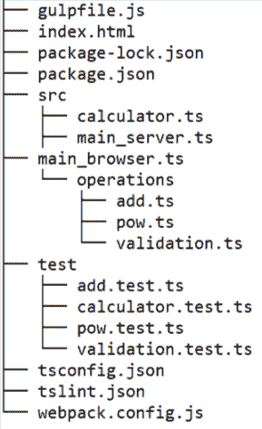

有两个主要文件，分别命名为 `main_server.ts` 和 `main_browser.ts`。这两个文件都位于 `src` 目录下。这些文件创建了一个名为 `Calculator` 的类的实例，并使用它执行一些操作。操作的结果被记录在控制台：

```js
import chalk from "chalk"; 
import { Calculator } from "./calculator"; 

const calculator = new Calculator(); 

const addResult = calculator.calculate("add", 2, 3); 
console.log(chalk.green(`2 + 3 = ${addResult}`)); 

const powResult = calculator.calculate("pow", 2, 3); 
console.log(chalk.green(`2 + 3 = ${powResult}`)); 
```

`main_browser.ts` 文件在 HTML 元素内显示结果，而不是在控制台显示。`main_browser.ts` 文件还导入一个 `.scss` 文件，以展示我们如何使用 Webpack 与 `.css` 和 `.scss` 文件一起工作。

`Calculator` 类可以执行不同种类的数学运算，并在 `src` 目录下的 `calculator.ts` 文件中定义：

```js
import { add } from "./operations/add"; 
import { pow } from "./operations/pow"; 

interface Operation { 
    name: string; 
    operation(a: number, b: number): number; 
} 

export class Calculator { 
    private readonly _operations: Operation[]; 
    public constructor() { 
        this._operations = [ 
            { name: "add", operation: add }, 
            { name: "pow", operation: pow } 
        ]; 
    } 
    public calculate(operation: string, a: number, b: number) { 
        const opt = this._operations.filter((o) => o.name === operation)[0]; 
        if (opt === undefined) { 
            throw new Error(`The operation ${operation} is not available!`); 
        } else { 
            return opt.operation(a, b); 
        } 
    } 
} 
```

`Calculator` 类只能执行两种操作。每个操作都在 `operations` 目录下的单独文件中定义。加法操作在 `add.ts` 文件中定义，如下所示：

```js
import { isNumber } from "./validation"; 

export function add(a: number, b: number) { 
    isNumber(a); 
    isNumber(b); 
    return a + b; 
} 
```

`pow` 操作定义在 `pow.ts` 文件中，其形式如下：

```js
import { isNumber } from "./validation"; 

export function pow(base: number, exponent: number) { 
    isNumber(base); 
    isNumber(exponent); 
    let result = base; 
    for (let i = 1; i < exponent; i++) { 
        result = result * base; 
    } 
    return result; 
} 
```

最后，`isNumber` 验证函数的形式如下：

```js
export function isNumber(a: number) { 
    if (typeof a !== "number") { 
        throw new Error(`${a} must be a number!`); 
    } 
} 
```

我们将在本章的剩余部分使用这些文件，这意味着我们可能需要稍后返回来完全理解本章的其余内容。

# 版本控制工具

现在我们已经安装了 Git 并创建了 GitHub 账户，我们将使用 GitHub 来创建一个新的代码仓库。仓库是一个中央文件存储位置。源代码控制系统使用它来存储文件的多个版本。虽然仓库可以在本地机器上为单个用户配置，但它通常存储在服务器上，可以被多个用户访问。

要在 GitHub 上创建一个新的仓库，请登录到你的 GitHub 账户，然后在屏幕右上角点击创建新仓库的链接：

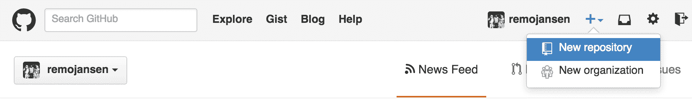

屏幕上会显示与以下截图相似的表单：

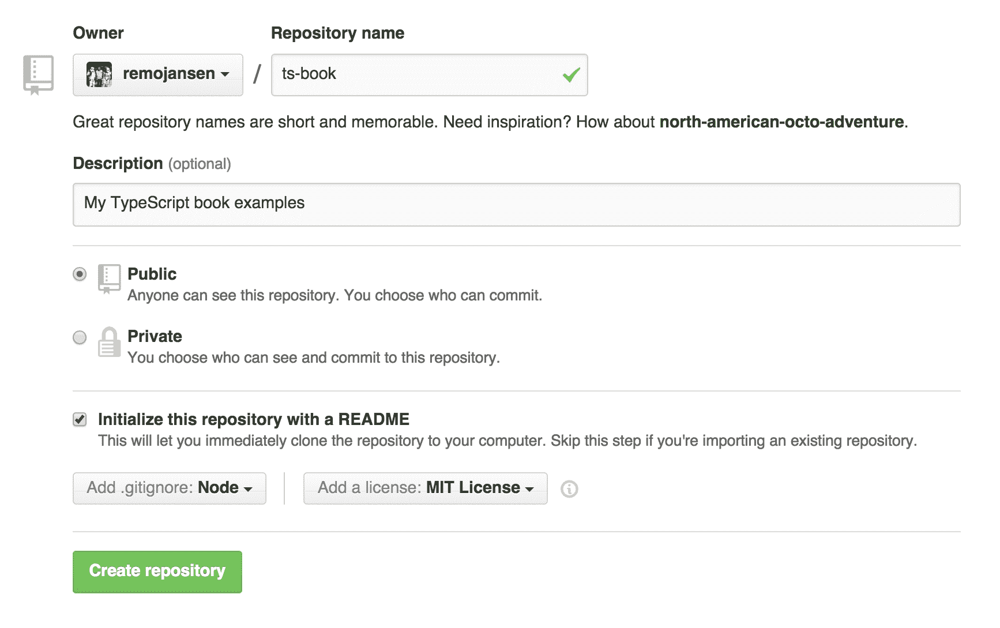

此表单包含一些字段，允许我们设置仓库的名称、描述和一些隐私设置。

请注意，如果你想要使用私有仓库，你需要一个付费的 GitHub 账户。

我们还可以添加一个 `README.md` 文件，它使用 Markdown 语法，并用于将我们想要添加到 GitHub 仓库主页上的任何文本。此外，我们还可以添加一个默认的 `.gitignore` 文件，该文件用于指定我们希望 Git 忽略的文件，因此这些文件不会被保存到仓库中。

默认的 `.gitignore` 文件推荐选项是 `Node`。本书中我们将使用 GitHub。然而，如果你想要使用本地仓库，你可以使用 Git 的 `init` 命令来创建一个空仓库。有关 `git init` 命令和本地仓库操作的更多信息，请参考 Git 文档[`git-scm.com/docs/git-init`](http://git-scm.com/docs/git-init)。

最后，但同样重要的是，我们还可以选择一个软件许可来覆盖我们的源代码。

一旦我们创建了仓库，我们将访问 GitHub 上的个人资料页面，找到我们刚刚创建的仓库，并访问它。在仓库的主页上，我们可以在页面的右上角找到克隆 URL：

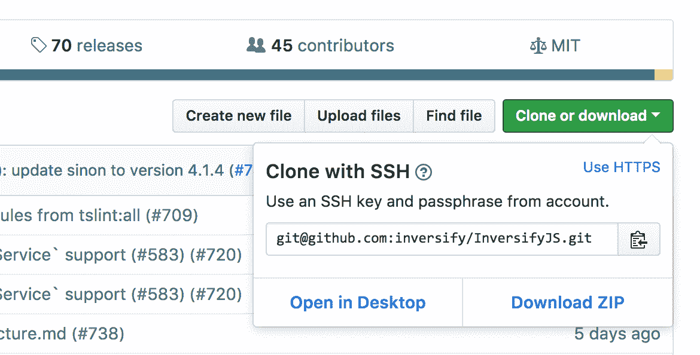

克隆 URL

我们需要复制仓库的克隆 URL，打开控制台，并将 URL 作为以下命令的参数：

```js
git clone https://github.com/user-name/repository-name.git 
```

有时 Windows 的**命令行界面**（**CLI**）无法找到 Git 和 Node 命令。绕过这个问题的最简单方法是用 Git 控制台（与 Git 一起安装）而不是使用 Windows 命令行。如果您想使用 Windows 控制台，您需要手动将 Git 和 Node 的安装路径添加到 Windows 的`PATH`环境变量中。如果您使用的是 OS X 或 Linux，默认的 CLI 应该可以正常工作。此外，请注意，在所有示例中，我们将使用 Unix 路径语法。

命令的输出应该类似于以下内容：

```js
    Cloning into 'repository-name'...
    remote: Counting objects: 3, done.
    remote: Compressing objects: 100% (3/3), done.
    remote: Total 3 (delta 2), reused 0 (delta 0), pack-reused 0
    Unpacking objects: 100% (3/3), done.
    Checking connectivity... done.
```

然后，我们可以使用更改目录命令（`cd`）进入仓库目录，并使用`git status`命令来检查本地仓库状态。命令的输出应该类似于以下内容：

```js
    cd repository-name
    git status
    On branch master
    Your branch is up-to-date with 'origin/master'.
    nothing to commit, working directory clean

```

`git status`命令告诉我们工作目录中没有更改。现在，让我们在 Visual Studio Code 中打开仓库文件夹，创建一个名为`gulpfile.js`的新文件。现在，再次运行`git status`命令，我们应该看到一些新的未跟踪文件：

```js
    On branch master
    Your branch is up-to-date with 'origin/master'.

    Untracked files:
      (use "git add <file>..." to include in what will be committed)

      gulpfile.js

    nothing added to commit but untracked files present (use "git add" to 
 track)

```

Visual Studio Code 中的项目资源管理器使用颜色代码显示文件，以帮助我们识别自上次提交以来文件是否是新添加的（绿色）、已被删除（红色）或已更改（黄色）。

当我们进行一些更改，例如添加新文件或更改现有文件时，我们需要执行`git add`命令来指示我们想要将此更改添加到快照中：

```js
    git add gulpfile.js
    git status
    On branch master
    Your branch is up-to-date with 'origin/master'.

    Changes to be committed:
      (use "git reset HEAD <file>..." to unstage)

      new file:   gulpfile.js
```

现在我们已经将想要快照的内容放入暂存区，我们必须运行`git commit`命令来实际记录快照。记录快照需要注释字段，可以使用`git commit`命令与`-m`参数一起提供：

```js
    git commit -m "added the new gulpfile.js"
```

要运行上述命令，您需要在终端上配置您的 GitHub 电子邮件/用户名。您可以使用以下任一命令在终端上配置 GitHub 账户：

`git config --global user.email "you@example.com"`

`git config --global user.name "Your Name"`

如果一切顺利，命令输出应该类似于以下内容：

```js
    [master 2a62321] added the new file gulpfile.js
     1 file changed, 1 insertions(+)
     create mode 100644 gulpfile.js
```

要与其他开发者共享提交，我们需要将我们的更改推送到远程仓库。我们可以通过执行`git push`命令来完成：

```js
    git push  
```

`git push`命令将要求我们输入 GitHub 用户名和密码，然后将更改发送到远程仓库。如果我们访问 GitHub 上的仓库页面，我们将能够找到最近创建的文件。我们将在本章的后面部分回到 GitHub 以配置我们的 CI 服务器。

如果我们与一个大型团队一起工作，在尝试将一些更改推送到远程仓库时可能会遇到一些文件冲突。解决文件冲突超出了本书的范围；然而，如果您需要有关 Git 的更多信息，您将在[`www.kernel.org/pub/software/scm/git/docs/user-manual.html`](https://www.kernel.org/pub/software/scm/git/docs/user-manual.html)找到一个详尽的用户手册。

# 包管理工具

包管理工具用于依赖管理，这样我们就不必手动下载和管理应用程序的依赖项。在本章中，我们不会涵盖包管理工具，因为我们已经在第五章与依赖项一起工作中介绍过它们。

# TypeScript 编译器

现在我们已经学会了如何使用`npm`，我们可以使用以下命令安装 TypeScript：

```js
    npm install typescript -g
```

TypeScript 编译器将在我们的 CLI 中以名为`tsc`的命令的形式可用。我们可以使用以下命令检查机器上安装的 TypeScript 版本：

```js
    tsc -v  
```

TypeScript 编译器接受许多其他选项。例如，我们可以使用`--target`或`-t`选项来选择我们希望作为编译输出的 JavaScript 版本：

```js
    tsc --target es6  
```

或者，我们可以创建一个`tsconfig.json`文件来设置所需的编译设置。我们还可以使用 TypeScript 编译器使用以下命令自动生成具有默认设置的`tsconfig.json`文件：

```js
    tsc --init  
```

在创建`tsconfig.json`文件后，您可以使用`--project`或`-p`选项将其传递给 TypeScript 编译器：

```js
    tsc -p tsconfig.json  
```

如果您想了解更多关于可用编译选项的信息，请参阅官方 TypeScript 文档[`www.typescriptlang.org/docs/handbook/compiler-options.html`](https://www.typescriptlang.org/docs/handbook/compiler-options.html)。

# 单元测试和测试覆盖率

单元测试是指测试我们代码中某些函数和区域（单元）的实践。这使我们能够验证我们的函数是否按预期工作。

预期读者对单元测试过程有一定了解，但这里所涉及的内容将在第十四章应用测试中更详细地介绍。

在本章的开头，我们包括了本章配套源代码中包含的应用程序最重要的部分。源代码定义了一个支持两个操作`pow`和`add`的计算器。

`pow`操作期望两个数字作为其参数，并有两个可能的执行路径：

+   如果提供的两个参数中有一个不是数字，`pow`函数将抛出异常

+   如果两个参数都是有效的数字，`pow`函数将返回一个数字

理想情况下，我们将为函数的每个执行路径编写一个单元测试。

以下代码片段使用两个测试库`mocha`和`chai`为`pow`操作声明了几个单元测试：

```js
import { expect } from "chai"; 
import { pow } from "../src/operations/pow"; 

describe("Operation: pow", () => { 

    it ("Should be able to calculate operation", () => { 
        const result = pow(2, 3); 
        expect(result).to.eql(8); 
    }); 

    it ("Should throw if an invalid argument is provided", () => { 
        const a: any = "2"; 
        const b: any = 3; 
        const throws = () => pow(a, b); 
        expect(throws).to.throw(); 
    }); 

}); 
```

上述代码片段将所有与`pow`操作相关的测试组合在所谓的**测试夹具**中。测试夹具可以使用`describe`函数定义，它只是一组测试用例。测试用例可以使用`it`函数定义，可以包含一个或多个测试断言。

我们的测试断言是通过 `assert` 函数定义的，它是 Chai 库的一部分。

`describe` 和 `it` 函数都是 Mocha 声明的全局函数。我们不需要导入 `Mocha`，因为它是通过我们的测试运行器配置作为全局导入的。

我们可以使用以下命令运行测试并生成测试覆盖率报告：

```js
    nyc -x **/*.js --clean --all --require ts-node/register --extension .ts -- mocha --timeout 5000 **/*.test.ts

```

前面的命令使用了 `nyc`，这是一个用于生成测试覆盖率报告的工具。该工具使用 `ts-node` 和 `mocha` 来运行测试。这也解释了为什么我们可以不编译测试代码就运行测试，以及为什么我们可以使用 Mocha 而不必显式导入。

这个命令不是很方便，但我们可以声明一个 `npm` 命令来解决这个问题：

```js
"scripts": { 
  "nyc": "nyc -x **/*.js --clean --all --require ts-node/register --extension .ts -- mocha --timeout 5000 **/*.test.ts" 
} 
```

请注意，我们需要使用 npm 安装所有这些依赖项及其类型定义（当适用时）。然后我们可以使用以下 npm 命令：

```js
    npm run nyc  
```

伴随的源代码包含更多的测试。现有的测试覆盖了应用程序中所有现有函数的大多数可能的执行路径，但并没有完全覆盖 `main_server.ts` 文件。这可以在 `nyc` 生成的测试覆盖率报告中观察到：

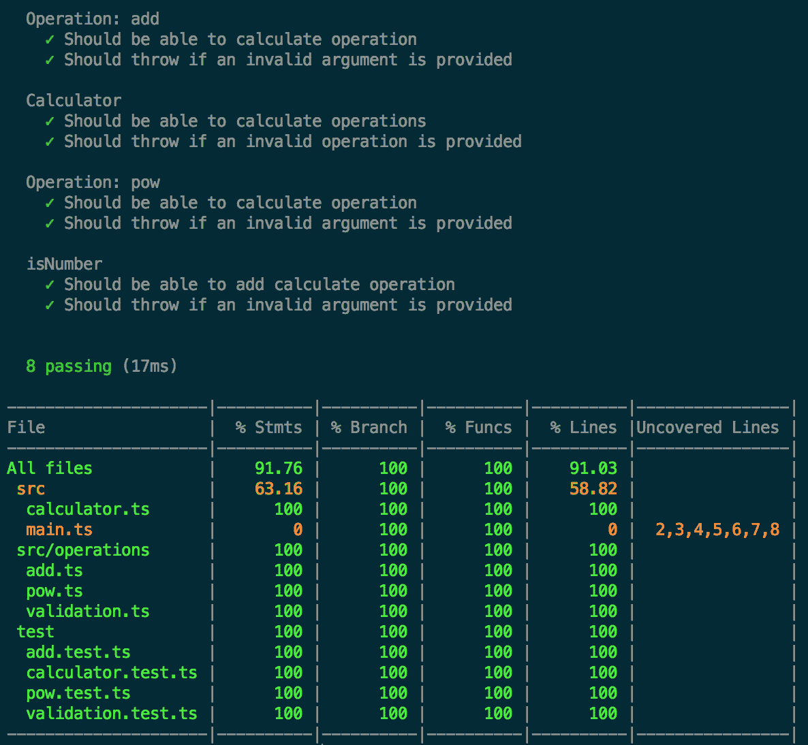

# 代码风格检查工具

以下工具是一个代码风格检查工具。代码风格检查工具帮助我们强制执行代码库中的某些代码风格规则。例如，在一个大型开发团队中，关于代码风格的长时间讨论是非常常见的。

术语 *代码风格* 指的是我们代码的某些外观元素，例如使用空格或制表符。然而，有时代码风格涉及某些规则，这些规则不仅仅是外观上的，而是旨在使我们的代码更易于维护。一个很好的例子是强制使用尾随逗号的代码风格规则。

代码风格指南和规则很好，但执行它们可能需要大量的人工努力。我们必须审查每一个代码更改，以确保代码贡献符合我们的代码风格规则。

代码风格检查工具的主要目标是自动化执行代码风格规则的实施。

在 TypeScript 世界中，主要的代码风格检查工具是 **tslint**。我们可以使用 `npm` 安装 `tslint`：

```js
    npm install -g tslint  
```

然后，我们需要创建一个 `tslint.json` 文件。该文件包含允许我们启用和禁用某些风格规则的配置。以下是一个 `tslint.json` 文件的代码片段示例：

```js
{ 
    "extends": "tslint:all", 
    "rules": { 
      "array-type": [true, "array"], 
      "ban-types": false, 
      "comment-format": false, 
      "completed-docs": false, 
      "cyclomatic-complexity": false, 
      "interface-name": false, 
      "linebreak-style": false, 
      "max-classes-per-file": false, 
      "max-file-line-count": false, 
      "max-line-length": [true, 140], 
      "member-ordering": false, 
      "newline-before-return": false, 
      "no-any": false, 
      "no-empty-interface": false, 
      "no-floating-promises": false, 
      "no-import-side-effect": false, 
      "no-inferred-empty-object-type": false, 
      "no-magic-numbers": false, 
      "no-namespace": false, 
      "no-null-keyword": false, 
      "no-parameter-properties": false, 
      "no-submodule-imports": false, 
      "no-unbound-method": false, 
      "no-unnecessary-class": false, 
      "no-unnecessary-qualifier": false, 
      "no-unsafe-any": false, 
      "no-reference": false, 
      "no-void-expression": false, 
      "only-arrow-functions": false, 
      "prefer-function-over-method": false, 
      "prefer-template": false, 
      "promise-function-async": false, 
      "space-before-function-paren": false, 
      "strict-boolean-expressions": false, 
      "strict-type-predicates": false, 
      "switch-default": false, 
      "trailing-comma": false, 
      "typedef": false, 
      "variable-name": false 
    } 
 } 
```

在创建 `tslint.json` 文件后，我们可以使用以下命令检查我们的源代码：

```js
    tslint --project tsconfig.json -c tslint.json ./**/*.ts  
```

前面的命令并不太方便。我们可以使用 `npm` 脚本来创建一个更方便的命令，命名为 `lint`：

```js
"scripts": { 
  "lint": "tslint --project tsconfig.json -c tslint.json ./**/*.ts" 
} 
```

然后，我们可以使用以下 `npm` 命令运行 `tslint`：

```js
    npm run lint  
```

# 使用 npm 脚本

`package.json` 文件包含一个名为 `scripts` 的字段。该字段可以包含多个条目，每个条目用于创建一个命令。一个命令可以执行任何类型的自定义逻辑。

当我们使用`npm init`命令创建`package.json`文件时，默认命令尚未实现：

```js
"scripts": { 
    "test": "echo "Error: no test specified" && exit 1" 
  }, 
```

在实际场景中，我们会有多个命令，如下面的示例所示：

```js
{ 
  "name": "repository-name", 
  "version": "1.0.0", 
  "description": "example", 
  "main": "index.html", 
  "scripts": { 
    "start": "node ./src/index.js", 
    "test": "gulp test", 
    "lint": "tslint -c tslint.json ./**/*.ts" 
  }, 
  "repository": { 
    "type": "git", 
    "url": "https://github.com/username/repository-name.git" 
  }, 

```

一些命令，例如`test`、`install`或`start`命令，被视为标准命令。您可以通过使用`npm`命令后跟标准命令的名称来执行标准命令：

```js
    npm test
    npm start
```

对于不被视为标准的命令，我们需要使用`npm`命令后跟`run`命令和命令的名称：

```js
    npm run lint
```

请参阅[`docs.npmjs.com`](https://docs.npmjs.com)上的 npm 文档，了解更多关于所有 npm 功能的信息。

# Gulp

两个最受欢迎的 JavaScript 任务运行器是 Grunt 和 Gulp。Gulp 与 Grunt 的主要区别在于，在 Grunt 中，我们使用文件作为任务输入和输出，而在 Gulp 中，我们使用流和管道。

Grunt 使用一些配置字段和值进行配置。然而，Gulp 更倾向于代码而非配置。这种方法使 Gulp 配置在某些方面更加简约且易于阅读。

在这本书中，我们将使用 Gulp；然而，如果您想了解更多关于 Grunt 的信息，可以在[`gruntjs.com/`](http://gruntjs.com/)学习。

为了更好地理解 Gulp，我们将配置一些任务。

让我们先使用`npm`安装`gulp`：

```js
    npm install gulp -g
```

然后，让我们在我们的项目根目录内创建一个名为`gulpfile.js`的 JavaScript 文件，它应该包含以下代码片段：

```js
let gulp = require("gulp"); 

gulp.task("hello", function() { 
    console.log("Hello Gulp!"); 
}); 
```

最后，运行`gulp`：

```js
    gulp hello  
```

请注意，我们使用`-g`标志安装了 Gulp，因为我们打算直接从命令行界面调用`gulp`命令。然而，如果我们打算使用`npm scripts`，我们应该使用`--save-dev`标志将 Gulp 和任何其他依赖项作为项目依赖项安装。请注意，使用全局（`-g`）依赖项是不推荐的。另外，请注意，我们必须从`gulpfile.js`文件所在的目录执行此命令。

我们已经创建了我们第一个 Gulp 任务，该任务命名为`hello`。当我们运行`gulp`命令时，它将自动尝试在当前目录中搜索`gulpfile.js`，一旦找到，它将尝试找到`hello`任务。如果一切按预期进行，我们应该在我们的 CLI 中看到以下类似的输出：

```js
Using gulpfile 
Starting 'hello'... 
Hello Gulp! 
Finished 'hello' after 255 μs 
```

现在，我们将添加第二个任务，该任务将使用`gulp-tslint`插件来检查我们的 TypeScript 代码是否遵循一系列推荐的最佳实践。

我们需要使用`npm`安装该插件：

```js
    npm install tslint gulp-tslint -g
```

我们可以在我们的`gulpfile.js`文件中加载该插件并添加一个新任务：

```js
let tslint = require("tslint"); 
let gulpTslint = require("gulp-tslint"); 

gulp.task("lint", function() { 

    let program = tslint.Linter.createProgram("./tsconfig.json"); 

    return gulp.src([ 
        "src/**/**.ts", 
        "test/**/**.test.ts" 
    ]) 
    .pipe(gulpTslint({ 
        formatter: "stylish", 
        program 
    })) 
    .pipe(gulpTslint.report()); 
});
```

我们将新任务命名为`lint`。让我们一步一步地查看`lint`任务执行的操作：

1.  `gulp src`函数将读取位于`src`目录及其子目录中具有`.ts`文件扩展名的文件。我们还在`test`目录及其子目录中检索所有具有`.test.ts`文件扩展名的文件。

1.  许多插件允许我们通过在路径前添加感叹号（`!`）来指示要忽略的文件。例如，路径`!path/*.d.ts`将忽略所有扩展名为`.d.ts`的文件。

1.  `pipe`函数用于将`src`的输出流作为`gulpTslint`函数的输入。

1.  最后，我们将`tslint`函数的输出作为`report`函数的输入。

现在我们已经添加了`lint`任务，我们将修改`gulpfile.js`文件以添加一个名为`default`的额外任务：

```js
gulp.task("default", ["hello", "lint"]); 
```

默认任务可以用来调用`hello`和`lint`任务。当我们定义一个`gulp`任务时，我们使用两个参数调用`task`函数。第一个参数是任务名称。第二个参数可以是一个定义任务的函数或包含子任务列表的数组。

# 控制 Gulp 任务执行顺序

我们现在将学习如何控制任务执行的顺序。如果我们尝试执行默认任务，`hello`和`lint`任务将并行执行，因为子任务默认是并行执行的。

有时我们需要按照特定的顺序运行我们的任务。在 Gulp 中，所有任务默认都是异步的，因此控制任务执行顺序可能会很具挑战性。

然而，有三种方法可以使任务变为同步。

# 将回调函数传递给任务定义函数

我们需要做的就是将一个回调函数传递给任务定义函数，如下所示：

```js
gulp.task("sync", function (cb) { 
    // We used setTimeout here to illustrate an async operation 
    setTimeout(function () { 
        console.log("Hello Gulp!"); 
        cb(); // note the cb usage here 
    }, 1000); 
}); 
```

# 返回一个承诺

我们需要做的就是使用承诺作为任务定义函数的返回值，如下所示：

```js
gulp.task("sync", function () { 
    return new Promise((resolve) => { 
        setTimeout(function () { 
            console.log("Hello Gulp!"); 
            resolve(); 
        }, 1000); 
    }); 
}); 
```

# 返回一个流

我们需要做的就是使用流作为任务定义函数的返回值。这很简单，因为管道操作符返回一个流：

```js
gulp.task("sync", function () { 
    return gulp.src([ 
        "src/**/**.ts" 
    ]) 
    .pipe(somePlugin({})) 
    .pipe(somePlugin ()); 
}); 
```

现在我们已经有了一些同步任务，我们可以将它们作为名为`async`的新任务的子任务使用：

```js
gulp.task("async", ["sync1", "sync2"], function () {   
    // This task will not start until 
    // the sync tasks are completed! 
    console.log("Done!"); 
}); 
```

如前述代码片段所示，我们也可以定义一个包含一些子任务的任务。然而，如果我们的构建过程变得复杂，我们可能会得到一个非常难以追踪的任务依赖图。幸运的是，我们可以通过`npm`安装`run-sequence` Gulp 插件，这将使我们能够更好地控制任务执行顺序：

```js
let runSequence = require('run-sequence'); 

gulp.task('default', function(cb) { 
  runSequence( 
    'lint',                      // lint 
    ['tsc', 'tsc-tests'],        // compile 
    ['bundle-js','bundle-test'], // optimize 
    'karma'                      // test 
    'browser-sync',              // serve 
    cb                           // callback 
  ); 
}); 
```

上述代码片段将按以下顺序运行：

1.  `lint`

1.  并行执行`tsc`和`tsc-tests`

1.  并行执行`bundle-js`和`bundle-test`

1.  `karma`

1.  `browser-sync`

Gulp 开发团队宣布了改进任务执行顺序管理的计划，无需外部插件。请参阅 Gulp 文档[`github.com/gulpjs/gulp/`](https://github.com/gulpjs/gulp/)以了解更多信息。

# Webpack

如我们所知，当我们编译 TypeScript 代码时，编译器将为每个现有的 TypeScript 文件生成一个 JavaScript 文件。如果我们在一个网页浏览器中运行应用程序，这些文件本身并不是非常有用，因为使用它们唯一的方法是为每个文件创建一个单独的 HTML `script` 标签。

然而，这将非常不方便且效率低下，因为每个 `script` 标签都会在浏览器和提供 JavaScript 文件的服务器之间产生往返。使用 `script` 标签也比使用 Ajax 调用慢，因为 `script` 标签可以阻止浏览器渲染。

请注意，在现代浏览器中，我们可以使一些 `script` 标签异步，但这并不总是可行的选项。请参阅[`developers.google.com/web/fundamentals/performance/critical-rendering-path/adding-interactivity-with-javascript`](https://developers.google.com/web/fundamentals/performance/critical-rendering-path/adding-interactivity-with-javascript) 了解有关异步脚本的更多信息。

幸运的是，有几个潜在的解决方案可以解决这个问题：

+   **使用 AJAX 调用加载文件**：我们可以使用一个工具按需使用 AJAX 调用加载每个 JavaScript 文件。这种方法被称为异步模块加载。为了遵循这种方法，我们需要使用 Require.js 并更改 TypeScript 编译器的配置以使用异步模块定义（AMD）语法。

+   **将所有文件打包成一个唯一的文件并使用脚本标签加载**：我们可以使用一个工具跟踪应用程序模块和依赖项，并生成一个高度优化的单个文件，该文件将包含所有应用程序模块。为了遵循这种方法，我们需要使用工具，如 Webpack 或 Browserify，并更改 TypeScript 编译器的配置以使用正确的模块语法（通常是 CommonJS）。

+   **混合方法**：我们可以通过创建一个高度优化的包，其中包含应用程序运行所需的最少文件数，来遵循混合方法。当应用程序用户需要时，额外的文件将按需使用 AJAX 调用加载。

请参阅第五章，*与依赖项一起工作*，以了解更多关于模块的信息。

在本章中，我们将关注第二种方法。我们将使用 Webpack 创建一个高度优化的模块打包器。创建一个高度优化的应用程序包通常涉及多个步骤；Webpack 可以执行这些任务中的每一个，但它并不是真正设计用来作为任务运行器的。我们可以使用 `npm` 安装 Webpack：

```js
    npm install webpack --save-dev  
```

我们还将安装一些由本例所需的额外模块：

```js
    npm install awesome-typescript-loader css-loader extract-text-webpack-plugin node-sass resolve-url-loader sass-loader style-loader --save-dev

```

大多数这些模块都是 Webpack 插件及其依赖项。我们需要它们，因为我们将要在我们的 Webpack 配置文件中使用它们。

我们可以通过在项目的根目录中创建一个名为 `webpack.config.js` 的文件来配置 Webpack。以下代码部分显示了本章配套源代码中使用的整个 Webpack 配置文件的内容。

`webpack.config.js` 文件正在导入一些依赖项：

```js
const { CheckerPlugin, TsConfigPathsPlugin } = require("awesome-typescript-loader"); 
const webpack = require("webpack"); 
const ExtractTextPlugin = require("extract-text-webpack-plugin"); 
```

然后，我们声明三个变量：

+   `corePlugins`变量是一个数组，它包含用于开发构建和生产构建的 Webpack 插件的配置

+   `devPlugins`变量是一个数组，它只包含开发构建中使用的 Webpack 插件的配置

+   `prodPlugins`变量是一个数组，它只包含生产构建中使用的 Webpack 插件的配置

每个插件都需要一些特定的配置。例如，`ExtractTextPlugin`用于从主应用包中提取我们的 CSS 代码：

```js
const corePlugins = [ 
    new CheckerPlugin(), 
    new webpack.DefinePlugin({ 
        "process.env.NODE_ENV": JSON.stringify(process.env.NODE_ENV || "development") 
    }), 
    new ExtractTextPlugin({ 
        filename: "[name]main.css", 
        allChunks: true 
    }) 
]; 

const devPlugins = []; 

const prodPlugins = [ 
    new webpack.optimize.UglifyJsPlugin({ 
        output: { comments: false } 
    }) 
]; 

const isProduction = process.env.NODE_ENV === "production"; 
const plugins = isProduction ? corePlugins.concat(prodPlugins) : corePlugins.concat(devPlugins); 

```

配置文件使用环境变量`NODE_ENV`来确定我们是在运行开发构建还是生产构建。生产构建使用`uglify`插件，但在开发构建中并不使用。

我们随后使用`uglify`插件来最小化输出文件的大小。文件大小的减小将减少应用加载时间，但会使调试变得更加困难。幸运的是，我们可以生成源映射来简化调试过程。源映射是由`source-map-loader`插件生成的。

Uglify 移除所有换行符和空白字符，并缩短一些变量名的长度。源映射文件允许我们在调试时将压缩文件的源代码映射到其原始代码。源映射提供了一种将压缩文件中的代码映射回源文件中原始位置的方法。这意味着我们可以在优化资产之后轻松地调试应用。Chrome 和 Firefox 开发者工具都内置了对源映射的支持。

在这一点上，我们定义了应用的入口点。我们使用一个对象作为映射来定义一个入口点，这意味着我们可以定义多个入口点。每个入口点都会转换成一个名为`bundle.js`的文件，该文件将被存储在名为`public`的目录下。

正如我们在`webpack.config.js`文件的其余部分所看到的，我们在应用的入口点名称后附加了一个正斜杠。我们还使用了一种特殊语法，将入口点的名称作为输出文件名称的一部分（例如，`[name]bundle.js`）。这是一个我们可以用来为每个输出包生成唯一文件夹的技巧。

最后，该文件声明了一些插件的配置，例如 TypeScript 插件或`sass`插件：

```js
module.exports = { 
    entry: { 
        "calculator_app/": "./src/main_browser.ts" 
    }, 
    devServer: { 
        inline: true 
    }, 
    output: { 
        filename: "[name]bundle.js", 
        path: __dirname + "/public", 
        publicPath: "/public" 
    }, 
    devtool: isProduction ? "source-map" : "eval-source-map", 
    resolve: { 
        extensions: [".webpack.js", ".ts", ".tsx", ".js"], 
        plugins: [ 
            new TsConfigPathsPlugin({ 
                configFileName: "tsconfig.json" 
            }) 
        ] 
    }, 
    module: { 
        rules: [ 
            { 
                enforce: "pre", 
                test: /.js$/, 
                loader: "source-map-loader", 
                exclude: [/node_modules/, /experimental/] 
            }, 
            { 
                test: /.(ts|tsx)$/, 
                loader: "awesome-typescript-loader", 
                exclude: [/node_modules/, /experimental/] 
            }, 
            { 
                test: /.scss$/, 
                use: ExtractTextPlugin.extract({ 
                    fallback: "style-loader", 
                    use: ["css-loader", "resolve-url-loader", "sass-loader"] 
                }) 
            } 
        ] 
    }, 
    plugins: plugins 
}; 
```

我们可以使用以下命令执行 Webpack 打包过程：

```js
webpack 
```

请注意，我们必须从`gulpfile.js`文件所在的目录执行此命令。

如果一切顺利，我们应该能看到一个名为`public`的新文件夹。`public`文件夹应包含以下文件：

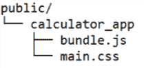

伴随源代码还包括一个名为`index.html`的文件。此文件是我们刚刚创建的前端应用的入口点：

```js
<!doctype html> 
<html lang="en"> 
  <head> 
    <meta charset="utf-8"> 
    <link rel="stylesheet" href="./public/calculator_app/main.css"> 
    <title>Calculator</title> 
  </head> 
  <body> 
    <div id="main"><!-- Content created by JavaScript --></div> 
    <script src="img/bundle.js"></script> 
  </body> 
</html>
```

这个示例应该能给我们一个关于如何使用 Webpack 的良好第一印象。下一节将描述我们如何使用 Webpack 开发服务器作为 Web 服务器来从 Web 浏览器访问此应用程序。

如果您需要关于 webpack 的更多信息，请参阅 [`webpack.js.org/concepts/`](https://webpack.js.org/concepts/) 的文档。还建议参考每个插件的文档，以了解更多关于可用配置选项的信息。某些 npm 模块可能需要一些额外的工具。这种情况并不常见，但某些模块可能需要安装 gcc/g++ 编译器和 Python 解释器等工具到您的开发环境中。如果您遇到此类问题，请查阅您操作系统的在线文档，了解如何安装 gcc/g++ 编译器和 Python 解释器。

# Webpack 开发服务器

Webpack 开发服务器是一个命令行工具，它监视我们的文件系统以查找变化，并触发 Webpack 打包过程。

我们可以使用 npm 安装 Webpack 开发服务器：

```js
    npm install -g webpack-dev-server  
```

我们可以使用以下命令执行 webpack 开发服务器：

```js
    webpack-dev-server  
```

Webpack 开发服务器将开始监视我们的文件系统以查找变化。如果检测到变化，它将自动使用现有的 `webpack.config.js` 文件运行 Webpack 构建过程。

Webpack 开发服务器还会启动一个 Web 服务器。默认情况下，服务器运行在端口 8080 上。

请参阅 [`github.com/webpack/webpack-dev-server`](https://github.com/webpack/webpack-dev-server) 上的文档，以了解更多关于 Webpack 开发服务器的信息。

# Visual Studio Code

Visual Studio 是一个轻量级但功能强大的代码编辑器，具有众多功能。学习所有这些功能超出了本书的范围，因为我们完全可以写一本书来涵盖它们。然而，我们将花一点时间来了解这个代码编辑器中两个最好的功能：快速修复和代码调试器。

建议阅读 Visual Studio Code 用户指南 [`code.visualstudio.com/docs/editor/codebasics`](https://code.visualstudio.com/docs/editor/codebasics)，以了解如何充分利用此 IDE。

# 快速修复

Visual Studio Code 可以检测一些错误，并使用一组称为 *快速修复* 的功能自动修复它们。

Visual Studio Code 将在我们的代码中某些错误附近左侧显示一个灯泡图标。如果我们点击灯泡图标，Visual Studio Code 将显示所有可用的快速修复。如果我们选择其中一个可用的快速修复，Visual Studio Code 将自动执行必要的更改以解决问题：

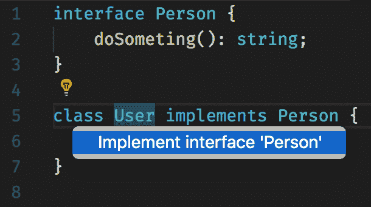

# 调试工具

在我们能够使用 Node.js 调试我们的应用程序之前，我们需要在 Visual Studio Code 中配置一个调试任务。我们需要选择调试面板并添加一个新的配置：

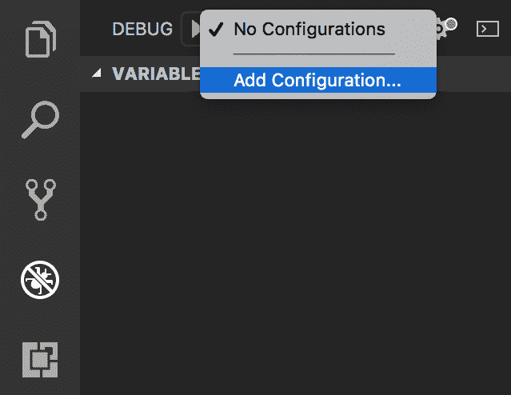

然后将显示一个带有几个选项的面板。我们需要选择 Node.js。如果您想使用 Docker 运行和调试应用程序，您也可以这样做，但这本书的范围之外：

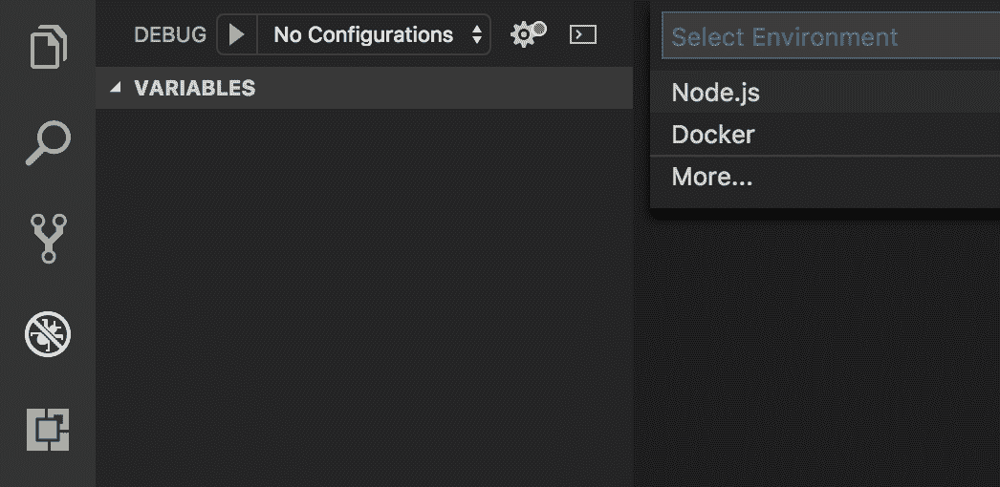

选择 Node.js 将会创建一个名为`.vscode`的文件夹和一个名为`launch.json`的文件。这个文件允许我们定义我们可能需要的任意数量的调试任务。一个调试任务声明了调试我们的单元测试所需的指令。

调试任务的配置对于每个测试工具都是不同的。在示例应用中，我们使用了`mocha`，这意味着我们的调试任务将需要使用`mocha`二进制文件和一些参数来启动调试会话。

以下配置可以用于调试示例应用程序中的测试：

```js
{ 
    "version": "0.2.0", 
    "configurations": [ 
        { 
            "type": "node", 
            "request": "launch", 
            "name": "Debug Mocha Tests", 
            "program": "${workspaceFolder}/node_modules/mocha/bin/_mocha", 
            "args": [ 
                "--require", 
                "ts-node/register", 
                "-u", 
                "tdd", 
                "--timeout", 
                "999999", 
                "--colors", 
                "${workspaceFolder}/test/**/*.test.ts" 
            ], 
            "internalConsoleOptions": "openOnSessionStart", 
            "sourceMaps": true 
        } 
    ] 
} 
```

请注意，`.vscode`文件夹必须位于项目的根目录下。配套源代码在章节文件夹下包含此文件夹，而不是在根目录下。如果您想尝试，您需要使用 Visual Studio Code 将章节文件夹作为根目录打开。

创建并配置`launch.json`文件后，我们可以在 DEBUG 面板下选择我们刚刚定义的任务，然后点击*播放*按钮：

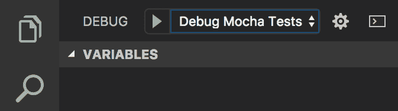

当达到断点时，测试执行将暂停。我们可以在源代码的左侧单击一行来设置断点：

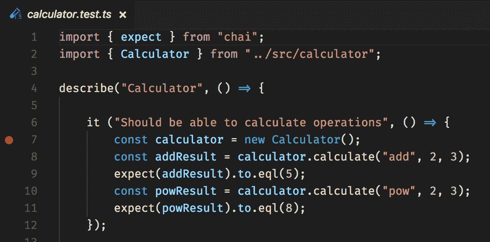

Visual Studio Code 的调试面板允许我们使用屏幕左侧可用的调试面板检查当前执行上下文。此面板包含几个子面板：

+   变量面板允许我们查看当前执行上下文中声明的所有变量。

+   观察面板允许我们创建一个*观察者*。观察者只是一个过滤器，允许我们显示我们选择的变量的值。

+   调用堆栈面板允许我们查看函数调用堆栈。我们可以在调用堆栈中单击函数以导航到所选函数。

+   断点面板允许我们启用和禁用我们创建的断点，以及启用一些通用的断点（例如，未捕获的异常）：

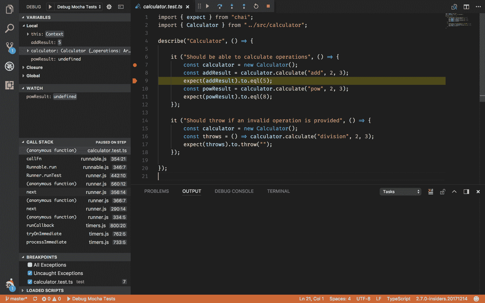

屏幕顶部的执行面板允许我们以自己的节奏控制测试的执行。

# 源代码管理工具

Visual Studio Code 还允许我们通过图形用户界面与 Git 进行交互。要访问 Git 功能，我们需要点击屏幕左侧的 Git 面板。

Git 面板允许我们查看当前的变化。我们可以选择要提交（暂存）或回滚的变化。然后，我们可以通过输入一条消息并点击 Git 面板右上角的批准图标来提交这些变化：

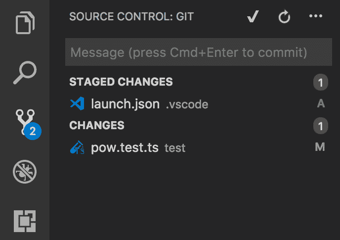

# `ts-node`

TypeScript 社区已经开发了一个 Node.js 的替代版本，它能够像原生支持一样处理 TypeScript 文件。这个 Node.js 的替代版本被称为`ts-node`。

`ts-node`命令允许我们在不先编译的情况下执行 TypeScript 文件。我们可以使用以下命令执行 TypeScript 文件：

```js
    ts-node ./src/main_server.ts  
```

示例应用程序使用 npm `scripts`创建了这个命令的更方便版本：

```js
"scripts": { 
  "ts-node": "ts-node ./src/main_server.ts" 
} 
```

`npm`命令可以按照以下方式执行：

```js
    npm run ts-node  
```

默认情况下，`ts-node`命令会尝试在`tsconfig.json`文件中查找编译设置，并期望它位于当前目录。

当我们想要尝试某事而不必花费太多时间配置像 Webpack 这样的工具时，`ts-node`命令是一个非常方便的工具。

可能会感觉`ts-node`可以原生执行 TypeScript，但这并不是事实。我们的 TypeScript 代码首先被编译，然后使用 Node.js 二进制文件执行。这意味着在 Node.js 生产应用程序中使用`ts-node`是不推荐的，因为我们将会付出性能代价（编译时间）。

# 持续集成（CI）工具

CI 是一种开发实践，有助于防止潜在的集成问题。软件集成问题是指在将单独测试的软件组件组合成一个整体的过程中可能出现的困难。当组件组合成子系统或子系统组合成产品时，软件就实现了集成。

组件可以在所有实现和测试完成后进行集成，就像瀑布模型或大爆炸方法一样。另一方面，CI 要求开发者每天将代码提交到远程代码仓库。然后，每个提交都会通过自动化流程进行验证，使团队能够更早地发现集成问题。

在本章中，我们学习了如何在 GitHub 上创建代码仓库，以及如何使用单元测试和代码检查工具来验证我们的应用程序，但我们还没有配置 CI 服务器来观察我们的提交并相应地运行这些验证。

我们将使用 Travis CI 作为我们的 CI 服务器，因为它与 GitHub 高度集成，并且对开源项目和学习教育项目免费。在选择 CI 服务器时还有许多其他选项，但这些选项超出了本书的范围。

要配置 Travis CI，我们需要访问[`travis-ci.org`](https://travis-ci.org)并使用我们的 GitHub 凭据登录。登录后，我们将能够看到我们公开的 GitHub 仓库列表，并且还可以启用 CI：


为了完成配置，我们需要在我们的应用程序根目录中添加一个名为`travis.yml`的文件，其中包含 Travis CI 配置：

```js
    language: node_js
    node_js:
      - stable

```

还有许多其他可用的 Travis CI 配置选项。请参阅[`docs.travis-ci.com/`](http://docs.travis-ci.com/)了解有关可用选项的更多信息。

完成这两个小配置步骤后，Travis CI 将准备好观察我们远程代码仓库的提交。

我们已经使用配置来向 Travis CI 指示我们的应用程序是一个 Node.js 应用程序。无论其技术栈如何，每种潜在类型的应用程序的 CI 构建都可以高度定制。

然而，在大多数情况下，我们只需使用为给定类型的应用程序设置的默认值。在 Node.js 的情况下，Travis CI 使用`npm install`和`npm test`作为默认命令。

如果构建在本地开发环境中工作，但在 CI 服务器上失败，我们将不得不检查构建错误日志并尝试找出出了什么问题。可能性是，我们环境中的软件版本将领先于 CI 服务器中的版本，我们需要向 Travis CI 指示需要安装或更新依赖项。我们可以在[`docs.travis-ci.com/user/build-configuration/`](http://docs.travis-ci.com/user/build-configuration/)找到 Travis CI 文档，了解如何解决这类问题。

# 框架工具

框架工具用于自动生成项目结构、构建脚本等。以下是一些流行的框架工具的示例：

+   Angular CLI

+   React CLI (create-react-app-typescript)

+   Yeoman

这些工具旨在支持许多类型的项目。框架工具将通过为我们自动生成一些内容来节省我们的时间，例如 webpack 配置或`package.json`文件。

强烈建议花些时间阅读这些工具的文档，以了解更多有关它们现有自定义选项的信息。

请注意，您可以在[`cli.angular.io`](https://cli.angular.io)、[`github.com/wmonk/create-react-app-typescript`](https://github.com/wmonk/create-react-app-typescript)和[`yeoman.io`](http://yeoman.io)分别了解有关 Angular CLI、React CLI 和 Yeoman 的更多信息。

请注意，如果我们不了解代码的功能，让工具为我们生成代码从来不是一个好主意。虽然在未来，你应该考虑使用工具来生成新项目，但在使用框架工具之前，建议先深入了解任务和测试运行器。

# 为什么命令行会获胜？

你可能已经注意到，在本章中，我们大量使用了 CLI 而不是可视化工具。我们使用命令行终端执行了许多任务：

+   与源代码管理协同工作

+   安装依赖

+   运行任务

+   测试我们的代码

+   调试我们的代码

+   创建项目

命令行界面（CLI）一直很受欢迎，但我记得，几年前，我使用一些可视化工具来做这些事情。例如，我记得使用 NUnit 的可视化测试运行器在 .NET 应用程序中运行单元测试（NUnit 是 .NET 应用程序的单元测试库）。你可能想知道为什么我们停止使用可视化工具，又回到了像早期那样的命令行？

我认为 CLI 胜出的主要原因有两个：

+   我们的软件开发团队变得更加多元化

+   我们软件开发的方法论已经向自动化方向发展

我们的软件团队现在更加多元化，因此，遇到由 DevOps 工程师、使用 Linux 发行版的移动软件工程师和 Windows 上工作的网络工程师组成的团队是很常见的。

团队成员可能会使用不同的操作系统，但他们都遵循相同的流程，并且共享一个独特的发展流程。例如，如果团队成员之一想要执行单元测试，可以通过在操作系统控制台中执行命令来实现。我们可以更进一步，也可以将相同的命令作为我们持续集成构建的一部分。

命令行界面（CLI）胜出，因为它使我们的开发团队能够共享一套独特的发展流程和实践。

# 摘要

在本章中，我们学习了如何使用一系列不同的开发工具。在一章中深入探讨这么多工具是不可能的，但现在我们已经了解了基础知识，逐步深入到更高级的使用案例应该会容易得多。

在下一章中，我们将学习使用 Node.js 和 TypeScript 开发后端应用程序。
