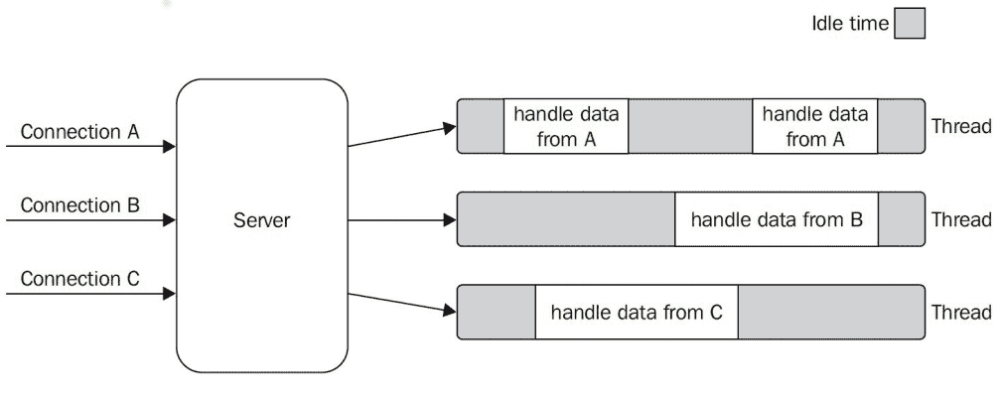
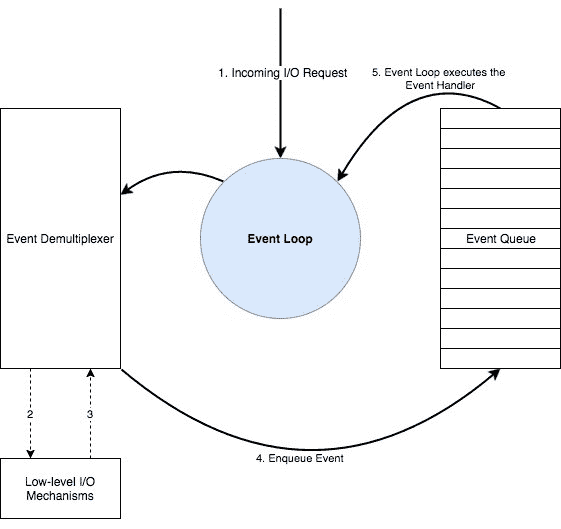
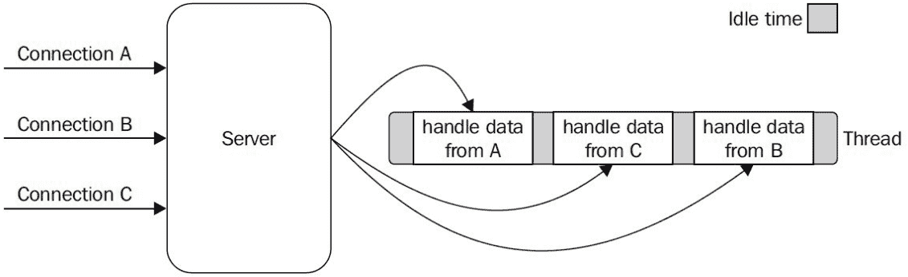
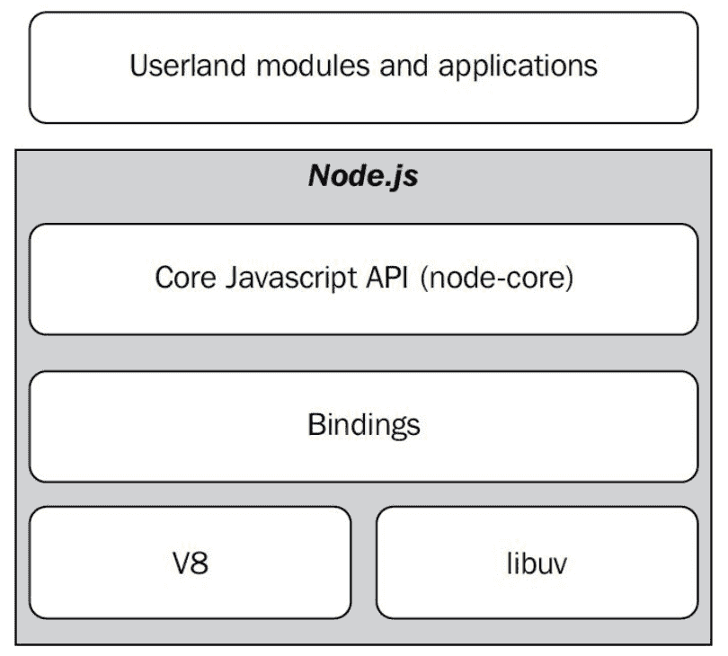
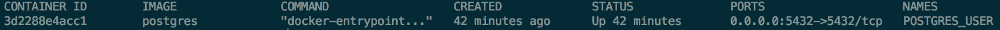

# 第十章：使用 TypeScript 进行 Node.js 开发

在本书的前几章中，我们一直在使用 Node.js 及其生态系统的一些工具，但尚未开发一个 Node.js 应用程序。在本章中，我们将学习如何使用 Node.js 开发应用程序。我们将涵盖以下主题：

+   Node.js 的主要特性

+   Node.js 核心 API 的主要特性

+   使用 Node.js 进行服务器端开发

+   使用 Node.js 开发 REST API

# 理解 Node.js

Node.js 是基于 Chrome 的 V8 JavaScript 引擎构建的 JavaScript 运行时。Node.js 是单线程的，并使用事件驱动的、非阻塞的 I/O 模型，这使得它轻量级且高效。

# 理解非阻塞 I/O

输入或输出操作（I/O）是需要从物理源写入或读取的操作。这包括将文件保存到硬盘驱动器或将文件通过网络发送等操作。

在过去，操作系统只允许我们在所谓的阻塞模型中执行 I/O 操作。在**阻塞模型**中，我们可以在一个线程中运行一个应用程序，但当发生 I/O 请求时，该线程会被阻塞，直到请求完成。

使用阻塞 I/O 实现的 Web 服务器无法使用相同的线程处理多个同时连接。例如，当一个 HTTP 请求到达 Web 服务器时，它可能需要进行一些 I/O 操作（例如，从数据库中读取或通过网络与另一个服务器通信）以向请求的创建者提供响应。如果 Web 服务器使用一个唯一的线程，它将一直被阻塞，直到 I/O 操作完成。因此，如果第二个 HTTP 请求击中服务器，服务器将无法处理它。解决这个问题的方法是为每个 HTTP 请求创建一个新的线程，但这种解决方案不可扩展，因为单个 CPU 无法处理大量线程，而 CPU 是服务器中最昂贵的组件之一。

以下图表展示了阻塞 I/O 模型：



非阻塞 I/O 模型是解决阻塞 I/O 模型限制的方案。在非阻塞模型中，I/O 请求不会阻塞主线程。相反，I/O 事件由一个称为事件分配器的组件收集和排队。Node.js 实现了一种称为反应器模式的模式，它将 JavaScript 事件循环与事件分配器结合起来。

以下图表展示了事件循环与事件分配器之间的交互：



其背后的主要思想是为每个 I/O 操作关联一个处理程序（在 Node.js 中由回调函数表示）。当 I/O 操作完成时，会产生一个事件，并由 JavaScript 事件循环消费，从而调用处理程序。

请参阅第六章，*理解运行时*，以了解更多关于 JavaScript 事件循环和事件处理器工作方式的信息。

如果 Web 服务器使用一个唯一的线程，它将不会在 I/O 操作完成之前被阻塞。因此，如果第二个 HTTP 请求击中服务器，服务器将能够处理它，而无需更多线程。每个 HTTP 请求都会创建 I/O 事件和事件处理器，这些事件处理器存储在内存中，如果服务器被成千上万的 HTTP 请求击中，它仍然可以达到一个极限。然而，并发 HTTP 请求的水平比之前由阻塞 I/O 模型强加的限制要高得多：



Node.js 充分利用了非阻塞 I/O 模型，并在其之上构建了根本，正如我们将在下一节中看到的那样。

# Node.js 的主要组件

现在我们已经了解了非阻塞 I/O 模型的工作原理，我们处于更好的位置来理解 Node.js 的每个内部组件：



# V8

V8 是最初为 Google 的 Chrome 开发的 JavaScript 引擎。它负责解析、解释和执行 JavaScript。

如果你想了解更多关于 V8 的信息，请参阅 V8 文档：[`github.com/v8/v8/wiki`](https://github.com/v8/v8/wiki)。

# Libuv

每个操作系统都有自己的事件解复用器接口，并且每个 I/O 操作的行为可能会根据资源类型的不同而大相径庭，即使在同一操作系统内部。Libuv 是一个 C 库，使 Node.js 与所有主要平台兼容，并规范了不同类型资源的非阻塞行为；如今，libuv 代表了 Node.js 的低级 I/O 引擎。

如果你想了解更多信息，请参阅官方 libuv 文档：[`libuv.org/`](https://libuv.org/) 和 [`docs.libuv.org/en/v1.x/`](http://docs.libuv.org/en/v1.x/)。

# 绑定

绑定是一组库，它以允许我们使用 JavaScript 而不是 C 或 C++代码的方式包装了 V8 和 libuv 的公共 API。

# Node.js 核心 API（node-core）

Node.js 包含一组核心 API 来执行常见操作，例如读取文件、发送 HTTP 请求或加密文本文件。这些 API 在底层使用 V8 和 libuv，但它们并不直接与之通信，而是通过绑定来实现。

请注意，我们将在本章的后面部分学习更多关于 Node.js 核心 API 的内容。

# Node.js 环境与浏览器环境

Node.js 环境和浏览器环境并不相同。例如，浏览器环境包括一个称为 **文档对象模型**（**DOM**）的 API 和一个称为 **浏览器对象模型**（**BOM**）的 API。这些 API 定义了诸如窗口对象或历史 API 等 API。然而，这些 API 在 Node.js 环境中不可用。以下表格突出了 Node.js 环境和 Web 浏览器之间的一些最显著差异：

| **特性** | **Node.js** | **Web 浏览器** |
| --- | --- | --- |
| DOM | 否 | 是 |
| BOM | 否 | 是 |
| 全局变量命名为 window | 否 | 是 |
| 全局变量命名为 global | 是 | 否 |
| require 函数 | 是 | 否 |
| Common JS 模块 | 是 | 否 |
| 访问敏感资源（例如，文件系统） | 是 | 否 |

# Node.js 生态系统

在本节中，我们将探索 Node.js 生态系统。我们将了解 Node.js 能为我们提供什么，以及其整个生态系统遵循的一些重要代码约定。

# Node.js 核心 API

Node.js 核心 API，也称为 node-core，是一组库，它是 Node.js 的一部分，因此当我们安装 Node.js 时，它们会安装到我们的操作系统上。Node.js 核心 API 包括以下模块：

+   `assert`

+   `async_hooks`

+   `buffer`

+   `child_process`

+   `cluster`

+   `crypto`

+   `dgram`

+   `dns`

+   `domain`

+   `events`

+   `fs`

+   `http`

+   `http2`

+   `https`

+   `net`

+   `os`

+   `path`

+   `perf_hooks`

+   `punycode`

+   `querystring`

+   `readline`

+   `repl`

+   `stream`

+   `string_decoder`

+   `tls`

+   `tty`

+   `url`

+   `util`

+   `v8`

+   `vm`

+   `zlib`

如前所述的列表所示，有模块可以与 **域名服务器**（**DNS**）一起工作，处理 HTTP 请求（`http`），或读取和写入硬盘上的文件（`fs`）。涵盖所有这些模块超出了本书的范围。然而，我们将在本章后面使用其中的一些模块。

请注意，您可以通过访问官方 Node.js 文档 [`nodejs.org/docs/`](https://nodejs.org/docs/) 来了解每个模块中每个功能的所有详细信息。

# Node.js 核心 API 的风格

在本章的早期，我们学习了反应器模式和异步 I/O 模型是 Node.js 最基本的特点之一。这应该有助于我们理解为什么回调在 Node.js 核心 API 中被广泛使用。正如我们可以想象的那样，核心 API 对所有其他模块都有直接影响。因此，整个 Node.js 生态系统广泛使用回调。

Node.js 不仅广泛使用回调，而且使用方式非常一致：

+   Node.js 中的回调总是函数的最后一个参数

+   Node.js 中的回调总是将错误作为第一个参数

以下代码片段使用文件系统 API 读取文本文件。`readFile` 函数展示了前面两个规则的实际应用：

```js
import { readFile } from "fs"; 

readFile("./hello.txt", (err, buffer) => { 

    console.log(buffer.toString()); 

}); 
```

关于 Node.js 回调有一些新的规则：

+   函数永远不会抛出错误。错误应该传递给回调。

+   当我们遇到嵌套回调时，如果发生错误，应该将错误传递给顶层回调。

以下代码片段展示了上述规则的实际应用：

```js
function readJson( 
    fileName: string, 
    callback: (err: Error|null, json?: any) => void 
) { 
    readFile(fileName, "utf-8", (err, buffer) => { 
        if (err) { 
            callback(err); 
        } 

        try { 
            const parsed = JSON.parse(buffer); 
            callback(null, parsed); 
        } catch (innerErr) { 
            callback(err); 
        } 
    }); 
} 
```

Node.js 使用回调是因为当它最初实现时，promises、generators 和`async`/`await`在 V8 中是不可用的。这似乎很不幸，因为作为 TypeScript 用户，我们知道使用`async`/`await`而不是回调和 promises 要方便得多。

多亏了 Node.js API 的一致性，我们可以编写一个辅助函数，它接受一个使用基于回调的 API 实现的函数，并返回一个使用基于 promise 的 API 实现的相同函数。实际上，这个函数是`util`核心模块的一部分，可以按照以下方式导入：

```js
import * as util from "util";
const promisify = util.promisify;
```

我们可以使用前面的辅助函数将我们在上一个示例中使用的`readFile`函数转换成一个返回 promise 的函数。新函数被命名为`readFileAsync`。现在函数返回 promise，我们可以使用`async`/`await`：

```js
import { readFile } from "fs"; 

const readFileAsync = promisify(readFile); 

(async () => { 
    const buffer = await readFileAsync("./hello.txt", "utf-8"); 
    console.log(buffer.toString()); 
})(); 
```

以下代码片段展示了如何将第二个示例转换为`async`/`await`风格：

```js
import { readFile } from "fs"; 

const { promisify } = require("util"); 
const readFileAsync = promisify(readFile); 

async function readJson(fileName: string) { 
    try { 
        const buffer = await readFileAsync(fileName, "utf-8"); 
        const parsed = JSON.parse(buffer.toString()); 
        return parsed; 
    } catch (err) { 
        return err; 
    } 
} 
```

在未来，Node.js 将原生支持其核心 API 中的 promises，但到目前为止，使用`promisify`辅助函数是一个不错的选择。

# npm 生态系统

在这本书中我们之前已经使用了 npm，到现在我们应该已经知道如何很好地使用它。npm 生态系统由数千个外部模块组成。我们可以使用官方 npm 网站[`www.npmjs.com/`](https://www.npmjs.com/)来搜索可能帮助我们完成特定任务的包。与作为 Node.js 核心 API 一部分的模块不同，外部`npm`模块需要使用`npm`进行安装：

```js
npm install react 
```

如果模块不被 TypeScript 识别，我们还需要安装其类型定义（如果可用）：

```js
npm install @types/react 
```

请参阅第十三章，*应用性能*，以及第九章，*自动化你的开发工作流程*，以了解 Node.js 生态系统中的其他工具，例如 Node.js 检查器，这是一个允许我们调试和分析我们的 Node.js 应用程序性能的工具。

# 设置 Node.js

要在你的机器上设置 Node.js，你需要访问官方下载页面[`nodejs.org/en/download`](https://nodejs.org/en/download/)并遵循你操作系统的说明。

如果你是一个 OS X 或 Linux 用户，你可以按照 [`github.com/creationix/nvm`](https://github.com/creationix/nvm) 上的说明额外安装 **node 版本管理器** (**nvm**)。这个工具允许我们在同一台机器上安装多个 Node.js 版本，并在几秒钟内切换它们。如果你是一个 Windows 用户，你需要安装 [`github.com/coreybutler/nvm-windows`](https://github.com/coreybutler/nvm-windows/releases) 代替。

如果我们想使用 Node.js 的一个核心 API 模块，我们只需要导入它。我们不需要安装额外的 `npm` 模块。例如，文件系统模块可以用来读取和写入文件以及管理目录。如果我们想使用文件系统 API，我们只需要按照以下方式导入模块：

```js
import * as fs from "fs"; 
```

然而，TypeScript 默认不会识别该模块，因为它不是 JavaScript 规范的一部分。我们可以通过安装 Node.js 类型定义来解决此问题：

```js
npm install @types/node 
```

最后，你可能想安装 `ts-node` 以能够在不先编译的情况下执行使用 TypeScript 实现的 Node.js 应用程序。我们可以使用以下命令分别运行 Node.js 应用程序或 TypeScript 应用程序：

```js
node app.js 

ts-node app.ts 
```

# Node.js 开发

在本节中，我们将探讨几个 Node.js 的实际应用的小型示例。

# 与文件系统一起工作

我们将实现一个非常小的 Node.js 应用程序。这个应用程序可以用作搜索和替换工具。结果可以用作命令行应用程序，并可以使用以下命令执行：

```js
ts-node app.ts --files ./**/*.txt --find SOMETHING --replace SOMETHING_ELSE 
```

该应用程序将在所有匹配的文件中将一个单词替换为另一个单词。我们将使用核心文件系统 API (`fs`) 和两个外部 `npm` 模块：

+   `glob` 用于查找与给定模式匹配的文件

+   `yargs` 用于解析命令行参数

我们需要安装这两个包以及相应的类型定义文件：

```js
npm install glob yargs --save 

npm install @types/glob @types/yargs @types/node -save-dev 
```

让我们看看源代码：

```js
import * as fs from "fs"; 

import * as yargs from "yargs"; 

import glob from "glob"; 

const { promisify } = require("util"); 
```

我们将使用 `promisify` 函数将一些基于回调的 API 转换为基于 Promise 的 API：

```js
const globAsync = promisify(glob); 

const readFileAsync = promisify(fs.readFile); 

const writeFileAsync = promisify(fs.writeFile); 
```

以下函数从命令行读取参数：

```js
function getCommandLineArguments() { 
    const files = yargs.argv.files; 

    if (!files) { 
        throw new Error("Missing argument --files"); 
    } 

    const find = yargs.argv.find; 

    if (!find) { 
        throw new Error("Missing argument --find"); 
    } 

    const replace = yargs.argv.replace; 

    if (!replace) { 
        throw new Error("Missing argument --replace"); 
    } 

    return { 
        pattern: files, 
        find: find, 
        replace: replace 
    }; 
};
```

以下函数验证命令行参数：

```js
function validateCommandLineArguments(args: any) { 

    if (args.pattern === undefined) { 

        throw new Error(`Invalid pattern ${args.pattern}`); 

    } 

    if (args.find === undefined) { 

        throw new Error(`Invalid find ${args.find}`); 

    } 

    if (args.replace === undefined) { 

        throw new Error(`Invalid replace ${args.replace}`); 

    } 

} 
```

以下函数查找与提供的 `glob` 模式匹配的文件路径：

```js
async function findMatchingFilesAsync(pattern: string) { 

    const files = await globAsync(pattern); 

    // We need to let TypeScript that files are an array 

    return files as string[]; 

} 
```

以下函数用于在文件中查找一个单词并将其替换为另一个单词：

```js
async function findAndReplaceAsync( 

    file: string, 

    find: string, 

    replace: string 

) { 

    const buffer = await readFileAsync(file); 

    const originalText = buffer.toString(); 

    // This is a quick way to replace a word in JavaScript 

    const newText = originalText.split(find).join(replace); 

    await writeFileAsync(file, newText, "utf8"); 

} 
```

这个函数是应用程序中的主函数，也是应用程序的入口点。它将工作委托给所有前面的函数：

```js
async function runAsync() { 

    // Read arguments 
    const args = getCommandLineArguments(); 

    // Validate arguments 
    validateCommandLineArguments(args); 

    // Find matching files 
    const files = await findMatchingFilesAsync(args.pattern);  

    // Find and replace 
    files.forEach(async (file) => { 
        await findAndReplaceAsync(file, args.find, args.replace); 
    }); 
} 
```

到目前为止，我们可以调用应用程序的入口点：

```js
(async () => { 
    await runAsync(); 
})(); 
```

# 与数据库一起工作

在本节中，我们将学习如何使用 TypeScript 库 TypeORM 从 Node.js 应用程序与数据库交互。TypeORM 是一个**对象关系映射**（ORM）库。ORM 是一个工具，它允许我们使用对象和方法与数据库交互，而不是使用 SQL 编程语言的任何一种变体。

在我们能够实现一个示例之前，我们需要在我们的开发环境中运行一个 Postgres 数据库服务器。有多种方法可以让服务器启动并运行，但我们将使用 Docker。Docker 是一种虚拟化服务，它允许我们在称为容器的独立虚拟机中运行软件。Docker 容器是 Docker 镜像的一个实例。我们将首先按照官方 Docker 安装指南中的说明安装 Docker 社区版，该指南可以在[`docs.docker.com/install`](https://docs.docker.com/install)找到，然后我们将运行以下命令来下载 Docker Postgres 镜像：

```js
docker pull postgres:9.5 
```

我们可以使用以下命令来查看所有已安装的镜像：

```js
docker images 
```

我们还需要设置一些环境变量。以下命令应该适用于使用 Bash 作为命令行的情况：

```js
export DATABASE_USER=postgres  

export DATABASE_PASSWORD=secret  

export DATABASE_HOST=localhost  

export DATABASE_PORT=5432  

export DATABASE_DB=demo 
```

请注意，如果你使用的是 Windows，你需要使用`setx`命令而不是`export`命令来声明环境变量。你可以在[`docs.microsoft.com/en-us/windows-server/administration/windows-commands/setx`](https://docs.microsoft.com/en-us/windows-server/administration/windows-commands/setx)了解更多关于`setx`命令的信息。

到目前为止，我们可以使用 Postgres 镜像运行一个容器。以下命令使用我们在前一步中声明的环境变量来运行容器：

```js
docker run --name POSTGRES_USER -p "$DATABASE_PORT":"$DATABASE_PORT"   

-e POSTGRES_PASSWORD="$DATABASE_PASSWORD"   

-e POSTGRES_USER="$DATABASE_USER"   

-e POSTGRES_DB="$DATABASE_DB"  

-d postgres 
```

我们可以运行以下命令来查看我们机器上的所有 Docker 容器：

```js
docker ps -a 
```

如果一切顺利，你应该能在你的控制台看到以下类似的内容：



如果你需要重新开始，你可以使用以下命令分别停止和删除 Docker 容器：

```js
docker stop $containerId 

docker rm $containerId 
```

请注意，我们不会深入探讨 Docker 的细节，因为这超出了本书的范围。如果你需要更多帮助，请参考官方 Docker 文档[`docs.docker.com`](https://docs.docker.com)。

到目前为止，我们应该有一个作为 Docker 容器运行的 Postgres 服务器。我们还需要安装一些`npm`模块：

```js
npm install reflect-metadata pg typeorm 
```

`pg`模块被 TypeORM 用来连接到 Postgres 数据库。`reflect-metadata`被 TypeORM 用来读取和写入元数据。在我们的整个应用程序中，只导入一次`reflect-metadata`模块非常重要。

以下代码片段使用 TypeORM 声明了一个名为`Movie`的实体。`Movie`实体将通过 TypeORM 映射到数据库表中。示例还创建了一个数据库连接和一个`Movie`存储库。我们最终使用存储库实例将一部新电影插入电影表，并读取表中匹配 1977 年的电影：

```js
import "reflect-metadata"; 

import { 
    Entity, 
    getConnection, 
    createConnection, 
    PrimaryGeneratedColumn, 
    Column 
} from "typeorm"; 

@Entity() 
class Movie { 
    @PrimaryGeneratedColumn() 
    public id!: number; 
    @Column() 
    public title!: string; 
    @Column() 
    public year!: number; 
} 

const entities = [ 
    Movie 
]; 

const DATABASE_HOST = process.env.DATABASE_HOST || "localhost"; 
const DATABASE_USER = process.env.DATABASE_USER || ""; 
const DATABASE_PORT = 5432; 
const DATABASE_PASSWORD = process.env.DATABASE_PASSWORD || ""; 
const DATABASE_DB = "demo"; 

(async () => {     
    const conn = await createConnection({ 
        type: "postgres", 
        host: DATABASE_HOST, 
        port: DATABASE_PORT, 
        username: DATABASE_USER, 
        password: DATABASE_PASSWORD, 
        database: DATABASE_DB, 
        entities: entities, 
        synchronize: true 
    }); 

    const getRepository = (entity: Function) => conn.getRepository(entity); 
    const movieRepository = conn.getRepository(Movie); 

    // INSERT INTO movies 
    // VALUES ('Star Wars: Episode IV - A New Hope', 1977) 
    await movieRepository.save({ 
        title: "Star Wars: Episode IV - A New Hope", 
        year: 1977 
    }); 

    // SELECT * FROM movies WHERE year=1977 
    const aMovieFrom1977 = await movieRepository.findOne({ 
        year: 1977 
    }); 

    if (aMovieFrom1977) { 
        console.log(aMovieFrom1977.title); 
    } 
})(); 
```

存储库设计模式使用类来封装数据访问逻辑以及数据库与域实体之间的映射。您可以在[`msdn.microsoft.com/en-us/library/ff649690.aspx`](https://msdn.microsoft.com/en-us/library/ff649690.aspx)了解更多关于存储库模式的信息。

最后，我们可以使用`ts-node`运行示例：

```js
ts-node app.ts 
```

请注意，为了使此示例正常工作，环境变量和 Postgres 服务器必须正确配置。

# 与 REST API 一起工作

在本节中，我们将学习如何使用 Node.js 实现一些 REST API。

# Hello world (http)

`http`模块允许我们执行与 HTTP 协议相关的任务。以下代码片段展示了我们如何使用`http`模块实现一个非常基础的 Web 服务器实现：

```js
import * as http from "http"; 
const hostname = "127.0.0.1"; 
const port = 3000; 

const server = http.createServer((req, res) => { 
    res.statusCode = 200; 
    res.setHeader("Content-Types", "text/plain"); 
    res.end("Hello world!"); 
}); 

server.listen(port, hostname, () => { 
    console.log(`Server running at http://${hostname}:${port}/`); 
}); 
```

我们创建了一个将监听所有 HTTP 请求的 Web 服务器。`http`模块允许我们实现我们的 Web HTTP 服务器，但它的抽象级别非常低。在实际应用中，我们更倾向于使用更高抽象级别的工具，例如，不需要我们手动设置响应状态码。Node.js 有多种框架可以为我们提供对 HTTP 协议的更高抽象级别。在下一节中，我们将学习如何使用其中之一：Express.js。

# Hello world (Express.js)

Express.js 是一个为服务器端 Web 应用程序实现而设计的框架。要使用 TypeScript 与 Express 一起使用，我们需要以下`npm`模块：

```js
npm install @types/node @types/express -save-dev 

npm install express --save 
```

以下示例实现了一个与前面章节中实现的应用程序行为几乎相同的应用程序，但这次我们使用 Express.js 而不是`http core`模块：

```js
import express from "express"; 

const port = 3000; 
const app = express(); 

app.get("/", (req, res) => { 
    res.send("Hello World!"); 
}); 

app.listen(port, () => { 
    console.log(`Server running at http://127.0.0.1:${port}/`); 
}); 
```

如我们所见，即使在前面提到的简单示例中，使用 Express，有时我们不需要处理一些低级细节，例如设置响应状态码。

# 使用 Express 进行路由

在前面的章节中，我们学习了如何声明一个路由；然而，随着我们的应用程序增长，我们将需要实现一些路由组织策略。Express 允许我们创建多个路由器实例并将它们作为树状数据结构嵌套。以下代码片段演示了如何创建两个处理不同类型实体（`movies`和`directors`）的路由器；然后这两个路由器被 Express 应用程序使用：

```js
import express from "express"; 

const moviesRouter = express.Router(); 

// URL "/api/v1/movies" + "/" 
moviesRouter.get("/", (req, res) => { 
    res.send("Hello from movies!"); 
}); 

const directorsRouter = express.Router(); 

// URL "/api/v1/directors" + "/" 
directorsRouter.get("/", (req, res) => { 
    res.send("Hello from directors!"); 
}); 

const port = 3000; 
const app = express(); 

app.use("/api/v1/movies", moviesRouter); 
app.use("/api/v1/directors", directorsRouter); 

app.listen(port, () => { 
    console.log(`Server running at http://127.0.0.1:${port}/`); 
}); 
```

当我们运行前面的示例时，有两个路由可用：

+   `http://localhost:3000/api/v1/directors`

+   `http://localhost:3000/api/v1/directors`

# Express 中间件

Express 还允许我们声明一个中间件函数。中间件函数允许我们实现横切关注点。横切关注点是一个影响整个应用程序或其子集的要求。横切关注点的常见例子是日志记录和授权。

中间件函数接受当前请求和响应作为参数，以及一个名为`next`的函数：

```js
const middlewareFunction = ( 
    req: express.Request, 
    res: express.Response, 
    next: express.NextFunction 
) => { 
    next(); 
}; 
```

我们可以链式调用中间件函数，而`next`函数则是用来通知 Express 中间件已完成其任务，可以调用下一个中间件。当没有更多的中间件函数可用时，路由处理程序将被调用。

以下代码片段声明了两个中间件函数。第一个中间件函数（`timerMiddleware`）在每次 HTTP 请求击中服务器时被调用一次。第二个中间件函数（`loggerMiddleware`）在每次 HTTP 请求击中`http://localhost:3000`端点时被调用一次：

```js
import express from "express"; 

const port = 3000; 
const app = express();  

const timerMiddleware = ( 
    req: express.Request, 
    res: express.Response, 
    next: express.NextFunction 
) => { 
    console.log(`Time: ${Date.now()}`); 
    next(); 
}; 

const loggerMiddleware = ( 
    req: express.Request, 
    res: express.Response, 
    next: express.NextFunction 
) => { 

    console.log(`URL: ${req.url}`); 
    next(); 
}; 

// Application level middleware 
app.use(timerMiddleware); 

// Route level middleware 
app.get("/", loggerMiddleware, (req, res) => { 
    res.send("Hello World!"); 
}); 

app.listen(port, () => { 
    console.log(`Server running at http://127.0.0.1:${port}/`); 
}); 
```

当我们执行前面的示例时，以下路由变得可用：`http://localhost:3000`。当 HTTP 请求击中前面的 URL 时，响应是`Hello world!`，控制台显示之前声明的两个中间件函数生成的输出：

```js
URL: / 
Time: 1520354128960 
```

# 构建 Node.js 应用程序——MVC 设计模式

构建 Node.js 应用程序是一个非常广泛的话题，可能需要一本整本书来单独讲述。然而，我们将介绍最常用的设计模式之一，即 MSDN 定义的**模型-视图-控制器**（**MVC**）设计模式，如下所示：

MVC 框架包括以下组件：

+   `模型`：模型对象是应用程序中实现应用程序数据域逻辑的部分。通常，模型对象从数据库检索和存储模型状态。例如，一个`Product`对象可能会从数据库检索信息，对其进行操作，然后将更新后的信息写回到数据库中的`Products`表。在小型应用程序中，模型通常是概念上的分离，而不是物理上的分离。例如，如果应用程序只读取数据集并将其发送到视图，则应用程序没有物理模型层和相关类。在这种情况下，数据集承担了模型对象的角色。

+   `视图`：视图是显示应用程序的**用户界面**（**UI**）的组件。通常，此 UI 由模型数据创建。一个例子是显示文本框、下拉列表和复选框的`Products`表的编辑视图，这些控件基于`Product`对象当前的状态。

+   `控制器`：控制器是处理用户交互、与模型协同工作并最终选择一个视图以显示 UI 的组件。在 MVC 应用中，视图仅显示信息；控制器处理并响应用户输入和交互。例如，控制器处理查询字符串值并将这些值传递给模型，模型随后可能使用这些值来查询数据库。

MVC 设计模式可以在后端和前端中实现。然而，在本节中，我们将它在后端实现。

请注意，为了能够无问题地运行此示例，您必须首先使用 `npm install` 从配套源代码中的 `chapter_10` 文件夹安装所有依赖项。然后您可以打开 `09_mvc`。

# 模型

我们的模式将包含两层。我们将实现一个实体和一个仓库。实体是使用 TypeORM 实现的：

```js
import { 
    Entity, 
    PrimaryGeneratedColumn, 
    Column 
} from "typeorm"; 

@Entity() 
export class Movie { 
    @PrimaryGeneratedColumn() 
    public id!: number; 
    @Column() 
    public title!: string; 
    @Column() 
    public year!: number; 
} 
```

# 仓库

仓库也是使用 TypeORM 实现的：

```js
import { getConnection } from "typeorm"; 

import { Movie } from "../entities/movie"; 

export function getRepository() { 
    const conn = getConnection(); 
    const movieRepository = conn.getRepository(Movie); 
    return movieRepository; 
} 
```

# 控制器

控制器使用模型（实体 + 仓库），并且它是使用我们在本章早期探索的 Express 路由技术实现的。

我们将声明路由以获取所有电影、按年份过滤电影以及创建一部新电影。示例还使用 `req.params` 来访问请求参数年份。

重要的是要注意，我们可以使用 `get` 方法来声明 HTTP GET 请求的路由处理程序，而我们可以使用 `post` 方法来声明 HTTP POST 请求的路由处理程序：

```js
import { Router } from "express"; 

import { getRepository } from "../repositories/movie_repository"; 

const movieRouter = Router(); 
movieRouter.get("/", function (req, res) { 
    const movieRepository = getRepository(); 
    movieRepository.find().then((movies) => { 
        res.json(movies); 
    }).catch((e: Error) => { 
        res.status(500); 
        res.send(e.message); 
    }); 
}); 

movieRouter.get("/:year", function (req, res) { 
    const movieRepository = getRepository(); 
    movieRepository.find({ 
        year: req.params.year 
    }).then((movies) => { 
        res.json(movies); 
    }).catch((e: Error) => { 
        res.status(500); 
        res.send(e.message); 
    }); 
}); 

movieRouter.post("/", function (req, res) { 
    const movieRepository = getRepository(); 
    const newMovie = req.body; 
    if ( 
        typeof newMovie.title !== "string" || 
        typeof newMovie.year !=== "number" 
    ) { 
        res.status(400); 
        res.send(`Invalid Movie!`); 
    } 

    movieRepository.find(newMovie).then((movie) => { 
        res.json(movie); 
    }).catch((e: Error) => { 
        res.status(500); 
        res.send(e.message); 
    }); 
}); 

export { movieRouter }; 
```

# 数据库

在我们的仓库中，我们使用了 TypeORM 的 `getConnection` 函数。在我们调用此函数之前，我们需要确保已创建了一个连接。以下函数用于稍后创建数据库连接：

```js
import { createConnection } from "typeorm"; 

import { Movie } from "./entities/movie"; 

export async function getDbConnection() { 
    const DATABASE_HOST = process.env.DATABASE_HOST || "localhost"; 
    const DATABASE_USER = process.env.DATABASE_USER || ""; 
    const DATABASE_PORT = 5432; 
    const DATABASE_PASSWORD = process.env.DATABASE_PASSWORD || ""; 
    const DATABASE_DB = "demo"; 

    const entities = [ 
        Movie 
    ]; 

    const conn = await createConnection({ 
        type: "postgres", 
        host: DATABASE_HOST, 
        port: DATABASE_PORT, 
        username: DATABASE_USER, 
        password: DATABASE_PASSWORD, 
        database: DATABASE_DB, 
        entities: entities, 
        synchronize: true 
    }); 

    return conn; 

} 
```

# 视图

因为我们在实现 REST 服务，我们没有数据表示层。REST API 可以完全与网络用户界面解耦。我们不会在本章学习如何实现表示层，因为这个主题将在接下来的章节中介绍。

# 索引

索引文件是应用程序的入口点。入口点创建一个新的 Express 应用和一个数据库连接。然后它将控制器路由连接到 Express 应用并启动网络服务器：

```js
import "reflect-metadata"; 

import express from "express"; 

import { getDbConnection } from "./db"; 

import { movieRouter } from "./controllers/movie_controller"; 

(async () => { 
    await getDbConnection();
    const port = 3000; 
    const app = express(); 
    app.use("/api/v1/movies", movieRouter); 
    app.listen(port, () => { 
        console.log(`Server running at http://127.0.0.1:${port}/`) 
    }); 
})(); 
```

# 使用 inversify-express-utils 的控制器和路由

在本书的早期部分，我们学习了使用 InversifyJS 进行依赖注入和依赖反转。在本节中，我们将学习如何结合使用 InversifyJS 和 Express，利用一个名为 `inversify-express-utils` 的辅助 `npm` 模块。我们需要安装 `inversify` 和 `inversify-express-utils`：

```js
npm install inversify inversify-express-utils 
```

请注意，为了能够无问题地运行此示例，您必须首先使用 `npm install` 从配套源代码中的 `chapter_10` 文件夹安装所有依赖项。然后您可以打开 `10_inversify_express_utils` 文件夹。

# 模型、仓库、数据库和视图

我们可以重用前面示例中用于模型、仓库、数据库和视图的 100% 的代码。

# 类型

我们需要声明一些用于 InversifyJS 类型绑定的标识符。如果你不知道类型绑定是什么，你应该回到第五章，*与依赖项一起工作*，以了解 InversifyJS 的基础知识。我们将为 `MovieRepository` 类声明一个绑定：

```js
export const TYPE = { 
    MovieRepository: Symbol("MovieRepository") 
}; 
```

# 控制器

InversifyJS Express 工具允许我们使用所谓的声明式路由来声明控制器。我们不需要声明 `Router` 实例，而是可以使用一些装饰器来注解控制器类。装饰器生成的元数据随后将由 InversifyJS express 工具用于为我们生成 `Router` 实例。

以下示例使用了以下装饰器：

+   `@controller(path)`: 它用于声明路由的路径

+   `@inject(type)`: 它用于将依赖项注入到类中

+   `@httpGet(subpath)`: 它用于声明 HTTP GET 请求的路由处理器

+   `@httpPost(subpath)`: 它用于声明 HTTP POST 请求的路由处理器

+   `@response()`: 它用于将响应对象作为参数传递给路由处理器

+   `@requestParam(paramName)`: 它用于将请求参数作为参数传递给路由处理器

+   `@requestBody()`: 它用于将请求体作为参数传递给路由处理器

InversifyJS Express 工具的另一个有趣特性是我们可以使用 `async` 方法。InversifyJS 将自动检测我们的方法是否是 `async`，并在需要时使用 `await`：

```js
import express from "express"; 

import { inject } from "inversify"; 

import { 
    controller, 
    httpGet, 
    httpPost, 
    response, 
    requestParam, 
    requestBody 
} from "inversify-express-utils"; 

import { Repository } from "typeorm"; 

import { Movie } from "../entities/movie"; 

import { TYPE } from "../constants/types"; 

@controller("/api/v1/movies") 
export class MovieController { 
    private readonly _movieRepository: Repository<Movie>; 
    public constructor( 
        @inject(TYPE.MovieRepository)movieRepository: Repository<Movie> 
    ) { 
        this._movieRepository = movieRepository; 
    } 
    @httpGet("/") 
    public async get( 
        @response() res: express.Response 
    ) { 

        try { 
            return await this._movieRepository.find(); 
        } catch(e) { 
            res.status(500); 
            res.send(e.message); 
        } 
    } 

    @httpGet("/:year") 
    public async getByYear( 
        @response() res: express.Response, 
        @requestParam("year") yearParam: string 
    ) { 

        try { 
            const year = parseInt(yearParam); 
            return await this._movieRepository.find({ 
                year 
            }); 
        } catch(e) { 
            res.status(500); 
            res.send(e.message); 
        } 
    } 

    @httpPost("/") 
    public async post( 
        @response() res: express.Response, 
        @requestBody() newMovie: Movie 
    ) { 

        if ( 
            typeof newMovie.title !== "string" | 
            typeof newMovie.year !== "number" 
        ) { 
            res.status(400); 
            res.send(`Invalid Movie!`); 
        } 

        try { 
            return await this._movieRepository.save(newMovie); 
        } catch(e) { 
            res.status(500); 
            res.send(e.message); 
        } 
    } 
} 
```

# InversifyJS 配置

我们将声明一些类型绑定。我们将使用 `AsyncContainerModule` 来声明类型绑定，因为我们需要等待数据库连接就绪。我们将为 `MovieRepository` 声明一个绑定。我们不需要为 `MovieController` 声明绑定，因为 `@controller(path)` 注解会为我们创建它。然而，我们需要导入控制器以确保装饰器被执行，从而声明绑定：

```js
import { AsyncContainerModule } from "inversify"; 

import { Repository, Connection } from "typeorm"; 

import { Movie } from "./entities/movie"; 

import { getDbConnection } from "./db"; 

import { getRepository } from "./repositories/movie_repository"; 

import { TYPE } from "./constants/types"; 

export const bindings = new AsyncContainerModule(async (bind) => { 
    await getDbConnection(); 
    await require("./controllers/movie_controller"); 
    bind<Repository<Movie>>(TYPE.MovieRepository).toDynamicValue(() => { 
        return getRepository(); 
    }).inRequestScope(); 
}); 
```

# 索引

索引文件也有所不同。我们不需要创建一个新的 *Express* 应用，而是需要创建一个新的 *InversifyExpressServer* 应用。`InversifyExpressServer` 构造函数需要一个 `Container` 实例。容器的类型绑定在绑定对象中声明，该对象是 `AsyncContainerModule` 的一个实例：

```js
import "reflect-metadata"; 

import { Container } from "inversify"; 

import { InversifyExpressServer } from "inversify-express-utils"; 

import { bindings } from "./inversify.config"; 

(async () => { 
    const port = 3000; 
    const container = new Container(); 
    await container.loadAsync(bindings); 
    const app = new InversifyExpressServer(container); 
    const server = app.build(); 
    server.listen(port, () => { 
        console.log(`Server running at http://127.0.0.1:${port}/`) 
    }); 
})(); 
```

请参阅第五章，*与依赖项一起工作*，以了解更多关于 InversifyJS 的依赖注入和依赖反转。

请参阅[`github.com/inversify/inversify-express-utils`](https://github.com/inversify/inversify-express-utils) 上的官方 InversifyJS express 工具以了解更多信息。

# Node.js 的其他应用

开发命令行应用程序或 REST API 并不是 Node.js 的唯一实际应用。例如，我们可以使用 Electron 开发桌面应用程序。Node.js 也常被用作反向代理，并驱动许多 Web 开发工具。

# 概述

在本章中，我们学习了 Node.js 作为平台的主要特性和其主要组件。我们还了解了一些关于 Node.js 生态系统以及我们可以使用它创建的应用类型。

在本章的结尾，我们实现了一个非常小的 REST API。在接下来的两个章节中，我们将学习如何使用 TypeScript 创建基于 Web 的用户界面，以消费这些 API。
