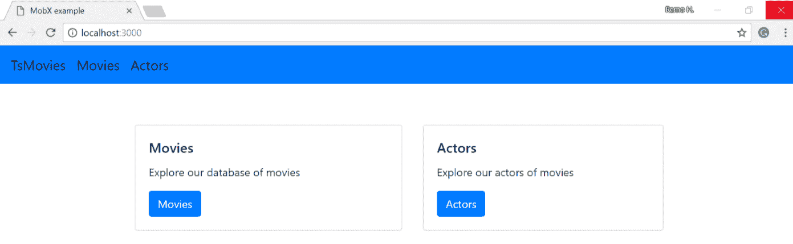
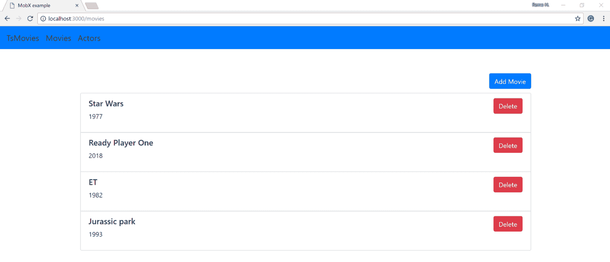
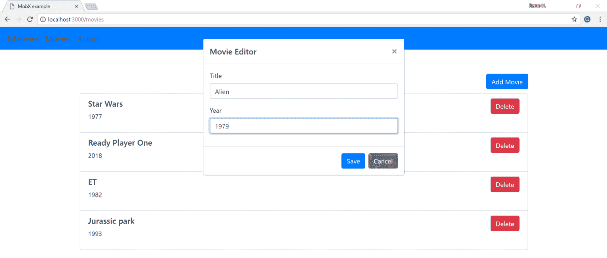
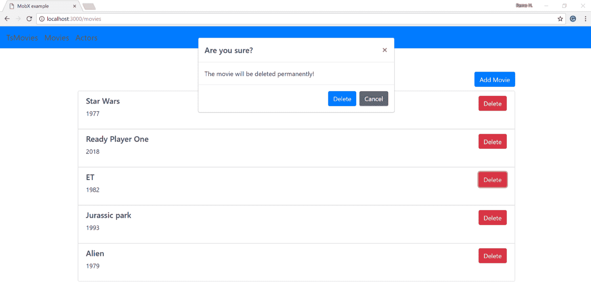
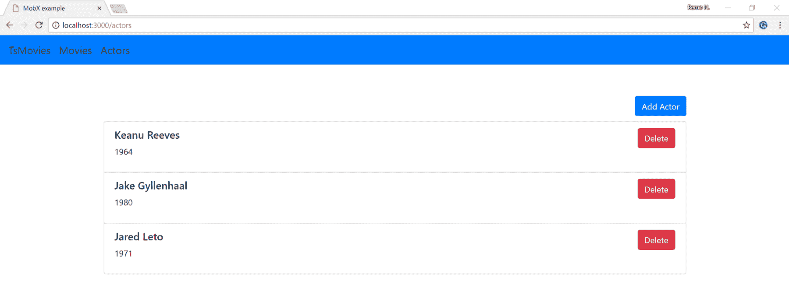
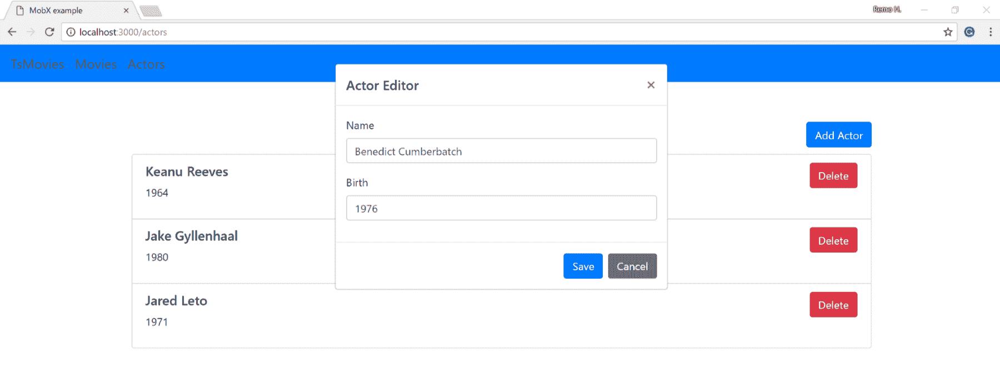
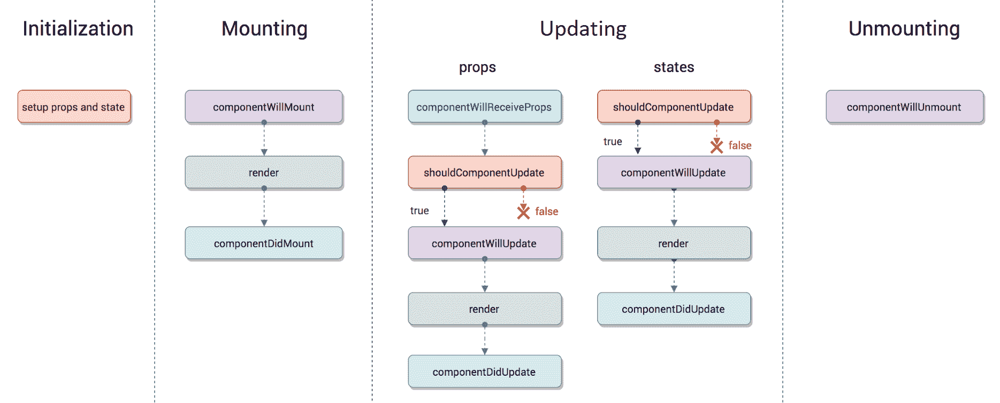
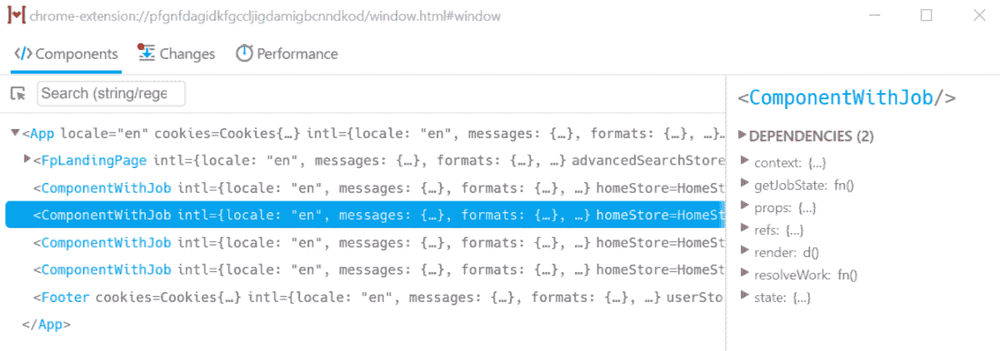

# 使用 React 和 TypeScript 进行前端开发

在上一章中，我们学习了如何使用 Node.js 实现 Web 服务。在本章中，我们将学习如何实现一个**单页应用程序**（SPA），该应用程序消费我们在上一章中创建的 Web 服务。Web 服务在本章中可能会有所变化，但这些变化应该足够小，不需要在本章中详细说明。

伴随的源代码包括我们在上一章中实现的后端应用程序的更新版本。新的升级版本包含新的控制器和 Web 服务，使我们能够管理电影和演员的目录，而不仅仅是电影。

在本章中，我们将学习如何从 React 应用程序中消费 Web 服务，以及我们如何使用 React 组件在 Web 用户界面中显示从后端获取的数据。我们还将学习如何使用`react-router`实现客户端路由，以及如何使用 MobX 实现智能组件。

# 与 React 一起工作

React 是一个允许我们实现 Web 用户界面的库。在本章中，我们将使用 React 和 MobX 创建一个小型前端应用程序。前端 Web 应用程序与 Node.js 后端 Web 应用程序有很大不同。确实，Web 浏览器和 Node.js 都可以原生理解 JavaScript，但环境却大不相同。例如，在 Node.js 环境中，我们可以访问系统资源，如文件系统，并且可以原生使用 CommonJS 模块。另一方面，在 Web 浏览器中，我们无法访问像文件系统这样的资源，并且 CommonJS 模块不支持原生。此外，前端 Web 应用程序的性能极其受其加载时间的影响。这意味着在 Web 前端应用程序中，我们必须特别注意 HTTP 请求的数量和通过网络加载的内容的大小。

当我们在前端 Web 应用程序上工作时，由于原生模块支持不足和需要大小优化，因此需要一个模块打包器。在整个本书中，我们一直在使用 Webpack 作为我们的模块打包器，在本章中我们也将再次这样做。

我们将使用以下 Webpack 配置：

```js
const { CheckerPlugin } = require("awesome-typescript-loader"); 
const webpack = require("webpack"); 
const ExtractTextPlugin = require("extract-text-webpack-plugin"); 
const CopyWebpackPlugin = require("copy-webpack-plugin"); 

const corePlugins = [ 
    new CheckerPlugin(), 
    new webpack.DefinePlugin({ 
        "process.env.NODE_ENV": JSON.stringify(process.env.NODE_ENV || "development") 
    }), 
    new ExtractTextPlugin({ 
        filename: "main.css", 
        allChunks: true 
    }), 
    new CopyWebpackPlugin([ 
        { from: "./web/frontend/index.html", to: "index.html" } 
    ]) 
]; 

const devPlugins = []; 

const prodPlugins = [ 
    new webpack.optimize.UglifyJsPlugin({ output: { comments: false } }) 
]; 

const isProduction = process.env.NODE_ENV === "production"; 
const plugins = isProduction ? corePlugins.concat(prodPlugins) : corePlugins.concat(devPlugins); 

module.exports = { 
    entry: "./web/frontend/index.tsx", 
    devServer: { 
        inline: true 
    }, 
    output: { 
        filename: "bundle.js", 
        path: __dirname + "/public", 
        publicPath: "/public" 
    }, 
    devtool: isProduction ? "source-map" : "eval-source-map", 
    resolve: { 
        extensions: [".webpack.js", ".ts", ".tsx", ".js"] 
    }, 
    module: { 
        rules: [ 
            { 
                enforce: "pre", 
                test: /.js$/, 
                loader: "source-map-loader", 
                exclude: [/node_modules/] 
            }, 
            { 
                test: /.(ts|tsx)$/, 
                loader: "awesome-typescript-loader", 
                exclude: [/node_modules/] 
            }, 
            { 
                test: /.scss$/, 
                use: ExtractTextPlugin.extract({ 
                    fallback: "style-loader", 
                    use: ["css-loader", "resolve-url-loader", "sass-loader"] 
                }) 
            } 
        ] 
    }, 
    plugins: plugins 
}; 
```

我们使用了一些插件将 SCSS 文件编译成一个唯一的 CSS 文件，并将 HTML 文件复制到构建输出目录（`public`目录）。如果构建成功，我们应该在`public`目录下得到三个文件：`index.html`、`bundle.js`和`main.css`。

请参阅第九章，*自动化你的开发工作流程*，以了解更多关于 Webpack 的信息。

# 关于示例应用程序

伴随源代码中包含的相同应用程序是一个非常小的 Web 应用程序，允许我们管理电影和演员的数据库。应用程序将被分为两个主要单元：页面和组件。在本节中，我们将了解应用程序中使用的每个页面和组件。

*主页* 允许我们访问 Movies 和 Actors 页面。主页使用 Layout、Header、Container、Row、Column、Card、Card image 和 Link 组件：



Movies 页面允许我们查看数据库中现有的电影列表，以及添加和删除电影，并使用 Layout、Header、Container、Row、Column、Modal、Button、Text field 和 List Group 组件：



以下截图显示了当 Movie 编辑器处于活动状态时的页面外观：



以下截图显示了当我们尝试删除一部电影时的页面外观：



Actors 页面允许我们查看数据库中现有的演员列表，以及添加和删除演员，并使用 Layout、Header、Container、Row、Column、Modal、Button、Text field 和 List Group 组件：



创建或删除一个演员几乎与创建或删除一部电影相同。以下截图显示了当 Actor 编辑器处于活动状态时的页面外观：



如您在前面的截图中所见，多个页面可以消耗相同的 React 组件。组件的可复用性是 React 作为用户界面开发库的主要优势之一。React 允许我们开发可复用的 *工作单元*，称为组件，这些组件可以在多个应用程序中重复使用。

伴随源代码中包含的示例应用程序实现了一个后端和前端 Web 应用程序，并使用了以下依赖项：

```js
"dependencies": {
    "body-parser": "1.18.2",
    "bootstrap": "4.0.0",
    "express": "4.16.2",
    "inversify": "4.11.1",
    "inversify-binding-decorators": "3.2.0",
    "inversify-express-utils": "5.2.1",
    "inversify-inject-decorators": "3.1.0",
    "mobx": "4.1.0",
    "mobx-react": "5.0.0",
    "pg": "7.4.1",
    "react": "16.2.0",
    "react-dom": "16.2.0",
    "react-router-dom": "4.2.2",
    "reflect-metadata": "0.1.12",
    "typeorm": "0.1.14"
  },
  "devDependencies": {
    "@types/body-parser": "1.16.8",
    "@types/express": "4.11.1",
    "@types/node": "9.4.6",
    "@types/react": "16.0.40",
    "@types/react-dom": "16.0.4",
    "@types/react-router-dom": "4.2.5",
    "awesome-typescript-loader": "3.4.1",
    "copy-webpack-plugin": "4.5.1",
    "css-loader": "0.28.8",
    "extract-text-webpack-plugin": "3.0.2",
    "node-sass": "4.7.2",
    "resolve-url-loader": "2.2.1",
    "sass-loader": "6.0.6",
    "style-loader": "0.19.1",
    "ts-node": "5.0.1",
    "tslint": "5.9.1",
    "typescript": "2.8.1",
    "webpack": "3.10.0",
    "webpack-dev-server": "2.11.0"
  } 
```

我们还将使用以下 npm 脚本命令实现一个非常基本的编译管道：

```js
"scripts": { 
    "start": "ts-node ./web/backend/index.ts", 
    "build": "webpack", 
    "lint": "tslint --project tsconfig.json -c tslint.json ./web/**/*.ts ./web/**/*.tsx" 
  }, 
```

我们可以使用以下 `npm` 命令使用前面的命令：

```js
    npm run start
    npm run build
    npm run lint
```

要运行应用程序，我们首先必须运行构建命令，这将构建我们的前端应用程序并将其转换为位于名为 `public` 的目录下的捆绑 JavaScript 和 CSS 文件。然后，我们可以使用 `npm run start` 命令运行应用程序。Node.js 服务器将开始监听我们的 API 调用。Node.js 还将提供 `public` 目录下的文件，正如我们将在下一节中看到的那样。

# 使用 Node.js 提供 React 应用程序

在本章中，我们将尽量避免对现有的 Node.js 后端进行修改。控制器声明的一些网络服务已经引入了变化。我们不会在本章中花费时间详细说明这些变化，因为它们是微不足道的。

然而，我们将关注在 Express.js 配置中的一些变化，这些变化是必要的，以便在 public 目录下提供 JavaScript 和 CSS 文件。如果我们想让我们的 Express.js 应用程序提供前端应用程序的静态文件，我们需要配置所谓的**静态中间件**。

以下代码片段包含了应用程序入口点的全部源代码：

```js
import "reflect-metadata"; 
import * as express from "express"; 
import { Container } from "inversify"; 
import * as bodyParser from "body-parser"; 
import * as path from "path"; 
import { InversifyExpressServer } from "inversify-express-utils"; 
import { bindings } from "./inversify.config"; 

(async () => { 

    try { 

        const port = 3000; 
        const container = new Container(); 
        await container.loadAsync(bindings); 
        const app = new InversifyExpressServer(container); 

        app.setConfig((a) => { 
            a.use(bodyParser.json()); 
            a.use(bodyParser.urlencoded({ extended: true })); 
            const appPath = path.join(__dirname, "../../public"); 
            a.use("/", express.static(appPath)); 
        }); 

        const server = app.build(); 

        server.listen(port, () => { 
            console.log(`Server running at http://127.0.0.1:${port}/`); // tslint:disable-line 
        }); 

    } catch (e) { 
        console.log(e); // tslint:disable-line 
    } 

})(); 
```

上述代码片段创建了一个新的 Express.js 应用程序。这里的关键点是关注对`setConfig`方法的调用。我们已经配置了 Express.js 静态中间件，以便在调用默认路径（`"/"`）时提供位于`public`目录下的所有文件。这意味着如果我们使用`npm start`运行应用程序，并访问`http://127.0.0.1:3000/`，则位于`public`目录下的`index.html`文件将被提供。然后，`index.html`文件将请求 JavaScript 和 CSS 文件；这些文件也位于`public`目录下，可以通过`http://127.0.0.1:3000/main.css`和`http://127.0.0.1:3000/bundle.js`分别访问。

请注意，我们还配置了应用程序使用 body-parser 中间件。这是为了能够解析 HTTP 请求体中包含的 JSON 数据。如果您需要关于 Node.js 和 Express.js 的额外帮助，请参阅第十章，*使用 TypeScript 进行 Node.js 开发*。

# 与 react-dom 和 JSX 一起工作

现在我们知道了如何使用 Webpack 构建我们的前端应用程序，以及如何使用 Express.js 提供其静态文件，我们可以专注于 React 应用程序的代码。我们将从检查前端应用程序的入口点开始。应用程序的入口点位于`/web/frontend/index.tsx`。

如您所见，我们使用了.tsx 文件扩展名而不是.ts 扩展名。这是因为我们将使用一个名为 JSX 的模板系统。TypeScript 原生支持 JSX，但它要求我们使用.tsx 文件扩展名，并在我们的`tsconfig.json`文件中配置 JSX 设置：

```js
"jsx": "react" 
```

JSX 设置决定了 TypeScript 是否应该将 JSX 代码编译成 JavaScript，或者由外部工具编译。在这种情况下，我们正在努力将 JSX 设置设置为`react`，这意味着 JSX 代码将由 TypeScript 编译成 JavaScript。

应用程序的入口点使用 `react-dom` 模块来渲染应用程序的根组件。在此阶段，我们还不了解 React 组件是什么。然而，我们目前不需要深入了解。我们只需要理解的是，`Layout` 变量是一个 React 组件，并且它使用 `react-dom` 库的 `render` 方法渲染到一个 HTML 元素中。

我们使用 `querySelector` 在 `index.html` 文件中查找现有的 DOM 元素，然后使用 `render` 函数将 `Layout` 组件的输出渲染到选定的 DOM 元素中：

```js
import "reflect-metadata"; 
import * as React from "react"; 
import * as ReacDOM from "react-dom"; 
import "../../node_modules/bootstrap/scss/bootstrap.scss"; 
import { Layout } from "./config/layout"; 

const selector = "#root"; 
const $element = document.querySelector(selector); 

if (!$element) { 
    throw new Error(`Node ${selector} not found!`); 
} else { 
    ReacDOM.render( 
        <Layout/>, 
        $element 
    ); 
} 
```

`render` 函数的第一个参数是一个 JSX 元素。正如你所见，JSX 语法与 HTML 语法非常相似，然而它有一些我们在本章余下的部分将探讨的不同之处。

还值得一提的是，前面的文件也导入了整个前端应用程序所需的某些文件。例如，该文件导入了 `bootstrap.css` 和 `reflect-metadata` 模块。第一个文件包含应用程序中 React 组件所需的 CSS，而 `reflect-metadata` 模块声明了实现某些组件中依赖注入所需的 polyfill。

# 使用 react-router

在上一节中，我们学习了如何使用来自 `react-dom` 模块的 `render` 方法来渲染 `Layout` 组件。在本节中，我们将更深入地研究 `Layout` 组件。

如下面的代码片段所示，`Layout` 组件是一个返回一系列嵌套 JSX 元素的函数；其中一些 JSX 元素是其他 React 组件（例如 `BrowserRouter`、`Header` 和 `Switch` 组件）。这是我们第一次看到 React 组件的实际实现。在这种情况下，一个 React 组件是一个返回一些 JSX 的函数。然而，重要的是要提到这并不总是如此，因为组件也可以是一个类。

React 是一个基于组件的前端开发框架。这意味着在 React 中，一切都是组件。我们的应用程序是一个组件，应用程序内的页面是组件，每个页面中的元素也是组件。

`Layout` 组件是应用程序的根组件。`Layout` 组件始终在屏幕上渲染。然而，应用程序内的页面作为 `Layout` 组件的子组件有条件地渲染。

`Layout` 组件使用 `react-router` 模块在我们的 React 应用程序中实现路由。`react-router` 模块包括以下 React 组件：

+   `BrowserRouter` 模块用于为其他组件提供访问实现客户端导航所需的某些浏览器 API（例如 History API）的权限。

+   `Switch` 组件允许我们定义应用程序中可用的路由。

+   `Route` 组件允许我们在应用程序中定义路由。`Route` 组件接受 `path` 和 `component` 作为属性。当浏览器 URL 与其中一个路由匹配时，相应的组件将被渲染。

+   `Link` 组件不是由 `Layout` 组件直接使用的。然而，它是用来声明指向现有路由之一的链接的组件。

以下代码片段展示了 `Layout` 组件如何声明三个不同的路由：

```js
import { Route, Switch, BrowserRouter } from "react-router-dom"; 
import * as React from "react"; 
import { Header } from "../components/header_component"; 
import { HomePage } from "../pages/home_page"; 
import { MoviePage } from "../pages/movies_page"; 
import { ActorPage } from "../pages/actors_page"; 
import "../stores/movie_store"; 
import "../stores/actor_store"; 

export const Layout = () => ( 
    <BrowserRouter> 
        <div> 
            <Header 
                bg="primary" 
                title="TsMovies" 
                rootPath="/" 
                links={[ 
                    { path: "/movies", text: "Movies"}, 
                    { path: "/actors", text: "Actors"} 
                ]} 
            /> 
            <main style={{ paddingTop: "60px" }}> 
                <Switch> 
                    <Route exact path="/" component={HomePage}/> 
                    <Route path="/movies" component={MoviePage}/> 
                    <Route path="/actors" component={ActorPage}/> 
                </Switch> 
            </main> 
        </div> 
    </BrowserRouter> 
); 
```

正如我们已经提到的，`Link` 组件不是由 `Layout` 组件使用的，但它可以如下使用：

```js
<Link className="btn btn-primary" to={props.linkPath} > 
    {props.linkText} 
</Link> 
```

正如我们已经提到的，JSX 语法几乎与 HTML 语法相同。但是，一些属性不可用或名称不同（例如，`className`）。另一个显著的区别是我们必须使用特殊语法（`{}`）将变量的值绑定到组件的一个属性上。

# 与 React 组件一起工作

在本节中，我们将仔细研究一些在配套源代码中包含的应用程序使用的组件。我们将使用多个组件来展示多个概念。

# 组件作为类

以下代码片段声明了三个名为 `Container`、`Row` 和 `Column` 的组件。这些组件扩展了从 `React` 模块导入的 `Component` 类。在扩展 `Component` 类的类中，我们可以实现一些方法，但至少必须实现 `render` 方法。

`Container`、`Row` 和 `Column` 组件用于控制页面的布局。这些组件使用来自 Bootstrap（一个允许我们轻松为应用程序添加样式的库）的 CSS 类网格系统。在 Bootstrap 中，布局最多有 12 列，可以为特定屏幕尺寸声明不同的尺寸：

```js
import * as React from "react"; 

export class Container extends React.Component { 
    public render() { 
        return ( 
            <div className="container"> 
                {this.props.children} 
            </div> 
        ); 
    } 
} 

export class Row extends React.Component { 
    public render() { 
        return ( 
            <div className="row"> 
                {this.props.children} 
            </div> 
        ); 
    } 
} 

type ColumnWidth = 1 | 2 | 3 | 4 | 5 | 6 | 7 | 8 | 9 | 10 | 11 | 12; 
type DeviceSize = "s" | "m" | "l" | "xl"; 

interface ColumnProps { 
    width: ColumnWidth; 
    size?: DeviceSize; 
    style?: React.CSSProperties; 
} 

export class Column extends React.Component<ColumnProps> { 
    public render() { 
        return ( 
            <div className={this._getClass()} style={this.props.style ? this.props.style : {}}> 
                {this.props.children} 
            </div> 
        ); 
    } 
    private _getClass() { 
        if (this.props.size !== undefined) { 
            return `col-${this.props.size}-${this.props.width}`; 
        } else { 
            return `col-${this.props.width}`; 
        } 
    } 
} 
```

# 属性和状态

如前述代码片段所示，`Component` 类是一个泛型类，具有两个可选的泛型类型：`Component<TProps, TState>`。这两个泛型类型允许我们指定在 React 组件中使用的属性和状态类型。

如您所见，`Container` 和 `Row` 组件没有任何属性或状态。然而，`Column` 组件定义了其属性的类型，因为我们需要消费者提供一些额外的数据。例如，当我们声明 `Column` 组件时，我们不知道消费者是否会将其大小设置为 1 或 12。

属性通过组件的构造函数由组件的消费者传递。例如，以下代码片段演示了我们可以如何将属性 `width` 传递给 `Column` 组件。代码片段还演示了如何将其他属性传递给 `Card` 组件：

```js
import * as React from "react"; 
import { Card } from "../components/card_component"; 
import { Container, Row, Column } from "../components/grid_component"; 

export const HomePage = () => ( 
    <Container> 
        <Row> 
            <Column width={6}> 
                <Card 
                    title="Movies" 
                    description="Explore our database of movies" 
                    linkPath="/movies" 
                    linkText="Movies" 
                    img={null} 
                /> 
            </Column> 
            <Column width={6}> 
                <Card 
                    title="Actors" 
                    description="Explore our actors of movies" 
                    linkPath="/actors" 
                    linkText="Actors" 
                    img={null} 
                /> 
            </Column> 
        </Row> 
    </Container> 
); 
```

组件也可以有内部状态。属性和状态之间的主要区别是属性是不可变的。换句话说，组件属性的值在组件实例化后不能改变（被变异）。另一方面，组件的状态通过`setState`函数进行变异。例如，以下代码片段声明了一个使用属性和状态的组件。该组件显示了一个基本的数字计数器，当用户点击按钮时计数器会增加。组件属性用于设置组件的初始状态（计数器的值）。然后，当用户点击按钮时，通过`setState`函数对状态进行变异：

```js
import * as React from "react"; 
import { Button } from "./button_component"; 

interface CounterProps { 
    initialValue: number; 
} 

interface CounterState { 
    value: number; 
} 

export class Component extends React.Component<CounterProps, CounterState> { 
    public constructor(props: CounterProps) { 
        super(props); 
        this.state = { value: this.props.initialValue }; 
    } 
    public render() { 
        return ( 
            <div> 
                The value is: {this.state.value} 
                <Button onClick={() => this._increment()}> 
                    Increment 
                </Button> 
            </div> 
        ); 
    } 
    private _increment() { 
        this.setState({ value: this.state.value + 1 }) 
    } 
} 
```

前一个组件可以按以下方式使用：

```js
<Counter initialValue={1} /> 
```

组件的状态只能由组件本身更改。一般来说，属性比内部状态更受欢迎，因为它可能导致在非常大的项目中出现可维护性问题。这主要是因为当我们使用内部状态时，跟踪状态变更和当前状态稍微复杂一些。我们将在本章的*智能组件和傻瓜组件*部分中更详细地了解这个话题。

# 功能性无状态组件

一个**功能性无状态组件**（**FSC**）是一个不使用内部状态的组件，它是一个简单的函数，与扩展`Component`类的类相对。例如，`Header`组件就是一个 FSC：

```js
import { Link } from "react-router-dom"; 
import * as React from "react"; 

type BgColor = "primary" | "secondary" | "success" | 
               "danger" | "warning" | "info" | "light" | 
               "dark" | "white"; 

interface HeaderProps { 
    bg: BgColor; 
    title: string; 
    rootPath: string; 
    links: { path: string; text: string }[]; 
} 

export const Header = (props: HeaderProps) => ( 
    <nav className={`navbar navbar-expand-lg navbar-light bg-${props.bg}`}> 
        <Link className="navbar-brand" to={props.rootPath}> 
            {props.title} 
        </Link> 
        <ul className="navbar-nav"> 
            { 
                props.links.map((link, linkIndex) => ( 
                    <Link 
                        className="navbar-brand" 
                        to={link.path} 
                        key={linkIndex} 
                    > 
                        {link.text} 
                    </Link> 
                )) 
            } 
        </ul> 
    </nav> 
); 
```

# React 组件生命周期

当一个组件扩展`Component`类时，可以实现一些组件生命周期钩子。配套源代码中包含一个名为`MoviePage`的组件，它声明了一个名为`componentWillMount`的组件生命周期钩子：

```js
class MoviePage extends React.Component { 
    // ... 
    public componentWillMount() { 
        this.movieStore.getAll(); 
    } 
    public render() { 
        // ... 
```

React 允许我们声明多个组件生命周期钩子。涵盖所有可用的 React 组件生命周期钩子超出了本书的范围。然而，了解事件被组织成三个主要阶段是很重要的：

+   安装阶段发生在组件渲染之前

+   更新阶段包括渲染以及组件渲染前后的瞬间

+   卸载阶段发生在组件即将停止渲染时

下面的图展示了主事件执行的顺序：



请参阅[`reactjs.org/docs/react-component.html`](https://reactjs.org/docs/react-component.html)的官方 React 文档，了解更多关于组件生命周期事件的信息。

# 智能组件和傻瓜组件

在实际的 React 应用程序中，我们将有许多无状态 React 组件，但在我们组件树中的某个地方，必须有一个组件负责管理应用程序的状态。这意味着我们可以将它们分为两大类：

+   **无状态组件**也被称为展示组件，因为它们的唯一责任是将某些内容呈现到 DOM 中。无状态组件可能是函数式无状态组件，也可能不是。

+   **智能组件**也被称为容器组件，因为它们是跟踪状态并关注应用程序如何工作的组件。

智能组件和无状态组件之间的分离可以通过多种方式实现，有时它与某些实现细节相关联。最简单的方法是拥有一个使用内部状态和 `setState` 函数的智能组件，以及一些将父组件的内部状态作为其属性的无状态组件。然而，使用外部状态容器库（如 Redux 或 MobX）来实现智能组件也非常常见。

伴随源代码中的应用程序包含许多无状态组件（位于 `components` 目录下）和一些智能组件（位于 `pages` 目录下）。智能组件是负责管理应用程序状态的组件。然而，我们不是使用 `setState` 函数，而是使用 MobX 和一些设计模式来确保我们的应用程序可以以可预测和可维护的方式扩展。

# 使用 MobX

MobX 是一个库，帮助我们管理并修改 React 应用程序中的状态。在本节中，我们将了解 MobX 架构。我们还将学习如何安装和配置它，了解其主要组件以及其 API。

# 理解 MobX 架构

MobX 架构引入了一个名为 `Store` 的实体。`Store` 是一个包含一些状态并提供访问一些动作的对象，这些动作允许我们修改其内部状态：

+   状态是可观察的；这意味着当其值发生变化时，会发出一个事件，并且应用程序的其他部分可以订阅状态变化

+   动作允许我们修改当前状态

# 使用动作和可观察对象

在本节中，我们将学习如何使用可观察对象和动作。以下代码片段声明了一个名为 `ActorStore` 的 `Store`：

```js
import { ActorInterface } from "../../universal/entities/actor"; 
import * as mobx from "mobx"; 
import { provide } from "../config/ioc"; 
import { TYPE } from "../contants/types"; 
import * as interfaces from "../interfaces"; 

const { observable, action, runInAction, configure } = mobx; 
configure({ enforceActions: true }); 

@provide(TYPE.ActorStore) 
export class ActorStore implements interfaces.ActorStore { 
```

`ActorStore` 是一个被 `@provide` 装饰器装饰的类。这个装饰器用于允许我们将 `Store` 注入到应用程序的其他元素中。

请注意，我们将在本章的 *MobX 中的依赖注入* 部分后面学习更多关于 `@provide` 装饰器的知识。

`Store` 类还声明了一些被 `@observable` 装饰器装饰的属性。这个装饰器允许我们的应用程序中的其他元素订阅属性的变化：

```js
    // Contains the actors that have been already loaded from the server 
    @observable public actors: ActorInterface[] = []; 

    // Used to represent the status of the HTTP GET calls 
    @observable public loadStatus: interfaces.Status = "pending"; 

    // Used to represent the status of the HTTP DELETE call 
    @observable public deleteStatus: interfaces.Status = "idle"; 

    // Used to represent the status of the HTTP POST and HTTP PUT calls 
    @observable public saveStatus: interfaces.Status = "idle"; 

    // Used to display the confirmation dialog before deleting an actor 
    // null hides the modal and number display the modal 
    @observable public deleteActorId: null | number = null; 

    // Used to hold the values of the actor editor or null 
    // when nothing is being edited 
    @observable public editorValue: null | Partial<ActorInterface> = null; 
```

在声明 `Store` 的属性之后，我们将声明其动作。正如您在以下代码片段中可以看到的，动作是一个被 `@action` 装饰器装饰的方法：

```js
    @action 
    public focusEditor() { 
        runInAction(() => { 
            this.editorValue = {}; 
        }); 
    } 

    @action 
    public focusOutEditor() { 
        runInAction(() => { 
            this.editorValue = null; 
        }); 
    } 

    @action 
    public focusDeleteDialog(id: number) { 
        runInAction(() => { 
            this.deleteActorId = id; 
        }); 
    } 

    @action 
    public focusOutDeleteDialog() { 
        runInAction(() => { 
            this.deleteActorId = null; 
        }); 
    } 

    @action 
    public edit<T extends ActorInterface, K extends keyof T>( 
        key: K, val: T[K] 
    ) { 
        runInAction(() => { 
            const actor = {...(this.editorValue || {}), ...{[key]: val}}; 
            this.editorValue = actor; 
        }); 
    } 
```

`@action`装饰器可以用来装饰执行状态变更的方法，如前面的方法，但我们不仅限于这种操作。以下方法执行状态变更，同时也使用 Fetch API 向服务器发送一些 HTTP 请求。有一个动作是从演员 REST API 获取所有演员：

```js
    @action 
    public async getAll() { 
        try { 
            const response = await fetch( 
                "/api/v1/actors/", 
                { method: "GET" } 
            ); 
            const actors: ActorInterface[] = await response.json(); 
            // We use setTimeout to simulate a slow request 
            // this should allow us to see the loading component 
            setTimeout( 
                () => { 
                    runInAction(() => { 
                        this.loadStatus = "done"; 
                        this.actors = actors; 
                    }); 
                }, 
                1500 
            ); 
        } catch (error) { 
            runInAction(() => { 
                this.loadStatus = "error"; 
            }); 
        } 
    } 
```

还有一个动作可以创建新的演员：

```js
    @action 
    public async create(actor: Partial<ActorInterface>) { 
        try { 
            const response = await fetch( 
                "/api/v1/actors/", 
                { 
                    body: JSON.stringify(actor), 
                    headers: { 
                        "Accept": "application/json, text/plain, */*", 
                        "Content-Type": "application/json" 
                    }, 
                    method: "POST" 
                } 
            ); 
            const newActor: ActorInterface = await response.json(); 
            runInAction(() => { 
                this.loadStatus = "done"; 
                this.actors.push(newActor); 
                this.editorValue = null; 
            }); 
        } catch (error) { 
            runInAction(() => { 
                this.loadStatus = "error"; 
            }); 
        } 
    } 
```

还有一个动作可以删除演员：

```js
    @action 
    public async delete(id: number) { 
        try { 
            const response = await fetch( 
                `/api/v1/actors/${id}`, 
                { method: "DELETE" } 
            ); 
            await response.json(); 
            runInAction(() => { 
                this.deleteStatus = "done"; 
                this.actors = this.actors.filter((m) => m.id !== id); 
                this.deleteActorId = null; 
            }); 
        } catch (error) { 
            runInAction(() => { 
                this.deleteStatus = "error"; 
            }); 
        } 
    } 

} 
```

我们使用`runInAction`函数来包装状态变更。使用`runInAction`函数是必需的，因为我们之前配置了 MobX，强制要求状态变更只能在动作中发生：

```js
configure({ enforceActions: true }); 
```

到目前为止，我们的`Store`已经准备好使用`@lazyInject`装饰器注入到我们的 React 智能组件中。

请注意，我们将在本章的*依赖注入在 MobX*部分中学习更多关于`@lazyInject`装饰器的知识。

以下代码片段声明了一个名为`MoviePages`的智能组件。在我们的 React 应用程序中，页面是智能组件，而组件本身是简单的哑组件：

```js
import * as React from "react"; 
import { observer } from "mobx-react"; 
import { MovieInterface } from "../../universal/entities/movie"; 
import { Container, Row, Column } from "../components/grid_component"; 
import { ListGroup } from "../components/list_group_component"; 
import { Modal } from "../components/modal_component"; 
import { TextField } from "../components/textfield_component"; 
import { Button } from "../components/button_component"; 
import { lazyInject } from "../config/ioc"; 
import { TYPE } from "../contants/types"; 
import * as interfaces from "../interfaces"; 

function isValidNewMovie(o: any) { 
    if ( 
        o === null || 
        o === undefined || 
        // new movies don't have ID 
        o.id !== undefined || 
        typeof o.title !== "string" || 
        isNaN(o.year) 
    ) { 
        return false; 
    } 
    return true; 
} 
```

这个智能组件是通过一个扩展`Component`类并带有`@observer`装饰器的类实现的。`@observer`装饰器将 React 组件绑定到`Store`中的状态变更：

```js
@observer 
export class MoviePage extends React.Component { 
```

在 React 创建`Component`实例之后，将`MovieStore`注入到该组件中。现在我们可以忽略这方面的细节，因为将在下一节中解释：

```js
    @lazyInject(TYPE.MovieStore) public movieStore!: interfaces.MovieStore; 
```

我们使用`componentWillMount`事件钩子来触发初始数据获取操作：

```js
    public componentWillMount() { 
        this.movieStore.getAll(); 
    } 
```

最后，我们渲染页面。`render`方法访问`Store`的一些属性（`@observables`）。由于我们的组件是观察者（`@observer`），如果触发了一个动作（`@action`），我们的组件将被重新渲染。该组件渲染电影列表：

```js
    public render() { 
        const error = this.movieStore.loadStatus === "error" ? new Error("Movies could not be loaded!") : null; 
        const movies = this.movieStore.loadStatus === "pending" ? null : this.movieStore.movies; 
        return ( 
            <Container> 
                <Row> 
                    <Column width={12} style={{ textAlign: "right", marginBottom: "10px" }}> 
                        <Button 
                            onClick={() => { 
                                this.movieStore.focusEditor(); 
                            }} 
                        > 
                            Add Movie 
                        </Button> 
                    </Column> 
                </Row> 
                <Row> 
                    <Column width={12}> 
                        <ListGroup 
                            error={error} 
                            items={movies} 
                            itemComponent={(movie: MovieInterface) => ( 
                                <Row> 
                                    <Column width={8}> 
                                        <h5>{movie.title}</h5> 
                                        <p>{movie.year}</p> 
                                    </Column> 
                                    <Column width={4} style={{ textAlign: "right" }}> 
                                        <Button 
                                            kind="danger" 
                                            onClick={() => { 
                                                this.movieStore.focusDeleteDialog(movie.id); 
                                            }} 
                                        > 
                                            Delete 
                                        </Button> 
                                    </Column> 
                                </Row> 
                            )} 
                        /> 
                    </Column> 
                </Row> 
```

此组件还渲染一个模态窗口，允许我们创建电影：

```js
                <Modal 
                    title="Movie Editor" 
                    isVisible={this.movieStore.editorValue !== null} 
                    onAcceptLabel="Save" 
                    onAccept={() => { 
                        if (isValidNewMovie(this.movieStore.editorValue)) { 
                            const movie: any = this.movieStore.editorValue; 
                            this.movieStore.create(movie); 
                        } 
                    }} 
                    onCancelLabel="Cancel" 
                    onCancel={() => { 
                        this.movieStore.focusOutEditor(); 
                    }} 
                    error={this.movieStore.saveStatus === "error" ? new Error("Something went wrong") : undefined} 
                > 

                    <form> 
                        <TextField 
                            id="movie_title" 
                            value={this.movieStore.editorValue ? this.movieStore.editorValue.title : ""} 
                            title="Title" 
                            placeholder="Title" 
                            isValid={(val) => val !== undefined && val !== ""} 
                            onChange={(val) => { 
                                this.movieStore.edit("title", val); 
                            }} 
                        /> 
                        <TextField 
                            id="movie_year" 
                            value={this.movieStore.editorValue ? this.movieStore.editorValue.year : 2018} 
                            title="Year" 
                            placeholder="Year" 
                            isValid={(val) => !isNaN(val as any)} 
                            onChange={(val) => { 
                                const n = parseInt(val); 
                                if (!isNaN(n)) { 
                                    this.movieStore.edit("year", n); 
                                } 
                            }} 
                        /> 
                    </form> 
                </Modal> 
```

此组件还渲染一个模态窗口，允许我们确认是否要从数据库中删除电影：

```js
                <Modal 
                    title="Are you sure?" 
                    isVisible={this.movieStore.deleteMovieId !== null} 
                    onAcceptLabel="Delete" 
                    onAccept={() => { 
                        if (this.movieStore.deleteMovieId) { 
                            this.movieStore.delete(this.movieStore.deleteMovieId); 
                        } 
                    }} 
                    onCancelLabel="Cancel" 
                    onCancel={() => { 
                        this.movieStore.focusOutDeleteDialog(); 
                    }} 
                    error={this.movieStore.deleteStatus === "error" ? new Error("Something went wrong") : undefined} 
                > 
                    The movie will be deleted permanently! 
                </Modal> 
            </Container> 
        ); 
    } 
} 
```

# MobX 中的依赖注入

在上一节中，我们使用`@provide`装饰器对`ActorStore`类进行了装饰：

```js
@provide(TYPE.ActorStore) 
export class ActorStore implements interfaces.ActorStore { 
```

此装饰器是 InversifyJS 绑定语法的替代方案，等同于以下内容：

```js
container.bind<ActorStore>(TYPE.ActorStore).to(ActorStore); 
```

`@provide`装饰器不是必需的，但比绑定 API 更方便。可以使用`inversify-binding-decorators`模块创建`@provide`装饰器，如下所示：

```js
import { Container } from "inversify"; 
import { makeProvideDecorator } from "inversify-binding-decorators"; 

const container = new Container(); 
const provide = makeProvideDecorator(container); 

export { provide }; 
```

注意，示例使用了`inversify-binding-decorators`模块的 3.2.0 版本，即将推出的 4.0.0 版本将引入一些破坏性更改。您可以参考[`github.com/inversify/inversify-binding-decorators`](https://github.com/inversify/inversify-binding-decorators)上的文档来了解有关新 API 的更多信息。

`@provider` 装饰器在执行时会自动为我们声明绑定，而装饰器在类声明时会被执行。这意味着我们需要在我们的应用程序中至少导入一次使用 `@provider` 装饰器的文件来触发类声明，否则将不会声明任何绑定：

```js
import "../stores/movie_store"; 
import "../stores/actor_store"; 
```

在声明绑定之后，`Store` 被注入到 React 组件中。然而，我们不能像在前几章中做的那样使用 `@injectable` 和 `@inject` 注解，因为 React 组件是由 React 实例化的。这意味着我们的 IoC 容器将无法创建我们的 React 组件实例，因此无法执行任何构造函数注入。我们可以通过使用 `@lazyInject` 装饰器来克服这种限制：

```js
@lazyInject(TYPE.MovieStore) public movieStore!: interfaces.MovieStore; 
```

`@lazyInject` 装饰器在依赖项被使用之前立即注入它，而不是在其依赖项的实例创建时注入。可以使用 `inversify-inject-decorators` 模块创建 `@lazyInject` 装饰器，如下所示：

```js
import { Container } from "inversify"; 
import getDecorators from "inversify-inject-decorators"; 

const container = new Container(); 
const { lazyInject } = getDecorators(container); 

export { lazyInject }; 
```

请参阅 第五章，*与依赖项一起工作*，以了解更多关于依赖注入和 InversifyJS 的信息。

在 MobX 中使用依赖注入是有用的，因为我们可以注入一个具有硬编码结果的不同的存储库来执行单元测试。这允许我们在完全隔离的情况下测试组件。

# MobX 替代方案

我们一直在使用 MobX 来管理我们应用程序的状态和所需的状态变更（动作）。MobX 是一个优秀的库，并且它对 TypeScript 有很好的支持。然而，它并不是唯一的选择。

React 最好的特性之一是我们有选择许多不同状态管理工具和架构的自由。选择自由可能会导致困惑，并且是初级工程师的问题，因为他们没有足够的经验来判断一个库是否比另一个库更好。另一方面，自由可以导致更多的创新和更好的解决方案。

MobX 的两个最受欢迎的替代方案是 Redux 和 Flux。您可以在 [`redux.js.org`](https://redux.js.org) 上了解更多关于 Redux 的信息。请参考 [`facebook.github.io/flux`](https://facebook.github.io/flux/) 了解更多关于 Flux 的信息。

# 开发工具

我们可以为 Google Chrome 安装 React 开发者工具扩展来帮助我们调试我们的前端 React 应用程序。该扩展可以从 [`chrome.google.com/webstore/detail/react-developer-tools/fmkadmapgofadopljbjfkapdkoienihi`](https://chrome.google.com/webstore/detail/react-developer-tools/fmkadmapgofadopljbjfkapdkoienihi) 下载。

也有一个可用的 Google Chrome 扩展程序可以帮助我们调试 MobX 应用程序。我们可以在官方安装页面下载此扩展程序：[`chrome.google.com/webstore/detail/mobx-developer-tools/pfgnfdagidkfgccljigdamigbcnndkod`](https://chrome.google.com/webstore/detail/mobx-developer-tools/pfgnfdagidkfgccljigdamigbcnndkod).

这些工具允许我们查看正在渲染的组件、它们的属性和状态，以及 MobX 动作：



# 摘要

在本章中，我们学习了基于组件的 Web 开发的基本原则以及如何使用 React。我们还了解了诸如无状态函数组件和哑组件等概念。

在下一章中，我们将再次实现相同的应用程序。然而，我们将使用 Angular 而不是 React，并将 MobX 作为我们的应用程序开发框架。我们将尝试实现尽可能接近的应用程序副本，以便我们能够比较这两个框架。
