# 应用性能

在计算机科学中，系统资源，或简单地称为资源，是计算机系统内有限可用性的任何物理或虚拟组件。连接到计算机系统的每个设备都是资源。每个内部系统组件也是资源。

在本章中，我们将学习如何有效地管理系统的可用资源以实现卓越的应用性能。我们将了解不同种类的资源、性能因素和性能分析技术。

本章首先介绍了一些核心性能概念，例如延迟或带宽，然后继续展示如何作为持续集成过程的一部分来衡量和监控性能。

正如我们在前面的章节中学到的，我们可以使用 TypeScript 生成可以在许多不同环境中执行 JavaScript 代码。在本章中，我们将学习关于性能分析和优化技术，这些技术主要适用于 Web 应用程序的开发。我们将涵盖以下主题：

+   性能和资源

+   性能方面

+   内存分析

+   网络分析

+   CPU 和 GPU 分析

+   性能测试

+   性能建议

+   性能自动化

# 前提条件

我们即将学习如何执行一些性能分析任务；然而，在此之前，我们需要在我们的开发环境中安装一些工具。

# Google Chrome

在我们开始之前，我们需要安装 Google Chrome。我们可以在[`www.google.com/chrome/browser/desktop/index.html`](https://www.google.com/chrome/browser/desktop/index.html)下载它。我们将学习如何使用 Google Chrome 开发者工具来执行一些性能分析任务。

# Node.js

如果你在前面的章节中没有安装 Node.js，你可以访问[`nodejs.org/en/download/`](https://nodejs.org/en/download/)下载适用于你操作系统的安装程序。Node.js 有两种主要版本可供选择：**长期支持**（**LTS**）和**当前**。我们建议使用 LTS 版本。

# 性能和资源

在我们开始进行性能分析之前，我们必须首先花些时间了解一些核心概念和性能的方面。

一个好的应用程序具有一系列期望的特性，包括：

+   功能性

+   可靠性

+   可用性

+   可重用性

+   效率

+   可维护性

+   可移植性

在本书到目前为止的篇幅中，我们已经学到了很多关于可维护性和可重用性的知识。在本章中，我们将重点关注性能，它与可靠性和可维护性密切相关。

性能是指与所使用的时间和资源相比完成的有用工作的量。资源是一个具有有限可用性的物理（如 CPU、RAM、GPU、HDD 等）或虚拟（如 CPU 时间、RAM 区域、文件等）组件。由于资源的可用性有限，每个资源在进程之间共享。当一个进程完成使用资源后，它必须在其他任何进程可以使用它之前释放它。以有效的方式管理可用资源将有助于减少其他进程等待资源变得可用的时间。

当我们开发 Web 应用时，我们需要记住以下资源将具有有限的可用性：

+   **中央处理器**（**CPU**）：通过执行由指令指定的基本算术、逻辑、控制和输入/输出（I/O）操作来执行计算机程序的指令。

+   **图形处理器单元**（**GPU**）：这是一种用于在帧缓冲区中创建图像时加速内存操作和修改的专用处理器。帧缓冲区是 RAM 中用于存储不断发送到屏幕的数据帧的区域。当创建使用 WebGL API 的应用程序或使用 CSS 动画时，我们会使用 GPU。

+   **随机存取存储器**（**RAM**）：这允许以大约相同的时间读取和写入数据项，无论访问数据项的顺序如何。当我们声明一个变量时，它将被存储在 RAM 中；当变量超出作用域时，它将通过垃圾收集器从 RAM 中删除。

+   **硬盘驱动器**（**HDD**）和**固态驱动器**（**SSD**）：这两种资源都是用于存储和检索数据的存储设备。前端 Web 应用通常不会大量使用持久数据存储。然而，我们应该记住，无论何时以持久方式存储对象（如 cookies、本地存储、IndexedDB 等），我们的应用程序的性能都会受到硬盘或固态硬盘可用性的影响。

+   **网络吞吐量**：这决定了在单位时间内通过网络可以发送多少实际数据。网络吞吐量由网络延迟或带宽等因素决定（我们将在本章后面发现更多关于这些因素的信息）。

# 常见性能指标

性能可能会受到多种物理和虚拟设备的可用性的影响。这解释了为什么存在多个性能指标（用于衡量性能的因素）。一些流行的性能指标包括可用性、响应时间、处理速度、延迟、带宽和可伸缩性。这些测量机制通常与前面列出的某个通用资源（如 CPU、网络吞吐量等）直接相关。现在我们将详细查看每个这些性能指标。

# 可用性

如果系统在某些阶段不可用，即使只是部分不可用，我们也会认为其性能不佳。通过提高系统的可靠性、可维护性和可测试性，可以提高系统的可用性。如果系统易于测试和维护，那么提高其可靠性也将变得容易。

# 响应时间

响应时间是指响应服务请求所需的时间。这里的“服务”并不指代网络服务；服务可以是任何工作单元。响应时间受网络吞吐量的影响，可以分为三个部分：

+   **等待时间**：请求将花费的时间等待之前发生并完成的其他请求。

+   **服务时间**：服务（工作单元）完成所需的时间。

+   **传输时间**：一旦工作单元完成，响应将被发送回请求者。响应传输所需的时间称为传输时间。

# 处理速度

处理速度（也称为时钟频率）是指处理单元（CPU 或 GPU）运行的频率。一个应用程序包含许多工作单元。每个工作单元由处理器的指令组成；通常，处理器可以在每个时钟周期内执行一条指令。由于操作完成需要几个时钟周期，因此时钟频率（处理速度）越高，完成的指令就越多。

# 带宽

在本章中提到带宽时，我们将指的是网络带宽。带宽，或数据传输率，是指在给定时间内可以从一个点传输到另一个点的数据量。网络带宽通常以每秒比特数来表示。

# 延迟

延迟是一个可以应用于系统许多元素的术语；然而，当我们在处理 Web 应用程序时，我们将使用这个术语来指代网络延迟。网络延迟表示在网络数据通信中发生的任何延迟。

高延迟会在通信带宽中造成瓶颈。延迟对网络带宽的影响可能是暂时的或持续的，这取决于延迟的原因。高延迟可能由介质（电缆或无线信号）的问题、路由器和网关的问题以及防病毒软件等问题引起。

网络性能可能受到许多因素的影响。其中一些因素可能会降低网络吞吐量。例如，高数据包丢失、延迟和抖动会降低网络吞吐量，而高带宽则会提高它。

# 可扩展性

可扩展性是指系统处理不断增长的工作量的能力。具有良好可扩展性的系统将能够通过一些性能测试，例如峰值或压力测试。我们将在本章后面了解更多关于性能测试（如峰值和压力测试）的内容。

# 性能分析

性能分析（也称为性能分析）是观察和研究中应用程序使用的可用系统资源。我们将进行性能分析以识别应用程序中的性能问题。对于每种类型的资源，将执行不同的性能分析过程。例如，可以使用我们操作系统的系统监视器进行 CPU 分析。

现在，我们将学习如何使用 Google Chrome 的开发者工具执行一些网络分析任务。

# 网络性能分析

我们将首先分析网络性能。不久前，为了能够分析应用程序的网络性能，我们必须从头开始编写一个小型的网络日志应用程序。幸运的是，今天，由于性能计时 API 的出现，事情变得容易多了。

性能计时 API 允许我们访问每个加载资源的详细网络计时数据。您可以在[`www.w3.org/TR/resource-timing/`](http://www.w3.org/TR/resource-timing/)了解更多信息。

以下图表说明了 API 提供的网络计时数据点：

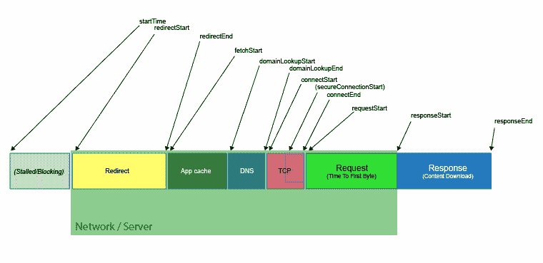

网络计时数据点

我们可以通过`window`对象访问性能计时 API：

```js
window.performance 
```

`window`对象中的性能属性包含一些属性（`memory`、`navigation`和`timing`）和方法（`clearMarks`、`clearMeasures`和`getEntries`）。我们可以使用`getEntries`函数来访问一个包含每个请求的驯服数据点的数组：

```js
window.performance.getEntries() 
```

数组中的每个实体都是`PerformanceResourceTiming`的一个实例，它包含以下信息：

```js
{ 
  connectEnd: 1354.525000002468 
  connectStart: 1354.525000002468 
  domainLookupEnd: 1354.525000002468 
  domainLookupStart: 1354.525000002468 
  duration: 179.89400000078604 
  entryType: "resource" 
  fetchStart: 1354.525000002468 
  initiatorType: "link" 
  name: "https://developer.chrome.com/static/css/out/site.css" 
  redirectEnd: 0 
  redirectStart: 0 
  requestStart: 1380.8379999827594 
  responseEnd: 1534.419000003254 
  responseStart: 1533.6550000065472 
  secureConnectionStart: 0 
  startTime: 1354.525000002468 
} 
```

不幸的是，如果这些时间数据点不以可视化的方式呈现，那么它们可能没有用。幸运的是，有一些工具可以帮助我们轻松分析它。现在，我们将了解一些这些工具。

第一款工具是一个名为**performance-bookmarklet**的浏览器扩展。这个扩展是开源的，适用于 Chrome 和 Firefox。扩展下载链接可以在[`github.com/micmro/performance-bookmarklet`](https://github.com/micmro/performance-bookmarklet)找到。

在以下屏幕截图中，我们可以看到由扩展生成的图表之一。图表以可视化的方式显示性能计时 API 信息，使我们能够轻松地发现性能问题：

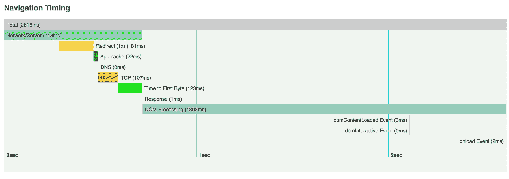

或者，我们可以使用 Chrome 开发者工具中的网络面板来执行网络性能分析。要访问网络面板，请打开 Google Chrome，导航到视图 | 开发者，然后导航到开发者工具：

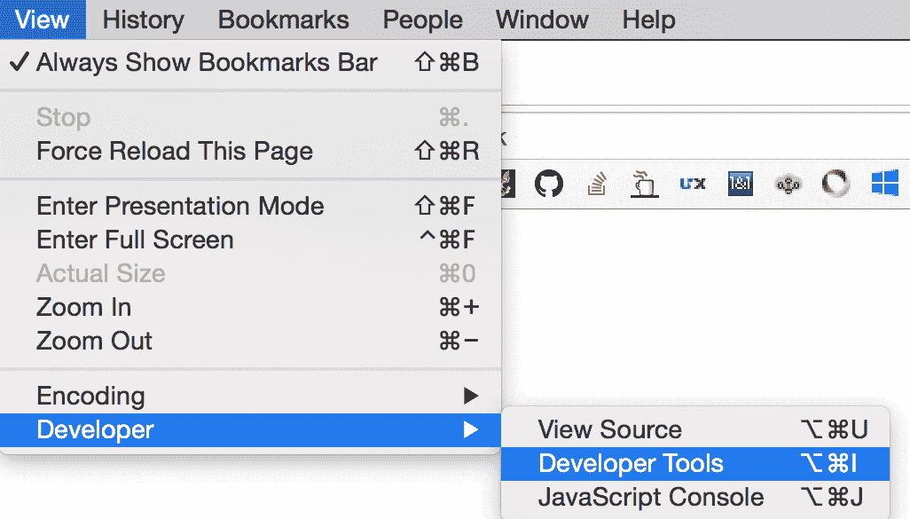

Windows 和 Linux 用户可以通过按*F12*键访问开发者工具。OS X 用户可以使用*Alt* + *Cmd* + *I*快捷键访问它。

一旦开发者工具可见，我们可以通过点击它来访问网络标签：


网络标签

点击网络标签将带我们到一个类似于这里看到的屏幕：

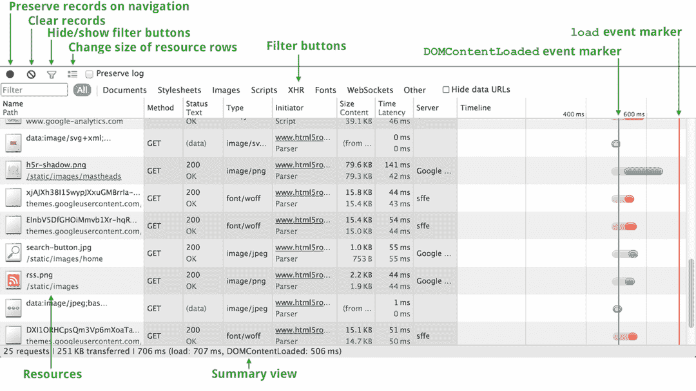

如我们所观察到的，信息以表格的形式呈现，其中每个加载的文件都显示为一行。在右侧，我们可以看到时间线列。时间线以可视化的方式显示性能时间 API，就像性能-bookmarklet 扩展一样。

时间线列中有两个非常重要的元素是红色和蓝色的垂直线。这些线条让我们知道何时触发`DOMContentLoaded`事件（蓝色线条），之后触发`onLoad`事件（红色线条）：

+   蓝线表示`DOMContentLoaded`事件被触发的时间。当引擎完成对主文档的解析时，会触发`DOMContentLoaded`事件。

+   红线表示`onLoad`事件被触发的时间。当页面上所有资源都加载完毕时，会触发`onLoad`事件：

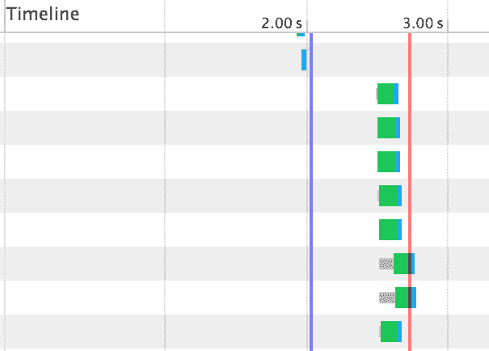

我们可以通过检查这些事件触发时完成的请求，来了解整体页面的响应性和加载时间。

如果我们将鼠标悬停在时间列的任何一个单元格上，我们将能够看到每个性能时间 API 数据点：

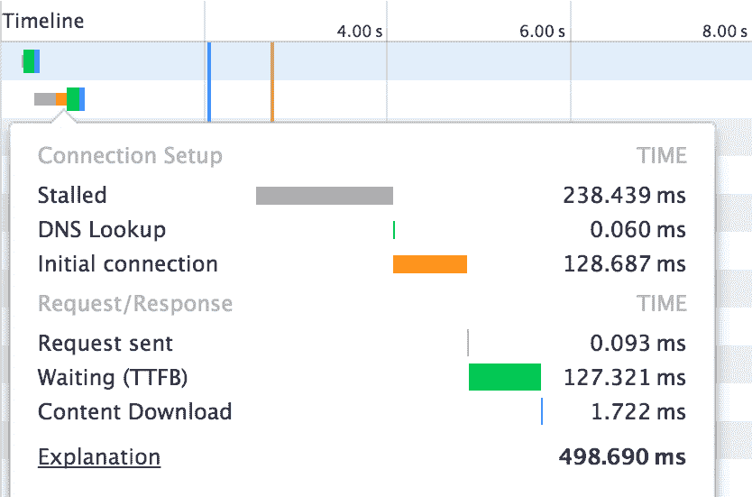

有趣的是，这个开发者工具使用性能时间 API 读取这些信息。我们现在将更深入地了解每个数据点的含义：

| **性能时间 API 数据点** | **描述** |
| --- | --- |
| 阻塞/停滞 | 请求在发送之前等待的时间；对于源有一个最大数量的开放 TCP 连接。当达到限制时，一些请求将显示阻塞时间，而不是停滞时间。同一源（域名地址）的最大 TCP 连接数为 6 个。 |
| 代理协商 | 与代理服务器协商连接所花费的时间。 |
| DNS 查找 | 解析 DNS 地址所花费的时间；解析 DNS 需要每个页面上每个域的 DNS 服务器进行完整往返。 |
| 初始连接/连接中 | 建立连接所花费的时间。 |
| SSL | 建立 SSL 连接所花费的时间。 |
| 请求发送/发送中 | 发出网络请求所花费的时间；通常，是毫秒的一部分。 |
| 等待（TTFB） | 接收初始字节数据所花费的时间——**首次字节时间**（**TTFB**）；TTFB 可以用来找出往返服务器的延迟，以及等待服务器发送响应所花费的时间。 |
| 内容下载/下载中 | 等待响应数据接收所花费的时间。 |

请参阅官方 Google Chrome 文档[`developers.google.com/web/tools/chrome-devtools/network-performance/reference#timing-explanation`](https://developers.google.com/web/tools/chrome-devtools/network-performance/reference#timing-explanation)，了解更多关于时间 API 的信息。

# 网络性能和用户体验

现在我们知道了如何分析网络性能，是时候确定我们应该追求的性能目标了。许多研究表明，为了实现良好的**用户体验**（**UX**），保持加载时间尽可能低是很重要的。Akamai 在 2009 年 9 月发表的一项研究，对 1,048 名在线购物者进行了调查，发现：

+   47%的人期望网页在两秒或更短的时间内加载完成

+   如果页面加载超过三秒，40%的人会放弃网页

+   52%的在线购物者声称快速页面加载对他们对网站的忠诚度很重要

+   如果页面加载速度慢，14%的人会开始在不同的网站上购物

+   如果页面加载速度慢，23%的人会停止购物甚至离开电脑

+   对网站访问不满意的有 64%的购物者下次购物时会去其他地方

您可以在[`www.akamai.com/us/en/about/news/press/2009-press/akamai-reveals-2-seconds-as-the-new-threshold-of-acceptability-for-ecommerce-web-page-response-times.jsp`](https://www.akamai.com/us/en/about/news/press/2009-press/akamai-reveals-2-seconds-as-the-new-threshold-of-acceptability-for-ecommerce-web-page-response-times.jsp)阅读完整的 Akamai 研究。

从前面的研究结论中，我们应该假设网络性能很重要。我们的首要任务是尝试提高我们应用程序的加载速度。

如果我们试图提高网站的性能以确保它在两秒内加载完成，我们可能会犯一个常见的错误：试图在两秒内触发`onLoad`事件。

尽管尽早触发`onLoad`事件可能会提高应用程序的网络性能，但这并不意味着用户体验会同样得到改善。`onLoad`事件不足以确定性能。我们可以通过比较 Twitter 和 Amazon 网站的加载性能来证明这一点。正如以下截图所示，用户可以比在 Twitter 上更快地与 Amazon 互动。尽管两个网站上的`onLoad`事件相同，但用户体验却截然不同：


Twitter 和 Amazon 网站

上述例子说明了为什么尝试以尽可能早的方式加载网页内容以开始用户互动是很重要的。实现这一目标的一种方法是通过确保我们在初始页面加载时只加载必要的最小资产。然后我们可以异步加载所有次要资产。

参考第三章[82486ffc-fd37-49ec-938f-0e2aec26ebf8.xhtml]，*与函数一起工作*，了解使用 TypeScript 进行异步编程的更多信息。

# 网络性能最佳实践和规则

分析 Web 应用性能的另一种方法是使用网络性能最佳实践工具，例如**Google PageSpeed Insights**应用或**Yahoo YSlow**应用。

Google PageSpeed Insights 可以在线使用或作为 Google Chrome 扩展使用。要尝试此工具，我们可以访问在线版本[`developers.google.com/speed/pagespeed/insights/`](https://developers.google.com/speed/pagespeed/insights/)并插入我们想要分析的 Web 应用的 URL。几秒钟后，我们将得到如下截图所示的报告：


报告包含一些有效的建议，将帮助我们提高 Web 应用的网络性能和整体用户体验。Google PageSpeed Insights 使用以下规则来评估 Web 应用的速度：

+   避免落地页重定向

+   启用压缩

+   提高服务器响应时间

+   利用浏览器缓存

+   压缩资源

+   优化图片

+   优化 CSS 交付

+   优先处理可见内容

+   移除渲染阻塞的 JavaScript

+   使用异步脚本

如果我们点击某条规则的分数，我们将能够看到推荐和详细信息，这将帮助我们了解哪里出了问题以及我们需要做什么来提高得分。

另一方面，Yahoo YSlow 可以作为浏览器扩展、Node.js 模块和 PhantomJS 插件等多种方式使用。我们可以在[`yslow.org/`](http://yslow.org/)找到适合我们需求的正确版本。YSlow 生成一份报告，将为我们提供网站的一般得分和详细得分，如下面的截图所示：

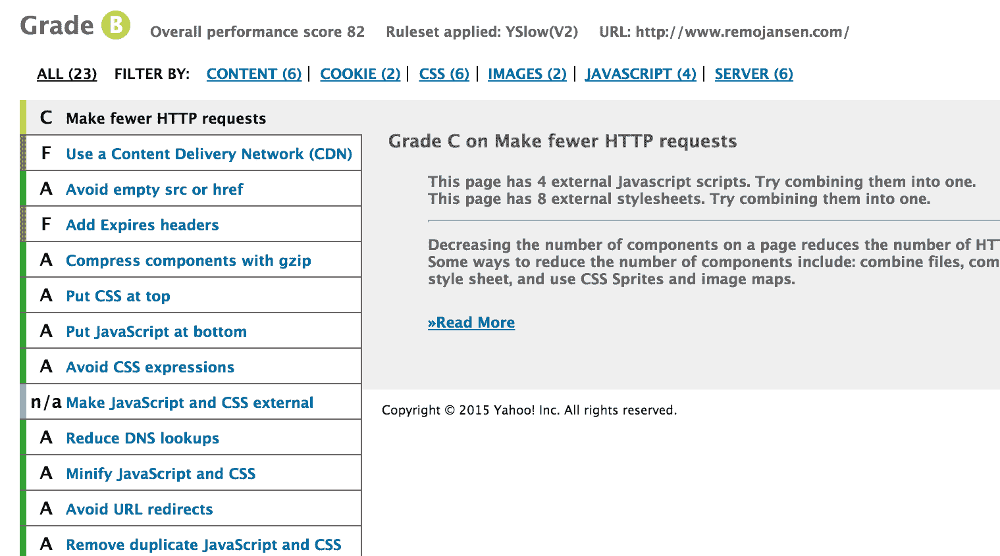

YSlow 使用以下规则集来评估 Web 应用的速度：

+   最小化 HTTP 请求

+   使用内容分发网络

+   避免空的`src`或`href`

+   添加过期或缓存控制头

+   GZIP 组件

+   将样式表放在顶部

+   将脚本放在底部

+   避免 CSS 表达式

+   将 JavaScript 和 CSS 外部化

+   减少 DNS 查找

+   压缩 JavaScript 和 CSS

+   避免重定向

+   移除重复的脚本

+   配置 ETags

+   使 Ajax 可缓存

+   使用 GET 进行 Ajax 请求

+   减少 DOM 元素数量

+   防止 404 错误

+   减少 cookie 大小

+   为组件使用无 cookie 域名

+   避免过滤器

+   不要在 HTML 中缩放图片

+   使`favicon.ico`文件小且可缓存

如果我们点击某条规则的分数，我们将看到一些推荐和详细信息，这将帮助我们了解哪里出了问题以及我们需要做什么来提高特定规则的得分。

如果你想了解更多关于网络性能优化的信息，请参阅由*Ilya Grigorik*撰写的书籍《高性能浏览器网络》。

# GPU 性能分析

在 Web 应用程序中，渲染元素有时会通过 GPU 加速。GPU 专门处理与图形相关的指令，因此在图形方面，它能够提供比 CPU 更好的性能。例如，在现代 Web 浏览器中，CSS3 动画是通过 GPU 加速的，而 CPU 执行 JavaScript 动画。在过去，实现某些动画的唯一方法是通过 JavaScript。但今天，我们应该尽可能避免使用它，而使用 CSS3。

近年来，由于 WebGL API 的出现，从 Web 浏览器直接访问 GPU 已成为可能。这个 API 允许 Web 开发者利用 GPU 创建 3D 游戏和其他高度可视化的 3D 应用程序。

# 每秒帧数（FPS）

我们不会过多地讨论 3D 应用程序的性能，因为这是一个广泛的领域，我们甚至可以为此写一本书。然而，我们将了解一个可以应用于任何 Web 应用程序的重要概念：**每秒帧数**（**FPS**），或帧率。当 Web 应用程序在屏幕上显示时，它是以每秒几帧的图像（帧）来完成的。如果用户感知到帧率低，可能会对整体用户体验产生不利影响。关于这个主题已经进行了大量的研究，60 帧每秒似乎是最适合良好用户体验的帧率。值得一提的是，即使帧率是 30 FPS 这样的低值，保持一个恒定的帧率也被认为比不稳定的帧率要好。

无论何时我们开发 Web 应用程序，我们都应该关注帧率，并尝试防止其低于 40 FPS，这对于动画和用户操作尤其重要。

我们可以使用 Google Chrome 来监控我们的 Web 应用程序中的 FPS。我们需要打开开发工具（*Ctrl* + *Shift* + *I*），点击右上角与*X*图标相邻的图标，其工具提示为*自定义和控制开发工具*。然后我们可以选择更多工具 | 渲染：

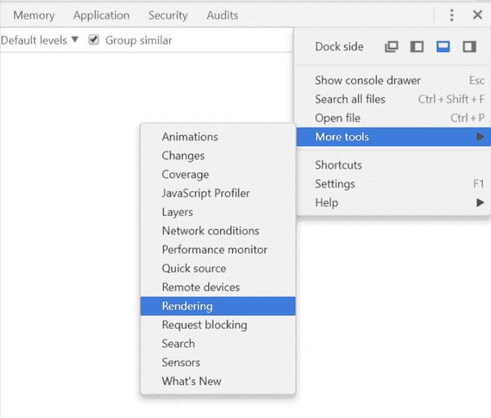

上述指令将显示一个标题为渲染的新面板。然后我们必须启用 FPS 计数值：

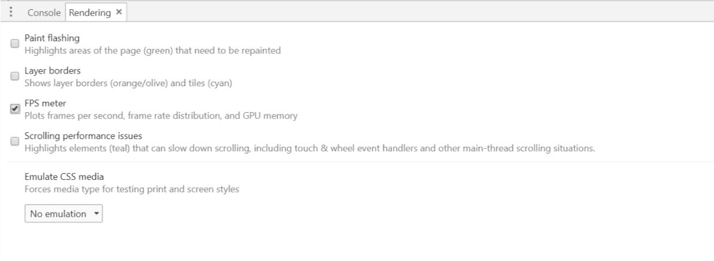

FPS 计数值应显示在屏幕的右上角：


FPS 计数器使我们能够看到每秒的帧数和正在消耗的 GPU 内存。

一些高级 WebGL 应用程序可能需要深入的性能分析。对于这种情况，Chrome 提供了 Trace Event Profiling Tool。如果您想了解更多关于这个工具的信息，请访问官方页面[`www.chromium.org/developers/how-tos/trace-event-profiling-tool`](https://www.chromium.org/developers/how-tos/trace-event-profiling-tool)。

# CPU 性能分析

为了分析处理时间的使用情况，我们将检查应用程序的调用栈。我们将检查每个调用的函数及其执行完成所需的时间。我们可以通过在 Google Chrome 开发者工具中打开“性能”选项卡来访问所有这些信息：

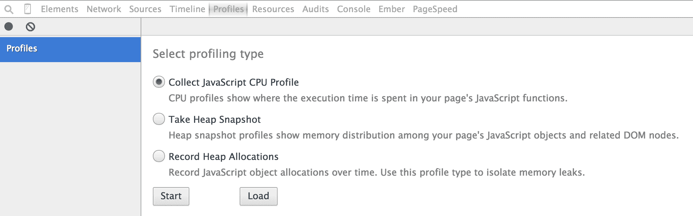

在此选项卡中，我们可以选择收集 JavaScript CPU 性能报告，然后点击“开始”按钮以开始记录 CPU 使用情况。能够选择何时开始和停止记录 CPU 使用情况有助于我们选择要分析的具体函数。例如，如果我们想分析名为`foo`的函数，我们只需要开始记录 CPU 使用情况，调用`foo`函数，然后停止记录。随后将显示如下截图所示的时间线：

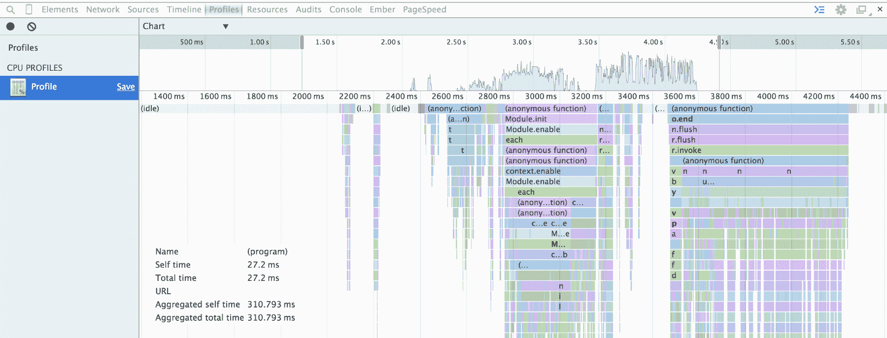

时间线

时间线按时间顺序显示调用的函数（水平轴）。时间线还显示了这些函数的调用栈（垂直轴）。当我们悬停在其中一个函数上时，我们将在时间线的左下角看到其详细信息：

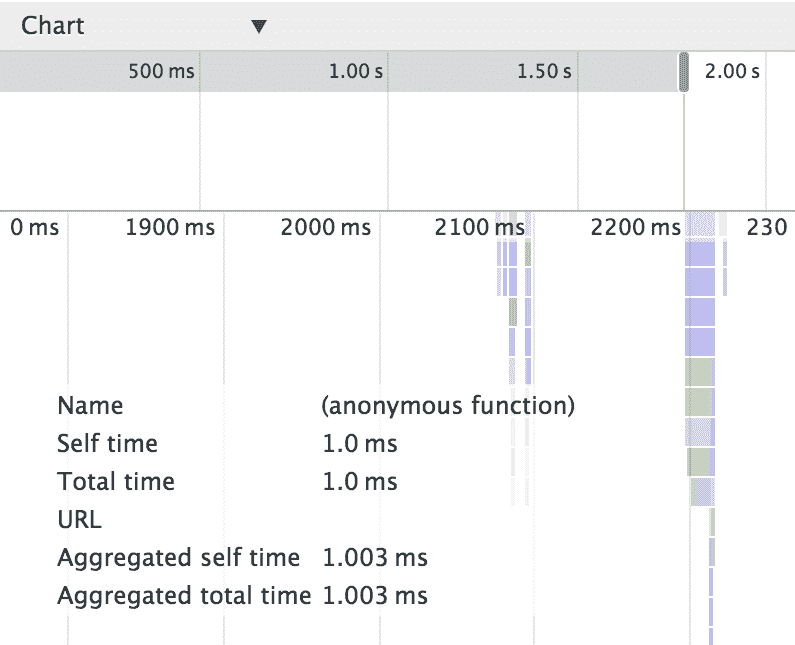

详细信息包括以下信息：

+   名称：函数的名称

+   自定义时间：完成当前函数调用所花费的时间；我们将考虑函数内部语句的执行时间，不包括它调用的任何函数

+   总时间：完成当前函数调用的总时间；我们将考虑函数内部语句的执行时间，包括它调用的函数

+   聚合自定义时间：在整个录制过程中，函数所有调用的总时间，不包括由该函数调用的函数

+   聚合总时间：在整个录制过程中，函数所有调用的总时间，包括由该函数调用的函数

如我们在前几章所学，所有 JavaScript 代码在运行时都在一个单独的线程中执行；因此，当一个函数正在执行时，没有其他函数可以执行。当函数的执行时间过长时，应用程序会变得无响应。

我们可以通过减少长时间运行函数所需的时间来解决此问题。我们可以使用 CPU 性能报告来识别哪些函数消耗了过多的处理时间。一旦我们确定了这些函数，我们可以重构它们以尝试提高应用程序的响应性。一些常见的改进包括在可能的情况下使用异步执行流程，并减小函数的大小。

# 内存性能分析

当我们声明一个变量时，它会在 RAM 中分配。有时之后，变量超出作用域；它会被垃圾回收器从内存中清除。有时，我们可以生成一个变量永远不会超出作用域的场景。如果变量永远不会超出作用域，它将永远不会从内存中清除。这最终可能导致一些严重的内存泄漏问题。**内存泄漏**是指可用内存的持续损失。

在处理内存泄漏时，我们可以利用 Google Chrome 开发者工具轻松地确定问题的原因。

我们可能会首先想知道我们的应用程序是否存在内存泄漏。我们可以通过访问时间轴并点击左上角的图标来开始记录资源使用情况来找出答案。一旦我们停止记录，就会显示一个类似于以下截图的时间轴图：

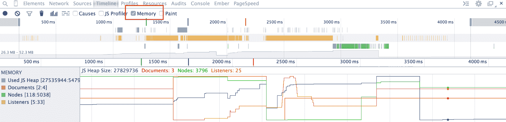

在时间轴中，我们可以选择“内存”来查看随时间变化的内存使用情况（截图中的蓝色线条表示“已用 JS 堆”）。在先前的例子中，我们可以看到在时间轴的末端有一个显著的下降。这是一个好兆头，因为它表明当页面加载完成后，大部分已使用的内存已经被清除。

内存泄漏也可能在加载后发生；在这种情况下，我们可以使用应用程序一段时间，并观察图中内存使用情况的变化，以确定泄漏的原因。

检测内存泄漏的另一种方法是观察内存分配。我们可以通过在“内存”标签页中记录堆分配来访问这些信息：

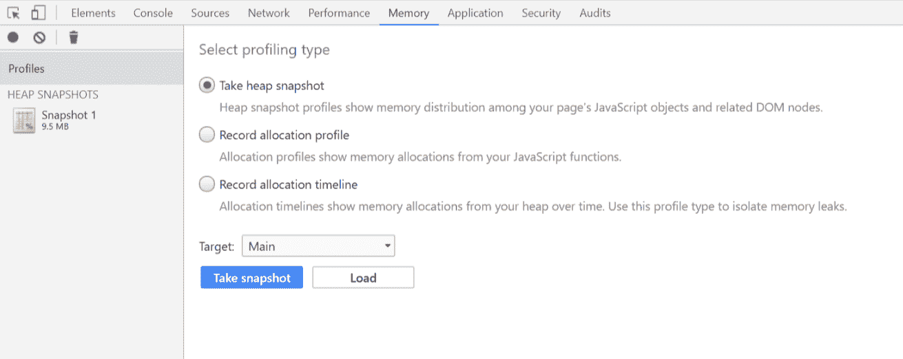

在记录了一些资源使用情况后，报告将显示。我们可以通过选择“记录分配时间轴”并点击“快照”按钮来做到这一点。然后我们需要通过点击开发工具左上角显示的红点来停止记录。

内存分配报告将显示一个类似于以下截图的时间轴。每一条蓝色线条都表示在记录期间发生的内存分配。线条的高度表示使用的内存量。正如我们所见，内存在大约第八秒时几乎被完全清除：

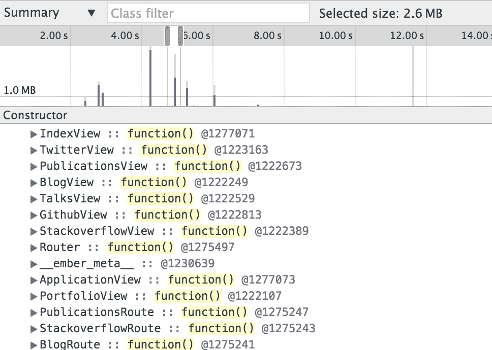

如果我们点击其中一条蓝色线条，我们将能够导航到在分配发生时存储在内存中的所有变量，并检查它们的值。从“配置文件”标签页也可以在任何给定点获取内存快照：


这个功能在我们调试并希望看到断点处的内存使用情况时特别有用。内存快照的工作方式类似于之前解释的分配视图中的详细视图：

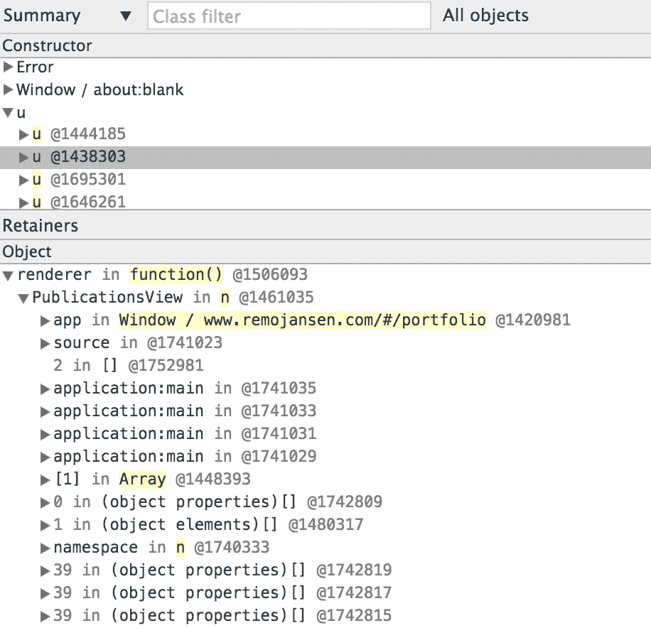

如前一个屏幕截图所示，内存快照允许我们在快照被捕获时导航到存储在内存中的所有变量，并检查它们的值。

# 垃圾回收器

有着低抽象级别的编程语言具有低级内存管理机制。另一方面，在具有更高抽象级别的语言中，如 C#或 JavaScript，内存通过称为垃圾回收器的过程自动分配和释放。

当涉及到内存管理时，JavaScript 垃圾回收器做得很好，但这并不意味着我们不需要关心内存管理。

无论我们使用哪种编程语言，内存生命周期基本上遵循相同的模式：

+   分配你需要的内存

+   使用内存（读取/写入）

+   当不再需要时释放分配的内存

当不再需要分配的内存时，垃圾回收器将尝试释放它，使用一种称为**标记-清除算法**的算法变体。垃圾回收器执行周期性扫描以识别超出作用域的对象，这些对象可以从内存中释放。扫描分为两个阶段：第一个阶段被称为**标记**，因为垃圾回收器将标记可以释放内存的项目。在第二个阶段，称为**清除**，垃圾回收器将释放前一个阶段标记的项目所消耗的内存。

垃圾回收器通常能够识别何时可以清除内存中的项目；但作为开发者，我们必须尝试确保当不再需要对象时，对象能够超出作用域。如果一个变量从未超出作用域，它将永远分配在内存中，这可能导致严重的内存泄漏问题。

指向内存中项目的引用数量将阻止其从内存中释放。因此，大多数内存泄漏案例可以通过确保没有对变量的永久引用来修复。以下是一些可以帮助我们防止潜在内存泄漏问题的规则：

+   记得在不再需要时清除间隔

+   记得在不再需要时清除事件监听器

+   记住，当你创建闭包时，内部函数将记住其声明的上下文，这意味着将分配一些额外的内存项。

+   记住，当使用对象组合时，如果创建了循环引用，你可能会遇到一些变量将永远不会从内存中清除。

重要的是要提到，Node.js 进程假定至少有 1.5 GB 的 RAM 可用，当系统可用 RAM 低于 1.5 GB 时可能会引起一些问题，因为垃圾回收器不会尝试释放任何未使用的内存，直到进程消耗了几乎 1.5 GB 的 RAM。如果只有 1 GB 可用，进程将会崩溃，因为我们将在垃圾回收器尝试清理未使用内存之前耗尽内存。我们可以使用 `max_old_space_size` 标志来解决这个问题：

```js
node --max_old_space_size=1024 server.js --production 
```

# Node.js 应用程序的性能分析

我们已经学会了如何使用 Google Chrome 开发工具来分析前端应用程序。然而，相同的工具也可以用来分析由 Node.js 驱动的后端应用程序。

要使用 Google Chrome 开发工具分析 Node.js 应用程序，我们需要使用 `--inspect` 标志启动 Node.js 应用程序：

```js
ts-node --inspect main.ts  
```

然后，我们需要使用 Google Chrome 访问 `chrome://inspect` URL。

如果一切顺利，我们应该能看到以下屏幕：

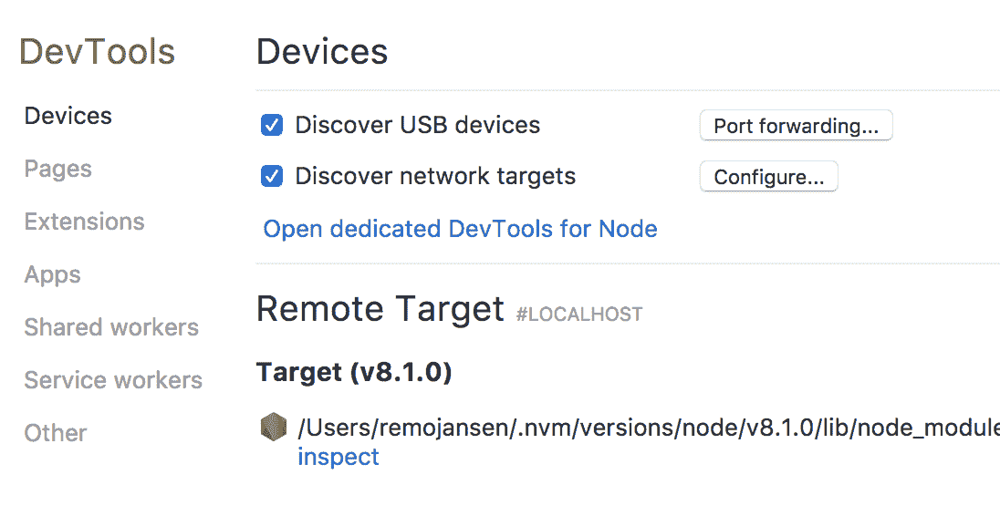

然后，我们需要点击“检查”链接，该链接应在“远程目标”部分下可用。随后应该会打开一个新窗口。该窗口将显示 Google Chrome 开发者工具，准备分析 Node.js 应用程序。

或者，我们可以使用 Google Chrome 的 **Node.js V8 --inspector Manager** （**NiM**）扩展程序，它允许我们更轻松地访问 Node.js 检查器。您可以通过访问 [`chrome.google.com/webstore/detail/nodejs-v8-inspector-manag/gnhhdgbaldcilmgcpfddgdbkhjohddkj`](https://chrome.google.com/webstore/detail/nodejs-v8-inspector-manag/gnhhdgbaldcilmgcpfddgdbkhjohddkj) 下载此扩展程序。

# 性能自动化

在本节中，我们将了解如何自动化许多性能优化任务，从内容的连接和压缩到性能监控和性能测试过程的自动化。

# 性能优化自动化

在分析完我们应用程序的性能后，我们将开始着手进行一些性能优化。许多这些优化涉及应用程序某些组件的连接和压缩。

每当原始组件（未连接和未压缩）之一发生变化时，我们还需要创建一个新的连接和压缩内容的版本。因为这些包括许多高度重复的任务，我们可以使用 Gulp 或 Webpack 等工具为我们执行许多这些任务。

我们可以使用这些工具来连接和压缩组件，优化图像，生成缓存清单文件，以及执行许多其他性能优化任务。

如果您想了解更多关于 Gulp 和 Webpack 的信息，请参阅第九章，*自动化您的开发工作流程*。

# 性能监控自动化

我们已经看到，我们可以使用 Gulp 任务运行器自动化许多性能优化任务。同样，我们也可以自动化性能监控过程。

为了监控现有应用程序的性能，我们需要收集一些数据，这将使我们能够比较应用程序随时间的变化。根据我们收集数据的方式，我们可以识别三种不同的性能监控类型：

+   **真实用户监控** (**RUM**)：这是一种用于从真实用户访问中捕获性能数据的解决方案。数据收集是通过在浏览器中加载的小段 JavaScript 代码完成的。此类解决方案可以帮助我们收集数据并发现性能趋势和模式。

+   **模拟浏览器**：此类解决方案用于从模拟浏览器中捕获性能数据，这是更经济的选择，但它有限制，因为模拟浏览器无法提供与真实用户体验一样准确的表示。

+   **真实浏览器监控**：这是用于捕获真实浏览器性能数据的方法。这些信息提供了对真实用户体验的更准确表示，因为数据是使用用户访问网站时看到的 exactly what a user would see if he or she visited the site with the given environment (browser, geographic location, and network throughput).

Web 浏览器可以被配置为生成**HTTP Archive** (**HAR**)文件。HAR 文件使用一个通用的格式来记录 HTTP 跟踪信息。此文件包含各种信息，但，就我们的目的而言，它记录了浏览器加载的每个对象。

在线上有多个脚本展示了如何收集数据。其中一个例子，`netsniff.js`，导出网络流量为 HAR 格式。`netsniff.js`文件（和其他示例）可以在[`github.com/ariya/phantomjs/blob/master/examples/netsniff.js`](https://github.com/ariya/phantomjs/blob/master/examples/netsniff.js)找到。

一旦我们生成了 HAR 文件，我们可以使用另一个应用程序以可视时间线查看收集到的性能信息。这个应用程序叫做 HAR Viewer，可以在[`github.com/janodvarko/harviewer`](https://github.com/janodvarko/harviewer)找到。

或者，我们可以编写一个自定义脚本或 Gulp 任务来读取 HAR 文件，并在应用程序性能不符合我们的需求时中断自动化构建。

还可以运行 YSlow 性能分析报告并将其与自动化构建集成。

如果你正在考虑使用 RUM，请查看 New Relic 的解决方案，网址为[`newrelic.com/`](http://newrelic.com/)，或者 Google Analytics，网址为[`www.google.com/analytics/`](http://www.google.com/analytics/).

# 性能测试自动化

提高应用程序性能的另一种方法是编写自动性能测试。这些测试可以用来确保系统满足一系列性能目标。性能测试有多种类型，但其中一些最常见的是以下几种：

+   **负载测试**：这是最基本的性能测试形式。我们可以使用负载测试来了解系统在特定预期负载（并发用户数、事务数和持续时间）下的行为。

+   **压力测试**：这种测试通常用于了解应用程序的最大容量限制。这种测试确定应用程序是否能够处理极端数量的请求。当在客户端应用程序上工作时，压力测试并不适用。然而，当在 Node.js 应用程序上工作时，它可能很有帮助，因为 Node.js 应用程序可以有多个并发用户。

+   ** soak 测试**：也称为耐久性测试。这种测试类似于压力测试，但不是使用极端负载，而是使用持续一段时间的预期负载。在测试期间收集内存使用数据是一种常见做法，用于检测潜在的内存泄漏。这种测试有助于我们判断在持续一段时间后性能是否有所下降。

+   **峰值测试**：这也类似于压力测试，但不是在持续期间使用极端时间负载，而是使用突然的极端和预期负载间隔。这种测试有助于我们确定应用程序是否能够处理负载的剧烈变化。

+   **配置测试**：这种测试用于确定配置更改对应用程序性能和行为的影响。一个常见的例子是尝试不同的负载均衡方法。

# 异常处理

了解如何有效地使用可用资源将帮助我们创建更好的应用程序。同样，了解如何处理运行时错误将帮助我们提高应用程序的整体质量。TypeScript 中的异常处理涉及三个主要语言元素。

# `Error` 类

当发生运行时错误时，会抛出一个 `Error` 类的实例：

```js
throw new Error(); 
```

我们可以通过几种不同的方式创建自定义错误。实现它的最简单方法是向 `Error` 类构造函数传递一个字符串作为参数：

```js
throw new Error("My basic custom error"); 
```

如果我们需要对自定义异常有更多可定制和高级的控制，我们可以使用继承来实现：

```js
export class Exception extends Error { 

    public constructor(public message: string) { 
        super(message); 
        // Set the prototype explicitly. 
        Object.setPrototypeOf(this, Exception.prototype); 
    } 
    public sayHello() { 
        return `hello ${this.message}`; 
    } 
} 
```

在前面的代码片段中，我们声明了一个名为 `Exception` 的类，它继承自 `Error` 类。在类构造函数中，我们显式地设置了原型。这是由于一些限制，从 TypeScript 2.1 开始的要求。你可以在 [`github.com/Microsoft/TypeScript-wiki/blob/master/Breaking-Changes.md#extending-built-ins-like-error-array-and-map-may-no-longer-work`](https://github.com/Microsoft/TypeScript-wiki/blob/master/Breaking-Changes.md#extending-built-ins-like-error-array-and-map-may-no-longer-work) 了解更多关于这个限制的详细信息。

# try...catch 语句和 throw 语句

`catch` 子句包含在 `try` 块中抛出异常时要执行的语句。我们应该在 `try` 块中执行一些操作，如果它们失败，程序执行流程将从 `try` 块移动到 `catch` 块。此外，还有一个可选的 `finally` 块，它在 `try` 和 `catch` 块（如果 `catch` 块中有异常）之后执行：

```js
try { 
    // code that we want to work 
    throw new Error("Oops!"); 
} 
catch (e) { 
    // code executed if expected to work fails 
    console.log(e); 
} 
finally { 
    // code always executed after try or try and catch (when 
     errors) 
    console.log("finally!"); 
} 
```

还需要提到的是，在包括 TypeScript 在内的绝大多数编程语言中，抛出和捕获异常是一项资源消耗较大的操作。如果我们需要使用这些语句，就应该使用它们，但有时为了避免它们可能对应用程序性能产生负面影响，有时有必要避免使用它们。

# 摘要

在本章中，我们学习了性能是什么以及资源可用性如何影响它。

我们还学习了如何使用一些工具来分析 TypeScript 应用程序使用可用资源的方式。这些工具使我们能够发现一些可能的问题，例如帧率低、内存泄漏和高加载时间。我们还发现，我们可以自动化许多性能优化任务，以及性能监控和测试过程。

在下一章中，我们将学习如何自动化我们的 TypeScript 应用程序的测试过程，以实现出色的应用程序可维护性和可靠性。
