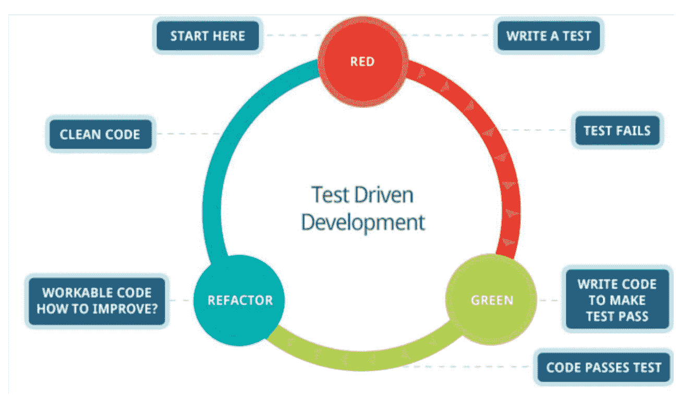
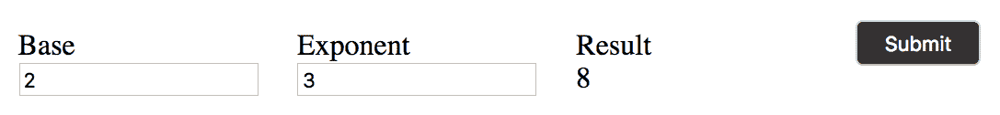
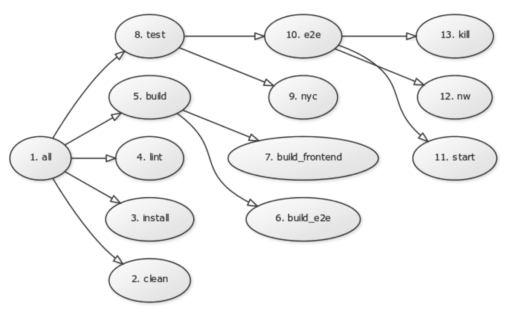
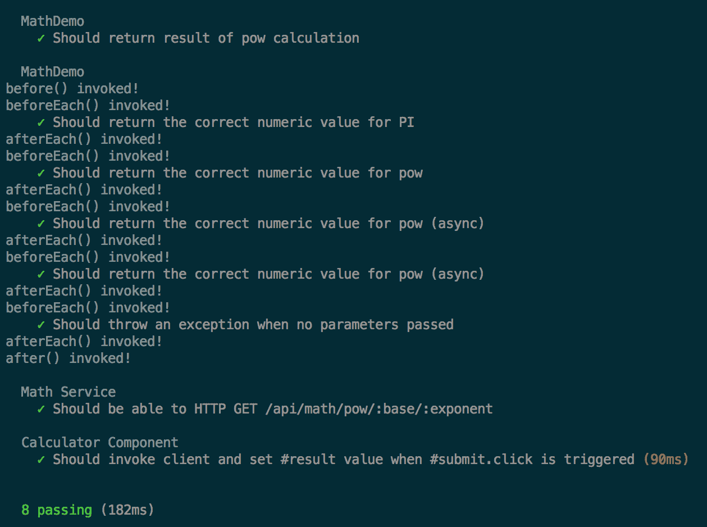
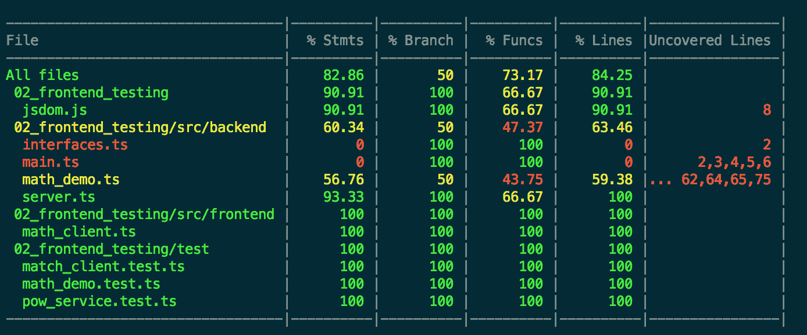
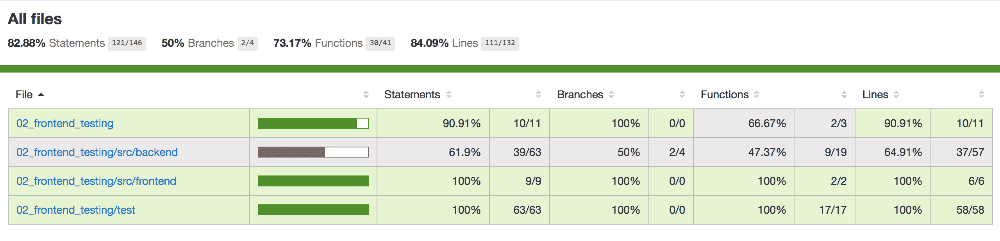
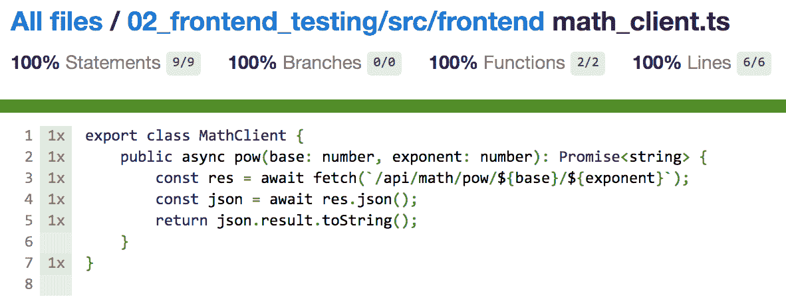
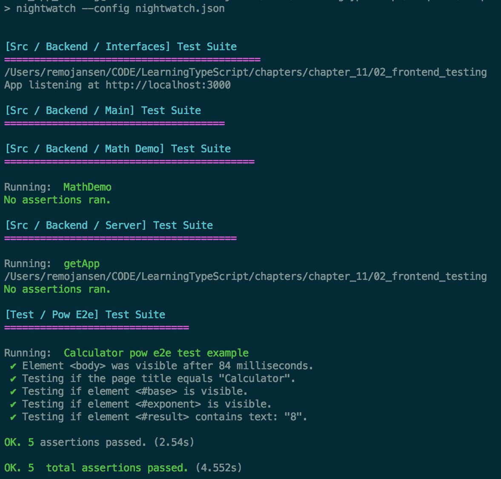

# 应用程序测试

在第九章，*自动化你的开发工作流程*中，我们学习了如何编写单元测试和生成测试覆盖率报告。然而，应用程序测试是一个非常广泛的主题，我们只是触及了其表面。

在本章中，我们将学习如何为 TypeScript 应用程序编写多种类型的自动化测试。我们将涵盖以下主题：

+   测试术语

+   测试规划和方法论

+   编写单元测试

+   在测试期间隔离组件

+   编写集成测试

+   编写端到端（e2e）测试

我们将从学习软件测试领域核心术语开始。

# 测试术语

在本章中，我们将使用一些可能对没有软件测试领域经验读者不熟悉的概念。因此，在我们开始之前，我们将快速浏览一些软件测试中最流行的概念。

# 断言

**断言**是一个必须被测试的条件，以确认某段代码的行为是否符合预期，或者换句话说，以确认符合要求。

让我们假设我们正在作为谷歌 Chrome 开发团队的一部分工作，并且我们必须实现 JavaScript `Math` API。如果我们正在处理`pow`方法，需求可能如下，`Math.pow`（底数，指数）函数应该返回底数（底数数字）的指数次幂——即底数`^`指数。

基于这些信息，我们可以创建以下实现：

```js
class MathAPI { 
    public static pow(base: number, exponent: number) { 
        let result = base; 
        for (var i = 1; i < exponent; i++) { 
            result = result * base; 
        } 
        return result; 
    } 
} 
```

请注意，在这个例子中，我们使用`MathAPI`而不是`Math`，因为`Math`变量已经被真实的 JavaScript Math API 声明了。

为了确保方法被正确实现，我们必须测试其是否符合要求。如果我们仔细分析需求，我们应该至少识别出两个必要的断言：

+   函数应该返回底数的指数：

```js
const actual1 = MathApi.pow(3, 5);
const expected1 = 243;
const asertion1 = actual1 === expected1;

if (asertion1 === false) {
    throw new Error(
        `Expected 'actual1' to be ${expected1} ` +
        `but got ${actual1}!`
    );
}
```

+   指数没有被用作底数（或者底数没有被用作指数）：

```js
const actual2 = MathApi.pow(5, 3);
const expected2 = 125;
const asertion2 = actual2 === expected2;

if (asertion2 === false) {
    throw new Error(
        `Expected 'actual2' to be ${expected2} ` +
        `but got ${actual2}!`
    );
}
```

如果两个断言都有效，那么我们的代码符合要求，我们知道它将按预期工作。

# 规范

**规范**是软件开发工程师用来指代测试规范的一个术语。测试规范（不要与测试计划混淆）是一个详细列出所有应该被测试的场景以及如何测试它们的清单，以及其他详细信息。

# 测试覆盖率

**测试覆盖率**这个术语指的是一个度量单位，用来说明应用程序中通过自动化测试测试过的代码部分的数量。可以通过自动生成测试覆盖率报告来获得测试覆盖率。

参考第九章，*自动化你的开发工作流程*，了解如何生成测试覆盖率报告。

# 测试用例

**测试用例**是一组条件，用于确定应用程序的一个功能是否按原意工作。我们可能会想知道测试断言和测试用例之间的区别是什么。虽然测试断言是一个单一条件，但测试用例是一组条件。

# 套件

**套件**是一组测试用例。虽然测试用例应该只关注一个测试场景，但测试套件可以包含多个测试场景的测试用例。

我们将在本章的“使用 Mocha 的单元测试和集成测试”部分学习如何定义断言、测试用例和测试套件。

# 间谍

**间谍**是某些测试框架提供的一个功能。它们允许我们包装一个方法或函数并记录其使用情况。我们可以记录诸如方法或函数的参数、它们的返回类型或它们被调用的次数等信息。当我们用间谍包装一个方法或函数时，底层方法的功能不会改变。

# 占位符

**占位符**对象是在测试执行过程中传递的对象，但它实际上从未被使用。

# 模拟器

**模拟器**是某些测试框架提供的一个功能。与间谍类似，模拟器也允许我们包装一个方法或函数来记录其使用情况。与间谍的情况不同，当我们用模拟器包装一个函数时，底层方法的功能被替换为新的行为。

# 模拟器

模拟器经常与模拟器混淆。马丁·福勒曾在题为《模拟器不是占位符》的文章中写道：

“特别是，我经常看到它们（模拟器）与模拟器混淆——测试环境的一个常见辅助工具。我理解这种混淆——我一开始也认为它们很相似，但与模拟器开发者的对话逐渐让我对模拟器有了更深入的理解。这种差异实际上是两个不同的差异。一方面，测试结果验证的方式有所不同：状态验证和行为验证之间的区别。另一方面，是对测试和设计如何协同工作的一种完全不同的哲学，我将其称为经典和模拟风格测试驱动开发。”

模拟器和模拟器都为测试用例提供了一些输入，但尽管它们相似，每个的信息流都非常不同：

+   模拟器为正在测试的应用程序提供输入，以便测试可以在其他事物上进行。模拟器用于替代行为。

+   模拟器为测试提供输入以决定测试是否应该通过或失败。模拟器用于声明期望。

随着我们接近本章的结尾，模拟器和模拟器之间的区别将变得更加清晰。

# 先决条件

在本章中，我们将使用第三方工具。在本节中，我们将学习如何安装这些工具。然而，在我们开始之前，我们需要使用 npm 在我们将要用于实现本章示例的文件夹中创建一个 `package.json` 文件。

让我们创建一个新的文件夹，并进入它以使用 `npm init` 命令生成一个新的 `package.json` 文件：

```js
npm init  
```

请参考第五章，*与依赖项一起工作*，以获取有关 npm 的更多信息。

# Mocha

Mocha 是一个流行的 JavaScript 测试库，它简化了测试套件、测试用例和测试规范的创建。Mocha 可以用于前端和后端测试 TypeScript，识别性能问题，并生成不同类型的测试报告，以及其他许多功能。我们可以使用以下命令安装 Mocha：

```js
npm install --save-dev mocha @types/mocha  
```

# Chai

Chai 是一个支持**测试驱动开发**（**TDD**）和**行为驱动开发**（**BDD**）测试风格的测试断言库。Chai 的主要目标是减少创建测试断言所需的工作量，并使测试更易于阅读。我们可以使用以下命令安装 Chai：

```js
npm install --save-dev chai @types/chai  
```

请注意，我们将在本章的 *测试方法* 部分后面学习更多关于 TDD 和 BDD 的内容。

# Sinon.JS

Sinon.JS 是一个库，它提供了一套 API，可以帮助我们通过使用间谍、存根和模拟来隔离测试组件。当软件组件之间存在高度耦合时，测试软件组件可能非常困难。然而，像 Sinon.JS 这样的库可以帮助我们隔离组件以测试其功能。我们可以使用以下命令安装 Sinon.JS：

```js
npm install --save-dev sinon @types/sinon  
```

# nyc

正如我们在第九章中已经学到的，*自动化开发工作流程*，我们可以使用 nyc 为我们的应用程序生成测试覆盖率报告。我们可以使用以下命令安装 nyc：

```js
npm install --save-dev nyc  
```

# Webpack

正如我们在第九章中已经学到的，*自动化开发工作流程*，我们可以使用 nyc 为我们的应用程序生成测试覆盖率报告。我们可以使用以下命令安装 Webpack 和一些额外的插件：

```js
npm install --save-dev webpack css-loader extract-text-webpack-plugin node-sass sass-loader style-loader  
```

# Enzyme

Enzyme 是由 Airbnb 开发的开源测试库，可以帮助我们测试 React 组件。我们可以使用以下命令安装 enzyme：

```js
npm install --save-dev enzyme enzyme-adapter-react-16 @types/enzyme @types/ enzyme-adapter-react-16  
```

# SuperTest

SuperTest 是一个库，可以帮助我们测试使用 Node.js 和 Express.js 开发的 HTTP 网络服务。我们可以使用以下命令安装 SuperTest：

```js
npm install supertest @types/supertest
```

# PM2

PM2 是一个内置负载均衡器的 Node.js 应用程序的生产进程管理器。PM2 允许我们将 Node.js 应用程序作为后台进程运行，这是我们运行端到端测试所必需的。我们可以使用以下命令安装 PM2：

```js
npm install pm2
```

# Nightwatch.js 和 ChromeDriver

Nightwatch.js 是一个库，帮助我们实现 **端到端**（**e2e**）测试。我们还需要一个名为 ChromeDriver 的工具。Nightwatch.js 可以在多个网络浏览器中运行我们的测试，但在我们的例子中，我们将使用 Google Chrome。`chromedriver` 库是一个适配器，允许 Nightwatch.js 在测试执行期间与 Google Chrome 通信。我们可以使用以下命令安装 Nightwatch.js 和 ChromeDriver：

```js
npm install chromedriver nightwatch @types/nightwatch
```

请参考配套源代码以检查 `package.json` 文件中使用的确切版本。如果你使用 `npm install`，默认将安装最新版本。这些示例中使用的版本可能会随着时间的推移而变得过时，这可能导致一些配置问题。如果你想使用最新版本（这是推荐的），你必须检查每个模块的文档，以了解潜在的重大更改。

# 测试方法

每次我们开发一个新的应用程序时，我们都需要做出很多决定。例如，我们需要选择数据库类型、架构、库和框架。然而，我们的选择并不全是关于技术的，我们还可以选择软件开发方法，如极限编程或敏捷。当涉及到测试时，有两种主要风格或方法：TDD 和 BDD。

# 测试驱动开发（TDD）

测试驱动开发（TDD）是一种测试方法，它侧重于鼓励开发者在编写应用程序代码之前编写测试。通常，TDD 中编写代码的过程包括以下基本步骤：

1.  编写一个失败的测试。目前还没有应用程序代码，所以测试应该失败。

1.  运行测试并确保它失败。

1.  编写代码以通过测试。

1.  运行测试并确保它工作。

1.  运行所有其他现有测试，以确保应用程序的其他部分没有因为更改而损坏。

1.  对于每个新的功能或错误修复，重复此过程。

这个过程通常表示为“红色-绿色-重构”图：



是否使用测试驱动开发（TDD）取决于你希望采取的心态。许多开发者不喜欢编写测试，所以如果我们将他们的实现作为开发流程中的最后一项任务，测试可能永远不会被实现，或者应用程序只是部分测试。也有可能应用程序的实现方式更难进行测试。如果我们计划编写测试，提前进行可以降低实现成本。

推荐使用 TDD，因为它有效地帮助你和你团队增加应用程序的测试覆盖率，从而显著减少潜在问题的数量，最终节省资金。

# 行为驱动开发（BDD）

行为驱动开发是在 TDD 之后出现的，其使命是成为 TDD 的改进版。BDD 关注测试的描述方式（规范），并声称测试应该关注应用程序需求而不是测试需求。理想情况下，这将鼓励开发者更多地考虑整个应用程序，而不是仅仅关注测试本身。

由*丹·诺斯*引入 BDD 原则的原始文章可在[`dannorth.net/introducing-bdd/`](http://dannorth.net/introducing-bdd/)找到。

正如我们已经学到的，Mocha 和 Chai 为 TDD 和 BDD 方法都提供了 API。在本章的后面部分，我们将进一步探讨这两种方法。

推荐这些方法之一并不简单，因为 TDD 和 BDD 都是优秀的测试方法。然而，BDD 是在 TDD 之后开发的，目的是改进它，因此我们可以认为 BDD 相对于 TDD 有一些额外的优势。在 BDD 中，测试的描述重点在于应用程序应该做什么，而不是测试代码在测试什么。这可以帮助开发者识别出反映客户期望行为的测试。BDD 测试可以用来以可被开发者和客户理解和验证的方式记录系统的需求。这是相对于 TDD 测试的一个明显优势，因为 TDD 测试不能轻易为客户所理解。

# 测试计划和测试类型

“测试计划”这个术语有时被错误地用来指代测试规范。虽然测试规范定义了将要测试的场景以及如何测试，但测试计划是一个给定区域的全部测试规范的集合。

建议您创建一个实际的规划文档，因为测试计划可能涉及许多流程、文档和实践。测试计划的主要目标之一是确定和定义适用于应用程序中某个组件或一组组件的适当测试类型。以下是最常用的测试类型。

# 单元测试

这些用于测试一个独立的组件。如果组件没有隔离——也就是说，如果组件有一些依赖关系——我们就必须使用一些工具和实践，例如存根或依赖注入，尽量在测试期间将其隔离。如果无法操作组件的依赖关系，我们将使用间谍来帮助创建单元测试。我们的主要目标应该是实现组件在测试时的完全隔离。单元测试也应该快速，我们应该尽量避免输入/输出、网络使用以及可能影响测试速度的任何其他操作。

# 集成测试

集成测试用于测试一组组件（部分集成测试）或整个应用程序（完整集成测试）。在集成测试中，我们通常会使用已知测试数据向后端提供信息，这些信息将在前端显示。然后我们将断言显示的信息是正确的。

# 回归测试

回归测试用于验证问题已被修复。如果我们正在使用 TDD 或 BDD，每次遇到问题时，我们应该在修复问题之前创建一个单元测试来重现该问题。通过这样做，我们将能够重现过去的问题，并确保我们不再需要处理相同的问题。

# 性能和负载测试

性能和负载测试用于验证应用程序是否符合我们的性能预期。我们可以使用性能测试来验证我们的应用程序是否能够处理许多并发用户或活动峰值。要了解更多关于此类测试的信息，请参阅第十三章，*应用程序性能*。

# 端到端（e2e）测试

端到端测试与完整集成测试没有太大区别。主要区别在于，在 e2e 测试会话中，我们将尝试模拟一个几乎与真实用户环境相同的环境。我们将使用 Nightwatch.js 和 ChromeDriver 来实现这一目的。

# 用户验收测试（UAT）

用户验收测试（UAT）帮助我们确保系统满足最终用户的所有要求。

# 示例应用程序

在本章中，我们将开发一个完整的 Web 应用程序。该应用程序本身不是一个非常真实的应用示例，但应该足够真实，足以展示许多种测试实践和技术。我们将开发一个可以进行 `pow` 操作的计算器。计算器应用程序由以下组件组成：

+   使用 React 实现的图形用户界面，并使用 HTTP 客户端从 Web 服务获取 `pow` 操作的结果

+   使用 Node.js 和 Express.js 实现的 Web 服务，并使用一个小型数学库来查找 `pow` 操作的结果

应用程序的图形用户界面如下所示：



我们将使用 npm 脚本定义许多不同的自动化任务。每个任务使用不同的工具，有些任务必须在其他任务之前执行。我们可以使用更复杂的设置来并行运行一些任务，从而减少整个过程的执行时间，或者使用更真实的应用程序，但我们希望尽可能保持简单，以便专注于测试技术和工具。

我们将在 `package.json` 文件中定义以下任务：

```js
"scripts": { 
  "all": "npm run clean && npm install && npm run lint && npm run build && npm test", 
  "clean": "rimraf ./dist ./public", 
  "start": "./node_modules/.bin/pm2 start ./dist/src/backend/main.js", 
  "kill": "./node_modules/.bin/pm2 kill", 
  "lint": "tslint --project tsconfig.json -c tslint.json ./src/**/*.ts ./test/**/*.ts", 
  "build": "npm run build-frontend && npm run build-e2e", 
  "build-frontend": "webpack", 
  "build-e2e": "tsc -p tsconfig.e2e.json", 
  "test": "npm run nyc && npm run e2e", 
  "nyc": "nyc --clean --all -x webpack.config.js -x test/*.e2e.ts -x public -x dist -x globals.js --require ./jsdom.js --require isomorphic-fetch --require ts-node/register --extension .ts -- mocha --timeout 5000 **/*.test.ts **/*.test.tsx", 
  "e2e": "npm run start && npm run nw && npm run kill", 
  "nw": "nightwatch --config nightwatch.json", 
  "coverage": "nyc report --reporter=text --reporter=lcov" 
}, 
```

如果你使用的是 Windows，前面代码中定义的命令将失败，因为它们使用了 Unix 格式的相对路径。你可以通过安装 Git 并从 [`git-scm.com/downloads`](https://git-scm.com/downloads) 安装 Git Bash 来解决这个问题，然后使用以下命令设置 npm 以使用 Git Bash：

`npm config set script-shell "C:Program FilesGitbinbash.exe"`

你可能还需要安装 Python 和 C++ 编译工具，因为这两个都是 `node-sass` 模块所必需的。

请记住，整个源代码都包含在配套源代码中。

该过程被设计成可以通过使用 `npm run all` 命令完全运行。此命令将按以下图中描述的顺序执行所有其他任务：



上述图表使我们能够可视化由父任务初始化的任务。例如，clean、install、lint、build 和 test 任务都是由 **all** 任务启动的。该图表还帮助我们可视化任务的执行顺序。例如，我们可以看到第一个任务是 **all** 任务，最后一个任务是 **kill** 任务。

我们现在将检查每个这些任务的目的：

+   **all** 任务是根任务，用于启动其他任务。

+   **clean** 任务移除一些之前的输出，以确保结果不受任何缓存问题的影响。

+   **install** 任务下载所有必需的依赖项。

+   **lint** 任务强制执行一些代码风格规则。

+   **build** 任务启动前端和端到端测试的编译任务。对于后端和单元测试不需要编译，因为使用的工具（nyc 和 ts-node）不需要它。

+   **build_e2e** 任务使用 tsc 编译 e2e 测试。

+   **build_frontend** 任务使用 Webpack 编译前端应用程序。

+   **test** 任务运行带有 nyc 的单元测试和带有 Nightwatch.js 的 e2e 测试。

+   **nyc** 任务运行单元测试和集成测试，并生成测试覆盖率报告。

+   **e2e** 任务运行 e2e 测试。在我们运行 e2e 测试之前，我们需要使用网络服务器来提供服务应用程序，完成测试后我们还需要停止服务。

+   **start** 任务使用 PM2 启动服务应用程序的 Node.js 进程。

+   **nw** 任务代表 Nightwatch.js，用于执行 e2e 测试。

+   **kill** 任务使用 PM2 停止服务应用程序的 Node.js 进程。

如果我们不理解前面列表中提到的每个任务或工具的使命，我们不必过于担心，因为我们将在本章的剩余部分详细学习它们，除了 clean、install、lint 和 build 任务，因为我们已经在之前的章节中学习了这些任务。 

请参阅第九章，*自动化您的开发工作流程*，了解如何生成测试覆盖率报告。

# 使用 Mocha 进行单元测试和集成测试

在第九章，*自动化您的开发工作流程*中，我们学习了使用 nyc、ts-node、Mocha 和 Chai 进行单元测试和测试覆盖率报告的基本细节。在本章中，我们将学习如何使用 Mocha 测试异步 API，以及如何将 Mocha 与其他强大的工具结合使用，例如 Sinon.JS、SuperTest 和 Enzyme：

+   我们将学习如何为应用程序的每一层编写测试。

+   我们将首先测试一个用于后端的后台数学库。

+   然后，我们将测试一个消耗数学库的 Web 服务和一个消耗 Web 服务的客户端。

+   我们将通过编写图形用户界面的测试和创建一些端到端测试来完成本节。

# 回归基础

配套源代码包括一个名为 `MathDemo` 的类。这个类允许我们以几种不同的方式执行 `pow` 计算。其中之一是同步的 `pow` 函数：

```js
public pow(base: number, exponent: number) { 

  let result = base; 
  for (let i = 1; i < exponent; i++) { 
    result = result * base; 
  } 
  return result; 
} 
```

正如我们在第九章，*自动化您的开发工作流程*中学习的，我们可以使用以下测试用例测试前面函数中声明的函数：

```js
it("Should return the correct numeric value for pow", () => { 
  const math = new MathDemo(); 
  const result = math.pow(2, 3); 
  const expected = 8; 
  expect(result).to.be.a("number"); 
  expect(result).to.equal(expected); 
}); 
```

然后，我们可以使用 `nyc` 命令与 ts-node 和 Mocha 运行我们的测试并生成测试覆盖率报告。在配套源代码中，这被 npm 脚本包装如下命令，以方便使用：

```js
npm run nyc 
```

如果一切按计划进行，我们应该看到已执行的所有测试的列表。包含在配套源代码中的测试生成的结果应如下所示：



命令还应生成如下截图所示的测试覆盖率报告：



一旦我们使用 `nyc` 命令执行了测试，我们可以通过运行以下命令生成测试覆盖率报告：

```js
nyc report --reporter=text --reporter=lcov 
```

这将在当前目录下生成一个名为 `coverage` 的文件夹。该覆盖率文件夹包含一些我们可以使用网页浏览器打开的 HTML 文件：



如果我们点击其中一个文件，我们将能够看到所选文件的逐行测试覆盖率报告：



# 测试异步代码

`MathDemo` 类还包括相同方法的异步版本：

```js
public powAsync(base: number, exponent: number) { 
  return new Promise<number>((resolve) => { 
    setTimeout( 
      () => { 
        const result = this.pow(base, exponent); 
        resolve(result); 
      }, 
      0 
    ); 
  }); 
} 
```

如果我们尝试测试此方法，并且我们没有等待其结果，我们的测试将毫无用处。然而，如果我们等待结果，使用 `Promise.then` 方法，我们的测试也将失败，除非我们向测试用例处理器传递一个回调函数（在示例中命名为 `done`）：

```js
it("Should return the correct numeric value for pow", (done) => { 
  const math = new MathDemo(); 
  math.powAsync(2, 3).then((result: number) => { 
    const expected = 8; 
    expect(result).to.be.a("number"); 
    expect(result).to.equal(expected); 
    done(); 
  }); 
}); 
```

或者，我们可以使用 async 和 await，如下面的代码片段所示：

```js
it("Should return the correct numeric value for pow", async () => { 
    const math = new MathDemo(); 
    const result = await math.powAsync(2, 3); 
    const expected = 8; 
    expect(result).to.be.a("number"); 
    expect(result).to.equal(expected); 
}); 
```

当测试异步代码时，如果调用 `done` 函数的时间超过 2,000 毫秒，Mocha 将认为测试失败（超时）。在超时之前的时间限制是可以配置的，同样，对于慢速函数的警告也可以配置。默认情况下，当测试时间超过 40 毫秒时，会显示警告。警告建议我们的测试可能有些慢。如果测试执行时间超过 100 毫秒，警告将建议我们的测试相当慢。我们可以使用 `mocha` 命令的 `--timeout` 命令行参数来更改此配置。

伴随的源代码包含了每种警告和失败的示例。

# 断言异常

在前面的示例中，我们学习了如何断言变量的类型和值：

```js
const expected = 8; 
expect(result).to.be.a("number"); 
expect(result).to.equal(expected); 
```

然而，有一个场景可能不如前面的场景直观——测试异常。

`MathDemo` 类还包含一个名为 `bad` 的方法，它被添加的唯一目的是说明如何测试异常。当使用 `null` 参数调用时，`bad` 方法会抛出异常：

```js
public bad(foo: any) { 
  if (foo === null) { 
    throw new Error("Error!"); 
  } else { 
    return this.pow(5, 5); 
  } 
} 
```

在下面的测试中，我们可以看到如何使用 `expect` API 断言抛出异常：

```js
it("Should throw an exception when no parameters passed", () => { 
  const math = new MathDemo(); 
  expect(math.bad).to.throw(Error); 
}); 
```

如果你想了解更多关于断言的信息，请访问位于 [`chaijs.com/api/bdd/`](http://chaijs.com/api/bdd/) 的 Chai 官方文档。

# 使用 SuperTest 测试 web 服务

伴随源代码中的演示应用程序声明了一个允许我们获取 `pow` 计算结果的 web 服务：

```js
import * as express from "express"; 
import * as path from "path"; 
import { MathDemo } from "./math_demo"; 

export function getApp() { 

    const app = express(); 

    // ...     

    app.get("/api/math/pow/:base/:exponent", (req, res) => { 
        const mathDemo = new MathDemo(); 
        const base = parseInt(req.params.base, 10); 
        const exponent = parseInt(req.params.exponent, 10); 
        const result = mathDemo.pow(base, exponent); 
        res.json({ result }); 
    }); 

    return app; 

} 
```

应用程序的初始化被分为两个文件：`main.ts` 和 `server.ts`。`server.ts` 文件定义了我们在前面的代码片段中检查过的 `getApp` 函数。`main.ts` 文件使用 `getApp` 函数来启动服务器：

```js
import { getApp } from "./server"; 

const app = getApp(); 
const port = 3000; 

app.listen(port, () => { 
    console.log(`App listening at http://localhost:${port}`); // tslint:disable-line 
}); 
```

有时候，将整个 web 服务作为一个整体进行测试，这被称为集成测试，是一个好主意。正如我们在本章前面所学到的，集成测试用于测试一组组件。在这种情况下，我们将测试服务器端的路由处理程序及其对 `MathDemo` 类的使用。我们可以定义一个针对 `pow` 服务的测试如下：

```js
import { expect } from "chai"; 
import * as request from "supertest"; 
import { getApp } from "../src/backend/server"; 

describe("Math Service", function() { 
    it("HTTP GET /api/math/pow/:base/:exponent", async () => { 
        const app = getApp(); 
        return request(app).get("/api/math/pow/2/3") 
                    .set("Accept", "application/json") 
                    .expect("Content-Type", /json/) 
                    .expect(200) 
                    .then((response) => 
                        expect(response.body.result).eql(8) 
                    ); 
    }); 
}); 
```

如前述代码片段所示，我们使用了一个名为 `getApp` 的函数来获取 Express.js 应用的实例。一旦我们有了应用实例，我们可以使用 `supertest` 模块中的请求方法向服务发送请求。我们可以使用 SuperTest 与 Chai 一起断言请求的响应与预期的结果匹配。重要的是要提到，`getApp` 函数创建了一个应用，但它不会启动应用。或者换句话说，`getApp` 函数避免了调用 `app.listen` 方法。

# 与测试套件一起工作

测试套件是一组测试用例。我们已经了解到我们可以使用 Mocha 的 `describe` 函数来定义测试套件，以及使用 `it` 函数来定义测试用例。然而，我们还没有学习到我们可以定义在测试套件中的所有测试之前和之后可以调用的事件处理器。以下代码片段展示了我们如何定义这些事件处理器：

```js
describe("My test suite", () => { 

  before(() => { 
    // Invoked once before ALL tests 
  }); 

  after(() => { 
    // Invoked once after ALL tests 
  }); 

  beforeEach(() => { 
    // Invoked once before EACH test 
  }); 

  afterEach(() => { 
    // Invoked once before EACH test 
  }); 

  it(() => { 
    // Test case 
  }); 

}); 
```

如果我们想在多个测试用例之间重用一些初始化逻辑，这可能会很有用。例如，我们可以将前面章节中用来测试 Web 服务的示例重写，以便我们可以在多个测试用例之间共享 Express.js 应用程序实例：

```js
import { expect } from "chai"; 
import * as express from "express"; 
import * as request from "supertest"; 
import { getApp } from "../src/backend/server"; 

describe("Math Service", function() { 

    let app: express.Application | null; 

    before(() => { 
        app = getApp(); 
    }); 

    after(() => { 
        app = null; 
    }); 

    it("HTTP GET /api/math/pow/:base/:exponent", async () => 
        request(app).get("/api/math/pow/2/3") 
                .set("Accept", "application/json") 
                .expect("Content-Type", /json/) 
                .expect(200) 
                .then((response) => 
                    expect(response.body.result).eql(8) 
                ) 
    ); 

}); 
```

通常，测试框架（无论我们使用的是哪种语言）都不会允许我们控制单元测试和测试套件的执行顺序。测试甚至可以通过使用多个线程并行执行。因此，确保我们测试套件中的单元测试彼此独立是很重要的。

# 使用 Sinon.JS 隔离组件

我们已经了解到单元测试用于测试单个组件，集成测试用于测试一组组件及其交互。当我们编写单元测试时，如果组件依赖于另一个组件，我们需要提供存根、模拟或占位符来代替真实依赖，以确保组件是在隔离的情况下进行测试的。然而，有时这比听起来要复杂得多。幸运的是，Sinon.JS 可以帮助我们确保我们的组件是在隔离的情况下进行测试的。

以下代码片段用于测试本章前面描述的 `pow` Web 服务的 Web 客户端。我们使用 Sinon.JS 为名为 `fetch` 的全局对象定义了一个存根。`fetch` 全局对象是一个允许我们从前端向后端发送 AJAX 请求的函数。用存根替换 `fetch` 对象是一个好主意，因为它将帮助我们确保客户端类没有与后端交互，因此可以在完全隔离的情况下进行测试：

```js
import { expect } from "chai";
import { stub } from "sinon"; 
import { MathClient } from "../src/frontend/math_client"; 

describe("MathDemo", () => { 
    it("Should return result of pow calculation", async () => { 

        const expectedResult = "8"; 

        const response = { 
            json: () => Promise.resolve({ 
                result: expectedResult  
            }) 
        }; 

        const stubedFetch = stub(global, "fetch" as any); 
        stubedFetch.returns(Promise.resolve(response)); 

        const mathClient = new MathClient(); 
        const actualResult = await mathClient.pow(2, 3); 
        expect(expectedResult).to.eq(actualResult); 
        expect(stubedFetch.callCount).to.eq(1); 

      }); 
}); 
```

使用全局变量是一个坏主意，因为它违反了依赖倒置原则，并使得我们的应用程序更难测试。幸运的是，Sinon.JS 可以帮助我们克服这种困难。

请参阅第五章，*与依赖项一起工作*，了解更多关于依赖倒置及其基本原理。

还值得一提的是，存根为我们提供了一个 API，可以帮助我们检查一些事情，例如存根被使用的次数或传递给它的参数。这在上面的代码片段的最后一条断言中得到了演示。

# jsdom

一些测试工具，例如 Enzyme（我们将在下一节中了解它），期望在网页浏览器中使用。在我们的例子中，应用程序使用 nyc 和 ts-node 来执行所有单元测试，这意味着我们没有使用网页浏览器。有时，通过使用 jsdom 可以克服这个问题，其创造者是这样描述的：

"jsdom 是许多网页标准的纯 JavaScript 实现，特别是 WHATWG DOM 和 HTML 标准，用于 Node.js。一般来说，项目的目标是模拟足够多的网页浏览器子集，以便在测试和抓取现实世界网页应用程序时有用。"

如果我们检查伴随源代码中包含的 `package.json` 文件中的 `nyc` 命令，我们会看到提供给 nyc 二进制的参数之一是 `--require ./jsdom.js`。这将强制 Mocha 在执行任何测试之前需要 `jsdom.js` 文件。`jsdom.js` 文件用于初始化 jsdom，其外观如下：

```js
const { JSDOM } = require("jsdom" ); 
const jsdom = new JSDOM(" <!doctype html><html><body></body></html>" ); 
const { window } = jsdom; 

function copyProps(src, target) { 
  const props = Object.getOwnPropertyNames(src) 
    .filter(prop => typeof target[prop] === " undefined" ) 
    .reduce((result, prop) => ({ 
      ...result, 
      [prop]: Object.getOwnPropertyDescriptor(src, prop), 
    }), {}); 
  Object.defineProperties(target, props); 
} 

global.window = window; 
global.document = window.document; 
global.navigator = { 
  userAgent: " node.js", 
}; 

copyProps(window, global); 
```

上述文件创建了一些全局变量，使我们能够运行原本设计为在网页浏览器中执行的后端代码。在 Node.js 执行环境中，我们没有某些变量，例如 window 变量。上述代码片段初始化所有必需的变量，以便在我们的后端执行环境中（Node.js）执行前端代码。这很有用，例如，当我们想要为前端组件编写测试时，因为我们可以在不需要网页浏览器的情况下执行我们的测试。

参考 Enzyme 文档[`github.com/airbnb/enzyme/blob/master/docs/guides/jsdom.md`](https://github.com/airbnb/enzyme/blob/master/docs/guides/jsdom.md)，了解更多关于 jsdom 配置的信息。

# 使用 Enzyme 测试 React 网页组件

到目前为止，我们已经使用单元测试和集成测试（使用 SuperTest）测试了应用程序的后端。我们还利用 Sinon.JS 的使用在完全隔离的情况下测试了我们的客户端。然而，如果表示层（图形用户界面）出现问题，我们的应用程序仍然可能失败。在本节中，我们将学习如何使用一些库来帮助我们测试图形用户界面的每个组件。

参考第十一章，*使用 React 和 TypeScript 进行前端开发*，了解更多关于 React 的信息。

伴随源代码包括以下 React 组件：

```js
import * as React from "react"; 
import { MathClient } from "./math_client"; 
import { NumericInput } from "./numeric_input_component"; 

const ids = { 
  base: "#base", 
  exponent: "#exponent", 
  result: "#result", 
  submit: "#submit" 
}; 

interface CalculatorProps { 
  client: MathClient; 
} 

interface CalculatorState { 
  base: string; 
  exponent: string; 
  result: string; 
} 

export class Calculator extends React.Component<CalculatorProps, CalculatorState> { 

  public constructor(props: CalculatorProps) { 
    super(props); 
    this.state = { 
      base: "1", 
      exponent: "1", 
      result: "1" 
    }; 
  } 

  public render() { 
    return ( 
      <div className="well"> 
        <div className="row"> 
          <div className="col"> 
            <NumericInput 
              id="base" 
              name="Base" 
              value={this.state.base} 
              onChangeHandler={(v) => this.setState({ base: v })} 
            /> 
          </div> 
          <div className="col"> 
            <NumericInput 
              id="exponent" 
              name="Exponent" 
              value={this.state.exponent} 
              onChangeHandler={(v) => this.setState({ 
                  exponent: v 
              })} 
            /> 
          </div> 
          <div className="col"> 
            <div className="form-group"> 
                  <label>Result</label> 
                  <div id="result">{this.state.result}</div> 
              </div> 
          </div> 
          <div className="col"> 
            <button 
              id="submit_btn" 
              type="Submit" 
              className="btn btn-primary" 
              onClick={() => this._onSubmit()} 
            > 
              Submit 
            </button> 
          </div> 
        </div> 
      </div> 
    ); 
  } 

  private _onSubmit() { 
    (async () => { 
      const result = await this.props.client.pow( 
        parseFloat(this.state.base), 
        parseFloat(this.state.exponent) 
      ); 
      this.setState({ result }); 
    })(); 
  } 

} 
```

正如我们在本章前面所学，前面的组件将在屏幕上显示一个网页表单。应用程序的用户需要提供两个数字（`基数`和`指数`）作为输入。然后输入被发送到后端的一个网络服务，并将响应显示为结果。以下代码片段演示了我们可以如何使用存根将前面的组件从 HTTP 客户端隔离出来。代码片段还演示了我们可以如何配置 Enzyme 以与 React 的第 16 版一起工作，然后使用它来模拟用户事件，例如点击元素或输入文本：

```js
import { expect } from "chai"; 
import * as Enzyme from "enzyme"; 
import * as Adapter from "enzyme-adapter-react-16"; 
import * as React from "react"; 
import { stub } from "sinon"; 
import { Calculator } from "../src/frontend/calculator_component"; 
import { MathClient } from "../src/frontend/math_client"; 

Enzyme.configure({ adapter: new Adapter() }); 

describe("Calculator Component", () => { 

  it("Should invoke client #submit is clicked", (done) => { 

    const mathClient = new MathClient(); 

    const mathClientStub = stub(mathClient, "pow"); 
    mathClientStub.returns(Promise.resolve(8)); 

    mathClientStub.callsFake((base: number, exponent: number) => { 
      expect(base).to.equal(2); 
      expect(exponent).to.equal(3); 
      done(); 
    }); 

    const wrapper = Enzyme.mount(<Calculator client={mathClient} />); 

    expect(wrapper.find("input#base")).to.have.length(1); 
    expect(wrapper.find("input#exponent")).to.have.length(1); 
    expect(wrapper.find("button#submit_btn")).to.have.length(1); 

    wrapper.find("input#base").simulate("change", { target: { value: "2" } }); 
    wrapper.find("input#exponent").simulate("change", { target: { value: "3" } }); 
    wrapper.find("button#submit_btn").simulate("click"); 

  }); 

}); 
```

前面的测试为基数和指数输入插入一个值，然后点击提交按钮。这将调用被存根替换的客户端。

Enzyme 已经被设计成与 React 一起工作。然而，React 的每个主要版本都需要一个特定的适配器。其他框架可能需要其他库。例如，在 Angular 中，我们可以使用`@angular/core/testing`模块提供的实用工具执行如下操作：

```js
import {TestBed, ComponentFixture, inject, async} from "@angular/core/testing"; 
import {LoginComponent, User} from "./login.component"; 
import {Component, DebugElement} from "@angular/core"; 
import {By} from "@angular/platform-browser"; 

// Refine the test module by declaring the test component 
TestBed.configureTestingModule({ 
    declarations: [LoginComponent] 
}); 

// Access the component 
let fixture: ComponentFixture<LoginComponent> = TestBed.createComponent(LoginComponent); 
let component: LoginComponent = fixture.componentInstance; 

// Access an element 
let submitEl: DebugElement = fixture.debugElement.query(By.css("button")); 
submitEl.triggerEventHandler("click", null); 
```

请参阅[`angular.io/api/core/testing`](https://angular.io/api/core/testing)中的文档以了解更多关于 Angular 中测试的信息。

# 使用 Mocha 和 Chai 的 TDD 与 BDD

正如我们已经看到的，TDD 和 BDD 遵循许多相同的原则，但在风格上有所不同。虽然这两种风格提供了相同的功能，但许多开发者认为 BDD 更易于阅读。

下表比较了 TDD 和 BDD 风格使用的套件、测试和断言的命名和风格：

| **TDD** | **BDD** |
| --- | --- |
| `suite` | `describe` |
| `setup` | `before` |
| `teardown` | `after` |
| `suiteSetup` | `beforeEach` |
| `suiteTeardown` | `afterEach` |
| `test` | `it` |
| `assert.equal(math.PI, 3.14159265359);` | `expect(math.PI).to.equals(3.14159265359);` |

# 使用 Nightwatch.js 的端到端测试

使用 Nightwatch.js 编写端到端测试非常简单，因为它的 API 非常易于阅读。我们应该能够阅读一个端到端测试并理解它，即使这是我们第一次看到它。例如，以下是一个用于测试配套源代码中包含的应用程序的端到端测试示例：

```js
import { NightwatchBrowser } from "nightwatch"; 

const test = { 
  "Calculator pow e2e test example": (browser: NightwatchBrowser) => { 
    browser 
      .url("http://localhost:3000/") 
      .waitForElementVisible("body", 1000) 
      .assert.title("Calculator") 
      .assert.visible("#base") 
      .assert.visible("#exponent") 
      .clearValue("#base") 
      .setValue("#base", "2") 
      .clearValue("#exponent") 
      .setValue("#exponent", "3") 
      .click("#submit_btn") 
      .pause(500) 
      .assert.containsText("#result", "8") 
      .end(); 
  } 
}; 

export = test; 
```

我们使用`NightwatchBrowser`实例导航到 URL，等待几个元素可见，设置几个输入的值，然后点击提交按钮。

虽然端到端测试 API 非常简单，但其背后的过程并不简单。如果我们检查包含在配套源代码中的`package.json`文件中的`npm script`命令，我们将能够观察到该命令触发了四个其他命令：

+   编译端到端测试

+   运行应用程序

+   运行端到端测试

+   终止应用程序

第一个命令使用 PM2 和 ts-node 来运行应用程序。PM2 是一个非常强大的进程管理工具，它允许我们将 Node.js 应用程序作为集群运行并对其进行监控。然而，这并不是我们在这里使用它的原因。我们使用 PM2 是因为它是一种非常简单的方式来以后台进程运行应用程序。在我们执行 e2e 测试之前，我们需要运行整个应用程序。问题是当应用程序开始等待 HTTP 请求时，它会阻塞所有后续的命令。PM2 通过允许我们在后台进程中运行应用程序来解决此问题。

另一个值得注意的事情是我们的 e2e 测试是浏览器无关的。这解释了为什么 Nightwatch.js 要求我们配置一个驱动器。驱动器提供了对将执行 e2e 测试的 Web 浏览器的原生访问。

在演示应用程序中，我们使用 ChromeDriver。我们创建了一个名为`globals.js`的文件，用于定义一些全局事件，这些事件将在我们的 e2e 测试之前和之后执行。事件处理器与我们之前在本章中定义测试套件时了解的非常相似。

我们使用在`globals.js`文件中声明的事件处理器来创建和销毁`chromedriver`的实例：

```js
const chromedriver = require("chromedriver"); 

module.exports = { 
    before: (done) => { 
        chromedriver.start(); 
        done(); 
    }, 
    after: (done) => { 
        chromedriver.stop(); 
        done(); 
    }, 
    reporter: function(results) { 
        if ( 
            (typeof(results.failed) === "undefined" || results.failed === 0) && 
            (typeof(results.error) === "undefined" || results.error === 0) 
        ) { 
            process.exit(0); 
        } else { 
            process.exit(1); 
        } 
    } 
}; 
```

在本例中使用的`chromedriver` npm 模块的版本是 2.36.0。这个版本已经与 Google Chrome 65.0 进行了测试。如果您使用的是 Google Chrome 的较新版本，请确保您也升级了`chromedriver`模块。

然后我们创建一个名为 Nightwatch.js 的文件，其中包含以下配置：

```js
{ 
    "src_folders": [ 
        "dist/test" 
    ], 
    "output_folder": "reports", 
    "custom_commands_path": "", 
    "custom_assertions_path": "", 
    "page_objects_path": "", 
    "globals_path": "./globals.js", 
    "selenium": { 
        "start_process": false 
    }, 
    "test_settings": { 
        "default": { 
            "selenium_port": 9515, 
            "selenium_host": "localhost", 
            "default_path_prefix": "", 
            "desiredCapabilities": { 
                "browserName": "chrome", 
                "chromeOptions": { 
                    "args": [ 
                        "--no-sandbox" 
                    ] 
                }, 
                "acceptSslCerts": true 
            } 
        }, 
        "chrome": { 
            "desiredCapabilities": { 
                "browserName": "chrome" 
            } 
        } 
    } 
} 
```

如前述代码片段所示，我们正在配置 ChromeDriver 以使用`globals.js`事件和 Google Chrome 作为运行测试时要使用的 Web 浏览器。我们还配置了 Nightwatch.js 以在`dist`文件夹中查找我们的测试。Nightwatch.js 无法原生理解 TypeScript，这就是为什么我们需要在运行测试之前将测试编译到`dist`文件夹中。

我们需要定义一个名为`tsconfig.e2e.json`的第二个`tsconfig.json`文件，并添加一些额外的选项以确保我们只编译所需的文件：

```js
{ 
  "compilerOptions": { 
    "outDir": "./dist/" 
  }, 
  "extends": "./tsconfig", 
  "include": [ 
    "test/*.e2e.ts", 
    "src/backend/*.ts" 
  ], 
  "exclude": [ 
    "node_modules" 
  ] 
} 
```

请注意，`tsconfig.json`文件中的`extends`字段允许我们从先前声明的`tsconfig.json`文件继承所有设置。

如果一切顺利，我们应该能够在控制台看到以下结果：



# 摘要

在本章中，我们讨论了一些核心测试概念，例如存根、套件等。我们还探讨了测试驱动开发和行为驱动开发方法，以及如何与一些主要的 JavaScript 测试框架一起工作，例如 Mocha、Chai、Sinon.JS、Enzyme、SuperTest 和 Nightwatch.js。

在下一章中，我们将学习如何使用 TypeScript 语言服务来创建我们的开发工具。
