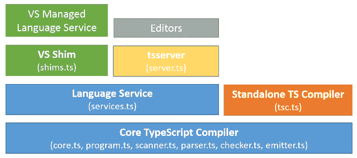
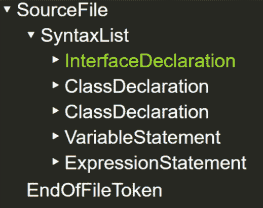
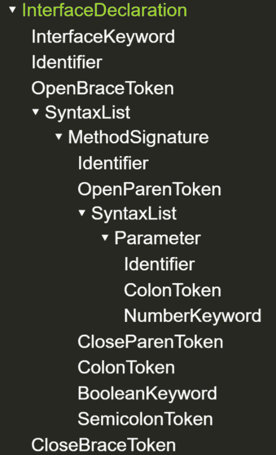
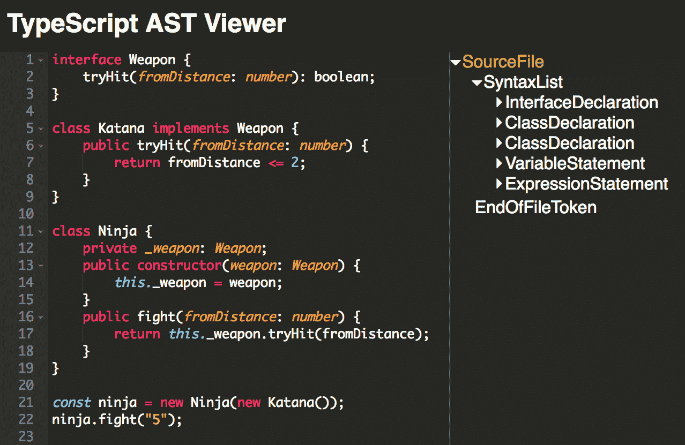
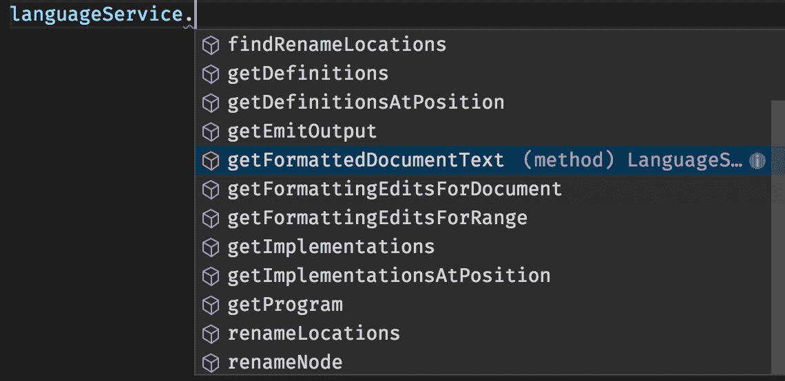
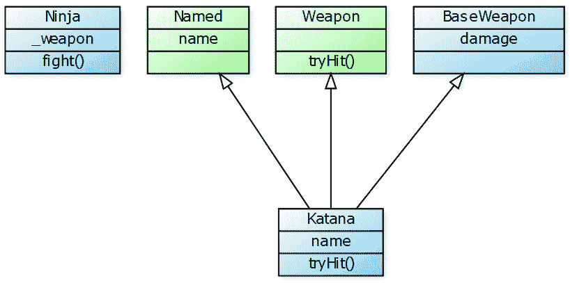

# 使用 TypeScript 编译器和语言服务

在本章中，我们将学习 TypeScript 编译器和 TypeScript 语言服务的内部机制。

这些主题可能看起来非常高级，并不是每个人都觉得有用。虽然它确实是高级用户的话题，但事实是，每个人都可以从理解 TypeScript 语言服务中受益。理解 TypeScript 编译器的编译器 API 可以帮助我们开发许多种类的开发工具，并自动化我们开发工作流程的某些方面。

本章的目标不是让你成为编译器内部或 TypeScript 工具开发的专家，而是温和地引导你了解这个非常广泛的主题。在本章中，我们将涵盖以下内容：

+   TypeScript 编译器的内部架构

+   使用编译器 API 进行编程

+   使用 `ts-simple-ast` 进行操作

+   实现自定义代码分析工具

# TypeScript 编译器的内部架构

在本节中，我们将学习 TypeScript 编译器中的主要组件。我们将学习每个组件的主要职责，以及它们的预期输入和输出。

以下图表描述了 TypeScript 架构的主要组件：



TypeScript 架构的组成部分

TypeScript 核心 API 是所有事物的基石，由扫描器、解析器、绑定器、类型检查器和发射器等元素组成。

语言服务和独立编译器（`tsc` 命令行工具）位于核心编译器 API 之上。最后，Visual Studio 适配器和 TypeScript 独立服务器（`tsserver`）被设计用来促进 TypeScript 与 Visual Studio 和其他源代码编辑器的集成。

TypeScript 的官方文档将 TypeScript 独立服务器定义为以下内容：

"TypeScript 独立服务器（又称 tsserver）是一个封装 TypeScript 编译器和语言服务并通过 JSON 协议暴露它们的 Node 可执行文件。tsserver 非常适合编辑器和 IDE 支持。"

# 扫描器

扫描器将源代码文件转换成标记流。扫描器在其他关于编译器的资源中也被称为**词法分析器**。扫描器被解析器使用。

# 词素和标记

词素是源程序中匹配标记模式的字符序列。我们可以这样说，标记有一个模式，而在某些情况下，模式可以由许多词素匹配。因此，在编程语言中，存在无限多的潜在词素和有限的标记数量。

理解词素和标记之间的区别的最简单方法是通过查看以下代码片段的例子：

```js
while (y >= t) y = y - 3; 
```

以下代码片段将被解析成以下词素和标记：

| **词素** | **标记** |
| --- | --- |
| `while` | `WhileKeyword` |
| `(` | `OpenParenToken` |
| `y` | `Identifier` |
| `>=` | `GreaterThanEqualsToken` |
| `t` | `Identifier` |
| `)` | `CloseParenToken` |
| `y` | `Identifier` |
| `=` | `EqualsToken` |
| `y` | `Identifier` |
| `-` | `MinusToken` |
| `3` | `NumericLiteral` |
| `;` | `SemicolonToken` |
|  | `EndOfFileToken` |

在 TypeScript 中，标记在`SyntaxKind`枚举中定义：

```js
export const enum SyntaxKind { 
    Unknown, 
    EndOfFileToken, 
    SingleLineCommentTrivia, 
    MultiLineCommentTrivia, 
    NewLineTrivia, 
    WhitespaceTrivia, 
    ShebangTrivia, 
    ConflictMarkerTrivia, 
    NumericLiteral, 
    StringLiteral, 
    JsxText, 
    //... 
```

`SyntaxtKind`枚举在 TypeScript 源代码的[/src/compiler/types.ts](https://github.com/Microsoft/TypeScript/blob/b31aa4e012fc4c2afc9c2200f18b9e79edac160b/src/compiler/types.ts#L80)文件中定义。

如果您想探索 TypeScript 项目的整个源代码，请参阅 GitHub 上的官方 TypeScript 仓库[`github.com/Microsoft/TypeScript`](https://github.com/Microsoft/TypeScript)。

# 解析器

TypeScript 解析器使用扫描器遍历我们的源代码文件并将它们转换成标记流。

TypeScript 解析器然后将标记流转换成一个称为抽象语法树（AST）的树状数据结构。这个树状数据结构中的每个元素都称为节点。节点是 AST 的基本构建块。

# AST

**抽象语法树**（**AST**）是由解析器创建的树状数据结构。这种数据结构允许 TypeScript 编译器遍历我们的源代码以执行许多核心任务，例如生成输出 JavaScript 代码。我们将在本章后面了解更多关于 AST 的内容。

# 符号

Basarat Ali Syed 编写的 TypeScript 教科书将符号描述如下：

"符号将 AST 中的声明节点与其他贡献同一实体的声明连接起来。符号是语义系统的基本构建块。"

符号类在 TypeScript 源代码中定义如下：

```js
function Symbol(this: Symbol, flags: SymbolFlags, name: __String) { 
    this.flags = flags; 
    this.escapedName = name; 
    this.declarations = undefined; 
    this.valueDeclaration = undefined; 
    this.id = undefined; 
    this.mergeId = undefined; 
    this.parent = undefined; 
}
```

一个符号包含对类型声明的引用和一些帮助我们识别其某些特性的标志。

# 绑定器

Basarat Ali Syed 编写的 TypeScript 教科书将绑定器描述如下：

"绑定器用于将源代码的各个部分连接成一个连贯的类型系统，然后该系统可以被检查器使用。绑定器的主要责任是创建符号。"

TypeScript 支持一个称为*声明合并*的功能，允许我们将使用相同名称声明的两个单独的声明合并为一个单一的定义。例如，以下代码片段声明了两个名为`Person`的接口和一个名为`person`的变量：

```js
interface Person { 
    name: string; 
} 

interface Person { 
    surname: string; 
} 

const person: Person = { name: "Remo", surname: "Jansen" }; 
```

变量的类型是`Person`，正如我们所见，该类型包含在先前声明的接口中声明的属性。这是因为声明合并机制将这两个声明合并为一个唯一的类型。这与绑定器的行为直接相关。

# 类型检查器

类型检查器可能是 TypeScript 编译器中最重要的组件。类型检查器使用抽象语法树（每个文件一个）和符号作为输入，并负责监督源代码中类型错误的识别。

# 发射器

发射器是负责生成输出代码的组件。输出通常是遵循支持的规范之一（ES3、ES5 或 ES6）的 JavaScript，但它也可以是类型定义或源映射文件。

# 语言服务

TypeScript 编译器包括一个专门设计来为开发者提供良好开发体验的附加组件。以下段落是从官方 TypeScript 文档中提取的：

“语言服务”在核心编译器管道周围提供了一个额外的层，非常适合类似编辑器的应用程序。语言服务支持典型的编辑器操作集，如语句完成、签名帮助、代码格式化和大纲、着色等。基本的重构，如重命名，调试接口辅助，如验证断点，以及 TypeScript 特定的功能，如支持增量编译（命令行上的--watch 等效）。语言服务旨在高效地处理在长期编译上下文中随时间变化的文件场景；从这个意义上说，语言服务从其他编译器接口的角度来看，对与程序和源文件的工作提供了略微不同的视角。”

# 理解抽象语法树（AST）

正如我们已经学到的，**抽象语法树**（AST）是一种树形数据结构，用于表示用编程语言编写的源代码的抽象句法结构。AST 的每个节点都代表源代码中发生的一个构造。

现在我们将查看一个小型的 TypeScript 代码片段，以详细了解 AST。以下代码片段没有什么特别之处——它只是声明了一个名为`Weapon`的接口和几个类，名为`Katana`和`Ninja`。然后它创建了一个`Ninja`类的实例并调用了它的一种方法：

```js
interface Weapon { 
    tryHit(fromDistance: number): boolean; 
} 

class Katana implements Weapon { 
    public tryHit(fromDistance: number) { 
        return fromDistance <= 2; 
    } 
} 

class Ninja { 
    private _weapon: Weapon; 
    public constructor(weapon: Weapon) { 
        this._weapon = weapon; 
    } 
    public fight(fromDistance: number) { 
        return this._weapon.tryHit(fromDistance); 
    } 
} 

const ninja = new Ninja(new Katana()); 
ninja.fight("5"); 
```

TypeScript 编译器生成的先前代码片段的 AST 如下所示：



为了便于理解，已经删除了先前 AST 的一些节点。我们可以看到 AST 从`SourceFile`节点开始，以`EndOfFileToken`节点结束。在这两个节点之间，我们有一个接口声明节点（`InterfaceDeclaration`），两个类声明节点（`ClassDeclaration`），一个变量声明节点（`VariableStatement`），以及最终的方法调用节点（`ExpressionStatement`）。

我们现在将关注这些节点中的一个：表示接口声明的节点（`InterfaceDeclaration`）。正如我们之前看到的，接口声明看起来如下：

```js
interface Weapon { 
    tryHit(fromDistance: number): boolean; 
} 
```

前面代码片段的 AST 中的 `InterfaceDeclaration` 节点如下所示：



在前面 AST 的表示中，我们可以看到组成接口声明 AST 且具有唯一方法签名的每个节点的名称。例如，我们可以看到声明从表示 `interface` 关键字的节点（`InterfaceKeyword`）开始，并且其后是接口的名称（`Identifier`）。我们还可以看到 `tryHit` 方法接受一个数字（`NumberKeyword`）作为参数，并返回一个布尔值（`BooleanKeyword`）。

AST 节点具有某些属性。例如，前面示例中的 `NumberKeyword` 具有以下属性：

```js
NumberKeyword 
pos:43 
start:44 
end:50 
flags:0 
kind:133 
```

这些属性使我们能够识别节点的类型（`kind` 属性）及其在源代码中的位置（`pos` 和 `end` 属性）。`kind` 是对 `Token` 的引用。值 `133` 是 `SyntaxKind` 枚举中 `NumberKeyword` 属性的值。

现在我们已经知道了 TypeScript AST 是什么以及它的样子。在接下来的部分，我们将学习一个可以帮助我们可视化 AST 的工具。

# TypeScript AST 查看器

TypeScript AST 查看器是一个开源应用程序，允许我们探索给定 TypeScript 代码片段的 AST。此应用程序可在 [`ts-ast-viewer.com`](http://ts-ast-viewer.com) 上在线使用：



# 示例应用程序

伴随源代码包括一个非常小的应用程序，我们将在本章的其余部分使用它。以下小节描述了示例应用程序中的每个组件。

# interfaces.ts

`interfaces.ts` 文件声明并导出了一些接口：

```js
export interface Weapon { 
    tryHit(fromDistance: number): boolean; 
} 

export interface Named { 
    name: string; 
} 
```

# katana.ts

`katana.ts` 文件声明了一个名为 `BaseWeapon` 的基类和一个名为 `Katana` 的派生类：

```js
import { Weapon, Named } from "./interfaces"; 

export class BaseWeapon { 
    damage = 25; 
} 

export class Katana extends BaseWeapon implements Weapon, Named  { 
    name = "Katana"; 
    public tryHit(fromDistance: number) { 
        return fromDistance <= 2; 
    } 
} 
```

# ninja.ts

`ninja.ts` 文件声明了一个名为 `Ninja` 的类：

```js
import { Weapon } from "./interfaces"; 

export class Ninja { 
    private _weapon: Weapon; 
    public constructor(weapon: Weapon) { 
        this._weapon = weapon; 
    } 
    public fight(fromDistance: number) { 
        return this._weapon.tryHit(fromDistance); 
    } 
} 
```

# main.ts

`main.ts` 文件是应用程序的入口点。它创建了一个 `Katana` 实例和一个 `Ninja` 实例，然后调用 `Ninja` 实例的一个方法：

```js
import { Ninja } from "./ninja"; 
import { Katana } from "./katana"; 

const ninja = new Ninja(new Katana()); 

ninja.fight(5); 
```

# broken.ts

伴随源代码还包括一个名为 `broken.ts` 的文件。此文件故意包含一些编译错误，因为它用于演示如何执行错误诊断：

```js
import { Ninja } from "./ninja"; 
import { Katana } from "./katana"; 

const ninja = new Ninja(new Katana()); 

ninja.fight("5"); 
```

# 遍历 TypeScript AST

我们已经学习了如何使用在线 TypeScript AST 查看器可视化 TypeScript AST。在这个时候，我们自然会问自己所有这些信息是从哪里来的。在本节中，我们将演示如何使用 TypeScript 编译器 API 访问 AST。

在创建 `package.json` 文件并使用 `npm` 安装 TypeScript 之后，我们首先需要做的是创建一个新的 TypeScript 文件并将 TypeScript 作为模块导入：

```js
import * as ts from "typescript"; 
```

然后我们需要使用对象字面量声明 TypeScript 编译器的配置：

```js
const options = { 
    module: ts.ModuleKind.CommonJS, 
    target: ts.ScriptTarget.ES5, 
}; 
```

接下来，我们需要创建一个新的程序：

```js
const program = ts.createProgram( 
    [ 
        "./app/interfaces.ts", 
        "./app/ninja.ts", 
        "./app/katana.ts", 
        "./app/main.ts" 
    ], 
    options 
); 
```

程序是一组源文件和一组表示编译单元的编译选项的集合。程序是类型系统和代码生成系统的主入口点。

然后我们需要创建 TypeScript 类型检查器的实例：

```js
const checker = program.getTypeChecker(); 
```

到目前为止，我们可以编写一些代码来遍历程序中的源文件。以下代码片段遍历给定源文件的 AST，并返回每个文件中声明的类和接口列表。

它使用程序实例的 `getSourceFiles` 方法来访问程序中的源文件。`lib.d.ts` 文件和 `node_modules` 目录下的文件将被忽略。

代码片段使用名为 `visit` 的递归函数来遍历 AST 中的节点。递归函数将每个节点与我们要查找的标记（`ClassDeclaration` 和 `InterfaceDeclaration`）进行比较，以识别类和接口：

```js
interface Result { 
    fileName: string; 
    classes: string[]; 
    interfaces: string[]; 
} 

const entities = program.getSourceFiles().map(file => { 

    if ( 
        file.fileName.indexOf("lib.d.ts") !== -1 || 
        file.fileName.indexOf("node_modules") !== -1 
    ) { 
        return null; 
    } 

    const result = { 
        fileName: file.fileName, 
        classes: [] as string[], 
        interfaces: [] as string[] 
    }; 

    const visit = (node: ts.Node) => { 
        if (node.kind === ts.SyntaxKind.ClassDeclaration) { 
            // Find class identifier 
            node.getChildren().forEach(n => { 
                if (n.kind === ts.SyntaxKind.Identifier) { 
                    const name = (n as ts.Identifier).getFullText(); 
                    result.classes.push(name); 
                } 
            }); 
        } else if (node.kind === ts.SyntaxKind.InterfaceDeclaration) { 
            // Find interface identifier 
            node.getChildren().forEach(n => { 
                if (n.kind === ts.SyntaxKind.Identifier) { 
                    const name = (n as ts.Identifier).getFullText(); 
                    result.interfaces.push(name); 
                } 
            }); 
        } else if (node.kind === ts.SyntaxKind.ModuleDeclaration) { 
            // Iterate module nodes 
            ts.forEachChild(node, visit); 
        } 
    }; 

    ts.forEachChild(file, visit); 
    return result; 

}).filter(e => e !== null) as Result[]; 
```

如果找到的标记是模块声明，我们将再次调用递归函数 `visit`。一旦我们成功找到源代码中的所有类和接口，我们可以使用简单的 `forEach` 循环在控制台中显示它们：

```js
entities.forEach(e => { 
    console.log(chalk.cyan(` 
        FILE: ${e.fileName}n 
        CLASSES: ${e.classes.length > 0 ? e.classes : "N/A"}n 
        INTERFACES: ${e.interfaces.length > 0 ? e.interfaces : "N/A"}n 
    `)); 
}); 
```

注意，`chalk` 模块可以通过 `npm` 安装，并用于在控制台输出中显示彩色文本。

现在我们知道了如何访问和遍历 TypeScript AST。正如我们所见，创建此类任务所需的过程相当繁琐。然而，有一个开源工具可以帮助我们轻松地遍历 TypeScript AST：`ts-simple-ast`。

# 使用 ts-simple-ast

正如我们在上一节中学到的，当涉及到与 TypeScript 一起工作时，AST 并不是很复杂。然而，有一个名为 `ts-simple-ast` 的开源 npm 模块可以使处理 TypeScript AST 更加容易！在本节中，我们将查看多个示例，以了解如何使用 `ts-simple-ast`。

# 使用 ts-simple-ast 遍历 AST

以下代码片段实现了一个几乎与上一节中实现的程序完全相同的应用程序。最显著的区别是，我们不是使用核心 TypeScript 编译器 API，而是将使用 `ts-simple-ast` 辅助工具：

```js
import chalk from "chalk"; 
import Ast, { DiagnosticMessageChain } from "ts-simple-ast"; 
```

以下函数在本章的许多示例中使用，用于根据某些文件和所需的编译器设置获取 TypeScript AST 的实例：

```js
function getAst(tsConfigPath: string, sourceFilesPath: string) { 
  const ast = new Ast({ 
    tsConfigFilePath: tsConfigPath, 
    addFilesFromTsConfig: false 
  }); 
  ast.addExistingSourceFiles(sourceFilesPath); 
  return ast; 
} 
```

我们可以使用 `getAst` 函数来访问 `ts-simple-ast` AST，然后使用 `getSourceFiles` 方法来访问程序中的源文件：

```js
const myAst = getAst("./tsconfig.json", "./app/*.ts"); 
const files = myAst.getSourceFiles(); 
```

到目前为止，我们可以使用 `getFilePath` 来获取源文件的路径，以及使用 `getClasses` 和 `getInterfaces` 方法来访问源文件中的类和接口声明：

```js
const entities = files.map(f => { 
  return { 
    fileName: f.getFilePath(), 
    classes: f.getClasses().map(c => c.getName()), 
    interfaces: f.getInterfaces().map(i => i.getName()) 
  }; 
}); 
```

如我们所见，`ts-simple-ast` 辅助工具可以极大地简化遍历 TypeScript AST 或搜索特定类型的实体。

最后，我们可以在命令行界面显示类的名称：

```js
entities.forEach(e => { 
  console.log( 
    chalk.cyan(` 
        FILE: ${e.fileName}n 
        CLASSES: ${e.classes.length > 0 ? e.classes : "N/A"}n 
        INTERFACES: ${e.interfaces.length > 0 ? e.interfaces : "N/A"}n 
    `) 
  ); 
}); 
```

# 使用 ts-simple-ast 进行诊断

以下代码片段实现了一个非常小的应用程序，该应用程序使用 `ts-simple-ast` 通过错误诊断 API 在 TypeScript 文件中查找错误。该应用程序使用 `chalk` npm 模块在命令行界面以红色字体显示错误：

```js
import chalk from "chalk"; 
import Ast, { DiagnosticMessageChain } from "ts-simple-ast"; 
```

以下函数是我们在前面部分使用的相同的 `getAst` 函数：

```js
function getAst(tsConfigPath: string, sourceFilesPath: string) { 
  const ast = new Ast({ 
    tsConfigFilePath: tsConfigPath, 
    addFilesFromTsConfig: false 
  }); 
  ast.addExistingSourceFiles(sourceFilesPath); 
  return ast; 
} 
```

`ts-simple-ast` 提供的 AST 包含一个名为 `getDiagnostics` 的方法，它允许我们访问检测到的编译错误。`getErrors` 函数展示了如何遍历每个诊断以及如何访问底层的 `DiagnosticMessageChain`。

方法 `diagnostic.getMessageText` 返回一个字符串或一个 `DiagnosticMessageChain`。`DiagnosticMessageChain` 实现了迭代器模式，这就是为什么我们使用 `DiagnosticMessageChain.getNext` 方法的原因：

```js
function getErrors(ast: Ast) { 

  const diagnostics = ast.getDiagnostics(); 

  function dmcToString(dmc: DiagnosticMessageChain, msg: string = ""): string { 
    const messageText = dmc.getMessageText(); 
    const code = dmc.getCode(); 
    msg += `${code} ${messageText}n`; 
    const next = dmc.getNext(); 
    return next ? dmcToString(next, msg) : msg; 
  } 

  const errors = diagnostics.map(diagnostic => { 
    const code = diagnostic.getCode(); 
    const sourceOrUndefined = diagnostic.getSourceFile(); 
    const source = sourceOrUndefined ? sourceOrUndefined.getFilePath() : ""; 
    const line = sourceOrUndefined 
      ? sourceOrUndefined.getLineNumberFromPos(diagnostic.getStart() || 0) 
      : ""; 
    const stringOrDMC = diagnostic.getMessageText(); 
    const messageText = 
      typeof stringOrDMC === "string" ? stringOrDMC : dmcToString(stringOrDMC); 
    return ` 
            ERROR CODE: ${code} 
            DESCRIPTION: ${messageText} 
            FILE: ${source} 
            LINE: ${line} 
        `; 
  }); 

  return errors; 
} 

const myAst = getAst("./tsconfig.json", "./app/broken.ts"); 

getErrors(myAst).forEach(err => console.log(chalk.red(err))); 
```

# 使用 ts-simple-ast 访问类详情

以下代码片段演示了我们可以如何使用 `ts-simple-ast` API 来访问和操作类声明。

注意，前面的示例不是用来执行的。它展示了 `ts-simple-ast` API 中可用的方法，但它不是一个可执行的演示。

就像前面的示例一样，我们将使用 `getAst`、`getSourceFiles` 和 `getClasses` 方法来找到我们源代码中的所有类声明。

然后，我们将使用一些工具来访问类声明的详细信息，包括方法、派生类和属性等。我们还将演示如何通过添加基类或新方法等操作来修改类声明：

```js
import chalk from "chalk"; 
import Ast, { DiagnosticMessageChain } from "ts-simple-ast"; 

function getAst(tsConfigPath: string, sourceFilesPath: string) { 
    const ast = new Ast({ 
      tsConfigFilePath: tsConfigPath, 
      addFilesFromTsConfig: false 
    }); 
    ast.addExistingSourceFiles(sourceFilesPath); 
    return ast; 
} 

const myAst = getAst("./tsconfig.json", "./app/*.ts"); 
const files = myAst.getSourceFiles(); 

files.forEach(file => { 

    // Find all classes 
    const classes = file.getClasses(); 

    // Find class by name 
    const class1 = file.getClass("Katana"); 

    // Find class with no constructors 
    const firstClassWithConstructor = file.getClass( 
        c => c.getConstructors().length > 0 
    ); 

    // Add a class 
    const classDeclaration = file.addClass({ 
        name: "ClassName" 
    }); 

    // Get extends 
    const extendsExpression = classDeclaration.getExtends(); 

    // Set extends 
    classDeclaration.setExtends("BaseClass"); 

    // Remove extends 
    classDeclaration.removeExtends(); 

    // Get derived classes 
    const derivedClasses = classDeclaration.getDerivedClasses(); 

    // Remove one class 
    if (classDeclaration) { 
        classDeclaration.remove(); 
    } 

    // Get instance methods 
    const instanceMethods = classDeclaration.getInstanceMethods(); 

    // Get static methods 
    const staticMethods = classDeclaration.getStaticMethods(); 

    // Add method 
    const method = classDeclaration.addMethod( 
        { isStatic: true, name: "myMethod", returnType: "string" } 
    ); 

    // Remove method 
    method.remove(); 

    // Get instance properties 
    const instanceProperties = classDeclaration.getInstanceProperties(); 

    // Get static properties 
    const staticProperties = classDeclaration.getStaticProperties(); 

    // Add a property 
    const property = classDeclaration.addProperty({ isStatic: true, name: "prop", type: "string" }); 

    // Remove property 
    property.remove(); 

}); 
```

# 使用 ts-simple-ast 访问模块详情

以下代码片段演示了我们可以如何使用 `ts-simple-ast` API 来访问和操作模块 `import` 和 `export` 声明。

注意，前面的示例不是用来执行的。它展示了 `ts-simple-ast` API 中可用的方法，但它不是一个可执行的演示。

就像前面的示例一样，我们将使用 `getAst` 和 `getSourceFiles` 方法来访问源代码的对象：

```js
import chalk from "chalk"; 
import Ast, { DiagnosticMessageChain } from "ts-simple-ast"; 

function getAst(tsConfigPath: string, sourceFilesPath: string) { 
    const ast = new Ast({ 
      tsConfigFilePath: tsConfigPath, 
      addFilesFromTsConfig: false 
    }); 
    ast.addExistingSourceFiles(sourceFilesPath); 
    return ast; 
} 

const myAst = getAst("./tsconfig.json", "./app/*.ts"); 
const files = myAst.getSourceFiles(); 
```

然后，我们将使用一些方法来访问模块 `import` 和 `export` 声明的详细信息。我们还演示了如何通过添加默认的 `export` 等操作来添加和删除模块 `import` 和 `export` 声明：

```js
files.forEach(file => { 

  const functionDeclaration = file.getFunction("someFunction"); 

  if (functionDeclaration) { 

    // Is exported 
    functionDeclaration.isExported(); 
    functionDeclaration.isNamedExport(); 
    functionDeclaration.isDefaultExport(); 

    // Has export keyword 
    functionDeclaration.hasExportKeyword(); 
    functionDeclaration.hasDefaultKeyword(); 

    // Access export keywords 
    functionDeclaration.getExportKeyword(); 
    functionDeclaration.getDefaultKeyword(); 

    // Set is export 
    functionDeclaration.setIsDefaultExport(true);  
    functionDeclaration.setIsDefaultExport(false); 

    // Set is exported 
    functionDeclaration.setIsExported(true);  
    functionDeclaration.setIsExported(false); 

  } 

  // Get all imports 
  const imports = file.getImportDeclarations(); 

  // Add import 
  const importDeclaration = file.addImportDeclaration({ 
      defaultImport: "MyClass", 
      moduleSpecifier: "./file" 
  }); 

  // Remove import 
  importDeclaration.remove(); 

  // Get default import 
  const defaultImport = importDeclaration.getDefaultImport(); 

  // Get named imports 
  const namedImports = importDeclaration.getNamedImports(); 

  // Add named import 
  const namedImport = importDeclaration.addNamedImport({ 
      name: "MyClass", 
      alias: "MyAliasName" // alias is optional 
  }); 

  // Remove named import 
  namedImport.remove(); 

}); 
```

# 访问语言服务 API

语言服务 API 建立在核心编译器 API 之上，它被设计用来为软件工程师提供独立于他们选择的 IDE 或代码编辑器的优秀开发体验。

我们将使用`ts-simple-ast`来访问语言服务 API。我们可以在 AST 实例中使用`getLanguageService`方法来访问语言服务 API：

```js
myAst.getLanguageService(); 
```

语言服务 API 实现了允许我们执行常见编辑任务的方法，例如重命名变量或自动实现接口。以下截图显示了语言服务 API 中的一些可用方法：



现在，我们将创建一个非常小的应用程序，该应用程序使用语言服务 API 在配套源代码中包含的示例应用程序中查找接口。该应用程序将显示每个接口及其实现的名称：

```js
import chalk from "chalk"; 
import { flatten, join } from "lodash"; 
import Ast, { DiagnosticMessageChain } from "ts-simple-ast"; 
import * as ts from "typescript"; 

function getAst(tsConfigPath: string, sourceFilesPath: string) { 
    const ast = new Ast({ 
      tsConfigFilePath: tsConfigPath, 
      addFilesFromTsConfig: false 
    }); 
    ast.addExistingSourceFiles(sourceFilesPath); 
    return ast; 
} 

const myAst = getAst("./tsconfig.json", "./app/*.ts"); 
const languageService = myAst.getLanguageService(); 
const files = myAst.getSourceFiles(); 
const interfaceDeclarations = flatten(files.map(f => f.getInterfaces())); 
```

然后，我们需要使用`getName`方法找到每个接口声明的名称。

我们也将尝试使用`getImplementations`方法找到它们的每个实现，这个方法是语言服务 API 的一部分。该方法期望我们传递声明接口的节点。节点可以通过`interfaceDeclaration.getNameNode`方法访问。

一旦我们找到了实现，我们需要找到它们的名称。我们通过搜索称为`Identifier`类型的节点的名称来完成此操作：

```js
const result = interfaceDeclarations.map(interfaceDeclaration => { 

    const interfaceName = interfaceDeclaration.getName(); 

    const implementations = languageService.getImplementations( 
        interfaceDeclaration.getNameNode() 
    ); 

    const implementationNames = implementations.map(implementation => { 
        const children = implementation.getNode().getChildren(); 
        const identifier = children.filter( 
            child => child.getKind() === ts.SyntaxKind.Identifier 
        )[0]; 
        const implementationName = identifier.getText(); 
        return implementationName; 
    }); 

    return { 
        interface: interfaceName, 
        implementations: implementationNames 
    }; 

}); 
```

最后，我们在控制台中显示结果：

```js
console.log( 
    result.forEach( 
        o => console.log( 
            `- ${o.interface} is implemented by ${join(o.implementations, ",")}` 
        ) 
    ) 
); 
```

如果我们执行应用程序，我们应该能够在我们的控制台中看到以下内容显示：

```js
- Weapon is implemented by Katana 
- Named is implemented by Katana 
```

自从 TypeScript 2.2 以来，可以编写语言服务插件来扩展语言服务 API。自定义语言服务可以帮助开发者获得更好的开发体验。例如，有一个语言服务在开发者处理 GraphQL 查询时提供自动完成和错误诊断功能。在此之前，GraphQL 查询只是文本，因此它们在实现上有些繁琐。实现我们的语言服务插件超出了本书的范围，但如果你希望了解更多，你可以在[`github.com/Microsoft/TypeScript/wiki/Writing-a-Language-Service-Plugin`](https://github.com/Microsoft/TypeScript/wiki/Writing-a-Language-Service-Plugin)上学习。

# 实现一个 yUML 编译器

在本节中，我们将把在本章中学到的所有内容整合起来，创建一个自定义的开发工具。我们将编写一个工具，它接受 TypeScript 源代码作为输入，并生成一个**统一建模语言**（**UML**）类图。类图通过显示系统的类、它们的属性、方法和对象之间的关系来描述系统的结构。

类图看起来如下：



我们将使用 TypeScript 编译器 API 和 `ts-simple-ast` 来遍历由配套源代码中包含的示例应用程序生成的 AST。然后，我们将以一个称为 yUML 的**领域特定语言**（**DSL**）的形式生成一些代码。最后，我们将 yUML DSL 发布到在线服务以生成图像。我们将从 TypeScript 转换为 yUML，这意味着我们可以将此视为创建一个 yUML 编译器。

我们将首先导入一些必需的模块：

```js
import * as fs from "fs"; 
import { flatten, join } from "lodash"; 
import * as path from "path"; 
import * as request from "request"; 
import Ast, * as SimpleAST from "ts-simple-ast"; 
import * as ts from "typescript"; 
```

`fs` 和 `path` 模块是 Node.js 的原生核心模块，不需要安装。但是，我们需要 Node.js 的类型定义（`@types/node`）。

注意，`flatten` 函数是 `lodash` npm 模块的一部分。此函数允许我们将多维数组（例如，数组数组）转换为只有一个维度的数组。

然后，我们将声明两个接口，用于表示类、方法或属性的详细信息。在这个例子中，我们只将使用方法或属性的名称：

```js
interface MethodDetails { 
  name: string; 
} 

interface PropertyDetails { 
  name: string; 
} 
```

以下代码片段声明了一个名为 `templates` 的常量变量。模板是接受名称并返回包含 yUML DSL 片段的字符串的函数：

```js
const templates = { 
  url: (dsl: string) => `http://yuml.me/diagram/scruffy/class/${dsl}`, 
  composition: "+->", 
  implementsOrExtends: (abstraction: string, implementation: string) => { 
    return ( 
      `${templates.plainClassOrInterface(abstraction)}` + 
      `^-${templates.plainClassOrInterface(implementation)}` 
    ); 
  }, 
  plainClassOrInterface: (name: string) => `[${name}]`, 
  colorClass: (name: string) => `[${name}{bg:skyblue}]`, 
  colorInterface: (name: string) => `[${name}{bg:palegreen}]`, 
  class: (name: string, props: PropertyDetails[], methods: MethodDetails[]) => { 
    const pTemplate = (property: PropertyDetails) => `${property.name};`; 
    const mTemplate = (method: MethodDetails) => `${method.name}();`; 
    return ( 
      `${templates.colorClass(name)}` + 
      `[${name}|${props.map(pTemplate)}|${methods.map(mTemplate)}]` 
    ); 
  }, 
  interface: ( 
    name: string, 
    props: PropertyDetails[], 
    methods: MethodDetails[] 
  ) => { 
    const pTemplate = (property: PropertyDetails) => `${property.name};`; 
    const mTemplate = (method: MethodDetails) => `${method.name}();`; 
    return ( 
      `${templates.colorInterface(name)}` + 
      `[${name}|${props.map(pTemplate)}|${methods.map(mTemplate)}]` 
    ); 
  } 
}; 
```

以下函数用于获取给定源文件的 AST：

```js
function getAst(tsConfigPath: string, sourceFilesPaths?: string[]) { 
  const ast = new Ast({ 
    tsConfigFilePath: tsConfigPath, 
    addFilesFromTsConfig: !Array.isArray(sourceFilesPaths) 
  }); 
  if (sourceFilesPaths) { 
    ast.addExistingSourceFiles(sourceFilesPaths); 
  } 
  return ast; 
} 
```

以下函数生成类声明的 yUML DSL。我们遍历 AST，寻找属性和方法：

```js
function emitClass(classDeclaration: SimpleAST.ClassDeclaration) { 

  const className = classDeclaration.getSymbol()!.getName(); 
  const propertyDeclarations = classDeclaration.getProperties(); 
  const methodDeclarations = classDeclaration.getMethods(); 

  const properties = propertyDeclarations.map(property => { 
      const sym = property.getSymbol(); 
      if (sym) { 
          return { 
              name: sym.getName() 
          }; 
      } 
  }).filter((p) => p !== undefined) as PropertyDetails[]; 

  const methods = methodDeclarations.map(method => { 
    const sym = method.getSymbol(); 
    if (sym) { 
        return { 
            name: sym.getName() 
        } 
    } 
  }).filter((p) => p !== undefined) as MethodDetails[]; 

  return templates.class(className, properties, methods); 
} 
```

以下函数生成接口声明的 yUML DSL。我们遍历 AST，寻找属性和方法：

```js
function emitInterface(interfaceDeclaration: SimpleAST.InterfaceDeclaration) { 

  const interfaceName = interfaceDeclaration.getSymbol()!.getName(); 
  const propertyDeclarations = interfaceDeclaration.getProperties(); 
  const methodDeclarations = interfaceDeclaration.getMethods(); 

  const properties = propertyDeclarations.map(property => { 
      const sym = property.getSymbol(); 
      if (sym) { 
          return { 
              name: sym.getName() 
          } 
      } 
  }).filter((p) => p !== undefined) as PropertyDetails[]; 

  const methods = methodDeclarations.map(method => { 
      const sym = method.getSymbol(); 
      if (sym) { 
          return { 
              name: sym.getName() 
          } 
      } 
  }).filter((p) => p !== undefined) as MethodDetails[]; 

  return templates.interface(interfaceName, properties, methods); 
} 
```

以下函数生成继承子句的 yUML DSL。这包括通过使用 `extends` 和 `implements` 关键字在源代码中定义的关系：

```js
function emitInheritanceRelationships( 
  classDeclaration: SimpleAST.ClassDeclaration 
) { 

  const className = classDeclaration.getSymbol()!.getName(); 
  const extended =  classDeclaration.getExtends(); 
  const implemented =  classDeclaration.getImplements(); 
  let heritageClauses: HeritageClause[] = []; 

  if (extended) { 
      const identifier = extended.getChildrenOfKind(ts.SyntaxKind.Identifier)[0]; 
      if (identifier) { 
          const sym = identifier.getSymbol(); 
          if (sym) { 
              heritageClauses.push( 
                  { 
                      clause: sym.getName(), 
                      className 
                  } 
              ); 
          } 
      } 
  } 

  if (implemented) { 
      implemented.forEach(i => { 
          const identifier = i.getChildrenOfKind(ts.SyntaxKind.Identifier)[0]; 
          if (identifier) { 
              const sym = identifier.getSymbol(); 
              if (sym) { 
                  heritageClauses.push( 
                      { 
                          clause: sym.getName(), 
                          className 
                      } 
                  ); 
              } 
          } 
      }); 
  } 

  return flatten(heritageClauses).map((c: HeritageClause) => 
    templates.implementsOrExtends(c.clause, c.className) 
  ); 

} 
```

以下函数使用 yUML 网络服务将 UML 图表渲染到 `.png` 文件。我们使用 `request` npm 模块调用该网络服务：

`request` 模块用于下载渲染后的图像。然后使用 Node.js 文件系统 API 将图像保存到当前目录：

```js
function render(dsl: string) { 
  const download = (uri: string, filename: string, callback: () => void) => { 
    request.head(uri, (err, res, body) => { 
      request(uri) 
        .pipe(fs.createWriteStream(filename)) 
        .on("close", callback); 
    }); 
  }; 

  const url = templates.url(dsl); 
  const file = `uml_diagram_${new Date().getTime()}.png`; 
  const absolutePath = path.join(__dirname, file); 

  download(url, file, () => 
    console.log(`Saved UML diagram available at ${absolutePath}`) 
  ); 
} 
```

以下函数为给定的 TypeScript 文件生成 yUML DSL。此函数将工作委托给先前定义的 `getAst`、`emitClass`、`emitInterface` 和 `emitInheritanceRelationships` 函数：

```js
function yUML(tsConfigPath: string, sourceFilesPaths: string[]) { 
  const ast = getAst(tsConfigPath, sourceFilesPaths); 
  const files = ast.getSourceFiles(); 

  const declarations = files.map(f => { 
    return { 
      fileName: f.getFilePath(), 
      classes: f.getClasses(), 
      interfaces: f.getInterfaces() 
    }; 
  }); 

  const entities = declarations.map(d => { 
    const classes = d.classes.map(emitClass); 
    const interfaces = d.interfaces.map(emitInterface); 
    const inheritanceRelationships = d.classes.map( 
      emitInheritanceRelationships 
    ); 
    return [...classes, ...interfaces, ...inheritanceRelationships]; 
  }); 

  return join(flatten(entities), ","); 
} 
```

到目前为止，我们已经实现了整个应用程序，并且可以调用 yUML 函数来为给定的文件生成 yUML DSL：

```js
const yuml = yUML("./tsconfig.json", [ 
  "./app/interfaces.ts", 
  "./app/ninja.ts", 
  "./app/katana.ts", 
  "./app/main.ts" 
]); 
```

最后，我们可以调用 `render` 函数：

```js
render(yuml); 
```

请参阅官方 `ts-simple-ast` 文档 [`dsherret.github.io/ts-simple-ast/`](https://dsherret.github.io/ts-simple-ast/) 了解更多关于可用 API 的信息。

# VS Code 扩展

开发 Visual Studio 扩展超出了本书的范围。然而，值得一提的是，可以使用 TypeScript 开发 VS Code 扩展。这意味着我们可以将我们的自定义命令行 TypeScript 工具，如 UML 图生成器，转换成 VS Code 扩展，而不会遇到太多复杂的问题。

请参考关于在 [`code.visualstudio.com/docs/extensions/overview`](https://code.visualstudio.com/docs/extensions/overview) 开发扩展的官方 VS Code 文档以获取更多信息。

# 摘要

在本章中，我们学习了 TypeScript 编译器的内部组件。我们还学习了如何使用编译器 API 以及如何利用这些特性来开发我们的 TypeScript 开发工具。

我希望这一章能够激发你对 TypeScript 编译器内部结构和由 TypeScript 驱动的软件开发工具开发的兴趣。它们的潜力和日益增长的受欢迎程度将把 JavaScript 生态系统提升到新的水平。
