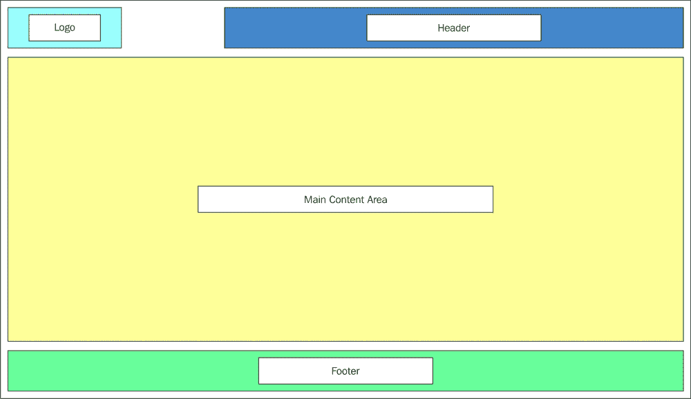
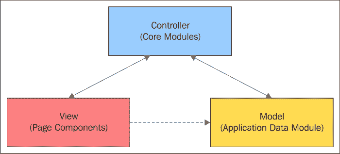
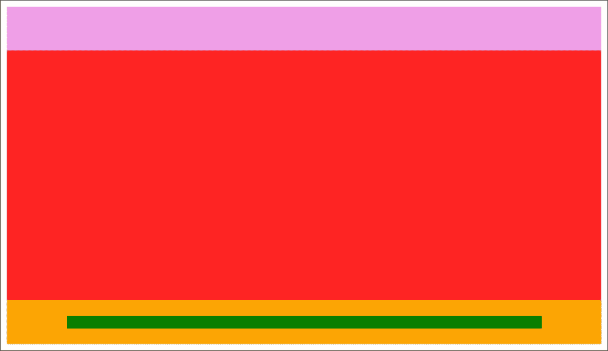
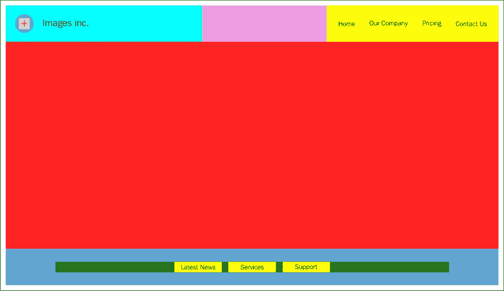

设计简单模块

在本章中，我们将专注于将我们在前几章中学到的概念应用到设计一些简单的模块中。

我们将首先分析应用的整体功能，然后将其分解成更小的功能组件。一旦我们决定了应用的功能组件，我们就会开始创建简单的模块来实现所需的功能。

本章旨在展示基于我们需求的应用生命周期初期的可能步骤。目标是了解使用模块如何帮助我们设计更好的架构，并感受模块化设计的实际优势。

本章中创建的简单模块将为本书中最终的应用提供基础，该应用将是一个工作的客户端单页应用。

本章我们将涵盖：

+   在我们的设计中反映整体应用需求

+   设计应用的主要部分

+   为应用的主要部分创建专用模块

+   模块间的协作

+   使用对象定义来描述页面片段

+   动态生成页面和页面片段

# 第四章：大局观

在我们开始任何编码之前，我们需要对应用的整体情况有一个很好的理解，包括需求是什么，以及需要哪些可能的功能组件来满足这些需求。

在应用设计的初期阶段，我们试图尽可能多地回答关于我们应用需求的问题，但我们始终应该努力不要被细节所束缚。

目标是确保大局正确，理解我们想要交付的内容，涉及的时间表以及可用的资源。基于这样的分析，我们可以开始为我们的应用创建一个可扩展、灵活和可扩展的架构设计。

我想提醒大家一个我在这里使用的重要词汇，**可扩展性**。应用能够轻松扩展的能力在适当的设计中非常重要。请记住，无论我们多么努力提前确定应用的所有需求，我们都不可能在开始时就预见所有这些需求。

需求会随时间变化，新的需求会被添加，旧的需求会被修改，甚至可能完全从应用的最终草案中删除。关键是要以能够适应所有这些变化而不对整体架构产生重大影响的方式来设计我们的应用。这正是模块化架构的优势所在，有助于减轻这种变化对整个应用可能产生的负面影响。

在牢记这些要点的同时，让我们来谈谈本书中我们将一起构建的应用。

## 我们的应用需求

我们的应用程序是一个简单但功能齐全的图片库应用程序。目标是向用户展示我们网站上美丽的图片目录。我们的网站访客可以点击每张图片以查看图片的全景，如果他们愿意，还可以将这些图片添加到他们的收藏夹中。

应用程序将有一个页眉，顶部的导航栏，中间的主要内容区域，页脚，当然还有标志。

如你所见，这里没有多少复杂的部分，但我向你保证，在底层有许多模块可以轻松地从本应用程序移植到许多其他更复杂的应用程序中。

让我们先创建一个应用程序的整体布局（线框图），看看整体情况是什么样的。



我已经在这个样图中确定了我们的索引页的主要部分。我们将创建模块来构建和更新这个页面，以及与之相关的其他部分和整个应用程序。

## 动态视图

我提到我们的 JavaScript 模块将为我们构建这个页面，我需要进一步解释这一点。

当我们创建模块来处理应用程序的功能部分时，我们将更进一步。我们还将创建专门在客户端动态构建我们页面（视图）的模块。

在这个设计中，我们只从服务器接收页面的大纲。页面将通过我们的视图生成模块根据发送到客户端的每个页面部分（片段）的对象定义来填充。

我们应用程序的整体架构基于**单页应用程序（SPA**）设计概念。如果你对这个术语不熟悉，其想法是，当我们浏览我们的应用程序页面（视图）时，我们不需要加载或构建从一个视图到下一个视图不改变的部分。我们只需在客户端动态更新视图的更改部分，同时保持其余视图不变。

由于我们在应用程序的视图中只进行有针对性的更改，因此我们视图的渲染将更加健壮和优化。

这也意味着在应用程序的初始加载之后，客户端将只从服务器请求应用程序更改的部分。因此，我们只会在带宽上传输页面片段，而不是整个页面。一般来说，当我们设计需要在有限带宽场景下运行的应用程序时，例如移动应用程序，这可以是一个很大的优势。

对于本书中的我们的应用程序，我们的页面片段作为对象定义传输到客户端，我们的视图生成专用模块将根据这样的对象定义渲染所需的视图。

你将看到，随着我们继续前进，我们如何在不久的将来实现这一点。

# 设计我们的 SPA 主要部分

通常在设计 SPA 应用程序时，我会创建一个核心应用程序代码库，在应用程序的初始加载阶段加载到浏览器中。这个代码库提供了与应用程序视图无关的应用程序级功能。应用程序核心由许多一起加载的模块组成。如果你熟悉 **模型-视图-控制器**（**MVC**）或 **模型-视图-通配符**（**MV***）应用程序设计模式，这个核心本质上就是应用程序的控制器。

### 注意

**MVC 和 MV* 设计模式**

这些设计模式在代码中创造了很好的专业化和关注点的分离。理解这些模式对于创建良好的应用程序架构非常重要。虽然我会在适当的时候提到这些模式，但深入探讨这些模式超出了本书的范围。

我推荐以下资源以获取更多信息：

[`www.packtpub.com/application-development/mastering-javascript-design-patterns/`](https://www.packtpub.com/application-development/mastering-javascript-design-patterns/)

[`addyosmani.com/blog/understanding-mvc-and-mvp-for-javascript-and-backbone-developers/`](https://addyosmani.com/blog/understanding-mvc-and-mvp-for-javascript-and-backbone-developers/)

应用程序的模式和视图也有它们自己的专用模块，其中一些在应用程序初始加载时加载，而另一些则在需要时动态加载。这种方法使得应用程序在浏览器中具有较小的占用空间，并且只加载所需的资源。

我通常还会尝试让我的应用程序的每一页在服务器端和客户端都是一个独立的模块（组件）。这提供了创建、修改或删除页面（组件）及其相关代码的能力，而不会影响应用程序的其他部分。

注意，我在这里使用“模块”这个词是一个通用术语，并不一定意味着使用模块模式构建的模块。我的意图是传达每个页面是应用程序中一个独立部分的观念，在这个部分中，可以使用一个或多个 JavaScript 模块来完成与该页面相关的工作。如果你不确定这究竟意味着什么，请放心，这很快就会变得清晰。

以下图展示了本书中应用程序的主要组件，按其特殊功能和设计进行了分类：



如图所示，我们的整体设计基于三个主要部分：**控制器**、**视图**和**模型**。在本章的剩余部分，我们将讨论每个部分，并基于我们的模块化架构开始构建它们。

## 应用程序控制器

控制器是包含应用主要功能的部件。本质上，控制器模块是应用的“大脑”。它将包括提供应用级功能的应用级模块。这个部件还将负责初始化应用中的所有其他模块和组件，并使用松耦合方法将它们粘合在一起。

### 应用控制器模块

如前所述，考虑到我们在应用中控制器的作用，我们将基于专用模块来设计这个部件。这些模块共同构成了我们将称之为**核心**模块的内容。

请记住，由于我们正在使用针对核心的专用模块，每个模块都可以轻松修改或替换，而不会影响应用的其他部分，即除了与该模块相关的功能之外，不会影响其他模块。

当然，如果我们决定在未来的某个时刻需要额外的功能，我们也可以向核心添加更多模块。

控制器模块的集体功能提供了应用的核心功能。

根据我们应用的需求，我预计我们将在应用控制器中需要以下模块：

+   页面更新模块

+   存储处理模块

+   通信处理模块

+   工具模块

+   消息处理模块

+   记录处理模块

请记住，我们正在尽我们最大的努力猜测所需的模块。随着我们进一步实施，这个列表可能会随着时间的推移而变化。我们的想法是设计和实现我们认为我们现在需要的模块，以有一个起始基线。然而，模块列表、它们的函数以及我们为它们选择的名称可能会随着时间的推移而变化。

让我们先来探讨一下我们应用核心中每个模块的功能。

#### 页面更新模块

这个模块负责构建应用中的 HTML 片段。它通过将传递给它的字符串注入到一个容器中来完成这项任务。这个字符串对应于需要渲染到预定义容器中的 HTML 元素。

我们将使用这个模块构建我们应用页面的各个部分，并根据需要动态更新它们。

#### 存储处理模块

这个模块有特定的责任，即存储与应用相关的数据。这些数据可以存储在 cookies 中，或者存储在浏览器提供的其他存储设施中，例如 HTML 5 本地存储。

#### 通信处理模块

所有与应用相关的通信都通过这个模块完成。这个模块主要设计用来使用 AJAX 调用与后端服务器通信。然而，这个模块使用的通信方法可能在未来的某个时刻不会仅限于 AJAX 调用。

#### 工具模块

此模块负责为应用程序提供实用类型的功能。例如，它可以进行字符串操作、对象克隆或页面尺寸计算。

#### 消息处理模块

随着应用程序中事件的发生，我们需要一种方式与用户沟通这些事件，并在应用程序的页面上显示消息。此模块专门负责这项任务。

#### 日志处理模块

此模块提供与应用程序日志机制相关的所有功能。日志可以在客户端、服务器端或两者同时进行。

## 创建我们的第一个核心模块

现在我们已经整理出了核心所需的可能模块列表，让我们创建应用程序控制器的第一个模块，即 `PageUpdater` 模块。此模块应设计为能够动态更新页面的一部分。这部分可以小到页面上的文本，也可以大到整个显示的页面。对页面片段的更新可以是微不足道的，如更改字体大小或背景颜色，也可以是复杂的，如完全重构和重新渲染页面片段。

### 我们第一个模块的结构

考虑以下：

```js
var PageUpdater = (function(){

    // module private function
    var insertHTMLTxt = function(containerID,newStructure){

        var theContainer = document.getElementById(containerID);
        theContainer.innerHTML = newStructure;
    };

    // module private function
    var applyElementCSS = function(elementID, className){

        var theElement = document.getElementById(elementID);
        theElement.className = className;
    };

    return{

        // privileged method
        updateElement : function(elemID, htmlTxt){

            insertHTMLTxt(elemID,htmlTxt);
        },

        // privileged method
        updateElementClass : function(elemId,className){

            if(!className){

                console.error('No class name has been provided, exiting module!');
            }
            applyElementCSS(elemId,className);
        }
    };

})();
```

上述代码实现了一个简单的模块，使我们能够对页面片段进行更新。让我们检查一下代码，看看它是如何组织的。

我们使用模块模式定义了一个 JavaScript 模块。IIFE 用于执行匿名函数中的代码，创建一个命名空间。从这个函数返回的是分配给我们的全局变量 `PageUpdater` 的对象。

在我们的立即执行函数表达式（IIFE）中，我们使用函数表达式定义了 `insertHTMLTxt` 和 `applyElementCSS` 方法属性。这两个方法被保留在我们主要容器函数的内部私有作用域中，因此外部代码无法访问它们。因此，我们保护它们免受意外和不希望的修改。

我们确实通过模块的接口提供了对这些方法的受控和间接访问，该接口是容器函数执行时返回的匿名对象。对这个返回对象的引用（我们的模块接口）被分配给 `PageUpdater` 变量。

因此，实际上这个变量（`PageUpdater`）真正引用的是以下对象：

```js
{   
        // privileged method
        updateElement : function(elemID, htmlTxt){

            insertHTMLTxt(elemID,htmlTxt);
        },
        // privileged method
        updateElementClass : function(elemId,className){

            if(!className){

                console.error('No class name has been provided, exiting module!');
            }
            applyElementCSS(elemId,className);
        }
};
```

由于这是一个普通的 JavaScript 对象，我们可以从外部代码调用其方法，如下所示：

```js
PageUpdater.updateElement("headerContainer",headerContainerDef.sectionHTML);
```

`PageUpdater` 对象的 `updateElement` 方法依次调用 `insertHTMLTxt(elemID,htmlTxt)`，这是在我们容器函数内部执行实际幕后工作的方法。

此方法接收两个参数：容器元素的 id (`containerID`), 我们打算更新其内容，以及一个字符串 (`newStructure`), 它是将在容器元素内部渲染的 HTML 元素的字符串表示。

如果你想知道`PageUpdater`对象如何调用容器函数内部的方法以及两者之间是如何建立链接的，你需要想到一个词：闭包！

我们在第二章重要 JavaScript OOP 概念的回顾中讨论了闭包。如果你还记得，由于我们的 IIFE 返回的匿名对象是在容器函数内部定义的，它能够访问容器函数的内部私有作用域。这意味着`PageUpdater`能够访问在该作用域内部定义的所有私有变量和方法。这就是为什么从模块返回作为接口部分的那些方法被称为，**特权方法**。

### 小贴士

**对模块模式理解有困难？**

我在这里花了一些时间深入解释我们的第一个简单模块。从现在开始，我将不会像之前那样详细解释创建我们模块（模块模式）所使用的模式。了解这个模式非常重要，因为应用中的其他模块都遵循类似的架构。

为了更好地理解模块模式，我建议做两件事。首先，复习第二章，*重要 JavaScript OOP 概念的回顾*和第三章，*模块设计模式*。其次，花些时间分析之前的代码，并再次阅读我的解释。我相信你很快就能很好地掌握这个模式。

注意，`PageUpdater`模块目前能够执行两项功能。它可以更新容器元素的`innerHTML`，同时也能够更新页面中元素的**CSS**类。

### 使用我们的第一个模块的功能

以下是我们通过调用其方法利用模块功能的一个示例：

```js
PageUpdater.updateElement("footerContainer", footerContainerDef.sectionHTML);

PageUpdater.updateElementClass("footerParentContainer", "footerContainerClass_Test");
```

上述代码的第一行根据预定义的对象定义填充了我们的应用页脚部分，我们将在本章稍后讨论这一点。第二行代码更改了页脚容器的 CSS 类，以应用不同的背景颜色到这个页面片段。本章的代码中包含了该操作的 CSS 类定义。

正如你所见，我们让模块负责页面片段更新的机制，而我们只需要通过为这个模块提供的接口进行简单的调用。

### 将我们的模块方法映射到其接口

关于我们模块的接口，有一个重要的点需要我们注意，这个点很容易被忽略。

如果您还记得，在 第三章 中提到的 *模块设计模式*，我提到模块可以自由实现其完成任务的方式，并且这种实现可以随时间变化。然而，模块应该保持其对外部世界的接口一致性。当然，这是因为模块的接口是模块的接触点，其他应用程序组件正是通过这个接口与之交互。

注意我们为我们的 `PageUpdater` 模块定义了以下接口：

```js
updateElementClass : function(elemId,className){

            if(!className){

                console.error('No class name has been provided, exiting module!');
            }
            applyElementCSS(elemId,className);
}
```

如您所见，对于外部世界来说，当需要将 CSS 类应用到元素上时，应在模块上调用 `updateElementClass` 方法。这个模块随后会在模块的定义中调用一个不同名称的方法，即 `applyElementCSS`。

这种映射类型允许我们更改模块内部方法的名称，而不会影响外部代码对模块接口的影响。映射在模块的内部和公共接口之间提供了一个抽象层。

我们当前的模块是一个简单的模块，为我们的应用程序执行相对简单的事情，但它不必局限于我们在这里定义的内容。

随着我们在本书中的进展，我们将增强这个模块（以及其他模块）以执行更多任务。尽管如此，我们应始终牢记，这个模块是专门用于执行与更新我们应用程序页面相关的任务，而不涉及其他任何事情。毕竟，模块化设计背后的一个主要思想是每个模块只做一种类型的工作，这样我们才能坚持职责分离的概念。

### 注意

**运行伴随应用程序的代码**

您可以通过在浏览器中使用任何内置了网络服务器的 IDE 加载 `index.html` 页面来运行应用程序的代码。

请查看本章的伴随代码中的代码，并使用此模块根据您的意愿更新页面上的不同片段。本章中讨论的所有模块都可以在伴随代码的 `js`/`Modules.js` 文件中找到。

## 应用程序视图

我们应用程序的另一个主要部分是 **视图** 部分。正如其名所示，这部分处理应用程序所有页面和页面片段的视图。视图是用户在浏览器中实际看到的。

由于我们的应用程序基于 MV* 类型架构（结合模块化架构），我们的视图与控制器以及模型组件进行交互。

然而，我们将构建应用程序视图的方式与传统 MV* 应用程序略有不同。我们的应用程序视图将被设计为模块，因为这些模块专门用于创建视图，我们将称它们为 **组件**。这是为了区分具有视图的模块和那些只提供功能但没有直接关系到我们应用程序视图的模块。

关于组件，还有一点需要记住的是，它们可以实现自己的 MV*架构。这种实现方式可能你现在还不清楚，但我向你保证，在接下来的章节中一切都会更加清晰。

在本节中，我们将只关注如何构建`index.html`以及它是如何使用一些对象定义和我们在上一节中看到的控制器方法来填充的。

要创建我们的`index.html`页面，我们首先将构建这个页面的骨架，然后我们将动态修改这个骨架以生成其主要片段。

### 创建 index.html 页面骨架

我们应用程序的页面骨架在这个阶段被设计得尽可能简约。

看看以下页面结构：

```js
<!DOCTYPE html>
<html lang="en">
<head>
    <meta charset="UTF-8">
    <meta content="width=device-width, initial-scale=1.0" name="viewport">
    <title>Images Inc.</title>
    <link href="css/app.css" rel="stylesheet">
</head>
<body>
    <header class="headerContainerClass" id="headerContainer" role="banner">
    </header>
    <main class="clearfix mainPageContainerClass" id="mainPageContainer" role=
    "main"></main>
    <div class="footerContainerClass" id="footerParentContainer">
        <div class="footerlinksContainerClass" id="footerContainer"></div>
    </div>
    <script src="img/Modules.js" type="text/javascript">
    </script>
</body>
</html>
```

当我们在浏览器中渲染这个 HTML 标记时，我们将在浏览器中看到我们的`index.html`页面的以下骨架：



注意，我们已经创建了三个主要容器：`headerContainer`（页面的顶部部分）、`mainPageContainer`（页面的中间部分）和`footerContainer`（页面的底部部分），它们是页面的三个主要片段。

我们将用我们需要的 HTML 元素填充这些页面片段中的每一个。

### 为头部创建对象定义

如果你记得，我提到我们将使用对象定义来定义我们应用程序中的页面片段。

由于这些对象定义彼此非常相似，我们将在本节中只检查其中一个，它与页面的头部片段相关。

这里是头部部分的对象定义：

```js
var headerContainerDef = {
    sectionHTML: '<div class="logo_titleClass" >' +
        '<a href=""></a>' +
        '<div class="siteTitleClass">Images Inc.</div>' + '</div>' +
        '<nav role="navigation" itemscope itemtype="https://schema.org/SiteNavigationElement">' +
        '<h1 class="hiddenClass">Main Navigation</h1>' +
        '<ul class="navmenuClass" >' +
        '<li><a href="#" class="active">Home</a></li>' +
        '<li><a href="#">Our Company</a></li>' +
        '<li><a href="#">Pricing</a></li>' +
        '<li><a href="#">Contact Us</a></li>' + '</ul>' + '</nav>'
};
```

如你所见，我们定义了一个对象字面量，目前它只包含一个属性，`sectionHTML`。

这个属性包含一个字符串，它是页面头部片段的 HTML 元素的字符串表示。

请记住，按照目前的实现，我们有一个名为`headerContainerDef`的全局变量用于我们的对象定义。正如你所知，我们应该尽量避免在我们的代码中使用全局变量。我们将很快解决这个问题，但到目前为止，这是故意为之的。

现在我们已经创建了第一个对象定义，是时候为头部片段创建我们应用程序的第一个视图了。

### 动态生成头部片段

正如你之前看到的，我们应用程序的控制器有一个专门用于在页面上生成页面片段的模块，它被称为`PageUpdater`。

考虑以下代码片段：

```js
PageUpdater.updateElement("headerContainer", headerContainerDef.sectionHTML);
```

如你所见，我们使用了我们应用程序的`PageUpdater`模块，并将头部片段的 id 作为第一个参数传递给它的`updateElement`方法。这个方法的第二个参数是头部片段的对象定义。这种实现方式允许我们利用我们应用程序控制器的功能来渲染头部片段。

当然，我们可以使用相同的方法来创建页面的其他部分（片段），例如页脚，如下所示：

```js
PageUpdater.updateElement("footerContainer", footerContainerDef.sectionHTML)
```

以下截图显示了当页面片段在页面上渲染后，我们应用的`index.html`页面是如何显示的：



页面的主要内容区域（页面中间用红色标出），是用户在我们应用中浏览页面时将更新的区域。页面的页眉和页脚不会为应用中的任何页面重新渲染，因为我们的应用是基于 SPA 原则构建的。

如你所见，我使用了一些有趣的背景颜色来描绘页面的每个片段。我喜欢称这种页面片段的颜色编码为。

这种着色方案的原因是为了在我们的视觉设计中轻松区分页面的每个特定区域。当我们完成应用实现后，这个页面看起来会好很多，但就目前而言，这是一个很好的起点。

当然，如果你是在黑白介质中阅读这本书，你只能看到前图中明暗的阴影。

### 动态生成客户端应用的视图

我在我的应用中使用的一种技术，我称之为**动态页面生成**（**DPG**）。

理念是每个页面主要片段都与一个对象定义相关联，在这个对象定义中定义了页面片段的特性。例如，在我们这个应用的设计中，我考虑了页面上的三个不同片段：标题片段、内容片段和页脚片段。

每个主要片段反过来又可以进一步细分为子片段，每个子片段可能或可能没有自己的独立对象定义。

另一方面，我们可能只需要一个对象定义来覆盖整个页面，这个定义将用于动态生成整个页面。

通常来说，如何将对象定义关联到页面片段或子片段的决定权在用户界面开发者手中。开发者通过考虑诸如片段或子片段需要更新的频率，或者页面片段是否需要独立于页面其他片段进行更新等因素来做出这些决定。当然，性能也在这些决定中扮演着重要角色。

也有时候，在服务器端构建某些页面片段比在客户端构建更稳健。

在我们的应用中，我们正在客户端动态构建所有页面片段。这样做是为了我们可以探索客户端模块和组件的完整功能。

### 注意

**我们应用的外观和感觉**

请注意，这个应用的目标是帮助你理解与 JavaScript 应用相关的模块化设计概念，因此重点不在于外观和感觉。

虽然我们将在前进的过程中改进应用程序的外观，但我相信你可以在自己的基础上进一步改进。我们的应用程序在一定程度上基于浏览器的视口进行响应，但确实需要更多的 CSS 精炼来使其完全响应。

然而，我确实认为这个应用程序对于我们的目的来说是一个**最小可行产品**（MVP）。请随意从本书配套网站上下载代码，并根据您的需求进行改进。此外，我仅在 Chrome 46.0 中测试了此应用程序，但一个生产级的应用程序需要在各种不同类型的浏览器和版本中进行测试。

## 应用程序模型

我们 MV* 实现的最后一部分是模型。这个部分的主要作用是存储应用程序级数据。在客户端应用程序中，此类数据可以存储在缓存中、在 cookies 中或在本地或会话存储中。

在这本书的主应用程序中，我们将使用大多数这样的机制来存储我们的应用程序数据。此外，作为一个一般原则，根据 MV* 架构的实现，模型数据的更改可以触发应用程序视图的更改。

非常重要的是要保护应用程序级数据免受意外覆盖和修改。在我们的实现中，我们将再次使用模块模式来创建一个模块，该模块将充当我们的应用程序模型，并为存储的数据提供良好的保护级别。

### 为我们的应用程序模型创建模块

考虑以下实现：

```js
var GlobalData = (function(){

    var headerContainerDef = {

    sectionHTML :  '<div class="logo_titleClass" >' +
         '<a href=""></a>' +
                '<div class="siteTitleClass">Images inc.</div>' +
        '</div>' +
        '<nav role="navigation" itemscope itemtype="https://schema.org/SiteNavigationElement">' +
            '<h1 class="hiddenClass">Main Navigation</h1>' +
            '<ul class="navmenuClass" >' +
                '<li><a href="#" class="active">Home</a></li>' +
                '<li><a href="#">Our Company</a></li>' +
                '<li><a href="#">Pricing</a></li>' +
                '<li><a href="#">Contact Us</a></li>' +
            '</ul>' +
        '</nav>' 
    };

    var footerContainerDef = {

        sectionHTML:'<div>' +
                   '<a href="#">Latest News</a>' +
                '</div>' +
                '<div>' +
                    '<a href="#">Services</a>' +
                '</div>' +
                '<div>' +
                    '<a href="#">Support</a>' +
                '</div>'
    };

    return {

            getHeaderHTMLTxt: function(){
                return headerContainerDef.sectionHTML;
            },

            getFooterHTMLTxt: function(){
                return footerContainerDef.sectionHTML;
            }
    };
})();
```

正如你所见，我们创建了一个 `GlobalData` 模块来保存我们的应用程序级数据。

我相信你现在一定非常熟悉这个机制是如何工作的了。我们创建了一个立即执行函数表达式（IIFE）来返回一个对象，作为我们私有命名空间（模块）的接口。这个对象提供了两个方法：`getHeaderHTMLTxt` 和 `getFooterHTMLTxt`。

这些方法分别返回两个私有变量 `headerContainerDef` 和 `footerContainerDef` 的属性值。

注意，我们没有提供任何设置这些变量值的方法，并且由于它们是我们模块中的私有变量，我们已经创建了一定程度的封装。因此，保护我们的数据免受外部影响。

`headerContainerDef` 的属性值是头部片段中 HTML 元素的字符串表示。

这个字符串用于填充我们应用程序视图的头部片段，如下所示：

```js
PageUpdater.updateElement("headerContainer", GlobalData.getHeaderHTMLTxt());
```

同样，`footerContainerDef` 的属性值是 Footer 片段中 HTML 元素的字符串表示。

这个字符串用于填充我们应用程序视图的页脚片段，如下所示：

```js
PageUpdater.updateElement("footerContainer", GlobalData.getFooterHTMLTxt());
```

注意，当我们之前渲染头部和页脚片段时，我们使用了全局变量（如 `headerContainerDef`）来获取页面片段所需的字符串。

然而，在我们的新实现中，我们使用 `GlobalData` 接口方法来访问这些字符串。

这里需要记住的一个重要观点是我们已经实现了两个独立的模块（`PageUpdater`和`GlobalData`），它们共同工作以构建我们应用程序的构建块。随着我们进入下一章，我们将进一步利用应用程序模块之间的协作，并在此基础上实现我们应用程序的完整功能。

此外，请注意，我们的`GlobalData`模块仅负责向应用程序的其他部分提供数据，而`PageUpdater`仅负责更新页面片段。

另一个需要考虑的微妙之处是，我们可以根据需要更改两个模块的内部结构。但是，只要模块的接口不改变，它们仍然可以继续一起工作，而一个模块的内部更改不会对另一个模块的功能产生影响。

## 创建一个日志模块

作为进一步练习，我们将在本章中创建另一个模块。此模块将负责我们应用程序与日志消息相关的所有必要工作。

问题是，这个模块属于哪个主要应用程序部分？

要回答这个问题，我们需要进行简单的分析。首先，由于此模块没有与之关联的任何视图，我们需要将其视为功能模块而不是组件。

其次，此模块不会为我们存储任何应用程序数据。因此，此模块应属于我们应用程序的控制器部分。如前所述，由于我们将应用程序的控制器部分视为与核心模块相同，因此日志模块应属于核心模块。

记住，核心模块由许多较小的模块（子模块）组成，这些模块共同构建核心。

让我们按照以下方式创建我们的简单日志模块：

```js
var LoggingHandler = (function(){

    // module private variables
    var defaultHelloMsg = "this is just to say Hello to the users!",
    theInterface ={};

    // privileged method 
    theInterface.logError = function(errorMsg){
        console.error(errorMsg);
    };
    // privileged method 
    theInterface.logInfo = function(infoMsg){

        if(!infoMsg){
            infoMsg = defaultHelloMsg;
        }
        console.log(infoMsg);
    };

    return theInterface;

})();
```

此模块定义结构与迄今为止我们所看到的其他模块定义几乎相同，但有一些细微差别。

我们在这里使用了不同的技术，并从 IIFE 返回了一个命名对象而不是匿名对象。我们把这个对象命名为`theInterface`。最初，这个对象是一个空对象，但后来我们通过添加两个方法属性来增强这个空对象。其中一个记录信息消息，另一个将错误消息记录到控制台。

如果没有信息消息传递给`theInterface.logInfo`方法，则会记录一个默认消息以问候用户。

下面是如何调用此模块接口上的方法：

```js
LoggingHandler.logError("this is a test for logging errors!")
LoggingHandler.logInfo();
```

这就是我们从模块返回匿名对象时调用接口方法的方式。

我在这里使用了从模块返回命名对象的技术，以向您展示我们不必总是从 IIFE 返回匿名对象来创建模块接口，并且有不同方式实现模块模式。我们将在本书的后续章节中进一步探讨这些技术。

### 小贴士

**我们模块的实际用途**

由于我喜欢将概念与其实际方面结合起来进行展示，我建议您下载本章的配套代码。查看这些简单模块的实际运行情况，尽可能多地与代码互动。这将帮助您更加熟悉这些概念，并在您的脑海中巩固它们。我的建议同样适用于本书的所有其他章节。

# 摘要

在本章中，我们将讨论从模块的概念设计转向其实施的实践方面。我们首先审视了我们预期应用的高层次需求，然后考虑了可能需要的模块类型以满足这些需求。

我们简要讨论了 MV*设计模式，并结构化我们的应用以遵循此模式。然后，基于我们的模块在设计中扮演的功能和角色，我们将它们分类为控制器、视图或模型组件的一部分。

我们应用的前端视图是通过首先创建一个`index.html`页面骨架，然后基于对象定义填充其主要片段，使用核心模块生成的。

我们还为我们的应用创建了一个安全的全局数据存储库，作为我们架构中的模型组件。

还展示了模块如何协作以完成任务并提供应用级功能的一个示例。

在下一章中，我们将扩展我们的应用模块，并采用模块化设计方法进一步构建我们应用的基础组件。
