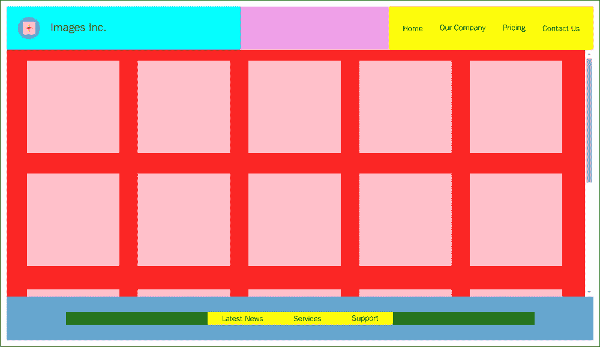

# 第五章 模块增强

在上一章中，我们开始为我们的虚构**Images Inc.**网络应用程序创建简单的模块。在这一章中，我们将使用一种称为**模块增强**的方法，对我们的一个已构建的模块添加更多功能。

这种方法允许我们在不改变原始实现的情况下扩展我们的模块。有几种不同的技术可以用来实现模块增强，我们将在本章中介绍其中的一些。

当我们在有许多代码库贡献者的项目上工作时，模块增强可以非常有用。这类项目通常要求我们通过添加新代码和功能来扩展我们的模块，这些代码和功能是其他开发者已经开发的。

本章我们将涵盖的概念包括：

+   模块增强背后的理念

+   松散增强

+   紧密增强

+   生成我们应用程序的内容区域

+   模块增强和脚本加载顺序

+   不同增强技术的优缺点

# 模块增强的原则

正如你在上一章中看到的，我们创建了专门的模块来为我们执行一些特定的任务。然而，随着我们继续前进并进一步开发我们的应用程序，我们将需要从我们的模块中获得更多功能，我们还将需要额外的专用模块。

当你在处理一个大项目时，有许多开发者正在处理应用程序的不同部分是非常正常的。也有可能许多开发者一起工作在应用程序的同一部分，这需要一种无缝的方法来结合他们的努力以及他们添加到应用程序中的功能。

让我们以前一章中的`GlobalData`模块为例。这个模块负责存储和缓存应用程序级别的数据。然而，在其当前状态下，它只包含非常有限的应用程序级别数据。我们可以合理地假设，当不同的开发者正在处理应用程序的其他部分时，他们也需要在同一个模块中存储特定的应用程序级别数据。

做这件事的一种方法是通过手动修改`GlobalData`模块并添加更多数据和接口。但我们需要记住，修改模块的人越多，模块代码中出问题的可能性就越高，以及意外地以不理想的方式修改重要的应用程序级别数据。

另一方面，由于各种原因，原始模块文件可能无法被一些开发者访问，这可能会阻碍我们应用程序的协作开发。

如果我们能想出一个方法，让每个开发者都能在不修改或要求修改原始模块代码的情况下向原始模块添加所需的功能，那会怎么样呢？

模块增强使我们能够以非常稳健的方式做到这一点。正如其名所示，这个概念是关于向原始模块添加功能（属性），而不直接更改原始模块的代码。一般思路是我们可以在运行时导入原始模块并按需向其添加新功能。

# 实现模块增强

假设我们有一个名为`ModuleA`的模块，作为一个开发者，你想要向这个模块添加更多功能。然而，由于某种原因，你决定在一个完全独立的模块中实现这个新功能，然后动态地用这个新模块的所有数据和功能增强原始模块。你可以像下面这样实现：

```js
var ModuleA = (function(coreModule){
    var someData = "this is some data to be used later";
    coreModule.someMethod = function(){
        return someData;
    };

    return coreModule;
})(ModuleA);
```

正如你所看到的，我们在这里再次使用了模块模式，因为我们的意图是以模块化的方式添加新功能。

在这个立即执行函数表达式（IIFE）中，返回了对`coreModule`对象的引用。然而，这里有一个重要的事情需要记住。我们将`ModuleA`作为参数传递给我们的匿名容器函数。此外，属性`someMethod`被添加到传入的`coreModule`中，实际上这是一个对`ModuleA`的引用。

因此，在这个函数执行结束时，`ModuleA`有一个新的属性方法`someMethod`，它可以访问`someData`变量的值。

在这里，我们有一个假设。我们假设`ModuleA`作为一个对象确实存在，如果不是这样，当我们运行前面的代码时，我们将得到一个执行错误。你很快就会看到我们如何解决这个问题，但就目前而言，让我们将这个增强概念应用到我们的应用程序中，以扩展`ImagesInc_GlobalData`模块。

### 注意

**模块命名约定**

随着我们越来越多地参与到应用程序中的模块实现，最好为我们的模块使用更具体的命名。一般来说，为我们的模块使用尽可能具体的名称是一个好主意。这最小化了我们的应用程序模块和可能加载到应用程序中的第三方模块之间的命名冲突的可能性。因此，随着我们继续前进，我们将为所有模块名添加`ImagesInc_`前缀，使名称更具体地反映我们的应用程序。

值得注意的是，一些开发者选择在代码中用全大写字母命名他们的模块，作为一种约定。在我们的应用程序中，我们不会使用这种约定。在你的编码实践中，是否使用全大写字母为你的模块命名，应该由你和你的团队决定。这样，你可以建立一套标准，所有团队成员都必须遵守。

# 简单增强 ImagesInc_GlobalData

如您所记得，我们使用 `ImagesInc_GlobalData` 模块（之前命名为 `GlobalData`）为我们存储应用程序级别的数据。此模块还提供了一些接口，以便应用程序的其他部分可以访问我们存储在此模块中的私有数据。

让我们创建另一个 JavaScript 文件，为这个模块添加更多数据和新的接口。我们可以将此文件命名为 `Modules_2.js`，并将其添加到在运行时由主页面加载的 JavaScript 文件列表中，如下所示：

```js
<script type="text/javascript" src="img/Modules.js" ></script>
<script type="text/javascript" src="img/Modules_2.js" ></script>
```

如您所见，此文件被添加的方式与我们在 `index.html` 中添加任何其他 JavaScript 文件的方式相同。然而，在前面代码中需要注意的一点是两个模块文件被添加的顺序。这个顺序很重要，我们将在稍后进行更多讨论，但到目前为止，请记住在我们的应用程序中，`ImageInc_GlobalData` 模块（位于 `Modules.js` 中）首先被加载。然后，位于 `Modules_2.js` 中的代码将在之后加载，并为该模块添加更多功能。

我们需要在 `Modules_2.js` 中添加以下代码行：

```js
(function(coreModule){

    coreModule.someText = "this is a test for module augmentation";
    coreModule.getExtendedModuleMsg = function(){
        ImagesInc_LoggingHandler.logInfo(coreModule.someText);
    };

})(ImagesInc_GlobalData);
```

在这里，我们使用匿名函数通过 IIFE 创建了一个 **命名空间**。我们还通过参数将 `ImagesInc_GlobalData` 对象（模块）的引用传递给这个函数。

在这个匿名函数内部，我们向传入的对象引用 `coreModule` 添加了两个属性。这意味着我们的 `ImagesInc_GlobalData` 现在增加了两个新属性。让我们通过以下测试来验证这一点：

```js
// displays "this is a test for module augmentation"
ImagesInc_GlobalData.getExtendedModuleMsg(); 
```

当我们在 `ImagesInc_GlobalData` 对象上调用 `getExtendedModuleMsg` 方法时，我们看到代码运行正常，预期的消息显示在控制台。

由于 `ImagesInc_GlobalData` 模块最初没有 `getExtendedModuleMsg` 方法，现在看起来它已经通过这些新属性进行了增强。

这个简单的例子演示了我们可以如何在不直接修改该模块中的代码的情况下增强我们的原始模块。我们还看到，增强可以在一个单独的文件中进行，这意味着不同的开发者可以在不直接访问原始模块的代码文件的情况下，为我们原始模块添加更多功能。

当然，这种类型的增强也可以在原始模块和增强代码都在同一文件中进行时完成。拥有选择我们想要采取的方法的灵活性是好的：要么将原始模块及其增强代码放在单独的文件中，要么放在同一文件中。

我们将很快更深入地讨论这种增强类型，甚至给它一个技术名称。

# 模块增强中事物的顺序

当我们将 `Modules_2.js` 文件添加到我们的 `index.html` 文件中时，我提到我们需要在加载 `Modules.js` 文件之后加载此文件，以确保一切正常工作。

这个原因并不难发现。如果这些文件的加载顺序被颠倒，以及随后的代码执行顺序，我们将尝试向一个尚不存在的对象（`ImagesInc_GlobalData`）添加属性，这将导致代码执行错误。

有一些方法可以解决这个问题，这把我们带到了下一个主题，**松散增强**。

# 模块的松散增强

当我们尝试使用之前讨论的增强技术增强一个模块时，我们将模块的引用传递给代码的另一个部分，该部分负责执行增强工作。

我们如何向尚未加载或创建的对象添加功能？

当我们的模块（文件）以异步方式加载时，这个问题变得非常重要，我们无法确保在增强模块的代码之前加载我们的原始模块。

JavaScript 美丽而强大的一个方面是它能够在代码执行期间动态地向对象添加属性，任何时候都可以。这允许我们在模块加载之前添加功能或修改原始模块的实现，只要我们提供一个临时对象以替代模块。这个临时对象将在模块加载后（或者更准确地说，它变成了原始模块的一部分）被添加到原始模块中。

如果听起来很复杂，实际上它比你想象的要简单。让我们回顾一下之前的增强代码，并仔细检查一下：

```js
(function(coreModule){

    coreModule.someText = "this is a test for module augmentation";
    coreModule.getExtendedModuleMsg = function(){
        ImagesInc_LoggingHandler.logInfo(coreModule.someText);
    };

})(ImagesInc_GlobalData);
```

我提到，为了使增强正常工作，我们需要在原始模块加载后加载这段代码，这段代码负责增强 `ImageInc_GlobalData` 模块。否则，将抛出一个代码执行错误。虽然这一点仍然是正确的，但如果我们使用一个空对象来补偿 `ImagesInc_GlobalData` 在应用程序中尚未存在的情况，会怎样呢？

如您可能所知，我们可以如下调用一个函数：

```js
someFunc(someParameter || someotherParameter);
```

当我们这样做时，我们是在告诉 JavaScript 解释器在调用 `someFunc` 时传递 `someParameter`，如果它有值的话；如果没有，就传递 `someotherParameter` 到函数中。这就是前面代码片段中 `||` 运算符的工作方式。

我们可以使用相同的技巧，并将一个空对象传递给我们的匿名函数，如下所示：

```js
(ImagesInc_GlobalData || {});
```

我们告诉解释器在调用函数时传递我们的 `ImagesInc_GlobalData` 对象的引用，如果对象存在的话，或者传递一个空对象的引用，这个空对象将暂时替换我们的原始模块。

## ImagesInc_GlobalData 的松散增强

让我们重新编写之前为 `ImagesInc_GlobalData` 编写的增强代码，如下所示：

```js
var ImagesInc_GlobalData = (function(coreModule){

    coreModule.someText = "this is a test for loose module augmentation";
    coreModule.getExtendedModuleMsg = function(){
        ImagesInc_LoggingHandler.logInfo(coreModule.someText);
    };

    return coreModule;

})(ImagesInc_GlobalData || {});
```

在前面的代码中，我们正在调用我们的匿名函数，并将 `ImagesInc_GlobalData` 的引用传递给它，如果 `ImagesInc_GlobalData` 存在的话。否则，我们将一个匿名空对象的引用传递到函数中。

我们增强的代码仍然向传入的对象添加新属性；然而，这次它将`coreModule`的引用返回给`ImagesInc_GlobalData`变量。

为了让一切正常工作，我们还需要按照以下方式修改我们的原始`ImagesInc_GlobalData`：

```js
var ImagesInc_GlobalData = (function(module){

    var headerContainerDef = {

    sectionHTML :  '<div class="logo_titleClass" >' +
                '<a href=""></a>' +
                '<div class="siteTitleClass">Images Inc.</div>' +
        '</div>' +
        '<nav role="navigation" itemscope itemtype="https://schema.org/SiteNavigationElement">' +
            '<h1 class="hiddenClass">Main Navigation</h1>' +
            '<ul class="navmenuClass" >' +
                '<li><a href="#" class="active">Home</a></li>' +
                '<li><a href="#">Our Company</a></li>' +
                '<li><a href="#">Pricing</a></li>' +
                '<li><a href="#">Contact Us</a></li>' +
            '</ul>' +
        '</nav>' 
    };

    var footerContainerDef = {

        sectionHTML:'<div>' +
                   '<a href="#">Latest News</a>' +
                '</div>' +
                '<div>' +
                    '<a href="#">Services</a>' +
                '</div>' +
                '<div>' +
                    '<a href="#">Support</a>' +
                '</div>'
    };

    module.getHeaderHTMLTxt= function(){
 return headerContainerDef.sectionHTML;
 };

 module.getFooterHTMLTxt= function(){
 return footerContainerDef.sectionHTML;
 };

    return module;

})(ImagesInc_GlobalData || {});
```

如您所见，我们对代码做了一些修改。

如果您还记得，我们以前在原始模块中创建了一个匿名对象，并像这样返回其引用：

```js
return {

            getHeaderHTMLTxt: function(){
                return headerContainerDef.sectionHTML;
            },

            getFooterHTMLTxt: function(){
                return footerContainerDef.sectionHTML;
            }
    };
```

然而，在我们的新增强实现中，我们直接将模块接口方法添加到传递给匿名函数的模块对象中。同时，传递给我们的匿名函数的模块对象要么是`ImagesInc_GlobalData`的引用，要么是空对象的引用。

这里还有一个需要注意的微妙之处。增强代码和我们的原始模块代码都返回了`ImagesInc_GlobalData`变量的对象引用，这一点非常重要。

为了解释这一点，我们需要深入探讨。在我们的应用程序中，有时模块代码和增强它的代码是异步加载的。这意味着我们无法提前确定哪个代码先被执行。当我们从原始模块和增强代码中返回我们的对象引用时，我们可以确信，无论代码执行顺序如何，我们的模块都会被正确增强。

在我们的例子中，如果全局命名空间中已经存在一个`ImagesInc_GlobalData`对象，我们就用新属性增强它；如果没有，我们就创建它并添加新属性。这就是为什么在这两种情况下（原始模块代码和增强代码），我们都会用以下调用执行我们的 IIFE：

```js
(ImagesInc_GlobalData || {});
```

这使我们能够以非严格顺序创建或增强我们的模块，因此术语称为**松散增强**。

当然，这种技术的最大优点是我们不必担心哪个文件先被加载；无论哪种方式，我们的模块都会按照预期创建和增强。

请记住，在这两种情况下，我们需要确保创建相同的全局变量`ImagesInc_GlobalData`，这样当我们检查全局命名空间中该对象的存在时，就能传入正确的引用。

是时候对我们的代码进行测试了。在做出之前提到的修改后，我们可以运行以下代码行：

```js
// displays "this is a test for module augmentation"
ImagesInc_GlobalData.getExtendedModuleMsg(); 
```

如您所见，控制台显示了正确的消息。现在，让我们看看如果我们改变应用程序中 JavaScript 模块文件加载顺序会发生什么。

首先，我们在`index.html`文件中做出以下更改：

```js
<script type="text/javascript" src="img/Modules_2.js" ></script>
<script type="text/javascript" src="img/Modules.js" ></script>
```

这是为了确保我们的增强代码首先被加载。然后我们执行与之前相同的代码行：

```js
// displays "this is a test for module augmentation"
ImagesInc_GlobalData.getExtendedModuleMsg();
```

我们可以看到，无论哪个先加载和执行，我们的原始模块和增强代码都在按预期工作。

## 测试 ImagesInc_GlobalData 数据封装

我们可以通过运行以下代码来测试并查看封装和隐私在我们的模块中是如何被保留的。这可以通过以下代码实现：

```js
try{
        console.log(ImagesInc_GlobalData.headerContainerDef.sectionHTML);

    }catch(e){
        ImagesInc_LoggingHandler.logError('could not access the property');
    }
```

这段代码将在控制台显示**无法访问属性**，这证实了我们的原始模块封装仍然有效，正如我们所期望的那样。

### 注意

**关于项目代码的注意事项**

像往常一样，我强烈建议您从本书的配套网站上下载本章的相关代码。在本章的代码中，我创建了一个名为`AppTester.js`的新文件，用于测试我们在修改和增强应用程序时的应用程序。我建议在开发阶段每次运行应用程序时都进行这种测试方法。这样我们可以确保我们在一个部分中的更改不会对应用程序的其他部分造成任何问题。这也与**测试驱动开发**（**TDD**）方法相一致，但以一种非常基础的方式。

# 模块的紧密增强

到目前为止，在本章中，我们已经讨论了模块增强的一般概念，并且也介绍了松散增强技术。现在是时候探索在模块增强中使用的另一种技术，称为**紧密增强**。

你可能会想知道紧密增强是否是松散增强的反面，你的想法是正确的，但有一些考虑因素，我们稍后会讨论。

当我们希望在文件加载和代码执行中强制执行一个特定的顺序时，我们会使用紧密增强来为我们的模块添加属性（功能），因此它相对不太灵活。这种增强通常用于确保原始模块中某个特定的属性对我们增强的代码是可用的。

## ImagesInc_GlobalData 的紧密增强

考虑到上一节中用于`ImagesInc_GlobalData`模块的增强代码，当时正在使用松散增强。如前所述，由于我们将`ImagesInc_GlobalData`或一个空的匿名对象传递到我们的 IIFE 中，我们可以以我们喜欢的任何顺序加载我们的原始模块和增强代码。

这如下所示：

```js
var ImagesInc_GlobalData = (function(coreModule){

    coreModule.someText = "this is a test for loose module augmentation";
    coreModule.getExtendedModuleMsg = function(){
        ImagesInc_LoggingHandler.logInfo(coreModule.someText);
    };

    return coreModule;

})(ImagesInc_GlobalData || {});
```

然而，这也意味着，如果我们想覆盖原始模块的一个属性，这取决于什么代码先被加载和执行（原始模块或增强代码），我们的“覆盖”可能会被另一段代码无意中意外地覆盖。

为了更好地理解这一点，让我们创建另一个文件，`Modules_3.js`，并将以下代码添加到其中：

```js
var ImagesInc_GlobalData = (function(coreModule){

    coreModule.someText = "this is a test for overriding module properties with loose augmentation";
    coreModule.getExtendedModuleMsg = function(){
        ImagesInc_LoggingHandler.logInfo(coreModule.someText);
    };
    return coreModule;

})(ImagesInc_GlobalData || {});
```

此外，让我们按照以下方式在我们的应用程序中加载此文件：

```js
<script type="text/javascript" async src="img/Modules_3.js" ></script>
<script type="text/javascript"   src="img/Modules_2.js" ></script>
<script type="text/javascript"   src="img/Modules.js" ></script>
```

在这里，我们正在加载两个文件（`Modules_3.js`和`Modules_2.js`），它们增强了我们的原始模块。`Modules_2.js`在`Modules.js`之前被加载，但`Modules_3.js`可以以任何顺序加载，因为我们为这个文件使用了`<script>`标签上的`async`属性。这个属性告诉浏览器以它可以的任何顺序加载文件。

这两个增强代码都向原始模块添加了相同的属性`coreModule.someText`。然而，根据哪个代码首先被加载和执行，控制台只会打印出两段文本中的一段。

我们可以通过执行以下代码来测试这一点：

```js
ImagesInc_GlobalData.getExtendedModuleMsg();
```

控制台将显示以下之一：

+   **这是一个模块增强的测试**（来自`Modules_2.js`）

+   **这是一个使用松散增强覆盖模块属性的测试**（来自`Modules_3.js`）

请记住，在这种情况下，我们无法控制代码执行完成后`coreModule.someText`属性将具有哪个字符串值。这是因为我们不知道哪个增强器代码将被最后加载和执行。这也意味着，通过使用松散增强技术和异步加载，增强器代码的优先级是在运行时动态确定的，而不一定是我们所认为或期望的顺序。

基于此，如果我们打算让`coreModule.someText`的值被`Modules_3.js`中的代码覆盖，那么我们无法确保这种覆盖会发生。

### 注意

**模拟异步脚本加载**

为了模拟我们的增强器的异步加载，您可以在应用本章节所附代码中连续几次重新加载`index.html`页面。您会看到控制台显示的消息可能会不时地发生变化。显示的消息取决于浏览器首先加载的是哪个文件，`Modules_2.js`还是`Modules_3.js`。

另一方面，紧密增强保证了代码执行的顺序，因此我们的模块是如何被增强的。通过使用这种技术，我们可以确信当模块属性被覆盖时，它将按照我们期望的顺序进行，结果将符合预期。

这种保证是由于我们没有选择，只能按正确的顺序加载我们的模块及其增强代码，否则将生成代码执行错误。

让我们通过修改`Moduels_3.js`中的代码来检查这一点：

```js
var ImagesInc_GlobalData = (function(coreModule){

    if(!coreModule){
        ImagesInc_LoggingHandler.logError('coreModule was not found to be augmented!');
        alert('coreModule was not found to be augmented!');
        return false;

    }

    coreModule.someText = "this is a test for overriding module properties with TIGHT augmentation";
    coreModule.getExtendedModuleMsg = function(){
        ImagesInc_LoggingHandler.logInfo(coreModule.someText);
    };

    return coreModule;

})(ImagesInc_GlobalData);
```

在这个版本的增强代码中，我们不再向 IIFE 传递一个空匿名对象的引用。因此，如果`ImagesInc_GlobalData`模块尚未被加载，我们无法使用任何新属性对其进行增强。

注意，在前面代码的开始处，我们正在检查`coreModule`是否存在，如果不存在，我们使用我们的`ImagesInc_LoggingHandler`模块将错误记录到控制台。我们还在浏览器中使用一个警告框来确保情况确实引起了用户的注意（在生产代码中尽量不要使用警告框，因为它看起来不够专业；我只是在演示时使用它以便于展示）。

## 加载`ImagesInc_GlobalData`增强代码

为了检查紧密增强如何强制执行脚本加载和代码执行的顺序，我们可以按以下方式更改我们的`index.html`：

```js
<script type="text/javascript"   src="img/Modules_3.js" ></script>
<script type="text/javascript"   src="img/Modules_2.js" ></script>
<script type="text/javascript"   src="img/Modules.js" ></script>
```

正如你所见，我们不再异步加载`Modules_3.js`文件，它将成为第一个被加载的模块相关文件。考虑到我们已修改此文件中的增强代码，使其仅在模块（`ImagesInc_GlobalData`）已存在于全局作用域时增强模块，当我们加载页面时，将记录错误消息并在浏览器中显示一个**警告框**。

由于我们现在使用的是紧密增强技术，我们需要在`Modules.js`或`Modules_2.js`之后加载这个增强代码。这是必要的，这样我们就可以确保`ImagesInc_GlobalData`模块（对象）已经存在于全局作用域中。

此外，由于我们的意图是使用`Modules_3.js`中的代码覆盖`someText`的值，而这个属性是由`Modules_2.js`中的增强代码添加到模块中的，因此我们需要首先加载`Modules.js`和`Modules_2.js`。这是唯一能够保证`someText`的值按预期被覆盖的方法。因此，为了实现适当的覆盖，我们需要按照以下方式修改脚本的加载顺序：

```js
<script type="text/javascript"   src="img/Modules.js" ></script>
<script type="text/javascript"   src="img/Modules_2.js" ></script>
<script type="text/javascript"   src="img/Modules_3.js" ></script>
```

我们在`index.html`文件中对脚本顺序的这种重新排列确保了覆盖模块的`someText`属性值将产生预期的结果。这当然是因为我们的原始模块首先被加载，然后使用`Modules_2.js`中的增强代码添加`someText`属性，最后，该属性的值被`Module_3.js`中的紧密增强代码覆盖。

## 紧密增强的注意事项

在本节的开头，我提到有几个关于紧密增强的注意事项我们需要记住。

首先，我们实际上并不需要创建一个全局变量来存储实现紧密增强技术的增强代码返回的值。

这是因为这种增强只能在模块已经存在于全局上下文的情况下发生。实际上，以下代码将和之前的版本一样工作得很好：

```js
(function(coreModule){

    if(!coreModule){
        ImagesInc_LoggingHandler.logError('coreModule was not found to be augmented!');
        alert('coreModule was not found to be augmented!');
        return false;

    }

    coreModule.someText = "this is a test for overriding module properties with TIGHT augmentation!!!";
    coreModule.getExtendedModuleMsg = function(){
        ImagesInc_LoggingHandler.logInfo(coreModule.someText);
    };

})(ImagesInc_GlobalData);
```

其次，在我们覆盖模块中已经存在的属性之前，我们可以通过将其存储在另一个属性中来保留属性的原始值。这使我们能够访问属性的原始值和覆盖值。

让我们在`Modules_3.js`文件中这样做，如下所示：

```js
(function(coreModule){

    if(!coreModule){
        ImagesInc_LoggingHandler.logError('coreModule was not found to be augmented!');
        alert('coreModule was not found to be augmented!');
        return false;

    }

    coreModule.original_someText = coreModule.someText;

    coreModule.someText = "this is a test for overriding module properties with TIGHT augmentation!";

    coreModule.getExtendedModuleMsg = function(){
        ImagesInc_LoggingHandler.logInfo(coreModule.someText);
    };
    coreModule.getExtendedModuleOriginalMsg = function(){
        ImagesInc_LoggingHandler.logInfo(coreModule.original_someText);
    };

})(ImagesInc_GlobalData);
```

我们可以通过在控制台中运行以下代码来获取`someText`属性的原始值：

```js
// displays ""this is a test for module augmentation"
ImagesInc_GlobalData.getExtendedModuleOriginalMsg();
```

如你所见，不仅紧密增强技术是一种覆盖我们模块属性的好方法，它还允许我们保留我们属性的原始（先前）值，以防我们以后需要再次使用它们。

# 生成我们应用程序的内容区域

如果你已经阅读了本章的前几节，你现在对模块增强应该有相当好的理解。你也知道一些使用增强技术向我们的模块添加动态属性的技术。

目前，我们的应用程序（`Images Inc.`）有代码可以动态生成我们页面头部和尾部部分。但中间仍然有一个空白区域（内容区域），需要填充内容。

让我们充分利用本章学到的技术，并为我们的应用程序添加动态生成内容区域的功能。

注意，`Modules_3.js`中的重构增强代码现在如下所示：

```js
(function(originalModule){

    if(!originalModule){
        ImagesInc_LoggingHandler.logError('originalModule was not found to be augmented!');
        return false;  
    }

    //object definition for the index.html content area
    originalModule.mainContentContainerDef = {
         sectionHTML: (function(){
                var htmlStr = "";

                for(var i=0; i<=15; i++){
                    htmlStr += '<div class="productDiv"></div>';
                }
                return htmlStr; 
            })()

    }; 

    originalModule.getContentAreaHTMLTxt= function(){
        return originalModule.mainContentContainerDef.sectionHTML;
    };

})(ImagesInc_GlobalData);
```

这里发生了一些事情。正如你所看到的，我们正在使用紧密增强来增强我们的`ImagesInc_GlobalData`模块。我们还为这个模块创建了一个新属性，`originalModule.mainContentContainerDef`，它包含页面内容区域的对象定义。由于内容区域使用重复的矩形结构来显示页面上的所需图像，我们使用了一个内部立即执行的函数表达式（IIFE），它创建了这个结构并将其存储在内容区域对象定义的`sectionHTML`属性中，作为一个字符串。

为了让外部代码能够访问这个字符串，并能够渲染我们`index.html`页面的内容区域，我们创建了`originalModule.getContentAreaHTMLTxt`方法。这个方法被添加为我们的原始`ImagesInc_GlobalData`模块的接口。

当我们现在加载应用程序的`index.html`页面时，它显示如下：



当然，目前我还在使用之前看到的颜色编码方案来为我们的各种页面片段着色。为了便于识别，图像框显示为粉色（如果你是在彩色书中阅读）。

### 注意

**需要注意的一个警告**

在我们的增强代码中，我们没有使用闭包，就在我们的模块中添加了`mainContentContainerDef`属性。因此，这个属性没有使用与`headerContainerDef`和`footerContainerDef`相同的封装和私有访问类型。这些属性在我们的原始模块中定义为私有变量，并且只能通过我们为外部使用创建的接口来访问。当然，我们使用闭包创建了这种私有访问。

如果你希望限制模块对这些内容的访问，最好在原始模块中定义属性（使用闭包），而不是使用增强技术将它们添加到模块中（除非你在增强代码中也使用闭包）。

# 摘要

在本章中，我们介绍了模块增强是什么，并探讨了几个不同的技术，称为松散增强和紧密增强，来实现模块增强。

我们看到了每种方法在不同情况下以及针对不同应用需求的使用方式，以及与每种技术相关的优缺点。

根据所使用的增强技术，还讨论了脚本应加载的顺序。

一旦我们很好地掌握了这些增强实现，我们就重构了我们应用程序代码的一部分，以增强`ImagesInc_GlobalData`模块。随后，我们生成了`index.html`页面的内容区域，并用容器填充它，这些容器将未来托管我们应用程序中的图像。

在下一章中，我们将探讨一些模块化设计中的更多技术，这些技术将使我们能够根据需要扩展和克隆我们的模块。
