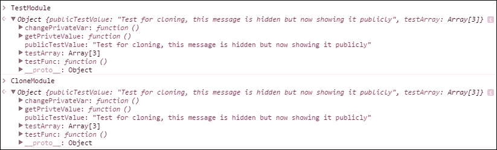

# 第六章 克隆、继承和子模块

在上一章中，我们探讨了如何使用松散和紧密增强来扩展和修改模块。

在本章中，我们将探讨一些其他技术，这些技术在我们处理模块时可能很有用，可以帮助我们扩展和修改模块的功能。根据你应用程序的需求以及你的个人偏好，这些技术中的某些或全部可能对你有用。

本章的开头将概述一些创建基于其他对象的某些方法，你可能已经熟悉。然后，我们将探讨如何使用对象克隆来创建其他对象的副本。

我们还将创建我们应用程序的核心模块之一，该模块将用于根据需要克隆对象。

在本章中，我们将涵盖：

+   模块克隆及其使用场景

+   克隆对象的多种方法

+   使用继承扩展模块

+   使用子模块向已创建的模块添加功能

+   内部私有状态及其在扩展模块时的影响

# 克隆模块

一般而言，克隆对象，特别是克隆模块，是创建原始对象或模块的精确副本。

但在我们讨论克隆之前，让我们考虑一些我们可以创建基于其他对象的新对象的方法。

## 创建构造函数的实例

基于另一个对象创建对象的一种方法是通过创建构造函数的实例。

如你所知，当我们使用 JavaScript 中的构造函数创建一个对象实例时，我们使用`new`关键字。创建的实例位于与构造函数不同的内存地址。当我们将属性分配给构造函数的`prototype`属性时，构造函数的所有实例都将共享这些`prototype`对象的属性。

让我们来看一个简单的例子，并回顾基于构造函数创建对象。

考虑以下代码片段：

```js
function testConstructor (){

    this.someValue = "Value in the constructor function";

}

testConstructor.prototype.testFunc = function(){

    console.log(this.someValue);
};
```

如你所见，我们已经向我们的构造函数的`prototype`对象添加了一个属性，它将`this.someValue`属性的值记录到控制台。

现在，我们创建我们构造函数的两个实例，如下所示：

```js
var firstInstance = new testConstructor();
var secondInstance = new testConstructor();
```

接下来，我们在控制台中运行以下代码：

```js
// displays "Value in the constructor function"
console.log(firstInstance.someValue);
// displays "Value in the constructor function"
console.log(secondInstance.someValue);
```

我们可以看到，`someValue`属性的相同值将显示在两个实例中。当然，如果我们像以下这样为每个实例的`someValue`属性更改值：

```js
firstInstance.someValue = "value for the firstInstance";
secondInstance.someValue = "value for the secondInstance";
```

并记录属性的值：

```js
// displays "Value for the firstInstance"
firstInstance.testFunc();

// displays "Value for the secondInstance"
secondInstance.testFunc();
```

每个实例的`someValue`属性值将不同。在这里，每个实例都有其自己的`someValue`属性副本，但它们都共享相同的方法（`testFunc`），因为所有位于`prototype`对象上的属性都是构造函数所有实例共享的。

我们还应该记住一件事。在创建构造函数的实例之后，如果我们向构造函数添加新的属性，这些实例将无法访问这些新属性。

考虑以下代码：

```js
testConstructor.newProperty = "this is a new property but not shared";

// displays undefined
console.log(firstInstance.newProperty);

// displays undefined
console.log(secondInstance.newProperty);
```

如你所见，没有任何实例可以访问在构造函数 **之后** 添加到构造函数中的这个新属性。

如果你认为我们可以直接在构造函数本身上定义 `prototype` 对象上的属性（在我们的例子中是 `testFunc`），你是正确的，但有一个前提条件！

这样做意味着每次我们创建对象的实例时，我们都会创建不必要的属性副本，而这些属性对所有对象实例都是相同的。因此，我们会在代码中创建不必要的开销。

当我们拥有对所有构造函数实例（在大多数情况下，这适用于方法）都相同的属性时，这是一个好的实践，它们应该定义在 `prototype` 对象上，并由所有实例共享。我们在示例中通过将 `testFunc` 方法添加到 `prototype` 对象上，而不是在构造函数本身上定义它，来实现这一点。

当涉及到构造函数和基于这些对象创建其他对象（实例）时，我们还需要考虑另一件事。构造函数中的私有属性会发生什么？

让我们考虑以下代码片段：

```js
function testConstructor (){
    this.someValue = "Value in the constructor function";
    var privateValue = "no instances will have a copy of me";
}
```

私有变量 `privateValue` 不会被复制到对象的实例中，也不会被共享。

我们可以如下进行测试：

```js
var firstInstance = new testConstructor();
// displays undefined.
console.log(firstInstance.privateValue);
```

那么，我们如何从基于此对象创建的对象中访问这些私有属性呢？

当我们谈到克隆模块时，我们将讨论如何提供对这些私有成员的访问。

## 使用赋值运算符进行对象的复制

当我们在 JavaScript 中使用原始类型时，我们可以很容易地使用赋值运算符将一个变量的值复制到另一个变量，如下所示：

```js
var testVar1 = "This is to be copied";
var testVar2 = testVar1;
```

在前面的代码中，我们只是将一个变量的字符串值赋给另一个变量，这里没有神秘之处，但这对两个对象来说是如何工作的呢？

让我们如下进行测试：

```js
var testObj1 = { testValue : 5};
var testObj2 = testObj1;

testObj1.newValue  = "this is a new value";

// displays "this is a new value"
console.log(testObj2.newValue);
```

在这里，我们使用赋值运算符将 `testObj1` 赋值给 `testObj2`，这可能会看起来像是基于另一个对象创建了一个新对象。

然而，正如你所看到的，当我们为 `testObj1` 创建一个新属性时，即使在将 `testObj1` 赋值给 `testObj2` 之后，这个新属性对 `testObj2` 也是可用的。

原因在于，当我们使用赋值运算符将一个变量（该变量持有对对象的引用）的值赋给另一个变量时，我们实际上是将对象的内存地址赋给另一个变量。这导致两个变量都引用了同一个对象。因此，在上面的代码中，`testObj1` 和 `testObj2` 都引用了同一个对象。

虽然有时这种结果可能是期望的，但有时我们需要创建一个与另一个对象完全相同的对象（复制品），但我们希望新对象与原始对象完全独立。那么我们该如何做呢？

实现这一目标的一种方法就是创建原始对象的克隆。

## 创建对象的克隆

当我们创建一个对象的克隆时，我们的目标是创建原始对象的精确复制品，而新创建的对象不应与原始对象有任何关联。

在 JavaScript 中克隆对象（与其他一些语言一样）并不像你想象的那么简单。虽然存在不同的克隆实现方式，但每种方法都有其优缺点。

如果我们将克隆视为将一个对象的全部属性复制到另一个对象，我们可以将克隆分为两种类型：

+   浅克隆

+   深度克隆

### 浅克隆和深克隆

**浅克隆**会复制原始对象的所有顶层属性，但如果这个对象包含其他引用类型，则只会复制这些引用类型的*引用*到新创建的克隆中，而不是实际的引用类型。这种类型的克隆用于当我们希望在新的对象中拥有原始类型的独立副本，但希望原始对象和新的克隆对象共享相同的引用类型时。

另一方面，**深度克隆**会将原始对象的全部原始类型属性复制到新对象中，同时在新对象中创建原始对象所有引用类型的副本。

重要的区别在于，在新的对象中创建了引用类型的真正副本，而不仅仅是引用（内存地址）。如果我们希望有两个没有任何关联的独立对象，这种类型的克隆是可取的。深度克隆通常被认为比浅克隆慢，并且消耗更多资源。

要实现任何一种克隆类型，我们可以利用以下方法之一：

+   使用第三方库，如 jQuery 或 lodash

+   使用 JSON 漏洞黑客技术

+   创建我们自己的自定义克隆方法

### 使用外部库进行克隆

**jQuery** 提供了 `extend` 方法，使我们能够创建对象的浅克隆和深克隆。

`extend` 方法的通用格式如下：

```js
jQuery.extend( target [, object1 ] [, objectN ] );
```

### 注意

虽然这种方法通常是一个好的克隆对象选项，但它确实有一些限制，例如处理内置 JavaScript 类型时。有关此方法的完整信息，请参阅以下 URL 的 jQuery 文档：

[`api.jquery.com/jQuery.extend/`](http://api.jquery.com/jQuery.extend/)

另一个可用于对象克隆的好库是 **lodash**，它也提供了浅克隆和深克隆的功能。lodash 提供的克隆功能似乎适用于大多数情况。

在 lodash 中创建对象深度克隆的一般格式是：

```js
var deep = _.cloneDeep(objects);
```

### 注意

然而，在使用 lodash 进行深度克隆时有一些局限性，例如处理 map 和 set。请参阅在线的 lodash 文档：

[`lodash.com/docs#cloneDeep`](https://lodash.com/docs#cloneDeep)

### 使用 JSON 利用进行克隆

使用一种称为 JSON 利用的技术（hack）来克隆对象是一种简单但有效的方法。

理念是将原始对象序列化为字符串，然后使用 JSON 方法将字符串解析为新对象。如下所示：

```js
var cloneObj = (JSON.parse(JSON.stringify(originalObj)));
```

### 注意

这种方法使用简单，然而它的功能有限，尤其是在复制函数属性时。

要查看关于使用此技术的良好讨论，请参阅以下 URL：

[`esdiscuss.org/topic/deep-cloning-objects-defined-by-json`](https://esdiscuss.org/topic/deep-cloning-objects-defined-by-json)

### 创建自定义克隆方法

当涉及到相对简单的对象克隆时，我们可以创建自己的自定义克隆方法。这种方法通常能满足我们的大部分需求。

考虑以下：

```js
function clone(deep) {
    var newClonedObj = new this.constructor();
    for (var property in this){
        if (!deep){
            newClonedObj[property] = this[property];
        }else if (typeof this[property] == 'object'){
            newClonedObj[property] = this[property].clone(deep);
        }else{
            newClonedObj[property] = this[property];
        }
    }
    return newClonedObj;
}
```

这个函数接受一个布尔参数，用于执行对象的浅克隆或深克隆。

当需要深度克隆时，会对函数进行递归调用，以复制原始对象的一个属性（引用类型）的属性。注意以下克隆函数中的片段：

```js
else if (typeof this[property] == 'object'){
      newClonedObj[property] = this[property].clone(deep);
}
```

当然，与之前讨论的方法一样，这种方法也有其局限性，例如处理闭包。然而，它在大多数情况下都做得相当不错。

在下一节中，我们将把这个函数添加到我们应用的一个核心模块中，以便在需要时可以在应用中使用它。

# 创建 ImagesInc_Utilites 模块

由于工具模块是实现我们的对象克隆代码的好地方，让我们按照以下方式创建我们的`ImagesInc_Utilites`模块：

```js
var ImagesInc_Utilitizes = (function(){

    var clone = function clone(deep) {

        // create an instance of the object
        var newClonedObj = new this.constructor();

        //copy all properties from the original object
        for (var property in this){
            // if deep flag is not set, just do a shallow copy of properties
            if (!deep){ 
                if(this.hasOwnProperty(property)){
                    newClonedObj[property] = this[property];
                }
            // to make a deep copy, call the function recursively
            }else if (typeof this[property] == 'object' && this.hasOwnProperty(property)){
                newClonedObj[property] = this[property].clone(deep);
            }else if(this.hasOwnProperty(property)){
                //Just copy properties for non objects
                newClonedObj[property] = this[property];
            }
        }

        return newClonedObj;
    };

    // attach the clone function to Object prototype
    var initialize  = (function(){
        Object.prototype.clone = clone;
    })();

})();
```

在这个模块中，我们实现了我们的克隆函数，该函数负责将一个对象的属性复制到一个新对象中。我还对这个函数进行了一些修改，从你之前看到的版本中。这样做是为了它只会复制对象本身的属性，而不会复制其父对象的属性（如果有的话）。我们可以通过使用 JavaScript 的本地`hasOwnProperty`方法来实现这一点。

我们已经将克隆函数作为属性分配给了`Object.prototype`对象，因此应用中的所有对象都可以访问这个方法。

## 在 ImagesInc_Utilites 模块中测试我们的自定义克隆方法

让我们创建一个测试模块来查看我们的克隆机制是如何工作的。考虑以下代码：

```js
var TestModule = (function(){

    var privateTestValue = "Test for cloning, this property is hidden";

    return {
        publicTestValue: privateTestValue + " but now showing it publicly",

        testFunc : function(){

            var anotherTest= "This property will be cloned";
            return anotherTest;
        },

        getPrivteValue : function(){

            return privateTestValue;
        },

        changePrivateVar : function(){
            privateTestValue = "the private value has been changed";

            return privateTestValue;

        },

        testArray : [1,2,3]
    };

})();
```

在这里，我们创建了一个简单的模块，它提供了一个受控访问其私有变量的公共接口。

现在，如果我们运行以下代码：

```js
// creating a clone object
CloneModule = TestModule.clone(true);
```

我们可以创建原始模块`TestModule`的克隆。

我们可以按照以下方式运行一个简单的测试：

```js
// displays "This property will be cloned"
console.log(CloneModule.testFunc());
```

如您所见，预期的输出已经显示。

为了验证所有属性都已从我们的原始模块复制到新模块中，我们可以检查两个模块中的所有属性，使用我们浏览器的调试器（我在这里使用的是 Chrome 的调试器）如下所示：



## 我们克隆方法的一个重要方面

这个克隆方法还有一个你需要注意的有趣方面。

记住，我们的`TestModule`设计上有一个隐藏的属性，即`privateTestValue`。当我们进行克隆时，这个属性会发生什么变化？

好吧，最好的办法是运行一个测试。

在我们的`TestModule`中，我们有一个方法属性（`changePrivateVar`），它修改了这个隐藏的属性。所以如果我们运行以下代码：

```js
// displays "the private value has been changed"
console.log(TestModule.changePrivateVar());
```

我们可以在`TestModule`中更改这个属性的值到`the private value has been changed`。现在，让我们看看`CloneModule`是否可以访问这个值，如果是的话，它是否会保留这个属性的旧值，或者这个值也会为我们的`CloneModule`而改变？

如果我们运行以下代码片段：

```js
// displays "the private value has been changed"
console.log(CloneModule.getPrivteValue());
```

我们可以看到，不仅我们的`CloneModule`可以访问这个属性，而且这个模块的值已经改变。

这表明，由于我们的原始`TestModule`模块中的闭包，我们的`CloneModule`也可以访问这个模块的私有作用域，并且它也保留了闭包提供的作用域状态。

这可能，也可能不是我们想要的克隆模块的结果，这取决于我们如何克隆模块。然而，非常重要的一点是要记住，由于我们的原始模块中的闭包，我们的克隆结果与克隆没有嵌入闭包的对象的克隆结果略有不同。

### 注意

**对我们的克隆方法进行更多测试**

我在本书的配套代码中包含了一些模块克隆的测试。你可以在`AppTester.js`文件中看到这些测试。请查看，阅读注释，并修改代码以了解结果如何受到影响。

如你所见，当我们想要创建一个可以访问原始模块闭包上下文的原始模块的副本时，可以使用克隆。这反过来又为我们提供了访问原始模块私有成员的权限。

大多数时候，当我们克隆一个模块时，我们将其用作新模块的基模块。然后我们可以添加更多功能或修改新模块的现有功能，使用我们之前讨论的其他技术之一，例如松散或紧密增强。

这种方法允许我们扩展模块的克隆版本而不是原始模块，从而保护原始模块免受所有更改的影响，同时仍然可以访问原始模块的所有功能。

当然，克隆并不是我们实现这一点的唯一方法，但无论如何，它都是我们工具箱中另一个有价值的工具。

# 模块中的继承

在第二章中，我们讨论了继承是什么，并探讨了在对象之间创建继承关系的方法。在这里，我们将利用我们在那一章中学到的技术来创建模块间的继承。

通常，我们使用继承来利用我们的基础模块的功能，然后在子模块中添加新功能或修改现有功能。

创建模块间继承有多种方式，在本节中我们将探讨这两种方法之一。

## 使用`__proto__`对象的模块继承

在这种继承实现类型中，我们使用子模块的`__proto__`对象从父模块继承属性。

让我们考虑以下内容：

```js
var Polygon_Module = (function() {

    var sides = 6;
    var name = "Polygon";
    var type = "2D";

    function getSides() {

        return sides;
    };

    function getName() {

        return name;    
    };

    function getType(){

        return type;
    };

    return {
        getSides: getSides,
        getName: getName,
        getType: getType
    };
})();

var Rectangle_Module = (function() {
    var Rectangle = {};
    var sides = 4;
    var name = "Rectangle";
    var color = "blue";

    Rectangle.__proto__ = Polygon_Module;

    Rectangle.getName = function(){
      return name;
    };

    Rectangle.getSides = function(){
      return sides;
    };

    Rectangle.getColor = function(){
        return color;
    };

  return {
      getName: Rectangle.getName,
      getSides: Rectangle.getSides,
      getType: Rectangle.getType
  };

})();
```

如你所见，我们在这里创建了两个模块：`Polygon_Module`，它是我们的继承关系中的父模块，以及`Rectangle_Module`，它是子模块。

在我们的`Polygon_Module`中，我们创建了私有变量和函数，这些变量和函数除了通过模块的接口外，对外部代码不可访问。

`Rectangle_Module`的设计方式使其从其父模块（`Polygon_Module`）继承了一些功能。然后它修改了一些继承的功能，并添加了自己的新功能。

以下代码行是创建两个模块之间继承关系的关键部分：

```js
Rectangle.__proto__ = Polygon_Module;
```

如所示，我们已经从`Polygon_Module`传递了一个引用到`Rectangle`对象的`__proto__`对象。这使得`Rectangle`对象能够通过父模块的接口访问在父模块中暴露的所有属性。

让我们看看我们对模块运行以下测试时得到的结果：

```js
console.log(Polygon_Module.getName()); //displays "Polygon"
console.log(Polygon_Module.getSides()); // displays 6
console.log(Rectangle_Module.getName()); // displays "Rectangle"
console.log(Rectangle_Module.getSides()); // displays 4
console.log(Rectangle_Module.getType()); // displays "2D"
```

上述测试表明，子模块`Rectangle_Module`具有从父模块继承的所有方法；此外，它还覆盖了一些继承的属性。

注意`Rectangle_Module.getType()`方法，它没有在子模块中定义或覆盖，但通过父模块的接口被子模块访问。

## 使用寄生组合的模块继承

另一种在对象之间创建继承的方法，你可能很熟悉，并在第二章中看到了一个例子，*JavaScript OOP 重要概念回顾*，即**寄生组合**继承。

如你所回忆，这个想法是我们使用基类的构造函数在子类的构造函数中创建子对象的一个实例。我们还使用基类的`prototype`对象来获取对基类`prototype`对象上暴露的所有属性的引用。

为了刷新你的记忆，让我们看一下以下示例：

```js
var Polygon_Module2 = (function() {

    var sides = 6;
    var name = "Polygon";
    var type = "2D";

    function Polygon(){

        this.sides = sides;
        this.name = name;
        this.type = type;
    }

    Polygon.prototype.getSides = function(){

        return this.sides;
    };

    Polygon.prototype.getName = function(){

        return this.name;
    };

    Polygon.prototype.getType = function(){

        return this.type;
    };

    return {
        Polygon: Polygon,
    };
})();

var Rectangle_Module2 = (function(){
    var sides = 4;
    var name = "Rectangle";

    function Rectangle(){

        Polygon_Module2.Polygon.apply(this);
        this.sides = sides;
        this.name = name;
    }

    Rectangle.prototype = Polygon_Module2.Polygon.prototype;
    Rectangle.prototype.constructor = Rectangle;

    var RectangleInstance = new Rectangle();

    return {

        Rectangle: RectangleInstance
    };

})();
```

在我们模块的这个版本中，`Polygon_Module2`有一个名为`Polygon`的构造函数。我们所有的方法也都定义在`Polygon`类的`prototype`对象（对象）上。

`Polygon_Module2`模块还有一个匿名对象作为接口，它持有对`Polygon`类（对象）的引用。

在我们的子模块中，我们创建了一个名为`Rectangle`的另一个构造函数，它使用`Polygon_Module2`中可用的接口来借用`Polygon`构造函数，如下所示：

```js
Polygon_Module2.Polygon.apply(this);
```

我们还将`Rectangle`对象的原型对象设置为指向`Polygon.prototype`对象，这样我们就可以访问在这个对象中定义的所有方法，如下所示：

```js
Rectangle.prototype = Polygon_Module2.Polygon.prototype;
Rectangle.prototype.constructor = Rectangle;
```

当然，由于我们已经完全覆盖了`Rectangle`类的`prototype`对象，我们需要重置其`constructor`属性，使其指向正确的对象，在这种情况下是`Rectangle`。

注意，我们已经创建了一个`Rectangle`对象的实例来启动两个对象之间的继承关系，并正确设置对象上下文。

让我们运行几个测试来验证继承关系，如下所示：

```js
console.log(Rectangle_Module2.Rectangle.getName()); // displays "Rectangle"
console.log(Rectangle_Module2.Rectangle.getSides()); // displays 4
console.log(Rectangle_Module2.Rectangle.getType()); // displays "2D"
```

如您所见，测试产生了预期的结果。

## 决定模块继承方法

如果您在思考需要创建应用程序模块之间的继承关系时采取哪种方法（`__proto__`继承或寄生继承），在我看来，这大部分将取决于个人喜好。

然而，请注意，在我们的第一种方法（使用`__proto__`继承）中，我们不需要创建子模块的实例来创建继承关系。这意味着少一个函数调用，可能还有一点内存消耗减少，因为没有对象的实例被保存在内存中。

另一方面，请记住，较老的浏览器可能不支持设置对象的`__proto__`属性。

### 注意

**关于继承的更多信息**

如果您想了解更多关于 JavaScript 对象之间继承的一般信息，请参阅第二章，*重要 JavaScript OOP 概念回顾*。

# 子模块

本章我们考虑的最后一种技术，它也允许我们扩展我们的模块，是使用**子模块**。

子模块本质上是可以独立使用的模块，可以作为宿主模块的属性添加到另一个模块中。有各种方法可以将子模块添加到其他模块中，我们将在本节中介绍这两种方法之一。

让我们继续使用到目前为止一直在使用的形状主题，创建一个`Shape`模块。我们将把这个模块视为我们的宿主模块。这个模块是所有二维和三维形状的父模块，我们将把我们的`Polygon`模块添加到它里面。

## 使用动态属性添加子模块

将子模块作为动态属性添加到模块中很简单，因为我们可以给任何 JavaScript 对象添加动态属性，所以我们可以给宿主模块添加一个属性，该属性指向子模块。

考虑以下：

```js
var Shape = (function(){

        var type = "Any 2D and 3D shape";

        function getType(){
            return type;  
        }

        return {

            getType: getType 
        };

})();

Shape.Polygon = (function() {

    var sides = 6;
    var name = "Polygon";
    var type = "2D";

    function getSides() {

        return sides;
    }

    function getName() {

        return name;    
    }

    function getType(){

        return type;
    }

    return {
        getSides: getSides,
        getName: getName,
        getType: getType
    };
})();
```

在这里，我们创建了一个子模块`Shape.Polygon`，并将其作为属性添加到我们的主模块`Shape`中。

当然，我们可以如下访问主模块和子模块：

```js
console.log(Shape.getType()); // displays "Any 2D and 3D shape"
console.log(Shape.Polygon.getName()); // displays "Polygon"
```

这是将子模块添加到主模块的最简单方法，但它确实要求在我们可以将子模块添加到其中之前，主模块必须存在于作用域中。

## 使用异步属性添加子模块

使用异步属性将子模块添加到宿主模块的优点是更加灵活，这意味着在将子模块添加到宿主模块之前，宿主模块不需要被加载。

因此，子模块可以潜在地位于不同的文件中，并且可以在不同的时间（无论是宿主模块加载之前还是之后）以异步方式加载并添加到宿主模块中。

让我们看一下以下代码片段：

```js
var Polygon_Module;

var Shape = (function(mainModule, subModule){

    var Polygon = mainModule.Polygon = mainModule.Polygon || subModule;

    Polygon.description = function(){

        return "submodule has been added to shape module";
    };

   return mainModule;

})(Shape || {}, Polygon_Module ||{});

console.log(Shape.Polygon.description());
```

这段代码负责将我们的子模块`Polygon_Module`添加到主模块`Shape`中。

如您所见，我们向 IIFE 传递了两个参数，一个用于主模块，另一个用于子模块。当它们中的任何一个在执行上下文中还不存在时，我们向 IIFE 传递一个空对象。

在 IIFE 内部，我们检查`mainModule`是否有属性`Polygon`，实际上这就是我们的子模块。如果属性确实存在，我们就使用它并向这个子模块添加一个新属性，称为`description`。

如果代码执行上下文中不存在属性`Polygon`（子模块），我们使用传入的子模块，然后向其添加新的属性`description`。

让我们检查一下我们是否可以按照以下方式访问子模块上的这个新属性：

```js
console.log(Shape.Polygon.description()); // displays "submodule has been added to shape module"
```

现在，即使我们在执行上下文中将`Shape`模块（宿主模块）添加到子模块之后，我们仍然可以将子模块添加到这个模块中。我们还可以通过主（宿主）模块提供对子模块属性的访问。

考虑以下代码：

```js
var Shape = (function(module){

        var type = "Any 2D and 3D shape";

        module.getType= function(){
            return type;  
        };

        return module;

})(Shape || {});
```

我们`Shape`模块的实现接受一个参数，这个参数可以是空对象或者一个已经存在的`Shape`模块的引用。这意味着，即使我们的`Shape`模块已经在之前的 IIFE 中创建，负责将`Polygon_Module`添加到`Shape`模块中，我们仍然能够重新定义它。

为了测试这一点，我们可以运行以下代码：

```js
console.log(Shape.getType()); // displays "any 2D and 3D shape"

console.log(Shape.Polygon.description()); // displays "submodule has been added to shape module"
```

结果证实，无论在应用中哪个先被加载，我们都能访问`Shape`模块以及我们的子模块的属性。

你可能也会注意到，上述实现与我们之前讨论的松散增强模式非常相似。唯一的真正区别在于，我们将子模块作为一个完全独立的模块添加到我们的主要模块中，而不是仅仅通过添加新属性来增强主要模块。

# 摘要

在本章中，我们探讨了更多技术，这些技术使我们能够扩展和修改我们的模块。

我们考虑了如何使用各种克隆方法来创建我们模块的副本，并讨论了每种方法的优缺点。我们还探讨了如何在模块之间使用继承，以便子模块可以利用其父模块的功能，并在需要时覆盖其父模块的功能。

在本章的最后部分，我们讨论了子模块，并查看了几种向我们的主要（宿主）模块添加子模块的不同技术。

下一章将更多地关注我们应用程序的整体设计。我们将看到如何为我们的模块创建一个灵活的生态系统，这允许它们相互交互并协同工作，而无需相互依赖。
