应用实现 – 整合所有内容

在上一章讨论了我们的模块化设计的架构概念之后，现在是时候看看实际的实现了。

本章的目标是检查代码，看看所有部分如何在真实的应用程序中相互配合并工作。

虽然我们不会讨论代码的每个方面，但每个主要部分将被分解成更小的部分，大部分细节都将进行解释。

我强烈建议您从本书附带的网站上下载与本章相关的项目代码，并随着我们逐步分析代码的细节来跟进。我在代码的不同部分使用了不同的技术，乍一看可能看起来不一致。然而，这是有意为之，以便您可以看到在不同情境下如何根据需要应用不同的技术。

此外，请记住，由于重点在于创建一个**概念验证**（**POC**）应用程序，而不是生产质量的代码，因此应用程序的许多方面都可以进行改进。您将看到我们的模块化方法如何使我们能够创建一个易于维护、可扩展且健壮的应用程序。

在本章中，我们将：

+   查看应用程序的主要模块

+   检查应用程序中的组件是如何构建的

+   讨论应用程序的整体架构

+   查看我们的发布-订阅实现，它为我们的模块和组件提供了松散耦合

+   实现一个简单的客户端路由器

但在检查实现之前，让我们先看看我们应用程序的最终视图。

# 第八章：用户对应用程序的视图

如果您使用具有内置 Web 服务器的 IDE 加载我们的项目中的`index.html`文件，您将在浏览器中看到以下主页面。此文件位于应用程序文件夹的根目录下。

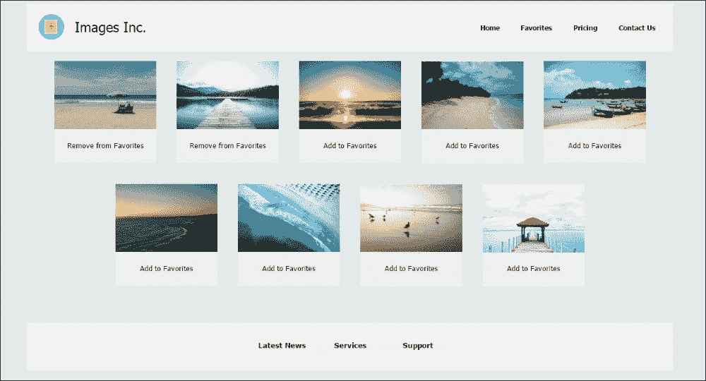

如您可能已经注意到的，与之前章节中的内容相比，我对应用程序的外观和感觉进行了改进。我还对项目中的代码进行了一些重构。

我之前提到，我们的应用程序在一定程度上是基于浏览器的视口进行响应式的。以下截图显示了 Chrome 开发者工具模拟器中应用程序的`index.html`页面（在 Windows 中为*Ctrl* + *Shift* + *M*），模拟其在 Apple iPad 上的渲染：

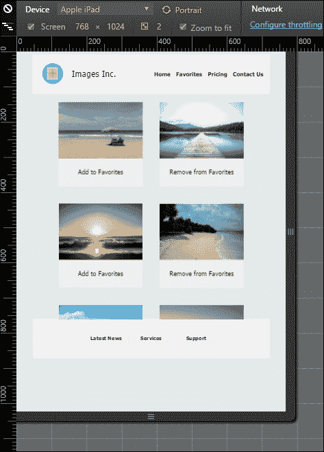

# 应用功能

如您所回忆的，我们的应用程序旨在成为一个图像画廊类型的应用程序，显示图像列表。用户能够以各种不同的方式与应用程序进行交互。虽然从用户的角度来看，应用程序可能看起来非常简单，但它从头开始设计，易于扩展，因此可以根据需要添加更多功能。

让我们考虑我们应用程序功能的各种方面。

## 索引页

应用程序的主页（`index.html`）由三个主要组件组成：`header`、`footer`和`content`。

这些组件分别构建了主页的页眉、页脚和内容部分（页面片段），如前一个屏幕截图所示。

由于我们将应用程序设计为**单页应用程序**（SPA），因此导航到应用程序的不同页面只会更新内容区域的视图。

应用程序的页眉和页脚部分只渲染一次，即在`index.html`的初始加载时。我们 SPA 设计的最大优点是，每次查看不同页面时，无需完全重新渲染页面。因此，在浏览器中不会有页面闪烁。

在主页中，用户可以看到所有可用图像的完整目录。通过点击图像，用户可以看到其全尺寸。当用户点击每张图像下方的相关链接时，还可以将图像添加到或从收藏图像列表中删除。

用户还可以与应用程序的页眉和页脚进行交互，尽管在我们的原型中，页眉和页脚中的所有链接并未全部激活。

## 图像页面

当用户点击图像时，应用程序内容区域的视图会改变，以显示全图，如下所示：

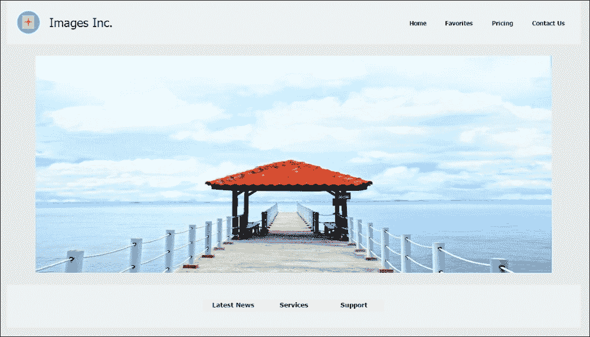

如果您查看浏览器的地址栏，当点击图像时，页面的 URL 会改变以反映图像的 ID。对于前面的图像，页面的 URL 将类似于：

`http://127.0.0.1:49202/Image_9.jpg`

这是您本地服务器的 URL 以及图像 ID。

## 收藏页面

在我们应用程序的主页中，用户可以点击每张图像底部的链接，将图像添加到其收藏图像列表中，如下所示：

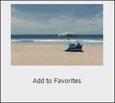

一旦点击**添加到收藏**链接，链接的文本将更改为**从收藏中删除**，使用户能够从收藏图像列表中删除图像。

用户还可以通过点击页眉部分的**收藏**链接查看所有收藏的图像；这将用户带到应用程序的**收藏**页面，如下所示：

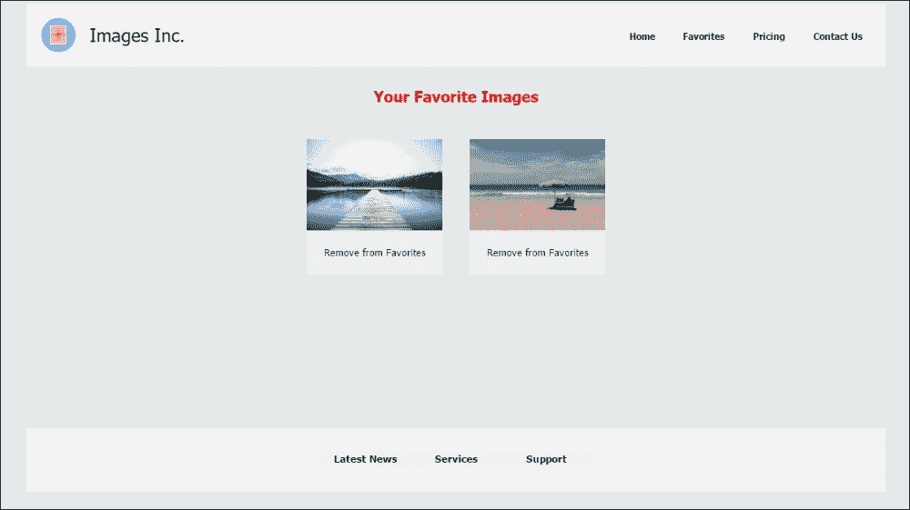

## 支持小部件

当用户点击应用程序页脚部分的**支持**链接时，将显示一个对话框，其中包含有关网站目录的信息。

此小部件（对话框）已被设计为动态加载，并在页面上渲染，但仅在点击**支持**链接时。这是应用程序中组件如何按需动态加载和渲染的一个示例。这使我们能够保持浏览器中应用程序的重量轻，并最小化其占用空间。

此小部件的设计也展示了在应用程序中动态组件的即插即用概念。

以下截图显示了该小部件在浏览器中的显示方式：

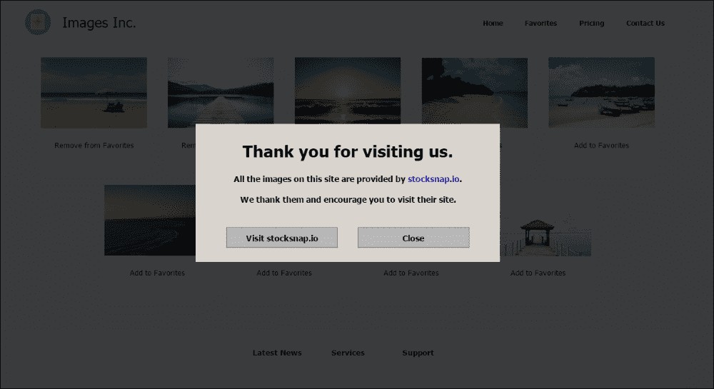

现在我们已经看过应用程序的外观，是时候检查其实施的机制，看看幕后是如何操作的。

# 应用程序实现

从一开始，我们在设计我们的应用程序时，意图创建一个模块化的生态系统，在这个生态系统中，不同的代码片段（模块）将被组合在一起，以创建一个功能齐全的应用程序。为此，我们的代码结构如下所示，具体请参考以下截图：

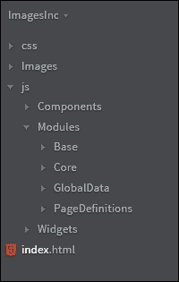

如您所见，我们的应用程序已组织成三个主要文件夹：`css`，它托管我们所有的样式文件；`Images`，它存储应用程序目录中的所有图像；以及`js`，它包含我们应用程序的所有 JavaScript 代码。由于这种结构只是组织应用程序代码的一种方法，您可能决定以不同的方式组织代码。

在`js`文件夹下，我们将我们的 JavaScript 文件进一步组织成三个主要子文件夹；`Components`包含与具有视图关联的模块相关的文件，`Modules`包含我们应用程序的控制器和模型模块，而`Widgets`托管与在应用程序中动态加载和渲染的组件相关的文件。

我们的`Modules`文件夹进一步细分为五个子文件夹；`Base`包含我们的第三方依赖和基础模块，`Core`托管我们应用程序的控制器代码（模块），而`GlobalData`包含我们应用程序的模型文件。

其他两个子文件夹`SandBox`和`PageDefinitions`分别包含用于动态加载组件的沙盒模块和对象定义文件。

在接下来的几节中，我们将检查我们子文件夹中的大多数文件中的代码。

## 在`index.html`中加载我们的模块文件

在我们开始查看我们的 JavaScript 代码和模块之前，让我们更仔细地看看`index.html`文件，看看应用程序模块是如何在浏览器中加载的。

我们的`index.html`页面设计得只提供应用程序主页的最基本骨架，而所有其他部分（页眉、页脚和内容）在页面加载时动态构建。

一般而言，在某些情况下，在将页面的一部分发送到客户端之前在服务器上构建应用程序页面的某些部分更有意义，因为这种实现有时可以提供更好的性能。

在我们的方法中，我们正在客户端构建我们应用程序页面的所有部分。这样做是为了我们可以更容易地检查和应用我们应用程序设计中的不同概念。

我们的`index.html`文件的骨架由三个主要容器组成，如下所示：

```js
<header id="headerContainer" role="banner" itemscope itemtype="https://schema.org/WPHeader" class="headerContainerClass">
</header>

<main id="mainPageContainer" role="main" class="clearfix mainPageContainerClass">
</main>

<div id="footerParentContainer" class="footerContainerClass" >
    <div id="footerContainer" class="footerlinksContainerClass">
    </div>
</div>
```

如您所见，我们有一个头部容器，它承载着我们的应用程序的`header`组件，一个主要容器，它承载着我们的应用程序的`content`组件，以及一个`div`，它是我们的`footer`组件的容器。

这些是我们`index.html`页面中的组件（容器），它们被传递给我们的组件，以便它们可以在其中渲染自己。

在页面主体元素的结束标签之前，我们包含了加载我们应用程序脚本的`<script>`标签。让我们看看：

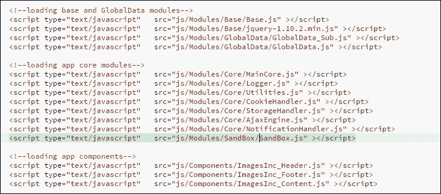

如您所见，需要加载相当多的脚本文件。我们可以通过合并（并压缩）一些文件，以及使用**异步模块定义**（**AMD**）等格式，结合`Require.js`等库来加载我们的文件来改进这一点。然而，为了清晰起见，我们现在保持现状。

在本书的第十章中，我们将讨论如何使用 AMD 格式以更优化的方式组合和加载我们应用程序所需的文件。

以下脚本也已在我们的`index.html`文件中实现，该文件负责启动应用程序。

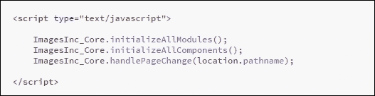

我们将很快讨论应用程序启动的过程。请注意，我们首先初始化所有模块，然后是组件，最后，我们将页面的 URL 传递给`ImagesInc_Core`模块的`handlePageChange`方法。这样做是为了我们可以在应用程序的路由器中使用页面的 URL，这将在稍后进行深入探讨。

我强调，当你阅读这一章时，你可能需要将相关的代码加载到你的 IDE 中，这样你可以更容易地跟随。

## 基础模块实现

让我们从基础模块开始探索我们的应用程序模块。我们的`Base`文件夹包含两个 JavaScript 文件；`Base.js`和`jquery-1.10.2.min.js`。

`Base.js`文件实现了`ImagesInc_Base`模块，该模块负责将我们讨论的上一章中的所有第三方库导入到应用程序中。目前，我们导入的唯一第三方库是 jQuery。

以下代码片段展示了这是如何实现的：

```js
var ImagesInc_Base = (function(){
    function getBaseModule(){
        if(typeof  jQuery !== 'undefined'){
            return jQuery;
        }else{
            return null;
        }
    }
    return {        
      getBaseModule: getBaseModule  
    };    
})();
```

如您所见，我们使用 IIFE（立即执行函数表达式）将一个对象返回给全局变量`ImagesInc_Base`。

在这个函数中，我们首先检查全局作用域中是否已定义了 jQuery 对象；如果是，则返回它。否则，返回`null`。

我们的核心模块将使用此对象来利用 jQuery 库的功能。

这是在`MainCore`模块中实现的：

```js
(function Core_initialize(){        
        mainCore.debug = true;        
        try{
            // get jQuery from the base module loader
            mainCore.jQuery = $ = ImagesInc_Base.getBaseModule();   
        }catch(e){            
            if(mainCore.debug){
                console.error('Base Module has not been defined!!!' );    
            }
        }        
        if(mainCore.debug){
            console.log("%c Core Module has been initialized...", "color:blue");
        }

})();
```

由于我们的`MainCore`模块正在初始化自身（使用 IIFE），它会向基础模块请求其基础库，然后将返回对象的引用分配给`MainCore`模块的`$`和`mainCore.jQuery`属性。

注意，在当前实现中，我们只能导入一个基础库。这是为了保持实现简单，因为我们的应用程序只需要 jQuery。然而，我们也可以通过修改此代码来导入并使用一系列库。

## 核心模块实现

核心模块是我们应用程序中的重量级模块，它由几个子模块构建。此模块的功能也通过我们在前几章讨论的技术得到了增强和增强，例如紧密和松散增强。

下面是构成核心模块的所有子模块列表：

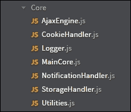

我们不会涵盖此模块的所有相关代码，但我们将在本节中查看其重要部分。请注意，核心模块也是我们应用程序的控制者。

### MainCore 模块实现

此模块提供了核心模块的主要功能，所有相关的核心子模块都附加到这个模块上，因此命名为`MainCore.js`。

从现在开始，我将把这个模块称为**MainCore**。

该模块已经被定义为以下内容：

```js
var ImagesInc_Core = (function(mainCore){
var $ = null, registeredModules = [], registeredComponents = []....
...
...

})(ImagesInc_Core || {}); // using loose augmentation
```

正如你所见，我们在这个模块中使用了松散增强技术来增强其功能。

此模块还使用内部 IIFE 来初始化自身并导入我们的应用程序的基础库。当应用程序处于调试模式时，MainCore 将在加载后立即宣布它已经初始化。

如下代码片段所示：

```js
(function Core_initialize(){
        mainCore.debug = true;        
        try{
            // get jQuery from the base module loader
            mainCore.jQuery = $ = ImagesInc_Base.getBaseModule();

        }catch(e){            
            if(mainCore.debug){
                console.error('Base Module has not been defined!!!' );    
            }
        }        
        if(mainCore.debug){
            console.log("%c Core Module has beeninitialized...", "color:blue");
        } 
})();
```

要在应用程序中开启或关闭调试模式，我们已经实现了一个方法，外部代码可以调用此方法：

```js
mainCore.toggleDebug = function(){        
         mainCore.debug = !mainCore.debug;
         if(mainCore.debug){
            mainCore.log(1, "Application debug has been turned on...", "blue");
         }else{
             console.log("%c Application debug has been turned off...", "color:orange");
        }
};
```

注意，我们返回了 MainCore 模块的引用作为全局变量`ImagesInc_Core`，这允许外部代码通过该模块提供的接口与之交互。

#### 增强 MainCore 模块

在设计 MainCore 模块时，我故意使用了各种增强技术。这样做是为了展示在模块链接中这些技术的实际应用方面。

##### 使用紧密增强增强 MainCore

考虑以下增强：

```js
// event related functionality augmentation
var ImagesInc_Core = (function(Core){
    var $ = Core.jQuery;
    var addEventHandlerToElem = function(elem,event,callbackFunc){

        if(!elem){            
            Core.log(3, 'elem is not passed in, from addEventHandlerToElem');
            throw new Error('Element not found');
        }
...

    Core.addEventHandlerToElement = addEventHandlerToElem;
    Core.removeEventHandlerFromElem = removeEventHandlerFromElem;
    Core.registerForCustomEvents = registerForCustomEvents;
 …..........
 return Core;        
})(ImagesInc_Core); // using tight augmentation
```

在这里，我们在处理 MainCore 模块中与事件相关的功能代码和与此模块相关的其他代码之间进行了逻辑分离。

注意，我们已经将 MainCore 模块（在应用程序中被称为 `ImagesInc_Core`）的引用传递给了实现此增强（使用紧密增强技术）的立即执行函数表达式（IIFE），然后根据需要向 MainCore 模块添加了新的属性。最后，将现在增强后的 MainCore 模块的引用返回给 `ImagesInc_Core`，这是提供对 MainCore 模块访问的全局变量。

我们在代码的另一部分再次使用相同的技巧，以增加更多功能来增强模块。请查看应用程序 `MainCore.js` 文件中相关的代码。

##### 使用子模块增强 MainCore

让我们看看如何将子模块添加到 MainCore 模块的示例。为了向应用程序添加增强的日志记录功能，我们通过一个专门为应用程序记录消息的子模块来增强 MainCore 模块。

以下代码片段显示了此子模块是如何被 MainCore 模块使用的：

```js
mainCore.log = function(severity,msg, color){

        // if the logging module has been loaded, then use its full functionality
        // otherwise just log a simple message
        if(mainCore.LoggingHandler && mainCore.LoggingHandler.logMessage){

            mainCore.LoggingHandler.logMessage(severity,msg,color);

        }else{
            if(severity === 3){
              color = "color:red;font-weight:bold"; 
            }
            console'log'", color);
        }
};
```

在此方法中，我们首先检查 `LoggingHandler` 对象（日志子模块）是否存在，以及该对象上的 `logMessage` 方法是否实现。如果这两个条件都满足，则将日志消息及其相关信息传递给此子模块。

另一方面，如果日志子模块或其所需的方法不存在，我们使用 `mainCore` 模块自己的简单日志记录机制在浏览器控制台中记录消息。

我们应该看看 `LoggingHandler` 子模块是如何实现并被添加到 MainCore 模块中的。

考虑以下代码片段：

```js
// using simple sub-module augmentation
ImagesInc_Core.LoggingHandler = (function(){

    var self = {}, messageParam, colorParam;
    self.logMessage = function(severity, message,color) {

  …....

return {        
        logMessage: self.logMessage,
        initialize: self.initialize
    };    
})();
```

如所示，我们向 `ImagesInc_Core` 对象（MainCore 模块）添加了一个属性。当执行时，立即执行函数表达式（IIFE）将一个对象返回到这个属性（`LoggingHandler`）。这个对象包含两个方法，提供了与应用程序日志记录机制相关的所有功能。

虽然这两个方法的实现被隐藏在应用程序的其他部分之外，但应用程序的其他部分可以通过 MainCore 模块和相关接口与这个子模块进行交互。

注意，这个子模块可以很容易地被替换为不同的子模块或以我们希望的形式进行内部修改。然而，只要暴露的接口不改变，所有外部代码仍然能够使用这个子模块进行日志记录功能。

实际上，我们可以完全移除此子模块，而这对应用程序没有任何影响，除了应用程序的高级日志记录机制将不存在。这突显了我们应用程序中模块化设计的一些优点，例如**即插即用**、**渐进增强**和**优雅降级**。

同样，我们也可以向 MainCore 模块添加其他子模块，以提供更多功能，而无需在应用程序中进行许多更改。这使得我们能够拥有一个灵活且易于维护的代码库。

在我们的应用程序中，还有其他子模块，它们附加到 MainCore 模块，并为应用程序提供附加功能。我们在上一章中讨论了这些子模块，但我会再次提及它们：

+   `AjaxEngine`: 该模块负责使用 jQuery AJAX 功能向服务器发出 AJAX 调用。

+   `CookieHandler`: 该模块负责应用程序中所有与 cookie 相关的操作，例如在浏览器中写入、读取和删除 cookie。

+   `NotificationHandler`: 该模块负责通过利用对话框组件向用户显示通知。

+   `StorageHanlder`: 该子模块实现了与浏览器本地存储相关的所有功能，例如在本地存储中存储、读取和删除对象。

+   `Utilities`: 该模块为应用程序提供辅助方法，例如合并两个对象的方法、检查一个对象是否为数组的方法、从服务器加载文件的方法等等。

### 在 MainCore 中注册组件

我们的应用程序中的每个组件都注册到 MainCore 模块。这允许通过`SandBox`模块的实例创建组件与应用程序之间的桥梁。我们很快就会讨论`SandBox`模块，但现在让我们看看应用程序（在 MainCore 模块中）中组件注册是如何进行的。

以下图表概述了此过程：

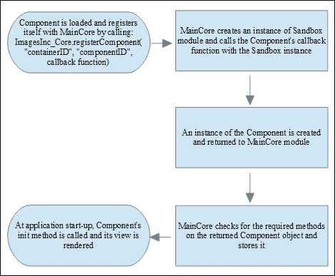

考虑以下 MainCore 模块中的实现：

```js
mainCore.registerComponent = function(containerID, componentID, createFunc){

        var containerElem, componentObj;

        // setting context for the sandbox
        if($){
            containerElem =  $("#" + containerID)[0];        
        }else{        
            containerElem = document.getElementById(containerID);
        }        
        if(createFunc && typeof createFunc === 'function'){            
            componentObj = createFunc(new SandBox(this,containerElem, componentID));
            //checking for required methods in component
            if (componentObj.init && typeof componentObj.init === 'function' && componentObj.destroy && typeof componentObj.destroy === 'function') {
                 componentObj.id = componentID;
                 registeredComponents.push(componentObj);

            }else{                
                this.log(3,"Component does not have necessary methods, thus not registered");
            }
        }else{            
            this.log(3,"no creator function on component, component not registered");
        } 
};
```

如您所见，当组件在加载时由组件调用此方法时，将三个参数传递到 MainCore 的`mainCore.registerComponent`方法：`containerID`、`componentID`和`createFunc`。

`containerID`参数传递给此方法，以告知应用程序组件视图需要渲染到哪个容器（HTML 元素）。`componentID`是与应用程序注册的组件的 ID，`createFunc`是组件上的回调函数，`mainCore.registerComponent`方法调用它以创建组件的实例。

我们将在本章后面更深入地讨论组件的实例化。但就目前而言，让我们从 MainCore 模块的角度来看看这个机制。

在上述方法中，我们首先遍历 DOM 树以找到组件视图的容器元素，无论是使用 jQuery 还是直接使用 DOM API。

然后，我们检查是否已传入所需的`createFunc`参数，并且它是否是一个函数。如果是这样，我们就使用`SandBox`模块的实例（使用依赖注入）调用此组件的函数。请记住，每个组件都会获得`SandBox`模块的不同实例，这是组件与应用程序之间的桥梁。

这如下所示：

```js
componentObj = createFunc(new SandBox(this,containerElem, componentID));
```

如果组件设计得当，此函数调用的结果是组件的实例，它被返回并存储在`componentObj`变量中。

此外，还有一些必需的方法，我们需要确保组件实例上存在：`init`和`destroy`方法。请注意，MainCore 不关心这些方法在组件中的实现方式或它们的功能，只关心它们的存在。这些方法的内部实现和它们的功能是组件本身的职责，每个组件可能以不同的方式实现这些方法。考虑以下代码片段：

```js
//checking for required methods in component
if (componentObj.init && typeof componentObj.init === 'function' && componentObj.destroy && typeof componentObj.destroy === 'function') {

           componentObj.id = componentID;
           registeredComponents.push(componentObj);

}else{                
           this.log(3,"Component does not have necessary methods, thus not registered");
}
```

在注册阶段结束时，每个组件都会推送到`registeredComponents`数组，这是一个所有注册组件的集合。

我们使用这个组件数组在应用中做几件不同的事情。例如，当应用启动时，我们遍历这个数组中的所有组件，并对每个组件调用`init`方法。这是按照以下方式完成的：

```js
mainCore.initializeAllComponents = function(){

        this.log(1,"Initializing all components...", "orange");

        try{            
            for(var i=0; i < registeredComponents.length; i++){          
                registeredComponents[i].init();
            }

        }catch(e){            
           this.log(3, 'APPLICATION CATASTROPHIC ERROR!' + e.name + ": " + e.message);
        }
        this.log(1,"All components have been initialized...", "orange");
};
```

如下所示，在`index.html`文件中调用 MainCore 模块的先前方法：

```js
ImagesInc_Core.initializeAllComponents();
```

在启动阶段，当应用调用所有组件的`init`方法后，如果应用处于调试模式，我们将在控制台看到以下消息。

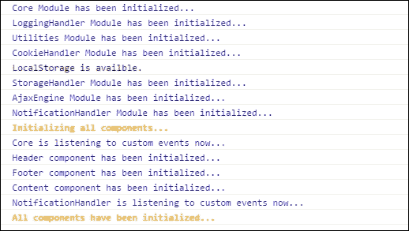

### MainCore 通过动态加载组件

如您所回忆的，我之前提到过，应用组件可以在应用启动之后加载。MainCore 模块提供了钩子和实现所需功能以实现这一点。

我认为在继续下面的解释之前，回到前面的章节并查看描述该机制的流程图是个好主意，这样你可以刷新你的记忆。

在我们的应用中，当用户点击页脚部分提供的**支持**链接时，会显示一个对话框。这个对话框提供了关于我们应用中的图片是从哪里获取的信息，以及用户是否希望访问该网站。

此小部件组件（`notificationWidget`）在应用最初启动时不会在`index.html`页面中加载；它仅在用户点击**支持**链接时加载。

然而，如果小部件已经在应用中预先加载（如果用户之前点击过**支持**链接），我们将在页面上重新渲染它。这是因为第一次加载此组件后，它将被保存在缓存中，即使用户通过点击其**关闭**按钮关闭对话框也是如此。

`NotificationHandler`子模块负责监听并处理**支持**链接的点击事件。这是通过使用发布-订阅机制（模式）来实现的，我们将在本章稍后讨论。

考虑以下代码片段：

```js
self.handleSupportClick = function(){
        // name of the component when it registers itselft with core is used here
        NotificationWidgetObj = ImagesInc_Core.getComponentByID("notificationWidget");        
        if(!NotificationWidgetObj){            
            ImagesInc_Core.loadComponent(ImagesInc_GlobalData.getNoficationWidgetDefID(), self.renderWidget);

        }else{            
            self.renderWidget();
        }
   };
```

这个方法是`NotificationHandler`子模块中**支持**链接点击事件的回调函数。这个方法首先做的事情是询问应用程序（特别是 MainCore 模块）这个组件（小部件）是否已经被应用程序（特别是 MainCore 模块）之前加载并注册，如下所示：

```js
NotificationWidgetObj = ImagesInc_Core.getComponentByID("notificationWidget");
```

如果是这样，这个方法会调用`NotificationHandler.renderWidget`（`self.renderWidget`）函数，然后它反过来在组件本身上调用`renderWidget`方法。请注意，组件本身负责其渲染，如下所示：

```js
self.renderWidget = function(){        
       ImagesInc_Core.getComponentByID("notificationWidget").renderWidget();    
};
```

如果小部件之前没有被加载，该方法会要求 MainCore 模块首先加载小部件，然后调用`NotificationHandler.renderWidget`函数，这是作为`self.renderWidget`传入的回调函数。

这个调用如下所示：

```js
ImagesInc_Core.loadComponent(ImagesInc_GlobalData.getNoficationWidgetDefID(), self.renderWidget);
```

现在控制权交给了 MainCore 模块来动态加载组件（小部件）。这是通过首先在浏览器的本地存储中查找组件的对象定义来完成的。

让我们先看看本地存储是如何填充组件对象定义的。

#### 在本地存储中存储对象定义

应用程序已被设计为在浏览器的本地存储中查找所有动态加载组件的对象定义。

然而，这些定义实际上是在`PageDefinitions.js`文件中实现的。

当`PageDefinitions.js`文件被加载时，它使用 IIFE 将它的对象定义存储在浏览器的本地存储中，如下所示：

```js
(function(){

    var NotificationWidgetDefinition = {
        componentID: "notificationWidget",
        scriptFile: "NotificationWidget.js",
        scriptPath: "/js/Widgets/",
        cssFile: "NotificationWidget.css",
        cssPath: "css/"
    };

...    
    ImagesInc_Core.saveValueToLocalStorage(ImagesInc_GlobalData.getNoficationWidgetDefID(),NotificationWidgetDefinition);

...

})();
```

在浏览器本地存储填充了对象定义之后，文件将从浏览器缓存中删除，因为它可能很大，并且会消耗大量的内存。这种设计允许我们最小化浏览器缓存的使用，这在资源有限的移动设备上可能特别有趣。

注意`notificationWidget`的对象定义。在这个对象上，`ScriptFile`属性持有该组件的`.js`文件名，而`ScriptPath`属性存储该文件的路径。MainCore 模块使用这些信息从服务器查找并加载组件。

#### 从本地存储获取组件的对象定义

现在你已经知道了本地存储是如何填充对象定义的，我们可以看看 MainCore 模块是如何从本地存储中获取`notificationWidget`对象定义并加载相关资源的。

考虑以下代码片段：

```js
mainCore.loadComponent = function(ComponentDefID, callbackFunc){        
        // get the value of Component object defintion from storage
        var ComponentDef =  mainCore.getValueForKeyAsObjectFromStorage(ComponentDefID);
        loadedComponentcallbackFunc = callbackFunc;

        if(!ComponentDef){
            // if Component definition is not in the storage then the page object definitions probably needs to be loaded
            mainCore.loadPageDefinitionsFileAndCallBack(function(){mainCore.getComponentObjAndCallback(ComponentDefID, mainCore.loadComponentFilesAndInitializeWithCallBack);});

        }else{         
            mainCore.loadComponentFilesAndInitializeWithCallBack(ComponentDef);
        }
};
```

在这个方法中，首先检查浏览器中的本地存储（在幕后使用`StorageHandler`子模块）以查找组件的对象定义。如果找到了，那么这个方法会调用另一个方法来动态加载组件所需的资源，如下所示：

```js
mainCore.loadComponentFilesAndInitializeWithCallBack(ComponentDef)
```

#### 从服务器动态加载组件的资源

一旦从本地存储中提取了组件的对象定义，其所需的 `.js` 和 `.css` 文件将通过以下方法从服务器加载：

```js
mainCore.loadComponentFilesAndInitializeWithCallBack = function(pageDefinitionObj, callbackFunc){
...
    mainCore.loadJSfileFromObjDefAndCallBack(pageDefinitionObj.scriptFile, pageDefinitionObj.scriptPath, function(){mainCore.initializeComponent(pageDefinitionObj.componentID, loadedComponentcallbackFunc)});

...
    mainCore.loadCSSfileFromObjDef(pageDefinitionObj.cssFile, pageDefinitionObj.cssPath);
...

}
```

如您所见，此方法调用其他专门用于加载 `.js` 或 `.css` 文件的方法，因为根据文件类型，将文件加载到应用程序中的机制不同。当然，`.js` 文件是组件代码所在的地方，而 `.css` 文件包含组件的样式相关信息。

请记住，在文件被加载到浏览器缓存后，回调函数将**异步**调用。

此外，请注意，MainCore 模块使用 `Utilities` 子模块（幕后操作）来处理从服务器请求和加载组件文件的技术细节。

组件的动态加载可能是应用程序中最复杂的操作，仅通过阅读本节可能难以完全理解。我强烈建议您下载应用程序的代码，并在运行应用程序时在此节中提到的方法中设置断点。这样做将帮助您完全理解动态加载组件的流程。

在组件被动态加载到应用程序后，它仍然需要向 MainCore 模块注册自己。我们将在本章的后面部分更详细地讨论这个过程。

### MainCore 模块中的路由功能

由于我们的应用程序是一个单页应用程序，并且其视图需要根据用户的交互进行更改，因此我们需要实现客户端路由功能。这也意味着我们需要根据用户点击浏览器的后退和前进按钮来整合页面视图的更改。

在我们的应用程序中，我已使用 HTML5 历史 API 作为客户端路由的基础，但我们也可以使用像 `History.js` 这样的开源库。

让我们看看在 MainCore 模块中如何实现路由功能。

#### 将 URL 添加到浏览器的历史对象中

考虑以下方法：

```js
 var addToHistory = function(dataObj){        
        // if history object is supported
     if(!!(window.history && history.pushState)){   
         history.pushState(dataObj,dataObj.url, dataObj.url);
     }else{
         alert('Your browser needs to be upgraded to the latest version');
         Core.log(3, "History API is not supported; from addToHistory");
     }  
};
```

当应用程序需要在浏览器的历史对象中创建条目时，将调用此方法。例如，当点击页眉部分的**主页**链接时，在页眉组件中会调用以下回调函数：

```js
handleHomeClick: function (e) {
     sandBox.loadPage("index.html");
     e.preventDefault();
     e.stopPropagation();
     sandBox.addToHistory({
          url: "index.html"
     });
},
```

如您所见，回调函数调用其 `SandBox` 实例的 `addToHistory` API，然后 `SandBox` 实例调用 MainCore 模块的 `addToHistory` 方法。匿名对象传递给此方法，然后浏览器的历史对象按以下方式更新：

```js
var addToHistory = function(dataObj){

        // if history object is supported
        if(!!(window.history && history.pushState)){

            history.pushState(dataObj,dataObj.url, dataObj.url);            

        }else{

            alert('Your browser needs to be upgraded to the latest version');
            Core.log(3, "History API is not supported; from addToHistory");
        }        
}; 
```

将三个参数传递给历史对象的 `pushState` API。这些参数分别是；`State` 对象、`Title` 和 `URL`。

在我们之前的示例中，以下对象将被作为第一个参数传递给此 API：

```js
{
          url: "index.html"
} 
```

### 注意

注意，我们使用同一对象的`url`属性来设置其他参数。

如需了解更多关于浏览器历史 API 的信息，您可以参考以下链接：

[`developer.mozilla.org/en-US/docs/Web/API/History_API`](https://developer.mozilla.org/en-US/docs/Web/API/History_API)

#### 从浏览器的历史对象中获取 URL

要从浏览器的历史对象中获取 URL 条目，我们首先将浏览器的`popstate`事件绑定到 MainCore 的`getFromHistory`方法，如下所示：

```js
addEventHandlerToElem(window,'popstate',getFromHistory);
```

这意味着每当浏览器发生`pop`事件时，即用户点击浏览器的后退或前进按钮时，以下方法就会被调用：

```js
 var getFromHistory = function(e){
        // if history object is supported
        if(!!(window.history && history.pushState)){
            if(e.state){
                Core.handlePageChange(e.state.url);
            }else if(e.originalEvent && e.originalEvent.state){ // to get the original event in case of jQuery
                Core.handlePageChange(e.originalEvent.state.url);
            }else{
                Core.log(2, "Could not get the state of event from history object");
            }            
        }else{            
            alert('Your browser needs to be upgraded to the latest version');
            Core.log(3, "History API is not supported; from getFromHistory");
        }        
};
```

此方法采取的主要行动是调用 MainCore 模块的`handlePageChange`方法。该方法反过来，在应用程序中发布一个`page-Changed`事件，如下所示：

```js
Core.handlePageChange = function(pageURL){      
        Core.publishCustomEvent({
            type: 'page-Changed',
            data:pageURL
        });

};
```

当此事件发布时，所有注册了此事件的模块都会收到通知。模块可以根据发布的事件采取行动。

例如，`content`组件将`updateContentPage`方法绑定到该事件，如下所示：

```js
'page-Changed': this.updateContentPage
```

为了更好地理解这一过程是如何工作的，我们还需要讨论应用程序中自定义事件和发布-订阅（观察者）模式的实现。

### MainCore 中的发布-订阅实现

如前所述，我们应用程序设计的目标之一就是创建应用程序模块之间的松散耦合。

我们还讨论了这样一个事实：虽然我们的应用程序模块彼此之间并不了解，但它们需要能够以间接的方式相互通信。

这些目标可以通过利用**中介者**设计模式并在该模式周围实现发布-订阅机制来实现。

正如我们在上一章中看到的，在中介者模式中，应用程序的各个部分不会直接为自定义事件相互注册。相反，它们为这些事件注册，并通过一个中介部件来接收此类事件的广播通知。在我们的应用程序中，中介部件是我们的 MainCore 模块。

### 注意

如果您不熟悉中介者或发布-订阅模式，我强烈推荐阅读*Simon Timms*的《Mastering JavaScript Design Patterns》，该书讨论了许多流行的模式以及中介者模式。您可以在以下链接找到这本书：

[`www.packtpub.com/application-development/mastering-javascript-design-patterns`](https://www.packtpub.com/application-development/mastering-javascript-design-patterns)

#### 为自定义事件注册组件

MainCore 模块中的以下方法用于将组件注册为接收自定义事件：

```js
var registerForCustomEvents = function (componentID,eventsObj) {  
    if (typeof componentID === 'string' && typeof eventsObj === 'object') {
        for(var i=0; i< Core.registeredComponents.length ; i++){            
            if(Core.registeredComponents[i].id === componentID){
                Core.registeredComponents[i].events = eventsObj;
                }
            }
        } else {
            Core.log(3,'Incorrect parameters passed in, from registerForCustomEvents');
        }
};
```

如您所见，此方法将传递给它的自定义事件对象与组件的 ID 注册，当事件发布时需要通知该组件。

例如，`content`组件注册了以下事件：

```js
registerForCustomEvents : function(){          
    sandBox.registerForCustomEvents({
        'img-Clicked': this.updateContentPage, //  handles  image click
        'page-Changed': this.updateContentPage, // handles back and forward buttons
        'favorites-Clicked':this.updateContentPage
    });            
},
```

当上述任何事件被发布时，该事件的绑定事件处理器方法就会被调用。

注意，在上面的代码中，组件没有将任何组件 ID 传递给 `SandBox` 模块实例。然而，与该组件关联的 `SandBox` 模块实例按照以下方式将所需的组件 ID 发送到 `MainCore` 模块：

```js
 registerForCustomEvents : function(eventsObj){            
    if(eventsObj && typeof eventsObj === "object"){
        Core.registerForCustomEvents(componentID,eventsObj);                 
    }else{                
        Core.log(3,"incorrect parameter passed in; from SandBox.registerForCustomEvents");
    }  
},
```

当我们在本章后面讨论 `SandBox` 模块时，我们将讨论 `SandBox` 实例如何知道组件 ID。

#### 通过组件广播自定义事件

当组件需要在应用程序中发布自定义事件时，它们通过使用 `MainCore` 模块中的 `publishCustomEvent` 方法来实现。

考虑以下用于此方法的代码：

```js
var publishCustomEvent = function(eventObj){      
    for(var i=0; i< Core.registeredComponents.length ; i++){ 
        if(Core.registeredComponents[i].events && Core.registeredComponents[i].events[eventObj.type]){
            Core.registeredComponents[i].eventseventObj.type;
        }
    }
};
```

如您所见，一个事件对象被传递到这个方法中。该方法遍历所有已注册此事件的组件，然后调用组件上与该事件关联的事件处理器。

组件可以使用它们的 `SandBox` 模块实例发布它们的事件。例如，应用程序的 `header` 组件广播应用程序中的收藏链接已被点击，如下所示：

```js
handleFavouritesClick: function (e) {

            e.preventDefault();
            e.stopPropagation();

      ...     
            sandBox.publishCustomEvent({
                type: 'favourites-Clicked',
                data: "favourites"
            });
            sandBox.addToHistory({
                url: 'favourites' //update url in the browser
            });            
}
```

由于 `content` 组件已注册此事件，因此随后的调用 `content` 组件的 `updateContentPage` 方法。

总结来说，应用程序组件发布自定义事件，然后注册了这些自定义事件的组件通过 `MainCore` 模块得到通知，`MainCore` 模块调用与这些自定义事件关联的方法。因此，`MainCore` 模块在应用程序的所有组件之间充当了中介件。

这就结束了我们对核心模块的讨论和审查，但请记住，整个核心模块为应用程序提供了许多超出我们在此讨论的功能。所有此类功能要么在 `MainCore` 模块（`MainCore.js`）中实现，要么在其他子模块中实现，这些子模块共同构成了核心模块。

请记住，从组件的角度来看，所有应用程序功能都是由 `SandBox` 模块的一个实例提供的。

## SandBox 模块实现

如前所述，我们应用程序中的组件不直接相互通信，也不直接与其他应用程序部分通信。组件与应用程序其余部分之间的唯一连接是通过分配给它们的 `SandBox` 模块实例。

### SandBox 模块的构造函数

考虑以下代码片段：

```js
var SandBox = function(Core,contextElem, componentSelector){
    var Core = Core, containerElemContext = contextElem, componentID = componentSelector;

    return{        
        getElement : function(elementID){            
            if(elementID && typeof elementID === "string"){
                return Core.getElement(elementID);

            }else{                
                Core.log(3,"incorrect parameters passed in; from SandBox.getElement ");
            }
        },
...    
};
```

如前述代码所示，`SandBox` 模块被创建为一个全局对象 `SandBox`，并且由 `MainCore` 模块通过构造函数传递了三个参数给它。`Core` 参数，是 `MainCore` 模块的引用；`contextElem` 参数，是组件视图所属的容器元素的引用；以及 `componentSelector`，它是沙盒组件的 ID。

例如，当`header`组件的`SandBox`实例被实例化时，它接收以下参数：作为第一个参数的核心模块引用，`headerContainer`，这是页面上`header`组件视图容器的 ID，作为第二个参数，以及`header`，这是`header`组件的 ID，作为第三个参数。

`SandBox`模块实例使用对核心模块的引用来获取核心模块提供的功能。

### 在`SandBox`实例中设置组件的容器上下文

`SandBox`模块实例使用组件视图的容器元素的引用来设置组件 HTML 元素的 DOM 上下文。这样，当需要访问此容器内的 HTML 元素时，搜索可以从容器元素开始，而不是从页面的`document`元素开始。

看看下面的代码：

```js
 getElementInContext : function(elementID){        
    if(elementID && typeof elementID === "string"){
        return Core.getChildOfParentByID(containerElemContext,elementID);
    }else{
        Core.log(3,"incorrect parameters passed in; from SandBox.getElementInContext");
    }            

},
```

在这里，`SandBox`模块实例正在调用核心模块的`getChildOfParentByID`方法。此方法接受两个参数，`containerElemContext`和`elementID`。目标是搜索 DOM 树以找到传递进来的 ID 对应的元素。

使用容器元素的`DOM`上下文，我们可以从组件的容器开始搜索，而不是从 DOM 树的最顶层元素开始。这种方法使我们能够对找到组件元素进行更优化的搜索。

### 识别`SandBox`模块的实例

作为`SandBox`模块构造函数的第三个参数传入的组件 ID，用于标识`SandBox`模块的实例。核心模块使用这个 ID 来识别`SandBox`实例属于哪个组件。

例如，组件的 ID 在以下`SandBox`模块的方法中使用：

```js
unregisterCustomEvent : function(eventType){

            if(eventType && typeof eventType === "string"){
                Core.unregisterCustomEvent(componentID,eventType);

            }else{

                Core.log(3,"incorrect parameter passed in; from SandBox.unregisterCustomEvent");
            } 
},
```

在上面的代码片段中，我们正在调用核心模块的`unregisterCustomEvent`方法，并传入参数`componentID`。这样核心模块就能知道哪个`SandBox`实例正在发起这个调用，进而知道哪个组件希望取消订阅自定义事件。

### `SandBox`模块注意事项

关于`SandBox`模块还有一些其他事项需要注意。首先，`SandBox`模块可以被设计成只为组件提供核心模块功能的一个子集。这使我们能够控制组件可以访问哪些应用程序功能。其次，`SandBox`模块的所有方法都设计为进行非常基本的错误检查。这个过滤器将已通过基本级别验证的调用传播到核心模块。

请记住，`SandBox`模块应该只是一个位于组件和应用程序其余部分之间的薄层。因此，最好在`SandBox`模块级别不要进行广泛的验证。

什么是薄层，这取决于解释，但由于应用中可能存在许多 `SandBox` 模块的实例，最好将其保持得尽可能薄。

# 应用程序组件

考虑到我们的应用程序是一个 **概念验证** 类型的应用程序，我们只实现了四个组件；`header`、`footer`、`content` 和 `notificationWidget`（我使用的是应用程序中使用的组件 ID）。

这些组件在应用程序的项目中的以下文件中实现，分别是 `ImagesInc_Header.js`、`ImagesInc_Footer.js`、`ImagesInc_Content.js` 和 `NotificationWidget.js`。

在接下来的章节中，我将概述每个组件，但我强烈建议你查看本书附带的代码，以更好地理解这些组件是如何实现的。

请记住，我们的组件是模块，它们创建不同的应用程序视图。在 MVC 或 MV* 架构模式范式中，我们的组件包含它们自己的控制器，同时利用通过它们自己的 `SandBox` 模块实例提供的应用级控制器。

组件还实现了它们自己的视图，每个组件只了解其在应用中的视图。

虽然存在一个应用级模型（`ImagesInc_GlobalData`），并且我们的组件可以使用存储在这个应用模型中的数据，但每个组件也可以包含它自己的模型。因此，每个组件实现了它自己的 MVC 或 MV* 架构。

## 使用 MainCore 模块注册组件

我们已经从 MainCore 的角度讨论了组件是如何注册到 MainCore 模块的。现在是时候看看在组件级别是如何操作的。

无论组件是在应用启动阶段还是稍后加载，注册组件到应用中的机制总是相同的。

考虑以下代码片段：

```js
ImagesInc_Core.registerComponent("mainPageContainer", "notificationWidget", function(sandBox){

...
    var widgetMainContainer, stockSnapURL = "https://stocksnap.io";

    return {        
        init: function(){
            try{                               
                sandBox.contextObj = this;
                sandBox.logMessage(1,'Notification Widget component has been initialized...', 'blue');

            }catch(e){
                sandBox.logMessage(3,'Notification Widget has NOT been initialized correctly --> ' + e.message);
            }
        },

        destroy: function(removeComponent){

            sandBox.contextObj.unregisterFromEvents();            
            if(removeComponent){
                sandBox.removeComponentFromDom("widgetContainer");
            }           
            sandBox.logMessage(1,'Notification Widget has been destroyed...', "blue");
        },
...

}
```

正如你所见，当一个组件的 `.js` 文件被加载时，例如之前展示的 `notificationWidget`，会调用 MainCore 模块的 `registerComponent` 方法。因此，在应用中加载任何组件文件之前，都需要先加载 MainCore 模块。

由于我们之前已经讨论了组件是如何被调用的，以下内容对你来说应该只是复习。

在前面的代码中，当 `NotificationWidget.js` 文件被加载时，会调用 MainCore 模块的 `registerComponent` 方法，并带有三个参数：`mainPageContainer`，这是承载组件视图的容器元素的 ID；`notificationWidget`，这是组件本身的 ID；以及第三个参数作为一个 `callback` 函数。当这个 `callback` 函数被 MainCore 模块调用时，它会接收到 `SandBox` 模块的一个实例。

注意，此回调函数的返回对象是组件的单例对象，它具有所需的 `init` 和 `destroy` 方法。当然，这些方法被应用程序用于初始化和销毁组件实例。当我们讨论 `notificationWidget` 组件时，我们将更详细地介绍这些方法。

这里还有一个需要注意的事项，那就是我们在回调函数中创建了一个闭包，因此只有从该函数返回的对象才能访问组件的私有变量。

## 标题组件

此组件使用 ID `header` 在 Core 模块中注册自己，从那时起，应用程序使用此 ID 来引用此组件。

与应用程序中的所有其他组件一样，此组件实现了所需的 `init` 和 `destroy` 方法。

`header` 组件也实现了用于其元素附加和移除事件处理程序的方法。`handleFavouritesClick` 方法是此组件中事件处理程序的一个示例。

考虑以下事件处理程序的实现：

```js
handleFavouritesClick: function (e) {
            e.preventDefault();
            e.stopPropagation();
            var favoritedImagesArray = sandBox.getValueAsArrayFromCookie(ImagesInc_GlobalData.getFavCookieName());

            if(!favoritedImagesArray){ 
                alert('No favorites have been selected!');
                return;
            }            
            sandBox.publishCustomEvent({
                type: 'favorites-Clicked',
                data: "favorites"
            });
            sandBox.addToHistory({
                url: 'favorites' //update url in the browser
            });            
}
```

当点击 `header` 组件的 **Favorites** 链接时，会调用此方法。它首先检查浏览器 cookie 中是否存储了任何收藏的图片。然而，此检查不是由组件直接完成的，因为这个调用是针对该组件的 `SandBox` 模块实例进行的。

注意，`header` 组件并不知道检查 cookie 的机制是如何实现的，它也不需要自己实现此类功能。

如果在未来某个时刻改变了这种机制，这对该组件没有影响。组件将始终调用 `SandBox` 模块实例的相同方法，并让应用程序处理此操作。

还请注意，此方法更新浏览器中的 URL，并发布一个自定义事件，通知应用程序已发生特定事件。当然，组件通过 `SandBox` 模块实例利用应用程序的功能来完成所有这些任务。

## 页脚组件

`footer` 组件的设计与 `header` 组件非常相似，并且它使用 `footer` ID 在 Core 模块中注册自己。

组件中我们需要查看的一个方法是 `handleSupportClick`。当点击 `footer` 组件的 **Support** 链接时，会调用此方法。让我们检查此方法的实现，如下所示：

```js
handleSupportClick : function(e){            

            sandBox.publishCustomEvent({
                type: 'support-Clicked',
                data: "support"

            });            

            e.preventDefault();
            e.stopPropagation();
}
```

如您所见，当点击链接时，会发布自定义事件 `support-Clicked`。如果您回忆起本章前面的某个部分，`NotificationHandler` 模块正在监听此事件，并在事件发生时采取必要的行动。

这又是一个示例，说明尽管这些应用程序的部分正在相互通信，但实际上它们并不了解彼此的存在。这些组件通过我们的发布-订阅实现松散耦合。

## 内容组件

这个组件可以被认为是我们的应用程序的主要组件，它负责改变内容区域视图。它使用`content`的 ID 向 Core 模块注册自己。

内容组件实现了所需的`init`和`destroy`方法以及许多其他方法。

我们将在这里查看一些重要的方法。

### 处理内容区域点击事件

当用户在应用程序中点击**添加到收藏**链接或当内容区域中的图像被点击时，`content`组件视图的父容器捕获事件并处理它。

事件处理绑定的父容器发生在`content`组件的`init`方法中，如下所示：

```js
sandBox.addEventHandlerToParent("click", this.handleMainContainerClicked);
```

正如你所见，`handleMainContainerClicked`是处理这个点击事件的回调方法。

考虑这个方法是如何实现的：

```js
handleMainContainerClicked: function (e) {
    if (e.target != e.currentTarget) {
        e.preventDefault();
        e.stopPropagation();

            if (e.target.tagName.toUpperCase() === 'IMG') {
                sandBox.contextObj.handleImageClick(e.target);
            } else if (e.target.tagName.toUpperCase() === 'A') {
                sandBox.contextObj.handelFavLinkClick(e.target);
            }
    }
}
```

如所示，我们检查点击事件是否发生在图像或锚标签上，并根据这个判断，将事件处理的其余部分委托给相关的方法。

#### 处理添加到收藏链接的点击事件

在`handelFavLinkClick`方法中，我们检查**添加到收藏**链接的状态，并将其文本更改为**从收藏中移除**。如果链接已经被点击，并且包含文本**从收藏中移除**，我们将文本重置为其默认值**添加到收藏**。

我们还在浏览器的 cookie 中添加或删除收藏图像的 ID，因此当用户导航到**收藏**页面时，正确收藏的图像会在内容区域渲染。

考虑这个方法的实现：

```js
handelFavLinkClick: function (elem) {
    var anchorState, parentNode, anchorID;
    anchorState = elem.getAttribute('data-state');
    anchorID = elem.getAttribute('id');
    parentNode = sandBox.getParentNode(elem);

    if (anchorState) {
        sandBox.removeValueFromCookie(favCookieName,anchorID);
        sandBox.updateElement(parentNode, sandBox.contextObj.getAnchorHTMLStr(anchorID));

    } else {
        sandBox.populateCookie(favCookieName,anchorID);
        sandBox.updateElement(parentNode, sandBox.contextObj.getAnchorHTMLStr(anchorID, true));
    }
    sandBox.publishCustomEvent({
        type: 'FavLink-Clicked',
        data: anchorID
    });
},
```

正如你所见，在这个方法中我们还有其他一件事情要做，那就是广播相关的自定义事件到应用程序。这允许所有注册了这个事件的程序的其他部分都能得知这个组件中发生的事件。

#### 处理图像点击事件

当应用程序内容区域中的图像被点击时，将调用以下方法：

```js
handleImageClick: function (elem) {
            var imgName;

            imgName = elem.getAttribute('data-name');
            sandBox.publishCustomEvent({
                type: 'img-Clicked',
                data: imgName
            });
            sandBox.addToHistory({
                url: imgName
            });
}
```

注意这个方法做了两件主要的事情。一是更新浏览器的历史对象，以便当用户点击浏览器的后退和前进按钮时，应用程序路由器可以正常工作。二是向应用程序广播消息`img-Clicked`。

需要考虑的有趣点是，我们的`content`组件本身监听这个事件，并对此事件采取行动来更新页面视图，使用以下事件注册方法：

```js
registerForCustomEvents : function(){

      sandBox.registerForCustomEvents({
            'img-Clicked': this.updateContentPage, 
       'page-Changed': this.updateContentPage,
             'favourites-Clicked':this.updateContentPage
      });            
}
```

正如你所见，当`img-Clicked`事件被`content`组件（它自身生成的）接收时，那么这个组件的`updateContentPage`方法就会被调用。

当然，我们可以在 `handleImageClick` 方法中直接更新页面的视图，但通过在应用程序级别广播事件，我们可以确保应用程序的所有部分，包括 `content` 组件本身，都可以在事件广播时采取行动。

### 内容区域生成方法

`content` 组件也有负责根据浏览器 URL 生成页面内容区域的方法。以下是对这些方法的总结：

+   `buildFavouritesPage`：此方法加载与收藏夹页面相关的 CSS 文件（使用 `SandBox` 模块实例），然后根据用户之前选择的收藏图像数量渲染此页面

+   `buildIndexContentHTML`：如名称所示，此方法负责为 `index.html` 页面的内容区域构建 HTML 标签

+   `buildImagePageHTML`：使用此方法渲染点击的图像的全视图

+   `getAnchorHTMLStr`：此方法为每个图像生成相关链接，以便根据链接的状态将图像添加或从收藏夹图像列表中删除

我强烈建议您查看此组件的代码，以了解这些方法是如何实现的。

## NotificationWidget 组件

当这个组件加载时，它将自己注册为 `notificationWidget` 到核心模块。

我们之前讨论过这个组件，尽管其设计与应用程序中的所有其他组件类似，但也有一些不同之处。

如前所述，这个组件不是在应用程序启动阶段加载或渲染的。它仅在需要时根据用户与应用程序的交互动态加载和渲染。

### NotificationWidget 的模型

这个组件的视图以字符串形式存储在组件本身中，如下所示：

```js
var widgetInnerHTMLStr = '<div id="notificationMainContainer">' +
        '<h1 class="centerElem header">Thank you for visiting us.</h1>' +
        '<h3 class="centerElem header">All the images on this site are provided by <a href="https://stocksnap.io">stocksnap.io</a>.</h3>' +
        '<h3 class="centerElem header">We thank them and encourage you to visit their site.</h3>' +
        '<div class="buttonContainer">' +
            '<div class="button button-left" id="notification_visit">Visit stocksnap.io</div>' +
            '<div class="button button-right" id="notification_close">Close</div>' +
        '</div>' +
    '</div>';
```

这个字符串由组件传递给 MainCore 模块以渲染其视图。您很快就会看到这是如何完成的。

### 通知组件所需的方法

如前所述，每个组件都需要实现所需的方法：`init` 和 `destroy`。

请看以下 `notificationWidget` 组件的 `init` 方法，如下所示：

```js
 init: function(){
            try{                               
                sandBox.contextObj = this;
                sandBox.logMessage(1,'Notification Widget component has been initialized...', 'blue');

            }catch(e){
                sandBox.logMessage(3,'Notification Widget has NOT been initialized correctly --> ' + e.message);
            }
}
```

当应用程序调用组件的 `init` 方法，在这种情况下是 `notificationWidget`，就会向传递给组件的 `SandBox` 模块实例添加一个新属性。这个属性是 `contextObj`，其值设置为 `this`。

在这个上下文中，`this` 是对组件本身的引用，并被分配给 `SandBox` 实例，这样我们就可以在需要时轻松访问组件的上下文。这个属性对于组件中的事件处理程序回调特别有用。

考虑以下来自 `notificationWidget` 组件的代码片段：

```js
handleCloseClick : function(){
            sandBox.contextObj.unregisterFromEvents();
            sandBox.removeComponentFromDom("widgetContainer");
} 
```

当用户点击对话框的**关闭**按钮时，该按钮是`notificationWidget`组件的视图，此时会调用此回调函数。你可能想知道为什么我们不从回调函数中调用组件的内部方法，如下所示：

```js
this.unregisterFromEvents();
```

为了使上述函数调用成功，回调函数需要在组件的上下文中运行。然而，由于`this`的上下文在代码执行时设置为调用此回调函数的对象，而不是组件，因此我们无法使用`this`调用组件的内部方法。

因此，通过在`SandBox`实例上设置属性`contextObj`，我们能够轻松访问组件的原始上下文并调用所需内部方法，如下所示：

```js
sandBox.contextObj.unregisterFromEvents();
```

当然，我们也可以使用 JavaScript 的`bind()`方法来实现相同的作用域保留，但我选择了这种方法，这样你可以看到解决这个问题的另一种方式。

组件的`destroy`方法用于使其失效（组件上不会处理任何事件）或完全从 DOM 中移除组件。

考虑`notificationWidget`的`destroy`方法实现，如下所示：

```js
destroy: function(removeComponent){

            sandBox.contextObj.unregisterFromEvents();

            if(removeComponent){
                sandBox.removeComponentFromDom("widgetContainer");
            }

      sandBox.logMessage(1,'Notification Widget has been destroyed...', "blue");

},
```

根据传递给此方法的`removeComponent`标志（`true`或`false`）的值，组件要么被禁用，要么完全从 DOM 中移除。

注意，在上面的代码中，组件使用其`SandBox`模块的实例从 DOM 中移除自身，并且它不需要自己实现此类功能。这使得组件只需专注于自己的专业任务，并利用应用程序（通过`SandBox`实例）提供的功能。这种设计也限制了组件对其自身世界之外的访问，因此我们可以最小化可能的 DOM 操作冲突，如前一章所述。

## 渲染`notificationWidget`

当`NotificationHandler`调用组件的渲染方法时，该组件被渲染，如下所示：

```js
ImagesInc_Core.getComponentByID("notificationWidget").renderWidget();
```

考虑此方法的实现，如下所示：

```js
renderWidget : function(){

    var generatedWidget;

    generatedWidget = sandBox.createDocumentLevelComponent(widgetInnerHTMLStr);

    generatedWidget.id = "widgetContainer";
     sandBox.setElementContext(generatedWidget.id);
     this.registerForEvents();  
},
```

组件使用其`SandBox`模块实例上的方法创建一个文档级别的组件（即自身），如下代码行所示：

```js
generatedWidget = sandBox.createDocumentLevelComponent(widgetInnerHTMLStr);
```

相应地，从`SandBox`模块实例中，调用以下核心模块的方法：

```js
var createDocumentLevelComponent = function(compnentViewStr){
    var mainComponentContainer;

    mainComponentContainer =  document.createElement("DIV");
      mainComponentContainer.innerHTML = compnentViewStr;
      document.body.appendChild(mainComponentContainer);

    return mainComponentContainer;

};
```

并且从核心模块到组件对象的`renderWidget`方法传递了渲染组件的视图的引用。然后，渲染组件的视图被标记了一个 ID，并在`SandBox`模块实例上设置了其上下文，如下所示：

```js
generatedWidget.id = "widgetContainer";
sandBox.setElementContext(generatedWidget.id);
```

注意，只有在这一阶段，组件才会注册事件。这与应用程序中的其他组件不同，它们在初始化时注册事件。原因是当调用此组件的 `init` 方法时，组件的视图尚未在页面上渲染。因此，没有 HTML 元素供此组件的视图附加事件。只有在组件视图渲染之后，我们才能将所需的事件处理程序附加到元素上。

此小部件是我们如何可以在启动阶段之后随时渲染和激活应用程序中组件的一个示例。

# GlobalData 模块

如其名所示，此模块旨在存储应用程序级数据，并作为我们应用程序的模型。它还提供了公共方法，以便其他模块可以在此模块中获取和设置数据。此模块在应用程序中定义为 `ImagesInc_GlobalData` 全局变量。

下面的示例展示了模块存储的数据类型：

```js
    var favCookieName = "Images_Inc", 
        pageDefintionsFile = "PageDefinitions.js", 
        pageDefinitionsFilePath = "js/Modules/PageDefinitions/",
...
```

此模块通过子模块 `ImagesInc_PageSections` 进行增强，该子模块存储与 `header` 和 `footer` 组件相关的 HTML 标记字符串。

值得关注的是，这个子模块是如何添加到 `GlobalData` 模块的。

```js
var ImagesInc_GlobalData = ImagesInc_GlobalData || null;

var ImagesInc_PageSections = (function(mainModule, subModule){
 // assigning the subModule if it is passed in and also augmenting sub-module
    var pageSections = mainModule.pageSections = mainModule.pageSections || subModule;

...

 })(ImagesInc_GlobalData || {}, ImagesInc_PageSections || {} ); // using Asynchronous sub-module
```

如您所见，我们正在使用异步子模块增强技术将子模块添加到 `GlobalData` 模块。

这种技术使我们能够以我们希望的方式按任何顺序加载 `GlobalData` 及其相关的子模块 (`ImagesInc_PageSections`)，而不会影响模块的增强。与我们在应用程序中向 MainCore 模块添加子模块的方式相比，增强方式不同，因为它们只能在 MainCore 模块加载后添加。

注意，当我们执行 IIFE 时，如果子模块不存在于应用程序中，我们会创建它，如下所示：

```js
(ImagesInc_GlobalData || {}, ImagesInc_PageSections || {} );
```

异步子模块增强还允许我们在子模块已在应用程序中存在的情况下对其进行增强。增强方式在下面的代码片段中显示：

```js
var pageSections = mainModule.pageSections = mainModule.pageSections || subModule;

    pageSections.headerContainerDefObj = {

    sectionHTML :  '<div id="logoDiv" class="logo_titleClass" >' +
...

}
```

必须承认，这种技术比我们在应用程序其他地方使用的其他增强技术要复杂一些，但它确实提供了更大的灵活性。

我鼓励您查看与此子模块相关的代码（`GlobalData_Sub.js`），以更好地理解该技术是如何工作的。

# 摘要

在本章中，我们更详细地研究了我们应用程序的实现，并看到了所有组件是如何相互配合，在代码层面上创建我们的模块化生态系统的。

我们研究了如何通过利用不同的增强技术向 MainCore 模块添加子模块来创建 Core 模块（我们应用程序的控制器）。这种方法使我们能够轻松并以模块化的方式扩展应用程序的功能。

通过创建`SandBox`模块的实例，我们在组件和应用程序的其他部分之间建立了通信桥梁，同时保留了我们设计中的松耦合原则。

我们应用程序的一个重要方面是能够动态加载组件，我们讨论了这种功能是如何在我们的核心模块中实现的。

使用发布-订阅和中介模式，我们创建了一个事件处理机制，应用程序的所有部分都可以使用这个机制相互通信。这个机制也被用于我们的客户端路由器，以更改应用程序的视图。

在本章末尾，我们创建了一个全局模块来存储我们的应用程序级数据，并作为我们 MV*设计中的模型部分。

在下一章中，我们将讨论我们应用程序模块的测试，并了解单元测试如何帮助我们维护应用程序在开发和运营阶段的一致性。
