# 第九章：模块化应用程序设计和测试

现在我们已经完成了应用程序的实现，是时候讨论如何对其进行测试了。当然，我们测试应用程序是为了确保一切按预期工作，并且未来的代码库更改不会破坏应用程序的功能。

在这里需要记住的一件事是，我们是在完成实现后编写测试的。然而，有时我们会在编写应用程序代码之前编写测试。

策略是我们首先编写测试，并预期它们会失败，因为没有代码实现。然后，随着我们实现应用程序，测试开始通过，我们可以确信实现的代码按预期运行。

你可以选择在项目中选择这种方法，即先实现后测试，但我想要强调的是，无论采用哪种方法，你都需要编写一些自动化测试！

考虑到这一点，在本章中，我们将探讨如何编写一些单元测试，以及我们的应用程序设计中模块化方法如何使编写自动化测试更加容易和可维护。为了简洁起见，我们只为两个模块编写单元测试，但讨论的原则也可以用于测试其他模块。

在本章中，我们将涵盖：

+   如何单独测试我们的模块

+   无需第三方框架编写测试

+   使用第三方工具改进和简化我们的单元测试

+   使用 Jasmine 作为测试框架

+   使用 Mocha 及其相关断言库作为测试框架

# 编写自动化测试的优势

作为开发者，我们的主要关注点是编写能够产生预期功能和结果的代码。虽然这个原则是正确的，但我们实现最终实现目标的方式也非常重要。

一个设计得当的应用程序不仅关乎实现应用程序的最终目标，还应该关于实现一个易于扩展和维护的代码库。

采用模块化方法当然有助于我们实现这些目标，但随着我们对代码库进行更改，以及我们的应用程序经历其生命周期，我们需要确保应用程序的所有部分仍然正常工作。

当我们对应用程序的一部分进行更改时，我们需要确保更改不会对代码库的其他部分产生不利影响。当然，确保这一点的其中一种方法是对所有内容进行手动测试，并检查应用程序在所有设计情况下设计的每个方面。但这种方法不仅耗时，而且非常繁琐，因为我们需要为应用程序的每一次更改都通过相同的过程。

此外，特别是在大型项目中，其他开发者可能正在处理应用程序的各个部分。我们如何确保他们的更改不会对我们负责的应用程序部分产生不希望的影响？

自动化测试使我们能够检查我们从代码库中期望的功能，无论是针对特定代码片段还是整个应用程序。我们一次编写测试，然后可以随意多次运行它们，无论是代码库发生变化还是作为我们常规测试过程的一部分。

自动化测试的另一个优点是，随着我们实现代码，我们养成了考虑如何使用自动化测试来测试特定功能的好习惯。这种思维方式导致编写更好、更针对性和模块化的代码。

# 不同类型的自动化测试

自动化测试的类型有很多，但我们将考虑并讨论以下列出的三个测试类别：

+   单元测试

+   集成测试

+   端到端测试

## 单元测试

单元测试通常设计为测试我们代码各个部分的功能，在隔离状态下进行。这通常意味着一次测试我们的函数和方法，以确保它们确实按照预期执行。

我们通常以可以验证我们的方法和代码各个部分在不同场景下的功能的方式编写此类测试。

编写单元测试有两种主要风格；**测试驱动开发**（**TDD**）和**行为驱动开发**（**BDD**）。

让我们对它们是什么以及它们如何不同有一个简化的概述。

### TDD 单元测试

TDD 单元测试主要用于测试我们代码的实现。这是通过测试方法产生的实际结果与预期结果进行比较来完成的。

如果我们在代码实现之前编写测试，TDD 流程可以被视为以下循环：

1.  编写单元测试

1.  运行测试并预期它失败

1.  编写使测试通过的代码

1.  再次运行测试以确保测试通过

1.  如有必要，重构代码

1.  从第一步重新开始

如您所见，TDD 的目的是从项目的开始阶段实施，并贯穿整个项目生命周期。

### BDD 单元测试

这种测试风格关注的是我们代码的预期行为，而不是其实现。

当我们使用 BDD 风格编写单元测试时，我们以类似自然句子的方式编写我们的断言。

例如，测试应该读作：“返回一个比前一个值增加 1 的值”。

BDD 也可以遵循 TDD 部分中显示的相同过程循环。

### TDD 与 BDD

假设我们有一个计数器函数，当它第一次被调用时，它将返回值 1，之后每次调用都将返回前一个计数器的值加 1。

在 TDD 风格的单元测试编写中，我们测试函数是否以默认值（起始值）零初始化，因为这与函数第一次被调用时的非常第一次调用相关联。

这个细节（起始值是 0）是实现方面，TDD 风格的测试编写检查这样的实现细节。这也意味着，如果我们决定在我们的计数器函数中，默认值（起始值）应该更改为 2，我们的测试用例也需要相应地更改。

在 BDD 风格的单元测试编写中，我们不会检查函数第一次被调用时返回的值。我们只检查每次函数被调用时计数器是否增加了 1。这意味着，如果我们后来改变函数的起始值，它对函数的预期行为没有影响。我们的函数应该始终将前一个值增加 1，无论起始值是多少。

TDD 和 BDD 之间的区别非常微妙但很重要。

在本章中，我们将专注于以 BDD 风格编写单元测试。

### 测试覆盖率

写足够的单元测试以实现代码的 100%测试覆盖率是理想的。然而，在现实中，并不总是可能为代码的每个方面编写单元测试。

当然，我们编写的测试越多，我们预期的代码质量就越好，但每个项目的时间线也需要考虑。实际上，我们并不总是有足够的时间通过单元测试实现代码库的全面覆盖。然而，我们应该记住，从长远来看，当我们有更多的代码覆盖率时，我们在查找和修复错误上节省的时间会更多。

如果时间不足，我的建议是确保你至少为应用程序的核心部分编写单元测试，并覆盖 100%。然后，如果时间允许，将你的注意力转向其他非关键部分，并为这些部分尽可能多地编写单元测试。

这样，你可以确保应用程序核心的质量和完整性，并隔离非核心和非关键模块中可能的问题。

## 集成测试

这种类型的测试主要关注确保应用程序的不同部分可以正确协同工作。

当涉及不同的方法和模块以提供某种功能时，我们希望测试并查看这些组件之间的协作总和是否实现了所需的功能。

例如，一个函数可以从文件中读取一个字符串并将其传递给另一个函数，该函数根据字符串中的逗号分隔符创建一个数组。我们的集成测试将确保基于这两个函数一起读取和处理字符串，生成了正确的数组。

## 端到端测试

这些测试通常检查应用程序功能从开始到结束的流程，以确保整个应用程序按预期正常工作。

例如，为了测试基于页面表单提交的应用程序的正确行为，我们可以使用 AJAX 调用将表单值提交到服务器，从服务器获取结果，然后根据返回的值刷新应用程序的内容区域。通过检查最终结果，我们可以确信我们的应用程序按预期运行。

**端到端**（也称为**E2E**）测试通常在单元测试和集成测试通过后进行。

# 编写单元测试的简单开始

编写单元测试并不是关于使用最新和最好的单元测试工具和库。它只是关于在隔离状态下测试代码的小片段。我们应该始终牢记的一个简单事实是，单元测试的主要目标是确保我们代码的正确功能和完整性。即使您不熟悉任何单元测试工具，您仍然可以使用您在 JavaScript 中已有的技能编写自己的单元测试。

然而，正如您将在本章后面看到的那样，使用第三方工具和框架可以极大地帮助我们编写更好、更复杂的测试。

在本章的剩余部分，我们将针对两个子模块（`CookieHandler`和`StorageHandler`）进行目标测试，并为它们编写一些简单的单元测试。我们还将探讨我们的模块化架构如何帮助我们为每个模块编写有针对性的独立单元测试。

## 不使用任何单元测试框架编写单元测试

虽然我不建议在没有第三方库和框架的帮助下编写单元测试，但我的重点是让您开始编写单元测试，无论您是否使用测试框架。一旦开始，您将逐渐习惯这个过程，很快它就会成为您常规开发流程的一部分。

因此，作为一个起点，我们将使用纯 JavaScript 编写我们的单元测试。

### 将 AppTester 模块添加到我们的应用程序中

由于我们的客户端架构基于模块化设计，我们将继续采用这种方法，创建一个负责运行我们的单元测试的模块。

看看我是如何在这个项目中构建这个模块的。

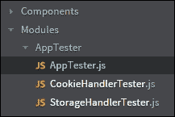

`AppTester` 模块位于 `AppTester.js` 文件中，并将其作为子模块添加到我们的主核心模块（`ImagesInc_Core`）中，如下所示：

```js
// adding AppTester as a sub-module
ImagesInc_Core.AppTester = (function(){
    function runAllUnitTests(){
        var testModule;
        for(testModule in ImagesInc_Core.AppTester){

            if(typeof ImagesInc_Core.AppTester[testModule] === 'object'){
                // run tests
                ImagesInc_Core.AppTester[testModule].runAllTest(); 
            }
        }        
    }    
    function reportTestResults(totalNumOfTest, passedNum, failedNum){      
        var failTestMsgColor;        
        failTestMsgColor = failedNum ? 'red':'pink';

        ImagesInc_Core.log(1, 'Total number of tests run: ' + totalNumOfTest, 'orange');
        ImagesInc_Core.log(1, 'Number of Tests Passed: ' + passedNum, 'green');
        ImagesInc_Core.log(1, 'Number of Tests failed: ' + failedNum, failTestMsgColor);        
    }    
    return {
        runAllUnitTests: runAllUnitTests,
        reportTestResults: reportTestResults
    };            
})();
```

此子模块公开了两个方法：`runAllUnitTests`，它运行添加到其中的所有单元测试，以及`reportTestResults`，这是我们负责在运行时显示单元测试结果的单元测试报告器。

注意，我们正在使用核心模块的日志记录机制来报告我们的测试结果，这展示了我们的模块和子模块在不同上下文中的可重用性。

### 将单元测试套件添加到我们的测试运行器

我们将使用你现在非常熟悉的紧耦合增强技术，将我们的单元测试添加到测试运行器 `AppTester` 中。

一般而言，为每个模块创建至少一个包含该模块所有相关单元测试的测试文件是一个好主意。因此，在我们的项目中，我们有两个文件；`CookieHandlerTester.js` 和 `StorageHandlerTester.js`。正如其名称所暗示的，其中一个包含与 `CookieHandler` 子模块相关的所有单元测试，另一个包含与 `StorageHandler` 子模块相关的所有测试。

请记住，如果您创建了大量的单元测试（越多越好），您可以进一步将单元测试分解成更小的块和文件，这些块和文件专注于每个模块的不同功能。

在我们的应用程序中，由于我们只有有限数量的单元测试，我们已将它们全部保留在其相关文件中，每个模块一个文件。

在以下章节中，我们将只讨论其中之一，因为它们的结构非常相似。

### CookieHandler 模块单元测试

与我们的 `CookieHandler` 子模块相关的单元测试套件被添加到 `AppTester` 模块作为一个对象属性。这使得我们的测试运行器（`AppTester`）能够轻松地遍历所有单元测试并执行它们。

考虑以下代码片段：

```js
ImagesInc_Core.AppTester = (function(mainTestModule){

    if(!mainTestModule){
        ImagesInc_Core.log(3, 'main test module not found!');
        return false;  
    }    
    var CookieTester = mainTestModule.CookieHandlerTester = {};    
    var unitTests = [], totalErrors = 0, totalPasses = 0;

    //create a new value in the cookie
    unitTests[unitTests.length] = CookieTester.createCookie = function(name, value, decodeFlag){    
        if(!name){
            name = "testCreateCookie";
        }
        if(!value){
            value = "testing for cookie";
        }
        if(!decodeFlag){
            decodeFlag = false;
        }
...
return mainTestModule;

})(ImagesInc_Core.AppTester); // using tight augmentation
```

注意我们如何将一个对象作为属性添加到 `AppTester` 模块中。这个对象（测试套件）拥有所有相关的测试作为其属性。

```js
var CookieTester = mainTestModule.CookieHandlerTester = {};
```

每个单独的单元测试都添加到该对象中，如下所示：

```js
CookieTester.createCookie = function(name, value, decodeFlag){
...
}
```

数组 `unitTests` 用于在 `AppTester` 模块调用 `cookieTester.runAllTests` 方法时，通过循环运行所有测试，如下所示：

```js
// run all unit tests
CookieTester.runAllTests = function (){    
        ImagesInc_Core.log(1, '*** RUNNING CookieHandler MODULE UNIT TESTS ***', 'orange');

        // run all unit tests
        for(var i=0; i< unitTests.length; i++){
          unitTests[i]();  
        }

        //** test for negative result
        // should not be able to find the value below in the cookie specified
        CookieTester.findValueInCookie("testCreateCookie", "some value!", true);
        unitTests.length++;
        // should not be able to add the value to the cookie as it will be a duplicate
        CookieTester.addValueToCookie("testCreateCookie","testing for cookie",false);
        unitTests.length++;        
        mainTestModule.reportTestResults(unitTests.length,totalPasses, totalErrors);
        CookieTester.cleanup();    
};
```

要运行单个单元测试，我们可以通过使用它们的名称标识符，直接在 `CookieTester` 对象上调用它们，如下所示：

```js
CookieTester.findValueInCookie("testCreateCookie", "some value!", true);
```

正因如此，当定义时，每个单独的单元测试都被添加到 `CookieTester` 对象和 `unitTests` 数组中，如下所示：

```js
unitTests[unitTests.length] = CookieTester.createCookie = function(name, value, decodeFlag)
```

我强烈建议您查看本章附带项目中与 `AppTester` 和 `CookieHandlerTester` 模块相关的代码，以了解它们是如何实现的。

### 运行 CookieHandler 单元测试

在我们的项目设置中，由于我们没有使用自动构建系统，我们可以将运行所有单元测试的功能添加到我们的 `index.html` 和核心模块中，以便在浏览器中加载 `index.html` 时运行。

当然，我们不想在生产环境中这样做。通常，一个好的开发环境会利用任务运行器，如 **Grunt** 或 **Gulp** 来运行单元测试以及所有其他客户端应用程序构建任务，如代码检查、压缩等。

### 注意

如果您不熟悉这些任务运行器，请查看以下在线资源：

[`gruntjs.com/`](http://gruntjs.com/)

[`gulpjs.com/`](http://gulpjs.com/)

在我们的环境中，为了运行单元测试，我们在`index.html`文件中调用以下方法：

```js
ImagesInc_Core.runAllUnitTests();
```

我们 MainCore 模块中的`runAllUnitTests`方法将使用`AppTester`模块来运行所有我们的单元测试。

考虑我们 MainCore 模块中的以下实现：

```js
mainCore.runAllUnitTests = function(){         
        if(typeof ImagesInc_Core.AppTester !== 'undefined'){

            try{
                ImagesInc_Core.AppTester.runAllUnitTests();                
            }catch(e){
                mainCore.log(3, 'AppTester ERROR! ' + e.name + ": " + e.message);
            }
        }else{         
            mainCore.log(3, 'AppTester not available! ');
        }                  
};
```

在这里，我们首先检查`AppTester`模块是否存在，如果存在，我们就调用该模块上的`runAllUnitTests`方法。

在`AppTester`模块中，代码会遍历所有单元测试套件（在我们的例子中，是`CookieHandler`和`StorageHandler`模块的单元测试），这些是`AppTester`对象上的属性。如下所示：

```js
function runAllUnitTests(){
        var testModule;        
        for(testModule in ImagesInc_Core.AppTester){            
            if(typeof ImagesInc_Core.AppTester[testModule] === 'object'){
                // run tests
                ImagesInc_Core.AppTester[testModule].runAllTests(); 
            }
        }        
}
```

然后，这个方法会依次调用每个单元测试套件上的`runAllTests`方法，正如你之前看到的：

```js
CookieTester.runAllTests = function (){
   ...
}
```

由于我们的模块化架构，我们可以为每个模块添加单独的单元测试套件到`AppTester`模块中；我们也可以移除它们。这是通过类似我们添加`CookieHandler`测试套件到`AppTester`的方式完成的，但通过移除与测试套件相关的属性。

当我们通过加载`index.html`运行单元测试时，我们将在浏览器控制台中看到以下输出（我使用的是 Chrome 开发工具）。

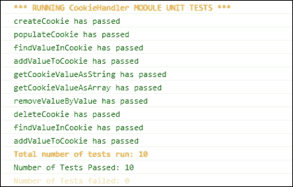

我建议你尝试编写一些自己的单元测试并将它们添加到应用程序的测试套件中。

为此所需的所有设置已经在本章的配套代码中为你实现了。

### 运行单元测试后的清理

总是设计我们的单元测试，以便它们在完成后自行清理，这样对应用程序或环境所做的任何修改都会重置到其原始状态。

如果你查看我们两个单元测试套件的代码，每个套件中都有一个清理方法，它正是这样做的。

考虑以下`CookieHandlerTester.js`中的方法：

```js
CookieTester.cleanup = function(){    
        ImagesInc_Core.CookieHandler.deleteAllCookies();
        totalErrors = 0; totalPasses = 0;    
};
```

如你所见，由于我们的单元测试向浏览器添加了一些 cookie，并对其进行了操作，我们想确保所有创建的 cookie 都被删除，并且环境被重置到原始状态。

`CookieHandler.deleteAllCookies` 方法负责清除浏览器中的所有 cookie。

## 使用第三方框架编写单元测试

虽然我们可以仅使用 JavaScript 而不使用第三方框架编写单元测试，但这需要大量的手动工作，即使只是编写一些简单的测试也是如此。

在上一节中，我们编写单元测试的方法是一个很好的练习，但我认为我们可以通过利用专门为此任务设计的第三方框架做得更好。这些框架使我们能够以更少的努力编写更复杂的测试。

在本节中，我将向你介绍两个非常流行的第三方框架，它们允许我们编写良好、干净且专业级的单元测试。

这里的目标是给你一个良好的起点，并提供每个库的一般概述，但我们不会深入探讨任何一个。尽管如此，我希望能够激发你对使用第三方单元测试库（框架）的兴趣，让你花些时间自己更好地了解它们，并在未来的项目中使用它们。

### Jasmine 简介

Jasmine 将自己定义为“一个用于测试 JavaScript 代码的行为驱动开发框架。”

Jasmine 不需要 DOM，可以在服务器端和客户端编写和运行 JavaScript 单元测试。

设置**Jasmine**很简单，尤其是在客户端，并且以提供所有可能从专业级测试框架中需要的功能的方式打包。我认为你会发现语法非常直观且易于理解。

我个人非常喜欢 Jasmine，非常感谢其创造者为我们提供如此出色的工具。

### 注意

在本节中，我将使用 Jasmine 2.4，并鼓励你访问相关网站：[`jasmine.github.io/`](http://jasmine.github.io/)。

#### 设置 Jasmine

当你访问 Jasmine 的网站时，你会看到一个下载框架独立版本的链接，这是我们在这里将用于单元测试的版本。

下载 zip 文件并提取其内容后，你会看到以下结构：

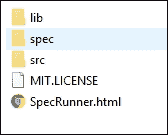

我们将为我们的测试使用类似的文件结构，但是不需要`src`文件夹，这是 Jasmine 加载以运行测试的源文件的位置。

在我们的测试中，我们将直接从它们目前在项目中的位置加载`MainCore`模块和`CookieHandler`模块。

`lib`文件夹是 Jasmine 本身的源代码存放的地方，而`spec`文件夹是我们将存储我们的测试规范的地方。

在我们的应用程序中，这是最终文件结构是如何实现的：

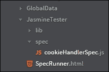

为了在`SpecRunner.html`中加载我们的测试规范，我们需要对这个文件进行以下修改，如下所示：

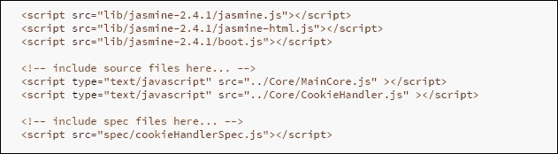

如你所见，我们已经将`SpecRunner.html`指向了应用程序中`MainCore`和`CookieHandler`模块的文件位置，而不是使用默认的 Jasmine `src`文件夹。

这就是我们为了在客户端应用程序中使用 Jasmine 设置和准备所需做的所有事情。

### 注意

**为什么加载 MainCore.js？**

正如你在 `SpecRunner.html` 中可能已经注意到的，我在加载 `MainCore.js` 和 `CookieHandler.js` 文件。这并不是必要的，只要 `CookieHandler.js` 返回一个全局对象，然后就可以在 `CookieHandlerSpec.js` 中使用它来运行测试。在这种情况下，`CookieHandler` 对象将作为一个独立的模块运行，这要归功于我们的模块化架构。然而，为了保持代码不变，我首先加载 MainCore 模块，然后使用 `CookieHandler` 作为 MainCore 的子模块；因此，这两个文件都需要被加载。

#### 创建我们的 Jasmine spec 文件

要编写和运行我们的测试，我们首先需要创建我们的 spec 文件的结构。我们通过实现我们的测试套件来完成这项工作。

测试套件是通过 Jasmine 框架的 `describe` 函数构建的。这个函数接受两个参数，一个字符串用于描述测试套件，一个回调函数用于实现测试套件本身。如下所示：

```js
describe("Testing cookieHandler Sub-module", function() {
...
}
```

在回调函数内部是我们编写测试 spec 的地方。请注意，我们也可以嵌套 `describe` 函数。这意味着我们可以使用一个 `describe` 函数来创建整个模块的测试套件，并在其中使用嵌套的 `describe` 函数来为模块的每个单独的方法创建测试套件。此外，在 `describe` 函数内部声明的任何变量都可以在该 `describe` 块内的所有 spec 中使用。

让我们看看 `CookieHandler` 子模块的第一个 spec：

```js
describe("Testing cookieHandler Sub-module", function() {

    var cookieHandler = ImagesInc_Core.CookieHandler;  
    describe("createCookie Method", function() {
        it("should exist", function() {
            expect(cookieHandler.createCookie).toBeDefined();
        });
…
}
```

如你所见，我们使用了外部的 `describe` 函数来封装与 `CookieHandler` 子模块相关的所有单元测试。在这个内部，我们使用另一个 `describe` 函数来编写与该子模块的 `createCookie` 方法相关的相关 spec。`it` 函数是我们编写预期的地方，这些预期是我们对正在测试的方法的断言。

预期使用匹配器来实现实际值和预期值之间的比较。Jasmine 提供了一系列内置匹配器，但它也允许我们编写自己的自定义匹配器。

在上面的代码片段中，我们告诉 Jasmine 检查 `cookieHandler.createCookie` 是否已定义。

注意我们是如何使用传递给 `describe` 和 `it` 方法的字符串来描述我们的测试的。当运行测试时，这些字符串应该像句子一样阅读，描述我们的测试是什么，以及运行此类测试时应期望得到什么样的结果。

### 注意

**编写单元测试时需要注意的重要点**

理想情况下，我们希望每个单元测试只测试一个功能，而不依赖于代码中的另一个功能。例如，如果我们想测试一个方法能否从 cookie 中读取，我们应只测试这一点，而不是先测试能否写入 cookie，然后再读取值，所有这些都在一个测试规范中完成。在我们的某些规范中，我们没有遵循这样的规则。为了消除这些类型的依赖，我们需要使用 **间谍**、**存根**和**模拟**，这些需要更深入地了解我们的测试框架，因为它们被认为是更高级的功能。由于这只是一个单元测试的介绍，这些框架的高级功能超出了本书的范围，但我强烈建议您自行进一步研究，因为这些功能在编写单元测试时非常有用。

#### 运行我们的 Jasmine 单元测试

我们可以通过在浏览器中加载 `SpecRunner.html` 来运行我们的单元测试。当我们的测试完成运行后，我们将在浏览器窗口中看到以下结果：

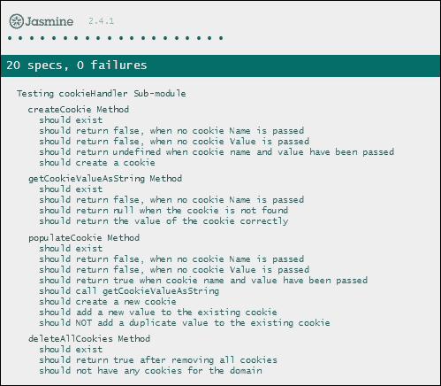

如您所见，测试套件中的句子告诉我们这组测试属于哪个方法，而断言中的句子告诉我们测试的目的。

我们的结果显示，所有测试都通过了。如果我们的某个测试失败，Jasmine 会如下通知我们：

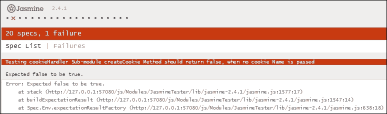

消息显示失败的测试以及与该测试相关的堆栈跟踪。这使我们能够快速识别失败的测试，并查看需要做什么来修复它。

#### 进一步探索 Jasmine

Jasmine 是一个完整的 JavaScript 测试框架。我的目标是仅向您介绍它，并快速概述其一些功能。然而，Jasmine 提供了更多功能以满足您可能有的任何测试需求，例如使用 **间谍**、**存根**和**模拟**，以及支持异步测试。

我建议您首先查看我为本章代码中 `CookieHandler` 子模块创建的测试套件。然后，访问 Jasmine 网站，了解更多关于该框架的信息。我认为一旦您开始使用 Jasmine，您会对它的功能和易用性印象深刻。

### 注意

更多信息，请参阅以下链接：[`jasmine.github.io/2.4/introduction.html`](http://jasmine.github.io/2.4/introduction.html)

### Mocha 简介

Mocha 是另一个优秀的测试框架，它允许我们使用我们喜欢的任何断言库，并在这一方面提供了极大的灵活性。正如 Mocha 网站上所指示的，“*如果它抛出错误，它就会工作！*”。

我们将在测试中使用 **Chai** 断言库，我们很快就会讨论这个库。

Mocha 可以在服务器端和客户端运行，并且它支持 BDD 和 TDD 风格的测试。我们还可以使用不同的报告器与 Mocha 一起使用，例如 **点阵** 和 **列表**。

对于我们的目的，我们将专注于如何在浏览器中运行 Mocha。

#### 设置 Mocha

要为在浏览器中运行我们的测试设置 Mocha，我们可以使用 Mocha 网站上提供的 `sample.html` 文件。

在此文件中，我们使用 **内容分发网络**（**CDN**）加载 Mocha。我们也可以从 GitHub 下载框架，地址为：[`github.com/mochajs/mocha`](https://github.com/mochajs/mocha)。

对于我们的应用程序，我已经下载了 Mocha，并在项目中创建了以下结构：

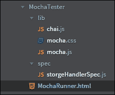

在前面的屏幕截图中，`MochaRunner.html` 是我们的测试运行页面，它加载 Mocha、Chai（断言库）、我们的源文件（`StorageHandlerSpec.js`）以及相关的 spec 文件，`storageHandlerSpec.js`。此文件存储了所有我们的 Mocha 测试。

这就是我们的 `MochaRunner.html` 的设置方式：

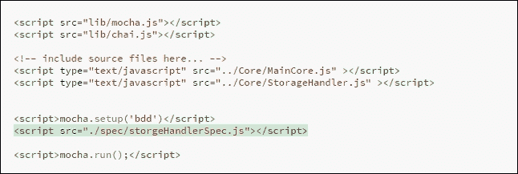

如您所见，我们也在告诉 Mocha 我们将使用 BDD 风格的测试规范。

这就是我们实现 Mocha 简单设置所需做的所有事情。

#### Chai

Chai 是一个非常流行的断言库，它与 Mocha 集成良好，并提供不同的断言风格。在我看来，最好的断言风格之一是 **Expect**。

我认为你会发现 Expect 语法与 Jasmine 断言语法相似，并且容易理解。

### 注意

要使用 Chai，您可以从以下位置下载代码（复制/粘贴）并将其添加到您的项目中：

[`chaijs.com/chai.js`](http://chaijs.com/chai.js)

如您之前所见，我已经在项目库中下载并安装了 Chai，并且它已准备好供我们使用。

#### 创建我们的 Mocha 测试文件

Mocha `spec` 文件的设置与 Jasmine 的 spec 文件非常相似。我们使用全局的 `describe` 函数创建我们的测试套件，并将其传递一个包含我们断言代码的回调函数。

就像 Jasmine 一样，我们使用字符串来标识我们的测试，并使用 `it` 函数来编写我们的断言。同样，类似于 Jasmine，我们可以使用嵌套的 `describe` 块，并且在该块中定义的任何变量都对该块中的所有断言可用。

请查看以下来自我们的 `storageHandlerSpec.js` 文件中的代码片段，如下所示：

```js
var expect = chai.expect;
describe("Testing storageHandler Sub-module", function() {
    var storageHandler = ImagesInc_Core.StorageHandler;

    describe("saveValueToLocalStorage Method", function() {
        it("should exit", function() {		 
         	expect(storageHandler.saveValueToLocalStorage).to.exit;
        });
….
});
```

注意，我们已经将变量 `expect` 设置在 `chai.expect` 全局对象上，然后这个变量被用于我们的断言中。

Chai 提供了一组很好的匹配器，我们可以在编写单元测试时使用。然而，Chai 提供的匹配器集合并不像 Jasmine 那样完整。

例如，要使用间谍（spies）、存根（stubs）和模拟（mocks），这些被认为是更高级的测试功能，我们需要使用不同的库，例如 **Sinon**。

由于这些功能超出了本书的范围，我们在此不会探讨它们，但我鼓励您访问 Sinon 的网站以获取更多信息：[`sinonjs.org/`](http://sinonjs.org/)。

#### 运行我们的 Mocha-Chai 单元测试

如果我们在浏览器中加载项目的 `MochaRunner.html` 文件，在所有测试运行完毕后，我们将看到以下测试结果显示：

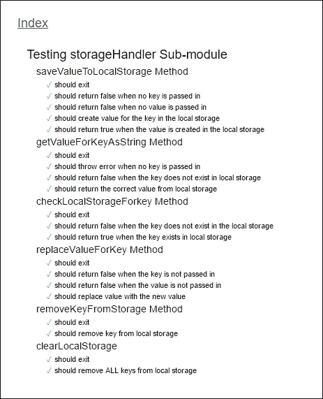

当然，我们测试旁边的勾选标记表示测试已通过。

以下图像显示了我们的测试失败时的页面：

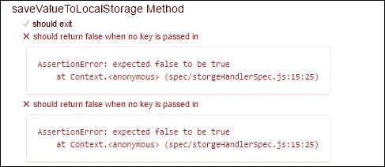

如您所见，为了报告相关错误，Mocha 使用我们传递给测试规范中 `it` 函数的字符串。

#### 进一步探索 Mocha

将 Mocha 与 Chai 和 Sinon 结合使用，使我们能够创建一个健壮的测试框架。我们甚至可以通过在客户端构建系统中利用 Mocha 作为服务器端的一部分来更进一步。这使得我们可以将测试自动设置为构建步骤之一，使用 **Node.js**。此外，虽然这并非特定于 Mocha，但使用 **GitHub** 作为我们的源代码库使我们能够将 Mocha 测试上传到 GitHub，并在各种浏览器中自动运行我们的测试。

### 注意

您可以在以下网站上获取更多有关此功能的信息：

[`ci.testling.com/`](https://ci.testling.com/)

# 摘要

在本章中，我们讨论了各种测试类型以及为什么持续测试我们的代码对于整个应用程序的完整性至关重要。实现持续测试的一种方法就是使用单元测试。

我们探讨了如何使用纯 JavaScript 编写一些简单的单元测试，并发现使用第三方测试框架可以使我们在应用程序中拥有更强大和健壮的测试，而且所需的工作量更少。

使用模块化架构，我们可以轻松地对我们的模块进行单独测试，并快速找到和修复代码中可能的问题。

我们还简要介绍了两个非常流行的开源测试框架，Jasmine 和 Mocha。然而，我们对这些框架提供的功能只是浅尝辄止，我鼓励您自己进一步探索它们。

本章中展示的所有测试都包含在本书附带的源代码中，我强烈建议您查看测试套件，并花些时间熟悉它们。

在下一章中，我们将探讨将模块加载到我们的应用程序中的不同方法，并了解我们如何使用行业最佳实践来管理模块依赖关系。
