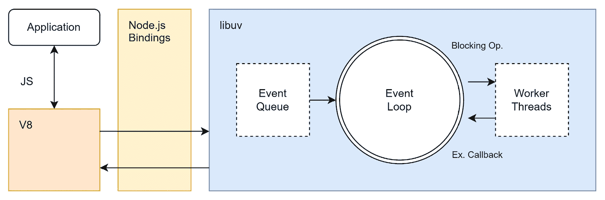
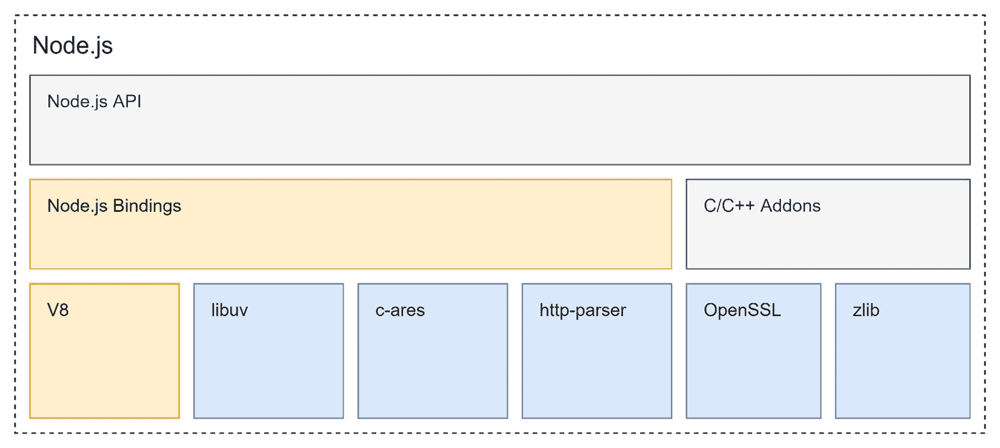
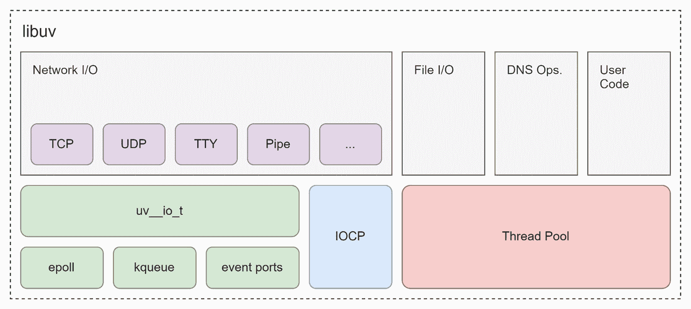
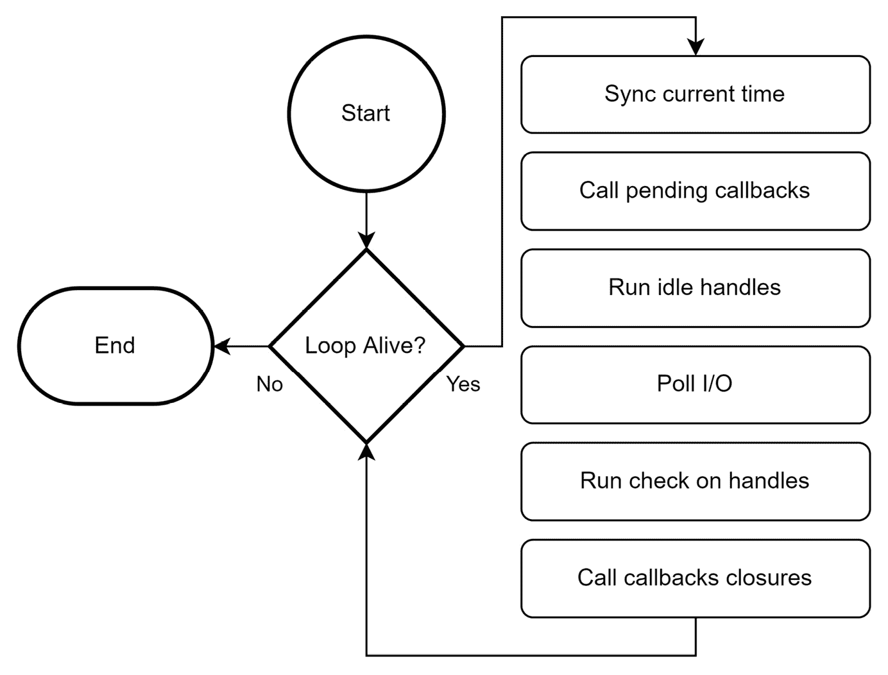
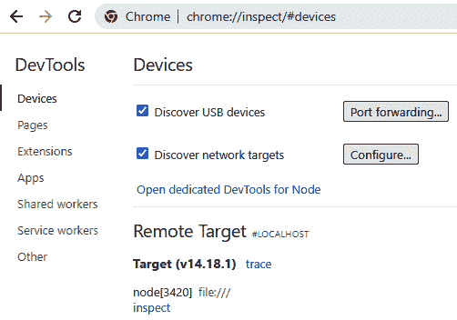
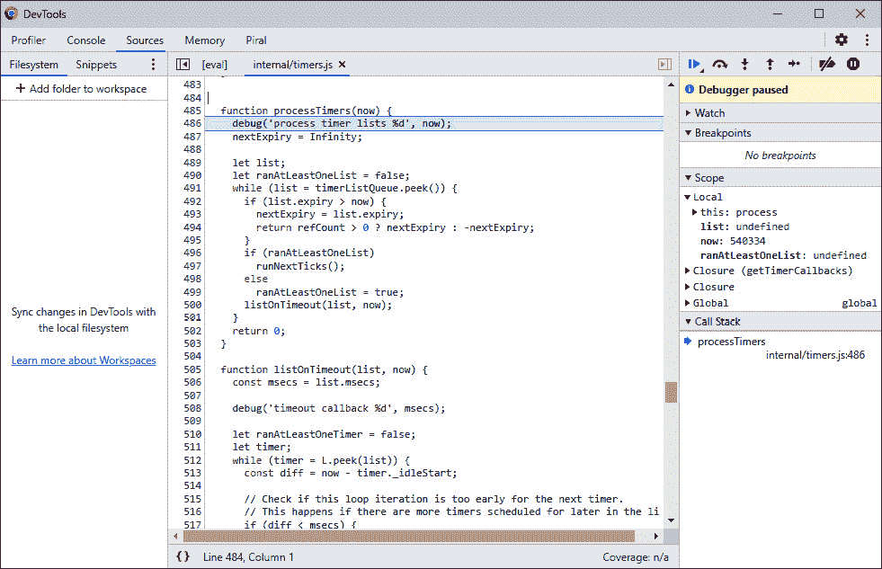

# 第一章：了解 Node.js 的内部机制

多年来，成为一名前端开发者意味着写一些 HTML 代码，并在其上添加一些 CSS 样式。然而，自从上个十年以来，这种工作描述几乎已经不再适用。相反，现在大部分的前端工作都是使用 **JavaScript** 来完成的。

最初用于使网站（如元素的切换）的微调增强成为可能，前端开发现在已成为网络的粘合剂。网站不再仅仅是使用 HTML 和 CSS 编写的。相反，在许多情况下，网页是通过使用现代技术（如依赖管理和资源打包）用 JavaScript 编程的。**Node.js** 框架为这一运动提供了一个理想的基础。它使开发者能够在浏览器中运行的网站内部以及编写网页的工具中（在浏览器之外）使用 JavaScript。

当 Node.js 在 2009 年 5 月发布时，并没有引起太大的关注。JavaScript 也可以在服务器上运行。然而，Node.js 的跨平台特性和 JavaScript 社区的规模为计算机历史上最大的颠覆之一奠定了基础。人们如此迅速地采用这个框架，以至于许多现有的框架要么消失了，要么不得不进行重构以吸引开发者。很快，JavaScript 就被用于浏览器和服务器，并且也成为了每个前端开发者工具箱的一部分。

随着新的开发框架（如 **Angular** 或 **React**）的兴起，对有吸引力的前端工具的需求变得明显。这些新框架总是依赖于某些构建步骤——否则，使用这些框架的网站和应用对开发者来说将非常不便编写。由于庞大的 Node.js 生态系统似乎已经找到了一种适合重用的合适方法，这些新框架采用了这种方法，并将其作为其开发故事的一个组成部分。这样，使用 Node.js 成为了任何类型的前端项目的既定标准。

现在，几乎不可能开始一个前端开发项目而不安装 Node.js。在这本书中，我们将一起探索从内部学习 Node.js 的旅程。我们不会专注于编写服务器应用程序或探讨 Node.js 的集成功能。相反，我们将探讨作为前端开发者，我们如何利用 Node.js 带来的最佳功能。

在本章的第一部分，我们将讨论 Node.js 的内部机制。这将帮助你理解 Node.js 的工作原理以及你如何实际使用它。在本章之后，你将能够使用 Node.js 命令行应用程序运行和调试简单的脚本。

在本章中，我们将涵盖以下关键主题：

+   详细了解 Node.js 架构

+   理解事件循环

+   使用命令行运行 Node.js

+   CommonJS

# 技术要求

要跟随本书中的代码示例，你需要了解 JavaScript 和如何使用命令行。你应该已经按照 [`nodejs.org`](https://nodejs.org) 上的说明安装了 Node.js。

本章的完整源代码可在 [`github.com/PacktPublishing/Modern-Frontend-Development-with-Node.js/tree/main/Chapter01`](https://github.com/PacktPublishing/Modern-Frontend-Development-with-Node.js/tree/main/Chapter01) 获取。

本章的 Code in Action (CiA) 视频可在 [`bit.ly/3fPPdtb`](http://bit.ly/3fPPdtb) 访问。

# 仔细查看 Node.js 架构

Node.js 的主要基础受到了一些事物的影响：

+   浏览器中特有的单个工作线程在服务器空间中已经相当成功。在这里，流行的 **nginx** 网络服务器表明，事件循环模式（在本章后面解释）实际上对性能来说是一种祝福——消除了处理请求时需要使用专用线程池的需求。

+   将所有内容打包在一个以文件为中心的结构中称为 **模块** 的想法。这使 Node.js 避免了许多其他语言和框架的陷阱——包括浏览器中的 JavaScript。

+   避免创建一个庞大的框架，并让所有内容都可通过包管理器扩展和轻松获取的想法。

线程

现代计算机提供了大量的计算能力。然而，为了使应用程序真正使用可用的计算能力，我们需要让多件事情并行工作。现代操作系统通过所谓的线程了解不同独立运行的任务。**线程**是一组按顺序运行的运算，这意味着按照一定的顺序。然后操作系统安排线程何时运行以及它们在哪里（即在哪个 CPU 核心上）运行。

这些原则共同构成一个看似容易创建但难以复制的平台。毕竟，有大量的 JavaScript 引擎和有用的库可用。对于 Node.js 的原始创建者和维护者 Ryan Dahl 来说，框架的基础必须非常稳固。

Ryan Dahl 选择了一个现有的 JavaScript 引擎（**V8**）来接管解析和运行 JavaScript 代码的责任。选择 V8 引擎有两个很好的原因。一方面，该引擎作为一个开源项目，在宽松的许可证下可用——可以被 Node.js 等项目使用。另一方面，V8 也是 Google 浏览器 **Chrome** 使用的引擎。它非常快，非常可靠，并且正在积极开发中。

使用 V8 的一个缺点是它是用 C++ 编写的，使用了名为 **GYP** 的自定义构建工具。虽然 GYP 在 V8 几年后被取代，但对于 Node.js 来说，过渡并不容易。到目前为止，Node.js 仍然依赖于 GYP 作为构建系统。V8 是用 C++ 编写的这个事实最初可能像是一个旁注，但如果你想编写所谓的 **原生模块**，它可能非常重要。

原生模块允许您超越 JavaScript 和 Node.js – 充分利用可用的硬件和系统功能。原生模块的一个缺点是它们必须在每个平台上构建。这与 Node.js 的 **跨平台** 特性相矛盾。

让我们退一步，将到目前为止提到的部分整理成一个架构图。*图 1.1* 展示了 Node.js 内部是如何组成的：



图 1.1 – Node.js 的内部组成

在 Node.js 的架构中，除了 JavaScript 引擎之外，最重要的组件是 **libuv** 库。libuv 是一个多平台、低级库，它基于 **事件循环** 提供异步 **输入/输出**（**I/O**）支持。I/O 以多种形式发生，例如写入文件或处理 **HTTP 请求**。通常，I/O 指的是在操作系统的专用区域中处理的所有内容。

任何运行在 Node.js 上的应用程序都是用 JavaScript 或其某种变体编写的。当 Node.js 启动应用程序时，JavaScript 会被 V8 解析和评估。所有标准对象，如 `console`，都暴露了一些作为 Node.js API 部分的绑定。这些底层函数（如 `console.log` 或 `fetch`）使用了 libuv。因此，仅针对语言特性（如原始计算 *2 + 3*）的简单脚本不需要从 Node API 中获取任何内容，并将保持与 libuv 独立。相反，一旦使用了底层函数（例如，用于访问网络的函数），libuv 就可能是其背后的劳动力。

在 *图 1.2* 中，展示了各种 API 层的框图。这个图的优点在于它揭示了 Node.js 实际上是什么：一个允许从最先进的 **C/C++** 库访问底层功能的 JavaScript 运行时。Node.js API 由包含的 Node.js 绑定和一些 C/C++ 插件组成：



图 1.2 – 以构建块为单位的 Node.js 组成

在前面的图中需要解释的一点是事件循环是如何与所有块相关联实现的。在谈论 Node.js 的内部架构时，对事件循环是什么以及为什么它对 Node.js 重要的更广泛讨论是绝对必要的。所以让我们深入了解这些细节。

# 理解事件循环

事件循环是一种运行时模型，它使用户能够从单个线程运行所有操作 – 不论这些操作是否访问长时间运行的外部资源。为了实现这一点，事件循环需要向事件提供者发出请求，该提供者调用指定的事件处理器。在 Node.js 中，libuv 库用于事件循环的实现。

在图 1.1 中给 libuv 留出最多的空间是为了突出这个库的重要性。内部来说，libuv 用于处理所有与 I/O 相关的事情，这可以说是任何框架中最关键的部分。I/O 使框架能够与其他资源通信，例如文件、服务器或数据库。默认情况下，处理 I/O 是以阻塞方式进行的。这意味着我们应用程序的操作序列本质上被停止，等待 I/O 操作完成。

存在两种策略来减轻阻塞 I/O 的性能影响。

第一种策略是为实际执行这些阻塞 I/O 操作创建新的线程。由于线程包含一个独立的操作组，它可以并发运行，最终不会停止应用程序原始线程中的操作。

第二种策略是完全不使用**阻塞 I/O**。相反，使用一种替代变体，通常称为非阻塞 I/O 或异步 I/O。**非阻塞 I/O**与回调一起工作，即在某些条件下被调用的函数——例如，当 I/O 操作完成时。Node.js 使用 libuv 来充分利用第二种策略。这允许 Node.js 在单个线程中运行所有代码，同时 I/O 操作并发运行。

在图 1.3 中，展示了 libuv 的构建块。关键部分是 libuv 已经包含了很多处理网络 I/O 的功能。此外，文件和 DNS 操作也得到了很好的覆盖：



图 1.3 – libuv 的构建块

除了不同的 I/O 操作外，该库还提供了一套处理异步用户代码的不同选项。

事件循环本身遵循**反应器设计模式**。维基百科对这种模式描述如下：

反应器设计模式是一种事件处理模式，用于处理一个或多个输入并发地向服务处理程序提交的服务请求。然后，服务处理程序将传入的请求解复用，并将它们同步地调度到相关的请求处理程序。([`en.wikipedia.org/wiki/Reactor_pattern`](https://en.wikipedia.org/wiki/Reactor_pattern))

重要的是，这个定义提到了同步调度。这意味着通过事件循环运行的代码保证不会遇到任何冲突。事件循环确保代码总是顺序运行。尽管 I/O 操作可能并发运行，但我们的回调永远不会并行调用。从我们的角度来看，尽管 Node.js 会通过 libuv 内部使用多个线程，但整个应用程序是单线程的。

以下是一个简单的脚本，展示了事件循环的基本行为——我们将在“从命令行使用 Node.js”部分讨论如何运行此脚本：

events.js

```js
console.log('A [start]');
setTimeout(() => console.log('B [timeout]'), 0);
Promise.resolve().then(() => console.log('C [promise]'));
console.log('D [end]');
```

我们将在学习 Node.js 的命令行使用时运行此脚本。在此期间，请思考前面的代码，并写下您将看到的 `console` 输出的顺序。您认为它会按“`A` `B` `C` `D`”的顺序打印，还是其他顺序？

libuv 中事件循环实现的算法显示在 *图 1.4* 中：



图 1.4 – libuv 中事件循环的实现

虽然代码片段仅处理与 JavaScript 相关的结构（例如 `console`、`Promise` 和 `setTimeout`），但通常，回调函数与超出 Node.js 范围的资源相关联，例如文件系统更改或网络请求。其中一些资源可能有操作系统等效项；而另一些则仅以阻塞 I/O 的形式存在。

因此，事件循环实现始终考虑其线程池并轮询已完成的 I/O 操作。定时器（例如示例脚本中的 `setTimeout`）仅在开始时运行。要确定是否需要运行定时器，需要将其到期时间与当前时间进行比较。最初，当前时间与系统时间同步。如果没有其他事情要做（即没有活跃的定时器、没有等待完成的资源等），则循环退出。

让我们看看如何运行 Node.js 以巩固我们对事件循环的了解。

# 使用命令行运行 Node.js

仅使用 JavaScript 开发 Web 应用程序只需在浏览器中打开网站即可。浏览器将评估包含的 JavaScript 并运行它。当您想将 JavaScript 作为脚本语言使用时，需要找到运行 JavaScript 的新方法。Node.js 提供了这种方法 – 在计算机终端、服务器上运行 JavaScript。

当安装 Node.js 时，它附带了一套可在您选择的终端中使用的命令行工具。对于本书，您需要了解我们将贯穿章节使用三个不同的可执行文件：

+   **node**：运行 Node.js 脚本的主要应用程序

+   **npm**：默认的包管理器 – 关于这一点将在后面详细介绍

+   **npx**：一个非常方便的实用工具，用于运行 npm 二进制文件

目前，我们只需要了解 `node`。如果我们想从上一节中运行 `events.js` 脚本，我们需要在放置脚本（`events.js`）的目录中执行以下命令。您可以通过仅插入上一节 `events.js` 列表中的内容来放置它：

```js
$ node events.js

A [start]

D [end]

C [promise]

B [timeout]
```

命令显示在传统的 `$` 符号之后，表示命令提示符。运行脚本的输出显示在 `node` `events.js` 命令下方。

如您所见，顺序是“`A` `D` `C` `B`” – 即 Node.js 首先处理所有顺序操作，然后再处理 promise 的回调函数。最后，处理超时回调函数。

在事件循环中处理超时回调之前处理承诺回调的原因在于事件循环。在 JavaScript 中，承诺产生所谓的微任务，这些微任务被放置在 libuv 事件循环的挂起回调部分，如图 1.4* 所示。然而，超时回调被当作一个完整任务处理。它们之间的区别在于事件循环中。微任务被放置在一个优化的队列中，实际上在每个事件循环迭代中都会被多次查看。

根据 libuv，超时回调只能在定时器到期时运行。由于我们只在事件循环的空闲处理（即主部分）中放置了它，我们需要等待事件循环的下一迭代。

`node` 命令行应用程序也可以接收额外的参数。官方文档详细介绍了所有细节（[`nodejs.org/api/cli.html`](https://nodejs.org/api/cli.html)）。其中一个有用的参数是 `-e`（`--eval` 的简写），可以直接从命令行输入评估脚本，而无需文件运行：

```js
$ node -e "console.log(new Date())"

2022-04-29T09:20:44.401
```

另一个非常有用的命令行标志是 `--inspect`。这打开了标准端口以进行图形检查，例如，通过 Chrome 网络浏览器。

让我们运行一个带有一些连续逻辑的应用程序，以证明检查会话的合理性。在您的机器上的终端中运行以下命令：

```js
$ node -e "setInterval(() => console.log(Math.random()), 60 * 1000)" --inspect

Debugger listening on ws://127.0.0.1:9229/64c26b8a-0ba9-484f-902d-759135ad76a2

For help, see: https://nodejs.org/en/docs/inspector
```

现在我们可以运行一个图形应用程序。让我们使用 Chrome 网络浏览器。打开它并转到 [chrome://inspect](https://chrome://inspect)。这是一个特殊的 Chrome 内部 URL，允许我们查看可用的目标。

以下图（*图 1.5*）显示了在 Chrome 网络浏览器中检查 Node.js 应用程序可能的样子：



图 1.5 – 在 Chrome 网络浏览器中检查 Node.js 应用程序

在这种情况下，Chrome 识别到我们的应用程序正在以进程 ID `3420` 运行。在你的机器上，进程 ID 很可能不同。没有给出文件名，因为我们是以 `-e` 命令行选项开始的。

当你在命令行中点击看到的 `console` 输出时。

当你从 DevTools 控制台跟随到评估脚本的链接时，你将能够放置 **断点** 或暂停执行。暂停执行可能不会立即工作，因为这需要一个活动的 JavaScript 操作。

在 *图 1.6* 中，你可以看到在 Chrome DevTools 中调试 Node.js 脚本的样子：



图 1.6 – 在 Chrome DevTools 中调试 Node.js 脚本

在前面的例子中，JavaScript 只每分钟运行一次。当发生暂停时，你应该最终进入 Node.js 本身的 `internal/timers.js` 部分。这是一个不同的 JavaScript 文件，但它属于整个 Node.js 框架的一部分。该文件可以集成，因为它遵循某些称为 CommonJS 的约定和规则。

# CommonJS

Node.js 从一开始就做得正确的一件事是引入了一种明确获取和使用功能的方式。浏览器中的 JavaScript 患有 **全局作用域** 问题，这给开发者带来了许多麻烦。

全局作用域

在 JavaScript 中，全局作用域指的是可以从同一应用程序中运行的任何脚本访问的功能。在一个网站上，全局作用域通常与 `window` 变量相同。将变量附加到全局作用域可能很方便，有时甚至必要，但它也可能导致冲突。例如，两个独立的函数都可能尝试从同一变量中写入和读取。结果的行为可能很难调试，并且非常难以解决。标准建议是尽可能避免使用全局作用域。

当 Node.js 介绍时，其他功能明确导入的想法当然并不新鲜。虽然其他编程语言或框架中存在导入机制已有很长时间，但类似选项也已在浏览器中的 JavaScript 中可用——通过第三方库如 **RequireJS**。

Node.js 以 **CommonJS** 的名称引入了其 **模块系统**。Node.js 实现的基础实际上是一个在 Mozilla 开发的项目。在那个项目中，Mozilla 一直在研究一系列提案，最初是针对非浏览器使用，但后来扩展到了一个通用的 JavaScript 模块系统规范集。

CommonJS 实现

除了在 Node.js 中的实现，许多其他运行时或框架也使用 CommonJS。例如，可以在 **MongoDB** 数据库中使用的 JavaScript 利用的是基于 CommonJS 规范的模块系统。Node.js 中的实现实际上只是部分满足完整规范。

模块系统对于以非常透明和明确的方式包含更多功能至关重要。除了更多高级功能之外，模块系统还给我们以下功能：

+   一种包含更多功能的方式（在 CommonJS 中，通过全局 `require` 函数）

+   一种暴露功能的方式，然后可以在其他地方包含它（在 CommonJS 中，通过模块特定的 `module` 或 `exports` 变量）

CommonJS 的工作方式在本质上非常简单。想象你有一个名为 `a.js` 的文件，其中包含以下代码：

```js
const b = require('./b.js');
console.log('The value of b is:', b.myValue);
```

现在 Node.js 的任务就是真正使这个工作得以实现，也就是说，给 `b` 变量赋予一个代表模块所谓导出的值。目前，脚本会报错说缺少 `b.js` 文件。

`b.js` 文件，它应该与 `a.js` 邻近，内容如下：

```js
exports.myValue = 42;
```

当 Node.js 评估文件时，它会记住定义的导出。在这种情况下，Node.js 会知道 `b.js` 实际上只是一个具有 `myValue` 键，值为 `42` 的对象。

从 `a.js` 的角度来看，代码可以读作如下：

```js
const b = {
  myValue: 42,
};
console.log('The value of b is:', b.myValue);
```

使用模块系统的优势是不需要再次编写模块的输出。`require`调用为我们做了这件事。

副作用

用模块的输出替换`require`调用只是为了说明目的。通常情况下，这是不可能的，因为模块评估可能会有一些所谓的副作用。如果我们用导入模块的导出进行`require`调用，我们不会运行副作用，这会错过模块的一个关键方面。

在给定的例子中，我们直接使用了文件名，但导入模块可能比这更微妙。让我们看看代码的改进版本：

a.js

```js
const b = require('./b');
console.log('The value of b is:', b.myValue);
```

`./b.js`的调用已被替换为`./b`。这仍然会工作，因为 Node.js 会尝试给定的导入的各种组合。它不仅会附加某些已知的扩展名（如`.js`），还会检查`b`是否实际上是一个包含`index.js`文件的目录。

因此，根据前面的代码，我们实际上可以将`b.js`从`a.js`相邻的文件移动到相邻目录`b`中的`index.js`文件。

然而，最大的优势是这种语法还允许我们从第三方包中导入功能。正如我们将在*第二章*中探讨的，*将代码划分为模块和包*，我们的代码必须划分为不同的模块和包。一个**包**包含一组可重用的模块。

Node.js 自带了一组不需要安装的包。让我们看看一个简单的例子：

host.js

```js
const os = require('os');
console.log('The current hostname is:', os.hostname());
```

在前面的例子中，我们使用了集成的`os`包来获取当前计算机的网络名称。

我们可以在命令行中使用`node`运行这个脚本：

```js
$ node host.js

The current hostname is: DESKTOP-3JMIDHE
```

这个脚本在安装了 Node.js 的任何计算机上都能工作。

# 摘要

在本章中，我们首次了解了 Node.js。你现在应该对 Node.js 构建的核心原则（如事件循环、线程、模块和包）有一个很好的了解。你已经了解了一些关于 Node.js 的历史以及为什么选择 V8 作为 JavaScript 引擎的原因。

从本章中我们可以学到的一个重要内容是如何事件循环工作。请注意，这部分知识并不局限于 Node.js。微任务和任务之间的区别是 JavaScript 引擎（甚至是你浏览器的 JavaScript 引擎）工作方式的一个基本组成部分。

最后，你现在已经准备好使用`node`命令行应用程序了，例如，运行或调试简单的脚本，这些脚本可以使用 CommonJS 模块系统导出和导入功能。你学习了如何使用 Chrome 网络浏览器检查 Node.js 脚本，就像检查网站一样。

在下一章中，我们将通过学习如何高效地将代码划分为模块和包来增加我们对 CommonJS 的了解。
