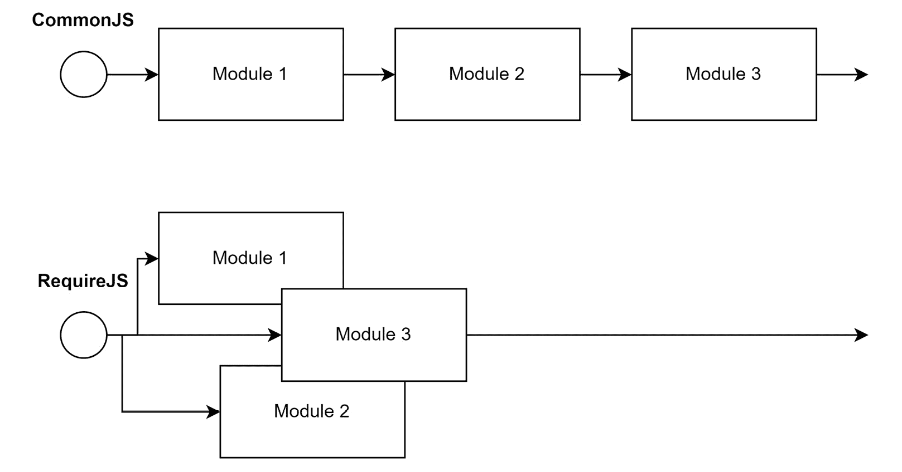
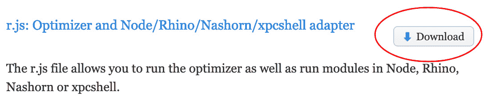

# 2

# 将代码划分为模块和包

在编写专业软件时，考虑最重要的方面之一是复用性。复用性意味着我们的代码库的某些部分可以在多个地方或不同情况下使用。这意味着我们实际上可以非常容易地使用现有的功能。

正如我们所学的，Node.js 成功故事的关键部分在于它自带了一个模块系统。到目前为止，我们只触及了 CommonJS 的基本概念，这是从模块中导入和导出功能的方式。

在本章中，我们将有机会熟悉更多模块格式，包括它们的历史、用例和开发模型。我们将学习如何高效地将我们的代码划分为模块和包。除了学习 CommonJS，我们还将了解什么是包以及我们如何定义自己的包。总的来说，这将帮助我们实现高度的复用性——不仅适用于 Node.js 中的工具，也适用于在浏览器中运行的应用程序。

本章我们将涵盖以下关键主题：

+   使用 ESM 标准

+   学习 AMD 规范

+   兼容 UMD

+   理解 SystemJS 和导入映射

+   了解 `package.json` 的基础知识

# 技术要求

本章的完整源代码可以在 [`github.com/PacktPublishing/Modern-Frontend-Development-with-Node.js/tree/main/Chapter02`](https://github.com/PacktPublishing/Modern-Frontend-Development-with-Node.js/tree/main/Chapter02) 找到。

本章的 CiA 视频可以通过 [`bit.ly/3FZ6ivk`](http://bit.ly/3FZ6ivk) 访问。

# 使用 ESM 标准

CommonJS 对于 Node.js 来说是一个不错的解决方案，但并不是作为语言而言的期望解决方案。例如，在浏览器中，CommonJS 不起作用。在 URL 上进行同步导入是不可能的。CommonJS 的模块解析在添加扩展和尝试目录方面也过于灵活。

为了在 JavaScript 中标准化模块，`require` 整个模块系统依赖于使用保留字的语言结构。这样，模块系统也可以被带到浏览器中。

ECMAScript 标准为此指定了两个关键字：

+   `import`：用于从其他模块导入功能

+   `export`：用于声明可以被其他模块导入的功能

`import` 关键字必须出现在文件的开头——在所有其他代码之前。这种选择的原因在于 ESM 文件的需求，不仅要在 Node.js 中使用，还要在浏览器中使用。通过将 `import` 语句放在顶部，每个 ESM 文件可以安全地等待所有导入都已解析。

将上一章的示例重写，我们得到以下 `a.js`：

```js
import * as b from './b.js'; // get all things from b.js
// use imports
console.log('The value of b is:', b.myValue);
```

根据 ESM 标准将 `b.js` 文件重写为有效格式如下：

```js
export const myValue = 42;
```

`import` 关键字有多种可能性。我们可以使用以下方法：

+   由开发者选定的通配符（使用`*`）导入

+   命名导入，例如`myValue`

+   由开发者选定的具有名称的默认导入

+   一个空的导入，不获取任何内容，但确保运行模块

使用命名导入，我们可以得到`a.js`的一个更干净的版本：

```js
// get only selected things
import { myValue } from './b.js';
console.log('The value of b is:', myValue); // use imports
```

上述代码与解构赋值非常相似，它使用赋值运算符（`=`）将对象分解为其字段。然而，存在一些关键的区别。其中之一是如何创建别名。

例如，当使用解构赋值时，我们可以使用冒号（`:`）来重命名变量，这些变量默认会有相应字段的名称。如果我们想给变量一个不同于其原始字段（例如，`myValue`）的名称（例如，`otherValue`），我们必须编写以下内容：

```js
// gets all the things, but only uses myValue
const { myValue: otherValue } = require('./b.js');
```

使用`import`语句时，你需要使用`as`关键字来实现这一点：

```js
// gets only myValue – but renames it
import { myValue as otherValue } from './b.js';
```

一个很快就会变得相关的主题是默认导出的概念。特别是在处理未知模块的导出时，定义导出名称的需求非常强烈。因此，在 CommonJS 中，开发者选择了整个模块；然而，在 ESM 中这不再可能。每个导出都需要命名。

幸运的是，标准化委员会考虑了默认导出的主题。如果一个导出使用了`default`关键字，它就被认为是默认导出。例如，将`b.js`中的导出更改为使用默认值可能看起来如下所示：

```js
export default 42;
```

导入默认导出也非常方便。在这里，我们可以在我们的模块内部自由选择一个名称来引用默认导出。而不是能够重命名导入，我们被迫给它一个名称：

```js
import otherValue from './b.js'; // gets only default
console.log('The value of b is:', otherValue);
```

整个想法是尽可能多地使用默认导出。最终，那些有效编写且围绕导出单个功能构建的模块通常被认为是目标。

我们已经了解到 CommonJS 在浏览器中不起作用。相比之下，现代 ESM 规范应该可以工作，因为导入在开始时就已经声明。这种修改允许浏览器在导入完全处理之前安全地挂起模块评估。这种等待依赖项加载完成的挂起实际上是从另一个名为**异步模块定义**（**AMD**）的模块系统尝试中借鉴的。

# 学习 AMD 规范

在 ESM 建立之前，人们也尝试让模块在浏览器中工作。最早的尝试之一是一个名为文档`<head>`的小型库。然后脚本会加载并运行一个定义的根模块，该模块会处理更多的模块。

使用 RequireJS 的一个示例网站如下所示：

```js
<!DOCTYPE html>
<html>
  <head>
    <title>My Sample Project</title>
    <!--
      data-main attribute tells RequireJS to load
      ./main.js after ./require.js has been loaded
    -->
    <script data-main="./main" src="img/require.js"></script>
  </head>
  <body></body>
</html>
```

RequireJS 诞生于 JavaScript 世界尚未确立 promises（承诺）的时期。因此，模块加载器基于下一个最佳选择：回调函数。因此，通过调用由 RequireJS 定义的`requirejs`函数来加载模块。整个过程可以像*图 2.1*所示的那样异步加载模块。



图 2.1 – 按顺序加载模块与异步加载模块

为了实现异步模块加载，`requirejs`函数接受两个参数。第一个参数是一个包含所有依赖项的数组。第二个参数是一个回调函数，它接收依赖项的导出并返回当前模块的导出。

RequireJS 背后的整个理念与今天的 ESM（模块化 JavaScript）非常相似，它将两个部分（加载依赖项和使用依赖项的代码）合并到同一个模块中——但仍然区分`import`语句和其他所有语句。在这里，ESM 利用了它实际上是一个语言构造的事实。

简而言之，使用 RequireJS 的模块看起来如下：

```js
requirejs(['./helper/util'], (util) => {
  // This is called when ./helper/util.js. has been processed
});
```

这些模块的形状并非任意决定。相反，RequireJS 库只是异步模块系统规范的一个实现。这个规范被称为 AMD。

使用 AMD（异步模块定义），之前的 RequireJS 特定示例可以重写如下：

```js
define(['./helper/util'], (util) => {
  // This is called when ./helper/util.js. has been processed
});
```

除了`define`函数的双参数版本之外，还有一个三参数版本，其中第一个参数有助于命名定义的模块。

这里展示了`define`函数的三参数调用示例：

```js
define('myModule', ['dep1', 'dep2'], (dep1, dep2) => {
  // Define the module exports by returning a value.
  return {};
});
```

现在，在我们能够普遍使用 AMD 之前，只剩下学习如何将其集成到 Node.js 中。首先，我们需要从官方下载页面获取`r.js`：[`requirejs.org/docs/download.html#rjs`](https://requirejs.org/docs/download.html#rjs)。通过*图 2.2*中显示的**下载**按钮下载它：



图 2.2 – RequireJS 网站上的 r.js 下载按钮

将下载的文件存储在您通过`node`运行脚本的目录中。在同一个目录中创建一个新的`a.js`脚本：

a.js

```js
const define = require('./r.js'); // gets the loader
define.config({
  // Will also correctly resolve other Node.js dependencies
  nodeRequire: require
});
define(['./b'], (b) => {
  console.log('The value of b is:', b.myValue);
});
```

这里的代码与 CommonJS 示例看起来并没有太大区别。毕竟，只是添加了 RequireJS 加载器的初始化。现在，模块的实际内容现在是回调函数的一部分。

让我们看看转换后的`b.js`是什么样子：

b.js

```js
const define = require('./r.js'); // gets the loader
define.config({
  // Will also correctly resolve other Node.js dependencies
  nodeRequire: require
});
define([], () => {
  return {
    myValue: 42,
  };
});
```

在`b.js`的前面代码中，我们又添加了与`a.js`相同的包装，记住每个模块都需要被视为独立的代码。虽然这样做可能看起来有些冗余，但一旦与未知数量的其他模块一起使用，真正的优势就变得明显。在这种情况下，我们永远不知道已经加载或使用了什么。独立意味着在这些场景中是可预测的。

之前的方法的问题是，尽管它在 Node.js 中有效，但在浏览器中肯定不起作用。尽管我们选择了 AMD，但未能使其在浏览器中工作。问题在于对`require`的初始调用，它使用 CommonJS 来获取 AMD 加载器。

为了减轻这个问题，并在不同的 JavaScript 环境中使用 AMD，创建了**通用模块定义**（**UMD**）规范。

# 使用 UMD 实现通用性

当 UMD 规范被提出时，社区中有很多炒作。毕竟，标签*通用*已经声称 UMD 是最终的模块系统——统治所有模块的系统。它试图通过支持本质上三种不同的 JavaScript 模块格式来实现这一点：

+   没有模块系统做事的经典方式——也就是说，通过在浏览器中使用`<script>`标签运行 JavaScript

+   Node.js 使用的 CommonJS 格式

+   之前讨论的来自 AMD 规范的异步加载模块

当你以 UMD 规范编写 JavaScript 文件时，你实际上确保了每个流行的 JavaScript 运行时都可以读取它。例如，UMD 在 Node.js 和浏览器中工作得非常好。

为了实现这种通用性，UMD 会做出一个关于可以使用哪种模块系统的合理猜测，并选择它。例如，如果检测到`define`函数，那么可能会使用 AMD。或者，检测到`exports`或`module`等，则指向 CommonJS。如果没有发现任何东西，那么假设该模块在没有 AMD 的情况下在浏览器中运行。在这种情况下，模块的导出将被存储在全局范围内。

UMD 的主要目标群体是库作者。当你构建一个库时，你希望它是有用的。因此，你还需要确保库可以被使用。通过以 UMD 格式提供你的库，你确保它可以在几乎所有平台上使用——在 Node.js 和浏览器中。

那么，如果我们选择 UMD 作为首选格式，之前的示例代码会是什么样子呢？让我们看看：

a.js

```js
((root, factory) => { // context and export callback
  if (typeof define === 'function' && define.amd) {
    // there is a define function that follows AMD – use it
    define(['b'], factory);
  } else if (typeof exports === 'object' && typeof module
    !== 'undefined') {
    // there is module and exports: CommonJS
    factory(require('b'));
  } else {
    // we just take the global context
    factory(root.b);
  }
})(typeof self !== 'undefined' ? self : this, (b) => {
  // this is the body of the module, follows AMD
  console.log('The value of b is:', b.myValue);
});
```

与之前一样，前面的代码由两部分组成。第一部分建立模块系统并设置回调。第二部分将我们模块的实际内容放入回调中。

剩下的就是看看我们如何用 UMD 标记我们的导出。对于这部分，我们将查看 UMD 格式的`b.js`：

b.js

```js
((root, factory) => {
  if (typeof define === 'function' && define.amd) {
    // in AMD we depend on the special "exports" dependency
    define(['exports'], factory);
  } else if (typeof exports === 'object' && typeof module
    !== 'undefined') {
    // in CommonJS we'll forward the exports
    factory(exports);
  } else {
    // for scripts we define a new global and forward it
    factory(root.b = {});
  }
})(typeof self !== 'undefined' ? self : this, (exports) =>
{
  // use the CommonJS format in here
  exports.myValue = 42;
});
```

在所有样板代码就绪后，脚本就变得通用。定义的回调（在本节两个示例中命名为`factory`）要么由 AMD 运行时间接调用，要么在其他两种情况下直接调用。

通常，我们不会自己编写这里显示的整个样板代码。样板代码将由工具生成，我们将在*第六章*，“使用打包器构建 Web 应用”中探讨这一点。但在许多情况下，编写模块的理想选择是 ESM。由于它是基于语法的，我们遵循语言的标准。其他格式然后可以作为输出格式由我们的工具使用。

另一个需要更仔细查看的模块格式是 SystemJS。SystemJS 有趣的一个原因是它带来了对导入映射的支持，这可以简化处理模块系统。

# 理解 SystemJS 和导入映射

在本章的早期，我们了解到 ESM 可能是 JavaScript 最好的模块系统。毕竟，它是集成到 JavaScript 语言中的。其他格式今天仍然相关的一个原因之一是向后兼容性。

向后兼容性允许像 AMD 或 UMD 这样的格式在较老的 JavaScript 运行时中使用，例如较老的浏览器版本，如 Internet Explorer，即使我们不需要向后兼容性，这些替代格式仍然比 ESM 具有一个或多个优势。

ESM（模块系统）的一个核心问题在于它没有定义模块是如何被解析的。实际上，解析模块的唯一指定方式是通过文件系统显式进行。当我们使用 ESM 时，我们会显式地声明我们的模块导入，例如在`./b.js`中。正如提到的，我们不允许隐式地使用像`./b`或仅仅是`b`这样的东西。

在做前端开发时，依赖性的概念已经变得相当基础。从样板库到 UI 框架，前端开发者使用大量现成的代码。这些代码通常被打包成库，然后为了开发目的在本地安装，但应该如何使用这些依赖项呢？

事实上，Node.js 在其开发的早期阶段就已经解决了这个问题。我们已经看到，使用 CommonJS，我们可以编写如下代码：

host-cjs.js

```js
const os = require('os');
console.log('The current hostname is:', os.hostname());
```

`os`的引用是通过 Node.js 通过 CommonJS 解析的。在这个特殊情况下，引用指向 Node.js 的一个框架库。然而，它也可能指向我们安装的第三方依赖。在*第三章*，“选择包管理器”中，我们将看到这是如何工作的。

让我们将前面的代码翻译成 ESM：

host-esm.js

```js
import { hostname } from 'node:os';
console.log('The current hostname is:', hostname());
```

转换这个小片段并不复杂，除了模块名称。之前，我们使用`os`作为标识符。Node.js 选择为了向后兼容也允许这样做——至少目前是这样。然而，首选的方式是使用自定义协议。在 Node.js 框架库的情况下，已经选择了`node:`协议。

在浏览器中利用自定义协议解析依赖项是可能的。然而，这也相当繁琐。毕竟，整个解析现在需要我们来做。这也代表了一个经典的“先有鸡还是先有蛋”的问题。要定义自定义协议，我们需要运行一些 JavaScript；然而，如果这段 JavaScript 依赖于通过自定义协议实际解析的第三方依赖项，那么我们就无法成功实现依赖项的解析。

我们仍然可以使用像`os`这样的方便引用的一种方法是为所谓的导入映射定义。导入映射帮助浏览器将模块名称映射到实际的 URL。它使用`imports`字段。

以下是一个导入映射，用于查找`os`模块的实现：

```js
{
  "imports": {
    "os": "https://example.com/js/os.min.js"
  }
}
```

URL 不需要完全限定。在相对 URL 的情况下，模块的 URL 是从导入映射的基本 URL 计算得出的。

将导入映射集成到网站中相对简单。我们只需要指定一个类型为`importmap`的`<script>`标签：

```js
<script type="importmap">
{
  "imports": {
    "os": "https://example.com/js/os.min.js"
  }
}
</script>
```

此外，导入映射也可以从外部文件加载。无论如何，指定的模块名称到 URL 的映射仅适用于`import`语句。在其他需要 URL 的地方它将不起作用。例如，以下示例不起作用：

fail.html

```js
<script type="importmap">
{
  "imports": {
    "/app.mjs": "/app.8e0d62a03.mjs"
  }
}
</script>
<script type="module" src="img/app.mjs"></script>
```

在之前的代码中，我们尝试直接加载`/app.mjs`，这将失败。我们需要使用一个`import`语句：

success.html

```js
<script type="importmap">
{
  "imports": {
    "/app.mjs": "/app.8e0d62a03.mjs"
  }
}
</script>
<script type="module">import "/app.mjs";</script>
```

关于导入映射可以写很多内容；然而，目前最重要的细节是它们只部分工作——也就是说，在没有外部文件的情况下，在最新版本的*Google Chrome*（*89*及以上）和*Microsoft Edge*（*89*及以上）中。在大多数其他浏览器中，导入映射的支持要么不存在，或者必须显式启用。

另一种选择是使用 SystemJS。SystemJS 是一个类似于 RequireJS 的模块加载器。主要区别在于 SystemJS 提供了对多个模块系统和模块系统功能的支持，例如使用导入映射。

虽然 SystemJS 也支持各种格式，如 ESM，但它也有自己的格式。不深入细节的话，一个原生的 SystemJS 模块的形状如下：

```js
System.register(['dependency'], (_export, _context) => {
  let dependency;
  return {
    setters: [(_dep) => {
      dependency = _dep;
    }],
    execute: () => {
      _export({
        myValue: 42,
      });
    },
  };
});
```

之前的代码在结构上与 AMD 模板非常相似，唯一的区别在于回调的结构。虽然 AMD 在回调中运行模块的主体，但 SystemJS 在回调中指定了更多的部分。这些部分将在需要时运行。模块的实际主体定义在返回的`execute`部分中。

如前所述，简短的片段已经很好地说明了 SystemJS 模块很少是手动编写的。相反，它们是由工具生成的。因此，一旦我们有了更强大的工具来自动化创建有效 SystemJS 模块的任务，我们就会再次回到 SystemJS。

现在我们已经足够了解库和包了，我们还需要知道如何定义我们自己的包。为了指示一个包，必须使用 `package.json` 文件。

# 了解 package.json 基础知识

多个模块的聚合形成一个包。一个包由目录中的 `package.json` 文件定义。这标志着目录是包的根目录。表示包的最小有效 `package.json` 如下所示：

package.json

```js
{
  "name": "my-package",
  "version": "1.0.0"
}
```

一些字段，例如 `name` 或 `version`，具有特殊含义。例如，`name` 字段用于给包命名。Node.js 有一些规则来决定什么是一个有效的名称，什么不是。

目前，只需知道有效的名称可以用小写字母和破折号组成。由于包名称可能出现在 URL 中，因此包名称不允许包含任何非 URL 安全字符。

`version` 字段必须遵循 **语义版本控制**（**semver**）的规范。GitHub 仓库 [`github.com/npm/node-semver`](https://github.com/npm/node-semver) 包含了 Node.js 的实现和许多有效版本的示例。更重要的是，semver 还允许你使用范围表示法选择匹配的版本，这对于依赖项非常有用。

Semver

除了版本标识符的规则和约束之外，semver 的概念用于在更新依赖项时明确地与包用户沟通更改的影响。根据 semver，版本的三个部分（X.Y.Z – 例如，1.2.3）各有不同的用途。

前导数字（X）是主版本，它表示兼容性级别。中间的数字（Y）是次要版本，它表示功能级别。最后，最后一个数字（Z）是补丁级别，它对于热修复很有用。通常，补丁级别的更改应该始终应用，而功能级别的更改是可选的。兼容性级别的更改绝不应该自动应用，因为它们通常涉及一些重构。

默认情况下，如果同一目录下包含一个 `index.js` 文件，那么这个文件被认为是包的 *main*、*root* 或 *entry* 模块。或者，我们可以使用 `main` 字段来指定包的主模块。

要将包的主模块位置更改为位于 `lib` 子目录中的 `app.js` 文件，我们可以编写以下内容：

package.json

```js
{
  "name": "my-package",
  "version": "1.0.0",
  "main": "./lib/app.js"
}
```

此外，`package.json`可以用来包含有关包本身的元数据。这对包的用户非常有帮助。有时，这些元数据也用于工具中——例如，自动打开包的网站或问题跟踪器，或显示同一作者的其他包。

在最有用的元数据中，我们有以下内容：

+   `description`: 包的描述，它将在列出该包的网站上显示。

+   `license`: 使用有效的`ISC OR GPL-3.0`等许可协议也是可能的。这些将在列出该包的网站上显示。

+   `author`: 可以是一个简单的字符串，或者是一个包含作者信息（例如，`name`、`email`或`url`）的对象。这些信息将在列出该包的网站上显示。

+   `contributors`: 实际上是一个作者或以某种方式为该包做出贡献的人的数组。

+   `repository`: 一个包含代码仓库`url`和`type`（例如，`git`）的对象——即包的源代码存储和维护的地方。

+   `bugs`: 一个用于报告问题和提出功能请求的问题跟踪器的 URL。

+   `keywords`: 一个可以用来对包进行分类的单词数组。这对于查找包非常有用，并且是搜索引擎的主要来源。

+   `homepage`: 包的网站 URL。

+   `funding`: 一个包含包财务支持平台`url`和`type`（例如，`patreon`）的对象。此对象也集成到显示包的工具和网站上。

在处理第三方包时，还有一些其他字段是必须指定的。当我们在详细讨论包管理器时，我们将在*第三章*中介绍这些内容，即*选择包管理器*。

# 摘要

在本章中，你了解了一系列不同的模块格式，作为 CommonJS 模块格式的替代方案。你被介绍到了编写 ESMs 的当前标准方法，这直接将模块系统引入 JavaScript 语言。

你还看到了如何使用 AMD 或 UMD 等替代模块格式在较旧的 JavaScript 运行时上运行 JavaScript 模块。我们讨论了通过使用专门的模块加载器 SystemJS，你实际上可以充分利用作为当今网络标准的真正便捷和当前的功能。在讨论第三方依赖项时，导入映射的需求尤为明显。

你了解到大多数第三方依赖项实际上是以包的形式部署的。在本章中，你也看到了`package.json`文件如何定义包的根以及可能包含在`package.json`文件中的数据类型。

在下一章中，我们将学习如何使用被称为包管理器的特殊应用程序来安装和管理使用所讨论格式的包。我们将了解这些包管理器在底层是如何运作的，以及我们如何利用它们来提升我们的开发体验。
