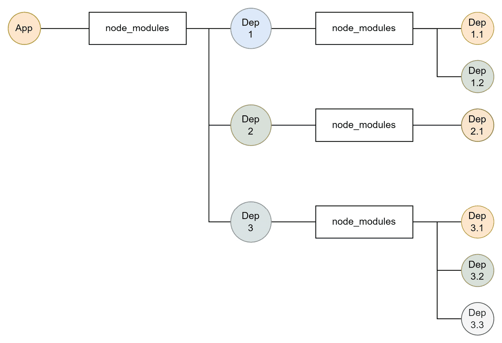
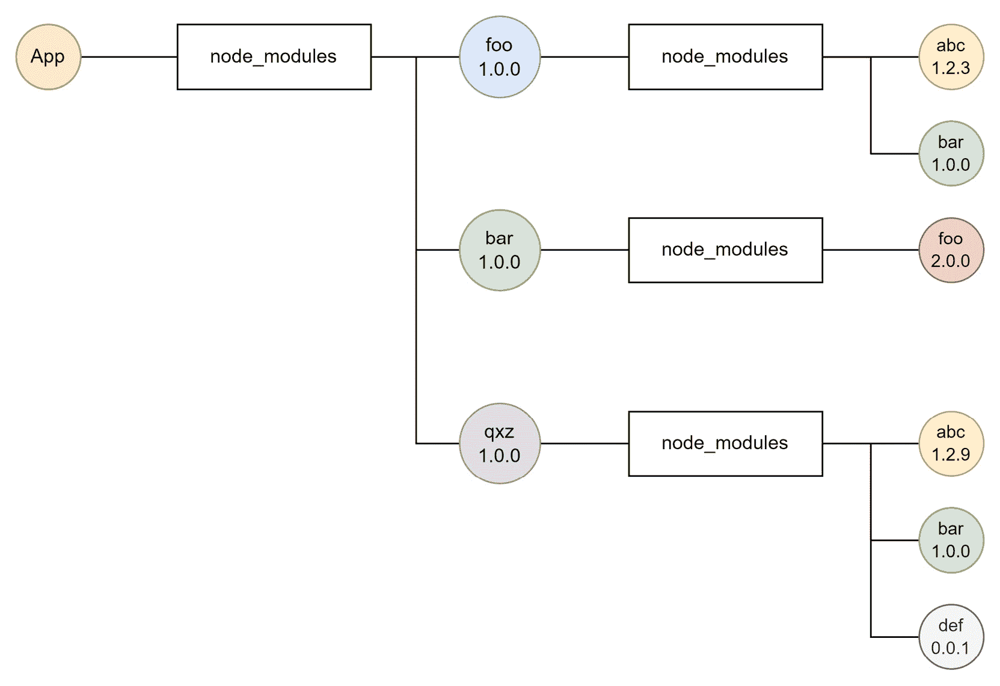
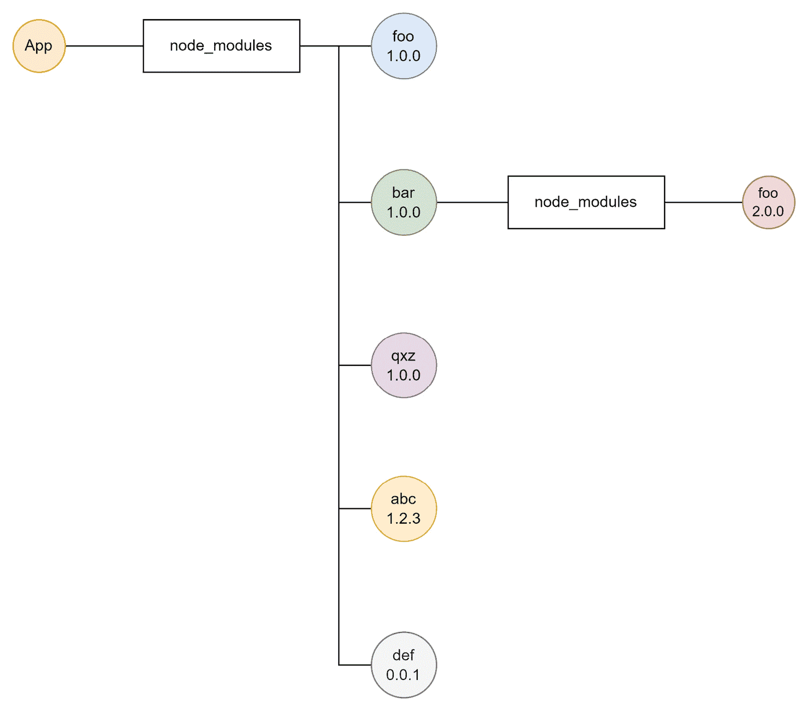
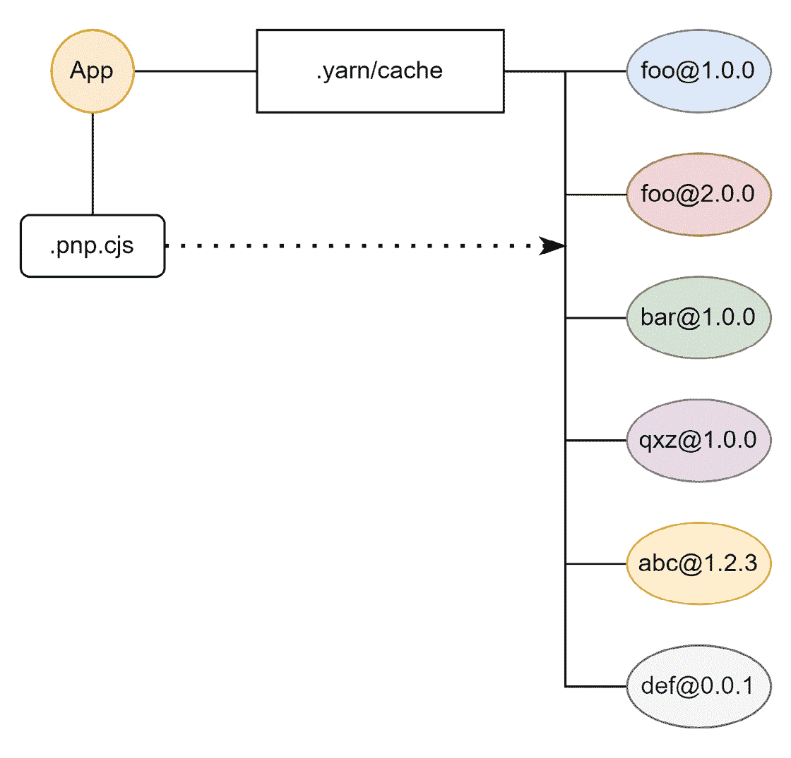
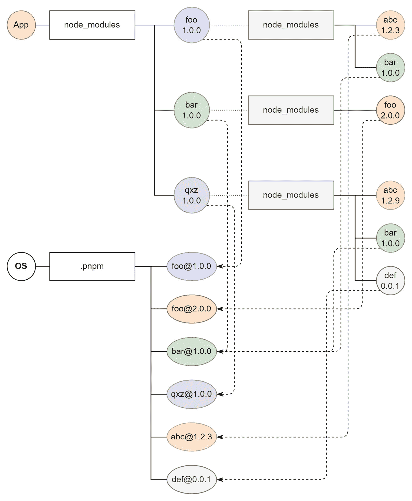
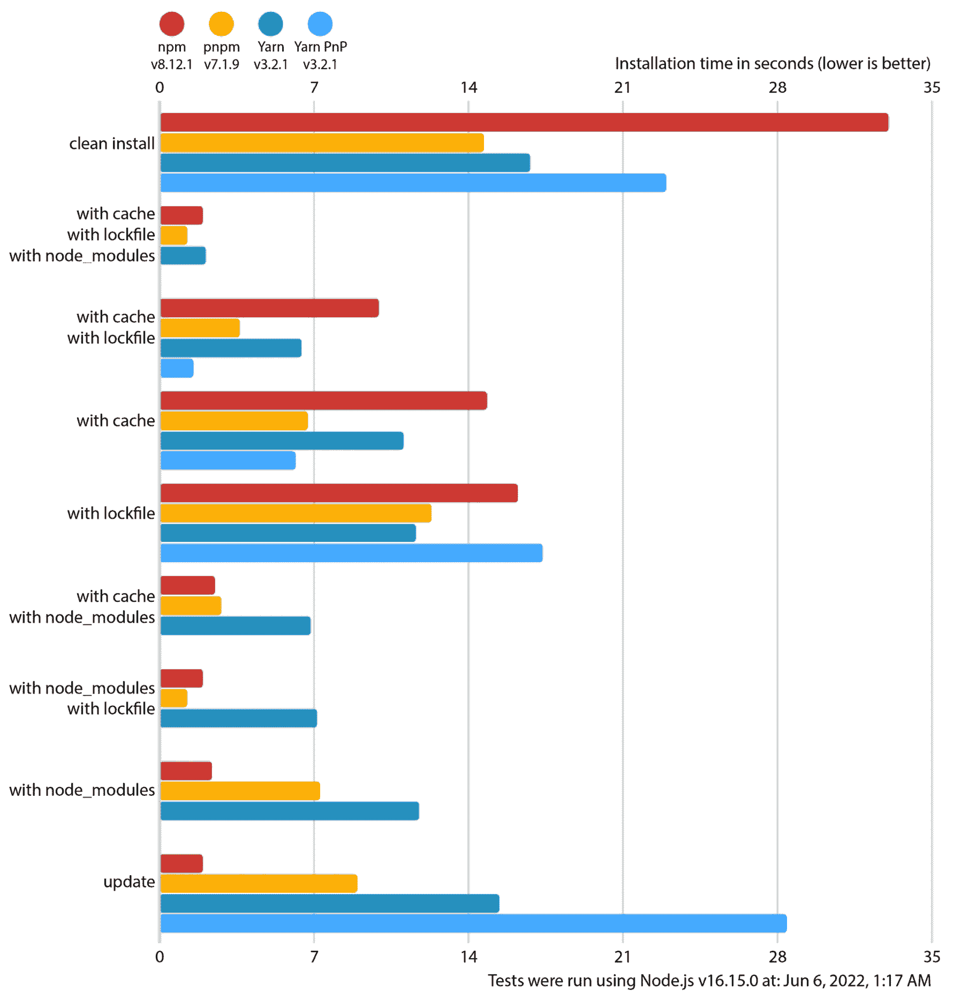

# 选择包管理器

到目前为止，我们已经对 Node.js 和其内部模块有了一些了解。我们还开始编写自己的模块，但要么避免使用第三方包，要么绕过使用第三方包。

Node.js 的一大优点是使用他人的代码实际上相当容易。这样做的方法直接引我们到包管理器。包管理器帮助我们处理包含可用于 Node.js 的模块的包的生命周期。

在本章中，我们将学习 Node.js 的实际标准包管理器 **npm** 的工作原理。然后我们将继续学习其他包管理器，例如 **Yarn** 和 **pnpm**。它们在可用性、性能或可靠性方面都承诺提供一些优势。我们将更深入地研究它们，以了解这些优势以及谁可能从使用每个不同的包管理器中受益。最后，我们还将探讨替代方案。

本章将帮助您在代码中使用第三方库。第三方依赖将使您更高效、更专注，而包管理器将有助于安装和更新第三方依赖。到本章结束时，您将了解最重要的包管理器，以及您在项目背景下想选择哪一个。

我们在本章中将涵盖以下关键主题：

+   使用 npm

+   使用 Yarn

+   使用 pnpm

+   更多替代方案

# 技术要求

本章的一些代码示例可在 [`github.com/PacktPublishing/Modern-Frontend-Development-with-Node.js/tree/main/Chapter03`](https://github.com/PacktPublishing/Modern-Frontend-Development-with-Node.js/tree/main/Chapter03) 找到。

本章的 CiA 视频可通过 [`bit.ly/3TmZr22`](http://bit.ly/3TmZr22) 访问。

# 使用 npm

当您从官方来源安装 Node.js 时，您将获得比 Node.js 更多的东西。为了方便起见，Node.js 还会将一些额外的程序和设置添加到您的系统中。其中最重要的添加之一是一个名为 npm 的工具。最初，npm 的缩写是 *Node.js Package Manager*，但如今，它基本上是一个独立的名称。

npm 的目标是让开发者能够管理第三方依赖。这包括安装和更新包，以及处理它们的版本和传递依赖。当安装的依赖项也包括依赖项时，就会建立传递依赖，因此也需要安装这些依赖项。

为了让 `npm` 了解存在哪些依赖以及它们的依赖关系，创建了 npm 注册表。它是一个托管在文件服务器上的所有包的 Web 服务。

更改使用的 npm 注册表

现在，存在许多 npm 注册表——但默认情况下，只有位于[`registry.npmjs.org/`](https://registry.npmjs.org/)的官方注册表被使用。要一致地更改注册表，需要创建一个特殊的文件，`.npmrc`。如果该文件创建在主目录中，那么更改将适用于所有使用情况。否则，此文件也可以创建在`package.json`旁边——仅适用于指定的项目。最后，要仅临时使用另一个注册表，可以使用`--registry`命令行标志。`.npmrc`文件的格式在[`docs.npmjs.com/cli/v8/configuring-npm/npmrc`](https://docs.npmjs.com/cli/v8/configuring-npm/npmrc)中概述。

要使用 npm 注册表中的包，我们需要使用`npm`命令行工具。实际上，当我们复制或克隆 Node.js 项目的源代码时，我们应该首先在项目`package.json`所在的目录中运行`npm install`：

```js
$ npm install
```

这将安装`package.json`中提到的所有运行时和开发依赖项的包。这些包将从配置的 npm 注册表中下载，然后存储在`node_modules`目录中。避免将`node_modules`目录添加到源控制中是一种良好的做法。例如，对于 Git，你应该将`node_modules`添加到你的仓库的`.gitignore`文件中。这样做有几个原因——例如，安装可能是平台特定的，或者安装可能无论如何都是可重复的。

`npm`命令行工具自带一系列集成命令——例如之前展示的`install`命令。要查看可用的命令，可以使用`--help`标志来使用该工具：

```js
$ npm --help

Usage: npm <command>

where <command> is one of:

    access, adduser, audit, bin, bugs, c, cache, ci, cit,

    clean-install, [...], v, version, view, whoami

npm <command> -h  quick help on <command>
```

`--help`标志也可以与特定命令结合使用。如果你想了解`install`命令有哪些选项，只需输入以下内容：

```js
$ npm install --help

npm install (with no args, in package dir)

[...]

npm install <github username>/<github project>

aliases: i, isntall, add

common options: [--save-prod|--save-dev|--save-optional] [--save-exact] [--no-save]
```

获取特定上下文帮助的原则对于许多命令行工具至关重要。在本章中我们将要探讨的所有包管理器都具备这种功能。最终，对我们这些用户来说，这带来了一些优势。我们无需每次都查找在线文档、其他书籍或教程来查看命令的语法，我们只需在针对我们使用的特定版本定制的命令行中直接获取所有所需信息。

一个非常有用的命令是`init`。虽然`install`对于现有项目来说很棒，但`init`可以用来创建一个新的项目。当你运行`npm init`时，你将引导通过一系列选项，就像进行一次调查。结果如下所示：

```js
$ npm init

package name: (my-project)

version: (1.0.0)

description: This is my new project

git repository:

author: Florian Rappl

license: (ISC) MIT

About to write to /home/node/my-project/package.json:

{

  "name": "my-project",

  "version": "1.0.0",

  "description": "This is my new project",

  "keywords": [],

  "scripts": {

    "test": "echo \"Error: no test specified\" && exit 1"

  },

  "main": "index.js",

  "author": "Florian Rappl",

  "license": "MIT"

}

Is this OK? (yes) yes
```

另一种选择是指定`-y`标志。这样，所有默认值都将被采用——如果你只是想初始化一个新的项目，这是一个更快的选择。

npm 的初始化函数甚至可以被扩展。如果你在`npm init`之后提供了另一个名称，那么 npm 将尝试使用`create-`前缀查找一个包。例如，当你运行`npm init react-app`时，npm 将查找名为`create-react-app`的包并运行它。运行一个包指的是在包的`package.json`文件中查找`bin`字段，并使用给定的引用启动一个新的进程。

如果你想要向你的项目中添加依赖项，你也可以使用`npm install`。例如，将 React 作为依赖项添加是`npm install react`。

依赖项的生命周期还要求我们了解依赖项何时过时。为此，npm 提供了 `npm outdated` 命令：

```js
$ npm outdated

Package                  Current   Wanted   Latest  Location

@types/node              16.11.9  17.0.40  17.0.40  pilet-foo

react                     17.0.2   17.0.2   18.1.0  pilet-foo

typescript                 4.5.2    4.7.3    4.7.3  pilet-foo
```

命令仅显示比当前安装版本更新的软件包。在某些情况下，这是可以接受的——也就是说，当当前版本与所需版本相匹配时。在其他情况下，运行 `npm update` 实际上会更新安装的版本。

使用不同版本的 npm

npm 已经与 Node.js 打包在一起。因此，Node.js 的每个版本也会选择一个 npm 版本。例如，Node.js 14 捆绑了 npm 6。在 Node.js 15 中，包含了 npm 7。从 Node.js 16 开始，你将获得 npm 8。保持灵活的一种方法是使用**nvm**。nvm 是一个小工具，允许你选择要使用的 Node.js 版本。它还可以用来更改默认版本，快速更新和安装新的 Node.js 和 npm 版本。更多信息请访问[`github.com/nvm-sh/nvm`](https://github.com/nvm-sh/nvm)。

npm 还提供许多有用的便捷功能——例如，提高安全性。`npm audit`命令将当前安装的软件包与包含安全漏洞的在线数据库进行比对。通常，在易受攻击的软件包中的修复只需一个`npm audit --fix`标志的调用即可。此外，使用如`npm view`之类的命令——例如，在`npm view react`中——我们可以直接与包含大多数公开可用软件包的 npm 注册表进行交互。

虽然 npm 注册表是软件包的绝佳来源，但 npm 命令行工具并非使用它的唯一方式。实际上，该网络服务的 API 是公开的，任何人——或者任何程序——都可以使用。 

首批使用 npm 注册表公开 API 的公司之一是 Facebook。他们在大型项目中遇到了安装时间慢的问题，并希望通过提供一个更好的算法来实际解决项目的依赖项——特别是传递依赖项。结果是出现了一个名为**Yarn**的新包管理器。

# 使用 Yarn

原始 npm 包解析算法的问题在于它是以一种弹性但天真的方式创建的。这并不意味着算法很简单。相反，这里我们指的是没有考虑过任何异国情调的技巧或经验优化。它不是试图优化（即降低）本地磁盘上可用的包的数量，而是设计成将包放入与它们声明时相同的层次结构中。这导致了一个如 *图 3**.1* 所示的文件系统视图：



图 3.1 – 使用 npm 安装包后的示例文件系统快照

处理包安装的简单方式当然是一种确保一切安装正确无误的绝佳方法，但在性能方面并不理想。查看 *图 3**.1*，可能有一些优化空间。

让我们在 *图 3**.1* 中添加一些示例包名和版本，以查看优化的机会。在 *图 3**.2* 中，显示了相同的快照——只是带有示例包名：



图 3.2 – 使用 npm 安装后带有示例包名的文件系统快照

不同于重复使用 `bar` 依赖，它只需使用一次。另一方面，由于版本冲突，`foo` 依赖必须重复。其他传递依赖，如 `abc` 或 `def`，可以被提升到顶级。

结果图像显示在 *图 3**.3* 中。尽可能简化了结构。这种优化是 Yarn 第一版的关键。实际上，它非常成功，npm 也改进了其算法。今天，npm 以类似 *图 3**.3* 中所示草图的方式解决包：



图 3.3 – 使用 Yarn 安装后带有示例包名的文件系统快照

对于 Yarn 团队来说，获得的优化并不足够。他们开始寻找不同的方法来进一步提高。然而，他们越寻找，就越确信需要一些全新的东西来做出任何进一步的改进。

结果是通过引入 `node_modules` 目录来实现的。相反，创建了一个名为 `.pnp.cjs` 的特殊文件，以提供有关如何解决依赖项的信息。有了 `.pnp.cjs` 文件，每个包都可以被解决——就像之前的 `node_modules` 一样。

包的具体位置取决于项目的设置。在 Yarn 2 中，引入了一个名为 *zero-installs* 的新概念。这样，每个依赖项都将可在项目内部使用——只是在 `.yarn/cache` 子文件夹中。要真正实现零安装，`.yarn` 文件夹应该被提交到源代码控制。现在，当项目被克隆时，不需要执行安装。依赖项已经是存储库的一部分。

虽然大多数命令非常相似，但 Yarn 在添加新依赖项方面采取了不同的方法。在这里，依赖项是通过 `yarn add` 添加的——例如，`yarn add react`。使用 `yarn` 命令行工具安装包与之前使用 `npm` 的用法相当，尽管如此：

```js
$ yarn install

 YN0000: ┌ Resolution step

 YN0000: └ Completed in 0s 634ms

 YN0000: ┌ Fetch step

 YN0013: │ js-tokens@npm:4.0.0 can't be found in the cache and will be fetched from the remote registry

 YN0013: │ loose-envify@npm:1.4.0 can't be found in the cache and will be fetched from the remote registry

 YN0013: │ react-dom@npm:18.1.0 can't be found in the cache and will be fetched from the remote registry

 YN0013: │ react@npm:18.1.0 can't be found in the cache and will be fetched from the remote registry

 YN0013: │ scheduler@npm:0.22.0 can't be found in the cache and will be fetched from the remote registry

 YN0000: └ Completed

 YN0000: ┌ Link step

 YN0000: └ Completed

 YN0000: Done in 0s 731ms
```

在 *图 3.4* 中，使用前一个示例展示了新的 PnP 机制。通过使用由包名和版本组成的完全限定名称，创建了唯一标识符，允许在扁平结构中定位同一包的多个版本。

PnP 机制的一个缺点是自定义的解析方法，这需要在 Node.js 中进行一些修补。Node.js 的标准解析机制使用 `node_modules` 来实际查找包内的模块。自定义解析方法教会 Node.js 使用不同结构的不同目录来查找模块：



图 3.4 – 使用 Yarn PnP 安装后的文件系统快照，包含示例包名

虽然对于许多包来说，使用自定义解析方法不是问题，但某些包可能依赖于涉及 `node_modules` 的经典结构，其中包仅解析为目录和文件。然而，在 PnP 中，结构是扁平的，每个包都是一个压缩存档。

到目前为止，许多插件和补丁可以使包与 PnP 兼容。许多——尤其是不太受欢迎的——包仍然不能与 PnP 一起使用。幸运的是，Yarn 3 解决了许多这些问题，为大多数有问题的包提供了一个兼容模式。最终，这仍然主要是一个试错的问题。幸运的是，Yarn PnP 不是唯一可以加快 npm 速度的解决方案。

在 Yarn 2 的 PnP 发布之前，其他开发者已经开始考虑替代策略来加快安装时间并节省网络带宽和存储容量。最著名的尝试是一个名为 pnpm 的实用工具。

# 使用 pnpm

pnpm 的方法有点像 npm 的原始包解析。在这里，每个包基本上是隔离的，并将自己的依赖项放入一个本地的 `node_modules` 子文件夹中。

然而，有一个关键的区别：不是每个依赖项都有一个硬拷贝，而是通过符号链接提供不同的依赖项。这种方法的优点是每个依赖项只需要在每个系统中解析一次。

另一个优点是，对于大多数包来说，一切如常。没有任何东西隐藏在存档后面或通过模块定义的某些自定义映射中，这些映射将在开始时运行。整个包解析过程正常工作。这个规则的例外是使用其路径来查找其他包或针对根目录工作的包。由于包的物理位置是全局的，因此与项目的位置不同，这些方法与 pnpm 不兼容。

使用 `pnpm` 命令行工具安装包的工作方式与 `npm` 非常相似：

```js
$ pnpm install

Packages: +5

+++++

Packages are hard linked from the content-addressable store to the virtual store.

  Content-addressable store is at: /home/rapplf/.local/share/pnpm/store/v3

  Virtual store is at:             node_modules/.pnpm

dependencies:

+ react 18.1.0

+ react-dom 18.1.0

Progress: resolved 5, reused 2, downloaded 3, added 5, done
```

总体而言，`pnpm` 命令行工具的大多数命令要么与 `npm` 的对应命令同名，要么非常相似。

在安装过程中，`pnpm` 将不可用的包添加到本地存储中。本地存储只是 `pnpm` 的一个特殊目录，它并不绑定到你的项目，而是你的用户账户。实际上，pnpm 的包存储是其神奇性能的来源。之后，`pnpm` 创建所有符号链接来连接一切。结果看起来类似于 *图 3.5*：



图 3.5 – 使用 pnpm 安装后的文件系统快照，包含示例包名

在 `node_modules` 文件夹中只列出直接依赖项。每个子文件夹的内容在原始的 `node_modules` 中不可用，而是在全局 `.pnpm` 缓存中。然后，相同的处理方式应用于所有子依赖项。

结果是性能的大幅提升。在干净安装的情况下，`pnpm` 已经比竞争对手快。然而，在其他场景中，相对差距可能更大。在 *图 3.6* 中，`pnpm` 的性能与其他包管理器进行了比较。较低的柱状图表示更好的性能：



图 3.6 – 与 npm、Yarn 和带有 PnP 的 Yarn 的性能基准比较（来源：https://pnpm.io/benchmarks）

只有在安装是最新的情况下，npm 才可以被认为是最快的选项。在其他情况下，pnpm 和有时 Yarn PnP 可以被认为是更快的。考虑到这一点，关键问题是是否还有其他替代方案可以考虑。让我们看看我们还能做些什么来简化依赖项管理。

# 更多替代方案

在使用包管理器时没有严格的要求。从理论上讲，代码的来源并不重要。例如，您可以直接下载包，提取它们，并通过它们的本地路径引用它们。

另一种选择是使用像**Deno**这样的系统。表面上，Deno 与 Node.js 非常相似。然而，在底层有一些关键的区别。最显著的区别是 Deno 没有包管理器。相反，包只是 URL，一旦需要才会解析。这样，包安装就只是下载——它恰好发生在需要的时候。

简而言之，Deno

Deno 是由 Node.js 的创造者 Ryan Dahl 创建的。因此，Deno 与 Node.js 共享许多功能，但在某些方面有所不同。Deno 旨在比 Node.js 更兼容在浏览器中运行的 JavaScript。Deno 还试图默认提供安全性。当使用 Deno 运行脚本时，必须由用户定义提供的安全上下文。否则，代码运行时可能无法访问网络或文件系统。您可以在[`deno.land/`](https://deno.land/)获取更多信息。

另一个选择是使用一个工具，它实际上在底层利用现有的包管理器，但以更高效或用户友好的方式。这个类别中的一个例子是**Turborepo**。

Turborepo 可以与任何流行的包管理器协同工作，并声称为许多任务提供了改进的性能，包括包安装和更新。然而，最有效利用 Turborepo 的方式是将其用于所谓的单一代码库（monorepo），这一点将在*第九章*“在单一代码库中*结构化代码*”中更详细地讨论。

除了如何安装、更新和发布包的问题之外，包管理的另一部分是包注册库。在这个领域，你可以从许多商业产品中选择，例如**Verdaccio**。对于大型项目来说，拥有自己的包注册库可能非常好，因为缺少依赖项或公共 npm 注册库的宕机可能成为问题。

通常，与已建立的包管理器 npm、Yarn 和 pnpm 相比，替代品并不多。虽然优化包管理器的使用或使用缓存的注册库可能很有吸引力，但它们对于大多数项目来说肯定不值得付出努力。目前，npm 和 Yarn 似乎在广泛的场景中最具吸引力，而 pnpm 可能被认为是大型仓库的理想选择。

# 摘要

在本章中，你学习了如何使用包管理器来处理与包相关的所有事情。你利用了默认的`npm`命令行工具。你接触到了最重要的替代品，Yarn 和 pnpm。你应该知道 Yarn 带来了什么——毕竟，PnP 和零安装是很好的特性。此外，你还检查了一些替代品，并了解了自定义注册库和仓库任务运行器，如 Turborepo。

到目前为止，您已经拥有了克隆和运行现有 Node.js 项目所需的一切。您可以安装新的依赖项，检查过时的依赖项，并更新它们。这使得您能够整合 npm 注册表中多年来发布的超过一百万个包。

在下一章中，我们将讨论如何使用不同版本的 JavaScript，例如更现代的规范或以 JavaScript 作为编译目标的语言，在 Node.js 中使用。

# 第二部分：工具

在这部分，您将通过接触各种工具和实用程序来加强您对 Node.js 生态系统的了解。您将学习如何在 Node.js 中使用不同版本的 JavaScript。这里包括 TypeScript 和 Flow。您还将看到哪些代码验证和样式检查器存在以及如何使用它们。

本部分的主要重点是让您从头开始设置和维护一个新的 Web 开发项目。这还包括质量保证方面的知识。作为这些主题的一部分，讨论了诸如 Jest 或 Playwright 之类的实用工具。

本书这部分包含以下章节：

+   *第四章*, *使用不同版本的 JavaScript*

+   *第五章*, *使用代码检查器和格式化工具提高代码质量*

+   *第六章*, *使用打包器构建 Web 应用*

+   *第七章*, *使用测试工具提高可靠性*
