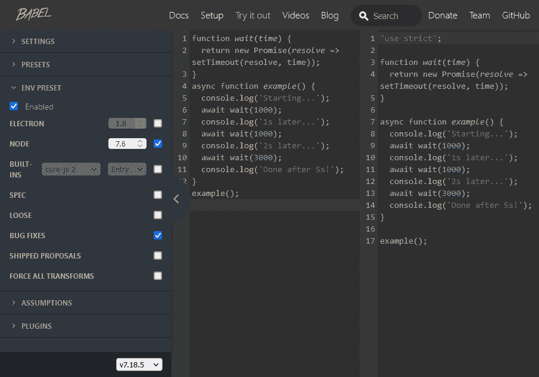
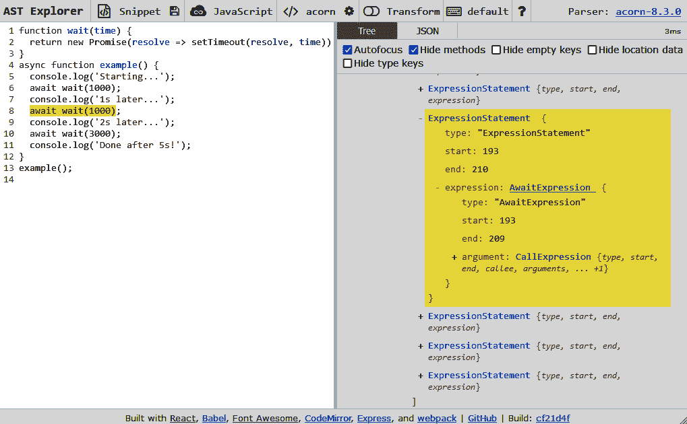

# 使用不同版本的 JavaScript

在上一章中，您已经完成了在 Node.js 中进行项目的基本要素。看看现实中的项目，您会很快发现人们使用各种版本的 JavaScript 与 Node.js 一起使用。JavaScript 的一个 **版本** 可以看作是官方 JavaScript 语言标准的变体。大多数情况下，这些版本看起来非常像您所习惯的 JavaScript，但在关键部分有所不同。有时，它们添加新的语言结构以简化某些任务；有时，在发布任何代码之前，它们会带来改进以确保可靠性。

在本章中，我们将学习如何使用 Node.js 与不同的 JavaScript 版本。我们将介绍最重要的工具和版本。就工具部分而言，我们将介绍流行的开源包 **Babel**。这个工具可以帮助 Node.js 学习如何使用一个 JavaScript 版本。这些版本包括对语言的一些有趣补充，如 **Flow** 或 **TypeScript**。两者都引入了类型系统，但后者还向语言添加了新的结构。

本章将帮助您使用可以用 Node.js 转换为 JavaScript 的语言。最终，这是关键——不仅能够独立于语法在任何版本的 Node.js 上运行 JavaScript 文件，而且还能在大型项目中引入额外的安全性和便利性。

本章将涵盖以下关键主题：

+   集成 Babel

+   使用 Flow

+   使用 TypeScript

# 技术要求

本章的完整源代码可以在 [`github.com/PacktPublishing/Modern-Frontend-Development-with-Node.js/tree/main/Chapter04`](https://github.com/PacktPublishing/Modern-Frontend-Development-with-Node.js/tree/main/Chapter04) 找到。

本章的 CiA 视频可以在 [`bit.ly/3UeL4Ot`](http://bit.ly/3UeL4Ot) 访问。

# 集成 Babel

在过去十年中，JavaScript 从一种简单的脚本语言上升为全球使用最广泛的编程语言。随着流行度的增加，该语言也获得了许多有趣的功能。不幸的是，最新的功能通常需要一段时间才能在所有实现中可用。如果我们想在旧实现中使用最新的语言功能，这个问题会变得更糟。

这是个前端开发者多年来都知道的问题——毕竟，浏览器版本和种类不能由开发者预先确定。只有用户才能做出这个决定——而且一个较旧的浏览器可能无法理解开发者想要使用的某些现代特性。在 Node.js 中，我们并没有遇到完全相同的问题——因为我们理论上可以决定 Node.js 的版本——但如果 Node.js 没有最新的语言特性，或者如果我们创建了应该在他人机器上运行的工具，那么这可能会成为一个类似的问题。

一种摆脱语言特性锁定（即，仅使用由引擎支持的特性集的限制）的好方法是使用一个理解最新语言规范并能将其正确翻译成旧语言规范的工具。这种编程语言翻译的过程称为**转译**。这个工具被称为**转译器**。

最著名的 JavaScript 转译器之一是 Babel。它的力量在于丰富的插件生态系统。实际上，使用 Babel 扩展 JavaScript 语言的结构非常容易，以至于许多功能最初都是在 Babel 中引入的，然后才成为官方标准或事实标准。前者是一个例子是`async`/`await`，这是一个相当复杂的功能。后者的例子是**JSX**，即 JavaScript 的**XML**-样结构的扩展。

以下代码使用了`async`/`await`，并且与版本*7.6.0*之前的 Node.js 不兼容：

```js
function wait(time) {
  return new Promise(resolve => setTimeout(resolve, time));
}
async function example() {
  console.log('Starting...');
  await wait(1000);
  console.log('1s later...');
  await wait(1000);
  console.log('2s later...');
  await wait(3000);
  console.log('Done after 5s!');
}
example();
```

如果我们想使其与旧版本（或更一般地说，无法处理现代`async`/`await`语法的 JavaScript 引擎）兼容，那么我们可以使用 Babel。

使用 Babel 转译代码有三种方式：

+   我们可以使用`@babel/node`包，它是对 Node.js 的一个薄包装。本质上，它将在执行期间转译模块——也就是说，当它们被需要时。

+   `@babel/cli`包可以用来预先转译模块并在转译后的模块上运行 Node.js。

+   或者，可以使用`@babel/core`包来编程控制转译过程——也就是说，哪些模块正在被转译以及如何处理结果。

每种方法都有其自身的优缺点。例如，选择`@babel/node`可能最容易启动，但实际上会给我们带来轻微的性能损失和一些不确定性。如果某些较少使用的模块存在语法问题，那么我们只能在模块使用时才发现。

同样，`@babel/cli`在便利性和功能之间找到了一个完美的平衡点。是的，它只与文件一起工作，但在几乎所有情况下这正是我们想要的。

一种非常方便地查看 Babel 如何处理事情的方法是使用位于[`babeljs.io/repl`](https://babeljs.io/repl)的交互式网站。对于我们的上一个代码示例，它使用了一个带有`await`的`async`函数，我们得到如图*4.1*所示的视图：



图 4.1 – 通过 Babel 在线转译一些 JavaScript

对于*图 4.1*中显示的截图，我们指定了 Node.js 的版本为*7.6*。一旦我们将它改为更低的版本，例如，*7.5*，我们就会得到不同的输出。这一切都始于一些生成的代码：

```js
"use strict";
function asyncGeneratorStep(gen, resolve, reject, _next, _throw, key, arg) { try { var info = genkey; var value = info.value; } catch (error) { reject(error); return; } if (info.done) { resolve(value); } else { Promise.resolve(value).then(_next, _throw); } }
function _asyncToGenerator(fn) { return function () { var self = this, args = arguments; return new Promise(function (resolve, reject) { var gen = fn.apply(self, args); function _next(value) { asyncGeneratorStep(gen, resolve, reject, _next, _throw, "next", value); } function _throw(err) { asyncGeneratorStep(gen, resolve, reject, _next, _throw, "throw", err); } _next(undefined); }); }; }
```

在生成的代码之后，我们的代码被输出。关键的区别在于，我们的代码现在使用了前面生成的代码中的辅助工具：

```js
function wait(time) {
  return new Promise(resolve => setTimeout(resolve, time));
}
function example() {
  return _example.apply(this, arguments);
}
function _example() {
  _example = _asyncToGenerator(function* () {
    console.log('Starting...');
    yield wait(1000);
    console.log('1s later...');
    yield wait(1000);
    console.log('2s later...');
    yield wait(3000);
    console.log('Done after 5s!');
  });
  return _example.apply(this, arguments);
}
example();
```

如您所见，代码已被生成的函数修改。在我们的例子中，这些函数已被用来用`yield`替换标准的`async`/`await`机制，使用生成器函数。但在为版本*6.0*之前的 Node.js 进行转换时，这还可以进一步改变，因为*6.0*引入了对生成器函数的支持。

在任何情况下，Babel 实际上正在做艰苦的工作，确定我们代码中使用了哪些构造，以及根据 Node.js 的目标版本需要替换哪些构造。它还知道适当的替换，并可以生成一些模板代码来支持语言构造。

为了让 Babel 完成所有这些工作，它需要理解 JavaScript 语言。这是通过**解析**源代码来实现的。解析是一个涉及遍历所有字符、将它们分组为所谓的标记（如标识符、数字等），然后将这些标记放入一个称为**抽象语法树**（**AST**）的树状结构中的过程。一个可以探索 Babel 看到的 AST 的工具可以在[`astexplorer.net/`](https://astexplorer.net/)找到。

理解 ASTs

就像处理 HTML 会产生一个不同节点的树一样，任何编程语言实际上都会解析为一个表达式和语句的树。虽然`for`循环等语句形成一个封闭的指令块，但加法等表达式总是会返回一个值。AST 将这些全部联系起来，并为相应的节点类型整合所有提供的信息。例如，加法表达式由两个应该相加的表达式组成。这些可以是任何表达式，例如，一个简单的字面量表达式，如数字标记。

上述示例的 AST 片段可以在*图 4.2*中看到。AST 中的每个节点都有一个关联的类型（如`AwaitExpression`）和源文档中的位置：



图 4.2 – AST Explorer 显示了 Babel 解析的信息

带着这些知识，我们现在可以尝试使用`@babel/node`在本地做一些事情：

1.  我们首先创建一个新的 Node.js 项目。在一个新目录中，运行以下命令：

    ```js
    $ npm init -y
    ```

1.  这将创建一个`package.json`文件并包含一些基本信息。之后，你可以将`@babel/node`和`@babel/core`包作为开发依赖项安装：

    ```js
    $ npm install @babel/core @babel/node --save-dev
    ```

1.  您可以使用其他包管理器进行此操作。一旦安装完成，我们应该添加脚本。创建一个名为`index.js`的新文件，内容如下：

index.js

```js
let x = 1;

let y = 2;

// use conditional assignment – ES2021 feature

x &&= y;

console.log('Conditional assignment', x);
```

代码使用了一个名为条件赋值的`ES2021`特性。只有当`y`为真值时，才会执行赋值。在这种情况下，我们期望条件赋值后`x`的值为`2`。

1.  要运行代码，我们需要修改`package.json`。在`scripts`部分，我们添加一个`start`字段。现在，`scripts`部分应该看起来像这样：

    ```js
    "scripts": {
    ```

    ```js
      "start": "node index.js",
    ```

    ```js
      "test": "echo \"Error: no test specified\" && exit
    ```

    ```js
        1"
    ```

    ```js
    }
    ```

1.  到目前为止，我们可以方便地使用 `npm start` 运行脚本。对于最近的 Node.js 版本（*15* 或更高版本），输出应该是这样的：

    ```js
    $ npm start
    ```

    ```js
    > example01@1.0.0 start
    ```

    ```js
    > node index.js
    ```

    ```js
    Conditional assignment 2
    ```

1.  然而，如果我们尝试使用 Node.js *14* 运行代码，我们会得到一个错误：

    ```js
    $ npm start
    ```

    ```js
    > example01@1.0.0 start /home/node/examples/example01
    ```

    ```js
    > node index.js
    ```

    ```js
    /home/node/examples/example01/index.js:4
    ```

    ```js
    x &&= y;
    ```

    ```js
      ^^^
    ```

    ```js
    SyntaxError: Unexpected token '&&='
    ```

现在，如果你想让它运行，你可以将 `package.json` 的 `start` 脚本切换为使用 `babel-node` 而不是标准的 `node`。然而，尝试这样做是不会工作的。原因是，默认情况下，Babel 不理解当前环境，因此无法应用转换。

1.  为了让 Babel 真正理解它，我们需要使用 `@babel/preset-env` 包。这是一个代表插件集合的预设。在这种情况下，`env` 预设是一个特殊的预设，它根据当前环境智能地查找正确的插件。让我们首先安装它：

    ```js
    $ npm install @babel/preset-env --save-dev
    ```

1.  之后，我们可以通过创建一个新文件来集成它：

.babelrc

```js
{

  "presets": [["@babel/preset-env"]]

}
```

1.  文件必须放置在 `package.json` 旁边。一旦放置在那里，Babel 将自动加载该文件并将其内容作为配置输入。现在输出符合我们的预期：

    ```js
    $ npm start
    ```

    ```js
    > example01@1.0.0 start
    ```

    ```js
      /home/rapplf/Code/Articles/Node.js-for-Frontend-
    ```

    ```js
      Developers/Chapter04/example01
    ```

    ```js
    > babel-node index.js
    ```

    ```js
    Conditional assignment 2
    ```

按照这些说明，你现在可以运行现代代码，即使在较旧的 Node.js 版本上。前面的例子最终在 Node.js *14* 上运行了——即使这个版本不支持新的赋值运算符 `&&=`。

有许多不同的包与 Babel 一起工作。为 Babel 编写了完整的语言或语言扩展。其中之一是 Flow。

# 使用 Flow

Flow 主要是一个 JavaScript 代码的 **静态类型检查器**。静态类型检查器的目的是确保在构建时一切都能按预期工作。因此，我们应该在运行时看到更少的错误。实际上，正确使用静态类型检查器将基本上消除所有简单的错误，并让我们专注于解决那些无论如何都会出现的算法和行为问题。

在 Flow 中，每个 JavaScript 文件都可以转换为 Flow 文件。需要做的只是引入 `@flow` 注释。一个简单的例子如下：

```js
// @flow
function square(n: number): number {
  return n * n;
}
square("2"); // Error!
```

即使代码在标准 JavaScript 中运行得相当好，Flow 也会通过在最后一行引发错误来帮助我们。`square` 函数使用了类型注解来指定 `n` 输入参数和返回值。冒号表示法将标识符或函数头与指定的类型分开。

由于冒号表示法不是 JavaScript 标准的一部分，我们无法直接运行前面的代码。相反，我们可以使用 Babel 与 `@babel/preset-flow` 包一起使用，以去除 Flow 类型注释——只保留 Node.js 可以理解的 JavaScript。 

让我们用一个新项目来测试一下：

1.  我们通过初始化一个 `npm` 项目并安装必要的开发依赖来在新的目录中开始：

    ```js
    $ npm init -y
    ```

    ```js
    $ npm install @babel/core @babel/node @babel/preset-
    ```

    ```js
      flow --save-dev
    ```

1.  现在，我们配置 Babel 并更改 `package.json` 文件：

.babelrc

```js
{

  "presets": ["@babel/preset-flow"]

}
```

1.  在 `package.json` 中，我们需要在 `scripts` 部分添加一个 `start` 字段：

package.json

```js
{

  "name": "example02",

  "version": "1.0.0",

  "scripts": {

    "start": "babel-node index.js"

  },

  "devDependencies": {

    "@babel/core": "⁷.18.5",

    "@babel/node": "⁷.18.5",

    "@babel/preset-flow": "⁷.17.12"

  }

}
```

现在，运行`npm start`应该不会出现任何错误信息。然而，如果我们运行`node index.js`，那么我们实际上会面对一个错误。尽管如此，我们不应该在这种情况下也遇到错误吗？

1.  好吧，正如提到的，Babel 部分只是为了运行。安装的预设只理解并移除类型注解。它并不进行实际的类型检查。为此，我们需要安装另一个名为`flow-bin`的包：

    ```js
    $ npm install flow-bin --save-dev
    ```

1.  我们可以使用`npm`中自带`npx`运行器来运行`flow`。首先，我们初始化项目：

    ```js
    $ npx flow init
    ```

1.  然后，我们可以对我们的解决方案进行类型检查：

    ```js
    $ npx flow
    ```

    ```js
    Launching Flow server for
    ```

    ```js
      /home/node/examples/example02
    ```

    ```js
    Spawned flow server (pid=13278)
    ```

    ```js
    Logs will go to /tmp/flow/example02.log
    ```

    ```js
    Monitor logs will go to
    ```

    ```js
      /tmp/flow/example02.monitor_log
    ```

    ```js
    Error  index.js:6:8
    ```

    ```js
    Cannot call square with "2" bound to n because string
    ```

    ```js
     [1] is incompatible with number [2]. [incompatible-
    ```

    ```js
     call]
    ```

    ```js
     [2] 2│ function square(n: number): number {
    ```

    ```js
         3│   return n * n;
    ```

    ```js
         4│ }
    ```

    ```js
         5│
    ```

    ```js
     [1] 6│ square("2"); // Error!
    ```

    ```js
         7│
    ```

    ```js
    Found 1 error
    ```

如预期的那样，调用不满足类型检查。这对我们自己的代码来说是个好消息，但对于使用第三方库来说更是如此。有了类型检查，我们可以确信我们正确地使用了提供的 API。不仅现在如此，而且在我们为第三方库安装更新时也是如此。

很遗憾，并不是每个包都包含 `flow`-类型的注解。然而，对于一个非常类似的工具 TypeScript 来说，情况看起来要乐观一些。

# 使用 TypeScript

TypeScript 是一种完整的编程语言，它被设计为 JavaScript 的超集。基本想法是从 JavaScript 开始，通过添加类型、类或枚举等缺失的部分来增强它，并将 JavaScript 作为语言的转译目标。多年来，TypeScript 语言中首次引入的许多功能也进入了 JavaScript 语言。

今天，TypeScript 是编写大型 JavaScript 项目的最流行方式。在官方`npm`注册表中，几乎每个包都提供了与 TypeScript 兼容的类型注解——要么在包内部，要么在专门的包中。例如，`react`包的类型注解可以在`@types/react`包中找到。

要使用 TypeScript，我们需要安装`typescript`包。这个包包含了`tsc`脚本，它赋予我们检查类型和将使用`.ts`或`.tsx`扩展名编写的 TypeScript 文件进行转译的能力。

让我们继续创建一个新的项目，安装`typescript`，并添加一个源文件：

1.  我们从项目创建开始。在一个新目录中，运行以下命令：

    ```js
    $ npm init -y
    ```

    ```js
    $ npm install typescript --save-dev
    ```

1.  让我们添加一个与 Flow 示例内容相似的`index.ts`文件：

index.ts

```js
function square(n: number): number {

  return n * n;

}

square("2"); // Error!
```

文件的内容与之前几乎相同，然而，缺少了`@flow`注释。

1.  我们现在可以直接通过安装的`typescript`包中的`tsc`命令来运行它：

    ```js
    $ npx tsc index.ts
    ```

    ```js
    index.ts:5:8 - error TS2345: Argument of type 'string'
    ```

    ```js
      is not assignable to parameter of type 'number'.
    ```

    ```js
    5 square("2"); // Error!
    ```

    ```js
             ~~~
    ```

    ```js
    Found 1 error in index.ts:5
    ```

与`flow`工具相比，`tsc`做得多一些。它不仅进行类型检查，还会生成输出文件。它不做的就是运行代码。`@babel/node`的即时评估功能可以在`ts-node`包中找到，它的工作方式与 Babel 类似。

1.  默认情况下，`tsc` 尝试将 `.ts` 或 `.tsx` 输入文件转换为一些新文件：一个 `.js` 文件和一个 `.d.ts` 文件。即使在类型检查失败的情况下，这些文件也可能被生成。`.js` 文件将默认写入，也就是说，每次使用 `tsc` 时都会写入，除非我们告诉 TypeScript 不要输出。`.d.ts` 文件只有在我们也启用了声明创建时才会写入。在运行了之前的示例之后查看目录将揭示两个新文件：

    ```js
    $ ls -l
    ```

    ```js
    -rw-r--r-- 1   64 index.js
    ```

    ```js
    -rw-r--r-- 1   79 index.ts
    ```

    ```js
    drwxr-xr-x 4 4096 node_modules
    ```

    ```js
    -rw-r--r-- 1  387 package-lock.json
    ```

    ```js
    -rw-r--r-- 1  278 package.json
    ```

1.  实际运行代码需要额外的 JavaScript。这同样适用于为浏览器编写的 TypeScript。由于没有浏览器能理解 TypeScript 代码，我们需要在之前将其转换为 JavaScript。就像 Babel 一样，我们可以为不同的 JavaScript 标准版本进行转换。

1.  为了保持你的代码库整洁，你不应该像之前展示的那样使用 TypeScript。相反，一个更好的方法是引入一个 `tsconfig.json` 文件，你应该将其放置在 `package.json` 旁边。这样，你不仅可以正确地定义目标 JavaScript 版本，还可以指定转换输出应该放置的目标目录。然后，你可以在这个目标目录中忽略版本控制系统：

tsconfig.json

```js
{
  "compilerOptions": {
    "target": "es6",
    "outDir": "./dist"
  },
  "include": [
    "./src"
  ],
  "exclude": [
    "node_modules"
  ]
}
```

在配置中，我们指定了一个 `src` 目录作为转换的根目录。内部所有的 `.ts` 和 `.tsx` 文件都将被转换。输出将可在 `dist` 目录中找到。

1.  现在，你只需将 `index.ts` 移动到一个新的 `src` 子文件夹中，然后再次运行 `tsc`。同样的错误会再次出现，但与在 `index.ts` 文件旁边创建 `index.js` 不同，输出将出现在 `dist` 文件夹中：

    ```js
    $ npx tsc
    ```

    ```js
    src/index.ts:5:8 - error TS2345: Argument of type
    ```

    ```js
      'string' is not assignable to parameter of type
    ```

    ```js
      'number'.
    ```

    ```js
    5 square("2"); // Error!
    ```

    ```js
             ~~~
    ```

    ```js
    Found 1 error in src/index.ts:5
    ```

    ```js
    $ ls -l dist/
    ```

    ```js
    -rw-r--r-- 1   64 index.js
    ```

现在，大多数发布在公共 `npm` 注册库上的库都将使用 TypeScript 创建。这不仅防止了一些不必要的错误，而且也使库的消费者体验变得更好。

# 摘要

在本章中，你学习了如何使用 Node.js 的不同 JavaScript 风格。你看到了如何安装、配置 Babel，以及如何使用它将你的代码转换为 Node.js 目标版本支持的 JavaScript 标准。

现在，你也应该了解最重要的 JavaScript 风格的基础：Flow 和 TypeScript。我们讨论了它们的安装和配置方法。当然，为了实际使用这些风格，你需要额外的材料来学习它们的语法并掌握这些语言背后的概念。学习 TypeScript 的好书是 *Mastering TypeScript*，作者为 *Nathan Rozentals*。

在下一章中，我们将讨论一个非常重要的工具领域——能够为我们代码提供改进的一致性和验证的应用程序。
