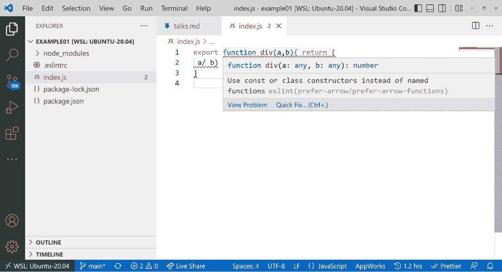

# 5

# 使用 Linters 和格式化工具提升代码质量

到本章为止，我们主要处理的是在热路径上的结构和代码——也就是说，直接必要的，以实际做某事。然而，在大多数项目中，有许多部分不是直接有用或可见的。这些部分往往在保持项目一定质量方面起着至关重要的作用。

软件项目质量增强领域的例子之一是用于确保遵循某些编码标准的工具。这些工具可以出现在许多类别中——最突出的类别是 **linters** 和 **formatters**。通常，这些工具可以归类为辅助工具。

在本章中，我们将学习存在哪些类型的辅助工具，以及我们为什么可能想要使用一些额外的工具来提升我们项目的代码质量。我们将介绍最重要的辅助工具，如 **ESLint**、**Stylelint** 和 **Prettier**。我们还将探讨这些工具如何与标准文本编辑器，如 VS Code，集成或使用。

通过本章介绍的辅助工具，你将能够对任何你将贡献的基于 Node.js 的前端项目产生卓越的积极影响。

本章将涵盖以下关键主题：

+   理解辅助工具

+   使用 ESLint 和替代方案

+   介绍 Stylelint

+   设置 Prettier 和 EditorConfig

# 技术要求

本章的完整源代码可在 [`github.com/PacktPublishing/Modern-Frontend-Development-with-Node.js/tree/main/Chapter05`](https://github.com/PacktPublishing/Modern-Frontend-Development-with-Node.js/tree/main/Chapter05) 找到。

本章节的 CiA 视频可在 [`bit.ly/3fLWnyP`](https://bit.ly/3fLWnyP) 访问。

# 理解辅助工具

当大多数人想到软件时，他们可能会想到微软 Word 这样的应用程序、Minecraft 这样的游戏，或者 Facebook 这样的网络应用程序。多亏了流行媒体，普遍的观点是这些应用程序是由个人天才编写的，他们将这些零和一黑客进一个晦涩的界面。现实情况可能完全相反。

如你所知，要创建任何类型的软件，需要大量的库、工具——在许多情况下——以及大型团队。然而，大多数人低估了仅仅保持项目进展的努力——也就是说，仍然能够向现有软件添加新功能。有几个问题导致了这种功能放缓。

一方面，软件内部的复杂性总是会增加。无论我们是否愿意，随着每个新功能的加入，项目都会变得更加具有挑战性。此外，较大的软件往往由更多的开发者编写——每个开发者都有略微不同的偏好和风格。这很快就会让新开发者甚至那些在项目中拥有经验但之前未曾接触过这些领域的开发者陷入混乱。

一种控制复杂性上升的方法是引入流程。例如，进行带有审查的拉取请求的过程已经提出，以传播关于新功能的知识，检测问题，并讨论发现。在良好的拉取请求审查结束时，代码应该处于新添加的功能在功能和技术上都能很好地融入整个项目状态。

现在，一切关于自动化。因此，尽管手动流程如代码审查可能很好且必要，我们通常更喜欢自动化流程。这正是所有辅助工具发挥作用的地方。以代码审查中关于代码格式的潜在讨论为例。假设代码的一部分如下所示：

```js
export function div(a,b){ return (
 a/ b)
}
```

代码本身是好的——`div`函数应该执行除法，当然，它确实做到了。然而，格式却大相径庭。一个审阅者可能会抱怨函数的参数应该使用逗号后的空格进行适当的格式化。另一个审阅者可能不喜欢没有使用括号的返回语句。第三个审阅者可能会指出缺少可选的分号以及缩进仅有一个空格。

现在，一切设置和完成后，代码的新版本将被推送：

```js
export function div(a, b){
  return a / b;
}
```

在这种情况下，第二个审阅者可能会提出关于分号引入的讨论——在这种情况下，分号是可选的，代码没有它也能工作。此时，一个新的审阅者加入并质疑引入函数的必要性：“为什么需要除法函数？这里没有什么新奇的或有趣的地方。”

因此，你会看到在各方面都浪费了大量的时间。与其首先讨论函数的业务需求，不如把时间花在讨论应该自动对齐和纠正的正式程序上。这正是 linters 和 formatters 发挥作用的地方。它们可以通过遵循为项目设定的标准来完成任务，使代码易于阅读。因此，团队只需要就制表符与空格的争论或分号的使用达成一致。工具负责实际应用决策。

JavaScript 中的分号

JavaScript 对语法的限制相对宽松。虽然其他语言有必须遵循的规则和结构，但 JavaScript 在其规范中包含了许多可选的结构。例如，分号在某种程度上是可选的。在某些情况下，你需要分号来避免诸如在 `for` 循环头部出现的令人不快的意外，但大多数情况下，你可以直接去掉它们，代码仍然可以正常工作。

在许多领域，辅助工具是有意义的。当然，代码本身的排列是好的，但即使是像在使用项目版本控制系统时的提交信息或检查是否提供了文档这样的事情也可以是有用的。

在检查实际语法——例如，空格和换行符的使用，这是一个常见用例——一个更加重要的用例是检查实际的代码结构以查找某些模式。对所使用模式的验证通常被称为 **linting**——一类被称为 **linters** 的工具。在这个领域表现出色的工具是 **ESLint**。

# 使用 ESLint 和替代方案

ESLint 静态分析代码以识别常见模式并查找问题。它可以作为 Node.js 应用程序中的库、Node.js 脚本中的工具、CI/CD 管道中的工具，或者在代码编辑器中隐式使用。

通常建议在 Node.js 项目中本地安装 ESLint。可以使用您喜欢的包管理器，如 npm 来进行本地安装：

```js
$ npm install eslint --save-dev
```

在大多数情况下，您会想要指定 `--save-dev` 标志。这将添加一个开发依赖项，这些依赖项不会在消费应用程序中安装，并且在生产安装中将被跳过。实际上，开发依赖项只在项目的实际开发期间才有意义。

或者，您也可以将 ESLint 设置为全局工具。这样，您就可以在尚未包含 ESLint 的项目和代码文件中运行 ESLint。要全局安装 ESLint，需要运行以下命令：

```js
$ npm install eslint --global
```

可能需要提升 shell 访问权限（例如，使用 `sudo`）来全局安装 ESLint。一般建议避免使用提升的 shell 访问权限，这意味着避免全局安装。

全局安装与本地安装

npm 不仅是一种很好的分发包的方式，也是一种分发工具的方式。npm 的标准安装创建了一个专门用于此类工具的目录。这个专用目录被添加到您的系统 `PATH` 变量中，允许直接执行目录中的任何内容。通过使用全局安装，像 ESLint 这样的工具被添加到专用目录中，使我们能够通过在命令行中键入 `eslint` 来运行它。

另一方面，本地安装的工具不会放在专门的目录中。相反，它们在 `node_modules/.bin` 文件夹中可用。为了避免运行像 `./node_modules/.bin/eslint` 这样冗长的命令，我们可以使用 `npx` 工具。

`npx` 是与 Node.js 和 npm 一起安装的任务运行器。它会智能地检查提供的脚本是否已本地或全局安装。如果没有找到任何内容，则从 npm 注册表临时下载一个包，从临时安装中执行脚本。因此，在已安装 ESLint 的项目中运行 `npx eslint` 将启动代码检查。

让我们初始化一个新的项目（`npm init -y`）并将 `eslint` 作为开发依赖项安装。现在你已经安装了 ESLint，你可以在一些示例代码上实际使用它：

1.  对于这一点，我们可以利用上一节中的示例：

index.js

```js
export function div(a,b){ return (

 a/ b)

}
```

1.  在我们运行 `eslint` 之前，我们还需要创建一个配置。对于前端开发的大多数工具来说，拥有一个配置文件是必需的。在 ESLint 的情况下，配置文件应该命名为 `.eslintrc`。

将以下 `.eslintrc` 文件放置在与 `package.json` 相同的目录中：

.eslintrc

```js
{

    "root": true,

    "parserOptions": {

        "sourceType": "module",

        "ecmaVersion": 2020

    },

    "rules": {

        "semi": ["error", "always"]

    }

}
```

为 ESLint 编写配置方式有多种。在前面的代码片段中，我们使用了 JSON 格式，这对于有 JavaScript 或 Web 开发背景的人来说应该非常熟悉。另一种常见的方法是使用 YAML 格式。

1.  在前面的配置中，我们指示 ESLint 停止查找父配置。因为这个确实是我们的项目配置，我们可以在这里停止。此外，我们配置 ESLint 的解析器实际按照非常新的规范解析 ESM。最后，我们配置了分号规则，如果缺少分号则抛出错误。

应用此规则集的结果可以在以下代码片段中看到。从当前目录（`.`）开始运行 `npx eslint` 的样子如下：

```js
$ npx eslint .
/home/node/Chapter05/example01/index.js
  2:7  error  Missing semicolon  semi
 1 problem (1 error, 0 warnings)
  1 error and 0 warnings potentially fixable with the
  `--fix` option.
```

如预期的那样，检查器会抱怨。然而，这种抱怨肯定是在积极区域。相当建设性地，ESLint 还告诉我们有关自动修复问题的选项。

1.  让我们使用建议的 `--fix` 选项运行相同的命令：

    ```js
    $ npx eslint . --fix
    ```

这里没有输出。实际上，这是好事。缺失的分号已经被插入：

```js
export function div(a,b){ return (

 a/ b);

}
```

1.  其他规则怎么样？如果我们想强制代码使用匿名箭头函数而不是命名函数呢？虽然 ESLint 直接提供的规则可以覆盖许多内容，但系统可以通过第三方包的规则进行扩展。为 ESLint 带来额外功能的第三方包被称为 ESLint 插件。

要引入一个规则来强制使用匿名箭头函数，我们可以使用 ESLint 插件。这个插件的包名为 `eslint-plugin-prefer-arrow`。让我们首先安装它：

```js
$ npm install eslint-plugin-prefer-arrow --save-dev
```

1.  现在，我们可以更改配置。我们需要包含对插件的引用，并指定规则：

.eslintrc

```js
{

    "root": true,

    "parserOptions": {

        "sourceType": "module",

        "ecmaVersion": 2020

    },

    "plugins": [

      "prefer-arrow"

    ],

    "rules": {

        "semi": ["error", "always"],

        "prefer-arrow/prefer-arrow-functions": ["error", {}]

    }

}
```

1.  使用这种配置，我们现在可以测试函数声明是否确实被认定为错误：

    ```js
    $ npx eslint .
    ```

    ```js
    /home/node/Chapter05/example01/index.js
    ```

    ```js
      1:8  error  Use const or class constructors instead
    ```

    ```js
      of named functions  prefer-arrow/prefer-arrow-
    ```

    ```js
      functions
    ```

    ```js
     1 problem (1 error, 0 warnings)
    ```

与之前的错误相比，我们在这里没有看到任何自动修复的迹象。在这种情况下，代码的作者必须手动进行所有更改以满足 linting 工具的要求。

ESLint 有很多替代方案。在过去，TypeScript 特定的变体 TSLint 相当受欢迎。然而，几年前，TSLint 背后的团队决定将他们的规则合并到 ESLint 中——这也使得 ESLint 成为了 linting TypeScript 文件的既定标准。如今，最受欢迎的替代方案是**Rome**、**quick-lint-js**和**JSHint**。

Rome 是一个将多个实用工具结合成一个统一应用程序的全能工具。虽然 Rome 不是用 JavaScript 和 Node.js 编写的，但它仍然很好地集成到标准前端工具中。Rome 涵盖的一个方面是 linting。在撰写本文时，遗憾的是，Rome 尚未功能完善，仍在早期 alpha 版本中，但它的性能和便利性优势是明显的。

**quick-lint-js**包是一个小巧的工具，无需配置，并且针对执行时间优于 ESLint 进行了优化。缺点是 quick-lint-js 功能较少，设计上不太灵活。

最后，在 linting 领域的一个黄金经典是**JSHint**。最初，它被创建为一个更可配置的**JSLint**版本，可以被认为是 JavaScript 的第一个流行 linter。JSHint 的一个问题是它不支持**ECMAScript**标准的最新和最伟大的功能。如果你正在寻找 ES2020 支持，那么 JSHint 可以被舍弃。同样，JSHint 在可扩展性方面也更为严格。在 JSHint 中，你不能定义自定义规则。然而，如果你在 JSHint 中缺少某些功能，你将无法简单地添加它们。

然而，ESLint 最大的优势是它已经拥有了其他人可能缺少的生态系统。ESLint 在编辑器支持方面表现出色。*图 5.1*显示了 VS Code Marketplace 上官方 ESLint 扩展的入口。


图 5.1 – VS Code Marketplace 上官方 ESLint 扩展的入口

对于其他编辑器也存在类似的插件。一些编辑器，如 Brackets，甚至预装了 ESLint 集成。

编辑器集成会在代码中直接显示 ESLint 问题。这在开发过程中非常有帮助。你不必等待代码质量检查结果，而是在问题出现时就能直接看到它们。这样，你就可以立即修复它们，而不是需要稍后返回之前已关闭的文件。

在几乎所有的编辑器集成中，当 ESLint 发现问题时，你不仅会得到一些波浪线或类似的视觉提示，还可以运行快速修复。运行快速修复将触发 ESLint 的修复功能。在前面的命令行使用中，我们通过使用 `--fix` 标志触发了这种行为。

*图 5.2* 展示了 VS Code 如何报告在给定示例文件 `index.js` 中由 ESLint 发现的问题：



图 5.2 – ESLint 在 VS Code 中集成报告问题

通常来说，为代码检查规则定义一个坚实的基础是有意义的。然而，这个基础不应过大。过多的规则最终会产生相反的效果。与其通过寻找共同风格和避免问题模式来增强团队的能力，不如过于严格的约束——这本质上会减慢甚至阻碍新功能的进展。因此，建议从少量规则开始，当某些代码问题在拉取请求审查中频繁出现时再添加新规则。这样，代码检查规则集将随着项目的发展而演变。

虽然检查 JavaScript 源文件无疑是现代前端开发中最重要任务之一，但它绝不是你将遇到的唯一类型的源文件。可以说，第二重要的文件类型是样式表，如 **CSS** 或 **SCSS**。对于这些，我们可以依赖另一个名为 Stylelint 的代码检查工具。

# 介绍 Stylelint

Stylelint 是一个用于 CSS 文件的代码检查工具，并且可以扩展以理解 CSS 方言，如 SCSS、**Sass**、**Less** 或 **SugarCSS**。它拥有超过 170 个内置规则，但与 ESLint 类似，也提供了自定义规则的支持。

安装 Stylelint 时，我们可以遵循与 ESLint 相同的步骤：

1.  在这里，通常有理由依赖 Stylelint 提供的标准配置。与 ESLint 不同，标准配置以单独的包发布，因此也需要安装。安装这两个包作为开发依赖项的命令如下：

    ```js
    $ npm install stylelint stylelint-config-standard
    ```

    ```js
      --save-dev
    ```

1.  在任何情况下，我们仍然需要一个配置文件。目前，只需让 `stylelint` 知道我们想使用 `stylelint-config-standard` 包中的配置即可。在这里，我们可以在项目的 `package.json` 旁边编写另一个配置文件：

.stylelintrc

```js
{

  "extends": "stylelint-config-standard"

}
```

1.  接下来，让我们引入一些有问题的 CSS 文件来尝试 `stylelint` 工具：

style.css

```js
div {

    padding-left: 20px;

    padding: 10px;

}

p {

    color: #44;

}
```

前面的代码片段存在几个问题。一方面，我们会在之后使用 `padding` 简写属性覆盖 `padding-left` 属性。另一方面，我们会使用一个无效的颜色十六进制代码。最后，我们可能希望在不同的声明块之间有一个新行。

1.  我们可以使用 `npx` 任务运行器运行 `stylelint` 工具——就像我们触发 `eslint` 一样：

    ```js
    $ npx stylelint style.css
    ```

    ```js
    style.css
    ```

    ```js
     2:5     Expected indentation of 2 spaces
    ```

    ```js
       indentation
    ```

    ```js
     3:5     Unexpected shorthand "padding" after
    ```

    ```js
      "padding-left"  declaration-block-no-shorthand-
    ```

    ```js
      property-overrides
    ```

    ```js
     3:5     Expected indentation of 2 spaces
    ```

    ```js
       indentation
    ```

    ```js
     5:1     Expected empty line before rule
    ```

    ```js
       rule-empty-line-before
    ```

    ```js
     6:5  Expected indentation of 2 spaces
    ```

    ```js
       indentation
    ```

    ```js
     6:12    Unexpected invalid hex color "#44"
    ```

    ```js
       color-no-invalid-hex
    ```

    ```js
     7:1     Unexpected missing end-of-source newline
    ```

    ```js
       no-missing-end-of-source-newline
    ```

1.  出现的问题列表相当长！幸运的是，就像 `eslint` 一样，我们可以使用 `--fix` 标志自动修复尽可能多的问题：

    ```js
    $ npx stylelint style.css --fix
    ```

    ```js
    style.css
    ```

    ```js
     3:5     Unexpected shorthand "padding" after
    ```

    ```js
      "padding-left"  declaration-block-no-shorthand-
    ```

    ```js
      property-overrides
    ```

    ```js
     6:12    Unexpected invalid hex color "#44"
    ```

    ```js
       color-no-invalid-hex
    ```

虽然处理空格和换行符的视觉问题可以通过 Stylelint 自动解决，但剩余的两个问题（`3:5` 和 `6:12`）需要更多的思考才能修复。第一个问题需要我们决定是删除 `padding-left` 属性还是将其移动到 `padding` 简写使用之后。第二个问题要求我们实际考虑一个有效的颜色来使用。在这里，Stylelint 不可能知道我们在编写代码时心中所想的颜色。

Stylelint 不仅非常实用，而且相当独特。在 CSS 代码风格检查的世界里，选择并不多。大多数人倾向于依赖他们的工具——例如 Sass 或 Less，以提前给出一些错误和警告。Stylelint 则更进一步。除了丰富的内置规则和通过插件提供的灵活性外，Stylelint 还提供了一个丰富的生态系统。就像 ESLint 一样，许多编辑器都集成了 Stylelint。

在所有代码风格检查工具配置完成后，我们现在可以转向代码美学的更柔和部分——代码的视觉结构。在这里帮助我们的是 **Prettier** 工具。

# 设置 Prettier 和 EditorConfig

Prettier 是一款与众多不同源文件兼容的代码格式化工具。在支持的文件类型中，包括纯 JavaScript、Flow、TypeScript、HTML、CSS、SASS、Markdown 等多种格式。Prettier 还集成了许多不同的编辑器，例如 Atom、Emacs、Sublime Text、Vim、Visual Studio 或 VS Code。

让我们深入了解安装和配置 Prettier 格式化器：

1.  与之前的工具一样，Prettier 可以本地或全局安装。将 Prettier 添加到现有项目可以通过从 npm 注册表安装 `prettier` 包来完成：

    ```js
    $ npm install prettier --save-dev
    ```

1.  Prettier 可以在不进行任何配置的情况下格式化 JavaScript 代码。要在现有的代码文件上运行 Prettier，您可以使用 `npx` 运行 `prettier` 工具。例如，要将格式应用于您之前的代码文件，您可以运行：

    ```js
    $ npx prettier index.js
    ```

    ```js
    export function div(a, b) {
    ```

    ```js
      return a / b;
    ```

    ```js
    }
    ```

在这种情况下，Prettier 只在命令行中打印了格式化结果。它还在语句的末尾添加了分号。让我们配置 Prettier 以 **不** 在语句末尾添加分号。

1.  要配置 Prettier，应在项目的根目录中添加一个 `.prettierrc` 文件——紧挨着 `package.json`。该文件可以用 JSON 编写。以下是一个示例：

.prettierrc

```js
{
  "tabWidth": 4,
  "semi": false,
  "singleQuote": true
}
```

提供的示例将缩进设置为四个空格。它指示 Prettier 在可能的情况下始终使用单引号而不是双引号来表示字符串。最重要的是，我们禁用了分号的使用。

1.  在上述配置到位后，我们可以再次运行 `prettier`：

    ```js
    $ npx prettier index.js
    ```

    ```js
    export function div(a, b) {
    ```

    ```js
        return a / b
    ```

    ```js
    }
    ```

这种效果非常明显。现在，使用的是四个空格而不是两个。分号被省略了。配置已成功应用。然而，还有一件事是实际覆盖现有文件。毕竟，在命令行中获取格式化代码很好，但如果我们没有真正格式化原始文件，那么这并没有多少价值。

1.  为了让 `prettier` 应用更改，需要使用 `--write` 标志。因此，*步骤 4* 中的命令将更改为以下内容：

    ```js
    $ npx prettier index.js --write
    ```

    ```js
    index.js 41ms
    ```

输出现在会打印出所有已更改和未更改的文件的摘要。使用前面的命令，只有 `index.js` 文件被格式化；然而，`prettier` 工具也会接受通配符，如 `*`，以指示匹配多个文件的占位符。

模式匹配

许多 Node.js 工具接受一种特殊的语法来匹配多个文件。这种语法通常直接来自或至少受到 `glob` 包的启发，该包从 Unix 中复制了符号。这种语法定义了所谓的 globs——即允许匹配文件的模式。在这种类似于正则表达式的语法中，`*` 匹配单个路径段中的 0 个或多个字符，而 `?` 匹配恰好一个字符。另一个有用的结构是 `**`，它可以用来表示 0 个或多个目录。例如，`**/*.js` 的模式将匹配当前目录及其子目录中的任何 `.js` 文件。更多关于 `glob` 包及其语法的详细信息可以在 [`www.npmjs.com/package/glob`](https://www.npmjs.com/package/glob) 找到。

虽然 Prettier 对于许多类型的源文件来说很棒，但它肯定无法处理一般的文本文件。然而，我们经常希望为项目中的任何内容建立通用的格式化规则。这就是 **EditorConfig** 发挥作用的地方。

EditorConfig 是一个标准，用于帮助维护项目的一致编码风格。它由一个名为 `.editorconfig` 的文件建立。几乎每个编辑器都支持这个文件。

一个 `.editorconfig` 的示例如下：

.editorconfig

```js
root = true
[*]
end_of_line = lf
insert_final_newline = true
indent_style = space
indent_size = 2
```

与 ESLint 一样，我们可以使用嵌套配置文件——也就是说，通过在它们中放置另一个 `.editorconfig` 文件来为子目录专门配置。`root = true` 配置告诉编辑器停止向上遍历文件系统以查找额外的配置文件。否则，此文件只有一个部分，`[*]`，匹配所有文本文件。

上面的示例中的规则集实际上会告诉编辑器只使用行结束符（`lf`）来结束行。虽然这是基于 Unix 的系统的标准，但 Windows 用户通常会得到两个字符来结束行：行结束符（`lf`）和回车符（`cr`）——所谓的 `lfcr` 习惯。此外，规则集会在每个文件的末尾引入一个空行。根据定义，每个文本文件都会使用两个空格作为缩进级别。

虽然这样的配置很棒，但它可能与 Prettier 配置直接冲突。然而，Prettier 的另一个优点是它可以与 EditorConfig 协同工作。让我们重新配置之前的配置，使其也使用 EditorConfig：

`.prettierrc`

```js
{
  "semi": false,
  "singleQuote": true
}
```

由于 Prettier 规则始终优先级最高，并覆盖`.editorconfig`文件中的规则，因此删除冲突规则是有意义的。否则，我们只剩下 JavaScript 特定的格式化规则——例如，在`.prettierrc`中关于分号和首选引号样式——。现在，通用文本格式化规则通过 EditorConfig 隐式指定。

考虑到所有这些，让我们回顾一下本章所学的内容。

# 摘要

在本章中，您学习了如何借助 linters 和 formatters 来提高代码质量。现在您可以使用诸如 EditorConfig、Prettier、Stylelint 或 ESLint 等常用工具。您现在可以在您喜欢的任何项目中添加、配置和运行这些工具。

到目前为止，您可以为几乎所有基于 Node.js 的前端项目做出贡献，这些项目在工具方面都基于 Node.js。此外，您还可以引入如 Prettier 这样的高质量增强器。一旦成功引入，这些工具将确保某些质量关卡始终得到满足。在 Prettier 的情况下，关于代码风格的讨论大多已成为过去式——帮助全球各地的团队真正专注于实际问题，而不是处理代码的表面问题。

需要记住的一个缺点是，这些工具中的大多数都对您的代码有一些假设。因此，如果您的代码使用了，例如，我们在*第四章*“使用 JavaScript 的不同版本”中讨论的版本之一，那么您很可能需要教您的工具关于这个版本的知识。通常情况下，这只需要安装一个插件，但在严重的情况下，您将面临放弃工具或停止在项目中使用该版本的选择。

在下一章中，我们将深入探讨对于前端开发者来说可能最重要的工具：打包器。
