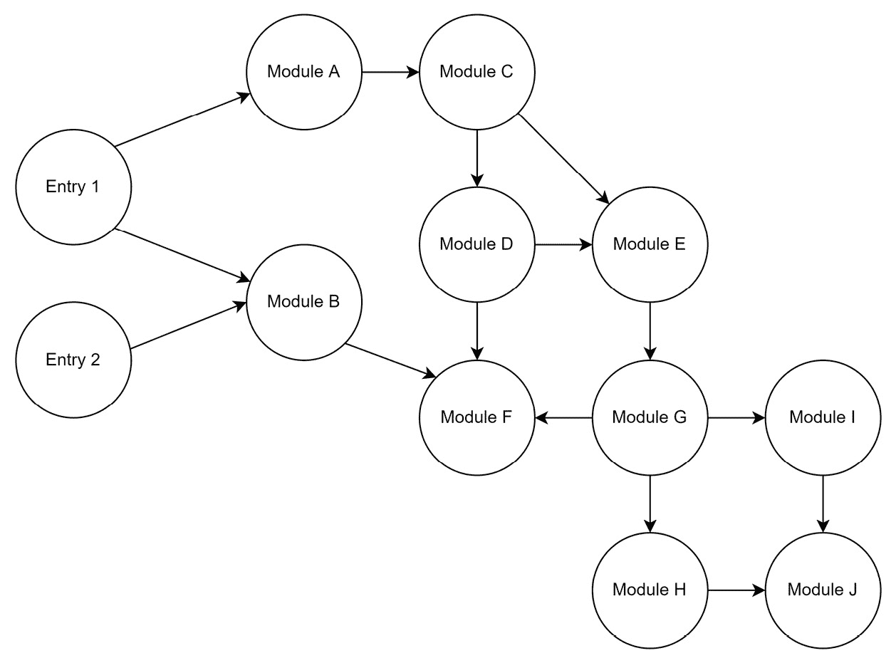
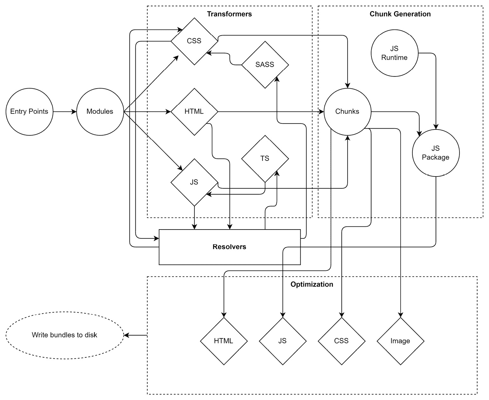
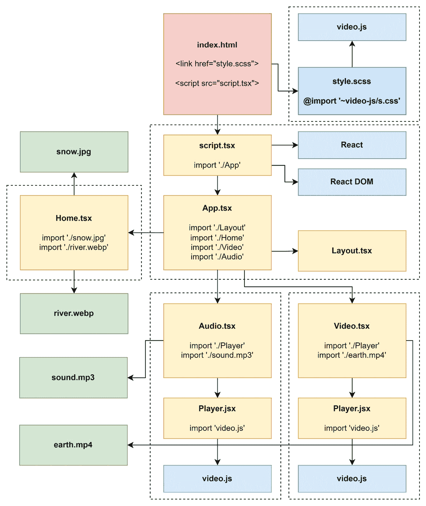

# 使用打包器构建 Web 应用

在上一章中，我们介绍了一组重要的辅助工具——代码检查器和格式化工具。虽然代码质量很重要，但每个项目无疑最重要的方面是客户所交付和使用的内容。这正是需要一种特殊工具的地方——称为打包器——的地方。

打包器是一种理解并处理源代码的工具，以生成可以放置在 Web 服务器上并由 Web 浏览器消费的文件。它考虑 HTML、CSS、JavaScript 和相关文件，使它们更高效和可读。在这个过程中，打包器会合并、拆分、压缩，甚至将代码从一种标准（如 ES2020）转换为另一种标准（如 ES5）。

现在，打包器不再是可选的，而是大多数项目直接或间接必需的。几乎每个 Web 框架都提供基于打包器的工具。通常，挑战在于配置打包器，使其理解我们的代码库并执行我们期望它执行的操作。由于 Web 代码库相当不同，打包器需要在多个方向上保持灵活性。

在本章中，你将建立起对打包器做什么以及如何控制其内部过程的理解。我们还将介绍目前最重要的打包器，并了解它们如何被使用和配置以高效地为我们工作。这将帮助你将你的 Web 项目从原始源代码转换为生产就绪的工件。

本章将涵盖以下关键主题：

+   理解打包器

+   比较可用的打包器

+   使用 Webpack

+   使用 esbuild

+   使用 Parcel

+   使用 Vite

# 技术要求

本章的完整源代码可在[`github.com/PacktPublishing/Modern-Frontend-Development-with-Node.js/tree/main/Chapter06`](https://github.com/PacktPublishing/Modern-Frontend-Development-with-Node.js/tree/main/Chapter06)找到。

本章的 CiA 视频可通过[`bit.ly/3G0NiMX`](https://bit.ly/3G0NiMX)访问。

# 理解打包器

编写现代 Web 应用相当困难。导致这种难度水平的一个原因是需要涉及过程中的各种不同技术。让我们简单提一下：

+   用于编写文档的 HTML

+   使用 CSS 来设计这些文档

+   使用 DOM API 的 JavaScript 以增加一些交互性

+   一个用于创建交互式组件的 JavaScript UI 框架

+   一个用于 CSS 的预处理器，以使用变量、嵌套等更多功能

+   可能使用 TypeScript 或其他一些类型系统来提高某些源代码区域的可靠性

+   需要掌握服务和 Web 工作者

+   所有静态文件都应该易于缓存

在引入能够构建模块图的新工具类别之前，人们使用专门的作业运行器，如**Grunt**或**Gulp**。这些运行器受到了更通用方法（如**Makefiles**）的启发。然而，问题在于需要保持两个方面的同步——构建过程和源代码。仅仅添加一个文件到源代码是不够的；构建过程必须被告知这个新文件。有了打包器，这一切都改变了。

在核心上，打包器是一个利用其他工具的工具。最重要的补充是打包器理解模块图——即代码模块（如我们在前几章讨论的 CommonJS 或 ESM 模块）之间的关系（导入和导出）。它可以构建模块图，并使用它让其他工具（如 Babel）工作。

要开始使用，打包器需要所谓的入口点——通常这些被称为入口。这些文件用作模块图的根。这些文件可能依赖于其他文件，在这种情况下，打包器将继续在这些文件中构建模块图。

*图 6.1* 展示了一个由两个入口点构建的示例模块图。这个图的一个有趣特性是**入口 2**的内容也完全包含在**入口 1**中。在许多情况下，多个入口点的模块图之间不会存在任何显著的重叠：



图 6.1 – 由两个入口点构建的示例模块图

大多数打包器都按阶段工作。虽然每个打包器使用的术语略有不同，但它们几乎总是包含以下高级阶段：

1.  模块解析

1.  模块转换

1.  块和资源生成

1.  应用优化

模块转换通常是必要的。一方面，打包器需要理解模块以找到导入的模块来构建模块图；另一方面，块生成必须依赖于规范化的输入模块。

在转换阶段需要与解析器协同工作，以持续构建模块图，而所有其他阶段基本上是独立的。通常，在开发过程中，优化阶段会被减少或完全禁用。这种减少可以显著加快打包过程。此外，一些在调试过程中非常有帮助的额外指令将被保留。

压缩

最常见的优化之一是压缩。压缩的目标是在不使用主动压缩的情况下使文件尽可能小。虽然表面上看压缩在 JavaScript 这样的语言中相对简单且高效，但其他语言如 CSS 或 HTML 则有点问题。特别是 HTML 的压缩已被证明是一个难题，与 JavaScript 的压缩相比，收益较少。压缩后，文件通常不如之前易读。一个原因是移除了不必要的空白，这些空白是为了给原始代码提供可读性和结构而引入的。

整个打包过程可以用图表来概述。*图 6.2*展示了不同入口如何进入不同的阶段：



图 6.2 – 现代网络打包器的高级阶段

另一个需要考虑的是，块生成通常会引入某种 JavaScript 运行时。这可以轻量到仅仅教会生成的代码如何加载作为脚本文件创建的额外包，但它也可以包括从外部代码加载共享依赖项的完整支持等。引入的代码完全符合打包器的特定要求。

考虑到这一点，让我们看看目前有哪些打包器以及它们是如何进行比较的。

# 比较可用的打包器

打包器有多个代。第一代打包器围绕着一个信念，即 Node.js 应用程序是唯一应该编写的应用程序类型。因此，将这些应用程序转换为在浏览器中工作的 JavaScript 文件一直是那一代打包器的首要关注点。那个类别中最受欢迎的是**Browserify**。

第二代打包器继续将第一代的思想扩展到几乎所有 JavaScript 代码。在这里，甚至 HTML 和 CSS 资源也可以被理解。例如，使用 CSS 中的`@import`规则将模块图扩展到另一个 CSS 模块。重要的是，尽管仍然使用*CommonJS*（或后来，*ESM*）语法来推导 JavaScript 模块图，但这些第二代打包器并不关心 Node.js。它们始终假设代码是为浏览器编写的。然而，相当常见的是，你可以更改目标，并且也可以使用它们打包 Node.js 代码。这个类别中最受欢迎的是**Webpack**，尽管 Webpack 总是试图与时俱进并适应。

第三代打包器引入了改进的用户体验。它们试图找到处理事情的原生或明显的方式，并且通常甚至不需要任何配置。这个类别中最受欢迎的工具是原始的*Parcel*打包器。

当前的第四代打包器都关注性能。它们要么带有专门的运行时，要么位于原生编写的工具之上，这通常优于它们较老的 JavaScript 编写的对应工具。在这里，我们看到像**esbuild**这样的工具或像**Bun**这样的实验性运行时。

最大的问题是：何时使用什么？在六七个流行的打包器和更多可用的情况下，这个问题并不容易回答。当然，如果一个团队已经非常熟悉某个选项，那么在项目中选择它通常是正确的选择。否则，寻找类似的项目，并尝试了解他们选择了哪个打包器——以及原因。在任何其他情况下，你可以使用以下问题目录来识别哪个打包器可能是最佳选择：

+   涉及到哪些类型的资产？如果只涉及 JavaScript，那么 Webpack 可能是个不错的选择。如果你有多个需要处理的 HTML 页面，那么**Vite**可能是个很好的选择。

+   你使用了多少依赖项？尤其是在你使用 npm 中的较老库时，一个支持范围广泛的打包器——例如 Webpack——可能是最佳选择。否则，寻找更快的选项，如 esbuild。

+   团队对打包器和它们的选项熟悉到什么程度？如果团队对打包一无所知，那么 Parcel 可能是一个很好的入门方式。否则，Webpack 可能拥有最多的文档。在 Vite 中可以找到一个相对较新但非常活跃且乐于助人的社区。

+   你是在构建一个应用程序还是只想优化库的资产？特别是对于库，一些更小的工具，如 esbuild，可能很有用。另一方面，Parcel 在这里也有很多可提供的东西。总的来说，对于库，应避免使用 Vite。虽然支持存在，但它似乎还没有准备好比 Rollup.js 和 esbuild 更有效地构建库。

+   你是否需要支持高级场景，如离线模式或 web workers？在这些情况下，Webpack 的生态系统通常很难被超越。Parcel 在这方面也做得很好，提供了许多辅助工具。对于此类场景，应避免使用 esbuild。

+   性能有多重要？如果你有一个较大的代码库（超过 1,000 个模块或 10 万行代码），那么 Webpack 已知是一个性能杀手，可能需要 30 秒到几分钟。选择像 Vite 或如果可能的话 esbuild 将肯定有助于加快过程。虽然前者对开发者更友好，但它也带来了很多隐藏的复杂性。后者更直接，但缺乏标准功能，如**热模块****重新加载**（**HMR**）。

+   多少维护是可以接受的？依赖于大量插件的打包器传统上维护起来要困难得多。升级 Webpack 到下一个主要版本一直是出了名的困难。从缺少插件到插件 API 的破坏性更改——所有可能发生的情况在这种情况下都会发生。更倾向于使用如 Parcel 或 Vite 这样的打包器，这些打包器试图提供所有必要的功能。

+   额外的开发功能（如打包洞察）有多重要？如果这些是至关重要的，那么没有什么比 Webpack 更好的了。由于 Webpack 生态系统非常大，你可以轻松找到额外的工具、库和指南。另一方面，选择一个拥有成长社区的选项，如 Vite，也可能工作得很好。如果缺少某些功能，社区也应该能够快速拾起它们。

在接下来的章节中，我们将通过一个示例项目来了解如何使用一些最受欢迎的打包器来构建它。我们将使用一个代码库较小但非平凡的示例项目。对于这个例子，我们将使用 **React**——但请放心，您不需要了解 React 就能跟随这一章节。

React

不可否认，React 是用于网络前端开发的最受欢迎的 UI 库。它允许开发者通过利用名为 `Button` 或 `Carousel` 的语言扩展，在 JavaScript 中快速构建 UI。

我们将要覆盖的示例项目的代码库包括以下内容：

+   **单页应用**（SPA）的源代码（**SPA**）

+   SPA 的 `index.html`

+   几个资产文件（视频、不同格式的图片、音频）

+   几个非平凡依赖项

+   一些使用 TypeScript 而不是 JavaScript 的文件

+   一个名为 **SASS** 的特殊 **CSS** 预处理器

+   正在使用一个网络框架（React 与 React Router）

+   不同的虚拟路由应引导到需要懒加载的不同页面部分

总的来说，这个示例应该生成一个包含视频和音频播放器的小型演示应用程序，该播放器使用第三方依赖项。

懒加载

懒加载描述了一种技术，其中并非所有应用程序所需的部分都会立即加载。对于一个 SPA 来说，这很有意义——毕竟，并非每个组件或 SPA 的部分都会在当前用户交互中需要。即使它不是必需的，它也可能在某个未来的时间点需要。懒加载通常涉及在执行某些操作（例如用户点击按钮或跟随某些内部链接）时加载额外的脚本（或其他）文件。懒加载的实现需要得到相应的 UI 框架的支持（例如，React 有一个名为 `lazy` 的函数），但由打包器完成。

可以通过初始化一个新的 Node.js 项目来创建这个示例的模板：

```js
$ npm init -y
```

现在，我们将添加所有运行时依赖项——也就是说，当我们的应用程序在浏览器中运行时所需的包：

```js
$ npm i react react-dom react-router-dom video.js --save
```

最后，将添加前面的依赖项到可以在浏览器中运行的脚本中将是打包器的任务。然而，对我们来说，这样做以清楚地了解哪些包只是用于工具的，哪些依赖项是代码运行所需的，是有意义的。

基本的`devDependencies`——即那些用于工具的依赖项——如下所示：

```js
$ npm i typescript sass @types/react @types/react-dom --save-dev
```

还需要额外的工具依赖项，但这些将取决于打包器。

示例应用程序包含以下源文件：

+   `index.html`：SPA 网站的模板

+   `script.tsx`：开始运行应用程序

+   `App.tsx`：应用程序根

+   `Layout.tsx`：应用程序的布局

+   `Home.tsx`：包含指向所有页面的主页

+   `Video.tsx`：包含视频播放器的页面

+   `Audio.tsx`：包含音频播放器的页面

+   `Player.jsx`：视频和音频播放器的 React 组件

+   `earth.mp4`：要播放的视频文件

+   `river.webp`：视频文件的预览图片（`.webp`格式）

+   `snow.jpg`：音频文件的预览图片（`.jpg`格式）

+   `sound.mp3`：要播放的音频文件

显示 UI 的过程通常被称为渲染。当 React 首次渲染应用程序时，它需要在 DOM 树中挂载其组件树。这是在`script.tsx`文件中完成的：

script.tsx

```js
import * as React from 'react';
import { createRoot } from 'react-dom/client';
import './style.scss';
import App from './App';
const root = createRoot(document.querySelector('#app')!);
root.render(<App />);
```

使用尖括号来启动`App`的过程被称为 JSX。在底层，文件扩展名中的额外`x`（`tsx`）使得这些表达式可以被处理，其中`<App />`将被转换为`React.createElement(App)`。

`App`组件本身定义如下：

App.tsx

```js
import * as React from "react";
import { BrowserRouter, Route, Routes } from
  "react-router-dom";
import Layout from "./Layout";
const Home = React.lazy(() => import("./Home"));
const Video = React.lazy(() => import("./Video"));
const Audio = React.lazy(() => import("./Audio"));
const App = () => (
  <BrowserRouter>
    <Routes>
      <Route path="/" element={<Layout />}>
        <Route index element={<Home />} />
        <Route path="video" element={<Video />} />
        <Route path="audio" element={<Audio />} />
      </Route>
    </Routes>
  </BrowserRouter>
);
export default App;
```

这种结构对于 SPA 来说是典型的。所有不同的路由都会在路由器或根组件中汇集，以便在找到特定路径时显示。例如，在我们的应用程序中，`/video`路径将显示`Video`组件，而`/audio`路径将显示`Audio`组件。所有这些组件都将嵌入到`Layout`组件中，该组件负责应用程序的一般布局，例如显示页眉和页脚。

在`App.tsx`文件中，通过使用 ESM `import`函数启动懒加载。打包器应该能够将其转换为加载另一个脚本并在该位置返回一个`Promise`。

Promises

规范描述了一个返回`Promise`的`import`函数。`Promise`是一个可以用来确定异步操作何时完成的对象。该对象公开了函数，这些函数可以用来处理异步操作的结果或操作过程中抛出的错误。最重要的函数是`then`和`catch`。前者可以用来定义当成功返回时应该做什么，而后者可以用来处理错误。

在单页应用（SPA）中，将每个页面放入路由器中进行懒加载是有意义的。*图 6**.3* 展示了示例应用程序模块的高级概述。虚线框表示捆绑区域——即可以组合成输出文件的源文件。这种捆绑是任何打包器最重要的方面之一：



图 6.3 – 示例应用程序的模块

虽然一些给定的方面在打包器中实现起来可能相当简单，但示例应用程序的一些其他属性可能具有挑战性。例如，当找到重复模块时，打包器的行为是什么？一些打包器可能会重复生成的代码，而其他打包器可能会创建一个共享捆绑包，它是生成侧捆绑包的加载前提。

在这个示例中，我们可以看到 `Player.jsx` 出现了两次。我们将利用这一点来回答每个打包器的问题。此外，几乎每个模块都需要 `react`；然而，由于它已经在初始脚本模块（`script.tsx`）中要求，因此不应重复。

不再拖延，让我们看看这个示例应用程序如何使用 Webpack 进行捆绑。

# 使用 Webpack

Webpack 可能是所有打包器中最受欢迎的选项之一。它也是最早的打包器之一——追溯到 Node.js 仍很年轻，捆绑整个想法相当新颖的时代。当时，任务运行器仍然占主导地位。然而，前端开发的日益复杂为更复杂的工具打开了大门。

使 Webpack 突出的是其生态系统。从一开始，Webpack 决定只开发一个非常浅的核心，专注于模块解析。在某种程度上，Webpack 只是一个将所有这些插件组合在一起并具有固定执行计划的包装器。它基本上将用户抛入的配置与所有选定的插件的力量结合起来。

今天，Webpack 也可以在没有插件或配置的情况下工作。至少在理论上是这样。在实践中，任何超出一些简单示例的项目都需要一些配置。此外，支持 TypeScript 等其他语言等有趣的功能将需要插件。

要开始使用 Webpack，我们需要使用 npm 安装 `webpack` 和 `webpack-cli` 包：

```js
$ npm install webpack webpack-cli --save-dev
```

如果我们只想以编程方式使用 Webpack，例如从一个 Node.js 脚本中，那么我们也可以省去 `webpack-cli` 包的安装。

要从命令行运行 Webpack，你可以使用 `npx` 与 `webpack` 可执行文件一起：

```js
$ npx webpack
```

这样直接运行 Webpack 不会成功：

```js
assets by status 0 bytes [cached] 1 asset

WARNING in configuration

The 'mode' option has not been set, webpack will fallback to 'production' for this value.

Set 'mode' option to 'development' or 'production' to enable defaults for each environment.

You can also set it to 'none' to disable any default behavior. Learn more: https://webpack.js.org/configuration/mode/

ERROR in main

Module not found: Error: Can't resolve './src' in '/home/node/examples/Chapter06/example01'

[...]

webpack 5.74.0 compiled with 1 error and 1 warning in 116 ms
```

修复关于 `mode` 的警告相当简单——我们只需要提供一个 CLI 标志，例如 `--mode production`。更成问题的是，Webpack 找不到任何入口点。

如前所述，Webpack 可能会直接工作，但通常我们被迫创建一个配置文件。Webpack 使用真实的 Node.js 模块来提供配置，这为我们提供了 Node.js 生态系统的全部功能。Webpack 配置称为 `webpack.config.js`，应放置在 `package.json` 文件旁边。

让我们创建一个相当轻量级的配置。突出显示的属性是 Webpack 基本配置部分之一，告诉打包器使用哪些入口点：

webpack.config.js

```js
module.exports = {
  entry: {
    app: "./src/script.tsx",
  },
};
```

现在，我们可以再次尝试运行 Webpack：

```js
$ npx webpack --mode production

assets by status 360 bytes [cached] 1 asset

./src/script.tsx 185 bytes [built] [code generated] [1 error]

ERROR in ./src/script.tsx 5:54

Module parse failed: Unexpected token (5:54)

You may need an appropriate loader to handle this file type, currently no loaders are configured to process this file. See https://webpack.js.org/concepts#loaders

| import App from './App';

|

> const root = createRoot(document.querySelector('#app')!);

| root.render(<App />);

|

webpack 5.74.0 compiled with 1 error in 145 ms
```

这样更好，但我们还没有达到目标。Webpack 需要一个插件来理解特殊文件，例如 TypeScript 或 SASS 源文件。因此，我们还需要安装这些开发依赖项。在这种情况下，我们需要相当多的插件来使一切正常工作：

+   `ts-loader` 是一个插件，用于通过将其转换为 JavaScript 来处理 TypeScript 文件

+   `sass-loader` 是一个插件，用于通过将其转换为 CSS 来处理 SASS 文件

+   `css-loader` 是一个插件，用于通过将其转换为文本模块来处理 CSS

+   `style-loader` 是一个插件，用于通过将其转换为 JavaScript 模块来处理 CSS

+   `babel-loader` 是一个插件，用于使用 Babel 将具有附加语法（如 JSX）的 JavaScript 文件转换为纯 JS

+   `html-webpack-plugin` 是一个插件，用于将 HTML 文件作为输出 HTML 文件的模板加载

Webpack 的一个重大缺点是最终一切都必须是 JavaScript 模块。相当常见的是，插件会玩一些技巧来最终得到空模块，但它们仍然会将结果（如单独的图像或 CSS 文件）输出到文件系统。

您可以从命令行安装剩余的依赖项：

```js
$ npm i ts-loader sass-loader css-loader style-loader babel-loader @babel/core @babel/preset-env @babel/preset-react html-webpack-plugin --save-dev
```

我们还需要提供适当的 `tsconfig.json` 文件。没有这个文件，TypeScript 将无法正确配置。Webpack 的 `ts-loader` 插件与 TypeScript 工作得相当紧密，因此它需要这个文件来知道要考虑哪些文件以及要丢弃哪些文件。它还使用这个文件来正确转换文件：

tsconfig.json

```js
{
  "compilerOptions": {
    "jsx": "react",
    "module": "ESNext"
  },
  "include": ["./src"],
  "exclude": ["./node_modules"]
}
```

在此配置中，TypeScript 已经设置为以默认的 React 方式（即，将 JSX 转换为 `React.createElement` 调用）处理 JSX。配置还将输出 ESM 模块语法（突出显示的选项），这对于 Webpack 正确识别导入和导出非常重要。如果没有这个，从 TypeScript 文件触发时，捆绑拆分将无法工作。最后，我们将 `src` 文件夹中的所有文件包含在内，并排除 `node_modules` 文件夹。后者是一种常见的做法，可以节省大量的处理时间。

现在，为了使所有这些功能协同工作，我们需要相当扩展 Webpack 配置。首先，我们需要导入（即 `require`）我们希望使用的所有插件。在这种情况下，我们只想使用 `html-webpack-plugin`。接下来，我们需要设置所有需要包含的加载器的规则。这是通过 `module.rules` 数组完成的。最后，我们需要定义对剩余资源的处理方式。

让我们看看如何编写 Webpack 配置以成功打包我们的示例：

webpack.config.js

```js
const HtmlWebpackPlugin = require("html-webpack-plugin");
const babelLoader = { // make the config reusable
  loader: "babel-loader", // name of the loader
  options: { // the specific Babel options
    presets: ["@babel/preset-env", "@babel/preset-react"],
  },
};
const tsLoader = {
  loader: "ts-loader", // name of the loader
  options: { // the specific TypeScript loader options
    transpileOnly: true,
  },
};
module.exports = {
  entry: { // defines the entry points
    app: "./src/script.tsx", // named ("app") entry point
  },
  resolve: {
    // defines what extensions to try out for resolving
    extensions: [".ts", ".tsx", ".js", ".jsx", ".json"],
  },
  module: {
    // defines the rules for transforming modules
    rules: [
      { // applied for all *.scss files
        test: /\.scss$/i,
        use: ["style-loader", "css-loader", "sass-loader"],
      },
      { // applied for all *.css files
        test: /\.css$/i,
        use: ["style-loader", "css-loader"],
      },
      { // applied for all *.js and *.jsx files
        test: /\.jsx?$/i,
        use: [babelLoader],
        exclude: /node_modules/,
      },
      { // applied for all *.ts and *.tsx files
        test: /\.tsx?$/i,
        use: [babelLoader, tsLoader],
      },
      { // applied for anything other than *.js, *.jsx, ...
        exclude: [/^$/, /\.(js|jsx|ts|tsx)$/i, /\.s?css$/i,
          /\.html$/i, /\.json$/i],
        type: "asset/resource",
      },
    ],
  },
  // defines plugins to use for extending Webpack
  plugins: [
    new HtmlWebpackPlugin({
      template: "./src/index.html",
    }),
  ],
};
```

前面的代码相当长。Webpack 经常被听到的一个批评是，其配置很快就会变得相当复杂。

Webpack 配置的一个重要部分是使用正则表达式。规则中的 `test` 和 `exclude` 部分与正则表达式配合使用效果最佳。因此，而不是使用具有一些魔法行为或非常明确且重复的函数的字符串，我们提供了一个正则表达式，该表达式将检查当前模块是否应该由此规则处理。

每个加载器或插件的选项由相应的加载器或插件确定。因此，仅了解 Webpack 并不足以成功编写 Webpack 配置。你总是需要查阅配置中使用的不同部分的文档。在前面的配置中，`ts-loader` 和 `babel-loader` 配置就是这样处理的。

加载器是从右到左进行评估的。例如，在处理 `*.scss` 文件的情况下，内容首先由 `sass-loader` 转换，然后传递给 `css-loader`。最后，所有内容都通过 `style-loader` 打包成一个 `style` 标签。

我们并不总是需要为加载器使用专门的包。使用前面代码中突出显示的 `type` 属性，我们可以使用 Webpack 的一些预制加载器，例如资源加载器 (`asset/resource`) 来返回引用文件的路径。其他选项包括数据 URI (`asset/inline`) 和访问文件的原始内容 (`asset/source`)。

另一种使用 Webpack 的方法是，在开发过程中启动一个小型服务器。每当我们对代码进行更新时，打包器可以重新处理更改的部分，并自动更新任何活跃的浏览会话。总的来说，这是一种非常方便且相当高效的方式来编写前端应用程序。

为了使 Webpack 的实时服务器工作，我们还需要安装另一个工具依赖项：

```js
$ npm install webpack-dev-server --save-dev
```

这允许我们运行 `serve` 命令：

```js
$ npx webpack serve --mode development

<i> [webpack-dev-server] Project is running at:

<i> [webpack-dev-server] Loopback: http://localhost:8081/

<i> [webpack-dev-server] On Your Network (IPv4): http://172.25.98.248:8081/

<i> [webpack-dev-server] Content not from webpack is served from '/home/node/examples/Chapter06/example01/public' directory

[...]

webpack 5.74.0 compiled successfully in 1911 ms
```

实时服务器将持续运行，直到被强制关闭。在命令行中，可以通过按 *Ctrl* + *C* 来完成。

在 `webpack.config.js` 中需要添加的一项是开发服务器（Webpack 配置中的 `devServer` 部分）的历史 API 回退。这将显著提高单页应用程序（SPA）的开发体验：

```js
// ... like beforehand
module.exports = {
  // ... like beforehand
  devServer: {
    historyApiFallback: true,
  },
};
```

此设置将响应所有 404 URL，使用根目录的`index.html` – 就像生产模式中应该配置的单页应用（SPA）一样。这样，在非`/`路径的页面上刷新时仍然可以工作。如果没有显示的配置，浏览器将显示 404 错误 – 没有 SPA 将加载和处理路由。

现在我们已经知道了在 Webpack 中捆绑示例应用程序的工作方式，是时候看看一个更轻量级的替代品 esbuild 了。

# 使用 esbuild

esbuild 是一个相当新的工具，专注于性能。esbuild 增强性能的关键在于它从头到尾是用 Go 编程语言编写的。结果是具有某些优势的原生二进制文件，这些优势超过了纯 JavaScript 解决方案。

如果 esbuild 只提供原生解决方案，它可能不足以进入这个列表。毕竟，灵活性和扩展原始功能的选择对于任何类型的捆绑器都是关键。幸运的是，esbuild 的创造者已经考虑了这一点，并提出了一种优雅的解决方案。虽然 esbuild 的核心仍然是原生的 – 即，用 Go 编写并提供为二进制文件 – 插件可以用 JavaScript 编写。这样，我们就得到了两者的最佳结合。

要开始使用 esbuild，我们需要使用 npm 安装`esbuild`包：

```js
$ npm install esbuild --save-dev
```

通过这次安装，你可以以编程方式使用 esbuild，也可以直接从命令行使用。

要从命令行运行 esbuild，你可以使用`npx`与`esbuild`可执行文件一起使用：

```js
$ npx esbuild
```

这将显示所有 CLI 选项。要执行某些操作，至少需要提供一个入口点：

```js
$ npx esbuild --bundle src/script.tsx --outdir=dist --minify

 [ERROR] No loader is configured for ".scss" files: src/style.scss

    src/script.tsx:3:7:

      3 │ import './style.scss';

                ~~~~~~~~~~~~~~

 [ERROR] No loader is configured for ".mp3" files: src/sound.mp3

    src/Audio.tsx:4:22:

      4 │ import audioPath from "./sound.mp3";

                               ~~~~~~~~~~~~~

[...]

5 errors
```

如预期的那样，我们缺少一些配置步骤。与 Webpack 一样，最好的方法是通过创建配置来教 esbuild 关于这些额外信息。与 Webpack 不同，我们没有预定义的配置文件 – 相反，配置 esbuild 的方式是通过编程方式使用它。

要做到这一点，我们必须创建一个名为`build.js`的新文件，并导入`esbuild`包。我们可以使用`build`和`buildSync`函数通过 esbuild 触发捆绑过程。

之前的 CLI 命令可以像这样以编程方式编写：

build.js

```js
const { build } = require("esbuild");
build({ // provide options to trigger esbuild's build
  entryPoints: ["./src/script.tsx"], // where to start from
  outdir: "./dist", // where to write the output to
  bundle: true, // bundle the resulting files
  minify: true, // turn on minification
});
```

当然，给定的脚本本质上会给我们带来与直接使用 CLI 相同的错误。因此，让我们添加一些东西：

+   `esbuild-sass-plugin`将 SASS 转换为 CSS 文件

+   `@craftamap/esbuild-plugin-html`允许我们使用模板 HTML 文件

在我们可以使用这两个插件之前，我们需要安装它们：

```js
$ npm i esbuild-sass-plugin @craftamap/esbuild-plugin-html ––save-dev
```

一旦安装了插件，我们就可以扩展`build.js`文件，使其包含这两个插件：

build.js

```js
const { build } = require("esbuild");
const { sassPlugin } = require("esbuild-sass-plugin");
const { htmlPlugin } = require("@craftamap/esbuild-plugin-
  html");
build({
  entryPoints: ["./src/script.tsx"],
  outdir: "./dist",
  format: "esm", // use modern esm format for output
  bundle: true,
  minify: true,
  metafile: true, // required for htmlPlugin
  splitting: true, // allow lazy loading
  loader: {
    ".jpg": "file",
    ".webp": "file",
    ".mp3": "file",
    ".mp4": "file",
  },
  plugins: [
    sassPlugin(),
    htmlPlugin({
      files: [
        {
          entryPoints: ["./src/script.tsx"],
          filename: "index.html",
          scriptLoading: "module", // because of esm
          htmlTemplate: "./src/index.html",
        },
      ],
    }),
  ],
});
```

在此过程中，我们教 esbuild 关于我们对于给定文件扩展名的偏好。通过`loader`部分，我们将扩展名映射到特定的文件加载器。`file`类型指的是将生成外部文件的加载器。该文件的导入将导致对文件相对输出路径的引用。

要启用包分割，需要设置`splitting`选项。这也使得使用`esm`格式成为必要。这是 esbuild 知道如何生成可以懒加载内容的脚本的唯一格式。此外，`htmlPlugin`需要 esbuild 生成一个元文件来反映构建工件。因此，需要将`metafile`选项设置为`true`。

与 Webpack 一样，esbuild 的生态系统使得这个工具如此灵活，但难以掌握。不同插件的选择需要从不同的插件文档中收集。就像之前的 Webpack 生态系统一样，这些插件的质量、成熟度以及背后的社区差异很大。

如果你想要一个开发服务器——就像我们在上一节中添加到 Webpack 中的那样——你可以使用`serve`函数，该函数可以从`esbuild`导入。第一个参数描述了服务器特定的设置，例如服务应监听的端口。第二个参数包含构建选项——即我们现在提供的选项——作为`build`函数的唯一参数。

让我们再写一个名为`serve.js`的脚本来说明这种用法：

serve.js

```js
const { serve } = require("esbuild");
const { sassPlugin } = require("esbuild-sass-plugin");
const { htmlPlugin } = require("@craftamap/esbuild-plugin-
  html");
// use helper from esbuild to open a dev server
serve(
  {
    // will be reachable at http://localhost:1234
    port: 1234,
  },
  {
    // same options as beforehand (supplied to build())
    // ...
  }
);
```

目前 esbuild 不做的一件事是 HMR。因此，与类似工具相比，仅使用 esbuild 的开发者体验可能在这方面略感不足。

考虑到这一点，让我们再探索一个广泛用于打包的选项——让我们来看看无需配置的 Parcel 打包器。

# 使用 Parcel

当包裹到达社区时，围绕它的炒作非常巨大。这其中的原因在于一个新特性：无需配置的打包。Parcel 试图利用`package.json`中已经提供的信息——或者为特定工具（如 Babel）编写的配置文件。通过这种机制，Parcel 的创造者认为可以消除配置打包器的复杂性。

然而，最终，整个方面在某些意义上适得其反。如前所述，打包器需要一些灵活性。为了实现这种灵活性，需要一个健全的配置系统。虽然 Webpack 的配置系统有点过于冗长和复杂，但 esbuild 提供的可能又有点过于底层。

原始 Parcel 的继任者现在也提供了一种可选的配置系统，它试图在 Webpack 的冗长和复杂性与 esbuild 的低级之间取得平衡。这使得 Parcel 不再是无需配置的，而是一个无需配置的打包器。

要开始使用 Parcel，我们需要使用 npm 安装`parcel`包：

```js
$ npm install parcel ––save-dev
```

通过这次安装，你可以以编程方式使用 Parcel，也可以直接从命令行使用。

要从命令行运行 Parcel，你可以使用`npx`与`parcel`可执行文件一起。对于 Parcel，入口点可以是 HTML 文件：

```js
$ npx parcel src/index.html
```

在我们的情况下，我们仍然需要修改 HTML，使其也指向其他源文件以继续构建模块图。一个与 Parcel 更为契合的 `index.html` 文件版本如下所示：

index.html

```js
<!DOCTYPE html>
<html lang="en">
<head>
    <meta charset="UTF-8">
    <meta http-equiv="X-UA-Compatible" content="IE=edge">
    <meta name="viewport" content="width=device-width,
      initial-scale=1.0">
    <title>Bundler Example</title>
    <link rel="stylesheet" href="./style.scss">
</head>
<body>
<div id="app"></div>
<script type="module" src="img/script.tsx"></script>
</body>
</html>
```

重要的是，我们添加了样式表和脚本入口点。这些将被 Parcel 检测并正确打包。最终，HTML 文件将被用作模板——入口点将被打包的样式表和脚本文件引用所替换。

立即启动 Parcel 将部分工作，但在此阶段，Parcel 仍然与我们的音频和视频文件存在一些问题。虽然 Parcel 已经知道大多数图像文件（如 `*.webp` 或 `*.png`），但一些其他资产需要先进行配置。在 Parcel 中，这意味着创建一个 `.parcelrc` 文件并添加一个关于要使用的转换器的部分：

.parcelrc

```js
{
  "extends": "@parcel/config-default",
  "transformers": {
    "*.{mp3,mp4}": ["@parcel/transformer-raw"]
  }
}
```

配置指示 Parcel 仍然依赖于非常精心选择的默认设置。然而，我们也在处理转换逻辑的部分添加了有关两种文件类型的定义。与 Webpack 或 esbuild 一样，Parcel 也内置了一个类型来处理此类导入，通过返回可以在代码中使用的文件名。在 Parcel 的情况下，这个类型被称为 `@parcel/transformer-raw`。

现在，让我们看看 Parcel 是否已经启动：

```js
$ npx parcel src/index.html

Server running at http://localhost:1234

 Built in 12ms
```

默认情况下，Parcel 将启动一个开发服务器。这已经包含了开发应用程序所需的一切。非常方便。如果我们想构建文件——例如，将输出工件放置在服务器上——我们可以使用 `build` 子命令：

```js
$ npx parcel build src/index.html

 Built in 6.11s

dist/index.html                  402 B    4.73s

dist/index.3429125f.css       39.02 KB    149ms

dist/index.cb13c36e.js       156.34 KB    1.90s

dist/Home.bf847a6b.js          1.05 KB    148ms

dist/river.813c1909.webp      29.61 KB    150ms

dist/snow.390b5a72.jpg        13.28 KB    138ms

dist/Video.987eca2d.js           908 B    1.90s

dist/earth.4475c69d.mp4       1.5 MB     61ms

dist/Video.61df35c5.js       611.76 KB    4.62s

dist/Audio.677f10c0.js           908 B    149ms

dist/sound.6bdd55a4.mp3      746.27 KB     92ms
```

有 CLI 标志和选项可以设置几乎一切，例如输出目录。然而，默认情况下，相当常见的 `dist` 文件夹被选中。

最后，但同样重要的是，让我们来看看相当流行的 Vite 打包器，它试图将所有先前方法的优点结合成一个单一的工具。

# 使用 Vite

在流行的打包器集中，最新加入的是 Vite。它结合了几种现有的工具——例如 Rollup.js 和 esbuild——以及一个统一的插件系统，以允许快速开发。Vite 的方法是在 esbuild 的速度下提供 Webpack 的功能。

最初，Vite 是由前端框架 Vue 的创建者构建的。然而，随着时间的推移，Vite 的插件系统变得更为强大。随着其 API 表面的增加，其他前端框架如 React 或 Svelte 也可以得到支持。现在，Vite 已经从单一用途的工具发展成为一个真正的瑞士军刀——这要归功于一个精心设计的插件机制和活跃的社区。

要开始使用 Vite，我们需要使用 npm 安装 `vite` 包：

```js
$ npm install vite --save-dev
```

通过这次安装，你可以以编程方式使用 Vite，也可以直接从命令行使用。

关于 Vite，有一件事需要知道的是，它比 Parcel 更加强调使用 `index.html` 文件作为入口点。为了使 Vite 正常工作，我们需要将 `index.html` 文件从 `src` 文件夹移动到父目录——即项目的根目录。

正如我们之前所做的那样，我们应该正确设置引用：

index.html

```js
<!DOCTYPE html>
<html lang="en">
<head>
    <meta charset="UTF-8">
    <meta http-equiv="X-UA-Compatible" content="IE=edge">
    <meta name="viewport" content="width=device-width,
      initial-scale=1.0">
    <title>Bundler Example</title>
    <link rel="stylesheet" href="./src/style.scss">
</head>
<body>
<div id="app"></div>
<script type="module" src="img/script.tsx"></script>
</body>
</html>
```

要从命令行运行 Vite，你可以使用 `npx` 与 `vite` 可执行文件一起：

```js
$ npx vite

  VITE v3.0.5  ready in 104 ms

    Local:   http://localhost:5173/

    Network: use --host to expose
```

这一切开始得很快，因为目前还没有进行任何打包或转换。只有当我们访问服务器时，Vite 才会开始转换事物——而且仅仅是当前我们正在查看的事物。如果你对更真实的情况感兴趣，那么 `preview` 子命令可能很有用。它执行生产构建，但通过开发服务器暴露结果。

当然，就像 Parcel 一样，我们仍然可以生成可以放置在服务器上的文件。与 Parcel 非常相似，我们可以使用 `build` 子命令来完成这项工作：

```js
$ npx vite build

vite v3.0.5 building for production...

 110 modules transformed.

dist/assets/river.4a5afeaf.webp   29.61 KiB

dist/assets/snow.cbc8141d.jpg     13.96 KiB

dist/assets/sound.fa282025.mp3    746.27 KiB

dist/assets/earth.71944d74.mp4    1533.23 KiB

dist/index.html                   0.42 KiB

dist/assets/Home.82897af9.js      0.45 KiB / gzip: 0.23 KiB

dist/assets/Video.ce9d6500.js     0.36 KiB / gzip: 0.26 KiB

[...]

dist/assets/index.404f5c02.js     151.37 KiB / gzip: 49.28 KiB

dist/assets/Player.c1f283e6.js    585.26 KiB / gzip: 166.45 KiB
```

对于这个例子，Vite 是唯一一个只需满足所有先决条件就能正常工作的打包器——至少一开始是这样的。如果你需要自定义配置，例如添加一些插件，那么你可以遵循 Webpack 的方法，在项目的根目录中创建一个 `vite.config.js` 文件。

现在，让我们回顾一下你在本章中学到的内容。

# 摘要

在本章中，你学习了什么是打包器，为什么你需要它，有哪些打包器，以及如何配置和使用它们。你现在能够将你的网络项目从原始源代码构建成生产就绪的资产。

如果你具备关于打包器的详细知识，你可以创建非常可靠的代码库，这些代码库针对效率进行了定制。不仅打包时会移除不必要的代码，而且所有引用的文件都将被处理并考虑在内。因此，你永远不必担心遗漏文件。

现有的打包器种类繁多，一开始可能会让人感到畏惧。虽然有一些明显的选择，比如非常流行的 Webpack 打包器，但根据你手头的项目，其他选项可能由于更少的复杂性或更好的性能而更好。如果有疑问，你可以参考本章的 *比较可用的打包器* 部分以确定哪个打包器可能最适合你。

在下一章中，我们将更深入地探讨另一类至关重要的开发工具。我们将看到测试工具如何让我们对我们的代码在现在和未来都能按预期工作充满信心。
