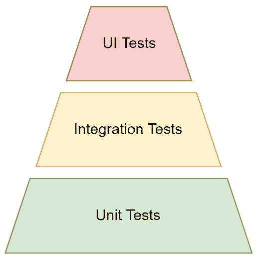
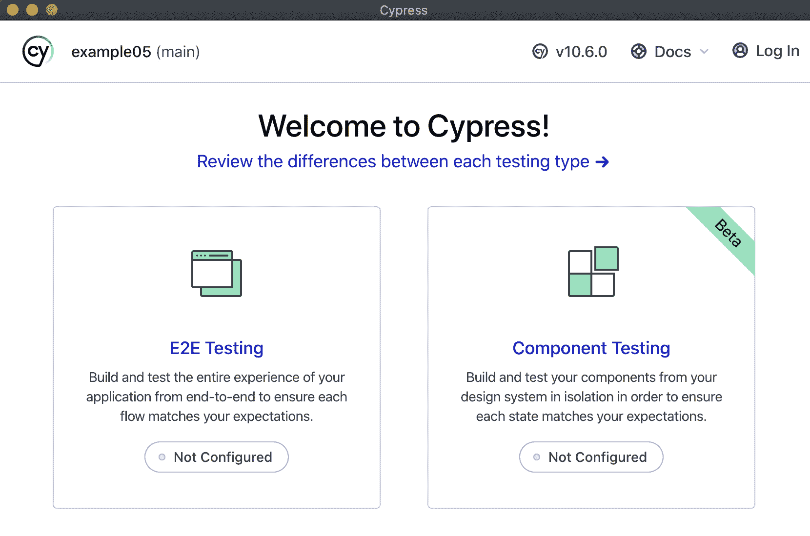
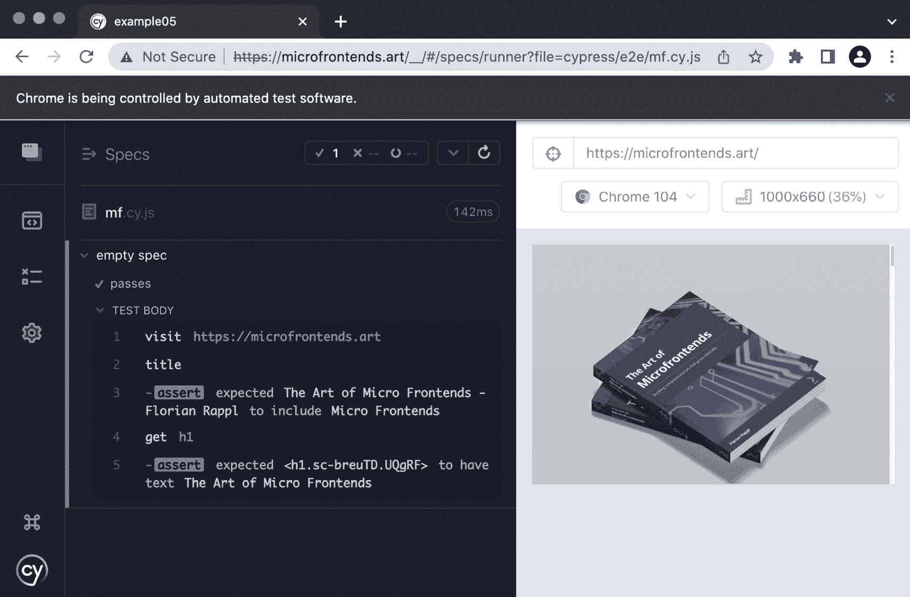

# 使用测试工具提高可靠性

现在我们能够高效地编写和构建浏览器代码，因此考虑验证代码的输出也是有意义的。它真的满足了给定的要求吗？在预期结果方面有什么变化吗？当传入意外值时，代码会崩溃吗？

为了回答这些问题，我们需要进行测试。测试可以意味着很多不同的事情——而且根据您询问的人不同，您将得到不同的“我们应该测试什么？”问题的答案。在本章中，我们将探讨作为开发者感兴趣的不同选项。我们将了解存在哪些工具可以自动化这些测试，以及我们如何实际设置和使用它们。

我们将开始我们的测试之旅，首先讨论备受喜爱的测试金字塔。然后，我们将继续学习关于测试工具的类型——最值得注意的是，纯运行器和完整框架。最后，我们将介绍这个领域的一些最受欢迎的工具。

到本章结束时，您将了解针对您的编程需求应选择哪种测试框架或测试运行器，以及每个选项的优缺点。

本章我们将涵盖以下关键主题：

+   考虑到测试金字塔

+   比较测试运行器和框架

+   使用 Jest 框架

+   使用 Mocha 框架

+   使用 AVA 测试运行器

+   使用 Playwright 进行视觉测试

+   使用 Cypress 进行端到端测试

# 技术要求

本章的完整源代码可在[`github.com/PacktPublishing/Modern-Frontend-Development-with-Node.js/tree/main/Chapter07`](https://github.com/PacktPublishing/Modern-Frontend-Development-with-Node.js/tree/main/Chapter07)找到。

本章的 CiA 视频可在[`bit.ly/3DW9yoV`](https://bit.ly/3DW9yoV)访问。

# 考虑到测试金字塔

近年来，越来越多的软件测试类型被识别并添加到软件项目和测试专业人员（如质量保证工程师）的标准工具库中。一个强大的工具，可以分类和排序最常见的软件测试类型，就是测试金字塔。

测试金字塔根据测试的可见性和努力程度来安排不同的测试类型。金字塔的较高层需要更多的努力，但具有更高的可见性。应该更多地编写位于金字塔较低层的测试——毕竟，这些是金字塔的基础。

*图 7.1*展示了测试金字塔的示意图。测试金字塔的基础是由单元测试构成的，它们提供了足够的可靠性，可以在其上运行组件和集成测试。最后，可以运行 UI 测试（通常被称为端到端测试），以验证解决方案是否适用于最终用户：



图 7.1 – 具有三个自动测试层的测试金字塔

通常，端到端测试指的是使用面向最终用户的接口进行的测试。在 Web 应用程序的情况下，这将是指实际的网站。由于它们的本质，端到端测试通常是黑盒测试。整个系统被视为一个整体，因此尽可能接近生产环境运行。

黑盒测试

黑盒的概念来源于所谓的黑盒方法。这是一种通过改变输入并测量输出来分析开放系统的常见技术。当内部工作原理既不为人所知也不易访问时，这种方法是有意义的。同样，黑盒测试也是在不更改应用程序内部工作原理的情况下进行的。

端到端测试的变体主要关注性能（*负载测试*）或安全性（*渗透测试*）。虽然前者可能相当棘手且成本高昂，但后者应定期执行以抵御潜在的攻击。对于公司来说，最大的风险之一就是被黑客攻击。这不仅包括珍贵数据的盗窃，还会对公司的品牌产生强烈的负面影响。为了帮助防御此类场景，有时会使用灰盒测试，这与黑盒测试不同，它理解系统的一些已记录的操作。

测试的一个挑战是，许多使用的术语，如集成测试或组件测试，并没有统一的定义。例如，有些人认为集成测试非常狭窄——一次测试与一个外部部分的集成。其他人可能说集成测试应该涵盖与所有外部部分的集成。因此，在使用项目之前仔细审查和定义这些术语非常重要。

当我们提到单元测试时，我们指的是针对项目单个单元（如函数）的测试——仅针对其特定部分。通常，这个单元携带一些可以具体测试的逻辑。与这个单一单元无关的所有内容都必须得到控制。虽然一些单元测试可以编写成黑盒测试，但大多数单元测试将需要深入了解内部工作原理。这样，就可以按需控制被测试单元的行为。

考虑以下代码：

pure.js

```js
export function pickSmallestNumber(...numbers) {
  if (numbers.length > 0) {
    return numbers.reduce(
      (currentMin, value) => Math.min(currentMin, value),
      Number.MAX_VALUE);
  }
  return undefined;
}
```

在前面的代码中，该函数非常适合进行单元测试：

+   它被导出，因此我们可以从包含测试的另一个模块中访问它。

+   它不使用函数之外的内容——它是一个所谓的纯函数。

+   逻辑足够复杂，可以针对一组预定义的测试用例进行测试。

`pickSmallestNumber` 函数的单元测试可能如下所示：

```js
test('check if undefined is returned for no input', () => {
  const result = pickSmallestNumber();
  assert(result === undefined);
});
test('check if a single value is the smallest number',
  () => {
  const result = pickSmallestNumber(20);
  assert(result === 20);
});
test('check if 1 is smaller than 5', () => {
  const result = pickSmallestNumber(5, 1);
  assert(result === 1);
});
test('check if -1 is smaller than 0 but larger than -5',
  () => {
  const result = pickSmallestNumber(-1, -5, 0);
  assert(result === -5);
});
```

注意

如前所述，代码可能看起来像这样。使用的函数定义在别处，前面的代码按所示无法运行。

对于这些测试，我们引入了一个新的函数`test`，它接受测试的描述和以函数形式运行的测试代码。我们还引入了一个断言函数`assert`，可以从内置的`assert`模块中获取。建议的`assert`函数接受布尔输入——如果输入为`false`则抛出异常。我们将查看的测试工具和框架将用更具有表现力和优雅的替代方案替换这些结构。

除了实际的测试和测试区域差异之外，工具选择也提供了一些变化。其中最关键的一个是完整测试框架和测试运行器之间的差异。

# 比较测试运行器和框架

从历史上看，针对 Web 浏览器的 JavaScript 测试不能简单地编写和自动运行。主要原因在于这涉及到处理真实的浏览器。没有方法可以仅仅“假装在浏览器中运行”。正因为如此，该领域最初的一些工具要么是脚本，要么是整个网站评估 JavaScript 或浏览器自动化工具。后者实际上形成了一个自己的类别——它是现代端到端测试的核心。

运行测试的主要驱动力——从历史上看，为了启动所有需要运行以实际执行测试的东西——被称为测试运行器。JavaScript 空间中第一个非常成功的测试运行器之一是**Karma**。Karma 的工作是启动一个服务器，该服务器运行托管测试的网站，这些测试针对的是应该在浏览器中运行的 JavaScript 代码。然后 Karma 打开可用的浏览器以访问运行测试的托管网站。结果被报告回服务器并在控制台中显示。

如果这一切听起来很复杂——你是对的，它确实很复杂。这些运行器的任务是使这个过程尽可能可靠。它们还试图尽可能用户友好，并尽可能隐藏底层复杂性。

今天，像 Karma 这样的测试运行器实际上并不是必需的。相反，大多数测试运行器，如**AVA**，通过利用 Node.js 留在控制台。当 JavaScript 代码需要浏览器 API，这最像 DOM API 时，运行器只是模拟这些缺失的 API。由于模拟的结果，被测试的 JavaScript 代码可以像在浏览器中一样运行，但一切都在 Node.js 中保持。

虽然关于模拟 DOM API 的部分听起来很棒，但实际上它并不在测试运行器的范围内。测试运行器实际上只专注于运行测试。相反，开发者会建立模拟部分或者选择一个完整的测试框架。一个完整的测试框架应该已经解决了诸如 DOM API 模拟等问题，以便它们可以轻松添加，或者它们已经是标准安装的一部分。

一个完整的测试框架不仅包括测试运行器，还包括断言库等。到目前为止，我们只使用了一些具有建议行为的 `assert` 函数。一个完整的断言库将为我们提供一组函数，使得在断言失败的情况下调试过程变得非常容易。从测试输出中，我们就可以看到哪个断言失败了——以及为什么。

一个好的断言库的例子是 `should`、`expect` 和 `assert`。在测试代码中最常使用的导出是 `expect`。

使用来自 `chai` 包的 `expect`，可以将我们前面的单元测试的前两个测试用例重写如下：

```js
test('check if undefined is returned for no input', () => {
  const result = pickSmallestNumber();
  expect(result).to.be.undefined;
});
test('check if a single value is the smallest number',
  () => {
  const result = pickSmallestNumber(20);
  expect(result).to.equal(20);
});
```

重新编写的代码之美在于它几乎就像文本一样易读。即使是那些在测试框架、JavaScript 或 Node.js 方面经验较少的人也能识别出测试做了什么——更重要的是——它试图验证什么。使用成员运算符（`.`）链式调用期望是使 Chai 成为如此受欢迎的断言库的原因之一。

每个测试框架都附带一个断言库。有些框架甚至允许用户决定使用哪个断言库。

现在我们已经了解了基于 JavaScript 的应用程序测试的所有基础知识，我们应该探索一些实际实施此类测试的工具。我们将从最常用的测试实用工具之一：Jest 测试框架开始。

# 使用 Jest 框架

**Jest** 是一个由 Facebook 编写的现代测试框架，旨在充分利用 Node.js 来运行测试。它应该有运行 Facebook 所需的所有测试的能力，而无需拥有工程学学位来理解、控制或修改它。

要使用 Jest，你需要从 npm 安装 `jest` 包：

```js
$ npm install jest --save-dev
```

这允许你使用 `jest` 命令行工具。理想情况下，使用 `npx` 运行它，就像我们使用其他工具一样：

```js
$ npx jest
```

Jest 可以通过提供一个 `jest.config.js` 文件来配置。创建此类文件的最简单方法是通过使用带有 --`init` 标志的 `jest` 工具。这将引导我们回答一些问题以创建合适的配置：

```js
$ npx jest --init

The following questions will help Jest to create a suitable configuration for your project

 Would you like to use Jest when running "test" script in "package.json"? … yes

 Would you like to use Typescript for the configuration file? … no

 Choose the test environment that will be used for testing › jsdom (browser-like)

 Do you want Jest to add coverage reports? … no

 Which provider should be used to instrument code for coverage? › v8

 Automatically clear mock calls, instances, contexts and results before every test? … yes

  Modified /home/node/example/Chapter07/package.json

  Configuration file created at /home/node/example/Chapter07/jest.config.js
```

在这种情况下，我们指示 Jest 修改 `package.json` 中的 `test` 脚本。现在，当我们在终端中运行 `npm run test` 或 `npm test` 以运行当前项目的测试时，Jest 将启动。测试环境和覆盖率选项对我们来说很有趣。

让我们看看生成的配置文件的基本部分：

```js
module.exports = {
  clearMocks: true,
  coverageProvider: "v8",
  testEnvironment: "jsdom",
};
```

生成的配置文件还包含许多注释和注释选项。这样，你可以在不查阅官方文档网站的情况下配置 Jest。

给定的配置有一个问题……选定的 `jsdom` 环境仅在安装了名为 `jest-environment-jsdom` 的特殊包时才工作。这已经在 Jest 的第 *28* 版本中更改，但遗憾的是，这不是自动完成的：

```js
$ npm install jest-environment-jsdom --save-dev
```

幸运的是，Jest 中的错误消息通常相当好，非常有帮助。即使不知道这些事情，我们也会得到正确的消息，告诉我们确切应该做什么。

我们最后应该考虑的是使用 Babel 进行代码转换。如果我们编写纯 Node.js 兼容的代码（例如，通过使用 CommonJS），则这些转换是不必要的。否则，代码转换是必要的。一般来说，Jest 使用代码转换来使任何类型的使用的代码——不仅限于纯 JavaScript，还包括 TypeScript 和 Flow 等变体——在无需特殊处理的情况下即可使用。

首先，让我们安装 `babel-jest` 插件和所需的 `@babel/core` 包：

```js
$ npm install babel-jest @babel/core @babel/preset-env --save-dev
```

现在，让我们通过 `transform` 配置部分扩展 `jest.config.js`：

```js
module.exports = {
  // as beforehand
  "transform": {
    "\\.js$": "babel-jest",
  },
};
```

新的配置部分告诉 Jest 使用 `babel-jest` 转换器来转换所有以 `.js` 结尾的文件。另外，添加一个 `.babelrc` 文件，如 *第四章*，*使用 JavaScript 的不同* *变体* 中所述：

```js
{
  "presets": ["@babel/preset-env"]
}
```

使用此配置，Babel 将正确转换指定的文件。现在可以按如下方式编写测试代码：

pure.test.js

```js
import { pickSmallestNumber } from "./pure";
it("check if undefined is returned for no input", () => {
  const result = pickSmallestNumber();
  expect(result).toBeUndefined();
});
it("check if a single value is the smallest number", () => {
  const result = pickSmallestNumber(20);
  expect(result).toBe(20);
});
it("check if 1 is smaller than 5", () => {
  const result = pickSmallestNumber(5, 1);
  expect(result).toBe(1);
});
it("check if -1 is smaller than 0 but larger than -5",
  () => {
  const result = pickSmallestNumber(-1, -5, 0);
  expect(result).toBe(-1);
});
```

虽然 Jest 也支持与我们在 *考虑测试金字塔部分* 中引入的伪实现中的 `test` 函数一样使用 `test` 函数，但 `it` 函数更为常见。请注意，Jest 内置了自己的断言库，它使用 `expect` 函数。`expect` 函数也被称作 **匹配器**。

匹配器

对于我们的简单示例，匹配器只需要处理字符串和数字。然而，通常情况下，任何类型的 JavaScript 输入，如数组或对象，都可以进行匹配和断言。`expect` 函数有一些辅助函数来处理，例如，对象相等（`toBe`），即具有相同的引用，以及等价（`toEqual`），即具有相同的内容。

让我们运行这个：

```js
$ npm run test

> Chapter07@1.0.0 test /home/node/example/Chapter07

> jest

 PASS  src/pure.test.js

   check if undefined is returned for no input (2 ms)

   check if a single value is the smallest number (1 ms)

   check if 1 is smaller than 5

   check if -1 is smaller than 0 but larger than -5

Test Suites: 1 passed, 1 total

Tests:       4 passed, 4 total

Snapshots:   0 total

Time:        0.818 s, estimated 1 s

Ran all test suites.
```

太好了——我们的代码可以正常工作。默认情况下，Jest 会查找所有以 `.test.js` 结尾的文件。按照惯例，`.spec.js` 文件也可以使用。不过，使用的惯例是可以改变的。

现在，Jest 可能是使用最广泛的测试框架。然而，特别是较老的项目可能会使用其他框架。这里一个非常稳固且常见的例子是 Mocha。与 Jest 一样，它也是一个测试框架，但有一些关键的区别。

# 使用 Mocha 框架

`jsdom`。

要使用 Mocha，你需要从 npm 安装 `mocha` 包：

```js
$ npm install mocha --save-dev
```

这允许你使用 `mocha` 命令行工具。理想情况下，使用 `npx` 运行它，就像我们使用其他工具一样：

```js
$ npx mocha
```

到目前为止，还没有什么起作用。默认情况下，Mocha 使用与 Jest 不同的约定。在这里，我们需要指定不同的模式或将测试放在名为 `test` 的文件夹中。

我们绝对需要做的是为代码转换包含 Babel。这与 Jest 的使用略有不同。我们不是使用专门的插件，而是仅集成 `@babel/register` 包，该包将在模块加载时自动转换任何代码：

```js
$ npm install --save-dev @babel/register @babel/core @babel/preset-env
```

现在，我们可以复制之前与 Jest 一起使用的 `.babelrc` 文件。对于 Mocha，配置可以放在一个名为 `.mocharc.js` 的文件中。将配置文件设置为始终首先要求 `@babel/register` 包的设置如下所示：

.mocharc.js

```js
module.exports = {
  require: "@babel/register",
};
```

Mocha 是一种特殊的测试框架，因为它不附带断言库。相反，它依赖于其他断言库。只要在出现不匹配时抛出异常，断言就会生效。

要使用 Mocha 编写测试而不使用除 Node.js 已经附带的特殊断言库之外的其他断言库，我们可以这样编写测试：

pure.test.js

```js
import { equal } from "assert";
import { pickSmallestNumber } from "../src/pure";
it("check if undefined is returned for no input", () => {
  const result = pickSmallestNumber();
  equal(result, undefined);
});
it("check if a single value is the smallest number", () => {
  const result = pickSmallestNumber(20);
  equal(result, 20);
});
it("check if 1 is smaller than 5", () => {
  const result = pickSmallestNumber(5, 1);
  equal(result, 1);
});
it("check if -1 is smaller than 0 but larger than -5",
  () => {
  const result = pickSmallestNumber(-1, -5, 0);
  equal(result, -5);
});
```

在前面的代码中，`it` 函数的行为与 Jest 中的一致。

现在，让我们通过 `npm test` 运行 `mocha`:

```js
$ npm run test

> example02@1.0.0 test /home/node/example/Chapter07/example02

> mocha

   check if undefined is returned for no input

   check if a single value is the smallest number

   check if 1 is smaller than 5

   check if -1 is smaller than 0 but larger than -5

  4 passing (3ms)
```

与 Jest 相比，我们得到的输出少一些。尽管如此，所有相关信息都得到了展示，如果有错误，我们就会得到所有必要的信息来识别和修复问题。Jest 和 Mocha 之间的关键区别在于，Jest 会根据相关的测试模块真正地分解测试，而 Mocha 只是展示结果。

Mocha 实际上功能非常丰富，但并非轻量级。一个更简洁的选项是避免使用完整的测试框架，而是仅使用测试运行器。一个选项是使用 AVA。

# 使用 AVA 测试运行器

AVA 是一个针对 Node.js 的现代测试运行器。它之所以突出，是因为它能够拥抱新的 JavaScript 语言特性以及 Node.js 的前沿特性，如进程隔离。因此，AVA 以非常快速和可靠的方式执行测试。

要使用 AVA，您需要从 npm 安装 `ava` 包：

```js
$ npm install ava --save-dev
```

这允许您使用 `ava` 命令行工具。理想情况下，使用 `npx` 运行它，就像我们使用其他工具一样：

```js
$ npx ava
```

虽然 Mocha 和 Jest 也可以全局安装，但 AVA 只在项目作为本地依赖项时工作。鉴于这已经是更好的设置，因此从这个限制中不应有实际缺点。

如前所述，AVA 与 Node.js 构建得非常紧密——尽可能遵循其约定和规则。在这方面，AVA 也允许我们快速适应 ESM 而不是 CommonJS。通过修改项目的 `package.json`，我们立即支持在测试中使用 ESM：

package.json

```js
{
  // like beforehand
  "type": "module",
  // ...
}
```

默认情况下，AVA 会寻找与 Jest 相同模式的文件。因此，以 `.test.js` 和 `.spec.js` 结尾的文件将与其他文件一起被找到。无需配置 AVA 或将测试放在单独的目录中。

AVA 还提供了一种作为 `ava` 包默认导出的函数。这个函数用于声明测试。每个测试都接收一个所谓的测试上下文作为其实现的回调参数。这样，AVA 感觉比其他解决方案更加明确和不太神秘。

让我们看看如何使用 AVA 编写测试：

pure.test.js

```js
import test from 'ava';
import { pickSmallestNumber } from "./pure.js";
test("check if undefined is returned for no input", (t) => {
  const result = pickSmallestNumber();
  t.is(result, undefined);
});
test("check if a single value is the smallest number",
  (t) => {
  const result = pickSmallestNumber(20);
  t.is(result, 20);
});
test("check if 1 is smaller than 5", (t) => {
  const result = pickSmallestNumber(5, 1);
  t.is(result, 1);
});
test("check if -1 is smaller than 0 but larger than -5",
  (t) => {
  const result = pickSmallestNumber(-1, -5, 0);
  t.is(result, -5);
});
```

总体而言，结构类似于前两个完整框架。然而，AVA 只是一个运行器，缺少了特殊断言库、模拟选项和快照等功能。

要运行测试，我们可以调整`package.json`中的`test`脚本。触发`ava`实用程序，使用 AVA 测试运行器的运行看起来像这样：

```js
$ npm run test

> example03@1.0.0 test /Users/node/example/Chapter07/example03

> ava

   check if undefined is returned for no input

   check if a single value is the smallest number

   check if 1 is smaller than 5

   check if -1 is smaller than 0 but larger than -5

  ─

  4 tests passed
```

现在我们已经介绍了三个用于运行以代码为中心的测试的工具，让我们也来探索一些运行 UI 测试的选项。我们将从**Playwright**开始，这是一个用于自动化 Google Chrome 或 Firefox 等现代网络浏览器行为的库。

# 使用 Playwright 进行视觉测试

Node.js 不仅是一个运行逻辑测试的绝佳基础，而且还可以用于验证浏览器中运行的网站等视觉。浏览器自动化的现代方法是 Playwright。

要使用 Playwright，您需要从 npm 安装`playwright`包：

```js
$ npm install playwright --save-dev
```

`playwright`包使您能够在现有应用程序中使用 Playwright，这也可以是使用`jest-playwright-preset`包执行的单元测试中的现有测试。

通过使用`@playwright/test`测试运行器包，我们可以实现一个更好的设置：

```js
$ npm install @playwright/test --save-dev
```

这允许您使用`playwright`命令行实用程序。理想情况下，使用`npx`运行它，就像我们使用其他工具一样：

```js
$ npx playwright test
```

运行此命令将寻找所有与之前在 Jest 和 AVA 部分中提到的相同约定匹配的文件。每个以`.test.js`或`.spec.js`结尾的文件都将被包括在内。此外，Playwright 测试运行器还能够评估 TypeScript 文件。因此，运行器默认还会查找`.test.ts`和`.spec.ts`文件。

让我们再次查看一个简单的测试运行。我们将对位于[`microfrontends.art`](https://microfrontends.art)的公共网站运行测试。该测试也可以针对运行在 localhost 上的本地网站：

mf.test.ts

```js
import { test, expect } from '@playwright/test';
test('homepage has micro frontends in the title and in an
  h1', async ({ page }) => {
  await page.goto('https://microfrontends.art/');
  // Expect the title "to contain" a substring.
  await expect(page).toHaveTitle(/Micro Frontends/);
  // Grab an element ("h1")
  const h1 = page.locator('h1');
  // Expect the element to have a specific text
  await expect(h1)
    .toHaveText('The Art of Micro Frontends');
});
```

结构感觉有点类似于 AVA。与 AVA 一样，我们使用显式导入来创建测试基础设施。我们还需要使用测试回调的参数来使用`page`对象对网站进行实际的有用操作。

让我们更改`package.json`中的`test`脚本并运行提供的测试：

```js
$ npm run test

> example04@1.0.0 test /Users/node/example/Chapter07/example04

> playwright test

Running 1 test using 1 worker

    1 tests/mf.test.ts:3:1 › homepage has Playwright in title and get started link linking to the intro page (491ms)

  1 passed (5s)
```

写端到端测试的另一个选项是 Cypress。它承诺将更加方便，并且也具备测试单个组件的能力。

# 使用 Cypress 进行端到端测试

Cypress 是一个专注于端到端测试的框架，它还具备测试单个 UI 组件的能力。它试图通过主要避免浏览器自动化来有所不同。相反，其测试运行器直接位于浏览器内部。

要使用 Cypress，您需要从 npm 安装`cypress`包：

```js
$ npm install cypress --save-dev
```

这允许您使用`cypress`命令行实用程序。理想情况下，使用`npx`运行它，就像我们使用其他工具一样：

```js
$ npx cypress open
```

Cypress 核心是一个图形工具。因此，我们首先接触到的是一个小的配置器，它允许我们设置我们的项目。配置器在 *图 7.2* 中显示。选择 **端到端测试** 将使您能够影响要编写的文件： 



图 7.2 – 第一次打开 Cypress 配置器

配置器还允许您选择测试实际运行的浏览器。目前，**Chrome**、**Edge**、**Electron** 和 **Firefox** 受支持。

在这个时候，我们可以添加我们的第一个测试——在 Cypress 的上下文中，被称为 spec 或 specification。我们将使用与 Playwright 例子中添加的相同类型的测试：

mf.cy.js

```js
describe("empty spec", () => {
  it("passes", () => {
    cy.visit("https://microfrontends.art");
    // Expect the title "to contain" a substring.
    cy.title().should("contain", "Micro Frontends");
    // Expect the h1 element to have a specific text.
    cy.get("h1").should("have.text",
      "The Art of Micro Frontends")
  });
});
```

如前所述的小测试所示，整个测试结构是隐式的。这种做法的主要缺点是没有良好的 IDE 支持，无法帮助进行适当的类型检查——即 TypeScript 可以使用的类型信息。一种解决办法是在项目中安装 `typescript` 包并创建一个 `tsconfig.json` 文件，让 TypeScript 了解 Cypress：

tsconfig.json

```js
{
  "compilerOptions": {
    "target": "es5",
    "lib": ["es5", "dom"],
    "types": ["cypress", "node"]
  },
  "include": ["**/*.ts"]
}
```

现在，您可以将测试文件重命名为以 `.ts` 结尾（在我们的示例中，`mf.cy.ts`），并在大多数编辑器和 IDE 中享受改进的自动完成功能。

运行此测试将生成图形结果。在 *图 7.3* 中，您可以看到在所选浏览器中运行测试的输出。这是 Cypress 的关键点。端到端测试永远不会离开视觉区域，并允许我们在其视觉边界内直接与测试交互。这使得使用 Cypress 编写的测试不仅非常适合初学者，而且调试起来也相当容易：



图 7.3 – 在浏览器中直接运行测试

如果您想直接运行本地可用的测试而不进行视觉交互，您也可以使用 `run` 命令：

```js
$ npx cypress run
```

在非本地环境中，例如用于验证软件构建的 CI/CD 管道中，这尤其方便。

考虑到这一点，让我们回顾一下在本章中学到的内容。

# 摘要

在本章中，您了解了我们可以自动化的不同类型的测试以及这些类型对于软件项目成功的重要性。您看到了现有的流行工具，这些工具可以帮助我们覆盖我们的项目。通过遵循测试金字塔，您应该能够决定需要关注哪些测试，以使您的项目尽可能可靠。

通过使用 Jest 或 Mocha 等强大的测试框架，或者使用 AVA 等灵活的运行器，你可以自动化很多不同的事情——从单元测试到端到端测试。像 Playwright 或 Cypress 这样的专用端到端测试框架也自带自己的运行器——这对于复杂的视觉测试尤其有意义。在单元和集成测试领域，Jest 非常方便。它还允许我们快速集成其他 JavaScript 版本或自定义许多不同的功能。

在下一章中，我们最终也将发布我们自己的包——到公共注册表和其他自定义注册表。

# 第三部分：高级主题

在这一部分，你将深入研究高级主题，例如发布自己的 npm 包以及将你的项目结构化为共享代码库，如 monorepo。你将了解有哪些选项，以及工具如 Nx、Lerna 或 Turbo 如何帮助你设置可扩展的项目。

为了使你对 Node.js 及其生态系统有更全面的了解，这一部分还将教你如何在 Node.js 中使用任何编译为 WebAssembly 的代码，以及哪些其他运行时可以用作 Web 开发工具的基础。

本书本部分包括以下章节：

+   *第八章*, *发布 npm 包*

+   *第九章*, *在 Monorepos 中组织代码*

+   *第十章*, *将原生代码与 WebAssembly 集成*

+   *第十一章**,* *使用替代运行时*
