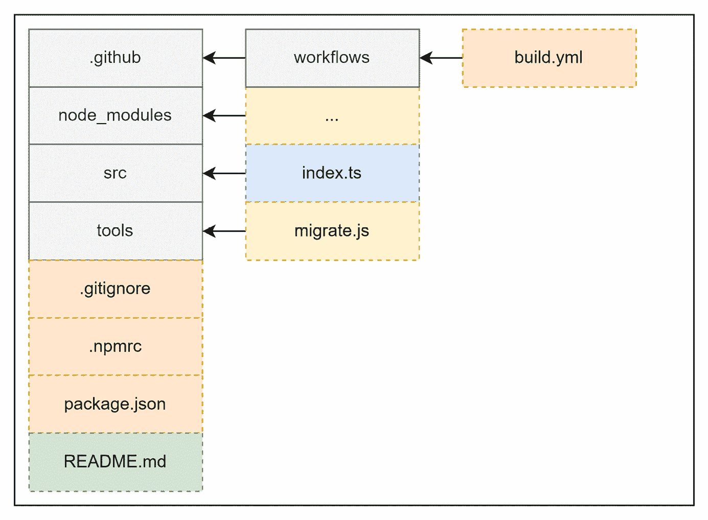
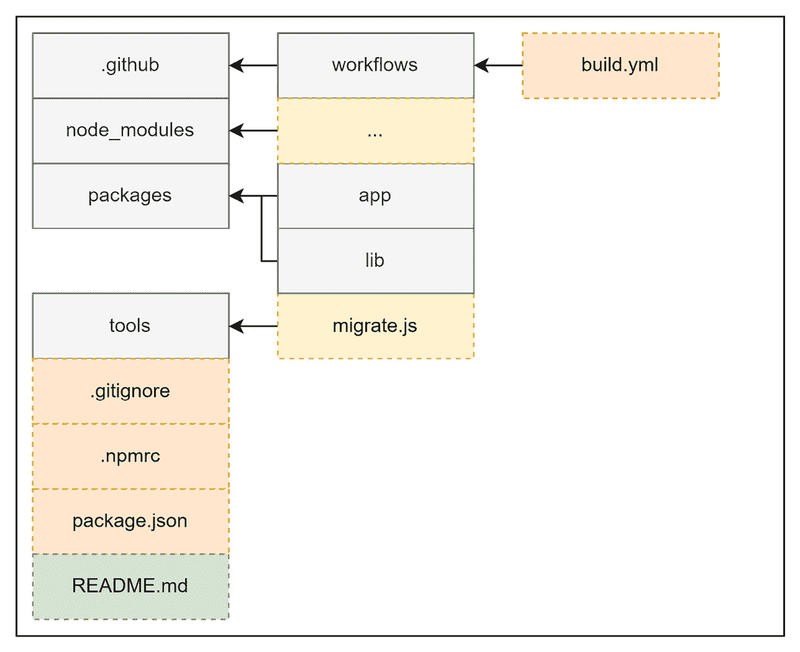
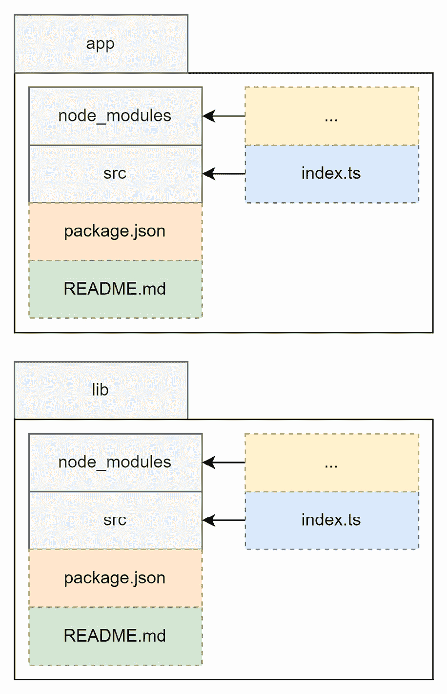
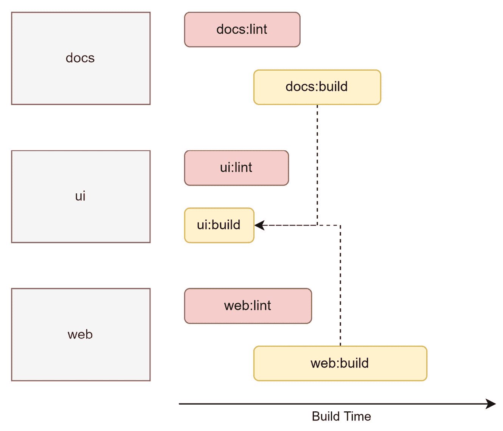

# 第九章：单仓库中的代码结构

在上一章中，你学习了创建和发布优秀的库和工具以增强你的项目的所有内容。虽然一些包是在一定程度上孤立的，但大多数包已经有了消费应用的概念。在这种情况下，有两个独立的仓库——即一个用于应用程序，一个用于库——会带来相当大的开销。毕竟，任何对库的更改都应该在库发布之前至少部分经过测试。使这种关系更有效的一种好方法是结构化这个代码在单仓库中。

一个 `package.json`。

现在，单仓库经常被用来支持世界上一些最大的 Node.js 项目代码库。如果你想正确地阅读和贡献像 Angular、React 或 Vue 这样的项目，你需要对单仓库及其使单仓库成为可能的各种工具有深入的了解。对于你自己的项目，良好的结构——通常通过实现单仓库提供——也可能至关重要。

在本章中，我们将涵盖以下关键主题：

+   理解单仓库

+   使用工作区实现单仓库

+   使用 Lerna 管理单仓库

+   使用 Rush 管理大型仓库

+   使用 Turborepo 替代或与 Lerna 集成

+   使用 Nx 增强 Lerna 来管理单仓库

# 技术要求

本章的完整源代码可在 [`github.com/PacktPublishing/Modern-Frontend-Development-with-Node.js/tree/main/Chapter09`](https://github.com/PacktPublishing/Modern-Frontend-Development-with-Node.js/tree/main/Chapter09) 获取。

本章的 CiA 视频可在 [`bit.ly/3EjGZTL`](https://bit.ly/3EjGZTL) 访问。

# 理解单仓库

专用仓库的结构始终非常相似；我们在根目录下有一个单一的 `package.json` 文件，一个包含已解析依赖项的单一 `node_modules` 文件夹，以及一组源文件和配置文件，通常分散在根目录和一些特定文件夹（如 `src`）之间。*图 9.1* 展示了一个相当流行的设置：



图 9.1 – 单个包的仓库常见设置

在常见的设置中，我们有一些用于 CI/CD 管道定义和潜在的有用工具的文件夹，以及如项目文档之类的辅助文件。当然，对于 Node.js 项目，我们将看到一个 `node_modules` 目录，以及一个 `package.json` 文件。

相反，单仓库将包含多个 `package.json` 文件和多个 `node_modules`（或替代）文件夹。同样，源文件以及可能的一些配置也将分散在多个位置。*图 9.2* 展示了一个非常常见的结构，用于主要部分，*图 9.3* 用于单个包：



**图 9.2** – 包含多个包的存储库的常见设置

与**图 9.1**相比，概述的文件夹层次结构要复杂一些。现在，我们无法立即看到源文件，需要进入`packages`文件夹内部的某些目录：



**图 9.3** – 单个包目录的内容

理想情况下，单一代码库中包含的包应该以这种方式构建，使得它们在以后更容易提取。假设你有一个特定的库在你的单一代码库中，现在应该由另一个团队处理。如果你的单一代码库是为了作为当前团队的开发单一来源而创建的，那么转移这个库是有意义的。

很常见，常见的开发问题，例如`package.json`文件中`devDependencies`的常规包，都集中在专门的`package.json`文件中。在许多单一代码库中，这个`package.json`文件位于单一代码库的根目录。虽然从维护的角度来看，这种模式是有意义的，但它也可能在库提取时带来挑战。毕竟，你现在需要决定添加哪些依赖项以恢复提取库的开发能力。

通常，多个挑战使得支持单一代码库成为一项单独的任务。以下是一些最紧迫的问题：

1.  如何有效地共享依赖项，以避免反复安装相同的依赖项？

1.  如何将包视为从注册表中安装的依赖项？

1.  如何以一致的方式运行常见的任务，例如构建步骤？

让我们逐一分析这些问题。对于(*1*)，想法是单一代码库可以比仅仅拥有许多不同的目录更有效率，在这些目录中，你需要为每个目录运行`npm install`。在每个目录中运行`npm install`将是一个巨大的开销，不仅会重复直接依赖项，还会重复间接依赖项——即已安装依赖项的依赖项。

虽然(*1*)只是一个性能（安装时间和磁盘空间）问题，但(*2*)的问题在于开发者的便利性。最初采用单一代码库的原因是为了让相互依赖的包靠近。这样，一个错误应该在开发时间而不是在包已经发布后的集成时间变得明显。npm 处理这个问题的通常机制是使用`npm link`命令，这将使本地包全局可用以供引用。然而，这个机制存在多个缺点。此外，对于每个包使用此命令并不非常方便。

最后，在单仓库中运行命令时，包之间的依赖关系需要特别注意。在（*3*）方面，如构建源代码等任务需要按照反向引用顺序执行。这意味着，如果包 *A* 依赖于包 *B*，则必须在构建包 *A* 之前先构建包 *B*。原因是，通过依赖关系，包 *A* 的内容可能只有在包 *B* 的内容完全创建（即，包已构建）的情况下才能成功构建。类似的约束也出现在测试和发布包时。

有了这个想法，让我们从实现单仓库（monorepo）最简单的方法之一开始：利用最流行的 npm 客户端自带的工作区（workspaces）功能。

# 使用工作区实现单仓库

随着单仓库需求的增长，npm 客户端试图通过整合它们来帮助用户。其中之一是 *Yarn*。在 Yarn 的第一个版本中，`package.json` 中就引入了一个新的概念：`workspaces`：

package.json

```js
{
  "name": "monorepo-root",
  "private": true,
  "workspaces": [
    "packages/*"
  ]
}
```

Yarn 工作区需要在单仓库的根目录中有一个 `package.json` 文件。这个 `package.json` 不会用于发布，并且需要将 `private` 字段设置为 `true`。`workspaces` 字段本身是一个数组，包含不同包的路径。允许使用 `*` 或 `**` 符号的通配符——如这里所示。

在 npm *v7* 中，标准 npm 客户端也获得了工作区功能。这个功能与 Yarn 的实现几乎相同。在这里，我们同样需要在根目录下有一个 `package.json` 文件。同样，行为由一个 `workspaces` 字段控制。

最后，*pnpm* 的实现略有不同。在这里，我们需要一个名为 `pnpm-workspace.yaml` 的专用文件。此文件包含不同包的路径：

pnpm-workspace.yaml

```js
packages:
  - 'packages/*'
```

与其他两个 npm 客户端不同，使用 pnpm 时，你不需要在根目录中有一个 `package.json` 文件。由于工作区定义在单独的文件中，此文件本身就足以启用 pnpm 的工作区功能。

为了说明这一点，让我们创建一个新的目录，并将前面的 `pnpm-workspace.yaml` 文件添加到其中。然后，创建一个 `packages` 子目录。在那里，添加两个额外的文件夹，`p1` 和 `p2`。在每个这些目录中，运行 `npm init -y`。你现在可以修改包含的 `package.json` 文件，为它们添加一些依赖项。

从包含 `pnpm-workspace.yaml` 文件的根目录运行以下命令：

```js
$ pnpm install

Scope: all 2 workspace projects

Packages: +5

+++++

Packages are hard linked from the content-addressable store to the virtual store.

  Content-addressable store is at: /home/node/.local/share/pnpm/store/v3

  Virtual store is at:             node_modules/.pnpm

Progress: resolved 5, reused 5, downloaded 0, added 5, done
```

虽然始终可以编辑相应的 `package.json` 文件，但 `pnpm` 还使得向某个包含的包——或者用 pnpm 术语来说，工作区——添加依赖项变得容易。

假设你想要将 `react-dom` 添加到 `p1` 工作区：

```js
$ pnpm add react-dom --filter p1

No projects matched the filters "/home/node/ Chapter09/example01" in "/home/node/Chapter09/example01"

.                                        |   +2 +

Progress: resolved 5, reused 5, downloaded 0, added 0, done
```

`--filter` 参数允许你选择依赖项应该添加的工作区。虽然接受全名，但也可以使用通配符（`*`）指定名称。

在单仓库中指定依赖项

在同一 monorepo 中包含的其他包的依赖关系声明就像任何其他依赖关系一样——在相应的 `package.json` 字段中，如 `dependencies` 或 `devDependencies`。然而，指定的版本在这里至关重要。你需要确保匹配引用包的版本（例如，`1.2.3` 或 `¹.0.0` 都可以正确匹配版本为 `1.2.3` 的包）或使用通配符指定符 `*`。如今，大多数包管理器也支持特殊的 workspace 协议。使用这个协议，你可以写 `workspace:*` 而不是版本来链接到另一个 workspace 中的包。

workspaces 选项确实很有吸引力，可以优化包并使它们的链接变得相当容易；然而，它并没有使常见的 monorepo 任务更加易于接近或方便。一个替代方案是在 workspace 之上使用像 **Lerna** 这样的工具。

# 使用 Lerna 管理单一代码库

**Lerna** 是管理单一代码库的最古老工具之一。我们甚至可以说在某种程度上，Lerna 不仅使单一代码库变得可管理，而且使其变得流行。Lerna 是一些最重要的单一代码库（如 Jest）的支柱。它也是像 *Babel* 或 *React* 这样的项目的原始选择。

最初，选择 Lerna 主要是因为它能够正确安装和解析所有包。当时，没有任何包管理器能够内在地做到这一点。然而，如今，Lerna 最常与不同包管理器提供的 workspace 功能一起使用。当然，你仍然可以使用 Lerna 的原始模式，其中使用 plain `npm` 来安装和链接不同的包。那么，当整个安装都由选择的包管理器完成时，Lerna 如何适应这个新角色呢？

结果表明，Lerna 是一个在包管理器之上的真正出色的任务运行层。例如，在所有包含的包中运行 `package.json` 脚本，如 `build`，就像调用以下命令一样简单：

```js
$ npx lerna run build
```

这只会运行包含此类脚本的包中的脚本。相比之下，如果其中一个包没有 `build` 脚本，Yarn 实际上会出错。

要开始使用 Lerna，你需要将当前仓库初始化为 Lerna 单一代码库。为此，可以使用 `init` 命令：

```js
$ npx lerna init
```

一旦初始化，仓库应包含一个 `lerna.json` 和一个 `package.json` 文件。通过检查这些文件，你会注意到 `lerna.json` 包含一个版本（默认为 `0.0.0`），但 `package.json` 不包含。这是故意的。实际上，Lerna 将会管理这里的版本。默认选择是统一版本控制——也就是说，所有包都将始终获得相同的版本。另一种选择是独立版本控制。在这里，每个包都可以有自己的版本号。如果不同的包有自己的发布周期，这会很有用。

要启用独立版本控制，我们可以更改 `lerna.json`：

lerna.json

```js
{
  // ... as beforehand
  "version": "independent"
}
```

或者，我们也可以使用 `lerna init` 命令的 `--independent` 标志来初始化存储库。

`package.json` 文件包含 `workspaces` 属性。默认情况下，这被配置为包括 `package` 目录下的所有目录作为包。在给定的配置中，Lerna 会使用 npm 作为包管理器。在任何情况下，整个包管理都留给了实际的 npm 客户端。

如前所述，Lerna 在运行任务方面确实很出色。Lerna 的哪些方面被认为是其优势？整个发布和版本管理。我们已经看到 Lerna 知道两种模式：独立版本控制和统一版本控制。在独立版本控制模式下，Lerna 将检查即将发布的版本与当前版本。只有在有新版本的情况下，`publish` 命令才会实际运行。

让我们看看上一个示例中的包如何使用 Lerna 实际发布。为此，我们将使用运行 Verdaccio 的本地注册库：

```js
$ npx lerna publish --registry http://localhost:4873

lerna notice cli v5.5.2

lerna info versioning independent

lerna info Looking for changed packages since p1@1.0.1

? Select a new version for p1 (currently 0.0.0) Major (1.0.0)

? Select a new version for p2 (currently 0.0.0) Major (1.0.0)

Changes:

 - p1: 0.0.0 => 1.0.0

 - p2: 0.0.0 => 1.0.0

? Are you sure you want to publish these packages? Yes

lerna info execute Skipping releases

lerna info git Pushing tags...

lerna info publish Publishing packages to npm...

[...]

Successfully published:

 - p1@1.0.0

 - p2@1.0.0

lerna success published 2 packages
```

没有额外的标志，Lerna 将引导我们完成整个发布过程。由于我们指定了独立的版本控制，该工具将询问每个包含的包应选择哪个版本。在这种情况下，我们为两个包都选择了 `1.0.0`。

Lerna 还做了一些比为每个包运行 `npm publish` 更多的事情。它与 **Git** 作为版本控制系统密切相关。它还将发布与当前提交绑定，并通过 Git 标签标记发布，这些标签会自动推送到潜在的原始存储库，如 **GitHub**。

Lerna 还带来了一些关于 monorepo 的详细信息。由于 Lerna 需要知道哪些包存在以及它们之间的关系，因此将这些信息暴露给我们也是合理的。

一个很好的命令，可以用来查看当前 monorepo 中有什么是 `lerna list`：

```js
$ npx lerna list --graph

lerna notice cli v5.5.2

lerna info versioning independent

{

  "p1": [

    "react",

    "react-dom"

  ],

  "p2": [

    "react",

    "react-dom"

  ]

}

lerna success found 2 packages
```

有多种选项——所有这些选项都是为了微调要包含、排除的信息以及如何表示它。最终，这是为了使以多种方式消费成为可能。无论您是从脚本中消费还是直接消费，`lerna` 工具都有适当的选项来相应地呈现数据。

Lerna 已经确立为处理 monorepos 的首选选项之一；然而，其配置选项可能令人望而生畏，在大型存储库中使其高效可能很麻烦。一个替代方案是使用一个有意见的工具。这个类别中最好的选项之一是**Rush**。

# 与 Rush 一起处理大型存储库

虽然 Lerna 提供了许多使 monorepos 成为可能的功能，但其配置和灵活性也带来了一些挑战。此外，寻找最佳实践也证明是困难的。因此，出现了许多对使用 Lerna 的相当有意见的替代方案。其中最成功的一个是微软的 Rush。

Rush 允许使用各种 npm 客户端。传统上，Rush 曾经只使用 npm。今天，Rush 推荐使用 pnpm，这也是使用 Rush 设置单仓时默认的客户端。

为了高效地使用 Rush，建议全局安装此工具：

```js
$ npm install -g @microsoft/rush
```

安装成功后，可以使用`rush`命令行工具。与`npm`一样，存在一个`init`子命令来实际初始化一个新项目：

```js
$ rush init
```

这将创建和更新几个文件。最值得注意的是，你会在当前文件夹中找到一个`rush.json`文件。这个文件需要编辑。然而，在你继续之前，请确保删除你不需要的文件。例如，Rush 添加了一个`.travis.yml`文件，如果你使用 Travis 进行 CI/CD 管道，这可能很有用。如果你不知道 Travis 是什么，或者你已经知道你不想使用 Travis，只需删除该文件即可。

由于 Rush 中每个包都是明确添加的，因此没有直接需要`packages`子文件夹。如果你仍然希望以这种方式分组包含的包，当然可以这样做。

为了让 Rush 知道包含的包，我们需要编辑根目录下的`rush.json`文件。在我们的例子中，我们想要添加两个新的包：

`rush.json`

```js
{
  // keep the rest as is
  "projects": [
    {
      "packageName": "p1",
      "projectFolder": "packages/p1"
    },
    {
      "packageName": "p2",
      "projectFolder": "packages/p2"
    }
  ]
}
```

保存文件后，你可以运行以下命令——只需确保给定的目录确实存在并包含有效的`package.json`文件：

```js
$ rush update
```

在给定的输出中，你应该会看到一些包含类似消息的输出。如前所述，在底层，Rush 使用`pnpm`来使包安装非常高效。

在包目录中运行`rush add`来添加或更新包中的依赖项。假设我们想要将`react-router`添加到`p1`中：

```js
$ cd packages/p1

$ rush add --package react-router
```

运行命令时，Rush 提供了两个基本命令。一个是通用的`rushx`命令，它可以看作是`npm run`的包装器。假设`p1`包定义了一个`hello`命令如下：

`packages/p1/package.json`

```js
{
  // as beforehand
  "scripts": {
    "hello": "echo 'Hi!'"
  }
}
```

运行此脚本的方式如下：

```js
$ cd packages/p1 && rushx hello

Found configuration in /home/node/examples/Chapter09/example02/rush.json

Rush Multi-Project Build Tool 5.68.2 - Node.js 14.19.2 (LTS)

> "echo 'Hi!'"

Hi!
```

另一个基本命令是使用内置命令，如`rush build`或`rush rebuild`。它们假设每个包都包含一个`build`脚本。而`rebuild`命令会运行所有的`build`脚本，而`build`命令实际上使用缓存来启用增量构建过程——也就是说，尽可能多地重用前一次运行的结果。

虽然 Rush 非常严格，需要掌握整个仓库，但另一种选择是使用更轻量级的工具，如 Turborepo。

# 将 Turborepo 集成到 Lerna 中或替代 Lerna

到目前为止，我们在这个章节中已经看到了各种各样的工具。虽然现代 npm 客户端的 workspace 功能对于较小的单仓库来说已经足够，但对于较大的单仓库，则需要更多专门的工具来管理。在 Lerna 简单而 Rush 过于固执己见的情况下，还存在另一种选择 – **Turborepo**，或简称 Turbo。它可以被视为 Lerna 的替代品或补充。

从零开始相当容易 – Turbo 附带一个 npm 初始化器：

```js
$ npm init turbo
```

这将打开一个命令行调查，并使用一些示例代码来构建目录。最后，你应该会看到创建了一些新文件，例如 `turbo.json` 或 `package.json` 文件。此外，Turbo 还创建了包含一些示例代码的 `apps` 和 `packages` 目录。

让我们通过运行 `build` 脚本来展示 Turbo 的强大功能：

```js
$ npx turbo run build
```

与 Lerna 不同，它不会在每个包中运行 `build` 脚本 – 跟随包图。相反，它将运行 `turbo.json` 中定义的管道之一。在那里，你可以看到以下内容：

turbo.json

```js
{
  "$schema": "https://turborepo.org/schema.json",
  "pipeline": {
    "build": {
      "dependsOn": ["^build"],
      "outputs": ["dist/**", ".next/**"]
    },
    "lint": {
      "outputs": []
    },
    "dev": {
      "cache": false
    }
  }
}
```

给定的 `pipeline` 属性定义了一组 Turbo `build` 管道。然后可以通过 `turbo run` 运行每个给定的键（在这里，`build`、`lint` 和 `dev`）。每个管道的具体细节由其给定的值指定。例如，`dev` 管道不使用缓存，而 `lint` 管道不产生任何输出。默认情况下，每个管道在每个包中运行具有相同名称的脚本。

此处的 `build` 管道指定了一些用于执行增量构建的输出目录。它还指定在当前包中运行之前，必须先在依赖项中运行 `build` 脚本。因此，如果你有两个包，`p1` 和 `p2`，其中 `p1` 依赖于 `p2`，则 `p2` 的构建脚本需要在 `p1` 的构建脚本被调用之前运行。

除了“在不同工作区”的依赖项（例如，`^build`）之外，您还可以指定“在同一工作区”。例如，如果构建脚本依赖于一个 `prebuild` 脚本，您只需写下 `prebuild`：

turbo.json

```js
{
  "pipeline": {
    "build": {
      "dependsOn": ["^build", "prebuild"]
    }
}
```

`turbo run` 命令也可以同时调用多个命令：

```js
$ npx lerna turbo lint build
```

由于 `lint` 没有指定依赖项，因此运行结果相当高效，所有代码检查都可以并行进行，而构建则是按层次执行的。这一想法在 *图 9.4* 中得到了说明：



图 9.4 – Turbo 的任务规划和执行

Turbo 不是唯一可以用来使单仓库更高效的工具。一个很好的替代方案是 Nx，它不仅限于任务运行。

# 使用 Nx 管理单仓库以增强 Lerna

在本章早期讨论 Lerna 时，我们没有提到的一个问题是 `lerna.json` 中有一个特殊键，称为 `useNx`，并配置为 `true`。这是 Lerna *5* 中的一个新功能，现在由 Nx 背后的人维护——另一个流行的用于管理 monorepo 的解决方案。那么，这实际上带来了什么，以及它如何增强 Lerna 或任何其他 monorepo 管理工具呢？

使用 Lerna 还是无需使用？

Nx 不依赖于 Lerna，并且在使用 Lerna 的情况下使用 Nx 也是可选的。因此，这两种技术可以被视为非排他性的——更确切地说，它们是互补的。最终，选择使用哪种技术由你决定。例如，本节中的示例没有使用 Lerna。

我们再次从一个新的仓库开始。这次，我们将使用 Nx 提供的 `nx-workspace` npm 初始化器：

```js
$ npm init nx-workspace -- --preset=react

 Workspace name (e.g., org name)     · example05

 Application name                    · example

 Default stylesheet format           · css

 Enable distributed caching to make your CI faster · Yes

[...]
```

与 Turbo 一样，我们得到了一个命令行调查问卷。初始预设（在这种情况下，`react`）定义了一些出现的问题。还有其他与 Turbo 相似之处。例如，通过 `nx` 运行某些操作，如下所示：

```js
$ npx nx build
```

这将在给定环境中（默认为 `production`）查找当前应用程序（在这种情况下，`example`）的 Nx `build` 任务执行器。以下是一个明确书写的示例：

```js
$ npx nx run example:build:production
```

任务执行器在包的 `project.json` 中指定。Nx 使用插件来实际运行这些执行器；在我们的示例项目中，使用 `react` 预设时，使用 `@nrwl/webpack` 包作为插件。

为了使 Nx 能够工作，每个包都需要一个 `package.json` 或 `project.json` 文件。这两种文件都可以指定。在这种情况下，Nx 实际上会内部合并它们以获得所需的配置。通常，如果你想使用 npm 脚本，你会想要一个 `package.json` 文件。`project.json` 文件包含 Nx 任务执行器，它们功能更强大，但不幸的是，这些内容超出了本快速介绍的范畴。

让我们在这里停下来，回顾一下本章所学的内容。

# 摘要

在本章中，你学习了如何在单个称为 monorepo 的仓库中组织多个 Node.js 项目。你看到了不同的技术和工具，用于最大化效率和处理多个包及其依赖项。

现在，你已经准备好处理可用的最大代码库了。无论代码库是否仅使用 npm 客户端中的一个工作空间，或者在其之上使用 Lerna 等其他工具，你都能迅速理解其结构、运行命令和添加新包。

在下一章中，我们将以对 WebAssembly 的探讨作为总结，它不仅为在浏览器中运行的代码提供了很多灵活性，还可以用于在 Node.js 中运行任意语言。
