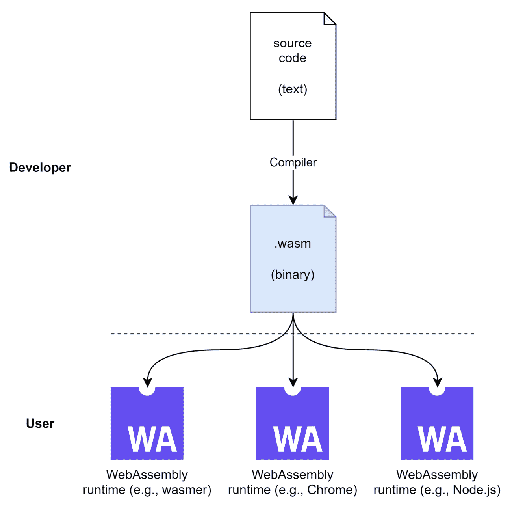
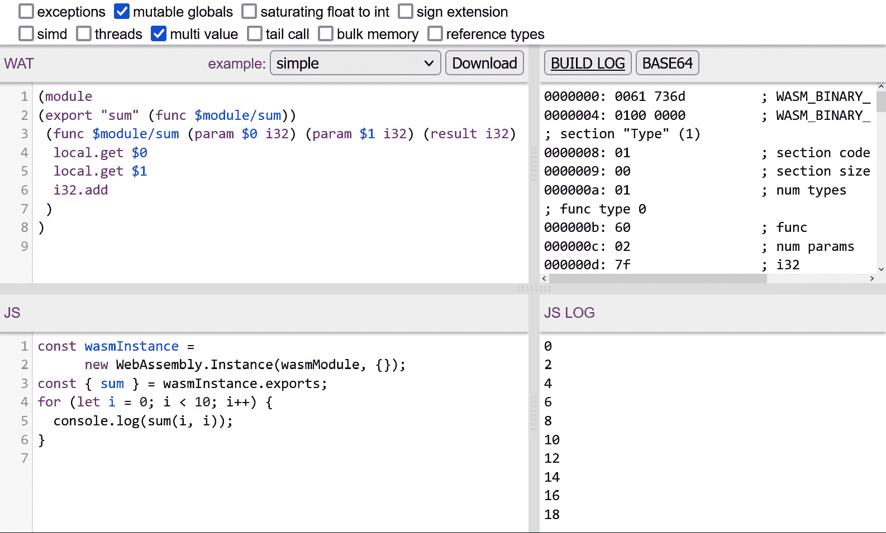

# 将原生代码与 WebAssembly 集成

实际使用 Node.js 的全部意义在于便利性。Node.js 从未追求成为最快的运行时、最完整的或最安全的。然而，Node.js 建立了一个快速而强大的生态系统，能够开发出一套工具和实用程序，实际上赋予了我们现在所习惯的 Web 开发标准。

随着 Node.js 的发展，对更多专用系统的需求也增加了。提供 Node.js 替代方案的新运行时实际上正是出于这种需求而出现的。在 WebAssembly 语言中，我们可以找到一个有趣的替代方案。WebAssembly 是一种可移植的二进制代码格式，类似于 **Java 虚拟机**（**JVM**）或 **微软中间语言**（**MSIL**）。这使得它成为任何语言（尤其是像 C 或 Rust 这样的底层语言）的潜在编译器选择。

在本章中，你将了解 WebAssembly 提供的内容，如何将现有的 WebAssembly 代码集成到你的 Node.js 应用程序中，以及如何自己生成 WebAssembly 代码。到本章结束时，你将准备好将你的脚本提升到下一个层次——无论是使用 WebAssembly 本身还是使用在 Node.js 中运行的 WebAssembly。

我们将在本章中涵盖以下关键主题：

+   使用 WebAssembly 的优势

+   在 Node.js 中运行 WebAssembly

+   使用 AssemblyScript 编写 WASM

# 技术要求

本章节的完整源代码可在以下链接找到：[`github.com/PacktPublishing/Modern-Frontend-Development-with-Node.js/tree/main/Chapter10`](https://github.com/PacktPublishing/Modern-Frontend-Development-with-Node.js/tree/main/Chapter10)。

本章节的 CiA 视频可通过以下链接访问：[`bit.ly/3DPH53P`](https://bit.ly/3DPH53P)。

# 使用 WebAssembly 的优势

**WebAssembly**（**WASM**）是一种没有运行时的语言。任何功能——从分配一些内存到发起 HTTP 请求——都需要由消费应用程序集成。然而，有一些新兴的标准，如 **WebAssembly 系统接口**（**WASI**），旨在将一组标准功能带到任何平台。这样，我们可以使用 WASM 编写平台无关的应用程序，并使用集成 WASI 的运行器。

WASI 规范

WASI 规范涵盖了在浏览器外运行 WASM 所需的一切。流行的 WASM 运行时，如 **Wasmtime** 或 **Wasmer**，实现了 WASI，以便实际运行 WASM 应用程序。WASI 指定了系统资源如何被 WASM 访问。因此，除了在运行时实现 WASI 之外，执行中的 WASM 代码还需要（并使用）WASI 提供的 API。更多详细信息请参阅 [`wasi.dev/`](https://wasi.dev/)。

因此，WASM 的一个优势是其可移植性和在沙盒中运行的能力。毕竟，没有链接和运行系统命令或访问关键系统资源的能力。

即使像向控制台记录（即 Node.js 中`console.log()`的等效物）这样简单的事情也需要由 WASI 层提供，这可能会将某些资源的访问决策留给用户。

WASM 的另一个优点是它不是一个直接的语言。因此，我们可以实际上使用任何支持 WASM 作为编译目标的语言。截至今天，大多数系统语言，如 C/C++、Rust、Zig 和 Go，都支持 WASM 生成。最后，Java 的“一次编写，到处运行”原则似乎得到了实现。

很常见，性能被认为是 WASM 的另一个优点。虽然 WASM 本身实际上可以提供比 Node.js 或类似运行时更好的性能，但它肯定仍然会比等效但非常优化的本地代码慢。毕竟，这也只是在本地运行，但信息略少，并且以更通用的模式运行。然而，对于某些算法，从 WASM 执行到本地执行的减速可以相当小，甚至不明显。

那么，这一切是如何实现的呢？首先，WASM 文件的格式是二进制的——也就是说，尽可能高效。在这个二进制中的结构是为了快速解析和执行而量身定制的。该语言不提供高级指令，如循环，而只提供标签和跳转点——就像真正的机器语言一样。

在**图 10.1**中，你可以看到 WASM 提供的一般流程和可移植性承诺。作为开发者，我们只需要关心编译到`.wasm`文件。如果我们的工具能够做到这一点，用户就可以使用他们选择的 WASM 运行时来消费这些文件，这可以是浏览器或 Node.js，但还有许多其他选项。



图 10.1 – 使用 WASM 二进制文件的 WASM 的可移植性

就像机器语言一样，WASM 有两种格式——一种文本表示，这对于查看正在发生的事情非常有用，以及相应的二进制表示。文本表示看起来非常接近像**Lisp**这样的编程语言，较低级别的片段类似于实际的处理器指令。

让我们看看一个 WASM 文本表示的例子，这个库导出`sum`函数来将两个数字相加：

sum.wat

```js
(module
(export "sum" (func $module/sum))
 (func $module/sum (param $0 i32) (param $1 i32)
   (result i32)
  local.get $0
  local.get $1
  i32.add
 )
)
```

存在将文本表示转换为其二进制对应物的工具。最受欢迎的工具是**wat2wasm**，它还有一个强大的在线演示。您可以通过[`webassembly.github.io/wabt/demo/wat2wasm/`](https://webassembly.github.io/wabt/demo/wat2wasm/)访问它。

将前面的例子添加进去，你将得到如图**图 10.2**所示的观点。你会发现在线工具在文本（左上角）到二进制（右上角）的转换之外还做了一些事情。它还包括一个小型的 JavaScript 游乐场（左下角），它集成了编译后的 WASM 二进制文件并运行它。游乐场中运行代码的输出随后显示在右下角。



图 10.2 – 将 wat2wasm 在线工具应用于我们的示例

既然我们已经了解了 WASM 是什么，它是如何工作的，以及它提供了哪些优势，现在是时候看看我们如何运行它，当然——以及如何与 Node.js 集成了。这使得我们的脚本比之前更加强大，允许以可靠、高性能和安全的方式集成平台无关的、几乎原生的代码。

# 在 Node.js 中运行 WASM

Node.js 通过 `WASM` 对象直接集成 WASM。API 与浏览器中的完全相同，允许我们有可能在 Node.js 和浏览器之间共享代码，以集成编译后的 WASM 文件。

在 API 中，`WASM` 有三个函数。我们可以编译现有的二进制文件，将其转换为 WASM 运行时模块。然后，可以使用 `instantiate` 方法激活该模块。我们还可以验证现有的二进制文件——以检查给定的文件是否确实是有效的 WASM 二进制文件。所有方法都是异步的，并返回 `Promise`。

让我们通过一个使用 WASM 二进制文件 `sum.wasm` 的例子来看看，它导出一个单一的功能（`sum`）并将两个数字相加：

app.mjs

```js
import{ readFile } from 'fs/promises';
const content = await readFile('./sum.wasm');
const wasm = await WebAssembly.compile(content);
const instance = await WebAssembly.instantiate(wasm);
const { sum } = instance.exports;
console.log(sum(2, 3)); // logs 5
```

Node.js 通过提供内置的 `wasi` 包，使得 WASM 的集成更加方便。这个包实现了 WASI 规范，允许我们在 Node.js 中运行的 WASM 应用程序内访问系统资源。

为了看到依赖于 WASI 的 WASM 模块集成是什么样的，我们将在稍后构建一个小型应用程序，该应用程序将使用 WASI 并集成到 Node.js 中。Node.js 集成将如下所示：

app.mjs

```js
import { readFile } from "fs/promises";
import { WASI } from "wasi";
import { argv, env } from "process";
const wasi = new WASI({
  args: argv,
  env,
});
const api = { wasi_snapshot_preview1: wasi.wasiImport };
const path = "./echo.wasm";
const content = await readFile(path);
const wasm = await WebAssembly.compile(content);
const instance = await WebAssembly.instantiate(wasm, api);
wasi.start(instance);
```

至少在 Node.js 版本 18 中，`wasi` 包不是激活的。要实际运行前面的应用程序，你需要添加 `--experimental-wasi-unstable-preview1` 标志：

```js
$ node --experimental-wasi-unstable-preview1 app.mjs
```

上一例的运行细节将在下一节中进行探讨。

虽然在 Node.js 中运行 WASM 很好，但我们可能也想自己编写一些代码。当然，如果你对 C 或 Rust 等语言有所了解，你可以使用这些语言，并将 WASM 作为编译目标。然而，一般来说，对于有 JavaScript 背景的开发者来说，AssemblyScript 是一个不错的选择。

# 使用 AssemblyScript 编写 WASM

虽然有生成有效 WASM 的许多选项，但其中最吸引人的方式之一是使用 AssemblyScript。AssemblyScript 是一种看起来和感觉与 TypeScript 非常相似的语言，从语法角度来看，学习起来相当容易。然而，在底层，仍然有一些与 WASM 相关的概念需要了解，以便编写中等大小到较大的 AssemblyScript 应用程序或库。

AssemblyScript 的一个核心概念是模拟 WASM 中使用的不同数据类型。例如，使用整数需要使用 `i32` 类型。

让我们看看一些示例代码。我们将从一个期望两个参数的小函数开始，将它们相加，并返回结果：

module.ts

```js
export function sum(a: i32, b: i32): i32 {
  return a + b;
}
```

除了 `i32` 类型外，前一个示例中的所有内容看起来和感觉都像 TypeScript。甚至文件扩展名也表明这是一个 TypeScript 文件。

实际上编译前面的代码到 WASM，你需要 `assemblyscript` 包。像 `typescript` 一样，你可以全局或本地安装此包。

一旦安装了 AssemblyScript，你就可以运行 `asc` 工具将源代码编译成有效的 WASM 二进制文件：

```js
$ npx asc module.ts --outFile sum.wasm --optimize
```

AssemblyScript 也可以非常有帮助地搭建一个工作良好的项目结构——不仅用于编译源代码，还可以在浏览器中运行 WASM。这为编写适用于多个平台（包括各种操作系统、浏览器和设备）的代码提供了一种很好的方式：

```js
$ npx asinit .

Version: 0.21.6

[...]

  ./assembly

  Directory holding the AssemblyScript sources being compiled to WebAssembly.

  ./assembly/tsconfig.json

  TypeScript configuration inheriting recommended AssemblyScript settings.

  ./assembly/index.ts

  Example entry file being compiled to WebAssembly to get you

[...]

  ./index.html

  Starter HTML file that loads the module in a browser.

The command will try to update existing files to match the correct settings [...]

Do you want to proceed? [Y/n] Y
```

在搭建好的结构中，我们可以继续尝试让之前的示例工作——例如，在网页浏览器中。

为了这个，修改搭建项目文件夹中的 `assembly` 目录下的 `index.ts`。用包含 `sum` 函数的前一个片段替换其内容。现在，在项目的根目录中打开 `index.html`。将导入语句更改为获取 `sum` 而不是 `add`。

`index.html` 文件的脚本部分现在应该看起来像这样：

```js
import { sum } from "./build/release.js";
document.body.innerText = sum(1, 2);
```

现在，你可以使用在搭建过程中添加的 `asbuild` 脚本构建和运行一切：

```js
$ npm run asbuild

$ npm start
```

现在，一个小的网络服务器应该在端口 `3000` 上运行。访问 `http://localhost:9000` 会带你到一个几乎空白的网页。你应该看到的是来自我们 WASM 库的 `sum` 函数。

WASM 调试

WASM 模块可以像任何其他网络应用程序一样调试。浏览器提供了一个可视化的调试器，可以用于检查。通过使用 WASM 的源映射，实际上可以调试原始代码而不是不那么容易阅读的 WASM。AssemblyScript 也能够生成 WASM 源映射。在这里，源映射目标文件必须在 `--sourceMap` CLI 标志之后指定。

AssemblyScript 也可以用来创建基于 WASI 的 WASM 应用程序和库。让我们看看这会怎样工作。我们从一个新项目开始，添加 `assemblyscript` 和 `as-wasi` 作为依赖项，然后搭建一个新的 `AssemblyScript` 项目：

```js
$ npm init -y

$ npm install assemblyscript as-wasi --save-dev

$ npx asinit . -y
```

现在，我们可以使用 `wasi` 包修改 `assembly/index.ts` 文件，使用以下代码。

index.ts

```js
import "wasi";
import { Console, CommandLine } from "as-wasi/assembly";
const args = CommandLine.all;
const user = args[args.length - 1];
Console.log(`Hello ${user}!`);
```

通过导入 `wasi` 包，整个模块被转换成 WASI 兼容的入口点。这允许我们使用 `as-wasi` 包中的抽象，例如 `Console` 来访问控制台或 `CommandLine` 来获取提供的命令行参数。

要构建代码，我们使用以下参数调用 `asc` 工具：

```js
$ npx asc assembly/index.ts -o echo.wasm --use abort=wasi_abort --debug
```

这指示 AssemblyScript 构建位于`assembly/index.ts`中的应用程序。生成的 WASM 将被存储在`echo.wasm`中。通过`--debug`标志，我们指示`asc`创建一个调试构建。

调试构建可以非常快地完成，因为编译器不需要投资于任何优化。除了更快的编译时间外，缺乏进一步的优化还可以在运行时提供更好的错误信息，以便于处理关键的失败。

重要的是，`abort`命令的绑定（通常从隐含的`env`导入到 WASM 模块中）被设置为使用 WASI 提供的`abort`方法。

现在，我们可以使用上一节中的`wasi`包添加 Node.js 模块`app.mjs`。别忘了添加必要的命令行参数。由于这将会打印警告，我们可能想要添加`--no-warnings`来抑制它：

```js
$ node --experimental-wasi-unstable-preview1 --no-warnings app.mjs Florian

Hello Florian!
```

带着这些知识，你现在可以继续编写编译为 WASM 的简单程序了。让我们回顾一下本章你学到了什么。

# 摘要

在本章中，你扩展了在 Node.js 中运行的潜在源代码文件的知识。你现在熟悉了运行 WASM——一种可以作为许多编程语言的编译目标的低级可移植二进制代码语言。

WASM 可以帮助你一次编写功能，并在多个平台上运行。由于 WASM 可以很好地沙箱化，它是有望成为下一波容器化计算的有力竞争者，在这一领域中，性能和安全被高度重视。你现在已经知道了如何使用 AssemblyScript 编写 WASM。你也被赋予了在 Node.js 中集成创建的 WASM 模块的能力。

在下一章和最后一章中，我们将探讨 JavaScript 在 Node.js 之外的用途。我们将看到存在其他运行时，它们部分兼容 Node.js 生态系统——提供了一种非常适合多种用例的即插即用替代方案。
