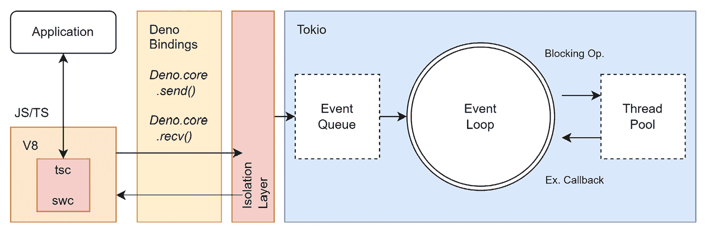
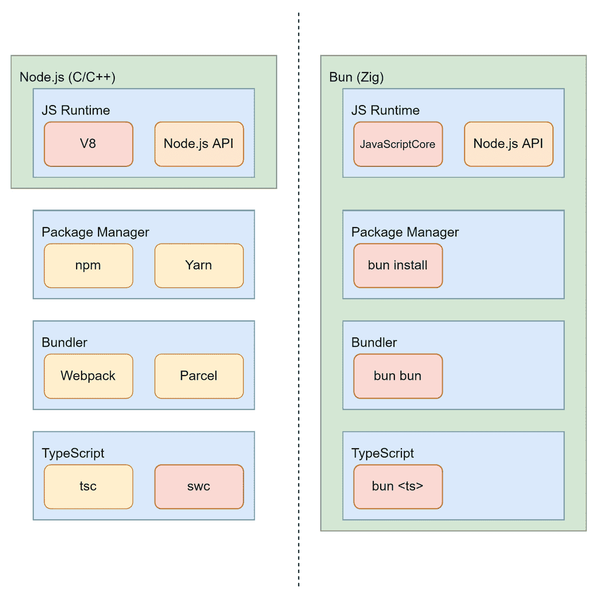

# 使用替代运行时

到目前为止，您已经看到了 Node.js 生态系统为创建优秀的 Web 应用提供了哪些优势和好处。然而，与几乎所有事情一样，构成我们所说的 Node.js 的设计决策也有一些缺点。

Node.js 中最大的挑战之一是所谓的*依赖地狱*——将许多小包组合起来创建一个稍微大一点的包。另一个挑战是 Node.js 没有保护这些依赖免于访问系统资源。因此，从第三方包导入任何内容都可能产生不希望出现的副作用。

虽然生态系统可靠性和安全性可以帮助我们抵御依赖地狱，但提高性能也是一个重要的策略。总体而言，Node.js 的性能可以被认为是相当不错的；然而，某些领域，如包解析或处理器核心利用率，可以通过相当大的份额得到改善。因此，性能也是一个可能被视为缺点的地方。

在本章中，您将了解两种最流行的替代运行时，以减轻 Node.js 带来的某些缺点。为了深入评估这些替代方案，我们将密切关注它们与现有 Node.js 生态系统的兼容性状态。

本章我们将涵盖以下关键主题：

+   探索 Deno 运行时

+   使用 Bun 进行 Web 应用捆绑

# 技术要求

本章的完整源代码可在[`github.com/PacktPublishing/Modern-Frontend-Development-with-Node.js/tree/main/Chapter11`](https://github.com/PacktPublishing/Modern-Frontend-Development-with-Node.js/tree/main/Chapter11)找到。

本章的 CiA 视频可通过[`bit.ly/3Uqi9aq`](https://bit.ly/3Uqi9aq)访问。

# 探索 Deno 运行时

虽然 Node.js 是一个巨大的成功故事，但并非所有人都喜欢它。一些批评者表示，巨大的碎片化加上缺乏系统控制提供了太大的攻击面。在过去，我们看到了无数利用这个问题的漏洞进行的攻击。

另一个问题在于，Node.js 确实不得不发明了许多 API——例如，用于与文件系统交互。浏览器中没有可用的 API 与期望的类似。当然，正如我们现在所知，浏览器 API 一直在改进，甚至文件系统访问等功能也被实现。然而，API 从未对齐，这主要是因为 Node.js 的变体既不可控也不是完全异步的。

当然，上述问题在一段时间内都是众所周知的，但直到几年后，才出现了替代实现来解决这些问题。再次，是 Ryan Dahl——Node.js 的原始创造者——致力于解决这个问题。这个解决方案被称为**Deno**。

Deno 的主要好处如下：

+   它引入了系统访问控制，以允许或阻止对资源（如文件系统）的访问。

+   它使用显式导入而不是神奇解析的导入——不再有隐含的包查找或索引文件。

+   它试图与浏览器互换——仅提供原生浏览器 API 而不是自定义 API。

+   它提供了一等 TypeScript 支持，不仅改善了开发体验，还增强了代码的可靠性。

+   它自带了一些实用的工具，例如应用程序打包器，无需安装依赖项即可开始开发。

在底层，Deno 使用 Rust 编程语言而不是 C++。在这里，选择 Rust 是为了避免任何潜在的内存泄漏或漏洞，这些漏洞在 C++ 中比 Rust 更可能发生。这也意味着 *libuv*，正如在 *第一章* “了解 Node.js 的内部结构” 中讨论的，作为 Node.js 的主要驱动程序已经不复存在。相反，Deno 使用另一个名为 **Tokio** 的事件循环系统。尽管如此，这两个运行时实际上都使用 **V8** 来运行 JavaScript。

**Tokio**

**Tokio** 是为 Rust 应用程序提供与网络交互所需一切功能的异步运行时。它可靠、快速且灵活。除了是 Rust 原生之外，Deno 选择使用 Tokio 的一个核心原因也是它非常易于集成。Tokio 包含 I/O 辅助工具、定时器、文件系统访问、同步和调度功能，使其成为完整的 libuv 替代品。更多信息可以在 [`tokio.rs/`](https://tokio.rs/) 找到。

Deno 的架构如图 *图 11.1* 所示。值得注意的是，该图几乎与 *图 1.1* 完全匹配，后者展示了 Node.js 的架构。最显著的区别是接受 TypeScript，它将通过 `swc`（转译）和 `tsc`（类型检查）的组合转换为 JavaScript。另一个关键的区别是增加了额外的隔离层：



图 11.1 – Deno 的架构

Deno 的安装可以通过命令行完成。例如，在 macOS 和 Linux 上，您只需运行以下 Shell 脚本：

```js
$ curl -fsSL https://deno.land/x/install/install.sh | sh
```

而在 Windows 上，您可以使用 PowerShell 来完成此操作：

```js
$ irm https://deno.land/install.ps1 | iex
```

对于常见的应用程序包管理器，如 Scoop、Chocolatey 或 Homebrew，也存在替代安装方式。

要尝试 Deno，您可以运行以下脚本：

```js
$ deno run https://deno.land/std/examples/welcome.ts

Download  https://deno.land/std/examples/welcome.ts

Warning Implicitly using latest version (0.159.0) for https://deno.land/std/examples/welcome.ts

Welcome to Deno!
```

已经有一些事情发生了。首先，我们不是使用本地源来运行，而是一个地址。其次，由于这是一个地址，源需要被下载。第三，Deno 总是更喜欢接收显式版本，所以它会抱怨我们在这里只使用了 `stdlib` 的任何版本。相反，它会重定向到最新的版本，写作时为 `0.159.0`。

最后，如果你再次运行脚本，你将只会看到输出，没有任何下载或警告。这是由于 Deno 的缓存造成的。为了保持良好的性能，假设每个下载的模块都是不可变的，并将它们缓存在本地。因此，未来的引用将不需要再次下载，这使得它们的启动时间是可以接受的。

现在的大问题是：Deno 是否也能运行 Node.js 库和应用程序？令人不满意的答案是也许可以。理论上，仅可以使用 JavaScript 文件 – 然而，Deno 只支持 ESM 模块。由于许多 Node.js 库是使用 CommonJS 编写的，我们在这里将不会成功。

作为缓解措施，我们只需将包进行转换 – 将其打包成一个文件并运行，而不会遇到任何麻烦 – 但即使在这种情况下，我们也可能面临与生态系统不兼容的问题，因为标准包如 `fs` 在 Node.js 中可用，但在 Deno 中不可用。

一种更好的解决方案是使用 Deno 的 *Node 兼容模式*。在版本 *1.25* 之前，它通过使用 `--unstable` 和 `--compat` 标志来运行 `deno` 实现。目前，Deno 似乎只允许通过自定义导入来实现这一点。让我们尝试一下，看看它是如何工作的。为此，你可以创建一个新的 Node.js 项目，其中包含一个第三方包和一些使用它的代码：

```js
$ npm init -y

$ npm install axios --save
```

为了测试这一点，以下代码提供了一个坚实的基础：

index.node.mjs

```js
import axios from 'axios';
import { writeFile } from 'fs/promises';
const { data } = await
  axios.get('https://jsonplaceholder.typicode.com/photos');
const thumbnails = data.map(item => item.thumbnailUrl);
const content = JSON.stringify(thumbnails, undefined, 2);
await writeFile('thumbnails.json', content, 'utf8');
```

代码使用了为 Node.js 制作的第三方依赖项以及 Node.js 核心模块。它还使用了现代特性，如顶层 `await` 语句。

你可以尝试使用 Node.js 运行它以查看其工作情况，但更有趣的是使用 Deno 运行的情况：

```js
$ deno run index.node.mjs

error: Relative import path "axios" not prefixed with / or ./ or ../

    at file:///home/node/examples/example01/index.mjs:1:19
```

如前所述，Deno 默认需要显式路径。没有它们，Deno 将无法工作。让我们修改这段代码以反映兼容性：

index.deno.mjs

```js
import axios from 'npm:axios';
import { writeFile } from
  'https://deno.land/std@0.159.0/node/fs/promises.ts';
const { data } = await
  axios.get('https://jsonplaceholder.typicode.com/photos');
const thumbnails = data.map(item => item.thumbnailUrl);
const content = JSON.stringify(thumbnails, undefined, 2);
await writeFile('thumbnails.json', content, 'utf8');
```

与 `index.node.mjs` 相比，尽管前面的代码大部分保持不变，但导入已经略有调整。引用的 npm 包需要使用 `npm:` 协议进行引用。对于 Node.js 核心模块，我们可以引用 Deno 提供的 `std/node` 模块。

现在，我们可以使用 `--unstable` 标志来运行代码：

```js
$ deno run --unstable index.deno.mjs

 Granted env access to "npm_config_no_proxy".

 Granted env access to "NPM_CONFIG_NO_PROXY".

 Granted env access to "no_proxy".

 Granted env access to "NO_PROXY".

 Granted env access to "npm_config_https_proxy".

 Granted env access to "NPM_CONFIG_HTTPS_PROXY".

 Granted env access to "https_proxy".

 Granted env access to "HTTPS_PROXY".

 Granted env access to "npm_config_proxy".

 Granted env access to "NPM_CONFIG_PROXY".

 Granted env access to "all_proxy".

 Granted env access to "ALL_PROXY".

 Granted read access to "/home/rapplf/.cache/deno/npm/node_modules".

 Granted read access to "/home/rapplf/.cache/deno/node_modules".

 Granted read access to "/home/rapplf/.cache/node_modules".

 Granted read access to "/home/rapplf/node_modules".

 Granted read access to "/home/node_modules".

 Granted read access to "/node_modules".

 Granted net access to "jsonplaceholder.typicode.com".

 Granted write access to "thumbnails.json".
```

由于我们没有提供任何额外的 CLI 标志，Deno 将以每项资源请求都会在命令行上反映为问题的模式运行。在这个会话中，每个请求都通过 *yes* 得到确认，从而授予了访问请求。

或者，我们本可以使用之前在*第二章*中讨论过的 Deno 功能，即*将代码划分为模块和包*，当时我们讨论了导入映射。让我们再次尝试使用以下导入映射运行我们的*未修改*文件：

importmap.json

```js
{
  "imports": {
      "axios": "npm:axios",
      "fs/promises":
        "https://deno.land/std@0.159.0/node/fs/promises.ts"
    }
}
```

导入映射的作用是教会 Deno 应该查找什么。最初，Deno 无法理解对 `axios` 的导入，但现在它知道这应该通过 npm 解决。同样，也可以在那里添加核心 Node.js 包。

这次，我们设置了 `--allow-all` 标志以跳过所有访问确认：

```js
$ deno run --unstable --import-map=importmap.json --allow-all index.node.mjs
```

而且…它就是如此简单。不再需要做任何工作——所有工作都使用 Deno 原语完成。当然，通常无法如此轻松地实现完全兼容。

虽然 Deno 主要关注安全性，但一个可能更有趣的领域是性能。这正是另一个替代品——Bun——发光的地方。

# 使用 Bun 打包 Web 应用

虽然 Deno 在第一眼看起来与 Node.js 很不相同，但它也提供了很多相似之处。毕竟，这两个运行时都使用 V8，并且可以与 ESMs 一起工作，但如果你想要与 Node.js 兼容性更高呢？另一种方法是完全不使用 libuv 或 V8 来实现 Node.js 兼容。这就是 **Bun** 的出现。

Bun 是 Node.js 的替代品，它在开发者友好性方面遵循了 Deno 的方法。在这里，例如 npm 客户端或应用程序打包工具等工具也是开箱即用的。然而，为了显著提高速度，Bun 不使用 libuv 和 V8。相反，Bun 使用编程语言 **Zig** 创建，并使用 **JavaScriptCore** 作为其 JavaScript 运行时。JavaScriptCore 也是 **Webkit** 浏览器引擎背后的运行时，为如 **Safari** 这样的浏览器提供支持。

Bun 的主要优势如下：

+   它自带了一些有用的实用工具，例如打包器、转译器、包管理器和任务运行器。

+   它在启动性能或请求处理方面优于 Node.js。

+   它拥抱 Node.js 生态系统，但也包括一些标准 Web API，如 `fetch` 或 `WebSocket`。

在 *图 11.2* 中展示了 Node.js 和 Bun 的高层次架构比较。最重要的是，虽然 Node.js 需要额外的工具，如包管理器或打包器，但 Bun 已经内置了所有这些工具。所有这些工具在安装后都可用——并且由于所有这些工具都集成到 Bun 可执行文件中，它们提供了最佳的性能：



图 11.2 – Node.js 和 Bun 的高层次比较

与 Deno 一样，Bun 也可以通过 Shell 脚本安装。在撰写本文时，Bun 不可直接在 Windows 上安装。如果你想要尝试 Bun，则需要回退到 **Windows Subsystem for Linux** （**WSL**）。

要在 macOS 和 Linux 上安装 Bun，你可以运行以下 Shell 脚本：

```js
$ curl https://bun.sh/install | bash
```

使用 Bun 运行一个简单的示例 (`hello.ts`) 如下所示：

```js
$ bun run hello.ts

Hello from Bun!
```

在前面的示例中，代码非常简单——只需在这里使用控制台输出即可：

hello.ts

```js
console.log('Hello from Bun!');
```

Bun 的一个有趣方面是它还具有自动创建服务器的功能。如果我们使用带有 `fetch` 函数的默认导出，那么 Bun 将创建一个服务器，默认情况下，该服务器运行在端口 `3000`。端口也可以通过在该处添加另一个名为 `port` 的属性来更改：

http.ts

```js
export default {
  fetch() {
    return new Response("Hello from Bun!");
  },
};
```

调用 `bun run http.ts` 将会启动服务器。要查看结果，请使用您的浏览器访问 `http://localhost:3000` 地址。

最后，让我们使用 Bun 作为捆绑器来处理我们在 *第六章* 中所做的那个小型演示项目的捆绑。你应该注意的第一件事是，你不需要任何开发依赖项——只需要运行时依赖项。此外，你不需要运行 `npm install` 或类似的命令，而应该通过 `bun install` 来解决依赖项：

```js
$ bun install

bun install v0.1.13

 + react@18.2.0

 + react-dom@18.2.0

 + react-router-dom@6.4.2

 + video.js@7.21.0

 32 packages installed [2.21s]
```

坦白说，`react`、`react-dom`、`react-router-dom` 和 `video.js` 只包含四个包，但它们的安装速度仍然相当不错。现在，是时候捆绑 JavaScript 代码了：

```js
$ bun bun src/script.tsx

[...]

  2.34 MB JavaScript

       58 modules

       20 packages

 107.61k LOC parsed

     62ms elapsed

 Saved to ./node_modules.bun
```

结果与之前我们所见到的捆绑器大不相同。我们得到一个单独的文件，`node_modules.bun`，它包含生成的 JavaScript 以及所有相关的元数据。该文件本身是可执行的——准备好输出包含的代码。

通过运行可执行文件提取 `node_modules.bun` 文件中包含的 JavaScript 可以通过将输出管道传输到 JavaScript 文件来实现。例如，请参见以下内容：

```js
$ ./node_modules.bun > dist/app.js
```

这是否足够满足我们所有的捆绑需求？当然不是。目前，集成的捆绑器基本上忽略了我们的代码，而只捆绑了位于 `node_modules` 目录中的外部包的代码。然而，即使我们的代码被捆绑，这个过程也并不真正理想。目前，Bun 只考虑 JavaScript、TypeScript、JSON 和 CSS 文件。无法包含诸如图像或视频之类的资产。

对于未来，所有这些功能都计划实现。虽然 Bun（在版本 *0.1.13*）仍然是实验性技术，但现有的技术很有希望。综合考虑，它当然值得保持关注，但并不是可以积极用于创建生产就绪代码的东西。

让我们回顾一下你在本章中学到的内容。

# 摘要

在本章中，你学习了为什么存在 Node.js 的替代品以及最受欢迎的选项是什么。你已经了解了 Deno 是什么以及它是如何区别于 Node.js 的。你还看到了一个新兴的替代品——Bun。

拥有这些知识，你不仅能够编写可能在 Node.js 以外的运行时中运行的工具，而且你还可以决定你的现有工具应该在哪里运行。总的来说，这并不限制你于 Node.js 的缺点，并赋予你自由，根据你想要解决的问题做出正确的选择。

# 前言

通常来说，将 Node.js 视为一个出色的助手来完成任务是有意义的。整个生态系统——从其模块系统到其命令行工具，从其库到其框架——非常庞大。几乎每个问题都已被解决，并已发布了解决方案。

希望通过这本书，你能够得到适当的指南，帮助你穿越可用的助手丛林，不仅让你成为 Node.js 的更高效用户，还能成为贡献者。虽然现有的工具都很有帮助且功能强大，但它们当然不是终点。每个人都有独特的视角，事物总是在不断进步。不要等待别人解决问题——自己动手解决，并分享你的解决方案。

祝你一切顺利！
