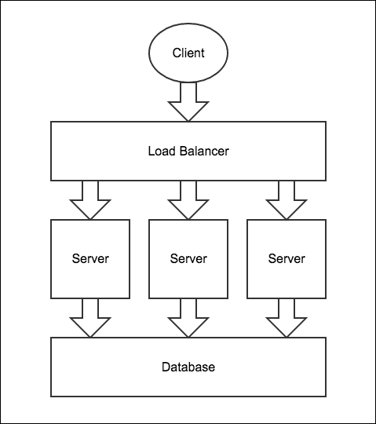
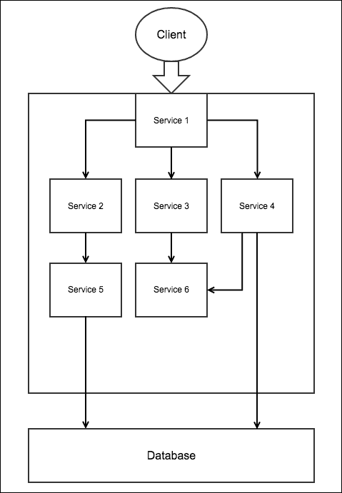
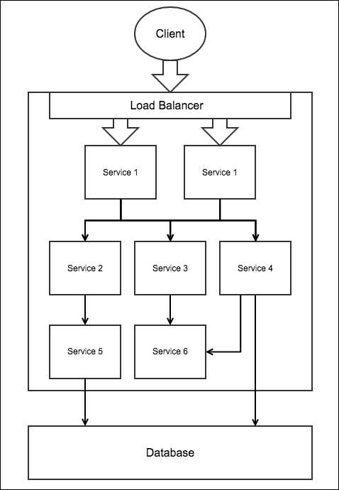
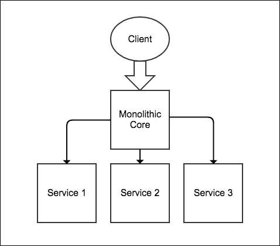

# 第一章. 突破微服务架构

为复杂和大型应用程序（拥有大量用户和大量数据的程序）开发服务器端应用程序的架构不应仅仅涉及更快的响应速度和为各种平台提供网络服务。它应该易于扩展、升级、更新、测试和部署。它还应该具有高可用性，允许开发者使用不同的编程语言编写服务器端应用程序的组件，并使用不同的数据库。因此，这导致构建大型和复杂应用程序的开发者从常见的单体架构转向允许我们轻松完成所有这些任务的微服务架构。随着微服务架构在构建大型和复杂应用程序的企业中得到广泛应用，学习如何使用这种架构设计和创建服务器端应用程序变得非常重要。在本章中，我们将讨论如何使用 Seneca 工具包和 Node.js 创建基于微服务架构的应用程序。

在本章中，我们将涵盖以下主题：

+   理解单体架构

+   基于单体架构的扩展、升级、部署和编写应用程序

+   深入探讨微服务架构

+   基于微服务架构的扩展、升级、部署和编写应用程序

+   开始使用 Seneca

+   使用 Seneca 创建和调用服务

# 什么是单体架构？

要理解微服务架构，首先理解单体架构，这是它的对立面。

在单体架构中，服务器端应用程序的不同功能组件，如支付处理、账户管理、推送通知以及其他组件，都融合在一个单一单元中。

例如，应用程序通常分为三个部分。这些部分包括在用户机器上运行的 HTML 页面或原生 UI，运行在服务器上的服务器端应用程序，以及也在服务器上运行的数据库。服务器端应用程序负责处理 HTTP 请求，从数据库中检索和存储数据，执行算法等。如果服务器端应用程序是一个单一的可执行文件（即，运行时是一个单一进程）来完成所有这些任务，那么我们说服务器端应用程序是单体化的。

这是一种常见的构建服务器端应用程序的方式。几乎每个主要的 CMS、Web 服务器、服务器端框架等都使用单体架构构建。

这种架构可能看起来很成功，但当您的应用程序变得庞大且复杂时，问题很可能会出现。

## 单体架构的缺点

以下是一些使用单体架构构建的服务器端应用程序引起的问题。

### 扩展单体架构

随着您的服务器端应用程序流量的增加，您将需要扩展您的服务器端应用程序以处理流量。

在单体架构的情况下，你可以通过在多个服务器上运行相同的可执行文件来扩展服务器端应用程序，并将服务器放置在负载均衡器后面，或者你可以使用轮询 DNS 在服务器之间分配流量：



在前面的图中，所有服务器都将运行相同的服务器端应用程序。

虽然扩展很简单，但扩展单体服务器端应用程序最终会导致扩展所有组件，而不是需要更多资源的组件。因此，有时会导致资源利用不平衡，这取决于组件需要的资源和类型。

让我们考虑一些例子，以了解在扩展单体服务器端应用程序时产生的问题：

+   假设有一个需要更强大或特殊类型硬件的服务器端应用程序组件，我们不能简单地扩展这个特定的组件，因为所有组件都打包在一起，因此，所有东西都需要一起扩展。所以，为了确保该组件获得足够的资源，你需要运行具有强大或特殊硬件的更多服务器上的服务器端应用程序，从而导致消耗比实际所需的更多资源。

+   假设我们有一个需要在特定服务器操作系统上执行的组件，而这个操作系统并非免费，我们不能简单地在这个非免费操作系统上运行这个特定的组件，因为所有组件都打包在一起，因此，仅仅为了执行这个特定的组件，我们需要在所有服务器上安装非免费操作系统，这大大增加了成本。

这些只是其中的一些例子。在扩展单体服务器端应用程序的过程中，你可能会遇到更多的问题。

因此，当我们扩展单体服务器端应用程序时，不需要更多强大或特殊类型资源的组件开始接收它们，因此减少了需要这些资源的组件的资源。我们可以这样说，扩展单体服务器端应用程序涉及扩展所有被迫在新服务器上重复一切组件的组件。

### 编写单体服务器端应用程序

单体服务器端应用程序是用特定的编程语言和框架编写的。企业通常有精通不同编程语言和框架的开发者来构建服务器端应用程序；因此，如果要求他们构建单体服务器端应用程序，那么他们合作起来将会很困难。

单体服务器端应用程序的组件只能在构建它的相同框架中使用，因此，你不能将它们用于使用不同技术构建的其他类型的项目。

### 单体架构的其他问题

这里有一些其他的问题，开发者可能会根据用于构建单体服务器端应用程序的技术遇到这些问题：

+   对于对其所做的每一个小改动，可能都需要完全重建和重新部署。这是一个耗时的工作，并且会使你的应用程序在长时间内不可用。

+   如果任何一个组件失败，它可能会完全失败。构建一个能够处理特定组件失败并相应降低应用程序功能的单体应用程序是困难的。

+   可能很难找到每个组件消耗了多少资源。

+   可能很难单独测试和调试各个组件。

# 微服务架构的拯救

我们看到了单体架构带来的问题。这些问题导致开发者从单体架构转向微服务架构。

在微服务架构中，服务器端应用程序被划分为服务。一个服务（或微服务）是一个小型且独立的进程，构成了完整服务器端应用程序的特定功能。例如，你可以有一个用于支付处理的服务，另一个用于账户管理的服务，等等；服务需要通过网络相互通信。

### 小贴士

**“小”服务是什么意思？**

你可能想知道一个服务需要多小，以及如何判断一个服务是否小。好吧，实际上这取决于许多因素，如应用程序的类型、团队管理、资源的可用性、应用程序的大小，以及你认为多小才算小。然而，一个小服务不一定是代码行数较少或提供非常基本功能的服务。一个小服务可以是开发者团队可以独立工作的服务，它可以独立扩展到其他服务，扩展它不会导致资源利用不平衡，并且它们在整体上与其他服务高度解耦（独立且不知情）。

你不必在每个不同的服务器上运行每个服务，也就是说，你可以在单个计算机上运行多个服务。服务器与服务的比例取决于不同的因素。一个常见的因素是所需资源和技术的数量和类型。例如，如果一个服务需要大量的 RAM 和 CPU 时间，那么最好是在服务器上单独运行它。如果有一些服务不需要太多资源，那么你可以将它们全部在单个服务器上一起运行。

下图显示了微服务架构的一个示例：



在这里，你可以将**服务 1**视为与浏览器通信的 Web 服务器，以及其他提供各种功能 API 的服务。Web 服务与其他服务通信以获取数据。

## 微服务架构的优点

由于服务规模小且独立，并通过网络进行通信，微服务架构解决了单体架构所面临的许多问题。以下是微服务架构的一些好处：

+   由于服务通过网络进行通信，因此可以使用不同的编程语言和不同的框架来编写。

+   只需要重新部署特定的服务，而不是所有服务，就可以对服务进行更改，这是一个更快的流程。

+   由于每个服务都在不同的进程中运行，因此测量每个服务消耗了多少资源变得更加容易。

+   由于可以单独分析每个服务，因此测试和调试变得更加容易。

+   服务可以通过网络调用与其他应用程序交互，因此可以被其他应用程序重用。

## 服务扩展

除了前面的好处之外，微服务架构的一个主要好处是你可以扩展需要扩展的个别服务，而不是所有服务，从而防止资源重复和资源利用不平衡。

假设我们想要扩展前面图中的**服务 1**。以下是展示如何扩展的图示：



在这里，我们在两个不同的服务器上运行**服务 1**的两个实例，这两个服务器位于负载均衡器后面，负载均衡器在这两个服务器之间分配流量。所有其他服务都以相同的方式运行，因为不需要扩展它们。如果你想要扩展**服务 3**，那么你可以在多个服务器上运行多个**服务 3**的实例，并将它们放置在负载均衡器后面。

## 微服务架构的缺点

虽然与单体架构相比，使用微服务架构有很多优点，但微服务架构也有一些缺点：

+   由于服务器端应用程序被划分为服务，因此分别部署和（可选）配置每个服务是一项繁琐且耗时的任务。

    ### 注意

    注意，开发者通常使用一些自动化技术（如 AWS、Docker 等）来使部署变得更容易；然而，要使用这些技术，你仍然需要具备对该技术良好的经验和专业知识。

+   由于服务之间的通信是通过网络进行的，因此服务之间的通信可能会延迟。

+   这种服务器端应用程序更容易受到网络安全漏洞的影响，因为服务是通过网络进行通信的。

+   为与其他服务通信编写代码可能更困难，也就是说，你需要进行网络调用，然后解析数据以读取它。这也需要更多的处理。请注意，尽管有框架可以构建使用微服务的服务器端应用程序，使获取和解析数据变得更容易，但这仍然不能减少处理和网络等待时间。

+   你肯定需要某种监控工具来监控服务，因为它们可能会因为网络、硬件或软件故障而停止。尽管你可能只在应用程序突然停止时使用监控工具，但要构建监控软件或使用某种服务，监控软件需要一定程度的额外经验和专业知识。

+   基于微服务的服务器端应用程序比基于单体架构的服务器端应用程序要慢，因为通过网络进行通信比通过内存要慢。

## 何时使用微服务架构

选择单体和微服务架构可能看起来很困难，但实际上决定它们并不那么难。

如果你正在使用单体架构构建服务器端应用程序，并且你认为你不太可能遇到我们之前讨论过的任何单体问题，那么你可以坚持使用单体架构。将来，如果你遇到可以用微服务架构解决的问题，那么你应该切换到微服务架构。

如果你正在从单体架构切换到微服务架构，那么你不必重写整个应用程序，而是可以通过进行一些代码重构，将导致问题的组件转换为服务。这种主要应用程序逻辑是单体但某些特定功能通过服务公开的服务器端应用程序称为具有单体核心的微服务架构。随着问题的进一步增加，你可以开始将更多单体核心的组件转换为服务。



如果你正在使用单体架构构建服务器端应用程序，并且你认为你可能会遇到我们之前讨论过的任何单体问题，那么你应该立即切换到微服务架构或具有单体核心的微服务架构，具体取决于最适合你的选择。

## 数据管理

在微服务架构中，每个服务都可以有自己的数据库来存储数据，也可以使用集中式数据库。

一些开发者根本不使用集中式数据库，而是所有服务都有自己的数据库来存储数据。为了在服务之间同步数据，当它们的数据发生变化时，服务会省略事件，而其他服务则订阅事件并更新数据。这种机制的问题在于，如果某个服务宕机，它可能会错过一些事件。还可能会有大量的重复数据，最后，编写这种系统也相当困难。

因此，拥有一个集中式数据库并允许每个服务在需要存储不希望与他人共享的数据时维护自己的数据库是一个好主意。服务不应直接连接到集中式数据库，而应该有一个名为 **数据库服务** 的其他服务，它提供与集中式数据库交互的 API。这个额外的层有许多优点，例如，可以更改底层模式而无需更新和重新部署依赖于该模式的全部服务，我们可以在不更改服务的情况下添加缓存层，可以更改数据库类型而不对服务进行任何更改，并且还有许多其他好处。如果存在多个模式，或者有不同类型的数据库，或者由于其他有利于整体架构并解耦服务的其他原因，我们还可以拥有多个数据库服务。

# 使用 Seneca 实现微服务

Seneca 是一个用于使用微服务架构和单体核心创建服务器端应用的 Node.js 框架。

之前我们讨论了在微服务架构中，我们为每个组件创建一个独立的服务，所以你可能想知道使用框架来创建服务（这些服务可以通过简单地编写一些代码来监听端口并回复请求来完成）有什么意义。好吧，编写代码来发起请求、发送响应和解析数据需要花费很多时间和精力，但像 Seneca 这样的框架可以让这一切变得简单。此外，将单体核心的组件转换为服务也是一个繁琐的任务，因为它需要大量的代码重构，但 Seneca 通过引入动作和插件的概念使其变得容易。最后，用任何其他编程语言或框架编写的服务都将能够与 Seneca 服务进行通信。

在 Seneca 中，一个动作代表一个特定的操作。动作是一个通过称为动作模式的对象字面量或 JSON 字符串来标识的函数。

在 Seneca 中，这些单体核心组件的操作是通过动作编写的，我们可能希望以后将这些操作从单体核心移动到服务，并通过网络将其暴露给其他服务和单体核心。

### 小贴士

**为什么是动作？**

你可能想知道使用操作而不是函数来编写操作有什么好处，以及操作如何使将单体核心的组件转换为服务变得容易？假设你想要将使用函数编写的单体核心操作移动到单独的服务中并通过网络公开，那么你无法简单地复制和粘贴该函数到新服务中，相反，你需要定义一个路由（如果你使用 Express）。要调用单体核心内的函数，你需要编写代码向服务发出 HTTP 请求。要调用服务内的此操作，你可以简单地调用一个函数，因此根据你执行操作的位置，会有两个不同的代码片段。因此，移动操作需要大量的代码重构。然而，如果你使用 Seneca 操作编写前面的操作，那么将操作移动到单独的服务中将会非常容易。

如果操作是用操作编写的，并且你想要将操作移动到单独的服务中并通过网络公开，那么你只需将操作复制和粘贴到新服务中即可。就是这样。显然，我们还需要告诉服务通过网络公开操作，并告诉单体核心在哪里可以找到操作，但所有这些只需要几行代码。

Seneca 服务向其他服务和单体核心公开操作。在向服务发出请求时，我们需要提供一个与操作模式匹配的模式，以便在服务中调用该操作。

### 小贴士

**为什么使用模式？**

模式使将 URL 映射到操作变得容易。模式可以根据特定条件覆盖其他模式，因此它防止了对现有代码的编辑，因为在生产网站上编辑现有代码是不安全的，并且有许多其他缺点。

Seneca 还有一个插件的概念。`seneca` 插件实际上是一组可以轻松分发和插入到服务或单体核心中的操作。

随着我们的单体核心变得更大和更复杂，我们可以将组件转换为服务。也就是说，将某些组件的操作移动到服务中。

## 创建你的第一个 Seneca 应用程序

让我们使用 Seneca 创建一个基本的应用程序来演示如何使用它。我们将创建一个允许用户登录和注册的应用程序。这将是一个演示应用程序，仅用于演示如何创建操作、插件和服务，而不是演示登录和注册功能的工作原理。

在你继续之前，创建一个名为 `seneca-example` 的目录，并在其中放置一个名为 `package.json` 的文件。在 `seneca-example` 目录中，我们将放置我们的服务和单体核心。在 `package.json` 文件中，放置以下代码，以便 npm 能够下载我们应用程序的依赖项：

```js
{
  "name": "seneca-example",
  "dependencies": {
    "seneca": "0.6.5",
    "express" : "latest"
  }
}
```

这里我们使用 Seneca 版本 0.6.5。请确保您也使用相同的版本，以避免代码不兼容。

现在，在 `seneca-example` 目录中运行 `npm install` 命令以本地安装 Seneca 和其他包。

现在创建一个名为 `main.js` 的文件，它将成为我们服务器端应用程序的单一代码库核心。

单一代码库和所有服务都是 `seneca` 实例。将以下代码放置在 `main.js` 文件中以创建一个 `seneca` 实例：

```js
var seneca = require("seneca")();
```

现在将使用这个 `seneca` 对象添加操作、调用操作、添加插件以及做所有事情。

### 创建操作

让我们为登录和注册功能创建操作，并将它们放置在 `main.js` 文件中。要创建操作，我们需要使用 `seneca` 对象的 `add` 方法。`add` 方法的第一个参数接受一个 JSON 字符串或对象，它是操作标识符（称为 **pattern** 以识别操作）。第二个参数是一个回调函数，当操作被调用时将被执行。

将以下代码放置在创建两个登录和注册操作的 `main.js` 文件中，如下所示：

```js
seneca.add({role: "accountManagement", cmd: "login"}, function(args, respond){
});

seneca.add({role: "accountManagement", cmd: "register"}, function(args, respond){
});
```

我们将在本章后面看到操作体的代码。

`role` 和 `cmd` 属性没有特殊之处。你可以使用任何你想要的属性名。

第二个参数是一个回调函数，当操作被调用时将被调用。

如果有多个具有相同模式的操作，则后面的操作会覆盖其他操作。

我们需要使用 `seneca` 对象的 `act` 方法来调用实例本地的操作或位于其他服务上的操作。`act` 方法的第一个参数是一个模式，用于匹配操作，第二个参数是一个回调函数，当操作被调用后将被执行。

下面是一个示例代码，展示了如何调用前面的两个操作：

```js
seneca.act({role: "accountManagement", cmd: "register", username: "narayan", password: "mypassword"}, function(error, response){
});

seneca.act({role: "accountManagement", cmd: "login", username: "narayan", password: "mypassword"}, function(error, response){
});
```

传递给 `act` 方法的回调函数会在操作的结果到达后异步执行。

在这里，我们传递给 `act` 方法的对象比它应该匹配的操作模式多两个额外属性。然而，操作仍然被匹配并调用，因为如果传递给 `act` 方法的模式属性多于操作模式应该匹配的属性，Seneca 会找到所有具有与传递给 `act` 方法的模式属性匹配的操作模式，并调用具有最多匹配属性的那个操作。

如果 Seneca 找到具有相等匹配属性数量的多个操作模式，则它们将按升序字母顺序匹配。

### 注意

你可以在 [`senecajs.org/getting-started.html#patterns-unique-override`](http://senecajs.org/getting-started.html#patterns-unique-override) 了解更多关于 Seneca 模式匹配的信息。

### 创建插件

Seneca 插件是一组相关操作的集合。从编程角度来看，可以使用函数或模块创建 `seneca` 插件。

插件使得在应用程序之间分发一组动作变得容易。你也会在由 npm 维护的在线公共包注册库中找到`seneca`插件。例如，有一个`seneca`插件提供了与 MongoDB 数据库一起工作的动作。这个插件只需一行代码就可以插入单体核心或服务。

默认情况下，当我们创建一个`seneca`实例时，Seneca 会安装四个内置插件。这些插件是**basic**、**transport**、**web**和**mem-store**。

让我们先使用一个函数创建一个插件。函数名称就是插件名称，插件也可以有一个初始化动作，这个动作将在插件附加到`seneca`实例时立即被调用。

因此，让我们创建一个名为`account`的插件，并将登录和注册动作放在其中，因为稍后我们将创建一个服务并将动作移到那里。删除我们在`main.js`文件中之前定义的动作，并替换以下代码：

```js
function account(options)
{
  this.add({init: "account"}, function(pluginInfo, respond){
    console.log(options.message);
    respond();
  })

  this.add({role: "accountManagement", cmd: "login"}, function(args, respond){
  });

  this.add({role: "accountManagement", cmd: "register"}, function(args, respond){
  });
}

seneca.use(account, {message: "Plugin Added"});
```

这里我们定义了一个名为`account`的函数，并使用`seneca`对象的`use`方法将其附加。要附加多个插件，我们可以多次调用`use`方法。

`init:account`动作是 Seneca 在插件添加后调用的初始化动作。这可以用来做诸如建立数据库连接或其他插件动作所依赖的事情。

插件内部的`this`关键字指的是`seneca`实例。

让我们使用模块创建相同的插件，以便它易于分发，并可以放入`npm`注册库中。创建一个名为`account.js`的文件，并将其放置在`seneca-example`目录中。`account.js`是插件模块。将此代码放入`account.js`文件中：

```js
module.exports = function(options)
{
  this.add({init: "account"}, function(pluginInfo, respond){

    console.log(options.message);

    respond();
  })

  this.add({role: "accountManagement", cmd: "login"}, function(args, respond){
  });

  this.add({role: "accountManagement", cmd: "register"}, function(args, respond){
  });

  return "account";
}
```

这里是匿名函数返回的字符串中的插件名称。

删除我们在`main.js`文件中之前定义的插件代码，并替换以下代码：

```js
seneca.use("./account.js", {message: "Plugin Added"});
```

在这里，为了附加插件，我们提供了模块路径。

### 注意

你可以在[`senecajs.org/write-a-plugin.html`](http://senecajs.org/write-a-plugin.html)了解更多关于创建 Seneca 插件的信息，你可以在[`senecajs.org/plugins.html`](http://senecajs.org/plugins.html)找到所有 Seneca 插件。

### 创建服务

服务是一个通过网络公开一些动作的`seneca`实例。让我们创建一个公开登录和注册动作的服务。

在`seneca-example`目录下创建一个名为`account-service.js`的文件，它将作为服务。然后将其中的以下代码放入其中，以创建一个公开登录和注册动作的服务：

```js
var seneca = require("seneca")();

seneca.use("./account.js", {message: "Plugin Added"});

seneca.listen({port: "9090", pin: {role: "accountManagement"}});
```

这里，我们首先创建了一个`seneca`实例。然后通过插件添加了动作。你也可以使用`seneca`对象的`add`方法手动添加动作。最后，我们通过 HTTP 协议公开了这些动作。Seneca 也支持其他协议，但我们将坚持使用 HTTP，因为它是使用最广泛的协议。

`seneca.listen`创建一个 HTTP 服务器来监听请求。我们还提供了端口号和引脚，这两者都是可选的。默认端口号是`10101`，如果没有提供，则默认没有引脚。

您可能想知道引脚是什么，以及它用于什么？好吧，您可能并不总是想通过网络公开服务的所有动作。在这种情况下，您可以为`pin`属性提供一个模式，服务器将处理与`pin`模式匹配的请求。

现在，为了其他服务或单体核心能够调用此服务的动作，它们需要注册此服务。

从`main.js`文件中删除之前的插件附加代码，并添加以下代码来注册服务：

```js
seneca.client({port: "9090", pin: {role: "accountManagement"}});
```

在这里，我们通过提供`port`号码和`pin`来注册服务。这两者都是可选的。如果我们不使用任何端口号，则默认为`10101`。如果服务在不同的服务器上，则应使用`host`属性来提供 IP 地址。

附在`client`方法上的`pin`用于告诉`seneca`实例服务公开了哪些动作。这是完全可选的。Seneca 不会向不匹配`pin`模式的任何服务发送请求。

您可以通过多次调用客户端方法来添加您想要的服务。

当您调用`act`方法来调用一个动作时，`seneca`实例首先在本地查找该动作，然后再请求服务。如果本地找不到，它将检查具有引脚的服务，看是否有匹配的。如果引脚匹配，则向该特定服务发送请求。最后，如果任何引脚不匹配，它将逐个向所有没有引脚的其他服务发送请求，直到从其中之一获得有效响应。

您还可以通过向这些类型的 URL 发送 GET 请求来手动调用服务的动作：

```js
http://localhost:9090/act?role=accountManagement&cmd=login&username=narayan&password=mypassword

```

您还可以通过使用 POST 请求来调用服务。以下是如何使用 CURL 进行操作的示例：

```js
curl -d '{"role":"accountManagement","cmd":"login","username":"narayan","password":"mypassword"}' -v http://localhost:9090/act
```

### 存储数据

Seneca 提供了一个内置机制来存储数据。Seneca 提供了一些内置动作，允许我们存储数据。内置动作默认使用`mem-store`来存储数据。**mem-store**是一个异步的内存存储系统。

您可以使用默认的存储机制来创建您的应用程序。如果您想更改底层存储系统，只需安装特定存储系统的插件即可，这将覆盖内置存储动作，因此您不需要重构任何代码。

执行 CRUD 操作的内建动作如下：

+   `role:entity,cmd:load,name:<entity-name>`：这是用来通过其 ID 检索实体的。实体可以被视为 MySQL 中的一行。每个实体都有一个唯一的 ID。

+   `role:entity,cmd:save,name:<entity-name>`：这是用来更新（如果您提供实体 ID）或添加实体（如果不存在）。实体以对象的形式存储和检索。

+   `role:entity,cmd:list,name:<entity-name>`：这是用于列出所有与查询匹配的实体。

+   `role:entity,cmd:remove,name:<entity-name>`：这是用于使用其实体 ID 删除实体。

Seneca 还提供了一些包装函数，用于提取这些操作并使其调用这些操作变得容易。这些函数是 `load$`、`save$`、`list$` 和 `remove$`。

让我们实现登录和注册操作，以便我们可以登录并注册新的账户。

这里是账户操作的实现。在 `account.js` 文件中更新此代码：

```js
this.add({role: "accountManagement", cmd: "login"}, function(args, respond){
  var accounts = this.make("accounts");

  accounts.list$({username: args.username, password: args.password}, function(error, entity){
    if(error) return respond(error);

    if(entity.length == 0)
    {
      respond(null, {value: false});
    }
    else
    {
      respond(null, {value: true});
    }
  });
});
```

传递给 `add` 方法的回调的第一个参数持有与操作的模板匹配的对象的引用。

在这里，我们首先调用 `seneca` 对象的 `make` 方法。它用于获取实体存储的引用。例如，在 MySQL 的情况下，`make` 方法获取到表的引用。

然后，我们将查找是否有任何实体具有通过 `act` 方法传递的用户名和密码。由于实体作为对象添加，为了查询实体，我们需要传递一个对象。现在 `list$` 查找所有具有相同用户名和密码的实体。

我们正在将一个回调传递给 `$list` 方法，该方法将在数据检索后异步调用。此回调有两个参数，即第一个参数是如果存在错误，则为 `error` 对象，否则为 `null`。第二个参数是找到的与给定对象匹配的实体数组。

为了让操作能够响应，它需要通过传递一个对象作为第二个参数调用操作回调的第二个参数。如果发生错误，我们需要在第一个参数中传递错误。

同样，现在让我们编写注册操作的代码，如下所示：

```js
this.add({role: "accountManagement", cmd: "register"}, function(args, respond){
  var accounts = this.make("accounts");

  accounts.list$({username: args.username}, function(error, entity){
    if(error) return respond(error);

    if(entity.length == 0)
    {
      var data = accounts.data$({username: args.username, password: args.password})

      data.save$(function(error, entity){
        if(error) return respond(error);

        respond(null, {value: true});
      });
    }
    else
    {
      respond(null, {value: false});
    }
  });
});
```

在这里，大部分代码都是可理解的，因为它的工作方式与之前的操作相同。为了存储数据，我们通过传递要存储的实体使用 `data$` 方法创建一个新的实体存储引用。然后我们调用 `save$` 方法来保存实体。

### 注意

要了解更多关于在 Seneca 中存储数据的信息，请访问 [`senecajs.org/data-entities.html`](http://senecajs.org/data-entities.html)。

### 集成 Express 和 Seneca

我们已经完成了登录和注册操作的创建。现在，由于我们的后端将被应用程序使用，或者它可能代表一个网站，我们需要为将使用它们与服务器通信的客户端提供 URL。

单体核心是我们服务器端应用程序的一部分，客户端在大多数功能上与之交互。如果需要，客户端也可以直接与服务交互以实现某些特定功能。

因此，我们需要在我们的服务器端应用程序的单体核心和服务的某些部分使用一种网站开发框架。我们将使用 Express，因为它是最受欢迎的。

Seneca 还提供了一种内置方式将 URL 映射到动作，即发送到 HTTP 服务器的请求可以自动映射到特定的动作以调用它们。这是通过一个定义对象完成的，其属性定义了从 URL 到动作模式的路由映射。这个内置方法定义了独立于所使用的框架的路由映射。一旦我们定义了定义对象，我们需要一个特定于 Web 服务器框架的插件来捕获并解析 URL 到动作模式，使用定义对象。定义对象允许你附加回调函数，这些回调函数将通过参数获取动作的响应，然后回调函数可以以他们想要的任何格式将数据返回给用户。如果你正在创建一个需要公开一些特定 URL 请求的调用动作的插件进行分发，那么你将不得不使用内置方法，因为它定义了独立于所使用的框架的路由映射。

### 注意

你可以在[`github.com/rjrodger/seneca-web`](https://github.com/rjrodger/seneca-web)了解更多如何使用内置方式将 Seneca 和 Express 集成。

将以下代码添加到 `main.js` 文件中，以在其中启动 Express 服务器：

```js
var app = require("express")();
app.use(seneca.export("web"))
app.listen(3000);
```

在第二行，我们导出由 `seneca-web` 插件提供的中间件函数。`seneca-web` 是用于直接集成 Seneca 和 Express 的插件，即使用 Express 框架的定义对象将 URL 转换为动作模式。如果我们使用定义对象来定义路由映射，则这是必需的。我们不会使用定义对象，但我们应该仍然使用 `seneca-web`，因为如果使用这些插件，一些第三方插件可能会使用定义对象。例如，如果你使用 `seneca-auth` 插件，那么你将不得不包含第二行。

我们希望用户能够通过 `/account/login` 路径登录，并通过 `/account/register` 路径注册。用户将通过查询字符串提供用户名和密码。以下是定义处理登录和注册 HTTP 请求路由的代码：

```js
app.get('/account/register', function(httpRequest, httpResponse, next){
  httpRequest.seneca.act({role: "accountManagement", cmd: "register", username: httpRequest.query.username, password: httpRequest.query.password}, function(error, response){
    if(error) return httpResponse.send(error);

    if(response.value == true)
    {
      httpResponse.send("Account has been created");
    }
    else
    {
      httpResponse.send("Seems like an account with same username already exists");
    }
  });
});

app.get('/account/login', function(httpRequest, httpResponse, next){
  httpRequest.seneca.act({role: "accountManagement", cmd: "login", username: httpRequest.query.username, password: httpRequest.query.password}, function(error, response){
    if(error) return httpResponse.send(error);

    if(response.value == true)
    {
      httpResponse.send("Logged in!!!");
    }
    else
    {
      httpResponse.send("Please check username and password");
    }
  });
});
```

在这里，我们根据 URL 请求的路径调用适当的动作。

在这里，我们不是使用 `seneca.act`，而是使用 `httpRequest.seneca.act` 作为我们之前导出的中间件函数，它为每个 HTTP 请求对象添加一个新的 `seneca` 属性。这个属性继承实际的 `seneca` 实例。第三方插件中的动作通过将属性添加到 `seneca` 属性中，以便与其他路由处理器共享与特定 HTTP 请求相关的信息。即使我们使用 `seneca.act`，前面的代码也会以相同的方式运行，但使用 `httpRequest.seneca.act` 是一个好习惯，因为我们可能会使用这种类型的插件。你自己的路由处理器也可以使用 `httpRequest.seneca.act` 来传递与 `seneca` 相关的信息。

现在，要运行应用程序，首先运行 `account-service.js` 文件，然后运行 `main.js` 文件。您可以使用以下 URL 登录和注册：

+   `http://localhost:8080/account/login?username=narayan&password=mypassword`

+   `http://localhost:8080/account/register?username=x&password=mypassword`

在这里，我们看到了如何创建一个网页界面，它可以被应用程序使用，或者如果是一个网站，可以用来提供 HTML 页面。

如果我们希望不同的服务来处理某些请求，我们也可以将 Express 的路由移动到该服务中。

# 摘要

在本章中，我们看到了单体架构和微服务架构之间的区别。然后我们讨论了具有单体核心的微服务架构的含义及其优势。最后，我们探讨了使用 Seneca 框架实现具有单体核心的微服务架构，并讨论了如何创建基本的登录和注册功能来展示 Seneca 框架的各种特性以及如何使用它。

在下一章中，我们将使用 Seneca 和 Express 框架创建一个功能齐全的电子商务网站。
