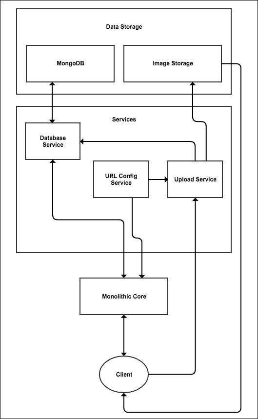
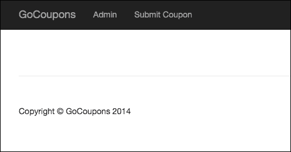
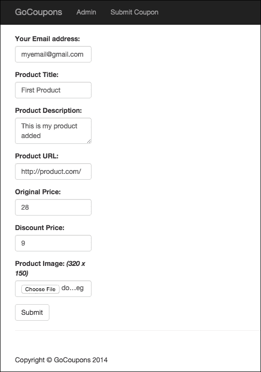
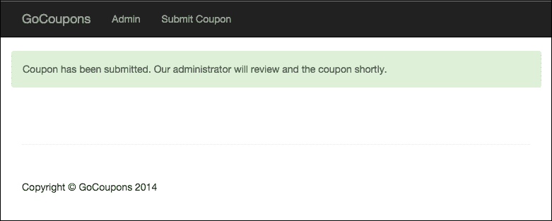
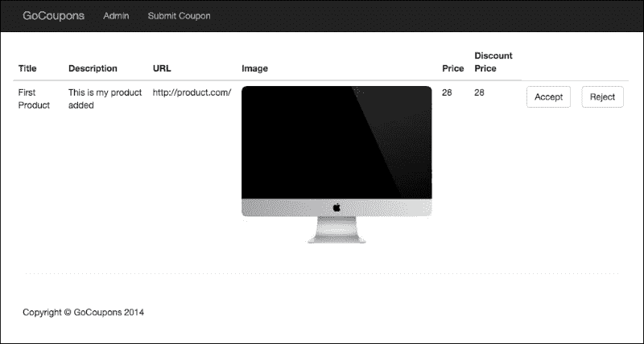
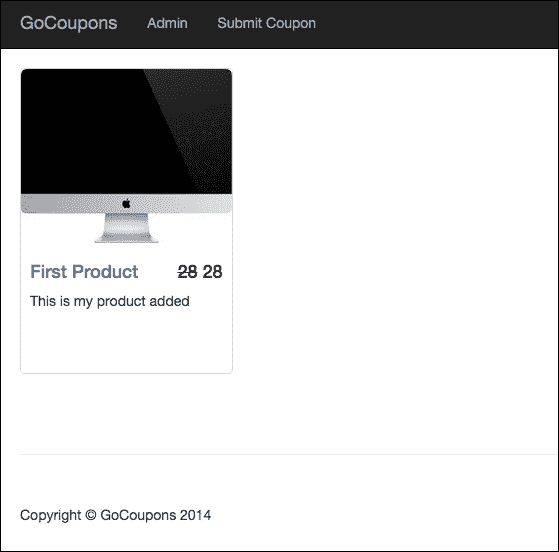

# 第二章：构建优惠券网站

理解 Seneca 和微服务架构的最好方式是通过构建一个能够从微服务架构中受益的服务器端应用程序。在前一章中，我们看到了大型和复杂的服务器端应用程序如何从微服务架构中受益，以及为什么企业使用微服务架构。在本章中，我们将构建一个优惠券网站，以实际演示使用微服务架构和 Seneca 创建服务器端应用程序的好处。在构建这个优惠券网站的过程中，您还将学习如何从头开始设计使用微服务架构的服务器端应用程序，如何将应用程序的功能拆分为服务，如何客户端直接与服务通信，以及其他许多内容。

本章将涵盖的一些内容，除了与 Seneca 和微服务架构相关的内容外，还包括以下内容：

+   使用 `seneca-mongo-store` 插件将数据存储在 MongoDB 中

+   创建一个基本的图像存储服务器

+   使用 basic-auth npm 包讨论 HTTP 基本身份验证

+   使用 connect-multiparty npm 包解析带有 `multipart/form-data` 内容类型的 HTTP POST 请求

+   使用 `fs` npm 包在 Node.js 中移动、删除和重命名文件

+   使用 MongoDB 和 Express 实现分页

# 入门

我们将构建的优惠券网站将允许用户提交优惠券。为了使优惠券公开可见，网站管理员应接受该优惠券。每个优惠券都将附有一张图片，该图片将由图像存储服务器存储和提供。

我们将使用 MongoDB 来存储优惠券。在您继续之前，请确保您已安装并运行 MongoDB。我假设您对 MongoDB 有基本的了解。

练习文件包含两个目录：`Initial` 和 `Final`。在 `Final` 目录中，您将找到完整的优惠券网站源代码。在 `Initial` 目录中，您将找到单体核心的 HTML 代码和目录，包括服务、图像存储服务器等。您将把与它们相关的代码放入各自的目录中。`Initial` 目录将帮助您快速开始构建优惠券网站。

我们不会涉及优惠券网站的前端设计。我们只会专注于构建网站的架构和功能。因此，HTML 代码已包含在 `Initial` 目录中。

# 我们网站的架构

我们的服务器端应用程序将由单体核心、三项服务、MongoDB 服务器和图像存储服务器组成。

单体核心将为网站访客和管理员提供服务页面。

三项服务是数据库服务、URL 配置服务和上传服务。以下分别是这些服务的作用：

+   **数据库服务**：在 MongoDB 中添加、检索、更新和删除优惠券是通过数据库服务完成的。单体核心通过数据库服务从 MongoDB 检索优惠券，上传服务通过数据库服务存储优惠券。

+   **上传服务**：当用户提交优惠券时，HTML 表单会提交到上传服务。上传服务然后将图像发送到图像存储服务器，并使用数据库服务将优惠券的元数据添加到数据库中。我们将这些操作移动到不同的服务中，因为如果我们对上传的图像进行缩放和转换，那么它将消耗更多的内存和 CPU 时间，并且保持端口开放更长时间，这可能会导致服务器过载，并在有大量提交时破坏单体核心，因此将这些操作移动到不同的服务中可以确保如果提交量增加，不会影响寻找优惠券的网站访客。我们不会对图像进行缩放和转换，但如果你想要添加这个功能，你可以通过简单地更新上传服务来实现。在上传服务更新期间，表单提交将不会工作，但其他一切都将正常工作。因此，我们可以这样说，这个功能可以独立更新，而不会影响其他功能。

+   **URL 配置服务**：客户端与单体核心、图像存储服务器和上传服务进行通信。在生产站点中，这三个服务器将保留在三个不同的物理计算机上，每个计算机有不同的 IP 地址。因此，为了让客户端能够与它们通信，这三个服务器需要通过不同的域名（即单体核心可以使用主域名，其他两个可以使用子域名）进行暴露，或者我们可以使用支持 URL 重定向的负载均衡器或反向代理，这样我们就可以有一个单一的域名，并根据 URL 的路径将请求路由到相应的服务器。URL 配置服务将提供基础 URL 以与这三个服务器通信。为了跟随本章内容，你可以简单地使用不同的端口在同一台物理计算机上运行这些服务器，当你准备好将站点上线时，你可以根据你用来使客户端能够与服务器通信的技术更改 URL 配置服务中的基础 URL。你不需要直接修改服务器的源代码，这是一个繁琐且风险较高的任务。

我们将创建自己的图像存储服务器。然而，在生产站点中，我建议你使用 Amazon S3 或类似的服务来存储图像，因为它使得通过 CDN 提供图像变得容易。你不必担心扩展性和可靠性，而且成本很低。我们将创建的图像存储服务器将是一个基本的，仅用于演示如何在单独的服务器上存储图像并从那里提供。

下图显示了所有架构的外观以及架构中的服务器如何相互通信：



# 创建服务

在构建图像存储服务器和单体核心之前，让我们首先构建服务。

我们将首先构建数据库服务，因为它只依赖于已运行的 MongoDB 服务器。上传服务和单体核心依赖于它，因此它需要在这些服务之前构建。

## 数据库服务

数据库服务将提供添加优惠券、列出已验证优惠券、列出未验证优惠券、验证优惠券和删除优惠券的操作。这些操作将由上传服务和单体核心使用。

打开`Initial/database-service`目录。在目录内，您将找到一个`package.json`文件和一个`app.js`文件。`app.js`文件是您将编写代码的地方，而`package.json`列出了数据库服务的依赖项。数据库服务依赖于`seneca`和`seneca-mongo-store`插件。在`Initial/database-service`内部运行`npm install`命令以本地安装依赖项。

下面是导入`seneca`模块、创建`seneca`实例、附加`seneca-mongo-store`插件并初始化插件以连接到 MongoDB 的代码：

```js
var seneca = require("seneca")();

seneca.use("mongo-store", {
  name: "gocoupons",
  host: "127.0.0.1",
  port: 27017
});
```

在这里，我们使用`gocoupons`作为数据库名。我假设 MongoDB 服务器正在本地默认端口`27017`上运行。

下面是创建允许添加优惠券的操作的代码：

```js
seneca.add({role: "coupons-store", cmd: "add"}, function(args, respond){
  var coupons = seneca.make$("coupons");
  var data = coupons.data$({title: args.title, desc: args.desc, email: args.email, url: args.url, price: args.price, discount: args.discount, thumbnail_id: args.thumbnail_id, verified: false});
  data.save$(function(err, entity){
    if(err) return respond(err);

    respond(null, {value: true});
  });
});
```

我们将把优惠券存储在名为`coupons`的集合中。在这里，我们将文档的`verified`属性设置为`false`，也就是说，每当用户提交新的优惠券时，我们将使其未经验证，以便管理员可以检索这个新提交的优惠券并手动验证它。

`thumbnail_id`属性不包含优惠券缩略图的完整 URL，而只是文件名。

下面是创建检索已验证优惠券操作的代码：

```js
seneca.add({role: "coupons-store", cmd: "list"}, function(args, respond){
  var coupons = seneca.make$("coupons");
  coupons.list$({verified: true, limit$:21, skip$: args.skip}, function (err, entity){
    if(err) return respond(err);

    respond(null, entity);
  })
});
```

此操作最多检索 21 张优惠券，并接受一个`skip`参数，用于跳过一些文档，使得可以使用此操作实现分页。

下面是创建检索未验证优惠券操作的代码：

```js
seneca.add({role: "coupons-store", cmd: "admin_list"}, function(args, respond){
  var coupons = seneca.make$("coupons");
  coupons.list$({verified: false}, function (err, entity){
    if(err) return respond(err);

    respond(null, entity);
  })
});
```

此操作将用于检索优惠券，以便在管理员面板上显示，供管理员接受或拒绝优惠券。

下面是创建验证优惠券操作的代码，即更改`verified`属性从`false`到`true`：

```js
seneca.add({role: "coupons-store", cmd: "verified"}, function(args, respond){
  var coupons = seneca.make$("coupons");
  var data = coupons.data$({id: args.id, verified: true});
  data.save$(function(err, entity){
  if(err) return respond(error);

    respond(null, {value: true});
  });
});
```

当管理员接受要公开显示的优惠券时，将调用此操作。

下面是创建删除优惠券操作的代码：

```js
seneca.add({role: "coupons-store", cmd: "delete"}, function(args, respond){
  var coupons = seneca.make$("coupons");
  coupons.remove$({id: args.id});
  respond(null, {value: true});	
});
```

当管理员拒绝优惠券时，将调用此操作。

现在我们已经为我们的数据库服务创建了所有操作，让我们通过网络公开这些操作，以便其他服务器可以调用它们。下面是执行此操作的代码：

```js
seneca.listen({port: "5010", pin: {role: "coupons-store"}});
```

现在请使用 `node app.js` 命令运行数据库服务。

## URL 配置服务

上传服务使用 URL 配置服务来查找单体核心的基本 URL，以便在优惠券成功提交后将其重定向到那里。此外，单体核心使用此服务来查找图像存储服务器和上传服务的基本 URL，以便将其包含在 HTML 代码中。

打开 `Initial/config-service` 目录。在该目录中，您将找到一个 `package.json` 文件和一个 `app.js` 文件。`app.js` 文件是您将编写代码的地方，而 `package.json` 列出了配置服务的依赖项。URL 配置服务仅依赖于 seneca。在 `Initial/config-service` 中运行 `npm install` 命令以本地安装依赖项。

以下是将 `seneca` 模块导入并创建返回上传服务、单体核心和图像存储服务器基本 URL 的操作的代码：

```js
var seneca = require("seneca")();

seneca.add({role: "url-config", cmd: "upload-service"}, function(args, respond){
  respond(null, {value: "http://localhost:9090"});
});

seneca.add({role: "url-config", cmd: "monolithic-core"}, function(args, respond){
  respond(null, {value: "http://localhost:8080"});
});

seneca.add({role: "url-config", cmd: "image-storage-service"}, function(args, respond){
  respond(null, {value: "http://localhost:7070"});
});

seneca.listen({port: "5020", pin: {role: "url-config"}});
```

现在请使用 `node app.js` 命令运行 URL 配置服务。

## 上传服务

上传服务处理新的优惠券表单提交。该表单包括优惠券标题、URL、描述、价格、折扣价格和缩略图。表单提交的内容类型是 `multipart/form-data`，因为它正在上传图像文件。

打开 `Initial/upload-service` 目录。在该目录中，您将找到一个 `package.json` 文件和一个 `app.js` 文件。`app.js` 文件是您将编写代码的地方，而 `package.json` 列出了上传服务的依赖项。上传服务依赖于 `seneca`、`express`、`connect-multiparty`、`path`、`fs` 和 `request` 包。在 `Initial/upload-service` 中运行 `npm install` 命令以本地安装依赖项。

以下是将模块导入的代码：

```js
var seneca = require("seneca")();
var app = require("express")();
var multipart = require("connect-multiparty")();
var path = require("path");
var fs = require("fs");
var request = require("request");
```

用户可能会上传具有相同名称的图像。我们不希望具有相同名称的图像相互覆盖。因此，我们需要将每个图像重命名为唯一的名称。以下是为生成唯一数字并用作图像名称定义函数的代码：

```js
function uniqueNumber() {
  var date = Date.now();

  if (date <= uniqueNumber.previous) {
    date = ++uniqueNumber.previous;
  } else {
    uniqueNumber.previous = date;
  }

  return date;
}

uniqueNumber.previous = 0;

function ID(){
  return uniqueNumber();
};
```

现在，为了让上传服务能够与数据库和 URL 配置服务通信，我们需要将它们添加到上传服务的 `seneca` 实例中。以下是将它们添加的代码：

```js
seneca.client({port: "5020", pin: {role: "url-config"}});
seneca.client({port: "5010", pin: {role: "coupons-store"}});
```

现在我们需要定义一个 express 路由来处理提交到 `/submit` 路径的 POST 请求。在路由处理程序内部，我们将重命名图像，将图像上传到图像存储服务器，使用数据库服务将优惠券的元数据添加到 MongoDB，并将状态重定向到单体核心，表示表单已成功提交。以下是定义路由的代码：

```js
//declare route and add callbacks
app.post('/submit', multipart, function(httpRequest, httpResponse, next){

  var tmp_path = httpRequest.files.thumbnail.path;
  var thumbnail_extension = path.extname(tmp_path);
  var thumbnail_directory = path.dirname(tmp_path);
  var thumbnail_id = ID();
  var renamed_path = thumbnail_directory + '/' + ID() + thumbnail_extension;

  //rename file
  fs.rename(tmp_path, renamed_path, function(err) {
    if(err) return httpResponse.status(500).send("An error occured");

    //upload file to image storage server
    seneca.act({role: "url-config", cmd: "image-storage-service"}, function(err, storage_server_url){
      var req = request.post(storage_server_url.value + "/store", function (err, resp, body){
        fs.unlink(renamed_path);

        if(err) return httpResponse.status(500).send("An error occured");

        if(body == "Done")
        {
          //store the coupon
          seneca.act({role: "coupons-store", cmd: "add", title: httpRequest.body.title, email: httpRequest.body.email, url: httpRequest.body.url, desc: httpRequest.body.desc, price: httpRequest.body.price, discount: httpRequest.body.price, thumbnail_id: thumbnail_id + thumbnail_extension}, function(err, response){
            if(err)
            {
              //delete the stored image
              request.get(storage_server_url + "/delete/" + thumbnail_id + thumbnail_extension);
              httpResponse.status(500).send("An error occured");
              return;
            }
            seneca.act({role: "url-config", cmd: "monolithic-core"}, function(err, response){
              if(err) return httpResponse.status(500).send("An error occured");

              //redirect to monolithic core
              httpResponse.redirect(response.value + "/?status=submitted");  
            });
          });
        }
      });

      var form = req.form();
      form.append("thumbnail", fs.createReadStream(renamed_path));
      form.append("name", thumbnail_id + thumbnail_extension);
    });
  });
});
```

以下是前面代码的工作原理：

+   首先，我们添加了由 connect-multiparty 模块提供的回调，该回调解析 `multipart/form-data` 主体并将文件移动到临时位置。

+   在第二个回调中，我们执行了自定义操作。在第二个回调中，我们首先使用文件系统模块的`rename`方法重命名文件，以确保每个图像文件都有一个唯一的名称。

+   然后，我们使用请求模块的`post`方法将图像文件上传到图像存储服务器。

+   之后，我们使用文件系统模块的`unlink`方法删除了图像文件的本地版本。

+   如果由于某种原因图像上传到图像存储服务器失败，我们将向客户端返回一个 HTTP 内部服务器错误。

+   如果图像成功上传到图像存储服务器，我们将通过数据库服务将优惠券元数据添加到 MongoDB。

+   如果由于某种原因，元数据没有被添加，我们将删除图像存储服务器中先前存储的图像，然后向客户端返回一个 HTTP 内部服务器错误。

+   如果优惠券元数据成功添加，我们将从 URL 配置服务中检索单体核心的基本 URL，并通过带有`/?status=submitted`查询字符串的重定向到那里，这表示表单已成功提交。当单体核心看到这个查询字符串时，它会显示一条消息，说明优惠券已成功提交。

+   如果 URL 配置服务由于某种原因没有响应，我们将向客户端返回一个 HTTP 内部服务器错误。

所以在编写此类服务时，你需要记住的是，你需要处理所有类型的故障，并在发生故障时回滚更改。现在，这也使得更新和重新部署数据库服务、URL 配置服务和图像存储服务器变得容易，因为上传服务处理了这些服务的故障并向用户提供了反馈。

现在我们已经定义了我们的路由。最后，我们需要启动 Express 服务器。以下是启动服务器的代码：

```js
app.listen(9090);
```

现在运行上传服务，使用`node app.js`命令。

# 创建图像上传服务器

我们已经完成了服务的构建。现在让我们构建图像存储服务器。图像存储服务器定义了路由，通过这些路由可以存储、删除或检索图像。

打开`Initial/image-storage`目录。在目录内，你会找到一个`package.json`文件和一个`app.js`文件。`app.js`文件是你要编写代码的地方，而`package.json`列出了图像存储服务器的依赖项。上传服务依赖于`express`、`connect-multiparty`、`path`和`fs`。在`Initial/image-storage`目录内运行`npm install`命令以本地安装依赖项。

以下是从模块中导入的代码：

```js
var express = require("express");
var app = express();
var fs = require("fs");
var multipart = require("connect-multiparty")();
```

现在让我们定义一个路由，通过这个路由上传服务可以将图像存储在图像存储服务器上。上传服务通过向`/store` URL 路径发送 POST 请求来存储图像。以下是定义路由的代码：

```js
app.post("/store", multipart, function(httpRequest, httpResponse, next){
  var tmp_path = httpRequest.files.thumbnail.path;
  var target_path = "public/images/" + httpRequest.body.name;
  fs.rename(tmp_path, target_path, function(err) {
    if(err) return httpResponse.status(500).send("An error occured");

    httpResponse.send("Done");
  });
});
```

在这里，首先，我们添加了由 connect-multiparty 模块提供的回调，该回调解析`multipart/form-data`内容类型主体，并将文件移动到临时位置。

然后，我们将文件从临时目录移动到另一个目录。我们要将文件移动到的目录是`public/images/`。我们使用文件系统模块的`rename`方法移动文件。最后，我们将`Done`字符串作为 HTTP 响应的主体发送，以告知上传服务文件已成功存储。

现在，让我们定义一个路由，通过该路由上传服务可以删除存储在图像存储服务器中的图像。上传服务向`/delete/:id` URL 路径发起 GET 请求，其中`id`参数表示图像名称。以下定义该路由的代码：

```js
app.get("/delete/:id", function(httpRequest, httpResponse, next){
  fs.unlink("public/images/" + httpRequest.params.id, function(err) {
    if(err) return httpResponse.status(500).send("An error occured");

    httpResponse.send("Done");
  });
});
```

在这里，我们使用`fs`模块的`unlink`方法删除图像文件。

最后，我们需要向浏览器提供图像。在`public/images/`目录中查找静态文件可以做到这一点。以下提供图像的代码：

```js
app.use(express.static(__dirname + "/public/images"));
```

在这里，我们使用静态中间件，该中间件在提供的目录中查找静态文件，并将其直接发送到浏览器。

现在，我们已经定义了我们的路由。最后，我们需要启动 Express 服务器。以下是启动服务器的代码：

```js
app.listen(9090);
```

现在，使用`node app.js`命令运行图像存储服务器。

# 创建单体核心

我们已经完成了服务的创建和图像存储服务器的创建。用户通过单体核心查看优惠券，管理员通过单体核心查看未验证的优惠券，然后拒绝或接受优惠券。除了用户提交新优惠券外，用户和管理员在单体核心中完成所有其他操作。

打开`Initial/monolithic`目录。在目录中，你可以找到一个`package.json`文件和一个`app.js`文件。`app.js`文件是编写代码的地方，`package.json`列出了单体核心的依赖项。单体核心依赖于`express`、`seneca`、`request`和`basic-auth npm`包。在`Initial/monolithic`内部运行`npm install`命令以本地安装依赖项。

我们将使用 Express 的`ejs`模板引擎。在`views`目录中，你可以找到用于主页、新优惠券提交表单和管理页面的`ejs`文件。这些文件已经包含了模板和 HTML 代码。该网站使用 Bootstrap 设计。

以下导入模块的代码：

```js
var seneca = require("seneca")();
var express = require("express");
var app = express();
var basicAuth = require("basic-auth");
var request = require("request");
```

现在，为了让单体核心能够与数据库和`url-config`服务进行通信，我们需要将它们添加到单体核心`seneca`实例中。以下是将它们添加的代码：

```js
seneca.client({port: "5020", pin: {role: "url-config"}});
seneca.client({port: "5010", pin: {role: "coupons-store"}});
```

现在，我们需要将`ejs`设置为`view engine`。以下是设置`ejs`为视图引擎的代码：

```js
app.set("view engine", "ejs");
```

所有静态文件，如 CSS、JS 和字体，都保存在`public`目录中。我们需要向客户端提供它们。以下是提供静态文件的代码：

```js
app.use(express.static(__dirname + "/public"));
```

我们正在以与我们在图像上传服务器中提供静态文件相同的方式提供静态文件。

现在我们需要向网站主页的服务器添加一个路由，该路由显示前 20 张优惠券。它还显示**下一页**和**上一页**按钮，以便在下一页或上一页的 20 个按钮之间导航。

主页通过根 URL 访问。以下是向主页服务器的服务器添加路由的代码：

```js
app.get("/", function(httpRequest, httpResponse, next){
  if(httpRequest.query.status == "submitted") {
    seneca.act({role: "coupons-store", cmd: "list", skip: 0}, function(err, coupons){
      if(err) return httpResponse.status(500).send("An error occured");

      seneca.act({role: "url-config", cmd: "image-storage-service"}, function(err, image_url){
        if(err) return httpResponse.status(500).send("An error occured");

        if(coupons.length > 20)
        {
          var next = true;
        }
        else
        {
          var next = false;
        }

        var prev = false;

        httpResponse.render("index", {prev: prev, next: next, current: 0, coupons: coupons, image_url: image_url.value, submitted: true});
      })
    })

    return;
  };

  if(parseInt(httpRequest.query.current) !== undefined && httpRequest.query.next == "true")
  {
    seneca.act({role: "coupons-store", cmd: "list", skip: parseInt(httpRequest.query.current) + 20}, function(err, coupons){
      if(err) return httpResponse.status(500).send("An error occured");

      seneca.act({role: "url-config", cmd: "image-storage-service"}, function(err, image_url){
        if(err) return httpResponse.status(500).send("An error occured");

        if(coupons.length > 20)
        {
          var next = true;
        }
        else
        {
          var next = false;
        }

        var prev = true;

        httpResponse.render("index", {prev: prev, next: next, current: parseInt(httpRequest.query.current) + 20, coupons: coupons, image_url: image_url.value});
      })
    })
  }
  else if(parseInt(httpRequest.query.current) != undefined && httpRequest.query.prev == "true")
  {
    seneca.act({role: "coupons-store", cmd: "list", skip: parseInt(httpRequest.query.current) - 20}, function(err, coupons){
      if(err) return httpResponse.status(500).send("An error occured");

      seneca.act({role: "url-config", cmd: "image-storage-service"}, function(err, image_url){
        if(err) return httpResponse.status(500).send("An error occured");

        if(coupons.length > 20)
        {
          var next = true;
        }
        else
        {
          var next = false;
        }

        if(parseInt(httpRequest.query.current) <= 20)
        {
          var prev = false;
        }
        else
        {
          prev = true;
        }

        httpResponse.render("index", {prev: prev, next: next, current: parseInt(httpRequest.query.current) - 20, coupons: coupons, image_url: image_url.value});
      })
    })
  }
  else
  {
    seneca.act({role: "coupons-store", cmd: "list", skip: 0}, function(err, coupons){
      if(err) return httpResponse.status(500).send("An error occured");

      seneca.act({role: "url-config", cmd: "image-storage-service"}, function(err, image_url){
        if(err) return httpResponse.status(500).send("An error occured");

        if(coupons.length > 20)
        {
          var next = true;
        }
        else
        {
          var next = false;
        }

        var prev = false;

        httpResponse.render("index", {prev: prev, next: next, current: 0, coupons: coupons, image_url: image_url.value});
      })
    })
  }
});
```

`index.ejs`文件是我们网站主页的视图。上述代码渲染此视图以生成主页的最终 HTML 代码。

上述代码通过检查查询字符串中是否存在`prev`或`next`键来实现分页。如果这些键未定义，则显示前 20 张优惠券，否则通过将查询字符串中`current`键的值加 20 来计算`skip`值参数。

然后，代码检查检索到的优惠券总数是否为 21 或更少。如果少于 21，则不显示**下一页**按钮，通过将`next`变量设置为`false`来实现，否则通过将`next`变量设置为`true`来显示**下一页**按钮。然而，它显示的优惠券总数是`20`。我们检索了一个额外的优惠券，只是为了检查是否应该显示**下一页**按钮。要确定是否应该显示**上一页**按钮，相当简单，即如果查询字符串中的`next`键为`true`，则我们必须显示**上一页**按钮。

上述代码还检查了表示用户从上传服务重定向回的`status=submitted`查询字符串。如果存在，则将视图的`submitted`局部变量设置为`true`。这是视图中的`ejs`模板，它检查`submitted`局部变量是否为`true`或`undefined`，并显示成功的表单提交消息：

```js
<% if(typeof submitted !== "undefined"){ %>
  <% if(submitted == true){ %>
    <div class="alert alert-success" role="alert">Coupon has been submitted. Our administrator will review and the coupon shortly.</div>
  <% } %>
<% } %> 
```

这里是显示优惠券和**下一页**和**上一页**按钮的视图中的`ejs`模板：

```js
<% if(coupons.length < 21){ %>
  <% var cut = 0; %>
<% } %>
<% if(coupons.length == 21){ %>
  <% var cut = 1; %>
<% } %>
<% for(var i = 0; i < coupons.length - cut; i++) {%>
  <div class="col-sm-3 col-lg-3 col-md-3">
    <div class="thumbnail">
      " alt="">
      <div class="caption">
        <h4 class="pull-right"><del><%= coupons[i].price %></del> <%= coupons[i].discount %></h4>
        <h4><a href="<%= coupons[i].url %>"><%= coupons[i].title %></a>
        </h4>
        <p><%= coupons[i].desc %></p>
      </div>
    </div>
  </div>
<% } %>
</div>

<ul class="pager">
<% if(prev == true){ %>
  <li class="previous"><a href="/?prev=true&current=<%= current %>">Previous</a></li>
<% } %>
<% if(next == true){ %>
  <li class="next"><a href="/?next=true&current=<%= current %>">Next</a></li>
<% } %>
</ul>
```

我们已经完成了主页的创建。现在我们需要创建一个具有`/add` URL 路径的路由，该路由将显示一个表单以提交新的优惠券。此优惠券提交页面的视图是`add.ejs`。以下是创建该路由的代码：

```js
app.get("/add", function(httpRequest, httpResponse, next){
  seneca.act({role: "url-config", cmd: "upload-service"}, function(err, response){
    if(err) return httpResponse.status(500).send("An error occured");

    httpResponse.render("add", {upload_service_url: response.value});
  })
});
```

在这里，我们从 URL 配置服务中检索上传服务的基 URL，并将其分配给`upload_service_url`局部变量，以便表单知道在哪里提交 POST 请求。

以下是在`add.ejs`视图中显示优惠券提交表单的模板：

```js
<form role="form" method="post" action="<%= upload_service_url %>/submit" enctype="multipart/form-data">
  <div class="form-group">
    <label for="email">Your Email address:</label>
    <input type="email" class="form-control" id="email" name="email">
  </div>
  <div class="form-group">
    <label for="title">Product Title:</label>
    <input type="text" class="form-control" id="title" name="title">
  </div>
  <div class="form-group">
    <label for="desc">Product Description:</label>
    <textarea class="form-control" id="desc" name="desc"></textarea>
  </div>
  <div class="form-group">
    <label for="url">Product URL: </label>
    <input type="text" class="form-control" id="url" name="url">
  </div>
  <div class="form-group">
    <label for="price">Original Price:</label>
    <input type="text" class="form-control" id="price" name="price">
  </div>
  <div class="form-group">
    <label for="discount">Discount Price:</label>
    <input type="text" class="form-control" id="discount" name="discount">
  </div>
  <div class="form-group">
    <label for="thumbnail">Product Image: <i>(320 x 150)</i></label>
    <input type="file" class="form-control" id="thumbnail" name="thumbnail">
  </div>
  <button type="submit" class="btn btn-default">Submit</button>
</form>
```

现在我们需要提供一个路径，让网站管理员可以访问管理面板。访问管理面板的路径将是`/admin`。管理面板将使用 HTTP 基本身份验证进行保护。

我们将创建两个更多路由，这些路由将由管理员用于接受或拒绝优惠券。这些路由是`/admin/accept`和`/admin/reject`。

以下是使用 HTTP 基本认证保护管理面板的代码：

```js
var auth = function (req, res, next){
  var user = basicAuth(req);

  if (!user || !user.name || !user.pass) 
  {
    res.set("WWW-Authenticate", "Basic realm=Authorization Required");
    res.sendStatus(401);
  }

  //check username and password
  if (user.name === "narayan" && user.pass === "mypassword") 
  {
    next();
  } 
  else 
  {
    res.set("WWW-Authenticate", "Basic realm=Authorization Required");
    res.sendStatus(401);
  }
}

app.all("/admin/*", auth);
app.all("/admin", auth);
```

在这里，我们正在为所有管理面板路径执行`auth`回调。回调检查用户是否已登录。如果用户未登录，我们将要求用户登录。如果用户尝试登录，我们将检查用户名和密码是否正确。如果用户名和密码错误，我们将要求用户再次登录。我们将使用`basic-auth`模块根据头部信息解析 HTTP 基本认证，即我们将`req`对象传递给`basicAuth`函数进行解析。在这里，我们正在硬编码用户名和密码。

现在我们需要定义访问管理面板的路由。`admin.ejs`文件是管理面板的视图。以下是添加路由的代码：

```js
app.get("/admin", function(httpRequest, httpResponse, next){
  seneca.act({role: "coupons-store", cmd: "admin_list", skip: 0}, function(err, coupons){
    if(err) return httpResponse.status(500).send("An error occured");

    seneca.act({role: "url-config", cmd: "image-storage-service"}, function(err, image_url){
      httpResponse.render("admin", {coupons: coupons, image_url: image_url.value});
    });
  });
});

app.get("/admin/accept", function(httpRequest, httpResponse, next){
  seneca.act({role: "coupons-store", cmd: "verified", id: httpRequest.query.id}, function(err, verified){
    if(err) return httpResponse.status(500).send("An error occured");

    if(verified.value == true)
    {
      httpResponse.redirect("/admin");  
    }
    else
    {
      httpResponse.status(500).send("An error occured");
    }
  });
});

app.get("/admin/reject", function(httpRequest, httpResponse, next){
  seneca.act({role: "url-config", cmd: "image-storage-service"}, function(err, storage_server_url){
    if(err) return httpResponse.status(500).send("An error occured");

    request.get(storage_server_url.value + "/delete/" + httpRequest.query.thumbnail_id, function(err, resp, body){
      if(err) return httpResponse.status(500).send("An error occured");

      seneca.act({role: "coupons-store", cmd: "delete", id: httpRequest.query.id}, function(err, deleted){
        if(err) return httpResponse.status(500).send("An error occured");

        if(deleted.value == true)
        {
          httpResponse.redirect("/admin");  
        }
        else
        {
          httpResponse.status(500).send("An error occured");
        }
      });
    });
  })
});
```

当管理员访问`/admin`时，未经验证的优惠券将显示出来，并附带接受或拒绝优惠券的按钮。当管理员点击**接受**按钮时，将向`/admin/accept`路径发送请求以标记优惠券为已验证，当管理员点击**拒绝**按钮时，将向`/admin/reject`路径发送请求以删除优惠券。接受或删除优惠券后，管理员将被重定向到`/admin`路径。

以下是在管理员界面显示**优惠券**和**验证**按钮的模板：

```js
<% for(var i = 0; i < coupons.length; i++) {%>
  <tr>
    <td><%= coupons[i].title %></td>
    <td><%= coupons[i].desc %></td>
    <td><%= coupons[i].url %></td>
    <td>" alt=""></td>
    <td><%= coupons[i].price %></td>
    <td><%= coupons[i].discount %></td>
    <td>
      <form role="form" method="get" action="/admin/accept">
        <div class="form-group">
          <input type="hidden" value="<%= coupons[i].id %>" name="id">
          <input type="hidden" value="<%= coupons[i].thumbnail_id %>" name="thumbnail_id">
          <input type="submit" value="Accept" class="btn btn-default">
        </div>
      </form>
    </td>
    <td>
      <form role="form" method="get" action="/admin/reject">
        <div class="form-group">
          <input type="hidden" value="<%= coupons[i].id %>" name="id">
          <input type="hidden" value="<%= coupons[i].thumbnail_id %>" name="thumbnail_id">
          <input type="submit" value="Reject" class="btn btn-default">
        </div>
      </form>
    </td>
  </tr>
<% } %>
```

我们已经定义了我们的路由。最后，我们需要启动 Express 服务器。以下是启动的代码：

```js
app.listen(9090);
```

现在继续使用`node app.js`命令运行单体核心服务器。

# 网站浏览

我们已经完成了网站的创建。现在，让我们浏览我们的网站，看看它整体是如何工作的。在此之前，请确保一切正常运行。

您可以使用`http://localhost:8080/` URL 访问网站的首页。以下是在您第一次访问时网页的显示方式：



现在要添加优惠券，请点击**提交优惠券**按钮。现在您将看到一个表单。填写表单。以下是它的样子：



现在提交表单。提交表单后，您将被重定向到首页。以下是重定向后首页的样子：



现在点击**管理**按钮访问管理面板并接受优惠券。以下是管理面板的样子：



点击**接受**按钮以接受它。现在返回首页。这是现在首页的样子：



在前面的图片中，您可以看到产品被列出。

# 网站的进一步改进

这里是我们现在可以做的事情的列表，以使网站架构更加完善并添加一些额外功能。您还将通过执行以下操作来练习编写涉及微服务架构的代码：

+   为管理面板创建一个单独的服务。这样做的好处是您可以在不影响访客的情况下更新管理面板，也就是说，当管理面板正在更新时，用户仍然可以访问和浏览优惠券。为此，您需要将管理面板的路由移动到新的服务。

+   从数据库中获取用户名和密码。为此，您需要向数据库服务添加一些操作。

+   将图像调整大小或裁剪为缩略图大小，因为这是前端显示的图像大小。这将节省磁盘空间。这需要借助上传服务来完成。

+   您可以为网站创建一个移动应用程序。为此，您需要创建一个为移动应用程序提供 API 的服务。可以通过添加查询字符串将新优惠券提交到上传服务，指示请求来自移动应用程序，这样就不会进行重定向，而是在优惠券成功提交后发送响应。

这些只是一些使网站更加完善的想法。

# 摘要

在本章中，我们看到了如何从头开始使用 Seneca 和微服务架构构建网站。我们构建的网站在功能上很简单，但涉及到了在构建使用微服务架构的网站时使用的大量重要技术。现在您已经准备好选择最适合您网站的架构了。我还提到了您可以采取的一些措施来使网站更加完善。

在下一章中，我们将讨论使用 WebRTC 在浏览器之间进行实时通信。
