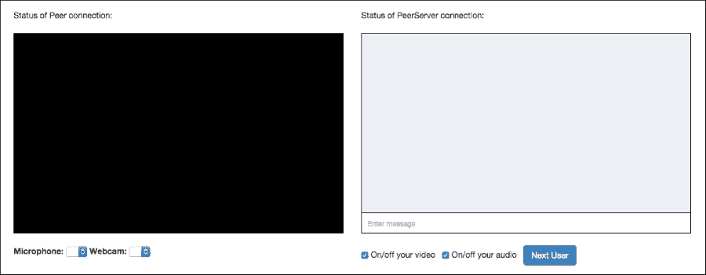

# 第四章：构建 Chatroulette

通过构建实际的应用程序来掌握 MediaStream 和 PeerJS 是最好的方法，这正是我们在本章将要做的。Chatroulette 是一个网站，将随机网站访问者配对进行视频和基于文本的对话。讨论如何构建 Chatroulette 将帮助我们深入学习和研究 PeerJS 和 PeerServer，因为它需要我们将 PeerServer 与 Express 集成。我们还将向我们的网站添加媒体控制功能，以便暂停/恢复本地 MediaStream，并允许用户选择他们想要的麦克风/摄像头，这将帮助我们更深入地学习 MediaStream。我们将实际创建一个只允许特定国家用户聊天的 Chatroulette，这需要在连接到 PeerServer 之前进行额外的验证步骤；因此，这将使我们更深入地了解 PeerServer 与 Express 的集成。

在本章中，我们将涵盖以下主题：

+   运行自己的 PeerServer 实例

+   创建自定义 PeerServer

+   将 PeerServer 与 Express 集成

+   验证用户以连接到 PeerServer

+   查找连接到服务器的用户的 IP 地址和国家

+   允许用户在网页上直接使用麦克风和摄像头

+   讨论构建完全工作的 Chatroulette 的需求

# 创建自己的 PeerServer

在我们开始构建 Chatroulette 之前，让我们看看如何运行我们自己的 PeerServer 实例。

PeerServer 作为 npm 云上的 npm 包提供。让我们创建一个自定义 PeerServer 并将其与我们在上一章中构建的 PeerJS 应用程序一起使用。

首先创建一个名为 `Custom-PeerServer` 的目录，并将 `app.js` 和 `package.json` 文件放入其中。

在 `package.json` 文件中，放置以下代码并运行 `npm install` 命令以下载 PeerServer 包：

```js
{
  "name": "Custom-PeerServer",
  "dependencies": {
    "peer": "0.2.8",
    "express": "4.13.3"
  }
}
```

在撰写本文时，PeerServer 的最新版本是 0.2.8。在这里，我们还将下载 `express` 包，因为我们需要演示如何将 PeerServer 与 Express 集成。

PeerServer 包提供了一组库来创建自定义的 PeerServer 或将 PeerServer 与 Express 集成，同时也提供了一个可执行文件，可以直接创建我们的 PeerServer 实例，无需任何定制。

## 从 shell 运行 PeerServer

如果您想直接从 shell 运行自己的 PeerServer 实例而不进行任何定制，请在 `Custom-PeerServer/node_modules/peer/bin` 目录中运行以下命令：

```js
./peerjs –port 8080

```

现在应该会打印以下命令：

```js
Started PeerServer on ::, port: 8080, path: / (v. 0.2.8)

```

这确认了 `PeerServer` 正在运行。为了测试 `PeerServer` 实例是否正常工作，请转到我们在上一章中创建的应用程序的 `index.html` 文件，并替换以下代码：

```js
peer = new Peer(id, {key: ""});
```

之前的代码将被以下代码替换：

```js
peer = new Peer(id, {host: "localhost", port: 8080});
```

现在运行应用程序，它应该像往常一样工作。

## 使用 PeerServer 库

PeerServer 库用于创建自定义 PeerServer。PeerServer 库还允许我们将 PeerServer 与 Express 服务器集成。

### 创建自定义 PeerServer

这里是一个示例代码，演示了如何创建自己的自定义 PeerServer。将以下代码放置在`app.js`文件中，并运行`node app.js`命令以启动服务器：

```js
var PeerServer = require("peer").PeerServer;
var server = PeerServer({port: 8080});

server.on("connection", function(id) {
  console.log(id + " has connected to the PeerServer");
});

server.on("disconnect", function(id) {
  console.log(id + " has disconnected from the PeerServer");
});
```

在这里，代码的前两行创建了自定义 PeerServer。然后我们附加了事件处理器，当用户连接到或从 PeerServer 断开连接时将触发这些处理器。自定义 PeerServer 不提供检查对等方是否被允许连接到 PeerServer 的 API。它只是允许我们在对等方连接后或对等方断开连接时执行某些操作。

要测试自定义 PeerServer 是否正常工作，请转到我们在上一章创建的应用程序的`index.html`文件，并替换以下代码：

```js
peer = new Peer(id, {key: ""});
```

以下代码将被替换为以下代码：

```js
peer = new Peer(id, {host: "localhost", port: 8080});
```

现在运行应用程序，它应该像往常一样工作。

### 将 PeerServer 与 Express 服务器集成

我们还可以将 PeerServer 与 Express 服务器集成，即 Express 服务器的特定路径将提供信令服务。将 PeerServer 与 Express 服务器集成的优点在于，我们可以检查对等方是否被允许连接到 PeerServer，如果不允许，则可以阻止对等方使用它。

这里是一个示例代码，演示了如何将 PeerServer 与 Express 服务器集成。将以下代码放置在`app.js`文件中，并运行`node app.js`命令以启动服务器：

```js
var express = require("express");
var app = express();

var server = app.listen(8080);

app.use("/signaling", function(httpRequest, httpResponse, next){
  //check whether peer is allowed to connect or not.

  next();
});

var ExpressPeerServer = require("peer").ExpressPeerServer(server, {debug: true});

app.use("/signaling", ExpressPeerServer);

ExpressPeerServer.on("connection", function(id){

});

ExpressPeerServer.on("disconnect", function(id){

});
```

在这里，我们使用`PeerServer`库提供的中间件将 PeerServer 与 Express 集成。在这里，PeerServer 在`/signaling`路径上可用。你可以使用任何你想要的路径。

`PeerServer`库不提供任何方法来检查对等方是否被允许连接到 PeerServer，因此我们使用自己的技术，即在`ExpressPeerServer`中间件之上附加另一个中间件，该中间件执行此检查。尽管这种技术看起来不错，但如果我们的自定义中间件阻止请求进一步进行，那么 PeerServer 将触发`connection`和`disconnect`事件，并在前端销毁`Peer`实例。

### 注意

你可以在[`www.npmjs.com/package/peer`](https://www.npmjs.com/package/peer)了解更多关于 PeerServer 的信息。

# 创建聊天室轮盘赌

我们将要构建的聊天室轮盘赌仅面向居住在印度的人，也就是说，如果对等方的 IP 地址无法解析为印度，则对等方无法连接到 PeerServer。我们添加了这个过滤器，使网站代码更加复杂，这样你就可以学习如何检查用户是否被允许连接到 PeerServer。

我们将使用一个服务器，该服务器将提供网页服务并充当 PeerServer，也就是说，我们将 PeerServer 与 Express 服务器集成。

我们不会涉及设计聊天 roulette 的前端。我们只会专注于构建架构和功能。

本章的练习文件包含两个目录：`Chatroulette`和`Custom-PeerServer`。在`Chatroulette`目录中，有两个子目录：`Initial`和`Final`。在`Final`目录中，你可以找到完整的聊天 roulette 源代码。在`Initial`目录中，你只能找到我们聊天 roulette 的 HTML 代码。`Initial`目录是为了帮助你快速开始构建聊天 roulette。

你将把与网站前端功能相关的代码放置在`Initial/public/js/main.js`文件中，并将与服务器端功能相关的代码放置在`Initial/app.js`文件中。

## 构建后端

我们网站将基本包含三个 URL 端点：一个根路径用于服务主页，`/find`路径用于查找聊天用户的 ID，最后是作为 PeerServer 端点的`/signaling`路径。

每个用户都将有一个由 PeerServer 生成的唯一 ID。为了使用`/find` URL 检索另一个空闲用户的 ID，用户必须首先连接到 PeerServer。

服务器将维护两个不同的数组，即第一个数组包含连接到 PeerServer 的用户 ID，第二个数组包含需要聊天伙伴的用户 ID。

让我们开始构建我们的后端。将以下代码放置在`app.js`文件中，以创建我们的 Web 服务器并服务我们网站的主页：

```js
var express = require("express");
var app = express();

app.use(express.static(__dirname + "/public"));

app.get("/", function(httpRequest, httpResponse, next){
  httpResponse.sendFile(__dirname + "/public/html/index.html");
})

var server = app.listen(8080);
```

在这里，我们正在作为主页服务`index.html`文件。运行`node app.js`命令来启动服务器。我假设你在本地主机上运行`node.js`，所以请在浏览器中打开`http://localhost:8080/` URL 以查看主页。主页应该看起来类似于以下图像：



以下是我们主页的不同元素：

+   在主页顶部，我们将显示`PeerServer`连接状态、`DataConnection`和`MediaConnection`的状态。

+   然后我们将显示一个视频元素和消息框。远程对等方的`MediaStream`将在视频元素上渲染。

+   然后我们有下拉框，用户可以选择他们想要使用的麦克风和摄像头，如果他们的计算机连接了多个麦克风或摄像头。

+   然后我们有复选框，允许用户暂停或恢复他们的音频和视频。

+   最后，我们有一个按钮，允许用户断开与当前用户的连接，并与另一个用户聊天。

HTML 页面中的每个交互元素都有一个与之关联的 ID。在编写网站的前端时，我们将使用它们的 ID 来获取它们的引用。

现在，让我们创建我们的信令服务器。以下是相应的代码。将其放置在`app.js`文件中：

```js
var requestIp = require("request-ip");
var geoip = require("geoip-lite");

app.use("/signaling", function(httpRequest, httpResponse, next){

  var clientIp = requestIp.getClientIp(httpRequest);
  var geo = geoip.lookup(clientIp);

  if(geo != null)
  {
    if(geo.country == "IN")
    {
      next();
    }
    else
    {
      httpResponse.end();
    }
  }
  else
  {
    next();
  }
});

var ExpressPeerServer = require("peer").ExpressPeerServer(server);

app.use("/signaling", ExpressPeerServer);

var connected_users = [];

ExpressPeerServer.on("connection", function(id){
  var idx = connected_users.indexOf(id); 
  if(idx === -1) //only add id if it's not in the array yet
  {
    connected_users.push(id);
  }
});

ExpressPeerServer.on("disconnect", function(id){
  var idx = connected_users.indexOf(id); 
  if(idx !== -1) 
  {
    connected_users.splice(idx, 1);
  }

  idx = waiting_peers.indexOf(id);
  if(idx !== -1) 
  {
    waiting_peers.splice(idx, 1);
  }  
});
```

以下是如何代码工作的：

+   在用户能够连接到 PeerServer 之前，我们将找到用户 IP 地址所属的国家。我们将使用`request-ip`模块找到 IP 地址，并使用`geoip-lite`模块将 IP 地址解析为国家。如果国家是`IN`或国家名称无法解析，则通过触发下一个中间件允许用户连接到 PeerServer，否则通过发送空响应来阻止他们。

+   当用户连接到 PeerServer 时，我们将用户的 ID 添加到`connected_users`数组中，该数组维护着连接到 PeerServer 的用户 ID 列表。同样，当用户从 PeerServer 断开连接时，我们将用户的 ID 从`connected_users`数组中移除。

现在我们定义一个用于`/find`路径的路由，用户可以通过这个路径找到可以聊天的人。以下是这个功能的代码。将此代码放置在`app.js`文件中：

```js
var waiting_peers = [];

app.get("/find", function(httpRequest, httpResponse, next){

  var id = httpRequest.query.id;

  if(connected_users.indexOf(id) !== -1)
  {

    var idx = waiting_peers.indexOf(id); 
     if(idx === -1) 
    {
      waiting_peers.push(id);
    }

    if(waiting_peers.length > 1)
    {
      waiting_peers.splice(idx, 1);  
      var user_found = waiting_peers[0];
      waiting_peers.splice(0, 1);
      httpResponse.send(user_found);
    }
    else
    {
      httpResponse.status(404).send("Not found");
    }
  }
  else
  {
    httpResponse.status(404).send("Not found");
  }
})
```

下面是代码的工作原理：

+   `waiting_users`数组保存着寻找聊天伙伴的用户 ID。

+   当用户向`/find`路径发起请求时，路由处理程序首先检查用户是否已连接到 PeerServer，通过检查用户 ID 是否存在于`connected_users`数组中。

+   如果用户未连接到 PeerServer，则发送 HTTP 404 错误。如果用户已连接到 PeerServer，则检查用户的 ID 是否存在于`waiting_list`数组中。如果不在此数组中，则将其添加到数组中并继续。

+   现在它检查`waiting_list`数组中是否还有其他用户 ID，如果有，则发送列表中的第一个用户 ID，然后从`waiting_list`数组中删除所有用户 ID。如果没有在`waiting_list`数组中找到其他用户 ID，则简单地发送`404 错误`。

现在我们已经完成了网站后端的构建。在我们开始构建网站的前端之前，请确保使用最新代码重启服务器。

## 构建前端

首先，当主页加载时，我们需要找到连接到用户电脑的麦克风和摄像头，并将它们列出，以便用户可以选择所需的设备。以下是实现这一功能的代码。将此代码放置在`main.js`文件中：

```js
window.addEventListener("load", function(){
  MediaStreamTrack.getSources(function(devices){
    var audioCount = 1;
    var videoCount = 1;

    for(var count = 0; count < devices.length; count++)
    {
      if(devices[count].kind == "audio")
      {
        var name = "";

        if(devices[count].label == "")
        {
          name = "Microphone " + audioCount;
          audioCount++;
        }
        else
        {
          name = devices[count].label;
        }

        document.getElementById("audioInput").innerHTML = document.getElementById("audioInput").innerHTML + "<option value='" + devices[count].id + "'>" + name + "</option>";
      }
      else if(devices[count].kind == "video")
      {
        var name = "";

        if(devices[count].label == "")
        {
          name = "Webcam " + videoCount;
          videoCount++;
        }
        else
        {
          name = devices[count].label;
        }

        document.getElementById("videoInput").innerHTML = document.getElementById("videoInput").innerHTML + "<option value='" + devices[count].id + "'>" + name + "</option>";
      }
    }
  });
});
```

在这里，我们使用`MediaStream.getSources`检索音频和视频输入设备，并填充`<select>`标签，以便用户可以选择选项。

当主页加载时，我们还需要创建一个`Peer`实例。以下是实现这一功能的代码。将此代码放置在`main.js`文件中：

```js
var peer = null;
var dc = null;
var mc = null;
var ms = null;
var rms = null;

window.addEventListener("load", function(){
  peer = new Peer({host: "localhost", port: 8080, path: "/signaling", debug: true}); 

  peer.on("disconnected", function(){

    var interval = setInterval(function(){
      if(peer.open == true || peer.destroyed == true)
      {
        clearInterval(interval);
      }
      else
      {
        peer.reconnect();
      }
    }, 4000)
  })

  peer.on("connection", function(dataConnection){
    if(dc == null || dc.open == false)
    {
      dc = dataConnection;

      dc.on("data", function(data){
        document.getElementById("messages").innerHTML = document.getElementById("messages").innerHTML + "<li><span class='right'>" + data + "</span><div class='clear'></div></li> ";
        document.getElementById("messages-container").scrollTop = document.getElementById("messages-container").scrollHeight;
      })

      dc.on("close", function(){
        document.getElementById("messages").innerHTML = "";
      })
    }
    else
    {
      dataConnection.close();
    }
  })

  peer.on("call", function(mediaConnection){
    if(mc == null || mc.open == false)
    {
      mc = mediaConnection;
      navigator.getUserMedia = navigator.getUserMedia || navigator.webkitGetUserMedia || navigator.mozGetUserMedia;
      navigator.getUserMedia({video: true, audio: true}, function(mediaStream) {
        ms = mediaStream;
        mc.answer(mediaStream);
        mc.on("stream", function(remoteStream){
          rms = remoteStream;
          document.getElementById("peerVideo").setAttribute("src", URL.createObjectURL(remoteStream));
          document.getElementById("peerVideo").play();
        })

      }, function(e){ alert("An error occured while retrieving webcam and microphone stream"); })
    }
    else
    {
      mediaConnection.close();
    }
  })
});
```

下面是代码的工作原理：

+   首先，我们声明了五个全局变量。`peer`将保存`Peer`实例的引用，`dc`将保存`DataConnection`的引用，`mc`将保存`MediaConnection`的引用，`ms`将保存本地`MediaStream`的引用，而`rms`将保存远程`MediaStream`的引用。

+   然后，页面加载完成后，我们连接到 PeerServer，创建一个`Peer`实例，并附加`disconnected`、`connection`和`call`事件处理程序。

+   然后，我们确保如果由于某些原因节点从 PeerServer 断开连接，它将自动尝试重新连接到 PeerServer。

+   如果另一个节点试图与我们建立`DataConnection`，那么我们只有在没有其他`DataConnection`当前建立的情况下才会接受它。接受`DataConnection`后，我们将附加`data`和`close`事件处理程序，以便在聊天框中打印传入的消息，并在`DataConnection`关闭时清除聊天框中的所有消息。

+   类似地，如果另一个节点试图与我们建立`MediaConnection`，我们只有在没有其他`MediaConnection`当前建立的情况下才会接受它。接受`MediaConnection`后，我们将附加`stream`事件处理程序，以便当远程`MediaStream`到达时，我们可以显示它。

在前面的代码中，我们正在等待另一个节点与我们建立`DataConnection`和`MediaConnection`。

现在让我们编写代码来查找一个空闲节点，并与它建立`DataConnection`和`MediaConnection`。以下是实现此功能的代码。请将此代码放置在`main.js`文件中：

```js
function ajaxRequestObject()
{
  var request;
  if(window.XMLHttpRequest)
  {
    request = new XMLHttpRequest();
  }
  else if(window.ActiveXObject) 
  {
    try 
    {
      request = new ActiveXObject('Msxml2.XMLHTTP');
    }
    catch (e)
    {
      request = new ActiveXObject('Microsoft.XMLHTTP');
    }
  }

  return request;
}

function connectToNextPeer()
{
  var request = ajaxRequestObject();

  var url = "/find?id=" + peer.id;

  request.open("GET", url);

  request.addEventListener("load", function(){
    if(request.readyState === 4) 
    {
      if(request.status === 200) 
      {
        dc = peer.connect(request.responseText, {reliable: true, ordered: true});

        dc.on("data", function(data){
          document.getElementById("messages").innerHTML = document.getElementById("messages").innerHTML + 
          "<li><span class='right'>" + data + "</span><div class='clear'></div></li>";
          document.getElementById("messages-container").scrollTop = document.getElementById("messages-container").scrollHeight;
        })

        dc.on("close", function(){
          document.getElementById("messages").innerHTML = "";
        })

        navigator.getUserMedia = navigator.getUserMedia || navigator.webkitGetUserMedia || navigator.mozGetUserMedia;

        var audioInputID = document.getElementById("audioInput").options[document.getElementById("audioInput").selectedIndex].value;
        var videoInputID = document.getElementById("videoInput").options[document.getElementById("videoInput").selectedIndex].value;

        navigator.getUserMedia({video: {mandatory: {sourceId: videoInputID}}, audio: {mandatory: {sourceId: audioInputID}}}, function(mediaStream) {
          ms = mediaStream;

          if(document.getElementById("audioToggle").checked)
          {
            var tracks = ms.getAudioTracks();
            if(document.getElementById("audioToggle").checked)
            {
              tracks[0].enabled = true;
            }
            else
            {
              tracks[0].enabled = false;
            }
          }

          if(document.getElementById("videoToggle").checked)
          {
            var tracks = ms.getVideoTracks();
            if(document.getElementById("videoToggle").checked)
            {
              tracks[0].enabled = true;
            }
            else
            {
              tracks[0].enabled = false;
            }
          }

          mc = peer.call(request.responseText, ms);

          mc.on("stream", function(remoteStream){
            rms = remoteStream;
            document.getElementById("peerVideo").setAttribute("src", URL.createObjectURL(remoteStream));
            document.getElementById("peerVideo").play();
          })

        }, function(e){ alert("An error occured while retrieving webcam and microphone stream"); });

      }
    }
  }, false);

  request.send(null);
}

function communication()
{
  if(peer != null && peer.disconnected == false && peer.destroyed == false)
  {
    if(dc == null || mc == null || dc.open == false || mc.open == false)
    {
      connectToNextPeer();
    }
  }
}

setInterval(communication, 4000);
```

这段代码虽然很长，但很容易理解。以下是代码的工作原理：

+   首先，我们定义了一个`ajaxRequestObject()`函数，该函数仅返回一个 AJAX 对象，并通过创建 AJAX 对象来隐藏浏览器差异。

+   然后，我们定义了`connectToNextPeer()`方法，该方法从`/next`路径请求一个空闲 ID，如果找到，则与该节点建立`DataConnection`和`MediaConnection`。它还附加了与之前代码相同的事件处理程序。

+   在检索`MediaStream`时，它使用用户在下拉列表中选择的设备。

+   在调用其他节点之前，它根据复选框是否被选中将`enabled`属性设置为`true`或`false`。

+   最后，如果节点已连接到 PeerServer，并且与另一个节点之间尚未建立`MediaConnection`或`DataConnection`，我们将设置一个计时器，每四秒调用一次`connectToNext()`节点。

现在我们需要编写代码，当用户在消息框的文本输入字段中按下*Enter*键时，向连接的节点发送消息。以下是实现此功能的代码。请将此代码放置在`main.js`文件中：

```js
document.getElementById("message-input-box").addEventListener("keypress", function(){
  if(dc != null && dc.open == true)
  {
    var key = window.event.keyCode;
    if (key == 13) 
    {
      var message = document.getElementById("message-input-box").value;
      document.getElementById("message-input-box").value = "";
      dc.send(message);
      document.getElementById("messages").innerHTML = document.getElementById("messages").innerHTML + "<li><span class='left'>" + message + "</span><div class='clear'></div></li> ";
      document.getElementById("messages-container").scrollTop = document.getElementById("messages-container").scrollHeight;
    }
    else
    {
      return;
    }
  }
})
```

在这里，我们首先检查`DataConnection`是否已建立。如果`DataConnection`当前已建立，那么我们将向连接的节点发送消息，并在消息框中显示该消息。

现在我们需要编写代码以在用户切换复选框时暂停或恢复音频和视频。以下是实现此功能的代码。请将此代码放置在`main.js`文件中：

```js
document.getElementById("videoToggle").addEventListener("click", function(){
  if(ms !== null)
  {
    var tracks = ms.getVideoTracks();

    if(document.getElementById("videoToggle").checked)
    {
      tracks[0].enabled = true;
    }
    else
    {
      tracks[0].enabled = false;
    }
  }
});

document.getElementById("audioToggle").addEventListener("click", function(){
  if(ms !== null)
  {
    var tracks = ms.getAudioTracks();

    if(document.getElementById("audioToggle").checked)
    {
      tracks[0].enabled = true;
    }
    else
    {
      tracks[0].enabled = false;
    }
  }
});
```

在这里，我们通过将 `true` 或 `false` 分配给 tracks 的 enabled 属性来实现这一功能。

当用户点击 **Next User** 按钮时，我们需要关闭 `MediaConnection` 和 `DataConnection` 并找到另一个用户进行聊天。以下是要执行此操作的代码。将此代码放置在 `main.js` 文件中：

```js
document.getElementById("next").addEventListener("click", function(){
  if(mc != null)
  {
    mc.close();
  }

  if(dc != null)
  {
    dc.close();
  }

  connectToNextPeer();  
})
```

如果当前已建立任何 `MediaConnection` 或 `DataConnection`，则我们将关闭它们。然后我们将调用 `connectToNextPeer()` 方法来建立 `MediaConnection` 和 `DataConnection`。

现在，我们最终需要显示对等连接和 PeerServer 连接的状态。以下是执行此操作的代码。将此代码放置在 `main.js` 文件中：

```js
setInterval(function(){
  if(dc == null || mc == null || dc.open == false || mc.open == false)
  {
    document.getElementById("peerStatus").innerHTML = "Waiting for a free peer";
  }
  else
  {
    document.getElementById("peerStatus").innerHTML = "Connected to a peer";
  }

  if(peer != null && peer.disconnected == false && peer.destroyed == false)
  {
    document.getElementById("peerServerStatus").innerHTML = "Connected to PeerServer";
  }
  else
  {
    document.getElementById("peerServerStatus").innerHTML = "Not connected to PeerServer";
  }
}, 4000);
```

在这里，我们每 `4` 秒检查和更新一次状态。

### 测试网站

要测试我们刚刚创建的 chatroulette 网站，首先确保服务器正在运行，然后在两个不同的标签页、浏览器或设备中打开 `http://localhost:8080/` URL。

现在，您将看到它们自动连接，并且能够相互聊天。

# 摘要

在本章中，我们看到了如何使用与 Express 集成的 PeerServer 实例构建 chatroulette。我们构建的网站几乎具有 chatroulette 应有的所有功能。现在您可以添加屏幕共享、将特定性别的用户相互连接、将特定年龄的用户相互连接、集成 captcha 以防止垃圾邮件以及其他您选择的功能。

在撰写本文时，WebRTC 团队正在开发一个 API，允许您从屏幕中检索流以实现屏幕共享。由于此 API 仍在开发中，您可以使用浏览器插件从屏幕中检索流。您可以在 [`www.webrtc-experiment.com/Pluginfree-Screen-Sharing/`](https://www.webrtc-experiment.com/Pluginfree-Screen-Sharing/) 上找到更多关于使用插件从屏幕中检索流的信息。

在下一章中，我们将讨论客户端和服务器之间使用 WebSockets 的实时双向通信。
