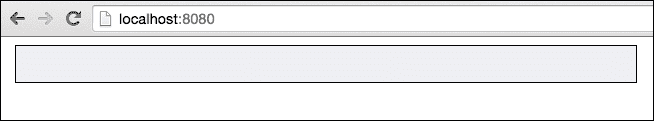
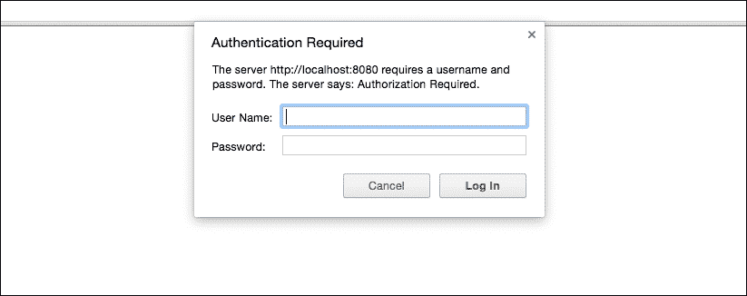
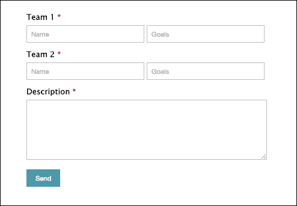
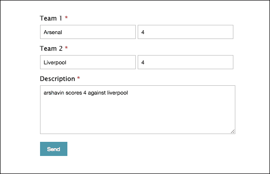
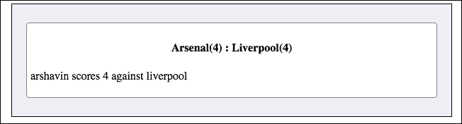

# 第六章. 构建实时得分网站

掌握 socket.io 的最佳方式是通过构建实际应用，这正是本章我们将要做的。一个实时得分网站会在管理员更新得分后立即将得分变化实时显示给用户。我们将创建一个足球实时得分网站。讨论如何构建实时得分网站将帮助我们深入学习 socket.io，因为它需要 socket.io 认证，并且可选地集成 socket.io 与 Express。我们的实时得分网站将为管理员提供一个用于更新得分的控制面板。

在本章中，我们将涵盖以下主题：

+   在 socket.io 中间件中访问 cookies

+   讨论 HTTP 基本认证

+   将 socket.io 与 Express 集成

+   讨论 socket.io 认证

# 构建后端

在我们开始构建实时得分网站的后端之前，让我们首先设置我们的目录和文件。

我们将只编写后端和前端架构及功能的代码，不包括任何 HTML 和 CSS 设计代码。

本章的练习文件包含两个目录：`Initial`和`Final`。在这两个目录中，你都会找到一个名为`Live-Score`的目录。在`Final/Live-Score`目录中，你会得到完整的实时得分网站源代码。在`Initial/Live-Score`目录中，你只会找到我们实时得分网站的 HTML 和 CSS 文件。`Initial/Live-Score`目录是为了帮助你快速开始构建实时得分网站。

在`Initial/LiveScore`目录中，你会找到`public`目录、`app.js`文件和`package.json`文件。在`public`目录中，你会找到`css`、`html`和`js`目录。在`css`和`html`目录中，你会找到我们用户和管理员页面的 HTML 文件和 CSS 文件。在`js`目录中，你会找到`admin.js`和`index.js`文件，在其中分别放置管理员和用户的 socket.io 客户端代码。同样，在`html`目录中，你会找到将被分别提供给用户和管理员的`index.html`和`admin.html`文件。

在`package.json`文件中，放置以下代码：

```js
{
  "name": "Live-Score",
  "dependencies": {
    "express": "4.13.3",
    "socket.io": "1.3.7",
    "basic-auth": "1.0.3",
    "socket.io-cookie": "0.0.1"
  }
}
```

现在，在`Initial/Live-Score`目录中运行`npm install`命令，下载`express`、`socket.io`、`basic-auth`和`socket.io-cookie` npm 包。

## 将 socket.io 服务器与 Express 服务器集成

我们只需几行代码就可以将 socket.io 服务器与 Express 服务器集成。以下是集成 socket.io 服务器与 Express 服务器的代码。

创建一个`app.js`文件，并在其中放置以下代码：

```js
var express = require("express");  
var app = express();  
var server = require("http").createServer(app);  
var io = require("socket.io")(server, {path: "/socket-io"});

server.listen(8080);
```

第四行是主要集成发生的地方。在这里，我们使用`/socket-io`路径进行 socket.io 握手。

最后，我们在端口号`8080`上监听。也就是说，Express 服务器和 socket.io 服务器都将监听端口号`8080`。

## 向用户提供静态文件和 HTML

现在我们需要编写代码来向网站用户服务器 HTML、CSS 和 JavaScript 文件。以下是要执行的代码。将此代码放置在`app.js`文件中，在之前的代码片段之后：

```js
app.use(express.static(__dirname + "/public"));

app.get("/", function(httpRequest, httpResponse, next){
  httpResponse.sendFile(__dirname + "/public/html/index.html");
})
```

在这里，代码的第一行是提供静态文件。其余代码是在用户访问根路径时向网站用户提供`index.html`。

## 向管理员提供 HTML 服务并保护管理面板

我们只希望管理员访问管理面板来更新分数。因此，为了使访客能够访问管理面板，他们必须输入用户名和密码。我们将使用 HTTP 基本认证来保护管理面板。

以下是为管理员进行认证并提供 HTML 服务的代码：

```js
var basicAuth = require("basic-auth");

function uniqueNumber() {
  var date = Date.now();

  if (date <= uniqueNumber.previous) {
    date = ++uniqueNumber.previous;
  } else {
    uniqueNumber.previous = date;
  }

  return date;
}

uniqueNumber.previous = 0;

var authenticated_users = {};

var auth = function (req, res, next){
  var user = basicAuth(req);

  if(!user || user.name !== "admin" || user.pass !== "admin")
  {
    res.statusCode = 401;
    res.setHeader("WWW-Authenticate", "Basic realm='Authorization Required'");
    res.end("Access denied");
  }
  else
  {
    var id = uniqueNumber();
    authenticated_users[id] = id;
    res.cookie("authentication_id", id);
    next();
  }
}

app.get("/admin", auth, function(httpRequest, httpResponse, next){
  httpResponse.sendFile(__dirname + "/public/html/admin.html");
})
```

下面是代码的工作原理：

+   首先，我们导入了`basic-auth`库，该库用于在 Express 中实现基本认证。

+   然后，我们编写了一个自定义函数，每次调用时都会生成一个唯一的数字。

+   我们还创建了一个名为`auth`的函数，该函数将用于检查访客是否已认证。如果没有，我们将发送 HTTP 状态码 404，要求访客提供用户名和密码。如果访客已认证，则我们将生成一个唯一的数字并将其存储为管理员浏览器中的 cookie。稍后，此 cookie 将由 socket.io 服务器用于检查管理员是否已认证。

+   最后，我们创建了一个具有`/admin`路径的路由，该路由附加了两个路由处理程序。第一个是`auth`函数，用于检查认证；第二个用于提供`admin.html`文件。

## Socket.IO cookie 认证和向命名空间广播消息

在我们的 socket.io 服务器中，将有两个命名空间：用户将连接的默认命名空间和管理员将连接的`/admin`命名空间。

socket.io 客户端连接到默认命名空间时不需要认证。然而，要连接到`/admin`命名空间，socket.io 需要认证。

管理员所做的更新将被广播到默认命名空间中的所有用户。

下面是创建`/admin`命名空间、向默认命名空间广播消息以及为`/admin`命名空间实现认证的代码。将此代码放置在`app.js`文件中：

```js
var cookieParser = require("socket.io-cookie");

var admin = io.of("/admin");

admin.use(cookieParser);

admin.use(function(socket, next) {
  if(socket.request.headers.cookie.authentication_id in authenticated_users)
  {
    next();
  }
  else
  {
    next(new Error("Authentication required"));
  }
});

admin.on("connection", function(socket){
  socket.on("message", function(message){
    io.send(message);
  });
})
```

下面是代码的工作原理：

+   首先，我们导入了 socket.io-cookie 中间件，该中间件用于解析 HTTP `Cookie`头。

+   然后，我们创建了`/admin`命名空间。

+   我们还使用 socket.io-cookie 中间件解析了 cookie。

+   然后，我们编写了自己的中间件来检查`authentication_id`是否存在，如果存在，则检查它是否有效。

+   最后，我们监听了`message`事件，并将消息广播到默认命名空间中的用户。

现在我们已经完成了我们的后端。在初始目录中运行`node app.js`命令。然后在任何浏览器中访问`http://localhost:8080`和`http://localhost:8080/admin`。这里，我假设您正在本地运行 Express 服务器。

当您访问`http://localhost:8080`时，您将看到以下屏幕：



由于用户尚未收到任何消息，框内目前没有任何内容。

当您访问`http://localhost:8080/admin`时，您将看到以下屏幕：



现在输入**用户名**和**密码**，然后点击**登录**。您将看到以下屏幕：



# 构建前端

让我们为用户和管理员编写前端代码。用户的 socket.io 客户端实例将监听来自服务器的消息并将其显示出来。而管理员客户端实例将向服务器发送消息，以便消息可以广播给用户。

以下是为用户编写的 socket.io 客户端代码。将此代码放置在`index.js`文件中：

```js
var socket = io("http://localhost:8080", {path: "/socket-io"});

socket.on("connect", function () {
	socket.on("message", function (msg) {
    document.getElementById("messages").innerHTML = "<li><div><h4>" + msg.team1_name + "(" + msg.team1_goals + ") : " + msg.team2_name + "(" + msg.team2_goals + ")" + "</h4><p>" + msg.desc + "</p></div></li>" + document.getElementById("messages").innerHTML; 
  });
});
```

这段代码是自我解释的。

这里是为管理员编写的 socket.io 客户端代码。将此代码放置在`admin.js`文件中：

```js
var socket = io("http://localhost:8080/admin", {path: "/socket-io"});

document.getElementById("submit-button").addEventListener("click", function(){
  var team1_name = document.getElementById("team1-name").value;
  var team2_name = document.getElementById("team2-name").value;
  var team1_goals = document.getElementById("team1-goals").value;
  var team2_goals = document.getElementById("team2-goals").value;
  var desc = document.getElementById("desc").value;

  if(team1_goals == "" || team2_goals == "" || team1_name == "" || team2_name == "")
  {
    alert("Please enter all details");
  }

  socket.send({
    team1_name: team1_name,
    team2_name: team2_name,
    team1_goals: team1_goals,
    team2_goals: team2_goals,
    desc: desc
  });
}, false)
```

这就是前面代码的工作原理：

+   在第一行，我们连接到了 socket.io `/admin`命名空间。如果任何情况下 cookie 无效，则连接将失败。

+   我们还确保填写了团队名称和他们的分数，否则我们将显示一个警告消息，要求他们输入所有详细信息。

+   然后，我们将消息发送到 socket.io 服务器。

# 测试网站

现在我们已经完成了我们的实时得分网站的构建。要测试网站，请刷新`http://localhost:8080/`和`http://localhost:8080/admin`页面。

现在，在`admin`面板中，用一些示例数据填写表单，然后点击**发送**按钮：



在用户页面上，您应该看到以下图像类似的内容：



# 摘要

在本章中，我们看到了如何使用 socket.io 和 Express 构建一个实时得分网站。现在，您应该能够舒适地构建任何需要实时双向通信的应用程序。现在您可以尝试构建一个聊天应用程序、多人游戏或其他 socket.io 非常有用的东西。

因此，总的来说，您已经深入学习了 socket.io、WebSockets 和双向通信。
