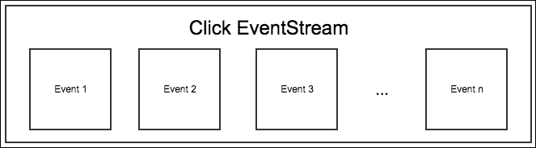

# 第七章。函数式反应式编程

如果你是一名前端或后端 JavaScript 开发者，你在大型且复杂的 JavaScript 应用程序上工作，并且处理大量响应于异步数据更新、用户活动和系统活动的代码，那么现在是探索**函数式反应式编程**（**FRP**）的最佳时机，因为它是一种节省时间、防止错误、易于阅读和模块化的代码编写风格。你不需要了解任何函数式编程语言或成为硬核函数式语言程序员；相反，你只需要了解函数式编程的基础知识。在本章中，我们将学习如何使用`Bacon.js`来使用 FRP，这是一个适用于前端和后端的 JavaScript FRP 库。

我们将涵盖以下内容：

+   反应式编程概述

+   JavaScript 中编写反应式代码的问题

+   函数式编程简介

+   FRP 是什么

+   FRP 的构建块

+   FRP 的优势

+   Bacon.js 提供的所有 API

# 反应式编程简介

在我们深入了解 FRP 之前，我们需要了解它是什么。我将用 JavaScript 来解释反应式编程。反应式编程的概念在每种编程语言中都是相同的。

**反应式编程**是编写代码以查找异步数据更新、用户活动和系统活动，并将更改传播到应用程序的依赖部分。反应式编程并不是什么新鲜事物；信不信由你，你可能已经在不知不觉中进行了反应式编程。例如，你编写的处理按钮点击事件的代码就是反应式代码。反应式编程有多种方法，例如事件驱动、回调、Promise 模式和 FRP。

我们编写的并非所有异步代码都是反应式代码。例如，在页面加载后异步上传分析数据到服务器不是反应式代码。但是，在文件上传完成后异步上传文件并向用户显示消息是反应式代码，因为我们正在对文件上传的完成做出反应。

反应式编程的一个更复杂的例子是在 MVC 架构中，其中反应式编程是对模型变化的响应并相应地更新视图，反之亦然。

## 编写反应式代码的问题

JavaScript 原生支持三种模式来编写反应式代码：**事件驱动**、**回调**和**Promise**。

任何稍微了解一点 JavaScript 的人都会熟悉事件驱动和回调模式。尽管这两种模式是编写反应式代码最流行的方式，但它们使得捕获异常变得困难，并导致嵌套函数调用，这使得代码更难以阅读和调试。

由于事件驱动和回调模式引起的问题，ES6 ([`www.packtpub.com/web-development/learning-ecmascript-6`](https://www.packtpub.com/web-development/learning-ecmascript-6)) 引入了承诺模式。承诺模式使代码看起来更像同步代码，因此更容易阅读和调试。该模式还使异常处理变得更容易。承诺代表一个异步操作。

但承诺模式有一个问题，那就是承诺只能被解决一次。承诺模式只能响应异步操作的单一活动或数据更新。例如，如果我们使用承诺模式发起 AJAX 请求，那么我们只能处理 *请求成功* 和 *失败* 活动，而不能处理请求和响应周期的状态，例如已建立的服务器连接和接收到的响应头。同样，如果我们使用承诺模式处理用户点击活动，那么我们只能处理第一次点击，而不能处理随后的点击，因为承诺在第一次点击时就被解决了。

你可能熟悉或不熟悉承诺模式，所以让我们看看一些承诺模式样例代码：

```js
$http("http://example.com/data.json").then(function(){
  //do something
}).then(function(){
  //do something more here
}).then(function(){
  //do something more here
}).catch(function(){
  //handle error
})
```

在这里，`$http()` 方法异步发起 HTTP 请求并返回一个承诺。如果请求成功，则承诺被解决，传递给第一个 `then()` 方法的回调被调用，即承诺被解决。如果请求失败，则回调传递给 `catch()` 方法，该方法被调用，承诺被拒绝。`then()` 方法总是返回一个承诺，这使得可以依次运行多个异步操作。在代码中，你可以看到异步操作是如何链式调用的。这里重要的是 `then()` 方法只被调用一次，也就是说，`$http()` 方法返回的承诺只能被解决一次，多次尝试解决承诺将被忽略。因此，当我们必须处理多个活动或异步操作的数据更新时，我们不能使用承诺模式来编写响应式代码。

### 注意

一些开发者为每个活动和数据更新创建一个新的承诺。这种技术可能看起来不错，因为你可以使用承诺模式编写涉及多个活动和数据更新的响应式代码，但这是一种反模式。

由于事件驱动、回调和承诺模式的问题，需要另一种模式，函数式响应式编程应运而生。

FRP（函数式响应式编程）简单来说就是使用函数式编程风格的响应式编程。我们将在下一节中了解更多关于函数式编程的内容。实际上，事件驱动、回调和承诺模式的不利之处并不是 FRP 被发明的真正原因；相反，FRP 实际上是因为对响应式编程的函数式模式有需求而被发明的，因为函数式代码易于编写、测试、调试、重用、更新和阅读。但是，由于 FRP 解决了由事件驱动、回调和承诺模式引起的问题，我们可以说 FRP 是其他模式的替代品。

在本章中，我们将学习 FRP，它被认为是编写响应式代码的现代方式。

# 函数式编程概述

在我们深入了解 FRP 之前，有必要对函数式编程有基本了解。

简而言之，函数式编程是一种编写代码的风格，其中我们只使用纯函数调用（包括递归）而不是循环和条件语句，并且数据是不可变的。

### 注意

函数式编程属于声明式编程的范畴。声明式编程是一种编写代码的风格，我们编写代码来告诉系统我们希望发生什么，而不是如何去做。声明式编程的其他例子还包括 SQL 和正则表达式。

那么，什么是纯函数？**纯函数**是一个只依赖于其输入参数并且对于特定的输入总是提供相同输出的函数。如果它在其作用域之外读取任何其他内容，包括全局变量，那么它就不是纯函数。

显然，并不是总是可能使所有函数都是纯函数。例如，一个获取网页或从文件系统中读取的函数不能保证相同的返回值。我们应该尽量使尽可能多的函数保持纯函数。因此，我们可以这样说，100%的纯度是无法实现的，但 85%的纯度仍然非常高效。

### 注意

无副作用函数、无状态函数和纯函数是可互换使用的术语。

在函数式编程中，数据是不可变的，你可能想知道在不修改数据的情况下如何编写代码。实际上，在实践中，我们只是简单地创建新的数据结构，而不是修改现有的数据结构。例如，如果我们有一个包含四个值的数组，并且我们想要移除最后一个值，那么我们只需创建一个新的数组，这个数组不包含最后一个值。

## 不可变数据的优点

不可变数据有几个优点。以下是一些：

+   它们是线程安全的，也就是说，在它们上操作的多个线程不能修改/破坏它们的状态。更多关于线程安全的信息请参阅[`en.wikipedia.org/wiki/Thread_safety`](https://en.wikipedia.org/wiki/Thread_safety)。

+   对象复制可以轻松共享。不需要像在可变数据结构中那样采用防御性复制等策略。更多关于对象复制的信息可以在[`en.wikipedia.org/wiki/Object_copying`](https://en.wikipedia.org/wiki/Object_copying)找到。

+   它们有助于避免时间耦合。更多关于时间耦合的信息可以在[`en.wikipedia.org/wiki/Coupling_(computer_programming)#Object-oriented_programming`](https://en.wikipedia.org/wiki/Coupling_(computer_programming)#Object-oriented_programming)找到。

## 函数式数据结构

由于数据是不可变的，你可能会遇到几个问题。以下是一些：

+   如果一个不可变数组有数百万个值，那么创建一个新的数组并从上一个数组中复制所有值将会占用大量的 CPU 和内存

+   如果两个线程需要写入同一个变量，协调该变量的最终值将会很困难

存在许多其他问题。这些问题导致了函数式数据结构的概念。函数式数据结构是一种旨在解决这些问题的不同类型的数据结构。但你不需要了解函数式数据结构来跟随本章内容或编写 JavaScript 中的函数式响应式代码。

## 纯函数的优势

这里是纯函数的一些优势：

+   它们增加了可重用性和可维护性，因为每个函数都是独立的

+   由于每个函数都可以单独测试和调试，因此更容易进行测试和调试

+   函数式程序易于理解，因为它们是以声明式方式编写的，也就是说，代码说明了要做什么，而不是如何做。

### 注意

使用循环、条件和函数调用来编写代码的风格被称为命令式编程。命令式编程和函数式编程被认为是彼此的相反。JavaScript、C++、Java、Python、Ruby 等都是命令式编程语言的例子。

## 使用 JavaScript 进行函数式编程

你不必使用像 Erlang、Haskell 这样的函数式编程语言来编写函数式代码。大多数命令式编程语言都允许我们编写函数式代码。

由于 JavaScript 中的函数是一等函数（我们将在后面学习更多关于一等函数的内容），因此可以在 JavaScript 中编写函数式代码。

### 注意

“一等”和“高阶”是可互换使用的术语。

当一个函数可以被传递给另一个函数作为参数，可以返回另一个函数，并且可以被分配给一个变量时，我们称其为“一等函数”。

在 JavaScript 中，函数是一等函数，因为它们是对象。因为一个对象可以被传递给另一个函数，一个函数可以返回一个对象，一个对象可以被分配给一个变量，所以函数可以是一等函数。

### 小贴士

**闭包和一等函数之间的区别是什么？**

**闭包**是 JavaScript 中最被误解的主题。简而言之，闭包是由另一个函数返回的函数，当该函数被调用时，它可以访问其定义的词法作用域。由一等函数返回的函数可能是一个闭包，也可能不是。以下是一个演示闭包的例子：

```js
function a()
{
  var b = 12;
  function c()
  {
    console.log(b);
  }

  return c;
}

var d = a();

d(); //Output "12"
```

在这里，名为`c`的函数是一个闭包，因为它是由`a`返回的，并且在调用时可以访问`a`内部声明的变量。

## 函数式编程辅助函数

**函数式编程语言**提供许多内置的函数，称为辅助函数，以简化函数式代码的编写。例如，由于我们不能在函数式代码中使用循环进行迭代，我们需要某种函数来接受一个集合并将集合中的每个值映射到一个函数。函数式编程语言提供`map`辅助函数来完成这个目的。同样，还有许多其他辅助函数用于不同的目的。

由于 JavaScript 不是函数式编程语言，它没有内置函数式辅助函数。然而，ES6 引入了一些辅助函数，例如`Array.from()`、`Array.prototype.from()`和`Array.prototype.find()`。尽管如此，这个列表还不够用来编写函数式代码。因此，开发者使用像`Underscore.js`这样的库来编写函数式代码。

# 开始使用 FRP

FRP 简单来说就是使用函数式编程风格的响应式编程。

EventStreams 和属性（不要与对象属性混淆）是 FRP 的构建块。让我们来看看这两个术语的含义概述。

## EventStreams

EventStream 代表事件流。EventStream 中的事件可能在任何时间发生，不需要同步发生。

通过将 EventStream 与事件驱动模式中的事件进行比较，让我们来理解 EventStreams。就像我们在事件驱动模式中订阅事件一样，我们在 FRP 中订阅 EventStreams。与事件驱动编程中的事件不同，EventStream 的力量在于它们可以在你处理和操作事件之前以任何方式合并、连接、组合、连接、过滤或转换。

在函数式编程中，数据是不可变的，因此合并、连接、组合、连接、过滤或转换 EventStream 会创建一个新的 EventStream，而不是修改现有的一个。

这里是一个图表，展示了代表 UI 元素点击事件的 EventStream 看起来会是什么样子：



这个 EventStream 可以与任何其他流合并。下面是一个图表，展示了当两个 EventStreams 合并时的样子：


当我们想要在两个不同的 EventStreams 上发生事件时应用相同的操作时，合并可能很有用。我们不再需要订阅和附加两个不同的 EventStreams 的回调，现在我们可以订阅一个单一的 EventStream，消除重复代码，并使代码更新变得容易。合并在其他情况下也可能很有用。

## 属性

属性代表随时间变化的值。属性可以用作替代 JavaScript 变量的选择，这些变量的值会根据异步活动和数据更新而变化。例如，您可以使用属性来表示按钮被点击的总次数、登录用户总数等。

### 注意

属性也被称为信号或行为。

使用属性而不是 JavaScript 变量的优点是您可以订阅属性，也就是说，每当属性的值发生变化时，就会触发一个回调来更新依赖于它的系统部分。这可以防止代码重复，并具有许多其他优点。

### 注意

您也可以从一个属性创建另一个属性，以及合并、组合、压缩、筛选或转换属性。

我们刚刚了解了 FRP 的基础知识。创建 EventStreams 和属性，以及使用它们的方法和其他相关内容，这取决于我们用来编写函数式响应式代码的库。现在，让我们探索如何使用 Bacon.js 库来编写函数式响应式代码。

# 使用 Bacon.js 进行 FRP

**Bacon.js**是一个 JavaScript 库，它帮助我们用 JavaScript 编写函数式响应式代码。它可以用于前端和后端 JavaScript。Bacon.js 库的官方网站是[`baconjs.github.io/`](https://baconjs.github.io/)。

让我们创建一个基本的网站项目来演示使用 Bacon.js 的 FRP。

## 设置项目

让我们学习如何下载和安装 Bacon.js，以便与前端和后端 JavaScript 一起使用。在前端，Bacon.js 依赖于 jQuery。

创建一个名为`baconjs-example`的目录。在其内部，创建名为`package.json`和`app.js`的文件，以及一个名为`public`的目录。在`public`目录内部，创建名为`html`和`js`的目录。在`html`目录内部，创建一个名为`index.html`的文件。最后，在`js`目录内部，创建一个名为`index.js`的文件。

从[`cdnjs.cloudflare.com/ajax/libs/bacon.js/0.7.73/Bacon.js`](http://cdnjs.cloudflare.com/ajax/libs/bacon.js/0.7.73/Bacon.js)下载前端 Bacon.js 库和 jQuery[`code.jquery.com/jquery-2.2.0.min.js`](https://code.jquery.com/jquery-2.2.0.min.js)，并将它们放置在`js`目录下。

在撰写本书时，0.7.73 是前端 Bacon.js 库的最新版本，2.2.0 是 jQuery 的最新版本。

在`index.html`文件中，放置以下代码以排队 jQuery 和前端 Bacon.js 库：

```js
<!doctype html>
<html>
  <head>
    <title>Bacon.js Example</title>
  </head>
  <body>
    <script type="text/javascript" src="img/jquery-2.2.0.min.js"></script>
    <script type="text/javascript" src="img/Bacon.js"></script>
    <script type="text/javascript" src="img/index.js"></script>
  </body>
</html>
```

在`package.json`文件中，放置以下代码：

```js
{
  "name": "Baconjs-Example",
  "dependencies": {
    "express": "4.13.3",
    "baconjs": "0.7.83"
  }
}
```

现在，在`baconjs-example`目录中运行`npm install`以下载 npm 包。

在撰写本书时，0.7.83 是后端 Bacon.js 库的最新版本。

在`app.js`文件中，放置以下代码以导入后端 Bacon.js 和 Express 模块。它还启动我们的 web 服务器以提供网页和静态文件：

```js
var Bacon = require("baconjs").Bacon;
var express = require("express");
var app = express();

app.use(express.static(__dirname + "/public"));

app.get("/", function(httpRequest, httpResponse, next){
  httpResponse.sendFile(__dirname + "/public/html/index.html");
})

app.listen(8080);
```

我们现在已经设置了一个基本的 Bacon.js 项目。运行`node app.js`以启动 web 服务器。现在，让我们探索 Bacon.js API。

## Bacon.js API

Bacon.js 提供了 API 来执行几乎可以使用事件流和属性完成的任何事情。后端和前端导入和下载 Bacon.js 的方法不同，但 API 对两者都是相同的。让我们看看 Bacon.js 提供的最重要的 API。

### 创建事件流

根据异步 API 的设计方式，即异步 API 遵循哪种模式，有各种创建 EventStreams 的方法。异步 API 遵循事件驱动、promise 或回调模式。我们需要使用 Bacon 提供的 API 将这些模式包装起来，以便将它们的数据更新或活动更新连接到事件流，即转换为功能性响应式模式。

如果我们想在网页上的 UI 元素上创建一个事件流，我们可以使用`$.asEventStream()`方法。让我们看看它是如何工作的示例。将以下代码放置在`index.html`文件的`<body>`标签中以创建一个按钮：

```js
<button id="myButton">Click me!!!</button>
```

在事件驱动模式中，每当按钮被点击时打印一些内容，我们会编写如下内容：

```js
document.getElementById("myButton").addEventListener("click", function(){
  console.log("Button Clicked");
}, false)
```

但在 Bacon.js 中，我们将这样编写。将此代码放置在`index.js`文件中：

```js
var myButton_click_stream = $("#myButton").asEventStream("click");
myButton_click_stream.onValue(function(e){
  console.log("Button Clicked");
})
```

在这里，我们使用 jQuery 选择器指向按钮，然后使用`$.asEventStream`方法将其点击事件连接到事件流。`$.asEventStream`方法接受事件名称作为其第一个参数。

`onValue`方法用于向事件流添加订阅者。事件流的`onValue`方法接受一个回调，该回调在每次向事件流添加新事件时执行。回调有一个单一参数，表示已添加到事件流中的当前事件。在这种情况下，它是事件接口。我们可以多次调用`onValue`方法来添加多个回调。

订阅者可用于更新 UI、执行日志记录等。但处理事件的逻辑代码应使用辅助函数编写，而不是在订阅者内部。这就是功能性响应式代码应该编写的方式。

对于在订阅者注册之前发生的事件，订阅者回调不会被调用。

类似地，Bacon.js 提供了许多其他 API 来创建 EventStreams。以下是一些：

+   `Bacon.fromPromise`：此方法用于从 promise 对象创建事件流。

+   `Bacon.fromEvent`：此方法用于从 EventTarget 或 Node.js EventEmitter 对象的事件创建事件流。

+   `Bacon.fromCallback`：这是用于从一个接受回调函数的函数创建事件流。

+   `Bacon.fromNodeCallback`：这与`Bacon.fromCallback`相同，但它要求回调按照 Node.js 约定进行调用。

+   `Bacon.fromBinder`：如果前面的 API 都不太适合，那么你可以使用这个。

### 创建属性

属性是从事件流创建的，即属性的值依赖于其事件的流。每当事件流中发生事件时，都会执行一个回调来更新属性值。

你可以使用`toProperty`或`scan`方法为事件流创建一个属性。当我们想要为属性提供一个初始值以及累加函数时，我们会使用`scan`方法而不是`toProperty`。在使用`toProperty`()创建属性时，你可能或可能不提供初始值。

多次调用`scan`或`toProperty`会创建多个属性。

让我们创建一个属性来保存按钮被点击的总次数。以下是实现这一功能的代码；将其放置在`index.js`文件中：

```js
var button_click_counter = myButton_click_stream.scan(0, function(value, e){
  return ++value;
})

button_click_counter.onValue(function(value){
  console.log("Button is clicked " + value + " number of times");
})
```

在这里，我们使用`scan`方法创建了一个属性，并将其初始化为`0`。第二个参数是一个回调函数，当属性附加的事件流中发生事件时，该回调函数会被调用以更新属性值。这个回调函数应该返回新的属性值。该回调函数有两个参数，即属性的当前值和事件。

属性的`onValue`方法接受一个回调函数，该函数在属性值每次变化时都会执行。我们可以多次调用`onValue`方法来注册多个回调。

当我们为属性注册一个订阅者时，订阅者会立即以当前值执行，但不会为注册之前发生的事件值执行。如果属性尚未分配给任何东西，则不会执行回调。

在这里，每当属性值发生变化时，我们都会记录一条语句，告知我们按钮被点击的总次数。

一个属性也可以从另一个属性创建。当属性值依赖于另一个属性时，这很有用。让我们从一个之前的属性创建一个属性，该属性保存了属性最后一次被点击的时间和当时按钮的点击次数。以下是实现这一功能的代码；将其放置在`index.js`文件中：

```js
var button_click_time = button_click_counter.scan({}, function(value, count){
  return {time: Date.now(), clicks: count};
})

button_click_time.onValue(function(value){
  console.log(value);
})
```

这里的一切都是不言自明的。你需要知道的是，传递给`scan`方法的第二个参数代表了我们用来创建这个属性的属性值。

属性内部持有包含所有先前和当前值的流；因此，我们也可以合并、组合、连接、采样、过滤和转换属性。合并、组合、连接、采样、过滤或转换属性会给我们带来新的属性。这个特性对于编写一个属性的值依赖于另一个属性的情况下的代码非常有用。例如，如果我们想忽略属性的一些值，同时根据它计算另一个属性的值，那么我们可以使用过滤功能。

Bacon.js 还允许我们根据属性创建 EventStreams，也就是说，EventStream 中的事件代表属性的值。当相应属性的值发生变化时，这些 EventStream 中的事件会发生。这个特性有很多好处，其中之一是当我们需要对多个属性值的变化触发相同动作时，它可以防止代码重复。

要根据属性创建 EventStreams，我们可以使用属性的 `toEventStream` 方法。

### 小贴士

**获取属性的最新值**

没有方法可以直接获取属性的最新值，但将来会有。你可以通过订阅属性并在回调中处理值来获取值。如果你需要多个来源的值，请使用 `combine` 方法之一。这就是使用 Bacon.js 编写的函数式响应式代码应该被编写的方式。

### 合并、过滤和转换 EventStreams 和属性

Bacon.js 提供了各种辅助函数来处理 EventStreams 和属性。让我们看看一些最有用的辅助函数。

#### 合并

**合并**流或属性会给我们一个新的流或属性，它传递所有流或属性的每个事件或值。要合并 EventStreams 或属性，我们可以使用它们的 `Bacon.mergeAll` 方法实例。以下是一些示例代码，用于演示这一点。将其放置在 `index.js` 文件中：

```js
var merged_property = Bacon.mergeAll([button_click_counter, button_click_time]);

merged_property.onValue(function(e){
  console.log(e);
})
```

在这里，我们合并了两个属性。`Bacon.mergeAll` 接收一个包含 EventStreams 或属性的数组。当这两个属性中的任何一个的值发生变化时，该值将成为结果属性的当前值。

还有其他各种辅助函数可用于合并属性和 EventStreams。

#### 过滤

**过滤**是从 EventStreams 或属性中移除我们不需要的特定事件或值。

Bacon.js 提供了许多辅助函数来过滤 EventStreams 和属性，具体取决于您想要过滤的内容。让我们看看 EventStreams 和属性的 `filter` 方法，它允许我们根据谓词函数进行过滤；也就是说，如果函数返回 `true`，则接受该值；否则，拒绝该值。

让我们通过示例代码来演示这一点。在 `index.js` 文件中，找到以下代码：

```js
var myButton_click_stream = $("#myButton").asEventStream("click");
myButton_click_stream.onValue(function(e){
  console.log(e);
  console.log("Button Clicked");
})
```

将其替换为以下代码：

```js
var myButton_click_stream = $("#myButton").asEventStream("click").filter(function(e){
  return e.shiftKey === true;
});

myButton_click_stream.onValue(function(e){
  console.log(e);
  console.log("Button Clicked");
})
```

在这里，我们正在过滤掉所有那些没有按下 *Shift* 键的点击事件。因此，为了使点击事件被接受，我们需要在点击按钮时按下 *Shift* 键。

您可以将过滤视为使用 `if…else` 条件语句的替代方案。

#### 转换

**转换**是从另一个 EventStream 或属性创建一个 EventStream 或属性，其事件被转换成其他东西。例如，一个表示 URL 的值的属性可以被转换成另一个表示 URL 响应的属性。转换 EventStreams 和属性实际上创建了新的 EventStreams 和属性。

您可以将转换视为循环的替代方案，即使用 `for` 循环。

Bacon.js 提供了几个辅助函数，用于根据您想要如何以及转换什么来进行转换。

一个流行的转换函数是 `map()`，它将事件或 EventStreams 或属性的值映射到一个函数。让我们通过一个代码示例来展示这一点。在 `index.js` 文件中找到此代码：

```js
var button_click_time = button_click_counter.scan({}, function(value, count){
  return {time: Date.now(), clicks: count};
})
```

将其替换为以下代码：

```js
var button_click_time = button_click_counter.scan({}, function(value, count){
  return {time: Date.now(), clicks: count};
}).map(function(value){
  var date = new Date(value.time);
  return (date).getHours() + ":" + (date).getMinutes();
})
```

在这里，我们使用 `map()` 将 Unix 时间戳转换为 HH:MM 格式，这使得理解变得简单。

Bacon.js 还提供了一个名为 `flatMap` 的另一个重要转换辅助函数。`flatMap` 和 `map` 之间基本上有两个区别：

+   `flatMap` 函数始终返回一个 EventStream，无论它是在 EventStream 或属性上调用。

+   如果传递给 `flatMap` 的回调返回一个 EventStream 或属性，那么 `flatMap` 函数返回的 EventStream 的事件就是回调传递给 `flatMap` 的流和属性的值。每当回调传递给 `flatMap` 的流和属性中添加事件或值时，事件和值将自动添加到 `flatMap` 函数返回的 EventStream 中。

当从传递给网络、磁盘驱动器或其他异步位置传递的回调中检索返回值时，您需要使用 `flatMap` 而不是 `map`。例如，在上一个示例中，我提到将 URL 转换为 URL 响应时，我们需要使用 `flatMap` 而不是 `map`，因为我们需要进行 AJAX 请求，其响应将被捕获为流，并且流将被返回。当 AJAX 请求完成时，事件将被放入 `flatMap` 函数返回的流中。

让我们看看这个示例的实现。首先，创建一个输入文本字段，并将其放置在 `index.html` 文件中，如下所示：

```js
<input id="url" type="url">
```

现在，让我们使用 Bacon.js 编写代码来记录当用户按下 *Enter* 键时在字段中输入的 URL 的输出。以下是执行此操作的代码。将其放置在 `index.js` 文件中：

```js
var enter_key_click_stream = $("#url").asEventStream("keyup").filter(function(e){
  return e.keyCode == 13;
})

var url = enter_key_click_stream.scan("", function(value, e){
  return e.currentTarget.value;
})

var response = url.flatMap(function(value){
 return Bacon.fromPromise($.ajax({url:value}));
}).toProperty();

response.onValue(function(value){
  console.log(value);
})
```

这就是代码的工作原理：

+   首先，我们创建一个用于 `keyup` 事件的 EventStream。

+   然后，我们只过滤 *Enter* 键事件，因为我们只有在 *Enter* 键被按下时才会采取行动。

+   然后，我们创建一个变量来保存文本字段的值。

+   然后，我们使用 `flatMap` 通过 jQuery AJAX 获取 URL 的响应。我们使用 `Bacon.fromPromise` 将承诺创建为 EventStream。

+   当 AJAX 请求完成时，它将响应添加到传递给 `flatMap` 的回调函数返回的 EventStream 中。然后，`flatMap` 将相同的响应添加到 `flatMap` 函数本身返回的 EventStream 中。一旦添加，我们就使用 `onValue` 记录响应。

在这里，如果我们使用了 `map` 而不是 `flatMap`，那么我们最终会记录 EventStream 对象而不是 `map` 函数返回的 EventStream 的事件。

尽管我们可以直接从 `enter_key_click_stream` 中创建 `url` 和 `response` 属性，但这很可能会引起代码重复，并使代码难以理解。

### 注意

当你调用一个方法来转换、过滤或对 EventStreams 执行其他操作时，那么在方法调用之前发生的事件不会被考虑。然而，在属性的情况下，当前值会被考虑，但不会考虑方法调用之前发生的数据。如果属性尚未分配给任何东西，则不考虑任何内容。

# 摘要

我们研究了响应式编程、函数式编程、FRP，以及最终对 Bacon.js 的概述。你现在应该已经能够舒适地编写基本的函数式响应式代码，并对它的好处有清晰的认识。

在下一章中，我们将学习更多由 Bacon.js 提供的 API，并使用 Bacon.js 构建一个真实世界的项目。
