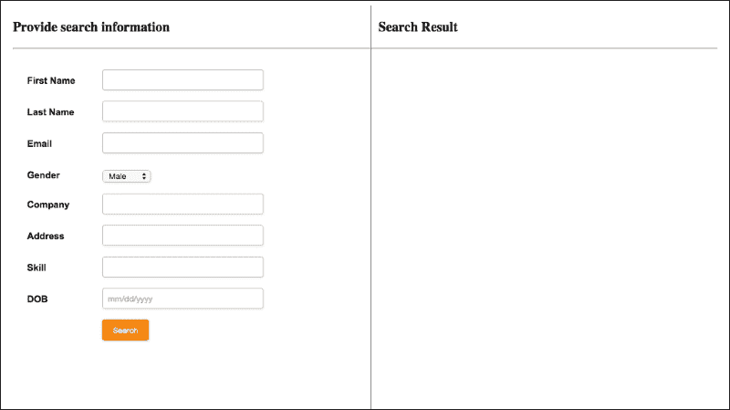
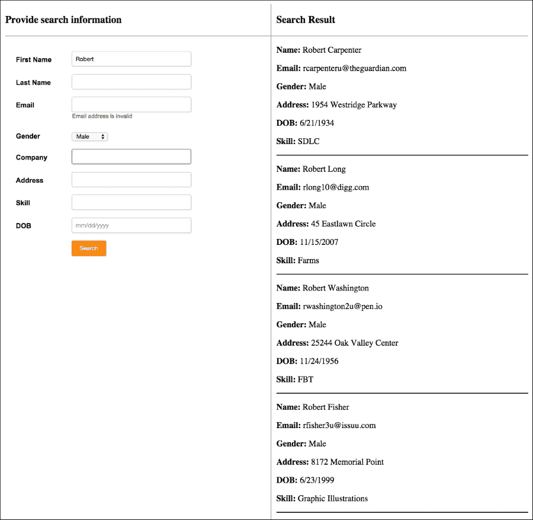
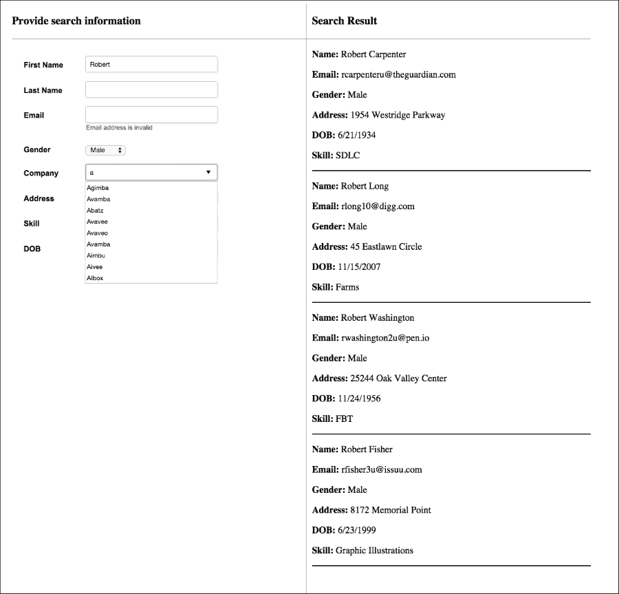

# 第八章：构建高级配置搜索小部件

使用 Bacon.js 精通 FRP 的最佳方式是通过构建一个真实世界的应用程序，这正是本章我们将要做的。我们将构建一个高级配置搜索小部件，就像你通常在社交网络或约会网站上找到的那样。为了使章节简短并切中要点，我们将使用一些样本数据而不是构建注册功能。我们还将学习更多关于函数式编程和 Bacon.js 的高级概念。

在本章中，我们将涵盖以下内容：

+   Bacon.js 中的错误事件

+   在 FRP 中处理异常

+   惰性求值

+   Bacon.js 中的总线

+   连接模式

+   最后，我们将构建一个高级配置搜索小部件

# Bacon.js 中的错误

Bacon 提供了 `Bacon.Error` 构造函数，以显式地将事件流或属性的值标记为错误，以便 Bacon 可以识别它们，并开放大量其他 API 以专门处理这些错误。

根据我们如何创建流，Bacon.js 有时可以识别事件是成功事件还是错误事件，如果是错误事件，则可以将其转换为 `Bacon.Error`。例如，如果我们使用 `Bacon.fromPromise` 创建一个 EventStream，那么 Bacon 可以轻松地识别错误，因为当在承诺模式中发生错误时，`then()` 方法的第二个回调或传递给 `catch()` 方法的回调会被执行。

如果在创建流时 Bacon 无法识别事件是错误事件还是成功事件，那么我们需要显式创建 `Bacon.Error` 的实例，并用它们替换错误事件。例如，当使用 `Bacon.fromCallback` 时，Bacon.js 无法知道事件是成功事件还是错误事件，因此我们需要显式地将错误事件转换为 `Bacon.Error` 的实例。

## 订阅错误

传递给 `onValue` 的回调函数不会为 `Bacon.Error` 事件或值调用；相反，我们需要使用 `onError`。

要查看其效果，请打开我们在上一章中创建的 `index.js` 文件，并添加以下代码：

```js
response.onError(function(error){
  console.log("An error occured while fetching the page", error);
})
```

现在，如果你输入一个无法获取的 URL，控制台将显示自定义错误消息。

## 映射错误

`map()` 函数不会映射 `Bacon.Error` 实例；因此，Bacon 提供了 `mapError ()`，它的工作方式与 `map` 相同，但只映射 `Bacon.Error` 实例。

同样，`flapMap()` 也不会映射 `Bacon.Error` 实例。因此，Bacon 提供了 `flatMapError()`，它的工作方式与 `flatMap` 相同，但只映射 `Bacon.Error` 实例。

除了 `flatMap` 和 `map`，`Bacon.Error` 实例可以传递一切。

## 重试函数调用

有时，我们可能希望在操作失败时重试。例如，如果我们由于服务器超时错误而无法使用 AJAX 获取网页，那么我们可能希望在一段时间后再次尝试获取它。

Bacon 提供了 `Bacon.retry` 函数，使用它我们可以不断地重复调用函数，直到我们想要停止为止。

`Bacon.retry` 返回一个 EventStream，它接受一个具有四个属性的对象，如下所示：

+   `source`：这是一个将被重新调用的函数。这个函数必须返回一个属性或 EventStream。

+   `retries`：这是一个表示除了初始尝试之外，要重试源函数的总次数的数字。当源函数返回的属性或流中推入 `Bacon.Error` 实例时，就会尝试重试。

+   `isRetryable`：这是一个可选属性。它需要分配给一个函数。该函数应返回 `true` 或 `false`。当源函数返回的属性或 EventStream 中推入某些内容时，`isRetryable` 被调用以确定是否应该尝试重试。

+   `delay`：这是一个可选属性。它被分配给一个函数，该函数返回在重试之前等待的毫秒数。默认值是 `0`。

`Bacon.retry` 返回的 EventStream 包含了在最后一次调用源函数返回的最后一个 EventStream 或属性中的事件或值。

让我们看看 `Bacon.retry` 函数的实际应用。在 `index.js` 文件中找到以下代码：

```js
var response = url.flatMap(function(value){
 return Bacon.fromPromise($.ajax({url:value}));
}).toProperty();
```

用以下代码替换：

```js
var response = url.flatMap(function(value){
  return Bacon.retry({
    source: function(){ return Bacon.fromPromise($.ajax({url:value})); },
    retries: 5,
    isRetryable: function (error) { return error.status !== 404; },
    delay: function(context) { return 2000; }
  })
}).toProperty();
```

在这里，我们每过 `2` 秒就会重试 AJAX 请求 `5` 次，前提是错误不是 `404`。

## 在错误时结束 EventStream 或属性

当你不能向 EventStream 或属性中推送任何内容时，称 EventStream 或属性已结束。

如果你想在推入 `Bacon.Error` 实例时结束 EventStream 或属性，那么你需要调用 EventStream 或属性的 `endOnError` 方法。`endOnError` 方法返回一个新的 EventStream 或属性，当推入 `Bacon.Error` 实例时，该 EventStream 或属性将被结束。

# 异常处理

如果在传递给 Bacon 辅助函数的回调函数内部遇到异常，则它不会被自动捕获；相反，我们必须使用 `try…catch` 语句来处理它。常见的做法是在捕获异常后返回一个 `Bacon.Error` 实例，这样我们就可以像处理错误一样处理它。

这里是处理异常的一个例子。在 `index.js` 文件中，找到以下代码：

```js
var response = url.flatMap(function(value){
  return Bacon.retry({
    source: function(){ return Bacon.fromPromise($.ajax({url:value})); },
    retries: 5,
    isRetryable: function (error) { return error.status !== 404; },
    delay: function(context) { return 2000; }
  })
}).toProperty();
```

用以下内容替换：

```js
var response = url.flatMap(function(value){
  try
  {
    return Bacon.retry({
      source: function(){ return Bacon.fromPromise($.ajax({url:value})); },
      retries: 5,
      isRetryable: function (error) { return error.status !== 404; },
      delay: function(context) { return 2000; }
    })
  }
  catch(e)
  {
    return new Bacon.Error(e);
  }

}).toProperty();
```

在这里，我们捕获异常并创建一个新的 `Bacon.Error` 实例，将异常作为错误详情，也就是说，我们将异常作为参数传递给构造函数。

# 常量属性

Bacon 还提供了创建常量属性的方法。常量属性在创建时初始化，并且不能重新初始化，也就是说，不能推送新的值。

使用 `Bacon.constant()` 构造函数创建一个常量属性。我们需要将属性的值传递给构造函数。常量属性可以合并、连接、组合、压缩、采样、过滤和转换。

这里是如何创建一个常量属性的示例。将此代码放置在 `index.js` 文件中：

```js
var script_start_time = Bacon.constant(Date.now()).map(function(value){
  var date = new Date(value);
  return (date).getHours() + ":" + (date).getMinutes() + ":" + (date).getSeconds();
});

script_start_time.onValue(function(value){
  console.log("This script started running at : " + value);
})
```

在这里，`constant` 属性存储脚本开始的时间并打印时间。

# 总线概述

**总线**就像一个 EventStream，但它允许我们手动将值推入流中，而不是将其附加到源，它还允许动态地将其他 EventStreams 和属性插入到总线上。

这里是一个演示如何创建总线以及 `Bacon.Bus` 实例提供的各种方法的示例。将此代码放置在 `index.js` 文件中：

```js
var bus1 = new Bacon.Bus();

bus1.onValue(function(event){
  console.log(event);
})

bus1.push(1);
bus1.push(2);
var bus2 = new Bacon.Bus();
bus1.plug(bus2);
bus2.push(3); 
bus1.error("Unknown Error"); //pushed an Bacon.Error
bus1.end();
bus2.push(4); //this will not be pushed as bus has ended
```

代码是自我解释的。上述代码的输出如下：

```js
1
2
3
```

# 订阅到 EventStreams 和属性的末尾

Bacon 提供了 `onEnd` 方法来订阅当 EventStream 或属性结束时将执行的回调。

这里有一些示例代码，展示了如何使用 `onEnd` 回调。将其放置在 `index.js` 文件中：

```js
script_start_time.onEnd(function(){
  console.log("Script start time has been successfully calculated and logged");
})
```

在这里，我们正在将 `onEnd` 回调附加到之前创建的常量属性上。初始化后，属性结束；因此，`onEnd` 回调被调用。我们还可以注册多个订阅者。

实际上，要结束 EventStream 或属性，Bacon 内部推送 `Bacon.End` 构造函数的一个实例。因此，我们也可以使用 `Bacon.End` 构造函数来结束 EventStream 或属性。

让我们看看如何使用 `Bacon.End` 的一个示例。将此代码放置在 `index.js` 文件中：

```js
var custom_stream = Bacon.fromBinder(function(sink) {
  sink(10);
  sink(20);
  sink(new Bacon.End()); //event stream ends here
  sink(30); //this will not be pushed
});

custom_stream.onValue(function(event){
  console.log(event);
});
```

代码的输出如下：

```js
10
20
```

`Bacon.End` 实例不会传递通过辅助函数。

# 取消订阅订阅者

我们看到了如何使用 `onValue`、`onError` 和 `onEnd` 订阅 EventStream 和属性。如果我们不再需要它们，我们还可以取消订阅订阅者。

这些函数返回一个用于取消订阅的函数。要取消订阅，我们需要调用订阅函数返回的函数。

# 组合和压缩

Bacon 提供了一些方法来组合和压缩属性和 EventStreams。组合和压缩之间存在显著差异。

当我们组合属性时，我们始终得到一个属性，其值是一个包含所有源属性的数组。如果我们尝试组合 EventStreams，那么它们在组合之前首先被转换为属性。当任何一个源属性有推送时，新的值将被推入结果属性。**组合**在源属性中每个都有值推送之后开始。

这里是一个演示组合的示例。将此代码放置在 `index.js` 文件中。

```js
var x1 = new Bacon.Bus();
var x2 = new Bacon.Bus();
var x3 = new Bacon.Bus();

Bacon.combineAsArray(x1, x2, x3).onValue(function(value){
  console.log(value);
})

x1.push(0);
x1.push(1);
x2.push(2);
x3.push(3);
x3.push(4);
x1.push(5);
```

以下是代码的输出：

```js
[1, 2, 3]
[1, 2, 4]
[5, 2, 4]
```

压缩与组合不同。**压缩**意味着将每个来源的事件成对组合，以便每个来源的第一个事件首先发布，然后是第二个事件，依此类推。结果将在每个来源有值时立即发布。当我们压缩属性和 EventStreams 时，我们始终得到一个 EventStream。

这里有一个示例来演示打包。将此代码放入 `index.js` 文件中：

```js
var y1 = new Bacon.Bus();
var y2 = new Bacon.Bus();
var y3 = new Bacon.Bus();

Bacon.zipAsArray(y1, y2, y3).onValue(function(value){
  console.log(value);
})

y1.push(0);
y1.push(1);
y2.push(2);
y3.push(3);
y3.push(4);
x1.push(5);
```

这里是代码的输出：

```js
[0, 2, 3]
```

# 延迟评估

在编程中，**延迟评估**是一种策略，它将值的评估延迟到它们需要的时候。Bacon.js 通过两种方式实现延迟评估。

## 类型 1

一个流或属性在其有订阅者之前不会附加到其数据源。让我们通过一个例子来理解这一点。将此代码放入 `index.js` 文件中：

```js
var myButton_click_stream1 = $("#myButton").asEventStream("click").map(function(event){
  console.log(event);
  return event;
});
```

这里，当你点击 `myButton` 按钮时，不会记录任何内容。现在，将此代码放入 `index.js` 文件中：

```js
myButton_click_stream1.onValue(function(event){})
```

现在你点击按钮时，将记录事件。

`log` 方法也被视为一个订阅者。

## 类型 2

`map` 和 `combine*` 等方法使用延迟评估来避免评估不需要的事件和值。在某些情况下，延迟评估可以带来巨大的性能优势。

但是 `map` 和 `combine*` 如何知道某个事件或值是不需要的呢？好吧，有一些方法会给 `map` 和 `combine*` 提供一些提示，例如 `sampledBy`。

### 注意

`sampledBy` 方法是什么？

`sampledBy` 方法用于根据属性或 EventStream 采样属性。它通过在每个事件中采样给定属性或 EventStream 的属性值，分别返回一个属性或 EventStream。返回的属性或 EventStream 将包含源属性或 EventStream 在每次推送时的属性值。

让我们看看 `map` 如何实现延迟评估的例子。将此代码放入 `index.js` 文件中：

```js
var myBus_1 = Bacon.Bus();
var myBus_2 = Bacon.Bus();

var myProperty_1 = myBus_1.map(function(event){
  console.log(""Executing 1"");
  return event;
}).toProperty();

var myStream_1 = myProperty_1.sampledBy(myBus_2);

myStream_1.onValue(function(event){
  console.log(""Logged"", event);
})

myBus_1.push(1);
```

在之前的代码中，我们做了以下操作：

1.  我们首先创建两个总线。

1.  然后，我们使用 `map` 方法映射第一个总线中的事件，并将其转换为属性。

1.  然后，我们通过在每个事件中采样第二个总线的属性值来创建一个 EventStream。

1.  然后，我们向 EventStream 添加一个订阅者。

1.  最后，我们将一个值推送到第一个总线。

之前的代码看起来应该记录以下输出：

```js
Executing 1
Logged 1
```

不幸的是，它没有记录任何内容。这是因为这里正在进行延迟评估。`sampledBy` 函数取属性的当前值，而不是从先前事件生成的值。因此，`map` 决定在第二个总线中发生事件时生成属性值，从而防止对传递给 `map` 函数的回调函数进行不必要的调用。简而言之，在这里，`map` 仅在实际上需要时才计算属性值。现在，将此代码添加到 `index.js` 文件中：

```js
myBus_1.push(2);
myBus_2.push();
```

现在，当你运行代码时，你将得到以下输出：

```js
Executing 1
Logged 2
```

这里，你可以看到 `map` 阻止了对第一个总线内部推送的第一个事件进行计算。它计算了第二个事件的属性值，因为采样是在那之后进行的。

### 注意

如果你想在使用 `map()` 方法时防止惰性求值，那么请使用 `flatMap` 而不是 `map`。`flatMap` 方法不使用惰性求值。在使用 `combine*` 方法时没有防止惰性求值的方法，但如果你非常需要它，那么你可以尝试使用其他方法重写代码，这取决于你想要实现什么，可能可行也可能不可行。

# 构建配置搜索小部件

我们已经涵盖了 Bacon.js 几乎所有的 重要 API 和概念。现在，是时候构建配置搜索小部件了。在这个过程中，我们还将学习一些其他的 API 和概念。

我们将构建配置搜索小部件来学习如何在现实世界的项目中使用 Bacon 为前端和后端编写响应式代码。让我们开始吧。

## 理解项目目录和文件

在本章的练习文件中，你会找到一个名为 `profile-search-widget` 的目录。在该目录中，你会找到另外两个名为 `final` 和 `initial` 的目录。`final` 目录包含配置搜索小部件的最终代码，而 `initial` 目录包含你快速开始构建配置搜索小部件所需的文件和代码。你现在将使用 `initial` 目录。

你应该在 `app.js` 文件中放置服务器端代码，在前端代码中放置 `public/js/index.js` 文件。目前，`app.js` 文件导入了 Bacon、Express 和文件系统模块，并且包含运行网络服务器和提供静态文件的基本代码。

在 `public/html/index.html` 文件中，你会找到 HTML 代码。我们不会编写任何 HTML 或 CSS。

让我们先构建后端，然后再构建前端。

## 将 Express.js 路由转换为函数式响应式模式

**Express.js** 路由使用回调模式编写。我们需要一个包装器将回调模式转换为函数式响应式模式。

Bacon 不提供直接执行此操作的方法——有各种其他自定义方法。最简单、最快捷的方式是为每个路由创建一个总线，每当有请求发送到路由时，就将一个事件推送到相应的总线。让我们以这种方式创建一个路由来为根 URL 的请求提供 `index.html` 文件。将此代码放置在 `app.js` 文件中：

```js
function route_eventstream(path)
{
    var bus = new Bacon.Bus();

    app.get(path, function(req, res) {
      bus.push({
          req: req,
          res: res
      });
    });

    return bus;
}

var root_stream = route_eventstream("/");

root_stream.onValue(function(event){
  event.res.sendFile(__dirname + ""/public/html/index.html"");
})
```

这就是代码的工作方式：

1.  首先，我们定义一个名为 `route_eventstream` 的函数，它作为一个包装器将回调模式转换为 EventStream 模式。它接受一个路径并返回一个总线。每当有请求发送到路由时，就会将一个事件推送到总线。该事件是一个连接对象，即它包含该客户端请求的请求和响应对象。

1.  然后，我们为根路径请求创建一个 EventStream。

1.  最后，我们注册了一个订阅者，每当有事件推送到根 EventStream 时，它会返回 `index.html` 文件。

现在，运行 `node app.js` 命令，并在你的浏览器中访问 `localhost:8080`。这是你将看到的输出：



## 提升用户体验

在之前的屏幕截图中，你可以看到有八个字段，用户可以根据这些字段进行搜索。

而不是用户只填写一些字段并点击 **搜索** 按钮来获取结果，我们可以添加一些更多功能来提升用户体验。以下是我们将要添加的额外功能：

+   当用户在任何字段中使用 *Enter* 键时，我们需要获取搜索结果

+   当用户输入公司名称时，我们将显示一个带有建议的下拉菜单

+   至少有一个字段（除了性别字段）应该有一些值，这样我们才能获取搜索结果。

+   如果输入的电子邮件格式无效，则应显示错误消息。

这些特性会使前端代码更加复杂，这将给我们一个机会来探索如何使用 Bacon 编写复杂的逻辑。

## 公司建议路由

让我们创建一个响应基于给定值的公司名称建议数组的路由。稍后，为了填充公司名称文本字段的下拉菜单，我们将向此路由发出请求。

我们不会构建添加配置文件的功能；相反，我们将简单地从具有一些随机配置文件的 JSON 文件中检索配置文件。在 `initial` 目录中，你可以找到一个名为 `data.json` 的文件，其中包含一些配置文件。

让我们先从 `data.json` 文件中读取数据。以下是此代码。将其放置在 `app.js` 文件中。

```js
var data = Bacon.fromNodeCallback(fs.readFile, "data.json", "utf8").map(function(event){
  return JSON.parse(event);
}).toProperty();
```

在这里，我们以函数式响应式风格读取数据，然后将 EventStream 转换为一个属性，该属性表示数据。

下面是公司建议路由的代码。将其放置在 `app.js` 文件中：

```js
function findMatchingCompanyName(list, companyName)
{
  return list.filter(function(value){
    return companyName != "" && value.company.toLowerCase().indexOf(companyName.toLowerCase()) == 0;
  })
}

var company_dropdown_list_stream = route_eventstream(""/company/dropdown"");

var company_dropdown_list_data_stream = Bacon.combineAsArray([data, company_dropdown_list_stream]).map(function(event){
  return findMatchingCompanyName(event[0], event[1].req.query.companyName);
}).toEventStream();

Bacon.zipAsArray(company_dropdown_list_stream, company_dropdown_list_data_stream).onValues(function(event1, event2) {
  event1.res.send(event2);
});
```

下面是如何使代码工作的：

1.  首先，我们定义一个方法，该方法接受一个配置文件数组和一个公司名称。它检查具有相同公司的配置文件并返回过滤后的列表。我们使用 ES6 过滤方法，因为 Bacon 没有为数组提供任何过滤方法。如果公司名称字符串为空，则返回一个空数组。

1.  然后，我们为 `/company/dropdown` 路径请求创建一个 EventStream。

1.  然后，我们将 `company_dropdown_list_stream` 和 `data` 属性结合。结果属性随后被映射，过滤后的结果是转换后的值。

1.  我们不能简单地使用一个订阅者来响应 `company_dropdown_list_stream`，因为我们已经失去了连接对象的引用。因此，我们将 `company_dropdown_list_stream` 和 `company_dropdown_list_data_stream` 进行压缩，以便我们同时获得连接对象的引用以及最终结果。然后，我们向压缩后的 EventStream 添加一个订阅者，该订阅者发送响应。

1.  这里还有一个需要注意的地方是我们使用 `onValues` 而不是 `onValue`。它们之间的区别在于 `onValues` 将值（假设它是一个数组）作为函数参数分割。

## 搜索结果路由

让我们创建一个根据给定参数返回配置文件数组的路由。这将用于查找搜索结果。稍后，从前端，我们将向此路由发出请求。

这是此路由的代码。将其放置在 `app.js` 文件中：

```js
function findMatchingProfilesForEmail(list, email)
{
  return list.filter(function(value){
    return value.email == email;
  })
}

function findMatchingProfiles(list, firstName, lastName, gender, skill, company, dob, address)
{
  var firstName_matches = list.filter(function(value){
    return firstName == "" || value.first_name.toLowerCase() == firstName.toLowerCase();
  })

  var lastName_matches = firstName_matches.filter(function(value){
    return lastName == "" || value.last_name.toLowerCase() == lastName.toLowerCase();
  })

  var gender_matches = lastName_matches.filter(function(value){
    return gender == "" || value.gender.toLowerCase() == gender.toLowerCase();
  })

  var skill_matches = gender_matches.filter(function(value){
    return skill == "" || value.skill.toLowerCase() == skill.toLowerCase();
  })

  var company_matches = skill_matches.filter(function(value){
    return company == "" || value.company.toLowerCase() == company.toLowerCase();
  })

  var dob_matches = company_matches.filter(function(value){
    return dob == "" || value.dob == dob;
  })

  var address_matches = dob_matches.filter(function(value){
    return address == "" || value.address.toLowerCase() == address.toLowerCase();
  })

  return address_matches;
}

var profile_search_stream = route_eventstream("/search");

var profile_search_data_stream_for_email = Bacon.combineAsArray([data, profile_search_stream.filter(function(event){
  return event.req.query.email != "";
})]).map(function(event){
  return findMatchingProfilesForEmail(event[0], event[1].req.query.email);
}).toEventStream();

var profile_search_data_stream_for_others = Bacon.combineAsArray([data, profile_search_stream.filter(function(event){
  return event.req.query.email == "";
})]).map(function(event){
  return findMatchingProfiles(event[0], event[1].req.query.firstName, event[1].req.query.lastName, event[1].req.query.gender, event[1].req.query.skill, event[1].req.query.company, event[1].req.query.dob, event[1].req.query.address);
}).toEventStream();

Bacon.zipAsArray(profile_search_stream, Bacon.mergeAll([profile_search_data_stream_for_email, profile_search_data_stream_for_others])).onValues(function(event1, event2) {
  event1.res.send(event2);
});
```

这就是代码的工作方式：

1.  首先，我们定义了两个方法，它们接受配置文件列表和搜索数据，并根据数据进行过滤。第一个方法仅基于电子邮件进行过滤，而第二个方法基于其他搜索数据进行过滤。我们这样做是因为电子邮件对于每个配置文件都是唯一的，如果用户提供了电子邮件 ID，那么我们就不需要使用其他数据并浪费计算。当有大量数据时，这种方式将带来很大的性能优势。

1.  然后，我们为 `/search` 路径创建一个 EventStream。

1.  之后，我们创建了两个流，即 `profile_search_data_stream_form_email` 和 `profile_search_data_stream_form_others`。`profile_search_data_stream_form_email` 流是在提供电子邮件时最终的结果，而 `profile_search_data_stream_form_others` 是在未提供电子邮件时最终的结果。

1.  最后，我们将 `profile_search_data_stream_form_email` 和 `profile_search_data_stream_form_others` 合并，将其与 `profile_search_stream` 进行压缩，并返回响应。

## 构建前端

我们已经完成了我们的配置文件搜索小部件的后端部分。现在，我们需要编写前端部分。

在我们深入之前，值得看看 `index.html` 文件中的代码：

```js
<!doctype html>
<html>
  <head>
    <title>Advanced Profile Search Widget</title>

    <link rel="stylesheet" type="text/css" href="css/style.css">
  </head>
  <body>
    <div class="container">
      <div class="section-1">
        <h3>Provide search information</h3>
        <hr>
        <div class="form-style">
            <form action="" method="post">
                <label><span>First Name</span><input type="text" class="input-field" id="first-name" value="" /></label>
                <label><span>Last Name </span><input type="text" 
                class="input-field" id="last-name" value="" /></label>
                <label>
                  <span>Email</span>
                  <input type="email" class="input-field" id="email" value="" />
                  <br><small class="hide" id="email-error">Email address is invalid</small>
                </label>
                <label>
                    <span>Gender</span>
                    <select id="gender" class="select-field">
                        <option value="male">Male</option>
                        <option value="female">Female</option>
                    </select>
                </label>
                <label><span>Company</span><input list="companies" type="text" class="input-field" value="" id="company" /></label>
                <label><span>Address</span><input type="address" class="input-field" value="" id="address" /></label>
                <label><span>Skill</span><input type="text" class="input-field" value="" id="skill" /></label>
                <label><span>DOB</span><input placeholder="mm/dd/yyyy" type="text" class="input-field" value="" id="dob" /></label>
                <label><span>&nbsp;</span><input type="button" value="Search" id="search" /></label>

                <datalist id="companies"></datalist>
            </form>
        </div>
      </div>
      <div class="section-2">
        <h3>Search Result</h3>
        <hr>
        <ul id="search-result">
        </ul>
      </div>
      <div class="clear"></div>
    </div>

    <script type="text/javascript" src="img/jquery-2.2.0.min.js"></script>
    <script type="text/javascript" src="img/Bacon.js"></script>
    <script type="text/javascript" src="img/index.js"></script>
  </body>
</html>
```

大部分代码都是自我解释的。这里有一些你需要特别注意的事情：

+   在这里，每个输入元素都附加了一个 `id` 值。我们将使用 `id` 值来创建一个 EventStream。

+   我们在电子邮件字段下方显示了一个错误消息。它有一个 `hide` 类，用于隐藏它。移除该类将取消隐藏。

+   我们还有一个 `datalist` 元素，它是 `company` 字段的下拉菜单。我们只需要向 `datalist` 元素添加 `option` 标签以显示下拉菜单。

+   最后，我们有一个用于显示搜索结果的区域。

现在，让我们为输入字段上的 `keyup` 事件创建 EventStreams，并将字段的当前值存储在属性中。以下是这段代码。将其放置在 `index.js` 文件中：

```js
var first_name_keypress_stream = $("#first-name").asEventStream("keyup");

var first_name = first_name_keypress_stream.scan("", function(value){
  return $("#first-name").val();
});

var last_name_keypress_stream = $("#last-name").asEventStream("keyup");

var last_name = last_name_keypress_stream.scan("", function(value){
  return $("#last-name").val();
});

var email_keypress_stream = $("#email").asEventStream("keyup");

var is_email_valid = email_keypress_stream.scan("", function(value){
  return $("#email").val();
}).map(function(value){
  var re = /^(([^<>()[\]\\.,;:\s@"]+(\.[^<>()[\]\\.,;:\s@"]+)*)|(".+"))@((\[[0-9]{1,3}\.[0-9]{1,3}\.[0-9]{1,3}\.[0-9]{1,3}])|(([a-zA-Z\-0-
9]+\.)+[a-zA-Z]{2,}))$/;
  return re.test(value);
});

var email = Bacon.mergeAll(is_email_valid.filter(function(value){
  return value == true;
}).map(function(value){
  $("#email-error").addClass("hide");
  return $("#email").val();
}), is_email_valid.filter(function(value){
  return value == false;
}).map(function(value){
  $("#email-error").removeClass("hide");
  return "";
}))

var gender_select_stream = $("#gender").asEventStream("change");

var gender = gender_select_stream.scan("male", function(value){
  return $("#gender option:selected").val()
})

var company_keypress_stream  = $("#company").asEventStream("keyup");

var company = company_keypress_stream.scan("", function(value){
  return $("#company").val();
});

var address_keypress_stream  = $("#address").asEventStream("keyup");

var address = address_keypress_stream.scan("", function(value){
  return $("#address").val();
});

var skill_keypress_stream  = $("#skill").asEventStream("keyup");

var skill = skill_keypress_stream.scan("", function(value){
  return $("#skill").val();
});

var dob_keypress_stream  = $("#dob").asEventStream("keyup");

var dob = dob_keypress_stream.scan("", function(value){
  return $("#dob").val();
});
```

上述代码的大部分内容都是自我解释的。你需要理解的是，我们不是直接将电子邮件字段的值分配给电子邮件属性，而是首先验证电子邮件是否有效。如果电子邮件无效，则显示错误消息，并且不将任何内容分配给电子邮件属性。如果电子邮件有效，则隐藏错误消息并将电子邮件字段的当前值分配给电子邮件属性。

现在，让我们编写代码以显示公司字段的建议下拉菜单。以下是这段代码。将其放置在 `index.js` 文件中：

```js
company.flatMap(function(event){
  return Bacon.fromPromise($.ajax({url:"/company/dropdown?companyName=" + encodeURIComponent(event)}));
}).flatMap(function(event){
  $("#companies").empty();
  return Bacon.fromArray(event);
}).onValue(function(event){
  $("#companies").append("<option value=''" + event.company + "''>");
});
```

在这里，每当公司财产的价值发生变化时，我们就会向`/company/dropdown`路径发出请求，检索建议并将它们附加到`datalist`中。

最后，每当用户点击**搜索**按钮或在任何输入字段中按*Enter*键时，我们需要发出一个`search`请求。以下是实现此功能的代码。将其放置在`index.js`文件中：

```js
var search_button_click_stream = $("#search").asEventStream("click");

var search_result_request_stream = Bacon.mergeAll(Bacon.mergeAll([first_name_keypress_stream, last_name_keypress_stream, email_keypress_stream, company_keypress_stream, address_keypress_stream, skill_keypress_stream, search_button_click_stream, dob_keypress_stream]).filter(function(event){
  return event.keyCode == 13;
}), search_button_click_stream);

var search_result_request_data = Bacon.combineAsArray([first_name, last_name, email, gender, company, skill, dob, address]).sampledBy(search_result_request_stream).flatMap(function(event){
  return event;
});
var search_result_request_cancel = search_result_request_data.filter(function(event){
  return event[0] == "" && event[1] == "" && event[2] == "" && event[4] == "" && event[5] == "" && event[6] == "" && event[7] == "";
}).onValue(function(){
  $("#search-result").empty();
  alert("Enter enter some data");
});

var search_result_response = search_result_request_data.filter(function(event){
  return event[0] != "" || event[1] != "" || event[2] != "" || event[4] != "" || event[5] != "" || event[6] != "" || event[7] != "";
}).flatMap(function(event){
  return Bacon.fromPromise($.ajax({url:"/search?firstName=" + encodeURIComponent(event[0]) + "&lastName=" + encodeURIComponent(event[1]) + "&email=" + encodeURIComponent(event[2]) + "&gender=" + encodeURIComponent(event[3]) + "&company=" + encodeURIComponent(event[4]) + "&address=" + encodeURIComponent(event[7]) + "&skill=" + encodeURIComponent(event[5]) + "&dob=" + encodeURIComponent(event[6]) }));
}).toProperty();

search_result_response.onError(function(){
  $("#search-result").empty();
  alert("An error occured");
})

search_result_response.flatMap(function(value){
  $("#search-result").empty();
  return Bacon.fromArray(value);
}).onValue(function(value){
  var html = "<li>";
  html = html + "<p><b>Name: </b> <span>" + value.first_name + " " + value.last_name + "</span></p>";
  html = html + "<p><b>Email: </b> <span>" + value.email + "</span></p>";
  html = html + "<p><b>Gender: </b> <span>" + value.gender + "</span></p>";
  htmt = html + "<p><b>Company: </b> <span>" + value.company + "</span></p>";
  html = html + "<p><b>Address: </b> <span>" + value.address + "</span></p>";
  html = html + "<p><b>DOB: </b> <span>" + value.dob + "</span></p>";
  html = html + "<p><b>Skill: </b> <span>" + value.skill + "</span></p>";
  html = html + "</li>";

  $("#search-result").append(html);  
});

search_result_response.filter(function(value){
  return value.length == 0;
}).onValue(function(value){
  $("#search-result").empty();
  alert("Nothing found")
})
```

下面是如何工作的代码：

+   首先，我们为**搜索**按钮创建一个点击流。

+   然后，我们创建`search_result_request_stream`流，其中每当我们在任何字段中点击**搜索**按钮或按*Enter*键时，都会推送一个事件。

+   然后，如果性别字段之外的任何字段有值，我们将向`/search`路径发出请求；否则，我们将显示一个警告消息，要求用户输入一些数据。

+   然后，如果发生 AJAX 错误，我们将显示包含错误信息的警告；如果 AJAX 响应不为空，则显示结果；最后，如果 AJAX 请求为空，我们将显示一个警告，说明没有找到任何内容。

## 测试小部件

要测试小部件，重新运行`node app.js`命令。现在，刷新`localhost:8080` URL。

要测试搜索小部件是否正常工作，在**姓氏**字段中输入`Robert`并按*Enter*键。您将看到以下输出：



要测试公司建议下拉菜单，在**公司**字段中输入`a`，您将看到以下输出：



因此，我们现在已经完成了高级个人资料搜索小部件的构建和测试。

# 摘要

在本章中，我们探讨了 Bacon.js 的高级 API 和概念，并使用它们构建了一个实际项目。现在，您应该能够舒适地使用 Bacon.js 以函数式方式编写响应式代码，并尝试将 Bacon.js 集成到您现有的和未来的项目中。

您还可以在[`baconjs.github.io/api.html`](https://baconjs.github.io/api.html)了解更多关于 Bacon.js API 的信息。
