# 第九章 Bootstrap 4 的新特性

**Bootstrap 4** 是撰写本文时的最新版本 Bootstrap。这个版本使 Bootstrap 更加强大、易于自定义和使用。在本章中，你将通过示例了解 Bootstrap 4 的新特性。我将假设你已经对 Bootstrap 有一些了解，并且知道如何使用它创建响应式网站。如果你是 Bootstrap 或响应式网页设计的新手，你可以在 Packt 目录中找到从零开始学习 Bootstrap 的好书。从本章开始，我们将使用 Bootstrap 4 设计我们将要构建的所有项目。

在本章中，我们将涵盖以下主题：

+   下载 Bootstrap 4 的各种方法

+   Bootstrap 4 的兼容性

+   支持 Flexbox

+   自定义 Bootstrap 4

+   响应式 CSS 单位

# 下载 Bootstrap 4

要下载 Bootstrap 4，首先访问 [`v4-alpha.getbootstrap.com/getting-started/download/`](http://v4-alpha.getbootstrap.com/getting-started/download/)。在这里，你可以找到根据你使用的包管理器下载 Bootstrap 4 的各种方法。如果你使用的包管理器不在列表中，或者你根本不使用包管理器，你也可以直接下载编译版本。此页面还提供了一个下载源文件的链接。

它还提供了自定义构建，这些只是 Bootstrap 4 的部分，可以在你只需要 Bootstrap 4 的几个功能而不是整个库时使用。

所有主要 CDN 服务也支持 Bootstrap 4，所以如果你想从 CDN 中获取它，你可以轻松找到 CDN URL。

对于本章，直接下载编译版本并将其放置在一个名为 `bs4` 的新目录中。在同一个目录下，创建一个名为 `index.html` 的文件，并在其中放置以下代码：

```js
<!DOCTYPE html>
<html lang="en">
  <head>
    <!-- Required meta tags always come first -->
    <meta charset="utf-8">
    <meta name="viewport" content="width=device-width, initial-scale=1, shrink-to-fit=no">
    <meta http-equiv="x-ua-compatible" content="ie=edge">

    <!-- Bootstrap CSS -->
    <link rel="stylesheet" href="bootstrap.min.css">
  </head>
  <body>

    <!-- jQuery first, then Bootstrap JS. -->
    <script src="img/jquery.min.js"></script>
    <script src="img/bootstrap.min.js"></script>
  </body>
</html>
```

# 浏览器和设备支持

Bootstrap 4 支持所有主要浏览器和平台的最新稳定版本。

在兼容性方面，Bootstrap 4 带来的唯一变化是它放弃了 Internet Explorer 8 的支持。其他一切都与 Bootstrap 3 相同。

# 理解 rem 和 em CSS 单位

Bootstrap 4 已经从 `px` 切换到 `rem` 和 `em`，尽可能的地方。这是 Bootstrap 4 不支持 IE 8 的主要原因，因为 IE 8 不支持 `em` 和 `rem` 单位。Bootstrap 4 切换到 `rem` 和 `em` 是因为它们使响应式排版和组件尺寸更容易。

如果你不太熟悉 `rem` 和 `em` CSS 单位，那么现在是学习它们的好时机。

`em` 单位相对于父元素的字体大小。`1em` 等于父元素的当前字体大小。`2em` 表示当前字体大小的两倍。例如，如果一个元素以 `10 px` 的字体大小显示，那么 `2em` 就是 `20 px`。我们可以通过仅使用 CSS 媒体查询更改父元素的字体大小，以实现响应式排版和组件尺寸。

由于 `em` 大小是嵌套的（它依赖于父元素），如果你有 `1.5em` 大小的元素，然后嵌套一些具有 `em` 声明的 HTML 元素，它们的尺寸会相乘。

`rem` 单位与 `em` 类似，但相对于 HTML 标签（根元素）的字体大小。因此，它不是嵌套的。

### 注意

Bootstrap 4 使用 16 像素的基准字体大小。

# 网格系统

Bootstrap 4 网格系统中所做的唯一更改是添加了一个新的超大断点。此断点的类前缀是 `.col-xl-`。以下是添加此新断点后的 Bootstrap 4 网格断点：

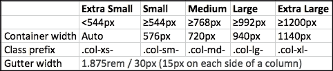

`.col-xl-` 断点针对的是 **1200px** 或更大的屏幕尺寸，这在 Bootstrap 3 中由 `.col-lg-` 实现。因此，这使其他断点压缩以针对比 Bootstrap 3 中更小的屏幕尺寸。在这里，你可以看到 `.col-xs-` 现在针对的是小于 **544px** 的屏幕宽度，而不是 Bootstrap 3 中的 **768px**，这使得针对移动设备并为平板电脑和移动设备提供不同的布局变得更容易，这在 Bootstrap 3 中是缺失的。

虽然 Bootstrap 使用 `em` 或 `rem` 来定义大多数尺寸，但网格断点和容器宽度使用 `px`。这是因为视口宽度以像素为单位，并且不会随着字体大小而改变。

这里是新的网格系统的一个示例。将此代码放置在 `index.html` 文件的 `<body>` 标签中：

```js
<div class="container">
  <div class="row">
    <div class="col-xs-12 col-sm-6 col-md-4 col-lg-3 col-xl-2">
      <p>
        Lorem ipsum dolor sit amet, consectetur adipiscing elit. Vivamus arcu nunc, lobortis et lacinia ut, pellentesque quis lacus. Aliquam non dapibus erat
      </p>
    </div>

    <div class="col-xs-12 col-sm-6 col-md-4 col-lg-3 col-xl-2">
      <p>
        Lorem ipsum dolor sit amet, consectetur adipiscing elit. Vivamus arcu nunc, lobortis et lacinia ut, pellentesque quis lacus. Aliquam non dapibus erat
      </p>
    </div>

    <div class="col-xs-12 col-sm-6 col-md-4 col-lg-3 col-xl-2">
      <p>
        Lorem ipsum dolor sit amet, consectetur adipiscing elit. Vivamus arcu nunc, lobortis et lacinia ut, pellentesque quis lacus. Aliquam non dapibus erat
      </p>
    </div>

    <div class="col-xs-12 col-sm-6 col-md-4 col-lg-3 col-xl-2">
      <p>
        Lorem ipsum dolor sit amet, consectetur adipiscing elit. Vivamus arcu nunc, lobortis et lacinia ut, pellentesque quis lacus. Aliquam non dapibus erat
      </p>
    </div>

    <div class="col-xs-12 col-sm-6 col-md-4 col-lg-3 col-xl-2">
      <p>
        Lorem ipsum dolor sit amet, consectetur adipiscing elit. Vivamus arcu nunc, lobortis et lacinia ut, pellentesque quis lacus. Aliquam non dapibus erat
      </p>
    </div>

    <div class="col-xs-12 col-sm-6 col-md-4 col-lg-3 col-xl-2">
      <p>
        Lorem ipsum dolor sit amet, consectetur adipiscing elit. Vivamus arcu nunc, lobortis et lacinia ut, pellentesque quis lacus. Aliquam non dapibus erat
      </p>
    </div>
  </div>
</div>
```

Bootstrap 行最多可以有 12 个列。由于在某些情况下，行中的列数超过 12，因此列会被包裹，即列会被包裹到新的一行。

在移动屏幕上，之前的代码将看起来像这样：

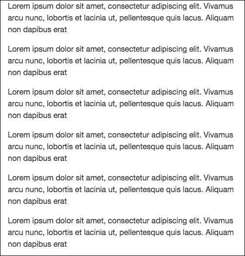

在小型平板电脑上，它将看起来像这样：

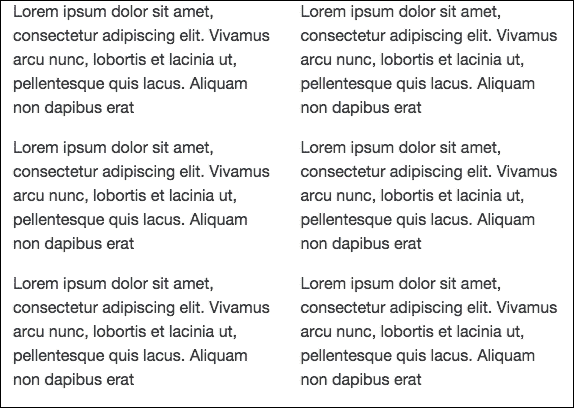

它在常规平板电脑上看起来将是这样：

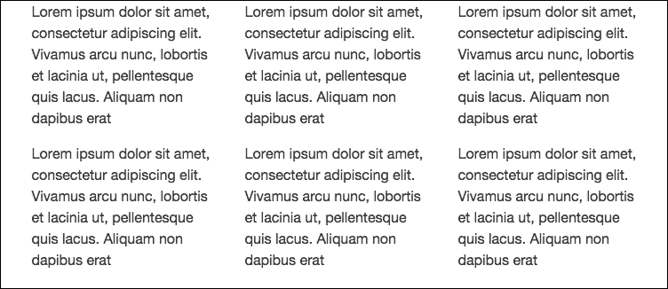

笔记本电脑用户将看到这个：

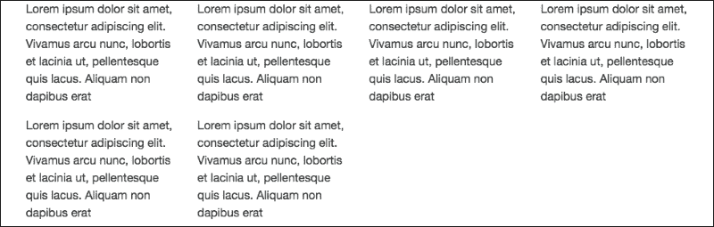

最后，在桌面显示器上，它将看起来像这样：

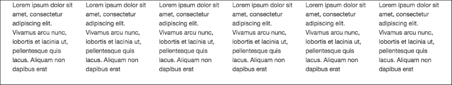

因此，在 Bootstrap 4 中，我们能够精确地针对所有类型的设备。

# 全局边距重置

对于所有元素，Bootstrap 4 将 `margin-top` 重置为 `0`，同时保持所有元素上的一致的 `margin-bottom` 值。

例如，标题添加了 `margin-bottom: .5rem`，段落有 `margin-bottom: 1rem` 以便于间距。

# 间距实用类

Bootstrap 4 添加了一组名为 **间距实用类** 的新实用类。这些类允许你通过边距或填充快速向元素的任何方向添加间距。

这些类的格式是 `[margin or padding]-[direction]-[size]`。

对于边距或填充，请使用以下格式：

+   `m` 用于边距

+   `p` 用于填充

对于方向，你可以使用以下这些：

+   `a` 用于全部

+   `t` 用于顶部

+   `r` 用于右

+   `l` 用于左

+   `b` 用于底部

+   `x` 用于左右

+   `y` 用于顶部和底部

你可以使用以下这些来指定大小：

+   `0` 用于零

+   `1` 用于 `1rem`

+   `2` 用于 `1.5rem`

+   `3` 用于 `3rem`

下面是一个演示间距实用类的示例。将此代码放置在`index.html`容器的末尾：

```js
<hr>
<div class="row">
  <div class="col-xs-12 m-t-2">
    <p>
      Lorem ipsum dolor sit amet, at suscipit sodales eget ante ultricies mauris. Etiam dolor felis morbi nibh, mollit porttitor tempor, dignissim magna pellentesque dictumst bibendum dictum integer. Justo mattis dapibus in diam. Quis arcu mauris mattis, orci est magna arcu scelerisque, integer gravida sit volutpat tellus, nulla enim quis. In non, in et, nec mauris in eu nec, nostra pellentesque nulla sodales, tempor neque ultrices lorem.

    </p>
  </div>

  <div class="col-xs-12 m-b-2">
    <p>
      Lorem ipsum dolor sit amet, at suscipit sodales eget ante ultricies mauris. Etiam dolor felis morbi nibh, mollit porttitor tempor, dignissim magna pellentesque dictumst bibendum dictum integer. Justo mattis dapibus in diam. Quis arcu mauris mattis, orci est magna arcu scelerisque, integer gravida sit volutpat tellus, nulla enim quis. In non, in et, nec mauris in eu nec, nostra pellentesque nulla sodales, tempor neque ultrices lorem.
    </p>
  </div>
</div>
<hr>
```

下面是页面现在的样子：

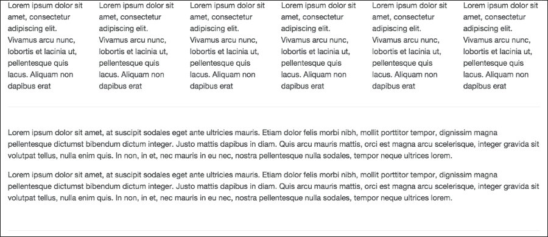

这里，你可以看到由间距实用类创建的顶部和底部边距空间。

# 显示标题

传统标题元素，即`h1`、`h2`等，旨在在页面内容的核心部分工作得最好。当您需要一个突出的标题时，请考虑使用显示标题——一个更大、稍微更具有意见的标题样式。显示标题类可以应用于页面上的任何元素。

下面是一个演示显示标题的示例。将此代码放置在`index.html`容器的末尾：

```js
<h1 class="display-1">Display-1</h1>
<h1 class="display-2">Display-2</h1>
<h1 class="display-3">Display-3</h1>
<h1 class="display-4">Display-4</h1>
<hr>
```

`display-1`、`display-2`、`display-3`和`display-4`是显示标题类。

下面是代码的输出：

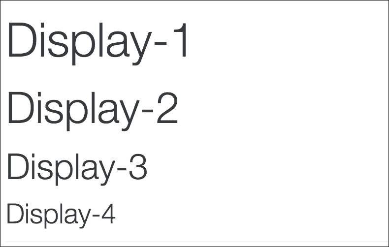

# 逆序表格

新增了一个用于表格的类，命名为`table-inverse`。这只是`table`外观上的另一种变体。

下面是如何创建逆序表格的方法。将此代码放置在`index.html`容器的末尾：

```js
<table class="table table-inverse">
  <thead>
    <tr>
      <th>#</th>
      <th>First Name</th>
      <th>Last Name</th>
      <th>Username</th>
    </tr>
  </thead>

  <tbody>
    <tr>
      <th scope="row">1</th>
      <td>Ramesh</td>
      <td>Kumar</td>
      <td>@ramesh</td>
    </tr>

    <tr>
      <th scope="row">2</th>
      <td>Sudheep</td>
      <td>Sahoo</td>
      <td>@sudheep</td>
    </tr>

    <tr>
      <th scope="row">3</th>
      <td>Abhinash</td>
      <td>Singh</td>
      <td>@abhi</td>
    </tr>
  </tbody>
</table>
<hr>
```

下面是表格的样式：

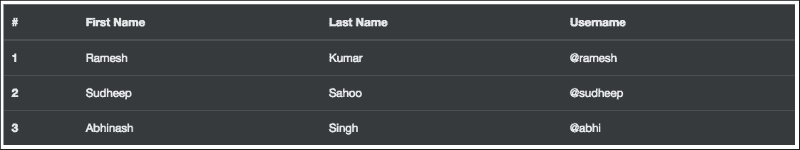

# 卡片组件

**卡片**是 Bootstrap 4 中的新组件，它取代了 wells、panels 和 thumbnails。卡片是一个灵活且可扩展的内容容器。它包括标题和页脚的选项、多种内容、上下文背景颜色和强大的显示选项。

下面是一个演示如何创建卡片及其所有子部分和样式的示例。将此代码放置在`index.html`容器的末尾：

```js
<div class="row">
  <div class="col-md-4">
    <div class="card">

      <div class="card-header">
        Featured
      </div>
      <div class="card-block">
        <h4 class="card-title">Card title</h4>
        <h6 class="card-subtitle">Support card subtitle</h6>
      </div>

      

      <div class="card-block">
        <p class="card-text">
          Lorem ipsum dolor sit amet, at suscipit sodales eget ante ultricies mauris. Etiam dolor felis morbi nibh, mollit porttitor tempor, dignissim magna pellentesque dictumst bibendum dictum integer.
        </p>
      </div>

      <div class="card-block">
        <a href="#" class="card-link">Card link</a>
        <a href="#" class="card-link">Another link</a>
      </div>

      <div class="card-footer">
        2 days ago
      </div>
    </div>

  </div>
  <div class="col-md-4">
    <div class="card">
      

      <div class="card-block">
        <blockquote class="card-blockquote">
          <p>Lorem ipsum dolor sit amet, consectetur adipiscing elit. Integer posuere erat a ante.</p>
          <footer>Someone famous in <cite title="Source Title">Source Title</cite></footer>
        </blockquote>
      </div>
    </div>
  </div>

  <div class="col-md-4">
    <div class="card">
      <div class="card-block">
        <p class="card-text">
          Lorem ipsum dolor sit amet, at suscipit sodales eget ante ultricies mauris. Etiam dolor felis morbi nibh, mollit porttitor tempor, dignissim magna pellentesque dictumst bibendum dictum integer.
        </p>
      </div>

      
    </div>
  </div>

  <div class="col-md-4">
    <div class="card">
      

      <div class="card-img-overlay">
        <h4 class="card-title">Card title</h4>
        <p class="card-text">Lorem ipsum dolor sit amet, at suscipit.</p>
      </div>
    </div>
  </div>

  <div class="col-md-4">
    <div class="card card-inverse" style="background-color: black">
      <div class="card-block">
        <h3 class="card-title">Card Title</h3>
        <p class="card-text">Lorem ipsum dolor sit amet, at suscipit sodales eget ante ultricies mauris. </p>
      </div>
    </div>
  </div>

  <div class="col-md-4">
    <div class="card card-inverse card-primary">
      <div class="card-block">
        <h3 class="card-title">Card Title</h3>
        <p class="card-text">Lorem ipsum dolor sit amet, at suscipit sodales eget ante ultricies mauris.</p>
      </div>
    </div>
  </div>

  <div class="col-md-4">
    <div class="card card-inverse card-success">
      <div class="card-block">
        <h3 class="card-title">Card Title</h3>
        <p class="card-text">Lorem ipsum dolor sit amet, at suscipit sodales eget ante ultricies mauris.</p>
      </div>
    </div>
  </div>

  <div class="col-md-4">
    <div class="card card-inverse card-info">
      <div class="card-block">
        <h3 class="card-title">Card Title</h3>
        <p class="card-text">Lorem ipsum dolor sit amet, at suscipit sodales eget ante ultricies mauris.</p>
      </div>
    </div>
  </div>

  <div class="col-md-4">
    <div class="card card-inverse card-warning">
      <div class="card-block">
        <h3 class="card-title">Card Title</h3>
        <p class="card-text">Lorem ipsum dolor sit amet, at suscipit sodales eget ante ultricies mauris.</p>
      </div>
    </div>
  </div>

  <div class="col-md-4">
    <div class="card card-inverse card-danger">
      <div class="card-block">
        <h3 class="card-title">Card Title</h3>
        <p class="card-text">Lorem ipsum dolor sit amet, at suscipit sodales eget ante ultricies mauris.</p>
      </div>
    </div>
  </div>
</div>
```

下面是代码的样式：

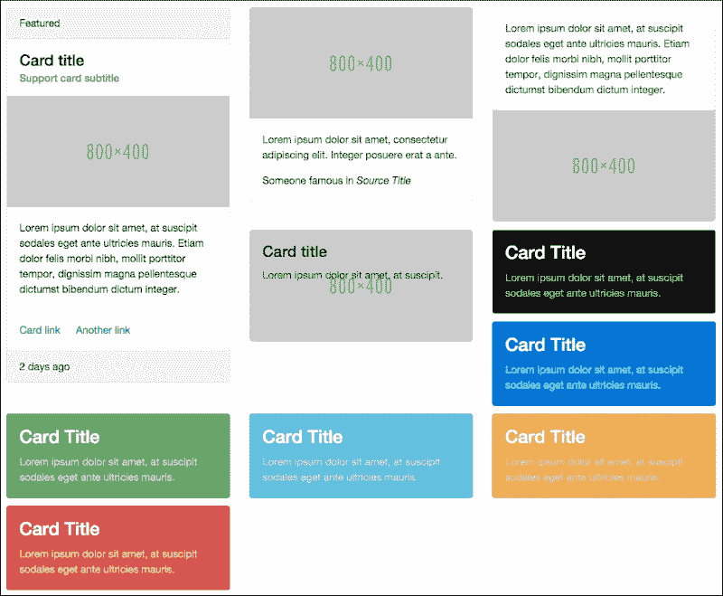

这里，我创建了多个卡片，以便更容易演示所有子部分和不同的样式。

下面是如何使之前的代码工作：

+   要创建一个卡片，我们需要使用`.card`类。

+   默认情况下，卡片宽度是其父容器宽度的 100%。因此，在这里我们使用网格系统来控制宽度。

+   在第一张卡片中，我们有一个标题，它是通过使用`.card-header`类创建的。然后，我们有一个卡片块，其中包含一个标题和副标题。卡片块是卡片的一部分，具有填充。无论何时您需要在卡片的任何部分添加填充，只需简单地使用`.card-block`类。卡片标题是通过`.card-title`类创建的，而卡片副标题是通过`.card-subtitle`类创建的。`.card-title`和`.card-subtitle`类仅仅提供了适当的边距。然后，我们简单地有一个响应式图片。之后，我们有一个使用`.card-text`类的段落。`.card-text`类确保最后一个子元素没有任何底部边距。然后，我们有两个使用`.card-link`类的链接。`.card-link`类将左边距应用于从第二个开始的所有的`.card-link`类。最后，我们有一个卡片页脚，它是通过`.card-footer`类创建的。

+   在第二张卡片中，我们有一个响应式图片，然后是一个引用块。我们为图片添加了`.card-img-top`类，该类为图片添加了顶部右和顶部左的圆角。我们还为引用块添加了`.card-blockquote`类，以移除引用块的边距、填充和左侧边框。

+   在第三张卡片中，我们只是添加了一些文本和一个响应式图片。我们为响应式图片添加了`.card-img-bottom`类，该类为图片添加了底部右和底部左的圆角。

+   我们创建的第四张卡片用于演示卡片叠加。首先，我们添加了一个具有`.card-img`类的响应式图片，该类为所有角落添加了圆角。然后，我们使用`.card-img-overlay`类创建了一个叠加层，该类简单地将元素的位置设置为绝对，并添加了一些填充，但没有顶部、右侧、左侧和底部的填充，因此将内容放置在卡片上方。

+   默认情况下，卡片使用深色文本并假设浅色背景。添加`.card-inverse`以使用白色文本，并指定与其搭配的`background-color`和`border-color`值。第五张卡片是`.card-inverse`的演示。Bootstrap 4 还提供了一些类，可以为卡片添加背景颜色和边框颜色。这些类在最后五张卡片中进行了演示。

## 卡片组、牌组和列

卡片组允许您将卡片渲染为单个、连接的元素，具有相等宽度和高度的列。卡片组仅适用于大于`544px`的屏幕尺寸。

如果您需要一组大小相同的卡片，而这些卡片彼此不连接，那么请使用卡片牌组而不是卡片组。卡片牌组仅适用于大于`544px`的屏幕尺寸。

最后，卡片列允许您将卡片组织成类似 Masonry 的列。卡片列仅适用于大于`544px`的屏幕尺寸。

下面是卡片组、牌组和列的代码示例。将其放置在`index.html`的容器元素末尾：

```js
<div class="card-group">
    <div class="card">
        
        <div class="card-block">
            <p class="card-text">
                Lorem ipsum dolor sit amet, at suscipit sodales eget ante ultricies mauris. Etiam dolor felis morbi nibh, mollit porttitor tempor, dignissim magna pellentesque dictumst bibendum dictum integer.
            </p>
        </div>
    </div>
    <div class="card">
        
    </div>
    <div class="card">
        
    </div>
    <div class="card">
        
    </div>
    <div class="card">
        
    </div>
    <div class="card">
        
    </div>
</div>

<br>
<div class="card-deck-wrapper">
    <div class="card-deck">

        <div class="card">
            
            <div class="card-block">
                <p class="card-text">
                    Lorem ipsum dolor sit amet, at suscipit sodales eget ante ultricies mauris. Etiam dolor felis morbi nibh, mollit porttitor tempor, dignissim magna pellentesque dictumst bibendum dictum integer.
                </p>
            </div>
        </div>
        <div class="card">
            
        </div>
        <div class="card">
            
        </div>
        <div class="card">
            
        </div>
        <div class="card">
            
        </div>
        <div class="card">
            
        </div>
    </div>
</div>

<br>
<div class="card-columns">
    <div class="card">
        
        <div class="card-block">
            <p class="card-text">
                Lorem ipsum dolor sit amet, at suscipit sodales eget ante ultricies mauris. Etiam dolor felis morbi nibh, mollit porttitor tempor, dignissim magna pellentesque dictumst bibendum dictum integer.
            </p>
        </div>
    </div>
    <div class="card">
        
    </div>
    <div class="card">
        
    </div>
    <div class="card">
        
    </div>
    <div class="card">
        
    </div>
    <div class="card">
        
    </div>
</div>
```

下面是代码的输出：

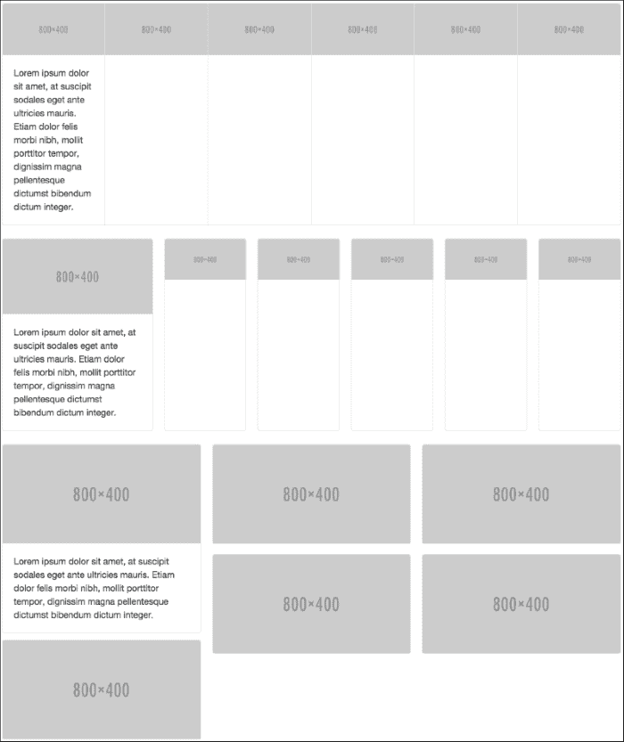

如您所见，我们使用了`.card-group`类来创建一个类组。我们使用了`.card-deck-wrapper`和`.card-deck`来创建一个卡片牌组，最后使用`.card-columns`来将卡片组织成类似 Masonry 的列。

# 轮廓按钮

Bootstrap 4 添加了一些新的按钮样式，包括**轮廓按钮**。轮廓按钮看起来是空心的，或者是常规按钮的反面。

这里是演示轮廓按钮的示例代码。将此代码放置在`index.html`的容器元素末尾：

```js
<hr>
<button type="button" class="btn btn-primary-outline">Primary</button>
<button type="button" class="btn btn-secondary-outline">Secondary</button>
<button type="button" class="btn btn-success-outline">Success</button>
<button type="button" class="btn btn-warning-outline">Warning</button>
<button type="button" class="btn btn-danger-outline">Danger</button>
<hr>
```

下面是代码的样式：

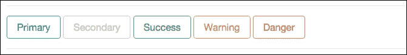

# 从 Less 迁移到 Sass

Bootstrap 4 的源代码是用 Sass 而不是 Less 编写的。Bootstrap 3 之前使用的是 Less。这很好，因为 Sass 通常更受前端开发者的青睐。它还编译得更快。此外，目前似乎没有计划推出 Less 版本。您可以在[`github.com/twbs/bootstrap/tree/v4-dev`](https://github.com/twbs/bootstrap/tree/v4-dev)找到源文件。

# 文本对齐和浮动实用类

浮动和文本对齐的实用类现在具有响应式范围。Bootstrap 4 已删除非响应式文本对齐和浮动类。

响应式文本对齐类格式为`text-[xs/sm/md/lg/xl]-[left/right/center]`。例如，`text-lg-left`类在`lg`或更宽的视口中左对齐文本。

格式为`pull-[xs/sm/md/lg/xl]-[left/right/none]`的类根据当前视口大小浮动元素到左侧或右侧，或禁用浮动。例如，`pull-xs-left`类在所有视口大小上都将元素浮动到左侧。

# 重置

Bootstrap 3 使用`Normalize.css`作为其 CSS 重置。在 Bootstrap 4 中，重置和 Bootstrap 基本样式合并为单个文件，称为`reboot.scss`。

# Flexbox 支持

**Flexbox 支持**最终在 Bootstrap 4 中到来。要启用各种组件和网格系统使用 Flexbox，您可以下载 Bootstrap CSS 文件的 Flexbox 版本，该版本可在他们的下载页面上找到：[`v4-alpha.getbootstrap.com/getting-started/download/`](http://v4-alpha.getbootstrap.com/getting-started/download/)。

请记住，Flexbox 在浏览器中的支持较差，所以在决定使用它之前请三思。以下是一个显示 Flexbox 浏览器支持的图表：

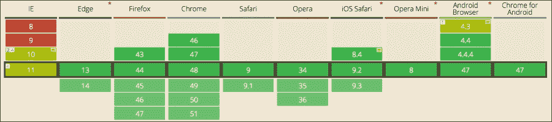

您也可以将`$enable-flex`变量的值更改为`true` Sass 变量，并编译它以生成 Bootstrap CSS 的 Flexbox 版本。

在[`v4-alpha.getbootstrap.com/getting-started/flexbox/`](http://v4-alpha.getbootstrap.com/getting-started/flexbox/)了解更多关于 Bootstrap 4 中 Flexbox 支持的信息。

# JavaScript 改进

在源文件中，所有 JavaScript 插件都是使用 ES6 编写的，并且通过 Babel 进行编译以供分发。它们现在还提供了 UMD 支持。

现在已经放弃了 IE 8 的支持，所以可以安全地始终使用 jQuery 2.0 与 Bootstrap 一起使用。jQuery 2.0 更小、更快，并且具有更多功能。

# 添加 Tether

**Tether**是一个用于使绝对定位的元素保持在页面中另一个元素旁边的 JavaScript 库。例如，您可能希望一个工具提示或对话框打开并保持在页面中相关项旁边。

在 Bootstrap 4 中，Tether 被集成到工具提示和弹出窗口中，以实现更好的自动定位和性能。因此，为了使工具提示和弹出窗口在 Bootstrap 4 中工作，您必须排队`tether.js`。

将此行代码添加到`bootstrap.min.js`文件的顶部，以从 CDN 中排队 Tether：

```js
<script src="img/tether.min.js"></script>
```

# 21:9 宽高比类

Bootstrap 4 中新增了一个新的宽高比类：`.embed-responsive-21by9` 类，用于 `21:9` 的比例。以下是一个示例：

```js
<div class="embed-responsive embed-responsive-21by9">
                <iframe class="embed-responsive-item" src="img/packtpub.com"></iframe>
            </div>
```

# 自定义 Bootstrap 4

在 Bootstrap 4 中，所有自定义变量选项都整合到了一个名为 `_variables.scss` 的单个文件中，您可以在其中即时编译 Sass，而且几乎不需要任何努力。这之前都是在单独的样式表中完成的。

此文件提供了比 Bootstrap 早期版本更多的自定义选项。

# Glyphicons 已被移除

**Glyphicons** 已从构建中移除，也就是说 Bootstrap 4 不包含图标包。您需要手动添加一个图标包。

# 摘要

因此，我们已经看到了 Bootstrap 4 的所有新特性。网格系统和卡片是 Bootstrap 4 的两个主要新增功能。现在切换到 Bootstrap 4 是完全可行的。尽管 Bootstrap 4 放弃了对 IE 8 的支持，但这也很好，因为用户也应该随着技术的发展而前进。从现在起，我们将在这本书中创建的所有项目中使用 Bootstrap 4。
