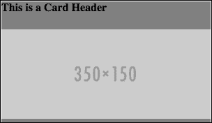
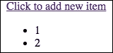

# 第十章：使用 React 构建用户界面

编写响应式 UI 的代码是一项困难的任务，因为每当应用程序状态改变时编写使用 JavaScript 操作 DOM 的代码是困难的，这也会使理解应用程序变得困难。因此，引入了 MVC 架构，其中我们分别定义 UI 和应用程序状态，并且当应用程序状态改变时，UI 会自动更新。MVC 框架视图一直专注于使编写响应式 UI 的代码更容易，但并没有提高渲染性能、可重用性和易于调试。这正是 React 旨在解决的问题。它不仅使编写响应式 UI 的代码更容易，而且还关注渲染性能、可重用性和易于调试。

在本章中，我们将涵盖以下主题：

+   React 是什么

+   虚拟 DOM 技术

+   使用 React 进行基于组件的 UI 开发

+   单向数据流编程

+   使用 JSX 编写 React 代码

+   在服务器端使用 React 构建 isomorphic 应用程序

+   许多其他主题帮助我们更好地掌握 React

# 介绍 React

React 是一个用于构建响应式 UI 的 JavaScript 库。我们通常使用 jQuery 或纯 JavaScript 来操作响应式 UI，每当应用程序状态改变时，这使得代码难以重用和理解。相反，我们可以使用 React，它允许我们根据应用程序状态声明 UI 的行为，并且每当应用程序状态改变时，它会自动更新 UI。有许多库和技术，如 Web 组件和模板引擎，旨在使 UI 的构建更容易，但 React 在人群中脱颖而出，因为它使构建可重用和高性能的响应式 UI 变得容易。

React 也被用作视图库，因为它正是视图库应该具备的样子。视图持有应用程序的 UI 并定义了基于应用程序状态 UI 如何变化，也就是说，应用程序状态是如何显示的。由于它只是一个视图库，它不会告诉我们如何管理、访问和修改应用程序状态。它可以作为任何类型架构和框架中的视图层使用。

请记住，React 是一个库，而不是像 Angular 或 Ember 这样的框架。因此，React 可以与 Angular 一起使用，以在性能和可重用性方面使 Angular 视图变得更好。

例如，有一个名为 ngReact 的 AngularJS 模块，它允许 React 在 AngularJS 中作为视图使用。

即使是 Flux 架构也使用 React 作为其视图。我们将在下一章中了解更多关于 Flux 的内容。

React 总是与框架一起使用，因为它只定义了 UI，但没有告诉我们如何管理应用程序逻辑和状态，就像模板库或 Web 组件总是与框架一起使用一样。

### 小贴士

**React 是模板引擎吗？**

React 不是一个模板引擎。大多数流行的 MVC 框架的视图都是模板系统的。在模板系统中，我们使用模板语言编写 HTML 以构建 UI，然后对其进行处理以生成最终的 HTML。例如，AngularJS 视图是一个由指令、表达式等组成的模板系统。React 不是一个模板引擎，因为我们不编写 HTML。相反，我们使用 JavaScript 定义 DOM 的结构。React 还能做许多模板引擎做不到的事情。它还可以捕获 UI 中的用户事件。这就是它与传统视图的不同之处。只是 React 的工作方式与模板系统不同。

当使用 React 构建用户界面时，我们不会像使用其他框架和库那样编写任何 HTML 来构建 UI；相反，我们仅使用 JavaScript 声明 DOM 结构。这种编程风格使得 React 能够实现各种算法和技术，以实现高渲染性能和可重用性。

在我们进一步学习 React 之前，让我们首先设置一个项目来使用它。

## 设置基本的 React 项目

在撰写本文时，React 的最新版本是 0.14.7。本书使用的是这个版本。首先，访问 [`facebook.github.io/react/downloads.html`](https://facebook.github.io/react/downloads.html) 下载 React。在这里，你可以找到两种类型的 React 构建，即生产构建和开发构建。这两种构建之间的区别在于，开发构建未压缩，包括额外的警告，而生产构建已压缩，包括额外的性能优化，并删除了所有错误。

当你的应用程序处于开发阶段时，你应该使用开发构建。一旦你的应用程序准备就绪，你应该切换到生产构建。

再次强调，你将找到两种生产环境和开发环境的构建版本：一种带有附加组件，另一种不带。我们将使用不带附加组件的开发版本。

你还可以找到 CDN 链接以及下载和排队 React 的链接。React 由两个文件组成：`react.js` 和 `react-dom.js`。请手动下载这两个文件。

创建一个名为 `react-demo` 的文件夹，并将两个文件放入其中。然后，创建一个名为 `index.html` 的文件，并将以下代码放入其中：

```js
<!DOCTYPE html>
<html>
  <head>
    <meta charset="UTF-8" />
    <title>React Demo</title>

    <script src="img/react.js"></script>
    <script src="img/react-dom.js"></script>
  </head>
  <body>

    <script>
      //place React code here
    </script>
  </body>
</html>
```

在本章的后面部分，我们将学习更多关于为什么 React 由两个文件组成而不是一个的原因。现在，只需忽略这一点。

## 虚拟 DOM

浏览器解释 HTML 并创建一个 DOM。DOM 是一个定义页面结构的树状结构。然后浏览器在页面上渲染 DOM。DOM API 是我们用来操作 DOM 的。当我们操作它时，浏览器会重新渲染被操作的部分。

问题不在于 DOM 是如何工作的，而在于我们如何程序化地改变它。操作 DOM 节点需要专业知识；否则，我们经常会不必要地重新渲染很多节点，这会导致渲染性能不佳。

例如，想象我们在一个电子商务网站上有一个大量的产品列表。我们还有一个过滤器小部件来过滤项目。当我们更改过滤器小部件中的值时，列表项将被重新加载，整个列表将被重新渲染，这需要对 DOM 进行大量的操作，可能会导致渲染性能不佳。为了获得更好的性能，我们实际上可以只操作列表的特定部分，例如产品标题、图片和成本。但编写这样的代码将会很困难。

让我们再举一个例子。如果你正在使用`ng-repeat`来显示一个列表，那么向列表中添加一个新项目将导致整个列表的重新渲染。所以，如果 Facebook 或 Instagram 使用了`ng-repeat`，那么每次我们向下滚动时，整个帖子集都会被重新渲染。解决这个问题的一个方法是不使用`ng-repeat`，因为它会重新渲染整个列表，我们可以使用 jQuery 或纯 JavaScript 将新帖子追加到列表的末尾。但如果你想要保持显示的帖子，那么你将不得不编写一些更复杂的代码。

由于这类问题，虚拟 DOM 被引入。虚拟 DOM 确保任何人都可以编写复杂的响应式 UI 代码，而不用担心性能。虚拟 DOM 是 React 实现渲染性能的秘密。

虚拟 DOM 是真实 DOM 的抽象版本，即真实 DOM 的描述。虚拟 DOM 元素只是 JavaScript 对象，而真实 DOM 元素是真实的 UI 元素。虚拟 DOM 要快得多，因为它只是一个 JavaScript 数据结构，操作它不会自动重新渲染 UI。之前我说过，在 React 中，你不会写任何 HTML，而是声明 DOM 的结构。实际上，你声明的是虚拟 DOM 的结构，而不是真实 DOM。React 保持真实 DOM 与虚拟 DOM 同步。每当应用程序状态改变以更新 UI 时，React 使用复杂的算法来比较真实 DOM 和虚拟 DOM，并找到尽可能少的突变以使真实 DOM 与虚拟 DOM 同步。我们稍后会看到这些算法实际上是如何找到差异并突变真实 DOM 的。例如，如果我们有一个在虚拟 DOM 中的列表，我们删除列表并添加一个只有一个额外项的新列表，那么，当与真实 DOM 同步时，只有新项被渲染，而不是整个列表。

让我们看看一些使用 React 打印**Hello World**的示例代码。在`index.html`的`body`标签内，放置以下代码：

```js
<div id="container1"></div>
```

我们将在这个`div`元素中显示**Hello World**。将此代码放置在`index.html`文件的`script`标签中，以显示**Hello World**：

```js
var helloBold = React.createElement("b", {}, "Hello");
var worldItalic = React.createElement("i", {}, " World");
var helloWorld = React.createElement("a", {href: "#"}, helloBold, worldItalic);

ReactDOM.render(helloWorld, document.getElementById("container1"));
```

下面是代码输出的样子：


让我们了解代码是如何工作的。

`React.createElement` 用于创建一个 `ReactElement` 接口的对象。`ReactElement` 对象是一个轻量级、无状态和虚拟的真实 DOM 元素的表示，但它不是一个真实的 DOM 元素。它基本上是一个虚拟 DOM。`ReactElement` 和真实 DOM 元素具有不同的接口。`React.createElement` 的第一个参数可以是一个 HTML 标签名或 `ReactClass` 接口的对象。我们将在稍后学习更多关于 `ReactClass` 的内容。第二个参数是一个包含 HTML 标签属性或 `ReactClass` 对象属性的对象的参数。然后，我们可以传递无限数量的参数，这些参数可以是字符串、`ReactElement` 对象或 `ReactClass` 对象。所有第二个参数之后的参数都被视为将要创建的 `ReactElement` 对象的子元素。如果子元素是动态决定的，那么你可以提供一个数组作为第三个参数。

在这里，我们创建了三个 `ReactElement` 对象。`helloWorld` 是一个锚标签，其子元素为 `helloBold` 和 `worldItalic`。我们将锚标签的 `href` 属性赋值为 `#`。

`ReactDOM.render` 用于在真实 DOM 中渲染 `ReactElement` 对象。`ReactDOM.render` 的第一个参数是一个 `ReactElement` 对象，第二个参数是我们想在其中添加 `ReactElement` 的真实 DOM 容器元素的引用。

在这里，我们在容器元素内部渲染了锚标签。

### 注意

由于 `ReactElement` 对象是无状态的，我们不能将其分配任何 UI 事件处理器到 `properties` 对象。此外，直接修改传递给 `ReactElement` 对象的属性将没有任何效果，因为 React 不会直接监视属性。

在开始时，可能会感觉 `ReactElement` 和真实 DOM 元素只是以不同的方式创建，并且它们的接口是相同的，但这并不正确。以下是一些差异：

+   而不是使用 `class` 属性，你需要使用 `className`

+   而不是使用 `for` 属性，你需要使用 `htmlFor` 属性

+   `style` 属性不能是一个字符串；它必须是一个对象

还有更多。我们将随着深入探讨它们。

## 组件

你可以使用 React 仅使用 `ReactElement` 对象，但要充分利用 React，你必须使用 React 组件。`ReactElement` 对象是无状态和不可变的，因此对于构建响应式 UI 来说是无用的。此外，它们不提供 UI 可重用性的结构化机制。

React 组件是一个可重用的自定义标签，它是可变的，并且封装了一个嵌入的状态，即状态或属性的更改将修改 UI。例如，我们可以有一个名为 `clock` 的组件，它接受当前时间作为属性并显示带有传递时间的时钟。另一个例子可以是显示实时比特币价格的比特币价格组件。

组件状态是组件内部的。它是在组件内部创建和变更的。然而，组件的属性不能在组件内部变更；相反，它们可以通过创建组件实例的代码进行变更。

您可以将完整的 UI 拆分为组件——这是使用 react 构建 UI 时推荐的一种编码风格。您还可以在组件内部使用组件。在我们进一步探讨组件之前，让我们使用组件重写之前的**Hello World**代码。

在`index.html`的`body`标签内部放置以下代码：

```js
<div id="container1"></div>
```

我们将在这个`div`元素内部显示**Hello World**。将此代码放置在`index.html`文件的`script`标签中，以显示**Hello World**：

```js
var anchorWithBoldItalic = React.createClass({
  render: function() {
    return React.createElement(
      "a", 
      {href: this.props.href}, 
      React.createElement("b", {}, this.props.boldText), 
      React.createElement("i", {}, this.props.italicText)
    );
  }
});

var HelloWorld = React.createElement(anchorWithBoldItalic, {href: "#", boldText: "Hello", italicText: " World" });

ReactDOM.render(HelloWorld, document.getElementById("container2"));
```

以下是上一段代码的输出：


以下是代码的工作原理：

1.  组件是通过`React.createClass`函数创建的。该函数接受一个对象，并且该对象必须有一个`render`属性，该属性被分配给一个返回`ReactElement`对象的函数。由`render`方法返回的`ReactElement`对象被称为组件的内容，即它说明了标签是如何渲染的。每当尝试显示标签时，标签的内容就会在相应位置显示。

1.  `React.createClass`返回一个组件。要使用该组件，我们需要创建其实例。就像`React.createElement`用于为 HTML 标签创建一个`ReactElement`对象一样，它也可以为组件创建一个`ReactElement`对象。因此，`React.createElement`用于创建组件的实例。`this.props`在组件内部用于访问其属性。

1.  这里，我们创建了一个名为`anchorWithBoldItalic`的组件，它是一个带有一些文本以粗体和斜体显示的锚点元素。

1.  然后，我们为我们的组件创建了一个`ReactElement`对象，并最终使用`ReactDOM.render`将其渲染。

### 注意

请记住，在创建组件实例之后变更属性将重新渲染组件。

## 单向数据绑定

在前面的子节中，我提到组件具有封装性。每当我们对状态进行更改时，组件就会被渲染。组件还允许您注册 UI 事件处理器，您也可以在事件处理器内部变更状态。

React 允许您管理、访问和变更 UI 状态，但不能变更应用状态。UI 状态和应用状态之间的区别在于，UI 状态表示用于操作 UI 的数据，而应用状态表示在 UI 中显示的数据。例如，假设您有一个评论框。评论框中的评论是应用状态，而**查看更多评论**按钮是 UI 状态，它可能显示也可能不显示，这取决于是否有更多的帖子。

UI 和其状态之间的数据绑定是单向的。这意味着用户对 UI 的操作不能直接改变 UI 状态，但 UI 状态可以改变 UI。

这可能看起来像是一个限制，因为 AngularJS 和其他流行的框架提供了双向数据绑定，但实际上这是一个特性。这个特性使得理解和调试应用程序变得更加容易。

许多开发者倾向于将 UI 状态作为应用程序状态，但对于复杂和大型应用程序，这会导致问题，并使得构建应用程序变得困难。

让我们通过构建一个在点击时隐藏/显示盒子的按钮来举例说明如何使用组件状态。

将此代码放在 `index.html` 文件的 `<body>` 标签内：

```js
<div id="container3"></div>
```

我们将在这个容器元素内显示组件。

将此代码放在 `script` 标签内：

```js
var hideShowBoxButton = React.createClass({
  getInitialState: function(){
    return {
      display: "inline-block"
    }
  },
  handleClick: function(){
    if(this.state.display == "inline-block")
    {
      this.setState({display: "none"});
    }
    else
    {
        this.setState({display: "inline-block"});
    }
  },
  render: function(){
    return React.createElement(
      "div", 
      {}, 
      React.createElement(
        "a", 
        {href: "#", onClick: this.handleClick}, 
        "Click to Show/Hide"
      ), 
      React.createElement(
        "span", 
        {
          style: {
            display: this.state.display, 
            height: 30, 
            width: 30, 
            backgroundColor: "red"
          }
        }
      )
    );
  }
});

ReactDOM.render(React.createElement(hideShowBoxButton), document.getElementById("container3"));
```

这是上一段代码的输出：


这就是代码的工作原理：

1.  首先，我们创建一个新的组件。

1.  `getInitialState` 方法返回组件的初始状态。

1.  然后，我们创建一个点击处理程序，该处理程序切换显示状态。在修改状态时，你必须使用 `this.setState`，而不是直接使用 `this.state` 来修改状态。

1.  然后，我们创建 `render` 方法，该方法显示一个按钮和一个小红框。`render` 方法将盒子的显示样式设置为显示状态。因此，每当状态发生变化时，React 都会重新渲染组件。React 不是重新渲染整个组件，而是通过比较虚拟 DOM 和真实 DOM，只修改所需的 DOM 元素来重新渲染它。这就是它实现渲染性能的方式。

1.  最后，我们创建一个组件实例并将其添加到容器元素中。

1.  还要注意，我们只指定了高度和宽度的数值，而没有指定任何单位。在这种情况下，单位是像素。

## 同构 UI 开发

**同构开发**是指我们可以在前后端使用相同的代码。

到目前为止，我们已经看到了如何在前端使用 React 来构建响应式 UI，但相同的 React 代码也可以用于后端。当在后台使用时，React 输出 HTML，并且不提供任何类型的 UI 性能优势或响应性。

React 的同构特性是使其如此受欢迎和强大的原因之一。它使许多事情变得更容易。例如，它使得通过让我们在后台预先渲染页面来防止 FOUC 变得更容易，然后在前端：相同的组件只需添加事件绑定。

React 代码不仅可以在 Node.js 中执行，还可以在 PHP、Ruby、.NET 以及一些其他主要的后端语言中执行。

由于 React 可以在前端和后端使用，React 开发团队决定将 React 分成两个文件：React 核心和针对执行环境的特定部分。这就是为什么当我们之前在 HTML 文件中包含 React 时，我们包含了两个文件。React 核心包含 `React.createElement`、`React.createClass` 等，而 React DOM 包含 `ReactDOM.render` 等。

让我们通过在 Node.js 中创建和显示之前的 hello world 组件来查看如何使用 React 的一个示例。创建一个名为 `React-Server-Demo` 的目录。在其内部，创建名为 `app.js` 和 `package.json` 的文件。

在 `package.json` 文件中，放置以下代码：

```js
{
  "name": "React-Server-Demo",
  "dependencies": {
    "express": "4.13.3",
    "react": "0.14.7",
    "react-dom": "0.14.7"
  }
}
```

然后，运行 `npm install` 下载 Express 和 React 模块。现在，在 `app.js` 文件中，放置以下代码并运行 `node app.js` 命令：

```js
var React = require("react");
var ReactDOMServer = require("react-dom/server");
var express = require("express");
var app = express();

var anchorWithBoldItalic = React.createClass({
  render: function() {
    return React.createElement(
      "a", 
      {href: this.props.href}, 
      React.createElement("b", {}, this.props.boldText), 
      React.createElement("i", {}, this.props.italicText)
    );
  }
});

var HelloWorld = React.createElement(anchorWithBoldItalic, {href: "#", boldText: "Hello", italicText: " World" });

app.get("/", function(httpRequest, httpResponse, next){
  var reactHtml = ReactDOMServer.renderToString(HelloWorld);
  httpResponse.send(reactHtml)
})

app.listen(8080);
```

现在，在你的浏览器中打开 `http://localhost:8080/`；你会看到以下输出：


这就是代码的工作原理：

1.  首先，我们导入 React 核心模块，然后是 React 服务器端模块，然后是 Express。

1.  我们使用之前创建组件时相同的代码。

1.  然后，我们为根路径创建一个路由。

1.  根路径使用 React 服务器端模块的 `renderToString` 方法生成组件的 HTML 代码。

1.  最后，我们将 HTML 发送到客户端。

### 注意

注意，默认情况下，React 将处于开发模式。要在生产模式下使用 React，请将环境变量 `NODE_ENV` 设置为 `production`。

# 开始使用 JSX

使用 JavaScript 编写代码来定义树状结构和属性，同时使用 React 构建 UI 是困难的，也使得理解 UI 变得困难。因此，React 团队提出了一种替代语法来编写 React 代码，这使得编写和理解代码更加容易。这种替代语法被称为 JSX。JSX 代表 JavaScript 语法扩展。它看起来类似于 XML。包含 JSX 代码的文件具有 `.jsx` 扩展名。

## 编译 JSX

当然，浏览器和服务器端引擎无法理解和解释 JSX；因此，在使用 JSX 之前，我们需要将其编译成纯 JavaScript。

有各种开源 JSX 编译器。你可以在[`github.com/facebook/react/wiki/Complementary-Tools#build-tools`](https://github.com/facebook/react/wiki/Complementary-Tools#build-tools)找到列表。最受欢迎和推荐的 JSX 编译器是 Babel。Babel 可以安装([`babeljs.io/docs/setup/`](https://babeljs.io/docs/setup/))，我们可以在线使用 Babel 编译器([`babeljs.io/repl/`](https://babeljs.io/repl/))，我们还可以在我们的 HTML 页面中嵌入 Babel 编译器，以便在浏览器中编译。

为了演示目的，我们将在我们的 HTML 页面中嵌入 Babel 编译器。编译需要时间，因此在生产网站上，你永远不应该在网页中嵌入编译器；相反，你应该预先编译并服务 JSX 代码。

要将 Babel 编译器嵌入到网页中，请访问 [`cdnjs.com/libraries/babel-core`](https://cdnjs.com/libraries/babel-core) 并下载 Babel 核心。这些是 CDN 链接，因此它们可以直接嵌入，但让我们下载并嵌入到我们的网页中。下载 `browser.min.js` 文件并将其放置在 `react-demo` 目录中。然后，通过在 `<head>` 标签中放置以下代码将其嵌入到 `index.html` 页面中：

```js
<script src="img/browser.min.js"></script>
```

现在，在 `body` 标签的末尾创建一个新的 `<script>` 标签，并将 `type` 属性设置为 `text/babel`，以便 Babel 编译器知道要编译哪种代码。代码应该看起来像这样：

```js
<script type="text/babel">
</script>
```

从现在开始，所有的 JSX 代码都将放置在这个脚本标签中。

### 提示

**JSX 编辑器**

几乎所有流行的代码编辑器都有可用的扩展来正确突出显示 JSX 语法。

## JSX 语法

让我们使用 JSX 语法重写数据绑定示例代码。将此代码放置在 `body` 标签中以创建一个新的容器元素：

```js
<div id="container4"></div>
```

这里是 JSX 代码。将其放置在将被 Babel 编译的 `script` 标签中：

```js
var HideShowBoxButton = React.createClass({
  getInitialState: function(){
    return {
      display: "inline-block"
    }
  },
  handleClick: function(){
    if(this.state.display == "inline-block")
    {
      this.setState({display: "none"});
    }
    else
    {
      this.setState({display: "inline-block"});
    }
  },
  render: function(){
    var boxStyle = {
      display: this.state.display, 
      height: 30, 
      width: 30, 
      backgroundColor: "red"
    };

    return (
      <div>
        <a href="#" onClick={this.handleClick}>Click to Show/Hide</a>
        <span style={boxStyle}></span>
      </div>
    )
  }
});

ReactDOM.render(<HideShowBoxButton />, document.getElementById("container4"));
```

代码的输出如下：


在我们查看代码如何工作之前，让我们看看它的编译版本：

```js
var HideShowBoxButton = React.createClass({
  displayName: "HideShowBoxButton",

  getInitialState: function getInitialState() {
    return {
      display: "inline-block"
    };
  },
  handleClick: function handleClick() {
    if (this.state.display == "inline-block") {
      this.setState({ display: "none" });
    }
    else
    {
      this.setState({ display: "inline-block" });
    }
  },
  render: function render() {
    var boxStyle = {
      display: this.state.display,
      height: "30px",
      width: "30px",
      backgroundColor: "red"
    };

    return React.createElement(
      "div",
      null,
      React.createElement(
        "a",
        { href: "#", onClick: this.handleClick },
        "Click to Show/Hide"
      ),
      React.createElement("span", { style: boxStyle })
    );
  }
});

ReactDOM.render(React.createElement(HideShowBoxButton, null), document.getElementById("container4"));
```

这个编译版本将给你一个基本的了解 JSX 语法是如何工作的。让我们了解之前的 JSX 代码是如何工作的。

简而言之，JSX 用于使用类似 XML 的语法编写 `React.createElement` 方法。XML 标签名是第一个参数，属性是第二个参数，最后，子元素是 `React.createElement` 的其他参数。

如果 JSX 标签名以小写字母开头，它是一个 HTML 标签；而如果以大写字母开头，它是一个组件。所以在这里，我们使组件名称以大写 H 开头。如果我们使用小写 H，它将被视为 HTML 标签，并且 `<hideShowBoxButton></hideShowBoxButton>` 将被插入到页面中，这将不会渲染任何内容。

在 `HideShowBoxButton` 组件中，除了 `render` 方法代码外，其他都相同。我们使用 JSX 语法重写了 `render` 方法。

JSX 提供了 `{}` 大括号来包裹 JavaScript 表达式，在将它们分配给属性或用作子元素时使用。在这里，我们将 JavaScript 表达式分配给了 `onClick` 和 `style` 属性。

最后，我们使用 JSX 语法创建了一个组件实例。

在编译后的代码中，你将在传递给 `React.createClass` 的对象中找到一个 `displayName` 属性。`displayName` 属性用于调试。如果没有设置，则在编译时设置为组件名称。

# 深入研究组件

让我们进一步深入研究组件并掌握它们。我们将查看组件组合和所有权。学习这一点将帮助我们构建更易于管理的复杂响应式 UI。

## 组件组合

**可组合性** 是一个特性，允许你在另一个组件的 `render` 方法中使用一个组件。

让我们看看组件组合的基本示例。首先，创建一个新的容器元素。为此，将以下代码放置在`body`标签中：

```js
<div id="container5"></div>
```

这里是组件组合的示例代码。将此代码放置在由 Babel 编译的`script`标签中：

```js
var ResponsiveImage = React.createClass({
  render: function(){

    var imgWidth = {
      width: "100%"
    }

    return (
      
    )
  }
})

var Card = React.createClass({
  render: function(){
    var CardContainerStyle = {
      maxWidth: 300,
      backgroundColor: "grey"
    }

    return (
      <div style={CardContainerStyle}>
        <h4>{this.props.heading}</h4>
        <ResponsiveImage src={this.props.src} />
      </div>
    )
  }
})

ReactDOM.render(<Card src="img/350x150" heading="This is a Card Header" />, document.getElementById("container5"));
```

这是代码的输出：



在这里，我们创建了两个不同的组件。在 Card 组件内部，我们使用`ResponsiveImage`组件来显示其中的响应式图片。

## 组件所有权

当组件被用于其他组件的`render`方法中时，它们被称为所有者-被所有者关系，而不是父子关系。如果组件 X 在其`render`方法中创建了一个组件 Y 的实例，那么我们说组件 X 是组件 Y 的所有者。

### 注意

注意，组件 X 不被称为父组件；相反，它被称为组件 Y 的所有者。

例如，在之前的代码中，`Card`组件是`ResponsiveImage`组件的所有者，而`<div>`是`ResponsiveImage`的父组件。

如果我们将组件实例放置在组件实例的开头和结尾标签内，那么它们就被说成是父子关系。父组件可以通过使用`this.props.children`对象来访问其子组件。React 还提供了实用函数来简化与子组件的工作。您可以在[`facebook.github.io/react/docs/top-level-api.html#react.children`](https://facebook.github.io/react/docs/top-level-api.html#react.children)找到这些实用函数。

# 协调

**协调**是 React 在状态变化时更新 DOM 的过程。当状态变化时，React 不会从头开始重新渲染一切；相反，它首先通过比较新的虚拟 DOM 和旧的 DOM 来查找是否需要变异，如果存在差异，它将比较新的虚拟 DOM 和真实的 DOM，并做出必要的变异。

### 注意

注意，协调不仅在你更改组件状态时发生；它也发生在你再次在相同的容器元素上调用`ReactDOM.render`时。

让我们通过查看一个示例来了解协调是如何发生的。假设这是初始渲染：

```js
<ul>
  <li>Item 1</li>
  <li>Item 2</li>
</ul>
```

如果我们从状态中移除`Item 1`，那么渲染将变为：

```js
<ul>
  <li>Item 2</li>
</ul>
```

React 算法逐个比较 DOM 项，并且每当它们在两个节点之间找到差异时，它们就会进行变异。因此，在这里，React 将通过更改第一个列表项的文本并删除最后一个来移除`Item 1`列表项。这个过程比移除两个列表项并添加一个新列表项要快得多，这正是`ng-repeat`所做的工作，也是我们过去使用 JavaScript 所做的工作。

如果节点类型不同，React 会将它们视为两个不同的子树，丢弃第一个，并构建/插入第二个。例如，如果我们将`<ul>`改为`<ol>`，完整的`<ul>`树将被删除。

这种行为在添加新项目到列表末尾或修改它们之前是正常的。如果你在列表的开始或中间添加新项目，你将开始面临渲染性能问题。为了理解这个问题，让我们举一个例子。让我们在开始处添加 `Item 0`。现在，渲染将看起来像这样：

```js
<ul>
  <li>Item 0</li>
  <li>Item 1</li>
  <li>Item 2</li>
</ul>
```

在这里，在协调过程中，React 将首先将第一个列表项的文本更改为 `Item 0`，然后更改第二个列表项的文本为 `Item 1`，最后将添加一个新的列表项并将其文本设置为 `Item 2`，而不是简单地在新列表项的开头添加一个新的列表项。这种行为使得渲染实际上变慢了。

React 也提供了一种绕过这类问题的方法。它允许我们通过分配一个唯一的键来唯一标识每个子元素。当 React 对带键的子元素进行协调时，它将确保任何带有键的子元素将被重新排序（而不是被修改）或销毁（而不是被重用）。键是通过 `key` 属性分配的。

让我们看看如何创建带键的子元素的示例。以下是创建新容器元素的代码。将此代码放置在 `body` 标签中：

```js
<div id="container6"></div>
```

这里是创建带键的子元素的 React 代码：

```js
var DynamicList = React.createClass({
  getInitialState: function(){
    return {
      results: this.props.results
    }
  },
  handleClick: function(){ 
    var results = this.state.results;
    var firstId = results[0].id - 1;
    var firstValue = results[0].value - 1;

    results.unshift({id: firstId, value: firstValue});
    this.setState({results: results});
  },
  render: function(){
    return (
      <div>
        <a href="#" onClick={this.handleClick}>Click to add new item</a>
        <ul>
          {this.state.results.map(function(result) {
            return <li key={result.id}> {result.value} </li>;
          })}
        </ul>
      </div>

    )
  }
})

var results = [{id: 1, value: 1}, {id: 2, value: 2}];

ReactDOM.render(<DynamicList results={results} />, document.getElementById("container6"));
```

这里是代码的输出：



在这里，当点击 `anchor` 元素时，会在结果数组的开头添加一个新的对象。随着状态的变化，列表被重新渲染。在渲染过程中，React 将重新排序列表项并在开头添加新的列表项而不是修改它们。

### 注意

记住，在动态创建组件实例时，应该始终向数组中的组件提供键，而不是向数组中每个组件的容器元素提供键。

# 默认组件属性值

React 允许你以非常声明性的方式定义属性的默认值。如果父组件没有传递属性，则使用默认值。

默认值由一个名为 `getDefaultProps` 的方法返回，它是传递给 `React.createClass` 的对象的一个成员。以下是一些示例代码：

```js
var ComponentWithDefaultProps = React.createClass({
  getDefaultProps: function() {
    return {
      value: 'default value'
    };
  }
});
```

# 组件生命周期方法

在组件的生命周期中，会在特定的点执行各种方法。让我们来看看它们。

## `componentWillMount()`

`componentWillMount()` 方法在初始渲染发生之前立即被调用。如果你在这个方法中调用 `setState`，`render()` 将会看到更新后的状态，并且即使状态发生变化，也只会执行一次。

## `componentDidMount()`

`componentDidMount()` 方法仅在客户端调用。它仅在初始渲染发生后调用一次。

## `componentWillReceiveProps(nextProps)`

直接修改传递给组件的属性将没有任何效果，因为 React 无法找到值的变化，因为它不会直接监视属性。但有时，React 可以预测属性值的变化，在这种情况下，如果存在，它会以新的属性值作为参数调用 `componentWillReceiveProps` 方法，并且它也会重新渲染组件。

例如，如果我们更改组件拥有者的状态，那么这将发送一个信号，表明它拥有的组件的属性可能已更改，因此它将调用 `componentWillReceiveProps` 方法并重新渲染它拥有的组件。

让我们通过一个示例来演示 `componentWillReceiveProps` 方法。我们将创建一个每秒值递增的按钮。以下是创建新容器元素的代码。将其放置在 `body` 标签中：

```js
<div id="container7"></div>
```

在这里是我们示例的代码。将此代码放置在将被 Babel 编译的 `script` 标签中：

```js
var ButtonComponent = React.createClass({
  componentWillReceiveProps: function(nextProps){
    console.log("Text changed to " + nextProps.text);
  },
  render: function(){
    return (
      <button>{this.props.text}</button>
    )
  }
})

var ButtonHolderComponent = React.createClass({
  componentDidMount: function(){
    setInterval(function(){
      this.setState({
        text: this.state.text + 1
      });
    }.bind(this), 1000)
  },
  getInitialState: function(){
    return {
      text: 1
    }
  },
  render: function(){
    return (
      <ButtonComponent text={this.state.text} />
    )
  }
})

ReactDOM.render(<ButtonHolderComponent />, document.getElementById("container7"));
```

这是代码的输出：


在代码中，我们在初始渲染发生后每秒更改拥有者的状态。每当状态改变时，`ButtonComponent` 的 `componentWillReceieveProps` 对象就会被调用。在 `componentWillReceieveProps` 对象内部，我们可以使用 `this.props` 来访问属性的先前值。每当拥有者的状态改变时，都会渲染按钮。

记住，`componentWillReceieveProps` 在组件重新渲染之前被调用，因此我们可以在其中进行任何我们想要的州改变。

## shouldComponentUpdate(nextProps, nextState)

在调用 `render` 方法之前，会调用 `shouldComponentUpdate(nextProps, nextState)` 方法，即在渲染发生之前。如果此方法返回 `false`，则跳过渲染。

记住，此方法在强制更新或初始渲染之前不会被调用。

### 提示

**什么是强制更新？**

React 在组件内部提供了一个 `forceUpdate` 方法，当被调用时会渲染组件。这可以在 `render()` 方法依赖于某些其他数据而不是仅仅 `this.props` 和 `this.state` 时使用，因为其他数据的更改不会触发 `render` 方法。

## componentWillUpdate(nextProps, nextState)

当接收到新的 props 或 state 时，`componentWillUpdate(nextProps, nextState)` 方法会在渲染之前立即被调用。对于初始渲染，此方法不会被调用。

注意，你无法在此方法中使用 `this.setState`。

## componentDidUpdate(prevProps, prevState)

`componentDidUpdate(prevProps, prevState)` 方法在组件的更新被刷新到真实 DOM 之后立即被调用。对于初始渲染，此方法不会被调用。

## componentWillUnmount()

`componentWillUnmount()` 方法在组件从真实 DOM 中卸载之前立即被调用。

# 混合

有时候，多个组件共享相同的代码；在这种情况下，我们可以使用混合（mixins）而不是反复编写相同的代码。

**混合**是一个包含可以轻松插入到任何组件中的组件方法的对象。

让我们通过一个示例来演示混合（mixins）。以下是创建新容器元素的代码。将其放置在 `body` 标签中：

```js
<div id="container8"></div>
```

这是我们的示例代码。将其放置在将被 Babel 编译的 `script` 标签中。

```js
var Mixin1 = {
  componentWillMount: function(){
    console.log("Component will mount now");
  }
}

var Mixin2 = {
  componentDidMount: function(){
    console.log("Component did mount");
  }
}

var HeadingComponent = React.createClass({
  mixins: [Mixin1, Mixin2],
  render: function(){
    return <h1>React is Awesome</h1>
  }
});

ReactDOM.render(<HeadingComponent />, document.getElementById("container8"));
```

这是页面上的代码输出：


这是控制台上的输出：


在这里，我们创建了两个混合并将它们添加到 `HeadingComponent` 中。这些混合可以在任意数量的方法中使用。混合只是增加了代码的可重用性。

# 使用引用

**引用**（Refs）在组件内部使用，用于返回 React 渲染的真实 DOM 元素的引用。因此，我们不需要将 `id` 或 `class` 值分配给元素，而是可以分配引用。使用引用比使用 `id` 或 `class` 属性更容易获取真实 DOM 元素的引用。

让我们通过创建一个表单来查看如何使用引用的基本示例。首先，创建一个容器元素并将其放置在 `body` 标签内。以下是代码：

```js
<div id="container9"></div>
```

这是使用引用的表单代码：

```js
var FormComponent = React.createClass({
  clicked: function(){
    console.log(this.refs.myInput.value);
  },
  render: function(){
    return (
      <div>
        <input type="text" placeholder="Write Something" ref="myInput" />
        <input type="button" value="Click to Submit" onClick={this.clicked} />
      </div>

    )
  }
})

ReactDOM.render(<FormComponent />, document.getElementById("container9"));
```

此代码在网页上的输出如下：


如果我们在文本字段中输入 `Hello World` 并点击按钮，那么控制台的输出如下：

```js
Hello World
```

在前面的代码中，我们正在将 `ref` 属性分配给按钮元素。要在组件的方法中引用按钮，我们使用 `this.refs`。

# ReactDOMServer.renderToStaticMarkup

在本章的早期，我们使用 React 在服务器端生成 HTML。React 在服务器端和客户端生成的 HTML 包含 `data-reactid` 属性，这些属性由 React 内部使用。在客户端，有 `data-reactid` 是有意义的，因为它在协调和其他过程中以及功能中使用。

你可能想知道在服务器端添加此属性的意义是什么。实际上，它是添加的，以便如果你在已经具有 React 服务器端渲染标记的节点上在客户端调用 `ReactDOM.render()`，React 将保留它并仅进行协调。

如果你不想在服务器端生成 `data-reactid` 属性，你可以使用 `renderToStaticMarkup` 而不是 `renderToString`。

# 摘要

在本章中，我们通过深入探讨其特性和组件、JSX、服务器端渲染、协调等，将 React 学习到了中级水平。我们还学习了混合（mixins）和引用等杂项功能。现在，你应该对如何以及何时将 React 集成到你的网站中有一个基本的了解。

在下一章中，我们将通过构建一个使用 Flux 和 SPA 架构的应用程序来更深入地学习 React。
