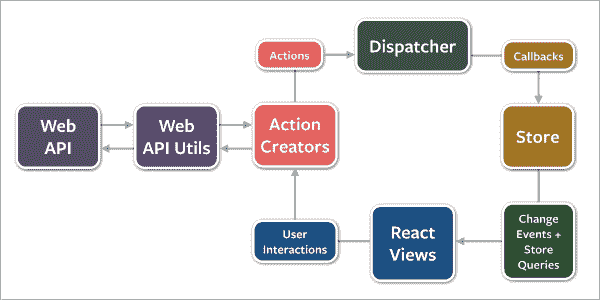
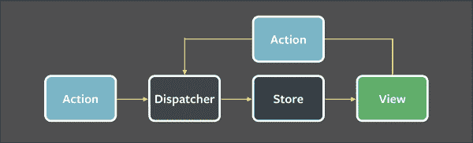
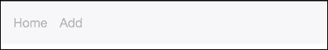
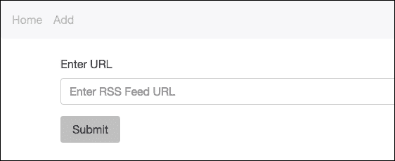
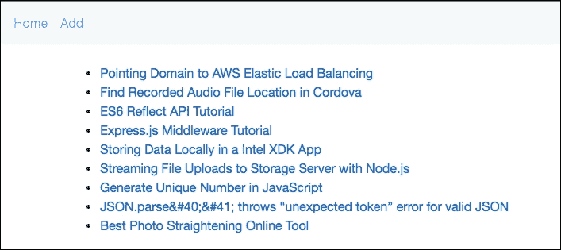

# 第十一章. 使用 React 和 Flux 构建 RSS 阅读器

React 本身不足以构建一个完整的应用程序，因为它只是视图层。我们需要一个架构来持有应用程序逻辑和数据，这就是 Flux 发挥作用的地方。显然，React 可以与任何其他架构一起使用，但 Flux 是最常与 React 一起使用的，因为 Flux 基于单向数据流，就像 React 一样。在本章中，我们将使用 React 和 Flux 构建一个单页 RSS 阅读器。

我们将涵盖以下主题：

+   深入了解 Flux 架构

+   使用 React Router 库进行路由

+   使用 Flux.js 创建调度器

+   使用 MicroEvent.js 来触发事件

+   集成 Flux 和路由

# 理解 Flux

**Flux**是一种应用程序架构，而不是一个框架。你可以将其视为 MVC 的替代品。它主要是为了与 React 一起使用而开发的，因为它们都基于单向数据流。Flux 架构强制执行单向数据流。

下面是一个显示 Flux 架构所有部分以及数据如何在其内部流动的图表：



下面是如何每个部分工作的说明：

+   **动作**: 动作是一个对象，它描述了我们想要执行的操作以及执行这些操作所需的数据。在 Flux 中，所有来源的所有事件和数据都被转换为动作。甚至 UI 事件也被转换为动作。

+   **调度器**: 调度器是一种特殊的事件系统。它用于向已注册的回调广播动作。调度器所做的工作与 pub/sub 系统不同，因为回调没有订阅特定的事件。相反，每个动作都会被发送到每个已注册的回调。应用程序应只包含一个调度器。

+   **动作创建者**: 动作创建者是向调度器分发动作的方法。

+   **存储**: 存储是存储应用程序数据和逻辑的对象。存储对动作做出反应。回调函数在存储依赖的动作由调度器分发时，向存储发送回调以采取适当的行动。

+   **React 视图**: React 视图是可以从存储中检索数据并显示以及监听存储在数据变化时发出的事件的 React 组件。请注意，存储发出的事件不会被转换为动作。

因此，在 Flux 中，来自不同来源的所有事件和数据都被作为动作发送到调度器，然后存储在调度器分发动作时自行更新，最后，视图在存储更新时也会更新。

下面是另一个图表，它提供了 Flux 如何工作的更高层次的抽象：



在这里，你可以看到数据是单向流动的，也就是说，数据和事件首先流向**调度器**，然后到**存储**，最后到**视图**。因此，我们可以这样说，调度器、存储和视图是 Flux 架构的三个主要部分。

正如有许多 MVC 框架，如 Angular、Ember 和 Backbone 一样，有许多 Flux 框架，如 Fluxible、Reflux、Alt 和 Redux。但为了保持简单和易于学习，我们不会使用这些框架中的任何一个。相反，我们将使用 Flux.js 和 MicroEvent.js 库来实现 Flux 架构。

# 使用 Flux.js

**Flux.js** 是由 Flux 的创建者创建的一个库，用于构建分发器。您可以在 [`github.com/facebook/flux`](https://github.com/facebook/flux) 找到 Flux.js 的源代码，在 [`cdnjs.com/libraries/flux`](https://cdnjs.com/libraries/flux) 找到 CDN 版本。

使用 `Dispatcher` 构造函数创建一个分发器。它有五个方法，如下所示：

+   `register(callback)`: 这个方法允许我们注册一个回调。它返回一个称为 `callback` ID 的字符串，以唯一标识一个回调。

+   `unregister(id)`: 这是一个方法，允许我们注销已注册的回调。要注销，我们需要传递要注销的回调的 ID。

+   `waitFor(array)`: 这会在继续执行当前回调之前等待指定的回调被调用。此方法应由回调在响应已分发的动作时使用。

+   `dispatch(action)`: 这会将一个动作分发到已注册的回调。

+   `isDispatching()`: 这返回一个布尔值，指示分发器当前是否正在分发。

我们将在构建 RSS 源阅读器时通过示例代码进行说明。

# 使用 MicroEvent.js

**MicroEvent.js** 是一个事件发射库，它为 JavaScript 对象提供了观察者模式。我们需要 MicroEvent.js 来从存储中触发事件以更新视图。

您可以从 [`notes.jetienne.com/2011/03/22/microeventjs.html`](http://notes.jetienne.com/2011/03/22/microeventjs.html) 获取 MicroEvent.js。

要使对象或构造函数能够发射事件，其他人能够订阅它，我们需要使用 `MicroEvent.mixin` 方法将 `MicroEvent` 接口集成到对象或构造函数中。

现在，在对象或构造函数内部，我们可以使用 `this.trigger()` 触发事件，其他人可以使用对象的 `bind()` 方法订阅事件。我们还可以使用 `unbind()` 方法取消订阅。

我们将在构建 RSS 源阅读器时查看示例代码。

# React Router 简介

我们将要创建的 RSS 源阅读器应用程序将是一个单页应用程序。在单页应用程序中，路由是在前端而不是后端定义的。我们需要某种类型的库来定义路由并将组件分配给它们，即它可以使 UI 与 URL 保持同步。

**React Router** 是 React 最受欢迎和推荐的路由库。它提供了一个简单的 API，内置了强大的功能，如动态路由匹配和位置转换处理。

你可以在 [`github.com/reactjs/react-router`](https://github.com/reactjs/react-router) 找到 React Router 的源代码，以及 CDN 版本在 [`cdnjs.com/libraries/react-router`](https://cdnjs.com/libraries/react-router)。

下面是一个使用 React Router 定义路由并分配组件的代码示例：

```js
var Router = ReactRouter.Router;
var Route = ReactRouter.Route;
var Link = ReactRouter.Link;
var BrowserHistory = ReactRouter.browserHistory;

var Routes = (
  <Router history={BrowserHistory}>
    <Route path="/" component={Home}></Route>
    <Route path="/profile/:username" component={Profile}></Route>
    <Route path="*" component={NotFound}/>
  </Router>
)

ReactDOM.render(Routes, document.body);
```

这就是前面代码的工作原理：

1.  React Router 允许我们使用 React 组件本身来定义路由及其组件。这使得编写路由变得简单。

1.  使用 `Route` 组件来定义单个路由。路由的路径与 Express 中的路径模式相同。

1.  所有 `Route` 组件都被 `Router` 组件包裹，并且 `Router` 组件在页面上渲染。`Router` 组件找到与当前 URL 匹配的路由，并渲染分配给该路由的组件。

1.  我们将 `Router` 组件的 `history` 属性分配给 `ReactRouter.browserHistory`，这使得 `Router` 使用 HTML5 历史 API。

1.  应该使用 `Link` 组件而不是 `<a>` 标签，因为这个组件可以防止整个页面重新加载，而是只更改 URL 并渲染匹配的组件。

# 创建 RSS 源阅读器

我们将要创建的 RSS 源阅读器将允许你添加源 URL、查看添加的 URL 列表以及查看每个源 URL 的内容。我们将存储 URL 在 HTML5 本地存储中。

## 设置项目目录和文件

在本章的练习文件中，你会找到两个目录：`Initial` 和 `Final`。`Final` 包含应用程序的最终源代码，而 `Initial` 包含帮助你快速开始构建应用程序的文件。

在 `Initial` 目录中，你会找到 `app.js`、`package.json` 以及一个包含要提供给前端文件的公共目录。`app.js` 文件将包含后端代码。目前，`app.js` 和 `package.json` 中没有代码。

我们将 HTML 代码放在 `public/html/index.html` 中，在 `public/js/index.js` 文件中，我们将放置我们的前端 JavaScript 代码，即 React 代码。

让我们先构建后端，然后构建前端。

## 构建后端

首先，让我们下载构建后端所需的包。将此代码放在 `package.json` 文件中：

```js
{
  "name": "rss-reader",
  "dependencies": {
    "express": "4.13.3",
    "request": "2.69.0",
    "xml2json": "0.9.0"
  }
}
```

现在，在 `Initial` 目录下运行 `npm install` 以下载所需的包。在这里，我们需要的 npm 包有 `express`、`request` 和 `xml2json`。

将以下代码放在 `app.js` 文件中：

```js
var express = require("express");
var app = express();
var request = require("request");
var parser = require("xml2json");

app.use(express.static(__dirname + "/public"));

app.get("/feed", function(httpRequest, httpResponse, next){
  request(httpRequest.query.url, function (error, response, body) {
    if (!error && response.statusCode == 200)
    {
      httpResponse.send(parser.toJson(body));
    }
  })
})

app.get("/*", function(httpRequest, httpResponse, next){
  httpResponse.sendFile(__dirname + "/public/html/index.html");
})

app.listen(8080);
```

这就是前面代码的工作原理：

1.  首先，我们导入库。

1.  然后，我们添加一个中间件程序来提供静态文件。

1.  我们创建一个路由，该路由接受一个 URL 作为查询参数，获取该 URL 的内容，并将其作为响应发送。由于 CROS，我们无法从前端获取源，因此我们将通过此路由获取。它还将 XML 转换为 JSON，因为 JSON 更容易处理。

1.  然后，对于所有其他路径，我们返回 `index.html` 文件。

1.  最后，我们监听端口号`8080`。

## 构建前端

在`public/js`目录中，您将找到我们将在前端使用的所有库。在`public/css`目录中，您将找到 Bootstrap 4，我们将用它进行设计。

将此代码放置在`index.html`文件中，以将 JS 和 CSS 文件排队，并为 React 组件渲染创建一个容器：

```js
<!doctype html>
<html>
  <head>
    <title>RSS Feed Reader</title>

    <link rel="stylesheet" type="text/css" href="/css/bootstrap.min.css">
  </head>
  <body>

    <div id="appContainer"></div>

    <script src="img/react.js"></script>
    <script src="img/react-dom.js"></script>
    <script src="img/ReactRouter.js"></script>
    <script src="img/Flux.js"></script>
    <script src="img/microevent.js"></script>
    <script src="img/index.js"></script>
  </body>
</html>
```

首先，我们将 Bootstrap 4 排队。然后，我们将 React、React Router、Flux 和 MicroEvent 库排队。最后，我们将`index.js`文件排队，我们将在此文件中放置我们的应用程序代码。

`appContainer`元素是所有 UI 将显示在内的元素。

### 定义路由

这里是定义我们应用程序路由的代码。使用 Babel 编译它，并将其放置在`index.js`文件中：

```js
var Router = ReactRouter.Router;
var Route = ReactRouter.Route;
var Link = ReactRouter.Link;
var BrowserHistory = ReactRouter.browserHistory;

var Routes = (
  <Router history={BrowserHistory}>
    <Route path="/" component={FeedList}></Route>
    <Route path="/feed/:id" component={Feed}></Route>
    <Route path="submit" component={SubmitFeed}></Route>
    <Route path="*" component={NotFound}/>
  </Router>
)

ReactDOM.render(Routes, document.getElementById("appContainer"));
```

我们在这里定义了四个路由，如下所示：

1.  第一个路由是主页。当用户访问主页时，我们将显示用户已添加的源 URL 列表。

1.  第二个路由用于显示源的内容。

1.  第三个路由用于添加新的源 URL。

1.  最后，如果没有匹配项，则第四个路由显示一个**未找到**的消息。

### 创建分发器、操作和存储

让我们创建分发器、一个让我们管理源 URL 的存储以及用于在主页上显示源 URL 的`FeedList`组件。要创建所有这些，编译并将以下代码放置在`index.js`文件中：

```js
var AppDispatcher = new Flux.Dispatcher();

var FeedStore = {
  addFeed: function(url){
    var valid = /^(ftp|http|https):\/\/[^ "]+$/.test(url);

    if(valid)
    {
      var urls = localStorage.getItem("feed-urls");
      urls = JSON.parse(urls);

      if(urls == null)
      {
        urls = [url];
      }
      else
      {
        urls[urls.length] = url;
      }

      localStorage.setItem("feed-urls", JSON.stringify(urls));

      this.trigger("valid-url");
    }
    else
    {
      this.trigger("invalid-url");
    }
  },
  getFeeds: function(){
    var urls = localStorage.getItem("feed-urls");
    urls = JSON.parse(urls);

    if(urls == null)
    {
      return [];
    }
    else
    {
      return urls;
    }
  }
}

MicroEvent.mixin(FeedStore);

var Header = React.createClass({
  render: function(){
    return(
      <nav className="navbar navbar-light bg-faded">
        <ul className="nav navbar-nav">
          <li className="nav-item">
            <Link className="nav-link" to="/">Home</Link>
          </li>
          <li className="nav-item">
            <Link className="nav-link" to="submit">Add</Link>
          </li>
        </ul>
      </nav>
    )
  }
})

var FeedList = React.createClass({
  getInitialState: function(){
    return {
      urls: FeedStore.getFeeds()
    };
  },
  render: function(){
    var count = 0;
    return(
      <div>
        <Header />
        <div className="container">
          <br />
          <ul>
              {
                this.state.urls.map(function(url)
                {
                  count++;
                  return <li> <Link to={"/feed/" + count}>{url}</Link></li>;
              })}
          </ul>
        </div>
      </div>
    )
  }
})
```

这就是代码的工作方式：

1.  首先，我们为我们的应用程序创建一个分发器。

1.  然后，我们创建一个名为`FeedStore`的存储，它为我们提供了添加或检索一组源 URL 的方法。如果我们尝试添加一个无效的 URL，它将发送一个`invalid-url`事件；否则，它将发送一个`valid-url`事件，以便我们可以向用户显示一个消息，指示 URL 是否成功添加。此存储从 HTML5 本地存储存储和检索源 URL。

1.  然后，我们通过传递`FeedStore`作为参数调用`MicroEvent.mixin`，以便存储能够触发事件，其他人可以绑定到这些事件。

1.  然后，我们创建一个`Header`组件，它将是我们的应用程序标题。`Header`组件当前只显示两个链接：根路径和添加新 URL 的路径。

1.  最后，我们创建`FeedList`组件。组件的`getInitialState`方法从`FeedStore`检索源 URL 列表，并将它们返回以显示。请注意，我们在显示列表时没有使用`<a>`标签；相反，我们使用了`Link`组件。源 ID 是它在本地存储中存储的数组中的位置。

现在，让我们创建`SubmitFeed`组件，它允许我们添加新的源 URL，然后显示 URL 是否已成功添加。以下是该组件的代码。编译并将其放置在`index.js`文件中：

```js
var SubmitFeed = React.createClass({
  add: function(){
    AppDispatcher.dispatch({
      actionType: "add-feed-url",
      feedURL: this.refs.feedURL.value
    });
  },
  componentDidMount: function()
  {
    FeedStore.bind("invalid-url", this.invalid_url);
    FeedStore.bind("valid-url", this.valid_url);
  },
  valid_url: function()
  {
    alert("Added successfully");
  },
  invalid_url: function()
  {
    alert("Please enter a valid URL");
  },
  componentWillUnmount: function()
  {
    FeedStore.unbind("invalid-url", this.invalid_url);
    FeedStore.unbind("valid-url", this.valid_url);
  },
  render: function(){
    return(
      <div>
        <Header />
        <div className="container">
          <br />
          <form>
            <fieldset className="form-group">
              <label for="formGroupURLInput">Enter URL</label>
              <input type="url" className="form-control" id="formGroupURLInput" ref="feedURL" placeholder="Enter RSS Feed URL" />
            </fieldset>
            <input type="button" value="Submit" className="btn" onClick={this.add} />
          </form>
        </div>
      </div>
    )
  }
})

AppDispatcher.register(function(action){
  if(action.actionType == "add-feed-url")
  {
    FeedStore.addFeed(action.feedURL);
  }
})
```

这里是这段代码的工作方式：

1.  `SubmitFeed`组件显示一个带有文本字段和提交按钮的表单。

1.  当用户点击 **提交** 按钮时，`add` 处理器被调用。`add` 处理器发送一个带有 `add-feed-url` 动作类型和要添加的 URL 作为数据的动作。

1.  组件挂载后，我们立即开始监听来自 `FeedStore` 的 `invalid-url` 和 `valid-url` 事件。如果 URL 添加成功，我们显示成功消息；否则，我们得到失败消息。

1.  并且，一旦组件卸载，我们就停止监听来自 `FeedStore` 的事件。我们应该解除绑定，否则我们会有多个监听器。

1.  最后，我们注册一个动作回调，该回调检查 `add-feed-url` 动作类型，并调用 `FeedStore` 存储库的 `addFeed` 方法。

现在，让我们创建 `Feed` 组件，它显示单个 feed URL 的内容。以下是它的代码。编译并放置在 `index.js` 文件中：

```js
var SingleFeedStore = {
  get: function(id){
    var urls = localStorage.getItem("feed-urls");
    urls = JSON.parse(urls);

    var request_url = urls[id - 1];

    var request;
    if(window.XMLHttpRequest)
    {
      request = new XMLHttpRequest();
    } 
    else if(window.ActiveXObject) 
    {
      try 
      {
        request = new ActiveXObject("Msxml2.XMLHTTP");
      } 
      catch (e) 
      {
        try 
        {
          request = new ActiveXObject("Microsoft.XMLHTTP");
        } 
        catch (e)
        {}
      }
    }

    request.open("GET", "/feed?url=" + encodeURIComponent(request_url));

    var self = this;

    request.addEventListener("load", function(){
      self.trigger("feed-fetched", request.responseText);
    }, false);

    request.send(null);
  }
}

MicroEvent.mixin(SingleFeedStore);

var Feed = React.createClass({
  getInitialState: function(){
    return {
      data: []
    };
  },
  componentDidMount: function(){
    SingleFeedStore.get(this.props.params.id);
    SingleFeedStore.bind("feed-fetched", this.update);
  },
  update: function(data){
    var data = JSON.parse(data);
    this.setState({data: data.rss.channel.item});
  },
  componentWillUnmount: function(){
    SingleFeedStore.unbind("feed-fetched", this.update);
  },
  render: function(){
    return(
      <div>
        <Header />
        <div className="container">
          <br />
          <ul>
              {this.state.data.map(function(post) {
                  return <li><a href={post.link}>{post.title}</a></li>;
              })}
          </ul>
        </div>
      </div> 
    )
  }
})
```

这是它的工作原理：

1.  首先，我们创建 `SingleFeedStore`，它有一个 `get` 方法，用于返回 feed URL 的内容。它使用我们的服务器路由来获取 URL 的内容。一旦内容被获取，它就会触发带有该内容的 `feed-fetched` 事件。

1.  然后，我们通过传递 `SingleFeedStore` 作为参数调用 `MicroEvent.mixin`，这样存储库就能够触发事件，其他人也可以绑定到这些事件上。

1.  然后，在 `Feed` 组件的 `getInitialState` 方法中，我们返回一个空的数据数组，并在 `componentDidMount` 方法中，我们向 `SingleFeedStore` 发起请求，因为 `SingleFeedStore` 的 `get` 方法是异步获取数据的。

1.  在 `componentDidMount` 中，我们为 `feed-fetched` 事件绑定一个事件处理器，并在事件发生时立即更新视图。

1.  如同往常，组件卸载后，我们立即解除事件处理器。

最后，让我们创建 `NotFound` 组件。以下是它的代码。编译并放置在 `index.js` 文件中：

```js
var NotFound = React.createClass({
  render: function(){
    return(
      <h1>Page Not Found</h1>
    )
  }
})
```

## 测试应用程序

我们现在已经完成了应用程序的构建。要在 `Initial` 目录中运行 web 服务器，请运行 `node app.js`。现在，在浏览器中打开 `localhost:8080`。你只能看到标题，因为我们还没有添加任何内容。以下是它应该看起来像什么：



现在，点击 **添加** 菜单项。你会看到一个像这样的表单：



输入一个有效的 feed URL，例如 [`qnimate.com/feed/`](http://qnimate.com/feed/)，然后点击 **提交**。现在，回到主页，你会看到以下输出：


现在，点击 URL 以查看 feed 的内容。输出将类似于以下内容：



点击任何标题都会在同一标签页中打开 URL。

# 摘要

在本章中，我们学习了如何使用 React 和 Flux 构建单页应用程序。我们还探索了许多库，例如 `xml2json`、`Flux.js`、`MicroEvent.js` 和 React Router。之后，我们构建了一个完全可操作的 RSS 订阅阅读器。

你现在可以继续向应用中添加新功能，例如实时内容更新和通知。
