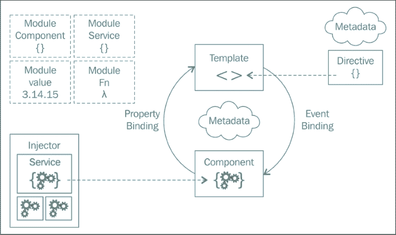
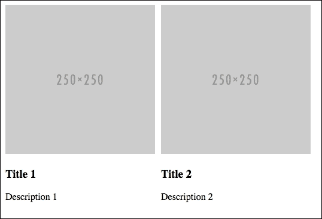
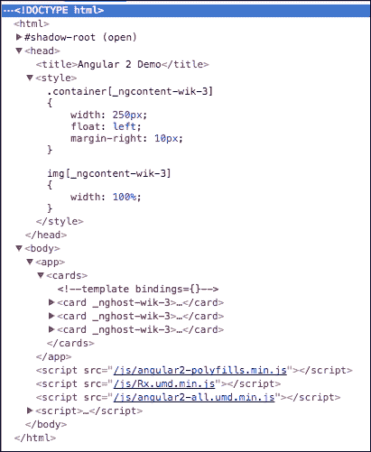
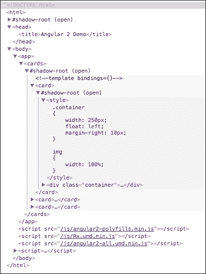
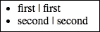
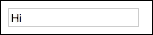
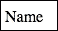
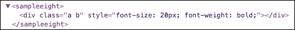

# 第十二章 Angular 2 的新特性

Angular 1 基于 MVC 架构，而 Angular 2 基于组件和服务架构。Angular 1 和 Angular 2 在架构和 API 方面完全不同，因此对 Angular 1 的了解不太可能对学习 Angular 2 有很大帮助。在本章中，我们将学习 Angular 2，而不将其与 Angular 1 进行比较，因为这样做会引发混淆，且不必要。即使你没有 Angular 1 的知识，你也可以继续本章。

我们将涵盖以下主题：

+   Web 组件

+   Angular 2 架构

+   模板语言

+   组件输入和输出

+   组件生命周期

+   事件

+   表单

+   服务

更多内容...

# Angular 2 架构

Angular 2 是一个基于服务和组件架构构建 Web 应用程序客户端的框架。

一个 Angular 2 应用程序由视图和各种服务组成。服务是简单的 JavaScript 对象，包含应用程序逻辑和状态。服务应该是可重用的。视图消费服务，服务也可以相互交互。

视图和服务松散耦合，因此 Angular 2 视图可以与任何其他架构一起使用，例如 Flux。同样，服务可以与任何其他视图一起使用，例如 React。

Angular 2 视图基于面向组件的架构。在面向组件的架构中，应用程序 UI 被划分为可重用组件。一个组件具有一个 UI，其中包含更新 UI 和处理 UI 上用户操作的代码。一个自定义标签与一个组件相关联，每当自定义标签出现时，就会创建并渲染该组件的新实例。因此，我们可以说面向组件的架构是应用程序视图的架构。实际上，组件消耗服务。

### 注意

在前两个章节中，我们学习了 React，它也是基于面向组件的架构，因为使用 React，我们构建应用程序作为一组组件。

这里是一个来自官方 Angular 2 网站的图表（[`angular.io`](https://angular.io)），展示了 Angular 2 的完整架构：



在这里，你可以看到**组件**的 UI 是使用**模板**定义的。模板是用模板 HTML 编写的，即 HTML 和许多其他标记的组合。组件还持有 UI 状态和事件处理程序。

我们不应该在组件内部存储应用程序逻辑和状态，因为这会影响代码的可重用性，并在开发大型和复杂的应用程序时引发问题。应用程序状态和逻辑应该存储在服务中。

Angular 2 仅实现单向数据绑定。这使得大型和复杂的应用程序更容易调试。

服务被注入到需要它们的特定组件中，而不是所有组件。

# 介绍 Web 组件

在我们深入了解 Web 组件之前，你需要知道我们为什么要学习它们。嗯，我们学习 Web 组件是因为 Angular 2 组件利用了 Shadow DOM 和模板，这些都是 Web 组件的一部分。

简而言之，Web 组件是一组四个不同的浏览器规范，这些规范使得在网页中创建可重用组件成为可能。这四个规范是**HTML imports**、**shadow DOM**、**templates**和**custom elements**。它们可以一起使用，也可以单独使用。

Web 组件提供了面向组件架构的原生实现。使用 Web 组件创建的组件也被称为 Web 组件。

在我们学习 Web 组件之前，让我们考虑一个用于演示的项目。创建一个名为`web-components`的目录，然后在其中创建一个名为`index.html`的文件。Web 组件在浏览器中的支持相当差，所以让我们下载`webcomponents.js polyfill`。从[`github.com/webcomponents/webcomponentsjs`](https://github.com/webcomponents/webcomponentsjs)下载`webcomponents.js`文件，并将其放置在`web-components`目录中。

现在，将此代码放置在`index.html`文件中：

```js
<!doctype html>
<html>
  <head>
    <title>Web Components Demo</title>
    <script src="img/webcomponents.js"></script>
  </head>
  <body>
    <script>
      //place JavaScript code here
    </script>
  </body>
</html>
```

现在，让我们通过构建一个用于显示包含图片、标题和描述的卡片组件来概述 shadow DOM、模板和自定义元素。

## 模板

**模板**用于定义可重用代码。模板使用`<template>`标签定义。模板的代码放置在这个标签内。我们可以放置任何标签，例如`<script>`和`<style>`。

`<template>`标签内的代码只被解析，没有被渲染。

下面是如何创建模板的一个例子。将此代码放置在`body`标签中：

```js
<template id="cardTemplate">
  <style type="text/css">
    .container
    {
      width: 250px;
      float: left;
      margin-right: 10px;
    }

    img
    {
      width: 100%;
    }
  </style>
  <div class="container">
    
    <div>
      <h3></h3>
      <p></p>
    </div>
  </div>
</template>
```

在这里，模板包含了卡片组件的 UI 代码。现在，如果你在浏览器中打开`index.html`文件，你将看不到任何内容，因为`<template>`标签只被解析，没有被渲染。

## 自定义元素

**自定义元素**让我们能够定义新的 HTML 元素类型（即新的 HTML 标签）。当我们使用浏览器不认识的标签名时，浏览器会简单地将其视为`<span>`标签。但当我们注册一个`custom`标签时，它会被浏览器识别。它可以继承其他元素，让我们能够在元素生命周期的不同阶段执行不同的操作，等等。

让我们为我们的组件创建一个`custom`元素。无论这个标签出现在哪里，都会显示组件的新实例。

下面是显示`custom`元素的代码。将其放置在`<body>`标签中：

```js
<custom-card data-img="http://placehold.it/250x250" data-title="Title 1" data-description="Description 1" is="custom-card"></custom-card>
<custom-card data-img="http://placehold.it/250x250" data-
title="Title 2" data-description="Description 2"></custom-card>
```

我们必须在自定义元素名称中使用`-`字符。这是强制性的，因为这个限制使得解析器能够区分自定义元素和常规元素，并确保在 HTML 中添加新标签时的向前兼容性。在这里，我们通过数据属性传递组件的属性。

现在，让我们将 `<custom-card>` 定义为一个自定义元素，并在创建 `<custom-card>` 的新实例时将模板代码放在标签内部。为此，请将此代码放在 `<script>` 标签中：

```js
var customCardProto = Object.create(HTMLElement.prototype);
customCardProto.createdCallback = function(){
  var template = document.querySelector("#cardTemplate");
  template.content.querySelector("img").src = this.getAttribute("data-img");
  template.content.querySelector("h3").innerHTML = this.getAttribute("data-title");
  template.content.querySelector("p").innerHTML = this.getAttribute("data-description");

  var clone = document.importNode(template.content, true);
  this.appendChild(clone)
}
var customCard = document.registerElement("custom-card", {
  prototype: customCardProto
});
```

下面是如何工作的代码：

+   默认情况下，自定义元素继承自 `HTMLElement` 的方法和属性。

+   要注册自定义元素，我们需要使用 `document.registerElement` 方法。第一个参数是自定义标签名，第二个参数是可选对象。这个可选对象可以有一个名为 **prototype** 的属性。`prototype` 属性定义了它继承的 HTML 元素，即它继承的属性和方法。默认情况下，它被分配给 `Object.create(HTMLElement.prototype)`。

+   我们还可以通过向分配给 `prototype` 属性的对象中添加新的属性和方法来向我们的自定义元素添加新的属性和方法。

+   这里，我们添加了一个名为 `createdCallback` 的方法，该方法在创建自定义元素的实例时被调用，即使用 JavaScript 或 HTML 创建的实例。

+   在 `createdCallback` 中，我们正在检索我们的模板并设置图像源、标题和描述，然后通过创建它的副本将其附加到自定义元素上，因为许多自定义元素将共享相同的模板。

现在，如果你在浏览器中打开 `index.html`，你会看到以下输出：



## 阴影 DOM

**阴影 DOM** 允许 HTML 元素获得一种新的节点，称为与它们关联的阴影根。与阴影根关联的元素称为阴影宿主。阴影宿主的内容不会被渲染；而是渲染阴影根的内容。一个阴影根可以有一个在其下面的另一个阴影根。

阴影 DOM 的好处是，在阴影根内部定义的 CSS 样式不会影响其父文档，而在阴影根外部定义的 CSS 样式也不会影响阴影根内部的元素。这对于定义特定于组件的样式非常有用。简而言之，我们可以这样说，阴影 DOM 提供了样式封装。

阴影 DOM 的好处不仅仅是样式封装。阴影根内部的 HTML 可以防止 JavaScript 误操作。我们仍然可以在浏览器开发者工具中检查阴影根。

许多原生元素，如 `<video>` 和 `<audio>`，都有一个阴影根，但当你检查它时，你不会看到阴影根。浏览器默认隐藏这些元素的阴影根。要查看它们的阴影根，你需要更改浏览器特定的设置。

让我们修改之前的自定义元素代码，以在阴影 DOM 中渲染模板。用下面的这个方法替换之前的 `createdCallback` 方法：

```js
customCardProto.createdCallback = function(){
  var template = document.querySelector("#cardTemplate");
  template.content.querySelector("img").src = this.getAttribute("data-img");
  template.content.querySelector("h3").innerHTML = this.getAttribute("data-title");
  template.content.querySelector("p").innerHTML = this.getAttribute("data-description");

  var clone = document.importNode(template.content, true);

  var shadow = this.createShadowRoot();

  shadow.appendChild(clone);
}
```

这里，我们不是直接将模板代码附加到自定义元素上，而是使用 `createShadowRoot` 创建了一个阴影根，并将模板代码附加到它上面。

# 设置 Angular 2 项目

Angular 2 代码可以用 JavaScript、TypeScript 或 Dart 编写。如果你在 TypeScript 或 Dart 中编写 Angular 2 代码，你需要在向客户端提供服务之前将代码转换为 JavaScript。我们将使用 JavaScript 来编写 Angular 2 代码。

创建一个名为`angular2-demo`的目录。然后，在目录内创建`app.js`和`package.json`文件。然后，创建一个名为`public`的目录，并在该目录内创建四个更多名为`html`、`js`、`componentTemplates`和`componentStyles`的目录。现在，创建一个名为`index.html`的文件，并将其放置在`html`目录中。

然后，从[`cdnjs.com/libraries/angular.js/`](https://cdnjs.com/libraries/angular.js/)下载`angular2-polyfills.js`、`Rx.umd.js`和`angular2-all.umd.js`，并将它们放置在`angular2-demo/js`目录中。这些文件就是它们听起来那样。如果你愿意，也可以直接排队 CDN 链接。

在`index.html`文件中，放置以下起始代码：

```js
<!doctype html>
<html>
  <head>
    <title>Angular 2 Demo</title>
  </head>
  <body>

    <script src="img/angular2-polyfills.js"></script>
    <script src="img/Rx.umd. js"></script>
    <script src="img/angular2-all.umdn.js"></script>
    <script>
      //App code here
    </script>
  </body>
</html>
```

在`app.js`文件中，放置以下代码：

```js
var express = require("express");
var app = express();

app.use(express.static(__dirname + "/public"));

app.get("/", function(httpRequest, httpResponse, next){
  httpResponse.sendFile(__dirname + "/public/html/index.html");
})

app.listen(8080);
```

这段代码是服务器端代码。它很直观。

现在，在`package.json`文件中，放置以下代码并运行`npm install`以下载`express`包：

```js
{
  "name": "Angular2-Demo",
  "dependencies": {
    "express": "4.13.3"
  }
}
```

要启动服务器，运行`node app.js`。然后，使用浏览器以`localhost:8080`作为地址打开应用程序。

# Angular 2 基础知识

Angular 2 应用程序完全分解为组件。技术上讲，Angular 2 组件是一个可重用的`custom`标签，它是可变的，并且封装了一个嵌入的状态，即状态或属性的更改将导致 UI 的突变。

### 注意

请记住，Angular 2 不会将自定义标签名注册为自定义元素。

应用程序的所有组件都按照树状结构排列，其中组件是根节点。

下面是一个创建组件的示例。它创建了一个显示图片、标题和描述的卡片组件。将以下代码放入`<script>`标签中：

```js
var Card = ng.core.Component({
  selector: "card",
  inputs: ["src", "title", "desc"],
  templateUrl: "templates/card-template.html",
  styleUrls: ["templateStyles/card-style.css"]
})
.Class({
  constructor: function(){
  }
})
```

然后，创建一个名为`card-template.html`的文件，并将其放置在`componentTemplates`目录中。将以下代码放入该文件：

```js
<style>
  .container
  {
    width: 250px;
    float: left;
    margin-right: 10px;
  }

  img
  {
    width: 100%;
  }
</style>
<div class="container">
  
  <div>
    <h3>{{title}}</h3>
    <p>{{desc}}</p>
  </div>
</div>
```

之后，创建一个名为`card-style.css`的文件，并将其放置在`componentStyles`目录中。将以下代码放入该文件：

```js
.container
{
  width: 250px;
  float: left;
  margin-right: 10px;
}

img
{
  width: 100%;
}
```

这就是这三个代码片段是如何工作的：

+   组件需要通过链式调用属于`ng.core`对象的`Component`和`Class`方法来创建。

+   `Component`方法接受一个包含各种属性的配置对象，而`Class`方法接受一个包含组件生命周期方法、构造函数和 UI 操作处理器的对象。

+   在这里，我们提供的配置属性是 `selector`、`inputs`、`templateUrl` 和 `styleUrls`。`selector` 属性用于定义组件的自定义标签。`inputs` 属性用于定义自定义标签接受的属性。`templateUrl` 属性用于定义包含组件模板的文件。如果您想内联模板代码，也可以使用 `template`。最后，`styleUrls` 用于定义包含组件样式的 CSS 文件。您也可以使用 `styles` 属性来内联 CSS 代码，或者您可以在模板内部使用 `<style>` 标签来定义 CSS。以这三种方式定义的 CSS 不会影响其他组件，也就是说，它是封装在组件本身的。 

+   在 `Class` 方法中，即使它不做任何事情，我们也必须提供 `constructor` 方法。它在新组件实例构建期间被调用。通过构建组件，我指的是在内存中构建组件——不是解析属性、解析其子组件、渲染其视图等等。`constructor` 方法的首要用途是将服务注入到组件中。服务不能自动注入，因为我们有时可能需要为每个组件初始化服务，而 Angular 并不知道如何做这件事。`constructor` 方法可以访问组件的状态，但不能访问其属性。在这里，我们不应该做任何重负载工作或可能导致组件构建失败的其他事情。`constructor` 不是一个组件生命周期方法。

+   然后，我们有组件模板代码。在这个模板文件中，我们只是渲染传递给组件的属性。要渲染组件状态中的任何内容，我们需要使用 `{{}}` 符号。

让我们创建另一个名为 `Cards` 的组件，它显示一张卡片列表。它从服务中获取有关卡片的信息。

将此代码放入 `index.html` 文件的 `<script>` 标签中：

```js
var CardsService = ng.core.Class({
  constructor: function() {
  },
  getCards: function() {
    return [{
      src: "http://placehold.it/350x150",
      title: "Title 1",
      desc: "Description 1"
    },
    {
      src: "http://placehold.it/350x150",
      title: "Title 2",
      desc: "Description 2"
    },
    {
      src: "http://placehold.it/350x150",
      title: "Title 3",
      desc: "Description 3"
    }]
  }
});

var Cards = ng.core.Component({
  selector: "cards",
  viewProviders: [CardsService],
  directives: [Card],
  templateUrl: "componentTemplates/cards-template.html"
}).Class({
  constructor: [CardsService, function(cardsService){
    this.getCards = cardsService.getCards;
}],
  ngOnInit: function(){
    this.cards = this.getCards();
  }
})

var App = ng.core.Component({
  selector: "app",
  directives: [Cards],
  templateUrl: "componentTemplates/app-template.html"
}).Class({
  constructor: function(){

  }
})

ng.platform.browser.bootstrap(App);
```

现在，在 `componentTemplates` 目录下创建一个名为 `cards-template.html` 的文件，并将此代码放入其中：

```js
<card *ngFor="#card of cards" title="{{card.title}}" src="img/{{card.src}}" desc="{{card.desc}}"></card>
```

现在，在 `componentTemplates` 目录下创建一个名为 `app-template.html` 的文件，并将此代码放入其中：

```js
<cards></cards>
```

现在，在 `index.html` 文件的 `<body>` 标签中放置此代码：

```js
<app></app>
```

这里是如何这四个代码片段工作的：

+   要创建一个服务，我们需要使用`ng.core.Class`方法。它需要一个具有`constructor`方法以及其他服务公开的方法或属性的对象。在将服务注入到其他服务或组件时，会创建并注入服务的新实例。在创建服务的新实例时，会调用`constructor`方法。即使这个方法不做任何事情，我们也必须提供这个方法。这个方法的主要目的是注入这个服务所依赖的服务。在这里，我们的`CardsService`方法不依赖于任何其他服务，所以`constructor`方法中没有代码。然后，我们定义了一个`getCards`方法，它返回三个不同卡片的显示数据。

+   然后，我们创建了一个`Cards`组件。它从`CardsService`获取数据，并为每张卡片数据渲染一个`Card`组件。在创建`Cards`组件时，我们将`viewProviders`和`directives`属性提供给配置对象。`viewProviders`是组件所依赖的服务列表，而`directives`是组件渲染的其他组件列表。在这里，你可以看到，我们不是直接将函数分配给`constructor`属性，而是将一个包含组件所依赖的服务列表的数组以及最后一个数组项作为实际函数分配。这就是将服务注入到组件中的格式。在`constructor`方法内部，我们存储组件需要的服务的引用或属性，也就是说，我们可以在`constructor`方法中使用服务。我们将在稍后学习更多关于`viewProviders`的内容。传递给`Class`方法的任何方法中的`this`关键字都指向组件的状态。在创建组件实例后，每当组件状态发生变化时，模板绑定都会更新。这里还有一个方法，称为`ngOnInit`。它是一个生命周期方法，在创建组件的新实例并解析其属性后调用。在这个方法中，我们调用`getCards`方法并将返回值存储在状态中的`cards`属性中。请注意，传递给组件标签的属性在组件实例创建后可以通过`this`关键字访问。

+   在`CardsComponent`模板内部，我们使用`*ngFor`指令来显示卡片。我们将在稍后学习更多关于指令的内容。

+   然后，我们创建了一个`App`组件，它作为我们组件的根组件。在这个组件内部，我们显示了`Cards`组件。

+   最后，我们初始化应用程序。Angular 2 应用程序是显式初始化的。在初始化时，我们需要提供一个根组件的引用。这样做是为了确保应用程序由嵌套组件组成。根组件是添加到`<body>`标签的组件。将其他组件的标签添加到`<body>`标签上不会产生任何效果。

现在，如果你在浏览器中刷新你的`localhost:8080`页面，你将看到以下输出：


# 组件样式和 shadow DOM

之前，我们看到了定义特定于组件的样式（在组件模板作用域中封装的样式）的三种方法。组件的 CSS 甚至不会影响它所拥有的组件。

Angular 2 默认不使用 shadow DOM；相反，它使用不同的技术来实现样式封装。这是由于浏览器支持不足的原因。

默认情况下，Angular 2 修改 CSS 选择器，使其仅针对组件中的元素，然后将 CSS 放置在页面的`<head>`标签中。如果你使用浏览器开发者工具检查我们的当前应用，你会看到以下内容：



在这里，你可以看到 CSS 已经被修改并插入到`<head>`标签中。

要强制 Angular 2 使用 shadow DOM，我们需要将组件配置对象的封装属性分配给`ng.core.ViewEncapsulation.Native`。默认情况下，它分配给`ng.core.ViewEncapsulation.Emulated`。

当你在将`Card`和`Cards`组件的封装属性分配给`ng.core.ViewEncapsulation.Native`之后检查应用时，你会看到类似以下的内容：



在这里，你可以看到使用了 shadow DOM 来实现样式封装。

### 注意

如果你不想为组件启用样式封装，可以将封装属性分配给`ng.core.ViewEncapsulation.None`。在这种情况下，所有的 CSS 都将直接放置在`<head>`标签中。

# Angular 2 状态检测

**状态检测**是检测组件状态变化的过程。组件的状态是通过使用`this`关键字来存储和操作的。因此，Angular 2 没有直接检测状态变化的方法。所以，Angular 2 使用复杂的算法和第三方库来检测状态变化。

Angular 2 检测状态变化的第一件事是，它假装所有变化都是异步发生的。然后，它使用`zone.js`库来监控浏览器事件、计时器、AJAX 请求、WebSockets 以及其他由`zone.js`支持的异步操作。

现在，每当这些异步活动之一发生时，它会检查所有可能发生变化的内容，包括从根节点开始的所有组件的`this`关键字的属性和数组元素；如果检测到任何变化，则更新组件的模板绑定。Angular 2 不会简单地重新渲染整个组件。相反，它会检查已更改的绑定，并选择性地更新它们。

一些组件可能包含大量的状态数据，如果它们的状态没有改变，检查每个异步操作的状态将无谓地影响应用程序的性能。因此，Angular 2 提供了一个选项来标记这类组件，这样它就不会检查它们的状态，除非组件本身告诉 Angular 2 在下一个检测周期（即下一个异步活动发生时）检查其状态。让我们通过一个示例来演示这一点。

将此代码放置在`index.html`文件的`<script>`标签中`App`组件代码之上：

```js
var SampleComponent1 = ng.core.Component({
  selector: "sampleone",
  template: "{{value}}",
  viewProviders: [ng.core.ChangeDetectorRef],
  changeDetection: ng.core.ChangeDetectionStrategy.Detached
}).Class({
  constructor: [ng.core.ChangeDetectorRef, function(cd){
    this.cd = cd;
  }],
  ngOnInit: function(){
    this.value = 1;
    setInterval(function(){
      this.value++;
      this.cd.markForCheck();
    }.bind(this), 2000)
  }
})
```

然后，将`SampleComponent1`添加到`App`组件的`directives`数组中。因此，现在`App`组件的代码应该是这样的：

```js
var App = ng.core.Component({
  selector: "app",
  directives: [Cards, SampleComponent1],
  templateUrl: "componentTemplates/app-template.html"
}).Class({
  constructor: function(){
  }
})
```

现在，将此代码添加到`app-template.html`文件的末尾：

```js
<br style="clear: both">
<sampleone></sampleone>
```

这三个代码片段是如何工作的：

1.  在这个例子中，我们显示了一个每 2 秒增加一次的值，并且模板被重新渲染以显示更新的值。

1.  首先，我们创建一个名为`SampleComponent1`的组件。它简单地显示`value`。我们已经将`changeDetection`属性设置为`ng.core.ChangeDetectionStrategy.Detached`，这告诉 Angular 2 不要检查其状态变化。默认情况下，`changeDetection`属性被分配为`ng.core.ChangeDetectionStrategy.Default`，这告诉 Angular 2 在每个变更检测周期中检查其状态变化。然后，我们将`ng.core.ChangeDetectorRef`服务注入到组件中，该服务提供与变更检测相关的各种 API。然后，在`ngOnInit`方法中，我们每 2 秒增加`value`的值，之后调用`ng.core.ChangeDetectorRef`的`markForCheck`方法，这告诉 Angular 2 在下一个变更检测周期中检查组件状态的变化。`markForCheck`将使 Angular 2 仅在下一个检测周期中检查状态变化，而不是在之后的周期中。

1.  然后，我们简单地显示`SampleComponent1`在`App`组件中。

如果一个组件只依赖于其输入和/或 UI 事件，或者如果你想检查组件的状态变化，只需检查其输入是否已更改或事件是否已被触发；然后，你可以将`changeDetection`分配给`ng.core.ChangeDetectionStrategy.OnPush`。

### 注意

如果在任何时候你想强制执行变更检测周期而不是等待异步操作发生，你可以调用`ng.core.ChangeDetectorRef`服务的`detectChanges`方法。

# 理解视图子元素和内容子元素

存在于组件标签内的元素被称为**内容子元素**，存在于组件模板内的元素被称为**视图子元素**。

要在组件视图中显示组件的内容子元素，我们需要使用`<ng-content>`标签。让我们看看一个示例。

将此代码放置在`App`组件代码之上：

```js
var ListItem = ng.core.Component({
  selector: "item",
  inputs: ["title"],
  template: "<li>{{title}} | <ng-content></ng-content></li>",
}).Class({
  constructor: function(){}
})

var List = ng.core.Component({
  selector: "list",
  template: "<ul><ng-content select='item'></ng-content></ul>"
}).Class({
  constructor: function(){}
})
```

现在，将`App`组件的代码更改为以下内容：

```js
var App = ng.core.Component({
  selector: "app",
  directives: [Cards, SampleComponent1, List, ListItem],
  templateUrl: "componentTemplates/app-template.html"
}).Class({
  constructor: function(){}
})
```

将此代码添加到`app-template.html`文件的末尾：

```js
<br>
<list>
  <item title="first">first</item>
  <item title="second">second</item>
</list>
```

这段代码的输出如下：



这就是这三个代码片段是如何工作的：

1.  在`App`组件的模板文件中，我们添加一个`<list>`标签，用于显示列表。在其开标签和闭标签内，我们定义了它应该显示的各个列表项。

1.  我们创建了`ListItem`和`List`组件，分别绑定到`<list>`和`<item>`标签。

1.  我们将`List`组件添加到`App`组件的`directives`属性中，而不是`List`，因为`<list>`标签存在于`App`组件的模板中，`App`组件负责创建其实例。

1.  `App`组件在`List`组件的模板中查找`<ng-content>`标签，并在那里渲染`List`组件实例。

1.  `<ng-content>`可以接受一个可选的`select`属性，该属性被分配给一个 CSS 选择器，指示我们想要显示的内容子组件中的哪些元素。一个模板中可以有多个`<ng-content>`标签。如果没有提供`select`属性，则将渲染所有内容子组件。在这里，`select`属性不是必需的；我们只是用它来演示。

## 获取内容子组件和视图子组件的组件引用

要获取视图子组件或内容子组件的引用，我们可以使用`ng.core.ContentChildren`、`ng.coreViewChildren`、`ng.core.ContentChild`和`ng.core.ViewChild`构造函数。`ng.core.ContentChildren`和`ng.core.ContentChild`之间的区别在于，前者返回给定组件的所有引用，而后者返回第一个出现的引用。同样的区别也适用于`ng.core.ViewChild`和`ng.core.ViewChildren`。

这里有一个示例来演示`ng.core.ContentChildren`。将`List`组件的代码替换为以下内容：

```js
var List = ng.core.Component({
  selector: "list",
  template: "<ul><ng-content select='item'></ng-content></ul>",
  queries: {
    list_items: new ng.core.ContentChildren(ListItem)
  }
}).Class({
  constructor: function(){},
  ngAfterContentInit: function(){
    this.list_items._results.forEach(function(e){
      console.log(e.title);
    })
  }
})
```

此代码在控制台中的输出如下：

```js
first
second

```

大部分代码都是自解释的。新的内容是`ngAfterContentInit`生命周期方法。它在内容子组件初始化后触发。同样，如果我们想访问视图子组件，我们需要使用`ngAfterViewInit`生命周期方法。

注意，我们只能访问组件的状态——没有其他内容。

## 局部模板变量

我们可以将局部模板变量分配给内容子组件或视图子组件。局部模板变量允许我们获取内容子组件或视图子组件中任何元素的引用，即组件引用或 HTML 元素引用。

要将局部模板变量分配给视图子组件或内容子组件的元素，我们需要在开标签中放置`#variable_name`。

这里有一个示例来演示局部模板变量是如何工作的。将此代码放置在`App`组件上方：

```js
var SampleComponent2 = ng.core.Component({
  selector: "sampletwo",
  template: "<input type='text' #input />",
  queries: {
    input_element: new ng.core.ViewChild("input")
  }
}).Class({
  constructor: function(){},
  ngAfterViewInit: function(){
    this.input_element.nativeElement.value = "Hi";
  }
})
```

将`App`组件的代码更改为以下内容：

```js
var App = ng.core.Component({
  selector: "app",
  directives: [Cards, SampleComponent1, List, ListItem,
  SampleComponent2],
  templateUrl: "componentTemplates/app-template.html"
}).Class({
  constructor: function(){}
})
```

然后，将以下代码添加到`app-template.html`文件的末尾：

```js
<sampletwo></sampletwo>
```

此代码的输出如下：



下面是如何使用这三个代码片段的说明：

1.  我们创建一个新的组件名为 `SampleComponent2`，它显示一个 HTML 输入文本元素。我们将输入元素分配给一个名为 `input` 的局部模板变量。

1.  然后，我们使用 `ng.core.ViewChild` 来获取元素的引用。如果我们向 `ng.core.ViewChild`、`ng.core.ViewChildren`、`ng.core.ContentChild` 和 `ng.core.ContentChildren` 传递一个字符串，那么它们将寻找与字符串具有相同局部变量名的元素，如果我们传递一个组件，它们将寻找之前看到的组件。

1.  从局部模板变量获取的组件引用与之前获得的接口相同。但对于 HTML 元素引用，我们可以通过使用 `nativeElement` 属性来访问元素的真正 DOM。

# 组件生命周期方法

当出现 `component` 标签时，Angular 2 创建组件的一个实例，渲染它，检查属性的变化，检查状态的变化，并在不再需要时销毁它。这些步骤共同构成了组件的生命周期。

Angular 2 允许我们在组件生命周期的各个阶段注册方法。

这里是 Angular 2 提供的各种生命周期方法；生命周期钩子的解释按照它们发生的顺序：

+   `ngOnChanges`：每当组件的属性发生变化时，都会调用此方法。它还在创建组件的新实例后，首次解析组件的属性之后调用。它在由于属性变化而更改状态之后，但在视图更新之前调用。此方法接收属性的当前值和前一个值。

+   `ngOnInit`：在第一次调用 `ngOnChanges` 之后调用此方法。它表示组件已成功创建，并且已读取属性。

+   `ngDoCheck`：在每次变更检测周期中调用，紧随 `ngOnInit` 之后。我们可以检测并处理 Angular 2 无法或不会自动检测的变化。它在 Angular 2 完成检查组件的状态变化并更新状态（如果有任何属性变化）之后，但在组件视图更新之前调用。在此调用完成后，视图被渲染，在渲染过程中，会调用 `ngAfterContentInit`、`ngAfterContentChecked`、`ngAfterViewInit` 和 `ngAfterViewChecked`。

+   `ngAfterContentInit`：在内容子元素初始化但尚未渲染之后调用此方法，即 `ngOnChanges`、`ngOnInit`、`ngDoCheck`、`ngAfterContentInit` 和 `ngAfterContentChecked` 方法调用内容子元素之后。

+   `ngAfterContentChecked`：在每次变更检测周期检查内容子组件是否发生变化以及`ngAfterContentInit`之后立即调用。如果有变化，它将在内容子组件的视图更新之前被调用。在调用之前，`ng.core.ViewChildren`、`ng.core.ContentChildren`等查询结果被更新，即它在内容子组件的`ngAfterContentChecked`之后被调用。在此调用之后，内容子组件的视图被更新。

+   `ngAfterViewInit`：在视图子组件初始化但尚未渲染之后调用，即`ngOnChanges`、`ngOnInit`、`ngDoCheck`、`ngAfterContentInit`、`ngAfterContentChecked`、`ngAfterViewInit`和`ngAfterViewChecked`方法调用之后。

+   `ngAfterViewChecked`：在每次变更检测周期检查视图子组件是否发生变化以及`ngAfterViewInit`之后立即调用。如果有变化，它将在视图子组件的视图更新之前被调用，但在视图子组件的`ngAfterViewChecked`方法调用之后。

+   `ngOnDestroy`：在组件销毁之前调用。组件的`ngOnDestroy`方法在其内容子组件和视图子组件的`ngOnDestroy`方法之前被调用。

# 编写模板

我们需要使用模板语言来编写组件模板。模板语言由 HTML 以及`{}`, `[]`, `()`, `[()]`, `*`, `|`, 和 `#` 标记组成。让我们看看这些标记分别用于什么，以及如何使用它们。

## 渲染一个值

要简单地渲染`this`关键字的一个属性，我们需要使用`{{}}`标记。在这些大括号内，我们可以简单地放置属性名。

我们只能在大括号内放置表达式。我们放置在其中的表达式看起来像 JavaScript。但有一些 JavaScript 表达式我们不允许在这些大括号内使用。以下是它们：

+   赋值运算符（`=`, `+=`, `-=`）

+   `new`运算符

+   使用`;`或`,`连接表达式

+   增量和减量运算符（`++` 和 `--`）

+   位运算符 `|` 和 `&`

### 管道

我们也可以在大括号中放置`管道`。管道是一个接受输入值并返回转换后值的函数。管道由`|`运算符表示。大括号内表达式的最终结果可以使用管道进行转换。我们可以根据需要在大括号中放置任意数量的管道。管道也可以接受参数。

Angular 2 提供了一些内置管道：`date`、`uppercase`、`lowercase`、`currency` 和 `percent`。我们也可以创建自己的管道。

这里是使用`{{}}`的一个示例。将此代码放置在`App`组件上方：

```js
var SampleComponent3 = ng.core.Component({
  selector: "samplethree",
  template: "{{info.firstname + info.lastname | uppercase}}"
}).Class({
  constructor: function(){
    this.info = {
      firstname: "firstname",
      lastname: " lastname"
    }
  }
})
```

将`App`组件代码替换为以下内容：

```js
var App = ng.core.Component({
  selector: "app",
  directives: [Cards, SampleComponent1, List, ListItem,
  SampleComponent2, SampleComponent3],
  templateUrl: "componentTemplates/app-template.html"
}).Class({
  constructor: function(){}
})
```

然后，将以下内容放置在`app-template.html`文件中：

```js
<br><br>
<samplethree></samplethree>
```

代码的输出如下：


### 注意

注意，如果最终值不是字符串，则大括号内表达式的最终结果将被转换为字符串。

## 处理事件

要处理模板中元素的的事件，我们需要使用`()`运算符。以下是如何处理事件的示例。将此代码放置在`App`组件代码上方：

```js
var SampleComponent4 = ng.core.Component({
  selector: "samplefour",
  template: "<input (click)='clicked($event)' (mouseover)='mouseover($event)' type='button'value='Click Me!!!' />"
}).Class({
  constructor: function(){
    this.clicked = function(e){
      alert("Hi from SampleComponent4");
    };

    this.mouseover = function(e){
      console.log("Mouse over event");
    }

  }
})
```

将`App`组件代码替换为以下内容：

```js
var App = ng.core.Component({
  selector: "app",
  directives: [Cards, SampleComponent1, List, ListItem,
  SampleComponent2, SampleComponent3, SampleComponent4],
  templateUrl: "componentTemplates/app-template.html"
}).Class({
  constructor: function(){}
})
```

将此代码放置在`app-template.html`中：

```js
<br><br>
<samplefour></samplefour>
```

上述代码是自我解释的。

## 绑定状态到元素属性

将`this`关键字属性值绑定到模板中元素的属性，我们可以简单地使用`{{}}`，例如：

```js
<component title="{{title}}"></component>
```

但如果您想传递一个对象，此方法将不起作用，因为`{{}}`标记内的表达式始终被转换为字符串。因此，Angular 2 提供了`[]`运算符，它使组件能够通过属性将对象传递到模板中的组件。

这里有一个示例来演示这一点。将此代码放置在`App`组件代码上方：

```js
var SampleComponent5 = ng.core.Component({
  selector: "samplefive",
  inputs: ["info"],
  template: "{{info.name}}"
}).Class({
  constructor: function(){}
})

var SampleComponent6 = ng.core.Component({
  selector: "samplesix",
  directives: [SampleComponent5],
  template: "<samplefive [info]='myInfo'></samplefive>"
}).Class({
  constructor: function(){
    this.myInfo = {
      name: "Name"
    }
  }
})
```

将`App`组件代码替换为以下内容：

```js
var App = ng.core.Component({
  selector: "app",
  directives: [Cards, SampleComponent1, List, ListItem, SampleComponent2, SampleComponent3, SampleComponent4, SampleComponent6],
  templateUrl: "componentTemplates/app-template.html"
}).Class({
  constructor: function(){}
})
```

将此代码放置在`app-template.html`文件的末尾：

```js
<br><br>
<samplesix></samplesix>
```

此代码的输出如下：



### 注意

注意，在将属性分配给 HTML 标签时，如果我们分配一个不是元素本地的属性，我们需要使用`attr.`前缀来指定属性名。例如，要将`value`属性分配给`<span>`标签，我们需要将属性命名为`attr.value`，而不是简单地命名为`value`。否则，Angular 2 将抛出错误。这是因为当解释模板并创建其 DOM 时，Angular 2 通过将值分配给 DOM 元素的属性来设置属性。因此，当我们使用`attr.`前缀时，它向 Angular 2 发出信号，使用`setAttribute`代替。

## 双向数据绑定

默认情况下，Angular 2 不使用双向数据绑定。它使用单向绑定，但提供`[()]`运算符以供需要时使用双向数据绑定。

这里有一个示例来演示`[()]`。将此代码放置在`App`组件代码上方：

```js
var SampleComponent7 = ng.core.Component({
  selector: "sampleseven",
  template: "<input [(ngModel)]='name' /><input (click)='clicked()' value='Click here' type='submit' />"
}).Class({
  constructor: function(){},
  clicked: function(){
    alert(this.name);
  }
})
```

将`App`组件代码替换为以下内容：

```js
var App = ng.core.Component({
  selector: "app",
  directives: [Cards, SampleComponent1, List, ListItem, SampleComponent2, SampleComponent3, SampleComponent4,SampleComponent6, SampleComponent7],
  templateUrl: "componentTemplates/app-template.html"
}).Class({
  constructor: function(){}
})
```

将此代码放置在`app-template.html`文件中：

```js
<br><br>
<sampleseven></sampleseven>
```

此代码的输出如下：


在这里，在文本字段中输入一些内容并点击按钮。您将看到一个包含文本字段值的警告框。

要捕获 HTML 表单元素的值，我们需要在`[()]`括号内放置`ngModel`。如果我们正在设置输入和输出之间的双向数据绑定，我们可以放置一个属性名。我们将在后面了解更多关于输出的内容。

## 指令

**指令**用于根据状态改变 DOM。有两种类型的指令：属性指令和结构指令。让我们看看每一个。

### 属性指令

**属性指令**根据状态的变化改变 DOM 元素的外观或行为。`ngClass`和`ngStyle`是内置的属性指令。我们也可以创建自己的属性指令。

`ngClass`指令用于向元素添加或删除 CSS 类，而`ngStyle`指令用于设置内联样式。

这里是如何使用`ngClass`和`ngStyle`指令的一个例子。将此代码放置在`App`组件的代码上方：

```js
var SampleComponent8 = ng.core.Component({
  selector: "sampleeight",
  template: "<div [ngStyle]='styles' [ngClass]='classes'></div>"
}).Class({
  constructor: function(){
    this.styles = {
      "font-size": "20px",
      "font-weight": "bold"
    }

    this.classes = {
      a: true,
      b: true,
      c: false
    };
  }
})
```

将`App`组件的代码替换为以下内容：

```js
var App = ng.core.Component({
  selector: "app",
  directives: [Cards, SampleComponent1, List, ListItem, SampleComponent2, SampleComponent3, SampleComponent4, SampleComponent6, SampleComponent7, SampleComponent8],
  templateUrl: "componentTemplates/app-template.html"
}).Class({
  constructor: function(){}
})
```

然后，将此代码放置在`app-template.html`文件的末尾：

```js
<sampleeight></sampleeight>
```

现在，如果你在浏览器开发者工具中检查`<sampleeight>`标签，你会看到以下内容：



大部分代码都是自解释的。你可以看到相同的`[]`令牌也用于属性指令。当使用`[]`令牌时，Angular 2 首先检查是否存在具有该名称的内置属性指令或自定义指令，如果不存在，则将其视为属性。

### 结构化指令

一个**结构化指令**通过添加或删除 DOM 元素来改变 DOM 布局。`ngIf`、`ngSwitch`和`ngFor`是三个内置的结构化指令。我们也可以创建自己的自定义结构化指令。

这里有一个演示`ngIf`和`ngSwitch`的例子。我们之前已经看到了`ngFor`的例子。将此代码放置在`App`组件的代码上方：

```js
var SampleComponent9 = ng.core.Component({
  selector: "samplenine",
  templateUrl: "componentTemplates/samplecomponent9-template.html"
}).Class({
  constructor: function(){
    this.display1 = true;
    this.display2 = false;
    this.switchOption = 'A';
  }
})
```

创建一个名为`samplecomponent9-template.html`的文件，并将其放置在`componentTemplates`目录中。将此代码放置在该文件中：

```js
<br><br>

<div *ngIf="display1">Hello</div>
<div *ngIf="display2">Hi</div>

<span [ngSwitch]="switchOption">
  <span *ngSwitchWhen="'A'">A</span>
  <span *ngSwitchWhen="'B'">B</span>
  <span *ngSwitchWhen="'C'">C</span>
  <span *ngSwitchWhen="'D'">D</span>
  <span *ngSwitchDefault>other</span>
</span>
```

将`App`组件的代码替换为以下内容：

```js
var App = ng.core.Component({
  selector: "app",
  directives: [Cards, SampleComponent1, List, ListItem, SampleComponent2, SampleComponent3, SampleComponent4, SampleComponent6, SampleComponent7, SampleComponent8, SampleComponent9],
  templateUrl: "componentTemplates/app-template.html"
}).Class({
  constructor: function(){}
})
```

最后，将此代码放置在`app-template.html`文件的末尾：

```js
<samplenine></samplenine>
```

此代码的输出如下：


大部分代码都是自解释的。你可以看到我们正在使用`*`令牌作为结构化指令。`*`令牌将元素视为模板，也就是说，它不会渲染元素，而是将其用作模板来创建 DOM。

实际上，属性和结构化指令都是使用`[]`令牌编写的，但使用`[]`令牌编写结构化指令的代码会更长。因此，Angular 2 引入了`*`令牌，这使得使用结构化指令编写代码变得容易。内部，Angular 2 将使用`*`令牌的代码转换为使用`[]`令牌的代码。更多关于它的信息请在这里了解：

[`angular.io/docs/ts/latest/guide/template-syntax.html#`](https://angular.io/docs/ts/latest/guide/template-syntax.html#)

# 输出

**输出**允许组件发出自定义事件。例如，如果我们有一个显示按钮的组件，并且我们希望父组件能够为子组件的点击事件添加事件处理器，我们可以通过使用输出来实现这一点。

这里是如何集成输出的一个例子。将此代码放置在`App`组件的代码上方：

```js
var SampleComponent10 = ng.core.Component({
  selector: "sampleten",
  outputs: ["click"],
  template: ""
}).Class({
  constructor: function(){
    this.click = new ng.core.EventEmitter();
    setInterval(function(){
      this.click.next({});
    }.bind(this), 10000)
  }
})

var SampleComponent11 = ng.core.Component({
  selector: "sampleeleven",
  directives: [SampleComponent10],
  template: "<br><sampleten
  (click)='clicked($event)'></sampleten>{{value}}"
}).Class({
  constructor: function(){
    this.value = 1;
    this.clicked = function(e){
      this.value++;
    }
  }
})
```

将`App`组件的代码替换为以下内容：

```js
var App = ng.core.Component({
  selector: "app",
  directives: [Cards, SampleComponent1, List, ListItem, SampleComponent2, SampleComponent3, SampleComponent4, SampleComponent6, SampleComponent7, SampleComponent8, SampleComponent9, SampleComponent11],
  templateUrl: "componentTemplates/app-template.html"
}).Class({
  constructor: function(){}
})
```

最后，将此代码放置在`app-template.html`文件的末尾：

```js
<sampleeleven></sampleeleven>
```

现在，你将开始在页面上看到计数器出现。

`outputs`属性用于定义组件发出的事件。我们需要在这个关键字中创建一个与输出同名的属性，并将其分配给一个新的`ng.core.EventEmitter`实例，以便它可以发出事件。`ng.core.EventEmitter`为对象提供了观察者模式。

要捕获事件，我们需要使用`()`标记，就像我们用来捕获原生 UI 事件一样。

### 注意

注意，我们需要在构造函数属性内部分配输出到一个新的`ng.core.EventEmitter`实例，即在创建组件新实例的过程中。

## 输入和输出的双向数据绑定

你可以在输入和输出之间实现双向数据绑定。例如，如果一个父组件将属性传递给视图子组件，并且子组件在输入值更改时通知父组件，那么我们不需要分别使用`()`和`[]`，我们可以使用`[()]`。

这里有一个示例来演示这一点。将以下代码放置在`App`组件代码上方：

```js
var SampleComponent12 = ng.core.Component({
  selector: "sampletwelve",
  inputs: ["count"],
  outputs: ["countChange"],
  template: ""
}).Class({
  constructor: function(){
    this.countChange = new ng.core.EventEmitter();
    setInterval(function(){
      this.count++;
      this.countChange.next(this.count);
    }.bind(this), 10000);
  }
})

var SampleComponent13 = ng.core.Component({
  selector: "samplethirteen",
  directives: [SampleComponent12],
  template: "<br><sampletwelve
  [(count)]='count'></sampletwelve>{{count}}"
}).Class({
  constructor: function(){
    this.count = 1;
  }
})
```

将`App`组件的代码替换为以下内容：

```js
var App = ng.core.Component({
  selector: "app",
  directives: [Cards, SampleComponent1, List, ListItem, SampleComponent2, SampleComponent3, SampleComponent4, SampleComponent6, SampleComponent7, SampleComponent8, SampleComponent9, SampleComponent11, SampleComponent13],
  templateUrl: "componentTemplates/app-template.html"
}).Class({
  constructor: function(){}
})
```

最后，将以下代码添加到`app-template.html`文件的末尾：

```js
<samplethirteen></samplethirteen>
```

在这里，输出与上一个示例相同。大多数内容都是不言自明的。唯一需要知道的是，这两个代码片段执行的是相同的功能：

```js
<sampletwelve [(count)]='count'></sampletwelve>
<sampletwelve [count]='count' (countChange)= 'count=$event'></sampletwelve>
```

# 理解提供者

**提供者**告诉 Angular 2 如何创建服务的实例并在注入时使用它。提供者是通过组件的`providers`或`viewProviders`属性设置的。

让我们看看如何创建提供者的一个示例。将以下代码放置在`App`组件代码上方：

```js
var Service1 = ng.core.Class({
  constructor: function() {
  },
  getValue: function() {
    return "xyz"
  }
});

var Service2 = ng.core.Class({
  constructor: function() {
  },
  getValue: function() {
    return "def"
  }
});

var Service3 = ng.core.Class({
  constructor: function() {
  },
  getValue: function() {
    return "mno"
  }
});

var Service4 = ng.core.Class({
  constructor: [Service2, Service3, function(s2, s3) {
    console.log(s2);
    console.log(s3);
  }],
  getValue: function() {
    return "abc"
  }
});

var ServiceTest1 = ng.core.Component({
  selector: "st1",
  viewProviders: [
    ng.core.provide(Service1, {useClass: Service4}),
    ng.core.provide(Service2, {useValue: "def"}),
    ng.core.provide(Service3, {useFactory: function(){
      return "mno";
    }})
  ],
  template: ""
}).Class({
  constructor: [Service1, function(s1){
    console.log(s1.getValue());
  }]
})
```

将`App`组件的代码替换为以下内容：

```js
var App = ng.core.Component({
  selector: "app",
  directives: [Cards, SampleComponent1, List, ListItem, SampleComponent2, SampleComponent3, SampleComponent4, SampleComponent6, SampleComponent7, SampleComponent8,
  SampleComponent9, SampleComponent11, SampleComponent13, ServiceTest1],
  templateUrl: "componentTemplates/app-template.html"
}).Class({
  constructor: function(){}
})
```

最后，将以下内容添加到`app-template.html`文件的末尾：

```js
<st1></st1>
```

这是代码的控制台输出：

```js
def
mno
abc

```

这是它的工作原理：

+   首先，我们创建了四个服务：`Service1`、`Service2`、`Service3`和`Service4`。它们都有一个`getValue`方法，该方法返回一个字符串。`Service4`依赖于`Service2`和`Service3`。

+   然后，我们创建了一个名为`ServiceTest1`的组件。它依赖于`Service1`。在`viewProviders`属性中，我们传递了一个提供者数组。一个提供者是通过`ng.core.provide`方法创建的。它接受两个参数；第一个是服务名称，第二个是配置对象，它说明了如何创建此服务的实例。`useClass`属性告诉 Angular 2 在请求第一个参数中的服务实例时创建此服务的实例。所以在这里，当需要`Service1`的实例时，实际上创建的是`Service4`的实例。同样，`useValue`用于提供值，而`useFactory`用于将控制传递给一个函数，以决定在请求新实例时返回什么。所以在这里，当请求`Service2`的实例时，我们得到`def`字符串，当请求`Service3`时，我们得到`mno`字符串。

在本章早期，我们只是将 `viewProviders` 赋值给服务本身。服务还实现了提供者接口，以便创建服务本身的实例。

如果有多个提供者匹配一个服务，则最新的一个将覆盖先前的提供者。

# 提供者和 `viewProviders` 属性之间的区别

`viewProviders` 属性允许我们仅将提供者使组件视图可用，而 `providers` 属性则使提供者对其内容子组件和视图子组件可用。

`providers` 属性仅创建一个服务实例，并将其提供给任何请求它的组件。我们已经看到了 `viewProviders` 的工作方式。让我们看看 `providers` 的工作示例。将此代码放置在 App 组件代码之上：

```js
var counter = 1;

var Service5 = ng.core.Class({
  constructor: function(){}
})

var ServiceTest2 = ng.core.Component({
  selector: "st2",
  template: ""
}).Class({
  constructor: [Service5, function(s5){
    console.log(s5);
  }]
})

var ServiceTest3 = ng.core.Component({
  selector: "st3",
  providers: [ng.core.provide(Service5, {useFactory: function(){
    counter++;
    return counter;
  }})],
  directives: [ServiceTest2],
  template: "<st2></st2>"
}).Class({
  constructor: [Service5, function(s5){
    console.log(s5);
  }]
})
```

用以下代码替换 `App` 组件的代码：

```js
var App = ng.core.Component({
  selector: "app",
  directives: [Cards, SampleComponent1, List, ListItem, SampleComponent2, SampleComponent3, SampleComponent4, SampleComponent6, SampleComponent7, SampleComponent8, SampleComponent9, SampleComponent11, SampleComponent13,
  ServiceTest1, ServiceTest3],
  templateUrl: "componentTemplates/app-template.html"
}).Class({
  constructor: function(){}
})
```

最后，在 `app-template.html` 文件末尾，放置以下代码：

```js
<st3></st3>
```

此代码的控制台输出如下：

```js
2
2

```

代码中的大部分内容都是不言自明的。我们使用 `providers` 而不是 `viewProviders`。`ServiceTest2` 组件依赖于 `Service5`，但它没有为 `Service5` 提供提供者，因此 Angular 2 使用 `ServiceTest3` 提供的提供者，因为 `ServiceTest3` 是其父组件。如果 `ServiceTest3` 没有为 `Service5` 提供提供者，Angular 2 将进一步向上查找 `App` 组件中的提供者。

### 注意

`ng.platform.browser.bootstrap` 方法还接受第二个参数，这是一个提供给所有组件的提供者列表。因此，我们不必在 `App` 组件中传递提供者，而是可以通过 `ng.platform.browser.bootstrap` 方法传递它们。

# 摘要

在本章中，我们学习了 Angular 2。我们了解了组件是什么，如何编写模板，如何创建服务，等等。我们还学习了关于 Web 组件以及 Angular 2 如何利用它们的内容。你现在应该能够舒适地构建 Angular 2 应用程序。

在下一章中，我们将学习如何通过构建一个完整的应用程序来使用 Angular 2 构建一个单页应用程序（SPA）。
