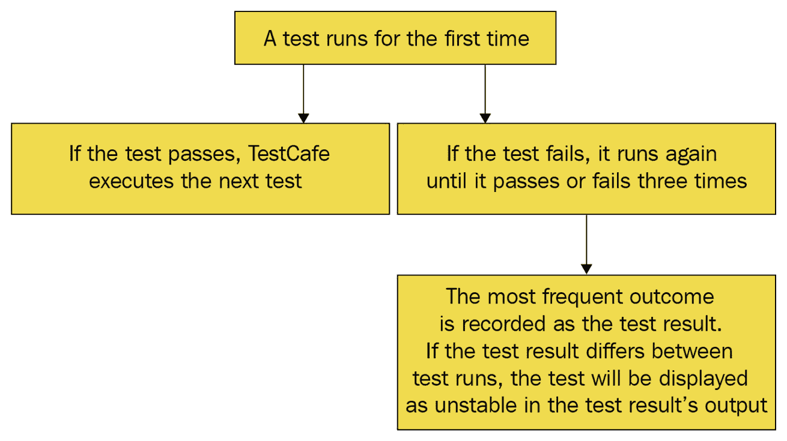

# *第三章：设置环境*

本章的主要学习目标是熟悉使用 TestCafe 设置测试环境以编写端到端测试。你将学习如何设置 Node.js 环境（包括 TestCafe 本身），创建一个基本的配置文件来运行测试，以及如何构建测试代码以遵循最佳实践。

这尤其重要，因为在现实生活中，每个新的项目/存储库通常都需要设置测试基础设施以防止回归并保持代码质量。

总结来说，本章将涵盖以下主要主题：

+   设置测试项目环境。

+   创建测试项目配置文件。

+   构建测试代码。

# 技术要求

本章的所有代码示例都可以在 GitHub 上找到，地址为 [`github.com/PacktPublishing/Modern-Web-Testing-with-TestCafe/tree/master/ch3`](https://github.com/PacktPublishing/Modern-Web-Testing-with-TestCafe/tree/master/ch3)。

# 设置测试项目环境

现在正确设置环境非常重要，因为我们将在本章的剩余部分以及整本书的结尾使用它。这样做还将帮助您了解 Node.js 如何处理不同的包以及如何启动几乎任何基于 JavaScript/Node.js 的测试框架。我们将设置过程分为两个部分：

+   安装 Node.js。

+   安装 TestCafe。

因此，让我们从头开始，从安装 Node.js 开始整个过程。

## 安装 Node.js

JavaScript 是一种客户端编程语言，主要处理前端，这意味着它通常由打开您网站或 web 应用的每个用户的浏览器处理。Node.js 作为一种 JavaScript 运行时环境被开发出来，以提供将 JavaScript 作为服务器端后端语言的能力。

为了启动几乎所有用 JavaScript 编写的开发工具，您需要使用 Node.js 和 `node_modules` 文件夹。

Node.js 可用于多种操作系统，包括 macOS、Ubuntu/Linux 和 Windows。安装 Node.js 和 `npm` 的最简单方法是按照以下步骤操作：

1.  打开 [`nodejs.org/en/download/`](https://nodejs.org/en/download/)。

1.  选择 **长期支持 (LTS)** 版本。

1.  选择您的操作系统。

1.  下载安装文件并运行它。

另一种稍微复杂但可重用的方法是，通过 **Node 版本管理器 (nvm** – [`github.com/nvm-sh/nvm`](https://github.com/nvm-sh/nvm)) 或 n ([`github.com/tj/n`](https://github.com/tj/n)) 安装 Node.js。版本管理器允许您同时安装多个 Node.js 版本，并且可以随时在它们之间切换，这在测试开发期间非常有用。

安装完成后，您可以通过打开任何外壳（例如，终端或 PowerShell）并执行以下命令来检查 Node.js 和 `npm` 是否正常工作：

```js
$ node -v
$ npm -v
```

这应该会分别输出 Node.js 和 `npm` 的版本号。

## 安装 TestCafe

由于我们已经安装了 Node.js 和 `npm`，让我们继续安装 TestCafe。它可以从 `npm` 本地安装（从您的项目文件夹运行）或全局安装（从任何位置运行）。

### 本地安装 TestCafe

要将 TestCafe 本地安装到您的项目目录并保存到依赖项列表中，请打开任何 shell，转到您的项目文件夹，并执行以下两个命令：

```js
$ npm init --yes
$ npm install testcafe --save-dev
```

第一个命令将创建一个简单的 `package.json` 文件来存储所有依赖项。第二个命令将安装 `testcafe` 包并将其保存到 `package.json` 中您项目的依赖项列表中。

### 全局安装 TestCafe

要全局安装 TestCafe，打开任何 shell 并执行以下命令：

```js
$ npm install testcafe --global
```

这将全局安装 TestCafe，并且可以从任何文件夹访问它。

您可以通过执行以下命令来检查已安装的 `testcafe` 包的版本：

```js
$ npx testcafe -v --no-install
```

注意

在 macOS（从 v10.15 Catalina 版本开始），TestCafe 需要屏幕录制权限来执行测试操作并截图和录制视频。当 TestCafe 首次启动测试时，macOS 将要求您允许 TestCafe 浏览器工具进行屏幕录制。转到 **系统偏好设置** - **安全性与隐私** - **隐私**，并勾选 **TestCafe 浏览器工具** 以授予权限。当您更新 macOS 或 TestCafe 时，安全权限可能会被清除——在这种情况下，系统将重复请求。因此，当 **安全性与隐私** 弹出窗口再次打开时，只需取消勾选并重新勾选 **TestCafe 浏览器工具** 复选框。

现在，由于我们已经安装并准备好了 Node.js、npm 和 TestCafe，让我们继续创建测试项目的配置文件。

# 创建测试项目配置文件

在本节中，我们将了解如何配置 TestCafe。然而，在审查主要配置选项之前，让我们为一些编码风格标准设定一个约定。

## 接受代码风格约定

在本书编写代码的过程中，我们将遵循一些简单的规则，例如 `.json` 文件使用两个空格缩进，`.js` 文件使用四个空格缩进。我们还将使用分号和单引号。大多数流行的代码编辑器都支持 `.editorconfig` 配置文件来自动应用这些规则：

```js
root = true [*]indent_style = space indent_size = 4 end_of_line = lf insert_final_newline = true charset = utf-8 trim_trailing_whitespace = true max_line_length = 120 [*.json]indent_size = 2
```

您可以从 [`github.com/PacktPublishing/Modern-Web-Testing-with-TestCafe/blob/master/.editorconfig`](https://github.com/PacktPublishing/Modern-Web-Testing-with-TestCafe/blob/master/.editorconfig) 复制我们将要使用的基本配置文件。

## 探索配置设置

TestCafe 配置设置通常存储在项目根目录下的 `.testcaferc.json` 文件中。让我们看看可以指定的主要选项：

+   `browsers` 是一个字符串，或一个字符串数组，用于设置要启动测试的一个或多个浏览器。对于任何本地安装的浏览器，例如 `chrome`、`firefox`、`safari`、`ie`、`edge` 或 `opera`，应指定浏览器别名（[`devexpress.github.io/testcafe/documentation/guides/concepts/browsers.html#locally-installed-browsers`](https://devexpress.github.io/testcafe/documentation/guides/concepts/browsers.html#locally-installed-browsers)）。您可以在系统中的任何壳中打开并运行以下命令来查看所有可用的浏览器列表：

    ```js
    .testcaferc.json will look like this:

    ```

    {  "browsers": "chrome"}

    ```js

    To run tests in Firefox and Chrome, your test will look like this:

    ```

    {  "browsers": ["firefox", "chrome"]}

    ```js

    To run tests in remote browsers (such as SauceLabs, BrowserStack, CrossBrowserTesting, and so on) with a browser provider plugin, set the browser provider name, together with the browser alias and operating system, as follows:

    ```

    {  "browsers": "saucelabs:Chrome@83.0:Windows 10"}

    ```js

    Postfixes to browser aliases can be used to launch tests in headless mode or to apply Chrome device emulation ([`devexpress.github.io/testcafe/documentation/guides/concepts/browsers.html#use-chromium-device-emulation`](https://devexpress.github.io/testcafe/documentation/guides/concepts/browsers.html#use-chromium-device-emulation)):

    ```

    {  "browsers": ["firefox:headless",     "chrome:emulation:device=iphone X"]}

    ```js

    NoteTestCafe starts Chrome and Firefox with a fresh profile by default, without any extensions or profile settings. If you need to launch a browser with the current user profile, add the `:userProfile` postfix flag after the browser alias.
    ```

+   `src` 是一个字符串，或一个字符串数组，用于设置从其中启动测试的文件或目录的路径。要从单个文件运行测试，请使用以下代码：

    ```js
    {  "src": "tests/login-test.js"}
    ```

    可以使用全局模式来解析一组文件：

    ```js
    {  "src": ["tests/**/*.js", "utils/helpers/"]}
    ```

+   `reporter` 是一个字符串或一个对象数组，用于设置用于生成测试报告的内置或自定义报告器的名称（[`devexpress.github.io/testcafe/documentation/guides/concepts/reporters.html`](https://devexpress.github.io/testcafe/documentation/guides/concepts/reporters.html)）。默认情况下，使用 `spec` 报告器。要指定任何其他报告器，例如 `minimal`，请使用以下命令：

    ```js
    {  "reporter": "minimal"}
    ```

    可以同时设置多个报告器，但只能有一个报告器可以写入控制台输出（标准输出，或 `stdout`），所有其他报告器应写入文件：

    ```js
    {  "reporter": [    {      "name": "minimal"    },    {      "name": "json",      "output": "tests/reports/report.json"    },    {      "name": "xunit",      "output": "tests/reports/report.xml"    }  ]}
    ```

    您还可以探索和使用来自 [`www.npmjs.com/search?q=testcafe-reporter`](https://www.npmjs.com/search?q=testcafe-reporter) 的任何可用报告器。

+   `screenshots` 是一个对象，允许您设置截图选项。这些选项包括 `path`，它是一个字符串，表示保存截图的目录；`takeOnFails`，它是一个布尔值，表示是否在测试失败时捕获截图；`pathPattern`，它是一个字符串，用于创建相对路径和截图的名称；以及 `fullPage`，它是一个布尔值，表示是否应捕获整个页面截图（包括由于溢出而不可见的任何内容）：

    ```js
    {  "screenshots": {    "path": "tests/screenshots/",    "takeOnFails": true,    "pathPattern": "${DATE}_${TIME}/test-${TEST_   INDEX}/${USERAGENT}/${FILE_INDEX}.png",    "fullPage": true   }}
    ```

    注意

    请参阅可用于截图和视频的完整占位符路径模式列表，链接为 [`devexpress.github.io/testcafe/documentation/guides/advanced-guides/screenshots-and-videos.html#path-pattern-placeholders`](https://devexpress.github.io/testcafe/documentation/guides/advanced-guides/screenshots-and-videos.html#path-pattern-placeholders)。

+   `videoPath` 是一个字符串，表示保存测试运行视频的目录：

    ```js
    {  "videoPath": "tests/videos/"}
    ```

+   `videoOptions` 是一个对象，允许您设置视频选项。这些选项包括 `failedOnly`，这是一个布尔值，应设置为 `true` 以仅对失败的测试进行录制，或设置为 `false`（默认值）以录制所有测试；`singleFile`，这是一个布尔值，应设置为 `true` 以将整个记录保存到单个文件中，或设置为 `false`（默认值）以每个测试保存到单独的文件；以及 `pathPattern`，这是一个字符串，用于自定义模式来组合相对路径和视频文件名：

    ```js
    {  "videoOptions": {    "failedOnly": true,    "singleFile": true,    "pathPattern": "${TEST_INDEX}/${USERAGENT}/${FILE_INDEX}.mp4"  }}
    ```

+   `videoEncodingOptions` 是一个对象，用于设置视频编码选项（支持所有 `FFmpeg` 库选项，您可以在 [`ffmpeg.org/ffmpeg.html#Options`](https://ffmpeg.org/ffmpeg.html#Options) 找到这些选项）。例如，让我们设置帧率和视频显示宽高比：

    ```js
    {  "videoEncodingOptions": {    "r": 24,    "aspect": "16:9"  }}
    ```

+   `quarantineMode` 是一个布尔值，用于将失败的测试切换到隔离模式（以重新运行不稳定的测试）：

    ```js
    {  "quarantineMode": true }
    ```

    如果启用隔离模式，测试运行将遵循以下逻辑：



图 3.1 – 在隔离模式下运行的测试逻辑

+   `debugMode` 是一个布尔值，用于在调试模式下运行测试：

    ```js
    {  "debugMode": true }
    ```

    注意

    如果启用调试模式，测试执行将在第一个动作或断言之前暂停，以便您可以打开开发者工具并开始调试。为了便于操作，将在页脚显示一个状态栏，显示可用的调试操作：**解锁页面**、**继续**和**下一步**。

+   `debugOnFail` 是一个布尔值，用于在测试失败后自动启用调试模式。如果此选项设置为 `true`（默认设置为 `false`），TestCafe 将在测试失败时暂停，以便您可以查看测试页面，打开开发者工具，并找出失败的原因：

    ```js
    {  "debugOnFail": true }
    ```

+   `skipJsErrors` 是一个布尔值，用于忽略测试网页上的 JavaScript 错误（默认情况下，当这些错误发生时，TestCafe 将停止运行测试，并在输出报告中发布带有堆栈跟踪的错误消息）：

    ```js
    {  "skipJsErrors": true }
    ```

+   `skipUncaughtErrors` 是一个布尔值，用于忽略测试网页上的未捕获 JavaScript 错误和未处理的承诺拒绝（默认情况下，当这些错误或承诺拒绝发生时，TestCafe 将停止运行测试，并在输出报告中发布带有堆栈跟踪的错误消息）：

    ```js
    {  "skipUncaughtErrors": true }
    ```

+   `appCommand` 是一个字符串，用于在测试开始之前执行指定的 shell 命令。此选项通常用于启动需要运行测试的应用程序（在所有测试执行完毕后，此类应用程序将自动停止）：

    ```js
    {  "appCommand": "node server.js"}
    ```

+   `appInitDelay` 是 TestCafe 在启动测试之前等待的时间（以毫秒为单位；默认值为 `1000`）。因此，此延迟用于给使用 `appCommand` 选项启动的应用程序一些启动时间：

    ```js
    {  "appCommand": "node server.js",  "appInitDelay": 5000 }
    ```

+   `concurrency` 是用于并行运行测试的浏览器实例的数量。TestCafe 将以指定的浏览器实例数量开始，并创建这些实例的池。测试将同时针对此池启动；每个测试将从池中获取第一个空闲的浏览器实例并在其中运行：

    ```js
    {  "concurrency": 4 }
    ```

+   `selectorTimeout` 是选择器在请求检索网页元素节点时的时间（以毫秒为单位；默认值为 `10000`）：

    ```js
    {  "selectorTimeout": 15000 }
    ```

+   `assertionTimeout` 是 TestCafe 执行断言请求的时间（以毫秒为单位；默认值为 `3000`）。此超时仅适用于在断言中使用选择器属性或客户端函数作为 `实际` 值的情况：

    ```js
    {  "assertionTimeout": 5000 }
    ```

+   `pageLoadTimeout` 是在 `DOMContentLoaded` 事件之后 TestCafe 等待 `window.load` 事件被触发的时间（以毫秒为单位；默认值为 `3000`）。TestCafe 在 `window.load` 事件被触发或超时通过（以先发生者为准）后开始测试：

    ```js
    {  "pageLoadTimeout": 10000 }
    ```

+   `speed` 是测试执行速度（`1` 是最快的，`0.01` 是最慢的；默认值为 `1`）。此选项可用于减慢测试速度：

    ```js
    {  "speed": 0.5 }
    ```

    注意

    如果在 `.testcaferc.json` 中设置了速度，并且在针对单个操作的测试中也设置了速度，则操作的速度设置将具有更高的优先级，并将覆盖配置文件中设置的速度：

+   `clientScripts` 是一个对象、一个对象数组或一个字符串，用于在测试期间注入任何打开的页面中的脚本。此属性通常用于添加客户端模拟函数、模块或辅助脚本。您可以设置 `content`，这是一个包含要注入的 JavaScript 代码的字符串；`module`，这是一个包含要注入的模块名称的字符串；以及 `path`，这是一个包含要注入的 JavaScript 文件的路径的字符串。这些设置中的任何一个都可以与可选的 `page` 设置配对，以设置应注入提供的脚本的特定页面：

    ```js
    {  "clientScripts": [    {      "content": "Date.prototype.getTimestamp = () => new Date().getTime().toString();"    },    {      "module": "js-automation-tools"    },    {      "path": "scripts/helpers.js",      "page": "https://test-site.com/page/"    }  ]}
    ```

+   `port1` 和 `port2` 是范围在 `0` 到 `65535` 之间的数字，代表一个自定义端口，TestCafe 使用它来启动测试基础设施（如果未设置端口，TestCafe 将自动选择它们）：

    ```js
    {  "port1": 12340,  "port2": 56789 }
    ```

+   `hostname` 是您计算机的主机名，当您在远程浏览器中运行测试时使用。如果未设置 `hostname`，TestCafe 将使用操作系统的主机名或当前机器的网络 IP 地址：

    ```js
    {  "hostname": "host.test-site.com"}
    ```

+   `proxy` 是用于您本地网络中访问互联网的代理服务器的字符串：

    ```js
    {  "proxy": "123.123.123.123:8080"}
    ```

    认证凭据也可以通过代理主机设置：

    ```js
    {  "proxy": "username:password@proxy.test-site.com"}
    ```

+   `proxyBypass` 是一个字符串（或字符串数组），要求 TestCafe 绕过代理服务器以访问指定的资源：

    ```js
    {  "proxyBypass": ["localhost:8080", "internal.corp.test-site.com"]}
    ```

+   `developmentMode` 是一个布尔值，用于诊断错误（如果您想向 TestCafe 支持报告问题，应将此选项设置为 `true`）：

    ```js
    {  "developmentMode": true }
    ```

+   `stopOnFirstFail` 是一个布尔值，用于在任何一个测试失败后立即停止测试运行：

    ```js
    {  "stopOnFirstFail": true }
    ```

+   `tsConfigPath` 是一个字符串，用于使 TestCafe 能够使用自定义 TypeScript 配置文件并设置其位置 ([`devexpress.github.io/testcafe/documentation/guides/concepts/typescript-and-coffeescript.html#customize-compiler-options`](https://devexpress.github.io/testcafe/documentation/guides/concepts/typescript-and-coffeescript.html#customize-compiler-options))。可以使用相对路径或绝对路径：

    ```js
    {  "tsConfigPath": "/Users/john/testcafe/tsconfig.json"}
    ```

    在相对路径的情况下，它们将相对于你运行 TestCafe 的目录进行解析。

+   `disablePageCaching` 是一个布尔值，用于防止浏览器缓存页面内容：

    ```js
    {  "disablePageCaching": true }
    ```

    当浏览器在角色代码中打开缓存页面时，`localStorage` 和 `sessionStorage` 的内容将不会被保存。为了在导航后保留存储项，将 `disablePageCaching` 设置为 `true`。

    注意

    这里是一个包含所有主要设置的 `.testcaferc.json` 文件的好例子：[`github.com/DevExpress/testcafe/blob/master/examples/.testcaferc.json`](https://github.com/DevExpress/testcafe/blob/master/examples/.testcaferc.json)。

# 为测试项目创建基本配置

现在，让我们将本节所学的内容综合起来，通过打开任何外壳（例如，我们将使用带有 Bash 的终端）并执行以下步骤来为我们的测试项目创建一个具有基本配置的文件夹：

1.  由于我们已经下载并安装了 Node.js，让我们检查其版本：

    ```js
    $ node -v
    ```

1.  然后，为你的未来测试项目创建一个文件夹：

    ```js
    $ mkdir test-project
    ```

1.  现在，进入那个文件夹，初始化一个基本的 `package.json` 文件以存储所有依赖项：

    ```js
    $ cd test-project/
    $ npm init --yes
    ```

1.  之后，安装 TestCafe 包并将其保存为开发依赖项：

    ```js
    $ npm install testcafe --save-dev
    ```

1.  作为最终步骤（目前），创建一个 `.testcaferc.json` 配置文件，包含一组最小选项：

    ```js
    {  "browsers": "chrome",  "src": [    "tests/**/*.js",    "tests/**/*.feature"  ],  "screenshots": {    "path": "tests/screenshots/",    "takeOnFails": true,    "pathPattern": "${DATE}_${TIME}/test-${TEST_INDEX}/${USERAGENT}/${FILE_INDEX}.png"  },  "quarantineMode": false,  "stopOnFirstFail": true,  "skipJsErrors": true,  "skipUncaughtErrors": true,  "concurrency": 1,  "selectorTimeout": 3000,  "assertionTimeout": 1000,  "pageLoadTimeout": 1000,  "disablePageCaching": true }
    ```

我们已经在 *探索配置设置* 部分涵盖了此文件中的选项，因此你可以随时参考它来理解这个例子。

你还可以从 GitHub 上审查和下载此配置文件：[`github.com/PacktPublishing/Modern-Web-Testing-with-TestCafe/blob/master/ch3/test-project/.testcaferc.json`](https://github.com/PacktPublishing/Modern-Web-Testing-with-TestCafe/blob/master/ch3/test-project/.testcaferc.json)。

由于我们已经安装了 Node.js 和 TestCafe 并创建了基本配置文件，让我们通过组织测试代码结构来继续设置我们的测试项目。

# 测试代码的结构化

为了更好地理解测试代码结构组织，让我们将其分为几个部分：固定装置、测试、起始网页、元数据和跳过测试。

## 固定装置

TestCafe 测试通常被分组到测试套件中，称为固定配置（与 Jasmine 和 Mocha 测试框架中的`describe`块相同）。任何包含 TestCafe 测试的 JavaScript、TypeScript 或 CoffeeScript 文件都应该包含一个或多个固定配置。固定配置可以使用`fixture`函数声明，它只接受一个参数——`fixtureName`，这是一个字符串，表示固定配置（测试集）的名称：

```js
fixture('Name for the set of the tests');
```

或者，你也可以这样写，不使用括号：

```js
fixture `Name for the set of the tests`;
```

固定配置基本上是一个包装器，用于指示一组测试的开始。让我们看看这些测试应该如何结构化。

## 测试

测试通常在`fixture`声明之后编写。要创建一个测试，请调用`test`函数，它接受两个参数：

+   `testName`：一个字符串，表示测试的名称。

+   `function`：一个包含测试代码的异步函数，它接受一个参数——`t`，这是一个用于访问所有操作和断言的测试控制器对象。

一个简单的测试通常看起来像这样：

```js
test('Go to the main page', async (t) => {    await t.click('#button-main-page');    await t.expect(Selector('#logo-main-page').visible).ok();});
```

由于 TestCafe 测试是在服务器端执行的，因此你可以使用任何额外的包或模块。此外，在测试内部，你可以执行以下操作：

+   使用测试操作与被测试的网页进行交互。

+   使用选择器和客户端函数来获取有关页面元素状态的信息或从客户端获取其他数据。

+   使用断言来验证页面元素是否具有预期的参数。

现在，让我们看看如何在固定配置中为所有测试指定起始页面。

## 起始网页

你可以使用`fixture.page`函数在一个固定配置中设置初始网页，它将成为所有测试的起点：它只接受一个参数——`url`，这是一个字符串，表示网页的 URL，所有固定配置中的测试都是从该网页开始的：

```js
fixture('Contacts page').page('http://test-site.com/example');test('Test Contact form', async (t) => {    // Starts at http://test-site.com/example });
```

接下来，让我们看看如何为固定配置和测试指定元数据。

## 元数据

在 TestCafe 中，你还可以为测试提供额外的信息，例如键值元数据。这可以用于过滤测试并在报告中显示这些数据。要定义元数据，请使用`fixture.meta`和`test.meta`方法。它们接受两个字符串参数：

+   `name`：一个字符串，表示元数据条目的名称。

+   `value`：一个字符串，表示元数据条目的值。

或者，它们可以接受一个参数——`metadata`，这是一个包含元数据键值对的对象。

这两种设置元数据的方式可以组合使用，看起来是这样的：

```js
fixture('Contacts page')    .meta('env', 'production')    .meta('fixtureId', 'f0001')    .meta({ author: 'John', creationDate: '01.06.2020' });test.meta('testId', 't0001')    .meta({ testType: 'fast', testedFeatureVersion: '1.1' })    ('Test Contact form', async (t) => {    // Your test code });
```

固定配置或测试可以通过它们包含的特定元数据值来启动。要按`metadata`过滤测试，请将`filter.testMeta`和`filter.fixtureMeta`属性添加到`.testcaferc.json`配置文件中：

```js
{  "filter": {    "fixtureMeta": {      "env": "production",      "author": "John"    },    "testMeta": {      "testType": "fast",      "testedFeatureVersion": "1.1"    }  }}
```

此配置将仅运行具有`metadata`的`testType`属性设置为`fast`和`testedFeatureVersion`设置为`1.1`的测试，以及其固定配置的元数据具有`env`属性设置为`production`和`author`属性设置为`John`的测试。

您可以使用自定义报告器（[`devexpress.github.io/testcafe/documentation/guides/extend-testcafe/reporter-plugin.html`](https://devexpress.github.io/testcafe/documentation/guides/extend-testcafe/reporter-plugin.html)）来在报告中显示测试用例和测试的元数据。

## 跳过测试

在 TestCafe 中，您还可以指定在所有其他测试运行时跳过的测试用例或测试。这是通过 `fixture.skip` 和 `test.skip` 方法实现的：

```js
fixture.skip('Contacts page');test('Test Contact form', async (t) => {    // Your test code });test('Test Review form', async (t) => {    // Your test code });fixture('About page');test('Test Reviews block', async (t) => {    // Your test code });test.skip('Test More info form', async (t) => {    // Your test code });test('Test Our mission block', async (t) => {    // Your test code });
```

在本例中，`Contacts` 页面测试用例将不会被运行。`Test More info form` 测试也不会被执行。

另一对有用的方法是 `fixture.only` 和 `test.only`。它们用于指定仅启动特定的测试用例或测试用例，其他所有测试用例将被跳过。如果有多个测试用例被标记为 `.only`，则所有标记为 `.only` 的测试用例都将被执行：

```js
fixture.only('Contacts page');test('Test Contact form', async (t) => {    // Your test code });test('Test Review form', async (t) => {    // Your test code });fixture('About page');test('Test Reviews block', async (t) => {    // Your test code });test.only('Test More info form', async (t) => {    // Your test code });test('Test Our mission block', async (t) => {    // Your test code });
```

在本例中，只有来自 `Contacts` 页面测试用例和 `Test More info form` 测试用例将被执行。

# 摘要

在本章中，我们学习了如何使用 TestCafe 设置编写端到端测试的测试环境。我们安装了 Node.js 和 TestCafe，审查了配置选项，并创建了一个基本的 `.testcaferc.json` 文件来存储它们。除此之外，我们还了解了几种结构化 TestCafe 代码的技术，包括测试用例、测试、起始网页、元数据和跳过测试。

本章的教训非常重要，因为您将进入任何新开始项目的配置阶段。

现在，我们已经做好了充分的准备，可以开始利用这些知识来编写我们的测试项目的 TestCafe 测试。我们将学习如何创建和调试测试，并在之后立即开始构建一个真实的测试套件。
