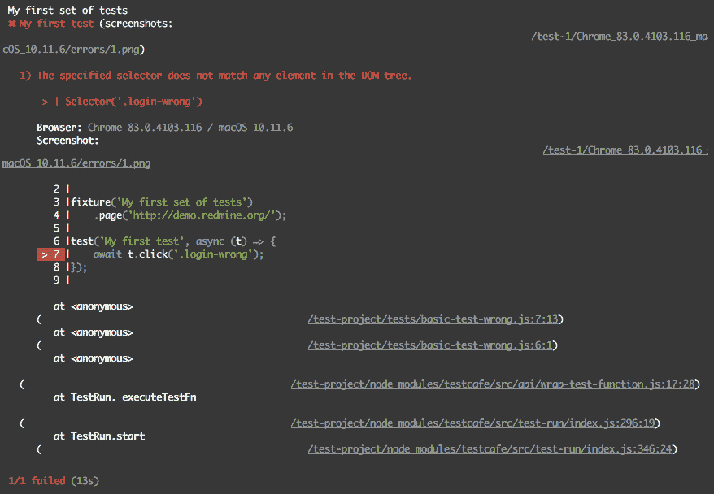
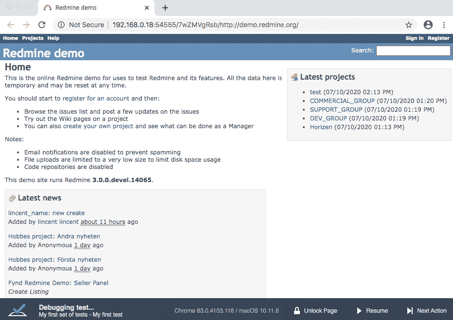
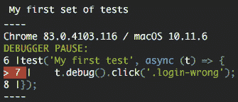
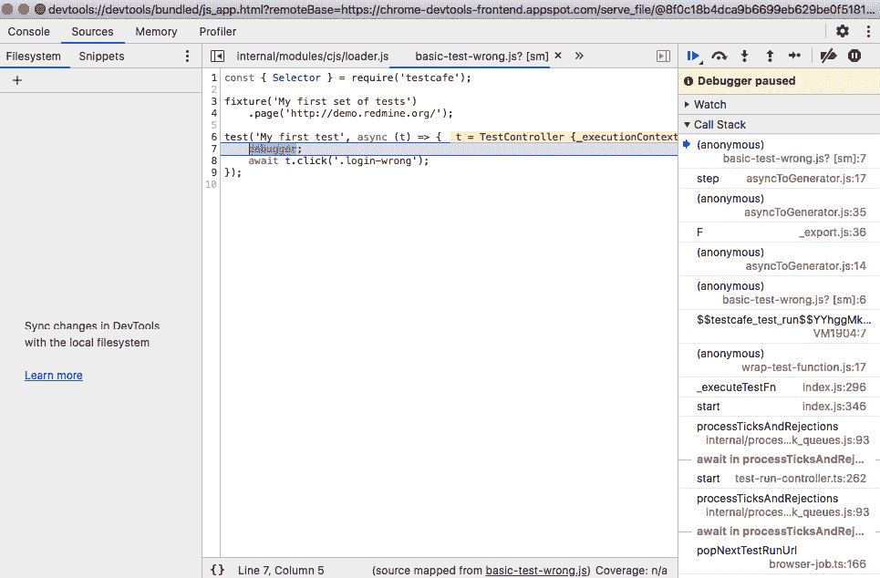
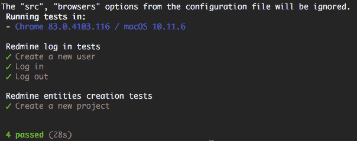

# *第四章：使用 TestCafe 构建测试套件*

现在，我们已经了解了 TestCafe 的主要概念并审查了其工具箱，让我们拿起武器并编写一些测试！此处的首要目标将是熟悉如何使用 TestCafe 编写一组端到端测试（测试套件）。这非常重要，因为我们将涵盖的测试技术是通用的，可以重用于编写任何 Web 项目的自动化测试。

总结来说，本章将涵盖以下主要主题：

+   创建测试。

+   调试测试。

+   在测试项目中编写测试项目日志。

+   向测试项目中添加验证。

+   在测试项目中添加自定义代码执行。

+   添加更多测试。

# 技术要求

正如我们在 *第三章**，设置环境* 中提到的，在编写本书中的代码时，我们将遵循一些编码约定：`.json` 文件使用两个空格缩进，`.js` 文件使用四个空格缩进，使用分号，并使用单引号。我们还将利用 JavaScript ES6+ 语法，包括模板字符串。

本章的所有代码示例都可以在 GitHub 上找到：[`github.com/PacktPublishing/Modern-Web-Testing-with-TestCafe/blob/master/ch4`](https://github.com/PacktPublishing/Modern-Web-Testing-with-TestCafe/blob/master/ch4).

# 在测试项目中创建测试。

TestCafe 支持使用 JavaScript、TypeScript 或 CoffeeScript 编写的测试，并具有所有现代功能，如箭头函数和 `async/await`。除此之外，TestCafe 还会在运行测试之前自动将 TypeScript 和 CoffeeScript 代码转换为 JavaScript，因此您无需自己处理。

正如我们最初商定的，在本书中我们将使用 JavaScript 编写测试。

在延续我们之前在 *第三章**，设置环境* 的努力之后，我们已经在 `test-project` 文件夹中有了 `.testcaferc.json` 配置文件。因此，让我们首先打开任何 shell（例如，我们将使用带有 bash 的终端）并遵循以下步骤：

1.  前往 `test-project` 文件夹并为我们的测试创建一个文件夹：

    ```js
    $ cd test-project/
    $ mkdir tests
    ```

1.  现在，请转到该文件夹并创建一个 `basic-tests.js` 文件：

    ```js
    $ cd tests/
    $ touch basic-tests.js
    ```

1.  在您选择的代码编辑器（或 IDE）中打开 `basic-tests.js` 并让我们创建一个简单的测试。

1.  我们首先将包括 `testcafe` 模块：

    ```js
    const { Selector } = require('testcafe');
    ```

1.  然后我们使用 `fixture` 函数声明一个固定测试：

    ```js
    const { Selector } = require('testcafe');
fixture('My first set of tests');
    ```

1.  使用 `test` 函数声明第一个测试：

    ```js
    const { Selector } = require('testcafe');
fixture('My first set of tests');
test('My first test', async (t) => {    // Your test code });
    ```

1.  由于我们选择了 Redmine ([`demo.redmine.org/`](http://demo.redmine.org/)) 作为我们的测试项目，请使用 `page` 函数将此 URL 设置为 `'My first set of tests'` 固定测试的起始页面：

    ```js
    const { Selector } = require('testcafe');fixture('My first set of tests')    .page('http://demo.redmine.org/');test('My first test', async (t) => {    // Your test code });
    ```

    注意

    您也可以在 GitHub 上审查和下载此文件：[`github.com/PacktPublishing/Modern-Web-Testing-with-TestCafe/blob/master/ch4/test-project/tests/basic-tests1.js`](https://github.com/PacktPublishing/Modern-Web-Testing-with-TestCafe/blob/master/ch4/test-project/tests/basic-tests1.js).

既然我们现在有一个空的测试结构，让我们运行它并检查输出。

## 运行测试

我们可以通过在命令行中执行单个命令，指定目标浏览器和文件路径，轻松运行测试：

```js
$ npx testcafe chrome tests/basic-tests.js
```

Shell 输出将看起来像这样：

![图 4.1：测试运行后的 Shell 输出]

]

图 4.1 – 测试运行后的 Shell 输出

TestCafe 将自动启动所选的浏览器实例，并开始运行测试。正如您在测试输出中看到的那样：“配置文件中的`src`、`browsers`选项将被忽略。”这意味着我们已经在`.testcaferc.json`中指定了我们的默认浏览器和测试的路径（您可以在[这里](https://github.com/PacktPublishing/Modern-Web-Testing-with-TestCafe/blob/master/ch4/test-project/.testcaferc.json#L3)看到它），我们提供的命令行选项已经覆盖了默认设置。

因此，我们现在可以进一步简化测试运行命令：

```js
$ npx testcafe
```

现在，TestCafe 将仅从`.testcaferc.json`中获取默认选项，测试运行的结果将与之前相同。我们将在*第五章**，改进测试*中稍后回顾更多的**命令行界面**（**CLI**）设置。

注意

保持运行测试的浏览器处于活动状态，不要最小化浏览器窗口。最小化的浏览器窗口和未激活的标签页往往会切换到资源消耗减少的模式，在这种模式下，测试可能无法正确执行。

## 执行动作

现在我们来在页面上执行一些动作：

```js
const { Selector } = require('testcafe');fixture('My first set of tests')    .page('http://demo.redmine.org/');test('My first test', async (t) => {    await t.click('.login');});
```

注意

您还可以在 GitHub 上查看和下载此文件：[`github.com/PacktPublishing/Modern-Web-Testing-with-TestCafe/blob/master/ch4/test-project/tests/basic-tests2.js`](https://github.com/PacktPublishing/Modern-Web-Testing-with-TestCafe/blob/master/ch4/test-project/tests/basic-tests2.js)。

之前的设置包含一个简单的测试，点击`t`。测试控制器对象让我们可以访问测试运行的 API。在调用测试动作或动作链时，应该使用`await`关键字等待它们完成。

既然我们已经学会了如何运行基本测试，让我们谈谈如何处理调试和错误。

# 调试测试

现在我们来看看如何调试我们的测试。我们将分两个部分来回顾：

+   在 TestCafe 中调试测试。

+   在 Chrome 开发者工具中调试测试。

让我们看看。

## 在 TestCafe 中调试测试

让我们使用上一个示例中的代码，创建一个`basic-test-wrong.js`文件，并在选择器中稍作修改类名：

```js
const { Selector } = require('testcafe');fixture('My first set of tests')    .page('http://demo.redmine.org/');test('My first test', async (t) => {    await t.click('.login-wrong');});
```

注意

您还可以在 GitHub 上查看和下载此文件：[`github.com/PacktPublishing/Modern-Web-Testing-with-TestCafe/blob/master/ch4/test-project/tests/basic-test-wrong.js`](https://github.com/PacktPublishing/Modern-Web-Testing-with-TestCafe/blob/master/ch4/test-project/tests/basic-test-wrong.js)。

使用 `.login-wrong` 类名而不是 `.login` 来引发 **元素未找到** 错误。让我们启动我们的测试以确认这一点：

```js
$ npx testcafe chrome tests/basic-test-wrong.js
```

输出将类似于这样：



Figure 4.2 – 测试运行后带有错误的 Shell 输出

如您所见，TestCafe 输出了错误及其发生的位置。

但在测试失败之前，您如何调试测试呢？为此，TestCafe 提供了 `t.debug` 方法。让我们将其添加到我们的测试中：

```js
const { Selector } = require('testcafe');fixture('My first set of tests')    .page('http://demo.redmine.org/');test('My first test', async (t) => {    await t.debug().click('.login-wrong');});
```

此方法用于暂停测试执行，并使用浏览器的开发者工具进行调试。您将在浏览器窗口的页脚中看到一些按钮，用于导航测试运行流程：

+   **解锁页面**：允许我们与当前打开的浏览器页面进行交互。

+   **恢复**：允许我们继续测试运行。

+   **下一步操作**：执行下一个操作或断言：



Figure 4.3 – TestCafe 调试按钮

输出将类似于这样：



Figure 4.4 – 调试模式下的 Shell 输出

如您所见，TestCafe 输出了调用 `t.debug` 方法的代码行。

您也可以使用 `--debug-mode` 标志来运行测试。这将启用调试并在第一次操作或断言之前暂停测试执行：

```js
$ npx testcafe chrome tests/basic-test-wrong.js --debug-mode
```

或者，您可以使用 `--debug-on-fail` 标志。当测试失败时，它将暂停测试，并允许您查看测试页面并确定失败的原因：

```js
$ npx testcafe chrome tests/basic-test-wrong.js --debug-on-fail
```

当您对页面调试满意时，只需点击页脚中的 **完成** 按钮即可终止测试执行过程。

现在让我们看看如何在 Chrome Dev Tools 中调试测试。

## 在 Chrome 开发者工具中调试测试

另一种调试测试的有用方法是通过 Chrome 开发者工具中的 Node.js 进行。您需要 Google Chrome 和 Node.js v8 或更高版本来执行所有操作。要使用 Chrome 开发者工具进行调试，请按照以下步骤操作：

1.  首先，在测试代码中放置 `debugger` 关键字，以便在您希望进程停止的地方：

    ```js
    const { Selector } = require('testcafe');fixture('My first set of tests')    .page('http://demo.redmine.org/');test('My first test', async (t) => {    debugger;    await t.click('.login-wrong');});
    ```

1.  然后，为了激活 Node.js 调试模式，将 `--inspect-brk` 标志添加到测试运行命令中：

    ```js
    $ npx testcafe --inspect-brk chrome tests/basic-test-wrong.js
    ```

1.  打开 Google Chrome 并导航到 chrome://inspect。在 **远程目标** 部分，找到 Node.js 调试器并点击 **检查**。Chrome 将启动开发者工具，调试器将在第一行停止测试执行。点击 **恢复脚本执行** 按钮继续：



Figure 4.5 – Google Chrome 开发者工具调试器

如您所见，测试执行在带有 `debugger` 关键字的行上暂停，允许您调试代码。

现在，我们已经学会了如何调试测试代码，让我们进一步编写一些针对测试项目的登录测试。

# 在测试中编写测试项目日志

正如我们在*第一章**，为什么选择 TestCafe*中讨论的那样，我们需要一个测试用户登录到门户并执行任何进一步的测试。因此，让我们从创建一个带有电子邮件地址的新用户开始——`test_user_testcafe_poc{randomDigits}@sharklasers.com`——以及密码——`test_user_testcafe_poc`。

让我们声明以下测试以在`basic-tests.js`中注册新用户：

```js
const { Selector } = require('testcafe');fixture('Redmine log in tests')    .page('http://demo.redmine.org/');test('Create a new user', async (t) => {
```

测试将执行以下操作：

1.  测试点击了**注册**链接：

    ```js
        await t.click('.register')
    ```

1.  测试填写了**登录**字段：

    ```js
            .typeText('#user_login','test_user_testcafe_poc1234@sharklasers.com')
    ```

1.  测试填写了**密码**字段：

    ```js
            .typeText('#user_password','test_user_testcafe_poc')
    ```

1.  测试填写了**确认**字段：

    ```js
            .typeText('#user_password_confirmation', 'test_user_testcafe_poc')
    ```

1.  测试填写了**名字**字段：

    ```js
            .typeText('#user_firstname','test_user')
    ```

1.  测试填写了**姓氏**字段：

    ```js
            .typeText('#user_lastname','testcafe_poc')
    ```

1.  测试填写了**电子邮件**字段：

    ```js
            .typeText('#user_mail', 'test_user_testcafe_poc1234@sharklasers.com')
    ```

1.  测试点击了**提交**按钮：

    ```js
            .click('[value="Submit"]');});
    ```

    注意

    您也可以在 GitHub 上查看并下载此文件：[`github.com/PacktPublishing/Modern-Web-Testing-with-TestCafe/blob/master/ch4/test-project/tests/basic-tests3.js`](https://github.com/PacktPublishing/Modern-Web-Testing-with-TestCafe/blob/master/ch4/test-project/tests/basic-tests3.js)。

如您在之前的代码块中所看到的，我们现在使用`1234`作为随机数。这很简单，但每次我们想要创建一个唯一的用户时，我们都需要手动更新这个数字。让我们通过添加一个简单的开源库来自动完成这项工作，该库将为我们生成时间戳。打开 shell 并执行以下命令：

```js
$ npm install js-automation-tools --save-dev
```

这将安装`js-automation-tools`库并将其保存到`package.json`中我们项目的依赖列表中。现在让我们更新代码以使用这个库生成随机数字：

```js
const { Selector } = require('testcafe');const { stamp } = require('js-automation-tools');const randomDigits = stamp.getTimestamp();fixture('Redmine log in tests')    .page('http://demo.redmine.org/');test('Create a new user', async (t) => {    await t.click('.register');        .typeText('#user_login', `test_user_testcafe_    poc${randomDigits}@sharklasers.com`)        .typeText('#user_password', 'test_user_testcafe_poc')        .typeText('#user_password_confirmation', 'test_user_testcafe_poc')        .typeText('#user_firstname', 'test_user')        .typeText('#user_lastname', 'testcafe_poc')        .typeText('#user_mail', `test_user_testcafe_poc${randomDigits}@sharklasers.com`)        .click('[value="Submit"]');});
```

注意

您也可以在 GitHub 上查看并下载此文件：[`github.com/PacktPublishing/Modern-Web-Testing-with-TestCafe/blob/master/ch4/test-project/tests/basic-tests4.js`](https://github.com/PacktPublishing/Modern-Web-Testing-with-TestCafe/blob/master/ch4/test-project/tests/basic-tests4.js)。

如您现在所看到的，每次我们运行测试时，都会生成一个带有唯一数字集的电子邮件，例如`test_user_testcafe_poc1588556993141@sharklasers.com`，所以我们不再需要担心新用户了。

注意

您可以在此处了解更多关于`js-automation-tools`库及其所有功能的信息：[`github.com/Marketionist/js-automation-tools`](https://github.com/Marketionist/js-automation-tools)。

因此，既然我们现在有一个创建新 Redmine 用户的测试，让我们继续添加一个登录测试：

```js
const { Selector } = require('testcafe');const { stamp } = require('js-automation-tools');const randomDigits = stamp.getTimestamp();fixture('Redmine log in tests')    .page('http://demo.redmine.org/');test('Create a new user', async (t) => {    await t.click('.register');        .typeText('#user_login', `test_user_testcafe_poc${randomDigits}@sharklasers.com`)        .typeText('#user_password', 'test_user_testcafe_poc')        .typeText('#user_password_confirmation', 'test_user_testcafe_poc')        .typeText('#user_firstname', 'test_user')        .typeText('#user_lastname', 'testcafe_poc')        .typeText('#user_mail', `test_user_testcafe_poc${randomDigits}@sharklasers.com`)        .click('[value="Submit"]');});test('Log in', async (t) => {
```

测试将执行以下操作：

1.  测试点击了**登录**链接：

    ```js
        await t.click('.login')
    ```

1.  测试填写了**登录**字段：

    ```js
            .typeText('#username', `test_user_testcafe_poc${randomDigits}@sharklasers.com`)
    ```

1.  测试填写了**密码**字段：

    ```js
            .typeText('#password', 'test_user_testcafe_poc')
    ```

1.  测试点击了**登录**按钮：

    ```js
            .click('[name="login"]');});
    ```

    注意

    您也可以在 GitHub 上查看并下载此文件：[`github.com/PacktPublishing/Modern-Web-Testing-with-TestCafe/blob/master/ch4/test-project/tests/basic-tests5.js`](https://github.com/PacktPublishing/Modern-Web-Testing-with-TestCafe/blob/master/ch4/test-project/tests/basic-tests5.js)。

由于我们现在已经拥有了创建用户和登录所需的所有操作，让我们添加一些验证来完成这两个测试。

# 在测试项目中添加验证

通常，每个测试都应该执行一些操作，然后检查结果。正如我们已经在*第二章**，探索 TestCafe 内部结构*中了解到的那样，TestCafe 为我们提供了`t.expect`方法来执行断言并验证每个测试的结果。因此，让我们添加相应的断言来完成用户创建和登录测试。

## 为用户创建测试添加断言

因此，用户创建测试的预期结果是**您的账户已激活。您现在可以登录。**通知，它应该显示：

```js
const { Selector } = require('testcafe');const { stamp } = require('js-automation-tools');const randomDigits = stamp.getTimestamp();fixture('Redmine log in tests')    .page('http://demo.redmine.org/');test('Create a new user', async (t) => {    await t.click('.register');        .typeText('#user_login', `test_user_testcafe_poc${randomDigits}@sharklasers.com`)        .typeText('#user_password', 'test_user_testcafe_poc')        .typeText('#user_password_confirmation', 'test_user_testcafe_poc')        .typeText('#user_firstname', 'test_user')        .typeText('#user_lastname', 'testcafe_poc')        .typeText('#user_mail', `test_user_testcafe_poc${randomDigits}@sharklasers.com`)        .click('[value="Submit"]')        .expect(Selector('#flash_notice').innerText).eql('Your account has been activated. You can now log in.');});
```

如您在用户创建测试的最终断言中看到的那样，我们通过其 id 获取一个通知元素，然后将其内部文本值与预期结果进行比较。

## 在登录测试中添加断言

登录测试的预期结果将是一个包含当前活跃用户名的块，它应该显示在页面的右上角：

```js
test('Log in', async (t) => {    await t.click('.login')        .typeText('#username', `test_user_testcafe_poc${randomDigits}@sharklasers.com`)        .typeText('#password', 'test_user_testcafe_poc')        .click('[name="login"]')        .expect(Selector('#loggedas').exists).ok();});
```

备注

您也可以在 GitHub 上查看和下载此文件：[`github.com/PacktPublishing/Modern-Web-Testing-with-TestCafe/blob/master/ch4/test-project/tests/basic-tests6.js`](https://github.com/PacktPublishing/Modern-Web-Testing-with-TestCafe/blob/master/ch4/test-project/tests/basic-tests6.js)。

为了展示断言的另一种方法，在登录测试中，我们验证当前活跃用户的用户名块是否在页面上。

## 添加登出测试

让我们再添加一个登出测试，以完成`Redmine 登录测试`的固定装置：

```js
const { Selector } = require('testcafe');const { stamp } = require('js-automation-tools');const randomDigits = stamp.getTimestamp();fixture('Redmine log in tests')    .page('http://demo.redmine.org/');// ...test('Log out', async (t) => {    await t.click('.login')        .typeText('#username', `test_user_testcafe_poc${randomDigits}@sharklasers.com`)        .typeText('#password', 'test_user_testcafe_poc')        .click('[name="login"]')        .click('.logout')        .expect(Selector('#loggedas').exists).notOk()        .expect(Selector('.login').exists).ok();});
```

备注

您也可以在 GitHub 上查看和下载此文件：[`github.com/PacktPublishing/Modern-Web-Testing-with-TestCafe/blob/master/ch4/test-project/tests/basic-tests7.js`](https://github.com/PacktPublishing/Modern-Web-Testing-with-TestCafe/blob/master/ch4/test-project/tests/basic-tests7.js)。

如您所见，我们在登出测试中执行了两个断言：

1.  验证当前活跃用户的块不在页面上。

1.  验证**登录**链接是否在页面上。

由于我们已经在测试套件中有了三个测试，让我们再添加一些，并查看如何在 TestCafe 中执行自定义代码。

# 在测试项目中添加自定义代码执行

正如我们已经在*第二章**，探索 TestCafe 内部结构*中学到的那样，TestCafe 允许您编写在测试页面上执行的代码；这样，您可以获取网页元素、URL 等。特殊类型的函数用于在浏览器客户端执行您的代码：

+   `Selector`：用于获取任何 DOM 元素。

+   `ClientFunction`：用于从客户端获取任何数据。

这些函数应与普通异步函数以相同的方式使用，并且您可以使用参数在函数内部传递数据。选择器 API 提供了方法和属性来选择页面上的元素并获取其状态。

为了保持测试的正确结构，建议按测试用例分组。因此，让我们添加一个`Redmine entities creation tests`测试用例和一个`创建新项目`测试用例，以查看自定义代码执行的工作方式：

```js
const { Selector, ClientFunction } = require('testcafe');const { stamp } = require('js-automation-tools');const randomDigits = stamp.getTimestamp();const getPageUrl = ClientFunction(() => {    return window.location.href;});fixture('Redmine log in tests')    .page('http://demo.redmine.org/');// ...fixture('Redmine entities creation tests')    .page('http://demo.redmine.org/');test('Create a new project', async (t) => {
```

测试将执行以下操作：

1.  测试登录：

    ```js
        await t.click('.login')        .typeText('#username', `test_user_testcafe_poc${randomDigits}@sharklasers.com`)        .typeText('#password', 'test_user_testcafe_poc')        .click('[name="login"]')
    ```

1.  测试点击顶部面板中的**项目**链接：

    ```js
            .click('#top-menu .projects')
    ```

1.  测试点击**新项目**链接：

    ```js
            .click('.icon-add')
    ```

1.  测试填写**名称**字段：

    ```js
            .typeText('#project_name', `test_project${randomDigits}`)
    ```

1.  测试点击**创建**按钮：

    ```js
            .click('[value="Create"]')
    ```

1.  测试验证**创建成功**通知显示：

    ```js
            .expect(Selector('#flash_notice').innerText).eql('Successful creation.')
    ```

1.  测试验证页面 URL 是否包含项目名称：

    ```js
            .expect(getPageUrl()).contains(`/projects/test_project${randomDigits}/settings`);});
    ```

    注意

    您还可以在 GitHub 上查看和下载此文件：[`github.com/PacktPublishing/Modern-Web-Testing-with-TestCafe/blob/master/ch4/test-project/tests/basic-tests8.js`](https://github.com/PacktPublishing/Modern-Web-Testing-with-TestCafe/blob/master/ch4/test-project/tests/basic-tests8.js)。

由于我们的第一个测试用例包含了所有登录测试，因此创建了一个新的测试用例来包含所有新实体创建的测试。除此之外，我们还添加了`ClientFunction`并引入了`getPageUrl`函数来执行自定义代码并获取当前页面的 URL。

输出将如下所示：



图 4.6 – 带有两个测试用例的 Shell 输出

现在，由于我们有了 Redmine 登录测试和 Redmine 实体创建测试的测试用例，让我们继续填充它们。

# 添加更多测试

让我们继续编写更多测试，并将它们结构化到按测试用例划分的集合中。

## 添加新的问题创建测试

我们将从`Redmine entities creation tests`测试用例中的`创建新问题`测试用例开始：

```js
const { Selector, ClientFunction } = require('testcafe');const { stamp } = require('js-automation-tools');
```

注意我们正在创建第二组随机数字。我们需要它们，因为现在测试正在创建两个项目，每个项目都应该有一个独特的名称：

```js
const randomDigits1 = stamp.getTimestamp();const randomDigits2 = stamp.resetTimestamp();const getPageUrl = ClientFunction(() => {    return window.location.href;});fixture('Redmine log in tests')    .page('http://demo.redmine.org/');// ...fixture('Redmine entities creation tests')    .page('http://demo.redmine.org/');test('Create a new project', async (t) => {    await t.click('.login')        .typeText('#username', `test_user_testcafe_poc${randomDigits1}@sharklasers.com`)        .typeText('#password', 'test_user_testcafe_poc')        .click('[name="login"]')        .click('#top-menu .projects')        .click('.icon-add')        .typeText('#project_name', `test_project${randomDigits1}`)        .click('[value="Create"]')        .expect(Selector('#flash_notice').innerText).eql('Successful creation.')        .expect(getPageUrl()).contains(`/projects/test_project${randomDigits1}/settings`);});test('Create a new issue', async (t) => {
```

测试将执行以下操作：

1.  测试登录：

    ```js
        await t.click('.login')        .typeText('#username', `test_user_testcafe_poc${randomDigits1}@sharklasers.com`)        .typeText('#password', 'test_user_testcafe_poc')        .click('[name="login"]')
    ```

1.  测试创建一个新的项目：

    ```js
            .click('#top-menu .projects')        .click('.icon-add')        .typeText('#project_name', `test_        project${randomDigits2}`).click('[value="Create"]')
    ```

1.  测试点击顶部面板中的**项目**链接：

    ```js
            .click('#top-menu .projects')
    ```

1.  测试点击项目链接：

    ```js
            .click(`[href*="/projects/test_  project${randomDigits2}"]`)
    ```

1.  测试点击**新问题**链接：

    ```js
            .click('.new-issue')
    ```

1.  测试填写**主题**字段：

    ```js
            .typeText('#issue_subject', `Test issue ${randomDigits2}`)
    ```

1.  测试填写**描述**字段：

    ```js
            .typeText('#issue_description', `Test issue description ${randomDigits2}`)
    ```

1.  测试将**优先级**设置为**高**：

    ```js
            .click('#issue_priority_id')        .click('#issue_priority_id option[value="5"]')
    ```

1.  测试点击**创建**按钮：

    ```js
            .click('[value="Create"]')
    ```

1.  测试验证创建的通知显示：

    ```js
            .expect(Selector('#flash_notice').innerText).contains('created.');});
    ```

    注意

    您还可以在 GitHub 上查看和下载此文件：[`github.com/PacktPublishing/Modern-Web-Testing-with-TestCafe/blob/master/ch4/test-project/tests/basic-tests9.js`](https://github.com/PacktPublishing/Modern-Web-Testing-with-TestCafe/blob/master/ch4/test-project/tests/basic-tests9.js)。

## 添加问题创建显示在项目页面上的测试

让我们继续添加一个测试来验证问题是否显示在项目页面上：

```js
const { Selector, ClientFunction } = require('testcafe');const { stamp } = require('js-automation-tools');const randomDigits1 = stamp.getTimestamp();const randomDigits2 = stamp.resetTimestamp();const randomDigits3 = stamp.resetTimestamp();// ...test('Verify that the issue is displayed on a project page', async (t) => {
```

测试将执行以下操作：

1.  测试登录：

    ```js
        await t.click('.login')        .typeText('#username', `test_user_testcafe_poc${randomDigits1}@sharklasers.com`)        .typeText('#password', 'test_user_testcafe_poc')        .click('[name="login"]')
    ```

1.  测试创建一个新项目：

    ```js
            .click('#top-menu .projects')        .click('.icon-add')        .typeText('#project_name', `test_project${randomDigits3}`)        .click('[value="Create"]')
    ```

1.  测试创建一个新问题：

    ```js
            .click('#top-menu .projects')        .click(`[href*="/projects/test_project${randomDigits3}"]`)        .click('.new-issue')        .typeText('#issue_subject', `Test issue ${randomDigits3}`)        .typeText('#issue_description', `Test issue description ${randomDigits3}`)        .click('#issue_priority_id')        .click('#issue_priority_id option[value="5"]')        .click('[value="Create"]')
    ```

1.  测试点击顶部面板中的**项目**链接：

    ```js
            .click('#top-menu .projects')
    ```

1.  测试点击项目链接：

    ```js
            .click(`[href*="/projects/test_project${randomDigits3}"]`)
    ```

1.  测试点击**问题**链接：

    ```js
            .click('#main-menu .issues')
    ```

1.  测试验证问题的**主题**是否显示：

    ```js
            .expect(Selector('.subject a').innerText).contains(`Test issue ${randomDigits3}`);});
    ```

    备注

    您也可以在 GitHub 上查看和下载此文件：[`github.com/PacktPublishing/Modern-Web-Testing-with-TestCafe/blob/master/ch4/test-project/tests/basic-tests10.js`](https://github.com/PacktPublishing/Modern-Web-Testing-with-TestCafe/blob/master/ch4/test-project/tests/basic-tests10.js)。

## 添加问题编辑测试

现在让我们添加一个新的测试用例，`Redmine 实体编辑测试`，并添加一个问题编辑测试：

```js
const { Selector, ClientFunction } = require('testcafe');const { stamp } = require('js-automation-tools');const randomDigits1 = stamp.getTimestamp();const randomDigits2 = stamp.resetTimestamp();const randomDigits3 = stamp.resetTimestamp();const randomDigits4 = stamp.resetTimestamp();// ...fixture('Redmine entities editing tests')    .page('http://demo.redmine.org/');test('Edit the issue', async (t) => {
```

测试将执行以下操作：

1.  测试登录：

    ```js
        await t.click('.login')        .typeText('#username', `test_user_testcafe_  poc${randomDigits1}@sharklasers.com`)        .typeText('#password', 'test_user_testcafe_poc')        .click('[name="login"]')
    ```

1.  测试创建一个新项目：

    ```js
            .click('#top-menu .projects')        .click('.icon-add')        .typeText('#project_name', `test_project${randomDigits4}`)        .click('[value="Create"]')
    ```

1.  测试创建一个新问题：

    ```js
            .click('#top-menu .projects')        .click(`[href*="/projects/test_project${randomDigits4}"]`)        .click('.new-issue')        .typeText('#issue_subject', `Test issue ${randomDigits4}`)        .typeText('#issue_description', `Test issue description ${randomDigits4}`)        .click('#issue_priority_id')        .click(Selector('#issue_priority_id option').withText('High'))        .click('[value="Create"]')
    ```

1.  测试点击顶部面板中的**项目**链接：

    ```js
            .click('#top-menu .projects')
    ```

1.  测试点击项目链接：

    ```js
            .click(`[href*="/projects/test_project${randomDigits4}"]`)
    ```

1.  测试点击**问题**链接：

    ```js
            .click('#main-menu .issues')
    ```

1.  测试点击问题链接：

    ```js
            .click(Selector('.subject a').withText(`Test issue ${randomDigits4}`))
    ```

1.  测试点击**编辑**链接：

    ```js
            .click('.icon-edit')
    ```

1.  测试清除**主题**字段并填写新的主题：

    ```js
            .selectText('#issue_subject')        .pressKey('delete')        .typeText('#issue_subject', `Issue ${randomDigits4} updated`)
    ```

1.  测试设置`正常`：

    ```js
            .click('#issue_priority_id')        .click(Selector('#issue_priority_id option').withText('Normal'))
    ```

1.  测试点击**提交**按钮：

    ```js
            .click('[value="Submit"]')
    ```

1.  测试验证**成功更新**通知是否显示：

    ```js
            .expect(Selector('#flash_notice').innerText).eql('Successful update.');});
    ```

    备注

    您也可以在 GitHub 上查看和下载此文件：[`github.com/PacktPublishing/Modern-Web-Testing-with-TestCafe/blob/master/ch4/test-project/tests/basic-tests11.js`](https://github.com/PacktPublishing/Modern-Web-Testing-with-TestCafe/blob/master/ch4/test-project/tests/basic-tests11.js)。

在此代码示例中有两点值得指出：

+   由于 CSS 选择器无法访问元素的文本，因此使用`.withText`方法通过文本获取元素。通过文本定位元素比使用`option[value="5"]`更稳定，因为如果下拉菜单中添加了更多选项，值属性可能会改变。另一种通过文本获取元素的方法是使用包含文本的 XPath 选择器。

+   使用`.selectText`和`.pressKey`方法清除字段中的当前文本。这种方法模拟了真实用户的行为。选择输入字段中的所有文本并按下*删除*键盘按钮以删除它。

## 在项目页面测试中显示添加了更新的问题

现在让我们验证更新的问题是否显示在项目页面上：

```js
const { Selector, ClientFunction } = require('testcafe');const { stamp } = require('js-automation-tools');const randomDigits1 = stamp.getTimestamp();const randomDigits2 = stamp.resetTimestamp();const randomDigits3 = stamp.resetTimestamp();const randomDigits4 = stamp.resetTimestamp();const randomDigits5 = stamp.resetTimestamp();// ...test('Verify that the updated issue is displayed on a project page', async (t) => {
```

测试将执行以下操作：

1.  测试登录：

    ```js
        await t.click('.login')        .typeText('#username', `test_user_testcafe_poc${randomDigits1}@sharklasers.com`)        .typeText('#password', 'test_user_testcafe_poc')        .click('[name="login"]')
    ```

1.  测试创建一个新项目：

    ```js
            .click('#top-menu .projects')        .click('.icon-add')        .typeText('#project_name', `test_project${randomDigits5}`)        .click('[value="Create"]')
    ```

1.  测试创建一个新问题：

    ```js
            .click('#top-menu .projects')        .click(`[href*="/projects/test_project${randomDigits5}"]`)        .click('.new-issue')        .typeText('#issue_subject', `Test issue ${randomDigits5}`)        .typeText('#issue_description', `Test issue 
             description ${randomDigits5}`)        .click('#issue_priority_id')        .click(Selector('#issue_priority_id option').withText('High'))        .click('[value="Create"]')
    ```

1.  测试点击顶部面板中的**项目**链接：

    ```js
            .click('#top-menu .projects')
    ```

1.  测试点击项目链接：

    ```js
            .click(`[href*="/projects/test_project${randomDigits5}"]`)
    ```

1.  测试点击**问题**链接：

    ```js
            .click('#main-menu .issues')
    ```

1.  测试点击问题链接：

    ```js
            .click(Selector('.subject a').withText(`Test issue ${randomDigits5}`))
    ```

1.  测试点击**编辑**链接：

    ```js
            .click('.icon-edit')
    ```

1.  测试清除**主题**字段并填写新的主题：

    ```js
            .selectText('#issue_subject')        .pressKey('delete')        .typeText('#issue_subject', `Issue ${randomDigits5} updated`)
    ```

1.  测试将**优先级**设置为**正常**：

    ```js
            .click('#issue_priority_id')        .click(Selector('#issue_priority_id option').withText('Normal'))
    ```

1.  测试点击**提交**按钮：

    ```js
            .click('[value="Submit"]')
    ```

1.  测试点击**问题**链接：

    ```js
            .click('#main-menu .issues')
    ```

1.  该测试验证更新的问题的**主题**是否显示：

    ```js
            .expect(Selector('.subject a').innerText).eql(`Issue ${randomDigits5} updated`);});
    ```

    注意

    您也可以在 GitHub 上查看和下载此文件：[`github.com/PacktPublishing/Modern-Web-Testing-with-TestCafe/blob/master/ch4/test-project/tests/basic-tests12.js`](https://github.com/PacktPublishing/Modern-Web-Testing-with-TestCafe/blob/master/ch4/test-project/tests/basic-tests12.js)。

## 添加问题搜索测试

让我们添加一个用于搜索问题的测试：

```js
const { Selector, ClientFunction } = require('testcafe');const { stamp } = require('js-automation-tools');const randomDigits1 = stamp.getTimestamp();const randomDigits2 = stamp.resetTimestamp();const randomDigits3 = stamp.resetTimestamp();const randomDigits4 = stamp.resetTimestamp();const randomDigits5 = stamp.resetTimestamp();const randomDigits6 = stamp.resetTimestamp();// ...test('Search for the issue', async (t) => {
```

该测试将执行以下操作：

1.  该测试登录：

    ```js
        await t.click('.login')        .typeText('#username', `test_user_testcafe_poc${randomDigits1}@sharklasers.com`)        .typeText('#password', 'test_user_testcafe_poc')        .click('[name="login"]')
    ```

1.  该测试创建一个新的项目：

    ```js
            .click('#top-menu .projects')        .click('.icon-add')        .typeText('#project_name', `test_project${randomDigits6}`)        .click('[value="Create"]')
    ```

1.  该测试创建一个新的问题：

    ```js
            .click('#top-menu .projects')        .click(`[href*="/projects/test_project${randomDigits6}"]`)        .click('.new-issue')        .typeText('#issue_subject', `Test issue ${randomDigits6}`)        .typeText('#issue_description', `Test issue description ${randomDigits6}`)        .click('#issue_priority_id')        .click(Selector('#issue_priority_id option').withText('High'))        .click('[value="Create"]')
    ```

1.  该测试打开**搜索**页面：

    ```js
            .navigateTo('http://demo.redmine.org/search')
    ```

1.  该测试将问题的主题输入到**搜索**字段中：

    ```js
            .typeText('#search-input', `Test issue ${randomDigits6}`)
    ```

1.  该测试点击**提交**按钮：

    ```js
            .click('[value="Submit"]')
    ```

1.  该测试验证问题是否显示：

    ```js
            .expect(Selector('#search-results').innerText).contains(`Test issue ${randomDigits6}`);});
    ```

    注意

    您也可以在 GitHub 上查看和下载此文件：[`github.com/PacktPublishing/Modern-Web-Testing-with-TestCafe/blob/master/ch4/test-project/tests/basic-tests13.js`](https://github.com/PacktPublishing/Modern-Web-Testing-with-TestCafe/blob/master/ch4/test-project/tests/basic-tests13.js)。

## 添加问题删除测试

现在我们添加一个`Redmine 实体删除测试`固定装置和`删除问题`测试来演示如何处理原生浏览器对话框：

```js
const { Selector, ClientFunction } = require('testcafe');const { stamp } = require('js-automation-tools');const randomDigits1 = stamp.getTimestamp();const randomDigits2 = stamp.resetTimestamp();const randomDigits3 = stamp.resetTimestamp();const randomDigits4 = stamp.resetTimestamp();const randomDigits5 = stamp.resetTimestamp();const randomDigits6 = stamp.resetTimestamp();const randomDigits7 = stamp.resetTimestamp();// ...test('Delete the issue', async (t) => {
```

该测试将执行以下操作：

1.  该测试登录：

    ```js
        await t.click('.login')        .typeText('#username', `test_user_testcafe_poc${randomDigits1}@sharklasers.com`)        .typeText('#password', 'test_user_testcafe_poc')        .click('[name="login"]')
    ```

1.  该测试创建一个新的项目：

    ```js
            .click('#top-menu .projects')        .click('.icon-add')        .typeText('#project_name', `test_project${randomDigits7}`)        .click('[value="Create"]')
    ```

1.  该测试创建一个新的问题：

    ```js
            .click('#top-menu .projects')        .click(`[href*="/projects/test_project${randomDigits7}"]`)        .click('.new-issue')        .typeText('#issue_subject', `Test issue ${randomDigits7}`)        .typeText('#issue_description', `Test issue description ${randomDigits7}`)        .click('#issue_priority_id')        .click(Selector('#issue_priority_id option').withText('High'))        .click('[value="Create"]')
    ```

1.  该测试点击顶部面板中的**项目**链接：

    ```js
            .click('#top-menu .projects')
    ```

1.  该测试点击项目链接：

    ```js
            .click(`[href*="/projects/test_project${randomDigits7}"]`)
    ```

1.  该测试点击**问题**链接：

    ```js
            .click('#main-menu .issues')
    ```

1.  该测试点击问题链接：

    ```js
            .click(Selector('.subject a').withText(`Test issue ${randomDigits7}`))
    ```

1.  该测试点击**删除**链接。

1.  该测试确认在浏览器模态窗口中删除：

    ```js
            .setNativeDialogHandler(() => true)        .click('.icon-del')
    ```

1.  该测试验证问题不会显示：

    ```js
            .expect(Selector('.subject a').withText(`Test issue ${randomDigits7}`).exists).notOk()
    ```

1.  该测试验证是否显示**无数据可显示**的通知：

    ```js
            .expect(Selector('.nodata').innerText).eql('No data to display');});
    ```

    注意

    您也可以在 GitHub 上查看和下载此文件：[`github.com/PacktPublishing/Modern-Web-Testing-with-TestCafe/blob/master/ch4/test-project/tests/basic-tests14.js`](https://github.com/PacktPublishing/Modern-Web-Testing-with-TestCafe/blob/master/ch4/test-project/tests/basic-tests14.js)。

在这个测试中有一个有趣的事情需要注意：我们在浏览器对话框窗口触发之前使用`.setNativeDialogHandler`方法。我们在这个方法中传递了一个简单的箭头函数：`() => true`。它所做的只是返回`true`。这样做是为了在浏览器对话框窗口出现时回答“确定”（确认）（你可以在*第二章**，TestCafe 内部机制*和这里：[`devexpress.github.io/testcafe/documentation/reference/test-api/testcontroller/setnativedialoghandler.html`](https://devexpress.github.io/testcafe/documentation/reference/test-api/testcontroller/setnativedialoghandler.html)了解更多关于此方法的信息）。

## 添加文件上传测试

为了演示如何处理上传文件，让我们向`Redmine 实体创建测试`固定装置添加一个`上传文件`测试。但在那之前，我们需要创建一个用于上传的样本文件，所以打开 shell 并执行以下命令：

```js
$ mkdir -p tests/uploads
$ echo 'test' > uploads/test-file.txt
```

在前面的命令中，我们在`tests`文件夹内创建了一个`uploads`文件夹，然后在其中创建了`test-file.txt`。

现在，因为我们已经准备了一个虚拟文件（你也可以在 GitHub 上看到：[`github.com/PacktPublishing/Modern-Web-Testing-with-TestCafe/tree/master/ch4/test-project/tests/uploads/test-file.txt`](https://github.com/PacktPublishing/Modern-Web-Testing-with-TestCafe/tree/master/ch4/test-project/tests/uploads/test-file.txt))，让我们创建一个文件上传测试：

```js
const { Selector, ClientFunction } = require('testcafe');const { stamp } = require('js-automation-tools');const randomDigits1 = stamp.getTimestamp();const randomDigits2 = stamp.resetTimestamp();const randomDigits3 = stamp.resetTimestamp();const randomDigits4 = stamp.resetTimestamp();const randomDigits5 = stamp.resetTimestamp();const randomDigits6 = stamp.resetTimestamp();const randomDigits7 = stamp.resetTimestamp();const randomDigits8 = stamp.resetTimestamp();// ...test('Upload a file', async (t) => {
```

测试将执行以下操作：

1.  测试登录：

    ```js
        await t.click('.login')        .typeText('#username', `test_user_testcafe_poc${randomDigits1}@sharklasers.com`)        .typeText('#password', 'test_user_testcafe_poc')        .click('[name="login"]')
    ```

1.  测试创建了一个新项目：

    ```js
            .click('#top-menu .projects')        .click('.icon-add')        .typeText('#project_name', `test_project${randomDigits8}`)        .click('[value="Create"]')
    ```

1.  测试点击了顶部面板中的**项目**链接：

    ```js
            .click('#top-menu .projects')
    ```

1.  测试点击了项目链接：

    ```js
            .click(`[href*="/projects/test_project${randomDigits8}"]`)
    ```

1.  测试点击了**文件**链接：

    ```js
            .click('.files')
    ```

1.  测试点击了**新建** **文件**链接：

    ```js
            .click('.icon-add')
    ```

1.  测试设置文件路径：

    ```js
            .setFilesToUpload('input.file_selector', './uploads/test-file.txt')
    ```

1.  测试点击了**添加**按钮：

    ```js
            .click('[value="Add"]')
    ```

1.  测试验证文件链接显示：

    ```js
            .expect(Selector('.filename').innerText).eql('test-file.txt')
    ```

1.  测试验证 MD5 校验和显示：

    ```js
            .expect(Selector('.digest').innerText).eql('d8e8fca2dc0f896fd7cb4cb0031ba249');});
    ```

    备注

    你也可以在 GitHub 上查看和下载此文件：[`github.com/PacktPublishing/Modern-Web-Testing-with-TestCafe/blob/master/ch4/test-project/tests/basic-tests15.js`](https://github.com/PacktPublishing/Modern-Web-Testing-with-TestCafe/blob/master/ch4/test-project/tests/basic-tests15.js)。

在这个测试中有一个需要注意的有趣事情：我们使用`.setFilesToUpload`方法将文件路径注入到页面上的文件上传输入框中（你可以在*第二章**，*TestCafe 内部机制*，以及这里了解更多关于这个方法的信息：[`devexpress.github.io/testcafe/documentation/reference/test-api/testcontroller/setfilestoupload.html`](https://devexpress.github.io/testcafe/documentation/reference/test-api/testcontroller/setfilestoupload.html))。

## 添加文件删除测试

现在让我们向`Redmine 实体删除测试`固定装置添加一个最后的测试，`删除文件`：

```js
const { Selector, ClientFunction } = require('testcafe');const { stamp } = require('js-automation-tools');const randomDigits1 = stamp.getTimestamp();const randomDigits2 = stamp.resetTimestamp();const randomDigits3 = stamp.resetTimestamp();const randomDigits4 = stamp.resetTimestamp();const randomDigits5 = stamp.resetTimestamp();const randomDigits6 = stamp.resetTimestamp();const randomDigits7 = stamp.resetTimestamp();const randomDigits8 = stamp.resetTimestamp();const randomDigits9 = stamp.resetTimestamp();// ...test('Delete the file', async (t) => {
```

测试将执行以下操作：

1.  测试登录：

    ```js
        await t.click('.login')        .typeText('#username', `test_user_testcafe_poc${randomDigits1}@sharklasers.com`)        .typeText('#password', 'test_user_testcafe_poc')        .click('[name="login"]')
    ```

1.  测试创建了一个新项目：

    ```js
            .click('#top-menu .projects')        .click('.icon-add')        .typeText('#project_name', `test_project${randomDigits9}`)        .click('[value="Create"]')
    ```

1.  测试上传了一个新文件：

    ```js
            .click('#top-menu .projects')        .click(`[href*="/projects/test_project${randomDigits9}"]`)        .click('.files')        .click('.icon-add')        .setFilesToUpload('input.file_selector', './uploads/test-file.txt')        .click('[value="Add"]')
    ```

1.  测试点击了顶部面板中的**项目**链接：

    ```js
            .click('#top-menu .projects')
    ```

1.  测试点击了项目链接：

    ```js
            .click(`[href*="/projects/test_project${randomDigits9}"]`)
    ```

1.  测试点击了**文件**链接：

    ```js
            .click('.files')
    ```

1.  测试点击了垃圾桶图标。

1.  测试确认在浏览器模态窗口中删除：

    ```js
            .setNativeDialogHandler(() => true)        .click(Selector('.filename a').withText('test-file.txt').parent('.file').find('.buttons a').withAttribute('data-method', 'delete'))
    ```

1.  测试验证文件链接未显示：

    ```js
            .expect(Selector('.filename').withText('test-file.txt').exists).notOk()
    ```

1.  测试验证 MD5 校验和未显示：

    ```js
            .expect(Selector('.digest').withText('d8e8fca2dc0f896fd7cb4cb0031ba249').exists).notOk();});
    ```

    备注

    你也可以在 GitHub 上查看和下载此文件：[`github.com/PacktPublishing/Modern-Web-Testing-with-TestCafe/blob/master/ch4/test-project/tests/basic-tests16.js`](https://github.com/PacktPublishing/Modern-Web-Testing-with-TestCafe/blob/master/ch4/test-project/tests/basic-tests16.js)。

在这个测试中需要注意的一个有趣的事情是如何通过一系列方法获取元素：`Selector('.filename a').withText('test-file.txt').parent('.file').find('.buttons a').withAttribute('data-method', 'delete')`。在这里，我们正在获取一个包含`test-file.txt`文本的链接，然后搜索其具有`file`类的父元素，然后在其后代中搜索具有`data-method="delete"`属性的链接。这将确保我们点击了对应文件的删除链接。您可以在此处了解更多有关如何选择元素的信息：[`devexpress.github.io/testcafe/documentation/guides/basic-guides/select-page-elements.html`](https://devexpress.github.io/testcafe/documentation/guides/basic-guides/select-page-elements.html)。

# 摘要

在本章中，我们专注于如何为现实生活中的项目编写测试。我们为 Redmine 演示门户制作了四组测试（固定装置）：登录测试、实体创建测试、实体编辑测试和实体删除测试。

此外，我们还学习了一些有用的技术，例如如何调试测试、执行自定义代码、断言元素、清除输入、按键、确认原生浏览器警报、上传文件以及链式元素选择器。所有这些课程都可以应用到几乎任何其他 Web 项目中。

由于我们的测试集现在已经准备好了，在下一章中，我们将向当前代码中添加设置和拆卸部分，以改进其结构并增强其可维护性。
