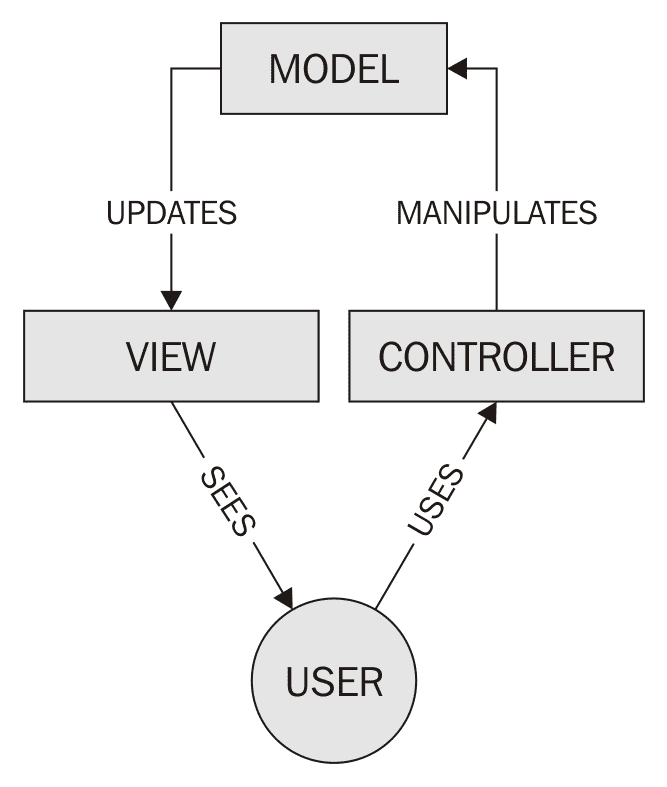

# MERN 栈简介

在本章中，我们将涵盖以下主题：

+   MVC 架构模式

+   安装和配置 MongoDB

+   安装 Node.js

+   安装 NPM 包

# 技术要求

您将需要拥有 IDE、Visual Studio Code、Node.js 和 MongoDB。您还需要安装 Git，以便使用本书的 Git 仓库。

本章的代码文件可以在 GitHub 上找到：

[`github.com/PacktPublishing/MERN-Quick-Start-Guide/tree/master/Chapter01`](https://github.com/PacktPublishing/MERN-Quick-Start-Guide/tree/master/Chapter01)

观看以下视频以查看代码的实际效果：

[`goo.gl/1zwc6F`](https://goo.gl/1zwc6F)

# 简介

MERN 栈是由四个主要组件组成的解决方案：

+   **MongoDB**: 使用文档型数据模型的数据库。

+   **ExpressJS**: 用于构建 Web 应用程序和 API 的 Web 应用程序框架。

+   **ReactJS**: 一个用于构建用户界面的声明式、基于组件和同构的 JavaScript 库。

+   **Node.js**: 基于 Chrome 的 V8 JavaScript 引擎构建的跨平台 JavaScript 运行时环境，允许开发者构建各种工具、服务器和应用程序。

构成 MERN 栈的这些基本组件是开源的，因此由一群优秀的开发者维护和开发。将这些组件联系在一起的是一种共同的语言，JavaScript。

本章的食谱将主要关注设置开发环境以与 MERN 栈一起工作。

您可以自由使用您选择的代码编辑器或 IDE。然而，如果您在选择 IDE 时遇到困难，我建议您尝试使用 Visual Studio Code。

# MVC 架构模式

大多数现代 Web 应用程序实现了 MVC 架构模式。它由三个相互连接的部分组成，这些部分将 Web 应用程序中信息的内部表示分离出来：

+   **模型（Model）**: 管理应用程序的业务逻辑，确定数据应该如何存储、创建和修改

+   **视图（View）**: 数据或信息的任何视觉表示

+   **控制器（Controller）**: 解析用户生成的事件，并将它们转换为模型和视图更新的命令：



**关注点分离（Separation of Concern**）(**SoC**) 设计模式将前端与后端代码分离。遵循 MVC 架构模式，开发者能够遵循 SoC 设计模式，从而实现一致且可管理的应用程序结构。

以下章节中的食谱实现了这种架构模式，以分离前端和后端。

# 安装和配置 MongoDB

官方 MongoDB 网站提供了包含用于在 Linux、OS X 和 Windows 上安装 MongoDB 的二进制文件的最新包。

# 准备工作

访问 MongoDB 的官方网站 [`www.mongodb.com/download-center`](https://www.mongodb.com/download-center)，选择 Community Server，然后选择您首选的操作系统版本的软件并下载它。

安装 MongoDB 并配置它可能需要额外的步骤。

# 如何操作...

访问 MongoDB 的文档网站 [`docs.mongodb.com/master/installation/`](https://docs.mongodb.com/master/installation/) 以获取说明，并在教程部分查找您特定平台的信息。

安装完成后，可以以独立方式启动 `mongod-`，这是 `MongoDB-` 的守护进程：

1.  打开一个新的终端

1.  创建一个名为 `data` 的新目录，该目录将包含 Mongo 数据库

1.  输入 `mongod --port 27017 --dbpath /data/` 以启动一个新的实例并创建一个数据库

1.  打开另一个终端

1.  输入 `mongo --port 27017` 以将 Mongo 壳连接到实例

# 更多...

作为一种替代方案，您可以选择使用 **数据库即服务**（**DBaaS**）如 MongoDB Atlas，在撰写本文时，它允许您创建一个包含 512 MB 存储空间的免费集群。另一个简单的替代方案是 mLab，尽管还有许多其他选项。

# 安装 Node.js

官方 Node.js 网站提供了两个包含 LTS 和 Current（包含最新功能）二进制的软件包，用于在 Linux、OS X 和 Windows 上安装 Node.js。

# 准备工作

为了本书的目的，我们将安装 Node.js v10.1.x 版本。

# 如何操作...

要下载 Node.js 的最新版本：

1.  访问 [`nodejs.org/en/download/`](https://nodejs.org/en/download/) 的官方网站

1.  选择“当前”|“最新功能”

1.  选择您首选平台或 **操作系统**（**OS**）的二进制文件

1.  下载并安装

如果您更喜欢通过包管理器安装 Node.js，请访问 [`nodejs.org/en/download/package-manager/`](https://nodejs.org/en/download/package-manager/) 并选择您首选的平台或 OS。

# 安装 npm 软件包

Node.js 的安装包括一个名为 `npm` 的包管理器，它是默认且最广泛使用的 JavaScript/Node.js 库安装包管理器。

NPM 软件包列在 [`registry.npmjs.org/`](https://registry.npmjs.org/) 的 NPM 注册表中，您可以在那里搜索软件包，甚至发布您自己的软件包。

除了 NPM 之外，还有其他替代方案，例如 Yarn，它与公共 NPM 注册表兼容。您可以使用您选择的任何包管理器；然而，为了本书的目的，菜谱中使用的包管理器将是 NPM。

# 准备工作

NPM 期望在您的 `project` 文件夹根目录下找到 `package.json` 文件。这是一个配置文件，用于描述您项目的详细信息，例如其依赖项、项目名称和项目作者。

在你能够在你项目中安装任何包之前，你必须创建一个`package.json`文件。以下是你通常需要遵循的创建项目的步骤：

1.  在你偏好的位置创建一个新的`project`文件夹，并将其命名为`mern-cookbook`或你选择的另一个名称。

1.  打开一个新的终端。

1.  将当前目录更改为你刚刚创建的新文件夹。这通常使用终端中的`cd`命令完成。

1.  运行`npm init`来创建一个新的`package.json`文件，按照终端中显示的步骤进行。

之后，你应该有一个`package.json`文件，其外观可能如下所示：

```js
{ 
    "name": "mern-cookbook", 
    "version": "1.0.0", 
    "description": "mern cookbook recipes", 
    "main": "index.js", 
    "scripts": { 
        "test": "echo \"Error: no test specified\" && exit 1" 
    }, 
    "author": "Eddy Wilson", 
    "license": "MIT" 
} 

```

在此之后，你将能够使用 NPM 为你的项目安装新的包。

# 如何操作...

1.  打开一个新的终端

1.  将当前目录更改为你新创建的`project`文件夹所在的位置

1.  运行以下行来安装`chalk`包：

```js
      npm --save-exact install chalk
```

现在，你将能够通过 Node.js 中的 require 在你的项目中使用这个包。通过以下步骤了解你可以如何使用它：

1.  创建一个名为`index.js`的新文件，并添加以下代码：

```js
      const chalk = require('chalk') 
      const { red, blue } = chalk 
      console.log(red('hello'), blue('world!')) 
```

1.  然后，打开一个新的终端并运行以下命令：

```js
 node index.js  
```

# 它是如何工作的...

NPM 将连接到 NPM 注册表并查找名为 react 的包，如果存在，则会下载并安装它。

以下是一些你可以与 NPM 一起使用的有用标志：

+   `--save`：这将安装并将包名和版本添加到你的`package.json`文件的`dependencies`部分。这些依赖项是在项目生产期间使用的模块。

+   `--save-dev`：这与`--save`标志的工作方式相同。它将在`package.json`文件的`devDependencies`部分安装并添加包名。这些依赖项是在项目开发期间使用的模块。

+   `--save-exact`：这保留了已安装包的原始版本。这意味着，如果你与他人共享你的项目，他们将能够安装与你使用的完全相同的包版本。

虽然这本书将为你提供在每个食谱中安装必要包的逐步指南，但你被鼓励访问 NPM 文档网站[`docs.npmjs.com/getting-started/using-a-package.json`](https://docs.npmjs.com/getting-started/using-a-package.json)[ ](https://docs.npmjs.com/getting-started/using-a-package.json)以了解更多信息。
