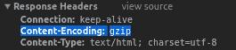
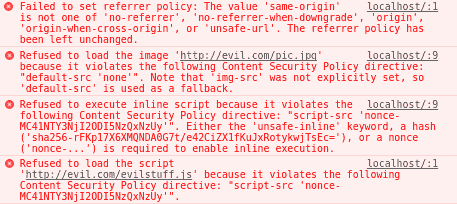

# 使用 ExpressJS 构建 Web 服务器

在本章中，我们将介绍以下食谱：

+   ExpressJS 中的路由

+   模块化路由处理程序

+   编写中间件函数

+   编写可配置的中间件函数

+   编写路由级别的中间件函数

+   编写错误处理中间件函数

+   使用 ExpressJS 内置的中间件函数来提供静态资源

+   解析 HTTP 请求体

+   压缩 HTTP 响应

+   使用 HTTP 请求记录器

+   管理和创建虚拟域名

+   使用 helmet 保护 ExpressJS Web 应用程序

+   使用模板引擎

+   调试你的 ExpressJS Web 应用程序

# 技术要求

你将需要有一个 IDE、Visual Studio Code、Node.js 和 MongoDB。你还需要安装 Git，以便使用本书的 Git 仓库。

本章的代码文件可以在 GitHub 上找到：

[`github.com/PacktPublishing/MERN-Quick-Start-Guide/tree/master/Chapter02`](https://github.com/PacktPublishing/MERN-Quick-Start-Guide/tree/master/Chapter02)

查看以下视频以查看代码的实际操作：

[`goo.gl/xXhqWK`](https://goo.gl/xXhqWK)

# 简介

ExpressJS 是构建健壮的 Web 应用程序和 API 的首选事实上的 Node.js Web 应用程序框架。

本章中的食谱将专注于构建一个功能齐全的 Web 服务器和了解核心基础。

# ExpressJS 中的路由

路由指的是当通过 HTTP 动词或 HTTP 方法请求资源时，应用程序如何响应或行动。

**HTTP** 代表 **超文本传输协议**，它是 **万维网**（**WWW**）数据通信的基础。万维网中的所有文档和数据都由一个 **统一资源定位符**（**URL**）标识。

HTTP 动词或 HTTP 方法是 *客户端-服务器* 模型。通常，网页浏览器充当 *客户端*，在我们的案例中，ExpressJS 是允许我们创建能够理解这些请求的 *服务器* 的框架。每个请求都期望发送一个响应到客户端，以便识别它所请求的资源的状态。

请求方法可以是：

+   **安全**：一个只执行服务器上的只读操作的 HTTP 动词。换句话说，它不会改变服务器状态。例如：`GET`。

+   **幂等**：当发送相同请求时，对服务器产生相同效果的 HTTP 动词。例如，发送一个 `PUT` 请求来修改用户的首名，如果正确实现，当发送多个相同请求时，应该在服务器上产生相同的效果。所有 *安全* 方法也都是幂等的。例如，`GET`、`PUT` 和 `DELETE` 方法都是幂等的。

+   **可缓存**: 可以缓存的 HTTP 响应。并非所有方法或 HTTP 动词都可以缓存。只有当响应的 *状态码* 和用于发出请求的方法都是可缓存的时，响应才是可缓存的。例如，GET 方法是可缓存的，以下状态码也可以缓存：`200`（请求成功）、`204`（无内容）、`206`（部分内容）、`301`（永久移动）、`404`（未找到）、`405`（方法不允许）、`410`（已删除或内容已从服务器永久删除）、`414`（URI 太长）。

# 准备工作

理解路由是构建健壮的 RESTful API 最重要的核心方面之一。

在本食谱中，我们将了解 ExpressJS 如何处理或解释 HTTP 请求。在开始之前，创建一个包含以下内容的 `package.json` 文件：

```js
{ 
    "dependencies": { 
        "express": "4.16.3" 
    } 
} 
```

然后，通过打开终端并运行以下命令来安装依赖项：

```js
    npm install

```

ExpressJS 执行理解客户端请求的全部工作。请求可能来自浏览器，例如。一旦请求被解释，ExpressJS 就将所有信息保存到两个对象中：

+   **请求**: 这包含有关客户端请求的所有数据和信息。例如，ExpressJS 解析 URI 并在 `request.query` 上提供其参数。

+   **响应**: 这包含将发送给客户端的数据和信息。在将信息发送给客户端之前，也可以修改响应的头部。`response` 对象有几种方法可用于向客户端发送状态码和数据。例如：`response.status(200).send('Some Data!')`。

# 如何操作...

`Request` 和 `Response` 对象作为参数传递给在 `route` 方法内部定义的 *路由处理程序*。

# 路由方法

这些是从 HTTP 动词或 HTTP 方法派生出来的。路由方法用于定义应用程序对特定 HTTP 动词的响应。

ExpressJS 路由方法具有与 HTTP 动词等效的名称。例如：`app.get()` 对应于 `GET` HTTP 动词，或 `app.delete()` 对应于 `DELETE` HTTP 动词。

一个非常基本的路由可以写成以下形式：

1.  创建一个名为 `1-basic-route.js` 的新文件

1.  首先包含 ExpressJS 库并初始化一个新的 ExpressJS 应用程序：

```js
      const express = require('express') 
      const app = express() 
```

1.  添加一个新的路由方法来处理对路径 `"/"` 的请求。第一个参数指定路径或 URL，下一个参数是路由处理程序。在路由处理程序内部，让我们使用 `response` 对象发送状态码 `200 (OK)` 和文本到客户端：

```js
      app.get('/', (request, response, nextHandler) => { 
          response.status(200).send('Hello from ExpressJS') 
      }) 
```

1.  最后，使用 `listen` 方法在端口 `1337` 上接受新的连接：

```js
      app.listen( 
         1337, 
          () => console.log('Web Server running on port 1337'), 
      ) 
```

1.  保存文件

1.  打开终端并运行以下命令：

```js
 node 1-basic-route.js 
```

1.  在浏览器中打开一个新标签页，并访问 `localhost` 端口 `1337` 以查看结果：

```js
      http://localhost:1337/
```

有关 ExpressJS 支持哪些 HTTP 方法的更多信息，请访问官方 ExpressJS 网站上的 [`expressjs.com/en/guide/routing.html#route-methods`](https://expressjs.com/en/guide/routing.html#route-methods)。

# 路由处理程序

路由处理器是接受三个参数的回调函数。第一个参数是 `request` 对象，第二个参数是 `response` 对象，最后一个参数是 `callback`，它将处理器传递给链中的下一个请求处理器。在路由方法内部也可以使用多个 `callback` 函数。

让我们看看如何在路由方法内部编写路由处理器的实际示例：

1.  创建一个名为 `2-route-handlers.js` 的新文件

1.  包含 ExpressJS 库，然后初始化一个新的 ExpressJS 应用程序：

```js
      const express = require('express') 
      const app = express() 
```

1.  添加两个路由方法来处理同一路径 `"/one"` 的请求。使用 `response` 对象的 `type` 方法设置发送给客户端的响应内容类型为 `text/plain`。使用 `write` 方法向客户端发送部分数据。要最终发送数据，请使用响应对象的 `end` 方法。调用 `nextHandler` 将处理器传递给链中的下一个处理器：

```js
      app.get('/one', (request, response, nextHandler) => { 
          response.type('text/plain') 
          response.write('Hello ') 
          nextHandler() 
      }) 
      app.get('/one', (request, response, nextHandler) => { 
         response.status(200).end('World!') 
      }) 
```

1.  向处理路径 `"/two"` 的请求的 `route` 方法添加一个 `route` 方法。在 `route` 方法内部定义了两个路由处理器来处理相同的请求：

```js
      app.get('/two', 
          (request, response, nextHandler) => { 
             response.type('text/plain') 
             response.write('Hello ') 
             nextHandler() 
         }, 
          (request, response, nextHandler) => { 
             response.status(200).end('Moon!') 
         } 
      ) 
```

1.  使用 `listen` 方法在端口 `1337` 上接受新的连接：

```js
      app.listen( 
         1337, 
         () => console.log('Web Server running on port 1337'), 
     ) 
```

1.  保存文件

1.  打开终端并运行：

```js
    node 2-route-handlers.js  
```

1.  要查看结果，请在您的网页浏览器中打开一个新标签页并访问：

```js
 http://localhost:1337/one http://localhost:1337/two  
```

# 链式路由方法

路由方法可以通过使用 `app.route(path)` 来实现链式调用，因为 `path` 是为单个位置指定的。当处理多个路由方法时，这可能是最佳方法，因为除了使代码更易读、减少错误和冗余外，它还允许同时使用多个路由方法。

1.  创建一个名为 `3-chainable-routes.js` 的新文件

1.  初始化一个新的 ExpressJS 应用程序：

```js
      const express = require('express') 
      const app = express() 
```

1.  使用 `route` 方法链式调用三个路由方法：

```js
      app 
      .route('/home') 
      .get((request, response, nextHandler) => { 
          response.type('text/html') 
          response.write('<!DOCTYPE html>') 
          nextHandler() 
      }) 
      .get((request, response, nextHandler) => { 
          response.end(` 
          <html lang="en"> 
              <head> 
              <meta charset="utf-8"> 
              <title>WebApp powered by ExpressJS</title> 
              </head> 
              <body role="application"> 
                  <form method="post" action="/home"> 
                      <input type="text" /> 
                      <button type="submit">Send</button> 
                  </form> 
              </body> 
          </html> 
          `) 
      }) 
      .post((request, response, nextHandler) => { 
          response.send('Got it!') 
      }) 
```

1.  使用 `listen` 方法在端口 `1337` 上接受新的连接：

```js
      app.listen( 
          1337, 
          () => console.log('Web Server running on port 1337'), 
      ) 
```

1.  保存文件

1.  打开终端并运行：

```js
 node 3-chainable-routes.js
```

1.  要查看结果，请在您的网页浏览器中打开一个新标签页并访问：

```js
      http://localhost:1337/home
```

# 还有更多...

路由路径可以是字符串或正则表达式。路由路径在内部使用 `path-to-regexp` NPM 包 [`www.npmjs.com/package/path-to-regexp`](https://www.npmjs.com/package/path-to-regexp) 转换为正则表达式。

`path-to-regexp` 以一种方式帮助您以更易读的方式编写路径正则表达式。例如，考虑以下代码：

```js
app.get(/([a-z]+)-([0-9]+)$/, (request, response, nextHandler) => { 
    response.send(request.params) 
}) 
// Output: {"0":"abc","1":"12345"} for path /abc-12345 
```

这可以写成如下形式：

```js
app.get('/:0-:1', (request, response, nextHandler) => { 
    response.send(request.params) 
}) 
// Outputs: {"0":"abc","1":"12345"} for /abc-12345 
```

或者更好：

```js
app.get('/:id-:tag', (request, response, nextHandler) => { 
    response.send(request.params) 
}) 
// Outputs: {"id":"abc","tag":"12345"} for /abc-12345 
```

看看这个表达式：`/([a-z]+)-([0-9]+)$/`。正则表达式中的括号被称为 **捕获括号**；当它们找到匹配项时，会记住它。在上面的例子中，对于 `abc-12345`，会记住两个字符串，`{"0":"abc","1":"12345"}`。这是 ExpressJS 找到匹配项、记住其值并将其与键关联的方式：

```js
app.get('/:userId/:action-:where', (request, response, nextHandler) => { 
    response.send(request.params) 
}) 
// Route path: /123/edit-profile 
// Outputs: {"userId":"123","action":"edit","where":"profile"} 
```

# 模块化路由处理器

ExpressJS 有一个内置的名为 **router** 的类。路由器只是一个允许开发者编写可挂载和模块化路由处理器的类。

**路由器**是 ExpressJS 核心路由系统的一个实例。这意味着，来自 ExpressJS 应用程序的所有路由方法都是可用的：

```js
const router = express.Router() 
router.get('/', (request, response, next) => { 
  response.send('Hello there!') 
}) 
router.post('/', (request, response, next) => { 
  response.send('I got your data!') 
}) 
```

# 准备工作

在这个菜谱中，我们将看到如何使用路由器来制作一个模块化应用程序。在你开始之前，创建一个包含以下内容的新的`package.json`文件：

```js
{ 
    "dependencies": { 
        "express": "4.16.3" 
    } 
} 
```

然后，通过打开终端并运行以下命令来安装依赖项：

```js
    npm install

```

# 如何操作...

假设你想要在你的 ExpressJS 主应用程序中编写一个模块化迷你应用程序，该应用程序可以被挂载到任何 URI。你想要能够选择挂载它的路径，或者你只是想要将相同的路由方法和处理程序挂载到其他几个路径或 URI。

1.  创建一个名为`modular-router.js`的新文件

1.  初始化一个新的 ExpressJS 应用程序：

```js
      const express = require('express') 
      const app = express() 
```

1.  为你的迷你应用程序定义一个路由器，并添加一个请求方法来处理对路径`"/home"`的请求：

```js
      const miniapp = express.Router() 
      miniapp.get('/home', (request, response, next) => { 
          const url = request.originalUrl 
          response 
              .status(200) 
              .send(`You are visiting /home from ${url}`) 
      }) 
```

1.  将你的模块化迷你应用程序挂载到`"/first"`路径，以及`"/second"`路径：

```js
      app.use('/first', miniapp) 
      app.use('/second', miniapp) 
```

1.  在端口`1337`上监听新连接：

```js
      app.listen( 
          1337, 
          () => console.log('Web Server running on port 1337'), 
      ) 
```

1.  保存文件

1.  打开终端并运行以下命令：

```js
 node modular-router.js
```

1.  要查看结果，请在你的网络浏览器中导航到：

```js
      http://localhost:1337/first/home
      http://localhost:1337/second/home
```

你将看到两个不同的输出：

```js
You are visting /home from /first/home 
You are visting /home from /second/home 
```

如所示，一个*路由器*被挂载到两个不同的挂载点。路由器通常被称为迷你应用程序，因为它们可以被挂载到 ExpressJS 应用程序的特定路由上，并且不仅一次，还可以多次挂载到不同的挂载点、路径或 URI。

# 编写中间件函数

中间件函数主要用于在`request`和`response`对象中进行更改。它们按顺序依次执行，但如果一个中间件函数没有将控制权传递给下一个函数，则请求将挂起。

# 准备工作

中间件函数具有以下签名：

```js
app.use((request, response, next) => { 
    next() 
}) 
```

签名与编写路由处理程序非常相似。实际上，可以为特定的 HTTP 方法和特定的路径路由编写一个中间件函数，例如，它看起来像这样：

```js
app.get('/', (request, response, next) => { 
    next() 
}) 
```

因此，如果你想知道路由处理程序和中间件函数之间的区别是什么，答案是简单的：它们的目的。

如果你正在编写路由处理程序，并且修改了`request`对象和/或`response`对象，那么你正在编写中间件函数。

在这个菜谱中，你将看到如何使用中间件函数来限制对某些路径或路由的访问，这些路径或路由依赖于某个条件。在你开始之前，创建一个包含以下内容的新的`package.json`文件：

```js
{ 
    "dependencies": { 
        "express": "4.16.3" 
    } 
} 
```

然后，通过打开终端并运行以下命令来安装依赖项：

```js
    npm install 
```

# 如何操作...

我们将编写一个中间件函数，该函数允许在查询参数`allowme`存在时仅访问根路径`"/"`：

1.  创建一个名为`middleware-functions.js`的新文件

1.  初始化一个新的 ExpressJS 应用程序：

```js
      const express = require('express') 
      const app = express() 
```

1.  编写一个中间件函数，该函数将`allowed`属性添加到`request`对象中：

```js
      app.use((request, response, next) => { 
          request.allowed = Reflect.has(request.query, 'allowme') 
          next() 
      }) 
```

1.  添加一个请求方法来处理对路径`"/"`的请求：

```js
      app.get('/', (request, response, next) => { 
          if (request.allowed) { 
              response.send('Hello secret world!') 
          } else { 
              response.send('You are not allowed to enter') 
          } 
      }) 
```

1.  在端口`1337`上监听新连接：

```js
      app.listen( 
          1337, 
          () => console.log('Web Server running on port 1337'), 
      ) 
```

1.  保存文件

1.  打开终端并运行：

```js
 node middleware-functions.js

```

1.  要查看结果，在你的网页浏览器中，导航到：

```js
http://localhost:1337/
      http://localhost:1337/?allowme
```

# 它是如何工作的...

就像处理路由处理程序一样，中间件函数需要将控制权传递给下一个处理程序；否则，我们的应用程序将会挂起，因为没有数据发送到客户端，连接也没有关闭。

如果在中间件函数内部的`request`或`response`对象中添加了新属性，下一个处理程序将能够访问这些新属性。就像我们之前编写的代码一样，`request`对象中的`allowed property`对下一个处理程序是可用的。

# 编写可配置的中间件函数

编写中间件函数的常见模式是将中间件函数包装在另一个函数中。这样做的结果是一个可配置的中间件函数。它们也是*高阶函数*，也就是说，一个返回另一个函数的函数。

```js
const fn = (options) => (response, request, next) => {  
    next()  
} 
```

通常，一个对象被用作`options`参数。然而，你完全可以用自己的方式来做。

# 准备工作

在这个菜谱中，你将编写一个可配置的日志中间件函数。在开始之前，创建一个新的`package.json`文件，内容如下：

```js
{ 
    "dependencies": { 
        "express": "4.16.3" 
    } 
} 
```

然后，通过打开终端并运行以下命令来安装依赖项：

```js
    npm install

```

# 如何做到这一点...

你的可配置中间件函数要执行的操作很简单：当发起请求时，它会打印状态码和 URL。

1.  创建一个名为`middleware-logger.js`的新文件

1.  导出一个接受一个对象作为第一个参数的函数。该函数期望对象具有一个名为`enable`的属性，可以是`true`或`false`：

```js
      const logger = (options) => (request, response, next) => { 
          if (typeof options === 'object' 
              && options !== null 
              && options.enable) { 
              console.log( 
                  'Status Code:', response.statusCode, 
                  'URL:', request.originalUrl, 
              ) 
          } 
          next() 
      } 
      module.exports = logger 
```

1.  保存文件

# 让我们测试一下...

我们的可配置中间件函数本身并没有什么用处。创建一个简单的 ExpressJS 应用程序来查看我们的中间件实际上是如何工作的：

1.  创建一个名为`configurable-middleware-test.js`的新文件

1.  包含我们的`middleware-logger.js`模块并初始化一个新的 ExpressJS 应用程序：

```js
       const express = require('express') 
       const loggerMiddleware = require('./middleware-logger') 
       const app = express() 
```

1.  使用`use`方法包含我们的可配置中间件函数。当`enable`属性设置为`true`时，你的日志记录器将工作并记录每个请求的状态码和 URL 到终端：

```js
      app.use(loggerMiddleware({ 
         enable: true, 
      })) 
```

1.  监听`1337`端口以接收新连接：

```js
      app.listen( 
           1337, 
           () => console.log('Web Server running on port 1337'), 
         ) 
```

1.  保存文件

1.  打开终端并运行：

```js
 node middleware-logger-test.js
```

1.  在你的浏览器中，导航到：

```js
      http://localhost:1337/hello?world
```

1.  终端应该显示：

```js
 Status Code: 200 URL: /hello?world
```

# 还有更多...

如果你想实验，将可配置中间件测试应用程序的`enable`属性设置为`false`。不应该显示任何日志。

通常，你希望在生产环境中禁用日志，因为这个操作可能会影响性能。

关闭所有日志的另一种方法是使用其他库来完成这项任务，而不是使用`console`。还有一些库允许你设置不同的日志级别，例如：

+   **调试模块**: [`www.npmjs.com/package/debug`](https://www.npmjs.com/package/debug)

+   **Winston**: [`www.npmjs.com/package/winston`](https://www.npmjs.com/package/winston)

日志记录有几个有用的原因。主要原因包括：

+   它检查您的服务是否正常运行，例如，检查您的应用程序是否连接到 MongoDB。

+   它发现错误和漏洞。

+   它有助于您更好地理解应用程序的工作方式。例如，如果您有一个模块化应用程序，您可以看到它如何与其他应用程序集成。

# 编写路由级别中间件函数

路由级别中间件函数仅在路由器内部执行。它们通常用于将中间件应用于仅挂载点或特定路径时。

# 准备工作

在这个菜谱中，您将创建一个小的日志记录路由级别中间件函数，该函数将仅记录挂载在路由器挂载路径或位于该路径中的请求。在开始之前，创建一个包含以下内容的新的 `package.json` 文件：

```js
{ 
    "dependencies": { 
        "express": "4.16.3" 
    } 
} 
```

然后，通过打开终端并运行以下命令来安装依赖项：

```js
npm install
```

# 如何做到这一点...

1.  创建一个名为 `router-level.js` 的新文件

1.  初始化一个新的 ExpressJS 应用程序并定义一个路由器：

```js
      const express = require('express') 
      const app = express() 
      const router = express.Router() 
```

1.  定义我们的日志记录中间件函数：

```js
      router.use((request, response, next) => { 
          console.log('URL:', request.originalUrl) 
          next() 
      }) 
```

1.  将路由器挂载到路径 `"/router"`

```js
      app.use('/router', router) 
```

1.  监听端口 `1337` 以便接收新的连接：

```js
     app.listen( 
         1337, 
       () => console.log('Web Server running on port 1337'), 
    ) 
```

1.  保存文件

1.  打开终端并运行：

```js
 node router-level.js
```

1.  在您的网页浏览器中导航到：

```js
 http://localhost:1337/router/example 
```

1.  终端应显示：

```js
 URL: /router/example
```

1.  然后，在您的网页浏览器中导航到：

```js
      http://localhost:1337/example
```

1.  终端中不应显示任何日志

# 还有更多...

通过调用 `next('router')`，可以在路由器外部将控制权交回下一个中间件函数或路由方法。

```js
router.use((request, response, next) => { 
  next('route') 
}) 
```

例如，通过创建一个期望接收用户 ID 作为查询参数的路由器。当未提供用户 ID 时，可以使用 `next('router')` 函数退出路由器或将控制权传递给路由器外部的下一个中间件函数。路由器外部的下一个中间件函数可以在路由器将控制权传递给它时显示其他信息。例如：

1.  创建一个名为 `router-level-control.js` 的新文件

1.  初始化一个新的 ExpressJS 应用程序：

```js
      const express = require('express') 
      const app = express() 
```

1.  定义一个新的路由器：

```js
      const router = express.Router() 
```

1.  在路由器内部定义我们的日志记录中间件函数：

```js
      router.use((request, response, next) => { 
         if (!request.query.id) { 
             next('router') // Next, out of Router 
          } else { 
            next() // Next, in Router 
          } 
      }) 
```

1.  向路由器外部添加一个路由方法来处理路径 `"/"` 的 `GET` 请求，该请求只有在中间件函数将控制权传递给它时才会执行：

```js
       router.get('/', (request, response, next) => { 
         const id = request.query.id 
         response.send(`You specified a user ID => ${id}`) 
      }) 
```

1.  向路由器外部添加一个路由方法来处理路径 `"/"` 的 `GET` 请求。然而，将路由器作为第二个参数包含在路由处理程序中，并添加另一个路由处理程序来处理相同的请求，只有当路由器将控制权传递给它时：

```js
      app.get('/', router, (request, response, next) => { 
          response 
            .status(400) 
            .send('A user ID needs to be specified') 
    }) 
```

1.  监听端口 `1337` 以便接收新的连接：

```js
      app.listen( 
          1337, 
          () => console.log('Web Server running on port 1337'), 
      ) 
```

1.  保存文件

1.  打开终端并运行：

```js
 node router-level-control.js
```

1.  要查看结果，请在浏览器中导航到：

```js
 http://localhost:1337/
      http://localhost:1337/?id=7331
```

# 它是如何工作的...

当导航到第一个 URL (`http://localhost:1337/`) 时，显示以下消息：

```js
 A user ID needs to be specified 
```

这是因为路由器中的中间件函数检查查询中是否提供了 `id`，因为它没有提供，所以它使用 `next('router')` 将控制权传递给路由器外部的下一个处理程序。

另一方面，当导航到第二个 URL ([`localhost:1337/?id=7331`](http://localhost:1337/?id=7331)) 时，显示以下消息：

```js
You specified a user ID => 7331 
```

这是因为在查询中提供了一个`id`，所以路由器中的中间件函数会通过`next()`将控制权传递给路由器内的下一个处理器。

# 编写错误处理程序中间件函数

ExpressJS 默认包含一个内置的错误处理程序，它在所有中间件和路由处理器结束时执行。

触发内置错误处理程序的方法有很多。一种是在路由处理器内部发生错误时的隐式触发。例如：

```js
app.get('/', (request, response, next) => { 
    throw new Error('Oh no!, something went wrong!') 
}) 
```

另一种触发内置错误处理程序的方式是在将`error`作为参数传递给`next(error)`时是明确的。例如：

```js
app.get('/', (request, response, next) => { 
    try { 
        throw new Error('Oh no!, something went wrong!') 
    } catch (error) { 
        next(error) 
    } 
}) 
```

栈跟踪会在客户端显示。如果`NODE_ENV`设置为生产环境，则不会包括栈跟踪。

可以编写一个自定义错误处理程序中间件函数，其外观与路由处理器非常相似，除了错误处理程序函数中间件期望接收四个参数：

```js
app.use((error, request, response, next) => { 
    next(error) 
}) 
```

考虑到`next(error)`是可选的。这意味着，如果指定了，`next(error)`将控制权传递给下一个错误处理程序。如果没有定义其他错误处理程序，则控制权将传递给内置错误处理程序。

# 准备工作

在这个菜谱中，我们将看到如何创建一个自定义错误处理程序。在你开始之前，创建一个包含以下内容的新的`package.json`文件：

```js
{ 
    "dependencies": { 
        "express": "4.16.3" 
    } 
} 
```

然后，通过打开终端并运行来安装依赖项：

```js
    npm install
```

# 如何操作...

你将构建一个自定义错误处理程序，将错误消息发送到客户端。

1.  创建一个名为`custom-error-handler.js`的新文件

1.  包含 ExpressJS 库，然后初始化一个新的 ExpressJS 应用程序：

```js
     const express = require('express') 
     const app = express() 
```

1.  定义一个新的路由方法来处理路径`"/"`的`GET`请求并每次都抛出错误：

```js
      app.get('/', (request, response, next) => { 
          try { 
             throw new Error('Oh no!, something went wrong!') 
          } catch (err) { 
             next(err) 
           } 
      }) 
```

1.  定义一个自定义错误处理程序中间件函数，将错误消息发送回客户端的浏览器：

```js
      app.use((error, request, response, next) => { 
          response.end(error.message) 
      }) 
```

1.  监听端口`1337`以接收新的连接：

```js
      app.listen( 
          1337, 
          () => console.log('Web Server running on port 1337'), 
      ) 
```

1.  保存文件

1.  打开终端并运行：

```js
 node custom-error-handler.js
```

1.  要查看结果，在你的网页浏览器中导航到：

```js
      http://localhost:1337/
```

# 使用 ExpressJS 内置的中间件函数来提供静态资源

在 ExpressJS 4.x 版本之前，它依赖于 ConnectJS，这是一个 HTTP 服务器框架[`github.com/senchalabs/connect`](https://github.com/senchalabs/connect)。实际上，为 ConnectJS 编写的几乎所有中间件在 ExpressJS 中也得到了支持。

从 ExpressJS 4.x 版本开始，它不再依赖于 ConnectJS，并且所有之前内置的中间件函数都被移动到了单独的模块[`expressjs.com/en/resources/middleware.html`](https://expressjs.com/en/resources/middleware.html)。

ExpressJS 4.x 及更高版本只包含两个内置中间件函数。第一个已经看到：内置错误处理程序中间件函数。第二个是负责提供静态资源的`express.static`中间件函数。

`express.static` 中间件函数基于 `serve-static` 模块 [`expressjs.com/en/resources/middleware/serve-static.html`](https://expressjs.com/en/resources/middleware/serve-static.html)。

`express.static` 和 `serve-static` 之间的主要区别在于后者可以在 ExpressJS 之外使用。

# 准备工作

在本教程中，您将了解如何构建一个将在特定路径下提供静态资源的 Web 应用程序。在开始之前，创建一个包含以下内容的 `package.json` 文件：

```js
{ 
    "dependencies": { 
        "express": "4.16.3" 
    } 
} 
```

然后，通过打开终端并运行以下命令来安装依赖项：

```js
npm install
```

# 如何操作...

1.  创建一个名为 `public` 的新目录

1.  进入新的 `public` 目录

1.  创建一个名为 `index.html` 的新文件

1.  添加以下代码：

```js
      <!DOCTYPE html> 
      <html lang="en"> 
      <head> 
          <meta charset="utf-8"> 
          <title>Simple Web Application</title> 
      </head> 
      <body> 
          <section role="application"> 
        <h1>Welcome Home!</h1> 
          </section> 
      </body> 
      </html> 
```

1.  保存文件

1.  从 `public` 目录中退出

1.  创建一个名为 `serve-static-assets.js` 的新文件：

1.  添加以下代码。初始化一个新的 ExpressJS 应用程序：

```js
      const express = require('express') 
      const path = require('path') 
      const app = express() 
```

1.  包含 `express.static` 可配置中间件函数，并传递包含 `index.html` 文件的 `/public` 目录的路径：

```js
      const publicDir = path.join(__dirname, './public') 
      app.use('/', express.static(publicDir)) 
```

1.  监听端口 `1337` 以便接受新的连接：

```js
      app.listen( 
          1337, 
          () => console.log('Web Server running on port 1337'), 
      ) 
```

1.  保存文件

1.  打开终端并运行：

```js
 node serve-static-assets.js
```

1.  要查看结果，请在浏览器中导航到：

```js
      http://localhost:1337/index.html
```

# 它是如何工作的...

我们的 `index.html` 文件将被显示，因为我们指定了 `"/"` 作为查找资源的根目录。

尝试将路径从 `"/"` 更改为 `"/public"`。然后，您将能够看到 `index.html` 文件，以及其他您想要包含在 `/public` 目录中的文件，它们将在 `http://localhost:1337/public/[fileName]` 下可访问。

# 还有更多...

假设你有一个大项目，该项目提供数十个静态文件，包括图像、字体文件和 PDF 文档（关于隐私和法律事宜的文件）等。你决定想要将它们保存在单独的文件中，但你不想更改挂载路径或 URI。它们可以位于 `/public` 下，例如，但它们将存在于项目目录中的单独目录中：

首先，让我们创建第一个 `public` 目录，它将包含一个名为 `index.html` 的单个文件：

1.  如果在之前的步骤中没有创建，请创建一个名为 `public` 的新目录：

1.  进入新的 `public` 目录

1.  创建一个名为 `index.html` 的新文件

1.  添加以下代码：

```js
      <!DOCTYPE html> 
      <html lang="en"> 
      <head> 
          <meta charset="utf-8"> 
          <title>Simple Web Application</title> 
      </head> 
      <body> 
           <section role="application"> 
           <h1>Welcome Home!</h1> 
           </section> 
      </body> 
      </html> 
```

1.  保存文件

现在，让我们创建第二个公共目录，它将包含另一个名为 `second.html` 的文件：

1.  从 `public` 目录中退出

1.  创建一个名为 `another-public` 的新目录

1.  进入新的 `another-public` 目录

1.  创建一个名为 `second.html` 的新空文件

1.  添加以下代码：

```js
      <!DOCTYPE html> 
      <html lang="en"> 
      <head> 
          <meta charset="utf-8"> 
          <title>Simple Web Application</title> 
      </head> 
     <body> 
          <section role="application"> 
           Welcome to Second Page! 
          </section> 
     </body> 
      </html> 
```

1.  保存文件

如您所见，这两个文件存在于不同的目录中。要在单个挂载点下提供这些文件，请执行以下操作：

1.  从 `another-public` 目录中退出

1.  创建一个名为 `router-serve-static.js` 的新文件：

1.  包含 ExpressJS 和 path 库。然后，初始化一个新的 ExpressJS 应用程序：

```js
      const express = require('express') 
      const path = require('path') 
      const app = express() 
```

1.  定义一个路由器：

```js
      const staticRouter = express.Router() 
```

1.  使用 `express.static` 可配置中间件函数包含两个目录，`public` 和 `another-public`：

```js
      const assets = { 
           first: path.join(__dirname, './public'), 
          second: path.join(__dirname, './another-public') 
      } 
       staticRouter 
          .use(express.static(assets.first)) 
          .use(express.static(assets.second)) 
```

1.  将路由器挂载到 `"/"` 路径：

```js
       app.use('/', staticRouter) 
```

1.  在端口 `1337` 上监听新的连接：

```js
      app.listen( 
          1337, 
           () => console.log('Web Server running on port 1337'), 
       ) 
```

1.  保存文件

1.  打开终端并运行：

```js
 node router-serve-static.js
```

1.  要查看结果，在浏览器中导航到：

```js
 http://localhost:1337/index.html
      http://localhost:1337/second.html
```

1.  在一个路径下为不同位置的两个不同文件提供服务

如果在不同目录下存在同名文件，客户端只会显示找到的第一个。

# 解析 HTTP 请求体

`body-parser` 是一个中间件函数，它解析传入的请求体，并将其作为 `request.body` 可用 [`expressjs.com/en/resources/middleware/body-parser.html`](https://expressjs.com/en/resources/middleware/body-parser.html)。

此模块允许应用程序将传入请求解析为：

+   JSON

+   文本

+   原始（缓冲原始传入数据）

+   URL 编码表单

当传入请求被压缩时，该模块支持自动解压缩 gzip 和 deflate 编码。

# 准备工作

在这个菜谱中，您将了解如何使用 `body-parser` NPM 模块解析来自两个不同表单的内容体，这两个表单以两种不同的方式编码。在开始之前，创建一个包含以下内容的新的 `package.json` 文件：

```js
{ 
    "dependencies": { 
        "body-parser": "1.18.2", 
        "express": "4.16.3" 
    } 
} 
```

然后，通过打开终端并运行以下命令来安装依赖项：

```js
npm install
```

# 如何做到这一点...

将向用户显示两个表单，它们都将以两种不同的方式将数据发送到我们的 Web 服务器应用程序。第一个是一个 URL 编码表单，而另一个将将其体编码为纯文本。

1.  创建一个名为 `parse-form.js` 的文件

1.  包含 `body-parser` NPM 模块。然后，初始化一个新的 ExpressJS 应用程序：

```js
      const express = require('express') 
      const bodyParser = require('body-parser') 
      const app = express() 
```

1.  包含 `body-parser` 中间件函数来处理 URL 编码请求和文本 plain 请求：

```js
       app.use(bodyParser.urlencoded({ extended: true })) 
       app.use(bodyParser.text()) 
```

1.  添加一个新的路由方法来处理 `"/"` 路径的 `GET` 请求。提供包含两个表单的 HTML 内容，这两个表单使用不同的编码提交数据：

```js
      app.get('/', (request, response, next) => { 
            response.send(` 
            <!DOCTYPE html> 
            <html lang="en"> 
            <head> 
              <meta charset="utf-8"> 
              <title>WebApp powered by ExpressJS</title> 
           </head> 
         <body> 
            <div role="application"> 
                <form method="post" action="/setdata"> 
                    <input name="urlencoded" type="text" /> 
                    <button type="submit">Send</button> 
                </form> 
               <form method="post" action="/setdata" 
                 enctype="text/plain"> 
                  <input name="txtencoded" type="text" /> 
                  <button type="submit">Send</button> 
               </form> 
           </div> 
        </body> 
        </html> 
       `) 
     }) 
```

1.  添加一个新的路由方法来处理 `"/setdata"` 路径的 `POST` 请求。在终端显示 `request.body` 的内容：

```js
      app.post('/setdata', (request, response, next) => { 
          console.log(request.body) 
          response.end() 
      }) 
```

1.  在端口 `1337` 上监听新的连接：

```js
      app.listen( 
          1337, 
          () => console.log('Web Server running on port 1337'), 
      ) 
```

1.  保存文件

1.  打开终端并运行：

```js
 node parse-form.js
```

1.  在您的网页浏览器中，导航到：

```js
      http://localhost:1337/
```

1.  在第一个输入框中填写任何数据并提交表单：

1.  在您的网页浏览器中，返回到：

```js
      http://localhost:1337/
```

1.  在第二个输入框中填写任何数据并提交表单：

1.  在终端中检查输出

# 它是如何工作的...

终端输出类似以下内容：

```js
{ 'urlencoded': 'Example' } 
txtencoded=Example 
```

上文使用了两个解析器：

1.  第一个解析器 `bodyParser.urlencoded()` 解析 `multipart/form-data` 编码类型的传入请求。结果作为 `Object` 可在 `request.body` 中访问

1.  第二个解析器 `bodyParser.text()` 解析 `text/plain` 编码类型的传入请求。结果作为 `String` 可在 `request.body` 中访问

# 压缩 HTTP 响应

**compression** 是一个中间件函数，它压缩将发送给客户端的响应体。此模块使用支持以下内容编码机制的 `zlib` 模块 [`nodejs.org/api/zlib.html`](https://nodejs.org/api/zlib.html)：

+   gzip

+   deflate

`Accept-Encoding` HTTP 响应头用于确定客户端（例如，网页浏览器）支持哪种内容编码机制，而 `Content-Encoding` HTTP 响应头用于告知客户端已应用于响应体的内容编码机制。

`compression` 是一个可配置的中间件函数。它接受一个 `options` 对象作为第一个参数，以定义中间件的具体行为，并传递 `zlib` 选项。

# 准备工作

在本食谱中，我们将了解如何配置和使用 `compression` NPM 模块来压缩发送给客户端的请求体。在开始之前，创建一个包含以下内容的新的 `package.json` 文件：

```js
{ 
    "dependencies": { 
        "compression": "1.7.2", 
        "express": "4.16.3" 
    } 
} 
```

然后，通过打开终端并运行以下命令来安装依赖项：

```js
    npm install
```

# 如何操作...

1.  创建一个名为 `compress-site.js` 的新文件

1.  包含 `compression` NPM 模块。然后，初始化一个新的 ExpressJS 应用程序：

```js
      const express = require('express') 
      const compression = require('compression') 
      const app = express() 
```

1.  包含 `compression` 中间件函数。指定压缩的 `level` 为 `9`（最佳压缩）和 `threshold`，或响应体应考虑压缩的最小字节数，为 `0` 字节：

```js
      app.use(compression({ level: 9, threshold: 0 })) 
```

1.  定义一个路由方法来处理路径 `"/"` 的 `GET` 请求，该方法将提供我们期望被压缩的样本 HTML 内容，并将打印客户端接受的编码：

```js
      app.get('/', (request, response, next) => { 
          response.send(` 
          <!DOCTYPE html> 
          <html lang="en"> 
          <head> 
              <meta charset="utf-8"> 
              <title>WebApp powered by ExpressJS</title> 
          </head> 
          <body> 
              <section role="application"> 
                  <h1>Hello! this page is compressed!</h1> 
              </section> 
          </body> 
         </html> 
          `) 
          console.log(request.acceptsEncodings()) 
     }) 
```

1.  监听端口 `1337` 以接收新的连接：

```js
      app.listen( 
          1337, 
          () => console.log('Web Server running on port 1337'), 
      ) 
```

1.  保存文件

1.  打开终端并运行：

```js
 node compress-site.js 
```

1.  在您的浏览器中，导航到：

```js
      http://localhost:1337/
```

# 它是如何工作的...

终端输出将显示客户端（例如，网页浏览器）支持的内容编码机制。它可能看起来像这样：

```js
 [ 'gzip', 'deflate', 'sdch', 'br', 'identity' ]

```

客户端发送的内容编码机制被 `compression` 内部使用，以确定是否支持压缩。如果不支持压缩，则不压缩响应体。

如果打开 Chrome 开发者工具或类似工具并分析请求，服务器发送的 `Content-Encoding` 响应头指示 `compression` 使用的编码机制。



Chrome 开发者工具 | 网络标签显示响应头

`compression` 库将 `Content-Encoding` 响应头设置为用于压缩响应体的编码机制。

`threshold` 选项默认设置为 1 KB，这意味着如果响应大小低于指定的字节数，则不进行压缩。将其设置为 `0` 或 `false` 以在大小低于 1 KB 时压缩响应。

# 使用 HTTP 请求记录器

如前所述，编写请求记录器很简单。然而，编写我们自己的可能需要宝贵的时间。幸运的是，还有其他几种替代方案。例如，一个非常流行的 HTTP 请求记录器是 morgan [`expressjs.com/en/resources/middleware/morgan.html`](https://expressjs.com/en/resources/middleware/morgan.html)。

**morgan** 是一个可配置的中间件函数，它接受两个参数 `format` 和 `options`，用于指定日志显示的格式以及需要显示的信息类型。

有几种预定义的格式：

+   `tiny`: 最小输出

+   `short`: 与 `tiny` 相同，包括远程 IP 地址

+   `common`: 标准的 Apache 日志输出

+   `combined`: 标准的 Apache 合并日志输出

+   `dev`: 显示与 `tiny` 格式相同的信息。然而，响应状态是彩色的。

# 准备中

创建一个包含以下内容的 `package.json` 文件：

```js
{ 
    "dependencies": { 
        "express": "4.16.3", 
        "morgan": "1.9.0" 
    } 
} 
```

然后，通过打开终端并运行以下命令来安装依赖项：

```js
npm install
```

# 如何操作...

让我们构建一个工作示例。我们将包含具有 `dev` 格式的 **morgan** 可配置中间件函数来显示每个请求的信息。

1.  创建一个名为 `morgan-logger.js` 的新文件

1.  初始化一个新的 ExpressJS 应用程序：

```js
      const express = require('express') 
      const morgan = require('morgan') 
      const app = express() 
```

1.  包含可配置的 `morgan` 中间件。将 `'dev'` 作为我们将用作中间件函数的第一个参数的格式：

```js
      app.use(morgan('dev')) 
```

1.  定义一个路由方法来处理所有 `GET` 请求：

```js
      app.get('*', (request, response, next) => { 
          response.send('Hello Morgan!') 
      }) 
```

1.  监听端口 `1337` 以接收新连接：

```js
      app.listen( 
          1337, 
          () => console.log('Web Server running on port 1337'), 
     ) 
```

1.  保存文件

1.  打开终端并运行：

```js
 node morgan-logger.js
```

1.  要在终端中查看结果，请在您的网络浏览器中导航到：

```js
        http://localhost:1337/
        http://localhost:1337/example
```

# 管理和创建虚拟域名

使用 ExpressJS 管理虚拟域名非常简单。想象一下，你有两个或更多子域名，并且你想要提供两个不同的网络应用程序。然而，你不想为每个子域名创建不同的网络服务器应用程序。在这种情况下，ExpressJS 允许开发者在单个网络服务器应用程序内使用 **vhost** [`expressjs.com/en/resources/middleware/vhost.html`](https://expressjs.com/en/resources/middleware/vhost.html) 来管理虚拟域名。

**vhost** 是一个可配置的中间件函数，它接受两个参数。第一个参数是 `hostname`。第二个参数是当 `hostname` 匹配时将被调用的请求处理器。

`hostname` 遵循与路由路径相同的规则。它们可以是字符串或正则表达式。

# 准备中

创建一个包含以下内容的 `package.json` 文件：

```js
{ 
    "dependencies": { 
        "express": "4.16.3", 
        "vhost": "3.0.2" 
    } 
} 
```

然后，通过打开终端并运行以下命令来安装依赖项：

```js
npm install
```

# 如何操作...

使用 **Router** 构建 two 个微型应用程序，它们将在两个不同的子域名中提供：

1.  创建一个名为 `virtual-domains.js` 的新文件

1.  包含 `vhost` NPM 模块。然后，初始化一个新的 ExpressJS 应用程序：

```js
      const express = require('express') 
      const vhost = require('vhost') 
      const app = express() 
```

1.  定义两个我们将使用来构建两个微型应用程序的路由器：

```js
      const app1 = express.Router() 
      const app2 = express.Router() 
```

1.  在第一个路由器中添加一个路由方法来处理路径 `"/"` 的 `GET` 请求：

```js
      app1.get('/', (request, response, next) => { 
        response.send('This is the main application.') 
      }) 
```

1.  在第二个路由器中添加一个路由方法来处理路径 `"/"` 的 `GET` 请求：

```js
      app2.get('/', (request, response, next) => { 
         response.send('This is a second application.') 
     }) 
```

1.  将我们的路由器挂载到我们的 ExpressJS 应用程序上。在 `localhost` 下提供第一个应用程序，在 `second.localhost` 下提供第二个应用程序：

```js
      app.use(vhost('localhost', app1)) 
      app.use(vhost('second.localhost', app2)) 
```

1.  在端口 `1337` 上监听新连接：

```js
      app.listen( 
         1337, 
         () => console.log('Web Server running on port 1337'), 
     ) 
```

1.  保存文件

1.  打开终端并运行：

```js
      node virtual-domains.js 
```

1.  要查看结果，请在您的网页浏览器中导航到：

```js
        http://localhost:1337/
        http://second.localhost:1337/
```

# 还有更多...

`vhost` 将一个 `vhost 对象` 添加到 `request` 对象中，该对象包含完整的域名（显示域名和端口）、域名（不带端口）和匹配字符串。这为您提供了更多控制虚拟域处理方式的能力。

例如，我们可以编写一个应用程序，允许用户拥有以他们名字为子域：

1.  创建一个名为 `user-subdomains.js` 的新文件

1.  包含 `vhost` NPM 模块。然后，初始化一个新的 ExpressJS 应用程序：

```js
      const express = require('express') 
      const vhost = require('vhost') 
      const app = express() 
```

1.  定义一个新的路由器。然后，添加一个路由方法来处理路径 `"/"` 上的 `GET` 请求。使用 `vhost` 对象访问子域数组：

```js
       const users = express.Router() 
       users.get('/', (request, response, next) => { 
        const username = request 
            .vhost[0] 
            .split('-') 
            .map(name => ( 
                name[0].toUpperCase() + 
                name.slice(1) 
             )) 
            .join(' ') 
        response.send(`Hello, ${username}`) 
     }) 
```

1.  挂载路由器：

```js
       app.use(vhost('*.localhost', users)) 
```

1.  在端口 `1337` 上监听新连接：

```js
      app.listen( 
           1337, 
          () => console.log('Web Server running on port 1337'), 
      ) 
```

1.  保存文件

1.  打开终端并运行：

```js
      node user-subdomains.js 
```

1.  要查看结果，请在您的网页浏览器中导航到：

```js
        http://john-smith.localhost:1337/
        http://jx-huang.localhost:1337/
        http://batman.localhost:1337/
```

# 使用 Helmet 保护 ExpressJS 网络应用程序

**Helmet** 允许保护网络服务器应用程序免受常见攻击，例如 **跨站脚本 (XSS**)、不安全的请求和点击劫持。

Helmet 是一组 12 个中间件函数，允许您设置特定的 HTTP 头部：

1.  `内容安全策略 (Content Security Policy, CSP)`: 这是允许在您的网络应用程序中允许外部资源（如 JavaScript、CSS 和图像）的一种有效方式。

1.  `证书透明度 (Certificate Transparency)`: 这是为特定域名或特定域名颁发的证书提供更多透明度的一种方式 [`sites.google.com/a/chromium.org/dev/Home/chromium-security/certificate-transparency`](https://sites.google.com/a/chromium.org/dev/Home/chromium-security/certificate-transparency)。

1.  `DNS 预取控制 (DNS Prefetch Control)`: 这告诉浏览器是否应该对尚未加载的资源（如链接）执行域名解析（DNS）。

1.  `Frameguard`: 这通过告诉浏览器不允许您的网络应用程序被放入 `iframe` 中来帮助防止 **点击劫持**。

1.  `隐藏 Powered-By`: 这只是隐藏了指示不显示服务器所使用技术的 `X-Powered-By` 头部。ExpressJS 默认将其设置为 `"Express"`。

1.  `HTTP 公钥固定 (Public Key Pinning)`: 这通过将您的网络应用程序的公钥固定到 `Public-Key-Pins` 头部来帮助防止 **中间人攻击**。

1.  `HTTP 严格传输安全 (Strict Transport Security)`: 这告诉浏览器严格坚持您的网络应用程序的 HTTPs 版本。

1.  `IE 无打开 (IE No Open)`: 这防止了 Internet Explorer 在您的站点上下文中执行不受信任的下载或 HTML 文件，从而防止恶意脚本的注入。

1.  `无缓存 (No Cache)`: 这告诉浏览器禁用浏览器缓存。

1.  `不要嗅探 MIME 类型`：这强制浏览器禁用 MIME 嗅探或猜测服务文件的类型。

1.  `Referrer Policy`：引用头提供了关于请求来源的数据给服务器。它允许开发者禁用它，或为设置 `referrer` 头设置更严格的策略。

1.  `XSS Filter`：通过设置 `X-XSS-Protection` 头来防止反射型跨站脚本（XSS）攻击。

# 准备工作

在这个菜谱中，我们将使用 Helmet 提供的大多数中间件函数来保护我们的 ExpressJS 网络应用程序免受常见攻击。在开始之前，创建一个包含以下内容的新的 `package.json` 文件：

```js
{ 
    "dependencies": { 
        "body-parser": "1.18.2", 
        "express": "4.16.3", 
        "helmet": "3.12.0", 
        "uuid": "3.2.1" 
    } 
} 
```

然后，通过打开终端并运行以下命令来安装依赖项：

```js
npm install
```

# 如何做到这一点...

1.  创建一个名为 `secure-helmet.js` 的新文件：

1.  包含 ExpressJS、helmet 和 body NPM 模块：

```js
      const express = require('express') 
      const helmet = require('helmet') 
      const bodyParser = require('body-parser') 
      const uuid = require('uuid/v1') 
      const app = express() 
```

1.  生成一个随机 ID，该 ID 将用于 `nonce`，这是一个用于白名单的 HTML 属性，用于指定哪些脚本或样式允许在 HTML 代码中内联执行：

```js
      const suid = uuid() 
```

1.  使用 body parser 解析 `json` 和 `application/csp-report` 内容类型的 JSON 请求体。`application/csp-report` 是一种包含类型为 `json` 的 JSON 请求体的内容类型，当浏览器违反一个或多个 CSP 规则时，浏览器会发送它：

```js
      app.use(bodyParser.json({ 
          type: ['json', 'application/csp-report'], 
      })) 
```

1.  使用 `Content Security Policy` 中间件函数来定义指令。`defaultSrc` 指定资源可以从中加载的位置。`self` 选项指定只从自己的域名加载资源。我们将使用 `none`，这意味着不会加载任何资源。然而，因为我们正在白名单 `scriptSrc`，我们将能够加载 JavaScript 脚本，但仅限于我们指定的 `nonce` 的那些脚本。`reportUri` 用于告诉浏览器将我们的 `Content Security Policy` 违规报告发送到何处：

```js
      app.use(helmet.contentSecurityPolicy({ 
          directives: { 
              // By default do not allow unless whitelisted 
              defaultSrc: [`'none'`], 
               // Only allow scripts with this nonce 
              scriptSrc: [`'nonce-${suid}'`], 
              reportUri: '/csp-violation', 
          } 
      })) 
```

1.  添加一个路由方法来处理路径 `"/csp-violation"` 的 `POST` 请求，以接收来自客户端的违规报告：

```js
      app.post('/csp-violation', (request, response, next) => { 
          const { body } = request 
          if (body) { 
             console.log('CSP Report Violation:') 
             console.dir(body, { colors: true, depth: 5 }) 
         } 
         response.status(204).send() 
      }) 
```

1.  使用 `DNS Prefetch Control` 中间件来禁用资源的预取：

```js
      app.use(helmet.dnsPrefetchControl({ allow: false })) 
```

1.  使用 `Frameguard` 中间件函数来禁用应用程序在 `iframe` 中加载：

```js
      app.use(helmet.frameguard({ action: 'deny' })) 
```

1.  使用 `hidePoweredBy` 中间件函数来替换 `X-Powered-By` 头并设置一个假的头：

```js
      app.use(helmet.hidePoweredBy({ 
          setTo: 'Django/1.2.1 SVN-13336', 
      })) 
```

1.  使用 `ieNoOpen` 中间件函数来禁用 IE 不受信任的执行：

```js
       app.use(helmet.ieNoOpen()) 
```

1.  使用 `noSniff` 中间件函数来禁用 MIME 类型猜测：

```js
      app.use(helmet.noSniff()) 
```

1.  使用 `referrerPolicy` 中间件函数使头仅对我们自己的域名可用：

```js
       app.use(helmet.referrerPolicy({ policy: 'same-origin' })) 
```

1.  使用 `xssFilter` 中间件函数来防止反射型 XSS 攻击：

```js
      app.use(helmet.xssFilter()) 
```

1.  添加一个路由方法来处理路径 `"/"` 的 `GET` 请求，并服务一个示例 HTML 内容，该内容将尝试从外部源加载图像，尝试执行内联脚本，并尝试加载未指定 `nonce` 的外部脚本。我们还将添加一个有效的脚本，该脚本允许执行，因为将指定一个 `nonce` 属性：

```js
      app.get('/', (request, response, next) => { 
         response.send(` 
         <!DOCTYPE html> 
         <html lang="en"> 
         <head> 
             <meta charset="utf-8"> 
             <title>Web App</title> 
         </head> 
          <body> 
             <span id="txtlog"></span> 
               
             <script> 
                  alert('This does not get executed!') 
              </script> 
              <script src="img/evilstuff.js"></script> 
              <script nonce="${suid}"> 
                  document.getElementById('txtlog') 
                    .innerText = 'Hello World!' 
              </script> 
           </body> 
         </html> 
       `) 
     }) 
```

1.  监听端口 `1337` 以接收新的连接：

```js
     app.listen( 
          1337, 
         () => console.log('Web Server running on port 1337'), 
      ) 
```

1.  保存文件

1.  打开终端并运行：

```js
      node secure-helmet.js 
```

1.  要查看结果，在你的网页浏览器中，导航到：

```js
        http://localhost:1337/
```

# 它是如何工作的...

使用 `Helmet`，一切的工作原理都非常直观。你通过选择并应用特定的 `Helmet` 中间件函数来指定你想要实施的安全措施，然后 `Helmet` 将负责设置正确的头信息并发送到客户端。

在客户端（网页浏览器）中，一切都会自动工作。浏览器负责解释服务器发送的头信息并应用安全策略。这也意味着，如果你的应用考虑了安全性，那么没有太多理由要支持旧版浏览器。

例如，如果你使用的是 Chrome，你应该能在控制台看到类似以下的内容：



Chrome 开发者工具 | 显示 CSP 违规的控制台

1.  在终端中，你应该能看到浏览器发送的类似以下输出：

```js
      CSP Report Violation: { 
          "csp-report": { 
               "document-uri": "http://localhost:1337/", 
              "referrer": "", 
              "violated-directive": "img-src", 
              "effective-directive": "img-src", 
              "original-policy": "default-src 'none'; script-src              
         '[nonce]'; report-uri /csp-violation", 
              "disposition": "enforce", 
              "blocked-uri": "http://evil.com/pic.jpg", 
              "line-number": 9, 
              "source-file": "http://localhost:1337/", 
              "status-code": 200 
          } 
      }  
      CSP Report Violation: { 
          "csp-report": { 
              "document-uri": "http://localhost:1337/", 
              "referrer": "", 
              "violated-directive": "script-src", 
              "effective-directive": "script-src", 
              "original-policy": "default-src 'none'; script-src        
       '[nonce]'; report-uri /csp-violation", 
              "disposition": "enforce", 
              "blocked-uri": "inline", 
              "line-number": 9, 
              "status-code": 200 
          } 
      }  
      CSP Report Violation: { 
          "csp-report": { 
              "document-uri": "http://localhost:1337/", 
              "referrer": "", 
              "violated-directive": "script-src", 
              "effective-directive": "script-src", 
              "original-policy": "default-src 'none'; script-src 
      '[nonce]'; report-uri /csp-violation", 
              "disposition": "enforce", 
              "blocked-uri": "http://evil.com/evilstuff.js", 
              "status-code": 200 
          } 
      } 
```

# 使用模板引擎

模板引擎允许你以更方便的方式生成 HTML 代码。模板或视图可以以任何格式编写，由模板引擎进行解释，将变量替换为其他值，最终转换为 HTML。

一份包含与 ExpressJS 兼容的模板引擎的大列表，可在官方网站 [`github.com/expressjs/express/wiki#template-engines`](https://github.com/expressjs/express/wiki#template-engines) 上找到。

# 准备工作

在这个菜谱中，你将构建自己的模板引擎。为了开发和使用自己的模板引擎，你首先需要注册它，然后定义视图所在的位置，最后告诉 ExpressJS 使用哪个模板引擎。

```js
      app.engine('...', (path, options, callback) => { ... }); 
      app.set('views', './'); 
      app.set('view engine', '...'); 
```

在开始之前，创建一个包含以下内容的新的 `package.json` 文件：

```js
      { 
          "dependencies": { 
              "express": "4.16.3" 
          } 
      } 
```

然后，通过打开终端并运行以下命令来安装依赖项：

```js
       npm install
```

# 如何实现...

首先创建一个包含简单模板的 `views` 目录：

1.  创建一个名为 `views` 的新目录

1.  在我们的 `views` 目录内创建一个名为 `home.tpl` 的新文件

1.  添加以下代码：

```js
      <!DOCTYPE html> 
       <html lang="en"> 
      <head> 
          <meta charset="utf-8"> 
          <title>Using Template Engines</title> 
      </head> 
      <body> 
          <section role="application"> 
              <h1>%title%</h1> 
              <p>%description%</p> 
          </section> 
      </body> 
      </html> 
```

1.  保存文件

现在，创建一个新的模板引擎，它将转换之前的模板为 HTML，并将 `%[var]%` 替换为提供的选项：

1.  离开 `views` 目录

1.  创建一个名为 `my-template-engine.js` 的新文件

1.  包含 ExpressJS 和 fs（文件系统）库。然后，初始化一个新的 ExpressJS 应用程序：

```js
      const express = require('express') 
      const fs = require('fs') 
      const app = express() 
```

1.  使用 `engine` 方法注册一个名为 `tpl` 的新模板引擎。我们将读取文件内容，并将 `%[var]%` 替换为 `options` 对象中指定的值：

```js
       app.engine('tpl', (filepath, options, callback) => { 
           fs.readFile(filepath, (err, data) => { 
              if (err) { 
                 return callback(err) 
             } 
             const content = data 
                 .toString() 
                 .replace(/%[a-z]+%/gi, (match) => { 
                     const variable = match.replace(/%/g, '') 
                    if (Reflect.has(options, variable)) { 
                        return options[variable] 
                     } 
                    return match 
                }) 
              return callback(null, content) 
          }) 
     }) 
```

1.  定义视图所在的位置。我们的模板位于 `views` 目录中：

```js
       app.set('views', './views') 
```

1.  告诉 ExpressJS 使用我们的模板引擎：

```js
      app.set('view engine', 'tpl') 
```

1.  添加一个路由方法来处理路径 `"/"` 的 `GET` 请求并渲染我们的主页模板。提供 `title` 和 `description` 选项，它们将替换模板中的 `%title%` 和 `%description%`：

```js
     app.get('/', (request, response, next) => { 
          response.render('home', { 
              title: 'Hello', 
               description: 'World!', 
         }) 
      }) 
```

1.  监听端口 `1337` 以便接收新的连接：

```js
      app.listen( 
          1337, 
          () => console.log('Web Server running on port 1337'), 
      ) 
```

1.  保存文件

1.  打开终端并运行：

```js
    node my-template-engine.js
```

1.  在您的浏览器中，导航到：

```js
      http://localhost:1337/
```

我们刚刚编写的模板引擎不会转义 HTML 字符。这意味着，如果您用从客户端获取的数据替换这些属性，可能会容易受到 XSS 攻击。您可能想使用来自官方 ExpressJS 网站的模板引擎，它更安全。

# 调试 ExpressJS 网络应用程序

关于 ExpressJS 中网络应用程序整个周期的调试信息是简单的。ExpressJS 使用内部 **debug** NPM 模块来记录信息。与 `console.log` 不同，**debug** 日志可以在生产模式下轻松禁用。

# 准备工作

在这个菜谱中，您将了解如何调试您的 ExpressJS 网络应用程序。在您开始之前，创建一个包含以下内容的新的 `package.json` 文件：

```js
{ 
    "dependencies": { 
        "debug": "3.1.0", 
        "express": "4.16.3" 
    } 
} 
```

然后，通过打开终端并运行来安装依赖项：

```js
npm install
```

# 如何做到这一点...

1.  创建一个名为 `debugging.js` 的新文件

1.  初始化一个新的 ExpressJS 应用程序：

```js
      const express = require('express') 
      const app = express() 
```

1.  为任何路径添加处理 `GET` 请求的路由方法：

```js
      app.get('*', (request, response, next) => { 
          response.send('Hello there!') 
      }) 
```

1.  监听端口 `1337` 以便接收新的连接：

```js
      app.listen( 
          1337, 
          () => console.log('Web Server running on port 1337'), 
      ) 
```

1.  保存文件

1.  打开终端并运行：

1.  在 Windows 上：

```js
 set DEBUG=express:* node debugging.js
```

1.  在 Linux 或 MacOS 上：

```js
 DEBUG=express:* node debugging.js 

```

1.  在您的网络浏览器中，导航到：

```js
      http://localhost:1337/
```

1.  观察您的终端输出以获取日志

# 它是如何工作的...

使用 `DEBUG` 环境变量来告知 **debug** 模块要调试 ExpressJS 应用程序的哪些部分。在我们之前编写的代码中，`express:*` 告诉 debug 模块记录与 express 应用程序相关的所有内容。

我们可以使用 `DEBUG=express:router` 来显示与 ExpressJS 的 Router 或路由相关的日志。

# 还有更多...

您可以在自己的项目中使用 debug NPM 模块。例如：

1.  创建一个名为 `myapp.js` 的新文件

1.  添加以下代码：

```js
      const express = require('express') 
      const app = express() 
      const debug = require('debug')('myapp') 
      app.get('*', (request, response, next) => { 
          debug('Request:', request.originalUrl) 
          response.send('Hello there!') 
      }) 
      app.listen( 
          1337, 
          () => console.log('Web Server running on port 1337'), 
      ) 
```

1.  保存文件

1.  打开终端并运行：

1.  在 Windows 上：

```js
    set DEBUG=myapp node myapp.js
```

1.  在 Linux 和 MacOS 上：

```js
 DEBUG=myapp node myapp.js
```

1.  在您的网络浏览器中，导航到：

1.  观察您的终端输出。它将显示类似以下内容：

```js
      Web Server running on port 1337 
        myapp Request: / +0ms 
```

您可以使用 `DEBUG` 环境变量来告知 `debug` 模块显示日志，不仅限于 `myapp`，还包括 ExpressJS，如下所示：

在 Windows 上：

```js
set DEBUG=myapp,express:* node myapp.js 
```

在 Linux 和 MacOS 上：

```js
DEBUG=myapp,express:* node myapp.js
```
